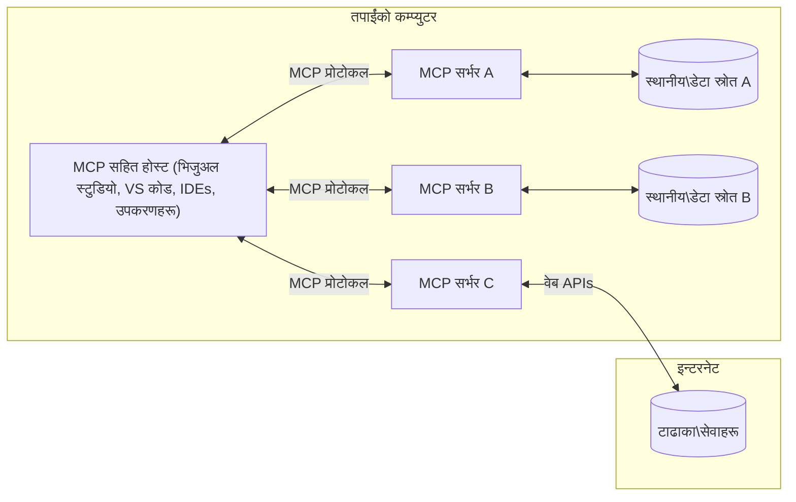

# MCP कोर अवधारणाहरू: AI एकीकरणका लागि मोडेल कन्टेक्स्ट प्रोटोकलमा महारत हासिल गर्नुहोस्

[](https://youtu.be/earDzWGtE84)

_(यो पाठको भिडियो हेर्न माथिको चित्रमा क्लिक गर्नुहोस्)_

[Model Context Protocol (MCP)](https://github.com/modelcontextprotocol) एक शक्तिशाली, मानकीकृत ढाँचा हो जसले ठूलो भाषा मोडेलहरू (LLMs) र बाह्य उपकरणहरू, अनुप्रयोगहरू, र डाटा स्रोतहरू बीच सञ्चारलाई अनुकूलित गर्दछ।  
यो मार्गदर्शकले तपाईंलाई MCP का कोर अवधारणाहरू मार्फत लैजान्छ। तपाईंले यसको क्लाइन्ट-सर्भर वास्तुकला, आवश्यक Components, सञ्चार प्रक्रिया, र लागू गर्ने उत्कृष्ट अभ्यासहरूका बारेमा जान्नुहुनेछ।

- **स्पष्ट प्रयोगकर्ता सहमति**: सबै डाटा पहुँच र सञ्चालनहरू कार्यान्वयन भन्दा पहिले स्पष्ट प्रयोगकर्ता अनुमोदन आवश्यक छ। प्रयोगकर्ताहरूले के डाटा पहुँच गरिनेछ र के क्रियाहरू सञ्चालन गरिनेछ भन्ने स्पष्ट रूपमा बुझ्नुपर्नेछ, अनुमतिहरू र अधिकृतताहरूमा सूक्ष्म नियन्त्रणको साथ।

- **डेटा गोपनीयता सुरक्षागर्दै**: प्रयोगकर्ताको डाटा केवल स्पष्ट सहमतिका साथ मात्र प्रकट हुन्छ र सम्पूर्ण अन्तरक्रियाको जीवनी चक्रमा कडा पहुँच नियन्त्रणबाट सुरक्षा गरिनु पर्छ। कार्यान्वयनहरूले अनाधिकृत डाटा प्रसारण रोक्न र कडा गोपनीयता सीमाहरू कायम राख्नुपर्नेछ।

- **उपकरण सञ्चालन सुरक्षा**: प्रत्येक उपकरण चलाउने कार्यमा स्पष्ट प्रयोगकर्ता सहमति आवश्यक हुन्छ जसले उपकरणको कार्यक्षमता, प्यारामिटरहरू, र सम्भावित प्रभावलाई स्पष्ट रूपमा बुझ्ने व्यवस्था गर्दछ। कडा सुरक्षा सीमाहरूले अवाञ्छित, असुरक्षित, वा दुष्ट उपकरण सञ्चालनलाई रोक्नुपर्नेछ।

- **ट्रान्सपोर्ट लेयर सुरक्षा**: सबै सञ्चार च्यानलहरूले उपयुक्त इन्क्रिप्सन र प्रमाणीकरण संयन्त्रहरू प्रयोग गर्नुपर्नेछ। रिमोट जडानहरूले सुरक्षित ट्रान्सपोर्ट प्रोटोकलहरू र उचित प्रमाणपत्र व्यवस्थापन कार्यान्वयन गर्नुपर्नेछ।

#### कार्यान्वयन दिशानिर्देशहरू:

- **अनुमति व्यवस्थापन**: प्रयोगकर्ताहरूलाई कुन सर्भरहरू, उपकरणहरू, र स्रोतहरू पहुँचयोग्य छन् भनेर नियन्त्रण गर्न सक्ने सूक्ष्म अनुमतिपूर्ण प्रणालीहरू लागू गर्नुहोस्  
- **प्रमाणीकरण र अधिकृतता**: सुरक्षित प्रमाणीकरण विधिहरू (OAuth, API कीहरू) उपयुक्त टोकन व्यवस्थापन र समाप्तिका साथ प्रयोग गर्नुहोस्  
- **इनपुट मान्यता**: इन्जेक्सन आक्रमण रोक्न परिभाषित स्किमाहरू अनुसार सबै प्यारामिटर र डाटा इनपुटहरू मान्यता गर्नुहोस्  
- **अडिट लगिङ्ग**: सुरक्षा अनुगमन र अनुपालनका लागि सबै अपरेसनहरूको विस्तृत लगहरू राख्नुहोस्

## अवलोकन

यो पाठले Model Context Protocol (MCP) इकोसिस्टमको आधारभूत वास्तुकला र घटकहरूको अन्वेषण गर्छ। तपाईंले क्लाइन्ट-सर्भर वास्तुकला, मुख्य घटकहरू, र MCP अन्तरक्रियाहरूलाई सशक्त बनाउने सञ्चार प्रक्रियाहरूका बारेमा सिक्नु हुनेछ।

## मुख्य सिकाइ उद्देश्यहरू

यस पाठको अन्त्यसम्ममा, तपाईंले:

- MCP क्लाइन्ट-सर्भर वास्तुकलालाई बुझ्ने।  
- होस्टहरू, क्लाइन्टहरू, र सर्भरहरूको भूमिका र जिम्मेवारीहरू पहिचान गर्ने।  
- MCP लाई लचिलो एकीकरण तह बनाउने कोर सुविधाहरू विश्लेषण गर्ने।  
- MCP इकोसिस्टम भित्र सूचना कसरी प्रवाह गर्छ बुझ्ने।  
- .NET, Java, Python, र JavaScript मा कोड उदाहरणहरू मार्फत व्यवहारिक अन्तर्दृष्टि प्राप्त गर्ने।

## MCP वास्तुकला: गहिरो अवलोकन

MCP इकोसिस्टम क्लाइन्ट-सर्भर मोडेलमा आधारित छ। यो मोड्युलर संरचनाले AI अनुप्रयोगहरूलाई उपकरणहरू, डेटाबेसहरू, API हरू, र सन्दर्भ स्रोतहरूसँग प्रभावकारी रूपमा अन्तरक्रिया गर्ने अवसर दिन्छ। अब यस वास्तुकलालाई यसको मूल घटकहरूमा बाँडौं।

MCP कोरमा क्लाइन्ट-सर्भर वास्तुकला छ जहाँ एउटा होस्ट अनुप्रयोगले धेरै सर्भरहरूसँग जडान गर्न सक्छ:


- **MCP होस्टहरू**: VSCode, Claude Desktop, IDE हरू वा MCP मार्फत डाटामा पहुँच चाहने AI उपकरणहरू जस्ता कार्यक्रमहरू  
- **MCP क्लाइन्टहरू**: प्रोटोकल क्लाइन्टहरू जसले सर्भरहरूसँग 1:1 जडानहरू कायम राख्छन्  
- **MCP सर्भरहरू**: प्रत्येकले मानकीकृत Model Context Protocol मार्फत विशिष्ट क्षमता प्रदान गर्ने हल्का कार्यक्रमहरू  
- **लोकल डाटा स्रोतहरू**: तपाईंको कम्प्युटरका फाइलहरू, डेटाबेसहरू, र MCP सर्भरहरूले सुरक्षीत रूपमा पहुँच गर्न सक्ने सेवा हरू  
- **रिमोट सेवा**: बाह्य प्रणालीहरू, जुन MCP सर्भरहरूले APIs मार्फत इण्टरनेट हुँदै जडान गर्न सक्छन्

MCP प्रोटोकल एक विकासशील मानक हो जुन मितिमा आधारित संस्करण (YYYY-MM-DD ढाँचा) प्रयोग गर्छ। वर्तमान प्रोटोकल संस्करण **2025-11-25** हो। सबै पछिल्ला अपडेटहरू [प्रोटोकल विशिष्टता](https://modelcontextprotocol.io/specification/2025-11-25/) मा हेर्न सक्नुहुन्छ।

### १. होस्टहरू

Model Context Protocol (MCP) मा, **होस्टहरू** ती AI अनुप्रयोगहरू हुन् जुन प्रयोगकर्ताहरूले प्रोटोकलसँग अन्तरक्रिया गर्ने प्राथमिक इन्टरफेसको रूपमा काम गर्छन्। होस्टहरूले धेरै MCP सर्भरहरूसँग जडानहरू समन्वय र व्यवस्थापन गरी प्रत्येक सर्भर जडानका लागि समर्पित MCP क्लाइन्टहरू सिर्जना गर्छन्। होस्टका उदाहरणहरू समावेश छन्:

- **AI अनुप्रयोगहरू**: Claude Desktop, Visual Studio Code, Claude Code  
- **विकास वातावरणहरू**: IDE हरू र कोड सम्पादकहरू जसमा MCP एकीकरण छ  
- **कस्टम अनुप्रयोगहरू**: उद्देश्यका लागि बनेका AI एजेन्टहरू र उपकरणहरू

**होस्टहरू** ती अनुप्रयोगहरू हुन् जसले AI मोडेल अन्तरक्रियाहरू समन्वय गर्छन्। तिनीहरूले:

- **AI मोडेलहरू सञ्चालन गर्ने**: जवाफहरू उत्पादन गर्न वा अन्तरक्रियाहरू समन्वय गर्न LLM सँग अन्तरक्रिया गर्ने  
- **क्लाइन्ट जडानहरू व्यवस्थापन गर्ने**: प्रत्येक MCP सर्भर जडानका लागि एक MCP क्लाइन्ट सिर्जना र कायम राख्ने  
- **प्रयोगकर्ता अन्तरफलक नियन्त्रण गर्ने**: संवादको प्रवाह, प्रयोगकर्ता अन्तरक्रिया, र जवाफ प्रस्तुति नियन्त्रण गर्ने  
- **सुरक्षा लागू गर्ने**: अनुमतिहरू, सुरक्षा सीमाहरू, र प्रमाणीकरण नियन्त्रण गर्ने  
- **प्रयोगकर्ता सहमति सम्हाल्ने**: डाटा साझेदारी र उपकरण सञ्चालनको लागि प्रयोगकर्ताको अनुमोदन व्यवस्थापन गर्ने

### २. क्लाइन्टहरू

**क्लाइन्टहरू** मूलभूत घटकहरू हुन् जसले होस्ट र MCP सर्भरहरू बीच समर्पित एक-प्रतिदो एक जडानहरू कायम गर्छन्। प्रत्येक MCP क्लाइन्ट होस्टद्वारा एक विशिष्ट MCP सर्भरसँग जडान हुन सृजना गरिन्छ, जसले व्यवस्थित र सुरक्षित सञ्चार च्यानलहरू सुनिश्चित गर्छ। धेरै क्लाइन्टहरूले होस्टलाई एकै साथ धेरै सर्भरहरूसँग जडान गर्न सक्षम बनाउँछन्।

**क्लाइन्टहरू** होस्ट अनुप्रयोग भित्रका जडान गर्ने घटकहरू हुन्। तिनीहरूले:

- **प्रोटोकल सञ्चार**: सर्भरहरूलाई JSON-RPC 2.0 अनुरोधहरू पठाउने जसमा प्रम्प्टहरू र निर्देशनहरू हुन्छन्  
- **क्षमता वार्ता**: आरम्भमा सर्भरहरूसँग समर्थित फीचरहरू र प्रोटोकल संस्करणहरूको वार्ता गर्ने  
- **उपकरण सञ्चालन**: मोडेलहरूबाट उपकरण सञ्चालन अनुरोधहरू व्यवस्थापन गर्ने र प्रतिक्रिया प्रक्रिया गर्ने  
- **प्रत्यक्ष अपडेटहरू**: सर्भरहरूबाट सूचना र प्रत्यक्ष अपडेटहरू सम्हाल्ने  
- **प्रतिक्रिया प्रक्रिया**: प्रयोगकर्तालाई देखाउनका लागि सर्भर प्रतिक्रियाहरू प्रक्रियागर्ने र स्वरूपण गर्ने

### ३. सर्भरहरू

**सर्भरहरू** MCP क्लाइन्टहरूलाई सन्दर्भ, उपकरणहरू, र क्षमताहरू प्रदान गर्ने कार्यक्रमहरू हुन्। तिनीहरू स्थानीय रूपमा (होस्टको समान कम्प्युटरमा) वा रिमोट रूपमा (बाह्य प्लेटफर्महरूमा) चल्न सक्छन्, र क्लाइन्ट अनुरोधहरू सम्हाल्न र संरचित प्रतिक्रिया दिन जिम्मेवार हुन्छन्। सर्भरहरूले मानकीकृत Model Context Protocol मार्फत विशिष्ट कार्यक्षमता प्रदान गर्छन्।

**सर्भरहरू** ती सेवाहरू हुन् जुन सन्दर्भ र क्षमताहरू प्रदान गर्छन्। तिनीहरूले:

- **फीचर दर्ता**: उपलब्ध प्रिमिटिभहरू (स्रोतहरू, प्रम्प्टहरू, उपकरणहरू) क्लाइन्टहरूलाई दर्ता गरी उपलब्ध गराउने  
- **अनुरोध प्रक्रिया**: क्लाइन्टहरूबाट उपकरण कल, स्रोत अनुरोध, र प्रम्प्ट अनुरोध प्राप्त गरी सञ्चालन गर्ने  
- **सन्दर्भ उपलब्ध गराउने**: मोडेल प्रतिक्रियाहरू सुधार्न सन्दर्भसूचक जानकारी र डाटा प्रदान गर्ने  
- **अवस्था व्यवस्थापन**: आवश्यक परे सत्रको अवस्था कायम राख्ने र अवस्थासम्पन्न अन्तरक्रियाहरू सम्हाल्ने  
- **प्रत्यक्ष सूचना**: क्षमता परिवर्तन र अपडेटहरूको सूचना जडान भएका क्लाइन्टहरूलाई पठाउने

सर्भरहरू कुनै पनि व्यक्तिले मोडेल क्षमताहरू विस्तारित गर्न विशेष कार्यक्षमतासहित विकास गर्न सक्छन्, र स्थानीय र रिमोट दुबै वितरण परिदृश्यहरू समर्थन गर्छन्।

### ४. सर्भर प्रिमिटिभहरू

Model Context Protocol (MCP) मा सर्भरहरूले तीन मूल **प्रिमिटिभहरू** प्रदान गर्छन् जुन क्लाइन्टहरू, होस्टहरू, र भाषा मोडेलहरू बीच धनी अन्तरक्रियाका लागि आधारभूत निर्माण ब्लकहरू परिभाषित गर्छन्। यी प्रिमिटिभहरूले प्रोटोकल मार्फत उपलब्ध सन्दर्भ सूचना र क्रियाहरूको प्रकार निर्दिष्ट गर्छन्।

MCP सर्भरहरूले तल उल्लेख गरिएका तीन मूल प्रिमिटिभहरूको कुनै पनि संयोजन प्रकट गर्न सक्छन्:

#### स्रोतहरू 

**स्रोतहरू** AI अनुप्रयोगहरूलाई सन्दर्भात्मक जानकारी प्रदान गर्ने डाटा स्रोतहरू हुन्। तिनीहरूले स्थिर वा गतिशील सामग्री प्रतिनिधित्व गर्छन् जसले मोडेल बुझाइ र निर्णय निर्माणमा सुधार ल्याउँछ:

- **सन्दर्भात्मक डाटा**: AI मोडेल उपभोगको लागि संरचित सूचना र सन्दर्भ  
- **ज्ञान भण्डारहरू**: दस्तावेज भण्डारहरू, लेखहरू, म्यानुअलहरू, र अनुसन्धान कागजातहरू  
- **स्थानीय डाटा स्रोतहरू**: फाइलहरू, डेटाबेसहरू, र स्थानीय प्रणाली जानकारी  
- **बाह्य डाटा**: API प्रतिक्रिया, वेब सेवा, र रिमोट प्रणाली डाटा  
- **गतिशील सामग्री**: बाह्य अवस्थाहरूमा आधारित वास्तविक-समय डाटा अपडेटहरू

स्रोतहरू URI द्वारा पहिचान गरिन्छन् र `resources/list` मार्फत खोजी र `resources/read` मार्फत प्राप्त गर्न सकिन्छ:

```text
file://documents/project-spec.md
database://production/users/schema
api://weather/current
```

#### प्रम्प्टहरू

**प्रम्प्टहरू** पुन: प्रयोगयोग्य ढाँचा टेम्प्लेटहरू हुन् जसले भाषा मोडेलहरूसँगको अन्तरक्रियालाई संरचित गर्न मद्दत गर्छन्। तिनीहरूले मानकीकृत अन्तरक्रिया ढाँचाहरू र टेम्प्लेटेड कार्यप्रवाहहरू प्रदान गर्छन्:

- **टेम्प्लेट-आधारित अन्तरक्रिया**: पूर्व-संरचित सन्देशहरू र संवाद सुरु गर्ने  
- **कार्यप्रवाह टेम्प्लेटहरू**: सामान्य कार्यहरू र अन्तरक्रियाका लागि मानकीकृत अनुक्रमहरू  
- **थोरै उदाहरणहरू**: मोडेल निर्देशनका लागि उदाहरण-आधारित टेम्प्लेटहरू  
- **प्रणाली प्रम्प्टहरू**: मोडेल व्यवहार र सन्दर्भ परिभाषित गर्ने आधारभूत प्रम्प्टहरू  
- **गतिशील टेम्प्लेटहरू**: विशेष परिप्रेक्ष्यमा अनुकूलन गरिएका प्यारामिटरयुक्त प्रम्प्टहरू

प्रम्प्टहरूले भेरियेबल प्रतिस्थापनलाई समर्थन गर्छन् र `prompts/list` बाट खोजी र `prompts/get` बाट प्राप्त गर्न सकिन्छ:

```markdown
Generate a {{task_type}} for {{product}} targeting {{audience}} with the following requirements: {{requirements}}
```

#### उपकरणहरू

**उपकरणहरू** त्यस्ता चलाउन मिल्ने कार्यहरू हुन् जसलाई AI मोडेलहरूले विशिष्ट कार्यहरू गर्न बोलाउन सक्छन्। ती MCP इकोसिस्टमका "क्रियाहरू" प्रतिनिधित्व गर्छन् जसले मोडेलहरूलाई बाह्य प्रणालीहरूसँग अन्तरक्रिया गर्न सक्षम पार्छन्:

- **चलाउन मिल्ने कार्यहरू**: विशिष्ट प्यारामिटरहरूसहित मोडेलहरूले बोलाउन सक्ने पृथक अपरेसनहरू  
- **बाह्य प्रणाली एकीकरण**: API कलहरू, डेटाबेस सोधपुछ, फाइल अपरेसनहरू, गणना  
- **अद्वितीय पहिचान**: प्रत्येक उपकरणको विशेष नाम, विवरण, र प्यारामिटर स्किमा हुन्छ  
- **संरचित I/O**: उपकरणहरूले प्रमाणित प्यारामिटरहरू स्वीकार्छन् र संरचित, टाइप गरिएको प्रतिक्रिया फर्काउँछन्  
- **कार्य क्षमता**: मोडेलहरूलाई वास्तविक-विश्व क्रियाहरू गर्न र प्रत्यक्ष डाटा पुन: प्राप्त गर्न सक्षम पार्छ

उपकरणहरू प्यारामिटर मान्यताको लागि JSON Schema प्रयोग गरेर परिभाषित गरिन्छन् र `tools/list` बाट खोजी तथा `tools/call` मार्फत कार्यान्वयन हुन्छ। उपकरणहरूले UI प्रस्तुतिका लागि थप मेटाडाटा रूपमा **आइकनहरू** पनि समावेश गर्न सक्छन्।

**उपकरण टिप्पणीहरू**: उपकरणहरूले व्यवहारिक टिप्पणीहरू (जस्तै, `readOnlyHint`, `destructiveHint`) समर्थन गर्छन् जसले उपकरण पाठ्य चालू छ वा विनाशकारी छ भनेर वर्णन गर्छ, जसले क्लाइन्टहरूलाई उपकरण सञ्चालनमा सूचित निर्णय लिन मद्दत गर्छ।

उदाहरण उपकरण परिभाषा:

```typescript
server.tool(
  "search_products", 
  {
    query: z.string().describe("Search query for products"),
    category: z.string().optional().describe("Product category filter"),
    max_results: z.number().default(10).describe("Maximum results to return")
  }, 
  async (params) => {
    // खोज गर्नुहोस् र संरचित परिणामहरू फर्काउनुहोस्
    return await productService.search(params);
  }
);
```

## क्लाइन्ट प्रिमिटिभहरू

Model Context Protocol (MCP) मा, **क्लाइन्टहरू** यस्ता प्रिमिटिभहरू प्रकट गर्न सक्छन् जसले सर्भरहरूलाई होस्ट अनुप्रयोगबाट थप क्षमताहरू अनुरोध गर्न अनुमति दिन्छ। यी क्लाइन्ट-पक्ष प्रिमिटिभहरूले अधिक धनी, अन्तरक्रियात्मक सर्भर कार्यान्वयनहरू सक्षम पार्छन् जुन AI मोडेल क्षमताहरू र प्रयोगकर्ता अन्तरक्रियामा पहुँच गर्न सक्छन्।

### नामुनाकरण

**नामुनाकरण**ले सर्भरहरूलाई क्लाइन्टको AI अनुप्रयोगबाट भाषा मोडेल पूर्णताहरू अनुरोध गर्न अनुमति दिन्छ। यो प्रिमिटिभले सर्भरहरूलाई आफ्नै मोडेल निर्भरताहरू समावेश नगरी LLM क्षमताहरू पहुँच गर्न सक्षम बनाउँछ:

- **मोडेल-स्वतन्त्र पहुँच**: सर्भरहरू LLM SDK हरू वा मोडेल पहुँच व्यवस्थापन बिना पूर्णताहरू अनुरोध गर्न सक्छन्  
- **सर्भर-आरम्भित AI**: सर्भरहरूले स्वतन्त्र रूपमा क्लाइन्टको AI मोडेल प्रयोग गरी सामग्री सिर्जना गर्न सक्षम हुन्छन्  
- **पुनरावर्ती LLM अन्तरक्रिया**: जटिल परिदृश्यहरू सम्हालन सक्छ जसमा सर्भरहरूले कार्यप्रवाहमा AI सहायता आवश्यक पर्छ  
- **गतिशील सामग्री सिर्जना**: होस्टको मोडेल प्रयोग गरी सन्दर्भात्मक जवाफ सिर्जना गर्न सर्भरलाई अनुमति दिन्छ  
- **उपकरण कल समर्थन**: सर्भरहरूले `tools` र `toolChoice` प्यारामिटरहरू समावेश गर्न सक्छन् जसले क्लाइन्टको मोडेललाई नमुनाकरण क्रममा उपकरण बोलाउन सक्षम पार्दछ

नामुनाकरण `sampling/complete` विधिद्वारा आरम्भ हुन्छ, जहाँ सर्भरहरूले क्लाइन्टहरूलाई पूर्णता अनुरोधहरू पठाउँछन्।

### रुटहरू

**रुटहरू** ले सर्भटहरूलाई फाइलसिस्टम सीमाहरूलाई मानकीकृत तरिकाले क्लाइन्टबाट प्रकट गर्न मद्दत गर्छ, जसले सर्भरहरूले कुन डिरेक्टोरीहरू र फाइलहरूमा पहुँच छ बुझ्न मद्दत गर्दछ:

- **फाइलसिस्टम सीमाहरू**: सर्भरहरूले फाइलसिस्टम भित्र सञ्चालन गर्न सक्ने स्थानहरू परिभाषित गर्ने  
- **पहुँच नियन्त्रण**: सर्भरलाई कुन डिरेक्टोरीहरू र फाइलहरूमा अनुमति छ बुझ्न सहायता गर्ने  
- **गतिशील अपडेटहरू**: रुटहरूको सूची परिवर्तन हुँदा क्लाइन्टहरूले सर्भरहरूलाई सूचना दिन सक्छन्  
- **URI-आधारित पहिचान**: रुटहरू `file://` URI प्रयोग गरी पहुँचयोग्य डिरेक्टोरी र फाइलहरू पहिचान गर्छन्

रुटहरू `roots/list` विधिद्वारा खोजी गरिन्छ, र क्लाइन्टहरूले रुट परिवर्तन हुँदा `notifications/roots/list_changed` पठाउँछन्।

### अनुरोध

**अनुरोध** सर्भरहरूलाई क्लाइन्ट अन्तरफलकमार्फत प्रयोगकर्ताबाट थप जानकारी वा पुष्टिकरण अनुरोध गर्न दिने सुविधा हो:

- **प्रयोगकर्ता इनपुट अनुरोधहरू**: उपकरण सञ्चालनका लागि आवश्यक अतिरिक्त जानकारी माग्न सर्भरलाई अनुमति दिने  
- **पुष्टिकरण संवादहरू**: संवेदनशील वा प्रभावकारी अपरेशनहरूको लागि प्रयोगकर्ताको अनुमोदन माग्ने  
- **अन्तरक्रियात्मक कार्यप्रवाहहरू**: सर्भरलाई चरणबद्ध प्रयोगकर्ता अन्तरक्रियाहरू सिर्जना गर्न सक्षम बनाउने  
- **गतिशील प्यारामिटर सङ्कलन**: उपकरण सञ्चालनका क्रममा हराइरहेका वा वैकल्पिक प्यारामिटरहरू सङ्कलन गर्ने

अनुरोधहरू `elicitation/request` विधि प्रयोग गरी क्लाइन्टको अन्तरफलकबाट प्रयोगकर्ता इनपुट सङ्कलन गर्न गरिन्छ।

**URL मोड अनुरोध**: सर्भरहरूले URL-आधारित प्रयोगकर्ता अन्तरक्रियाहरू पनि अनुरोध गर्न सक्छन्, जसले सर्भरहरूलाई प्रमाणीकरण, पुष्टिकरण, वा डाटा प्रविष्टिका लागि प्रयोगकर्तालाई बाह्य वेब पृष्ठमा निर्देशित गर्न अनुमति दिन्छ।

### लगिङ्ग

**लगिङ्ग** ले सर्भरहरूलाई डिबगिङ, अनुगमन, र सञ्चालन दृश्यताका लागि संरचित लग सन्देशहरू क्लाइन्टहरूलाई पठाउन अनुमति दिन्छ:

- **डिबगिङ समर्थन**: समस्या समाधानका लागि विस्तृत कार्यान्वयन लगहरू प्रदान गर्ने  
- **सञ्चालन अनुगमन**: क्लाइन्टहरूलाई स्थिति अपडेट र प्रदर्शन मापन पठाउने  
- **त्रुटि रिपोर्टिङ्ग**: विस्तृत त्रुटि सन्दर्भ र निदान जानकारी प्रदान गर्ने  
- **अडिट ट्रेलहरू**: सर्भर अपरेसनहरू र निर्णयहरूको विस्तृत लगहरू सिर्जना गर्ने

लगिङ्ग सन्देशहरू सर्भर अपरेसनहरूको पारदर्शिता प्रदान गर्न र डिबगिङलाई सहज बनाउन क्लाइन्टहरूलाई पठाइन्छ।

## MCP मा सूचना प्रवाह

Model Context Protocol (MCP) ले होस्टहरू, क्लाइन्टहरू, सर्भरहरू, र मोडेलहरू बीच संरचित सूचना प्रवाह परिभाषित गर्छ। यो प्रवाह बुझ्नाले प्रयोगकर्ता अनुरोधहरू कसरी प्रक्रिया हुन्छन् र कसरी बाह्य उपकरण र डाटा मोडेल प्रतिक्रियामा एकीकृत हुन्छन् भन्ने स्पष्ट हुन्छ।
- **होस्टले जडान सुरु गर्दछ**  
  होस्ट एप्लिकेशन (जस्तै IDE वा च्याट इन्टरफेस) ले सामान्यतया STDIO, WebSocket, वा अर्को समर्थित ट्रान्सपोर्ट मार्फत MCP सर्भरसँग जडान स्थापन गर्दछ।

- **क्षमता वार्ता**  
  क्लाइन्ट (होस्ट भित्र एम्बेड गरिएको) र सर्भरले उनीहरूको समर्थित सुविधाहरू, उपकरणहरू, स्रोतहरू, र प्रोटोकल संस्करणहरू सम्बन्धमा जानकारी आदानप्रदान गर्छन्। यसले दुवै पक्षले सत्रको लागि उपलब्ध क्षमताहरू बुझ्न सुनिश्चित गर्दछ।

- **प्रयोगकर्ता अनुरोध**  
  प्रयोगकर्ताले होस्टसँग अन्तरक्रिया गर्छ (जस्तै, एउटा प्रॉम्प्ट वा कमाण्ड प्रविष्ट गर्दछ)। होस्टले यो इनपुट सङ्कलन गरेर प्रक्रियाको लागि क्लाइन्टलाई पठाउँछ।

- **स्रोत वा उपकरण प्रयोग**  
  - क्लाइन्टले मोडेलको समझलाई समृद्ध बनाउनको लागि सर्भरबाट अतिरिक्त सन्दर्भ वा स्रोतहरू (जस्तै फाइलहरू, डाटाबेस प्रविष्टिहरू, वा ज्ञान आधारका लेखहरू) अनुरोध गर्न सक्छ।  
  - यदि मोडेलले उपकरण आवश्यक भएको निर्धारण गर्छ (जस्तै डाटा ल्याउन, गणना गर्न, वा API कल गर्न), क्लाइन्टले उपकरण आह्वान अनुरोध सर्भरलाई पठाउँछ, उपकरणको नाम र प्यारामिटरहरू निर्दिष्ट गर्दै।

- **सर्भर कार्यान्वयन**  
  सर्भरले स्रोत वा उपकरण अनुरोध प्राप्त गरी आवश्यक अपरेशनहरू (जस्तै कुनै फंक्शन चलाउनु, डाटाबेस सोध्नु, वा फाइल प्राप्त गर्नु) कार्यान्वयन गर्छ र परिणामहरू संरचित ढाँचामा क्लाइन्टलाई फर्काउँछ।

- **प्रतिक्रिया उत्पादन**  
  क्लाइन्टले सर्भरको प्रतिक्रियाहरू (स्रोत डाटा, उपकरण आउटपुटहरू आदि) मोडेल अन्तरक्रियामा समाहित गर्छ। मोडेलले यो जानकारीलाई प्रयोग गरी व्यापक र सन्दर्भसँग सम्बन्धित उत्तर उत्पादन गर्दछ।

- **परिणाम प्रस्तुति**  
  होस्टले क्लाइन्टबाट अन्तिम आउटपुट प्राप्त गरी प्रयोगकर्तालाई प्रस्तुत गर्छ, प्राय: मोडेलद्वारा उत्पन्न गरिएको पाठ र उपकरण सञ्चालन वा स्रोत खोजका कुनै पनि परिणामहरू सहित।

यस प्रवाहले मोडेलहरूलाई बाह्य उपकरणहरू र डाटा स्रोतहरूसँग सहज रूपमा जडान गरी MCP लाई उन्नत, अन्तरक्रियाशील, र सन्दर्भ-सचेत AI अनुप्रयोगहरूको समर्थन गर्न सक्षम बनाउँछ।

## प्रोटोकल आर्किटेक्चर र तहहरू

MCP दुई भिन्न आर्किटेक्चरल तहहरूसँग बनेको छ जुन पूर्ण सञ्चार फ्रेमवर्क प्रदान गर्न संयुक्त रूपमा काम गर्दछ:

### डाटा तह

**डाटा तह** ले मुख्य MCP प्रोटोकल कार्यान्वयन गर्दछ जुन **JSON-RPC 2.0** लाई आधार मानिन्छ। यस तहले सन्देश संरचना, अर्थ र अन्तरक्रिया ढाँचाहरू परिभाषित गर्दछ:

#### मुख्य घटकहरू:

- **JSON-RPC 2.0 प्रोटोकल**: सबै सञ्चार मानकीकृत JSON-RPC 2.0 सन्देश ढाँचामा विधि कल, जवाफ र सूचना लागि उपयोग हुन्छ  
- **जीवनचक्र व्यवस्थापन**: क्लाइन्ट र सर्भरबीच जडान आरम्भ, क्षमता वार्ता, र सत्र समाप्ति ह्यान्डल गर्दछ  
- **सर्भर प्रिमिटिभहरू**: सर्भरहरूले उपकरण, स्रोतहरू, र प्रॉम्प्टमार्फत मुख्य कार्यक्षमता प्रदान गर्दछ  
- **क्लाइन्ट प्रिमिटिभहरू**: सर्भरहरूले LLM बाट नमूना अनुरोध गर्न, प्रयोगकर्ता इनपुट लिने, र लग सन्देश पठाउन सक्षम छन्  
- **रियल-टाइम सूचना**: पोलिङ बिना गतिशील अपडेटका लागि असिन्क्रोनस सूचनाहरूको समर्थन गर्दछ

#### प्रमुख विशेषताहरू:

- **प्रोटोकल संस्करण वार्ता**: YYYY-MM-DD ढाँचामा तिथि आधारित संस्करण प्रयोग गरेर मिल्छ कि छैन सुनिश्चित गर्दछ  
- **क्षमता खोज**: क्लाइन्ट र सर्भरबीच सुरूवातमा समर्थित सुविधाहरू आदानप्रदान हुन्छ  
- **राज्यपूर्ण सत्रहरू**: सन्दर्भ निरन्तरताको लागि धेरै अन्तरक्रियाहरूमा जडान स्थिति कायम राख्छ

### ट्रान्सपोर्ट तह

**ट्रान्सपोर्ट तह** ले MCP सहभागीहरूबीच सञ्चार च्यानलहरू, सन्देश फ्रेमिङ, र प्रमाणीकरण व्यवस्थापन गर्छ:

#### समर्थित ट्रान्सपोर्ट मेकानिज्महरू:

1. **STDIO ट्रान्सपोर्ट**:  
   - प्रत्यक्ष प्रक्रियाहरूबीच सञ्चारका लागि मानक इनपुट/आउटपुट स्ट्रिमहरूको उपयोग गर्छ  
   - एउटै मेसिनमा स्थानीय प्रक्रियाका लागि उत्तम, नेटवर्क ओभरहेड छैन  
   - स्थानीय MCP सर्भर कार्यान्वयनका लागि सामान्य रूपमा प्रयोग गरिन्छ  

2. **Streamable HTTP ट्रान्सपोर्ट**:  
   - क्लाइन्टदेखि सर्भरसम्म सन्देशका लागि HTTP POST प्रयोग गर्छ  
   - विकल्पको रूपमा सर्भरद्वारा क्लाइन्टमा स्ट्रिमिङका लागि Server-Sent Events (SSE) छ  
   - नेटवर्कहरू मार्फत रिमोट सर्भरसँग सञ्चार सम्भव बनाउँछ  
   - मानक HTTP प्रमाणीकरण (बेयरर टोकन्स, API कुञ्जीहरू, कस्टम हेडरहरू) समर्थन गर्दछ  
   - MCP सुरक्षित टोकन-आधारित प्रमाणीकरणको लागि OAuth सिफारिस गर्दछ

#### ट्रान्सपोर्ट अमूर्तन:

ट्रान्सपोर्ट तहले डाटा तहबाट सञ्चार विवरणहरू अलग पार्छ, जसले सबै ट्रान्सपोर्ट मेकानिज्महरूमा एउटै JSON-RPC 2.0 सन्देश ढाँचा प्रयोग गर्न अनुमति दिन्छ। यसले अनुप्रयोगहरूलाई स्थानीय र दूरस्थ सर्भर बीच सहजै स्विच गर्न सक्षम बनाउँछ।

### सुरक्षा विचारहरू

MCP कार्यान्वयनहरूले सबै प्रोटोकल अपरेसनहरूमा सुरक्षित, भरपर्दो र सुरक्षित अन्तरक्रियाहरू सुनिश्चित गर्न केही महत्वपूर्ण सुरक्षा सिद्धान्तहरूको पालना गर्नुपर्छ:

- **प्रयोगकर्ता सहमति र नियन्त्रण**: कुनै पनि डाटा पहुँच वा अपरेशनहरू गर्नु अघि प्रयोगकर्ताले स्पष्ट सहमति दिनुपर्छ। उनीहरूसँग साझा गरिने डाटा र स्वीकृत कार्यहरूमा स्पष्ट नियन्त्रण हुनु जरूरी छ, समीक्षा र स्वीकृतिका लागि सहज प्रयोगकर्ता अन्तरफलकको साथ।

- **डाटा गोपनीयता**: प्रयोगकर्ताको डाटा केवल स्पष्ट सहमति सहित मात्र सञ्जालमा देखिनु पर्छ र उचित पहुँच नियन्त्रणले संरक्षित हुनुपर्छ। MCP कार्यान्वयनहरूले अनाधिकृत डाटा प्रसारण रोक्न र सबै अन्तरक्रियामा गोपनीयता कायम राख्नुपर्छ।

- **उपकरण सुरक्षा**: कुनै उपकरण आह्वान गर्नु अघि स्पष्ट प्रयोगकर्ता सहमति आवश्यक छ। प्रयोगकर्ताले प्रत्येक उपकरणको कार्यक्षमता स्पष्ट रूपमा बुझ्नुपर्नेछ र आकस्मिक वा असुरक्षित उपकरण सञ्चालन रोक्न कडा सुरक्षा सीमा लागू हुनुपर्छ।

यी सुरक्षा सिद्धान्तहरू पालना गरेर MCP ले सबै प्रोटोकल अन्तरक्रियाहरूमा प्रयोगकर्ता विश्वास, गोपनीयता, र सुरक्षा सुनिश्चित गर्दछ र शक्तिशाली AI एकीकरणहरू सक्षम बनाउँछ।

## कोड उदाहरणहरू: मुख्य घटकहरू

तलका कोड उदाहरणहरू केही लोकप्रिय प्रोग्रामिङ भाषाहरूमा छन् जसले कसरी मुख्य MCP सर्भर घटकहरू र उपकरणहरू कार्यान्वयन गर्ने देखाउँछन्।

### .NET उदाहरण: उपकरणहरूसँग सरल MCP सर्भर सिर्जना

यो व्यावहारिक .NET कोड उदाहरणले कसरी उपकरणहरू परिभाषित गर्ने, दर्ता गर्ने, अनुरोधहरू ह्यान्डल गर्ने, र Model Context Protocol प्रयोग गरेर सर्भर जडान गर्ने देखाउँछ।

```csharp
using System;
using System.Threading.Tasks;
using ModelContextProtocol.Server;
using ModelContextProtocol.Server.Transport;
using ModelContextProtocol.Server.Tools;

public class WeatherServer
{
    public static async Task Main(string[] args)
    {
        // Create an MCP server
        var server = new McpServer(
            name: "Weather MCP Server",
            version: "1.0.0"
        );
        
        // Register our custom weather tool
        server.AddTool<string, WeatherData>("weatherTool", 
            description: "Gets current weather for a location",
            execute: async (location) => {
                // Call weather API (simplified)
                var weatherData = await GetWeatherDataAsync(location);
                return weatherData;
            });
        
        // Connect the server using stdio transport
        var transport = new StdioServerTransport();
        await server.ConnectAsync(transport);
        
        Console.WriteLine("Weather MCP Server started");
        
        // Keep the server running until process is terminated
        await Task.Delay(-1);
    }
    
    private static async Task<WeatherData> GetWeatherDataAsync(string location)
    {
        // This would normally call a weather API
        // Simplified for demonstration
        await Task.Delay(100); // Simulate API call
        return new WeatherData { 
            Temperature = 72.5,
            Conditions = "Sunny",
            Location = location
        };
    }
}

public class WeatherData
{
    public double Temperature { get; set; }
    public string Conditions { get; set; }
    public string Location { get; set; }
}
```


### Java उदाहरण: MCP सर्भर घटकहरू

यो उदाहरणले माथिको .NET उदाहरणमा देखाएको समान MCP सर्भर र उपकरण दर्ता Java मा कार्यान्वयन गर्दछ।

```java
import io.modelcontextprotocol.server.McpServer;
import io.modelcontextprotocol.server.McpToolDefinition;
import io.modelcontextprotocol.server.transport.StdioServerTransport;
import io.modelcontextprotocol.server.tool.ToolExecutionContext;
import io.modelcontextprotocol.server.tool.ToolResponse;

public class WeatherMcpServer {
    public static void main(String[] args) throws Exception {
        // एउटा MCP सर्भर सिर्जना गर्नुहोस्
        McpServer server = McpServer.builder()
            .name("Weather MCP Server")
            .version("1.0.0")
            .build();
            
        // मौसम उपकरण दर्ता गर्नुहोस्
        server.registerTool(McpToolDefinition.builder("weatherTool")
            .description("Gets current weather for a location")
            .parameter("location", String.class)
            .execute((ToolExecutionContext ctx) -> {
                String location = ctx.getParameter("location", String.class);
                
                // मौसम डाटा प्राप्त गर्नुहोस् (सरलीकृत)
                WeatherData data = getWeatherData(location);
                
                // स्वरूपित प्रतिक्रिया फर्काउनुहोस्
                return ToolResponse.content(
                    String.format("Temperature: %.1f°F, Conditions: %s, Location: %s", 
                    data.getTemperature(), 
                    data.getConditions(), 
                    data.getLocation())
                );
            })
            .build());
        
        // stdio ट्रान्सपोर्ट प्रयोग गरेर सर्भरसँग जडान गर्नुहोस्
        try (StdioServerTransport transport = new StdioServerTransport()) {
            server.connect(transport);
            System.out.println("Weather MCP Server started");
            // प्रक्रिया समाप्त नभएसम्म सर्भर चलाइराख्नुहोस्
            Thread.currentThread().join();
        }
    }
    
    private static WeatherData getWeatherData(String location) {
        // कार्यान्वयनले मौसम API कल गर्नेछ
        // उदाहरणका लागि सरलीकृत गरिएको छ
        return new WeatherData(72.5, "Sunny", location);
    }
}

class WeatherData {
    private double temperature;
    private String conditions;
    private String location;
    
    public WeatherData(double temperature, String conditions, String location) {
        this.temperature = temperature;
        this.conditions = conditions;
        this.location = location;
    }
    
    public double getTemperature() {
        return temperature;
    }
    
    public String getConditions() {
        return conditions;
    }
    
    public String getLocation() {
        return location;
    }
}
```


### Python उदाहरण: MCP सर्भर निर्माण

यो उदाहरण fastmcp प्रयोग गर्छ, त्यसैले सबैभन्दा पहिले यसलाई इन्स्टल गर्न ध्यान दिनुहोस्:

```python
pip install fastmcp
```


कोड नमुना:

```python
#!/usr/bin/env python3
import asyncio
from fastmcp import FastMCP
from fastmcp.transports.stdio import serve_stdio

# FastMCP सर्भर सिर्जना गर्नुहोस्
mcp = FastMCP(
    name="Weather MCP Server",
    version="1.0.0"
)

@mcp.tool()
def get_weather(location: str) -> dict:
    """Gets current weather for a location."""
    return {
        "temperature": 72.5,
        "conditions": "Sunny",
        "location": location
    }

# एक वर्ग प्रयोग गरी वैकल्पिक दृष्टिकोण
class WeatherTools:
    @mcp.tool()
    def forecast(self, location: str, days: int = 1) -> dict:
        """Gets weather forecast for a location for the specified number of days."""
        return {
            "location": location,
            "forecast": [
                {"day": i+1, "temperature": 70 + i, "conditions": "Partly Cloudy"}
                for i in range(days)
            ]
        }

# वर्ग उपकरणहरू दर्ता गर्नुहोस्
weather_tools = WeatherTools()

# सर्भर सुरु गर्नुहोस्
if __name__ == "__main__":
    asyncio.run(serve_stdio(mcp))
```


### JavaScript उदाहरण: MCP सर्भर सिर्जना

यो उदाहरणले JavaScript मा MCP सर्भर सिर्जना कसरी गर्ने र दुई मौसम सम्बन्धी उपकरणहरू दर्ता गर्ने देखाउँछ।

```javascript
// आधिकारिक मोडल कन्टेक्स्ट प्रोटोकल SDK प्रयोग गर्दै
import { McpServer } from "@modelcontextprotocol/sdk/server/mcp.js";
import { StdioServerTransport } from "@modelcontextprotocol/sdk/server/stdio.js";
import { z } from "zod"; // प्यारामिटर प्रमाणीकरणको लागि

// MCP सर्भर सिर्जना गर्नुहोस्
const server = new McpServer({
  name: "Weather MCP Server",
  version: "1.0.0"
});

// एक मौसम उपकरण परिभाषित गर्नुहोस्
server.tool(
  "weatherTool",
  {
    location: z.string().describe("The location to get weather for")
  },
  async ({ location }) => {
    // यो सामान्यतया मौसम API कल गर्नेछ
    // प्रदर्शनका लागि सरल बनाइएको
    const weatherData = await getWeatherData(location);
    
    return {
      content: [
        { 
          type: "text", 
          text: `Temperature: ${weatherData.temperature}°F, Conditions: ${weatherData.conditions}, Location: ${weatherData.location}` 
        }
      ]
    };
  }
);

// एक पूर्वानुमान उपकरण परिभाषित गर्नुहोस्
server.tool(
  "forecastTool",
  {
    location: z.string(),
    days: z.number().default(3).describe("Number of days for forecast")
  },
  async ({ location, days }) => {
    // यो सामान्यतया मौसम API कल गर्नेछ
    // प्रदर्शनका लागि सरल बनाइएको
    const forecast = await getForecastData(location, days);
    
    return {
      content: [
        { 
          type: "text", 
          text: `${days}-day forecast for ${location}: ${JSON.stringify(forecast)}` 
        }
      ]
    };
  }
);

// मद्दत गर्ने कार्यहरू
async function getWeatherData(location) {
  // API कल नक्कल गर्नुहोस्
  return {
    temperature: 72.5,
    conditions: "Sunny",
    location: location
  };
}

async function getForecastData(location, days) {
  // API कल नक्कल गर्नुहोस्
  return Array.from({ length: days }, (_, i) => ({
    day: i + 1,
    temperature: 70 + Math.floor(Math.random() * 10),
    conditions: i % 2 === 0 ? "Sunny" : "Partly Cloudy"
  }));
}

// stdio ट्रान्सपोर्ट प्रयोग गरी सर्भर जोड्नुहोस्
const transport = new StdioServerTransport();
server.connect(transport).catch(console.error);

console.log("Weather MCP Server started");
```


यस JavaScript उदाहरणले Model Context Protocol SDK प्रयोग गरेर कसरी MCP सर्भर बनाउने देखाउँछ। यसले `weatherTool` र `forecastTool` नामका दुई उपकरणहरू दर्ता गरी `StdioServerTransport` मार्फत MCP क्लाइन्टहरूलाई उपलब्ध गराउँछ।

## सुरक्षा र प्रमाणीकरण

MCP ले सुरक्षा र प्रमाणीकरण व्यवस्थापन गर्न प्रोटोकलभरी धेरै निर्मित अवधारणाहरू र मेकानिज्महरू समावेश गर्दछ:

1. **उपकरण अनुमति नियन्त्रण**:  
   क्लाइन्टहरूले सत्रको दौरान मोडेलले कुन उपकरणहरू प्रयोग गर्न पाउने हो भन्ने निर्दिष्ट गर्न सक्छन्। यसले केवल स्पष्ट रूपमा अनुमत उपकरणहरू पहुँचयोग्य हुने सुनिश्चित गर्दछ जसले आकस्मिक वा असुरक्षित अपरेसनको जोखिम कम गर्छ। अनुमति प्रयोगकर्ता प्राथमिकता, संगठन नीतिहरू, वा अन्तरक्रियाको सन्दर्भ अनुसार गतिशील रूपमा कन्फिगर गर्न सकिन्छ।

2. **प्रमाणीकरण**:  
   सर्भरहरूले उपकरणहरू, स्रोतहरू, वा संवेदनशील अपरेशनहरू पहुँच दिनेअघि प्रमाणीकरण आवश्यक पार्न सक्छन्। यस अन्तर्गत API कुञ्जीहरू, OAuth टोकनहरू, वा अन्य प्रमाणीकरण योजना हुन सक्छन्। उपयुक्त प्रमाणीकरणले मात्र भरपर्दा क्लाइन्ट र प्रयोगकर्ताहरूलाई सर्भर क्षमताहरू आह्वान गर्न अनुमति दिन्छ।

3. **प्रमाणिकरण**:  
   सबै उपकरण आह्वानहरूमा प्यारामिटर प्रमाणीकरण लागू हुन्छ। प्रत्येक उपकरणले यसको प्यारामिटरहरूको अपेक्षित प्रकारहरू, ढाँचाहरू, र सिमा निर्धारण गर्दछ र सर्भरले आउने अनुरोधहरू प्रमाणीकरण गर्दछ। यसले खराब वा दुर्भावनापूर्ण इनपुट उपकरण कार्यान्वयनसम्म पुग्न नदिन्छ र सञ्चालनको अखण्डता कायम राख्न मद्दत गर्दछ।

4. **दर सीमाबद्धता**:  
   दुरुपयोग रोक्न र सर्भर स्रोतहरूको न्यायसंगत प्रयोग सुनिश्चित गर्न MCP सर्भरहरूले उपकरण कल र स्रोत पहुँचका लागि दर सीमाबद्धता कार्यान्वयन गर्न सक्छन्। दर सीमाहरू प्रयोगकर्ता अनुसार, सत्र अनुसार, वा वैश्विक रूपमा लागू गर्न सकिन्छ र सेवा अस्वीकृति आक्रमण वा अत्यधिक स्रोत खपतबाट बचाउँछ।

यी मेकानिज्महरूको संयोजनले MCP लाई भाषागत मोडेलहरूलाई बाह्य उपकरणहरू र डाटास्रोतहरूसँग सुरक्षित रूपमा एकीकृत गर्नका लागि सुरक्षित आधार प्रदान गर्दछ, र प्रयोगकर्ता तथा डेभलपरहरूलाई पहुँच र प्रयोगमा सूक्ष्म नियन्त्रण दिन्छ।

## प्रोटोकल सन्देशहरू र सञ्चार प्रवाह

MCP मा सञ्चार संरचित **JSON-RPC 2.0** सन्देशहरू प्रयोग गरी होस्ट, क्लाइन्ट, र सर्भरबीच स्पष्ट र भरपर्दो अन्तरक्रियाहरू सुनिश्चित गर्दछ। प्रोटोकलले विभिन्न प्रकारका अपरेसनहरूका लागि विशिष्ट सन्देश ढाँचाहरू परिभाषित गर्दछ:

### मुख्य सन्देश प्रकारहरू:

#### **आरम्भ सन्देशहरू**
- **`initialize` अनुरोध**: जडान स्थापना र प्रोटोकल संस्करण तथा क्षमता वार्ता  
- **`initialize` प्रतिक्रिया**: समर्थित सुविधाहरू र सर्भर जानकारी पुष्टि गर्दछ  
- **`notifications/initialized`**: आरम्भ समाप्त भएको र सत्र तयार भएको संकेत गर्दछ

#### **खोज सन्देशहरू**
- **`tools/list` अनुरोध**: सर्भरका उपलब्ध उपकरणहरू खोज्छ  
- **`resources/list` अनुरोध**: उपलब्ध स्रोत (डाटास्रोतहरू) सूचीबद्ध गर्छ  
- **`prompts/list` अनुरोध**: उपलब्ध प्रॉम्प्ट ढाँचाहरू प्राप्त गर्छ

#### **कार्यान्वयन सन्देशहरू**  
- **`tools/call` अनुरोध**: निर्दिष्ट उपकरण प्रदान गरिएको प्यारामिटरहरूसँग चलाउँछ  
- **`resources/read` अनुरोध**: कुनै निश्चित स्रोतबाट सामग्री लिन्छ  
- **`prompts/get` अनुरोध**: वैकल्पिक प्यारामिटरहरू सहित प्रॉम्प्ट ढाँचा ल्याउँछ

#### **क्लाइन्ट-पक्ष सन्देशहरू**
- **`sampling/complete` अनुरोध**: सर्भरले क्लाइन्टबाट LLM पूर्ति अनुरोध गर्छ  
- **`elicitation/request`**: सर्भरले क्लाइन्ट इन्टरफेसबाट प्रयोगकर्ता इनपुट अनुरोध गर्छ  
- **लगिङ सन्देशहरू**: सर्भरले संरचित लग सन्देशहरू क्लाइन्टलाई पठाउँछ

#### **सूचना सन्देशहरू**
- **`notifications/tools/list_changed`**: उपकरण परिवर्तनहरूको सूचना क्लाइन्टलाई सर्भरले दिन्छ  
- **`notifications/resources/list_changed`**: स्रोत परिवर्तनहरूको सूचना  
- **`notifications/prompts/list_changed`**: प्रॉम्प्ट परिवर्तनहरूको सूचना

### सन्देश संरचना:

सबै MCP सन्देशहरू JSON-RPC 2.0 ढाँचामा हुन्छन्:
- **अनुरोध सन्देशहरू**: `id`, `method`, र वैकल्पिक `params` समावेश गर्दछ  
- **प्रतिक्रिया सन्देशहरू**: `id` र `result` वा `error` समावेश गर्दछ  
- **सूचना सन्देशहरू**: `method` र वैकल्पिक `params` समावेश गर्दछ (कुनै `id` वा प्रतिक्रिया आवश्यक छैन)

यस संरचित सञ्चारले विश्वसनीय, ट्रेसयोग्य, र विस्तारयोग्य अन्तरक्रियाहरू सुनिश्चित गर्दछ जसले वास्तविक-समय अपडेटहरू, उपकरण श्रृंखला, र बलियो त्रुटि व्यवस्थापन जस्ता उन्नत परिदृश्यहरूलाई समर्थन गर्छ।

### कार्यहरू (प्रयोगात्मक)

**कार्यों** एक प्रयोगात्मक सुविधा हो जुन टिकाउ कार्यान्वयन र्यापरहरू प्रदान गर्दछ जसले MCP अनुरोधहरूको लागि परिणाम प्राप्ति र स्थिति ट्रयाकिङ ढिलाइ गर्न सक्षम बनाउँछन्:

- **दीर्घकालीन अपरेसनहरू**: महँगो गणना, कार्यप्रवाह स्वचालन, र ब्याच प्रक्रिया ट्रयाक गर्दछ  
- **ढिलाइ परिणामहरू**: कार्य स्थिति पोल गर्ने र अपरेसन पूरा हुँदा परिणामहरू प्राप्त गर्ने  
- **स्थिति ट्रयाकिङ**: परिभाषित जीवनचक्र अवस्थाहरू मार्फत कार्य प्रगति निगरानी  
- **बहु-चरण अपरेसनहरू**: धेरै अन्तरक्रियाहरू समेट्ने जटिल कार्यप्रवाहहरू समर्थन

कार्यहरूले तत्काल पूरा गर्न नसकिने अपरेसनहरूका लागि असिन्क्रोनस कार्यान्वयन ढाँचाहरू सक्षम पार्न मानक MCP अनुरोधहरूलाई र्याप गर्छन्।

## मुख्य बुँदाहरू

- **आर्किटेक्चर**: MCP ले होस्टले सर्भरसँग धेरै क्लाइन्ट जडानहरू व्यवस्थापन गर्ने क्लाइन्ट-सर्भर आर्किटेक्चर प्रयोग गर्दछ  
- **भागीदारहरू**: इकोसिस्टममा होस्टहरू (AI अनुप्रयोगहरू), क्लाइन्टहरू (प्रोटोकल कनेक्टर्स), र सर्भरहरू (क्षमता प्रदायकहरू) समावेश छन्  
- **ट्रान्सपोर्ट मेकानिज्महरू**: सञ्चार STDIO (स्थानीय) र Streamable HTTP (वैकल्पिक SSE सहित) समर्थन गर्दछ  
- **मुख्य प्रिमिटिभहरू**: सर्भरहरूले उपकरणहरू (कार्यसम्पादनयोग्य फंक्शनहरू), स्रोतहरू (डाटास्रोतहरू), र प्रॉम्प्टहरू (ढाँचाहरू) प्रस्ताव गर्छन्  
- **क्लाइन्ट प्रिमिटिभहरू**: सर्भरहरूले नमूना (LLM पूर्ति र उपकरण आह्वान समर्थन), इनपुट लिने (प्रयोगकर्ता इनपुट सहित URL मोड), रूट (फाइल सिस्टम सीमा), र लगिङ क्लाइन्टबाट अनुरोध गर्न सक्छन्  
- **प्रयोगात्मक विशेषताहरू**: कार्यहरूले दीर्घकालीन अपरेसनहरूका लागि टिकाउ कार्यान्वयन र्यापरहरू प्रदान गर्छ  
- **प्रोटोकल आधार**: JSON-RPC 2.0 मा आधारित छ, तिथि आधारित संस्करण (हाल: 2025-11-25)  
- **रियल-टाइम क्षमता**: गतिशील अपडेट र वास्तविक-समय सिंक्रोनाइजेसनका लागि सूचना समर्थन गर्दछ  
- **सुरक्षा प्राथमिकता**: स्पष्ट प्रयोगकर्ता सहमति, डाटा गोपनीयता संरक्षण, र सुरक्षित ट्रान्सपोर्ट आवश्यकताहरू हुन्

## अभ्यास

आफ्नो क्षेत्रमा उपयोगी हुने एक सरल MCP उपकरण डिजाइन गर्नुहोस्। परिभाषित गर्नुहोस्:  
1. उपकरणको नाम के हुनेछ  
2. यसले कुन प्यारामिटरहरू स्वीकार गर्नेछ  
3. यसले के आउटपुट फर्काउनेछ  
4. मोडेल यस उपकरणलाई प्रयोगकर्ता समस्याहरू समाधान गर्न कसरी प्रयोग गर्न सक्छ

---

## के नयाँ छ

अर्को: [Chapter 2: Security](../02-Security/README.md)

---

<!-- CO-OP TRANSLATOR DISCLAIMER START -->
**अस्वीकरण**:
यस कागजातलाई AI अनुवाद सेवा [Co-op Translator](https://github.com/Azure/co-op-translator) प्रयोग गरी अनुवाद गरिएको छ। हामी सटीकता सुनिश्चित गर्ने प्रयास गर्छौं भए पनि, कृपया ध्यान दिनुहोस् कि स्वचालित अनुवादमा त्रुटिहरू वा अशुद्धिहरू हुन सक्छन्। मूल कागजात आफ्नो मूल भाषामा आधिकारिक स्रोत मानिनु पर्छ। महत्वपूर्ण जानकारीको लागि, व्यावसायिक मानव अनुवाद सिफारिस गरिन्छ। यस अनुवादको प्रयोगबाट उत्पन्न हुने कुनै पनि गलत बुझाइ वा गलत व्याख्याका लागि हामी जिम्मेवार छैनौं।
<!-- CO-OP TRANSLATOR DISCLAIMER END -->