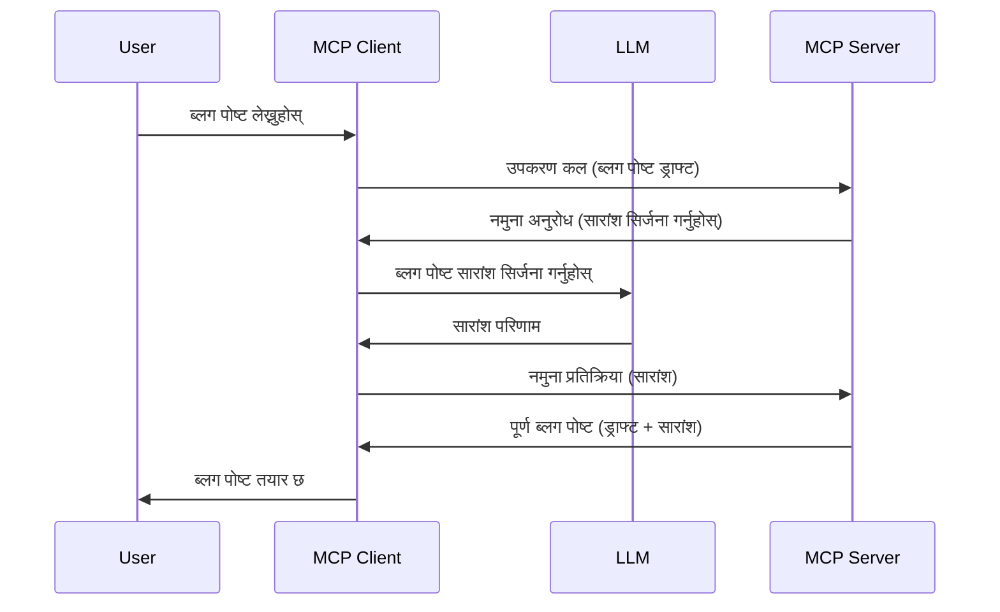

# नमूना - क्लाइन्टलाई सुविधाहरू प्रतिनिधित्व गर्नुहोस्

कहिलेकाहीं, तपाइँलाई MCP क्लाइन्ट र MCP सर्भरले साझा लक्ष्य प्राप्त गर्न सहकार्य गर्न आवश्यक पर्छ। तपाइँसँग यस्तो अवस्था हुन सक्छ जहाँ सर्भरलाई क्लाइन्टमा बसेको LLM को सहयोग आवश्यक हुन्छ। यो अवस्थामा, नमूना प्रयोग गर्नु उपयुक्त हुन्छ।

आउनुहोस् केही प्रयोगका केसहरू अन्वेषण गरौं र नमूना समावेश गरी समाधान कसरी निर्माण गर्ने भनी हेर्नुहोस्।

## अवलोकन

यस पाठमा, हामी नमूना कहिले र कहाँ प्रयोग गर्ने र यसलाई कन्फिगर कसरी गर्ने व्याख्या गर्नेमा केन्द्रित छौं।

## सिकाइ उद्देश्यहरू

यस अध्यायमा, हामीले गर्नुपर्ने कामहरू:

- नमूना के हो र कहिले प्रयोग गर्ने व्याख्या गर्नुहोस्।
- MCP मा नमूना कसरी कन्फिगर गर्ने देखाउनुहोस्।
- नमूना मा केही उदाहरणहरू प्रदान गर्नुहोस्।

## नमूना के हो र किन प्रयोग गर्ने?

नमूना एक उन्नत सुविधा हो जुन यसरी कार्य गर्छ:



### नमूना अनुरोध

ठीक छ, अब हामीसँग एउटा विश्वसनीय परिदृश्यको व्यापक दृष्टिकोण छ, आउनुहोस् नमूना अनुरोधको बारेमा कुरा गरौं जुन सर्भरले क्लाइन्टलाई पठाउने गर्दछ। यस्तो अनुरोध JSON-RPC ढाँचामा यस प्रकार देखिन्छ:

```json
{
  "jsonrpc": "2.0",
  "id": 1,
  "method": "sampling/createMessage",
  "params": {
    "messages": [
      {
        "role": "user",
        "content": {
          "type": "text",
          "text": "Create a blog post summary of the following blog post: <BLOG POST>"
        }
      }
    ],
    "modelPreferences": {
      "hints": [
        {
          "name": "claude-3-sonnet"
        }
      ],
      "intelligencePriority": 0.8,
      "speedPriority": 0.5
    },
    "systemPrompt": "You are a helpful assistant.",
    "maxTokens": 100
  }
}
```

यहाँ केही महत्वपूर्ण कुरा उल्लेख गर्न सक्छौं:

- Prompt, सामग्री -> टेक्स्ट अन्तर्गत, हाम्रो प्रम्प्ट हो जुन LLM लाई ब्लग पोस्ट सामग्री सारांश गर्न निर्देश हो।

- **modelPreferences**। यो भाग केवल एक प्राथमिकता हो, LLM सँग कुन कन्फिगरेसन प्रयोग गर्ने सन्दर्भमा सिफारिस हो। प्रयोगकर्ताले यी सिफारिसहरू अपनाउने वा परिवर्तन गर्ने निर्णय गर्न सक्छ। यस अवस्थामा मोडेल प्रयोग र गति तथा बुद्धिमत्ता प्राथमिकता सम्बन्धी सिफारिसहरू छन्।
- **systemPrompt**, यो तपाइँको सामान्य प्रणाली प्रम्प्ट हो जुन तपाइँको LLM लाई व्यक्तिगतता दिन्छ र मार्गनिर्देशन निर्देशनहरू समावेश गर्दछ।
- **maxTokens**, यो अर्को गुण हो जुन यस कार्यका लागि कति टोकन उपयोग गर्न सिफारिस गरिन्छ भनी जनाउँछ।

### नमूना प्रतिक्रिया

यो प्रतिक्रिया MCP क्लाइन्टले अन्ततः MCP सर्भरलाई पठाउने गर्दछ र यो क्लाइन्टले LLM लाई कल गरिसकेपछि त्यो जवाफ पर्खेर बनाएको सन्देश हो। JSON-RPC मा यसरी देखिन्छ:

```json
{
  "jsonrpc": "2.0",
  "id": 1,
  "result": {
    "role": "assistant",
    "content": {
      "type": "text",
      "text": "Here's your abstract <ABSTRACT>"
    },
    "model": "gpt-5",
    "stopReason": "endTurn"
  }
}
```

ध्यान दिनुहोस् कसरी प्रतिक्रिया ब्लग पोस्टको सारांश हो जस्तै हामीले मागेका थियौं। साथै कसरी प्रयोग गरिएको `model` हामीले मागेको "claude-3-sonnet" नभई "gpt-5" छ। यसले देखाउँछ प्रयोगकर्ताले प्रयोग गर्ने मोडेलमा आफ्नो मन परिवर्तन गर्न सक्छ र तपाइँको नमूना अनुरोध एउटै सिफारिस हो।

ठीक छ, अब हामी मुख्य प्रवाह र उपयोगी कार्य "ब्लग पोस्ट सिर्जना + सारांश" लाई बुझिसक्यौं, आउनुहोस् यसलाई काममा ल्याउन के गर्नुपर्छ हेर्नुहोस्।

### सन्देश प्रकारहरू

नमूना सन्देशहरू केवल पाठमात्र सीमित छैनन् तर तपाईंले छवि र अडियो पनि पठाउन सक्नुहुन्छ। JSON-RPC यसरी फरक देखिन्छ:

**पाठ**

```json
{
  "type": "text",
  "text": "The message content"
}
```

**छवि सामग्री**

```json
{
  "type": "image",
  "data": "base64-encoded-image-data",
  "mimeType": "image/jpeg"
}
```

**अडियो सामग्री**

```json
{
  "type": "audio",
  "data": "base64-encoded-audio-data",
  "mimeType": "audio/wav"
}
```

> Note: नमूना सम्बन्धी थप विस्तृत जानकारीको लागि, [आधिकारिक दस्तावेजहरू](https://modelcontextprotocol.io/specification/2025-11-25/client/sampling) हेर्नुहोस्

## क्लाइन्टमा नमूना कसरी कन्फिगर गर्ने

> नोट: यदि तपाइँ केवल सर्भर निर्माण गर्दै हुनुहुन्छ भने, यहाँ धेरै गर्न आवश्यक छैन।

एक क्लाइन्टमा, तपाइँले निम्न सुविधा यसरी निर्दिष्ट गर्नुपर्छ:

```json
{
  "capabilities": {
    "sampling": {}
  }
}
```

यसपछि, तपाइँको चयन गरिएको क्लाइन्ट सर्भरसँग सुरु हुँदा यो उठाइनेछ।

## नमूनाको व्यवहार उदाहरण - ब्लग पोस्ट सिर्जना गर्नुहोस्

आउनुहोस् सँगै नमूना सर्भर कोड गरौं, हामीले निम्न कार्यहरू गर्नुपर्छ:

1. सर्भरमा एउटा उपकरण सिर्जना गर्नुहोस्।
1. उक्त उपकरणले नमूना अनुरोध सिर्जना गर्नुपर्छ।
1. उपकरणले क्लाइन्टको नमूना अनुरोधको जवाफ पर्खनुपर्छ।
1. त्यसपछि उपकरणको परिणाम तयार गर्नुपर्छ।

कोड चरणबद्ध रूपमा हेर्नुहोस्:

### -1- उपकरण सिर्जना गर्नुहोस्

**python**

```python
@mcp.tool()
async def create_blog(title: str, content: str, ctx: Context[ServerSession, None]) -> str:
    """Create a blog post and generate a summary"""

```

### -2- नमूना अनुरोध सिर्जना गर्नुहोस्

अर्को कोडसँग उपकरण विस्तार गर्नुहोस्:

**python**

```python
post = BlogPost(
        id=len(posts) + 1,
        title=title,
        content=content,
        abstract=""
    )

prompt = f"Create an abstract of the following blog post: title: {title} and draft: {content} "

result = await ctx.session.create_message(
        messages=[
            SamplingMessage(
                role="user",
                content=TextContent(type="text", text=prompt),
            )
        ],
        max_tokens=100,
)

```

### -3- जवाफ पर्खनुहोस् र जवाफ फर्काउनुहोस्

**python**

```python
post.abstract = result.content.text

posts.append(post)

# सम्पूर्ण उत्पादन फिर्ता गर्नुहोस्
return json.dumps({
    "id": post.title,
    "abstract": post.abstract
})
```

### -4- पूर्ण कोड

**python**

```python
from starlette.applications import Starlette
from starlette.routing import Mount, Host

from mcp.server.fastmcp import Context, FastMCP

from mcp.server.session import ServerSession
from mcp.types import SamplingMessage, TextContent

import json


from uuid import uuid4
from typing import List
from pydantic import BaseModel


mcp = FastMCP("Blog post generator")

# app = FastAPI()

posts = []

class BlogPost(BaseModel):
    id: int
    title: str
    content: str
    abstract: str

posts: List[BlogPost] = []

@mcp.tool()
async def create_blog(title: str, content: str, ctx: Context[ServerSession, None]) -> str:
    """Create a blog post and generate a summary"""

    post = BlogPost(
        id=len(posts) + 1,
        title=title,
        content=content,
        abstract=""
    )

    prompt = f"Create an abstract of the following blog post: title: {title} and draft: {content} "

    result = await ctx.session.create_message(
        messages=[
            SamplingMessage(
                role="user",
                content=TextContent(type="text", text=prompt),
            )
        ],
        max_tokens=100,
    )

    post.abstract = result.content.text

    posts.append(post)

    # पूर्ण ब्लग पोष्ट फर्काउनुहोस्
    return json.dumps({
        "id": post.title,
        "abstract": post.abstract
    })

if __name__ == "__main__":
    print("Starting server...")
    # mcp.run()
    mcp.run(transport="streamable-http")

# app चलाउन: python server.py
```

### -5- Visual Studio Code मा परीक्षण गर्नुहोस्

Visual Studio Code मा यो परीक्षण गर्नका लागि त्यसरी गर्नुहोस्:

1. टर्मिनलमा सर्भर सुरु गर्नुहोस्
1. यसलाई *mcp.json* मा थप्नुहोस् (र सुनिश्चित गर्नुहोस् कि सुरु छ) जस्तै:

   ```json
   "servers": {
      "blog-server": {
        "type": "http",
        "url": "http://localhost:8000/mcp"
      }
   }
   ```

1. एउटा प्रम्प्ट टाइप गर्नुहोस्:

   ```text
   create a blog post named "Where Python comes from", the content is "Python is actually named after Monty Python Flying Circus"
   ```

1. नमूनालाई अनुमति दिनुहोस्। पहिलो पटक परीक्षण गर्दा तपाइँलाई अतिरिक्त संवाद प्रस्तुत गरिनेछ जुन स्वीकार गर्नु पर्नेछ, त्यसपछि साधारण उपकरण चलाउन संवाद देखिनेछ।

1. परिणामहरूको निरीक्षण गर्नुहोस्। तपाइँ परिणामहरू GitHub Copilot Chat मा राम्रोसँग प्रस्तुत भएको देख्नुहुनेछ र कच्चा JSON प्रतिक्रिया पनि निरीक्षण गर्न सक्नुहुनेछ।

**बोनस**। Visual Studio Code को टूलिङले नमूनाको लागि उत्कृष्ट समर्थन प्रदान गर्दछ। तपाइँले आफ्नो इन्स्टल गरिएको सर्भरमा नमूना पहुँच कन्फिगर गर्न यस्तो गर्नुहोस्:

1. एक्सटेन्सन सेक्सनमा जानुहोस्।
1. "MCP SERVERS - INSTALLED" सेक्सनमा तपाइँको इन्स्टल गरिएको सर्भरको लागि कग चिन्ह चयन गर्नुहोस्।
1. "Configure Model Access" चयन गर्नुहोस्, यसमा तपाइँ GitHub Copilot ले नमूना गर्दा कुन मोडेलहरू प्रयोग गर्न सक्ने छनोट गर्न सक्नुहुन्छ। साथै, हालै भएका सबै नमूना अनुरोधहरू "Show Sampling requests" चयन गरेर देख्न सकिन्छ।

## असाइन्मेन्ट

यस असाइन्मेन्टमा, तपाइँ अलि फरक नमूना बनाउनेछौं, जुन उत्पादन विवरण उत्पन्न गर्न समर्थन गर्ने नमूना एकीकरण हो। यहाँ तपाईको परिदृश्य:

**परिदृश्य**: ई-वाणिज्यमा ब्याक अफिस् कर्मचारीलाई सहयोग आवश्यक छ, उत्पादन विवरणहरू बनाउन धेरै समय लाग्छ। त्यसैले, तपाइँले यस्तो समाधान निर्माण गर्नु पर्नेछ जहाँ "create_product" नामक उपकरणलाई "title" र "keywords" तर्क स्वरूप पठाएर पूर्ण उत्पाद उत्पादन गर्नुपर्छ जसमा "description" क्षेत्र समावेश हुनेछ जुन क्लाइन्टको LLM द्वारा पूर्ति हुनेछ।

TIP: पहिले सिकेका कुराहरू प्रयोग गरी यो सर्भर र यसको उपकरण नमूना अनुरोध प्रयोग गरेर निर्माण गर्नुहोस्।

## समाधान

[Solution](./solution/README.md)

## मुख्य सिकाइहरू

नमूना एक शक्तिशाली सुविधा हो जसले सर्भरलाई क्लाइन्टलाई कार्यहरू प्रतिनिधित्व गर्न अनुमति दिन्छ जब यसलाई LLM को सहयोग आवश्यक हुन्छ।

## के छ अर्को

- [अध्याय ४ - व्यावहारिक कार्यान्वयन](../../04-PracticalImplementation/README.md)

---

<!-- CO-OP TRANSLATOR DISCLAIMER START -->
**अस्वीकरण**:
यो दस्तावेज़ AI अनुवाद सेवा [Co-op Translator](https://github.com/Azure/co-op-translator) प्रयोग गरेर अनुवाद गरिएको हो। हामी सही हुन प्रयास गर्छौं, तर कृपया जानकार हुनुस् कि स्वचालित अनुवादमा त्रुटिहरू वा अशुद्धताहरू हुन सक्छन्। मूल दस्तावेज़ यसको मूल भाषामा आधिकारिक स्रोत मानिनुपर्छ। महत्वपूर्ण जानकारीका लागि व्यावसायिक मानव अनुवाद सिफारिस गरिन्छ। यस अनुवादको प्रयोगबाट उत्पन्न कुनै पनि गलत बुझाइ वा त्रुटिको लागि हामी जिम्मेवार छैनौं।
<!-- CO-OP TRANSLATOR DISCLAIMER END -->