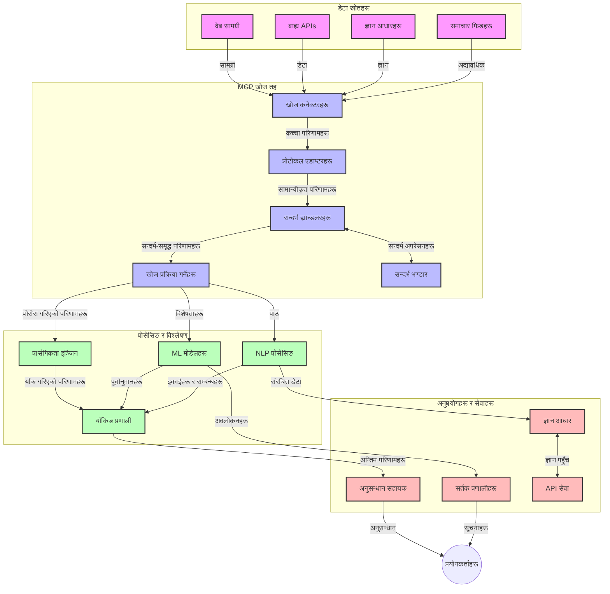
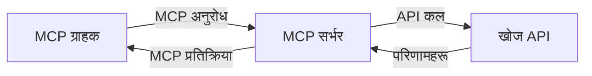
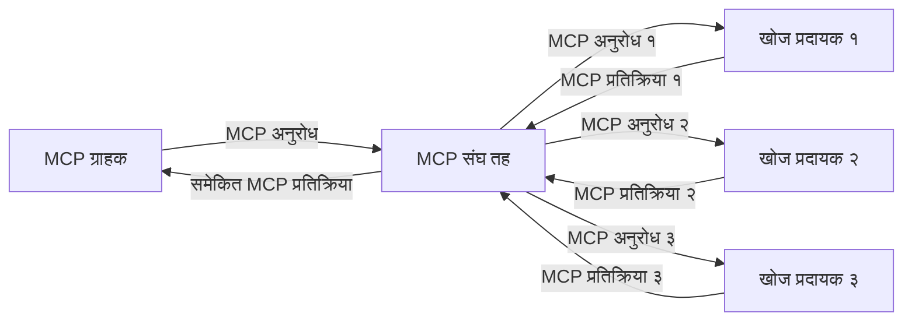
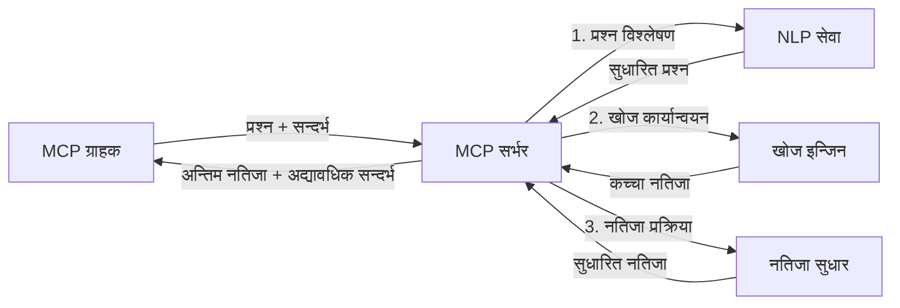

# रियल-टाइम वेब सर्चका लागि मोडल सन्दर्भ प्रोटोकल

## सिंहावलोकन

रियल-टाइम वेब सर्च आजको सूचना-आधारित वातावरणमा अपरिहार्य भइसकेको छ, जहाँ अनुप्रयोगहरूले इन्टरनेटभरि अद्यावधिक जानकारीमा तत्काल पहुँच आवश्यक पर्छ ताकि सान्दर्भिक र समयमा प्रतिक्रिया दिन सकियोस्। मोडल सन्दर्भ प्रोटोकल (MCP) ले यी रियल-टाइम खोज प्रक्रियाहरूलाई अनुकूलनमा महत्वपूर्ण प्रगति प्रतिनिधित्व गर्छ, जसले खोज दक्षता वृद्धि गर्छ, सन्दर्भीय अखण्डता कायम राख्छ, र समग्र प्रणाली प्रदर्शन सुधार गर्छ।

यो मोड्युलले कसरी MCP ले AI मोडेलहरू, खोज इन्जिनहरू, र अनुप्रयोगहरू बीच सन्दर्भ व्यवस्थापनको मानकीकृत तरिका प्रदान गरेर रियल-टाइम वेब सर्चलाई रूपान्तरण गर्छ भन्ने अन्वेषण गर्छ।

### तपाई के सिक्नेछौं

यस व्यापक मार्गदर्शनमा, तपाईले पत्ता लगाउनुहुनेछ:

- MCP ले कसरी AI मोडेलहरू र रियल-टाइम वेब सर्च क्षमताहरू बीच बिना रोकावट पुल सिर्जना गर्छ
- MCP सँग कुशल र स्केलेबुल सर्च समाधानहरू कार्यान्वयन गर्न वास्तुकला ढाँचा
- धेरै क्वेरी र अन्तरक्रियाहरूमा खोज सन्दर्भ कसरी कायम राख्ने तरिका
- विभिन्न खोज परिदृश्यहरूका लागि Python र JavaScript मा व्यवहारिक कोड कार्यान्वयनहरू
- MCP-शक्तिशाली खोज प्रणालीहरूमा सान्दर्भिकता, नवीनता, र प्रदर्शन सन्तुलन गर्ने विधिहरू

## रियल-टाइम वेब सर्च परिचय

रियल-टाइम वेब सर्च एक प्रविधिगत दृष्टिकोण हो जसले वेबमा प्रकाशित वा अद्यावधिक भइरहने जानकारीको निरन्तर क्वेरी, प्रक्रिया र विश्लेषण सक्षम पार्छ, जसले प्रणालीहरूलाई थोरै ढिलाइमा ताजा र सान्दर्भिक जानकारी प्रदान गर्न अनुमति दिन्छ। परम्परागत खोज प्रणालीहरू जुन सूचकांकित डाटामा आधारित हुन्छन् र जुन घण्टा वा दिन पुराना हुन सक्छन् भन्दा फरक, रियल-टाइम सर्चले वेबबाट प्रत्यक्ष डाटा प्रक्रियागर्दछ, जसले अनलाइन सामग्रीको वर्तमान अवस्थामा प्रतिबिम्बित अन्तर्दृष्टि र जानकारी प्रदान गर्छ।

### रियल-टाइम वेब सर्चका मुख्य अवधारणाहरू:

- **निरन्तर क्वेरी प्रक्रिया**: खोज क्वेरीहरू निरन्तर अद्यावधिक हुँदै गरेका डाटा स्रोतहरूमा प्रक्रियागर्नु
- **नवीनता प्राथमिकता**: प्रणालीहरूले ताजा जानकारीलाई प्राथमिकता दिने गरी डिजाइन
- **सान्दर्भिकता सन्तुलन**: सान्दर्भिकता र नवीनताको सन्तुलन कायम राख्नु
- **स्केलेबुल वास्तुकला**: प्रणालीहरूले परिवर्तनीय क्वेरी लोड र डाटा परिमाणहरू व्यवस्थापन गर्न सक्ने
- **सन्दर्भीय बुझाइ**: खोज आवृत्तिहरूमा प्रयोगकर्ता सन्दर्भ कायम राख्नु अर्थपूर्ण नतिजाका लागि आवश्यक
- **डाइनामिक क्वेरी पुन:परिभाषा**: सन्दर्भ र अघिल्लो नतिजाहरूको आधारमा क्वेरीहरू अनुकूलित गर्ने
- **बहु-स्रोत एकीकरण**: विभिन्न खोज प्रदायक र वेब स्रोतबाट नतिजाहरू संयोजन गर्ने
- **सामान्तिक बुझाइ**: केवल कुञ्जीशब्दमा होइन, अर्थको आधारमा क्वेरी र सामग्री प्रक्रिया गर्ने
- **रियल-टाइम श्रेणीकरण**: नयाँ जानकारी उपलब्ध हुँदै जाँदा नतिजा रैंकिङ निरन्तर समायोजन गर्ने

### मोडल सन्दर्भ प्रोटोकल र रियल-टाइम वेब सर्च

मोडल सन्दर्भ प्रोटोकल (MCP) ले रियल-टाइम वेब सर्च वातावरणमा केही महत्वपूर्ण चुनौतीहरू सम्बोधन गर्छ:

1. **खोज सन्दर्भ संरक्षण**: MCP ले सन्दर्भलाई वितरण गरिएको खोज अवयवहरूमा कसरी कायम राख्ने मानकीकृत गर्दछ, जसले AI मोडेल र प्रक्रिया नोडहरूलाई सान्दर्भिक क्वेरी इतिहास र प्रयोगकर्ता प्राथमिकतामा पहुँच सुनिश्चित गर्छ।

2. **कुशल क्वेरी व्यवस्थापन**: सन्दर्भ प्रसारणका लागि संरचित यन्त्रहरू प्रदान गरेर, MCP ले प्रत्येक खोज पुनरावृत्तिमा सन्दर्भ दोहोर्याइने ओभरहेड कम गर्छ।

3. **पारस्परिक अनुकूलता**: MCP ले विभिन्न खोज प्रविधिहरू र AI मोडेलहरू बीच सन्दर्भ साझेदारीका लागि सामान्य भाषा सिर्जना गर्छ, जसले बढी लचिलो र विस्तारयोग्य वास्तुकलाहरू सक्षम पार्छ।

4. **खोज-अनुकूलित सन्दर्भ**: MCP कार्यान्वयनहरूले कुन सन्दर्भ तत्वहरू प्रभावकारी खोजका लागि सबैभन्दा सान्दर्भिक छन् भनेर प्राथमिकता दिन सक्छ, प्रदर्शन र शुद्धताका लागि अनुकूलन गर्दै।

5. **अनुकूलनशील खोज प्रक्रिया**: MCP मार्फत उचित सन्दर्भ व्यवस्थापनका साथ, खोज प्रणालीहरूले प्रयोगकर्ता आवश्यकताहरू र जानकारी परिवेशका आधारमा गतिशील रूपमा प्रक्रिया समायोजन गर्न सक्छन्।

आजका आधुनिक अनुप्रयोगहरूमा, समाचार सङ्कलनदेखि अनुसन्धान सहायकसम्म, MCP लाई वेब सर्च प्रविधिहरूमा एकीकरणले अझ बुद्धिमानी, सन्दर्भ-सजग खोज सक्षम पार्छ जसले प्रयोगकर्ता अन्तरक्रियाहरू जारी रहँदा थप सान्दर्भिक नतिजाहरू प्रदान गर्न सक्छ।

## सिकाइ लक्ष्यहरू

यस पाठ समाप्तिमा, तपाई सक्षम हुनुहुनेछ:

- रियल-टाइम वेब सर्चको आधारभूत कुरा र आधुनिक अनुप्रयोगहरूमा यसको चुनौतीहरू बुझ्न
- मोडल सन्दर्भ प्रोटोकल (MCP) ले कसरी रियल-टाइम वेब सर्च क्षमताहरू सुधार गर्छ व्याख्या गर्न
- लोकप्रिय फ्रेमवर्क र API हरू प्रयोग गरेर MCP-आधारित खोज समाधानहरू कार्यान्वयन गर्न
- MCP सँग स्केलेबुल, उच्च प्रदर्शन खोज वास्तुकलाहरू डिजाइन र परिनियोजन गर्न
- MCP अवधारणाहरूलाई सामान्तिक खोज, अनुसन्धान सहायता, र AI-सङ्गठित ब्राउजिङजस्ता विभिन्न प्रयोग केसहरूमा लागू गर्न
- MCP-आधारित खोज प्रविधिहरूमा उदाउँदै गरेका प्रवृत्ति र भविष्य नवप्रवर्तनहरूको मूल्याङ्कन गर्न
- प्रयोगकर्ता अन्तरक्रियाबाट सिक्ने सन्दर्भ-सजग खोज प्रणालीहरू विकास गर्न
- मानकीकृत MCP प्रोटोकल प्रयोग गरेर AI सहायकहरूमा वेब सर्च क्षमताहरू समाहित गर्न
- सन्दर्भमा आधारित वृद्धिशील रूपमा नतिजा सुधार गर्ने बहु-चरण खोज पाइपलाइनहरू सिर्जना गर्न
- व्यापक सन्दर्भ सजगता कायम राख्दै खोज प्रदर्शनलाई अनुकूलित गर्न

### परिभाषा र महत्व

रियल-टाइम वेब सर्चले थोरै ढिलाइमा वेबमूलक जानकारीको निरन्तर क्वेरी, पुनःप्राप्ति, र वितरण समावेश गर्दछ। परम्परागत खोज इन्जिनहरू जुन नियमित रूपमा वेब क्रल गरेर सूचकांक सिर्जना गर्छन्, त्यस्तै होइन; रियल-टाइम सर्चले उपलब्ध हुनासाथ जानकारी सतहमा ल्याउने लक्ष्य राख्छ, जसले सबैभन्दा वर्तमान सामग्रीमा तत्काल पहुँच सम्भव बनाउँछ।

रियल-टाइम वेब सर्चका मुख्य विशेषताहरू:

- **ताजगी**: हालैको सामग्री र अद्यावधिकहरूलाई प्राथमिकता
- **निरन्तर प्रक्रिया**: नयाँ जानकारीको नियमित अनुगमन
- **क्वेरी अनुकूलन**: सन्दर्भ र प्रतिक्रिया अनुसार खोज क्वेरी परिष्कृत गर्नु
- **तात्कालिक वितरण**: न्यूनतम ढिलाइमा खोज नतिजा उपलब्ध गराउनु
- **सन्दर्भ अवधारण**: सुधारिएको सान्दर्भिकताका लागि अघिल्ला क्वेरीहरूमा आधारित निर्माण

### परम्परागत वेब सर्चका चुनौतीहरू

परम्परागत वेब सर्च विधिहरूलाई रियल-टाइम अवस्थाहरूमा लागू गर्दा केही सीमाहरू देखिन्छन्:

1. **सन्दर्भ टुक्रावाटो**: धेरै क्वेरीहरूमा खोज सन्दर्भ कायम राख्न कठिनाइ
2. **सूचना ताजगी**: सबैभन्दा नयाँ जानकारी पहुँच र प्राथमिकता दिन समस्या
3. **एकीकृत जटिलता**: खोज प्रणालीहरू र अनुप्रयोगहरूबीच अन्तरक्रियाको समस्या
4. **ढिलाइका समस्या**: व्यापक खोज र प्रतिक्रिया समयको सन्तुलन
5. **सान्दर्भिकता समायोजन**: नवीनतालाई प्राथमिकता दिँदै शुद्धता र सान्दर्भिकता सुनिश्चित गर्नु

## खोजका लागि मोडल सन्दर्भ प्रोटोकल (MCP) बुझ्नुहोस्

### खोज सन्दर्भमा MCP भनेको के हो?

मोडल सन्दर्भ प्रोटोकल (MCP) एक मानकीकृत सञ्चार प्रोटोकल हो जुन AI मोडेल र अनुप्रयोगहरू बीच कुशल अन्तरक्रिया सहज बनाउन डिजाइन गरिएको हो। रियल-टाइम वेब सर्च सन्दर्भमा, MCP ले निम्न फ्रेमवर्क प्रदान गर्दछ:

- क्वेरी श्रृंखलाहरूको दौरान खोज सन्दर्भ संरक्षण गर्ने
- खोज क्वेरी र नतिजा ढाँचाहरू मानकीकृत गर्ने
- खोज प्यारामिटर र नतिजाहरूको सञ्चरण अनुकूलन गर्ने
- मोडेलदेखि खोज इन्जिनसम्म सञ्चार सुधार गर्ने

### मुख्य अवयवहरू र वास्तुकला

रियल-टाइम वेब सर्चका लागि MCP वास्तुकलामा केहि मुख्य अवयवहरू हुन्छन्:

1. **क्वेरी सन्दर्भ ह्यान्डलरहरू**: धेरै क्वेरीहरू माझ खोज सन्दर्भ व्यवस्थापन र कायम राख्ने
2. **खोज प्रोसेसरहरू**: सन्दर्भ-सजग प्रविधिहरू प्रयोग गरी आगन्तुक खोज अनुरोधहरू प्रक्रिया गर्ने
3. **प्रोटोकल एडाप्टरहरू**: विभिन्न खोज API हरूबीच सन्दर्भ संरक्षण गर्दै रूपान्तरण गर्ने
4. **सन्दर्भ सङ्ग्रहण**: खोज इतिहास र प्राथमिकताहरू कुशलतापूर्वक भण्डारण र पुनःप्राप्ति गर्ने
5. **खोज कनेक्टरहरू**: विभिन्न खोज इन्जिन र वेब API हरूसँग जडान गर्ने



### MCP ले रियल-टाइम वेब सर्चलाई कसरी सुधार गर्छ

MCP ले परम्परागत वेब सर्च चुनौतीहरूलाई निम्नबाट सम्बोधन गर्छ:

- **सन्दर्भ निरन्तरता**: सम्पूर्ण खोज सत्रमा क्वेरीहरू बीच सम्बन्ध कायम राख्ने
- **अनुकूलित सञ्चरण**: बुद्धिमानी सन्दर्भ व्यवस्थापनमार्फत खोज प्यारामिटरहरूमा पुनरावृत्ति कम गर्ने
- **मानकीकृत इन्टरफेसहरू**: खोज अवयवहरूको लागि सुसंगत API हरू उपलब्ध गराउने
- **ढिलाइ कम गर्ने**: कुशल सन्दर्भ ह्यान्डलिङमार्फत प्रक्रिया ओभरहेड न्यूनतम गर्ने
- **सुध Participants्रा सान्दर्भिकता**: धेरै क्वेरीहरूमा प्रयोगकर्ता मनसाय संरक्षण गरेर खोज सान्दर्भिकता सुधार गर्ने

## एकीकरण र कार्यान्वयन

रियल-टाइम वेब सर्च प्रणालीहरू प्रदर्शन र सन्दर्भीय अखण्डता दुवै कायम राख्न सावधानीपूर्ण वास्तुकला डिजाइन र कार्यान्वयन आवश्यक पर्छ। मोडल सन्दर्भ प्रोटोकल AI मोडेलहरू र खोज प्रविधिहरूलाई एकीकृत गर्न मानकीकृत तरिका प्रदान गर्छ, जसले थप परिष्कृत र सन्दर्भ-सजग खोज पाइपलाइनहरू सक्षम बनाउँछ।

### खोज वास्तुकलाहरूमा MCP एकीकरणको सिंहावलोकन

रियल-टाइम वेब सर्च वातावरणहरूमा MCP कार्यान्वयन गर्दा केही मुख्य बुँदाहरूमा ध्यान दिनुपर्छ:

1. **खोज सन्दर्भ सिरियलाइजेसन**: MCP ले खोज अनुरोधहरूमा सन्दर्भीय जानकारीको कुशल इन्कोडिङका लागि यन्त्रहरू प्रदान गर्छ, जुन सुनिश्चित गर्छ आवश्यक सन्दर्भ क्वेरी प्रक्रियाक्रम भरि साथमा रहने। यसमा खोज-सम्बन्धित मेटाडेटाका लागि अनुकूलित मानकीकृत सिरियलाइजेसन ढाँचाहरू समाविष्ट छन्।

2. **राज्ययुक्त खोज प्रक्रिया**: MCP ले खोज आवृत्तिहरूमा सुसंगत सन्दर्भ प्रतिनिधित्व कायम राखेर बढी बुद्धिमानी राज्ययुक्त प्रक्रिया सक्षम बनाउँछ। यो विशेष गरी बहु-चरण खोज पाइपलाइनहरूमा जहाँ सन्दर्भ परिष्कृतिले नतिजा सुधार गर्छ, उपयोगी हुन्छ।

3. **क्वेरी विस्तार र परिष्करण**: MCP कार्यान्वयनहरूले संचित सन्दर्भमा आधारित परिष्कृत क्वेरी विस्तार र पुन:निर्धारणलाई सहज बनाउँछ, जसले खोज सत्रको प्रगतिको साथ थप सान्दर्भिक नतिजा प्राप्त गर्न अनुमति दिन्छ।

4. **नतिजा क्यासिङ र प्राथमिकता निर्धारण**: सन्दर्भ ह्यान्डलिङलाई मानकीकृत गरेर, MCP ले नतिजा क्यासिङ र प्राथमिकता व्यवस्थापनमा मद्दत गर्छ, जसले अवयवहरूलाई विकासशील खोज सन्दर्भ अनुसार अनुकूलन गर्न अनुमति दिन्छ।

5. **खोज संधि र सङ्कलन**: MCP ले संरचित खोज सन्दर्भ प्रतिनिधित्वहरू प्रदान गरेर धेरै ब्याकएन्डहरूमा खोजको बढी परिष्कृत संधि सजिलो बनाउँछ, जसले विभिन्न स्रोतहरूबाट नतिजा सङ्कलनलाई अर्थपूर्ण बनाउँछ।

विभिन्न खोज प्रविधिहरूमा MCP को कार्यान्वयनले सन्दर्भ व्यवस्थापनमा एकीकृत दृष्टिकोण सिर्जना गर्दछ, जसले अनुकूलन एकीकरण कोड आवश्यकतालाई कम गर्दै खोज क्वेरीहरूको विकाससँगै अर्थपूर्ण सन्दर्भ कायम राख्न प्रणालीको क्षमता सुधार गर्छ।

### विभिन्न वेब सर्च कार्यान्वयनहरूमा MCP

यी उदाहरणहरूले हालको MCP विशिष्टता पालन गर्दछन् जुन JSON-RPC आधारित प्रोटोकलमा केन्द्रित छ र अलग-अलग ट्रान्सपोर्ट संयन्त्रहरू प्रयोग गर्दछ। कोडले कसरी तपाईले कथनीअनुसार MCP प्रोटोकलसँग पूर्ण अनुकूलता कायम राख्दै अनुकूलित खोज एकीकरण कार्यान्वयन गर्न सक्नुहुन्छ देखाउँछ।

<details>
<summary>साधारण खोज API सहित Python कार्यान्वयन</summary>

```python
import asyncio
import json
import aiohttp
from typing import Dict, Any, Optional, List
from contextlib import asynccontextmanager
from collections.abc import AsyncIterator

# मानक MCP पुस्तकालयहरू आयात गर्नुहोस्
from mcp.client.session import ClientSession
from mcp.client.streamable_http import streamablehttp_client
from mcp.types import TextContent, CreateMessageRequestParams, CreateMessageResult
from mcp.server.fastmcp import FastMCP

# वेब खोजका लागि FastMCP सर्भर सिर्जना गर्नुहोस्
search_server = FastMCP("WebSearch")

# वेब खोज अपरेशनहरू सम्हाल्ने कक्षा
class WebSearchHandler:
    def __init__(self, api_endpoint: str, api_key: str):
        self.api_endpoint = api_endpoint
        self.api_key = api_key
        self.session = None
        
    async def initialize(self):
        """Initialize the HTTP session"""
        self.session = aiohttp.ClientSession(
            headers={"Authorization": f"Bearer {self.api_key}"}
        )
    
    async def close(self):
        """Close the HTTP session"""
        if self.session:
            await self.session.close()
            
    async def perform_search(self, query: str, max_results: int = 5, 
                           include_domains: List[str] = None, 
                           exclude_domains: List[str] = None,
                           time_period: str = "any") -> Dict[str, Any]:
        """Perform web search using the search API"""
        # खोज प्यारामिटरहरू निर्माण गर्नुहोस्
        search_params = {
            "q": query,
            "limit": max_results,
            "time": time_period
        }
        
        if include_domains:
            search_params["site"] = ",".join(include_domains)
            
        if exclude_domains:
            search_params["exclude_site"] = ",".join(exclude_domains)
        
        # खोज अनुरोध प्रदर्शन गर्नुहोस्
        try:
            async with self.session.get(
                self.api_endpoint,
                params=search_params
            ) as response:
                if response.status != 200:
                    error_text = await response.text()
                    raise Exception(f"Search API error: {response.status} - {error_text}")
                
                search_data = await response.json()
                
                # API-विशिष्ट प्रतिक्रिया मानक ढाँचामा रूपान्तरण गर्नुहोस्
                results = []
                for item in search_data.get("results", []):
                    results.append({
                        "title": item.get("title", ""),
                        "url": item.get("url", ""),
                        "snippet": item.get("snippet", ""),
                        "date": item.get("published_date", ""),
                        "source": item.get("source", "")
                    })
                
                return {
                    "query": query,
                    "totalResults": len(results),
                    "results": results
                }
        except Exception as e:
            print(f"Search API request error: {e}")
            raise

# खोज ह्यान्डलरलाई सुरु गर्नुहोस्
search_handler = WebSearchHandler(
    api_endpoint="https://api.search-service.example/search",
    api_key="your-api-key-here"
)

# खोज ह्यान्डलर व्यवस्थापनका लागि आयु सेटअप गर्नुहोस्
@asyncio.asynccontextmanager
async def app_lifespan(server: FastMCP):
    """Manage application lifecycle"""
    await search_handler.initialize()
    try:
        yield {"search_handler": search_handler}
    finally:
        await search_handler.close()

# सर्भरको आयु सेट गर्नुहोस्
search_server = FastMCP("WebSearch", lifespan=app_lifespan)

# वेब खोज उपकरण दर्ता गर्नुहोस्
@search_server.tool()
async def web_search(query: str, max_results: int = 5, 
                   include_domains: List[str] = None,
                   exclude_domains: List[str] = None,
                   time_period: str = "any") -> Dict[str, Any]:
    """
    Search the web for information
    
    Args:
        query: The search query
        max_results: Maximum number of results to return (default: 5)
        include_domains: List of domains to include in search results
        exclude_domains: List of domains to exclude from search results
        time_period: Time period for results ("day", "week", "month", "any")
        
    Returns:
        Dictionary containing search results
    """
    ctx = search_server.get_context()
    search_handler = ctx.request_context.lifespan_context["search_handler"]
    
    results = await search_handler.perform_search(
        query=query,
        max_results=max_results,
        include_domains=include_domains,
        exclude_domains=exclude_domains,
        time_period=time_period
    )
    
    return results

# उदाहरण ग्राहक प्रयोग
async def client_example():
    # Streamable HTTP ट्रान्सपोर्ट प्रयोग गरी खोज सर्भरसँग जडान गर्नुहोस्
    async with streamablehttp_client("http://localhost:8000/mcp") as (read, write, _):
        async with ClientSession(read, write) as session:
            # जडान सुरु गर्नुहोस्
            await session.initialize()
            
            # web_search उपकरण कल गर्नुहोस्
            search_results = await session.call_tool(
                "web_search", 
                {
                    "query": "latest developments in AI and Model Context Protocol",
                    "max_results": 5,
                    "time_period": "day",
                    "include_domains": ["github.com", "microsoft.com"]
                }
            )
            
            print(f"Search results: {search_results}")

# सर्भर कार्यान्वयन उदाहरण
if __name__ == "__main__":
    # Streamable HTTP ट्रान्सपोर्टसँग सर्भर चलाउनुहोस्
    search_server.run(transport="streamable-http")
```
</details> 

<details>
<summary>ब्राउजर-आधारित खोजसँग JavaScript कार्यान्वयन</summary>

```javascript
// वेब खोजको लागि MCP सर्भर कार्यान्वयन
import { McpServer, ResourceTemplate } from '@modelcontextprotocol/sdk/server/mcp.js';
import { StreamableHTTPServerTransport } from '@modelcontextprotocol/sdk/server/streamableHttp.js';
import { z } from 'zod';

// वेब खोजको लागि MCP सर्भर सिर्जना गर्नुहोस्
const searchServer = new McpServer({
    name: "BrowserSearch",
    description: "A server that provides web search capabilities"
});

// खोज सेवा वर्ग
class SearchService {
    constructor(searchApiUrl, apiKey) {
        this.searchApiUrl = searchApiUrl;
        this.apiKey = apiKey;
    }

    async performSearch(parameters) {
        const {
            query = '',
            maxResults = 5,
            includeDomains = [],
            excludeDomains = [],
            timePeriod = 'any'
        } = parameters;
        
        // प्यारामिटरहरूसँग खोज URL निर्माण गर्नुहोस्
        const url = new URL(this.searchApiUrl);
        url.searchParams.append('q', query);
        url.searchParams.append('limit', maxResults);
        url.searchParams.append('time', timePeriod);
        
        if (includeDomains.length > 0) {
            url.searchParams.append('site', includeDomains.join(','));
        }
        
        if (excludeDomains.length > 0) {
            url.searchParams.append('exclude_site', excludeDomains.join(','));
        }
        
        try {
            const response = await fetch(url.toString(), {
                method: 'GET',
                headers: {
                    'Authorization': `Bearer ${this.apiKey}`,
                    'Content-Type': 'application/json'
                }
            });
            
            if (!response.ok) {
                const errorText = await response.text();
                throw new Error(`Search API error: ${response.status} - ${errorText}`);
            }
            
            const searchData = await response.json();
            
            // API-विशिष्ट प्रतिक्रिया मानक ढाँचामा रूपान्तरण गर्नुहोस्
            const results = searchData.results?.map(item => ({
                title: item.title || '',
                url: item.url || '',
                snippet: item.snippet || '',
                date: item.published_date || '',
                source: item.source || ''
            })) || [];
            
            return {
                query,
                totalResults: results.length,
                results
            };
        } catch (error) {
            console.error('Search API request error:', error);
            throw error;
        }
    }
}

// खोज सेवा प्रारम्भ गर्नुहोस्
const searchService = new SearchService(
    'https://api.search-service.example/search',
    'your-api-key-here'
);

// सर्भरको लागि सन्दर्भ प्रदायक सेटअप गर्नुहोस्
searchServer.setContextProvider(() => {
    return {
        searchService
    };
});

// वेब खोज उपकरण दर्ता गर्नुहोस्
searchServer.tool({
    name: 'web_search',
    description: 'Search the web for information',
    parameters: {
        type: 'object',
        properties: {
            query: {
                type: 'string',
                description: 'The search query'
            },
            maxResults: {
                type: 'integer',
                description: 'Maximum number of results to return',
                default: 5
            },
            includeDomains: {
                type: 'array',
                items: { type: 'string' },
                description: 'List of domains to include in search results'
            },
            excludeDomains: {
                type: 'array',
                items: { type: 'string' },
                description: 'List of domains to exclude from search results'
            },
            timePeriod: {
                type: 'string',
                description: 'Time period for results',
                enum: ['day', 'week', 'month', 'any'],
                default: 'any'
            }
        },
        required: ['query']
    },
    handler: async (params, context) => {
        const { searchService } = context;
        return await searchService.performSearch(params);
    }
});

// खोज सर्भरमा जडान गर्न उदाहरण क्लायंट कोड
import { Client } from '@modelcontextprotocol/sdk/client/index.js';
import { StreamableHTTPClientTransport } from '@modelcontextprotocol/sdk/client/streamableHttp.js';

async function connectToSearchServer() {
    // खोज सर्भरमा जडान गर्नुहोस्
    const transport = new StreamableHTTPClientTransport(
        new URL('http://localhost:8000/mcp')
    );
    
    const client = new Client({
        name: 'search-client',
        version: '1.0.0'
    });
    
    await client.connect(transport);
    
    // खोज उपकरण चलाउनुहोस्
    const searchResults = await client.callTool({
        name: 'web_search',
        arguments: {
            query: 'Model Context Protocol implementation examples',
            maxResults: 10,
            timePeriod: 'week',
            includeDomains: ['github.com', 'docs.microsoft.com']
        }
    });
    
    console.log('Search results:', searchResults);
    
    // सफाई गर्नुहोस्
    await client.disconnect();
}

// सर्भर सुरु गर्नुहोस्
const transport = new StreamableHTTPServerTransport();
await searchServer.connect(transport);
console.log('Search server running at http://localhost:8000/mcp');

// अलग प्रक्रियामा वा सर्भर सुरु भएपछि
// connectToSearchServer().catch(console.error);
```
</details> 

## कोड उदाहरण अस्वीकरण

> **महत्वपूर्ण नोट**: तलका कोड उदाहरणहरूले मोडल सन्दर्भ प्रोटोकल (MCP) लाई वेब सर्च कार्यक्षमतासँग कसरी एकीकरण गर्ने देखाउँछन्। यद्यपि यी अधिकारी MCP SDK हरूका ढाँचाहरू र संरचनाहरू पालना गर्छन्, शैक्षिक प्रयोजनका लागि सरल बनाइएका छन्।
> 
> यी उदाहरणहरूले देखाउँछन्:
> 
> 1. **Python कार्यान्वयन**: FastMCP सर्भर कार्यान्वयन जसले वेब सर्च उपकरण प्रदान गर्छ र बाह्य खोज API सँग जडान गर्दछ। यस उदाहरणले जीवनकाल व्यवस्थापन, सन्दर्भ ह्यान्डलिङ, र उपकरण कार्यान्वयन सही रूपमा देखाउँछ, [अधिकृत MCP Python SDK](https://github.com/modelcontextprotocol/python-sdk) को ढाँचाहरू पालना गर्दै। सर्भरले सिफारिस गरिएको Streamable HTTP ट्रान्सपोर्ट प्रयोग गर्छ जुन उत्पादन परिनियोजनहरूका लागि पुरानो SSE ट्रान्सपोर्टलाई प्रतिस्थापन गरेको छ।
> 
> 2. **JavaScript कार्यान्वयन**: FastMCP ढाँचामा आधारित TypeScript/JavaScript कार्यान्वयन जसले खोज सर्भर सिर्जना गर्दछ उचित उपकरण परिभाषा र क्लाइन्ट जडानहरू सँग। यसले सत्र व्यवस्थापन र सन्दर्भ संरक्षणका लागि नवीनतम सिफारिस गरिएका ढाँचाहरू पालन गर्दछ।
> 
> यी उदाहरणहरूले उत्पादन प्रयोगका लागि थप त्रुटि ह्यान्डलिङ, प्रमाणीकरण, र विशिष्ट API एकीकरण कोड आवश्यक पर्नेछ। देखाइएको खोज API अन्तबिन्दुहरू (`https://api.search-service.example/search`) प्लेसहोल्डर हुन् र तिनीहरू वास्तविक खोज सेवा अन्तबिन्दुहरूले प्रतिस्थापन हुनुपर्नेछ।
> 
> पूर्ण कार्यान्वयन विवरण र सबैभन्दा नयाँ विधिहरूका लागि, कृपया [अधिकृत MCP विशिष्टता](https://spec.modelcontextprotocol.io/) र SDK दस्तावेजहरू हेर्नुहोस्।

## मुख्य अवधारणाहरू

### मोडल सन्दर्भ प्रोटोकल (MCP) फ्रेमवर्क

यसको आधारमा, मोडल सन्दर्भ प्रोटोकलले AI मोडेलहरू, अनुप्रयोगहरू, र सेवाहरूलाई सन्दर्भ विनिमय गर्न मानकीकृत तरिका प्रदान गर्छ। रियल-टाइम वेब सर्चमा, यो फ्रेमवर्क सुसंगत, बहु-अवधि खोज अनुभवहरू सिर्जना गर्न आवश्यक छ। मुख्य अवयवहरू समावेश छन्:

1. **ग्राहक-सर्भर वास्तुकला**: MCP ले खोज ग्राहकहरू (अनुरोधकर्ता) र खोज सर्भरहरू (प्रदायक) बीच स्पष्ट विभाजन स्थापना गर्छ, जसले लचिलो परिनियोजन मोडेलहरू अनुमति दिन्छ।

2. **JSON-RPC सञ्चार**: प्रोटोकलले सन्देश विनिमयका लागि JSON-RPC प्रयोग गर्छ, जसले वेब प्रविधिहरूसँग मिल्ने र विभिन्न प्लेटफर्महरूमा सजिलै कार्यान्वयनयोग्य बनाउँछ।

3. **सन्दर्भ व्यवस्थापन**: MCP ले धेरै अन्तरक्रियामा खोज सन्दर्भ कायम राख्न, अद्यावधिक गर्न, र प्रयोग गर्न संरचित विधिहरू परिभाषित गर्छ।

4. **उपकरण परिभाषाहरू**: खोज क्षमताहरू मानकीकृत उपकरणहरूका रूपमा प्रदान गरिन्छन् जसका राम्रो परिभाषित प्यारामिटरहरू र फर्काउने मानहरू हुन्छन्।

5. **स्ट्रिमिंग समर्थन**: प्रोटोकलले स्ट्रिमिङ नतिजाहरू समर्थन गर्दछ, जुन रियल-टाइम खोजको लागि आवश्यक हुन्छ जहाँ नतिजा प्रगतिशील रूपमा आउन सक्छन्।

### वेब सर्च एकीकरण ढाँचाहरू

MCP लाई वेब सर्चसँग एकीकृत गर्दा, थुप्रै ढाँचाहरू देखा पर्छन्:

#### 1. प्रत्यक्ष खोज प्रदायक एकीकरण



यस ढाँचामा, MCP सर्भरले एक वा बढी खोज API हरूसँग सिधा इन्टरफेस गर्छ, MCP अनुरोधहरू API-विशिष्ट कलहरूमा रूपान्तरण गरी नतिजाहरू MCP प्रतिक्रियाका रूपमा ढाँचा तयार गर्छ।

#### 2. सन्दर्भ संरक्षणसँग सङ्घीय खोज



यस ढाँचाले धेरै MCP-अनुकूल खोज प्रदायकहरूमा खोज क्वेरीहरू वितरण गर्दछ, प्रत्येक सम्भवतया भिन्न प्रकारका सामग्री वा खोज क्षमताहरूमा विशेषज्ञता राख्ने, र एकीकृत सन्दर्भ कायम राख्ने।

#### 3. सन्दर्भ-सुधारित खोज श्रृंखला



यस ढाँचामा, खोज प्रक्रिया धेरै चरणहरूमा विभाजित हुन्छ, प्रत्येक चरणमा सन्दर्भ समृद्ध हुँदै जान्छ, जसले क्रमिक रूपमा थप सान्दर्भिक नतिजाहरू उत्पन्न गर्छ।

### खोज सन्दर्भ अवयवहरू

MCP-आधारित वेब सर्चमा, सन्दर्भ सामान्यतया समावेश गर्दछ:

- **क्वेरी इतिहास**: सत्रमा अघिल्ला खोज क्वेरीहरू
- **प्रयोगकर्ता प्राथमिकताहरू**: भाषा, क्षेत्र, सुरक्षित खोज सेटिङहरू
- **अन्तरक्रिया इतिहास**: कुन नतिजामा क्लिक गरियो, नतिजामा बिताएको समय
- **खोज प्यारामिटरहरू**: फिल्टरहरू, क्रमबद्धता, र अन्य खोज संशोधकहरू
- **डोमेन ज्ञान**: खोजसँग सम्बन्धित विषय-विशेष सन्दर्भ
- **कालिक सन्दर्भ**: समय आधारित सान्दर्भिकता कारकहरू
- **स्रोत प्राथमिकताहरू**: विश्वासयोग्य वा प्राथमिक सूचना स्रोतहरू

## प्रयोग केसहरू र अनुप्रयोगहरू

### अनुसन्धान र सूचना सङ्कलन

MCP ले अनुसन्धान कार्यप्रवाहलाई निम्नबाट सुधार गर्छ:

- खोज सत्रहरूमा अनुसन्धान सन्दर्भ संरक्षण
- थप परिष्कृत र सान्दर्भिक क्वेरी सक्षम पार्नु
- बहु-स्रोत खोज सङ्घ
- खोज नतिजा बाट ज्ञान निष्कर्षणलाई सहज बनाउनु

### रियल-टाइम समाचार र प्रवृत्ति अनुगमन

MCP-शक्तिशाली खोजले समाचार अनुगमनका लागि फाइदा पुर्‍याउँछ:

- उदाउँदै गरेका समाचार कथाहरूको नजिक रियल-टाइम पत्ता लगाउने
- सान्दर्भिक सूचनाहरूको सन्दर्भीय फिल्टरिङ
- धेरै स्रोतहरूमा विषय र अस्तित्व ट्र्याकिङ
- प्रयोगकर्ता सन्दर्भमा आधारित व्यक्तिगत समाचार सूचना

### AI-संवर्द्धित ब्राउजिङ र अनुसन्धान

MCP ले AI-संवर्द्धित ब्राउजिङको नयाँ सम्भावना सिर्जना गर्छ:

- वर्तमान ब्राउजर क्रियाकलापमा आधारित सन्दर्भीय खोज सुझावहरू
- वेब खोजलाई LLM-संचालित सहायकहरूसँग सहज एकीकरण
- सन्दर्भ कायम राखेर बहु-चरण खोज सुधार
- तथ्य-जाँच र सूचना प्रमाणीकरणको सुधार

## भविष्यका प्रवृत्ति र नवप्रवर्तनहरू

### वेब सर्चमा MCP को विकास

आगामी समयमा, हामी MCP को यस्तो विकास अपेक्षा गर्छौं जसले निम्न पक्षहरू सम्बोधन गर्छ:
- **बहु-मोडल खोज**: सङ्केतित सन्दर्भसँग पाठ, छवि, अडियो, र भिडियो खोज एकीकृत गर्दै
- **विकेन्द्रीयकृत खोज**: वितरण गरिएको र संघीय खोज प्रणालीहरूको समर्थन गर्दै
- **खोज गोपनीयता**: सन्दर्भ-सचेत गोपनीयता-संरक्षण गर्ने खोज यन्त्रहरू
- **प्रश्न बुझाइ**: प्राकृतिक भाषाका खोज प्रश्नहरूको गहिरो सैमान्टिक विश्लेषण

### प्रविधिमा सम्भावित प्रगति

एमसीपी खोजको भविष्यलाई आकार दिने उदाउँदो प्रविधिहरू:

1. **न्यूरल खोज संरचनाहरू**: एमसीपीको लागि अभिलेख आधारित खोज प्रणालीहरू अनुकूलित
2. **व्यक्तिगत खोज सन्दर्भ**: समयक्रममा व्यक्तिगत प्रयोगकर्ता खोज ढाँचाहरू सिक्ने
3. **ज्ञान ग्राफ समाकलन**: डोमेन-विशेष ज्ञान ग्राफहरूले प्रवर्धित सन्दर्भगत खोज
4. **क्रस-मोडल सन्दर्भ**: विभिन्न खोज मोडलहरूमा सन्दर्भ कायम राख्दै

## व्यावहारिक अभ्यासहरू

### अभ्यास १: आधारभूत एमसीपी खोज पाइपलाइन सेट अप गर्ने

यस अभ्यासमा, तपाईले सिक्नुहुनेछ:
- आधारभूत एमसीपी खोज वातावरण कन्फिगर गर्ने
- वेब खोजका लागि सन्दर्भ प्रबन्धकहरू कार्यान्वयन गर्ने
- खोज पुनरावृत्तिहरूमा सन्दर्भ संरक्षण परीक्षण र प्रमाणीकरण गर्ने

### अभ्यास २: एमसीपी खोजसँग अनुसन्धान सहायक निर्माण गर्ने

पूर्ण अनुप्रयोग सिर्जना गर्नुहोस् जसले:
- प्राकृतिक भाषा अनुसन्धान प्रश्नहरू प्रशोधन गर्छ
- सन्दर्भ-सचेत वेब खोजहरू सञ्चालन गर्छ
- विभिन्न स्रोतहरूबाट जानकारी संश्लेषण गर्छ
- व्यवस्थित अनुसन्धान नतिजाहरू प्रस्तुत गर्छ

### अभ्यास ३: एमसीपी संग बहु-स्रोत खोज संघ कार्यान्वयन गर्ने

प्रगतिशील अभ्यास जसले समेट्छ:
- बहु खोज इन्जिनहरूमा सन्दर्भ-सचेत प्रश्न पठाउने
- परिणामहरूको र्याङ्किंग र संग्रह
- खोज परिणामहरूको सन्दर्भगत दोहोरिन नदिने प्रक्रिया
- स्रोत-विशिष्ट मेटाडाटा व्यवस्थापन

## अतिरिक्त स्रोतहरू

- [Model Context Protocol Specification](https://spec.modelcontextprotocol.io/) - आधिकारिक एमसीपी स्पेसिफिकेशन र विस्तृत प्रोटोकल कागजात
- [Model Context Protocol Documentation](https://modelcontextprotocol.io/) - विस्तृत ट्युटोरियल र कार्यान्वयन मार्गदर्शकहरू
- [MCP Python SDK](https://github.com/modelcontextprotocol/python-sdk) - एमसीपी प्रोटोकलको आधिकारिक पायथन कार्यान्वयन
- [MCP TypeScript SDK](https://github.com/modelcontextprotocol/typescript-sdk) - एमसीपी प्रोटोकलको आधिकारिक टाइपसक्रिप्ट कार्यान्वयन
- [MCP Reference Servers](https://github.com/modelcontextprotocol/servers) - एमसीपी सर्भरहरूको सन्दर्भ कार्यान्वयनहरू
- [Bing Web Search API Documentation](https://learn.microsoft.com/en-us/bing/search-apis/bing-web-search/overview) - माइक्रोसफ्टको वेब खोज API
- [Google Custom Search JSON API](https://developers.google.com/custom-search/v1/overview) - गुगलको प्रोग्रामयोग्य खोज इन्जिन
- [SerpAPI Documentation](https://serpapi.com/search-api) - खोज इन्जिन परिणाम पृष्‍ठ API
- [Meilisearch Documentation](https://www.meilisearch.com/docs) - खुला स्रोत खोज इन्जिन
- [Elasticsearch Documentation](https://www.elastic.co/guide/index.html) - वितरण गरिएको खोज र विश्लेषण इन्जिन
- [LangChain Documentation](https://python.langchain.com/docs/get_started/introduction) - LLM हरूसँग अनुप्रयोग निर्माण

## सिकाइ नतिजाहरू

यो मोड्युल पूरा गरेपछि, तपाई सक्षम हुनुहुनेछ:

- वास्तविक-समय वेब खोजका आधारभूत कुरा र चुनौतीहरू बुझ्न
- मोडल सन्दर्भ प्रोटोकल (एमसीपी) ले कसरी वास्तविक-समय वेब खोज क्षमतामा वृद्धि गर्छ बुझाउन
- लोकप्रिय फ्रेमवर्क र API हरू प्रयोग गरेर एमसीपी-आधारित खोज समाधानहरू कार्यान्वयन गर्न
- एमसीपी सहित स्केलेबल, उच्च-प्रदर्शन खोज संरचनाहरू डिजाइन र कार्यान्वयन गर्न
- एमसीपी अवधारणाहरूलाई विभिन्न प्रयोजनहरूमा लागू गर्न जस्तै सैमान्टिक खोज, अनुसन्धान सहायता, र AI-अनुकूलित ब्राउजिङ
- एमसीपी-आधारित खोज प्रविधिहरूमा उदीयमान प्रवृत्ति र भविष्यका नवप्रवर्तनहरूको मूल्याङ्कन गर्न

### विश्वास र सुरक्षा सम्बन्धी विचारहरू

एमसीपी-आधारित वेब खोज समाधानहरू कार्यान्वयन गर्दा, एमसीपी स्पेसिफिकेशनका यी महत्त्वपूर्ण सिद्धान्तहरू सम्झनुहोस्:

1. **प्रयोगकर्ता सहमति र नियन्त्रण**: प्रयोगकर्ताले सबै डेटा पहुँच र अपरेसनहरूलाई स्पष्ट रुपमा सहमति जनाउन र बुझ्नुपर्छ। यो वेब खोज कार्यान्वयनहरूको लागि विशेष गरी महत्त्वपूर्ण छ जुन बाह्य डेटा स्रोतहरू पहुँच गर्न सक्छ।

2. **डेटा गोपनीयता**: खोज प्रश्नहरू र परिणामहरूको उपयुक्त ह्यान्डलिंग सुनिश्चित गर्नुहोस्, विशेष गरी जब ती संवेदनशील जानकारी समावेश गर्न सक्छन्। प्रयोगकर्ता डेटा सुरक्षा गर्न उपयुक्त पहुँच नियन्त्रणहरू लागू गर्नुहोस्।

3. **उपकरण सुरक्षा**: खोज उपकरणहरूका लागि उपयुक्त अनुमतिपत्र र प्रमाणीकरण कार्यान्वयन गर्नुहोस्, किनभने तिनीहरू सम्भावित सुरक्षा जोखिमहरू प्रतिनिधित्व गर्न सक्छन् जुन मनमानी कोड सञ्चालन मार्फत हुन सक्छ। उपकरण व्यवहारको विवरणलाई विश्वासयोग्य सर्भरसँग प्राप्त नभएसम्म अविश्वसनीय मान्नुहोस्।

4. **स्पष्ट कागजात दिनुहोस्**: तपाईको एमसीपी-आधारित खोज कार्यान्वयनका क्षमता, सीमाहरू र सुरक्षा विचारहरूबारे स्पष्ट कागजात प्रदान गर्नुहोस्, एमसीपी स्पेसिफिकेशनबाट प्राप्त कार्यान्वयन दिशानिर्देशहरू पालना गर्दै।

5. **सशक्त सहमति प्रवाहहरू**: त्यस्ता उपकरणहरू जसले बाह्य वेब स्रोतहरूसँग अन्तरक्रिया गर्छन्, तिनीहरूको प्रयोग अनुमोदन गर्नु अघि प्रत्येक उपकरणले के गर्छ स्पष्ट पार्ने सशक्त सहमति र अनुमति प्रवाहहरू निर्माण गर्नुहोस्।

एमसीपी सुरक्षा र विश्वास सम्बन्धी पूर्ण विवरणहरूको लागि, [अधिकृत कागजातहरू](https://modelcontextprotocol.io/specification/2025-11-25/basic/security_best_practices) हेर्नुहोस्।

## अर्को के छ

- [5.12 मोडल सन्दर्भ प्रोटोकल सर्भरहरूको लागि Entra ID प्रमाणीकरण](../mcp-security-entra/README.md)

---

<!-- CO-OP TRANSLATOR DISCLAIMER START -->
**अस्वीकरण**:
यो दस्तावेज़ AI अनुवाद सेवा [Co-op Translator](https://github.com/Azure/co-op-translator) प्रयोग गरेर अनुवाद गरिएको हो। हामी सही हुन प्रयास गर्छौं, तर कृपया जानकार हुनुस् कि स्वचालित अनुवादमा त्रुटिहरू वा अशुद्धताहरू हुन सक्छन्। मूल दस्तावेज़ यसको मूल भाषामा आधिकारिक स्रोत मानिनुपर्छ। महत्वपूर्ण जानकारीका लागि व्यावसायिक मानव अनुवाद सिफारिस गरिन्छ। यस अनुवादको प्रयोगबाट उत्पन्न कुनै पनि गलत बुझाइ वा त्रुटिको लागि हामी जिम्मेवार छैनौं।
<!-- CO-OP TRANSLATOR DISCLAIMER END -->