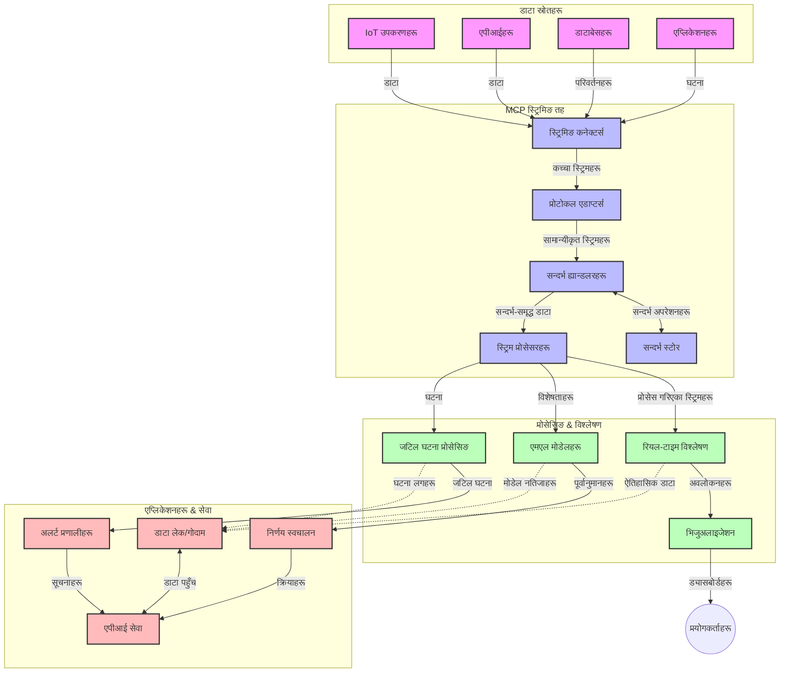

# वास्तविक-समय डाटा स्ट्रिमिङका लागि मोडेल सन्दर्भ प्रोटोकल

## अवलोकन

वास्तविक-समय डाटा स्ट्रिमिङ आजको डाटा-प्रेरित संसारमा अनिवार्य भइसकेको छ, जहाँ व्यवसाय र अनुप्रयोगहरूले तत्पर निर्णय लिन तत्काल सूचना पहुँच आवश्यक पर्छ। मोडेल सन्दर्भ प्रोटोकल (MCP) यी वास्तविक-समय स्ट्रिमिङ प्रक्रियाहरूलाई अनुकूलन गर्न ठूलो प्रगति प्रतिनिधित्व गर्दछ, जसले डाटा प्रसंस्करण क्षमतामा सुधार गर्छ, सन्दर्भीय अखण्डता कायम राख्छ, र समग्र प्रणाली प्रदर्शनलाई उन्नत बनाउँछ।

यो मोड्युलले कसरी MCP ले AI मोडेल, स्ट्रिमिङ प्लेटफर्म, र अनुप्रयोगहरूमा सन्दर्भ व्यवस्थापनका लागि मानकीकृत दृष्टिकोण प्रदान गरेर वास्तविक-समय डाटा स्ट्रिमिङ रूपान्तरण गर्छ भनी अन्वेषण गर्छ।

## वास्तविक-समय डाटा स्ट्रिमिङ परिचय

वास्तविक-समय डाटा स्ट्रिमिङ एउटा प्रविधिगत रूप हो जसले डाटा उत्पादनसँगै निरन्तर रूपले स्थानान्तरण, प्रशोधन, र विश्लेषण सक्षम बनाउँछ, जसले प्रणालीहरूलाई नयाँ सूचनामा तुरुन्त प्रतिक्रिया दिन अनुमति दिन्छ। परम्परागत ब्याच प्रशोधन जसले स्थिर डाटासेटमा सञ्चालन गर्छ भन्दा फरक, स्ट्रिमिङले गतिमा डाटा प्रक्रिया गर्छ, न्यूनतम विलम्बतासँग अन्तर्दृष्टि र क्रिया प्रदान गर्दै।

### वास्तविक-समय डाटा स्ट्रिमिङका मुख्य अवधारणाहरू:

- **निरन्तर डाटा प्रवाह**: डाटा घटनाहरू वा अभिलेखहरूको अन्तहीन, निरन्तर स्ट्रिमको रूपमा प्रक्रिया गरिन्छ।
- **तल्लो विलम्बताकी प्रक्रिया**: प्रणालीहरूले डाटा उत्पादन र प्रसंस्करण बीच समय न्यूनतममा राख्न डिजाइन गरिएको छ।
- **विस्तारयोग्यता**: स्ट्रिमिङ आर्किटेक्चरले विभिन्न डाटा मात्रा र गतिलाई व्यवस्थापन गर्नुपर्ने हुन्छ।
- **त्रुटि सहिष्णुता**: प्रणालीहरू विफलताहरूको सामना गर्न दृढ हुनुपर्छ ताकि डाटा प्रवाह अविरल रहोस्।
- **स्थिति-आधारित प्रक्रिया**: घटनाहरू बीच सन्दर्भ कायम राख्नु अर्थपूर्ण विश्लेषणका लागि महत्वपूर्ण छ।

### मोडेल सन्दर्भ प्रोटोकल र वास्तविक-समय स्ट्रिमिङ

मोडेल सन्दर्भ प्रोटोकल (MCP) ले वास्तविक-समय स्ट्रिमिङ परिवेशमा धेरै महत्वपूर्ण चुनौतीहरू समाधान गर्दछ:

1. **सन्दर्भीय निरन्तरता**: MCP ले वितरण गरिएको स्ट्रिमिङ कम्पोनेन्टहरूमा कसरी सन्दर्भ कायम राखिन्छ भन्ने कुरा मानकीकृत गर्दछ, जसले AI मोडेल र प्रशोधन नोडहरूलाई सान्दर्भिक ऐतिहासिक र वातावरणीय सन्दर्भमा पहुँच सुनिश्चित गर्छ।

2. **कुशल स्थिति व्यवस्थापन**: सन्दर्भ स्थानान्तरणका लागि संरचित संयन्त्रहरू उपलब्ध गराएर MCP ले स्ट्रिमिङ पाइपलाइनहरूमा स्थिति व्यवस्थापनको अतिरिक्त बोझ कम गर्छ।

3. **अन्तरक्रियाशीलता**: MCP ले फरक-फरक स्ट्रिमिङ प्रविधिहरू र AI मोडेलहरूबीच सन्दर्भ साझा गर्ने साझा भाषा सिर्जना गर्छ, जसले थप लचिलो र विस्तारयोग्य आर्किटेक्चर सक्षम पार्छ।

4. **स्ट्रिमिङ-अप्टिमाइज्ड सन्दर्भ**: MCP कार्यान्वयनहरूले प्राथमिकता दिन सक्छन् कुन सन्दर्भ तत्वहरू वास्तविक-समय निर्णय निर्माणमा सबैभन्दा सान्दर्भिक छन्, प्रदर्शन र शुद्धताको लागि अनुकूलन गर्दै।

5. **अनुकूलन प्रशोधन**: MCP मार्फत उचित सन्दर्भ व्यवस्थापनका साथ स्ट्रिमिङ प्रणालीहरूले डाटा भित्रको विकासशील अवस्थाहरू र ढाँचाहरूको आधारमा गतिशील रूपमा प्रशोधन समायोजित गर्न सक्छ।

आईओटी सेन्सर नेटवर्कदेखि वित्तीय ट्रेडिङ प्लेटफर्महरूसम्म आधुनिक अनुप्रयोगहरूमा, MCP र स्ट्रिमिङ प्रविधिहरूको एकीकरणले थप बौद्धिक, सन्दर्भ-सचेत प्रशोधन सक्षम पार्छ जसले वास्तविक-समयमा जटिल र परिवर्तनशील अवस्थाहरूको उचित प्रतिक्रिया दिन सक्छ।

## सिकाइ उद्देश्यहरू

यस पाठको अन्त्यसम्म, तपाईं सक्षम हुनुहुनेछ:

- वास्तविक-समय डाटा स्ट्रिमिङका आधारभूत पक्षहरू र चुनौतीहरू बुझ्न
- मोडेल सन्दर्भ प्रोटोकल (MCP) ले कसरी वास्तविक-समय डाटा स्ट्रिमिङलाई सुधार गर्दछ व्याख्या गर्न
- लोकप्रिय फ्रेमवर्कहरू जस्तै Kafka र Pulsar प्रयोग गरी MCP-आधारित स्ट्रिमिङ समाधानहरू कार्यान्वयन गर्न
- MCP सहित त्रुटि सहिष्णु, उच्च प्रदर्शन स्ट्रिमिङ आर्किटेक्चर डिजाइन र लागू गर्न
- IoT, वित्तीय ट्रेडिङ, र AI-चालित विश्लेषणका प्रयोग केसहरूमा MCP अवधारणाहरू लागू गर्न
- MCP-आधारित स्ट्रिमिङ प्रविधिहरूमा उदीयमान ट्रेन्डहरू र भविष्यका नवप्रवर्तनहरू मूल्यांकन गर्न


### परिभाषा र महत्त्व

वास्तविक-समय डाटा स्ट्रिमिङले न्यूनतम विलम्बताका साथ निरन्तर डाटा उत्पादन, प्रशोधन र वितरण समेट्छ। जहाँ ब्याच प्रशोधनले डाटा समूहमा सङ्ग्रह र प्रक्रिया गर्छ, स्ट्रिमिङ डाटा आउने बित्तिकै क्रमशः प्रक्रिया गर्दथ्यो जुन तुरुन्त अन्तर्दृष्टि र कार्यक्षमता सक्षम बनाउँछ।

वास्तविक-समय डाटा स्ट्रिमिङका मुख्य विशेषताहरू:

- **तल्लो विलम्बता**: डाटा milliseconds देखि सेकन्डभित्र प्रशोधन र विश्लेषण
- **निरन्तर प्रवाह**: विभिन्न स्रोतहरूबाट अवरोधरहित डाटा स्ट्रिमहरू
- **तात्कालिक प्रक्रिया**: डाटा समूहहरूमा नभएर जति आउँछ त्यहि विश्लेषण
- **घटना-आधारित वास्तुकला**: घटनाहरू भइरहेका बेला तुरुन्त प्रतिक्रिया

### परम्परागत डाटा स्ट्रिमिङका चुनौतीहरू

परम्परागत डाटा स्ट्रिमिङ दृष्टिकोणहरूले विभिन्न सीमाहरू भोग्नुपर्छ:

1. **सन्दर्भ हराइरहनु**: वितरण प्रणालीहरूमा सन्दर्भ कायम राख्न कठिनाइ
2. **विस्तार समस्याहरू**: उच्च-द्रव्यमान, उच्च-गतिका डाटा व्यवस्थापनमा चुनौती
3. **सम्पर्क जटिलता**: फरक प्रणालीहरूबीच अन्तरक्रियाशीलताका समस्या
4. **विलम्ब व्यवस्थापन**: थ्रुपुट र प्रशोधन समय सन्तुलनमा कठिनाई
5. **डाटा स्थिरता**: स्ट्रिमभर डाटा शुद्धता र पूर्णताको सुनिश्चितता

## मोडेल सन्दर्भ प्रोटोकल (MCP) बुझ्न

### MCP के हो?

मोडेल सन्दर्भ प्रोटोकल (MCP) एउटा मानकीकृत सञ्चार प्रोटोकल हो जुन AI मोडेलहरू र अनुप्रयोगहरू बीच प्रभावकारी अन्तरक्रिया सुगम बनाउने उद्देश्यले डिजाइन गरिएको हो। वास्तविक-समय डाटा स्ट्रिमिङ सन्दर्भमा, MCP ले निम्नका लागि फ्रेमवर्क प्रदान गर्दछ:

- डाटा पाइपलाइनभरि सन्दर्भ संरक्षण
- डाटा विनिमय ढाँचाहरू मानकीकृत पार्ने
- ठूलो डाटासेटहरूको प्रसारण अनुकूलन गर्ने
- मोडेल-देखि-मोडेल र मोडेल-देखि-एप्लिकेसन सञ्चार सुधार गर्ने

### मुख्य कम्पोनेन्टहरू र वास्तुकला

वास्तविक-समय स्ट्रिमिङका लागि MCP वास्तुकलामा विभिन्न मुख्य कम्पोनेन्टहरू छन्:

1. **सन्दर्भ ह्यान्डलरहरू**: स्ट्रिमिङ पाइपलाइन भरि सन्दर्भीय जानकारी व्यवस्थापन र संरक्षण गर्ने
2. **स्ट्रिम प्रक्रिया गर्ने यन्त्रहरू**: सन्दर्भ-सचेत प्रविधिहरू प्रयोग गरी आउने डाटा स्ट्रिम प्रक्रिया गर्ने
3. **प्रोटोकल एडाप्टरहरू**: विभिन्न स्ट्रिमिङ प्रोटोकलहरू बीच सन्दर्भ संरक्षण गर्दै रूपान्तरण गर्ने
4. **सन्दर्भ भण्डारण**: सन्दर्भीय जानकारी कुशलतापूर्वक भण्डारण र पुनःप्राप्ति गर्ने
5. **स्ट्रिमिङ कनेक्टरहरू**: विभिन्न स्ट्रिमिङ प्लेटफर्महरू (Kafka, Pulsar, Kinesis आदि) सँग जडान गर्ने



### MCP ले वास्तविक-समय डाटा ह्यान्डलिङ कसरी सुधार गर्छ

MCP ले परम्परागत स्ट्रिमिङ चुनौतीहरूलाई निम्नमार्फत सम्बोधन गर्छ:

- **सन्दर्भीय अखण्डता**: सम्पूर्ण पाइपलाइनमा डेटा बिन्दुहरूबीच सम्बन्ध कायम राख्ने
- **प्रसारण अनुकूलन**: बुद्धिमत्ता पूर्ण सन्दर्भ व्यवस्थापनबाट डाटा विनिमयमा दोहोरिनेपन कम गर्ने
- **मानकीकृत इन्टरफेसहरू**: स्ट्रिमिङ कम्पोनेन्टहरूका लागि एकरूप API उपलब्ध गराउने
- **विलम्बता घटाउने**: कुशल सन्दर्भ ह्यान्डलिङबाट प्रशोधन बोझ न्यून गर्ने
- **विस्तारयोग्यता सुधार्ने**: सन्दर्भ कायम राख्दै तेर्सो स्केलिङ सपोर्ट गर्ने

## एकीकरण र कार्यान्वयन

वास्तविक-समय डाटा स्ट्रिमिङ प्रणालीहरूले प्रदर्शन र सन्दर्भीय अखण्डता दुबै कायम राख्न सावधानीपूर्वक वास्तुकला डिजाइन र कार्यान्वयन आवश्यक पर्दछ। मोडेल सन्दर्भ प्रोटोकलले AI मोडेल र स्ट्रिमिङ प्रविधिहरू बीच एक मानकीकृत एकीकरण दृष्टिकोण प्रदान गर्दछ, जसले थप उन्नत, सन्दर्भ-सचेत प्रशोधन पाइपलाइनहरू सम्भव बनाउँछ।

### स्ट्रिमिङ आर्किटेक्चरहरूमा MCP एकीकरणको अवलोकन

वास्तविक-समय स्ट्रिमिङ वातावरणमा MCP कार्यान्वयन गर्दा विभिन्न महत्वपूर्ण पक्षहरू विचार गर्नुपर्ने हुन्छ:

1. **सन्दर्भ सिरियलाइजेशन र ट्रान्सपोर्ट**: MCP ले स्ट्रिमिङ डाटा प्याकेटहरू भित्र सन्दर्भको कुशल इन्कोडिङका संयन्त्र प्रदान गर्छ, जसले आवश्यक सन्दर्भलाई डेटा प्रक्रियाको सम्पूर्ण पाइपलाइनभरि साथमा लैजान्छ। यसमा स्ट्रिमिङ ट्रान्सपोर्टका लागि अनुकूलित मानकीकृत सिरियलाइजेशन ढाँचाहरू समावेश छन्।

2. **स्थिति-आधारित स्ट्रिम प्रक्रिया**: MCP ले प्रशोधन नोडहरूमा सधैं सन्दर्भ प्रतिनिधित्व कायम राखेर थप बुद्धिमत्ता पूर्ण स्थिति-आधारित प्रक्रिया सक्षम गर्दछ। यो विशेषगरी वितरण गरिएको स्ट्रिमिङ आर्किटेक्चरहरूमा मूल्यवान हुन्छ जहाँ स्थिति व्यवस्थापन परम्परागत रूपमा चुनौतीपूर्ण हुन्छ।

3. **घटना-समय र प्रशोधन-समय**: MCP कार्यान्वयनहरूले सामान्य चुनौती सम्बोधन गर्नुपर्छ कि घटना कहिले भयो र कहिले प्रक्रिया भयो भनी भिन्न छुट्याउन। प्रोटोकलले घटना समयसँग सम्बन्धित सन्दर्भलाई समावेश गर्न सक्छ जसले घटना समयको अर्थ कायम राख्छ।

4. **ब्याकप्रेशर व्यवस्थापन**: सन्दर्भ ह्यान्डलिङ मानकीकृत गरेर, MCP ले स्ट्रिमिङ प्रणालीहरूमा ब्याकप्रेशर व्यवस्थापनमा मद्दत गर्छ, जसले कम्पोनेन्टहरूलाई आफ्नो प्रसोधन क्षमताहरू संकेत गर्न र प्रवाह अनुकूलन गर्न दिन्छ।

5. **सन्दर्भ विंडोइङ र समेकन**: MCP ले समय र सापेक्ष सन्दर्भहरूको संरचित प्रतिनिधित्व उपलब्ध गराएर थप जटिल विन्डोइङ अपरेसनहरूलाई सहज बनाउँछ, जसले घटनाहरूको स्ट्रिमहरूमा अर्थपूर्ण समेकनहरू सम्भव पार्छ।

6. **एकचोटि प्रक्रिया निष्पादन**: ठ्याक्कै-एकचोटि अर्थव्यवस्था आवश्यक पर्ने स्ट्रिमिङ प्रणालीहरूमा, MCP ले प्रसोधन मेटाडाटा समावेश गर्न सक्छ जसले वितरण कम्पोनेन्टहरूमा प्रसोधन स्थिति ट्र्याक र पुष्टि गर्न मद्दत गर्छ।

विभिन्न स्ट्रिमिङ प्रविधिहरूमा MCP कार्यान्वयनले सन्दर्भ व्यवस्थापनको लागि एकीकृत दृष्टिकोण सिर्जना गर्छ, जसले अनुकूलन कोडको आवश्यकता घटाउँछ र प्रणालीलाई डाटाको पाइपलाइनमार्फत बगाउँंदा अर्थपूर्ण सन्दर्भ कायम राख्न सक्षम बनाउँछ।

### विविध डाटा स्ट्रिमिङ फ्रेमवर्कहरूमा MCP

यी उदाहरणहरूले वर्तमान MCP विनिर्देशन अनुसरण गर्छ जसले JSON-RPC आधारित प्रोटोकलमा भिन्न ट्रान्सपोर्ट संयन्त्रहरूमा केन्द्रित छ। कोडले देखाउँछ कसरी तपाईँले अनुकूल ट्रान्सपोर्टहरू कार्यान्वयन गर्न सक्नुहुन्छ जुन Kafka र Pulsar जस्ता स्ट्रिमिङ प्लेटफर्महरूलाई MCP प्रोटोकलसँग पूर्ण अनुकूलताका साथ जोड्छ।

उदाहरणहरूले देखाउँछन् कसरी स्ट्रिमिङ प्लेटफर्महरु MCP सँग एकीकृत गरेर वास्तविक-समय डाटा प्रशोधन गर्दै सन्दर्भिय जागरूकता कायम राख्न सकिन्छ, जुन MCP को केन्द्रीय पक्ष हो। यसले कोड नमूनाहरूलाई MCP विनिर्देशनको २०२५ जून स्थितिलाई सही रूपमा प्रतिबिम्बित गर्न सुनिश्चित गर्दछ।

MCP लोकप्रिय स्ट्रिमिङ फ्रेमवर्कहरूसँग एकीकृत गर्न सकिन्छ जसमा:

#### Apache Kafka एकीकरण

```python
import asyncio
import json
from typing import Dict, Any, Optional
from confluent_kafka import Consumer, Producer, KafkaError
from mcp.client import Client, ClientCapabilities
from mcp.core.message import JsonRpcMessage
from mcp.core.transports import Transport

# MCP लाई Kafka सँग जोड्नको लागि अनुकूलित ट्रान्सपोर्ट क्लास
class KafkaMCPTransport(Transport):
    def __init__(self, bootstrap_servers: str, input_topic: str, output_topic: str):
        self.bootstrap_servers = bootstrap_servers
        self.input_topic = input_topic
        self.output_topic = output_topic
        self.producer = Producer({'bootstrap.servers': bootstrap_servers})
        self.consumer = Consumer({
            'bootstrap.servers': bootstrap_servers,
            'group.id': 'mcp-client-group',
            'auto.offset.reset': 'earliest'
        })
        self.message_queue = asyncio.Queue()
        self.running = False
        self.consumer_task = None
        
    async def connect(self):
        """Connect to Kafka and start consuming messages"""
        self.consumer.subscribe([self.input_topic])
        self.running = True
        self.consumer_task = asyncio.create_task(self._consume_messages())
        return self
        
    async def _consume_messages(self):
        """Background task to consume messages from Kafka and queue them for processing"""
        while self.running:
            try:
                msg = self.consumer.poll(1.0)
                if msg is None:
                    await asyncio.sleep(0.1)
                    continue
                
                if msg.error():
                    if msg.error().code() == KafkaError._PARTITION_EOF:
                        continue
                    print(f"Consumer error: {msg.error()}")
                    continue
                
                # सन्देश मानलाई JSON-RPC को रूपमा पार्स गर्नुहोस्
                try:
                    message_str = msg.value().decode('utf-8')
                    message_data = json.loads(message_str)
                    mcp_message = JsonRpcMessage.from_dict(message_data)
                    await self.message_queue.put(mcp_message)
                except Exception as e:
                    print(f"Error parsing message: {e}")
            except Exception as e:
                print(f"Error in consumer loop: {e}")
                await asyncio.sleep(1)
    
    async def read(self) -> Optional[JsonRpcMessage]:
        """Read the next message from the queue"""
        try:
            message = await self.message_queue.get()
            return message
        except Exception as e:
            print(f"Error reading message: {e}")
            return None
    
    async def write(self, message: JsonRpcMessage) -> None:
        """Write a message to the Kafka output topic"""
        try:
            message_json = json.dumps(message.to_dict())
            self.producer.produce(
                self.output_topic,
                message_json.encode('utf-8'),
                callback=self._delivery_report
            )
            self.producer.poll(0)  # कलब्याकहरू ट्रिगर गर्नुहोस्
        except Exception as e:
            print(f"Error writing message: {e}")
    
    def _delivery_report(self, err, msg):
        """Kafka producer delivery callback"""
        if err is not None:
            print(f'Message delivery failed: {err}')
        else:
            print(f'Message delivered to {msg.topic()} [{msg.partition()}]')
    
    async def close(self) -> None:
        """Close the transport"""
        self.running = False
        if self.consumer_task:
            self.consumer_task.cancel()
            try:
                await self.consumer_task
            except asyncio.CancelledError:
                pass
        self.consumer.close()
        self.producer.flush()

# Kafka MCP ट्रान्सपोर्टको उदाहरण प्रयोग
async def kafka_mcp_example():
    # Kafka ट्रान्सपोर्टसहित MCP क्लाइन्ट सिर्जना गर्नुहोस्
    client = Client(
        {"name": "kafka-mcp-client", "version": "1.0.0"},
        ClientCapabilities({})
    )
    
    # Kafka ट्रान्सपोर्ट सिर्जना गर्नुहोस् र जडान गर्नुहोस्
    transport = KafkaMCPTransport(
        bootstrap_servers="localhost:9092",
        input_topic="mcp-responses",
        output_topic="mcp-requests"
    )
    
    await client.connect(transport)
    
    try:
        # MCP सत्र सुरु गर्नुहोस्
        await client.initialize()
        
        # MCP मार्फत एउटा उपकरण सञ्चालन गर्ने उदाहरण
        response = await client.execute_tool(
            "process_data",
            {
                "data": "sample data",
                "metadata": {
                    "source": "sensor-1",
                    "timestamp": "2025-06-12T10:30:00Z"
                }
            }
        )
        
        print(f"Tool execution response: {response}")
        
        # सफा बन्द गर्नुहोस्
        await client.shutdown()
    finally:
        await transport.close()

# उदाहरण चलाउनुहोस्
if __name__ == "__main__":
    asyncio.run(kafka_mcp_example())
```

#### Apache Pulsar कार्यान्वयन

```python
import asyncio
import json
import pulsar
from typing import Dict, Any, Optional
from mcp.core.message import JsonRpcMessage
from mcp.core.transports import Transport
from mcp.server import Server, ServerOptions
from mcp.server.tools import Tool, ToolExecutionContext, ToolMetadata

# Pulsar प्रयोग गर्ने कस्टम MCP ट्रान्सपोर्ट सिर्जना गर्नुहोस्
class PulsarMCPTransport(Transport):
    def __init__(self, service_url: str, request_topic: str, response_topic: str):
        self.service_url = service_url
        self.request_topic = request_topic
        self.response_topic = response_topic
        self.client = pulsar.Client(service_url)
        self.producer = self.client.create_producer(response_topic)
        self.consumer = self.client.subscribe(
            request_topic,
            "mcp-server-subscription",
            consumer_type=pulsar.ConsumerType.Shared
        )
        self.message_queue = asyncio.Queue()
        self.running = False
        self.consumer_task = None
    
    async def connect(self):
        """Connect to Pulsar and start consuming messages"""
        self.running = True
        self.consumer_task = asyncio.create_task(self._consume_messages())
        return self
    
    async def _consume_messages(self):
        """Background task to consume messages from Pulsar and queue them for processing"""
        while self.running:
            try:
                # टाइमआउट सहित गैर-ब्लकिङ प्राप्ति
                msg = self.consumer.receive(timeout_millis=500)
                
                # सन्देश प्रक्रिया गर्नुहोस्
                try:
                    message_str = msg.data().decode('utf-8')
                    message_data = json.loads(message_str)
                    mcp_message = JsonRpcMessage.from_dict(message_data)
                    await self.message_queue.put(mcp_message)
                    
                    # सन्देशलाई स्वीकृत गर्नुहोस्
                    self.consumer.acknowledge(msg)
                except Exception as e:
                    print(f"Error processing message: {e}")
                    # त्रुटि भएमा नकारात्मक स्वीकृति गर्नुहोस्
                    self.consumer.negative_acknowledge(msg)
            except Exception as e:
                # टाइमआउट वा अन्य अपवादहरूलाई व्यवस्थापन गर्नुहोस्
                await asyncio.sleep(0.1)
    
    async def read(self) -> Optional[JsonRpcMessage]:
        """Read the next message from the queue"""
        try:
            message = await self.message_queue.get()
            return message
        except Exception as e:
            print(f"Error reading message: {e}")
            return None
    
    async def write(self, message: JsonRpcMessage) -> None:
        """Write a message to the Pulsar output topic"""
        try:
            message_json = json.dumps(message.to_dict())
            self.producer.send(message_json.encode('utf-8'))
        except Exception as e:
            print(f"Error writing message: {e}")
    
    async def close(self) -> None:
        """Close the transport"""
        self.running = False
        if self.consumer_task:
            self.consumer_task.cancel()
            try:
                await self.consumer_task
            except asyncio.CancelledError:
                pass
        self.consumer.close()
        self.producer.close()
        self.client.close()

# स्ट्रिमिङ डाटा प्रक्रिया गर्ने नमूना MCP उपकरण परिभाषित गर्नुहोस्
@Tool(
    name="process_streaming_data",
    description="Process streaming data with context preservation",
    metadata=ToolMetadata(
        required_capabilities=["streaming"]
    )
)
async def process_streaming_data(
    ctx: ToolExecutionContext,
    data: str,
    source: str,
    priority: str = "medium"
) -> Dict[str, Any]:
    """
    Process streaming data while preserving context
    
    Args:
        ctx: Tool execution context
        data: The data to process
        source: The source of the data
        priority: Priority level (low, medium, high)
        
    Returns:
        Dict containing processed results and context information
    """
    # MCP सन्दर्भको उपयोग गर्ने उदाहरण प्रक्रिया
    print(f"Processing data from {source} with priority {priority}")
    
    # MCP बाट संवाद सन्दर्भ पहुँच गर्नुहोस्
    conversation_id = ctx.conversation_id if hasattr(ctx, 'conversation_id') else "unknown"
    
    # सुधारिएको सन्दर्भसहित परिणामहरू फिर्ता गर्नुहोस्
    return {
        "processed_data": f"Processed: {data}",
        "context": {
            "conversation_id": conversation_id,
            "source": source,
            "priority": priority,
            "processing_timestamp": ctx.get_current_time_iso()
        }
    }

# Pulsar ट्रान्सपोर्ट प्रयोग गर्ने उदाहरण MCP सर्भर कार्यान्वयन
async def run_mcp_server_with_pulsar():
    # MCP सर्भर सिर्जना गर्नुहोस्
    server = Server(
        {"name": "pulsar-mcp-server", "version": "1.0.0"},
        ServerOptions(
            capabilities={"streaming": True}
        )
    )
    
    # हाम्रो उपकरण दर्ता गर्नुहोस्
    server.register_tool(process_streaming_data)
    
    # Pulsar ट्रान्सपोर्ट सिर्जना र जडान गर्नुहोस्
    transport = PulsarMCPTransport(
        service_url="pulsar://localhost:6650",
        request_topic="mcp-requests",
        response_topic="mcp-responses"
    )
    
    try:
        # Pulsar ट्रान्सपोर्टसँग सर्भर सुरु गर्नुहोस्
        await server.run(transport)
    finally:
        await transport.close()

# सर्भर चलाउनुहोस्
if __name__ == "__main__":
    asyncio.run(run_mcp_server_with_pulsar())
```

### कार्यान्वयनका लागि उत्कृष्ट अभ्यासहरू

वास्तविक-समय स्ट्रिमिङका निम्ति MCP लागू गर्दा:

1. **त्रुटि सहिष्णुताका लागि डिजाइन**:
   - उचित त्रुटि नियन्त्रण कार्यान्वयन गर्नुहोस्
   - असफल सन्देशहरूका लागि डेड-लेटर क्यूहरू प्रयोग गर्नुहोस्
   - आइडेम्पोटेन्ट प्रक्रिया निर्माण गर्नुहोस्

2. **प्रदर्शन अनुकूलन**:
   - उपयुक्त बफर आकारहरू सँग संयोजन गर्नुहोस्
   - आवश्यकताअनुसार ब्याचिङ प्रयोग गर्नुहोस्
   - ब्याकप्रेशर संयन्त्रहरू लागू गर्नुहोस्

3. **निगरानी र अवलोकन**:
   - स्ट्रिम प्रक्रिया मेट्रिक्स ट्र्याक गर्नुहोस्
   - सन्दर्भ प्रसारण निरीक्षण गर्नुहोस्
   - अनियमितताहरूका लागि अलार्म सेटअप गर्नुहोस्

4. **तपाईंका स्ट्रिमहरूलाई सुरक्षित बनाउनुहोस्**:
   - संवेदनशील डाटाका लागि इन्क्रिप्सन कार्यान्वयन गर्नुहोस्
   - प्रमाणीकरण र प्राधिकरण प्रयोग गर्नुहोस्
   - उचित पहुँच नियन्त्रण लागू गर्नुहोस्


### IoT र Edge Computing मा MCP

MCP ले IoT स्ट्रिमिङलाई यसरी सुधार गर्छ:

- प्रशोधन पाइपलाइनभरि यन्त्र सन्दर्भ संरक्षण
- कुशल edge-to-cloud डाटा स्ट्रिमिङ सक्षम पार्ने
- IoT डाटा स्ट्रिमहरूमा वास्तविक-समय विश्लेषण समर्थन गर्ने
- सन्दर्भसँग यन्त्र-देखि-यन्त्र सञ्चार सुविधा गराउने

उदाहरण: स्मार्ट सिटी सेन्सर नेटवर्कहरू
```
Sensors → Edge Gateways → MCP Stream Processors → Real-time Analytics → Automated Responses
```

### वित्तीय लेनदेन र उच्च-फ्रिक्वेन्सी ट्रेडिङमा भूमिका

वित्तीय डाटा स्ट्रिमिङका लागि MCP ले महत्वपूर्ण फाइदाहरू प्रदान गर्छ:

- ट्रेडिङ निर्णयका लागि अत्यंत-तल्लो विलम्बता प्रक्रिया
- प्रसोधनको सम्पूर्ण अवधिमा लेनदेन सन्दर्भ कायम राख्ने
- सन्दर्भिएत ज्ञानका साथ जटिल घटना प्रशोधन समर्थन गर्ने
- वितरण गरिएको ट्रेडिङ प्रणालीहरूमा डाटा स्थिरता सुनिश्चित गर्ने

### AI-चालित डाटा विश्लेषणलाई सुधार

MCP ले स्ट्रिमिङ विश्लेषणका लागि नयाँ सम्भावनाहरू सिर्जना गर्छ:

- वास्तविक-समय मोडेल प्रशिक्षण र अनुमान
- स्ट्रिमिङ डाटाबाट निरन्तर सिकाइ
- सन्दर्भ-सचेत फिचर निष्कर्षण
- सन्दर्भ संरक्षणसहित बहु-मोडेल अनुमान पाइपलाइनहरू

## भविष्यका ट्रेन्डहरू र नवप्रवर्तन

### वास्तविक-समय परिवेशमा MCP को विकास

भविष्यतर्फ अगाडि हेर्दा, हामी MCP को विकासको अपेक्षा गर्छौं जसले निम्न विषयहरू सम्बोधन गर्नेछ:

- **क्वान्टम कम्प्युटिंग एकीकरण**: क्वान्टम-आधारित स्ट्रिमिङ प्रणालीहरूको लागि तयारी
- **एज-नेटिभ प्रक्रिया**: थप सन्दर्भ-सचेत प्रक्रिया एज उपकरणहरूमा सार्ने
- **स्वायत्त स्ट्रिम व्यवस्थापन**: स्वयं-अनुकूलन स्ट्रिम पाइपलाइनहरू
- **संघीय स्ट्रिमिङ**: गोपनीयता कायम राख्दै वितरण प्रक्रिया

### प्रविधिमा संभावित प्रगतिहरू

भविष्यका MCP स्ट्रिमिङलाई आकार दिने उदयमान प्रविधिहरू:

1. **AI-अनुकूलित स्ट्रिमिङ प्रोटोकलहरू**: AI कार्यभारका लागि विशेष रूपमा डिजाइन गरिएका प्रोटोकलहरू
2. **न्यूरोमोर्फिक कम्प्युटिंग एकीकरण**: मस्तिष्क-प्रेरित कम्प्युटिङ स्ट्रिम प्रोसेसिंगका लागि
3. **सर्भरलेस स्ट्रिमिङ**: पूर्वाधार व्यवस्थापन बिना घटना-चालित, स्केलेबल स्ट्रिमिङ
4. **वितरित सन्दर्भ स्टोरहरू**: विश्वव्यापी वितरण गरिएको तथापि उच्च स्थिर सन्दर्भ व्यवस्थापन

## व्यावहारिक अभ्यासहरू

### अभ्यास १: आधारभूत MCP स्ट्रिमिङ पाइपलाइन सेटअप

यस अभ्यासमा, तपाईं सिक्नुहुनेछ कसरी:
- आधारभूत MCP स्ट्रिमिङ वातावरण कन्फिगर गर्ने
- स्ट्रिम प्रशोधनका लागि सन्दर्भ ह्यान्डलरहरू कार्यान्वयन गर्ने
- सन्दर्भ संरक्षण परीक्षण र प्रमाणित गर्ने

### अभ्यास २: वास्तविक-समय विश्लेषण ड्यासबोर्ड निर्माण

पूर्ण अनुप्रयोग सिर्जना गर्नुहोस् जुन:
- MCP प्रयोग गरेर स्ट्रिमिङ डाटा इनगेस्ट गर्छ
- सन्दर्भ कायम राख्दै स्ट्रिम प्रक्रियागर्दछ
- वास्तविक-समयमा नतिजाहरू देखाउँछ

### अभ्यास ३: MCP सँग जटिल घटना प्रशोधन कार्यान्वयन

उन्नत अभ्यास समेट्दै:
- स्ट्रिमहरूमा ढाँचा पहिचान
- बहु स्ट्रिमहरूमा सन्दर्भीय सहसम्बन्ध
- अवधारण सन्दर्भ सहित जटिल घटनाहरू उत्पादन

## थप स्रोतहरू

- [Model Context Protocol Specification](https://modelcontextprotocol.io) - आधिकारिक MCP विनिर्देशन र दस्तावेज
- [Apache Kafka Documentation](https://kafka.apache.org/documentation/) - स्ट्रिम प्रक्रिया को लागि Kafka बारे सिक्न
- [Apache Pulsar](https://pulsar.apache.org/) - एकीकृत मेसेजिङ र स्ट्रिमिङ प्लेटफर्म
- [Streaming Systems: The What, Where, When, and How of Large-Scale Data Processing](https://www.oreilly.com/library/view/streaming-systems/9781491983867/) - स्ट्रिमिङ आर्किटेक्चरमा व्यापक पुस्तक
- [Microsoft Azure Event Hubs](https://learn.microsoft.com/azure/event-hubs/event-hubs-about) - प्रबन्धित घटना स्ट्रिमिङ सेवा
- [MLflow Documentation](https://mlflow.org/docs/latest/index.html) - ML मोडेल ट्र्याकिङ र डिप्लोइमेन्टका लागि
- [Real-Time Analytics with Apache Storm](https://storm.apache.org/releases/current/index.html) - वास्तविक-समय गणनाको लागि प्रशोधन फ्रेमवर्क
- [Flink ML](https://nightlies.apache.org/flink/flink-ml-docs-master/) - Apache Flink को लागि मेसिन शिक्षण पुस्तकालय
- [LangChain Documentation](https://python.langchain.com/docs/get_started/introduction) - LLMहरूसँग अनुप्रयोग निर्माण

## सिकाइ नतिजाहरू

यस मोड्युल पूर्ति गरी, तपाईं सक्षम हुनुहुनेछ:

- वास्तविक-समय डाटा स्ट्रिमिङका आधार तत्व र चुनौतीहरू बुझ्न
- मोडेल सन्दर्भ प्रोटोकल (MCP) ले कसरी वास्तविक-समय डाटालाई सुधार गर्दछ व्याख्या गर्न
- लोकप्रिय फ्रेमवर्कहरू जस्तै Kafka र Pulsar प्रयोग गरी MCP-आधारित स्ट्रिमिङ समाधान कार्यान्वयन गर्न
- MCP सहित त्रुटि सहिष्णु, उच्च-प्रदर्शन स्ट्रिमिङ आर्किटेक्चर डिजाइन र तैनाती गर्न
- IoT, वित्तीय ट्रेडिङ, र AI-आधारित विश्लेषण प्रयोग केसहरूमा MCP अवधारणाहरू लागू गर्न
- MCP-आधारित स्ट्रिमिङ प्रविधिहरूमा नयाँ ट्रेन्ड र भविष्यका नवप्रवर्तनहरू मूल्यांकन गर्न

## अब के

- [5.11 वास्तविक-समय खोज](../mcp-realtimesearch/README.md)

---

<!-- CO-OP TRANSLATOR DISCLAIMER START -->
**अस्वीकरण**:
यो दस्तावेज़ AI अनुवाद सेवा [Co-op Translator](https://github.com/Azure/co-op-translator) प्रयोग गरेर अनुवाद गरिएको हो। हामी सही हुन प्रयास गर्छौं, तर कृपया जानकार हुनुस् कि स्वचालित अनुवादमा त्रुटिहरू वा अशुद्धताहरू हुन सक्छन्। मूल दस्तावेज़ यसको मूल भाषामा आधिकारिक स्रोत मानिनुपर्छ। महत्वपूर्ण जानकारीका लागि व्यावसायिक मानव अनुवाद सिफारिस गरिन्छ। यस अनुवादको प्रयोगबाट उत्पन्न कुनै पनि गलत बुझाइ वा त्रुटिको लागि हामी जिम्मेवार छैनौं।
<!-- CO-OP TRANSLATOR DISCLAIMER END -->