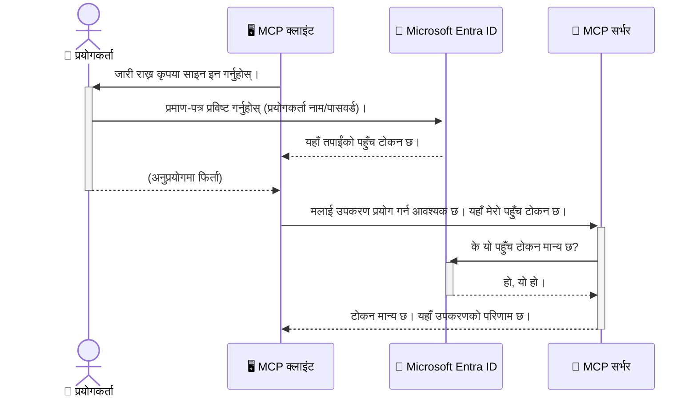

# AI कार्यप्रवाहहरू सुरक्षित गर्ने: मोडेल कन्टेक्स्ट प्रोटोकल सर्भरहरूको लागि Entra ID प्रमाणीकरण

## परिचय
तपाईंको मोडेल कन्टेक्स्ट प्रोटोकल (MCP) सर्भरलाई सुरक्षित बनाउनु तपाईंको घरको फ्रन्ट ढोकामा ताला लगाउनु जस्तै महत्वपूर्ण हुन्छ। आफ्नो MCP सर्भरलाई खुल्ला छोड्नुले तपाईंका उपकरणहरू र डाटा अनधिकृत पहुँचका लागि जोखिममा पार्छ, जसले सुरक्षा उल्लङ्घन निम्त्याउन सक्छ। Microsoft Entra ID एक बलियो क्लाउड-आधारित पहिचान र पहुँच व्यवस्थापन समाधान हो, जसले सुनिश्चित गर्दछ कि केवल अधिकृत प्रयोगकर्ताहरू र अनुप्रयोगहरूले मात्र तपाईंको MCP सर्भरसँग अन्तरक्रिया गर्न सकून्। यस खण्डमा, तपाईंले Entra ID प्रमाणीकरण प्रयोग गरेर कसरी तपाईंको AI कार्यप्रवाहहरूलाई सुरक्षा गर्ने जान्नुहुनेछ।

## सिकाइ उद्देश्यहरू
यस खण्डको अन्त्यसम्म, तपाईं सक्षम हुनुहुनेछ:

- MCP सर्भरहरू सुरक्षित गर्नुपर्ने महत्त्व बुझ्न।
- Microsoft Entra ID र OAuth 2.0 प्रमाणीकरणका आधारभूत कुरा व्याख्या गर्न।
- सार्वजनिक र गोप्य क्लाइन्टहरूबीचको भिन्नता चिन्हित गर्न।
- स्थानीय (सार्वजनिक क्लाइन्ट) र रिमोट (गोप्य क्लाइन्ट) MCP सर्भर परिदृश्योंमा Entra ID प्रमाणीकरण लागू गर्न।
- AI कार्यप्रवाह विकास गर्दा सुरक्षा उत्तम अभ्यासहरू लागू गर्न।

## सुरक्षा र MCP

जसरी तपाईं आफ्नो घरको फ्रन्ट ढोका बिना ताला खुला छोड्नु हुन्न, त्यसरी नै तपाईं आफ्नो MCP सर्भर सबैको लागि खुला छोड्नु हुँदैन। तपाईंको AI कार्यप्रवाहहरूलाई सुरक्षित बनाउनु मजबुत, भरपर्दो र सुरक्षित अनुप्रयोगहरू बनाउने आधार हो। यस अध्यायले तपाईंलाई Microsoft Entra ID प्रयोग गरी तपाईंको MCP सर्भरहरू सुरक्षित गर्ने तरिका सिकाउने छ, जसले केवल अधिकृत प्रयोगकर्ताहरू र अनुप्रयोगहरूलाई तपाईंका उपकरण र डाटासँग अन्तरक्रिया गर्ने अनुमति दिन्छ।

## MCP सर्भरहरूका लागि सुरक्षा किन महत्वपूर्ण छ

कल्पना गर्नुहोस् कि तपाईंको MCP सर्भरमा एउटा उपकरण छ जुन इमेल पठाउन वा ग्राहक डाटाबेस पहुँच गर्न सक्छ। यदि सर्भर असुरक्षित छ भने, कुनै पनि व्यक्तिले त्यस उपकरणलाई प्रयोग गर्न सक्नेछ, जसले अनधिकृत डाटा पहुँच, स्प्याम वा अन्य दुर्भावनापूर्ण क्रियाकलाप निम्त्याउन सक्छ।

प्रमाणीकरण लागू गरेर, तपाईं सुनिश्चित गर्नुहुन्छ कि सर्भरमा गरिएको प्रत्येक अनुरोध प्रमाणित छ, जसले अनुरोध गर्ने प्रयोगकर्ता वा अनुप्रयोगको पहिचान पुष्टि गर्छ। यो तपाईंको AI कार्यप्रवाहहरूलाई सुरक्षीत पार्ने पहिलो र सबैभन्दा महत्त्वपूर्ण कदम हो।

## Microsoft Entra ID परिचय

[**Microsoft Entra ID**](https://adoption.microsoft.com/microsoft-security/entra/) क्लाउड-आधारित पहिचान र पहुँच व्यवस्थापन सेवा हो। यसलाई तपाईंका अनुप्रयोगहरूको लागि एक सार्वभौमिक सुरक्षा गार्डको रूपमा सोच्न सकिन्छ। यो प्रयोगकर्ता पहिचानलाई जाँच्ने (प्रमाणीकरण) र उनीहरूलाई के गर्न अनुमति छ निर्धारण गर्ने (अधिकृत) जटिल प्रक्रियालाई व्यवस्थापन गर्छ।

Entra ID प्रयोग गरेर, तपाईं निम्न गर्न सक्नुहुन्छ:

- प्रयोगकर्ताहरूका लागि सुरक्षित साइन-इन सक्षम पार्न।
- API र सेवाहरूलाई सुरक्षा गर्न।
- केन्द्रिय स्थानबाट पहुँच नीति व्यवस्थापन गर्न।

MCP सर्भरहरूको लागि, Entra ID एक बलियो र व्यापक रूपमा विश्वास गरिने समाधान प्रदान गर्छ जसले को सर्भरको क्षमता पहुँच गर्न सक्छ भनेर व्यवस्थापन गर्छ।

---

## जादू बुझ्नुहोस्: Entra ID प्रमाणीकरण कसरी काम गर्छ

Entra ID ले प्रमाणीकरण गर्न खुला मानकहरू जस्तै **OAuth 2.0** प्रयोग गर्दछ। विवरणहरू जटिल हुन सक्लान्, तर मुख्य अवधारणा सरल छ र एक दृष्टान्तबाट बुझ्न सकिन्छ।

### OAuth 2.0 को सरल परिचय: भ्याले की

OAuth 2.0 लाई तपाईंको गाडीको लागि भ्याले सेवा जस्तै सोच्नुहोस्। तपाईं जब रेस्टुरेन्ट पुग्नुहुन्छ, तपाईं भ्यालेलाई आफ्नो मुख्य की दिनुहुन्न। बरू, तपाईं **भ्याले की** दिनुहुन्छ जसको सीमित अधिकार हुन्छ—यसले गाडी सुरु गर्न र ढोका बन्द गर्न सक्छ, तर ट्रंक वा ग्लोभ कम्पार्टमेन्ट खोल्न सक्दैन।

यस दृष्टान्तमा:

- **तपाईं** हुनुहुन्छ **प्रयोगकर्ता**।
- **तपाईंको गाडी** हो **MCP सर्भर** जसमा मूल्यवान उपकरण र डाटा छ।
- **भ्याले** हो **Microsoft Entra ID**।
- **पार्किङ अटेन्डेन्ट** हो **MCP क्लाइन्ट** (सर्भर पहुँच गर्न खोज्ने अनुप्रयोग)।
- **भ्याले की** हो **एक्सेस टोकन**।

एक्सेस टोकन Entra ID बाट तपाईं साइन इन गरेपछि MCP क्लाइन्टले प्राप्त गर्ने सुरक्षित टेक्स्ट स्ट्रिङ हो। क्लाइन्टले यो टोकन MCP सर्भरलाई प्रत्येक अनुरोधसँग प्रस्तुत गर्छ। सर्भर टोकन प्रमाणित गर्न सक्छ कि अनुरोध वैध छ र क्लाइन्टसँग आवश्यक अनुमति छ, तपाईंका वास्तविक प्रमाणपत्रहरू (जस्तै पासवर्ड) बिना नै।

### प्रमाणीकरण प्रवाह

प्रक्रिया यसप्रकार हुन्छ:



### Microsoft Authentication Library (MSAL) परिचय

कोडमा जाने अघि, एउटा मुख्य कम्पोनेन्ट परिचय गराउनु आवश्यक छ: **Microsoft Authentication Library (MSAL)**।

MSAL माइक्रोसफ्टले विकास गरेको पुस्तकालय हो जसले विकासकर्ताहरूलाई प्रमाणीकरण धेरै सजिलो बनाउँछ। तपाईंले सुरक्षा टोकनहरू ह्यान्डल गर्ने, साइन-इन प्रबन्ध गर्ने र सेसन नवीकरण गर्ने जटिल कामहरू गर्नुपर्ने होइन, MSAL यो सजिलै गर्छ।

MSAL प्रयोग गर्न सिफारिस गरिन्छ किनभने:

- **यो सुरक्षित छ:** उद्योग मानक प्रोटोकल र सुरक्षा उत्तम अभ्यासहरू लागू गर्छ, तपाईंको कोडमा कमजोरीहरूको जोखिम घटाउँछ।
- **यसले विकासलाई सजिलो बनाउँछ:** OAuth 2.0 र OpenID Connect प्रोटोकलको जटिलता लुकाउँछ, तपाईंलाई केवल थोरै लाइन कोडमा बलियो प्रमाणीकरण थप्न अनुमति दिन्छ।
- **यसलाई मर्मत गरिन्छ:** माइक्रोसफ्टले MSAL लाई सक्रिय रूपमा मर्मत गर्दै नयाँ सुरक्षा खतराहरू र प्लेटफर्म परिवर्तनहरूलाई सम्बोधन गर्छ।

MSAL ले .NET, JavaScript/TypeScript, Python, Java, Go, र मोबाइल प्लेटफर्महरूजस्तै iOS र Android जस्ता विभिन्न भाषाहरू र अनुप्रयोग फ्रेमवर्कहरूलाई समर्थन गर्दछ। यसले तपाईंलाई तपाईंको सम्पूर्ण प्रविधि स्ट्याकमा एउटै स्थिर प्रमाणीकरण ढाँचाहरू प्रयोग गर्न अनुमति दिन्छ।

MSAL को बारेमा थप जान्न, तपाईं आधिकारिक [MSAL अवलोकन दस्तावेज](https://learn.microsoft.com/entra/identity-platform/msal-overview) हेर्न सक्नुहुन्छ।

---

## Entra ID सँग तपाईंको MCP सर्भर कसरी सुरक्षित गर्ने: चरण-द्वारा-चरण मार्गनिर्देशन

अब, हाम्राे स्थानीय MCP सर्भर (जो `stdio` मार्फत सञ्चार गर्छ) लाई Entra ID प्रयोग गरी कसरी सुरक्षित गर्ने जानेौं। यो उदाहरणमा **सार्वजनिक क्लाइन्ट** प्रयोग गरिएको छ, जुन प्रयोगकर्ताको मेसिनमा चल्ने अनुप्रयोगहरू जस्तै डेस्कटप एप वा स्थानीय विकास सर्भरका लागि उपयुक्त छ।

### परिदृश्य १: स्थानीय MCP सर्भर सुरक्षा (सार्वजनिक क्लाइन्टसँग)

यस परिदृश्यमाः, हामी एउटा स्थानीय रूपमा चल्ने MCP सर्भर हेर्दछौं जसले `stdio` मार्फत सञ्चार गर्छ र उपकरणहरूमा पहुँच दिन अघि प्रयोगकर्तालाई प्रमाणित गर्न Entra ID प्रयोग गर्दछ। सर्भरमा एउटा उपकरण हुनेछ जसले Microsoft Graph API बाट प्रयोगकर्ताको प्रोफाइल जानकारी ल्याउँछ।

#### १. Entra ID मा अनुप्रयोग सेटअप गर्नुहोस्

कोड लेख्नु अघि, तपाईंले Microsoft Entra ID मा आफ्नो अनुप्रयोग दर्ता गर्नुपर्ने हुन्छ। यसले Entra ID लाई तपाईंको अनुप्रयोगको बारेमा जानकारी दिन्छ र प्रमाणीकरण सेवा प्रयोग गर्ने अनुमति दिन्छ।

1. **[Microsoft Entra पोर्टल](https://entra.microsoft.com/)** मा जानुहोस्।
2. **App registrations** मा जानुहोस् र **New registration** क्लिक गर्नुहोस्।
3. आफ्नो अनुप्रयोगलाई नाम दिनुहोस् (जस्तै, "My Local MCP Server")।
4. **Supported account types** मा **Accounts in this organizational directory only** चयन गर्नुहोस्।
5. यस उदाहरणका लागि **Redirect URI** खाली छोड्न सक्नुहुन्छ।
6. **Register** क्लिक गर्नुहोस्।

दर्ता भएपछि, **Application (client) ID** र **Directory (tenant) ID** नोट गर्नुहोस्। यी तपाईंको कोडमा आवश्यक हुनेछ।

#### २. कोड: विश्लेषण

प्रमाणीकरण ह्यान्डल गर्ने मुख्य भागहरू हेर्नुहोस्। पूरा कोड [Entra ID - Local - WAM](https://github.com/Azure-Samples/mcp-auth-servers/tree/main/src/entra-id-local-wam) फोल्डरमा उपलब्ध छ जुन [mcp-auth-servers GitHub रिपोजिटरी](https://github.com/Azure-Samples/mcp-auth-servers) मा छ।

**`AuthenticationService.cs`**

यो क्लास Entra ID सँगको अन्तरक्रिया ह्यान्डल गर्छ।

- **`CreateAsync`**: यो MSAL (Microsoft Authentication Library) बाट `PublicClientApplication` इनिसियलाइज गर्छ। यो तपाईंको अनुप्रयोगको `clientId` र `tenantId` सहित कन्फिगर गरिएको छ।
- **`WithBroker`**: यो ब्रोकर (जस्तै Windows Web Account Manager) को प्रयोग सक्षम पार्छ जसले अधिक सुरक्षित र सहज सिंगल साइन-ऑन अनुभव दिन्छ।
- **`AcquireTokenAsync`**: यसको मुख्य विधि हो। सर्वप्रथम निशब्द रूपमा टोकन प्राप्त गर्ने प्रयास गर्छ (प्रयोगकर्तालाई फेरि साइन इन गर्न नपरोस् भनेर)। यदि निशब्द टोकन पाउन सकिदैन, यसले प्रयोगकर्तालाई अन्तरक्रियात्मक रूपमा साइन इन गर्न प्रेरित गर्छ।

```csharp
// Simplified for clarity
public static async Task<AuthenticationService> CreateAsync(ILogger<AuthenticationService> logger)
{
    var msalClient = PublicClientApplicationBuilder
        .Create(_clientId) // Your Application (client) ID
        .WithAuthority(AadAuthorityAudience.AzureAdMyOrg)
        .WithTenantId(_tenantId) // Your Directory (tenant) ID
        .WithBroker(new BrokerOptions(BrokerOptions.OperatingSystems.Windows))
        .Build();

    // ... cache registration ...

    return new AuthenticationService(logger, msalClient);
}

public async Task<string> AcquireTokenAsync()
{
    try
    {
        // Try silent authentication first
        var accounts = await _msalClient.GetAccountsAsync();
        var account = accounts.FirstOrDefault();

        AuthenticationResult? result = null;

        if (account != null)
        {
            result = await _msalClient.AcquireTokenSilent(_scopes, account).ExecuteAsync();
        }
        else
        {
            // If no account, or silent fails, go interactive
            result = await _msalClient.AcquireTokenInteractive(_scopes).ExecuteAsync();
        }

        return result.AccessToken;
    }
    catch (Exception ex)
    {
        _logger.LogError(ex, "An error occurred while acquiring the token.");
        throw; // Optionally rethrow the exception for higher-level handling
    }
}
```

**`Program.cs`**

यहाँ MCP सर्भर सेटअप हुन्छ र प्रमाणीकरण सेवा समावेश गरिएको छ।

- **`AddSingleton<AuthenticationService>`**: यो `AuthenticationService` लाई निर्भरता इन्जेक्शन कन्टेनरमा दर्ता गर्छ ताकि अनुप्रयोगका अन्य भागहरूले (जस्तै हाम्रो उपकरण) प्रयोग गर्न सकोस्।
- **`GetUserDetailsFromGraph` उपकरण**: यस उपकरणले `AuthenticationService` को एक उदाहरण आवश्यक पर्छ। कुनै पनि कार्य गर्नु अघि, यसले `authService.AcquireTokenAsync()` कल गर्छ वैध एक्सेस टोकन पाउन। प्रमाणीकरण सफल भएमा, यो टोकन प्रयोग गरेर Microsoft Graph API लाई कल गर्दै प्रयोगकर्ताको विवरण ल्याउँछ।

```csharp
// Simplified for clarity
[McpServerTool(Name = "GetUserDetailsFromGraph")]
public static async Task<string> GetUserDetailsFromGraph(
    AuthenticationService authService)
{
    try
    {
        // This will trigger the authentication flow
        var accessToken = await authService.AcquireTokenAsync();

        // Use the token to create a GraphServiceClient
        var graphClient = new GraphServiceClient(
            new BaseBearerTokenAuthenticationProvider(new TokenProvider(authService)));

        var user = await graphClient.Me.GetAsync();

        return System.Text.Json.JsonSerializer.Serialize(user);
    }
    catch (Exception ex)
    {
        return $"Error: {ex.Message}";
    }
}
```

#### ३. सबै कुरा कसरी एकसाथ काम गर्छ?

1. MCP क्लाइन्टले `GetUserDetailsFromGraph` उपकरण प्रयोग गर्ने प्रयास गर्छ, उपकरण पहिले `AcquireTokenAsync` कल गर्छ।
2. `AcquireTokenAsync` ले MSAL पुस्तकालयलाई वैध टोकन छ कि भनी जाँच गर्न आग्रह गर्छ।
3. यदि टोकन फेला परेन भने, MSAL ब्रोकरमार्फत प्रयोगकर्तालाई Entra ID खाताबाट साइन इन गर्न आग्रह गर्छ।
4. प्रयोगकर्ताले साइन इन गरेपछि, Entra ID एक्सेस टोकन जारी गर्छ।
5. उपकरणले टोकन प्राप्त गरी सुरक्षित रूपमा Microsoft Graph API कल गर्छ।
6. प्रयोगकर्ताको विवरण MCP क्लाइन्टलाई फर्काइन्छ।

यस प्रक्रियाले सुनिश्चित गर्छ कि केवल प्रमाणीकरण गरिएका प्रयोगकर्ताहरूले उपकरण प्रयोग गर्न सक्छन्, यसरी तपाईंको स्थानीय MCP सर्भर सुरक्षित हुन्छ।

### परिदृश्य २: रिमोट MCP सर्भर सुरक्षा (गोप्य क्लाइन्टसँग)

जब तपाईंको MCP सर्भर रिमोट मेसिन (जस्तै क्लाउड सर्भर) मा चल्दछ र HTTP स्ट्रिमिङ जस्ता प्रोटोकल मार्फत सञ्चार गर्दछ, तब सुरक्षा आवश्यकताहरू फरक हुन्छन्। यस अवस्थामा, तपाईंले **गोप्य क्लाइन्ट** र **Authorization Code Flow** प्रयोग गर्नु पर्छ। यो अधिक सुरक्षित विधि हो किनभने अनुप्रयोगका गोप्य सूचनाहरू ब्राउजरमा कहिल्यै देखिदैनन्।

यो उदाहरणमा TypeScript आधारित MCP सर्भर छ जुन Express.js HTTP अनुरोधहरू ह्यान्डल गर्न प्रयोग गर्छ।

#### १. Entra ID मा अनुप्रयोग सेटअप गर्नुहोस्

Entra ID मा सेटअप सार्वजनिक क्लाइन्ट जस्तै नै छ, तर एउटा महत्त्वपूर्ण भिन्नता: तपाईंले **क्लाइन्ट सिक्रेट** बनाउनुपर्ने हुन्छ।

1. **[Microsoft Entra पोर्टल](https://entra.microsoft.com/)** मा जानुहोस्।
2. तपाईंको एप दर्ताका अन्तर्गत **Certificates & secrets** ट्याबमा जानुहोस्।
3. **New client secret** मा क्लिक गरी विवरण दिनुहोस् र **Add** क्लिक गर्नुहोस्।
4. **महत्त्वपूर्ण:** सिक्रेट मान तुरुन्तै कपी गर्नुहोस्। तपाईं फेरि यो हेर्न सक्नुहुने छैन।
5. तपाईंले **Redirect URI** पनि कन्फिगर गर्नुपर्नेछ। **Authentication** ट्याबमा जानुहोस्, **Add a platform** मा क्लिक गर्नुहोस्, **Web** चयन गरी तपाईंको अनुप्रयोगको रिडिरेक्ट URI (जस्तै, `http://localhost:3001/auth/callback`) प्रविष्टि गर्नुहोस्।

> **⚠️ महत्त्वपूर्ण सुरक्षा नोट:** उत्पादन अनुप्रयोगहरूको लागि, Microsoft ले सिफारिस गर्दछ **गुप्त रहित प्रमाणीकरण** विधिहरू जस्तै **Managed Identity** वा **Workload Identity Federation** प्रयोग गर्ने, क्लाइन्ट सिक्रेटहरूको सट्टा। क्लाइन्ट सिक्रेटहरू सुरक्षाको जोखिम हुन्छन् किनभने ती खुलाउन सकिन्छ वा क्षतिग्रस्त हुन सक्छ। प्रबन्धित पहिचानहरूले विश्वासनीय विधि प्रदान गर्छन् जसले प्रमाणपत्रहरू कोड वा कन्फिगरेसनमा भण्डारण गर्नुपर्ने आवश्यकतालाई हटाउँछ।
>
> प्रबन्धित पहिचानहरू र तिनीहरूको कार्यान्वयनका बारेमा थप जानकारीका लागि हेर्नुहोस् [Azure स्रोतहरूको लागि प्रबन्धित पहिचानहरू अवलोकन](https://learn.microsoft.com/entra/identity/managed-identities-azure-resources/overview)।

#### २. कोड: विश्लेषण

यस उदाहरणले सेसन-आधारित तरिका प्रयोग गर्दछ। प्रयोगकर्ताले प्रमाणीकरण गरेपछि, सर्भरले एक्सेस टोकन र रिफ्रेस टोकन सेसनमा भण्डारण गर्छ र प्रयोगकर्तालाई सेसन टोकन दिन्छ। यो सेसन टोकन पछि गरिएको अनुरोधहरूमा प्रयोग गरिन्छ। पूरा कोड [Entra ID - Confidential client](https://github.com/Azure-Samples/mcp-auth-servers/tree/main/src/entra-id-cca-session) फोल्डरमा उपलब्ध छ जुन [mcp-auth-servers GitHub रिपोजिटरी](https://github.com/Azure-Samples/mcp-auth-servers) मा छ।

**`Server.ts`**

यो फाइल Express सर्भर र MCP ट्रान्सपोर्ट तह सेटअप गर्छ।

- **`requireBearerAuth`**: यो मिडलवेयर हो जसले `/sse` र `/message` अन्त बिन्दुहरूलाई सुरक्षा गर्छ। यसले अनुरोधको `Authorization` हेडरमा वैध बेयरर टोकन खोज्छ।
- **`EntraIdServerAuthProvider`**: यो कस्टम क्लास हो जुन `McpServerAuthorizationProvider` इन्टरफेसलाई लागु गर्छ। OAuth 2.0 प्रवाह ह्यान्डल गर्न जिम्मेवार हुन्छ।
- **`/auth/callback`**: यो अन्त बिन्दुले प्रयोगकर्ताले प्रमाणीकरण गरेपछि Entra ID बाट फर्किएको रिडिरेक्ट ह्यान्डल गर्छ। यसले अधिकृत कोडलाई एक्सेस टोकन र रिफ्रेस टोकनमा बदल्छ।

```typescript
// स्पष्टताको लागि सजिलो बनाइएको
const app = express();
const { server } = createServer();
const provider = new EntraIdServerAuthProvider();

// SSE अन्त बिन्दु सुरक्षित गर्नुहोस्
app.get("/sse", requireBearerAuth({
  provider,
  requiredScopes: ["User.Read"]
}), async (req, res) => {
  // ... ट्रान्सपोर्टमा जडान गर्नुहोस् ...
});

// सन्देश अन्त बिन्दु सुरक्षित गर्नुहोस्
app.post("/message", requireBearerAuth({
  provider,
  requiredScopes: ["User.Read"]
}), async (req, res) => {
  // ... सन्देश ह्यान्डल गर्नुहोस् ...
});

// OAuth 2.0 कलब्याक ह्यान्डल गर्नुहोस्
app.get("/auth/callback", (req, res) => {
  provider.handleCallback(req.query.code, req.query.state)
    .then(result => {
      // ... सफलता वा असफलता ह्यान्डल गर्नुहोस् ...
    });
});
```

**`Tools.ts`**

यो फाइल MCP सर्भरले प्रदान गर्ने उपकरणहरू परिभाषित गर्छ। `getUserDetails` उपकरण पहिलेको उदाहरणजस्तै छ, तर सेसनबाट एक्सेस टोकन प्राप्त गर्छ।

```typescript
// स्पष्टताको लागि सरल बनाइएको
server.setRequestHandler(CallToolRequestSchema, async (request) => {
  const { name } = request.params;
  const context = request.params?.context as { token?: string } | undefined;
  const sessionToken = context?.token;

  if (name === ToolName.GET_USER_DETAILS) {
    if (!sessionToken) {
      throw new AuthenticationError("Authentication token is missing or invalid. Ensure the token is provided in the request context.");
    }

    // सत्र स्टोरबाट Entra ID टोकन प्राप्त गर्नुहोस्
    const tokenData = tokenStore.getToken(sessionToken);
    const entraIdToken = tokenData.accessToken;

    const graphClient = Client.init({
      authProvider: (done) => {
        done(null, entraIdToken);
      }
    });

    const user = await graphClient.api('/me').get();

    // ... प्रयोगकर्ता विवरण फर्काउनुहोस् ...
  }
});
```

**`auth/EntraIdServerAuthProvider.ts`**

यसले निम्न कुराहरूको तर्क ह्यान्डल गर्छ:

- प्रयोगकर्तालाई Entra ID साइन-इन पृष्ठमा रिडिरेक्ट गर्ने।
- अधिकृत कोडलाई एक्सेस टोकनमा बदल्ने।
- टोकनहरू `tokenStore` मा भण्डारण गर्ने।
- एक्सेस टोकन म्याद नाघ्दा रिफ्रेस गर्ने।

#### ३. सबै कुरा कसरी एकसाथ काम गर्छ?

1. प्रयोगकर्ताले पहिलो पटक MCP सर्भरसँग जोडिन प्रयास गर्दा, `requireBearerAuth` मिडलवेयरले देख्छ कि उनीसँग वैध सेसन छैन र Entra ID साइन-इन पृष्ठमा रिडिरेक्ट गर्छ।
2. प्रयोगकर्ताले आफ्ना Entra ID खाताबाट साइन इन गर्छ।
3. Entra ID प्रयोगकर्तालाई `/auth/callback` अन्त्यबिन्दुमा एक प्रमाणीकरण कोडको साथ पुनःनिर्देशन गर्छ।
4. सर्भरले कोडलाई पहुँच टोकन र रिफ्रेस टोकनमा विनिमय गर्छ, तिनीहरूलाई भण्डारण गर्छ, र एक सेसन टोकन सिर्जना गर्छ जुन क्लाइन्टलाई पठाइन्छ।
5. क्लाइन्टले अब यो सेसन टोकनलाई MCP सर्भरमा भविष्यका सबै अनुरोधहरूको लागि `Authorization` हेडरमा प्रयोग गर्न सक्छ।
6. जब `getUserDetails` उपकरण कल गरिन्छ, यसले सेसन टोकन प्रयोग गरेर Entra ID पहुँच टोकन खोज्छ र त्यसपछि Microsoft Graph API कल गर्न त्यसलाई प्रयोग गर्छ।

यो प्रवाह सार्वजनिक क्लाइन्ट प्रवाह भन्दा जटिल छ, तर इन्टरनेट-आधारित अन्त्यबिन्दुहरूको लागि आवश्यक छ। किनभने रिमोट MCP सर्भरहरू सार्वजनिक इन्टरनेटमा पहुँचयोग्य छन्, तिनीहरूलाई अनधिकृत पहुँच र सम्भावित आक्रमणहरूबाट सुरक्षा गर्न बलियो सुरक्षा उपायहरू आवश्यक छ।


## सुरक्षा उत्कृष्ट अभ्यासहरू

- **सधैं HTTPS प्रयोग गर्नुहोस्**: टोकनहरू बिरुद्ध वाधा गर्न ग्राहक र सर्भर बीचको संचार इन्क्रिप्ट गर्नुहोस्।
- **भूमिका-आधारित पहुँच नियन्त्रण (RBAC) लागू गर्नुहोस्**: केवल *यदि* प्रयोगकर्ता प्रमाणीकरण गरिएको छ जाँच गर्नुहुँदैन; *के* तिनीहरूलाई अधिकार दिइएको छ पनि जाँच गर्नुहोस्। तपाईं Entra ID मा भूमिकाहरू परिभाषित गर्न सक्नुहुन्छ र तिनीहरूलाई तपाईंको MCP सर्भरमा जाँच गर्न सक्नुहुन्छ।
- **निरन्तर अनुगमन र अडिट गर्नुहोस्**: सबै प्रमाणीकरण घटनाहरू लग गर्नुहोस् ताकि संदिग्ध गतिविधि पत्ता लगाउन र प्रतिक्रिया दिन सकियोस्।
- **दर सीमित र थ्रोटलिंग ह्यान्डल गर्नुहोस्**: Microsoft Graph र अन्य APIs दुरुपयोगबाट बच्न दर सीमा लागू गर्छन्। तपाईंको MCP सर्भरमा गुणात्मक ब्याकअफ र पुन: प्रयास तर्क लागू गर्नुहोस् ताकि HTTP 429 (धेरै अनुरोधहरू) प्रतिक्रियाहरूलाई सुगमता पूर्वक ह्यान्डल गर्न सकियोस्। बारम्बार पहुँच हुने डेटा क्यासिङ गर्न विचार गर्नुहोस् जसले API कलहरू घटाउँछ।
- **सुरक्षित टोकन भण्डारण**: पहुँच टोकन र रिफ्रेस टोकनहरू सुरक्षित रूपमा भण्डारण गर्नुहोस्। स्थानीय अनुप्रयोगहरूको लागि, प्रणालीको सुरक्षित भण्डारण संयन्त्रहरू प्रयोग गर्नुहोस्। सर्भर अनुप्रयोगहरूको लागि, एन्क्रिप्टेड भण्डारण वा Azure Key Vault जस्ता सुरक्षित कुञ्जी व्यवस्थापन सेवाहरूको उपयोग विचार गर्नुहोस्।
- **टोकन अवधि समाप्ति ह्यान्डलिंग**: पहुँच टोकनहरूको सीमित जीवनकाल हुन्छ। रिफ्रेस टोकनहरू प्रयोग गरेर स्वचालित टोकन नवीकरण लागू गर्नुहोस् ताकि पुनः प्रमाणीकरण आवश्यक बिना प्रयोगकर्ताको अनुभव निरन्तर रहोस्।
- **Azure API Management प्रयोग गर्ने सोच्नुहोस्**: तपाईंको MCP सर्भरमा प्रत्यक्ष सुरक्षा लागू गर्दा तपाईंलाई सूक्ष्म नियन्त्रण मिल्छ, तर API गेटवेहरू जस्तै Azure API Management ले धेरै सुरक्षा चासोहरू स्वचालित रूपमा सम्हाल्न सक्छ, जस्तै प्रमाणीकरण, प्राधिकरण, दर सीमा, र अनुगमन। तिनीहरूले तपाईंको क्लाइन्टहरू र MCP सर्भरहरूबीच केन्द्रित सुरक्षा तह प्रदान गर्छन्। MCP सँग API गेटवेहरू प्रयोगबारे थप जानकारीका लागि हाम्रो [Azure API Management Your Auth Gateway For MCP Servers](https://techcommunity.microsoft.com/blog/integrationsonazureblog/azure-api-management-your-auth-gateway-for-mcp-servers/4402690) हेर्नुहोस्।


## मुख्य बुँदा

- तपाईंको MCP सर्भरको सुरक्षा तपाईंको डेटा र उपकरणहरूलाई संरक्षण गर्न अत्यावश्यक छ।
- Microsoft Entra ID प्रमाणीकरण र प्राधिकरणका लागि मज़बूत र विस्तारयोग्य समाधान प्रदान गर्दछ।
- स्थानीय अनुप्रयोगहरूको लागि **सार्वजनिक क्लाइन्ट** र रिमोट सर्भरहरूको लागि **गोप्य क्लाइन्ट** प्रयोग गर्नुहोस्।
- वेब अनुप्रयोगहरूको लागि **Authorization Code Flow** सबैभन्दा सुरक्षित विकल्प हो।


## अभ्यास

1. एउटा MCP सर्भरको बारेमा सोच्नुहोस् जुन तपाईंले बनाउन सक्नुहुन्छ। के यो स्थानीय सर्भर हुनेछ वा रिमोट सर्भर?
2. तपाईंको जवाफका आधारमा, के तपाईंले सार्वजनिक वा गोप्य क्लाइन्ट प्रयोग गर्नुहुनेछ?
3. Microsoft Graph विरुद्ध कारबाही गर्न तपाईंको MCP सर्भरले कुन अनुमति माग्नेछ?


## व्यावहारिक अभ्यासहरू

### अभ्यास 1: Entra ID मा एउटा अनुप्रयोग दर्ता गर्नुहोस्
Microsoft Entra पोर्टलमा जानुहोस्।
तपाईंको MCP सर्भरको लागि नयाँ अनुप्रयोग दर्ता गर्नुहोस्।
अनुप्रयोग (क्लाइन्ट) ID र डिरेक्टरी (किरायादार) ID को रेकर्ड राख्नुहोस्।

### अभ्यास 2: स्थानीय MCP सर्भर सुरक्षित गर्नुहोस् (सार्वजनिक क्लाइन्ट)
- प्रयोगकर्ता प्रमाणीकरणका लागि MSAL (Microsoft Authentication Library) एकीकरण गर्न कोड उदाहरण पछ्याउनुहोस्।
- Microsoft Graph बाट प्रयोगकर्ता विवरण ल्याउने MCP उपकरण कल गरेर प्रमाणीकरण प्रवाह परीक्षण गर्नुहोस्।

### अभ्यास 3: रिमोट MCP सर्भर सुरक्षित गर्नुहोस् (गोप्य क्लाइन्ट)
- Entra ID मा गोप्य क्लाइन्ट दर्ता गर्नुहोस् र क्लाइन्ट गुप्त सिर्जना गर्नुहोस्।
- तपाईंको Express.js MCP सर्भरलाई Authorization Code Flow प्रयोग गर्न कन्फिगर गर्नुहोस्।
- सुरक्षित गरिएको अन्त्यबिन्दुहरूको परीक्षण गर्नुहोस् र टोकन-आधारित पहुँच पुष्टि गर्नुहोस्।

### अभ्यास 4: सुरक्षा उत्कृष्ट अभ्यासहरू लागू गर्नुहोस्
- तपाईंको स्थानीय वा रिमोट सर्भरका लागि HTTPS सक्षम गर्नुहोस्।
- तपाईंको सर्भर तर्कमा भूमिका-आधारित पहुँच नियन्त्रण (RBAC) लागू गर्नुहोस्।
- टोकन अवधि समाप्ति ह्यान्डलिंग र सुरक्षित टोकन भण्डारण थप्नुहोस्।

## स्रोतहरू

1. **MSAL अवलोकन कागजात**  
   Microsoft Authentication Library (MSAL) ले कसरी सुरक्षित टोकन प्राप्त गर्ने सुविधा दिन्छ भन्ने सिक्नुहोस्:  
   [MSAL Overview on Microsoft Learn](https://learn.microsoft.com/en-gb/entra/msal/overview)

2. **Azure-Samples/mcp-auth-servers GitHub रिपोजिटरी**  
   प्रमाणीकरण प्रवाह प्रदर्शन गर्ने MCP सर्भरहरूको सन्दर्भ कार्यान्वयनहरू:  
   [Azure-Samples/mcp-auth-servers on GitHub](https://github.com/Azure-Samples/mcp-auth-servers)

3. **Azure संसाधनहरूको लागि प्रबन्धित पहिचान अवलोकन**  
   प्रणाली वा प्रयोगकर्ता-निर्धारित प्रबन्धित पहिचानहरू प्रयोग गरी गुप्त तत्वहरू हटाउने तरिका बुझ्नुहोस्:  
   [Managed Identities Overview on Microsoft Learn](https://learn.microsoft.com/en-us/entra/identity/managed-identities-azure-resources/)

4. **Azure API Management: MCP सर्भरका लागि तपाईंको प्रमाणीकरण गेटवे**  
   MCP सर्भरहरूको लागि सुरक्षित OAuth2 गेटवेको रूपमा APIM को प्रयोगमा गहिराइमा जानुहोस्:  
   [Azure API Management Your Auth Gateway For MCP Servers](https://techcommunity.microsoft.com/blog/integrationsonazureblog/azure-api-management-your-auth-gateway-for-mcp-servers/4402690)

5. **Microsoft Graph अनुमति सन्दर्भ**  
   Microsoft Graph का प्रतिनिधित्व र अनुप्रयोग अनुमति सूची:  
   [Microsoft Graph Permissions Reference](https://learn.microsoft.com/zh-tw/graph/permissions-reference)


## सिकाइ परिणामहरू
यस खण्ड पूरा गरेपछि, तपाईं सक्नुहुनेछ:

- MCP सर्भरहरू र AI कार्यप्रवाहहरूको लागि प्रमाणीकरण किन महत्वपूर्ण छ भन्ने स्पष्ट रूपमा व्याख्या गर्न।
- स्थानीय र रिमोट MCP सर्भर परिदृश्यहरूको लागि Entra ID प्रमाणीकरण सेटअप र कन्फिगर गर्न।
- तपाईंको सर्भरको परिनियोजनको आधारमा उपयुक्त क्लाइन्ट प्रकार (सार्वजनिक वा गोप्य) चयन गर्न।
- सुरक्षित कोडिङ अभ्यासहरू लागू गर्न, जस्तै टोकन भण्डारण र भूमिका-आधारित प्राधिकरण।
- अनधिकृत पहुँचबाट तपाईंको MCP सर्भर र उपकरणहरूलाई आत्मविश्वासका साथ सुरक्षित गर्न।

## के आउनेछ

- [5.13 Model Context Protocol (MCP) Integration with Microsoft Foundry](../mcp-foundry-agent-integration/README.md)

---

<!-- CO-OP TRANSLATOR DISCLAIMER START -->
**अस्वीकरण**:
यो दस्तावेज़ AI अनुवाद सेवा [Co-op Translator](https://github.com/Azure/co-op-translator) प्रयोग गरेर अनुवाद गरिएको हो। हामी सही हुन प्रयास गर्छौं, तर कृपया जानकार हुनुस् कि स्वचालित अनुवादमा त्रुटिहरू वा अशुद्धताहरू हुन सक्छन्। मूल दस्तावेज़ यसको मूल भाषामा आधिकारिक स्रोत मानिनुपर्छ। महत्वपूर्ण जानकारीका लागि व्यावसायिक मानव अनुवाद सिफारिस गरिन्छ। यस अनुवादको प्रयोगबाट उत्पन्न कुनै पनि गलत बुझाइ वा त्रुटिको लागि हामी जिम्मेवार छैनौं।
<!-- CO-OP TRANSLATOR DISCLAIMER END -->