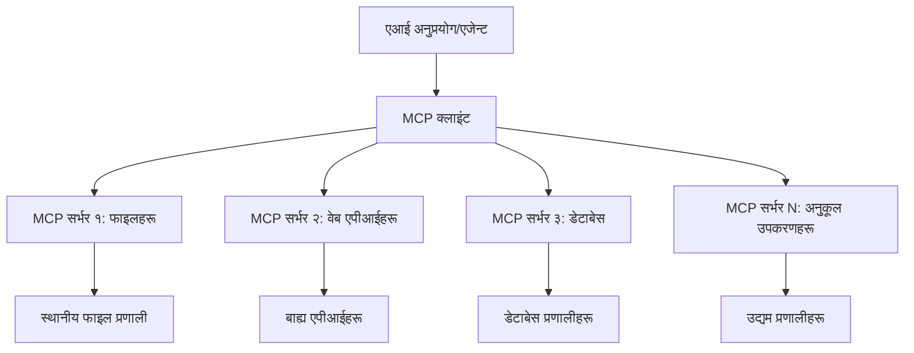

# 🌐 मोड्युल २: Microsoft Foundry Toolkit आधारभूत कुरासँग MCP

[]()
[]()
[]()

## 📋 सिकाइका उद्देश्यहरू

यस मोड्युलको अन्त्यसम्म, तपाईं सक्षम हुनुहुनेछ:
- ✅ मोडेल कन्टेक्स्ट प्रोटोकल (MCP) वास्तुकला र लाभ बुझ्न
- ✅ Microsoft को MCP सर्भर इकोसिस्टम अन्वेषण गर्न
- ✅ Microsoft Foundry Toolkit Agent Builder सँग MCP सर्भरहरू एकीकृत गर्न
- ✅ Playwright MCP प्रयोग गरी कार्य गर्ने ब्राउजर अटोमेसन एजेन्ट बनाउने
- ✅ तपाईंको एजेन्टहरूमा MCP उपकरणहरू कन्फिगर र परीक्षण गर्ने
- ✅ उत्पादन प्रयोगका लागि MCP-सक्षम एजेन्टहरू एक्सपोर्ट र परिनियोजन गर्ने

## 🎯 मोड्युल १ माथि आधारित

मोड्युल १ मा, हामीले Microsoft Foundry Toolkit को आधारभूत कुरा सिक्यौं र हाम्रो पहिलो Python एजेन्ट बनायौं। अब हामी तपाईंका एजेन्टहरूलाई बाह्य उपकरणहरू र सेवाहरूमा क्रान्तिकारी **मोडेल कन्टेक्स्ट प्रोटोकल (MCP)** मार्फत जोडेर **सुपरचार्ज** गर्नेछौं।

यसलाई एक आधारभूत क्यालकुलेटरबाट पूर्ण कम्प्युटरमा अपग्रेड गर्नुजस्तै सोच्नुहोस् - तपाईंका AI एजेन्टहरूले क्षमता पाउनुहुनेछ:
- 🌐 वेबसाइटहरू ब्राउज र अन्तरक्रिया गर्न
- 📁 फाइलहरू पहुँच र व्यवस्थापन गर्न
- 🔧 उद्यम प्रणालीहरूसँग एकीकृत हुन
- 📊 API बाट वास्तविक-समय डेटा प्रक्रिया गर्न

## 🧠 मोडेल कन्टेक्स्ट प्रोटोकल (MCP) बुझ्न

### 🔍 MCP के हो?

मोडेल कन्टेक्स्ट प्रोटोकल (MCP) **"AI अनुप्रयोगहरूको लागि USB-C"** हो - ठूलो भाषा मोडेलहरू (LLMs) लाई बाह्य उपकरणहरू, डेटा स्रोतहरू, र सेवाहरूमा जोड्ने क्रान्तिकारी खुला मानक। जस्तै USB-C ले एउटै सार्वभौमिक जडानद्वारा केबलको भिडभाड हटायो, MCP ले AI एकीकरण जटिलतालाई एउटै मानकीकृत प्रोटोकलले हटाउँछ।

### 🎯 MCP ले समाधान गर्ने समस्या

**MCP अगाडि:**
- 🔧 हरेक उपकरणका लागि कस्टम एकीकरणहरू
- 🔄 स्वामित्वपूर्ण समाधानहरूसँग विक्रेता निर्भरता  
- 🔒 आकस्मिक कनेक्शनबाट सुरक्षा कमजोरीहरू
- ⏱️ आधारभूत एकीकरणका लागि महिना लिन

**MCP सँग:**
- ⚡ प्लग-एण्ड-प्ले उपकरण एकीकरण
- 🔄 विक्रेता-निरपेक्ष वास्तुकला
- 🛡️ बिल्ट-इन सुरक्षा उत्तम अभ्यासहरू
- 🚀 नयाँ क्षमता थप्न मिनेटहरू मात्र

### 🏗️ MCP वास्तुकला गहिराइमा

MCP **क्लाइन्ट-सर्भर वास्तुकला** अपनाउँछ जसले सुरक्षित, मापनयोग्य पारिस्थितिकी तंत्र बनाउँछ:



**🔧 मुख्य कम्पोनेन्टहरू:**

| कम्पोनेन्ट | भूमिका | उदाहरणहरू |
|-----------|------|----------|
| **MCP होस्टहरू** | MCP सेवाहरू उपभोग गर्ने अनुप्रयोगहरू | Claude Desktop, VS Code, Microsoft Foundry Toolkit |
| **MCP क्लाइन्टहरू** | प्रोटोकल ह्यान्डलरहरू (सर्भरसँग १:१) | होस्ट अनुप्रयोगमा निर्मित |
| **MCP सर्भरहरू** | मानक प्रोटोकलमार्फत क्षमता प्रदर्शन गर्ने | Playwright, Files, Azure, GitHub |
| **ट्रान्सपोर्ट लेयर** | सञ्चार विधिहरू | stdio, HTTP, WebSockets |


## 🏢 Microsoft को MCP सर्भर इकोसिस्टम

Microsoft ले उद्यम स्तरका सर्भरहरूको व्यापक सेटमार्फत MCP इकोसिस्टममा नेतृत्व गर्दछ जसले वास्तविक व्यवसायका आवश्यकताहरूलाई सम्बोधन गर्दछ।

### 🌟 प्रमुख Microsoft MCP सर्भरहरू

#### १. ☁️ Azure MCP सर्भर
**🔗 रिपोजिटोरी**: [azure/azure-mcp](https://github.com/azure/azure-mcp)
**🎯 उद्देश्य**: AI एकीकरणसहित व्यापक Azure स्रोत व्यवस्थापन

**✨ प्रमुख सुविधाहरू:**
- घोषणात्मक पूर्वाधार व्यवस्थापन
- वास्तविक-समय स्रोत अनुगमन
- लागत अनुकूलन सिफारिशहरू
- सुरक्षा अनुपालन जाँच

**🚀 प्रयोगका केसहरू:**
- AI सहायता सहित पूर्वाधार-एज-कोड
- स्वचालित स्रोत स्केलिंग
- क्लाउड लागत अनुकूलन
- DevOps वर्कफ्लो अटोमेसन

#### २. 📊 Microsoft Dataverse MCP
**📚 कागजात**: [Microsoft Dataverse Integration](https://go.microsoft.com/fwlink/?linkid=2320176)
**🎯 उद्देश्य**: व्यवसाय डेटा को लागि प्राकृतिक भाषा इन्टरफेस

**✨ प्रमुख सुविधाहरू:**
- प्राकृतिक भाषा डेटाबेस सोधपुछहरू
- व्यवसाय सन्दर्भ बुझाइ
- कस्टम प्रॉम्प्ट टेम्प्लेटहरू
- उद्यम डेटा गभर्नेन्स

**🚀 प्रयोगका केसहरू:**
- व्यवसाय बुद्धिमत्ता रिपोर्टिङ
- ग्राहक डेटा विश्लेषण
- बिक्री पाइपलाइन अन्तर्दृष्टि
- अनुपालन डेटा सोधपुछ

#### ३. 🌐 Playwright MCP सर्भर
**🔗 रिपोजिटोरी**: [microsoft/playwright-mcp](https://github.com/microsoft/playwright-mcp)
**🎯 उद्देश्य**: ब्राउजर अटोमेसन र वेब अन्तरक्रिया क्षमता

**✨ प्रमुख सुविधाहरू:**
- क्रस-ब्राउजर अटोमेसन (Chrome, Firefox, Safari)
- संवेदी तत्व पत्ता लगाउने
- स्क्रीनशट र PDF सृजन
- नेटवर्क ट्राफिक अनुगमन

**🚀 प्रयोगका केसहरू:**
- स्वचालित परीक्षण वर्कफ्लोहरू
- वेब स्क्र्यापिंग र डेटा निष्कर्षण
- UI/UX अनुगमन
- प्रतिस्पर्धात्मक विश्लेषण अटोमेसन

#### ४. 📁 Files MCP सर्भर
**🔗 रिपोजिटोरी**: [microsoft/files-mcp-server](https://github.com/microsoft/files-mcp-server)
**🎯 उद्देश्य**: बुद्धिमानी फाइल सिस्टम सञ्चालन

**✨ प्रमुख सुविधाहरू:**
- घोषणात्मक फाइल व्यवस्थापन
- सामग्री समक्रमण
- संस्करण नियन्त्रण एकीकरण
- मेटाडाटा निष्कर्षण

**🚀 प्रयोगका केसहरू:**
- कागजात व्यवस्थापन
- कोड रिपोजिटोरी संगठन
- सामग्री प्रकाशन वर्कफ्लोहरू
- डेटा पाइपलाइन फाइल ह्यान्डलिंग

#### ५. 📝 MarkItDown MCP सर्भर
**🔗 रिपोजिटोरी**: [microsoft/markitdown](https://github.com/microsoft/markitdown)
**🎯 उद्देश्य**: उन्नत Markdown प्रक्रिया र व्यवस्थापन

**✨ प्रमुख सुविधाहरू:**
- धनी Markdown पार्सिङ
- ढाँचा रूपान्तरण (MD ↔ HTML ↔ PDF)
- सामग्री संरचना विश्लेषण
- टेम्प्लेट प्रक्रिया

**🚀 प्रयोगका केसहरू:**
- प्राविधिक कागजात वर्कफ्लोहरू
- सामग्री व्यवस्थापन प्रणालीहरू
- रिपोर्ट सृजन
- ज्ञान आधार अटोमेसन

#### ६. 📈 Clarity MCP सर्भर
**📦 प्याकेज**: [@microsoft/clarity-mcp-server](https://www.npmjs.com/package/@microsoft/clarity-mcp-server)
**🎯 उद्देश्य**: वेब विश्लेषण र प्रयोगकर्ता व्यवहार अन्तर्दृष्टि

**✨ प्रमुख सुविधाहरू:**
- हीटम्याप डेटा विश्लेषण
- प्रयोगकर्ता सत्र रेकर्डिङहरू
- प्रदर्शन मेट्रिक्स
- रुपान्तरण फनेल विश्लेषण

**🚀 प्रयोगका केसहरू:**
- वेबसाइट अनुकूलन
- प्रयोगकर्ता अनुभव अनुसन्धान
- A/B परीक्षण विश्लेषण
- व्यवसाय बुद्धिमत्ता ड्यासबोर्डहरू

### 🌍 समुदाय इकोसिस्टम

Microsoft का सर्भरहरू बाहेक, MCP इकोसिस्टममा समावेश छ:
- **🐙 GitHub MCP**: रिपोजिटोरी व्यवस्थापन र कोड विश्लेषण
- **🗄️ डेटाबेस MCPs**: PostgreSQL, MySQL, MongoDB एकीकरणहरू
- **☁️ क्लाउड प्रदायक MCPs**: AWS, GCP, Digital Ocean उपकरणहरू
- **📧 संचार MCPs**: Slack, Teams, ईमेल एकीकरणहरू

## 🛠️ व्यावहारिक प्रयोगशाला: ब्राउजर अटोमेसन एजेन्ट बनाउने

**🎯 परियोजना लक्ष्य**: Playwright MCP सर्भर प्रयोग गरी बुद्धिमानी ब्राउजर अटोमेसन एजेन्ट बनाउने जुन वेबसाइटहरूमा नेभिगेट गर्न, जानकारी निकाल्न, र जटिल वेब अन्तरक्रियाहरू गर्न सक्षम होस्।

### 🚀 चरण १: एजेन्ट आधार सेटअप

#### चरण १: तपाईंको एजेन्ट सुरु गर्नुहोस्
१. **Microsoft Foundry Toolkit Agent Builder खोल्नुहोस्**
२. **नयाँ एजेन्ट सिर्जना गर्नुहोस्** र निम्न कन्फिगरेसन राख्नुहोस्:
   - **नाम**: `BrowserAgent`
   - **मोडेल**: GPT-4o चयन गर्नुहोस्


### 🔧 चरण २: MCP एकीकरण कार्यप्रवाह

#### चरण ३: MCP सर्भर एकीकरण थप्नुहोस्
१. एजेन्ट बिल्डरमा **Tools सेक्सन मा जानुहोस्**
२. **"Add Tool" थिच्नुहोस्** र एकीकरण मेनु खोल्नुहोस्
३. उपलब्ध विकल्पबाट **"MCP Server" चयन गर्नुहोस्**


**🔍 उपकरण प्रकारहरू बुझ्दै:**
- **Built-in Tools**: पूर्व-कन्फिगर Microsoft Foundry Toolkit कार्यहरू
- **MCP Servers**: बाह्य सेवा एकीकरणहरू
- **Custom APIs**: तपाईंका आफ्नै सेवा अन्त बिन्दुहरू
- **Function Calling**: प्रत्यक्ष मोडेल फंक्शन पहुँच

#### चरण ४: MCP सर्भर चयन
१. **"MCP Server" विकल्प चयन गर्नुहोस्**


२. उपलब्ध एकीकरणहरू अन्वेषण गर्न **MCP Catalog ब्राउज गर्नुहोस्**


### 🎮 चरण ३: Playwright MCP कन्फिगरेसन

#### चरण ५: Playwright चयन र कन्फिगर गर्नुहोस्
१. **"Use Featured MCP Servers" थिचेर** Microsoft का पुष्टि गरिएको सर्भरहरू पहुँच गर्नुहोस्
२. सूचीबाट **"Playwright" चयन गर्नुहोस्**
३. डिफल्ट MCP ID स्वीकार्नुहोस् वा आफ्नो वातावरण अनुसार अनुकूलन गर्नुहोस्


#### चरण ६: Playwright क्षमताहरू सक्षम गर्नुहोस्
**🔑 महत्वपूर्ण चरण**: अधिकतम कार्यक्षमताका लागि सबै Playwright विधिहरू चयन गर्नुहोस्


**🛠️ महत्वपूर्ण Playwright उपकरणहरू:**
- **नेभिगेशन**: `goto`, `goBack`, `goForward`, `reload`
- **अन्तरक्रिया**: `click`, `fill`, `press`, `hover`, `drag`
- **निकाश**: `textContent`, `innerHTML`, `getAttribute`
- **प्रमाणीकरण**: `isVisible`, `isEnabled`, `waitForSelector`
- **क्याप्चर**: `screenshot`, `pdf`, `video`
- **नेटवर्क**: `setExtraHTTPHeaders`, `route`, `waitForResponse`

#### चरण ७: एकीकरण सफलताको पुष्टि गर्नुहोस्
**✅ सफलताको संकेतहरू:**
- सबै उपकरणहरू एजेन्ट बिल्डर इन्टरफेसमा देखिन्छ
- एकीकरण प्यानलमा कुनै त्रुटि सन्देश छैन
- Playwright सर्भर स्थिति "Connected" देखाउँछ


**🔧 सामान्य समस्याहरू समाधान गर्ने तरिका:**
- **Connection Failed**: इन्टरनेट जडान र फायरवाल सेटिङ जाँच गर्नुहोस्
- **Missing Tools**: सेटअपको बेला सबै क्षमता चयन गरिएको छ कि छैन सुनिश्चित गर्नुहोस्
- **Permission Errors**: VS Code लाई आवश्यक प्रणाली अनुमति दिइएको छ कि छैन जांच गर्नुहोस्

### 🎯 चरण ४: उन्नत प्रॉम्प्ट इन्जिनियरिङ

#### चरण ८: बुद्धिमानी प्रणाली प्रॉम्प्ट डिजाइन गर्नुहोस्
Playwright को पूर्ण क्षमताहरू उपयोग गर्ने परिष्कृत प्रॉम्प्टहरू बनाउनुहोस्:

```markdown
# Web Automation Expert System Prompt

## Core Identity
You are an advanced web automation specialist with deep expertise in browser automation, web scraping, and user experience analysis. You have access to Playwright tools for comprehensive browser control.

## Capabilities & Approach
### Navigation Strategy
- Always start with screenshots to understand page layout
- Use semantic selectors (text content, labels) when possible
- Implement wait strategies for dynamic content
- Handle single-page applications (SPAs) effectively

### Error Handling
- Retry failed operations with exponential backoff
- Provide clear error descriptions and solutions
- Suggest alternative approaches when primary methods fail
- Always capture diagnostic screenshots on errors

### Data Extraction
- Extract structured data in JSON format when possible
- Provide confidence scores for extracted information
- Validate data completeness and accuracy
- Handle pagination and infinite scroll scenarios

### Reporting
- Include step-by-step execution logs
- Provide before/after screenshots for verification
- Suggest optimizations and alternative approaches
- Document any limitations or edge cases encountered

## Ethical Guidelines
- Respect robots.txt and rate limiting
- Avoid overloading target servers
- Only extract publicly available information
- Follow website terms of service
```

#### चरण ९: गतिशील प्रयोगकर्ता प्रॉम्प्टहरू बनाउनुहोस्
विभिन्न क्षमताहरू देखाउने प्रॉम्प्टहरू डिजाइन गर्नुहोस्:

**🌐 वेब विश्लेषण उदाहरण:**
```markdown
Navigate to github.com/kinfey and provide a comprehensive analysis including:
1. Repository structure and organization
2. Recent activity and contribution patterns  
3. Documentation quality assessment
4. Technology stack identification
5. Community engagement metrics
6. Notable projects and their purposes

Include screenshots at key steps and provide actionable insights.
```


### 🚀 चरण ५: कार्यान्वयन र परीक्षण

#### चरण १०: तपाईंको पहिलो अटोमेसन चलाउनुहोस्
१. **"Run" थिचेर** अटोमेसन सिक्वेन्स सुरु गर्नुहोस्
२. वास्तविक-समय कार्यान्वयन अनुगमन गर्नुहोस्:
   - क्रोम ब्राउजर स्वचालित रूपमा सुरु हुन्छ
   - एजेन्ट लक्षित वेबसाइटमा नेभिगेट गर्छ
   - प्रत्येक मुख्य चरणका स्क्रीनशटहरू क्याप्चर हुन्छन्
   - विश्लेषण परिणामहरू वास्तविक-समयमा प्रवाहित हुन्छन्


#### चरण ११: परिणाम र अन्तर्दृष्टि विश्लेषण गर्नुहोस्
एजेन्ट बिल्डरको इन्टरफेसमा पूर्ण विश्लेषण समीक्षा गर्नुहोस्:


### 🌟 चरण ६: उन्नत क्षमताहरू र परिनियोजन

#### चरण १२: एक्सपोर्ट र उत्पादन परिनियोजन
एजेन्ट बिल्डरले विभिन्न परिनियोजन विकल्पहरू समर्थन गर्दछ:


## 🎓 मोड्युल २ सारांश र अगाडि के गर्ने

### 🏆 उपलब्धि अनलक भयो: MCP एकीकरण मास्टर

**✅ दक्षता हासिल गरियो:**
- [ ] MCP वास्तुकला र लाभ बुझ्न
- [ ] Microsoft को MCP सर्भर इकोसिस्टममा नेभिगेट गर्न
- [ ] Playwright MCP सँग Microsoft Foundry Toolkit एकीकृत गर्न
- [ ] जटिल ब्राउजर अटोमेसन एजेन्टहरू बनाउन
- [ ] वेब अटोमेसनका लागि उन्नत प्रॉम्प्ट इन्जिनियरिङ

### 📚 अतिरिक्त स्रोतहरू

- **🔗 MCP विनिर्देश**: [औपचारिक प्रोटोकल कागजात](https://modelcontextprotocol.io/)
- **🛠️ Playwright API**: [पूर्ण विधि सन्दर्भ](https://playwright.dev/docs/api/class-playwright)
- **🏢 Microsoft MCP सर्भरहरू**: [उद्यम एकीकरण गाइड](https://github.com/microsoft/mcp-servers)
- **🌍 समुदाय उदाहरणहरू**: [MCP सर्भर ग्यालेरी](https://github.com/modelcontextprotocol/servers)

**🎉 बधाई छ!** तपाईंले सफलतापूर्वक MCP एकीकरण सिक्नुभयो र अब बाह्य उपकरण क्षमताहरू सहित उत्पादन-तयार AI एजेन्टहरू बनाउन सक्नुहुन्छ!


### 🔜 अर्को मोड्युलमा जारी राख्नुहोस्

तपाईंको MCP कौशललाई अर्को स्तरमा लैजान तयार हुनुहुन्छ? अगाडि बढ्नुहोस् **[मोड्युल ३: Microsoft Foundry Toolkit समसामयिक MCP विकास](../lab3/README.md)** जहाँ तपाईं सिक्नुहुनेछ:
- आफ्नै कस्टम MCP सर्भरहरू सिर्जना गर्ने
- नवीनतम MCP Python SDK कन्फिगर र प्रयोग गर्ने
- डिबगिङको लागि MCP Inspector सेटअप गर्ने
- उन्नत MCP सर्भर विकास कार्यप्रवाहहरूमा दक्षता हासिल गर्ने
- खोलाबाट एक Weather MCP सर्भर बनाउने

---

<!-- CO-OP TRANSLATOR DISCLAIMER START -->
**अस्वीकरण**:
यो दस्तावेज़ AI अनुवाद सेवा [Co-op Translator](https://github.com/Azure/co-op-translator) प्रयोग गरेर अनुवाद गरिएको हो। हामी सही हुन प्रयास गर्छौं, तर कृपया जानकार हुनुस् कि स्वचालित अनुवादमा त्रुटिहरू वा अशुद्धताहरू हुन सक्छन्। मूल दस्तावेज़ यसको मूल भाषामा आधिकारिक स्रोत मानिनुपर्छ। महत्वपूर्ण जानकारीका लागि व्यावसायिक मानव अनुवाद सिफारिस गरिन्छ। यस अनुवादको प्रयोगबाट उत्पन्न कुनै पनि गलत बुझाइ वा त्रुटिको लागि हामी जिम्मेवार छैनौं।
<!-- CO-OP TRANSLATOR DISCLAIMER END -->