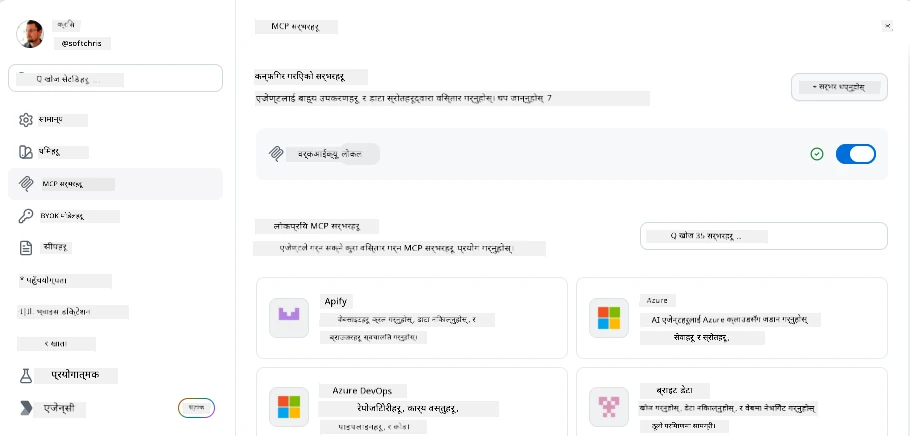
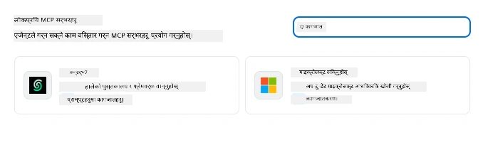
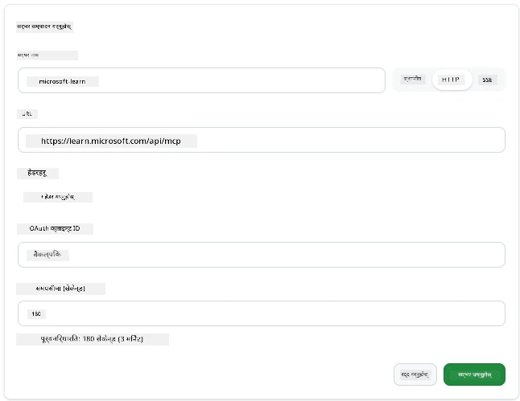
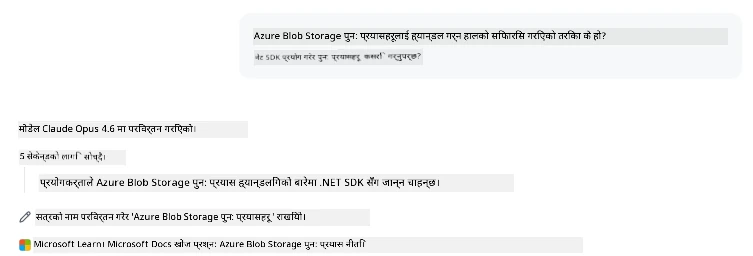
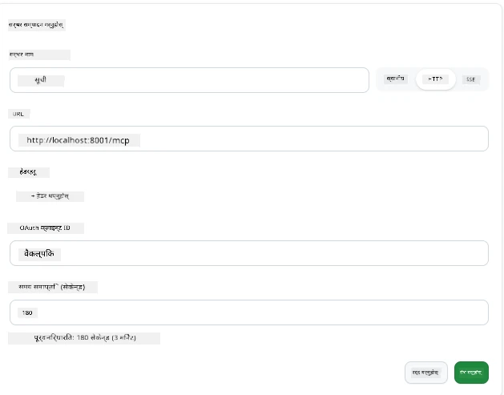
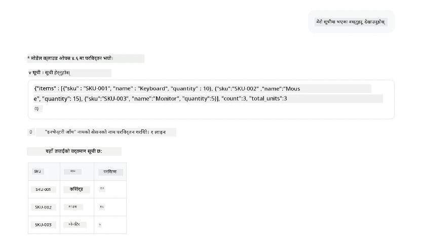
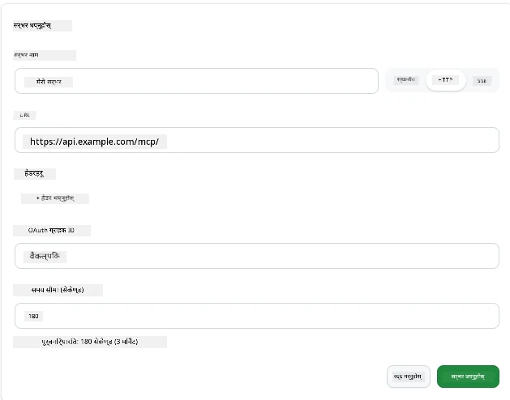
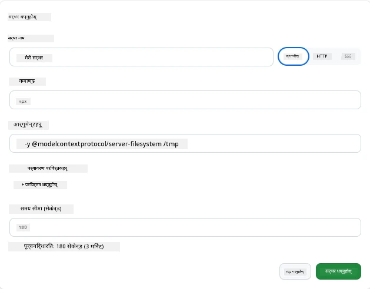

# GitHub Copilot एपमा MCP सर्भर प्रयोग गर्दै

अबसम्म तपाईंलाई थाहा छ कि MCP कसरी काम गर्छ। तपाईंले सर्भरहरू बनाउनु भएको छ, उपकरणहरू र स्रोतहरू परिभाषित गर्नुभएको छ, र ग्राहकहरूलाई जडान गर्नुभयो। हामीले अझै सम्म भिन्न कोणबाट हेर्ने प्रयास गरेका छैनौं: तपाईं सर्भर बनाउने पक्षमा हुनुहुन्छ, तर *खपत गर्ने* पक्षमा हुनुले कस्तो देखिन्छ—MCP समर्थित एआई-सञ्चालित एपको प्रयोगकर्ताको रूपमा के देखिन्छ?

[GitHub Copilot App](https://github.com/github/app) एउटा डेस्कटप एप हो जसले MCP सर्भरहरू प्रयोग गर्न सक्छ। यसमा MCP सर्भरहरू जडान गर्दा, तपाईंले नयाँ स्तर खोल्नुहुन्छ: Copilot अब तपाईंको कागजातहरूमा पहुँच गर्न, तपाईंका आन्तरिक API हरू बोलाउन, तपाईंको डाटाबेस सोध्न, वा जुनसुकै सेवा तपाईंले सर्भरमा राख्नुभएको छ त्यसलाई सम्पर्क गर्न सक्छ। एप होस्ट बन्छ; तपाईंका MCP सर्भरहरू यसका उपकरणहरू बन्छन्।

यो पाठले तपाईंलाई त्यो अनुभव सुरू देखि अन्त्य सम्म लैजान्छ—MCP सेटिङ्स प्यानल पत्ता लगाउने देखि लिएर वास्तविक कागजात सर्भर जडान गर्ने र त्यसपछि आफ्नो कस्टम सर्भर जडान गर्ने सम्म।

## सिकाइ उद्देश्यहरू

यस पाठको अन्त्यसम्म, तपाईं सक्षम हुनुहुनेछ:

- Copilot एप सेटिङहरूमा MCP सर्भर प्यानल खोज्न र नेभिगेट गर्न।
- होस्ट गरिएको कागजात सर्भर जडान गर्न र सत्रमा प्रयोग गर्न।
- कस्टम सर्भर दर्ता गर्न र Copilotले यसको उपकरणहरू प्रयोग गर्न सक्ने प्रमाणित गर्न।
- सर्भरलाई कसरी बोलाउने कन्फिगर गर्न—वातावरणीय चरहरू वा कस्टम हेडरहरू (यदि HTTP हो भने) प्रदान गरेर।

## Copilot एपलाई MCP होस्टको रूपमा हेर्ने

यो मौलिक विचार हो: **Copilot का एजेन्टहरू बुद्धिमान छन्, तर उनीहरूले केवल तपाईंले भनेको कुरा थाहा पाउँछन्।** डिफल्ट रूपमा, एजेन्टले तपाईंको कार्यक्षेत्रका फाइलहरू पढ्न र टर्मिनल आदेशहरू चलाउन सक्छ, तर यो तपाईंको डाटाबेस सोध्न, तपाईंको क्यालेन्डर हेर्न, वा कस्टम API बोलाउन सक्दैन जबसम्म सहयोग नहोस्। त्यहीँ MCP सर्भरहरू आउँछन्। तिनीहरूले Copilot र तपाईंको प्रणालीहरू—डाटाबेस, संस्करण नियन्त्रण, API हरू, डिजाइन उपकरण—बीच पुलको रूपमा कार्य गर्दछन्, एजेन्टलाई आवश्यक जानकारी र क्रियाकलापहरू पहुँच दिने।

अब तपाईंको एपका MCP सर्भरहरू व्यवस्थापन गर्ने सेटिङहरू खोज्न शुरू गरौं।

## चरण 1: MCP सेटिङ्स प्यानल खोज्ने

Copilot एप खोल्नुहोस् र तल-बायाँको काग (cog) आइकन खोज्नुहोस् र क्लिक गर्नुहोस्।


" MCP Servers" छान्न सुनिश्चित गर्नुहोस् र तपाईंले माथिल्लो भागमा पहिले नै कन्फिगर गरिएको सर्भरहरू, तल लोकप्रिय सर्भरहरूको बजार, र माथि "Add Server" बटन देख्नुहुनेछ:



यो तपाईंको नियन्त्रण केन्द्र हो। यहाँ तपाईंले सर्भरहरू थप्न, हटाउन, सक्षम गर्न, वा अक्षम गर्न सक्नुहुन्छ। परिवर्तनहरू नयाँ सत्रहरूमा लागु हुन्छन्; यदि तपाईं सत्र चलाइरहनु भएको छ भने सूची परिवर्तन गरेपछि नयाँ सत्र शुरु गर्नुपर्ने हुन्छ।

## चरण 2: कागजात सर्भर जडान गर्दै

अब केही उपयोगी गर्ने छौं। Microsoft Docs MCP सर्भरले Copilotलाई आधिकारिक Microsoft कागजातहरू पहुँच दिन्छ। यसमा Azure, .NET, TypeScript, र थप छन्। एजेन्टले आफ्नै प्रशिक्षण डाटामा भरोसा गर्ने सट्टा (जसको कटअफ मिति छ), सोधपुछ गर्ने समयमा हालको कागजातहरू निकाल्न सक्छ।

यसलाई थप्ने तरिका:

1. लोकप्रिय सर्भरहरूको ग्रिडमा **learn** टाइप गर्नुहोस् र "Microsoft Learn" नामको सर्भर छान्नुहोस्।

   

   क्लिक गर्दा, एउटा फारम देखिन्छ जहाँ नाम, ट्रान्सपोर्ट प्रकार र URL पहिल्यै भरेको हुन्छ, तपाईंले मात्र "Add Server" क्लिक गर्नु पर्ने हुन्छ।

2. "Add Server" क्लिक गर्नुहोस्, सर्भरसंग जडान हुन केही सेकेन्ड लाग्नेछ।

   

   थपिएपछि, यो माथिल्लो भागमा कन्फिगर गरिएको सर्भरको रूपमा देखिनु पर्छ। अब यसलाई प्रयास गरौं।

3. संवाद बक्स बन्द गरेर Quick chat छान्नुहोस्।

4. तल दिएको प्रॉम्प्ट टाइप गरेर Microsoft Learn सर्भरमा उपकरण अप्ठ्यारो गर्नुहोस्।

   ```text
   What's the current recommended approach for handling Azure Blob Storage 
   retries using the .NET SDK?
   ```

   

तपाईंले हामीले अहिले जोडेको MCP सर्भरसँग कसरी सन्दर्भ गर्दछ भन्ने देख्न सक्नुहुनेछ।

## चरण 3: कस्टम stdio सर्भर जडान गर्ने

प्रि-सेटहरू सुविधाजनक छन्, तर वास्तविक शक्ति तपाईंका आफ्नै सर्भर जडान गर्नेमा छ। मानौं तपाईंले एउटा सर्भर बनाउनु भएको छ (वा प्राप्त गर्नुभएको छ) जसले तपाईंको आन्तरिक API वा कम्पनी ज्ञान आधार प्रदर्शन गर्दछ। यस अवस्थामा, हामीले कम्पनीको सूची व्यवस्थापनको लागि बनाएको MCP सर्भर प्रयोग गर्नेछौं।

1. काग आइकनमा क्लिक गर्नुहोस् र पुन: "MCP servers" छान्नुहोस्।

2. "Add Server" बटन र "+ Add Custom server" छान्नुहोस् र तलका मूल्यहरू प्रदान गर्नुहोस्:

   - नाम: `Inventory Server`
   - ट्रान्सपोर्ट छान्नुहोस् (दायाँ तर्फ), **http**

   "Add Server" छान्नुहोस् र यो तपाईंको कन्फिगर गरिएको सर्भरहरूको सूचीमा देखिनु पर्छ।

   

4. यसलाई परीक्षण गर्न यसरी प्रॉम्प्ट चलाउनुहोस्:

    ```
    list inventory
    ```

   

   अब तपाईंले तपाईंको कस्टम बनाइएको सर्भरबाट फर्काइएको सूची वस्तुहरू हेर्न सक्नुहुनेछ।

शाबास्, तपाईंले बाह्य र आफ्नै MCP सर्भरहरू Copilot एपमा कसरी थप्ने भनी राम्रो सिक्नु भएको छ। अब, गोप्य जानकारी र वातावारण चरहरू कसरी व्यवस्थापन गर्ने कुरा हेरौं।

## चरण 4: उन्नत सेटिङहरू

अहिलेसम्म तपाईंले देख्नुभयो कि कसरी MCP सर्भर थप्ने, जहाँ तपाईंले नाम र URL मात्र दिनुहुन्छ। तर तपाईंको सर्भरले API कुञ्जी वा अन्य मान चाहिन्छ भने के? ट्रान्सपोर्ट प्रकार अनुसार, हामी त्यसलाई आवश्यक कुरा दिन सक्छौं।

- **http वा SSE ट्रान्सपोर्ट**: यहाँ हामी आवश्यक हेडरहरू सेट गर्न सक्छौं।

   प्रमाणीकरणका लागि, तपाईं एक Authorization हेडर निर्दिष्ट गर्न सक्नुहुन्छ, उदाहरणका लागि। मान स्थिर स्ट्रिङ हुन सक्छ। OAuth प्रयोग गर्दा, तपाईं OAuth क्लाइन्ट ID दिन सक्नुहुन्छ।

   

- **stdio ट्रान्सपोर्ट**: वातावरण चरहरू सेट गर्न सकिन्छ।

   यहाँ तपाईंसँग सर्वर सुरु गर्दा पास गरिनुपर्ने कुनै पनि संख्या वातावरण चरहरू निर्दिष्ट गर्न सक्नुहुन्छ।

   

## सारांश

Copilot एपले MCP सर्भरहरूलाई एजेन्टका क्षमता विस्थापनको रूपमा व्यवहार गर्छ। तपाईंले यस पाठमा MCP सर्भर थप्नेदेखि सत्रमा प्रयोग गर्ने सम्मको सम्पूर्ण यात्रा देख्नुभयो। अब तपाईं सार्वजनिक सर्भर, आन्तरिक API हरू, र कस्टम उपकरणहरू जडान गर्न सक्नुहुन्छ, जसले एजेन्टहरूलाई स्वतन्त्र रूपमा कार्य सम्पन्न गर्न आवश्यक जानकारी र क्रियाकलापहरू पहुँच दिन्छ।

## 📚 थप स्रोतहरू

### आधिकारिक कागजातहरू

- [GitHub Copilot App](https://github.com/github/app)
- [MCP Specification](https://modelcontextprotocol.io/specification/2025-03-26) - मोडल सन्दर्भ प्रोटोकल विशिष्टता

### समुदाय
- [MCP Community Discord](https://discord.com/invite/ByRwuEEgH4) - प्रत्यक्ष छलफलहरू
- [GitHub Discussions](https://github.com/microsoft/MCP-Server-and-PostgreSQL-Sample-Retail/discussions) - प्रश्नोत्तर र साझेदारी
- [Stack Overflow](https://stackoverflow.com/questions/tagged/model-context-protocol) - प्राविधिक प्रश्नहरू

---

<!-- CO-OP TRANSLATOR DISCLAIMER START -->
**अस्वीकरण**:
यो दस्तावेज़ AI अनुवाद सेवा [Co-op Translator](https://github.com/Azure/co-op-translator) प्रयोग गरेर अनुवाद गरिएको हो। हामी सही हुन प्रयास गर्छौं, तर कृपया जानकार हुनुस् कि स्वचालित अनुवादमा त्रुटिहरू वा अशुद्धताहरू हुन सक्छन्। मूल दस्तावेज़ यसको मूल भाषामा आधिकारिक स्रोत मानिनुपर्छ। महत्वपूर्ण जानकारीका लागि व्यावसायिक मानव अनुवाद सिफारिस गरिन्छ। यस अनुवादको प्रयोगबाट उत्पन्न कुनै पनि गलत बुझाइ वा त्रुटिको लागि हामी जिम्मेवार छैनौं।
<!-- CO-OP TRANSLATOR DISCLAIMER END -->