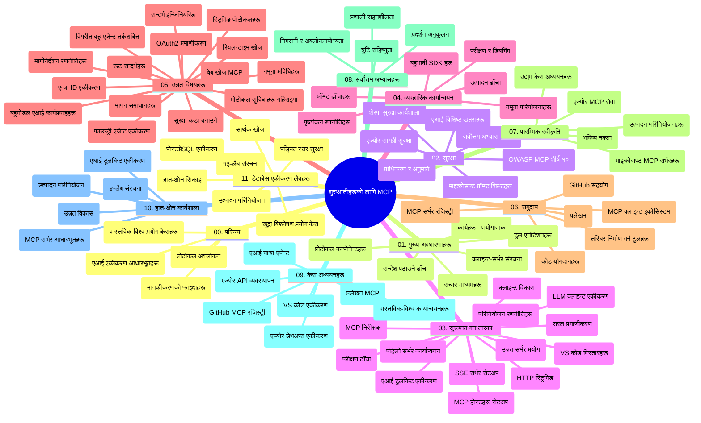

# प्रारम्भकर्ताका लागि मोडल सन्दर्भ प्रोटोकल (MCP) - अध्ययन मार्गदर्शन

यो अध्ययन मार्गदर्शन "प्रारम्भकर्ताका लागि मोडल सन्दर्भ प्रोटोकल (MCP)" पाठ्यक्रमको रिपोजिटरी संरचना र सामग्रीको अवलोकन प्रदान गर्दछ। यो मार्गदर्शन प्रयोग गरी रिपोजिटरीलाई प्रभावकारी रूपमा नेभिगेट गर्नुहोस् र उपलब्ध स्रोतहरूको अधिकतम लाभ उठाउनुहोस्।

## रिपोजिटरी अवलोकन

मोडल सन्दर्भ प्रोटोकल (MCP) AI मोडेलहरू र ग्राहक अनुप्रयोगहरू बीच अन्तरक्रियाको लागि मानकीकृत फ्रेमवर्क हो। सुरुमै Anthropic द्वारा सिर्जना गरिएको MCP अब आधिकारिक GitHub संगठन मार्फत व्यापक MCP समुदायले मर्मत गर्दछ। यो रिपोजिटरी AI विकासकर्ता, प्रणाली वास्तुकार, र सफ्टवेयर इन्जिनियरहरूका लागि डिजाइन गरिएको C#, Java, JavaScript, Python, र TypeScript मा हातले प्रयास गर्न मिल्ने कोड उदाहरण सहित व्यापक पाठ्यक्रम प्रदान गर्दछ।

## दृश्य पाठ्यक्रम नक्सा

## रिपोजिटरी संरचना

रिपोजिटरीलाई एघार मुख्य खण्डहरूमा विभाजन गरिएको छ, प्रत्येकले MCP को फरक पक्षहरूमा केन्द्रित छ:

1. **परिचय (00-Introduction/)**
   - मोडल सन्दर्भ प्रोटोकलको अवलोकन
   - AI पाइपलाइनहरूमा मानकीकरण किन महत्त्वपूर्ण छ
   - व्यावहारिक प्रयोग केसहरू र फाइदाहरू

2. **मूल अवधारणाहरू (01-CoreConcepts/)**
   - ग्राहक-सर्भर वास्तुकला
   - प्रमुख प्रोटोकल कम्पोनेन्टहरू
   - MCP मा सन्देश आदानप्रदानका ढाँचाहरू

3. **सुरक्षा (02-Security/)**
   - MCP-आधारित प्रणालीहरूमा सुरक्षागत खतरा
   - कार्यान्वयन सुरक्षित बनाउनका लागि उत्तम अभ्यासहरू
   - प्रमाणीकरण र अधिकार कार्यनीतिहरू
   - **व्यापक सुरक्षा दस्तावेजीकरण**:
     - MCP सुरक्षा उत्तम अभ्यास 2025
     - Azure सामग्री सुरक्षा कार्यान्वयन मार्गदर्शन
     - MCP सुरक्षा नियंत्रकहरू र प्रविधिहरू
     - MCP उत्तम अभ्यास छिटो सन्दर्भ
   - **प्रमुख सुरक्षा विषयवस्तुहरू**:
     - प्रम्प्ट इंजेक्शन र उपकरण विषाक्तता आक्रमणहरू
     - सेसन हाइज्याकिङ र भ्रमित डिपुटी समस्याहरू
     - टोकन पासथ्रू कमजोरीहरू
     - अत्यधिक अनुमतिहरू र पहुँच नियन्त्रण
     - AI कम्पोनेन्टहरूको आपूर्ति श्रृंखला सुरक्षा
     - Microsoft प्रम्प्ट शिल्ड्स समाकलन

4. **शुरूवात (03-GettingStarted/)**
   - वातावरण सेटअप र कन्फिगरेसन
   - आधारभूत MCP सर्भर र ग्राहकहरू सिर्जना गर्नु
   - विद्यमान अनुप्रयोगहरूसँग समाकलन
   - समावेशन खण्डहरू:
     - पहिलो सर्भर कार्यान्वयन
     - ग्राहक विकास
     - LLM ग्राहक समाकलन
     - VS Code समाकलन
     - सर्भर-सेंट इभेन्ट्स (SSE) सर्भर
     - उन्नत सर्भर प्रयोग
     - HTTP स्ट्रिमिंग
     - AI टुलकिट समाकलन
     - परीक्षण रणनीतिहरू
     - परिनियोजन निर्देशनहरू

5. **व्यावहारिक कार्यान्वयन (04-PracticalImplementation/)**
   - विभिन्न प्रोग्रामिङ भाषाहरूमा SDK प्रयोग
   - डिबगिङ, परीक्षण, र मान्यकरण प्रविधिहरू
   - पुनः प्रयोग गर्न मिल्ने प्रम्प्ट टेम्प्लेट र कार्यप्रवाहहरू बनाउने
   - कार्यान्वयन उदाहरणसहित नमूना परियोजनाहरू

6. **उन्नत विषयहरू (05-AdvancedTopics/)**
   - सन्दर्भ ईन्जिनियरिङ प्रविधिहरू
   - Foundry एजेन्ट समाकलन
   - बहु-मोडल AI कार्यप्रवाहहरू
   - OAuth2 प्रमाणीकरण डेमोहरू
   - रियल-टाइम खोज क्षमताहरू
   - रियल-टाइम स्ट्रिमिंग
   - रुट सन्दर्भहरूको कार्यान्वयन
   - राउटिङ रणनीतिहरू
   - नमुना लिने प्रविधिहरू
   - मापन गर्ने तरिकाहरू
   - सुरक्षा विचारहरू
   - Entra ID सुरक्षा समाकलन
   - वेब खोज समाकलन
   - विरोधी बहु-एजेन्ट तर्क (बहस ढाँचाहरू)

7. **समुदाय योगदानहरू (06-CommunityContributions/)**
   - कोड र दस्तावेजीकरण कसरी योगदान गर्ने
   - GitHub मार्फत सहकार्य गर्ने
   - समुदाय सञ्चालित सुधार र प्रतिकृया
   - विभिन्न MCP ग्राहकहरू प्रयोग गर्ने (Claude Desktop, Cline, VSCode)
   - लोकप्रिय MCP सर्भरहरू सँग काम गर्ने, जसमा छवि उत्पादन समावेश छ

8. **प्रारम्भिक अंगीकरणबाट सिकाइ (07-LessonsfromEarlyAdoption/)**
   - वास्तविक दुनिया कार्यान्वयन र सफलता कथाहरू
   - MCP-आधारित समाधानहरू निर्माण र परिनियोजन
   - प्रवृत्ति र भविष्यको रोडमेप
   - **Microsoft MCP सर्भरहरूको मार्गदर्शन**: १० उत्पादन-तय Microsoft MCP सर्भरहरूको व्यापक मार्गदर्शिका जसमा समावेश छ:
     - Microsoft Learn Docs MCP सर्भर
     - Azure MCP सर्भर (१५+ विशेषज्ञ कनेक्टरहरू)
     - GitHub MCP सर्भर
     - Azure DevOps MCP सर्भर
     - MarkItDown MCP सर्भर
     - SQL सर्भर MCP सर्भर
     - Playwright MCP सर्भर
     - Dev Box MCP सर्भर
     - Microsoft Foundry MCP सर्भर
     - Microsoft 365 एजेन्ट टुलकिट MCP सर्भर

9. **उत्तम अभ्यासहरू (08-BestPractices/)**
   - प्रदर्शन ट्युनिङ र अनुकूलन
   - दोष-प्रतिरोधी MCP प्रणालीहरू डिजाइन गर्ने
   - परीक्षण र लचिलोपन रणनीतिहरू

10. **केस अध्ययनहरू (09-CaseStudy/)**
    - **सात व्यापक केस अध्ययनहरू** जसले MCP को बहुमुखी प्रतिभा विभिन्न परिदृश्यहरूमा देखाउँछ:
    - **Azure AI ट्राभल एजेन्टहरू**: Azure OpenAI र AI खोजसँग बहु-एजेन्ट समन्वय
    - **Azure DevOps समाकलन**: YouTube डेटा अपडेटहरूसँग वर्कफ्लो प्रक्रियाहरू स्वचालन
    - **रियल-टाइम दस्तावेज पुन: प्राप्ति**: स्ट्रिमिङ HTTP सहित Python कन्सोल ग्राहक
    - **अन्तरक्रियात्मक अध्ययन योजना जेनरेटर**: Chainlit वेब एप्लिकेसन साथ कुराकानी AI
    - **इन-एडिटर दस्तावेजीकरण**: VS Code समाकलन GitHub Copilot कार्यप्रवाहहरूसँग
    - **Azure API व्यवस्थापन**: MCP सर्भर सिर्जनासहित उद्यम API समाकलन
    - **GitHub MCP रजिष्ट्रि**: पारिस्थितिकी तन्त्र विकास र एजेन्टिक समाकलन प्लेटफर्म
    - उद्यम समाकलन, विकासकर्ता उत्पादकता, र पारिस्थितिकी तन्त्र विकासमा कार्यान्वयन उदाहरणहरू

11. **हात-हातमा कार्यशाला (10-StreamliningAIWorkflowsBuildingAnMCPServerWithAIToolkit/)**
    - MCP र AI टुलकिट मिलेर व्यापक हात-हातमा कार्यशाला
    - AI मोडेलहरू र वास्तविक विश्व उपकरणहरू बीच बुद्धिमान अनुप्रयोगहरू निर्माण
    - आधारभूत, अनुकूलित सर्भर विकास, र उत्पादन परिनियोजन रणनीतिहरू समेटिएका व्यावहारिक मोड्युलहरू
    - **लेब संरचना**:
      - लेब १: MCP सर्भर आधारभूत
      - लेब २: उन्नत MCP सर्भर विकास
      - लेब ३: AI टुलकिट समाकलन
      - लेब ४: उत्पादन परिनियोजन र विस्तार
    - चरण-दर-चरण निर्देशनसहित लेब आधारित सिकाइ

12. **MCP सर्भर डेटाबेस समाकलन लेबहरू (11-MCPServerHandsOnLabs/)**
    - **उत्पादन-तय MCP सर्भरहरू PostgreSQL समाकलनसहित निर्माण गर्न १३-लेब सिकाइ मार्ग**
    - **Zava Retail प्रयोग केससहित वास्तविक विश्व खुद्रा विश्लेषण कार्यान्वयन**
    - **उद्यम-स्तरका ढाँचाहरू** जसमा पङ्क्ति स्तर सुरक्षा (RLS), सिमान्टिक खोज, र बहु-भाडामा डेटा पहुँच
    - **सम्पूर्ण लेब संरचना**:
      - **लेबहरू ००-०३: आधारहरू** - परिचय, वास्तुकला, सुरक्षा, वातावरण सेटअप
      - **लेबहरू ०४-०६: MCP सर्भर निर्माण** - डेटाबेस डिजाइन, MCP सर्भर कार्यान्वयन, उपकरण विकास
      - **लेबहरू ०७-०९: उन्नत सुविधाहरू** - सिमान्टिक खोज, परीक्षण र डिबगिङ, VS Code समाकलन
      - **लेबहरू १०-१२: उत्पादन र उत्तम अभ्यासहरू** - परिनियोजन, अनुगमन, अनुकूलन
    - **समावेश प्रविधिहरू**: FastMCP फ्रेमवर्क, PostgreSQL, Azure OpenAI, Azure कन्टेनर एप्स, एप्लिकेसन इन्साइट्स
    - **सिकाइ नतिजाहरू**: उत्पादन-तय MCP सर्भरहरू, डेटाबेस समाकलन ढाँचाहरू, AI-सञ्चालित विश्लेषण, उद्यम सुरक्षा

## अतिरिक्त स्रोतहरू

रिपोजिटरीमा यसका लागि समर्थन स्रोतहरू समावेश छन्:

- **तस्बिरहरू फोल्डर**: पाठ्यक्रममा प्रयोग भएका चित्र र चित्रणहरू
- **अनुवादहरू**: दस्तावेजीकरणको बहुभाषा समर्थन र स्वचालित अनुवादहरू
- **आधिकारिक MCP स्रोतहरू**:
  - [MCP Documentation](https://modelcontextprotocol.io/)
  - [MCP Specification](https://spec.modelcontextprotocol.io/)
  - [MCP GitHub Repository](https://github.com/modelcontextprotocol)

## यो रिपोजिटरी कसरी प्रयोग गर्ने

1. **क्रमागत सिकाइ**: संख्यागत अध्यायहरूको पालना गर्नुहोस् (०० देखि ११ सम्म) संरचित सिकाइ अनुभवको लागि।
2. **भाषा-विशिष्ट फोकस**: कुनै विशेष प्रोग्रामिङ भाषामा रुचि भएमा, तपाईंले मनपरेको भाषाका कार्यान्वयन् लागि नमूना निर्देशिकाहरू अन्वेषण गर्नुहोस्।
3. **व्यावहारिक कार्यान्वयन**: आफ्नो वातावरण सेटअप गर्न र पहिलो MCP सर्भर र ग्राहक सिर्जना गर्न "शुरूवात" खण्डबाट सुरु गर्नुहोस्।
4. **उन्नत अन्वेषण**: आधारभूत कुरामा सहज भएपछि, ज्ञान विस्तार गर्न उन्नत विषयहरूमा प्रवेश गर्नुहोस्।
5. **समुदाय सहभागिता**: MCP समुदायमा विशेषज्ञहरू र सह-विकासकर्ताहरू सँग जडान हुन GitHub छलफलबा र Discord च्यानलहरूमा सहभागी हुनुहोस्।

## MCP ग्राहकहरू र उपकरणहरू

पाठ्यक्रमले विभिन्न MCP ग्राहकहरू र उपकरणहरू समेट्छ:

1. **आधिकारिक ग्राहकहरू**:
   - Visual Studio Code
   - MCP Visual Studio Code मा
   - Claude Desktop
   - VSCode मा Claude
   - Claude API

2. **समुदाय ग्राहकहरू**:
   - Cline (टर्मिनल-आधारित)
   - Cursor (कोड सम्पादक)
   - ChatMCP
   - Windsurf

3. **MCP व्यवस्थापन उपकरणहरू**:
   - MCP CLI
   - MCP Manager
   - MCP Linker
   - MCP Router

## लोकप्रिय MCP सर्भरहरू

रिपोजिटरीमा विभिन्न MCP सर्भरहरू परिचय गराइएको छ, जसमा समावेश छन्:

1. **आधिकारिक Microsoft MCP सर्भरहरू**:
   - Microsoft Learn Docs MCP सर्भर
   - Azure MCP सर्भर (१५+ विशेषज्ञ कनेक्टरहरू)
   - GitHub MCP सर्भर
   - Azure DevOps MCP सर्भर
   - MarkItDown MCP सर्भर
   - SQL सर्भर MCP सर्भर
   - Playwright MCP सर्भर
   - Dev Box MCP सर्भर
   - Microsoft Foundry MCP सर्भर
   - Microsoft 365 एजेन्ट टुलकिट MCP सर्भर

2. **आधिकारिक सन्दर्भ सर्भरहरू**:
   - फाइलसिस्टम
   - Fetch
   - मेमोरी
   - सन्क्रमणात्मक सोच

3. **छवि उत्पादन**:
   - Azure OpenAI DALL-E 3
   - Stable Diffusion WebUI
   - Replicate

4. **विकास उपकरणहरू**:
   - Git MCP
   - टर्मिनल नियन्त्रण
   - कोड सहायक

5. **विशेषीकृत सर्भरहरू**:
   - Salesforce
   - Microsoft Teams
   - Jira र Confluence

## योगदान

यो रिपोजिटरीमा समुदायबाट योगदान स्वागत छ। MCP पारिस्थितिकी तन्त्रमा प्रभावकारी रूपमा योगदान गर्ने उपायहरूका लागि समुदाय योगदानहरू खण्ड हेर्नुहोस्।

----

*यस अध्ययन मार्गदर्शनलाई अन्तिम पटक ५ फेब्रुअरी २०२६ मा अद्यावधिक गरिएको हो, जसले नवीनतम MCP विशिष्टता २०२५-११-२५ लाई प्रतिबिम्बित गर्दछ र उक्त मिति सम्मको रिपोजिटरीको अवलोकन प्रदान गर्दछ। यस मिति पछि रिपोजिटरी सामग्री अद्यावधिक हुनसक्छ।*

---

<!-- CO-OP TRANSLATOR DISCLAIMER START -->
**अस्वीकरण**:
यो दस्तावेज़ AI अनुवाद सेवा [Co-op Translator](https://github.com/Azure/co-op-translator) प्रयोग गरेर अनुवाद गरिएको हो। हामी सही हुन प्रयास गर्छौं, तर कृपया जानकार हुनुस् कि स्वचालित अनुवादमा त्रुटिहरू वा अशुद्धताहरू हुन सक्छन्। मूल दस्तावेज़ यसको मूल भाषामा आधिकारिक स्रोत मानिनुपर्छ। महत्वपूर्ण जानकारीका लागि व्यावसायिक मानव अनुवाद सिफारिस गरिन्छ। यस अनुवादको प्रयोगबाट उत्पन्न कुनै पनि गलत बुझाइ वा त्रुटिको लागि हामी जिम्मेवार छैनौं।
<!-- CO-OP TRANSLATOR DISCLAIMER END -->