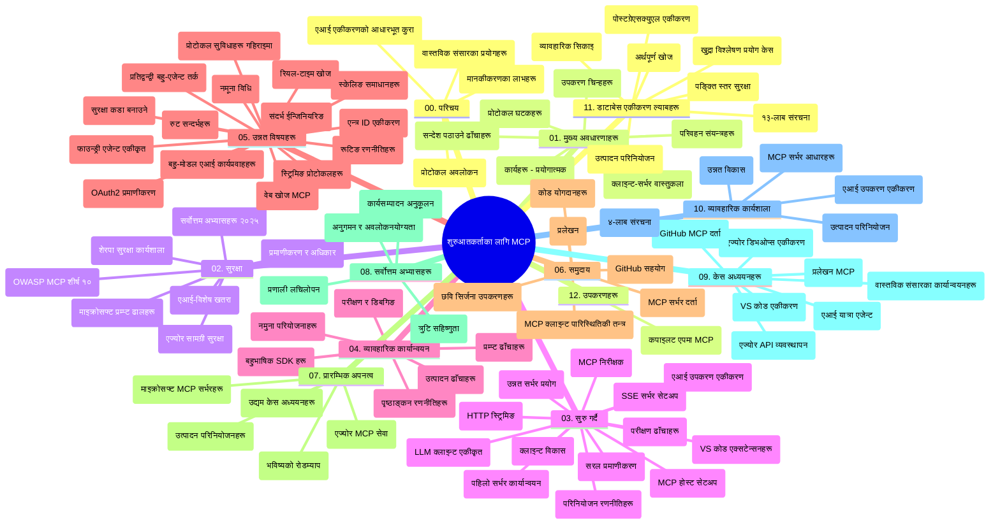

# मोडल कन्टेक्स्ट प्रोटोकल (MCP) प्रारम्भिकहरूको लागि - अध्ययन निर्देशन

यो अध्ययन निर्देशनले "मोडल कन्टेक्स्ट प्रोटोकल (MCP) प्रारम्भिकहरूको लागि" पाठ्यक्रमका लागि रिपोजिटरी संरचना र सामग्रीको एक अवलोकन प्रदान गर्दछ। रिपोजिटरीलाई प्रभावकारी रूपमा नेभिगेट गर्न र उपलब्ध स्रोतहरूबाट अधिकतम लाभ उठाउन यो निर्देशन प्रयोग गर्नुहोस्।

## रिपोजिटरी अवलोकन

मोडल कन्टेक्स्ट प्रोटोकल (MCP) AI मोडलहरू र क्लाइन्ट एप्लिकेसनहरूबीच अन्तर्क्रियाहरूको लागि एक मानकीकृत संरचना हो। प्रारम्भमा Anthropic द्वारा सिर्जना गरिएको MCP हाल व्यापक MCP समुदायद्वारा आधिकारिक GitHub संगठनमार्फत व्यवस्थापन गरिएको छ। यो रिपोजिटरी AI विकासकर्ता, प्रणाली आर्किटेक्ट, र सफ्टवेयर इन्जिनियर्सका लागि डिजाइन गरिएको C#, Java, JavaScript, Python, र TypeScript मा व्यावहारिक कोड उदाहरणहरूसहित समग्र पाठ्यक्रम प्रदान गर्दछ।

## दृश्य पाठ्यक्रम नक्सा

## रिपोजिटरी संरचना

रिपोजिटरी बारह मुख्य भागहरूमा व्यवस्थित गरिएको छ, प्रत्येकले MCP का फरक-पहिचान गरिएका पक्षहरूमा केन्द्रित छ:

1. **परिचय (00-Introduction/)**
   - मोडल कन्टेक्स्ट प्रोटोकलको अवलोकन
   - AI पाइपलाइनहरूमा मानकीकरण किन महत्त्वपूर्ण छ
   - व्यावहारिक प्रयोग केसहरू र फाइदाहरू

2. **मूल अवधारणाहरू (01-CoreConcepts/)**
   - क्लाइन्ट-सर्भर वास्तुकला
   - प्रमुख प्रोटोकल घटकहरू
   - MCP मा सन्देशीकरण ढाँचाहरू

3. **सुरक्षा (02-Security/)**
   - MCP-आधारित प्रणालीहरूमा सुरक्षा खतरा
   - कार्यान्वयनहरू सुरक्षित बनाउन उत्कृष्ट अभ्यासहरू
   - प्रमाणीकरण र अधिकृत रणनीतिहरू
   - **व्यापक सुरक्षा कागजातहरू**:
     - MCP सुरक्षा उत्कृष्ट अभ्यास 2025
     - Azure सामग्री सुरक्षा कार्यान्वयन गाइड
     - MCP सुरक्षा नियन्त्रण र प्रविधिहरू
     - MCP उत्कृष्ट अभ्यास त्वरित सन्दर्भ
   - **महत्त्वपूर्ण सुरक्षा विषयहरू**:
     - प्रॉम्प्ट इंजेक्शन र उपकरण विषाक्तता आक्रमणहरू
     - सत्र हाइज्याकिङ र भ्रमित डिपुटी समस्याहरू
     - टोकन पासथ्रू कमजोरीहरू
     - अत्यधिक अनुमति र पहुँच नियन्त्रण
     - AI घटकहरूको आपूर्ति श्रृंखला सुरक्षा
     - Microsoft प्रॉम्प्ट शिल्ड्स इंटीग्रेशन

4. **सुरु गरौं (03-GettingStarted/)**
   - वातावरण सेटअप र कन्फिगरेसन
   - आधारभूत MCP सर्भर र क्लाइन्ट सिर्जना
   - विद्यमान एप्लिकेसनसँग एकीकरण
   - समावेश खण्डहरू:
     - पहिलो सर्भर कार्यान्वयन
     - क्लाइन्ट विकास
     - LLM क्लाइन्ट एकीकरण
     - VS कोड एकीकरण
     - सर्भर-सेंट इभेन्ट्स (SSE) सर्भर
     - उन्नत सर्भर प्रयोग
     - HTTP स्ट्रिमिङ
     - AI टूलकिट एकीकरण
     - परीक्षण रणनीतिहरू
     - वितरण दिशानिर्देश

5. **व्यावहारिक कार्यान्वयन (04-PracticalImplementation/)**
   - फरक प्रोग्रामिङ भाषाहरूमा SDK प्रयोग
   - डिबगिङ, परीक्षण, र मान्यकरण प्रविधिहरू
   - पुन: प्रयोगयोग्य प्रॉम्प्ट टेम्पलेट र वर्कफ्लोहरू तयार पार्ने
   - कार्यान्वयन उदाहरणहरूसहित नमूनाहरू

6. **उन्नत विषयहरू (05-AdvancedTopics/)**
   - सन्दर्भ इञ्जिनियरिङ प्रविधिहरू
   - फाउन्ड्री एजेन्ट एकीकरण
   - बहु-संवेदी AI वर्कफ्लोहरू
   - OAuth2 प्रमाणीकरण डेमोहरू
   - वास्तविक समयमा खोज क्षमता
   - वास्तविक समयमा स्ट्रिमिङ
   - मूल सन्दर्भहरू कार्यान्वयन
   - राउटिङ रणनीतिहरू
   - स्याम्पलिङ प्रविधिहरू
   - स्केलिङ उपायहरू
   - सुरक्षा विचारहरू
   - Entra ID सुरक्षा एकीकरण
   - वेब खोज एकीकरण
   - प्रतिस्पर्धी बहु-एजेन्ट तर्क (बहस ढाँचाहरू)

7. **समुदाय योगदानहरू (06-CommunityContributions/)**
   - कोड र कागजातमा योगदान गर्ने तरिका
   - GitHub मार्फत सहकार्य
   - समुदायद्वारा संचालित सुधार र प्रतिक्रिया
   - विभिन्न MCP क्लाइन्टहरू प्रयोग गर्ने (Claude Desktop, Cline, VSCode)
   - छवि उत्पादन सहित लोकप्रिय MCP सर्भरहरूसँग काम

8. **पहिलो अपनत्वका पाठहरू (07-LessonsfromEarlyAdoption/)**
   - वास्तविक कार्यान्वयनहरू र सफलताका कथाहरू
   - MCP-आधारित समाधानहरू निर्माण र तैनाथीकरण
   - प्रवृत्ति र भविष्यको रोडम्याप
   - **Microsoft MCP सर्भर गाइड**: १० उत्पादन-तयार Microsoft MCP सर्भरहरूको समग्र मार्गदर्शन:
     - Microsoft Learn Docs MCP सर्भर
     - Azure MCP सर्भर (१५+ विशेषज्ञ कनेक्टर्स)
     - GitHub MCP सर्भर
     - Azure DevOps MCP सर्भर
     - MarkItDown MCP सर्भर
     - SQL Server MCP सर्भर
     - Playwright MCP सर्भर
     - Dev Box MCP सर्भर
     - Microsoft Foundry MCP सर्भर
     - Microsoft 365 Agents Toolkit MCP सर्भर

9. **उत्कृष्ट अभ्यासहरू (08-BestPractices/)**
   - प्रदर्शन ट्यूनिङ र अनुकूलन
   - दोष-रोधी MCP प्रणाली डिजाइन
   - परीक्षण र दृढता रणनीतिहरू

10. **केस अध्ययनहरू (09-CaseStudy/)**
    - MCP को विविध परिदृश्यहरूमा लचकता देखाउने सात समग्र केस अध्ययनहरू:
    - **Azure AI Travel Agents**: Azure OpenAI र AI खोजसँग बहु-एजेन्ट समन्वय
    - **Azure DevOps एकीकरण**: YouTube डेटा अपडेटहरूसँग वर्कफ्लो प्रक्रियाहरू स्वचालित गर्ने
    - **प्रत्यक्ष कन्सोल कागजात पुनःप्राप्ति**: Python कन्सोल क्लाइन्ट र स्ट्रिमिङ HTTP
    - **इंटरएक्टिभ अध्ययन योजना निर्माता**: Chainlit वेब एप्लिकेसन र संवादात्मक AI
    - **सम्पादकमा कागजात**: VS Code एकीकरण GitHub Copilot वर्कफ्लोहरूसँग
    - **Azure API व्यवस्थापन**: उद्यम API एकीकरण र MCP सर्भर सिर्जना
    - **GitHub MCP रजिस्ट्री**: इकोसिस्टम विकास र एजेन्टिक एकीकरण प्लेटफर्म
    - उद्यम एकीकरण, विकासकर्ता उत्पादकता, र इकोसिस्टम विकासमा उदाहरणहरू

11. **व्यावहारिक कार्यशाला (10-StreamliningAIWorkflowsBuildingAnMCPServerWithAIToolkit/)**
    - MCP र AI टूलकिट समायोजनसमेत व्यापक व्यावहारिक कार्यशाला
    - AI मोडलहरूलाई वास्तविक उपकरणहरूसँग जोड्ने बुद्धिमान एप्लिकेसनहरू निर्माण
    - आधारभूतहरू, कस्टम सर्भर विकास, र उत्पादन वितरण रणनीतिहरू समेट्ने व्यावहारिक मोड्युलहरू
    - **प्रयोगशाला संरचना**:
      - प्रयोगशाला १: MCP सर्भर आधारहरू
      - प्रयोगशाला २: उन्नत MCP सर्भर विकास
      - प्रयोगशाला ३: AI टूलकिट एकीकरण
      - प्रयोगशाला ४: उत्पादन वितरण र स्केलिङ
    - चरणबद्ध निर्देशनसहित प्रयोगशाला आधारित सिकाइ

12. **MCP सर्भर डेटाबेस एकीकरण प्रयोगशालाहरू (11-MCPServerHandsOnLabs/)**
    - उत्पादन-तयार MCP सर्भरहरू PostgreSQL एकीकरणसँग निर्माण गर्ने १३-प्रयोगशाला सिकाइ मार्ग
    - Zava Retail प्रयोग केसमार्फत वास्तविक खुद्रा विश्लेषण कार्यान्वयन
    - **उद्यम स्तरका ढाँचाहरू** जस्तै रो लेभल सुरक्षा (RLS), सेम्यान्टिक खोज, बहु-भाडादार डेटा पहुँच
    - **पूर्ण प्रयोगशाला संरचना**:
      - **प्रयोगशाला ००-०३: आधारहरू** - परिचय, वास्तुकला, सुरक्षा, वातावरण सेटअप
      - **प्रयोगशाला ०४-०६: MCP सर्भर निर्माण** - डेटाबेस डिजाइन, MCP सर्भर कार्यान्वयन, उपकरण विकास
      - **प्रयोगशाला ०७-०९: उन्नत सुविधाहरू** - सेम्यान्टिक खोज, परीक्षण र डिबगिङ, VS कोड एकीकरण
      - **प्रयोगशाला १०-१२: उत्पादन र उत्कृष्ट अभ्यासहरू** - वितरण, निगरानी, अनुकूलन
    - **बराबरी टेक्नोलोजीहरू**: FastMCP फ्रेमवर्क, PostgreSQL, Azure OpenAI, Azure Container Apps, Application Insights
    - **सिकाइ परिणामहरू**: उत्पादन-तयार MCP सर्भरहरू, डेटाबेस एकीकरण ढाँचाहरू, AI-संचालित विश्लेषण, उद्यम सुरक्षा

13. **उपकरणहरू (12-tooling/)**
    - Copilot एप्लिकेसन र अन्य उपकरणहरूमा MCP कसरी प्रयोग गर्ने जान्नुहोस्

## थप स्रोतहरू

रिपोजिटरीले समर्थन स्रोतहरू समावेश गर्दछ:

- **छविहरू फोल्डर**: पाठ्यक्रम भर आइकन र चित्रणहरू समावेश गर्दछ
- **अनुवादहरू**: कागजातहरूको स्वचालित अनुवादसहित बहुभाषिक समर्थन
- **आधिकारिक MCP स्रोतहरू**:
  - [MCP कागजात](https://modelcontextprotocol.io/)
  - [MCP विशिष्टता](https://spec.modelcontextprotocol.io/)
  - [MCP GitHub रिपोजिटरी](https://github.com/modelcontextprotocol)

## यो रिपोजिटरी कसरी प्रयोग गर्ने

1. **क्रमिक सिकाइ**: व्यवस्थित सिकाइ अनुभवका लागि अध्यायहरू (०० देखि ११ सम्म) पालना गर्नुहोस्।
2. **भाषा-विशिष्ट केन्द्रित**: यदि कुनै विशेष प्रोग्रामिङ भाषा रुचि हो भने, तपाईंको रोजाइ अनुसार कार्यान्वयनका नमूनाहरू हेर्नुहोस्।
3. **व्यावहारिक कार्यान्वयन**: "सुरु गरौं" खण्डबाट वातावरण सेटअप गरेर पहिलो MCP सर्भर र क्लाइन्ट सिर्जना गर्न सुरु गर्नुहोस्।
4. **उन्नत अन्वेषण**: आधारभूत कुरामा सहज भएपछि उन्नत विषयहरू अध्ययन गरेर ज्ञान बढाउनुहोस्।
5. **समुदाय सहभागिता**: विशेषज्ञ र अन्य विकासकर्ताहरूसँग जडान हुन GitHub छलफल र Discord च्यानलहरूमा MCP समुदायमा सहभागी हुनुहोस्।

## MCP क्लाइन्टहरू र उपकरणहरू

पाठ्यक्रम विभिन्न MCP क्लाइन्ट र उपकरणहरू समेट्छ:

1. **आधिकारिक क्लाइन्टहरू**:
   - Visual Studio Code 
   - Visual Studio Code मा MCP
   - Claude Desktop
   - VSCode मा Claude 
   - Claude API

2. **समुदाय क्लाइन्टहरू**:
   - Cline (टर्मिनल-आधारित)
   - Cursor (कोड सम्पादक)
   - ChatMCP
   - Windsurf

3. **MCP व्यवस्थापन उपकरणहरू**:
   - MCP CLI
   - MCP Manager
   - MCP Linker
   - MCP Router

## लोकप्रिय MCP सर्भरहरू

रिपोजिटरीले विभिन्न MCP सर्भरहरू परिचय गराउँछ, जस्तै:

1. **आधिकारिक Microsoft MCP सर्भरहरू**:
   - Microsoft Learn Docs MCP सर्भर
   - Azure MCP सर्भर (१५+ विशेषज्ञ कनेक्टर्स)
   - GitHub MCP सर्भर
   - Azure DevOps MCP सर्भर
   - MarkItDown MCP सर्भर
   - SQL Server MCP सर्भर
   - Playwright MCP सर्भर
   - Dev Box MCP सर्भर
   - Microsoft Foundry MCP सर्भर
   - Microsoft 365 Agents Toolkit MCP सर्भर

2. **आधिकारिक सन्दर्भ सर्भरहरू**:
   - फाइलसिस्टम
   - Fetch
   - मेमोरी
   - निरन्तर सोचाइ

3. **छवि उत्पादन**:
   - Azure OpenAI DALL-E 3
   - Stable Diffusion WebUI
   - Replicate

4. **विकास उपकरणहरू**:
   - Git MCP
   - टर्मिनल नियन्त्रण
   - कोड सहायक

5. **विशेषीकृत सर्भरहरू**:
   - Salesforce
   - Microsoft Teams
   - Jira र Confluence

## योगदान

यो रिपोजिटरीले समुदायबाट योगदानहरू स्वागत गर्दछ। MCP प्रणालीमा प्रभावकारी रूपमा योगदान कसरी गर्ने बारे मार्गदर्शनका लागि समुदाय योगदानहरू भाग हेर्नुहोस्।

----

*यो अध्ययन निर्देशन अन्तिम पटक ५ फेब्रुअरी, २०२६ मा अपडेट गरिएको हो, जसले नवीनतम MCP विशिष्टता २०२५-११-२५ प्रतिनिधित्व गर्दछ र सो मितिसम्मको रिपोजिटरीको अवलोकन प्रदान गर्दछ। सो मितिपछि रिपोजिटरी सामग्री अपडेट हुन सक्छ।*

---

<!-- CO-OP TRANSLATOR DISCLAIMER START -->
**अस्वीकरण**:
यो दस्तावेज़ AI अनुवाद सेवा [Co-op Translator](https://github.com/Azure/co-op-translator) प्रयोग गरेर अनुवाद गरिएको हो। हामी सही हुन प्रयास गर्छौं, तर कृपया जानकार हुनुस् कि स्वचालित अनुवादमा त्रुटिहरू वा अशुद्धताहरू हुन सक्छन्। मूल दस्तावेज़ यसको मूल भाषामा आधिकारिक स्रोत मानिनुपर्छ। महत्वपूर्ण जानकारीका लागि व्यावसायिक मानव अनुवाद सिफारिस गरिन्छ। यस अनुवादको प्रयोगबाट उत्पन्न कुनै पनि गलत बुझाइ वा त्रुटिको लागि हामी जिम्मेवार छैनौं।
<!-- CO-OP TRANSLATOR DISCLAIMER END -->