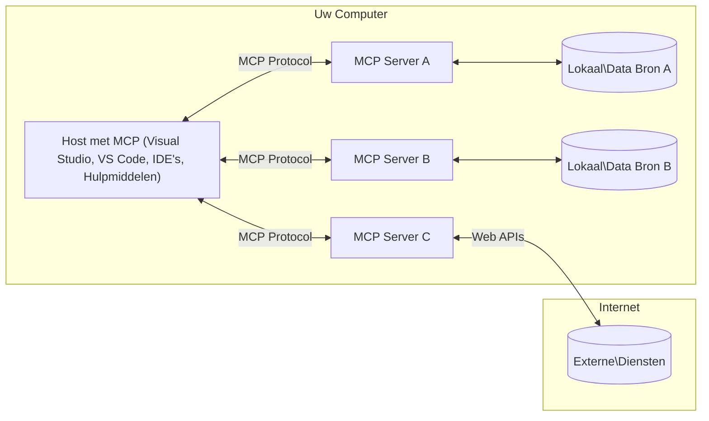

# MCP Kernconcepten: De Model Context Protocol beheersen voor AI-integratie

[](https://youtu.be/earDzWGtE84)

_(Klik op de afbeelding hierboven om de video van deze les te bekijken)_

Het [Model Context Protocol (MCP)](https://github.com/modelcontextprotocol) is een krachtig, gestandaardiseerd kader dat de communicatie optimaliseert tussen grote taalmodellen (LLM's) en externe tools, applicaties en databronnen. 
Deze gids leidt je door de kernconcepten van MCP. Je leert over de client-serverarchitectuur, essentiële componenten, communicatiemechanismen en implementatiebest practices.

- **Expliciete toestemming van de gebruiker**: Alle data-toegang en operaties vereisen expliciete goedkeuring van de gebruiker vóór uitvoering. Gebruikers moeten duidelijk begrijpen welke data worden geraadpleegd en welke acties worden uitgevoerd, met gedetailleerde controle over permissies en autorisaties.

- **Bescherming van privacy van gegevens**: Gebruikersdata wordt alleen blootgesteld met expliciete toestemming en moet worden beschermd door robuuste toegangscontroles gedurende de gehele interactielifecycle. Implementaties moeten ongeautoriseerde datatransmissie voorkomen en strikte privacygrenzen handhaven.

- **Veiligheid bij tooluitvoering**: Elke toolaanroep vereist expliciete toestemming van de gebruiker met helder begrip van de functionaliteit van de tool, parameters en mogelijke impact. Robuuste beveiligingsgrenzen moeten ongewenste, onveilige of kwaadaardige tooluitvoering voorkomen.

- **Transportlaagbeveiliging**: Alle communicatiekanalen dienen passende encryptie- en authenticatiemechanismen te gebruiken. Externe verbindingen moeten veilige transportprotocollen en correcte credentialmanagement implementeren.

#### Implementatierichtlijnen:

- **Beheer van permissies**: Implementeer fijnmazige permissiesystemen die gebruikers laten bepalen welke servers, tools en bronnen toegankelijk zijn  
- **Authenticatie & Autorisatie**: Gebruik veilige authenticatiemethoden (OAuth, API-sleutels) met correcte tokenbeheer en verloop  
- **Validatie van invoer**: Valideer alle parameters en data-invoer volgens gedefinieerde schema's om injectie-aanvallen te voorkomen  
- **Auditlogboeken**: Houd uitgebreide logboeken bij van alle operaties voor beveiligingsmonitoring en compliance  

## Overzicht

Deze les onderzoekt de fundamentele architectuur en componenten die het Model Context Protocol (MCP) ecosysteem vormen. Je leert over de client-serverarchitectuur, belangrijke componenten en communicatiemechanismen die MCP-interacties aandrijven.

## Belangrijke leerdoelen

Aan het einde van deze les zul je:

- De MCP client-serverarchitectuur begrijpen.  
- Rollen en verantwoordelijkheden van Hosts, Clients en Servers kunnen identificeren.  
- De kernfuncties analyseren die MCP tot een flexibel integratielaag maken.  
- Leren hoe informatie binnen het MCP-ecosysteem stroomt.  
- Praktische inzichten opdoen via codevoorbeelden in .NET, Java, Python en JavaScript.

## MCP Architectuur: Een Diepere Kijk

Het MCP-ecosysteem is opgebouwd volgens een client-servermodel. Deze modulaire structuur maakt het mogelijk dat AI-toepassingen efficiënt communiceren met tools, databases, API’s en contextuele bronnen. Laten we deze architectuur opsplitsen in de kerncomponenten.

De kern van MCP volgt een client-serverarchitectuur waarbij een hostapplicatie met meerdere servers kan verbinden:


- **MCP Hosts**: Programma's zoals VSCode, Claude Desktop, IDE’s of AI-tools die data willen benaderen via MCP  
- **MCP Clients**: Protocolclients die 1:1 verbindingen met servers onderhouden  
- **MCP Servers**: Lichtgewicht programma's die elk specifieke mogelijkheden blootstellen via het gestandaardiseerde Model Context Protocol  
- **Lokale Datasources**: De bestanden, databases en services op je computer die MCP-servers veilig kunnen benaderen  
- **Externe Services**: Externe systemen, bereikbaar via internet, waarmee MCP-servers kunnen verbinden via API’s.

Het MCP-protocol is een evoluerende standaard met date-based versionering (formaat JJJJ-MM-DD). De huidige protocolversie is **2025-11-25**. Je kunt de laatste updates bekijken in de [protocolspecificatie](https://modelcontextprotocol.io/specification/2025-11-25/)

### 1. Hosts

In het Model Context Protocol (MCP) zijn **Hosts** AI-applicaties die fungeren als de primaire interface waarmee gebruikers met het protocol omgaan. Hosts coördineren en beheren connecties naar meerdere MCP-servers door voor elke serververbinding dedicated MCP-clients te creëren. Voorbeelden van Hosts zijn:

- **AI-applicaties**: Claude Desktop, Visual Studio Code, Claude Code  
- **Ontwikkelomgevingen**: IDE’s en code-editors met MCP-integratie  
- **Aangepaste applicaties**: Speciaal gebouwde AI-agenten en tools

**Hosts** zijn applicaties die AI-modelinteracties coördineren. Ze:

- **Orkestreren AI-modellen**: Voeren LLM’s uit of communiceren ermee om antwoorden te genereren en AI-workflows te coördineren  
- **Beheren clientverbindingen**: Creëren en onderhouden één MCP-client per MCP-serververbinding  
- **Beheren gebruikersinterface**: Handhaven gespreksflow, gebruikersinteracties en weergave van antwoorden  
- **Handhaven beveiliging**: Controleren permissies, beveiligingsrestricties en authenticatie  
- **Beheren gebruikerstoestemming**: Regelen gebruikersgoedkeuring voor data-sharing en tooluitvoering  

### 2. Clients

**Clients** zijn essentiële componenten die toegewijde één-op-één verbindingen onderhouden tussen Hosts en MCP-servers. Elke MCP-client wordt door de Host gecreëerd om te verbinden met een specifieke MCP-server, wat georganiseerde en veilige communicatiekanalen garandeert. Meerdere clients maken het mogelijk dat Hosts met meerdere servers tegelijk verbinden.

**Clients** zijn connectorcomponenten binnen de hostapplicatie. Ze:

- **Protocolcommunicatie**: Verzenden JSON-RPC 2.0 verzoeken naar servers met prompts en instructies  
- **Capabilityonderhandeling**: Onderhandelen over ondersteunde functies en protocolversies met servers tijdens initialisatie  
- **Tooluitvoering**: Beheren tooluitvoeringsaanvragen van modellen en verwerken antwoorden  
- **Realtime updates**: Handelen notificaties en realtime updates van servers af  
- **Antwoordverwerking**: Verwerken en formatteren serverantwoorden voor weergave aan gebruikers  

### 3. Servers

**Servers** zijn programma's die context, tools en mogelijkheden aan MCP-clients bieden. Ze kunnen lokaal draaien (op dezelfde machine als de Host) of extern (op externe platforms) en zijn verantwoordelijk voor het afhandelen van clientverzoeken en leveren gestructureerde antwoorden. Servers stellen specifieke functionaliteit beschikbaar via het gestandaardiseerde Model Context Protocol.

**Servers** zijn services die context en functionaliteiten bieden. Ze:

- **Registratie van features**: Registreren en publiceren beschikbare primitieve elementen (bronnen, prompts, tools) aan clients  
- **Verwerkingsverzoeken**: Ontvangen en voeren toolaanroepen, resourceverzoeken en promptverzoeken van clients uit  
- **Contextvoorziening**: Bieden contextuele informatie en data om modelantwoorden te verbeteren  
- **Statusbeheer**: Beheren sessiestatus en behandelen stateful interacties indien nodig  
- **Realtime notificaties**: Versturen meldingen over wijzigingen en updates aan verbonden clients

Servers kunnen door iedereen ontwikkeld worden om modelmogelijkheden uit te breiden met gespecialiseerde functionaliteiten en ondersteunen zowel lokale als remote deploymentscenario’s.

### 4. Serverprimitieven

Servers in het Model Context Protocol (MCP) bieden drie kern **primitieven** die de fundamentele bouwstenen definiëren voor rijke interacties tussen clients, hosts en taalmodellen. Deze primitieven specificeren de typen contextuele informatie en acties die via het protocol beschikbaar zijn.

MCP-servers kunnen elke combinatie van de volgende drie kernprimitieven blootstellen:

#### Bronnen

**Bronnen** zijn databronnen die contextuele informatie aan AI-toepassingen leveren. Ze vertegenwoordigen statische of dynamische inhoud die de modelbegrip en besluitvorming kan verbeteren:

- **Contextuele data**: Gestructureerde informatie en context voor consumptie door AI-modellen  
- **Kennisbanken**: Documentrepositories, artikelen, handleidingen en onderzoeksartikelen  
- **Lokale datasources**: Bestanden, databases en lokale systeeminformatie  
- **Externe data**: API-antwoorden, webservices en data van afstandssystemen  
- **Dynamische inhoud**: Real-time data die bijgewerkt wordt op basis van externe condities

Bronnen worden geïdentificeerd door URIs en ondersteunen ontdekking via `resources/list` en ophalen via `resources/read` methodes:

```text
file://documents/project-spec.md
database://production/users/schema
api://weather/current
```

#### Prompts

**Prompts** zijn herbruikbare sjablonen die helpen interacties met taalmodellen te structureren. Ze bieden gestandaardiseerde interactiepatronen en templated workflows:

- **Template-gebaseerde interacties**: Vooraf gestructureerde berichten en gespreksstarters  
- **Workflowtemplates**: Gestandaardiseerde reeksen voor veelvoorkomende taken en interacties  
- **Few-shot voorbeelden**: Voorbeeldgebaseerde sjablonen voor modelinstructies  
- **Systeem-prompts**: Fundamentele prompts die modelgedrag en context definiëren  
- **Dynamische sjablonen**: Geparametriseerde prompts die zich aanpassen aan specifieke contexten

Prompts ondersteunen variabele substitutie en kunnen worden ontdekt via `prompts/list` en opgehaald via `prompts/get`:

```markdown
Generate a {{task_type}} for {{product}} targeting {{audience}} with the following requirements: {{requirements}}
```

#### Tools

**Tools** zijn uitvoerbare functies die AI-modellen kunnen oproepen om specifieke handelingen uit te voeren. Ze vertegenwoordigen de "werkwoorden" van het MCP-ecosysteem en stellen modellen in staat te interacteren met externe systemen:

- **Uitvoerbare functies**: Discrete operaties die modellen kunnen aanroepen met specifieke parameters  
- **Integratie externe systemen**: API-calls, databasequeries, bestandsbewerkingen, berekeningen  
- **Unieke identiteit**: Elke tool heeft een unieke naam, omschrijving en parameterschema  
- **Gestructureerde invoer/uitvoer**: Tools accepteren gevalideerde parameters en leveren gestructureerde, getypeerde antwoorden  
- **Actiemogelijkheden**: Stellen modellen in staat real-world acties uit te voeren en live data op te halen

Tools worden gedefinieerd met JSON Schema voor parametervalidatie en ontdekt via `tools/list` en uitgevoerd via `tools/call`. Tools kunnen ook **iconen** bevatten als aanvullende metadata voor betere UI-presentatie.

**Toolannotaties**: Tools ondersteunen gedragsannotaties (zoals `readOnlyHint`, `destructiveHint`) die aangeven of een tool alleen-lezen of destructief is, wat clients helpt geïnformeerde beslissingen te nemen over tooluitvoering.

Voorbeeld tooldefinitie:

```typescript
server.tool(
  "search_products", 
  {
    query: z.string().describe("Search query for products"),
    category: z.string().optional().describe("Product category filter"),
    max_results: z.number().default(10).describe("Maximum results to return")
  }, 
  async (params) => {
    // Voer zoekopdracht uit en retourneer gestructureerde resultaten
    return await productService.search(params);
  }
);
```

## Clientprimitieven

In het Model Context Protocol (MCP) kunnen **clients** primitieven blootstellen die servers in staat stellen aanvullende functionaliteiten van de hostapplicatie op te vragen. Deze client-side primitieven maken rijkere, interactievere serverimplementaties mogelijk die toegang hebben tot AI-modelmogelijkheden en gebruikersinteracties.

### Sampling

**Sampling** stelt servers in staat taalmodelcompletions aan te vragen bij de AI-applicatie van de client. Deze primitive maakt het servers mogelijk LLM-mogelijkheden te gebruiken zonder eigen modelafhankelijkheden in te bouwen:

- **Modelonafhankelijke toegang**: Servers kunnen completions aanvragen zonder LLM SDK’s te hoeven bevatten of modeltoegang te beheren  
- **Servergestuurde AI**: Maakt het servers autonoom genereren van content mogelijk met het AI-model van de client  
- **Recursieve LLM-interacties**: Ondersteunt complexe scenario’s waarin servers AI-hulp nodig hebben voor verwerking  
- **Dynamische contentgeneratie**: Laat servers contextuele antwoorden creëren met het model van de host  
- **Ondersteuning toolaanroep**: Servers kunnen `tools` en `toolChoice` parameters meesturen om te zorgen dat het clientmodel tools kan aanroepen tijdens sampling

Sampling wordt geïnitieerd via de `sampling/complete` methode, waarbij servers completieverzoeken naar clients sturen.

### Roots

**Roots** bieden een gestandaardiseerde manier voor clients om filesystemgrenzen aan servers bloot te stellen, waardoor servers kunnen begrijpen tot welke mappen en bestanden ze toegang hebben:

- **Filesystemgrenzen**: Definiëren de grenzen waarbinnen servers mogen opereren op het bestandssysteem  
- **Toegangscontrole**: Helpen servers te begrijpen op welke directories en bestanden ze permissie hebben  
- **Dynamische updates**: Clients kunnen servers informeren wanneer de lijst van roots verandert  
- **URI-gebaseerde identificatie**: Roots gebruiken `file://` URI’s om toegankelijke directories en bestanden te identificeren

Roots worden ontdekt via `roots/list`, clients sturen `notifications/roots/list_changed` wanneer roots wijzigen.

### Elicitation

**Elicitation** stelt servers in staat aanvullende informatie of bevestiging van gebruikers te vragen via de clientinterface:

- **Gebruikersinputverzoeken**: Servers kunnen om extra informatie vragen wanneer dat nodig is voor tooluitvoering  
- **Bevestigingsdialogen**: Vragen om gebruikersgoedgekeuring voor gevoelige of impactvolle acties  
- **Interactieve workflows**: Stellen servers in staat stap-voor-stap gebruikersinteracties op te zetten  
- **Dynamische parameterverzameling**: Verzamelen van ontbrekende of optionele parameters tijdens tooluitvoering

Elicitation-aanvragen worden gedaan via de `elicitation/request` methode om gebruikersinput via de clientinterface te verzamelen.

**URL-modus elicitation**: Servers kunnen ook URL-gebaseerde gebruikersinteracties aanvragen, waarmee zij gebruikers naar externe webpagina’s kunnen leiden voor authenticatie, bevestiging of data-invoer.

### Logging

**Logging** maakt het servers mogelijk gestructureerde logberichten naar clients te sturen voor debugging, monitoring en operationele zichtbaarheid:

- **Ondersteuning debugging**: Servers kunnen gedetailleerde uitvoeringslogboeken aanbieden voor foutopsporing  
- **Operationele monitoring**: Versturen statusupdates en prestatietracking naar clients  
- **Foutmelding**: Bieden gedetailleerde foutcontext en diagnostische informatie  
- **Auditsporen**: Creëren van uitgebreide logboeken van serveractiviteiten en beslissingen

Logging-berichten worden naar clients gestuurd om transparantie van serveroperaties en foutopsporing te vergemakkelijken.

## Informatiestroom in MCP

Het Model Context Protocol (MCP) definieert een gestructureerde informatiestroom tussen hosts, clients, servers en modellen. Het begrijpen van deze stroom helpt duidelijk maken hoe gebruikersverzoeken worden verwerkt en hoe externe tools en data worden geïntegreerd in modelantwoorden.
- **Host start de verbinding**  
  De hostapplicatie (zoals een IDE of chatinterface) maakt een verbinding met een MCP-server, doorgaans via STDIO, WebSocket of een ander ondersteund transport.

- **Mogelijkheden onderhandelen**  
  De client (ingebed in de host) en de server wisselen informatie uit over hun ondersteunde functies, tools, bronnen en protocolversies. Dit zorgt ervoor dat beide zijden begrijpen welke mogelijkheden beschikbaar zijn voor de sessie.

- **Gebruikersverzoek**  
  De gebruiker communiceert met de host (bijvoorbeeld door een prompt of opdracht in te voeren). De host verzamelt deze invoer en geeft deze door aan de client voor verwerking.

- **Gebruik van resource of tool**  
  - De client kan extra context of bronnen opvragen bij de server (zoals bestanden, databasevermeldingen of kennisbankartikelen) om het begrip van het model te verrijken.  
  - Als het model bepaalt dat een tool nodig is (bijvoorbeeld om gegevens op te halen, een berekening uit te voeren of een API aan te roepen), stuurt de client een tool-aanroepverzoek naar de server, waarbij de naam van de tool en parameters worden gespecificeerd.

- **Serveruitvoering**  
  De server ontvangt het resource- of toolverzoek, voert de noodzakelijke operaties uit (zoals het uitvoeren van een functie, het raadplegen van een database of het ophalen van een bestand) en retourneert de resultaten aan de client in een gestructureerd formaat.

- **Responsgeneratie**  
  De client integreert de reacties van de server (resourcegegevens, tooloutputs, enzovoort) in de lopende modelinteractie. Het model gebruikt deze informatie om een uitgebreide en contextueel relevante respons te genereren.

- **Resultaatpresentatie**  
  De host ontvangt de uiteindelijke output van de client en presenteert deze aan de gebruiker, vaak zowel de door het model gegenereerde tekst als eventuele resultaten van tooluitvoeringen of resource-opvragingen.

Deze stroom stelt MCP in staat om geavanceerde, interactieve en contextbewuste AI-toepassingen te ondersteunen door modellen naadloos te verbinden met externe tools en databronnen.

## Protocolarchitectuur & Lagen

MCP bestaat uit twee onderscheiden architectuurlagen die samenwerken om een complete communicatie-infrastructuur te bieden:

### Datalayer

De **Datalayer** implementeert het kern-MCP-protocol met **JSON-RPC 2.0** als basis. Deze laag definieert de berichtstructuur, semantiek en interactiepatronen:

#### Kerncomponenten:

- **JSON-RPC 2.0 Protocol**: Alle communicatie maakt gebruik van het gestandaardiseerde JSON-RPC 2.0-berichtformaat voor methodaanroepen, antwoorden en notificaties  
- **Levenscyclusbeheer**: Behandelt verbindinginitialisatie, mogelijkhedenonderhandeling en sessiebeëindiging tussen clients en servers  
- **Serverprimitieven**: Maakt het servers mogelijk om kernfunctionaliteit te bieden via tools, bronnen en prompts  
- **Clientprimitieven**: Maakt het servers mogelijk om sampling van LLM's aan te vragen, gebruikersinvoer uit te lokken en logberichten te sturen  
- **Realtime notificaties**: Ondersteunt asynchrone meldingen voor dynamische updates zonder polling

#### Belangrijke kenmerken:

- **Protocolversie-onderhandeling**: Maakt gebruik van datumgebaseerde versienummering (JJJJ-MM-DD) om compatibiliteit te waarborgen  
- **Mogelijkhedendetectie**: Clients en servers wisselen de ondersteuning van features uit tijdens initialisatie  
- **Statushoudende sessies**: Behoudt de verbindingsstatus over meerdere interacties voor contextcontinuïteit

### Transportlayer

De **Transportlayer** beheert communicatiekanalen, berichtafbakening en authenticatie tussen MCP-deelnemers:

#### Ondersteunde transportmechanismen:

1. **STDIO-transport**:  
   - Gebruikt standaard input/output-streams voor directe procescommunicatie  
   - Optimaal voor lokale processen op dezelfde machine zonder netwerkoverhead  
   - Veel toegepast bij lokale MCP-serverimplementaties  

2. **Streamable HTTP-transport**:  
   - Maakt gebruik van HTTP POST voor client-naar-server berichten  
   - Optioneel Server-Sent Events (SSE) voor server-naar-client streaming  
   - Mogelijk maakt externe servercommunicatie over netwerken  
   - Ondersteunt standaard HTTP-authenticatie (bearer tokens, API-sleutels, aangepaste headers)  
   - MCP adviseert OAuth voor veilige token-gebaseerde authenticatie

#### Transportabstractie:

De transportlaag abstraheert communicatiedetails van de datalaag, waardoor hetzelfde JSON-RPC 2.0-berichtformaat wordt gebruikt over alle transportmechanismen. Deze abstractie maakt het mogelijk om naadloos tussen lokale en externe servers te wisselen.

### Beveiligingsoverwegingen

MCP-implementaties moeten voldoen aan diverse kritieke beveiligingsprincipes om veilige, betrouwbare en beveiligde interacties te waarborgen bij alle protocoloperaties:

- **Toestemming en controle door gebruiker**: Gebruikers moeten expliciete toestemming geven voordat gegevens worden gebruikt of bewerkingen worden uitgevoerd. Ze moeten duidelijke controle hebben over welke data wordt gedeeld en welke acties worden geautoriseerd, ondersteund door intuïtieve gebruikersinterfaces om activiteiten te beoordelen en goed te keuren.

- **Gegevensprivacy**: Gebruikersgegevens mogen alleen met expliciete toestemming worden gedeeld en moeten worden beschermd door passende toegangscontroles. MCP-implementaties moeten voorkomen dat gegevens ongeautoriseerd worden verzonden en waarborgen dat privacy gedurende alle interacties wordt gehandhaafd.

- **Toolveiligheid**: Voor het aanroepen van een tool is expliciete toestemming van de gebruiker verplicht. Gebruikers moeten duidelijk begrijpen wat de functionaliteit van elke tool is, en robuuste beveiligingsgrenzen moeten worden gehandhaafd om onbeoogde of onveilige uitvoering van tools te voorkomen.

Door deze beveiligingsprincipes te volgen waarborgt MCP dat vertrouwen, privacy en veiligheid voor gebruikers behouden blijven tijdens alle protocolinteracties, terwijl krachtige AI-integraties mogelijk worden gemaakt.

## Voorbeelden van code: Kerncomponenten

Hieronder staan codevoorbeelden in diverse populaire programmeertalen die illustreren hoe kerncomponenten van een MCP-server en tools geïmplementeerd kunnen worden.

### .NET Voorbeeld: Een eenvoudige MCP-server met tools maken

Hier is een praktisch .NET-codevoorbeeld dat laat zien hoe een eenvoudige MCP-server met aangepaste tools geïmplementeerd kan worden. Dit voorbeeld toont hoe je tools definieert en registreert, verzoeken afhandelt en de server verbindt met het Model Context Protocol.

```csharp
using System;
using System.Threading.Tasks;
using ModelContextProtocol.Server;
using ModelContextProtocol.Server.Transport;
using ModelContextProtocol.Server.Tools;

public class WeatherServer
{
    public static async Task Main(string[] args)
    {
        // Create an MCP server
        var server = new McpServer(
            name: "Weather MCP Server",
            version: "1.0.0"
        );
        
        // Register our custom weather tool
        server.AddTool<string, WeatherData>("weatherTool", 
            description: "Gets current weather for a location",
            execute: async (location) => {
                // Call weather API (simplified)
                var weatherData = await GetWeatherDataAsync(location);
                return weatherData;
            });
        
        // Connect the server using stdio transport
        var transport = new StdioServerTransport();
        await server.ConnectAsync(transport);
        
        Console.WriteLine("Weather MCP Server started");
        
        // Keep the server running until process is terminated
        await Task.Delay(-1);
    }
    
    private static async Task<WeatherData> GetWeatherDataAsync(string location)
    {
        // This would normally call a weather API
        // Simplified for demonstration
        await Task.Delay(100); // Simulate API call
        return new WeatherData { 
            Temperature = 72.5,
            Conditions = "Sunny",
            Location = location
        };
    }
}

public class WeatherData
{
    public double Temperature { get; set; }
    public string Conditions { get; set; }
    public string Location { get; set; }
}
```

### Java Voorbeeld: MCP-servercomponenten

Dit voorbeeld demonstreert dezelfde MCP-server en toolregistratie als het .NET-voorbeeld hierboven, maar dan geïmplementeerd in Java.

```java
import io.modelcontextprotocol.server.McpServer;
import io.modelcontextprotocol.server.McpToolDefinition;
import io.modelcontextprotocol.server.transport.StdioServerTransport;
import io.modelcontextprotocol.server.tool.ToolExecutionContext;
import io.modelcontextprotocol.server.tool.ToolResponse;

public class WeatherMcpServer {
    public static void main(String[] args) throws Exception {
        // Maak een MCP-server aan
        McpServer server = McpServer.builder()
            .name("Weather MCP Server")
            .version("1.0.0")
            .build();
            
        // Registreer een weerhulpmiddel
        server.registerTool(McpToolDefinition.builder("weatherTool")
            .description("Gets current weather for a location")
            .parameter("location", String.class)
            .execute((ToolExecutionContext ctx) -> {
                String location = ctx.getParameter("location", String.class);
                
                // Haal weergegevens op (vereenvoudigd)
                WeatherData data = getWeatherData(location);
                
                // Geef een geformatteerde respons terug
                return ToolResponse.content(
                    String.format("Temperature: %.1f°F, Conditions: %s, Location: %s", 
                    data.getTemperature(), 
                    data.getConditions(), 
                    data.getLocation())
                );
            })
            .build());
        
        // Verbind de server via stdio transport
        try (StdioServerTransport transport = new StdioServerTransport()) {
            server.connect(transport);
            System.out.println("Weather MCP Server started");
            // Houd de server draaiende totdat het proces wordt beëindigd
            Thread.currentThread().join();
        }
    }
    
    private static WeatherData getWeatherData(String location) {
        // Implementatie zou een weer-API aanroepen
        // Vereenvoudigd voor voorbeeld doeleinden
        return new WeatherData(72.5, "Sunny", location);
    }
}

class WeatherData {
    private double temperature;
    private String conditions;
    private String location;
    
    public WeatherData(double temperature, String conditions, String location) {
        this.temperature = temperature;
        this.conditions = conditions;
        this.location = location;
    }
    
    public double getTemperature() {
        return temperature;
    }
    
    public String getConditions() {
        return conditions;
    }
    
    public String getLocation() {
        return location;
    }
}
```

### Python Voorbeeld: Een MCP-server bouwen

Dit voorbeeld gebruikt fastmcp. Zorg er dus voor dat je het eerst installeert:

```python
pip install fastmcp
```
Codevoorbeeld:

```python
#!/usr/bin/env python3
import asyncio
from fastmcp import FastMCP
from fastmcp.transports.stdio import serve_stdio

# Maak een FastMCP-server aan
mcp = FastMCP(
    name="Weather MCP Server",
    version="1.0.0"
)

@mcp.tool()
def get_weather(location: str) -> dict:
    """Gets current weather for a location."""
    return {
        "temperature": 72.5,
        "conditions": "Sunny",
        "location": location
    }

# Alternatieve benadering met een klasse
class WeatherTools:
    @mcp.tool()
    def forecast(self, location: str, days: int = 1) -> dict:
        """Gets weather forecast for a location for the specified number of days."""
        return {
            "location": location,
            "forecast": [
                {"day": i+1, "temperature": 70 + i, "conditions": "Partly Cloudy"}
                for i in range(days)
            ]
        }

# Registreer klassenhulpmiddelen
weather_tools = WeatherTools()

# Start de server
if __name__ == "__main__":
    asyncio.run(serve_stdio(mcp))
```

### JavaScript Voorbeeld: Een MCP-server maken

Dit voorbeeld toont het maken van een MCP-server in JavaScript en hoe twee weersgerelateerde tools worden geregistreerd.

```javascript
// Gebruikmakend van de officiële Model Context Protocol SDK
import { McpServer } from "@modelcontextprotocol/sdk/server/mcp.js";
import { StdioServerTransport } from "@modelcontextprotocol/sdk/server/stdio.js";
import { z } from "zod"; // Voor parametervalidatie

// Maak een MCP-server aan
const server = new McpServer({
  name: "Weather MCP Server",
  version: "1.0.0"
});

// Definieer een weerhulpmiddel
server.tool(
  "weatherTool",
  {
    location: z.string().describe("The location to get weather for")
  },
  async ({ location }) => {
    // Dit zou normaal een weer-API aanroepen
    // Vereenvoudigd voor demonstratie
    const weatherData = await getWeatherData(location);
    
    return {
      content: [
        { 
          type: "text", 
          text: `Temperature: ${weatherData.temperature}°F, Conditions: ${weatherData.conditions}, Location: ${weatherData.location}` 
        }
      ]
    };
  }
);

// Definieer een voorspellingshulpmiddel
server.tool(
  "forecastTool",
  {
    location: z.string(),
    days: z.number().default(3).describe("Number of days for forecast")
  },
  async ({ location, days }) => {
    // Dit zou normaal een weer-API aanroepen
    // Vereenvoudigd voor demonstratie
    const forecast = await getForecastData(location, days);
    
    return {
      content: [
        { 
          type: "text", 
          text: `${days}-day forecast for ${location}: ${JSON.stringify(forecast)}` 
        }
      ]
    };
  }
);

// Hulpfuncties
async function getWeatherData(location) {
  // Simuleer API-aanroep
  return {
    temperature: 72.5,
    conditions: "Sunny",
    location: location
  };
}

async function getForecastData(location, days) {
  // Simuleer API-aanroep
  return Array.from({ length: days }, (_, i) => ({
    day: i + 1,
    temperature: 70 + Math.floor(Math.random() * 10),
    conditions: i % 2 === 0 ? "Sunny" : "Partly Cloudy"
  }));
}

// Verbind de server met stdio transport
const transport = new StdioServerTransport();
server.connect(transport).catch(console.error);

console.log("Weather MCP Server started");
```

Dit JavaScript-voorbeeld laat zien hoe je een MCP-server maakt die weersgerelateerde tools registreert en verbinding maakt via stdio-transport om binnenkomende clientverzoeken te behandelen.

## Beveiliging en autorisatie

MCP bevat diverse ingebouwde concepten en mechanismen voor het beheren van beveiliging en autorisatie door het gehele protocol:

1. **Tooltoestemmingsbeheer**:  
  Clients kunnen specificeren welke tools een model tijdens een sessie mag gebruiken. Dit zorgt ervoor dat alleen expliciet geautoriseerde tools toegankelijk zijn, wat het risico op ongewenste of onveilige acties vermindert. Toestemmingen kunnen dynamisch worden ingesteld op basis van gebruikersvoorkeuren, organisatorisch beleid of context van de interactie.

2. **Authenticatie**:  
  Servers kunnen authenticatie vereisen voordat toegang wordt verleend tot tools, bronnen of gevoelige operaties. Dit kan API-sleutels, OAuth-tokens of andere authenticatieschema's omvatten. Juiste authenticatie waarborgt dat alleen vertrouwde clients en gebruikers servermogelijkheden kunnen aanroepen.

3. **Validatie**:  
  Parametervalidatie wordt afgedwongen voor alle toolaanroepen. Elke tool definieert de verwachte types, formaten en beperkingen voor zijn parameters, en de server valideert inkomende verzoeken dienovereenkomstig. Dit voorkomt dat foutieve of kwaadwillige invoer bij toolimplementaties terechtkomt en helpt de integriteit van operaties te behouden.

4. **Rate limiting**:  
  Om misbruik te voorkomen en eerlijke verdeling van serverbronnen te garanderen, kunnen MCP-servers rate limiting toepassen voor toolaanroepen en resource-toegang. Rate limits kunnen per gebruiker, per sessie of globaal worden toegepast en helpen denial-of-service-aanvallen of excessief gebruik te voorkomen.

Door deze mechanismen te combineren biedt MCP een veilige basis voor integratie van taalmodellen met externe tools en databronnen, terwijl gebruikers en ontwikkelaars fijne controle behouden over toegang en gebruik.

## Protocolberichten & Communicatiestroom

MCP-communicatie maakt gebruik van gestructureerde **JSON-RPC 2.0**-berichten om duidelijke en betrouwbare interacties tussen hosts, clients en servers mogelijk te maken. Het protocol definieert specifieke berichtpatronen voor verschillende soorten operaties:

### Kernberichttypen:

#### **Initialisatieberichten**  
- **`initialize` Verzoek**: Legt verbinding vast en onderhandelt protocolversie en mogelijkheden  
- **`initialize` Antwoord**: Bevestigt ondersteunde features en serverinformatie  
- **`notifications/initialized`**: Geeft aan dat initialisatie voltooid is en de sessie klaar is

#### **Ontdekkingsberichten**  
- **`tools/list` Verzoek**: Ontdekt beschikbare tools van de server  
- **`resources/list` Verzoek**: Toont beschikbare bronnen (datasources)  
- **`prompts/list` Verzoek**: Haalt beschikbare promptsjablonen op

#### **Uitvoeringsberichten**  
- **`tools/call` Verzoek**: Voert een specifieke tool uit met meegegeven parameters  
- **`resources/read` Verzoek**: Haalt inhoud op uit een specifieke resource  
- **`prompts/get` Verzoek**: Haalt een promptsjabloon op met optionele parameters

#### **Clientzijde berichten**  
- **`sampling/complete` Verzoek**: Server vraagt LLM-completion aan bij de client  
- **`elicitation/request`**: Server vraagt gebruikersinput via de clientinterface  
- **Logging-berichten**: Server stuurt gestructureerde logberichten naar de client

#### **Notificatieberichten**  
- **`notifications/tools/list_changed`**: Server informeert client over wijzigingen in tools  
- **`notifications/resources/list_changed`**: Server informeert client over wijzigingen in resources  
- **`notifications/prompts/list_changed`**: Server informeert client over wijzigingen in prompts

### Berichtstructuur:

Alle MCP-berichten volgen het JSON-RPC 2.0-formaat met:  
- **Verzoekberichten**: bevatten `id`, `method` en optioneel `params`  
- **Antwoordberichten**: bevatten `id` en óf `result` óf `error`  
- **Notificatieberichten**: bevatten `method` en optioneel `params` (geen `id` of antwoord verwacht)

Deze gestructureerde communicatie zorgt voor betrouwbare, traceerbare en uitbreidbare interacties die geavanceerde scenario's ondersteunen zoals realtime updates, toolketens en robuuste foutafhandeling.

### Taken (Experimenteel)

**Taken** zijn een experimentele functie die duurzame uitvoeringswikkels bieden voor het uitstellen van resultaatopvraging en statusmonitoring van MCP-verzoeken:

- **Langdurige operaties**: Volgt kostbare berekeningen, workflowautomatisering en batchverwerking  
- **Uitgestelde resultaten**: Pollt op taakstatus en haalt resultaten op zodra de operatie voltooid is  
- **Statusmonitoring**: Volgt taakvoortgang via gedefinieerde levenscyclusstaten  
- **Meerstapsoperaties**: Ondersteunt complexe workflows die meerdere interacties omvatten

Taken wikkelen standaard MCP-verzoeken in om asynchrone uitvoeringspatronen mogelijk te maken voor operaties die niet direct kunnen worden voltooid.

## Belangrijkste punten

- **Architectuur**: MCP gebruikt een client-serverarchitectuur waarbij hosts meerdere clientverbindingen met servers beheren  
- **Deelnemers**: Het ecosysteem omvat hosts (AI-toepassingen), clients (protocolkoppelingen) en servers (mogelijkheidproviders)  
- **Transportmechanismen**: Communicatie ondersteunt STDIO (lokaal) en Streamable HTTP met optionele SSE (extern)  
- **Kernprimitieven**: Servers bieden tools (uitvoerende functies), resources (datasources) en prompts (sjablonen)  
- **Clientprimitieven**: Servers kunnen sampling (LLM-completions met toolaanroepondersteuning), elicitation (gebruikersinput inclusief URL-modus), roots (bestandsgrenzen) en logging van clients opvragen  
- **Experimentele functies**: Taken bieden duurzame uitvoeringswikkels voor langdurende operaties  
- **Protocolaarde**: Gebouwd op JSON-RPC 2.0 met datumgebaseerde versie (huidig: 2025-11-25)  
- **Realtimemogelijkheden**: Ondersteunt notificaties voor dynamische updates en realtime synchronisatie  
- **Beveiliging eerst**: Expliciete toestemming van gebruikers, bescherming van gegevensprivacy en veilige transport zijn kerneisen

## Oefening

Ontwerp een eenvoudige MCP-tool die nuttig zou zijn in jouw domein. Definieer:  
1. Hoe de tool zou heten  
2. Welke parameters het accepteert  
3. Welke output het retourneert  
4. Hoe een model deze tool zou kunnen gebruiken om gebruikersproblemen op te lossen


---

## Wat nu?

Volgende: [Hoofdstuk 2: Beveiliging](../02-Security/README.md)

---

<!-- CO-OP TRANSLATOR DISCLAIMER START -->
**Disclaimer**:
Dit document is vertaald met behulp van de AI-vertalingsdienst [Co-op Translator](https://github.com/Azure/co-op-translator). Hoewel we streven naar nauwkeurigheid, dient u er rekening mee te houden dat geautomatiseerde vertalingen fouten of onjuistheden kunnen bevatten. Het originele document in de oorspronkelijke taal moet als de gezaghebbende bron worden beschouwd. Voor kritieke informatie wordt professionele menselijke vertaling aanbevolen. Wij zijn niet aansprakelijk voor misverstanden of verkeerde interpretaties die voortvloeien uit het gebruik van deze vertaling.
<!-- CO-OP TRANSLATOR DISCLAIMER END -->