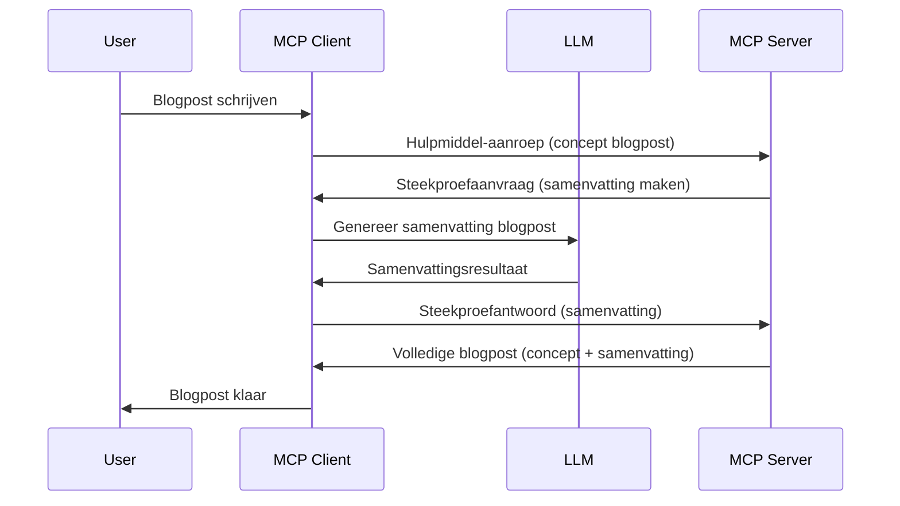

# Sampling - delegeer functies aan de Client

Soms moeten de MCP Client en de MCP Server samenwerken om een gemeenschappelijk doel te bereiken. Je kunt een situatie hebben waarin de Server de hulp nodig heeft van een LLM die op de client draait. Voor deze situatie is sampling wat je zou moeten gebruiken.

Laten we wat use cases verkennen en hoe je een oplossing bouwt die sampling omvat.

## Overzicht

In deze les richten we ons op het uitleggen wanneer en waar Sampling te gebruiken en hoe je het configureert.

## Leerdoelen

In dit hoofdstuk zullen we:

- Uitleggen wat Sampling is en wanneer het te gebruiken.
- Tonen hoe Sampling te configureren in MCP.
- Voorbeelden geven van Sampling in actie.

## Wat is Sampling en waarom gebruiken?

Sampling is een geavanceerde functie die op de volgende manier werkt:



### Sampling aanvraag

Oké, nu hebben we een helikopterview van een geloofwaardig scenario, laten we het hebben over de sampling-aanvraag die de server terugstuurt naar de client. Dit is hoe zo’n aanvraag eruit kan zien in JSON-RPC-formaat:

```json
{
  "jsonrpc": "2.0",
  "id": 1,
  "method": "sampling/createMessage",
  "params": {
    "messages": [
      {
        "role": "user",
        "content": {
          "type": "text",
          "text": "Create a blog post summary of the following blog post: <BLOG POST>"
        }
      }
    ],
    "modelPreferences": {
      "hints": [
        {
          "name": "claude-3-sonnet"
        }
      ],
      "intelligencePriority": 0.8,
      "speedPriority": 0.5
    },
    "systemPrompt": "You are a helpful assistant.",
    "maxTokens": 100
  }
}
```

Er zijn een paar dingen hier die het waard zijn om te benoemen:

- Prompt, onder content -> text, is onze prompt die een instructie is voor de LLM om blogpostinhoud samen te vatten.

- **modelPreferences**. Dit gedeelte is precies dat, een voorkeur, een aanbeveling van welke configuratie te gebruiken met de LLM. De gebruiker kan kiezen deze aanbevelingen te volgen of aan te passen. In dit geval zijn er aanbevelingen over welk model te gebruiken en snelheid en intelligentie prioriteit.
- **systemPrompt**, dit is je normale systeem prompt die je LLM een persoonlijkheid geeft en instructies bevat.
- **maxTokens**, dit is een andere eigenschap die aangeeft hoeveel tokens aanbevolen worden voor deze taak.

### Sampling antwoord

Dit antwoord is wat de MCP Client uiteindelijk terugstuurt naar de MCP Server en het resultaat is van het aanroepen van de LLM door de client, wachten op dat antwoord en vervolgens dit bericht opbouwen. Dit is hoe het eruit kan zien in JSON-RPC:

```json
{
  "jsonrpc": "2.0",
  "id": 1,
  "result": {
    "role": "assistant",
    "content": {
      "type": "text",
      "text": "Here's your abstract <ABSTRACT>"
    },
    "model": "gpt-5",
    "stopReason": "endTurn"
  }
}
```

Let op hoe het antwoord een abstract is van de blogpost zoals we vroegen. Merk ook op hoe het gebruikte `model` niet is wat we vroegen maar "gpt-5" in plaats van "claude-3-sonnet". Dit illustreert dat de gebruiker van gedachten kan veranderen over wat te gebruiken en dat je sampling-aanvraag een aanbeveling is.

Oké, nu we de hoofdflow begrijpen en een nuttige taak om het voor te gebruiken, "blogpostcreatie + abstract", laten we zien wat we moeten doen om het werkend te krijgen.

### Berichttypes

Sampling berichten zijn niet beperkt tot alleen tekst maar je kunt ook afbeeldingen en audio verzenden. Zo ziet JSON-RPC er anders uit:

**Tekst**

```json
{
  "type": "text",
  "text": "The message content"
}
```

**Afbeeldingsinhoud**

```json
{
  "type": "image",
  "data": "base64-encoded-image-data",
  "mimeType": "image/jpeg"
}
```

**Audiocontent**

```json
{
  "type": "audio",
  "data": "base64-encoded-audio-data",
  "mimeType": "audio/wav"
}
```

> NOTE: voor meer gedetailleerde info over Sampling, bekijk de [officiële docs](https://modelcontextprotocol.io/specification/2025-11-25/client/sampling)

## Hoe Sampling te configureren in de Client

> Let op: als je alleen een server bouwt, hoef je hier niet veel te doen.

In een client moet je de volgende feature specificeren als volgt:

```json
{
  "capabilities": {
    "sampling": {}
  }
}
```

Dit wordt opgepikt wanneer je gekozen client wordt geïnitialiseerd met de server.

## Voorbeeld van Sampling in Actie - Een Blogpost maken

Laten we samen een sampling-server coderen, we moeten het volgende doen:

1. Maak een tool op de Server.
1. Die tool moet een sampling-aanvraag maken.
1. Tool moet wachten op het beantwoorden van de sampling-aanvraag door de client.
1. Daarna moet het toolresultaat geproduceerd worden.

Laten we de code stap voor stap bekijken:

### -1- Maak de tool

**python**

```python
@mcp.tool()
async def create_blog(title: str, content: str, ctx: Context[ServerSession, None]) -> str:
    """Create a blog post and generate a summary"""

```

### -2- Maak een sampling-aanvraag

Breid je tool uit met de volgende code:

**python**

```python
post = BlogPost(
        id=len(posts) + 1,
        title=title,
        content=content,
        abstract=""
    )

prompt = f"Create an abstract of the following blog post: title: {title} and draft: {content} "

result = await ctx.session.create_message(
        messages=[
            SamplingMessage(
                role="user",
                content=TextContent(type="text", text=prompt),
            )
        ],
        max_tokens=100,
)

```

### -3- Wacht op het antwoord en retourneer antwoord

**python**

```python
post.abstract = result.content.text

posts.append(post)

# retourneer het complete product
return json.dumps({
    "id": post.title,
    "abstract": post.abstract
})
```

### -4- Volledige code

**python**

```python
from starlette.applications import Starlette
from starlette.routing import Mount, Host

from mcp.server.fastmcp import Context, FastMCP

from mcp.server.session import ServerSession
from mcp.types import SamplingMessage, TextContent

import json


from uuid import uuid4
from typing import List
from pydantic import BaseModel


mcp = FastMCP("Blog post generator")

# app = FastAPI()

posts = []

class BlogPost(BaseModel):
    id: int
    title: str
    content: str
    abstract: str

posts: List[BlogPost] = []

@mcp.tool()
async def create_blog(title: str, content: str, ctx: Context[ServerSession, None]) -> str:
    """Create a blog post and generate a summary"""

    post = BlogPost(
        id=len(posts) + 1,
        title=title,
        content=content,
        abstract=""
    )

    prompt = f"Create an abstract of the following blog post: title: {title} and draft: {content} "

    result = await ctx.session.create_message(
        messages=[
            SamplingMessage(
                role="user",
                content=TextContent(type="text", text=prompt),
            )
        ],
        max_tokens=100,
    )

    post.abstract = result.content.text

    posts.append(post)

    # retourneer de complete blogpost
    return json.dumps({
        "id": post.title,
        "abstract": post.abstract
    })

if __name__ == "__main__":
    print("Starting server...")
    # mcp.run()
    mcp.run(transport="streamable-http")

# start de app met: python server.py
```

### -5- Testen in Visual Studio Code

Om dit te testen in Visual Studio Code, doe het volgende:

1. Start de server in de terminal
1. Voeg het toe aan *mcp.json* (en zorg dat het gestart is) bijvoorbeeld zo:

   ```json
   "servers": {
      "blog-server": {
        "type": "http",
        "url": "http://localhost:8000/mcp"
      }
   }
   ```

1. Typ een prompt:

   ```text
   create a blog post named "Where Python comes from", the content is "Python is actually named after Monty Python Flying Circus"
   ```

1. Laat sampling plaatsvinden. De eerste keer dat je dit test, krijg je een extra dialoog te zien die je moet accepteren, daarna zie je de normale dialoog om te vragen of je een tool wilt uitvoeren.

1. Inspecteer de resultaten. Je ziet de resultaten zowel netjes weergegeven in GitHub Copilot Chat maar je kunt ook de ruwe JSON-respons inspecteren.

**Bonus**. Visual Studio Code tooling heeft geweldige ondersteuning voor sampling. Je kunt Sampling toegang configureren op je geïnstalleerde server door er als volgt naartoe te navigeren:

1. Navigeer naar de extensiesectie.
1. Selecteer het tandwielicoon van je geïnstalleerde server in de sectie "MCP SERVERS - INSTALLED".
1. Selecteer "Configure Model Access", hier kun je selecteren welke Modellen GitHub Copilot mag gebruiken tijdens sampling. Je kunt ook alle recente sampling-aanvragen bekijken door "Show Sampling requests" te selecteren.

## Opdracht

In deze opdracht bouw je een iets andere Sampling namelijk een sampling-integratie die het genereren van een productbeschrijving ondersteunt. Dit is je scenario:

**Scenario**: De backoffice-medewerker van een e-commerce heeft hulp nodig; het kost te veel tijd om productbeschrijvingen te genereren. Daarom bouw je een oplossing waarbij je een tool "create_product" kunt aanroepen met "title" en "keywords" als argumenten en die een compleet product moet opleveren inclusief een "description" veld dat ingevuld moet worden door de LLM van een client.

TIP: gebruik wat je eerder hebt geleerd om deze server en tool te construeren met een sampling-aanvraag.

## Oplossing

[Oplossing](./solution/README.md)

## Belangrijkste punten

Sampling is een krachtige functie die de server toestaat taken te delegeren aan de client wanneer deze de hulp van een LLM nodig heeft.

## Wat is de volgende stap

- [Hoofdstuk 4 - Praktische implementatie](../../04-PracticalImplementation/README.md)

---

<!-- CO-OP TRANSLATOR DISCLAIMER START -->
**Disclaimer**:
Dit document is vertaald met behulp van de AI vertaaldienst [Co-op Translator](https://github.com/Azure/co-op-translator). Hoewel we streven naar nauwkeurigheid, dient u er rekening mee te houden dat geautomatiseerde vertalingen fouten of onnauwkeurigheden kunnen bevatten. Het originele document in de oorspronkelijke taal moet worden beschouwd als de gezaghebbende bron. Voor kritieke informatie wordt professionele menselijke vertaling aanbevolen. Wij zijn niet aansprakelijk voor eventuele misverstanden of verkeerde interpretaties die voortvloeien uit het gebruik van deze vertaling.
<!-- CO-OP TRANSLATOR DISCLAIMER END -->