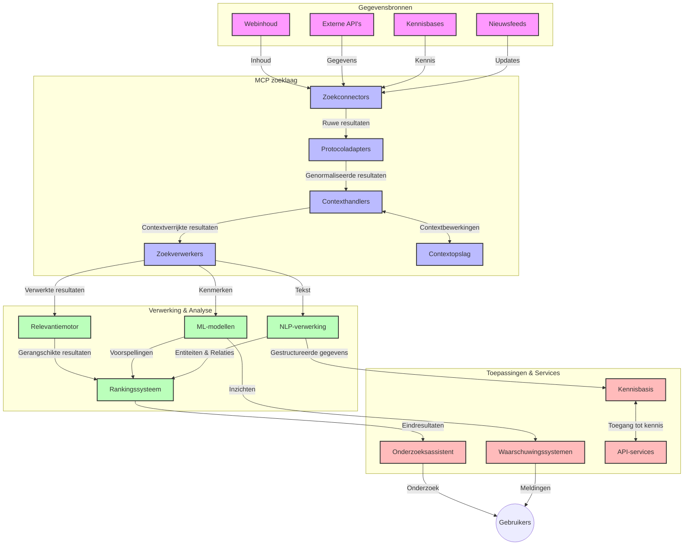
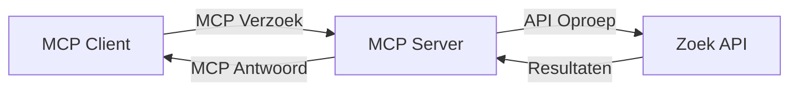
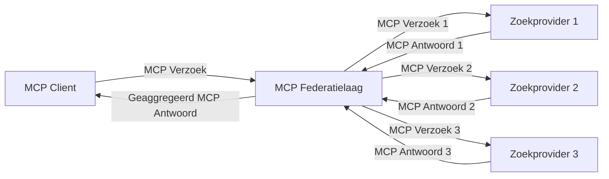
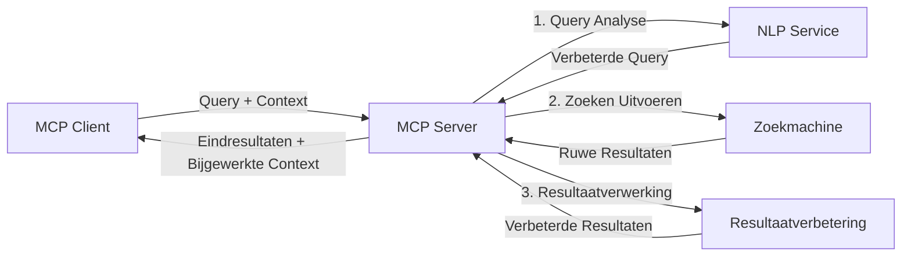

# Model Context Protocol voor Real-Time Web Search

## Overzicht

Real-time web search is essentieel geworden in de hedendaagse informatiegedreven omgeving, waar toepassingen directe toegang nodig hebben tot up-to-date informatie verspreid over het internet om relevante en tijdige antwoorden te bieden. Het Model Context Protocol (MCP) vertegenwoordigt een significante vooruitgang in het optimaliseren van deze real-time zoekprocessen, waarbij de zoek efficiëntie wordt verhoogd, de contextuele integriteit behouden blijft en de algehele systeemprestaties worden verbeterd.

Deze module onderzoekt hoe MCP real-time web search transformeert door een gestandaardiseerde aanpak voor contextbeheer te bieden over AI-modellen, zoekmachines en applicaties heen.

### Wat je zult leren

In deze uitgebreide gids ontdek je:

- Hoe MCP een naadloze brug creëert tussen AI-modellen en real-time webzoekmogelijkheden
- Architectuurpatronen voor het implementeren van efficiënte en schaalbare zoekoplossingen met MCP
- Technieken voor het behouden van zoekcontext over meerdere zoekopdrachten en interacties
- Praktische code-implementaties in Python en JavaScript voor diverse zoekscenario's
- Methoden om relevantie, actualiteit en prestaties in MCP-gestuurde zoeksystemen in balans te brengen

## Introductie tot Real-Time Web Search

Real-time web search is een technologische aanpak waarmee continu queries, verwerking en analyse van webgebaseerde informatie plaatsvinden zodra deze wordt gepubliceerd of bijgewerkt, waardoor systemen verse en relevante informatie met minimale latentie kunnen leveren. In tegenstelling tot traditionele zoeksystemen die werken met geïndexeerde data die uren of dagen oud kan zijn, verwerkt real-time search live data van het web en levert inzichten en informatie die de actuele staat van online content weerspiegelen.

### Kernconcepten van Real-Time Web Search:

- **Continue Queryverwerking**: Zoekopdrachten worden verwerkt tegen continu bijgewerkte databronnen  
- **Actualiteit Prioritering**: Systemen zijn ontworpen om verse informatie te prioriteren  
- **Balanceren van Relevantie**: Het handhaven van een balans tussen relevantie en actualiteit  
- **Schaalbare Architectuur**: Systemen moeten variabele querybelasting en datavolumes aankunnen  
- **Contextueel Begrip**: Het behouden van gebruikerscontext over zoekiteraties is cruciaal voor betekenisvolle resultaten  
- **Dynamische Queryherschikking**: Adaptief aanpassen van zoekopdrachten op basis van context en eerdere resultaten  
- **Integratie van Meerdere Bronnen**: Resultaten combineren van diverse zoekproviders en webbronnen  
- **Semantisch Begrip**: Verwerken van zoekopdrachten en inhoud op basis van betekenis in plaats van enkel sleutelwoorden  
- **Real-Time Ranking**: Continu aanpassen van resultatenrangschikking naarmate nieuwe informatie beschikbaar komt

### Het Model Context Protocol en Real-Time Web Search

Het Model Context Protocol (MCP) pakt diverse kritieke uitdagingen aan binnen real-time web search omgevingen:

1. **Behoud van Zoekcontext**: MCP standaardiseert hoe context wordt behouden over gedistribueerde zoekcomponenten, zodat AI-modellen en verwerkingsknooppunten toegang hebben tot relevante zoekgeschiedenis en gebruikersvoorkeuren.

2. **Efficiënt Querybeheer**: Door gestructureerde mechanismen voor contextoverdracht te bieden vermindert MCP de overhead van het herhalen van context in elke zoekiteratie.

3. **Interoperabiliteit**: MCP creëert een gemeenschappelijke taal voor contextdeling tussen diverse zoektechnologieën en AI-modellen, wat flexibele en uitbreidbare architecturen mogelijk maakt.

4. **Zoek-geoptimaliseerde Context**: MCP-implementaties kunnen prioriteren welke contextelementen het meest relevant zijn voor effectieve zoekopdrachten, wat zowel prestaties als nauwkeurigheid optimaliseert.

5. **Adaptieve Zoekverwerking**: Met goed contextbeheer via MCP kunnen zoeksystemen dynamisch de verwerking aanpassen aan veranderende gebruikersbehoeften en informatieomgevingen.

In hedendaagse toepassingen, van nieuwsaggregatie tot onderzoeksassistenten, stelt de integratie van MCP met webzoektechnologieën intelligentere, contextbewuste zoekfuncties in staat die steeds relevantere resultaten kunnen bieden naarmate gebruikersinteracties doorgaan.

## Leerdoelen

Aan het einde van deze les kun je:

- De fundamenten van real-time web search en de uitdagingen in moderne toepassingen begrijpen  
- Uitleggen hoe het Model Context Protocol (MCP) real-time web search-mogelijkheden verbetert  
- MCP-gebaseerde zoekoplossingen implementeren met populaire frameworks en API’s  
- Schaalbare, hoogpresterende zoekarchitecturen ontwerpen en implementeren met MCP  
- MCP-concepten toepassen op verschillende use cases, zoals semantische zoekoplossingen, onderzoeksassistentie en AI-ondersteund browsen  
- Opkomende trends en toekomstige innovaties in MCP-gebaseerde zoektechnologieën evalueren  
- Contextbewuste zoeksystemen ontwikkelen die leren van gebruikersinteracties  
- Webzoekmogelijkheden integreren in AI-assistenten met gestandaardiseerde MCP-protocollen  
- Meervoudige zoekpijplijnen creëren die resultaten progressief verfijnen op basis van context  
- Zoekprestaties optimaliseren terwijl uitgebreide contextbewustheid behouden blijft

### Definitie en Belang

Real-time web search houdt in dat webgebaseerde informatie continu wordt bevraagd, opgehaald en geleverd met minimale vertraging. In tegenstelling tot traditionele zoekmachines die periodiek het web crawlen en indexeren, streeft real-time search ernaar informatie onmiddellijk zichtbaar te maken zodra die beschikbaar komt, waardoor directe toegang tot de meest actuele inhoud mogelijk is.

Belangrijke kenmerken van real-time web search zijn:

- **Versheid**: Prioriteit voor recente inhoud en updates  
- **Continue Verwerking**: Constant monitoren op nieuwe informatie  
- **Query-aanpassing**: Zoekopdrachten verfijnen op basis van context en feedback  
- **Onmiddellijke Levering**: Zoekenresultaten met minimale vertraging presenteren  
- **Contextbehoud**: Bouwen op eerdere zoekopdrachten voor verbeterde relevantie

### Uitdagingen in Traditionele Web Search

Traditionele webzoekmethoden kennen de volgende beperkingen in real-time scenario’s:

1. **Contextfragmentatie**: Moeilijkheden bij het behouden van zoekcontext over meerdere zoekopdrachten  
2. **Informatieversheid**: Uitdagingen in het benaderen en prioriteren van de meest recente informatie  
3. **Integratiecomplexiteit**: Problemen met interoperabiliteit tussen zoeksystemen en applicaties  
4. **Latentieproblemen**: Balanceren van uitgebreide zoekopdrachten met reactietijdvereisten  
5. **Relevantieafstemming**: Nauwkeurigheid en relevantie waarborgen bij prioritering van actualiteit

## Begrip van Model Context Protocol (MCP) voor Zoekopdrachten

### Wat is MCP in Zoekcontexten?

Het Model Context Protocol (MCP) is een gestandaardiseerd communicatieprotocol dat is ontworpen om efficiënte interactie tussen AI-modellen en toepassingen te faciliteren. In de context van real-time web search biedt MCP een raamwerk voor:

- Het behouden van zoekcontext gedurende zoekopdrachtreeksen  
- Het standaardiseren van zoekopdracht- en resultaatformaten  
- Het optimaliseren van de overdracht van zoekparameters en resultaten  
- Het verbeteren van communicatie tussen model en zoekmachine

### Kerncomponenten en Architectuur

De MCP-architectuur voor real-time web search bestaat uit meerdere sleutelcomponenten:

1. **Query Context Handlers**: Beheren en behouden zoekcontext over meerdere zoekopdrachten heen  
2. **Search Processors**: Verwerken binnenkomende zoekverzoeken met contextbewuste technieken  
3. **Protocol Adapters**: Converteren tussen verschillende zoek-API’s terwijl context wordt behouden  
4. **Context Store**: Efficiënt opslaan en ophalen van zoekgeschiedenis en voorkeuren  
5. **Search Connectors**: Verbinden met diverse zoekmachines en web-API’s



### Hoe MCP Real-Time Web Search Verbeterd

MCP pakt traditionele uitdagingen van web search aan via:

- **Contextuele Continuïteit**: Relaties tussen zoekopdrachten onderhouden gedurende de gehele zoeksessie  
- **Geoptimaliseerde Overdracht**: Reductie van redundantie in zoekparameters door intelligent contextbeheer  
- **Gestandaardiseerde Interfaces**: Consistente API’s bieden voor zoekcomponenten  
- **Verminderde Latentie**: Minimaliseren van verwerkingsbelasting door efficiënt contextbeheer  
- **Verbeterde Relevantie**: Verbeteren van zoekrelevantie door gebruikersintentie bij meerdere zoekopdrachten te behouden

## Integratie en Implementatie

Real-time webzoeksystemen vereisen een zorgvuldige architecturale ontwerp en implementatie om zowel prestaties als contextuele integriteit te waarborgen. Het Model Context Protocol biedt een gestandaardiseerde aanpak voor het integreren van AI-modellen en zoektechnologieën, waarmee meer geavanceerde, contextbewuste zoekpijplijnen mogelijk zijn.

### Overzicht van MCP-integratie in Zoekarchitecturen

Implementatie van MCP binnen real-time web search omgevingen omvat belangrijke overwegingen:

1. **Serialisatie van Zoekcontext**: MCP voorziet in efficiënte mechanismen om contextuele informatie binnen zoekverzoeken te coderen, zodat essentiële context meeloopt in de gehele verwerkingspijplijn. Dit omvat gestandaardiseerde serialisatieformaten, geoptimaliseerd voor zoekgerelateerde metadata.

2. **Stateful Zoekverwerking**: MCP maakt meer intelligente, stateful verwerking mogelijk door consistente contextrepresentatie over zoekiteraties heen. Dit is vooral waardevol in meervoudige zoekstappen waar contextverfijning resultaten verbetert.

3. **Query-uitbreiding en -verfijning**: MCP-implementaties in zoeksystemen kunnen geavanceerde query-uitbreiding en -verfijning faciliteren op basis van verzamelde context, waardoor steeds relevantere resultaten worden behaald naarmate de sessie vordert.

4. **Resultaatcaching en Prioritering**: Door standaard contextbeheer helpt MCP bij het beheren van resultaatcaching en prioritering, wat het aanpassen van componenten aan de veranderende zoekcontext mogelijk maakt.

5. **Zoekfederatie en Aggregatie**: MCP faciliteert geavanceerdere federatie van zoekopdrachten over meerdere backends door gestructureerde representaties van zoekcontext te bieden, waardoor betekenisvollere aggregatie van resultaten uit diverse bronnen mogelijk is.

De implementatie van MCP over verschillende zoektechnologieën creëert een uniforme aanpak van contextbeheer, vermindert de behoefte aan eigen integratiecode en versterkt het vermogen van het systeem om betekenisvolle context te behouden naarmate zoekopdrachten evolueren.

### MCP in Diverse Web Search Implementaties

Deze voorbeelden volgen de huidige MCP-specificatie die zich richt op een JSON-RPC-gebaseerd protocol met verschillende transportmechanismen. De code demonstreert hoe je aangepaste zoekintegraties kunt implementeren, terwijl volledige compatibiliteit met het MCP-protocol behouden blijft.

<details>
<summary>Python Implementatie met Generieke Search API</summary>

```python
import asyncio
import json
import aiohttp
from typing import Dict, Any, Optional, List
from contextlib import asynccontextmanager
from collections.abc import AsyncIterator

# Importeer standaard MCP-bibliotheken
from mcp.client.session import ClientSession
from mcp.client.streamable_http import streamablehttp_client
from mcp.types import TextContent, CreateMessageRequestParams, CreateMessageResult
from mcp.server.fastmcp import FastMCP

# Maak een FastMCP-server voor webzoekopdrachten
search_server = FastMCP("WebSearch")

# Klasse om webzoekhandelingen af te handelen
class WebSearchHandler:
    def __init__(self, api_endpoint: str, api_key: str):
        self.api_endpoint = api_endpoint
        self.api_key = api_key
        self.session = None
        
    async def initialize(self):
        """Initialize the HTTP session"""
        self.session = aiohttp.ClientSession(
            headers={"Authorization": f"Bearer {self.api_key}"}
        )
    
    async def close(self):
        """Close the HTTP session"""
        if self.session:
            await self.session.close()
            
    async def perform_search(self, query: str, max_results: int = 5, 
                           include_domains: List[str] = None, 
                           exclude_domains: List[str] = None,
                           time_period: str = "any") -> Dict[str, Any]:
        """Perform web search using the search API"""
        # Stel zoekparameters samen
        search_params = {
            "q": query,
            "limit": max_results,
            "time": time_period
        }
        
        if include_domains:
            search_params["site"] = ",".join(include_domains)
            
        if exclude_domains:
            search_params["exclude_site"] = ",".join(exclude_domains)
        
        # Voer het zoekverzoek uit
        try:
            async with self.session.get(
                self.api_endpoint,
                params=search_params
            ) as response:
                if response.status != 200:
                    error_text = await response.text()
                    raise Exception(f"Search API error: {response.status} - {error_text}")
                
                search_data = await response.json()
                
                # Zet API-specifiek antwoord om naar een standaardformaat
                results = []
                for item in search_data.get("results", []):
                    results.append({
                        "title": item.get("title", ""),
                        "url": item.get("url", ""),
                        "snippet": item.get("snippet", ""),
                        "date": item.get("published_date", ""),
                        "source": item.get("source", "")
                    })
                
                return {
                    "query": query,
                    "totalResults": len(results),
                    "results": results
                }
        except Exception as e:
            print(f"Search API request error: {e}")
            raise

# Initialiseer de zoekhandler
search_handler = WebSearchHandler(
    api_endpoint="https://api.search-service.example/search",
    api_key="your-api-key-here"
)

# Stel de levensduur in om de zoekhandler te beheren
@asyncio.asynccontextmanager
async def app_lifespan(server: FastMCP):
    """Manage application lifecycle"""
    await search_handler.initialize()
    try:
        yield {"search_handler": search_handler}
    finally:
        await search_handler.close()

# Stel de levensduur in voor de server
search_server = FastMCP("WebSearch", lifespan=app_lifespan)

# Registreer een webzoektool
@search_server.tool()
async def web_search(query: str, max_results: int = 5, 
                   include_domains: List[str] = None,
                   exclude_domains: List[str] = None,
                   time_period: str = "any") -> Dict[str, Any]:
    """
    Search the web for information
    
    Args:
        query: The search query
        max_results: Maximum number of results to return (default: 5)
        include_domains: List of domains to include in search results
        exclude_domains: List of domains to exclude from search results
        time_period: Time period for results ("day", "week", "month", "any")
        
    Returns:
        Dictionary containing search results
    """
    ctx = search_server.get_context()
    search_handler = ctx.request_context.lifespan_context["search_handler"]
    
    results = await search_handler.perform_search(
        query=query,
        max_results=max_results,
        include_domains=include_domains,
        exclude_domains=exclude_domains,
        time_period=time_period
    )
    
    return results

# Voorbeeld van clientgebruik
async def client_example():
    # Maak verbinding met de zoekserver via Streamable HTTP-transport
    async with streamablehttp_client("http://localhost:8000/mcp") as (read, write, _):
        async with ClientSession(read, write) as session:
            # Initialiseer de verbinding
            await session.initialize()
            
            # Roep de web_search-tool aan
            search_results = await session.call_tool(
                "web_search", 
                {
                    "query": "latest developments in AI and Model Context Protocol",
                    "max_results": 5,
                    "time_period": "day",
                    "include_domains": ["github.com", "microsoft.com"]
                }
            )
            
            print(f"Search results: {search_results}")

# Voorbeeld van serveruitvoering
if __name__ == "__main__":
    # Start de server met Streamable HTTP-transport
    search_server.run(transport="streamable-http")
```
</details> 

<details>
<summary>JavaScript Implementatie met Browser-Gebaseerde Search</summary>

```javascript
// MCP-serverimplementatie voor webzoekopdracht
import { McpServer, ResourceTemplate } from '@modelcontextprotocol/sdk/server/mcp.js';
import { StreamableHTTPServerTransport } from '@modelcontextprotocol/sdk/server/streamableHttp.js';
import { z } from 'zod';

// Maak een MCP-server voor webzoekopdracht
const searchServer = new McpServer({
    name: "BrowserSearch",
    description: "A server that provides web search capabilities"
});

// Zoekserviceklasse
class SearchService {
    constructor(searchApiUrl, apiKey) {
        this.searchApiUrl = searchApiUrl;
        this.apiKey = apiKey;
    }

    async performSearch(parameters) {
        const {
            query = '',
            maxResults = 5,
            includeDomains = [],
            excludeDomains = [],
            timePeriod = 'any'
        } = parameters;
        
        // Stel zoek-URL samen met parameters
        const url = new URL(this.searchApiUrl);
        url.searchParams.append('q', query);
        url.searchParams.append('limit', maxResults);
        url.searchParams.append('time', timePeriod);
        
        if (includeDomains.length > 0) {
            url.searchParams.append('site', includeDomains.join(','));
        }
        
        if (excludeDomains.length > 0) {
            url.searchParams.append('exclude_site', excludeDomains.join(','));
        }
        
        try {
            const response = await fetch(url.toString(), {
                method: 'GET',
                headers: {
                    'Authorization': `Bearer ${this.apiKey}`,
                    'Content-Type': 'application/json'
                }
            });
            
            if (!response.ok) {
                const errorText = await response.text();
                throw new Error(`Search API error: ${response.status} - ${errorText}`);
            }
            
            const searchData = await response.json();
            
            // Transformeer API-specifiek antwoord naar een standaardformaat
            const results = searchData.results?.map(item => ({
                title: item.title || '',
                url: item.url || '',
                snippet: item.snippet || '',
                date: item.published_date || '',
                source: item.source || ''
            })) || [];
            
            return {
                query,
                totalResults: results.length,
                results
            };
        } catch (error) {
            console.error('Search API request error:', error);
            throw error;
        }
    }
}

// Initialiseer de zoekservice
const searchService = new SearchService(
    'https://api.search-service.example/search',
    'your-api-key-here'
);

// Stel de contextprovider in voor de server
searchServer.setContextProvider(() => {
    return {
        searchService
    };
});

// Registreer webzoektool
searchServer.tool({
    name: 'web_search',
    description: 'Search the web for information',
    parameters: {
        type: 'object',
        properties: {
            query: {
                type: 'string',
                description: 'The search query'
            },
            maxResults: {
                type: 'integer',
                description: 'Maximum number of results to return',
                default: 5
            },
            includeDomains: {
                type: 'array',
                items: { type: 'string' },
                description: 'List of domains to include in search results'
            },
            excludeDomains: {
                type: 'array',
                items: { type: 'string' },
                description: 'List of domains to exclude from search results'
            },
            timePeriod: {
                type: 'string',
                description: 'Time period for results',
                enum: ['day', 'week', 'month', 'any'],
                default: 'any'
            }
        },
        required: ['query']
    },
    handler: async (params, context) => {
        const { searchService } = context;
        return await searchService.performSearch(params);
    }
});

// Voorbeeld clientcode om verbinding te maken met de zoekserver
import { Client } from '@modelcontextprotocol/sdk/client/index.js';
import { StreamableHTTPClientTransport } from '@modelcontextprotocol/sdk/client/streamableHttp.js';

async function connectToSearchServer() {
    // Maak verbinding met de zoekserver
    const transport = new StreamableHTTPClientTransport(
        new URL('http://localhost:8000/mcp')
    );
    
    const client = new Client({
        name: 'search-client',
        version: '1.0.0'
    });
    
    await client.connect(transport);
    
    // Voer de zoektool uit
    const searchResults = await client.callTool({
        name: 'web_search',
        arguments: {
            query: 'Model Context Protocol implementation examples',
            maxResults: 10,
            timePeriod: 'week',
            includeDomains: ['github.com', 'docs.microsoft.com']
        }
    });
    
    console.log('Search results:', searchResults);
    
    // Opruimen
    await client.disconnect();
}

// Start de server
const transport = new StreamableHTTPServerTransport();
await searchServer.connect(transport);
console.log('Search server running at http://localhost:8000/mcp');

// In een apart proces of nadat de server is gestart
// connectToSearchServer().catch(console.error);
```
</details> 

## Disclaimer bij Codevoorbeelden

> **Belangrijke Opmerking**: De onderstaande codevoorbeelden demonstreren de integratie van het Model Context Protocol (MCP) met webzoekfunctionaliteit. Hoewel ze de patronen en structuren van de officiële MCP SDK's volgen, zijn ze vereenvoudigd voor educatieve doeleinden.  
>  
> Deze voorbeelden tonen:  
>  
> 1. **Python Implementatie**: Een FastMCP serverimplementatie die een webzoektool aanbiedt en verbinding maakt met een externe zoek-API. Dit voorbeeld toont juiste levensduurbeheer, contextafhandeling en toolimplementatie volgens de patronen van de [officiële MCP Python SDK](https://github.com/modelcontextprotocol/python-sdk). De server gebruikt het aanbevolen Streamable HTTP transport, dat het oudere SSE-transport voor productie-implementaties heeft vervangen.  
>  
> 2. **JavaScript Implementatie**: Een TypeScript/JavaScript-implementatie via het FastMCP-patroon van de [officiële MCP TypeScript SDK](https://github.com/modelcontextprotocol/typescript-sdk) om een zoekserver te creëren met correcte tooldefinities en clientverbindingen. Dit volgt de laatste aanbevolen patronen voor sessiebeheer en contextbehoud.  
>  
> Voor productiegebruik zouden deze voorbeelden aanvullende foutafhandeling, authenticatie en specifieke API-integratiecode vereisen. De getoonde zoek-API-eindpunten (`https://api.search-service.example/search`) zijn tijdelijke aanduidingen en moeten worden vervangen door daadwerkelijke zoekdienst-eindpunten.  
>  
> Voor volledige implementatiedetails en de meest actuele benaderingen, verwijzen wij naar de [officiële MCP-specificatie](https://spec.modelcontextprotocol.io/) en SDK-documentatie.

## Kernconcepten

### Het Model Context Protocol (MCP) Framework

In de kern biedt het Model Context Protocol een gestandaardiseerde manier waarop AI-modellen, applicaties en diensten context uitwisselen. In real-time web search is dit framework essentieel voor het creëren van coherente, meerronde-zoekervaringen. Belangrijke componenten zijn:

1. **Client-Server Architectuur**: MCP legt een duidelijke scheiding vast tussen zoekclients (vragers) en zoekservers (aanbieders), wat flexibele implementatiemodellen mogelijk maakt.

2. **JSON-RPC Communicatie**: Het protocol gebruikt JSON-RPC voor berichtuitwisseling, waardoor het compatibel is met webtechnologieën en eenvoudig te implementeren is op verschillende platforms.

3. **Contextbeheer**: MCP definieert gestructureerde methoden voor het behouden, bijwerken en benutten van zoekcontext over meerdere interacties.

4. **Tooldefinities**: Zoekmogelijkheden worden blootgesteld als gestandaardiseerde tools met goed gedefinieerde parameters en retourwaarden.

5. **Streaming-ondersteuning**: Het protocol ondersteunt streamingresultaten, essentieel voor real-time zoekfuncties waarbij resultaten stapsgewijs binnenkomen.

### Integratiepatronen voor Web Search

Bij integratie van MCP met web search ontstaan diverse patronen:

#### 1. Directe Zoekprovider-integratie


  
In dit patroon communiceert de MCP-server rechtstreeks met één of meerdere zoek-API’s, waarbij MCP-verzoeken worden vertaald naar API-specifieke calls en de resultaten als MCP-responses worden geformatteerd.

#### 2. Gefedereerde Search met Contextbehoud


  
Dit patroon verdeelt zoekopdrachten over meerdere MCP-compatibele zoekproviders, elk gespecialiseerd in diverse contenttypes of zoekmogelijkheden, terwijl een uniforme context wordt behouden.

#### 3. Context-Versterkte Zoekketen


  
Hierbij wordt het zoekproces verdeeld in meerdere fasen, waarbij de context in elke stap wordt verrijkt, wat resulteert in progressief relevantere resultaten.

### Componenten van Zoekcontext

In MCP-gebaseerde web search omvat context doorgaans:

- **Querygeschiedenis**: Eerdere zoekopdrachten binnen de sessie  
- **Gebruikersvoorkeuren**: Taal, regio, safe search-instellingen  
- **Interactieverleden**: Welke resultaten zijn aangeklikt, tijd besteed aan resultaten  
- **Zoekparameters**: Filters, sorteervolgordes en andere zoekwijzigingen  
- **Domeinkennis**: Onderwerp-specifieke context relevant voor de zoekopdracht  
- **Tijdgebonden Context**: Tijd-afhankelijke relevantiefactoren  
- **Bronvoorkeuren**: Vertrouwde of favoriete informatiebronnen

## Use Cases en Toepassingen

### Onderzoek en Informatieverzameling

MCP verbetert onderzoeksworkflows door:

- Het behouden van onderzoekscontext over meerdere zoeksessies  
- Het mogelijk maken van intensievere en contextueel relevantere zoekopdrachten  
- Ondersteuning voor multi-bron zoekfederatie  
- Faciliteren van kennisonderzoek uit zoekresultaten

### Real-Time Nieuws- en Trendmonitoring

Met MCP aangedreven zoeken biedt voordelen voor nieuwsmonitoring:

- Nauwelijks real-time ontdekking van opkomende nieuwsverhalen  
- Contextuele filtering van relevante informatie  
- Onderwerp- en entiteitstracking over meerdere bronnen  
- Gepersonaliseerde nieuwsalerts op basis van gebruikerscontext

### AI-ondersteund Browsen en Onderzoeken

MCP creëert nieuwe mogelijkheden voor AI-ondersteund browsen:

- Contextuele zoeksuggesties gebaseerd op huidige browseractiviteit  
- Naadloze integratie van web search met door LLM aangedreven assistenten  
- Meerronde zoekverfijning met behouden context  
- Verbeterde fact-checking en informatieverificatie

## Toekomstige Trends en Innovaties

### Evolutie van MCP in Web Search

Kijkend naar de toekomst verwachten we dat MCP zich zal blijven ontwikkelen om:
- **Multimodale Zoekopdrachten**: Integratie van tekst-, afbeelding-, audio- en videozoekopdrachten met behouden context  
- **Gedecentraliseerde Zoekopdrachten**: Ondersteuning voor gedistribueerde en gefedereerde zoekecosystemen  
- **Zoekprivacy**: Contextbewuste privacy-behoudende zoekmechanismen  
- **Querybegrip**: Diepe semantische analyse van zoekopdrachten in natuurlijke taal  

### Potentiële Technologische Vooruitgang

Opkomende technologieën die de toekomst van MCP-zoekopdrachten zullen vormgeven:  

1. **Neurale Zoekarchitecturen**: Op embedding gebaseerde zoeksystemen geoptimaliseerd voor MCP  
2. **Gepersonaliseerde Zoekcontext**: Het leren van individuele gebruikerszoekpatronen over tijd  
3. **Integratie van Kennisgrafen**: Contextuele zoekopdrachten verbeterd met domeinspecifieke kennisgrafen  
4. **Cross-Modal Context**: Behoud van context over verschillende zoekmodaliteiten heen  

## Praktische Oefeningen

### Oefening 1: Opzetten van een Basis MCP Zoekpijplijn

In deze oefening leer je hoe je:  
- Een basis MCP-zoekomgeving configureert  
- Contextafhandelaars implementeert voor webzoekopdrachten  
- Contextbehoud test en valideert over meerdere zoekiteraties  

### Oefening 2: Bouwen van een Onderzoeksassistent met MCP Zoekopdrachten

Maak een complete applicatie die:  
- Natuurlijke taal onderzoeksvragen verwerkt  
- Contextbewuste webzoekopdrachten uitvoert  
- Informatie uit meerdere bronnen synthetiseert  
- Georganiseerde onderzoeksbevindingen presenteert  

### Oefening 3: Implementeren van Multi-Source Zoekfederatie met MCP

Geavanceerde oefening met:  
- Contextbewuste dispatching van zoekopdrachten naar meerdere zoekmachines  
- Resultaten rangschikken en aggregeren  
- Contextuele deduplicatie van zoekresultaten  
- Omgaan met bron-specifieke metadata  

## Aanvullende Bronnen

- [Model Context Protocol Specificatie](https://spec.modelcontextprotocol.io/) - Officiële MCP-specificatie en gedetailleerde protocoldocumentatie  
- [Model Context Protocol Documentatie](https://modelcontextprotocol.io/) - Uitgebreide tutorials en implementatiehandleidingen  
- [MCP Python SDK](https://github.com/modelcontextprotocol/python-sdk) - Officiële Python-implementatie van het MCP-protocol  
- [MCP TypeScript SDK](https://github.com/modelcontextprotocol/typescript-sdk) - Officiële TypeScript-implementatie van het MCP-protocol  
- [MCP Referentieservers](https://github.com/modelcontextprotocol/servers) - Referentie-implementaties van MCP-servers  
- [Bing Web Search API Documentatie](https://learn.microsoft.com/en-us/bing/search-apis/bing-web-search/overview) - Microsofts webzoek-API  
- [Google Custom Search JSON API](https://developers.google.com/custom-search/v1/overview) - Googles programmeerbare zoekmachine  
- [SerpAPI Documentatie](https://serpapi.com/search-api) - API voor zoekresultaatpagina’s  
- [Meilisearch Documentatie](https://www.meilisearch.com/docs) - Open-source zoekmachine  
- [Elasticsearch Documentatie](https://www.elastic.co/guide/index.html) - Gedistribueerde zoek- en analyse-engine  
- [LangChain Documentatie](https://python.langchain.com/docs/get_started/introduction) - Applicaties bouwen met LLM’s  

## Leerdoelen

Na het voltooien van deze module kun je:  

- De basisprincipes en uitdagingen van realtime webzoekopdrachten begrijpen  
- Uitleggen hoe het Model Context Protocol (MCP) realtime webzoekmogelijkheden verbetert  
- MCP-gebaseerde zoekoplossingen implementeren met populaire frameworks en API's  
- Schaalbare, hoogpresterende zoekarchitecturen ontwerpen en implementeren met MCP  
- MCP-concepten toepassen op diverse use cases zoals semantisch zoeken, onderzoeksassistentie en AI-ondersteund browsen  
- Opkomende trends en toekomstige innovaties in MCP-gebaseerde zoektechnologieën evalueren  

### Overwegingen rondom Vertrouwen en Veiligheid

Bij het implementeren van MCP-gebaseerde webzoekoplossingen, houd rekening met deze belangrijke principes uit de MCP-specificatie:  

1. **Toestemming en Controle van Gebruikers**: Gebruikers moeten expliciet instemmen met en begrijpen welke gegevens worden geraadpleegd en welke acties worden uitgevoerd. Dit is vooral belangrijk voor webzoekimplementaties die toegang hebben tot externe gegevensbronnen.  

2. **Gegevensprivacy**: Zorg voor juiste omgang met zoekopdrachten en resultaten, vooral wanneer deze gevoelige informatie kunnen bevatten. Implementeer passende toegangscontroles om gebruikersgegevens te beschermen.  

3. **Veiligheid van Tools**: Implementeer correcte autorisatie en validatie voor zoektools, aangezien ze een potentieel beveiligingsrisico vormen via willekeurige code-uitvoering. Beschrijvingen van het gedrag van de tools moeten als onbetrouwbaar worden beschouwd behalve wanneer ze afkomstig zijn van een vertrouwde server.  

4. **Duidelijke Documentatie**: Lever heldere documentatie over de mogelijkheden, beperkingen en veiligheidsaspecten van je MCP-gebaseerde zoekimplementatie, volgens de implementatierichtlijnen uit de MCP-specificatie.  

5. **Robuuste Toestemmingsstromen**: Bouw robuuste toestemmings- en autorisatiestromen die duidelijk uitleggen wat elke tool doet vóórdat gebruik wordt geautoriseerd, vooral voor tools die interactie hebben met externe webresources.  

Voor volledige details over beveiliging en vertrouwensaspecten van MCP, zie de [officiële documentatie](https://modelcontextprotocol.io/specification/2025-11-25/basic/security_best_practices).  

## Wat volgt daarna  

- [5.12 Entra ID Authenticatie voor Model Context Protocol Servers](../mcp-security-entra/README.md)

---

<!-- CO-OP TRANSLATOR DISCLAIMER START -->
**Disclaimer**:
Dit document is vertaald met behulp van de AI vertaaldienst [Co-op Translator](https://github.com/Azure/co-op-translator). Hoewel we streven naar nauwkeurigheid, dient u er rekening mee te houden dat geautomatiseerde vertalingen fouten of onnauwkeurigheden kunnen bevatten. Het originele document in de oorspronkelijke taal moet worden beschouwd als de gezaghebbende bron. Voor kritieke informatie wordt professionele menselijke vertaling aanbevolen. Wij zijn niet aansprakelijk voor eventuele misverstanden of verkeerde interpretaties die voortvloeien uit het gebruik van deze vertaling.
<!-- CO-OP TRANSLATOR DISCLAIMER END -->