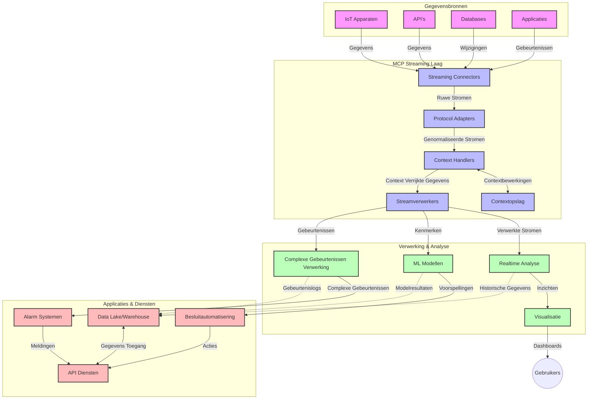

# Model Context Protocol voor Real-Time Data Streaming

## Overzicht

Real-time data streaming is essentieel geworden in de huidige datagedreven wereld, waar bedrijven en toepassingen directe toegang tot informatie nodig hebben om tijdige beslissingen te nemen. Het Model Context Protocol (MCP) vertegenwoordigt een belangrijke vooruitgang in het optimaliseren van deze real-time streamingprocessen, het verbeteren van de efficiëntie van dataverwerking, het behouden van contextuele integriteit en het verhogen van de algehele systeemprestaties.

Deze module onderzoekt hoe MCP real-time data streaming transformeert door een gestandaardiseerde aanpak te bieden voor contextbeheer tussen AI-modellen, streamingplatforms en toepassingen.

## Introductie tot Real-Time Data Streaming

Real-time data streaming is een technologisch paradigma dat continue overdracht, verwerking en analyse van data mogelijk maakt terwijl deze wordt gegenereerd, waardoor systemen onmiddellijk kunnen reageren op nieuwe informatie. In tegenstelling tot traditionele batchverwerking die werkt op statische datasets, verwerkt streaming data in beweging en levert inzichten en acties met minimale vertraging.

### Kernconcepten van Real-Time Data Streaming:

- **Continue Data Stroom**: Data wordt verwerkt als een continue, nooit eindigende stroom van gebeurtenissen of records.
- **Lage Latentie Verwerking**: Systemen zijn ontworpen om de tijd tussen datageneratie en verwerking te minimaliseren.
- **Schaalbaarheid**: Streamingarchitecturen moeten variabele datavolumes en -snelheden aankunnen.
- **Fouttolerantie**: Systemen moeten robuust zijn tegen storingen om ononderbroken datastromen te waarborgen.
- **Stateful Verwerking**: Het behouden van context over gebeurtenissen heen is cruciaal voor zinvolle analyse.

### Het Model Context Protocol en Real-Time Streaming

Het Model Context Protocol (MCP) pakt meerdere cruciale uitdagingen aan in real-time streamingomgevingen:

1. **Contextuele Continuïteit**: MCP standaardiseert hoe context wordt behouden over gedistribueerde streamingcomponenten, waardoor AI-modellen en verwerkingsnodes toegang hebben tot relevante historische en omgevingscontext.

2. **Efficiënt Staatbeheer**: Door gestructureerde mechanismen voor contexttransmissie te bieden, vermindert MCP de overhead van staatbeheer in streamingpijplijnen.

3. **Interoperabiliteit**: MCP creëert een gemeenschappelijke taal voor contextdeling tussen diverse streamingtechnologieën en AI-modellen, wat flexibelere en uitbreidbare architecturen mogelijk maakt.

4. **Streaming-Geoptimaliseerde Context**: MCP-implementaties kunnen prioriteren welke contextelementen het meest relevant zijn voor realtime besluitvorming, geoptimaliseerd voor zowel prestaties als nauwkeurigheid.

5. **Adaptieve Verwerking**: Met passend contextbeheer via MCP kunnen streamingsystemen dynamisch verwerkingsaanpassingen maken op basis van veranderende omstandigheden en patronen in de data.

In moderne toepassingen variërend van IoT-sensornetwerken tot financiële handelsplatforms maakt de integratie van MCP met streamingtechnologieën meer intelligente, contextbewuste verwerking mogelijk die adequaat kan reageren op complexe, evoluerende situaties in realtime.

## Leerdoelen

Aan het einde van deze les kun je:

- De fundamenten van real-time data streaming en de uitdagingen begrijpen
- Uitleggen hoe het Model Context Protocol (MCP) real-time data streaming verbetert
- MCP-gebaseerde streamingoplossingen implementeren met populaire frameworks zoals Kafka en Pulsar
- Fouttolerante, hoog-presterende streamingarchitecturen ontwerpen en uitrollen met MCP
- MCP-concepten toepassen op IoT, financiële handel en AI-gedreven analysetoepassingen
- Opkomende trends en toekomstige innovaties in MCP-gebaseerde streamingtechnologieën evalueren


### Definitie en Belang

Real-time data streaming omvat de continue generatie, verwerking en levering van data met minimale vertraging. In tegenstelling tot batchverwerking, waarbij data wordt verzameld en in groepen wordt verwerkt, wordt streamingdata incrementeel verwerkt zodra deze binnenkomt, wat directe inzichten en acties mogelijk maakt.

Belangrijke kenmerken van real-time data streaming zijn onder andere:

- **Lage Latentie**: Verwerking en analyse van data binnen milliseconden tot seconden
- **Continue Stroom**: Ononderbroken datastromen van diverse bronnen
- **Directe Verwerking**: Data analyseren zodra het aankomt in plaats van in batches
- **Gebeurtenisgestuurde Architectuur**: Reageren op gebeurtenissen zodra ze zich voordoen

### Uitdagingen in Traditionele Data Streaming

Traditionele benaderingen van data streaming ondervinden meerdere beperkingen:

1. **Contextverlies**: Moeilijkheid om context over gedistribueerde systemen heen te behouden
2. **Schaalbaarheidsproblemen**: Uitdagingen bij het opschalen voor hoge volume- en snelheiddata
3. **Integratiecomplexiteit**: Problemen met interoperabiliteit tussen verschillende systemen
4. **Latentiebeheer**: Balanceren van doorvoer en verwerkingstijd
5. **Dataconsistentie**: Zorgen voor nauwkeurigheid en volledigheid van data over de stroom heen

## Begrip van Model Context Protocol (MCP)

### Wat is MCP?

Het Model Context Protocol (MCP) is een gestandaardiseerd communicatieprotocol dat is ontworpen om efficiënte interactie tussen AI-modellen en toepassingen te faciliteren. In de context van real-time data streaming biedt MCP een raamwerk voor:

- Het behouden van context door de gehele datapijplijn
- Het standaardiseren van data-uitwisselingsformaten
- Het optimaliseren van het transport van grote datasets
- Het verbeteren van communicatie tussen model en model, en model en toepassing

### Kerncomponenten en Architectuur

De MCP-architectuur voor real-time streaming bestaat uit verschillende kerncomponenten:

1. **Context Handlers**: Beheren en behouden contextuele informatie over de streamingpijplijn heen
2. **Stream Processors**: Verwerken binnenkomende datastreams met contextbewuste technieken
3. **Protocol Adapters**: Converteren tussen verschillende streamingprotocollen met behoud van context
4. **Context Store**: Efficiënt opslaan en ophalen van contextuele informatie
5. **Streaming Connectors**: Verbinden met diverse streamingplatforms (Kafka, Pulsar, Kinesis, etc.)



### Hoe MCP Real-Time Data Verwerking Verbeterd

MCP pakt traditionele streaminguitdagingen aan via:

- **Contextuele Integriteit**: Relaties tussen datapunten behouden over de gehele pijplijn
- **Geoptimaliseerde Transmissie**: Reductie van redundantie in data-uitwisseling door intelligent contextbeheer
- **Gestandaardiseerde Interfaces**: Consistente API’s voor streamingcomponenten bieden
- **Verminderde Latentie**: Minimale verwerkingsbelasting via efficiënt contextbeheer
- **Verbeterde Schaalbaarheid**: Ondersteuning voor horizontale schaalbaarheid met behoud van context

## Integratie en Implementatie

Real-time datastreamingsystemen vereisen zorgvuldige architectonische ontwerp- en implementatiekeuzes om zowel prestaties als contextuele integriteit te behouden. Het Model Context Protocol biedt een gestandaardiseerde aanpak voor het integreren van AI-modellen en streamingtechnologieën, waarmee meer geavanceerde, contextbewuste verwerkingspijplijnen mogelijk zijn.

### Overzicht van MCP Integratie in Streaming Architecturen

Het implementeren van MCP in real-time streamingomgevingen omvat enkele belangrijke aandachtspunten:

1. **Contextserialisatie en Transport**: MCP biedt efficiënte mechanismen voor het coderen van contextuele informatie binnen streamingdatapakketten, waardoor essentiële context met de data meebeweegt door de verwerkingspijplijn. Dit omvat gestandaardiseerde serialisatieformaten die geoptimaliseerd zijn voor streamingtransport.

2. **Stateful Stream Processing**: MCP maakt intelligentere stateful verwerking mogelijk door consistente contextrepresentatie te behouden over verwerkingsnodes. Dit is bijzonder waardevol in gedistribueerde streamingarchitecturen, waar staatbeheer traditioneel lastig is.

3. **Gebeurtenistijd versus Verwerkingstijd**: MCP-implementaties in streaming systemen moeten de uitdaging aanpakken om te onderscheiden wanneer gebeurtenissen zich voordeden en wanneer ze worden verwerkt. Het protocol kan temporele context opnemen die de gebeurtenistijdsemantiek behoudt.

4. **Backpressure Beheer**: Door standaard contextafhandeling helpt MCP bij het managen van backpressure in streams, waardoor componenten hun verwerkingscapaciteiten kunnen communiceren en de stroom dienovereenkomstig kunnen aanpassen.

5. **Context Windowing en Aggregatie**: MCP ondersteunt geavanceerdere windowingoperaties door gestructureerde representaties van temporele en relationele context aan te bieden, wat betekenisvollere aggregaties over gebeurtenisstromen mogelijk maakt.

6. **Exactly-Once Verwerking**: In streaming systemen die exactly-once semantiek vereisen, kan MCP verwerkingsmetadata opnemen om verwerkingstatussen te volgen en verifiëren over gedistribueerde componenten heen.

De implementatie van MCP in verschillende streamingtechnologieën creëert een uniforme aanpak voor contextbeheer, vermindert de noodzaak voor aangepaste integratiecode en verbetert het vermogen van het systeem om betekenisvolle context te behouden terwijl data door de pijplijn stroomt.

### MCP in Diverse Data Streaming Frameworks

Deze voorbeelden volgen de huidige MCP-specificatie die zich richt op een JSON-RPC gebaseerd protocol met verschillende transportmechanismen. De code laat zien hoe je aangepaste transports kunt implementeren die streamingplatforms zoals Kafka en Pulsar integreren terwijl volledige compatibiliteit met het MCP-protocol behouden blijft.

De voorbeelden zijn ontworpen om te tonen hoe streamingplatforms kunnen worden geïntegreerd met MCP voor realtime dataverwerking, met behoud van de contextuele bewustwording die centraal staat in MCP. Deze aanpak zorgt ervoor dat de codevoorbeelden de huidige staat van de MCP-specificatie per juni 2025 nauwkeurig weerspiegelen.

MCP kan worden geïntegreerd met populaire streamingframeworks, waaronder:

#### Apache Kafka Integratie

```python
import asyncio
import json
from typing import Dict, Any, Optional
from confluent_kafka import Consumer, Producer, KafkaError
from mcp.client import Client, ClientCapabilities
from mcp.core.message import JsonRpcMessage
from mcp.core.transports import Transport

# Aangepaste transportklasse om MCP te verbinden met Kafka
class KafkaMCPTransport(Transport):
    def __init__(self, bootstrap_servers: str, input_topic: str, output_topic: str):
        self.bootstrap_servers = bootstrap_servers
        self.input_topic = input_topic
        self.output_topic = output_topic
        self.producer = Producer({'bootstrap.servers': bootstrap_servers})
        self.consumer = Consumer({
            'bootstrap.servers': bootstrap_servers,
            'group.id': 'mcp-client-group',
            'auto.offset.reset': 'earliest'
        })
        self.message_queue = asyncio.Queue()
        self.running = False
        self.consumer_task = None
        
    async def connect(self):
        """Connect to Kafka and start consuming messages"""
        self.consumer.subscribe([self.input_topic])
        self.running = True
        self.consumer_task = asyncio.create_task(self._consume_messages())
        return self
        
    async def _consume_messages(self):
        """Background task to consume messages from Kafka and queue them for processing"""
        while self.running:
            try:
                msg = self.consumer.poll(1.0)
                if msg is None:
                    await asyncio.sleep(0.1)
                    continue
                
                if msg.error():
                    if msg.error().code() == KafkaError._PARTITION_EOF:
                        continue
                    print(f"Consumer error: {msg.error()}")
                    continue
                
                # Parseer de berichtwaarde als JSON-RPC
                try:
                    message_str = msg.value().decode('utf-8')
                    message_data = json.loads(message_str)
                    mcp_message = JsonRpcMessage.from_dict(message_data)
                    await self.message_queue.put(mcp_message)
                except Exception as e:
                    print(f"Error parsing message: {e}")
            except Exception as e:
                print(f"Error in consumer loop: {e}")
                await asyncio.sleep(1)
    
    async def read(self) -> Optional[JsonRpcMessage]:
        """Read the next message from the queue"""
        try:
            message = await self.message_queue.get()
            return message
        except Exception as e:
            print(f"Error reading message: {e}")
            return None
    
    async def write(self, message: JsonRpcMessage) -> None:
        """Write a message to the Kafka output topic"""
        try:
            message_json = json.dumps(message.to_dict())
            self.producer.produce(
                self.output_topic,
                message_json.encode('utf-8'),
                callback=self._delivery_report
            )
            self.producer.poll(0)  # Activeer callbacks
        except Exception as e:
            print(f"Error writing message: {e}")
    
    def _delivery_report(self, err, msg):
        """Kafka producer delivery callback"""
        if err is not None:
            print(f'Message delivery failed: {err}')
        else:
            print(f'Message delivered to {msg.topic()} [{msg.partition()}]')
    
    async def close(self) -> None:
        """Close the transport"""
        self.running = False
        if self.consumer_task:
            self.consumer_task.cancel()
            try:
                await self.consumer_task
            except asyncio.CancelledError:
                pass
        self.consumer.close()
        self.producer.flush()

# Voorbeeldgebruik van de Kafka MCP-transport
async def kafka_mcp_example():
    # Maak MCP-client aan met Kafka-transport
    client = Client(
        {"name": "kafka-mcp-client", "version": "1.0.0"},
        ClientCapabilities({})
    )
    
    # Maak en verbind de Kafka-transport
    transport = KafkaMCPTransport(
        bootstrap_servers="localhost:9092",
        input_topic="mcp-responses",
        output_topic="mcp-requests"
    )
    
    await client.connect(transport)
    
    try:
        # Initialiseer de MCP-sessie
        await client.initialize()
        
        # Voorbeeld van het uitvoeren van een tool via MCP
        response = await client.execute_tool(
            "process_data",
            {
                "data": "sample data",
                "metadata": {
                    "source": "sensor-1",
                    "timestamp": "2025-06-12T10:30:00Z"
                }
            }
        )
        
        print(f"Tool execution response: {response}")
        
        # Schone afsluiting
        await client.shutdown()
    finally:
        await transport.close()

# Voer het voorbeeld uit
if __name__ == "__main__":
    asyncio.run(kafka_mcp_example())
```

#### Apache Pulsar Implementatie

```python
import asyncio
import json
import pulsar
from typing import Dict, Any, Optional
from mcp.core.message import JsonRpcMessage
from mcp.core.transports import Transport
from mcp.server import Server, ServerOptions
from mcp.server.tools import Tool, ToolExecutionContext, ToolMetadata

# Maak een aangepaste MCP-transport die Pulsar gebruikt
class PulsarMCPTransport(Transport):
    def __init__(self, service_url: str, request_topic: str, response_topic: str):
        self.service_url = service_url
        self.request_topic = request_topic
        self.response_topic = response_topic
        self.client = pulsar.Client(service_url)
        self.producer = self.client.create_producer(response_topic)
        self.consumer = self.client.subscribe(
            request_topic,
            "mcp-server-subscription",
            consumer_type=pulsar.ConsumerType.Shared
        )
        self.message_queue = asyncio.Queue()
        self.running = False
        self.consumer_task = None
    
    async def connect(self):
        """Connect to Pulsar and start consuming messages"""
        self.running = True
        self.consumer_task = asyncio.create_task(self._consume_messages())
        return self
    
    async def _consume_messages(self):
        """Background task to consume messages from Pulsar and queue them for processing"""
        while self.running:
            try:
                # Niet-blokkerend ontvangen met time-out
                msg = self.consumer.receive(timeout_millis=500)
                
                # Verwerk het bericht
                try:
                    message_str = msg.data().decode('utf-8')
                    message_data = json.loads(message_str)
                    mcp_message = JsonRpcMessage.from_dict(message_data)
                    await self.message_queue.put(mcp_message)
                    
                    # Bevestig het bericht
                    self.consumer.acknowledge(msg)
                except Exception as e:
                    print(f"Error processing message: {e}")
                    # Negatieve bevestiging als er een fout was
                    self.consumer.negative_acknowledge(msg)
            except Exception as e:
                # Handel time-out of andere uitzonderingen af
                await asyncio.sleep(0.1)
    
    async def read(self) -> Optional[JsonRpcMessage]:
        """Read the next message from the queue"""
        try:
            message = await self.message_queue.get()
            return message
        except Exception as e:
            print(f"Error reading message: {e}")
            return None
    
    async def write(self, message: JsonRpcMessage) -> None:
        """Write a message to the Pulsar output topic"""
        try:
            message_json = json.dumps(message.to_dict())
            self.producer.send(message_json.encode('utf-8'))
        except Exception as e:
            print(f"Error writing message: {e}")
    
    async def close(self) -> None:
        """Close the transport"""
        self.running = False
        if self.consumer_task:
            self.consumer_task.cancel()
            try:
                await self.consumer_task
            except asyncio.CancelledError:
                pass
        self.consumer.close()
        self.producer.close()
        self.client.close()

# Definieer een voorbeeld MCP-tool die streamingdata verwerkt
@Tool(
    name="process_streaming_data",
    description="Process streaming data with context preservation",
    metadata=ToolMetadata(
        required_capabilities=["streaming"]
    )
)
async def process_streaming_data(
    ctx: ToolExecutionContext,
    data: str,
    source: str,
    priority: str = "medium"
) -> Dict[str, Any]:
    """
    Process streaming data while preserving context
    
    Args:
        ctx: Tool execution context
        data: The data to process
        source: The source of the data
        priority: Priority level (low, medium, high)
        
    Returns:
        Dict containing processed results and context information
    """
    # Voorbeeldverwerking die gebruikmaakt van MCP-context
    print(f"Processing data from {source} with priority {priority}")
    
    # Toegang tot gesprekcontext van MCP
    conversation_id = ctx.conversation_id if hasattr(ctx, 'conversation_id') else "unknown"
    
    # Retourneer resultaten met verbeterde context
    return {
        "processed_data": f"Processed: {data}",
        "context": {
            "conversation_id": conversation_id,
            "source": source,
            "priority": priority,
            "processing_timestamp": ctx.get_current_time_iso()
        }
    }

# Voorbeeldimplementatie van MCP-server met Pulsar-transport
async def run_mcp_server_with_pulsar():
    # Maak MCP-server aan
    server = Server(
        {"name": "pulsar-mcp-server", "version": "1.0.0"},
        ServerOptions(
            capabilities={"streaming": True}
        )
    )
    
    # Registreer onze tool
    server.register_tool(process_streaming_data)
    
    # Maak en verbind Pulsar-transport
    transport = PulsarMCPTransport(
        service_url="pulsar://localhost:6650",
        request_topic="mcp-requests",
        response_topic="mcp-responses"
    )
    
    try:
        # Start de server met het Pulsar-transport
        await server.run(transport)
    finally:
        await transport.close()

# Start de server
if __name__ == "__main__":
    asyncio.run(run_mcp_server_with_pulsar())
```

### Best Practices voor Uitrol

Bij het implementeren van MCP voor real-time streaming:

1. **Ontwerp voor Fouttolerantie**:
   - Implementeer correcte foutafhandeling
   - Gebruik dead-letter queues voor mislukte berichten
   - Ontwerp idempotente processors

2. **Optimaliseer voor Prestaties**:
   - Configureer geschikte buffergroottes
   - Gebruik batching waar geschikt
   - Implementeer backpressuremechanismen

3. **Monitor en Observeer**:
   - Volg streamverwerkingsstatistieken
   - Monitor contextpropagatie
   - Stel meldingen in bij afwijkingen

4. **Beveilig Je Streams**:
   - Implementeer versleuteling voor gevoelige data
   - Gebruik authenticatie en autorisatie
   - Pas juiste toegangscontroles toe


### MCP in IoT en Edge Computing

MCP verbetert IoT-streaming door:

- Het behouden van apparaatscontext door de verwerkingspijplijn heen
- Efficiënte streaming van edge naar cloud mogelijk te maken
- Ondersteuning van real-time analytics op IoT-datastreams
- Faciliteren van apparaat-naar-apparaat communicatie met context

Voorbeeld: Slimme Stad Sensor Netwerken
```
Sensors → Edge Gateways → MCP Stream Processors → Real-time Analytics → Automated Responses
```

### Rol in Financiële Transacties en High-Frequency Trading

MCP biedt aanzienlijke voordelen voor financiële datastreaming:

- Ultralage latentie verwerking voor handelsbeslissingen
- Behoud van transactcontext gedurende de verwerking
- Ondersteuning van complexe gebeurtenisverwerking met contextbewustzijn
- Waarborgen van dataconsistentie over gedistribueerde handelssystemen heen

### Verbeteren van AI-Gedreven Data Analytics

MCP opent nieuwe mogelijkheden voor streaming analytics:

- Real-time modeltraining en inferentie
- Continu leren van streaming data
- Contextbewuste feature-extractie
- Multi-model inferentie-pijplijnen met behouden context

## Toekomstige Trends en Innovaties

### Evolutie van MCP in Real-Time Omgevingen

We verwachten dat MCP zich zal ontwikkelen om te adresseren:

- **Quantum Computing Integratie**: Voorbereiding op quantum-gebaseerde streamingsystemen
- **Edge-Native Verwerking**: Meer contextbewuste verwerking verplaatsen naar edge-apparaten
- **Autonoom Streambeheer**: Zelfoptimaliserende streamingpijplijnen
- **Gefedereerde Streaming**: Gedistribueerde verwerking met behoud van privacy

### Mogelijke Technologische Ontwikkelingen

Opkomende technologieën die de toekomst van MCP-streaming zullen vormen:

1. **AI-Geoptimaliseerde Streamingprotocollen**: Aangepaste protocollen die specifiek zijn ontwikkeld voor AI-workloads
2. **Neuromorfe Computing Integratie**: Hersengestuurde computing voor streamverwerking
3. **Serverless Streaming**: Evenementgestuurde, schaalbare streaming zonder infrastructuurbeheer
4. **Gedistrubueerde Context Stores**: Wereldwijd gedistribueerd maar zeer consistent contextbeheer

## Praktische Oefeningen

### Oefening 1: Opzetten van een Basis MCP Streaming Pijplijn

In deze oefening leer je:
- Een basis MCP streamingomgeving configureren
- Context handlers implementeren voor streamverwerking
- Contextbehoud testen en valideren

### Oefening 2: Bouwen van een Real-Time Analytics Dashboard

Creëer een volledige applicatie die:
- Streaming data inleest met MCP
- De stream verwerkt met behoud van context
- Resultaten in real-time visualiseert

### Oefening 3: Implementeren van Complexe Gebeurtenisverwerking met MCP

Geavanceerde oefening die behandelt:
- Patroondetectie in streams
- Contextuele correlatie over meerdere streams
- Genereren van complexe gebeurtenissen met behouden context

## Aanvullende Bronnen

- [Model Context Protocol Specificatie](https://modelcontextprotocol.io) - Officiële MCP-specificatie en documentatie
- [Apache Kafka Documentatie](https://kafka.apache.org/documentation/) - Meer informatie over Kafka voor streamverwerking
- [Apache Pulsar](https://pulsar.apache.org/) - Unified messaging en streaming platform
- [Streaming Systems: The What, Where, When, and How of Large-Scale Data Processing](https://www.oreilly.com/library/view/streaming-systems/9781491983867/) - Uitvoerig boek over streamingarchitecturen
- [Microsoft Azure Event Hubs](https://learn.microsoft.com/azure/event-hubs/event-hubs-about) - Beheerde event streaming service
- [MLflow Documentatie](https://mlflow.org/docs/latest/index.html) - Voor ML modeltracking en uitrol
- [Real-Time Analytics met Apache Storm](https://storm.apache.org/releases/current/index.html) - Verwerkingsframework voor realtime berekeningen
- [Flink ML](https://nightlies.apache.org/flink/flink-ml-docs-master/) - Machine learning bibliotheek voor Apache Flink
- [LangChain Documentatie](https://python.langchain.com/docs/get_started/introduction) - Applicaties bouwen met LLMs


## Leerresultaten

Door deze module te voltooien, zul je in staat zijn om:

- De fundamenten van real-time data streaming en de uitdagingen te begrijpen
- Uitleggen hoe het Model Context Protocol (MCP) real-time data streaming verbetert
- MCP-gebaseerde streamingoplossingen implementeren met populaire frameworks zoals Kafka en Pulsar
- Fouttolerante, hoog-presterende streamingarchitecturen ontwerpen en uitrollen met MCP
- MCP-concepten toepassen op IoT, financiële handel en AI-gedreven analysetoepassingen
- Opkomende trends en toekomstige innovaties in MCP-gebaseerde streamingtechnologieën evalueren

## Wat nu

- [5.11 Realtime Search](../mcp-realtimesearch/README.md)

---

<!-- CO-OP TRANSLATOR DISCLAIMER START -->
**Disclaimer**:
Dit document is vertaald met behulp van de AI vertaaldienst [Co-op Translator](https://github.com/Azure/co-op-translator). Hoewel we streven naar nauwkeurigheid, dient u er rekening mee te houden dat geautomatiseerde vertalingen fouten of onnauwkeurigheden kunnen bevatten. Het originele document in de oorspronkelijke taal moet worden beschouwd als de gezaghebbende bron. Voor kritieke informatie wordt professionele menselijke vertaling aanbevolen. Wij zijn niet aansprakelijk voor eventuele misverstanden of verkeerde interpretaties die voortvloeien uit het gebruik van deze vertaling.
<!-- CO-OP TRANSLATOR DISCLAIMER END -->