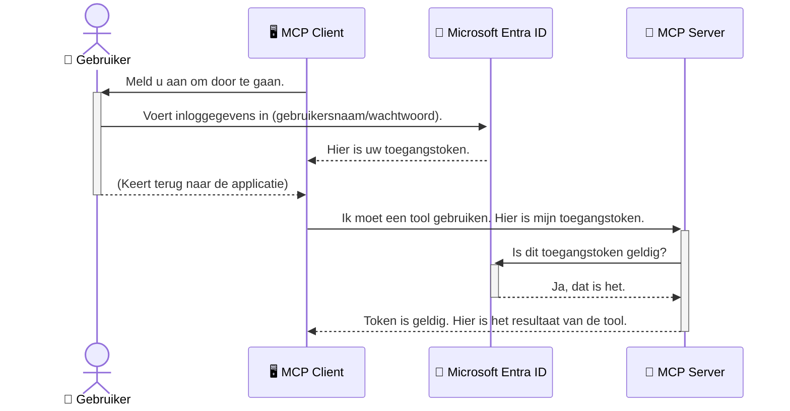

# AI-workflows beveiligen: Entra ID-authenticatie voor Model Context Protocol-servers

## Introductie
Het beveiligen van je Model Context Protocol (MCP)-server is net zo belangrijk als het op slot doen van de voordeur van je huis. Als je MCP-server openstaat, stel je je hulpmiddelen en gegevens bloot aan ongeoorloofde toegang, wat kan leiden tot beveiligingsinbreuken. Microsoft Entra ID biedt een robuuste cloudgebaseerde oplossing voor identiteits- en toegangsbeheer, waarmee je kunt garanderen dat alleen geautoriseerde gebruikers en applicaties met je MCP-server kunnen communiceren. In deze sectie leer je hoe je je AI-workflows beschermt met Entra ID-authenticatie.

## Leerdoelen
Aan het einde van deze sectie kun je:

- Het belang van het beveiligen van MCP-servers begrijpen.
- De basis van Microsoft Entra ID en OAuth 2.0-authenticatie uitleggen.
- Het verschil tussen publieke en vertrouwelijke clients herkennen.
- Entra ID-authenticatie implementeren in zowel lokale (publieke client) als remote (vertrouwelijke client) MCP-serverscenario’s.
- Beveiligingsbest practices toepassen bij het ontwikkelen van AI-workflows.

## Beveiliging en MCP

Net zoals je de voordeur van je huis niet open zou laten staan, mag je je MCP-server niet openlaten voor onbevoegden. Het beveiligen van je AI-workflows is essentieel om robuuste, betrouwbare en veilige applicaties te bouwen. Dit hoofdstuk introduceert je in het gebruik van Microsoft Entra ID om je MCP-servers te beveiligen, zodat alleen geautoriseerde gebruikers en applicaties met je tools en data kunnen werken.

## Waarom beveiliging belangrijk is voor MCP-servers

Stel je voor dat je MCP-server een tool heeft die e-mails kan versturen of toegang heeft tot een klantenbestand. Een onbeveiligde server betekent dat iedereen die tool kan gebruiken, wat leidt tot ongeoorloofde gegevensinzage, spam of andere kwaadaardige activiteiten.

Door authenticatie te implementeren, zorg je ervoor dat elk verzoek aan je server gecontroleerd wordt, waarbij de identiteit van de gebruiker of applicatie die het verzoek doet, wordt bevestigd. Dit is de eerste en meest cruciale stap in het beveiligen van je AI-workflows.

## Introductie tot Microsoft Entra ID

[**Microsoft Entra ID**](https://adoption.microsoft.com/microsoft-security/entra/) is een cloudgebaseerde dienst voor identiteits- en toegangsbeheer. Zie het als een universele beveiligingsbewaker voor je applicaties. Het regelt het complexe proces van het verifiëren van gebruikersidentiteiten (authenticatie) en bepaalt wat ze mogen doen (autorisatie).

Met Entra ID kun je:

- Veilige aanmelding voor gebruikers mogelijk maken.
- API’s en services beschermen.
- Toegangsbeleid centraal beheren.

Voor MCP-servers biedt Entra ID een robuuste en breed vertrouwde oplossing om te beheren wie toegang heeft tot de mogelijkheden van je server.

---

## De magie begrijpen: hoe Entra ID-authenticatie werkt

Entra ID maakt gebruik van open standaarden zoals **OAuth 2.0** voor authenticatie. Hoewel de details complex kunnen zijn, is het kernidee eenvoudig en te begrijpen met een analogie.

### Een zachte introductie tot OAuth 2.0: de valet-sleutel

Zie OAuth 2.0 als een valet service voor je auto. Wanneer je bij een restaurant aankomt, geef je de valet niet je hoofdsleutel. In plaats daarvan geef je een **valet-sleutel** die beperkte bevoegdheden heeft – hij kan de auto starten en de deuren op slot doen, maar niet de kofferbak of het handschoenenkastje openen.

In deze analogie:

- **Jij** bent de **Gebruiker**.
- **Je auto** is de **MCP-server** met zijn waardevolle tools en data.
- De **Valet** is **Microsoft Entra ID**.
- De **Parkeermeester** is de **MCP-client** (de applicatie die toegang probeert te krijgen tot de server).
- De **Valet-sleutel** is het **Toegangstoken**.

Het toegangstoken is een veilige tekststring die de MCP-client ontvangt van Entra ID nadat je bent aangemeld. De client overhandigt dit token bij elk verzoek aan de MCP-server. De server kan het token verifiëren om te controleren of het verzoek legitiem is en of de client de benodigde rechten heeft, zonder dat hij ooit je echte inloggegevens (zoals je wachtwoord) hoeft te verwerken.

### De authenticatiestroom

Zo werkt het proces in de praktijk:



### Introductie van de Microsoft Authentication Library (MSAL)

Voordat we in de code duiken, is het belangrijk om een sleutelcomponent te introduceren die je in de voorbeelden zult zien: de **Microsoft Authentication Library (MSAL)**.

MSAL is een door Microsoft ontwikkelde bibliotheek die het veel eenvoudiger maakt voor ontwikkelaars om authenticatie te verwerken. In plaats van dat jij alle complexe code moet schrijven voor beveiligingstokens, het beheren van aanmeldingen en het verversen van sessies, regelt MSAL het zware werk.

Het gebruik van een bibliotheek als MSAL wordt sterk aanbevolen omdat:

- **Het is veilig:** Het implementeert industriestandaard protocollen en beveiligingsbest practices, waardoor het risico op kwetsbaarheden in je code afneemt.
- **Het vereenvoudigt ontwikkeling:** Het abstraheert de complexiteit van OAuth 2.0 en OpenID Connect, zodat je robuuste authenticatie met slechts een paar regels code kunt toevoegen.
- **Het wordt onderhouden:** Microsoft onderhoudt en werkt MSAL actief bij om nieuwe beveiligingsdreigingen en platformwijzigingen aan te pakken.

MSAL ondersteunt een grote verscheidenheid aan talen en applicatiekaders, waaronder .NET, JavaScript/TypeScript, Python, Java, Go en mobiele platforms zoals iOS en Android. Dit betekent dat je dezelfde consistente authenticatiepatronen over je gehele technologiesysteem kunt gebruiken.

Meer informatie over MSAL vind je in de officiële [MSAL-overzichtdocumentatie](https://learn.microsoft.com/entra/identity-platform/msal-overview).

---

## Je MCP-server beveiligen met Entra ID: een stapsgewijze gids

Laten we nu doorlopen hoe je een lokale MCP-server (die communiceert via `stdio`) beveiligt met Entra ID. Dit voorbeeld gebruikt een **publieke client**, geschikt voor applicaties die op de machine van een gebruiker draaien, zoals een desktopapp of een lokale ontwikkelserver.

### Scenario 1: Een lokale MCP-server beveiligen (met een publieke client)

In dit scenario bekijken we een MCP-server die lokaal draait, communiceert over `stdio` en Entra ID gebruikt om de gebruiker te authenticeren voordat toegang wordt verleend tot de tools. De server heeft één tool die profielinformatie van de gebruiker opvraagt via de Microsoft Graph API.

#### 1. De applicatie instellen in Entra ID

Voordat je code schrijft, moet je je applicatie registreren in Microsoft Entra ID. Dit vertelt Entra ID over je applicatie en verleent toestemming om de authenticatiedienst te gebruiken.

1. Ga naar het **[Microsoft Entra-portaal](https://entra.microsoft.com/)**.
2. Ga naar **App-registraties** en klik op **Nieuwe registratie**.
3. Geef je applicatie een naam (bijv. "Mijn lokale MCP-server").
4. Kies bij **Ondersteunde accounttypen** voor **Accounts in deze organisatorische directory alleen**.
5. Je kunt het veld **Redirect URI** leeg laten voor dit voorbeeld.
6. Klik op **Registreren**.

Noteer na registratie de **Applicatie (client) ID** en de **Directory (tenant) ID**; deze heb je later in je code nodig.

#### 2. De code: een overzicht

Laten we de belangrijkste delen van de code bekijken die authenticatie afhandelen. De volledige code van dit voorbeeld vind je in de [Entra ID - Local - WAM](https://github.com/Azure-Samples/mcp-auth-servers/tree/main/src/entra-id-local-wam) map van de [mcp-auth-servers GitHub-repository](https://github.com/Azure-Samples/mcp-auth-servers).

**`AuthenticationService.cs`**

Deze klasse verzorgt de interactie met Entra ID.

- **`CreateAsync`**: Deze methode initialiseert de `PublicClientApplication` uit MSAL (Microsoft Authentication Library). Het is geconfigureerd met je applicatie’s `clientId` en `tenantId`.
- **`WithBroker`**: Hiermee wordt het gebruik van een broker ingeschakeld (zoals de Windows Web Account Manager), wat een veiliger en naadlozer single sign-on mogelijk maakt.
- **`AcquireTokenAsync`**: Dit is de kernmethode. Eerst probeert het stilletjes een token te verkrijgen (waardoor de gebruiker niet opnieuw hoeft aan te melden bij een geldige sessie). Als dat niet lukt, vraagt het een interactieve aanmelding.

```csharp
// Simplified for clarity
public static async Task<AuthenticationService> CreateAsync(ILogger<AuthenticationService> logger)
{
    var msalClient = PublicClientApplicationBuilder
        .Create(_clientId) // Your Application (client) ID
        .WithAuthority(AadAuthorityAudience.AzureAdMyOrg)
        .WithTenantId(_tenantId) // Your Directory (tenant) ID
        .WithBroker(new BrokerOptions(BrokerOptions.OperatingSystems.Windows))
        .Build();

    // ... cache registration ...

    return new AuthenticationService(logger, msalClient);
}

public async Task<string> AcquireTokenAsync()
{
    try
    {
        // Try silent authentication first
        var accounts = await _msalClient.GetAccountsAsync();
        var account = accounts.FirstOrDefault();

        AuthenticationResult? result = null;

        if (account != null)
        {
            result = await _msalClient.AcquireTokenSilent(_scopes, account).ExecuteAsync();
        }
        else
        {
            // If no account, or silent fails, go interactive
            result = await _msalClient.AcquireTokenInteractive(_scopes).ExecuteAsync();
        }

        return result.AccessToken;
    }
    catch (Exception ex)
    {
        _logger.LogError(ex, "An error occurred while acquiring the token.");
        throw; // Optionally rethrow the exception for higher-level handling
    }
}
```

**`Program.cs`**

Hier wordt de MCP-server opgezet en wordt de authenticatiedienst geïntegreerd.

- **`AddSingleton<AuthenticationService>`**: Hiermee wordt de `AuthenticationService` geregistreerd bij de dependency injection-container, zodat andere delen van de applicatie (zoals onze tool) deze kunnen gebruiken.
- **`GetUserDetailsFromGraph` tool**: Deze tool heeft een instantie van `AuthenticationService` nodig. Voordat het iets doet, roept het `authService.AcquireTokenAsync()` aan om een geldig toegangstoken te verkrijgen. Als authenticatie slaagt, gebruikt het token om de Microsoft Graph API aan te roepen en de gebruikersgegevens op te halen.

```csharp
// Simplified for clarity
[McpServerTool(Name = "GetUserDetailsFromGraph")]
public static async Task<string> GetUserDetailsFromGraph(
    AuthenticationService authService)
{
    try
    {
        // This will trigger the authentication flow
        var accessToken = await authService.AcquireTokenAsync();

        // Use the token to create a GraphServiceClient
        var graphClient = new GraphServiceClient(
            new BaseBearerTokenAuthenticationProvider(new TokenProvider(authService)));

        var user = await graphClient.Me.GetAsync();

        return System.Text.Json.JsonSerializer.Serialize(user);
    }
    catch (Exception ex)
    {
        return $"Error: {ex.Message}";
    }
}
```

#### 3. Hoe het samen werkt

1. Wanneer de MCP-client de `GetUserDetailsFromGraph` tool wil gebruiken, roept die tool eerst `AcquireTokenAsync` aan.
2. `AcquireTokenAsync` laat de MSAL bibliotheek kijken of er al een geldig token is.
3. Als er geen token gevonden wordt, vraagt MSAL via de broker de gebruiker om zich aan te melden met zijn Entra ID-account.
4. Na aanmelding geeft Entra ID een toegangstoken uit.
5. De tool ontvangt het token en gebruikt het om een beveiligde oproep te doen naar de Microsoft Graph API.
6. De gegevens van de gebruiker worden teruggegeven aan de MCP-client.

Dit proces zorgt ervoor dat alleen geauthenticeerde gebruikers de tool kunnen gebruiken en beveiligt effectief je lokale MCP-server.

### Scenario 2: Een remote MCP-server beveiligen (met een vertrouwelijke client)

Wanneer je MCP-server op een remote machine draait (zoals een cloudserver) en communiceert via een protocol als HTTP Streaming, zijn de beveiligingsvereisten anders. In dit geval gebruik je een **vertrouwelijke client** en de **Authorization Code Flow**. Dit is een veiligere methode omdat de geheime gegevens van de applicatie nooit aan de browser worden blootgesteld.

Dit voorbeeld gebruikt een TypeScript-gebaseerde MCP-server die Express.js gebruikt om HTTP-verzoeken af te handelen.

#### 1. De applicatie instellen in Entra ID

De setup in Entra ID is vergelijkbaar met die van de publieke client, maar met één belangrijk verschil: je moet een **client secret** aanmaken.

1. Ga naar het **[Microsoft Entra-portaal](https://entra.microsoft.com/)**.
2. Ga in je app-registratie naar het tabblad **Certificaten & secrets**.
3. Klik op **Nieuwe client secret**, geef een omschrijving op en klik op **Toevoegen**.
4. **Belangrijk:** Kopieer de waarde van de secret direct. Je kunt deze later niet meer zien.
5. Je moet ook een **Redirect URI** configureren. Ga naar het tabblad **Authenticatie**, klik op **Een platform toevoegen**, selecteer **Web** en voer de redirect URI in voor je toepassing (bijv. `http://localhost:3001/auth/callback`).

> **⚠️ Belangrijke beveiligingsnotitie:** Voor productieapplicaties raadt Microsoft sterk aan om **secretless authenticatie** methoden zoals **Managed Identity** of **Workload Identity Federation** te gebruiken in plaats van client secrets. Client secrets vormen een beveiligingsrisico omdat ze blootgesteld of gecompromitteerd kunnen worden. Managed identities bieden een veiliger aanpak doordat je geen referenties in je code of configuratie hoeft op te slaan.
>
> Voor meer informatie over managed identities en implementatie, zie het [Overzicht van managed identities voor Azure-resources](https://learn.microsoft.com/entra/identity/managed-identities-azure-resources/overview).

#### 2. De code: een overzicht

Dit voorbeeld gebruikt een sessiegebaseerde aanpak. Wanneer de gebruiker authenticeert, slaat de server het toegangstoken en refresh token op in een sessie en levert de gebruiker een sessietoken. Dit sessietoken wordt vervolgens gebruikt voor opvolgende verzoeken. De volledige code van dit voorbeeld vind je in de [Entra ID - Confidential client](https://github.com/Azure-Samples/mcp-auth-servers/tree/main/src/entra-id-cca-session) map van de [mcp-auth-servers GitHub-repository](https://github.com/Azure-Samples/mcp-auth-servers).

**`Server.ts`**

Dit bestand zet de Express-server en de MCP-transportlaag op.

- **`requireBearerAuth`**: Dit is middleware die de `/sse` en `/message` endpoints beschermt. Het controleert of er een geldig bearer-token in de `Authorization` header van het verzoek aanwezig is.
- **`EntraIdServerAuthProvider`**: Dit is een aangepaste klasse die de interface `McpServerAuthorizationProvider` implementeert. Het beheert de OAuth 2.0-flow.
- **`/auth/callback`**: Deze endpoint handelt de redirect van Entra ID af nadat de gebruiker is ingelogd. Het wisselt de autorisatiecode om voor een toegangstoken en een refresh token.

```typescript
// Vereenvoudigd voor duidelijkheid
const app = express();
const { server } = createServer();
const provider = new EntraIdServerAuthProvider();

// Bescherm het SSE-eindpunt
app.get("/sse", requireBearerAuth({
  provider,
  requiredScopes: ["User.Read"]
}), async (req, res) => {
  // ... verbinden met de transportlaag ...
});

// Bescherm het bericht-eindpunt
app.post("/message", requireBearerAuth({
  provider,
  requiredScopes: ["User.Read"]
}), async (req, res) => {
  // ... verwerk het bericht ...
});

// Verwerk de OAuth 2.0 callback
app.get("/auth/callback", (req, res) => {
  provider.handleCallback(req.query.code, req.query.state)
    .then(result => {
      // ... verwerk succes of falen ...
    });
});
```

**`Tools.ts`**

Dit bestand definieert de tools die de MCP-server aanbiedt. De `getUserDetails` tool lijkt op die in het vorige voorbeeld, maar haalt het toegangstoken uit de sessie.

```typescript
// Vereenvoudigd voor duidelijkheid
server.setRequestHandler(CallToolRequestSchema, async (request) => {
  const { name } = request.params;
  const context = request.params?.context as { token?: string } | undefined;
  const sessionToken = context?.token;

  if (name === ToolName.GET_USER_DETAILS) {
    if (!sessionToken) {
      throw new AuthenticationError("Authentication token is missing or invalid. Ensure the token is provided in the request context.");
    }

    // Haal het Entra ID-token uit de sessiewinkel
    const tokenData = tokenStore.getToken(sessionToken);
    const entraIdToken = tokenData.accessToken;

    const graphClient = Client.init({
      authProvider: (done) => {
        done(null, entraIdToken);
      }
    });

    const user = await graphClient.api('/me').get();

    // ... retourneer gebruikersgegevens ...
  }
});
```

**`auth/EntraIdServerAuthProvider.ts`**

Deze klasse verzorgt de logica voor:

- De gebruiker omleiden naar de Entra ID-aanmeldpagina.
- De autorisatiecode omwisselen voor een toegangstoken.
- De tokens opslaan in de `tokenStore`.
- Het toegangstoken verversen wanneer het verloopt.

#### 3. Hoe het samen werkt

1. Wanneer een gebruiker voor het eerst verbinding probeert te maken met de MCP-server, merkt de `requireBearerAuth` middleware dat er geen geldige sessie is en zal die omleiden naar de Entra ID-aanmeldpagina.
2. De gebruiker meldt zich aan met zijn Entra ID-account.
3. Entra ID stuurt de gebruiker terug naar de `/auth/callback`-endpoint met een autorisatiecode.
4. De server wisselt de code in voor een toegangstoken en een vernieuwtok, slaat deze op en maakt een sessietoken aan dat naar de client wordt gestuurd.
5. De client kan dit sessietoken nu gebruiken in de `Authorization`-header voor alle toekomstige verzoeken aan de MCP-server.
6. Wanneer de `getUserDetails`-tool wordt aangeroepen, gebruikt deze het sessietoken om het Entra ID-toegangstoken op te zoeken en gebruikt dat vervolgens om de Microsoft Graph API aan te roepen.

Deze flow is complexer dan de flow voor openbare clients, maar is vereist voor internetgerichte endpoints. Omdat externe MCP-servers toegankelijk zijn via het openbare internet, hebben ze sterkere beveiligingsmaatregelen nodig om ongeoorloofde toegang en potentiële aanvallen te voorkomen.

## Beveiligingsbest practices

- **Gebruik altijd HTTPS**: Versleutel de communicatie tussen de client en server om te voorkomen dat tokens worden onderschept.
- **Implementeer Role-Based Access Control (RBAC)**: Controleer niet alleen *of* een gebruiker is geauthenticeerd; controleer *wat* ze mogen doen. Je kunt rollen definiëren in Entra ID en deze controleren in je MCP-server.
- **Monitor en audit**: Log alle authenticatiegebeurtenissen zodat je verdachte activiteiten kunt detecteren en erop kunt reageren.
- **Hanteer rate limiting en throttling**: Microsoft Graph en andere API’s passen rate limiting toe om misbruik te voorkomen. Implementeer exponentiële backoff en retry-logica in je MCP-server om HTTP 429 (Too Many Requests) antwoorden netjes af te handelen. Overweeg het cachen van vaak opgevraagde data om API-aanroepen te verminderen.
- **Veilige tokenopslag**: Sla toegangstokens en vernieuwtokens veilig op. Gebruik voor lokale applicaties de beveiligde opslagmechanismen van het systeem. Voor serverapplicaties kun je versleutelde opslag of beveiligde key management services zoals Azure Key Vault overwegen.
- **Afhandeling van tokenverval**: Toegangstokens hebben een beperkte levensduur. Implementeer automatische tokenvernieuwing met vernieuwtokens om een naadloze gebruikerservaring te behouden zonder dat opnieuw ingelogd hoeft te worden.
- **Overweeg het gebruik van Azure API Management**: Hoewel het implementeren van beveiliging direct in je MCP-server fijnmazige controle geeft, kunnen API-gateways zoals Azure API Management veel van deze beveiligingsaspecten automatisch afhandelen, waaronder authenticatie, autorisatie, rate limiting en monitoring. Ze bieden een gecentraliseerde beveiligingslaag tussen je clients en MCP-servers. Voor meer informatie over het gebruik van API-gateways met MCP, zie onze [Azure API Management Your Auth Gateway For MCP Servers](https://techcommunity.microsoft.com/blog/integrationsonazureblog/azure-api-management-your-auth-gateway-for-mcp-servers/4402690).

## Belangrijke punten

- Het beveiligen van je MCP-server is cruciaal voor het beschermen van je data en tools.
- Microsoft Entra ID biedt een robuuste en schaalbare oplossing voor authenticatie en autorisatie.
- Gebruik een **openbare client** voor lokale applicaties en een **geheimhoudende client** voor externe servers.
- De **Authorization Code Flow** is de veiligste optie voor webapplicaties.

## Oefening

1. Denk na over een MCP-server die je zou kunnen bouwen. Zou dit een lokale server of een externe server zijn?
2. Op basis van je antwoord, zou je een publieke of vertrouwelijke client gebruiken?
3. Welke machtiging zou je MCP-server aanvragen om acties namens Microsoft Graph uit te voeren?

## Praktische oefeningen

### Oefening 1: Registreer een applicatie in Entra ID
Navigeer naar het Microsoft Entra-portaal.  
Registreer een nieuwe applicatie voor je MCP-server.  
Noteer de Application (client) ID en Directory (tenant) ID.

### Oefening 2: Beveilig een lokale MCP-server (publieke client)
- Volg het voorbeeld in de code om MSAL (Microsoft Authentication Library) te integreren voor gebruikersauthenticatie.
- Test de authenticatiestroom door de MCP-tool aan te roepen die gebruikersgegevens van Microsoft Graph ophaalt.

### Oefening 3: Beveilig een externe MCP-server (vertrouwelijke client)
- Registreer een vertrouwelijke client in Entra ID en maak een clientsecret aan.
- Configureer je Express.js MCP-server om de Authorization Code Flow te gebruiken.
- Test de beveiligde endpoints en bevestig toegang op basis van tokens.

### Oefening 4: Pas beveiligingsbest practices toe
- Schakel HTTPS in voor je lokale of externe server.
- Implementeer role-based access control (RBAC) in je serverlogica.
- Voeg tokenvervalafhandeling en veilige tokenopslag toe.

## Bronnen

1. **MSAL Overview Documentation**  
   Leer hoe de Microsoft Authentication Library (MSAL) veilige tokenverwerving over platforms mogelijk maakt:  
   [MSAL Overview on Microsoft Learn](https://learn.microsoft.com/en-gb/entra/msal/overview)

2. **Azure-Samples/mcp-auth-servers GitHub Repository**  
   Referentie-implementaties van MCP-servers die authenticatiestromen demonstreren:  
   [Azure-Samples/mcp-auth-servers on GitHub](https://github.com/Azure-Samples/mcp-auth-servers)

3. **Managed Identities for Azure Resources Overview**  
   Begrijp hoe je geheime gegevens elimineert door gebruik te maken van systeem- of gebruikers-toegewezen beheerde identiteiten:  
   [Managed Identities Overview on Microsoft Learn](https://learn.microsoft.com/en-us/entra/identity/managed-identities-azure-resources/)

4. **Azure API Management: Your Auth Gateway for MCP Servers**  
   Een diepgaande blik op het gebruik van APIM als een beveiligde OAuth2-gateway voor MCP-servers:  
   [Azure API Management Your Auth Gateway For MCP Servers](https://techcommunity.microsoft.com/blog/integrationsonazureblog/azure-api-management-your-auth-gateway-for-mcp-servers/4402690)

5. **Microsoft Graph Permissions Reference**  
   Uitgebreide lijst van gedelegeerde en applicatiemachtigingen voor Microsoft Graph:  
   [Microsoft Graph Permissions Reference](https://learn.microsoft.com/zh-tw/graph/permissions-reference)

## Leerresultaten
Na het voltooien van deze sectie kun je:

- Uitleggen waarom authenticatie cruciaal is voor MCP-servers en AI-workflows.
- Entra ID-authenticatie instellen en configureren voor zowel lokale als externe MCP-server scenario’s.
- Het juiste type client kiezen (publiek of vertrouwelijk) op basis van de implementatie van je server.
- Veilige programmeerpraktijken toepassen, inclusief tokenopslag en op rollen gebaseerde autorisatie.
- Zelfverzekerd je MCP-server en tools beschermen tegen ongeoorloofde toegang.

## Wat nu?

- [5.13 Model Context Protocol (MCP) Integratie met Microsoft Foundry](../mcp-foundry-agent-integration/README.md)

---

<!-- CO-OP TRANSLATOR DISCLAIMER START -->
**Disclaimer**:
Dit document is vertaald met behulp van de AI vertaaldienst [Co-op Translator](https://github.com/Azure/co-op-translator). Hoewel we streven naar nauwkeurigheid, dient u er rekening mee te houden dat geautomatiseerde vertalingen fouten of onnauwkeurigheden kunnen bevatten. Het originele document in de oorspronkelijke taal moet worden beschouwd als de gezaghebbende bron. Voor kritieke informatie wordt professionele menselijke vertaling aanbevolen. Wij zijn niet aansprakelijk voor eventuele misverstanden of verkeerde interpretaties die voortvloeien uit het gebruik van deze vertaling.
<!-- CO-OP TRANSLATOR DISCLAIMER END -->