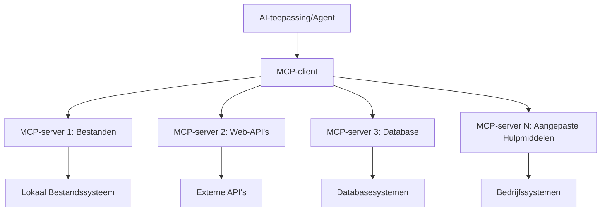

# 🌐 Module 2: MCP met Microsoft Foundry Toolkit Basisprincipes

[]()
[]()
[]()

## 📋 Leerdoelen

Aan het einde van deze module kun je:
- ✅ Begrijpen van de Model Context Protocol (MCP) architectuur en voordelen
- ✅ Verkennen van het Microsoft MCP server ecosysteem
- ✅ Integreren van MCP servers met Microsoft Foundry Toolkit Agent Builder
- ✅ Een functionele browserautomatiseringsagent bouwen met Playwright MCP
- ✅ Configureren en testen van MCP tools binnen je agents
- ✅ Exporteren en inzetten van MCP-gestuurde agents voor productie gebruik

## 🎯 Voortbouwen op Module 1

In Module 1 hebben we de basis van Microsoft Foundry Toolkit onder de knie gekregen en onze eerste Python Agent gemaakt. Nu gaan we je agents **krachtiger maken** door ze te verbinden met externe tools en diensten via het revolutionaire **Model Context Protocol (MCP)**.

Zie dit als een upgrade van een eenvoudige rekenmachine naar een volledige computer - je AI agents krijgen de mogelijkheid om:
- 🌐 Websites te browsen en ermee te interacteren
- 📁 Bestanden openen en bewerken
- 🔧 Integreren met bedrijfsystemen
- 📊 Realtime data van API's verwerken

## 🧠 Begrijpen van Model Context Protocol (MCP)

### 🔍 Wat is MCP?

Model Context Protocol (MCP) is de **"USB-C voor AI-toepassingen"** - een revolutionaire open standaard die Large Language Models (LLM’s) verbindt met externe tools, databronnen en diensten. Net zoals USB-C de kabelchaos verwijderde door één universele aansluiting te bieden, elimineert MCP AI-integratiecomplexiteit met één gestandaardiseerd protocol.

### 🎯 Het Probleem dat MCP Oplost

**Voor MCP:**
- 🔧 Maatwerk integraties voor elke tool
- 🔄 Vendor lock-in met propriëtaire oplossingen  
- 🔒 Beveiligingsrisico’s door ad-hoc verbindingen
- ⏱️ Maanden ontwikkeling voor basisintegraties

**Met MCP:**
- ⚡ Plug-en-play toolintegratie
- 🔄 Vendor-neutrale architectuur
- 🛡️ Ingebouwde beveiligingsstandaarden
- 🚀 Minuten om nieuwe functionaliteiten toe te voegen

### 🏗️ Diepe Duik in MCP Architectuur

MCP volgt een **client-server architectuur** die een veilig en schaalbaar ecosysteem creëert:



**🔧 Kerncomponenten:**

| Component | Rol | Voorbeelden |
|-----------|------|----------|
| **MCP Hosts** | Applicaties die MCP-diensten gebruiken | Claude Desktop, VS Code, Microsoft Foundry Toolkit |
| **MCP Clients** | Protocol handlers (1:1 met servers) | Ingebouwd in host-applicaties |
| **MCP Servers** | Bieden functionaliteiten via standaard protocol | Playwright, Bestanden, Azure, GitHub |
| **Transportlaag** | Communicatiemethoden | stdio, HTTP, WebSockets |


## 🏢 Het Microsoft MCP Server Ecosysteem

Microsoft leidt het MCP ecosysteem met een uitgebreide suite aan servers op bedrijfsniveau die aan echte zakelijke behoeften voldoen.

### 🌟 Uitgelichte Microsoft MCP Servers

#### 1. ☁️ Azure MCP Server
**🔗 Repository**: [azure/azure-mcp](https://github.com/azure/azure-mcp)
**🎯 Doel**: Uitgebreid beheer van Azure resources met AI-integratie

**✨ Belangrijkste Kenmerken:**
- Declaratieve infrastructuur provisioning
- Realtime resource monitoring
- Aanbevelingen voor kostenoptimalisatie
- Controle op beveiligings- en compliance standaarden

**🚀 Gebruiksscenario’s:**
- Infrastructure-as-Code met AI ondersteuning
- Geautomatiseerde resource schaalvergroting
- Cloud-kostenoptimalisatie
- DevOps workflow automatisering

#### 2. 📊 Microsoft Dataverse MCP
**📚 Documentatie**: [Microsoft Dataverse Integratie](https://go.microsoft.com/fwlink/?linkid=2320176)
**🎯 Doel**: Natuurlijke taal interface voor zakelijke data

**✨ Belangrijkste Kenmerken:**
- Databasetoevragen in natuurlijke taal
- Begrip van zakelijke context
- Aangepaste prompt templates
- Enterprise data governance

**🚀 Gebruiksscenario’s:**
- Business intelligence rapportages
- Analyse van klantgegevens
- Inzichten in sales pipeline
- Compliance data queries

#### 3. 🌐 Playwright MCP Server
**🔗 Repository**: [microsoft/playwright-mcp](https://github.com/microsoft/playwright-mcp)
**🎯 Doel**: Browser-automatisering en webinteractie mogelijkheden

**✨ Belangrijkste Kenmerken:**
- Cross-browser automatisering (Chrome, Firefox, Safari)
- Intelligent detecteren van elementen
- Screenshot en PDF generatie
- Netwerkverkeer monitoring

**🚀 Gebruiksscenario’s:**
- Geautomatiseerde testworkflows
- Webscraping en data-extractie
- UI/UX monitoring
- Automatisering van concurrentieanalyse

#### 4. 📁 Files MCP Server
**🔗 Repository**: [microsoft/files-mcp-server](https://github.com/microsoft/files-mcp-server)
**🎯 Doel**: Intelligente bestandsysteem-operaties

**✨ Belangrijkste Kenmerken:**
- Declaratief bestandsbeheer
- Content synchronisatie
- Integratie met versiebeheer
- Extractie van metadata

**🚀 Gebruiksscenario’s:**
- Documentatiebeheer
- Organisatie van code repositories
- Workflows voor contentpublicatie
- Bestandsverwerking in datapijplijnen

#### 5. 📝 MarkItDown MCP Server
**🔗 Repository**: [microsoft/markitdown](https://github.com/microsoft/markitdown)
**🎯 Doel**: Geavanceerde Markdown verwerking en manipulatie

**✨ Belangrijkste Kenmerken:**
- Rijke Markdown parsing
- Formaatconversies (MD ↔ HTML ↔ PDF)
- Analyse van inhoudsstructuur
- Template verwerking

**🚀 Gebruiksscenario’s:**
- Technische documentatieworkflows
- Content management systemen
- Rapportgeneratie
- Automatisering van kennisbanken

#### 6. 📈 Clarity MCP Server
**📦 Package**: [@microsoft/clarity-mcp-server](https://www.npmjs.com/package/@microsoft/clarity-mcp-server)
**🎯 Doel**: Webanalyse en inzicht in gebruikersgedrag

**✨ Belangrijkste Kenmerken:**
- Heatmap data-analyse
- Opnames van gebruikerssessies
- Prestatiemetrics
- Analyse van conversietrechters

**🚀 Gebruiksscenario’s:**
- Website-optimalisatie
- Gebruikersonderzoek
- Analyse van A/B testen
- Business intelligence dashboards

### 🌍 Gemeenschapsecosysteem

Naast de Microsoft servers omvat het MCP ecosysteem:
- **🐙 GitHub MCP**: Beheer van repositories en codeanalyse
- **🗄️ Database MCPs**: Integraties voor PostgreSQL, MySQL, MongoDB
- **☁️ Cloud Provider MCPs**: Tools voor AWS, GCP, Digital Ocean
- **📧 Communicatie MCPs**: Slack, Teams, e-mail integraties

## 🛠️ Praktijkopdracht: Bouwen van een Browser-automatiseringsagent

**🎯 Projectdoel**: Creëer een intelligente browserautomatiseringsagent met Playwright MCP server die websites kan navigeren, informatie kan extraheren en complexe webinteracties kan uitvoeren.

### 🚀 Fase 1: Agent Fundament Setup

#### Stap 1: Initialiseer je Agent
1. **Open Microsoft Foundry Toolkit Agent Builder**
2. **Maak een Nieuwe Agent aan** met de volgende configuratie:
   - **Naam**: `BrowserAgent`
   - **Model**: Kies GPT-4o 


### 🔧 Fase 2: MCP Integratieworkflow

#### Stap 3: Voeg MCP Server Integratie toe
1. **Navigeer naar de Tools Sectie** in Agent Builder
2. **Klik op "Add Tool"** om het integratievenster te openen
3. **Selecteer "MCP Server"** uit de beschikbare opties


**🔍 Begrijpen van Tooltypes:**
- **Ingebouwde Tools**: Voorgeconfigureerde functies van Microsoft Foundry Toolkit
- **MCP Servers**: Externe dienstintegraties
- **Custom API's**: Je eigen service-eindpunten
- **Function Calling**: Directe toegang tot model-functies

#### Stap 4: MCP Server Selectie
1. **Kies de optie "MCP Server"** om door te gaan


2. **Blader door de MCP Catalogus** om beschikbare integraties te verkennen


### 🎮 Fase 3: Playwright MCP Configuratie

#### Stap 5: Selecteer en Configureer Playwright
1. **Klik op "Use Featured MCP Servers"** om toegang te krijgen tot de geverifieerde Microsoft servers
2. **Selecteer "Playwright"** uit de uitgelichte lijst
3. **Accepteer de Standaard MCP ID** of pas aan voor je omgeving


#### Stap 6: Schakel Playwright Functionaliteiten in
**🔑 Kritieke Stap**: Selecteer **ALLE** beschikbare Playwright-methodes voor maximale functionaliteit


**🛠️ Essentiële Playwright Tools:**
- **Navigatie**: `goto`, `goBack`, `goForward`, `reload`
- **Interactie**: `click`, `fill`, `press`, `hover`, `drag`
- **Extractie**: `textContent`, `innerHTML`, `getAttribute`
- **Validatie**: `isVisible`, `isEnabled`, `waitForSelector`
- **Captureren**: `screenshot`, `pdf`, `video`
- **Netwerk**: `setExtraHTTPHeaders`, `route`, `waitForResponse`

#### Stap 7: Controleer het Succes van de Integratie
**✅ Succesindicatoren:**
- Alle tools verschijnen in de Agent Builder interface
- Geen foutmeldingen in het integratiepaneel
- Status van Playwright server toont "Connected"


**🔧 Veelvoorkomende Problemen Oplossen:**
- **Verbinding Mislukt**: Controleer internetverbinding en firewall-instellingen
- **Ontbrekende Tools**: Zorg dat alle mogelijkheden geselecteerd zijn tijdens setup
- **Permissiefouten**: Controleer of VS Code de benodigde systeemrechten heeft

### 🎯 Fase 4: Geavanceerde Prompt Engineering

#### Stap 8: Ontwerp Intelligente System Prompts
Maak geavanceerde prompts die de volledige mogelijkheden van Playwright benutten:

```markdown
# Web Automation Expert System Prompt

## Core Identity
You are an advanced web automation specialist with deep expertise in browser automation, web scraping, and user experience analysis. You have access to Playwright tools for comprehensive browser control.

## Capabilities & Approach
### Navigation Strategy
- Always start with screenshots to understand page layout
- Use semantic selectors (text content, labels) when possible
- Implement wait strategies for dynamic content
- Handle single-page applications (SPAs) effectively

### Error Handling
- Retry failed operations with exponential backoff
- Provide clear error descriptions and solutions
- Suggest alternative approaches when primary methods fail
- Always capture diagnostic screenshots on errors

### Data Extraction
- Extract structured data in JSON format when possible
- Provide confidence scores for extracted information
- Validate data completeness and accuracy
- Handle pagination and infinite scroll scenarios

### Reporting
- Include step-by-step execution logs
- Provide before/after screenshots for verification
- Suggest optimizations and alternative approaches
- Document any limitations or edge cases encountered

## Ethical Guidelines
- Respect robots.txt and rate limiting
- Avoid overloading target servers
- Only extract publicly available information
- Follow website terms of service
```

#### Stap 9: Maak Dynamische User Prompts
Ontwerp prompts die verschillende mogelijkheden demonstreren:

**🌐 Voorbeeld Web Analyse:**
```markdown
Navigate to github.com/kinfey and provide a comprehensive analysis including:
1. Repository structure and organization
2. Recent activity and contribution patterns  
3. Documentation quality assessment
4. Technology stack identification
5. Community engagement metrics
6. Notable projects and their purposes

Include screenshots at key steps and provide actionable insights.
```


### 🚀 Fase 5: Uitvoering en Testen

#### Stap 10: Voer je Eerste Automatisering uit
1. **Klik op "Run"** om de automatiseringsreeks te starten
2. **Volg Real-time Uitvoering**:
   - Chrome browser start automatisch
   - Agent navigeert naar de doelwebsite
   - Screenshots maken van elke belangrijke stap
   - Analyseresultaten worden realtime weergegeven


#### Stap 11: Analyseer Resultaten en Inzichten
Bekijk de uitgebreide analyse in de interface van Agent Builder:


### 🌟 Fase 6: Geavanceerde Functionaliteiten en Inzet

#### Stap 12: Exporteren en Productie Inzet
Agent Builder ondersteunt meerdere inzetopties:


## 🎓 Module 2 Samenvatting & Volgende Stappen

### 🏆 Behaald Doel: MCP Integratie Expert

**✅ Beheersde vaardigheden:**
- [ ] Inzicht in MCP architectuur en voordelen
- [ ] Navigeren in het Microsoft MCP server ecosysteem
- [ ] Integreren van Playwright MCP met Microsoft Foundry Toolkit
- [ ] Bouwen van geavanceerde browserautomatiseringsagents
- [ ] Geavanceerde prompt engineering voor webautomatisering

### 📚 Aanvullende Bronnen

- **🔗 MCP Specificatie**: [Officiële Protocoldocumentatie](https://modelcontextprotocol.io/)
- **🛠️ Playwright API**: [Volledige Methodereferentie](https://playwright.dev/docs/api/class-playwright)
- **🏢 Microsoft MCP Servers**: [Enterprise Integratie Gids](https://github.com/microsoft/mcp-servers)
- **🌍 Gemeenschapsvoorbeelden**: [MCP Server Galerij](https://github.com/modelcontextprotocol/servers)

**🎉 Gefeliciteerd!** Je hebt MCP-integratie succesvol onder de knie en kunt nu productieklare AI agents bouwen met externe tool-functionaliteit!


### 🔜 Ga Verder naar de Volgende Module

Klaar om je MCP-vaardigheden naar het volgende niveau te tillen? Ga door naar **[Module 3: Geavanceerde MCP Ontwikkeling met Microsoft Foundry Toolkit](../lab3/README.md)** waar je leert:
- Je eigen aangepaste MCP servers bouwen
- De nieuwste MCP Python SDK configureren en gebruiken
- MCP Inspector instellen voor debugging
- Geavanceerde MCP server ontwikkelingsworkflows beheersen
- Zelf een Weather MCP Server bouwen vanaf nul

---

<!-- CO-OP TRANSLATOR DISCLAIMER START -->
**Disclaimer**:
Dit document is vertaald met behulp van de AI vertaaldienst [Co-op Translator](https://github.com/Azure/co-op-translator). Hoewel we streven naar nauwkeurigheid, dient u er rekening mee te houden dat geautomatiseerde vertalingen fouten of onnauwkeurigheden kunnen bevatten. Het originele document in de oorspronkelijke taal moet worden beschouwd als de gezaghebbende bron. Voor kritieke informatie wordt professionele menselijke vertaling aanbevolen. Wij zijn niet aansprakelijk voor eventuele misverstanden of verkeerde interpretaties die voortvloeien uit het gebruik van deze vertaling.
<!-- CO-OP TRANSLATOR DISCLAIMER END -->