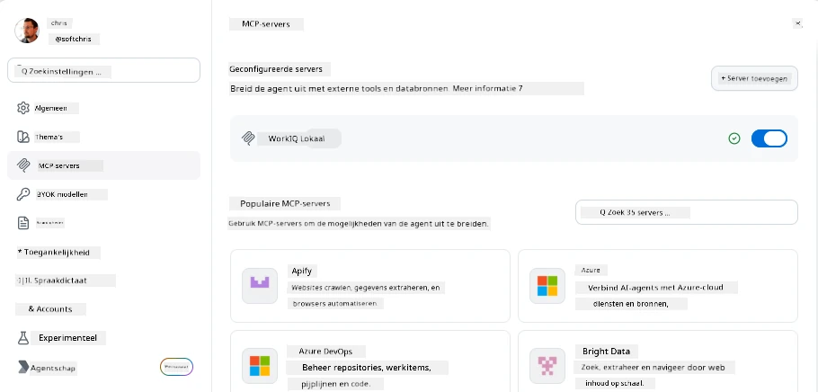
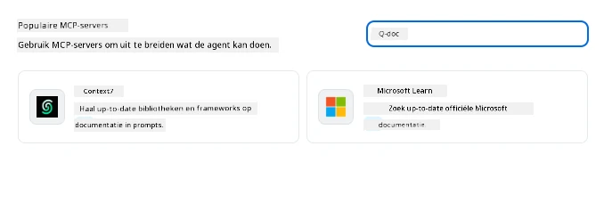
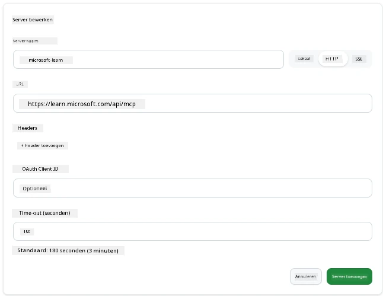
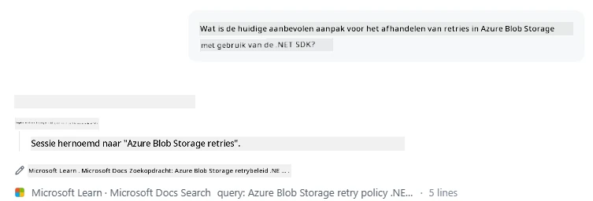
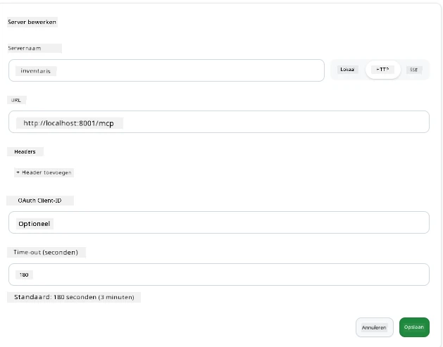
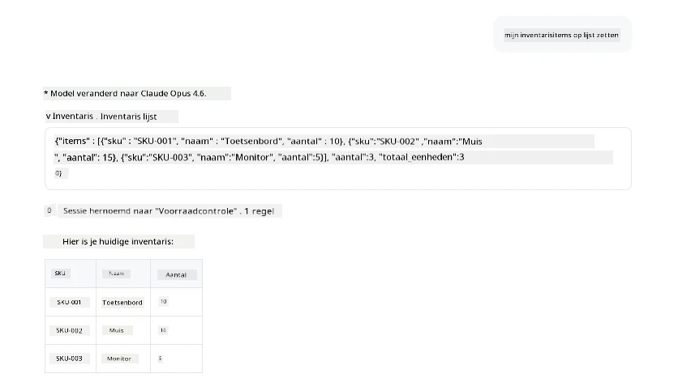
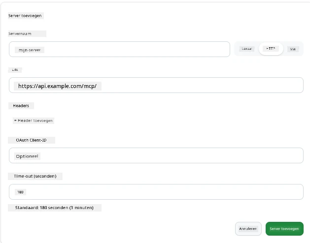
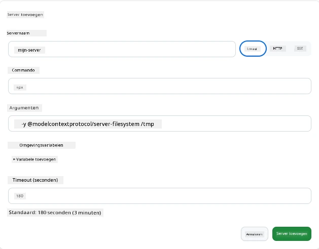

# Gebruik van MCP-servers in de GitHub Copilot-app

Je weet inmiddels hoe MCP werkt. Je hebt servers gebouwd, tools en bronnen gedefinieerd, en clients aangesloten. Wat we nog niet gedaan hebben, is het perspectief omdraaien: in plaats van dat jij de server bouwt, hoe ziet het er dan uit aan de *consumptiekant*—als gebruiker van een AI-aangedreven app die MCP ondersteunt?

[GitHub Copilot App](https://github.com/github/app) is een desktop-app die MCP-servers kan gebruiken. Door MCP-servers eraan te koppelen, ontgrendel je een nieuw niveau: Copilot kan nu in je documentatie duiken, je interne API's aanroepen, je database raadplegen, of praten met elke service die je hebt verpakt in een server. De app wordt de host; jouw MCP-servers worden haar tools.

Deze les begeleidt je door die ervaring van begin tot eind—van het vinden van het MCP-instellingenpaneel tot het verbinden van een echte documentatieserver en vervolgens het aansluiten van een eigen aangepaste server.

## Leerdoelen

Aan het einde van deze les kun je:

- Het MCP-servers paneel in de Copilot App-instellingen vinden en navigeren.
- Een gehoste documentatieserver aansluiten en gebruiken in een sessie.
- Een aangepaste server registreren en verifiëren dat Copilot zijn tools kan aanroepen.
- Configureren hoe een server wordt aangeroepen door ofwel omgevingsvariabelen of aangepaste headers (indien HTTP) mee te geven.

## De Copilot App als MCP-host

Dit is het fundamentele idee: **Copilots agenten zijn slim, maar ze weten alleen wat jij ze vertelt.** Standaard kan een agent bestanden in je werkomgeving lezen en terminalopdrachten uitvoeren, maar hij kan je database niet raadplegen, niet in je agenda kijken of een aangepaste API aanroepen zonder hulp. Daar komen MCP-servers om de hoek kijken. Ze fungeren als bruggen tussen Copilot en je systemen—databases, versiebeheer, API's, ontwerptools—en geven agenten toegang tot de informatie en handelingen die ze nodig hebben om werk te voltooien.

Laten we beginnen met het vinden van die instellingen om de MCP-servers van je app te beheren.

## Stap 1: Het MCP-instellingenpaneel vinden

Open de Copilot App en zoek linksonder het tandwielicoon, klik daarop.


Zorg dat je "MCP Servers" selecteert en je zou nu je reeds geconfigureerde servers bovenaan moeten zien, een marktplaats voor populaire servers onderaan, en een knop "Add Server" bovenaan zoals hieronder:



Dit is je controlecentrum. Hier voeg je servers toe, verwijder je ze, en schakel je ze in of uit. Wijzigingen gelden voor nieuwe sessies; als je een sessie open hebt, moet je een nieuwe starten nadat je deze lijst hebt aangepast.

## Stap 2: Een documentatieserver aansluiten

Laten we iets direct nuttigs doen. De Microsoft Docs MCP-server geeft Copilot toegang tot officiële Microsoft-documentatie. Dit omvat Azure, .NET, TypeScript, en meer. In plaats van dat de agent vertrouwt op zijn trainingsdata (met een cutoff-datum), kan hij actuele documentatie ophalen op het moment van query.

Zo voeg je hem toe:

1. Typ in het raster met populaire servers **learn** en selecteer de server genaamd "Microsoft Learn".

   

   Na klikken verschijnt een formulier waarin naam, transporttype en URL al vooraf zijn ingevuld. Je hoeft alleen nog maar op "Add Server" te klikken.

2. Klik op "Add Server", het duurt enkele seconden om verbinding te maken met de server.

   

   Zodra toegevoegd, verschijnt hij in het bovenste gedeelte als een geconfigureerde server. Laten we hem nu uitproberen.

3. Sluit de dialoog en kies Quick chat.

4. Typ de onderstaande prompt om een tool op de Microsoft Learn-server te activeren.

   ```text
   What's the current recommended approach for handling Azure Blob Storage 
   retries using the .NET SDK?
   ```

   

Je zou moeten zien dat hij verwijst naar de MCP-server die we zojuist hebben toegevoegd.

## Stap 3: Een aangepaste stdio-server aansluiten

De presets zijn handig, maar de echte kracht zit in het aansluiten van je eigen servers. Stel dat je een server hebt gebouwd (of gekregen) die je interne API of bedrijfskennisbank blootlegt. In dit voorbeeld gebruiken we een MCP-server die we hebben gebouwd en die het voorraadbeheer van ons bedrijf afhandelt.

1. Klik op het tandwiel en selecteer opnieuw "MCP servers".

2. Klik op "Add Server" en vervolgens op "+ Add Custom server", en vul de volgende waarden in:

   - Naam: `Inventory Server`
   - Selecteer transport (rechts), **http**

   Klik op "Add Server" en hij zou in je lijst met geconfigureerde servers moeten verschijnen.

   

4. Om het te testen, voer een prompt uit zoals hieronder:

    ```
    list inventory
    ```

   

   Je zou nu een lijst met voorraaditems moeten zien terugkomen van je eigen gebouwd server.

Geweldig, je hebt nu een goed begrip van het toevoegen van zowel externe als eigen MCP-servers aan de Copilot App. Laten we nu praten over het omgaan met geheimen en omgevingsvariabelen.

## Stap 4: Geavanceerde instellingen

Tot nu toe heb je gezien hoe je MCP-servers toevoegt waarbij je alleen een naam en URL opgeeft. Maar wat als je server een API-sleutel of een andere waarde nodig heeft? Afhankelijk van het transporttype kunnen we deze aanleveren.

- **http of SSE transport**: Hier kunnen we indien nodig headers instellen.

   Voor authenticatie kun je bijvoorbeeld een Authorization-header specificeren. De waarde kan een statische string zijn. Gebruik je OAuth, dan kun je ook een OAuth-client-ID opgeven.

   

- **stdio transport**: Omgevingsvariabelen kunnen ingesteld worden.

   Hier kun je het aantal benodigde omgevingsvariabelen opgeven die aan de server moeten worden meegegeven bij het opstarten.

   

## Samenvatting

De Copilot App behandelt MCP-servers als volwaardige uitbreidingen van de capaciteiten van de agent. Je hebt in deze les de volledige route gezien van het toevoegen van MCP-servers tot het gebruiken ervan in een sessie. Je kunt nu verbinding maken met publieke servers, interne API's en aangepaste tools, waardoor je agenten toegang krijgen tot de informatie en handelingen die zij nodig hebben om taken autonoom te voltooien.

## 📚 Aanvullende bronnen

### Officiële documentatie

- [GitHub Copilot App](https://github.com/github/app)
- [MCP Specification](https://modelcontextprotocol.io/specification/2025-03-26) - Model Context Protocol-specificatie

### Community
- [MCP Community Discord](https://discord.com/invite/ByRwuEEgH4) - Live discussies
- [GitHub Discussions](https://github.com/microsoft/MCP-Server-and-PostgreSQL-Sample-Retail/discussions) - Vragen en delen
- [Stack Overflow](https://stackoverflow.com/questions/tagged/model-context-protocol) - Technische vragen

---

<!-- CO-OP TRANSLATOR DISCLAIMER START -->
**Disclaimer**:
Dit document is vertaald met behulp van de AI vertaaldienst [Co-op Translator](https://github.com/Azure/co-op-translator). Hoewel we streven naar nauwkeurigheid, dient u er rekening mee te houden dat geautomatiseerde vertalingen fouten of onnauwkeurigheden kunnen bevatten. Het originele document in de oorspronkelijke taal moet worden beschouwd als de gezaghebbende bron. Voor kritieke informatie wordt professionele menselijke vertaling aanbevolen. Wij zijn niet aansprakelijk voor eventuele misverstanden of verkeerde interpretaties die voortvloeien uit het gebruik van deze vertaling.
<!-- CO-OP TRANSLATOR DISCLAIMER END -->