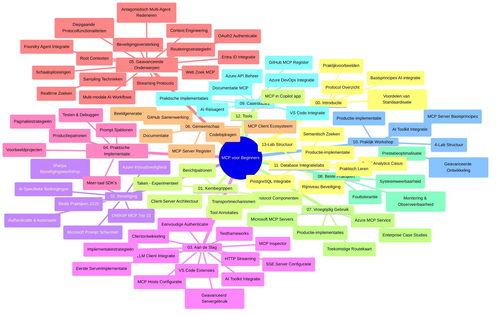

# Model Context Protocol (MCP) voor Beginners - Studiegids

Deze studiegids geeft een overzicht van de structuur en inhoud van de repository voor de "Model Context Protocol (MCP) voor Beginners" cursus. Gebruik deze gids om efficiënt door de repository te navigeren en optimaal gebruik te maken van de beschikbare bronnen.

## Overzicht van de repository

Het Model Context Protocol (MCP) is een gestandaardiseerd raamwerk voor interacties tussen AI-modellen en clientapplicaties. Oorspronkelijk gemaakt door Anthropic, wordt MCP nu onderhouden door de bredere MCP-gemeenschap via de officiële GitHub-organisatie. Deze repository biedt een uitgebreid curriculum met praktische codevoorbeelden in C#, Java, JavaScript, Python en TypeScript, ontworpen voor AI-ontwikkelaars, systeemarchitecten en software-engineers.

## Visuele curriculumkaart

## Repositorystructuur

De repository is georganiseerd in twaalf hoofdsecties, elk gericht op verschillende aspecten van MCP:

1. **Introductie (00-Introduction/)**
   - Overzicht van het Model Context Protocol
   - Waarom standaardisatie belangrijk is in AI-pijplijnen
   - Praktische gebruiksscenario’s en voordelen

2. **Kernconcepten (01-CoreConcepts/)**
   - Client-server architectuur
   - Belangrijke protocolcomponenten
   - Messagingpatronen in MCP

3. **Beveiliging (02-Security/)**
   - Beveiligingsrisico’s in MCP-gebaseerde systemen
   - Best practices voor het beveiligen van implementaties
   - Authenticatie- en autorisatiestrategieën
   - **Uitgebreide beveiligingsdocumentatie**:
     - MCP Security Best Practices 2025
     - Azure Content Safety Implementatiegids
     - MCP Security Controls en technieken
     - MCP Best Practices Quick Reference
   - **Belangrijke beveiligingsthema’s**:
     - Promptinjectie- en toolvergiftigingsaanvallen
     - Sessiekaping en confused deputy-problemen
     - Token passthrough-kwetsbaarheden
     - Overmatige permissies en toegangscontrole
     - Supply chain-beveiliging voor AI-componenten
     - Integratie met Microsoft Prompt Shields

4. **Aan de slag (03-GettingStarted/)**
   - Omgevingsopzet en configuratie
   - Het maken van basis MCP-servers en clients
   - Integratie met bestaande applicaties
   - Bevat secties voor:
     - Eerste serverimplementatie
     - Clientontwikkeling
     - LLM clientintegratie
     - VS Code integratie
     - Server-Sent Events (SSE) server
     - Geavanceerd servergebruik
     - HTTP streaming
     - AI Toolkit integratie
     - Teststrategieën
     - Deploymentrichtlijnen

5. **Praktische implementatie (04-PracticalImplementation/)**
   - Gebruik van SDK’s in verschillende programmeertalen
   - Debuggen, testen en validatietechnieken
   - Het maken van herbruikbare prompttemplates en workflows
   - Voorbeeldprojecten met implementatievoorbeelden

6. **Geavanceerde onderwerpen (05-AdvancedTopics/)**
   - Contextengineeringtechnieken
   - Foundry agentintegratie
   - Multi-modale AI-workflows
   - OAuth2 authenticatiedemo’s
   - Realtime zoekmogelijkheden
   - Realtime streaming
   - Root contexts implementatie
   - Routeringsstrategieën
   - Samplingtechnieken
   - Schaalbare benaderingen
   - Beveiligingsoverwegingen
   - Entra ID beveiligingsintegratie
   - Webzoekintegratie
   - Adversarial multi-agent redeneren (debatepatronen)

7. **Gemeenschapsbijdragen (06-CommunityContributions/)**
   - Hoe code en documentatie bij te dragen
   - Samenwerken via GitHub
   - Gemeenschapsgedreven verbeteringen en feedback
   - Gebruik van diverse MCP-clients (Claude Desktop, Cline, VSCode)
   - Werken met populaire MCP-servers inclusief beeldgeneratie

8. **Lessen uit vroege adoptie (07-LessonsfromEarlyAdoption/)**
   - Implementaties in de praktijk en succesverhalen
   - Bouwen en implementeren van MCP-gebaseerde oplossingen
   - Trends en toekomstige roadmap
   - **Microsoft MCP Servers Gids**: Uitgebreide gids voor 10 productieklare Microsoft MCP-servers waaronder:
     - Microsoft Learn Docs MCP Server
     - Azure MCP Server (15+ gespecialiseerde connectors)
     - GitHub MCP Server
     - Azure DevOps MCP Server
     - MarkItDown MCP Server
     - SQL Server MCP Server
     - Playwright MCP Server
     - Dev Box MCP Server
     - Microsoft Foundry MCP Server
     - Microsoft 365 Agents Toolkit MCP Server

9. **Best practices (08-BestPractices/)**
   - Prestatie-afstemming en optimalisatie
   - Ontwerpen van fouttolerante MCP-systemen
   - Testen en veerkrachtstrategieën

10. **Case studies (09-CaseStudy/)**
    - **Zeven uitgebreide case studies** die de veelzijdigheid van MCP tonen in diverse scenario’s:
    - **Azure AI Reisagenten**: Multi-agent orkestratie met Azure OpenAI en AI Search
    - **Azure DevOps Integratie**: Automatiseren van workflowprocessen met YouTube data-updates
    - **Realtime documentretrieval**: Python consoleclient met streaming HTTP
    - **Interactieve studieplangenerator**: Chainlit webapp met conversationele AI
    - **In-editor documentatie**: VS Code integratie met GitHub Copilot workflows
    - **Azure API Management**: Enterprise API-integratie met MCP servercreatie
    - **GitHub MCP Registry**: Ecosysteemontwikkeling en agentische integratieplatform
    - Implementatievoorbeelden variërend van enterprise-integratie, ontwikkelaarproductiviteit tot ecosysteemontwikkeling

11. **Hands-on workshop (10-StreamliningAIWorkflowsBuildingAnMCPServerWithAIToolkit/)**
    - Uitgebreide hands-on workshop die MCP combineert met AI Toolkit
    - Bouwen van intelligente applicaties die AI-modellen koppelen aan real-world tools
    - Praktische modules die de basis, aangepaste serverontwikkeling en productie-implementatiestrategieën behandelen
    - **Labsstructuur**:
      - Lab 1: MCP Server Fundamentals
      - Lab 2: Geavanceerde MCP Serverontwikkeling
      - Lab 3: AI Toolkit integratie
      - Lab 4: Productie-implementatie en schaling
    - Lab-gebaseerde leerbenadering met stapsgewijze instructies

12. **MCP Server Database Integratie Labs (11-MCPServerHandsOnLabs/)**
    - **Uitgebreid leertraject van 13 labs** voor het bouwen van productieklare MCP-servers met PostgreSQL integratie
    - **Implementatie voor retailanalytics uit de praktijk** met de Zava Retail use case
    - **Enterprise-grade patronen** waaronder Row Level Security (RLS), semantisch zoeken en multi-tenant data toegang
    - **Volledige labsstructuur**:
      - **Labs 00-03: Fundamenten** - Introductie, Architectuur, Beveiliging, Omgevingsopzet
      - **Labs 04-06: Bouwen van de MCP Server** - Databaseontwerp, MCP Serverimplementatie, Toolontwikkeling
      - **Labs 07-09: Geavanceerde functies** - Semantisch zoeken, testen & debuggen, VS Code integratie
      - **Labs 10-12: Productie & Best Practices** - Deployment, monitoring, optimalisatie
    - **Technologieën**: FastMCP framework, PostgreSQL, Azure OpenAI, Azure Container Apps, Application Insights
    - **Leeruitkomsten**: Productieklare MCP-servers, database-integratiepatronen, AI-gedreven analytics, enterprise beveiliging

13. **Tooling (12-tooling/)**
    - Leer hoe je MCP gebruikt in de Copilot-app en andere tools

## Extra bronnen

De repository bevat ondersteunende bronnen:

- **Afbeeldingen map**: Bevat diagrammen en illustraties die door het curriculum heen worden gebruikt
- **Vertalingen**: Meertalige ondersteuning met geautomatiseerde vertalingen van documentatie
- **Officiële MCP-bronnen**:
  - [MCP Documentatie](https://modelcontextprotocol.io/)
  - [MCP Specificatie](https://spec.modelcontextprotocol.io/)
  - [MCP GitHub Repository](https://github.com/modelcontextprotocol)

## Hoe deze repository te gebruiken

1. **Lineair leren**: Volg de hoofdstukken in volgorde (00 t/m 11) voor een gestructureerde leerervaring.
2. **Taalgerichte focus**: Als je geïnteresseerd bent in een specifieke programmeertaal, bekijk dan de voorbeeldenmappen met implementaties in jouw favoriete taal.
3. **Praktische implementatie**: Begin met de sectie "Aan de slag" om je omgeving op te zetten en je eerste MCP-server en client te maken.
4. **Geavanceerde verkenning**: Zodra je de basis beheerst, duik in de geavanceerde onderwerpen om je kennis uit te breiden.
5. **Communitybetrokkenheid**: Word lid van de MCP-gemeenschap via GitHub-discussies en Discord-kanalen om in contact te komen met experts en mede-ontwikkelaars.

## MCP Clients en Tools

Het curriculum behandelt diverse MCP-clients en tools:

1. **Officiële clients**:
   - Visual Studio Code
   - MCP in Visual Studio Code
   - Claude Desktop
   - Claude in VSCode
   - Claude API

2. **Community clients**:
   - Cline (terminal-gebaseerd)
   - Cursor (code-editor)
   - ChatMCP
   - Windsurf

3. **Beheer tools voor MCP**:
   - MCP CLI
   - MCP Manager
   - MCP Linker
   - MCP Router

## Populaire MCP-servers

De repository introduceert diverse MCP-servers, waaronder:

1. **Officiële Microsoft MCP-servers**:
   - Microsoft Learn Docs MCP Server
   - Azure MCP Server (15+ gespecialiseerde connectors)
   - GitHub MCP Server
   - Azure DevOps MCP Server
   - MarkItDown MCP Server
   - SQL Server MCP Server
   - Playwright MCP Server
   - Dev Box MCP Server
   - Microsoft Foundry MCP Server
   - Microsoft 365 Agents Toolkit MCP Server

2. **Officiële referentieservers**:
   - Filesysteem
   - Fetch
   - Memory
   - Sequential Thinking

3. **Beeldgeneratie**:
   - Azure OpenAI DALL-E 3
   - Stable Diffusion WebUI
   - Replicate

4. **Ontwikkeltools**:
   - Git MCP
   - Terminal Control
   - Code Assistant

5. **Gespecialiseerde servers**:
   - Salesforce
   - Microsoft Teams
   - Jira & Confluence

## Bijdragen

Deze repository verwelkomt bijdragen vanuit de gemeenschap. Zie de sectie Gemeenschapsbijdragen voor aanwijzingen over het effectief bijdragen aan het MCP-ecosysteem.

----

*Deze studiegids is voor het laatst bijgewerkt op 5 februari 2026, gebaseerd op de nieuwste MCP Specificatie van 2025-11-25 en geeft een overzicht van de repository tot die datum. De inhoud van de repository kan na deze datum bijgewerkt worden.*

---

<!-- CO-OP TRANSLATOR DISCLAIMER START -->
**Disclaimer**:
Dit document is vertaald met behulp van de AI vertaaldienst [Co-op Translator](https://github.com/Azure/co-op-translator). Hoewel we streven naar nauwkeurigheid, dient u er rekening mee te houden dat geautomatiseerde vertalingen fouten of onnauwkeurigheden kunnen bevatten. Het originele document in de oorspronkelijke taal moet worden beschouwd als de gezaghebbende bron. Voor kritieke informatie wordt professionele menselijke vertaling aanbevolen. Wij zijn niet aansprakelijk voor eventuele misverstanden of verkeerde interpretaties die voortvloeien uit het gebruik van deze vertaling.
<!-- CO-OP TRANSLATOR DISCLAIMER END -->