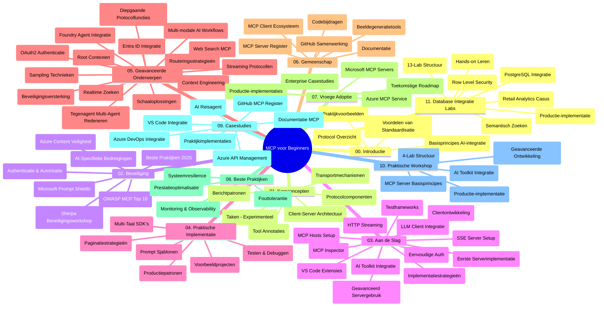

# Model Context Protocol (MCP) voor Beginners - Studiegids

Deze studiegids biedt een overzicht van de repository-structuur en inhoud voor de "Model Context Protocol (MCP) voor Beginners" curriculum. Gebruik deze gids om efficiënt door de repository te navigeren en het maximale uit de beschikbare bronnen te halen.

## Overzicht van de Repository

Het Model Context Protocol (MCP) is een gestandaardiseerd kader voor interacties tussen AI-modellen en clientapplicaties. Oorspronkelijk gemaakt door Anthropic, wordt MCP nu beheerd door de bredere MCP-gemeenschap via de officiële GitHub-organisatie. Deze repository biedt een uitgebreide curriculum met praktische codevoorbeelden in C#, Java, JavaScript, Python en TypeScript, ontworpen voor AI-ontwikkelaars, systeembouwers en software-engineers.

## Visuele Curriculumkaart

## Repository-structuur

De repository is georganiseerd in elf hoofdsecties, elk gericht op verschillende aspecten van MCP:

1. **Introductie (00-Introduction/)**
   - Overzicht van het Model Context Protocol
   - Waarom standaardisatie belangrijk is in AI-pijplijnen
   - Praktische gebruiksvoorbeelden en voordelen

2. **Kernconcepten (01-CoreConcepts/)**
   - Client-server architectuur
   - Belangrijke protocolcomponenten
   - Berichtpatronen in MCP

3. **Beveiliging (02-Security/)**
   - Beveiligingsdreigingen in MCP-gebaseerde systemen
   - Best practices voor het beveiligen van implementaties
   - Authenticatie- en autorisatiestrategieën
   - **Uitgebreide beveiligingsdocumentatie**:
     - MCP Security Best Practices 2025
     - Azure Content Safety Implementatiehandleiding
     - MCP Beveiligingscontroles en Technieken
     - MCP Best Practices Snelle Referentie
   - **Belangrijke beveiligingsthema’s**:
     - Prompt-injectie en toolvergiftigingsaanvallen
     - Sessiekaping en confused deputy-problemen
     - Token passthrough-kwetsbaarheden
     - Overmatige permissies en toegangscontrole
     - Leveringsketenbeveiliging voor AI-componenten
     - Microsoft Prompt Shields-integratie

4. **Aan de Slag (03-GettingStarted/)**
   - Omgevingsopzet en configuratie
   - Het maken van basis MCP-servers en clients
   - Integratie met bestaande applicaties
   - Omvat secties voor:
     - Eerste serverimplementatie
     - Clientontwikkeling
     - LLM-clientintegratie
     - VS Code-integratie
     - Server-Sent Events (SSE) server
     - Geavanceerd servergebruik
     - HTTP-streaming
     - AI Toolkit-integratie
     - Teststrategieën
     - Richtlijnen voor deployment

5. **Praktische Implementatie (04-PracticalImplementation/)**
   - Gebruik van SDK’s in verschillende programmeertalen
   - Debuggen, testen en validatietechnieken
   - Het maken van herbruikbare prompt-sjablonen en workflows
   - Voorbeeldprojecten met implementatievoorbeelden

6. **Geavanceerde Onderwerpen (05-AdvancedTopics/)**
   - Context engineering technieken
   - Foundry agent integratie
   - Multi-modale AI-workflows
   - OAuth2 authenticatie-demo’s
   - Real-time zoekmogelijkheden
   - Real-time streaming
   - Root context implementaties
   - Routingstrategieën
   - Sampling technieken
   - Schaalmethodes
   - Beveiligingsoverwegingen
   - Entra ID beveiligingsintegratie
   - Webzoekintegratie
   - Adversarial multi-agent redenering (debatterende patronen)

7. **Communitybijdragen (06-CommunityContributions/)**
   - Hoe code en documentatie bij te dragen
   - Samenwerken via GitHub
   - Community-gedreven verbeteringen en feedback
   - Gebruik van diverse MCP-clients (Claude Desktop, Cline, VSCode)
   - Werken met populaire MCP-servers, inclusief beeldgeneratie

8. **Lessen uit Vroege Adoptie (07-LessonsfromEarlyAdoption/)**
   - Praktijkimplementaties en succesverhalen
   - Bouwen en uitrollen van MCP-gebaseerde oplossingen
   - Trends en toekomstige roadmap
   - **Microsoft MCP Servers Gids**: Uitgebreide gids voor 10 productierijpe Microsoft MCP-servers, waaronder:
     - Microsoft Learn Docs MCP Server
     - Azure MCP Server (15+ gespecialiseerde connectors)
     - GitHub MCP Server
     - Azure DevOps MCP Server
     - MarkItDown MCP Server
     - SQL Server MCP Server
     - Playwright MCP Server
     - Dev Box MCP Server
     - Microsoft Foundry MCP Server
     - Microsoft 365 Agents Toolkit MCP Server

9. **Best Practices (08-BestPractices/)**
   - Prestatieafstemming en optimalisatie
   - Ontwerpen van fouttolerante MCP-systemen
   - Test- en veerkrachtstrategieën

10. **Casestudies (09-CaseStudy/)**
    - **Zeven uitgebreide casestudies** die de veelzijdigheid van MCP in diverse scenario’s aantonen:
    - **Azure AI Travel Agents**: Multi-agent orkestratie met Azure OpenAI en AI Search
    - **Azure DevOps Integratie**: Automatiseren van workflowprocessen met YouTube data-updates
    - **Realtime Documentatie-opvraging**: Python console-client met streaming HTTP
    - **Interactieve Studieplangenerator**: Chainlit webapp met conversatie-AI
    - **In-Editor Documentatie**: VS Code-integratie met GitHub Copilot workflows
    - **Azure API Management**: Enterprise API-integratie met MCP-servercreatie
    - **GitHub MCP Registry**: Ecosysteemontwikkeling en agentische integratieplatform
    - Implementatievoorbeelden variërend van enterprise integratie, ontwikkelaarproductiviteit tot ecosysteemontwikkeling

11. **Praktische Workshop (10-StreamliningAIWorkflowsBuildingAnMCPServerWithAIToolkit/)**
    - Uitgebreide praktische workshop die MCP combineert met AI Toolkit
    - Bouwen van intelligente applicaties die AI-modellen koppelen aan echte tools
    - Praktische modules die fundamenten, aangepaste serverontwikkeling en productie-deploymentstrategieën behandelen
    - **Labs Structuur**:
      - Lab 1: MCP Server Fundamentals
      - Lab 2: Geavanceerde MCP Serverontwikkeling
      - Lab 3: AI Toolkit Integratie
      - Lab 4: Productiedeployment en schaalvergroting
    - Lab-gebaseerde leermethode met stapsgewijze instructies

12. **MCP Server Database-integratie Labs (11-MCPServerHandsOnLabs/)**
    - **Uitgebreid 13-labs leerlijn** voor het bouwen van productierijpe MCP-servers met PostgreSQL-integratie
    - **Praktijkvoorbeeld retail-analyse** met de Zava Retail use case
    - **Enterprise-grade patronen** inclusief Row Level Security (RLS), semantisch zoeken en multi-tenant data-access
    - **Volledige labs-structuur**:
      - **Labs 00-03: Fundamenten** - Introductie, Architectuur, Beveiliging, Omgevingsopzet
      - **Labs 04-06: MCP Server bouwen** - Databaseontwerp, MCP Server-implementatie, Hulpmiddelenontwikkeling
      - **Labs 07-09: Geavanceerde features** - Semantisch zoeken, testen & debuggen, VS Code-integratie
      - **Labs 10-12: Productie & Best Practices** - Deployment, monitoring, optimalisatie
    - **Behandelde technologieën**: FastMCP framework, PostgreSQL, Azure OpenAI, Azure Container Apps, Application Insights
    - **Leerresultaten**: Productierijpe MCP-servers, database-integratiepatronen, AI-aangedreven analyse, enterprise beveiliging

## Aanvullende Bronnen

De repository bevat ondersteunende bronnen:

- **Images map**: Bevat diagrammen en illustraties die door de curriculum worden gebruikt
- **Vertalingen**: Meertalige ondersteuning met geautomatiseerde vertalingen van documentatie
- **Officiële MCP bronnen**:
  - [MCP Documentatie](https://modelcontextprotocol.io/)
  - [MCP Specificatie](https://spec.modelcontextprotocol.io/)
  - [MCP GitHub Repository](https://github.com/modelcontextprotocol)

## Hoe Deze Repository te Gebruiken

1. **Opeenvolgend Leren**: Volg de hoofdstukken op volgorde (00 tot 11) voor een gestructureerde leerervaring.
2. **Taalgerichte Focus**: Als je geïnteresseerd bent in een bepaalde programmeertaal, verken dan de sample directories voor implementaties in jouw voorkeurstaal.
3. **Praktische Implementatie**: Begin met de sectie "Aan de Slag" om je omgeving op te zetten en je eerste MCP-server en client te maken.
4. **Geavanceerde Verkenning**: Duik, zodra je de basis onder de knie hebt, in de geavanceerde onderwerpen om je kennis uit te breiden.
5. **Communitybetrokkenheid**: Word lid van de MCP-gemeenschap via GitHub-discussies en Discord-kanalen om in contact te komen met experts en medeontwikkelaars.

## MCP Clients en Tools

Het curriculum behandelt diverse MCP-clients en tools:

1. **Officiële Clients**:
   - Visual Studio Code
   - MCP in Visual Studio Code
   - Claude Desktop
   - Claude in VSCode
   - Claude API

2. **Community Clients**:
   - Cline (terminal-gebaseerd)
   - Cursor (code-editor)
   - ChatMCP
   - Windsurf

3. **MCP Beheer Tools**:
   - MCP CLI
   - MCP Manager
   - MCP Linker
   - MCP Router

## Populaire MCP Servers

De repository introduceert diverse MCP-servers, waaronder:

1. **Officiële Microsoft MCP Servers**:
   - Microsoft Learn Docs MCP Server
   - Azure MCP Server (15+ gespecialiseerde connectors)
   - GitHub MCP Server
   - Azure DevOps MCP Server
   - MarkItDown MCP Server
   - SQL Server MCP Server
   - Playwright MCP Server
   - Dev Box MCP Server
   - Microsoft Foundry MCP Server
   - Microsoft 365 Agents Toolkit MCP Server

2. **Officiële Referentieservers**:
   - Filesystem
   - Fetch
   - Memory
   - Sequential Thinking

3. **Beeldgeneratie**:
   - Azure OpenAI DALL-E 3
   - Stable Diffusion WebUI
   - Replicate

4. **Ontwikkelingstools**:
   - Git MCP
   - Terminal Control
   - Code Assistant

5. **Gespecialiseerde Servers**:
   - Salesforce
   - Microsoft Teams
   - Jira & Confluence

## Bijdragen

Deze repository verwelkomt bijdragen vanuit de community. Zie de sectie Communitybijdragen voor richtlijnen over hoe je effectief kunt bijdragen aan het MCP-ecosysteem.

----

*Deze studiegids is voor het laatst bijgewerkt op 5 februari 2026, waarin de nieuwste MCP Specificatie 2025-11-25 is verwerkt en geeft een overzicht van de repository tot die datum. De inhoud van de repository kan na deze datum worden bijgewerkt.*

---

<!-- CO-OP TRANSLATOR DISCLAIMER START -->
**Disclaimer**:
Dit document is vertaald met behulp van de AI vertaaldienst [Co-op Translator](https://github.com/Azure/co-op-translator). Hoewel we streven naar nauwkeurigheid, dient u er rekening mee te houden dat geautomatiseerde vertalingen fouten of onnauwkeurigheden kunnen bevatten. Het originele document in de oorspronkelijke taal moet worden beschouwd als de gezaghebbende bron. Voor kritieke informatie wordt professionele menselijke vertaling aanbevolen. Wij zijn niet aansprakelijk voor eventuele misverstanden of verkeerde interpretaties die voortvloeien uit het gebruik van deze vertaling.
<!-- CO-OP TRANSLATOR DISCLAIMER END -->