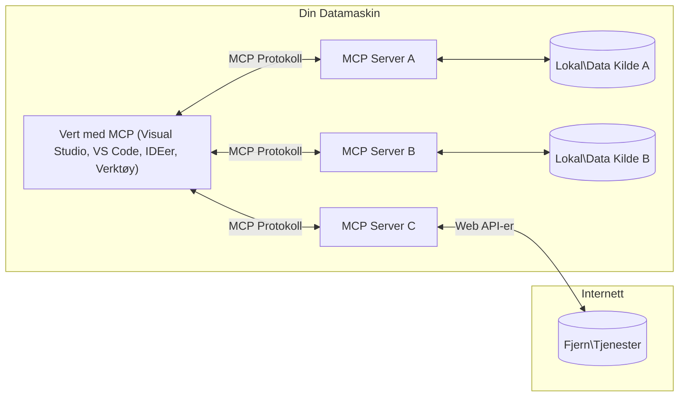

# MCP Core Concepts: Mestring av Model Context Protocol for AI-integrasjon

[](https://youtu.be/earDzWGtE84)

_(Klikk på bildet over for å se videoen til denne leksjonen)_

[Model Context Protocol (MCP)](https://github.com/modelcontextprotocol) er et kraftig, standardisert rammeverk som optimaliserer kommunikasjon mellom store språkmodeller (LLMs) og eksterne verktøy, applikasjoner og datakilder.  
Denne guiden tar deg gjennom kjernkonseptene i MCP. Du vil lære om dens klient-server-arkitektur, essensielle komponenter, kommunikasjonsmekanismer og beste praksis for implementering.

- **Eksplisitt brukersamtykke**: All datatilgang og operasjoner krever eksplisitt godkjenning fra brukeren før utførelse. Brukere må tydelig forstå hvilken data som vil bli tilgang til og hvilke handlinger som vil bli utført, med detaljert kontroll over tillatelser og autorisasjoner.

- **Personvernbeskyttelse**: Brukerdata eksponeres kun med eksplisitt samtykke og må beskyttes av robuste tilgangskontroller gjennom hele interaksjonslivssyklusen. Implementeringer må forhindre uautorisert datatransmisjon og opprettholde strenge personvernsgrenser.

- **Sikker verktøykjøring**: Hver verktøysanrop krever eksplisitt brukersamtykke med klar forståelse av verktøyets funksjonalitet, parametere og potensiell påvirkning. Robuste sikkerhetsgrenser må forhindre utilsiktet, usikker eller ondsinnet kjøring av verktøy.

- **Transportlagssikkerhet**: Alle kommunikasjonskanaler bør bruke passende kryptering og autentiseringsmekanismer. Fjernforbindelser bør benytte sikre transportprotokoller og korrekt håndtering av legitimasjon.

#### Implementeringsretningslinjer:

- **Tillatelsesadministrasjon**: Implementer systemer for finmasket tillatelsesstyring som lar brukere kontrollere hvilke servere, verktøy og ressurser som er tilgjengelige  
- **Autentisering og autorisasjon**: Bruk sikre autentiseringsmetoder (OAuth, API-nøkler) med korrekt tokenhåndtering og utløp  
- **Inndata validering**: Valider alle parametere og datainnganger i henhold til definerte skjemaer for å forhindre injeksjonsangrep  
- **Revisjonslogging**: Oppretthold omfattende logger av alle operasjoner for sikkerhetsovervåking og samsvar  

## Oversikt

Denne leksjonen utforsker den grunnleggende arkitekturen og komponentene som utgjør Model Context Protocol (MCP) økosystemet. Du vil lære om klient-server-arkitekturen, nøkkelkomponenter og kommunikasjonsmekanismer som driver MCP-interaksjoner.

## Viktige læringsmål

Ved slutten av denne leksjonen vil du:

- Forstå MCP klient-server arkitektur.  
- Identifisere roller og ansvar for verter, klienter og servere.  
- Analysere kjernefunksjonene som gjør MCP til et fleksibelt integrasjonslag.  
- Lære hvordan informasjon flyter innen MCP-økosystemet.  
- Få praktiske innsikter gjennom kodeeksempler i .NET, Java, Python og JavaScript.

## MCP-arkitektur: Et dypere blikk

MCP-økosystemet er bygget på en klient-server-modell. Denne modulære strukturen gjør det mulig for AI-applikasjoner å samhandle effektivt med verktøy, databaser, API-er og kontekstuelle ressurser. La oss bryte ned denne arkitekturen i dens kjernekomponenter.

I kjernen følger MCP en klient-server-arkitektur der en vertapplikasjon kan koble til flere servere:


- **MCP-verter**: Programmer som VSCode, Claude Desktop, IDE-er eller AI-verktøy som ønsker å få tilgang til data gjennom MCP  
- **MCP-klienter**: Protokollklienter som opprettholder 1:1-forbindelser med servere  
- **MCP-servere**: Lettvektsprogrammer som hver eksponerer spesifikke funksjoner gjennom den standardiserte Model Context Protocol  
- **Lokale datakilder**: Filene, databasene og tjenestene på din datamaskin som MCP-servere trygt kan få tilgang til  
- **Fjern tjenester**: Eksterne systemer tilgjengelig over internett som MCP-servere kan koble til via API-er.

MCP Protocol er en standard i utvikling som bruker datobasert versjonering (YYYY-MM-DD-format). Den nåværende protokollversjonen er **2025-11-25**. Du kan se de siste oppdateringene til [protokollspesifikasjonen](https://modelcontextprotocol.io/specification/2025-11-25/)

### 1. Verter

I Model Context Protocol (MCP) er **verter** AI-applikasjoner som fungerer som hovedgrensesnittet brukere samhandler med protokollen gjennom. Vertene koordinerer og administrerer tilkoblinger til flere MCP-servere ved å opprette dedikerte MCP-klienter for hver serverforbindelse. Eksempler på verter inkluderer:

- **AI-applikasjoner**: Claude Desktop, Visual Studio Code, Claude Code  
- **Utviklingsmiljøer**: IDE-er og kodeeditorer med MCP-integrasjon  
- **Tilpassede applikasjoner**: Spesialbygde AI-agenter og verktøy

**Verter** er applikasjoner som koordinerer AI-modellsamspill. De:

- **Orkestrerer AI-modeller**: Utfører eller samhandler med LLM-er for å generere svar og koordinere AI-arbeidsflyter  
- **Administrerer klienttilkoblinger**: Oppretter og opprettholder én MCP-klient per MCP-serverforbindelse  
- **Kontrollerer brukergrensesnittet**: Håndterer samtaleflyt, brukerinteraksjoner og responsvisning  
- **Håndhever sikkerhet**: Kontrollerer tillatelser, sikkerhetsbegrensninger og autentisering  
- **Håndterer brukersamtykke**: Administrerer brukerens godkjenning for datadeling og verktøykjøring  

### 2. Klienter

**Klienter** er essensielle komponenter som opprettholder dedikerte én-til-én-forbindelser mellom verter og MCP-servere. Hver MCP-klient opprettes av verten for å koble til en spesifikk MCP-server, hvilket sikrer organiserte og sikre kommunikasjonskanaler. Flere klienter gjør det mulig for verter å koble seg til flere servere samtidig.

**Klienter** er tilkoblingskomponenter innen vertapplikasjonen. De:

- **Protokollkommunikasjon**: Sender JSON-RPC 2.0-forespørsler til servere med forespørsler og instruksjoner  
- **Funksjonsforhandling**: Forhandler støttede funksjoner og protokollversjoner med servere under initialisering  
- **Verktøykjøring**: Håndterer forespørsler om kjøring av verktøy fra modeller og behandler svar  
- **Sanntidsoppdateringer**: Håndterer varsler og sanntidsoppdateringer fra servere  
- **Svarbehandling**: Behandler og formaterer serversvar for visning til brukere  

### 3. Servere

**Servere** er programmer som tilbyr kontekst, verktøy og funksjonalitet til MCP-klienter. De kan kjøre lokalt (på samme maskin som verten) eller eksternt (på eksterne plattformer) og er ansvarlige for å håndtere klientforespørsler og gi strukturerte svar. Servere eksponerer spesifikk funksjonalitet gjennom den standardiserte Model Context Protocol.

**Servere** er tjenester som gir kontekst og funksjonalitet. De:

- **Funksjonsregistrering**: Registrerer og eksponerer tilgjengelige primitiv (ressurser, forespørsler, verktøy) til klienter  
- **Forespørselsbehandling**: Mottar og utfører verktøysanrop, ressursforespørsler og promptforespørsler fra klienter  
- **Kontekstleveranse**: Gir kontekstuell informasjon og data for å forbedre modelsvar  
- **Tilstandshåndtering**: Opprettholder sesjonstilstand og håndterer tilstandsbundne interaksjoner ved behov  
- **Sanntidsvarsler**: Sender varsler om funksjonsendringer og oppdateringer til tilkoblede klienter  

Servere kan utvikles av hvem som helst for å utvide modellens funksjonalitet med spesialisert funksjonalitet, og de støtter både lokale og fjernutplasseringer.

### 4. Server Primitives

Servere i Model Context Protocol (MCP) tilbyr tre kjerne**primitiv**er som definerer de grunnleggende byggeklossene for rike interaksjoner mellom klienter, verter og språkmodeller. Disse primitivene spesifiserer typene kontekstuell informasjon og handlinger som er tilgjengelige gjennom protokollen.

MCP-servere kan eksponere enhver kombinasjon av følgende tre kjerneprimitiver:

#### Ressurser

**Ressurser** er datakilder som gir kontekstuell informasjon til AI-applikasjoner. De representerer statisk eller dynamisk innhold som kan forbedre modellens forståelse og beslutningstaking:

- **Kontekstuell data**: Strukturert informasjon og kontekst for AI-modellens bruk  
- **Kunnskapsbaser**: Dokumentarkiver, artikler, manualer og forskningsartikler  
- **Lokale datakilder**: Filer, databaser og lokal systeminformasjon  
- **Ekstern data**: API-responser, webtjenester og data fra eksterne systemer  
- **Dynamisk innhold**: Sanntidsdata som oppdateres basert på eksterne forhold

Ressurser identifiseres med URI-er og støtter oppdagelse via `resources/list` og henting via `resources/read` metoder:

```text
file://documents/project-spec.md
database://production/users/schema
api://weather/current
```

#### Prompter

**Prompter** er gjenbrukbare maler som hjelper med å strukturere interaksjoner med språklige modeller. De tilbyr standardiserte interaksjonsmønstre og malbaserte arbeidsflyter:

- **Malbaserte interaksjoner**: Forhåndsstrukturerte meldinger og samtalestartere  
- **Arbeidsflytmaler**: Standardiserte sekvenser for vanlige oppgaver og interaksjoner  
- **Få-skudd-eksempler**: Maler basert på eksempler for modellinstruksjon  
- **Systemprompter**: Grunnleggende prompter som definerer modellens oppførsel og kontekst  
- **Dynamiske maler**: Parametriserte prompter som tilpasses spesifikke kontekster

Prompter støtter variabelsubstitusjon og kan oppdages via `prompts/list` og hentes med `prompts/get`:

```markdown
Generate a {{task_type}} for {{product}} targeting {{audience}} with the following requirements: {{requirements}}
```

#### Verktøy

**Verktøy** er kjørbare funksjoner som AI-modeller kan påkalle for å utføre spesifikke handlinger. De representerer "verbene" i MCP-økosystemet, som gjør det mulig for modeller å samhandle med eksterne systemer:

- **Kjørbare funksjoner**: Diskrete operasjoner som modeller kan påkalle med spesifikke parametere  
- **Integrasjon med eksterne systemer**: API-kall, databaseforespørsler, filoperasjoner, beregninger  
- **Unik identitet**: Hvert verktøy har et distinkt navn, beskrivelse og parameterskjema  
- **Strukturert inndata/utdata**: Verktøy mottar validerte parametere og returnerer strukturerte, typede svar  
- **Handlingsmuligheter**: Lar modeller utføre handlinger i den virkelige verden og hente sanntidsdata

Verktøy defineres med JSON Schema for parameter-validering og oppdages via `tools/list` og kjøres gjennom `tools/call`. Verktøy kan også inkludere **ikoner** som tilleggsmetadata for bedre brukergrensesnittpresentasjon.

**Verktøyanmerkninger**: Verktøy støtter atferdsanmerkninger (f.eks. `readOnlyHint`, `destructiveHint`) som beskriver om et verktøy er skrivebeskyttet eller destruktivt, og hjelper klienter med å ta informerte beslutninger om verktøykjøring.

Eksempel på verktøydefinisjon:

```typescript
server.tool(
  "search_products", 
  {
    query: z.string().describe("Search query for products"),
    category: z.string().optional().describe("Product category filter"),
    max_results: z.number().default(10).describe("Maximum results to return")
  }, 
  async (params) => {
    // Utfør søk og returner strukturerte resultater
    return await productService.search(params);
  }
);
```

## Klientprimitiver

I Model Context Protocol (MCP) kan **klienter** eksponere primitiv som gjør det mulig for servere å be om tilleggsmuligheter fra vertapplikasjonen. Disse klientsidige primitivene tillater rikere, mer interaktive serverimplementasjoner som kan få tilgang til AI-modellmuligheter og brukerinteraksjoner.

### Sampling

**Sampling** gir servere mulighet til å be om språkmodellfullføringer fra klientens AI-applikasjon. Denne primitiven gjør det mulig for servere å få tilgang til LLM-funksjonalitet uten å integrere egne modelldependenser:

- **Modelluavhengig tilgang**: Servere kan be om fullføringer uten å inkludere LLM-SDK-er eller håndtere modelltilgang  
- **Server-initiativert AI**: Gjør servere i stand til autonomt å generere innhold ved bruk av klientens AI-modell  
- **Rekursiv LLM-interaksjon**: Støtter komplekse scenarioer hvor servere trenger AI-hjelp til prosessering  
- **Dynamisk innholdsgenerering**: Lar servere lage kontekstuelle svar ved bruk av vertens modell  
- **Støtte for verktøypåkall**: Servere kan inkludere `tools` og `toolChoice` parametere for å la klientens modell påkalle verktøy under sampling

Sampling initieres gjennom `sampling/complete` metoden der servere sender fullføringsforespørsler til klienter.

### Roots

**Roots** gir en standardisert måte for klienter å eksponere filsystemgrenser til servere, som hjelper servere å forstå hvilke kataloger og filer de har tilgang til:

- **Filsystemgrenser**: Definerer grensene for hvor servere kan operere innen filsystemet  
- **Tilgangskontroll**: Hjelper servere å forstå hvilke kataloger og filer de har tillatelse til å få tilgang til  
- **Dynamiske oppdateringer**: Klienter kan varsle servere når listen over roots endrer seg  
- **URI-basert identifikasjon**: Roots bruker `file://` URI-er for å identifisere tilgjengelige kataloger og filer

Roots oppdages gjennom `roots/list` metoden, med klienter som sender `notifications/roots/list_changed` ved endring av roots.

### Elicitation

**Elicitation** gjør det mulig for servere å be om ytterligere informasjon eller bekreftelse fra brukere via klientgrensesnittet:

- **Brukerinndataforespørsler**: Servere kan be om tilleggsinformasjon når det er nødvendig for verktøykjøring  
- **Bekreftelsesdialoger**: Be om brukergodkjenning for sensitive eller innvirkningsfulle operasjoner  
- **Interaktive arbeidsflyter**: Gjør det mulig for servere å lage trinnvis brukerinteraksjon  
- **Dynamisk parameterinnsamling**: Samle inn manglende eller valgfrie parametere under verktøykjøring

Elicitation-forespørsler gjøres med `elicitation/request` metoden for å samle brukerinput via klientens grensesnitt.

**URL Mode Elicitation**: Servere kan også be om brukerinteraksjon via URL, som lar servere dirigere brukere til eksterne websider for autentisering, bekreftelse eller dataregistrering.

### Logging

**Logging** gir servere mulighet til å sende strukturerte loggmeldinger til klienter for feilsøking, overvåking og operasjonell synlighet:

- **Feilsøkingsstøtte**: Gir servere mulighet til å levere detaljerte kjørelogger for problemløsning  
- **Operasjonell overvåking**: Sender statusoppdateringer og ytelsesmetrikk til klienter  
- **Feilrapportering**: Gir detaljert feilkontekst og diagnostisk informasjon  
- **Revisjonsspor**: Lager omfattende logger av serveroperasjoner og beslutninger  

Loggmeldinger sendes til klienter for å gi innsyn i serveroperasjoner og lette feilsøking.

## Informasjonsflyt i MCP

Model Context Protocol (MCP) definerer en strukturert flyt av informasjon mellom verter, klienter, servere og modeller. Å forstå denne flyten hjelper til med å tydeliggjøre hvordan brukerforespørsler behandles og hvordan eksterne verktøy og data integreres i modelsvar.
- **Vert initierer tilkobling**  
  Vertapplikasjonen (for eksempel et IDE eller chattegrensesnitt) etablerer en tilkobling til en MCP-server, vanligvis via STDIO, WebSocket eller en annen støttet transport.

- **Forhandling av kapasitet**  
  Klienten (innebygd i verten) og serveren utveksler informasjon om hvilke funksjoner, verktøy, ressurser og protokollversjoner de støtter. Dette sikrer at begge parter forstår hvilke muligheter som er tilgjengelige for økten.

- **Brukerforespørsel**  
  Brukeren interagerer med verten (f.eks. skriver inn en prompt eller kommando). Verten samler denne inputen og sender den til klienten for behandling.

- **Bruk av ressurs eller verktøy**  
  - Klienten kan be om ekstra kontekst eller ressurser fra serveren (som filer, databaseoppføringer eller kunnskapsbaseartikler) for å berike modellens forståelse.  
  - Hvis modellen bestemmer at et verktøy trengs (f.eks. for å hente data, utføre en beregning eller kalle et API), sender klienten en forespørsel om verktøybruk til serveren, spesifiserer verktøyets navn og parametere.

- **Serverutførelse**  
  Serveren mottar ressurs- eller verktøyforespørselen, utfører nødvendige operasjoner (som å kjøre en funksjon, spørre en database eller hente en fil), og returnerer resultatene til klienten i et strukturert format.

- **Generering av svar**  
  Klienten integrerer serverens svar (ressursdata, verktøyutdata, osv.) inn i den pågående modellinteraksjonen. Modellen bruker denne informasjonen for å generere et omfattende og kontekstuelt relevant svar.

- **Presentasjon av resultat**  
  Verten mottar det endelige resultatet fra klienten og viser det til brukeren, ofte inkludert både modellens genererte tekst og eventuelle resultater fra verktøyutførelser eller ressursoppslag.

Denne flyten gjør at MCP kan støtte avanserte, interaktive og kontekstbevisste AI-applikasjoner ved sømløst å koble modeller med eksterne verktøy og datakilder.

## Protokollarkitektur & Lag

MCP består av to distinkte arkitekturlag som samarbeider for å tilby en komplett kommunikasjonsramme:

### Datalag

**Datalaget** implementerer kjernekonseptene i MCP-protokollen med **JSON-RPC 2.0** som grunnlag. Dette laget definerer meldingsstruktur, semantikk og interaksjonsmønstre:

#### Kjernedeler:

- **JSON-RPC 2.0-protokoll**: All kommunikasjon bruker standardisert JSON-RPC 2.0-meldingsformat for metodekall, svar og varsler  
- **Livssyklusadministrasjon**: Håndterer tilkoblingsinitialisering, kapasitetsforhandling og avslutning av økter mellom klienter og servere  
- **Serverprimitive**: Gjør det mulig for servere å tilby kjernefunksjonalitet gjennom verktøy, ressurser og prompts  
- **Klientprimitive**: Gjør det mulig for servere å be om sampling fra store språkmodeller, hente inn brukerinput og sende loggmeldinger  
- **Sanntidsvarsler**: Støtter asynkrone varsler for dynamiske oppdateringer uten polling

#### Nøkkelfunksjoner:

- **Protokollversjonsforhandling**: Bruker datobasert versjonering (ÅÅÅÅ-MM-DD) for å sikre kompatibilitet  
- **Oppdagelse av kapasitet**: Klienter og servere utveksler informasjon om støttede funksjoner ved initialisering  
- **Statusbevarende økter**: Opprettholder tilkoblingsstatus over flere interaksjoner for kontekstkontinuitet

### Transportlag

**Transportlaget** håndterer kommunikasjonskanaler, meldingsavgrensning og autentisering mellom MCP-deltakere:

#### Støttede transportmekanismer:

1. **STDIO-transport**:  
   - Bruker standard input/output-strømmer for direkte prosesskommunikasjon  
   - Optimalt for lokale prosesser på samme maskin uten nettverksforsinkelse  
   - Vanlig brukt for lokale MCP-serverimplementeringer

2. **Streambar HTTP-transport**:  
   - Bruker HTTP POST for meldinger fra klient til server  
   - Valgfri Server-Sent Events (SSE) for streaming fra server til klient  
   - Muliggjør kommunikasjon med eksterne servere over nettverk  
   - Støtter standard HTTP-autentisering (bærertoken, API-nøkler, egendefinerte headere)  
   - MCP anbefaler OAuth for sikker tokenbasert autentisering

#### Transportabstraksjon:

Transportlaget abstraherer kommunikasjonsdetaljer fra datalaget, slik at samme JSON-RPC 2.0-meldingsformat kan brukes på tvers av alle transportmekanismer. Denne abstraksjonen gjør det mulig for applikasjoner å bytte sømløst mellom lokale og eksterne servere.

### Sikkerhetshensyn

MCP-implementasjoner må følge flere kritiske sikkerhetsprinsipper for å sikre trygge, pålitelige og sikre interaksjoner i alle protokolloperasjoner:

- **Brukersamtykke og kontroll**: Brukere må gi eksplisitt samtykke før data tilgås eller operasjoner utføres. De skal ha klar kontroll over hvilke data som deles og hvilke handlinger som autoriseres, med intuitive brukergrensesnitt for gjennomgang og godkjenning av aktiviteter.

- **Dataprivacy**: Brukerdata skal kun eksponeres med eksplisitt samtykke og må beskyttes med passende tilgangskontroller. MCP-implementasjoner skal forhindre uautorisert datatransmisjon og ivareta personvern gjennom alle interaksjoner.

- **Verktøysikkerhet**: Før et verktøy kalles må eksplisitt brukersamtykke foreligge. Brukere skal ha klar forståelse av hvert verktøys funksjonalitet, og robuste sikkerhetsgrenser må håndheves for å forhindre utilsiktet eller usikker verktøyutførelse.

Ved å følge disse sikkerhetsprinsippene sikrer MCP at brukertillit, personvern og sikkerhet opprettholdes i alle protokollinteraksjoner samtidig som kraftige AI-integrasjoner muliggjøres.

## Kodeeksempler: Nøkkelkomponenter

Nedenfor finnes kodeeksempler i flere populære programmeringsspråk som illustrerer hvordan man implementerer viktige MCP-serverkomponenter og verktøy.

### .NET-eksempel: Lage en enkel MCP-server med verktøy

Her er et praktisk .NET-kodeeksempel som viser hvordan man implementerer en enkel MCP-server med egne verktøy. Eksemplet viser hvordan man definerer og registrerer verktøy, håndterer forespørsler og kobler serveren til Model Context Protocol.

```csharp
using System;
using System.Threading.Tasks;
using ModelContextProtocol.Server;
using ModelContextProtocol.Server.Transport;
using ModelContextProtocol.Server.Tools;

public class WeatherServer
{
    public static async Task Main(string[] args)
    {
        // Create an MCP server
        var server = new McpServer(
            name: "Weather MCP Server",
            version: "1.0.0"
        );
        
        // Register our custom weather tool
        server.AddTool<string, WeatherData>("weatherTool", 
            description: "Gets current weather for a location",
            execute: async (location) => {
                // Call weather API (simplified)
                var weatherData = await GetWeatherDataAsync(location);
                return weatherData;
            });
        
        // Connect the server using stdio transport
        var transport = new StdioServerTransport();
        await server.ConnectAsync(transport);
        
        Console.WriteLine("Weather MCP Server started");
        
        // Keep the server running until process is terminated
        await Task.Delay(-1);
    }
    
    private static async Task<WeatherData> GetWeatherDataAsync(string location)
    {
        // This would normally call a weather API
        // Simplified for demonstration
        await Task.Delay(100); // Simulate API call
        return new WeatherData { 
            Temperature = 72.5,
            Conditions = "Sunny",
            Location = location
        };
    }
}

public class WeatherData
{
    public double Temperature { get; set; }
    public string Conditions { get; set; }
    public string Location { get; set; }
}
```

### Java-eksempel: MCP-serverkomponenter

Dette eksemplet viser samme MCP-server og verktøyregistrering som .NET-eksemplet over, men implementert i Java.

```java
import io.modelcontextprotocol.server.McpServer;
import io.modelcontextprotocol.server.McpToolDefinition;
import io.modelcontextprotocol.server.transport.StdioServerTransport;
import io.modelcontextprotocol.server.tool.ToolExecutionContext;
import io.modelcontextprotocol.server.tool.ToolResponse;

public class WeatherMcpServer {
    public static void main(String[] args) throws Exception {
        // Opprett en MCP-server
        McpServer server = McpServer.builder()
            .name("Weather MCP Server")
            .version("1.0.0")
            .build();
            
        // Registrer et værverktøy
        server.registerTool(McpToolDefinition.builder("weatherTool")
            .description("Gets current weather for a location")
            .parameter("location", String.class)
            .execute((ToolExecutionContext ctx) -> {
                String location = ctx.getParameter("location", String.class);
                
                // Hent værdata (forenklet)
                WeatherData data = getWeatherData(location);
                
                // Returner formatert svar
                return ToolResponse.content(
                    String.format("Temperature: %.1f°F, Conditions: %s, Location: %s", 
                    data.getTemperature(), 
                    data.getConditions(), 
                    data.getLocation())
                );
            })
            .build());
        
        // Koble serveren ved hjelp av stdio transport
        try (StdioServerTransport transport = new StdioServerTransport()) {
            server.connect(transport);
            System.out.println("Weather MCP Server started");
            // Hold serveren kjørende til prosessen avsluttes
            Thread.currentThread().join();
        }
    }
    
    private static WeatherData getWeatherData(String location) {
        // Implementeringen ville kalle en vær-API
        // Forenklet for eksempelformål
        return new WeatherData(72.5, "Sunny", location);
    }
}

class WeatherData {
    private double temperature;
    private String conditions;
    private String location;
    
    public WeatherData(double temperature, String conditions, String location) {
        this.temperature = temperature;
        this.conditions = conditions;
        this.location = location;
    }
    
    public double getTemperature() {
        return temperature;
    }
    
    public String getConditions() {
        return conditions;
    }
    
    public String getLocation() {
        return location;
    }
}
```

### Python-eksempel: Bygge en MCP-server

Dette eksemplet bruker fastmcp, så sørg for å installere det først:

```python
pip install fastmcp
```
Kodeeksempel:

```python
#!/usr/bin/env python3
import asyncio
from fastmcp import FastMCP
from fastmcp.transports.stdio import serve_stdio

# Opprett en FastMCP-server
mcp = FastMCP(
    name="Weather MCP Server",
    version="1.0.0"
)

@mcp.tool()
def get_weather(location: str) -> dict:
    """Gets current weather for a location."""
    return {
        "temperature": 72.5,
        "conditions": "Sunny",
        "location": location
    }

# Alternativ tilnærming ved bruk av en klasse
class WeatherTools:
    @mcp.tool()
    def forecast(self, location: str, days: int = 1) -> dict:
        """Gets weather forecast for a location for the specified number of days."""
        return {
            "location": location,
            "forecast": [
                {"day": i+1, "temperature": 70 + i, "conditions": "Partly Cloudy"}
                for i in range(days)
            ]
        }

# Registrer klassens verktøy
weather_tools = WeatherTools()

# Start serveren
if __name__ == "__main__":
    asyncio.run(serve_stdio(mcp))
```

### JavaScript-eksempel: Lage en MCP-server

Dette eksemplet viser hvordan man lager en MCP-server i JavaScript og hvordan man registrerer to værrelaterte verktøy.

```javascript
// Bruke den offisielle Model Context Protocol SDK
import { McpServer } from "@modelcontextprotocol/sdk/server/mcp.js";
import { StdioServerTransport } from "@modelcontextprotocol/sdk/server/stdio.js";
import { z } from "zod"; // For parameter validering

// Opprett en MCP server
const server = new McpServer({
  name: "Weather MCP Server",
  version: "1.0.0"
});

// Definer et værverktøy
server.tool(
  "weatherTool",
  {
    location: z.string().describe("The location to get weather for")
  },
  async ({ location }) => {
    // Dette ville normalt ringe en vær API
    // Forenklet for demonstrasjon
    const weatherData = await getWeatherData(location);
    
    return {
      content: [
        { 
          type: "text", 
          text: `Temperature: ${weatherData.temperature}°F, Conditions: ${weatherData.conditions}, Location: ${weatherData.location}` 
        }
      ]
    };
  }
);

// Definer et prognoseverktøy
server.tool(
  "forecastTool",
  {
    location: z.string(),
    days: z.number().default(3).describe("Number of days for forecast")
  },
  async ({ location, days }) => {
    // Dette ville normalt ringe en vær API
    // Forenklet for demonstrasjon
    const forecast = await getForecastData(location, days);
    
    return {
      content: [
        { 
          type: "text", 
          text: `${days}-day forecast for ${location}: ${JSON.stringify(forecast)}` 
        }
      ]
    };
  }
);

// Hjelpefunksjoner
async function getWeatherData(location) {
  // Simuler API-kall
  return {
    temperature: 72.5,
    conditions: "Sunny",
    location: location
  };
}

async function getForecastData(location, days) {
  // Simuler API-kall
  return Array.from({ length: days }, (_, i) => ({
    day: i + 1,
    temperature: 70 + Math.floor(Math.random() * 10),
    conditions: i % 2 === 0 ? "Sunny" : "Partly Cloudy"
  }));
}

// Koble serveren ved hjelp av stdio transport
const transport = new StdioServerTransport();
server.connect(transport).catch(console.error);

console.log("Weather MCP Server started");
```

Dette JavaScript-eksemplet demonstrerer hvordan man lager en MCP-server som registrerer værrelaterte verktøy og kobler til via stdio-transport for å håndtere innkommende klientforespørsler.

## Sikkerhet og autorisasjon

MCP inkluderer flere innebygde konsepter og mekanismer for å håndtere sikkerhet og autorisasjon gjennom hele protokollen:

1. **Kontroll av verktøytillatelser**:  
  Klienter kan angi hvilke verktøy en modell får bruke under en økt. Dette sikrer at kun eksplisitt autoriserte verktøy er tilgjengelige, og reduserer risikoen for utilsiktede eller usikre operasjoner. Tilgang kan konfigureres dynamisk basert på brukerpreferanser, organisasjonspolicyer eller interaksjonskontekst.

2. **Autentisering**:  
  Servere kan kreve autentisering før tilgang til verktøy, ressurser eller sensitive operasjoner gis. Dette kan involvere API-nøkler, OAuth-token eller andre autentiseringsordninger. Riktig autentisering sikrer at kun betrodde klienter og brukere kan aktivere serversidefunksjoner.

3. **Validering**:  
  Parameter-validering håndheves for alle verktøykall. Hvert verktøy definerer forventede typer, formater og begrensninger for sine parametere, og serveren validerer innkommende forespørsler i samsvar med dette. Dette forhindrer feilaktig eller ondsinnet input fra å nå verktøyimplementasjonene og bidrar til å opprettholde driftsintegritet.

4. **Ratebegrensning**:  
  For å hindre misbruk og sikre rettferdig ressursbruk kan MCP-servere implementere ratebegrensning for verktøykall og ressursaksess. Grenser kan settes per bruker, per økt eller globalt, og beskytter mot tjenestenektangrep eller overdreven ressursforbruk.

Kombinert gir disse mekanismene et sikkert fundament for å integrere språkmodeller med eksterne verktøy og datakilder, samtidig som brukere og utviklere får detaljert kontroll over tilgang og bruk.

## Protokollmeldinger & kommunikasjonsflyt

MCP-kommunikasjon bruker strukturerte **JSON-RPC 2.0**-meldinger for å legge til rette for klare og pålitelige interaksjoner mellom verter, klienter og servere. Protokollen definerer spesifikke meldingsmønstre for ulike typer operasjoner:

### Kjernetypemeldinger:

#### **Initialiseringsmeldinger**  
- **`initialize`-forespørsel**: Etablerer tilkobling og forhandler protokollversjon og kapasitet  
- **`initialize`-svar**: Bekrefter støttede funksjoner og serverinformasjon  
- **`notifications/initialized`**: Signalerer at initialisering er fullført og økten er klar

#### **Oppdagelsesmeldinger**  
- **`tools/list`-forespørsel**: Oppdager tilgjengelige verktøy fra serveren  
- **`resources/list`-forespørsel**: Lister tilgjengelige ressurser (datakilder)  
- **`prompts/list`-forespørsel**: Henter tilgjengelige promptmaler

#### **Utførelsesmeldinger**  
- **`tools/call`-forespørsel**: Utfører et spesifikt verktøy med oppgitte parametere  
- **`resources/read`-forespørsel**: Henter innhold fra en bestemt ressurs  
- **`prompts/get`-forespørsel**: Henter en promptmal med valgfrie parametere

#### **Klientside-meldinger**  
- **`sampling/complete`-forespørsel**: Server ber om LLM-fullføring fra klienten  
- **`elicitation/request`**: Server ber om brukerinput gjennom klientgrensesnittet  
- **Loggmeldinger**: Server sender strukturerte loggmeldinger til klienten

#### **Varslingsmeldinger**  
- **`notifications/tools/list_changed`**: Server varsler klienten om endringer i verktøyliste  
- **`notifications/resources/list_changed`**: Server varsler klienten om endringer i ressursliste  
- **`notifications/prompts/list_changed`**: Server varsler klienten om endringer i promptliste

### Meldingsstruktur:

Alle MCP-meldinger følger JSON-RPC 2.0-format med:  
- **Forespørselsmeldinger**: Inkluderer `id`, `method` og valgfrie `params`  
- **Svarmeldinger**: Inkluderer `id` og enten `result` eller `error`  
- **Varslingsmeldinger**: Inkluderer `method` og valgfrie `params` (ingen `id` eller forventet svar)

Denne strukturerte kommunikasjonen sikrer pålitelige, sporbare og utvidbare interaksjoner som støtter avanserte scenarier som sanntidsoppdateringer, kjeding av verktøy og robust feilbehandling.

### Oppgaver (Eksperimentelt)

**Oppgaver** er en eksperimentell funksjon som gir holdbare utførelsesinnpakninger som muliggjør utsatt resultatinnhenting og statussporing for MCP-forespørsler:

- **Langvarige operasjoner**: Sporer krevende beregninger, automatisering av arbeidsflyt og batchbehandling  
- **Utsatte resultater**: Muliggjør polling av oppgavestatus og henting av resultater når operasjoner er fullført  
- **Statussporing**: Overvåker oppgaveframdrift gjennom definerte livssyklusstadier  
- **Flertrinnsoperasjoner**: Støtter komplekse arbeidsflyter som spenner over flere interaksjoner

Oppgaver pakker inn standard MCP-forespørsler for å muliggjøre asynkrone utførelsesmønstre for operasjoner som ikke kan fullføres umiddelbart.

## Viktige poenger

- **Arkitektur**: MCP bruker en klient-server-arkitektur hvor verter administrerer flere klienttilkoblinger til servere  
- **Deltakere**: Økosystemet inkluderer verter (AI-applikasjoner), klienter (protokollkoblinger) og servere (kapasitetsleverandører)  
- **Transportmekanismer**: Kommunikasjon støtter STDIO (lokalt) og Streambar HTTP med valgfri SSE (eksternt)  
- **Kjerneprimitive**: Servere eksponerer verktøy (kjørbare funksjoner), ressurser (datakilder) og prompts (maler)  
- **Klientprimitive**: Servere kan be om sampling (LLM-fullføringer med støtte for verktøykall), elicitation (brukerinput inkludert URL-modus), roots (filsystemgrenser) og logging fra klienter  
- **Eksperimentelle funksjoner**: Oppgaver gir holdbare utførelsesinnpakninger for langvarige operasjoner  
- **Protokollgrunnlag**: Bygget på JSON-RPC 2.0 med datobasert versjonering (gjeldende: 2025-11-25)  
- **Sanntidskapabiliteter**: Støtter varsler for dynamiske oppdateringer og sanntidssynkronisering  
- **Sikkerhet først**: Eksplisitt brukersamtykke, dataprivacy-beskyttelse og sikker transport er kjernekrav

## Øvelse

Design et enkelt MCP-verktøy som ville være nyttig innen ditt domene. Definer:  
1. Hva verktøyet skal hete  
2. Hvilke parametere det skal godta  
3. Hvilket output det skal returnere  
4. Hvordan en modell kan bruke dette verktøyet til å løse brukerproblemer


---

## Hva skjer videre

Neste: [Kapittel 2: Sikkerhet](../02-Security/README.md)

---

<!-- CO-OP TRANSLATOR DISCLAIMER START -->
**Ansvarsfraskrivelse**:
Dette dokumentet er oversatt ved hjelp av AI-oversettelsestjenesten [Co-op Translator](https://github.com/Azure/co-op-translator). Selv om vi streber etter nøyaktighet, vær oppmerksom på at automatiserte oversettelser kan inneholde feil eller unøyaktigheter. Det opprinnelige dokumentet på dets opprinnelige språk bør anses som den autoritative kilden. For kritisk informasjon anbefales profesjonell menneskelig oversettelse. Vi er ikke ansvarlige for eventuelle misforståelser eller feiltolkninger som oppstår ved bruk av denne oversettelsen.
<!-- CO-OP TRANSLATOR DISCLAIMER END -->