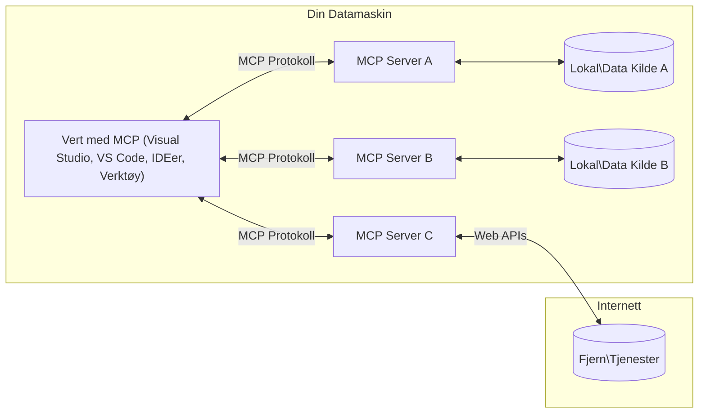

# MCP-kjernebegreper: Mestre Model Context Protocol for AI-integrasjon

[](https://youtu.be/earDzWGtE84)

_(Klikk på bildet ovenfor for å se video av denne leksjonen)_

[Model Context Protocol (MCP)](https://github.com/modelcontextprotocol) er et kraftig, standardisert rammeverk som optimaliserer kommunikasjon mellom store språkmodeller (LLMs) og eksterne verktøy, applikasjoner og datakilder.  
Denne guiden vil lede deg gjennom kjernebegrepene i MCP. Du vil lære om klient-server-arkitekturen, essensielle komponenter, kommunikasjonsmekanikk og beste praksis for implementering.

- **Eksplisitt brukergodkjenning**: All datatilgang og operasjoner krever uttrykkelig brukergodkjenning før utførelse. Brukere må klart forstå hvilken data som vil bli aksessert og hvilke handlinger som skal utføres, med granulær kontroll over tillatelser og autorisasjoner.

- **Datapersonvern**: Brukerdata eksponeres kun med eksplisitt samtykke og må beskyttes med robuste tilgangskontroller gjennom hele interaksjonslivssyklusen. Implementasjoner må forhindre uautorisert datatransmisjon og opprettholde strenge personvernsgrenser.

- **Sikker kjøring av verktøy**: Hver verktøyinvokasjon krever eksplisitt brukergodkjenning med klar forståelse av verktøyets funksjonalitet, parametere og potensiell påvirkning. Robuste sikkerhetsgrenser må forhindre utilsiktet, usikker eller ondsinnet kjøring av verktøy.

- **Transportlagssikkerhet**: Alle kommunikasjonskanaler bør bruke passende kryptering og autentiseringsmekanismer. Fjernforbindelser skal implementere sikre transportprotokoller og korrekt styring av legitimasjon.

#### Implementeringsretningslinjer:

- **Tillatelsesstyring**: Implementer finmasket tillatelsessystem som lar brukere kontrollere hvilke servere, verktøy og ressurser som er tilgjengelige  
- **Autentisering og autorisasjon**: Bruk sikre autentiseringsmetoder (OAuth, API-nøkler) med korrekt tokenhåndtering og utløp  
- **Inputvalidering**: Valider alle parametere og datainnganger i henhold til definerte skjemaer for å forhindre injeksjonsangrep  
- **Audit-loggføring**: Oppretthold omfattende logger over alle operasjoner for sikkerhetsovervåking og overholdelse  

## Oversikt

Denne leksjonen utforsker den grunnleggende arkitekturen og komponentene som utgjør Model Context Protocol (MCP)-økosystemet. Du vil lære om klient-server-arkitekturen, nøkkelkomponenter og kommunikasjonsmekanismer som driver MCP-interaksjoner.

## Viktige læringsmål

Ved slutten av denne leksjonen vil du:

- Forstå MCP-klient-server-arkitekturen.  
- Identifisere roller og ansvar for Hosts, Clients og Servers.  
- Analysere kjernefunksjonene som gjør MCP til et fleksibelt integrasjonslag.  
- Lære hvordan informasjon flyter innen MCP-økosystemet.  
- Få praktiske innsikter gjennom kodeeksempler i .NET, Java, Python og JavaScript.

## MCP-arkitektur: En nærmere titt

MCP-økosystemet er bygget på en klient-server-modell. Denne modulære strukturen lar AI-applikasjoner samhandle med verktøy, databaser, APIer og kontekstuelle ressurser på en effektiv måte. La oss bryte ned denne arkitekturen i dens kjernekomponenter.

I sin kjerne følger MCP en klient-server-arkitektur hvor en host-applikasjon kan koble til flere servere:


- **MCP Hosts**: Programmer som VSCode, Claude Desktop, IDEer eller AI-verktøy som ønsker å få tilgang til data gjennom MCP  
- **MCP Clients**: Protokollklienter som opprettholder 1:1-forbindelser med servere  
- **MCP Servers**: Lettsveiende programmer som hver eksponerer spesifikke funksjoner gjennom den standardiserte Model Context Protocol  
- **Lokale datakilder**: Filene, databasene og tjenestene på datamaskinen din som MCP-servere kan få sikker tilgang til  
- **Fjern-tjenester**: Eksterne systemer tilgjengelige over internett som MCP-servere kan koble til via APIer.

MCP-protokollen er en utviklende standard med datobasert versjonsstyring (YYYY-MM-DD-format). Nåværende protokollversjon er **2025-11-25**. Du kan se siste oppdateringer i [protokollspesifikasjonen](https://modelcontextprotocol.io/specification/2025-11-25/)

### 1. Hosts

I Model Context Protocol (MCP) er **Hosts** AI-applikasjoner som fungerer som det primære grensesnittet brukere interagerer med protokollen gjennom. Hosts koordinerer og styrer forbindelser til flere MCP-servere ved å opprette dedikerte MCP-klienter for hver serverforbindelse. Eksempler på Hosts inkluderer:

- **AI-applikasjoner**: Claude Desktop, Visual Studio Code, Claude Code  
- **Utviklingsmiljøer**: IDEer og kodeeditorer med MCP-integrasjon  
- **Tilpassede applikasjoner**: Spesialbygde AI-agenter og verktøy  

**Hosts** er applikasjoner som koordinerer AI-modellinteraksjoner. De:

- **Orkestrerer AI-modeller**: Kjører eller samhandler med LLMs for å generere svar og koordinere AI-arbeidsflyter  
- **Styrer klientforbindelser**: Oppretter og vedlikeholder én MCP-klient per MCP-serverforbindelse  
- **Kontrollerer brukergrensesnittet**: Håndterer samtaleflyt, brukerinteraksjoner og presentasjon av svar  
- **Håndhever sikkerhet**: Kontrollerer tillatelser, sikkerhetsbegrensninger og autentisering  
- **Håndterer brukersamtykke**: Styrer brukerens godkjenning for datadeling og verktøykjøring

### 2. Clients

**Clients** er essensielle komponenter som opprettholder dedikerte én-til-én-forbindelser mellom Hosts og MCP-servere. Hver MCP-klient blir opprettet av Host for å koble til en spesifikk MCP-server, noe som sikrer organiserte og sikre kommunikasjonskanaler. Flere klienter gir Hosts mulighet til å koble seg til flere servere samtidig.

**Clients** er tilkoblingskomponenter innen host-applikasjonen. De:

- **Kommunikasjon via protokoll**: Sender JSON-RPC 2.0-forespørsler til servere med prompt og instruksjoner  
- **Funksjonsforhandling**: Forhandler om støttede funksjoner og protokollversjoner med servere under initialisering  
- **Verktøykjøring**: Håndterer forespørsler om kjøring av verktøy fra modeller og bearbeider svar  
- **Sanntidsoppdateringer**: Mottar varsler og sanntidsoppdateringer fra servere  
- **Svarbehandling**: Bearbeider og formaterer serversvar for visning til brukere

### 3. Servers

**Servers** er programmer som tilbyr kontekst, verktøy og funksjoner til MCP-klienter. De kan kjøre lokalt (på samme maskin som Host) eller eksternt (på eksterne plattformer), og har ansvar for å håndtere klientforespørsler og levere strukturerte svar. Servere eksponerer spesifikk funksjonalitet gjennom den standardiserte Model Context Protocol.

**Servers** er tjenester som tilbyr kontekst og funksjonalitet. De:

- **Funksjonsregistrering**: Registrerer og eksponerer tilgjengelige primitive (ressurser, prompts, verktøy) for klienter  
- **Behandling av forespørsler**: Mottar og utfører verktøy-kall, ressursforespørsler og prompt-forespørsler fra klienter  
- **Kontekstlevering**: Gir kontekstuell informasjon og data for å forbedre modelsvar  
- **Tilstandshåndtering**: Opprettholder sesjonstilstand og håndterer tilstandssensitive interaksjoner når det er nødvendig  
- **Sanntidsvarsler**: Sender varsler om endringer i funksjonalitet og oppdateringer til tilkoblede klienter

Servere kan utvikles av hvem som helst for å utvide modellens kapasiteter med spesialisert funksjonalitet, og de støtter både lokale og fjernbaserte distribusjonscenarioer.

### 4. Serverprimitive

Servere i Model Context Protocol (MCP) tilbyr tre kjerne-**primitive** som definerer de grunnleggende byggesteinene for rike interaksjoner mellom klienter, hosts og språkmodeller. Disse primitive spesifiserer typer kontekstuell informasjon og handlinger tilgjengelig gjennom protokollen.

MCP-servere kan eksponere hvilken som helst kombinasjon av følgende tre kjerneprimitiver:

#### Ressurser

**Ressurser** er datakilder som gir kontekstuell informasjon til AI-applikasjoner. De representerer statisk eller dynamisk innhold som kan forbedre modellforståelse og beslutningstaking:

- **Kontekstuell data**: Strukturert informasjon og kontekst for AI-modellens konsum  
- **Kunnskapsbaser**: Dokumentarkiver, artikler, manualer og forskningsartikler  
- **Lokale datakilder**: Filer, databaser og lokal systeminformasjon  
- **Eksterne data**: API-svar, web-tjenester og fjernsystemdata  
- **Dynamisk innhold**: Sanntidsdata som oppdateres basert på eksterne forhold  

Ressurser identifiseres med URI-er og støtter oppdagelse via `resources/list` og henting via `resources/read` metoder:

```text
file://documents/project-spec.md
database://production/users/schema
api://weather/current
```
  
#### Prompter

**Prompter** er gjenbrukbare maler som hjelper til med å strukturere interaksjoner med språkmodeller. De gir standardiserte interaksjonsmønstre og malbaserte arbeidsflyter:

- **Malbaserte interaksjoner**: Forhåndsstrukturerte meldinger og samtalestartere  
- **Arbeidsflytmaler**: Standardiserte sekvenser for vanlige oppgaver og interaksjoner  
- **Få-skudd-eksempler**: Eksempelbaserte maler for modellinstruksjon  
- **Systemprompter**: Grunnleggende prompter som definerer modellens atferd og kontekst  
- **Dynamiske maler**: Parameteriserte prompter som tilpasses spesifikke kontekster  

Prompter støtter variabelsubstitusjon og kan oppdages gjennom `prompts/list` og hentes med `prompts/get`:

```markdown
Generate a {{task_type}} for {{product}} targeting {{audience}} with the following requirements: {{requirements}}
```
  
#### Verktøy

**Verktøy** er kjørbare funksjoner som AI-modeller kan kalle for å utføre spesifikke handlinger. De representerer "verbene" i MCP-økosystemet, og gjør det mulig for modeller å samhandle med eksterne systemer:

- **Kjørbare funksjoner**: Diskrete operasjoner som modeller kan kalle med spesifikke parametere  
- **Integrasjon med eksterne systemer**: API-kall, databaseforespørsler, filoperasjoner, kalkulasjoner  
- **Unik identitet**: Hvert verktøy har navn, beskrivelse og parameterskjema  
- **Strukturert I/O**: Verktøy aksepterer validerte parametere og returnerer strukturerte, typede svar  
- **Handlingskapasiteter**: Lar modeller utføre virkelige handlinger og hente levende data  

Verktøy defineres med JSON Schema for parameter-validering og oppdages via `tools/list` og kjøres med `tools/call`. Verktøy kan også inkludere **ikoner** som tilleggsmetadata for bedre UI-presentasjon.

**Verktøyanmerkninger**: Verktøy støtter atferdsanmerkninger (f.eks. `readOnlyHint`, `destructiveHint`) som beskriver om et verktøy er skrivebeskyttet eller destruktivt, og hjelper klienter til å ta informerte valg om verktøykjøring.

Eksempel på verktøydefinisjon:

```typescript
server.tool(
  "search_products", 
  {
    query: z.string().describe("Search query for products"),
    category: z.string().optional().describe("Product category filter"),
    max_results: z.number().default(10).describe("Maximum results to return")
  }, 
  async (params) => {
    // Utfør søk og returner strukturerte resultater
    return await productService.search(params);
  }
);
```
  
## Klientprimitive

I Model Context Protocol (MCP) kan **klienter** eksponere primitive som gjør at servere kan be om flere kapasiteter fra host-applikasjonen. Disse klient-side primitive muliggjør rikere, mer interaktive serverimplementasjoner som kan få tilgang til AI-modellfunksjoner og brukerinteraksjoner.

### Sampling

**Sampling** lar servere be om fullføringer fra språkmodellen på klientens AI-applikasjon. Denne primitiven gjør det mulig for servere å få tilgang til LLM-kapasiteter uten å embedde sine egne modelavhengigheter:

- **Modelluavhengig tilgang**: Servere kan be om fullføringer uten å inkludere LLM-SDKer eller håndtere modelltilgang  
- **Serverinitiert AI**: Lar servere autonomt generere innhold ved hjelp av klientens AI-modell  
- **Rekursive LLM-interaksjoner**: Støtter komplekse scenarioer der servere trenger AI-assistanse for behandling  
- **Dynamisk innholdsgenerering**: Gjør at servere kan lage kontekstuelle svar med hostens modell  
- **Verktøykallstøtte**: Servere kan inkludere `tools` og `toolChoice` parametere for å aktivere klientens modell til å kalle verktøy under sampling  

Sampling initieres via `sampling/complete` metoden, hvor servere sender forespørsler om fullføringer til klienter.

### Roots

**Roots** gir en standardisert måte for klienter å eksponere filsystemgrenser til servere, og hjelper servere å forstå hvilke kataloger og filer de har tilgang til:

- **Filsystemgrenser**: Definerer hvor servere kan operere innen filsystemet  
- **Tilgangskontroll**: Hjelper servere med å forstå hvilke kataloger og filer de har tillatelse til å aksessere  
- **Dynamiske oppdateringer**: Klienter kan varsle servere når listen over roots endres  
- **URI-basert identifikasjon**: Roots bruker `file://` URIer for å identifisere tilgjengelige kataloger og filer  

Roots oppdages via `roots/list` metoden, med klienter som sender `notifications/roots/list_changed` ved endringer i roots.

### Elicitation

**Elicitation** gjør det mulig for servere å be om tilleggsinformasjon eller bekreftelse fra brukere via klientgrensesnittet:

- **Brukerinndataforespørsler**: Servere kan be om ekstra informasjon når det trengs for verktøykjøring  
- **Bekreftelsesdialoger**: Be om brukerens godkjenning for sensitive eller viktige operasjoner  
- **Interaktive arbeidsflyter**: Lar servere lage trinnvise brukerinteraksjoner  
- **Dynamisk parameterinnsamling**: Samler inn manglende eller valgfrie parametere under verktøykjøring  

Eliciteringsforespørsler gjøres ved bruk av `elicitation/request` metoden for å samle brukerinput via klientens grensesnitt.

**URL-modus elicitation**: Servere kan også be om URL-baserte brukerinteraksjoner, som gjør at servere kan dirigere brukere til eksterne nettsider for autentisering, bekreftelse eller datainntasting.

### Logging

**Logging** lar servere sende strukturerte loggmeldinger til klienter for feilsøking, overvåking og operasjonell synlighet:

- **Feilsøkingsstøtte**: Gjør det mulig for servere å gi detaljerte kjørelogger for problemløsning  
- **Operasjonell overvåking**: Sender statusoppdateringer og ytelsesmetrikker til klienter  
- **Feilrapportering**: Gir detaljert feilkontekst og diagnostisk informasjon  
- **Revisjonsspor**: Lager omfattende logger over serveroperasjoner og avgjørelser  

Loggmeldinger sendes til klienter for å gi åpenhet i serveroperasjoner og legge til rette for feilsøking.

## Informasjonsflyt i MCP

Model Context Protocol (MCP) definerer en strukturert informasjonsflyt mellom hosts, clients, servers og modeller. Å forstå denne flyten bidrar til å klargjøre hvordan brukerforespørsler behandles og hvordan eksterne verktøy og data integreres i modelsvar.
- **Vert initierer tilkobling**  
  Vertsapplikasjonen (som et IDE eller chattegrensesnitt) etablerer en tilkobling til en MCP-server, vanligvis via STDIO, WebSocket eller en annen støttet transport.

- **Kapabilitetsforhandling**  
  Klienten (innebygd i verten) og serveren utveksler informasjon om deres støttede funksjoner, verktøy, ressurser og protokollversjoner. Dette sikrer at begge parter forstår hvilke kapabiliteter som er tilgjengelige for økten.

- **Brukerforespørsel**  
  Brukeren interagerer med verten (f.eks. skriver inn en prompt eller kommando). Vertsamlingen samler inn denne inputen og sender den til klienten for behandling.

- **Ressurs- eller verktøybruk**  
  - Klienten kan be om ytterligere kontekst eller ressurser fra serveren (som filer, databaseoppføringer eller kunnskapsbaseartikler) for å berike modellens forståelse.  
  - Hvis modellen avgjør at et verktøy trengs (f.eks. for å hente data, utføre en beregning eller kalle et API), sender klienten en forespørsel om verktøypåkalling til serveren, og spesifiserer verktøynavnet og parametrene.

- **Serverutførelse**  
  Serveren mottar ressurs- eller verktøyforespørselen, utfører nødvendige operasjoner (som å kjøre en funksjon, spørring i en database eller hente en fil), og returnerer resultatene til klienten i et strukturert format.

- **Responsgenerering**  
  Klienten integrerer serverens svar (ressursdata, verktøyutdata osv.) i den pågående modellinteraksjonen. Modellen bruker denne informasjonen til å generere et omfattende og kontekstrelevant svar.

- **Resultatpresentasjon**  
  Vertsapplikasjonen mottar det endelige output fra klienten og presenterer det til brukeren, ofte inkludert både modellens genererte tekst og eventuelle resultater fra verktøyutførelser eller ressursoppslag.

Denne flyten gjør at MCP kan støtte avanserte, interaktive og kontekstbevisste AI-applikasjoner ved å sømløst koble modeller til eksterne verktøy og datakilder.

## Protokollarkitektur og lag

MCP består av to distinkte arkitekturlag som samarbeider for å tilby et komplett kommunikasjonsrammeverk:

### Datalag

**Datalaget** implementerer kjernen i MCP-protokollen ved å bruke **JSON-RPC 2.0** som fundament. Dette laget definerer meldingsstruktur, semantikk og interaksjonsmønstre:

#### Kjernekomponenter:

- **JSON-RPC 2.0-protokoll**: All kommunikasjon bruker standardisert JSON-RPC 2.0 meldingsformat for metodekall, svar og varsler  
- **Livssyklushåndtering**: Håndterer oppstart av tilkobling, kapabilitetsforhandling og øktavslutning mellom klienter og servere  
- **Serverprimitive**: Gjør det mulig for servere å tilby kjernefunksjonalitet gjennom verktøy, ressurser og prompts  
- **Klientprimitive**: Gjør det mulig for servere å be om prøvetaking fra LLM-er, hente brukerinput og sende loggmeldinger  
- **Sanntidsvarsler**: Støtter asynkrone varsler for dynamiske oppdateringer uten polling

#### Nøkkelfunksjoner:

- **Protokollversjonsforhandling**: Bruker dato-basert versjonering (ÅÅÅÅ-MM-DD) for å sikre kompatibilitet  
- **Kapabilitetsoppdagelse**: Klienter og servere utveksler informasjon om støttede funksjoner under initialiseringen  
- **Tilstandsbevisste økter**: Opprettholder tilkoblingsstatus over flere interaksjoner for kontekstkontinuitet

### Transportlag

**Transportlaget** håndterer kommunikasjonskanaler, meldinginnramming og autentisering mellom MCP-deltakere:

#### Støttede transportmekanismer:

1. **STDIO-transport**:  
   - Bruker standard inn- og ut-strømmer for direkte prosesskommunikasjon  
   - Optimal for lokale prosesser på samme maskin uten nettverkskostnad  
   - Ofte brukt for lokale MCP-serverimplementasjoner

2. **Streambar HTTP-transport**:  
   - Bruker HTTP POST for klient-til-server meldinger  
   - Valgfri Server-Sent Events (SSE) for server-til-klient streaming  
   - Muliggjør kommunikasjon med fjernservere over nettverk  
   - Støtter standard HTTP-autentisering (bearer tokens, API-nøkler, egendefinerte headere)  
   - MCP anbefaler OAuth for sikker tokenbasert autentisering

#### Transportabstraksjon:

Transportlaget abstraherer kommunikasjonsdetaljer fra datalaget, og muliggjør samme JSON-RPC 2.0 meldingsformat på tvers av alle transportmekanismer. Denne abstraksjonen gjør at applikasjoner sømløst kan bytte mellom lokale og eksterne servere.

### Sikkerhetshensyn

MCP-implementasjoner må følge flere viktige sikkerhetsprinsipper for å sikre trygge, pålitelige og sikre interaksjoner i alle protokolloperasjoner:

- **Brukersamtykke og kontroll**: Brukere må gi eksplisitt samtykke før data aksesseres eller operasjoner utføres. De bør ha klar kontroll over hva slags data som deles og hvilke handlinger som autoriseres, støttet av intuitive grensesnitt for gjennomgang og godkjenning av aktiviteter.

- **Datapersonvern**: Brukerdata skal kun eksponeres med eksplisitt samtykke og må beskyttes med egnede tilgangskontroller. MCP-implementasjoner må forhindre uautorisert datatransmisjon og sikre at personvernet opprettholdes gjennom alle interaksjoner.

- **Verktøysikkerhet**: Før påkalling av noe verktøy kreves eksplisitt brukersamtykke. Brukere bør ha klar forståelse av hvert verktøys funksjonalitet, og robuste sikkerhetsgrenser må håndheves for å forhindre utilsiktet eller usikker verktøyutførelse.

Ved å følge disse sikkerhetsprinsippene sikrer MCP brukerens tillit, personvern og sikkerhet i alle protokoll-interaksjoner samtidig som kraftige AI-integrasjoner muliggjøres.

## Kodeeksempler: Nøkkelkomponenter

Nedenfor følger kodeeksempler i flere populære programmeringsspråk som illustrerer hvordan man implementerer nøkkelkomponenter og verktøy for MCP-servere.

### .NET-eksempel: Lage en enkel MCP-server med verktøy

Her er et praktisk .NET-kodeeksempel som demonstrerer hvordan man implementerer en enkel MCP-server med egendefinerte verktøy. Eksemplet viser hvordan man definerer og registrerer verktøy, håndterer forespørsler og kobler serveren ved hjelp av Model Context Protocol.

```csharp
using System;
using System.Threading.Tasks;
using ModelContextProtocol.Server;
using ModelContextProtocol.Server.Transport;
using ModelContextProtocol.Server.Tools;

public class WeatherServer
{
    public static async Task Main(string[] args)
    {
        // Create an MCP server
        var server = new McpServer(
            name: "Weather MCP Server",
            version: "1.0.0"
        );
        
        // Register our custom weather tool
        server.AddTool<string, WeatherData>("weatherTool", 
            description: "Gets current weather for a location",
            execute: async (location) => {
                // Call weather API (simplified)
                var weatherData = await GetWeatherDataAsync(location);
                return weatherData;
            });
        
        // Connect the server using stdio transport
        var transport = new StdioServerTransport();
        await server.ConnectAsync(transport);
        
        Console.WriteLine("Weather MCP Server started");
        
        // Keep the server running until process is terminated
        await Task.Delay(-1);
    }
    
    private static async Task<WeatherData> GetWeatherDataAsync(string location)
    {
        // This would normally call a weather API
        // Simplified for demonstration
        await Task.Delay(100); // Simulate API call
        return new WeatherData { 
            Temperature = 72.5,
            Conditions = "Sunny",
            Location = location
        };
    }
}

public class WeatherData
{
    public double Temperature { get; set; }
    public string Conditions { get; set; }
    public string Location { get; set; }
}
```

### Java-eksempel: MCP-serverkomponenter

Dette eksemplet demonstrerer samme MCP-server og verktøyregistrering som .NET-eksemplet ovenfor, men implementert i Java.

```java
import io.modelcontextprotocol.server.McpServer;
import io.modelcontextprotocol.server.McpToolDefinition;
import io.modelcontextprotocol.server.transport.StdioServerTransport;
import io.modelcontextprotocol.server.tool.ToolExecutionContext;
import io.modelcontextprotocol.server.tool.ToolResponse;

public class WeatherMcpServer {
    public static void main(String[] args) throws Exception {
        // Opprett en MCP-server
        McpServer server = McpServer.builder()
            .name("Weather MCP Server")
            .version("1.0.0")
            .build();
            
        // Registrer et værverktøy
        server.registerTool(McpToolDefinition.builder("weatherTool")
            .description("Gets current weather for a location")
            .parameter("location", String.class)
            .execute((ToolExecutionContext ctx) -> {
                String location = ctx.getParameter("location", String.class);
                
                // Hent værdata (forenklet)
                WeatherData data = getWeatherData(location);
                
                // Returner formatert svar
                return ToolResponse.content(
                    String.format("Temperature: %.1f°F, Conditions: %s, Location: %s", 
                    data.getTemperature(), 
                    data.getConditions(), 
                    data.getLocation())
                );
            })
            .build());
        
        // Koble serveren ved hjelp av stdio-transport
        try (StdioServerTransport transport = new StdioServerTransport()) {
            server.connect(transport);
            System.out.println("Weather MCP Server started");
            // Hold serveren kjørende til prosessen avsluttes
            Thread.currentThread().join();
        }
    }
    
    private static WeatherData getWeatherData(String location) {
        // Implementeringen ville kalle en vær-API
        // Forenklet for eksempelets skyld
        return new WeatherData(72.5, "Sunny", location);
    }
}

class WeatherData {
    private double temperature;
    private String conditions;
    private String location;
    
    public WeatherData(double temperature, String conditions, String location) {
        this.temperature = temperature;
        this.conditions = conditions;
        this.location = location;
    }
    
    public double getTemperature() {
        return temperature;
    }
    
    public String getConditions() {
        return conditions;
    }
    
    public String getLocation() {
        return location;
    }
}
```

### Python-eksempel: Bygge en MCP-server

Dette eksemplet bruker fastmcp, sørg for å installere dette først:

```python
pip install fastmcp
```
Kodeeksempel:

```python
#!/usr/bin/env python3
import asyncio
from fastmcp import FastMCP
from fastmcp.transports.stdio import serve_stdio

# Opprett en FastMCP-server
mcp = FastMCP(
    name="Weather MCP Server",
    version="1.0.0"
)

@mcp.tool()
def get_weather(location: str) -> dict:
    """Gets current weather for a location."""
    return {
        "temperature": 72.5,
        "conditions": "Sunny",
        "location": location
    }

# Alternativ tilnærming ved bruk av en klasse
class WeatherTools:
    @mcp.tool()
    def forecast(self, location: str, days: int = 1) -> dict:
        """Gets weather forecast for a location for the specified number of days."""
        return {
            "location": location,
            "forecast": [
                {"day": i+1, "temperature": 70 + i, "conditions": "Partly Cloudy"}
                for i in range(days)
            ]
        }

# Registrer klasseredskaper
weather_tools = WeatherTools()

# Start serveren
if __name__ == "__main__":
    asyncio.run(serve_stdio(mcp))
```

### JavaScript-eksempel: Lage en MCP-server

Dette eksemplet viser opprettelse av MCP-server i JavaScript og hvordan man registrerer to værrelaterte verktøy.

```javascript
// Bruke den offisielle Model Context Protocol SDK
import { McpServer } from "@modelcontextprotocol/sdk/server/mcp.js";
import { StdioServerTransport } from "@modelcontextprotocol/sdk/server/stdio.js";
import { z } from "zod"; // For parameter validering

// Opprett en MCP-server
const server = new McpServer({
  name: "Weather MCP Server",
  version: "1.0.0"
});

// Definer et værverktøy
server.tool(
  "weatherTool",
  {
    location: z.string().describe("The location to get weather for")
  },
  async ({ location }) => {
    // Dette ville normalt kalle en vær-API
    // Forenklet for demonstrasjon
    const weatherData = await getWeatherData(location);
    
    return {
      content: [
        { 
          type: "text", 
          text: `Temperature: ${weatherData.temperature}°F, Conditions: ${weatherData.conditions}, Location: ${weatherData.location}` 
        }
      ]
    };
  }
);

// Definer et prognoseverktøy
server.tool(
  "forecastTool",
  {
    location: z.string(),
    days: z.number().default(3).describe("Number of days for forecast")
  },
  async ({ location, days }) => {
    // Dette ville normalt kalle en vær-API
    // Forenklet for demonstrasjon
    const forecast = await getForecastData(location, days);
    
    return {
      content: [
        { 
          type: "text", 
          text: `${days}-day forecast for ${location}: ${JSON.stringify(forecast)}` 
        }
      ]
    };
  }
);

// Hjelpefunksjoner
async function getWeatherData(location) {
  // Simuler API-kall
  return {
    temperature: 72.5,
    conditions: "Sunny",
    location: location
  };
}

async function getForecastData(location, days) {
  // Simuler API-kall
  return Array.from({ length: days }, (_, i) => ({
    day: i + 1,
    temperature: 70 + Math.floor(Math.random() * 10),
    conditions: i % 2 === 0 ? "Sunny" : "Partly Cloudy"
  }));
}

// Koble til serveren ved bruk av stdio-transport
const transport = new StdioServerTransport();
server.connect(transport).catch(console.error);

console.log("Weather MCP Server started");
```

Dette JavaScript-eksemplet demonstrerer hvordan man lager en MCP-server ved å bruke Model Context Protocol SDK. Det viser hvordan man registrerer to verktøy kalt `weatherTool` og `forecastTool`, og gjør dem tilgjengelige for MCP-klienter via `StdioServerTransport`.

## Sikkerhet og autorisasjon

MCP inkluderer flere innebygde konsepter og mekanismer for å håndtere sikkerhet og autorisasjon på tvers av protokollen:

1. **Kontroll over verktøytillatelser**:  
   Klienter kan spesifisere hvilke verktøy en modell har lov til å bruke i løpet av en økt. Dette sikrer at kun eksplisitt autoriserte verktøy er tilgjengelige, noe som reduserer risikoen for utilsiktede eller usikre operasjoner. Tillatelser kan konfigureres dynamisk basert på brukerpreferanser, organisatoriske retningslinjer eller konteksten av interaksjonen.

2. **Autentisering**:  
   Servere kan kreve autentisering før tilgang gis til verktøy, ressurser eller sensitive operasjoner. Dette kan involvere API-nøkler, OAuth-tokens eller andre autentiseringsordninger. Korrekt autentisering sikrer at kun betrodde klienter og brukere kan påkalle serverside kapabiliteter.

3. **Validering**:  
   Parameter-validering håndheves for alle verktøypåkalninger. Hvert verktøy definerer forventede typer, formater og begrensninger for sine parametere, og serveren validerer innkommende forespørsler deretter. Dette forhindrer feilaktig eller ondsinnet input fra å nå verktøyimplementasjoner og opprettholder operasjonenes integritet.

4. **Ratebegrensning**:  
   For å forhindre misbruk og sikre rettferdig ressursbruk kan MCP-servere implementere ratebegrensning på verktøykall og ressursaksess. Ratebegrensninger kan gjelde per bruker, per økt eller globalt, og bidrar til beskyttelse mot tjenestenektangrep eller overdreven ressursforbruk.

Ved å kombinere disse mekanismene gir MCP et sikkert fundament for integrering av språkmodeller med eksterne verktøy og datakilder, samtidig som brukere og utviklere får finmasket kontroll over tilgang og bruk.

## Protokollmeldinger og kommunikasjonsflyt

MCP-kommunikasjon bruker strukturerte **JSON-RPC 2.0**-meldinger for å legge til rette for klare og pålitelige interaksjoner mellom verter, klienter og servere. Protokollen definerer spesifikke meldingsmønstre for ulike typer operasjoner:

### Kjerne meldings-typer:

#### **Initialiseringsmeldinger**  
- **`initialize`-forespørsel**: Etablerer tilkobling og forhandler protokollversjon og kapabiliteter  
- **`initialize`-respons**: Bekrefter støttede funksjoner og serverinformasjon  
- **`notifications/initialized`**: Signalerer at initialiseringen er fullført og økten er klar

#### **Oppdagelsesmeldinger**  
- **`tools/list`-forespørsel**: Oppdager tilgjengelige verktøy fra serveren  
- **`resources/list`-forespørsel**: Lister tilgjengelige ressurser (datakilder)  
- **`prompts/list`-forespørsel**: Henter tilgjengelige promptmaler

#### **Utførelsesmeldinger**  
- **`tools/call`-forespørsel**: Utfører et spesifikt verktøy med angitte parametere  
- **`resources/read`-forespørsel**: Henter innhold fra en bestemt ressurs  
- **`prompts/get`-forespørsel**: Henter en promptmal med valgfrie parametere

#### **Klientside-meldinger**  
- **`sampling/complete`-forespørsel**: Server ber om LLM-komplettering fra klienten  
- **`elicitation/request`**: Server ber om brukerinput via klientgrensesnittet  
- **Logging-meldinger**: Server sender strukturerte loggmeldinger til klienten

#### **Varslingsmeldinger**  
- **`notifications/tools/list_changed`**: Server varsler klient om verktøyendringer  
- **`notifications/resources/list_changed`**: Server varsler klient om ressursendringer  
- **`notifications/prompts/list_changed`**: Server varsler klient om promptendringer

### Meldingsstruktur:

Alle MCP-meldinger følger JSON-RPC 2.0-format med:  
- **Forespørselsmeldinger**: Inneholder `id`, `method` og valgfrie `params`  
- **Svarmeldinger**: Inneholder `id` og enten `result` eller `error`  
- **Varslingsmeldinger**: Inneholder `method` og valgfrie `params` (uten `id` eller forventet svar)

Denne strukturerte kommunikasjonen sikrer pålitelige, sporbare og utvidbare interaksjoner som støtter avanserte scenarier som sanntidsoppdateringer, verktøykjedinger og robust feilbehandling.

### Oppgaver (Eksperimentelt)

**Oppgaver** er en eksperimentell funksjon som gir holdbare utførelses-wrappere som muliggjør utsatt resultathenting og statussporing for MCP-forespørsler:

- **Langvarige operasjoner**: Sporer kostbare beregninger, arbeidsflytautomatisering og batchprosessering  
- **Utsatte resultater**: Poller etter status for oppgaver og hent resultater når operasjoner er fullført  
- **Statussporing**: Overvåk oppgaveprogresjon gjennom definerte livssyklus-stadier  
- **Flertrinnsoperasjoner**: Støtter komplekse arbeidsflyter som spenner over flere interaksjoner

Oppgaver pakker standard MCP-forespørsler for å muliggjøre asynkrone utførelsesmønstre for operasjoner som ikke kan fullføres umiddelbart.

## Viktige punkter

- **Arkitektur**: MCP bruker en klient-serverarkitektur der verter styrer flere klienttilkoblinger til servere  
- **Deltakere**: Økosystemet inkluderer verter (AI-applikasjoner), klienter (protokollkoblinger) og servere (kapabilitetstilbydere)  
- **Transportmekanismer**: Kommunikasjon støtter STDIO (lokal) og Streambar HTTP med valgfri SSE (fjern)  
- **Kjerneprimitive**: Servere eksponerer verktøy (eksekverbare funksjoner), ressurser (datakilder) og prompts (maler)  
- **Klientprimitive**: Servere kan be om prøvetaking (LLM-kompletteringer med støtte for verktøypåkalling), elicitation (brukerinput inkludert URL-modus), roots (filsystemgrenser) og logging fra klienter  
- **Eksperimentelle funksjoner**: Oppgaver gir holdbare utførelses-wrappere for langvarige operasjoner  
- **Protokollgrunnlag**: Bygget på JSON-RPC 2.0 med dato-basert versjonering (nåværende: 2025-11-25)  
- **Sanntidskapabiliteter**: Støtter varsler for dynamiske oppdateringer og sanntidssynkronisering  
- **Sikkerhet først**: Eksplisitt brukersamtykke, datavern og sikker transport er kjernekrav

## Øvelse

Design et enkelt MCP-verktøy som ville være nyttig i ditt domene. Definer:  
1. Hva verktøyet skal hete  
2. Hvilke parametere det skal godta  
3. Hva slags output det skal returnere  
4. Hvordan en modell kan bruke dette verktøyet for å løse brukerproblemer


---

## Hva nå

Neste: [Kapittel 2: Sikkerhet](../02-Security/README.md)

---

<!-- CO-OP TRANSLATOR DISCLAIMER START -->
**Ansvarsfraskrivelse**:
Dette dokumentet er oversatt ved hjelp av AI-oversettelsestjenesten [Co-op Translator](https://github.com/Azure/co-op-translator). Selv om vi streber etter nøyaktighet, vennligst vær oppmerksom på at automatiserte oversettelser kan inneholde feil eller unøyaktigheter. Det opprinnelige dokumentet på dets opprinnelige språk bør betraktes som den autoritative kilden. For kritisk informasjon anbefales profesjonell menneskelig oversettelse. Vi er ikke ansvarlige for noen misforståelser eller feiltolkninger som oppstår som følge av bruk av denne oversettelsen.
<!-- CO-OP TRANSLATOR DISCLAIMER END -->