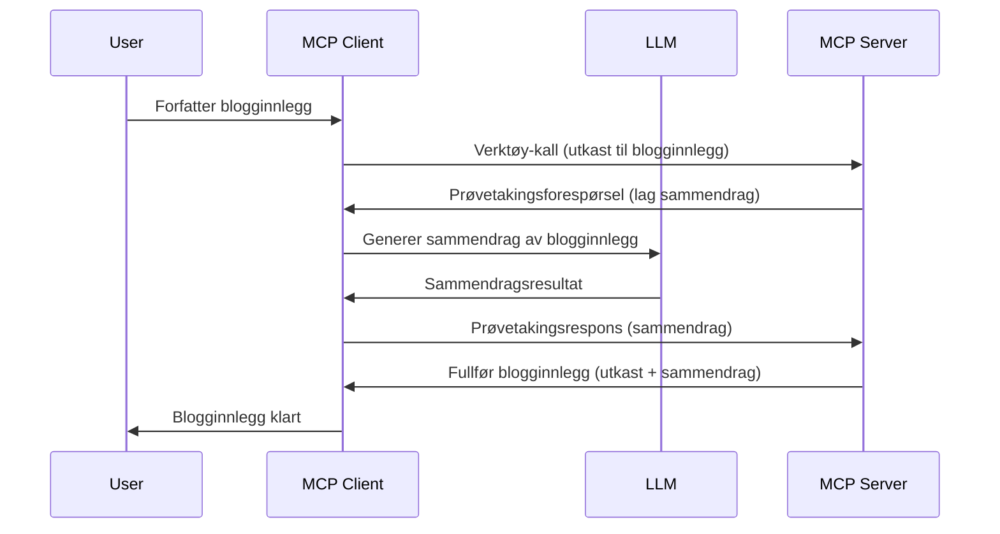

# Sampling - delegere funksjoner til klienten

Noen ganger trenger MCP-klienten og MCP-serveren å samarbeide for å oppnå et felles mål. Du kan ha en situasjon der serveren trenger hjelp fra en LLM som befinner seg på klienten. For denne situasjonen er sampling det du bør bruke.

La oss utforske noen brukstilfeller og hvordan bygge en løsning som involverer sampling.

## Oversikt

I denne leksjonen fokuserer vi på å forklare når og hvor man skal bruke Sampling og hvordan konfigurere det.

## Læringsmål

I dette kapitlet vil vi:

- Forklare hva Sampling er og når det skal brukes.
- Vise hvordan sette opp Sampling i MCP.
- Gi eksempler på Sampling i praksis.

## Hva er Sampling og hvorfor bruke det?

Sampling er en avansert funksjon som fungerer på følgende måte:



### Sampling-forespørsel

Ok, nå som vi har et overblikk over et troverdig scenario, la oss snakke om sampling-forespørselen serveren sender tilbake til klienten. Slik kan en slik forespørsel se ut i JSON-RPC-format:

```json
{
  "jsonrpc": "2.0",
  "id": 1,
  "method": "sampling/createMessage",
  "params": {
    "messages": [
      {
        "role": "user",
        "content": {
          "type": "text",
          "text": "Create a blog post summary of the following blog post: <BLOG POST>"
        }
      }
    ],
    "modelPreferences": {
      "hints": [
        {
          "name": "claude-3-sonnet"
        }
      ],
      "intelligencePriority": 0.8,
      "speedPriority": 0.5
    },
    "systemPrompt": "You are a helpful assistant.",
    "maxTokens": 100
  }
}
```

Det er noen ting her som er verdt å påpeke:

- Prompt, under content -> text, er vår prompt, som er en instruksjon til LLM om å oppsummere innholdet i et blogginnlegg.

- **modelPreferences**. Denne delen er akkurat det, en preferanse, en anbefaling på hvilken konfigurasjon man bør bruke med LLM. Brukeren kan velge å følge disse anbefalingene eller endre dem. I dette tilfellet er det anbefalinger på hvilken modell som skal brukes og prioritering av hastighet og intelligens.
- **systemPrompt**, dette er din vanlige systemprompt som gir LLM en personlighet og inneholder veiledende instrukser.
- **maxTokens**, dette er en annen egenskap som brukes for å angi hvor mange tokens som anbefales å bruke for denne oppgaven.

### Sampling-respons

Denne responsen er det MCP-klienten ender opp med å sende tilbake til MCP-serveren, og er resultatet av at klienten kaller LLM, venter på svaret og deretter konstruerer denne meldingen. Slik kan den se ut i JSON-RPC:

```json
{
  "jsonrpc": "2.0",
  "id": 1,
  "result": {
    "role": "assistant",
    "content": {
      "type": "text",
      "text": "Here's your abstract <ABSTRACT>"
    },
    "model": "gpt-5",
    "stopReason": "endTurn"
  }
}
```

Legg merke til at responsen er et sammendrag av blogginnlegget akkurat som vi ba om. Legg også merke til at den brukte `model` ikke er den vi ba om, men "gpt-5" i stedet for "claude-3-sonnet". Dette illustrerer at brukeren kan ombestemme seg på hva som skal brukes og at din sampling-forespørsel er en anbefaling.

Ok, nå som vi forstår hovedflyten og en nyttig oppgave å bruke det til "blogginnleggsskapning + sammendrag", la oss se hva vi må gjøre for å få det til å fungere.

### Meldings-typer

Sampling-meldinger er ikke begrenset til bare tekst, men du kan også sende bilder og lyd. Slik ser JSON-RPC forskjellig ut:

**Tekst**

```json
{
  "type": "text",
  "text": "The message content"
}
```

**Bildeinnhold**

```json
{
  "type": "image",
  "data": "base64-encoded-image-data",
  "mimeType": "image/jpeg"
}
```

**Lydinnhold**

```json
{
  "type": "audio",
  "data": "base64-encoded-audio-data",
  "mimeType": "audio/wav"
}
```

> NOTE: for mer detaljer om Sampling, sjekk ut de [offisielle dokumentene](https://modelcontextprotocol.io/specification/2025-11-25/client/sampling)

## Hvordan konfigurere Sampling i klienten

> Merk: hvis du bare bygger en server, trenger du ikke gjøre mye her.

I en klient må du spesifisere følgende funksjon slik:

```json
{
  "capabilities": {
    "sampling": {}
  }
}
```

Dette vil da bli plukket opp når din valgte klient initialiserer med serveren.

## Eksempel på Sampling i praksis - Lage et blogginnlegg

La oss kode en sampling-server sammen, vi må gjøre følgende:

1. Lage et verktøy på serveren.
1. Dette verktøyet skal lage en sampling-forespørsel.
1. Verktøyet skal vente på at klientens sampling-forespørsel blir besvart.
1. Så skal resultatet fra verktøyet produseres.

La oss se på koden steg for steg:

### -1- Lag verktøyet

**python**

```python
@mcp.tool()
async def create_blog(title: str, content: str, ctx: Context[ServerSession, None]) -> str:
    """Create a blog post and generate a summary"""

```

### -2- Lag en sampling-forespørsel

Utvid verktøyet ditt med følgende kode:

**python**

```python
post = BlogPost(
        id=len(posts) + 1,
        title=title,
        content=content,
        abstract=""
    )

prompt = f"Create an abstract of the following blog post: title: {title} and draft: {content} "

result = await ctx.session.create_message(
        messages=[
            SamplingMessage(
                role="user",
                content=TextContent(type="text", text=prompt),
            )
        ],
        max_tokens=100,
)

```

### -3- Vent på responsen og returner den

**python**

```python
post.abstract = result.content.text

posts.append(post)

# returner hele produktet
return json.dumps({
    "id": post.title,
    "abstract": post.abstract
})
```

### -4- Fullstendig kode

**python**

```python
from starlette.applications import Starlette
from starlette.routing import Mount, Host

from mcp.server.fastmcp import Context, FastMCP

from mcp.server.session import ServerSession
from mcp.types import SamplingMessage, TextContent

import json


from uuid import uuid4
from typing import List
from pydantic import BaseModel


mcp = FastMCP("Blog post generator")

# app = FastAPI()

posts = []

class BlogPost(BaseModel):
    id: int
    title: str
    content: str
    abstract: str

posts: List[BlogPost] = []

@mcp.tool()
async def create_blog(title: str, content: str, ctx: Context[ServerSession, None]) -> str:
    """Create a blog post and generate a summary"""

    post = BlogPost(
        id=len(posts) + 1,
        title=title,
        content=content,
        abstract=""
    )

    prompt = f"Create an abstract of the following blog post: title: {title} and draft: {content} "

    result = await ctx.session.create_message(
        messages=[
            SamplingMessage(
                role="user",
                content=TextContent(type="text", text=prompt),
            )
        ],
        max_tokens=100,
    )

    post.abstract = result.content.text

    posts.append(post)

    # returner hele blogginnlegget
    return json.dumps({
        "id": post.title,
        "abstract": post.abstract
    })

if __name__ == "__main__":
    print("Starting server...")
    # mcp.run()
    mcp.run(transport="streamable-http")

# kjør app med: python server.py
```

### -5- Teste det i Visual Studio Code

For å teste dette i Visual Studio Code, gjør følgende:

1. Start serveren i terminalen
1. Legg det til i *mcp.json* (og sørg for at den er startet) f.eks. slik:

   ```json
   "servers": {
      "blog-server": {
        "type": "http",
        "url": "http://localhost:8000/mcp"
      }
   }
   ```

1. Skriv en prompt:

   ```text
   create a blog post named "Where Python comes from", the content is "Python is actually named after Monty Python Flying Circus"
   ```

1. Tillat sampling å skje. Første gang du tester dette vil du bli presentert for en ekstra dialog som du må godta, deretter vil du se den vanlige dialogen for å be deg kjøre et verktøy.

1. Undersøk resultatene. Du vil se resultatene både pent gjengitt i GitHub Copilot Chat, men du kan også inspisere den rå JSON-responsen.

**Bonus**. Verktøy for Visual Studio Code har god støtte for sampling. Du kan konfigurere Sampling-tilgang på din installerte server ved å navigere slik:

1. Gå til utvidelses-delen.
1. Velg tannhjul-ikonet for din installerte server i seksjonen "MCP SERVERS - INSTALLED".
1 Velg "Configure Model Access", her kan du velge hvilke modeller GitHub Copilot kan bruke ved sampling. Du kan også se alle sampling-forespørsler som har skjedd nylig ved å velge "Show Sampling requests".

## Oppgave

I denne oppgaven skal du bygge en litt annerledes Sampling, nemlig en sampling-integrasjon som støtter generering av en produktbeskrivelse. Her er ditt scenario:

**Scenario**: Bak-kontor-ansatt hos en nettbutikk trenger hjelp, det tar altfor lang tid å generere produktbeskrivelser. Derfor skal du lage en løsning der du kan kalle et verktøy "create_product" med "title" og "keywords" som argumenter, og det skal produsere et komplett produkt inkludert et "description"-felt som skal fylles ut av en LLM på klienten.

TIP: bruk det du lærte tidligere for å konstruere denne serveren og verktøyet med en sampling-forespørsel.

## Løsning

[Løsning](./solution/README.md)

## Viktige punkter

Sampling er en kraftfull funksjon som lar serveren delegere oppgaver til klienten når den trenger hjelp av en LLM.

## Hva nå

- [Kapittel 4 - Praktisk implementering](../../04-PracticalImplementation/README.md)

---

<!-- CO-OP TRANSLATOR DISCLAIMER START -->
**Ansvarsfraskrivelse**:
Dette dokumentet er oversatt ved hjelp av AI-oversettelsestjenesten [Co-op Translator](https://github.com/Azure/co-op-translator). Selv om vi streber etter nøyaktighet, vær oppmerksom på at automatiske oversettelser kan inneholde feil eller unøyaktigheter. Det opprinnelige dokumentet på originalspråket skal betraktes som den autoritative kilden. For kritisk informasjon anbefales profesjonell menneskelig oversettelse. Vi er ikke ansvarlige for eventuelle misforståelser eller feiltolkninger som oppstår ved bruk av denne oversettelsen.
<!-- CO-OP TRANSLATOR DISCLAIMER END -->