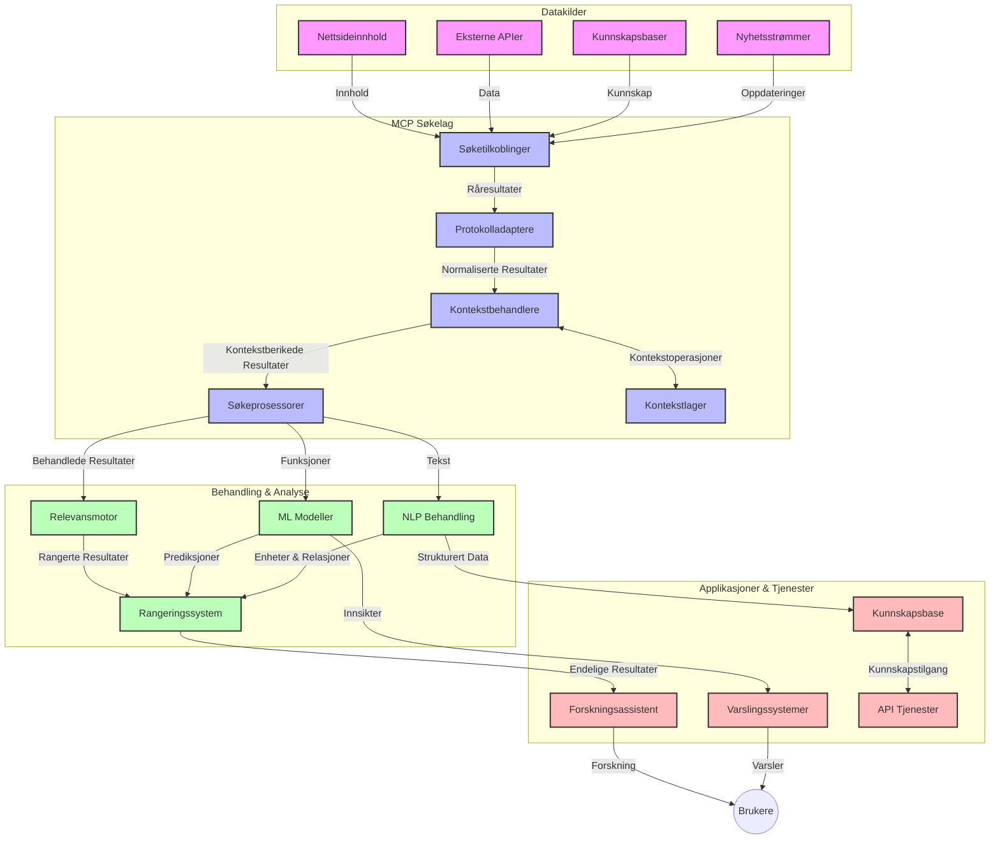
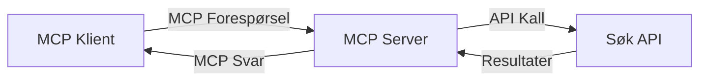
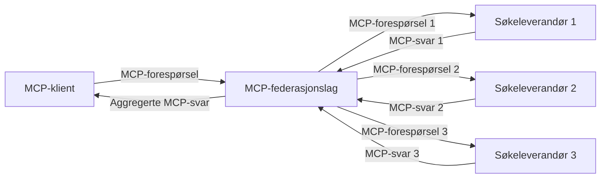
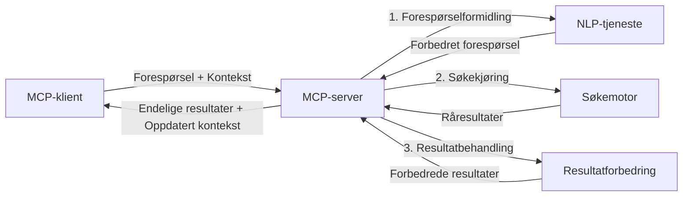

# Modellkontekstprotokoll for sanntidssøk på nettet

## Oversikt

Sanntidssøk på nettet har blitt essensielt i dagens informasjonsdrevne miljø, hvor applikasjoner trenger umiddelbar tilgang til oppdatert informasjon på tvers av internett for å gi relevante og tidsriktige svar. Modellkontekstprotokollen (MCP) representerer et betydelig fremskritt i optimalisering av disse sanntidssøksprosessene, forbedrer søkeeffektiviteten, opprettholder kontekstuell integritet og forbedrer den samlede systemytelsen.

Denne modulen utforsker hvordan MCP transformer sanntidssøk på nettet ved å tilby en standardisert tilnærming til kontekststyring på tvers av AI-modeller, søkemotorer og applikasjoner.

### Hva du vil lære

I denne omfattende guiden vil du oppdage:

- Hvordan MCP skaper en sømløs bro mellom AI-modeller og sanntidssøk på nettet
- Arkitekturmønstre for å implementere effektive og skalerbare søkeløsninger med MCP
- Teknikker for å bevare søkekontekst på tvers av flere forespørsler og interaksjoner
- Praktiske kodeimplementeringer i Python og JavaScript for ulike søkscenarier
- Metoder for å balansere relevans, aktualitet og ytelse i MCP-drevne søkesystemer

## Introduksjon til sanntidssøk på nettet

Sanntidssøk på nettet er en teknologisk tilnærming som muliggjør kontinuerlig spørring, behandling og analyse av webbasert informasjon etter hvert som den publiseres eller oppdateres, som lar systemer levere fersk og relevant informasjon med minimal forsinkelse. I motsetning til tradisjonelle søkesystemer som opererer på indeksert data som kan være timer eller dager gammel, prosesserer sanntidssøk levende data fra weben og leverer innsikt og informasjon som reflekterer den nåværende tilstanden til innhold på nettet.

### Kjernbegreper i sanntidssøk på nettet:

- **Kontinuerlig spørringsbehandling**: Søkeforespørsler behandles mot stadig oppdaterte datakilder
- **Prioritering av aktualitet**: Systemer er designet for å prioritere fersk informasjon
- **Balansere relevans**: Opprettholde en balanse mellom relevans og aktualitet
- **Skalerbar arkitektur**: Systemer må håndtere variable spørringsmengder og datavolumer
- **Kontekstuell forståelse**: Opprettholde brukerkontekst over søkeiterasjoner er avgjørende for meningsfulle resultater
- **Dynamisk spørringsreformulering**: Adaptiv endring av spørringer basert på kontekst og tidligere resultater
- **Integrasjon av flere kilder**: Kombinere resultater fra flere søkeleverandører og nett-kilder
- **Semantisk forståelse**: Behandle spørringer og innhold basert på mening fremfor bare nøkkelord
- **Sanntidsrangering**: Kontinuerlig justering av resultatrangering etter hvert som ny informasjon blir tilgjengelig

### Modellkontekstprotokollen og sanntidssøk på nettet

Modellkontekstprotokollen (MCP) tar for seg flere kritiske utfordringer i sanntidssøk-miljøer:

1. **Bevaring av søkekontekst**: MCP standardiserer hvordan kontekst opprettholdes på tvers av distribuerte søkekomponenter, for å sikre at AI-modeller og behandlingsnoder har tilgang til relevant spørringshistorikk og brukerpreferanser.

2. **Effektiv spørringshåndtering**: Ved å tilby strukturerte mekanismer for kontekstoverføring, reduserer MCP overhead ved å unngå gjentatt kontekst i hver søkeiterasjon.

3. **Interoperabilitet**: MCP skaper et felles språk for kontekstdeling mellom ulike søketeknologier og AI-modeller, som muliggjør mer fleksible og utvidbare arkitekturer.

4. **Søk-optimert kontekst**: MCP-implementasjoner kan prioritere hvilke kontekstelementer som er mest relevante for effektivt søk, og optimaliserer både for ytelse og nøyaktighet.

5. **Adaptiv søkebehandling**: Med riktig kontekststyring gjennom MCP kan søkesystemer dynamisk tilpasse behandlingen basert på utviklende brukerbehov og informasjon.

I moderne applikasjoner, fra nyhetsaggregatorer til forskningsassistenter, gjør integrasjonen av MCP med søketeknologier på nettet det mulig med mer intelligente, kontekstbevisste søk som kan levere stadig mer relevante resultater etter hvert som brukerinteraksjoner fortsetter.

## Læringsmål

Ved slutten av denne leksjonen vil du kunne:

- Forstå grunnprinsippene for sanntidssøk på nettet og utfordringene i moderne applikasjoner
- Forklare hvordan Modellkontekstprotokollen (MCP) forbedrer sanntidssøk på nettet
- Implementere MCP-baserte søkeløsninger ved hjelp av populære rammeverk og API-er
- Designe og distribuere skalerbare, høyytelses søkearkitekturer med MCP
- Anvende MCP-konsepter på ulike bruksområder inkludert semantisk søk, forskningsassistanse og AI-forsterket surfing
- Evaluere fremvoksende trender og fremtidige innovasjoner i MCP-baserte søketeknologier
- Utvikle kontekstbevisste søkesystemer som lærer av brukerinteraksjoner
- Integrere søkemuligheter på nettet i AI-assistenter ved bruk av standardiserte MCP-protokoller
- Skape flertrinns søkepipelines som gradvis forbedrer resultater basert på kontekst
- Optimalisere søkeytelse samtidig som full kontekstbevissthet opprettholdes

### Definisjon og betydning

Sanntidssøk på nettet innebærer kontinuerlig spørring, henting og levering av webbasert informasjon med minimal forsinkelse. I motsetning til tradisjonelle søkemotorer som periodisk gjennomsøker og indekserer nettet, søker sanntidssøk å synliggjøre informasjon etter hvert som den blir tilgjengelig, noe som muliggjør umiddelbar tilgang til det mest aktuelle innholdet.

Nøkkeltrekk ved sanntidssøk på nettet inkluderer:

- **Ferskhet**: Prioritering av nylig innhold og oppdateringer
- **Kontinuerlig prosessering**: Konstant overvåking etter ny informasjon
- **Spørringstilpasning**: Forfining av søkespørringer basert på kontekst og tilbakemelding
- **Umiddelbar levering**: Å levere søkeresultater med minimal forsinkelse
- **Kontekstbevaring**: Bygge videre på tidligere spørringer for forbedret relevans

### Utfordringer i tradisjonelt nettsøk

Tradisjonelle tilnærminger til nettsøk møter flere begrensninger når de anvendes i sanntidsscenarier:

1. **Kontekstfragmentering**: Vanskeligheter med å opprettholde søkekontekst over flere spørringer
2. **Informasjonsferskhet**: Vansker med å få tilgang til og prioritere den mest oppdaterte informasjonen
3. **Integrasjonskompleksitet**: Problemer med interoperabilitet mellom søkesystemer og applikasjoner
4. **Forsinkelsesproblemer**: Å balansere omfattende søk med responstidskrav
5. **Justering av relevans**: Sikre nøyaktighet og relevans mens aktualitet prioriteres

## Forstå Modellkontekstprotokollen (MCP) for søk

### Hva er MCP i søkekontekster?

Modellkontekstprotokollen (MCP) er en standardisert kommunikasjonsprotokoll designet for å lette effektiv interaksjon mellom AI-modeller og applikasjoner. I konteksten av sanntidssøk på nettet, gir MCP en ramme for:

- Å bevare søkekontekst gjennom spørringssekvenser
- Standardisere søkespørrings- og resultatformater
- Optimalisere overføring av søkeparametere og resultater
- Forbedre kommunikasjon mellom modell og søkemotor

### Kjernekomponenter og arkitektur

MCP-arkitekturen for sanntidssøk på nettet består av flere viktige komponenter:

1. **Kontekstbehandlere for spørringer**: Administrerer og opprettholder søkekontekst på tvers av flere spørringer
2. **Søkeprosessorer**: Behandler innkommende søkebestillinger ved hjelp av kontekstbevisste teknikker
3. **Protokolladaptere**: Konverterer mellom forskjellige søke-APIer samtidig som kontekst bevares
4. **Kontekstlager**: Lagrer og henter effektivt søkehistorikk og preferanser
5. **Søketilkoblinger**: Knytter til ulike søkemotorer og web-APIer



### Hvordan MCP forbedrer sanntidssøk på nettet

MCP tar opp tradisjonelle utfordringer i nettsøk gjennom:

- **Kontekstuelt kontinuitet**: Opprettholder relasjoner mellom spørringer gjennom hele søkesesjonen
- **Optimalisert overføring**: Reduserer overflødighet i søkeparametere gjennom intelligent kontekststyring
- **Standardiserte grensesnitt**: Tilbyr konsistente APIer for søkekomponenter
- **Redusert forsinkelse**: Minimerer behandlingskostnader gjennom effektiv konteksthåndtering
- **Forbedret relevans**: Øker søkets relevans ved å bevare brukerintensjonen over flere spørringer

## Integrasjon og implementering

Sanntidssøkesystemer krever nøye arkitekturdesign og implementering for å opprettholde både ytelse og kontekstuell integritet. Modellkontekstprotokollen tilbyr en standardisert tilnærming til integrasjon av AI-modeller og søketeknologier, som tillater mer sofistikerte, kontekstbevisste søkepipelines.

### Oversikt over MCP-integrasjon i søkearkitekturer

Implementering av MCP i sanntidssøk-miljøer innebærer flere viktige hensyn:

1. **Serialisering av søkekontekst**: MCP tilbyr effektive mekanismer for koding av kontekstuell informasjon i søkebestillinger, slik at essensiell kontekst følger spørringen gjennom hele behandlingskjeden. Dette inkluderer standardiserte serialiseringsformater optimalisert for søkerelatert metadata.

2. **Tilstandshåndtert søkebehandling**: MCP muliggjør mer intelligent tilstandshåndtering ved å opprettholde konsistent kontekstrepresentasjon over søkeiterasjoner. Dette er særlig verdifullt i flertrinns søkepipelines hvor kontekstforfining forbedrer resultater.

3. **Spørringsutvidelse og -forfining**: MCP-implementasjoner i søkesystemer kan legge til rette for sofistikert utvidelse og forfining av spørringer basert på akkumulert kontekst, som gir stadig mer relevante resultater etter hvert som søkesesjonen skrider frem.

4. **Resultatcaching og prioritering**: Ved å standardisere kontekststyring hjelper MCP med å håndtere caching og prioritering av resultater, slik at komponenter kan tilpasse seg den utviklende søkekonteksten.

5. **Søkefederasjon og -aggregering**: MCP muliggjør mer avansert føderering av søk på tvers av flere backend-systemer ved å tilby strukturerte representasjoner av søkekontekst, som tillater meningsfull aggregering av resultater fra ulike kilder.

Implementeringen av MCP på tvers av ulike søketeknologier skaper en enhetlig tilnærming til kontekststyring, reduserer behovet for egendefinert integrasjonskode samtidig som systemets evne til å opprettholde meningsfull kontekst når søkespørringer utvikler seg, forbedres.

### MCP i ulike implementasjoner av nettsøk

Disse eksemplene følger gjeldende MCP-spesifikasjon som fokuserer på en JSON-RPC-basert protokoll med distinkte transportmekanismer. Koden demonstrerer hvordan du kan implementere egendefinerte søkintegrasjoner samtidig som full kompatibilitet med MCP-protokollen opprettholdes.


<details>
<summary>Python-implementering med generell søke-API</summary>

```python
import asyncio
import json
import aiohttp
from typing import Dict, Any, Optional, List
from contextlib import asynccontextmanager
from collections.abc import AsyncIterator

# Importer standard MCP-biblioteker
from mcp.client.session import ClientSession
from mcp.client.streamable_http import streamablehttp_client
from mcp.types import TextContent, CreateMessageRequestParams, CreateMessageResult
from mcp.server.fastmcp import FastMCP

# Opprett en FastMCP-server for nettsøk
search_server = FastMCP("WebSearch")

# Klasse for å håndtere nettsøksoperasjoner
class WebSearchHandler:
    def __init__(self, api_endpoint: str, api_key: str):
        self.api_endpoint = api_endpoint
        self.api_key = api_key
        self.session = None
        
    async def initialize(self):
        """Initialize the HTTP session"""
        self.session = aiohttp.ClientSession(
            headers={"Authorization": f"Bearer {self.api_key}"}
        )
    
    async def close(self):
        """Close the HTTP session"""
        if self.session:
            await self.session.close()
            
    async def perform_search(self, query: str, max_results: int = 5, 
                           include_domains: List[str] = None, 
                           exclude_domains: List[str] = None,
                           time_period: str = "any") -> Dict[str, Any]:
        """Perform web search using the search API"""
        # Konstruer søkeparametere
        search_params = {
            "q": query,
            "limit": max_results,
            "time": time_period
        }
        
        if include_domains:
            search_params["site"] = ",".join(include_domains)
            
        if exclude_domains:
            search_params["exclude_site"] = ",".join(exclude_domains)
        
        # Utfør søkeforespørselen
        try:
            async with self.session.get(
                self.api_endpoint,
                params=search_params
            ) as response:
                if response.status != 200:
                    error_text = await response.text()
                    raise Exception(f"Search API error: {response.status} - {error_text}")
                
                search_data = await response.json()
                
                # Konverter API-spesifikt svar til et standardformat
                results = []
                for item in search_data.get("results", []):
                    results.append({
                        "title": item.get("title", ""),
                        "url": item.get("url", ""),
                        "snippet": item.get("snippet", ""),
                        "date": item.get("published_date", ""),
                        "source": item.get("source", "")
                    })
                
                return {
                    "query": query,
                    "totalResults": len(results),
                    "results": results
                }
        except Exception as e:
            print(f"Search API request error: {e}")
            raise

# Initialiser søkehåndtereren
search_handler = WebSearchHandler(
    api_endpoint="https://api.search-service.example/search",
    api_key="your-api-key-here"
)

# Sett opp livssyklus for å administrere søkehåndtereren
@asyncio.asynccontextmanager
async def app_lifespan(server: FastMCP):
    """Manage application lifecycle"""
    await search_handler.initialize()
    try:
        yield {"search_handler": search_handler}
    finally:
        await search_handler.close()

# Sett livssyklus for serveren
search_server = FastMCP("WebSearch", lifespan=app_lifespan)

# Registrer et nettsøkverktøy
@search_server.tool()
async def web_search(query: str, max_results: int = 5, 
                   include_domains: List[str] = None,
                   exclude_domains: List[str] = None,
                   time_period: str = "any") -> Dict[str, Any]:
    """
    Search the web for information
    
    Args:
        query: The search query
        max_results: Maximum number of results to return (default: 5)
        include_domains: List of domains to include in search results
        exclude_domains: List of domains to exclude from search results
        time_period: Time period for results ("day", "week", "month", "any")
        
    Returns:
        Dictionary containing search results
    """
    ctx = search_server.get_context()
    search_handler = ctx.request_context.lifespan_context["search_handler"]
    
    results = await search_handler.perform_search(
        query=query,
        max_results=max_results,
        include_domains=include_domains,
        exclude_domains=exclude_domains,
        time_period=time_period
    )
    
    return results

# Eksempel på klientbruk
async def client_example():
    # Koble til søkeserveren ved bruk av streambar HTTP-transport
    async with streamablehttp_client("http://localhost:8000/mcp") as (read, write, _):
        async with ClientSession(read, write) as session:
            # Initialiser tilkoblingen
            await session.initialize()
            
            # Kall på web_search-verktøyet
            search_results = await session.call_tool(
                "web_search", 
                {
                    "query": "latest developments in AI and Model Context Protocol",
                    "max_results": 5,
                    "time_period": "day",
                    "include_domains": ["github.com", "microsoft.com"]
                }
            )
            
            print(f"Search results: {search_results}")

# Serverkjøringseksempel
if __name__ == "__main__":
    # Kjør serveren med streambar HTTP-transport
    search_server.run(transport="streamable-http")
```
</details> 

<details>
<summary>JavaScript-implementering med nettleserbasert søk</summary>


```javascript
// MCP-serverimplementering for nettsøk
import { McpServer, ResourceTemplate } from '@modelcontextprotocol/sdk/server/mcp.js';
import { StreamableHTTPServerTransport } from '@modelcontextprotocol/sdk/server/streamableHttp.js';
import { z } from 'zod';

// Opprett en MCP-server for nettsøk
const searchServer = new McpServer({
    name: "BrowserSearch",
    description: "A server that provides web search capabilities"
});

// Søketjenesteklasse
class SearchService {
    constructor(searchApiUrl, apiKey) {
        this.searchApiUrl = searchApiUrl;
        this.apiKey = apiKey;
    }

    async performSearch(parameters) {
        const {
            query = '',
            maxResults = 5,
            includeDomains = [],
            excludeDomains = [],
            timePeriod = 'any'
        } = parameters;
        
        // Konstruer søke-URL med parametere
        const url = new URL(this.searchApiUrl);
        url.searchParams.append('q', query);
        url.searchParams.append('limit', maxResults);
        url.searchParams.append('time', timePeriod);
        
        if (includeDomains.length > 0) {
            url.searchParams.append('site', includeDomains.join(','));
        }
        
        if (excludeDomains.length > 0) {
            url.searchParams.append('exclude_site', excludeDomains.join(','));
        }
        
        try {
            const response = await fetch(url.toString(), {
                method: 'GET',
                headers: {
                    'Authorization': `Bearer ${this.apiKey}`,
                    'Content-Type': 'application/json'
                }
            });
            
            if (!response.ok) {
                const errorText = await response.text();
                throw new Error(`Search API error: ${response.status} - ${errorText}`);
            }
            
            const searchData = await response.json();
            
            // Konverter API-spesifikt svar til et standardformat
            const results = searchData.results?.map(item => ({
                title: item.title || '',
                url: item.url || '',
                snippet: item.snippet || '',
                date: item.published_date || '',
                source: item.source || ''
            })) || [];
            
            return {
                query,
                totalResults: results.length,
                results
            };
        } catch (error) {
            console.error('Search API request error:', error);
            throw error;
        }
    }
}

// Initialiser søketjenesten
const searchService = new SearchService(
    'https://api.search-service.example/search',
    'your-api-key-here'
);

// Sett opp kontekstleverandøren for serveren
searchServer.setContextProvider(() => {
    return {
        searchService
    };
});

// Registrer nettsøkverktøy
searchServer.tool({
    name: 'web_search',
    description: 'Search the web for information',
    parameters: {
        type: 'object',
        properties: {
            query: {
                type: 'string',
                description: 'The search query'
            },
            maxResults: {
                type: 'integer',
                description: 'Maximum number of results to return',
                default: 5
            },
            includeDomains: {
                type: 'array',
                items: { type: 'string' },
                description: 'List of domains to include in search results'
            },
            excludeDomains: {
                type: 'array',
                items: { type: 'string' },
                description: 'List of domains to exclude from search results'
            },
            timePeriod: {
                type: 'string',
                description: 'Time period for results',
                enum: ['day', 'week', 'month', 'any'],
                default: 'any'
            }
        },
        required: ['query']
    },
    handler: async (params, context) => {
        const { searchService } = context;
        return await searchService.performSearch(params);
    }
});

// Eksempelkode for klient for å koble til søkeserver
import { Client } from '@modelcontextprotocol/sdk/client/index.js';
import { StreamableHTTPClientTransport } from '@modelcontextprotocol/sdk/client/streamableHttp.js';

async function connectToSearchServer() {
    // Koble til søkeserver
    const transport = new StreamableHTTPClientTransport(
        new URL('http://localhost:8000/mcp')
    );
    
    const client = new Client({
        name: 'search-client',
        version: '1.0.0'
    });
    
    await client.connect(transport);
    
    // Utfør søkeverktøyet
    const searchResults = await client.callTool({
        name: 'web_search',
        arguments: {
            query: 'Model Context Protocol implementation examples',
            maxResults: 10,
            timePeriod: 'week',
            includeDomains: ['github.com', 'docs.microsoft.com']
        }
    });
    
    console.log('Search results:', searchResults);
    
    // Rydd opp
    await client.disconnect();
}

// Start serveren
const transport = new StreamableHTTPServerTransport();
await searchServer.connect(transport);
console.log('Search server running at http://localhost:8000/mcp');

// I en egen prosess eller etter serveren er startet
// connectToSearchServer().catch(console.error);
```
</details> 


## Ansvarsfraskrivelse for kodeeksempler

> **Viktig merknad**: Kodeeksemplene nedenfor demonstrerer integrasjon av Modellkontekstprotokollen (MCP) med nettsøkfunksjonalitet. Selv om de følger mønstre og strukturer fra de offisielle MCP-SDKene, er de forenklet for pedagogiske formål.
> 
> Disse eksemplene viser:
> 
> 1. **Python-implementering**: En FastMCP-serverimplementering som tilbyr et nettsøk-verktøy og kobler til en ekstern søke-API. Dette eksempelet demonstrerer riktig levetidshåndtering, kontekstbehandling og verktøyimplementering i henhold til mønstrene i [offisiell MCP Python SDK](https://github.com/modelcontextprotocol/python-sdk). Serveren benytter anbefalt Streamable HTTP-transport som har erstattet eldre SSE-transport for produksjonsdistribusjoner.
> 
> 2. **JavaScript-implementering**: En TypeScript/JavaScript-implementering ved bruk av FastMCP-mønsteret fra [offisiell MCP TypeScript SDK](https://github.com/modelcontextprotocol/typescript-sdk) for å lage en søke-server med korrekte verktøydefinisjoner og klienttilkoblinger. Den følger de nyeste anbefalte mønstrene for sesjonshåndtering og kontekstbevaring.
> 
> Disse eksemplene vil kreve ytterligere feilhåndtering, autentisering og spesifikk API-integrasjonskode for produksjonsbruk. Søke-API-endepunktene som vises (`https://api.search-service.example/search`) er plassholdere og må erstattes med faktiske endepunkter for søketjenester.
> 
> For fullstendige implementeringsdetaljer og de mest oppdaterte tilnærmingene, vennligst se [offisiell MCP-spesifikasjon](https://spec.modelcontextprotocol.io/) og SDK-dokumentasjon.

## Kjernkonsepter

### Modellkontekstprotokoll-rammeverket (MCP)

I sin kjerne tilbyr Modellkontekstprotokollen en standardisert måte for AI-modeller, applikasjoner og tjenester å utveksle kontekst på. I sanntidssøk på nettet er dette rammeverket essensielt for å skape koherente, fler-trinns søkeopplevelser. Nøkkelkomponenter inkluderer:

1. **Klient-server-arkitektur**: MCP etablerer en tydelig separasjon mellom søkeklienter (forespørrere) og søkeservere (leverandører), noe som muliggjør fleksible distribusjonsmodeller.

2. **JSON-RPC-kommunikasjon**: Protokollen bruker JSON-RPC for meldingsutveksling, noe som gjør den kompatibel med webteknologier og enkel å implementere på tvers av plattformer.

3. **Kontekststyring**: MCP definerer strukturerte metoder for å opprettholde, oppdatere og utnytte søkekontekst over flere interaksjoner.

4. **Verktøydefinisjoner**: Søkemuligheter eksponeres som standardiserte verktøy med veldefinerte parametere og returverdier.

5. **Støtte for streaming**: Protokollen støtter strømming av resultater, noe som er essensielt for sanntidssøk hvor resultater kan komme gradvis.

### Integrasjonsmønstre for nettsøk

Når MCP integreres med nettsøk, oppstår flere mønstre:

#### 1. Direkt integrasjon med søkeleverandør



I dette mønsteret kobler MCP-serveren direkte til en eller flere søke-APIer, oversetter MCP-forespørsler til API-spesifikke kall og formaterer resultatene som MCP-svar.

#### 2. Føderert søk med kontekstbevaring



Dette mønsteret distribuerer søkespørringer til flere MCP-kompatible søkeleverandører, hvor hver kan spesialisere seg på forskjellige typer innhold eller søkemuligheter, samtidig som en samlet kontekst opprettholdes.

#### 3. Kontekstforsterket søkekjede



I dette mønsteret deles søkeprosessen i flere trinn, der kontekst berikes i hvert steg, og resulterer i gradvis mer relevante resultater.

### Søkekontekstkomponenter

I MCP-basert nettsøk inkluderer kontekst vanligvis:

- **Spørringshistorikk**: Tidligere søkespørringer i økten
- **Brukerpreferanser**: Språk, region, innebygd filtrering for sikker søk
- **Interaksjonshistorikk**: Hvilke resultater som ble klikket, tid brukt på resultater
- **Søkeparametere**: Filtre, sorteringer og andre søkemodifikatorer
- **Domene-kunnskap**: Emnespesifikk kontekst relevant for søket
- **Temporal kontekst**: Tidsbaserte relevansfaktorer
- **Kildepreferanser**: Foretrukne eller pålitelige informasjonskilder

## Bruksområder og anvendelser

### Forskning og informasjonsinnsamling

MCP forbedrer forskningsarbeidsflyter ved å:

- Bevare forskningskontekst over søkesesjoner
- Muliggjøre mer sofistikerte og kontekstuell relevante spørringer
- Støtte flerkilde-søkeføderasjon
- Legge til rette for kunnskapsutvinning fra søkeresultater

### Sanntids nyhets- og trendovervåking

MCP-drevet søk gir fordeler for nyhetsovervåking:

- Nesten sanntidsoppdagelse av fremvoksende nyhetssaker
- Kontekstuell filtrering av relevant informasjon
- Oppfølging av temaer og entiteter på tvers av flere kilder
- Personlige nyhetsvarsler basert på brukerkontekst

### AI-forsterket surfing og forskning

MCP skaper nye muligheter for AI-forsterket surfing:

- Kontekstuelle søkeforslag basert på nåværende nettleseraktivitet
- Sømløs integrasjon av nettsøk med LLM-drevne assistenter
- Flertrinns søkeforfining med opprettholdt kontekst
- Forbedret faktasjekk og informasjonsverifisering

## Fremtidige trender og innovasjoner

### Utvikling av MCP i nettsøk

Når vi ser fremover, forventer vi at MCP vil utvikle seg for å adressere:
- **Multimodal Søk**: Integrering av tekst-, bilde-, lyd- og videosøk med bevart kontekst  
- **Desentralisert Søk**: Støtte for distribuerte og fødererte søkøkosystemer  
- **Søke Personvern**: Kontekstbevisste personvernbevarende søkemekanismer  
- **Forespørselsforståelse**: Dyp semantisk parsing av naturlige språk søkespørringer  

### Potensielle Fremtidige Teknologiske Fremskritt

Fremvoksende teknologier som vil forme fremtiden for MCP-søk:  

1. **Nevrale Søkearkitekturer**: Innebygde søkesystemer optimalisert for MCP  
2. **Personlig Søkkontekst**: Læring av individuelle brukerens søkemønstre over tid  
3. **Integrering av Kunnskapsgraf**: Kontekstsøk forbedret med domene-spesifikke kunnskapsgrafer  
4. **Tverrmodale Kontekster**: Opprettholde kontekst på tvers av forskjellige søkemodaliteter  

## Praktiske Øvelser

### Øvelse 1: Sette Opp en Grunnleggende MCP-Søke-pipeline

I denne øvelsen lærer du hvordan du:  
- Konfigurerer et grunnleggende MCP-søkemiljø  
- Implementerer kontekst-håndterere for nettsøk  
- Tester og validerer kontekstbevaring over søkeiterasjoner  

### Øvelse 2: Bygge en Forskningsassistent med MCP-Søk

Lag en komplett applikasjon som:  
- Behandler forskningsspørsmål i naturlig språk  
- Utfører kontekstbevisste nettsøk  
- Synthesiserer informasjon fra flere kilder  
- Presenterer organiserte forskningsfunn  

### Øvelse 3: Implementere Multi-Kilde Søkeføderasjon med MCP

Avansert øvelse som dekker:  
- Kontekstbevisst spørringsdistribusjon til flere søkemotorer  
- Resultatrangering og aggregering  
- Kontekstuell deduplisering av søkeresultater  
- Håndtering av kilde-spesifikk metadata  

## Ytterligere Ressurser

- [Model Context Protocol Specification](https://spec.modelcontextprotocol.io/) - Offisiell MCP-spesifikasjon og detaljert protokoll-dokumentasjon  
- [Model Context Protocol Documentation](https://modelcontextprotocol.io/) - Detaljerte veiledninger og implementasjonsguider  
- [MCP Python SDK](https://github.com/modelcontextprotocol/python-sdk) - Offisiell Python-implementering av MCP-protokollen  
- [MCP TypeScript SDK](https://github.com/modelcontextprotocol/typescript-sdk) - Offisiell TypeScript-implementering av MCP-protokollen  
- [MCP Reference Servers](https://github.com/modelcontextprotocol/servers) - Referanseimplementasjoner av MCP-servere  
- [Bing Web Search API Documentation](https://learn.microsoft.com/en-us/bing/search-apis/bing-web-search/overview) - Microsofts websøke-API  
- [Google Custom Search JSON API](https://developers.google.com/custom-search/v1/overview) - Googles programmerbare søkemotor  
- [SerpAPI Documentation](https://serpapi.com/search-api) - API for søkemotor-resultatsider  
- [Meilisearch Documentation](https://www.meilisearch.com/docs) - Open-source søkemotor  
- [Elasticsearch Documentation](https://www.elastic.co/guide/index.html) - Distribuert søke- og analysemotor  
- [LangChain Documentation](https://python.langchain.com/docs/get_started/introduction) - Bygge applikasjoner med LLM-er  

## Læringsutbytte

Ved å fullføre denne modulen vil du kunne:  

- Forstå grunnprinsippene for sanntids nettsøk og dets utfordringer  
- Forklare hvordan Model Context Protocol (MCP) forbedrer sanntids nettsøk  
- Implementere MCP-baserte søkeløsninger ved hjelp av populære rammeverk og API-er  
- Designe og implementere skalerbare, høyytelses søkearkitekturer med MCP  
- Anvende MCP-konsepter på ulike bruksområder inkludert semantisk søk, forskningsassistanse og AI-augmented nettlesing  
- Evaluere nye trender og fremtidige innovasjoner innen MCP-baserte søketeknologier  

### Vurderinger om Tillit og Sikkerhet

Når du implementerer MCP-baserte nettsøkeløsninger, husk disse viktige prinsippene fra MCP-spesifikasjonen:

1. **Brukersamtykke og Kontroll**: Brukere må eksplisitt samtykke til og forstå all datatilgang og operasjoner. Dette er spesielt viktig for nettsøkeimplementasjoner som kan få tilgang til eksterne datakilder.

2. **Dataprivacy**: Sikre hensiktsmessig håndtering av søkespørringer og resultater, spesielt når de kan inneholde sensitiv informasjon. Implementer passende tilgangskontroller for å beskytte brukerdata.

3. **Verktøysikkerhet**: Implementer korrekt autorisasjon og validering for søkeverktøy, da de representerer potensielle sikkerhetsrisikoer gjennom vilkårlig kodeutførelse. Beskrivelser av verktøyatferd bør betraktes som ikke-pålitelige med mindre de kommer fra en betrodd server.

4. **Klart Dokumentasjon**: Gi tydelig dokumentasjon om muligheter, begrensninger og sikkerhetshensyn ved din MCP-baserte søkeimplementasjon, i samsvar med implementasjonsretningslinjene i MCP-spesifikasjonen.

5. **Robuste Samtykkeflyt**: Bygg robuste samtykke- og autorisasjonsflyter som tydelig forklarer hva hvert verktøy gjør før bruk, spesielt for verktøy som interagerer med eksterne nettressurser.

For komplett informasjon om MCP-sikkerhet og tillitshensyn, se [offisiell dokumentasjon](https://modelcontextprotocol.io/specification/2025-11-25/basic/security_best_practices).  

## Hva er neste  

- [5.12 Entra ID-autentisering for Model Context Protocol-servere](../mcp-security-entra/README.md)

---

<!-- CO-OP TRANSLATOR DISCLAIMER START -->
**Ansvarsfraskrivelse**:
Dette dokumentet er oversatt ved hjelp av AI-oversettelsestjenesten [Co-op Translator](https://github.com/Azure/co-op-translator). Selv om vi streber etter nøyaktighet, vær oppmerksom på at automatiske oversettelser kan inneholde feil eller unøyaktigheter. Det opprinnelige dokumentet på originalspråket skal betraktes som den autoritative kilden. For kritisk informasjon anbefales profesjonell menneskelig oversettelse. Vi er ikke ansvarlige for eventuelle misforståelser eller feiltolkninger som oppstår ved bruk av denne oversettelsen.
<!-- CO-OP TRANSLATOR DISCLAIMER END -->