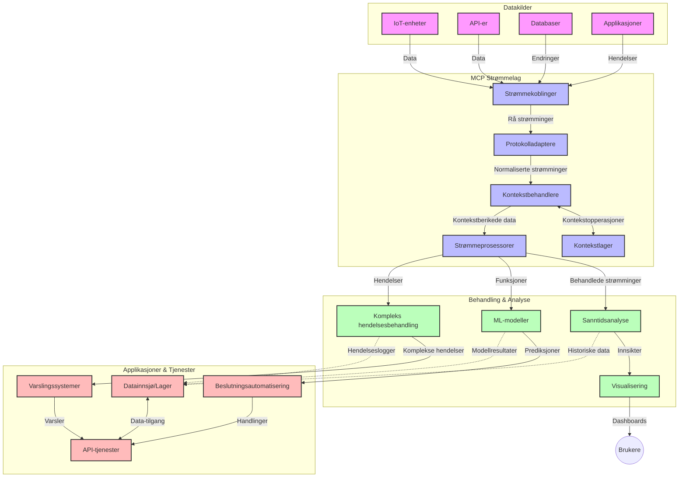

# Model Context Protocol for sanntids datastrømming

## Oversikt

Sanntids datastrømming har blitt avgjørende i dagens datadrevne verden, hvor virksomheter og apper krever umiddelbar tilgang til informasjon for å ta rettidige beslutninger. Model Context Protocol (MCP) representerer en betydelig forbedring i optimalisering av disse sanntids strømmingsprosessene, med bedre datahåndteringseffektivitet, opprettholdelse av kontekstuell integritet og forbedret total systemytelse.

Dette modul utforsker hvordan MCP transformerer sanntids datastrømming ved å tilby en standardisert tilnærming til kontekststyring på tvers av AI-modeller, strømmeplattformer og applikasjoner.

## Introduksjon til sanntids datastrømming

Sanntids datastrømming er et teknologisk paradigme som muliggjør kontinuerlig overføring, behandling og analyse av data mens de genereres, slik at systemer kan reagere umiddelbart på ny informasjon. I motsetning til tradisjonell batch-prosessering som opererer på statiske datasett, behandler sanntidsstrømming data i bevegelse, med innsikt og handlinger levert med minimal forsinkelse.

### Kjernebegreper for sanntids datastrømming:

- **Kontinuerlig dataflyt**: Data behandles som en kontinuerlig, uendelig strøm av hendelser eller poster.
- **Lav latensbehandling**: Systemene er designet for å minimere tiden mellom datagenerering og behandling.
- **Skalerbarhet**: Strømmingsarkitekturer må håndtere variable datamengder og hastigheter.
- **Feiltoleranse**: Systemer må være robuste mot feil for å sikre uavbrutt dataflyt.
- **Tilstandshåndtering**: Opprettholdelse av kontekst på tvers av hendelser er avgjørende for meningsfull analyse.

### Model Context Protocol og sanntids strømming

Model Context Protocol (MCP) løser flere kritiske utfordringer i sanntids strømmingsmiljøer:

1. **Kontekstuelt kontinuitet**: MCP standardiserer hvordan kontekst opprettholdes på tvers av distribuerte strømmekomponenter, og sikrer at AI-modeller og behandlingsnoder har tilgang til relevant historisk og miljømessig kontekst.

2. **Effektiv tilstandshåndtering**: Ved å tilby strukturerte mekanismer for kontekstoverføring reduserer MCP belastningen ved tilstandshåndtering i strømmingspipelines.

3. **Interoperabilitet**: MCP skaper et felles språk for deling av kontekst mellom ulike strømmingsteknologier og AI-modeller, noe som muliggjør mer fleksible og utvidbare arkitekturer.

4. **Strømmingsoptimalisert kontekst**: MCP-implementasjoner kan prioritere hvilke kontekst-elementer som er mest relevante for sanntids beslutningstaking, med optimalisering for både ytelse og nøyaktighet.

5. **Adaptiv behandling**: Med korrekt kontekststyring gjennom MCP kan strømmingssystemer dynamisk justere behandlingen basert på endrende forhold og mønstre i dataene.

I moderne applikasjoner fra IoT-sensornettverk til finansielle handelsplattformer muliggjør integrasjon av MCP med strømmingsteknologier mer intelligent, kontekstbevisst behandling som kan reagere hensiktsmessig på komplekse, utviklende situasjoner i sanntid.

## Læringsmål

Etter denne leksjonen skal du kunne:

- Forstå grunnleggende prinsipper for sanntids datastrømming og dets utfordringer
- Forklare hvordan Model Context Protocol (MCP) forbedrer sanntids datastrømming
- Implementere MCP-baserte strømmingsløsninger ved bruk av populære rammeverk som Kafka og Pulsar
- Designe og distribuere feiltolerante, høyytelses strømmingsarkitekturer med MCP
- Anvende MCP-konsepter i IoT, finanshandel og AI-drevne analysebrukstilfeller
- Vurdere fremvoksende trender og fremtidige innovasjoner i MCP-baserte strømmingsteknologier


### Definisjon og betydning

Sanntids datastrømming involverer kontinuerlig generering, behandling og levering av data med minimal forsinkelse. I motsetning til batch-prosessering, hvor data samles inn og behandles i grupper, behandles strømmingsdata inkrementelt etter hvert som de ankommer, noe som muliggjør umiddelbar innsikt og tiltak.

Nøkkeltegn ved sanntids datastrømming inkluderer:

- **Lav latens**: Behandling og analyse av data innen millisekunder til sekunder
- **Kontinuerlig flyt**: Ubrytelige datastreams fra ulike kilder
- **Umiddelbar behandling**: Analyse av data etter hvert som de ankommer, ikke i batcher
- **Hendelsesdrevet arkitektur**: Reaksjon på hendelser når de oppstår

### Utfordringer i tradisjonell datastrømming

Tradisjonelle tilnærminger til datastrømming møter flere begrensninger:

1. **Kontekstsavfall**: Vansker med å opprettholde kontekst på tvers av distribuerte systemer
2. **Skaleringsproblemer**: Vansker med å skalere for å håndtere høy volum og høy hastighet data
3. **Integrasjonskompleksitet**: Problemer med interoperabilitet mellom forskjellige systemer
4. **Håndtering av latens**: Balansering av gjennomstrømning og behandlingstid
5. **Datakonsistens**: Sikre nøyaktighet og fullstendighet av data i strømmen

## Forståelse av Model Context Protocol (MCP)

### Hva er MCP?

Model Context Protocol (MCP) er en standardisert kommunikasjonsprotokoll designet for å legge til rette for effektiv samhandling mellom AI-modeller og applikasjoner. I sammenheng med sanntids datastrømming gir MCP et rammeverk for:

- Å bevare kontekst gjennom hele datarørledningen
- Standardisere datautvekslingsformater
- Optimalisere overføring av store datasett
- Forbedre modell-til-modell og modell-til-applikasjon kommunikasjon

### Kjernekomponenter og arkitektur

MCP-arkitektur for sanntids strømming består av flere hovedkomponenter:

1. **Context Handlers**: Håndterer og opprettholder kontekstuell informasjon gjennom strømmingspipelines
2. **Stream Processors**: Behandler innkommende datastrømmer ved bruk av kontekstbevisste teknikker
3. **Protocol Adapters**: Konverterer mellom forskjellige strømmingsprotokoller samtidig som konteksten bevares
4. **Context Store**: Effektiv lagring og henting av kontekstuell informasjon
5. **Streaming Connectors**: Koblinger til ulike strømmingsplattformer (Kafka, Pulsar, Kinesis osv.)



### Hvordan MCP forbedrer sanntids datahåndtering

MCP tar tak i tradisjonelle utfordringer i strømming ved å tilby:

- **Kontekstuelt integritet**: Opprettholder relasjoner mellom datapunkter gjennom hele rørledningen
- **Optimalisert overføring**: Reduserer redundans i datautveksling gjennom intelligent kontekststyring
- **Standardiserte grensesnitt**: Tilbyr konsistente API-er for strømmekomponenter
- **Redusert latens**: Minimerer behandlingskostnader gjennom effektiv kontekstbehandling
- **Forbedret skalerbarhet**: Støtter horisontal skalering samtidig som konteksten bevares

## Integrasjon og implementering

Sanntids datastrømmingssystemer krever nøye arkitektonisk design og implementering for å opprettholde både ytelse og kontekstuell integritet. Model Context Protocol tilbyr en standardisert tilnærming for integrasjon av AI-modeller og strømmingsteknologier, noe som muliggjør mer sofistikerte, kontekstbevisste behandlingspipelines.

### Oversikt over MCP-integrasjon i strømmingsarkitekturer

Implementering av MCP i sanntids strømmingsmiljøer involverer flere viktige hensyn:

1. **Kontekst-serialisering og transport**: MCP tilbyr effektive mekanismer for koding av kontekstuell informasjon i data-pakker for strømming, som sikrer at essensiell kontekst følger data gjennom hele behandlingspipelinjen. Dette inkluderer standardiserte serialiseringsformater optimalisert for strømmingstransport.

2. **Tilstandshåndtering i strømming**: MCP muliggjør mer intelligent tilstandshåndtering ved å opprettholde konsistent kontekstrepresentasjon på tvers av behandlingsnoder. Dette er spesielt verdifullt i distribuerte strømmingsarkitekturer hvor tilstandshåndtering er tradisjonelt utfordrende.

3. **Event-tid vs. behandlingstid**: MCP-implementasjoner må håndtere den vanlige utfordringen med å skille mellom når hendelser inntraff og når de behandles. Protokollen kan inkorporere tidsmessig kontekst som bevarer event-tidssemantikk.

4. **Backpressure-håndtering**: Ved å standardisere kontekstbehandling hjelper MCP til med å håndtere backpressure i strømmingssystemer, slik at komponenter kan kommunisere sine behandlingskapasiteter og justere dataflyten deretter.

5. **Kontekstvinduing og aggregering**: MCP legger til rette for mer avanserte vindusoperasjoner ved å tilby strukturerte representasjoner av tidsmessige og relasjonelle kontekster, noe som muliggjør mer meningsfulle aggregeringer over hendelsesstrømmer.

6. **Eksakt-en-gang behandling**: I systemer som krever eksakt-en-gang semantikk kan MCP inkludere behandlingsmetadata for å hjelpe med sporing og verifisering av behandlingsstatus på tvers av distribuerte komponenter.

Implementering av MCP på tvers av ulike strømmingsteknologier skaper en enhetlig tilnærming til kontekststyring, reduserer behovet for tilpasset integrasjonskode samtidig som systemets evne til å opprettholde meningsfull kontekst etter hvert som data strømmer gjennom pipelinen, forbedres.

### MCP i ulike strømmingsrammeverk

Disse eksemplene følger den nåværende MCP-spesifikasjonen, som fokuserer på et JSON-RPC-basert protokoll med distinkte transportmekanismer. Koden viser hvordan man kan implementere egendefinerte transportmetoder som integrerer strømmingsplattformer som Kafka og Pulsar samtidig som full kompatibilitet med MCP-protokollen opprettholdes.

Eksemplene er utformet for å vise hvordan strømmingsplattformer kan integreres med MCP for å tilby sanntids databehandling samtidig som den kontekstuelle bevisstheten som er sentral i MCP bevares. Denne tilnærmingen sikrer at kodeeksemplene nøyaktig reflekterer den nåværende tilstanden til MCP-spesifikasjonen per juni 2025.

MCP kan integreres med populære strømmingsrammeverk inkludert:

#### Apache Kafka-integrasjon

```python
import asyncio
import json
from typing import Dict, Any, Optional
from confluent_kafka import Consumer, Producer, KafkaError
from mcp.client import Client, ClientCapabilities
from mcp.core.message import JsonRpcMessage
from mcp.core.transports import Transport

# Egendefinert transportklasse for å koble MCP med Kafka
class KafkaMCPTransport(Transport):
    def __init__(self, bootstrap_servers: str, input_topic: str, output_topic: str):
        self.bootstrap_servers = bootstrap_servers
        self.input_topic = input_topic
        self.output_topic = output_topic
        self.producer = Producer({'bootstrap.servers': bootstrap_servers})
        self.consumer = Consumer({
            'bootstrap.servers': bootstrap_servers,
            'group.id': 'mcp-client-group',
            'auto.offset.reset': 'earliest'
        })
        self.message_queue = asyncio.Queue()
        self.running = False
        self.consumer_task = None
        
    async def connect(self):
        """Connect to Kafka and start consuming messages"""
        self.consumer.subscribe([self.input_topic])
        self.running = True
        self.consumer_task = asyncio.create_task(self._consume_messages())
        return self
        
    async def _consume_messages(self):
        """Background task to consume messages from Kafka and queue them for processing"""
        while self.running:
            try:
                msg = self.consumer.poll(1.0)
                if msg is None:
                    await asyncio.sleep(0.1)
                    continue
                
                if msg.error():
                    if msg.error().code() == KafkaError._PARTITION_EOF:
                        continue
                    print(f"Consumer error: {msg.error()}")
                    continue
                
                # Parse meldingsverdien som JSON-RPC
                try:
                    message_str = msg.value().decode('utf-8')
                    message_data = json.loads(message_str)
                    mcp_message = JsonRpcMessage.from_dict(message_data)
                    await self.message_queue.put(mcp_message)
                except Exception as e:
                    print(f"Error parsing message: {e}")
            except Exception as e:
                print(f"Error in consumer loop: {e}")
                await asyncio.sleep(1)
    
    async def read(self) -> Optional[JsonRpcMessage]:
        """Read the next message from the queue"""
        try:
            message = await self.message_queue.get()
            return message
        except Exception as e:
            print(f"Error reading message: {e}")
            return None
    
    async def write(self, message: JsonRpcMessage) -> None:
        """Write a message to the Kafka output topic"""
        try:
            message_json = json.dumps(message.to_dict())
            self.producer.produce(
                self.output_topic,
                message_json.encode('utf-8'),
                callback=self._delivery_report
            )
            self.producer.poll(0)  # Utløser tilbakeringinger
        except Exception as e:
            print(f"Error writing message: {e}")
    
    def _delivery_report(self, err, msg):
        """Kafka producer delivery callback"""
        if err is not None:
            print(f'Message delivery failed: {err}')
        else:
            print(f'Message delivered to {msg.topic()} [{msg.partition()}]')
    
    async def close(self) -> None:
        """Close the transport"""
        self.running = False
        if self.consumer_task:
            self.consumer_task.cancel()
            try:
                await self.consumer_task
            except asyncio.CancelledError:
                pass
        self.consumer.close()
        self.producer.flush()

# Eksempel på bruk av Kafka MCP-transport
async def kafka_mcp_example():
    # Opprett MCP-klient med Kafka-transport
    client = Client(
        {"name": "kafka-mcp-client", "version": "1.0.0"},
        ClientCapabilities({})
    )
    
    # Opprett og koble til Kafka-transporten
    transport = KafkaMCPTransport(
        bootstrap_servers="localhost:9092",
        input_topic="mcp-responses",
        output_topic="mcp-requests"
    )
    
    await client.connect(transport)
    
    try:
        # Initialiser MCP-økten
        await client.initialize()
        
        # Eksempel på å kjøre et verktøy via MCP
        response = await client.execute_tool(
            "process_data",
            {
                "data": "sample data",
                "metadata": {
                    "source": "sensor-1",
                    "timestamp": "2025-06-12T10:30:00Z"
                }
            }
        )
        
        print(f"Tool execution response: {response}")
        
        # Ryddig nedstenging
        await client.shutdown()
    finally:
        await transport.close()

# Kjør eksemplet
if __name__ == "__main__":
    asyncio.run(kafka_mcp_example())
```

#### Apache Pulsar-implementasjon

```python
import asyncio
import json
import pulsar
from typing import Dict, Any, Optional
from mcp.core.message import JsonRpcMessage
from mcp.core.transports import Transport
from mcp.server import Server, ServerOptions
from mcp.server.tools import Tool, ToolExecutionContext, ToolMetadata

# Opprett en tilpasset MCP-transport som bruker Pulsar
class PulsarMCPTransport(Transport):
    def __init__(self, service_url: str, request_topic: str, response_topic: str):
        self.service_url = service_url
        self.request_topic = request_topic
        self.response_topic = response_topic
        self.client = pulsar.Client(service_url)
        self.producer = self.client.create_producer(response_topic)
        self.consumer = self.client.subscribe(
            request_topic,
            "mcp-server-subscription",
            consumer_type=pulsar.ConsumerType.Shared
        )
        self.message_queue = asyncio.Queue()
        self.running = False
        self.consumer_task = None
    
    async def connect(self):
        """Connect to Pulsar and start consuming messages"""
        self.running = True
        self.consumer_task = asyncio.create_task(self._consume_messages())
        return self
    
    async def _consume_messages(self):
        """Background task to consume messages from Pulsar and queue them for processing"""
        while self.running:
            try:
                # Ikke-blokkerende mottak med tidsavbrudd
                msg = self.consumer.receive(timeout_millis=500)
                
                # Behandle meldingen
                try:
                    message_str = msg.data().decode('utf-8')
                    message_data = json.loads(message_str)
                    mcp_message = JsonRpcMessage.from_dict(message_data)
                    await self.message_queue.put(mcp_message)
                    
                    # Bekreft meldingen
                    self.consumer.acknowledge(msg)
                except Exception as e:
                    print(f"Error processing message: {e}")
                    # Negativ bekreftelse hvis det oppsto en feil
                    self.consumer.negative_acknowledge(msg)
            except Exception as e:
                # Håndter tidsavbrudd eller andre unntak
                await asyncio.sleep(0.1)
    
    async def read(self) -> Optional[JsonRpcMessage]:
        """Read the next message from the queue"""
        try:
            message = await self.message_queue.get()
            return message
        except Exception as e:
            print(f"Error reading message: {e}")
            return None
    
    async def write(self, message: JsonRpcMessage) -> None:
        """Write a message to the Pulsar output topic"""
        try:
            message_json = json.dumps(message.to_dict())
            self.producer.send(message_json.encode('utf-8'))
        except Exception as e:
            print(f"Error writing message: {e}")
    
    async def close(self) -> None:
        """Close the transport"""
        self.running = False
        if self.consumer_task:
            self.consumer_task.cancel()
            try:
                await self.consumer_task
            except asyncio.CancelledError:
                pass
        self.consumer.close()
        self.producer.close()
        self.client.close()

# Definer et eksempel på MCP-verktøy som behandler strømmede data
@Tool(
    name="process_streaming_data",
    description="Process streaming data with context preservation",
    metadata=ToolMetadata(
        required_capabilities=["streaming"]
    )
)
async def process_streaming_data(
    ctx: ToolExecutionContext,
    data: str,
    source: str,
    priority: str = "medium"
) -> Dict[str, Any]:
    """
    Process streaming data while preserving context
    
    Args:
        ctx: Tool execution context
        data: The data to process
        source: The source of the data
        priority: Priority level (low, medium, high)
        
    Returns:
        Dict containing processed results and context information
    """
    # Eksempelbehandling som utnytter MCP-kontekst
    print(f"Processing data from {source} with priority {priority}")
    
    # Få tilgang til samtalekontekst fra MCP
    conversation_id = ctx.conversation_id if hasattr(ctx, 'conversation_id') else "unknown"
    
    # Returner resultater med forbedret kontekst
    return {
        "processed_data": f"Processed: {data}",
        "context": {
            "conversation_id": conversation_id,
            "source": source,
            "priority": priority,
            "processing_timestamp": ctx.get_current_time_iso()
        }
    }

# Eksempel på MCP-serverimplementering som bruker Pulsar-transport
async def run_mcp_server_with_pulsar():
    # Opprett MCP-server
    server = Server(
        {"name": "pulsar-mcp-server", "version": "1.0.0"},
        ServerOptions(
            capabilities={"streaming": True}
        )
    )
    
    # Registrer vårt verktøy
    server.register_tool(process_streaming_data)
    
    # Opprett og koble til Pulsar-transport
    transport = PulsarMCPTransport(
        service_url="pulsar://localhost:6650",
        request_topic="mcp-requests",
        response_topic="mcp-responses"
    )
    
    try:
        # Start serveren med Pulsar-transporten
        await server.run(transport)
    finally:
        await transport.close()

# Kjør serveren
if __name__ == "__main__":
    asyncio.run(run_mcp_server_with_pulsar())
```

### Beste praksis ved distribusjon

Når du implementerer MCP for sanntids strømming:

1. **Design for feiltoleranse**:
   - Implementer riktig feilhåndtering
   - Bruk dead-letter køer for mislykkede meldinger
   - Design idempotente behandlere

2. **Optimaliser for ytelse**:
   - Konfigurer passende buffertstørrelser
   - Bruk batching der det passer
   - Implementer backpressure-mekanismer

3. **Overvåk og observer**:
   - Følg med på strømmingsbehandlingsmetrikker
   - Overvåk kontekstspredning
   - Sett opp varsler for avvik

4. **Sikre dine strømmer**:
   - Implementer kryptering for sensitiv data
   - Bruk autentisering og autorisasjon
   - Anvend riktige tilgangskontroller


### MCP i IoT og Edge Computing

MCP forbedrer IoT-strømming ved å:

- Bevare enhetskontekst gjennom behandlingspipelinjen
- Muliggjøre effektiv edge-til-sky datastrømming
- Støtte sanntidsanalyse av IoT-datastrømmer
- Tilrettelegge for enhet-til-enhet kommunikasjon med kontekst

Eksempel: Smarte by-sensornettverk
```
Sensors → Edge Gateways → MCP Stream Processors → Real-time Analytics → Automated Responses
```

### Rolle i finansielle transaksjoner og høyfrekvent handel

MCP gir betydelige fordeler for finansiell datastrømming:

- Ultra-lav latensbehandling for handelsbeslutninger
- Opprettholdelse av transaksjonskontekst gjennom behandling
- Støtte komplekse hendelsesbehandlinger med kontekstbevissthet
- Sikre datakonsistens på tvers av distribuerte handelssystemer

### Forbedring av AI-drevne dataanalyser

MCP åpner nye muligheter for strømmeanalyse:

- Sanntidstrening og inferens av modeller
- Kontinuerlig læring fra datastrømmer
- Kontekstbevisst funksjonsekstraksjon
- Multimodelle inferenspipelines med bevart kontekst

## Fremtidige trender og innovasjoner

### Utvikling av MCP i sanntidsmiljøer

Vi forventer at MCP videreutvikles for å håndtere:

- **Integrasjon med kvantedatabehandling**: Forberede streaming-systemer basert på kvanteberegning
- **Edge-native behandling**: Flytte mer kontekstbevisst behandling til edge-enheter
- **Autonom strømmehåndtering**: Selvoptimaliserende strømmingspipelines
- **Føderert strømming**: Distribuert behandling samtidig som personvern bevares

### Potensielle teknologiske fremskritt

Fremvoksende teknologier som vil forme fremtidens MCP-strømming:

1. **AI-optimaliserte strømmingsprotokoller**: Protokoller spesialdesignet for AI-arbeidsbelastninger
2. **Neuromorfisk databehandling**: Hjerneinspirert databehandling for strømmingsbehandling
3. **Serverløs strømming**: Hendelsesdrevet, skalerbar strømming uten infrastrukturadministrasjon
4. **Distribuerte kontekstbutikker**: Globalt distribuerte, men svært konsistente kontekststyringsløsninger

## Praktiske øvelser

### Øvelse 1: Sette opp en grunnleggende MCP strømmingspipeline

I denne øvelsen lærer du hvordan du:
- Konfigurerer et grunnleggende MCP strømmingsmiljø
- Implementerer kontekstbehandlere for strømmingsprosessering
- Tester og validerer kontekstbevaring

### Øvelse 2: Bygge et sanntids analyse-dashboard

Lag en komplett applikasjon som:
- Inntar datastrøm ved hjelp av MCP
- Behandler strømmen mens konteksten opprettholdes
- Visualiserer resultater i sanntid

### Øvelse 3: Implementere kompleks hendelsesbehandling med MCP

Avansert øvelse som dekker:
- Mønsterdeteksjon i strømmer
- Kontekstuell korrelasjon over flere strømmer
- Generering av komplekse hendelser med bevart kontekst

## Ekstra ressurser

- [Model Context Protocol Specification](https://modelcontextprotocol.io) - Offisiell MCP-spesifikasjon og dokumentasjon
- [Apache Kafka Documentation](https://kafka.apache.org/documentation/) - Lær om Kafka for strømmingsbehandling
- [Apache Pulsar](https://pulsar.apache.org/) - Enhetlig meldings- og strømmingsplattform
- [Streaming Systems: The What, Where, When, and How of Large-Scale Data Processing](https://www.oreilly.com/library/view/streaming-systems/9781491983867/) - Omfattende bok om strømmingsarkitekturer
- [Microsoft Azure Event Hubs](https://learn.microsoft.com/azure/event-hubs/event-hubs-about) - Administrert event-strømmingstjeneste
- [MLflow Documentation](https://mlflow.org/docs/latest/index.html) - For ML-modellsporing og distribusjon
- [Real-Time Analytics with Apache Storm](https://storm.apache.org/releases/current/index.html) - Behandlingsrammeverk for sanntidsberegning
- [Flink ML](https://nightlies.apache.org/flink/flink-ml-docs-master/) - Maskinlæringsbibliotek for Apache Flink
- [LangChain Documentation](https://python.langchain.com/docs/get_started/introduction) - Bygge applikasjoner med LLM-er


## Læringsresultater

Ved å fullføre denne modulen vil du kunne:

- Forstå det grunnleggende ved sanntids datastrømming og tilhørende utfordringer
- Forklare hvordan Model Context Protocol (MCP) forbedrer sanntids datastrømming
- Implementere MCP-baserte strømmingsløsninger med populære rammeverk som Kafka og Pulsar
- Designe og distribuere feiltolerante, høyytelses strømmingsarkitekturer med MCP
- Anvende MCP-konsepter i IoT, finanshandel og AI-drevne analysebrukstilfeller
- Vurdere fremvoksende trender og fremtidige innovasjoner i MCP-baserte strømmingsteknologier

## Hva nå

- [5.11 Realtime Search](../mcp-realtimesearch/README.md)

---

<!-- CO-OP TRANSLATOR DISCLAIMER START -->
**Ansvarsfraskrivelse**:
Dette dokumentet er oversatt ved hjelp av AI-oversettelsestjenesten [Co-op Translator](https://github.com/Azure/co-op-translator). Selv om vi streber etter nøyaktighet, vær oppmerksom på at automatiske oversettelser kan inneholde feil eller unøyaktigheter. Det opprinnelige dokumentet på originalspråket skal betraktes som den autoritative kilden. For kritisk informasjon anbefales profesjonell menneskelig oversettelse. Vi er ikke ansvarlige for eventuelle misforståelser eller feiltolkninger som oppstår ved bruk av denne oversettelsen.
<!-- CO-OP TRANSLATOR DISCLAIMER END -->