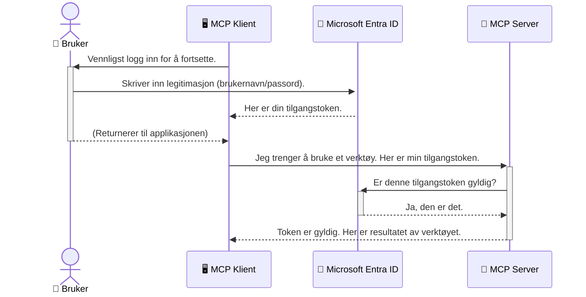

# Sikre AI-arbeidsflyter: Entra ID-autentisering for Model Context Protocol-servere

## Introduksjon
Å sikre Model Context Protocol (MCP)-serveren din er like viktig som å låse inngangsdøren til huset ditt. Å la MCP-serveren være åpen eksponerer verktøyene og dataene dine for uautorisert tilgang, som kan føre til sikkerhetsbrudd. Microsoft Entra ID tilbyr en robust skybasert løsning for identitets- og tilgangsstyring, som hjelper til med å sikre at kun autoriserte brukere og applikasjoner kan samhandle med MCP-serveren din. I denne delen lærer du hvordan du beskytter AI-arbeidsflytene dine ved hjelp av Entra ID-autentisering.

## Læringsmål
Innen slutten av denne delen skal du kunne:

- Forstå viktigheten av å sikre MCP-servere.
- Forklare grunnleggende om Microsoft Entra ID og OAuth 2.0-autentisering.
- Skille mellom offentlige og konfidensielle klienter.
- Implementere Entra ID-autentisering i både lokale (offentlig klient) og eksterne (konfidensiell klient) MCP-server-scenarier.
- Anvende sikkerhets beste praksis ved utvikling av AI-arbeidsflyter.

## Sikkerhet og MCP

Akkurat som du ikke ville latt inngangsdøren til huset ditt stå ulåst, bør du ikke la MCP-serveren din være åpen for hvem som helst. Å sikre AI-arbeidsflytene dine er avgjørende for å bygge robuste, pålitelige og trygge applikasjoner. Dette kapitlet vil introdusere deg for bruk av Microsoft Entra ID for å sikre MCP-serverne dine, slik at kun autoriserte brukere og applikasjoner kan samhandle med verktøyene og dataene dine.

## Hvorfor sikkerhet er viktig for MCP-servere

Tenk deg at MCP-serveren din har et verktøy som kan sende e-poster eller få tilgang til en kundedatabase. En usikret server betyr at hvem som helst potensielt kan bruke det verktøyet, noe som kan føre til uautorisert dataadgang, spam eller andre skadelige handlinger.

Ved å implementere autentisering sørger du for at hver forespørsel til serveren din blir verifisert, og bekrefter identiteten til brukeren eller applikasjonen som gjør forespørselen. Dette er det første og viktigste steget i å sikre AI-arbeidsflytene dine.

## Introduksjon til Microsoft Entra ID

[**Microsoft Entra ID**](https://adoption.microsoft.com/microsoft-security/entra/) er en skybasert tjeneste for identitets- og tilgangsstyring. Tenk på det som en universell sikkerhetsvakt for applikasjonene dine. Den håndterer den komplekse prosessen med å verifisere brukeridentiteter (autentisering) og bestemme hva de har lov til å gjøre (autorisasjon).

Ved å bruke Entra ID kan du:

- Aktivere sikker pålogging for brukere.
- Beskytte API-er og tjenester.
- Administrere tilgangspolicyer fra ett sentralt sted.

For MCP-servere tilbyr Entra ID en robust og bredt anerkjent løsning for å styre hvem som kan få tilgang til serverens funksjoner.

---

## Forstå magien: Hvordan Entra ID-autentisering fungerer

Entra ID bruker åpne standarder som **OAuth 2.0** til å håndtere autentisering. Selv om detaljene kan være komplekse, er kjerneideen enkel og kan forstås med en analogi.

### En enkel introduksjon til OAuth 2.0: Nøkkelen til bilpleieren

Tenk på OAuth 2.0 som en bilpleiertjeneste for bilen din. Når du ankommer en restaurant, gir du ikke bilpleieren hovednøkkelen din. I stedet gir du en **bilpleiernøkkel** som har begrensede tillatelser—den kan starte bilen og låse dørene, men den kan ikke åpne bagasjerommet eller hanskerommet.

I denne analogien:

- **Du** er **Brukeren**.
- **Bilen din** er **MCP-serveren** med sine verdifulle verktøy og data.
- **Bilpleieren** er **Microsoft Entra ID**.
- **Parkeringstjeneren** er **MCP-klienten** (applikasjonen som prøver å få tilgang til serveren).
- **Bilpleiernøkkelen** er **Access Token**.

Access token er en sikker tekststreng som MCP-klienten mottar fra Entra ID etter at du logger inn. Klienten presenterer deretter denne token til MCP-serveren ved hver forespørsel. Serveren kan verifisere token for å sikre at forespørselen er legitim og at klienten har nødvendige tillatelser, uten å måtte håndtere dine faktiske påloggingsopplysninger (som passordet ditt).

### Autentiseringsflyten

Slik fungerer prosessen i praksis:



### Introduksjon til Microsoft Authentication Library (MSAL)

Før vi dykker inn i koden, er det viktig å introdusere en nøkkelkomponent du vil se i eksemplene: **Microsoft Authentication Library (MSAL)**.

MSAL er et bibliotek utviklet av Microsoft som gjør det mye enklere for utviklere å håndtere autentisering. I stedet for at du må skrive all den komplekse koden for å håndtere sikkerhetstokener, administrere pålogginger og fornye økter, tar MSAL seg av det tunge arbeidet.

Å bruke et bibliotek som MSAL anbefales sterkt fordi:

- **Det er sikkert:** Det implementerer industristandardprotokoller og sikkerhetsbeste praksis, noe som reduserer risikoen for sårbarheter i koden din.
- **Det forenkler utviklingen:** Det skjuler kompleksiteten i OAuth 2.0 og OpenID Connect, slik at du kan legge til robust autentisering i applikasjonen din med bare noen få kodelinjer.
- **Det blir vedlikeholdt:** Microsoft oppdaterer og vedlikeholder aktivt MSAL for å håndtere nye sikkerhetstrusler og plattformendringer.

MSAL støtter et bredt spekter av språk og applikasjonsrammeverk, inkludert .NET, JavaScript/TypeScript, Python, Java, Go og mobilplattformer som iOS og Android. Dette betyr at du kan bruke de samme konsistente autentiseringsmønstrene i hele teknologi-stakken din.

For mer informasjon om MSAL, kan du se den offisielle [MSAL-oversiktsdokumentasjonen](https://learn.microsoft.com/entra/identity-platform/msal-overview).

---

## Sikre MCP-serveren din med Entra ID: En trinnvis guide

Nå skal vi gå gjennom hvordan du sikrer en lokal MCP-server (som kommuniserer over `stdio`) ved hjelp av Entra ID. Dette eksempelet bruker en **offentlig klient**, som passer for applikasjoner som kjører på en brukers maskin, som et skrivebordsprogram eller en lokal utviklingsserver.

### Scenario 1: Sikre en lokal MCP-server (med en offentlig klient)

I dette scenariet ser vi på en MCP-server som kjører lokalt, kommuniserer over `stdio`, og bruker Entra ID for å autentisere brukeren før den gir tilgang til verktøyene sine. Serveren har ett enkelt verktøy som henter brukerens profilinformasjon fra Microsoft Graph API.

#### 1. Sette opp applikasjonen i Entra ID

Før du skriver kode, må du registrere applikasjonen i Microsoft Entra ID. Dette forteller Entra ID om applikasjonen din og gir den tilgang til autentiseringstjenesten.

1. Gå til **[Microsoft Entra-portalen](https://entra.microsoft.com/)**.
2. Gå til **App registrations** og klikk **New registration**.
3. Gi applikasjonen et navn (f.eks. "Min lokale MCP-server").
4. For **Supported account types**, velg **Accounts in this organizational directory only**.
5. Du kan la **Redirect URI** stå tom for dette eksempelet.
6. Klikk **Register**.

Når registreringen er fullført, noter deg **Application (client) ID** og **Directory (tenant) ID**. Du vil trenge disse i koden din.

#### 2. Koden: En gjennomgang

La oss se på hoveddelene i koden som håndterer autentisering. Hele koden for dette eksempelet finner du i [Entra ID - Local - WAM](https://github.com/Azure-Samples/mcp-auth-servers/tree/main/src/entra-id-local-wam)-mappen i [mcp-auth-servers GitHub-repositoriet](https://github.com/Azure-Samples/mcp-auth-servers).

**`AuthenticationService.cs`**

Denne klassen har ansvar for interaksjonen med Entra ID.

- **`CreateAsync`**: Denne metoden initialiserer `PublicClientApplication` fra MSAL (Microsoft Authentication Library). Den konfigureres med applikasjonens `clientId` og `tenantId`.
- **`WithBroker`**: Dette aktiverer bruk av en broker (som Windows Web Account Manager), som gir en sikrere og sømløs single sign-on-opplevelse.
- **`AcquireTokenAsync`**: Dette er kjernefunksjonen. Den prøver først å hente en token stille (slik at brukeren ikke trenger å logge inn igjen hvis de allerede har en gyldig økt). Hvis stillehenting ikke lykkes, vil den be brukeren om å logge inn interaktivt.

```csharp
// Simplified for clarity
public static async Task<AuthenticationService> CreateAsync(ILogger<AuthenticationService> logger)
{
    var msalClient = PublicClientApplicationBuilder
        .Create(_clientId) // Your Application (client) ID
        .WithAuthority(AadAuthorityAudience.AzureAdMyOrg)
        .WithTenantId(_tenantId) // Your Directory (tenant) ID
        .WithBroker(new BrokerOptions(BrokerOptions.OperatingSystems.Windows))
        .Build();

    // ... cache registration ...

    return new AuthenticationService(logger, msalClient);
}

public async Task<string> AcquireTokenAsync()
{
    try
    {
        // Try silent authentication first
        var accounts = await _msalClient.GetAccountsAsync();
        var account = accounts.FirstOrDefault();

        AuthenticationResult? result = null;

        if (account != null)
        {
            result = await _msalClient.AcquireTokenSilent(_scopes, account).ExecuteAsync();
        }
        else
        {
            // If no account, or silent fails, go interactive
            result = await _msalClient.AcquireTokenInteractive(_scopes).ExecuteAsync();
        }

        return result.AccessToken;
    }
    catch (Exception ex)
    {
        _logger.LogError(ex, "An error occurred while acquiring the token.");
        throw; // Optionally rethrow the exception for higher-level handling
    }
}
```

**`Program.cs`**

Her settes MCP-serveren opp og autentiseringstjenesten integreres.

- **`AddSingleton<AuthenticationService>`**: Registrerer `AuthenticationService` i avhengighetsinjeksjonsbeholderen, slik at den kan brukes av andre deler av applikasjonen (som verktøyet vårt).
- **`GetUserDetailsFromGraph`-verktøyet**: Dette verktøyet krever en instans av `AuthenticationService`. Før det gjør noe, kaller det `authService.AcquireTokenAsync()` for å hente en gyldig access token. Hvis autentisering lykkes, bruker det tokenet til å kalle Microsoft Graph API og hente brukerens detaljer.

```csharp
// Simplified for clarity
[McpServerTool(Name = "GetUserDetailsFromGraph")]
public static async Task<string> GetUserDetailsFromGraph(
    AuthenticationService authService)
{
    try
    {
        // This will trigger the authentication flow
        var accessToken = await authService.AcquireTokenAsync();

        // Use the token to create a GraphServiceClient
        var graphClient = new GraphServiceClient(
            new BaseBearerTokenAuthenticationProvider(new TokenProvider(authService)));

        var user = await graphClient.Me.GetAsync();

        return System.Text.Json.JsonSerializer.Serialize(user);
    }
    catch (Exception ex)
    {
        return $"Error: {ex.Message}";
    }
}
```

#### 3. Hvordan det hele fungerer sammen

1. Når MCP-klienten prøver å bruke `GetUserDetailsFromGraph`-verktøyet, kaller verktøyet først `AcquireTokenAsync`.
2. `AcquireTokenAsync` får MSAL til å sjekke om en gyldig token er tilgjengelig.
3. Hvis ingen token finnes, vil MSAL, gjennom broker, be brukeren om å logge inn med sin Entra ID-konto.
4. Når brukeren logger inn, utsteder Entra ID en access token.
5. Verktøyet mottar tokenet og bruker det til å gjøre et sikkert kall til Microsoft Graph API.
6. Brukerens detaljer returneres til MCP-klienten.

Denne prosessen sikrer at kun autentiserte brukere kan bruke verktøyet, og sikrer dermed din lokale MCP-server.

### Scenario 2: Sikre en ekstern MCP-server (med en konfidensiell klient)

Når MCP-serveren din kjører på en ekstern maskin (som en sky-server) og kommuniserer over et protokoll som HTTP Streaming, er sikkerhetskravene annerledes. I dette tilfellet bør du bruke en **konfidensiell klient** og **Authorization Code Flow**. Dette er en sikrere metode fordi applikasjonens hemmeligheter aldri blir eksponert for nettleseren.

Dette eksempelet bruker en TypeScript-basert MCP-server som bruker Express.js til å håndtere HTTP-forespørsler.

#### 1. Sette opp applikasjonen i Entra ID

Oppsettet i Entra ID er likt som for offentlig klient, men med en viktig forskjell: du må opprette en **klienthemmelighet**.

1. Gå til **[Microsoft Entra-portalen](https://entra.microsoft.com/)**.
2. I appregistreringen din, gå til fanen **Certificates & secrets**.
3. Klikk **New client secret**, gi den en beskrivelse, og klikk **Add**.
4. **Viktig:** Kopier hemmelighetsverdien umiddelbart. Du vil ikke kunne se den igjen.
5. Du må også konfigurere en **Redirect URI**. Gå til fanen **Authentication**, klikk **Add a platform**, velg **Web**, og legg inn redirect-URI for applikasjonen din (f.eks. `http://localhost:3001/auth/callback`).

> **⚠️ Viktig sikkerhetsmerknad:** For produksjonsapplikasjoner anbefaler Microsoft sterkt å bruke **autentiseringsmetoder uten hemmeligheter** som **Managed Identity** eller **Workload Identity Federation** i stedet for klienthemmeligheter. Klienthemmeligheter utgjør en sikkerhetsrisiko fordi de kan bli eksponert eller kompromittert. Managed identities gir en sikrere tilnærming ved å eliminere behovet for å lagre legitimasjon i kode eller konfigurasjon.
>
> For mer informasjon om managed identities og hvordan du implementerer dem, se [Oversikt over managed identities for Azure-ressurser](https://learn.microsoft.com/entra/identity/managed-identities-azure-resources/overview).

#### 2. Koden: En gjennomgang

Dette eksempelet bruker en øktbasert tilnærming. Når brukeren autentiserer, lagrer serveren access token og refresh token i en økt og gir brukeren en sesjonstoken. Denne sesjonstoken brukes deretter for påfølgende forespørsler. Hele koden for dette eksempelet er tilgjengelig i [Entra ID - Confidential client](https://github.com/Azure-Samples/mcp-auth-servers/tree/main/src/entra-id-cca-session)-mappen i [mcp-auth-servers GitHub-repositoriet](https://github.com/Azure-Samples/mcp-auth-servers).

**`Server.ts`**

Denne filen setter opp Express-serveren og MCP transportlaget.

- **`requireBearerAuth`**: Dette er mellomvare som beskytter `/sse` og `/message` endepunktene. Den sjekker for en gyldig bearer token i `Authorization`-headeren i forespørselen.
- **`EntraIdServerAuthProvider`**: Dette er en egendefinert klasse som implementerer `McpServerAuthorizationProvider`-grensesnittet. Den håndterer OAuth 2.0-flyten.
- **`/auth/callback`**: Dette endepunktet håndterer redirect fra Entra ID etter at brukeren har autentisert seg. Det bytter autorisasjonskoden mot access token og refresh token.

```typescript
// Forenklet for klarhet
const app = express();
const { server } = createServer();
const provider = new EntraIdServerAuthProvider();

// Beskytt SSE-endepunktet
app.get("/sse", requireBearerAuth({
  provider,
  requiredScopes: ["User.Read"]
}), async (req, res) => {
  // ... koble til transporten ...
});

// Beskytt meldingens endepunkt
app.post("/message", requireBearerAuth({
  provider,
  requiredScopes: ["User.Read"]
}), async (req, res) => {
  // ... håndter meldingen ...
});

// Håndter OAuth 2.0-tilbakekallingen
app.get("/auth/callback", (req, res) => {
  provider.handleCallback(req.query.code, req.query.state)
    .then(result => {
      // ... håndter suksess eller feil ...
    });
});
```

**`Tools.ts`**

Denne filen definerer verktøyene som MCP-serveren tilbyr. `getUserDetails`-verktøyet er likt det i det forrige eksempelet, men henter access token fra økten.

```typescript
// Forenklet for klarhet
server.setRequestHandler(CallToolRequestSchema, async (request) => {
  const { name } = request.params;
  const context = request.params?.context as { token?: string } | undefined;
  const sessionToken = context?.token;

  if (name === ToolName.GET_USER_DETAILS) {
    if (!sessionToken) {
      throw new AuthenticationError("Authentication token is missing or invalid. Ensure the token is provided in the request context.");
    }

    // Hent Entra ID-tokenet fra øktlageret
    const tokenData = tokenStore.getToken(sessionToken);
    const entraIdToken = tokenData.accessToken;

    const graphClient = Client.init({
      authProvider: (done) => {
        done(null, entraIdToken);
      }
    });

    const user = await graphClient.api('/me').get();

    // ... returner brukerdetaljer ...
  }
});
```

**`auth/EntraIdServerAuthProvider.ts`**

Denne klassen håndterer logikken for:

- Å dirigere brukeren til Entra ID påloggingsside.
- Bytte autorisasjonskode mot access token.
- Lagring av tokenene i `tokenStore`.
- Fornye access token når den utløper.

#### 3. Hvordan det hele fungerer sammen

1. Når en bruker først prøver å koble til MCP-serveren, vil `requireBearerAuth`-mellomvaren se at de ikke har en gyldig økt og vil omdirigere dem til Entra ID påloggingsside.
2. Brukeren logger inn med sin Entra ID-konto.
3. Entra ID omdirigerer brukeren tilbake til `/auth/callback` endepunktet med en autorisasjonskode.  
4. Serveren bytter ut koden med en tilgangstoken og en oppfriskningstoken, lagrer disse, og lager en sesjonstoken som sendes til klienten.  
5. Klienten kan nå bruke denne sesjonstoken i `Authorization`-headeren for alle fremtidige forespørsler til MCP-serveren.  
6. Når `getUserDetails`-verktøyet kalles, bruker det sesjonstoken for å slå opp Entra ID tilgangstoken og deretter bruke den til å kalle Microsoft Graph API.

Denne flyten er mer kompleks enn den offentlige klientflyten, men er nødvendig for internettvendte endepunkter. Siden eksterne MCP-servere er tilgjengelige over det offentlige nettet, trenger de sterkere sikkerhetstiltak for å beskytte mot uautorisert tilgang og potensielle angrep.

## Sikkerhets beste praksis

- **Bruk alltid HTTPS**: Krypter kommunikasjonen mellom klient og server for å beskytte tokens mot avlytting.  
- **Implementer rollebasert tilgangskontroll (RBAC)**: Sjekk ikke bare *om* en bruker er autentisert; sjekk *hva* de har rett til å gjøre. Du kan definere roller i Entra ID og sjekke dem i MCP-serveren.  
- **Overvåk og revider**: Loggfør alle autentiseringshendelser slik at du kan oppdage og reagere på mistenkelig aktivitet.  
- **Håndter rate limiting og throttling**: Microsoft Graph og andre API-er implementerer rate limiting for å forhindre misbruk. Implementer eksponentiell backoff og gjentakelseslogikk i din MCP-server for å håndtere HTTP 429 (Too Many Requests) svar elegant. Vurder caching av ofte etterspurt data for å redusere API-kall.  
- **Sikker lagring av tokens**: Lagre tilgangstoken og oppfriskningstoken sikkert. For lokale applikasjoner, bruk systemets sikre lagringsmekanismer. For serverapplikasjoner, vurder kryptert lagring eller sikre nøkkelhåndteringstjenester som Azure Key Vault.  
- **Håndtering av tokenutløp**: Tilgangstokens har begrenset levetid. Implementer automatisk oppfriskning av tokens ved bruk av oppfriskningstokens for å opprettholde sømløs brukeropplevelse uten at pålogging må gjentas.  
- **Vurder å bruke Azure API Management**: Selv om du kan implementere sikkerhet direkte i MCP-serveren for finmasket kontroll, kan API-gatewayer som Azure API Management håndtere mange av disse sikkerhetsproblemene automatisk, inkludert autentisering, autorisasjon, rate limiting og overvåking. De tilbyr et sentralisert sikkerhetslag mellom klientene dine og MCP-serverne dine. For mer informasjon om bruk av API-gatewayer med MCP, se vår [Azure API Management Your Auth Gateway For MCP Servers](https://techcommunity.microsoft.com/blog/integrationsonazureblog/azure-api-management-your-auth-gateway-for-mcp-servers/4402690).

## Viktige punkter

- Sikring av MCP-serveren din er avgjørende for å beskytte dataene og verktøyene dine.  
- Microsoft Entra ID tilbyr en robust og skalerbar løsning for autentisering og autorisasjon.  
- Bruk en **offentlig klient** for lokale applikasjoner og en **konfidensiell klient** for eksterne servere.  
- **Authorization Code Flow** er det sikreste alternativet for webapplikasjoner.

## Øvelse

1. Tenk på en MCP-server du kan bygge. Ville det være en lokal server eller en ekstern server?  
2. Basert på svaret ditt, ville du bruke en offentlig eller konfidensiell klient?  
3. Hvilke tillatelser ville MCP-serveren din be om for å utføre handlinger mot Microsoft Graph?

## Praktiske øvelser

### Øvelse 1: Registrer en applikasjon i Entra ID  
Naviger til Microsoft Entra-portalen.  
Registrer en ny applikasjon for MCP-serveren din.  
Noter deg Application (client) ID og Directory (tenant) ID.

### Øvelse 2: Sikre en lokal MCP-server (offentlig klient)  
- Følg kodeeksempelet for å integrere MSAL (Microsoft Authentication Library) for brukerautentisering.  
- Test autentiseringsflyten ved å kalle MCP-verktøyet som henter brukeropplysninger fra Microsoft Graph.

### Øvelse 3: Sikre en ekstern MCP-server (konfidensiell klient)  
- Registrer en konfidensiell klient i Entra ID og lag en klienthemmelighet.  
- Konfigurer din Express.js MCP-server til å bruke Authorization Code Flow.  
- Test de beskyttede endepunktene og bekreft token-basert tilgang.

### Øvelse 4: Implementer sikkerhets beste praksis  
- Aktiver HTTPS for din lokale eller eksterne server.  
- Implementer rollebasert tilgangskontroll (RBAC) i serverlogikken.  
- Legg til håndtering av tokenutløp og sikker lagring av tokens.

## Ressurser

1. **MSAL Oversiktsdokumentasjon**  
   Lær hvordan Microsoft Authentication Library (MSAL) muliggjør sikker tokenhenting på tvers av plattformer:  
   [MSAL Overview on Microsoft Learn](https://learn.microsoft.com/en-gb/entra/msal/overview)

2. **Azure-Samples/mcp-auth-servers GitHub-repo**  
   Referanseimplementasjoner av MCP-servere som demonstrerer autentiseringsflyter:  
   [Azure-Samples/mcp-auth-servers on GitHub](https://github.com/Azure-Samples/mcp-auth-servers)

3. **Oversikt over administrerte identiteter for Azure-ressurser**  
   Forstå hvordan du kan eliminere hemmeligheter ved å bruke system- eller bruker-tilordnede administrerte identiteter:  
   [Managed Identities Overview on Microsoft Learn](https://learn.microsoft.com/en-us/entra/identity/managed-identities-azure-resources/)

4. **Azure API Management: Din Auth Gateway for MCP Servere**  
   En grundig gjennomgang av bruk av APIM som en sikker OAuth2 gateway for MCP-servere:  
   [Azure API Management Your Auth Gateway For MCP Servers](https://techcommunity.microsoft.com/blog/integrationsonazureblog/azure-api-management-your-auth-gateway-for-mcp-servers/4402690)

5. **Microsoft Graph tillatelsesreferanse**  
   Omfattende liste over delegerte og applikasjonstillatelser for Microsoft Graph:  
   [Microsoft Graph Permissions Reference](https://learn.microsoft.com/zh-tw/graph/permissions-reference)

## Læringsutbytte  
Etter å ha fullført dette avsnittet, vil du kunne:  

- Forklare hvorfor autentisering er avgjørende for MCP-servere og AI-arbeidsflyter.  
- Sette opp og konfigurere Entra ID-autentisering for både lokale og eksterne MCP-server-scenarier.  
- Velge riktig klienttype (offentlig eller konfidensiell) basert på serverens distribusjon.  
- Implementere sikre kodingsmetoder, inkludert tokenlagring og rollebasert autorisasjon.  
- Trygt beskytte MCP-serveren og tilhørende verktøy mot uautorisert tilgang.

## Hva er neste

- [5.13 Model Context Protocol (MCP) Integrasjon med Microsoft Foundry](../mcp-foundry-agent-integration/README.md)

---

<!-- CO-OP TRANSLATOR DISCLAIMER START -->
**Ansvarsfraskrivelse**:
Dette dokumentet er oversatt ved hjelp av AI-oversettelsestjenesten [Co-op Translator](https://github.com/Azure/co-op-translator). Selv om vi streber etter nøyaktighet, vær oppmerksom på at automatiske oversettelser kan inneholde feil eller unøyaktigheter. Det opprinnelige dokumentet på originalspråket skal betraktes som den autoritative kilden. For kritisk informasjon anbefales profesjonell menneskelig oversettelse. Vi er ikke ansvarlige for eventuelle misforståelser eller feiltolkninger som oppstår ved bruk av denne oversettelsen.
<!-- CO-OP TRANSLATOR DISCLAIMER END -->