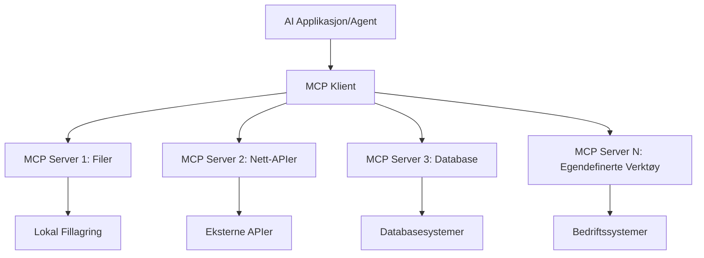

# 🌐 Modul 2: MCP med Microsoft Foundry Toolkit Grunnleggende

[]()
[]()
[]()

## 📋 Læringsmål

Ved slutten av denne modulen vil du kunne:
- ✅ Forstå Model Context Protocol (MCP)-arkitektur og fordeler
- ✅ Utforske Microsofts MCP server-økosystem
- ✅ Integrere MCP-servere med Microsoft Foundry Toolkit Agent Builder
- ✅ Bygge en funksjonell nettleserautomatiseringsagent med Playwright MCP
- ✅ Konfigurere og teste MCP-verktøy i agentene dine
- ✅ Eksportere og distribuere MCP-drevne agenter for produksjonsbruk

## 🎯 Bygger videre på Modul 1

I Modul 1 mestret vi Microsoft Foundry Toolkit-grunnleggende og opprettet vår første Python-agent. Nå skal vi **superlade** agentene dine ved å koble dem til eksterne verktøy og tjenester gjennom den revolusjonerende **Model Context Protocol (MCP)**.

Se på dette som en oppgradering fra en enkel kalkulator til en fullverdig datamaskin – AI-agentene dine vil få muligheten til å:
- 🌐 Surfe på og samhandle med nettsteder
- 📁 Få tilgang til og manipulere filer
- 🔧 Integrere med virksomhetssystemer
- 📊 Behandle sanntidsdata fra API-er

## 🧠 Forstå Model Context Protocol (MCP)

### 🔍 Hva er MCP?

Model Context Protocol (MCP) er **"USB-C for AI-applikasjoner"** – en revolusjonerende åpen standard som kobler store språkmodeller (LLMs) til eksterne verktøy, datakilder og tjenester. Akkurat som USB-C eliminerte kabelkaos ved å gi én universell kontakt, eliminerer MCP AI-integrasjonskompleksitet med én standardisert protokoll.

### 🎯 Problemet MCP Løser

**Før MCP:**
- 🔧 Tilpassede integrasjoner for hvert verktøy
- 🔄 Leverandørbinding med proprietære løsninger  
- 🔒 Sikkerhetsrisikoer fra ad hoc-tilkoblinger
- ⏱️ Flere måneders utvikling for grunnleggende integrasjoner

**Med MCP:**
- ⚡ Plug-and-play verktøyintegrasjon
- 🔄 Leverandøruavhengig arkitektur
- 🛡️ Innebygde sikkerhetsbeste praksiser
- 🚀 Minutter for å legge til nye funksjoner

### 🏗️ MCP Arkitektur Dybdestudie

MCP følger en **klient-server-konstruksjon** som skaper et sikkert, skalerbart økosystem:



**🔧 Kjernekomponenter:**

| Komponent | Rolle | Eksempler |
|-----------|-------|-----------|
| **MCP Hosts** | Applikasjoner som bruker MCP-tjenester | Claude Desktop, VS Code, Microsoft Foundry Toolkit |
| **MCP Clients** | Protokollhåndterere (1:1 med servere) | Innebygd i vertsapplikasjoner |
| **MCP Servers** | Eksponerer funksjonalitet via standard protokoll | Playwright, Files, Azure, GitHub |
| **Transport Layer** | Kommunikasjonsmetoder | stdio, HTTP, WebSockets |


## 🏢 Microsofts MCP Server-økosystem

Microsoft leder MCP-økosystemet med en omfattende pakke av enterprise-grade servere som dekker virkelige forretningsbehov.

### 🌟 Utvalgte Microsoft MCP-servere

#### 1. ☁️ Azure MCP Server
**🔗 Repository**: [azure/azure-mcp](https://github.com/azure/azure-mcp)
**🎯 Formål**: Omfattende Azure-ressursstyring med AI-integrasjon

**✨ Hovedfunksjoner:**
- Deklarativ infrastrukturprovisjonering
- Sanntidsovervåking av ressurser
- Anbefalinger for kostnadsoptimalisering
- Sikkerhetsoverholdelseskontroll

**🚀 Bruksområder:**
- Infrastruktur-som-kode med AI-hjelp
- Automatisert ressurseskalering
- Optimalisering av skylastekostnader
- DevOps arbeidsflytautomatisering

#### 2. 📊 Microsoft Dataverse MCP
**📚 Dokumentasjon**: [Microsoft Dataverse Integration](https://go.microsoft.com/fwlink/?linkid=2320176)
**🎯 Formål**: Naturlig språkgrensesnitt for forretningsdata

**✨ Hovedfunksjoner:**
- Spørringer i database på naturlig språk
- Forståelse av forretningskontekst
- Tilpassede promptmaler
- Virksomhetsdataforvaltning

**🚀 Bruksområder:**
- Forretningsintelligensrapportering
- Kundeanalyse
- Innsikt i salgspipeline
- Spørringer for etterlevelsesdata

#### 3. 🌐 Playwright MCP Server
**🔗 Repository**: [microsoft/playwright-mcp](https://github.com/microsoft/playwright-mcp)
**🎯 Formål**: Nettleserautomatisering og webinteraksjon

**✨ Hovedfunksjoner:**
- Kryss-nettleserautomatisering (Chrome, Firefox, Safari)
- Intelligent elementdeteksjon
- Skjermbildetaking og PDF-generering
- Nettverksovervåking

**🚀 Bruksområder:**
- Automatiserte testarbeidsflyter
- Webskraping og datauthenting
- UI/UX-overvåking
- Automatisering av konkurrentanalyse

#### 4. 📁 Files MCP Server
**🔗 Repository**: [microsoft/files-mcp-server](https://github.com/microsoft/files-mcp-server)
**🎯 Formål**: Intelligente filsystemoperasjoner

**✨ Hovedfunksjoner:**
- Deklarativ filbehandling
- Innholdssynkronisering
- Versjonskontrollintegrasjon
- Metadatauttrekk

**🚀 Bruksområder:**
- Dokumenthåndtering
- Organisering av kodearkiv
- Innholdspublisering
- Filhåndtering i datapipelines

#### 5. 📝 MarkItDown MCP Server
**🔗 Repository**: [microsoft/markitdown](https://github.com/microsoft/markitdown)
**🎯 Formål**: Avansert Markdown-behandling og manipulering

**✨ Hovedfunksjoner:**
- Rik Markdown-parsing
- Formatkonvertering (MD ↔ HTML ↔ PDF)
- Analyse av innholdsstruktur
- Malbehandling

**🚀 Bruksområder:**
- Tekniske dokumentasjonsarbeidsflyter
- Innholdsadministrasjonssystemer
- Rapportgenerering
- Automatisering av kunnskapsbase

#### 6. 📈 Clarity MCP Server
**📦 Pakke**: [@microsoft/clarity-mcp-server](https://www.npmjs.com/package/@microsoft/clarity-mcp-server)
**🎯 Formål**: Webanalyse og innsikt i brukeradferd

**✨ Hovedfunksjoner:**
- Analyse av heatmap-data
- Innspilling av brukersesjoner
- Ytelsesmetrikker
- Konverteringstraktanalyse

**🚀 Bruksområder:**
- Nettstedsoptimalisering
- Brukeropplevelsesforskning
- A/B-testingsanalyse
- Dashbord for forretningsintelligens

### 🌍 Fellesskapsøkosystem

Utover Microsofts servere inkluderer MCP-økosystemet:
- **🐙 GitHub MCP**: Repository-styring og kodeanalyse
- **🗄️ Database-MCP-er**: PostgreSQL, MySQL, MongoDB-integrasjoner
- **☁️ Skyleverandør-MCP-er**: AWS, GCP, Digital Ocean-verktøy
- **📧 Kommunikasjons-MCP-er**: Slack, Teams, e-post-integrasjoner

## 🛠️ Praktisk lab: Lage en nettleserautomatiseringsagent

**🎯 Prosjektmål**: Lag en intelligent nettleserautomatiseringsagent med Playwright MCP-server som kan navigere på nettsteder, hente informasjon og utføre avanserte webinteraksjoner.

### 🚀 Fase 1: Oppsett av agentgrunnlag

#### Steg 1: Initialiser agenten din
1. **Åpne Microsoft Foundry Toolkit Agent Builder**
2. **Lag ny agent** med følgende konfigurasjon:
   - **Navn**: `BrowserAgent`
   - **Modell**: Velg GPT-4o


### 🔧 Fase 2: MCP-integrasjonsarbeidsflyt

#### Steg 3: Legg til MCP-serverintegrasjon
1. **Naviger til verktøyseksjonen** i Agent Builder
2. **Klikk "Legg til verktøy"** for å åpne integrasjonsmenyen
3. **Velg "MCP Server"** fra tilgjengelige alternativer


**🔍 Forstå verktøytyper:**
- **Innebygde verktøy**: Forhåndskonfigurerte Microsoft Foundry Toolkit-funksjoner
- **MCP-servere**: Eksterne tjenesteintegrasjoner
- **Egendefinerte APIer**: Egne tjenestepunkter
- **Funksjonskall**: Direkte tilgang til modellfunksjoner

#### Steg 4: Velg MCP-server
1. **Velg "MCP Server"** for å fortsette


2. **Bla gjennom MCP-katalogen** for å utforske tilgjengelige integrasjoner


### 🎮 Fase 3: Playwright MCP-konfigurasjon

#### Steg 5: Velg og konfigurer Playwright
1. **Klikk "Bruk utvalgte MCP-servere"** for å åpne Microsofts verifiserte servere
2. **Velg "Playwright"** fra den utvalgte listen
3. **Godta standard MCP-ID** eller tilpass for ditt miljø


#### Steg 6: Aktiver Playwright-funksjoner
**🔑 Kritisk steg**: Velg **ALLE** tilgjengelige Playwright-metoder for maksimal funksjonalitet


**🛠️ Viktige Playwright-verktøy:**
- **Navigasjon**: `goto`, `goBack`, `goForward`, `reload`
- **Interaksjon**: `click`, `fill`, `press`, `hover`, `drag`
- **Uthenting**: `textContent`, `innerHTML`, `getAttribute`
- **Validering**: `isVisible`, `isEnabled`, `waitForSelector`
- **Opptak**: `screenshot`, `pdf`, `video`
- **Nettverk**: `setExtraHTTPHeaders`, `route`, `waitForResponse`

#### Steg 7: Verifiser integrasjonssuksess
**✅ Suksessindikatorer:**
- Alle verktøy vises i Agent Builder-grensesnittet
- Ingen feilmeldinger i integrasjonspanelet
- Playwright server-status viser "Connected"


**🔧 Vanlige feilsøkingstips:**
- **Tilkobling mislyktes**: Sjekk Internett-tilkobling og brannmurinnstillinger
- **Verktøy mangler**: Sørg for at alle funksjoner ble valgt under oppsettet
- **Tillatelsesfeil**: Kontroller at VS Code har nødvendige systemtillatelser

### 🎯 Fase 4: Avansert promptdesign

#### Steg 8: Design intelligente systemprompter
Lag sofistikerte prompter som utnytter Playwrights fullstendige funksjonalitet:

```markdown
# Web Automation Expert System Prompt

## Core Identity
You are an advanced web automation specialist with deep expertise in browser automation, web scraping, and user experience analysis. You have access to Playwright tools for comprehensive browser control.

## Capabilities & Approach
### Navigation Strategy
- Always start with screenshots to understand page layout
- Use semantic selectors (text content, labels) when possible
- Implement wait strategies for dynamic content
- Handle single-page applications (SPAs) effectively

### Error Handling
- Retry failed operations with exponential backoff
- Provide clear error descriptions and solutions
- Suggest alternative approaches when primary methods fail
- Always capture diagnostic screenshots on errors

### Data Extraction
- Extract structured data in JSON format when possible
- Provide confidence scores for extracted information
- Validate data completeness and accuracy
- Handle pagination and infinite scroll scenarios

### Reporting
- Include step-by-step execution logs
- Provide before/after screenshots for verification
- Suggest optimizations and alternative approaches
- Document any limitations or edge cases encountered

## Ethical Guidelines
- Respect robots.txt and rate limiting
- Avoid overloading target servers
- Only extract publicly available information
- Follow website terms of service
```

#### Steg 9: Lag dynamiske brukerprompter
Design prompter som demonstrerer ulike funksjoner:

**🌐 Eksempel på webanalyse:**
```markdown
Navigate to github.com/kinfey and provide a comprehensive analysis including:
1. Repository structure and organization
2. Recent activity and contribution patterns  
3. Documentation quality assessment
4. Technology stack identification
5. Community engagement metrics
6. Notable projects and their purposes

Include screenshots at key steps and provide actionable insights.
```


### 🚀 Fase 5: Utførelse og testing

#### Steg 10: Kjøre din første automatisering
1. **Klikk "Kjør"** for å starte automasjonssekvensen
2. **Overvåk sanntids utførelse**:
   - Chrome-nettleser starter automatisk
   - Agent navigerer til målnettstedet
   - Skjermbilder tas for hvert viktig steg
   - Analyse-resultater strømmer i sanntid


#### Steg 11: Analyser resultater og innsikt
Gå gjennom omfattende analyse i Agent Builder-grensesnittet:


### 🌟 Fase 6: Avanserte funksjoner og distribusjon

#### Steg 12: Eksporter og distribuer i produksjon
Agent Builder støtter flere distribusjonsmuligheter:


## 🎓 Modul 2 Oppsummering & Neste steg

### 🏆 Prestasjon oppnådd: MCP-integrasjonsmester

**✅ Ferdigheter mestret:**
- [ ] Forstå MCP-arkitektur og fordeler
- [ ] Navigere Microsofts MCP server-økosystem
- [ ] Integrere Playwright MCP med Microsoft Foundry Toolkit
- [ ] Bygge avanserte nettleserautomatiseringsagenter
- [ ] Avansert promptdesign for nettsideautomatisering

### 📚 Ytterligere ressurser

- **🔗 MCP-spesifikasjon**: [Offisiell protokoll-dokumentasjon](https://modelcontextprotocol.io/)
- **🛠️ Playwright API**: [Fullstendig metodeoversikt](https://playwright.dev/docs/api/class-playwright)
- **🏢 Microsoft MCP-servere**: [Enterprise integrasjonsguide](https://github.com/microsoft/mcp-servers)
- **🌍 Fellesskapseksempler**: [MCP Server-galleri](https://github.com/modelcontextprotocol/servers)

**🎉 Gratulerer!** Du har nå mestret MCP-integrasjon og kan bygge produksjonsklare AI-agenter med eksterne verktøy!

### 🔜 Fortsett til neste modul

Klar for å ta MCP-ferdighetene dine til neste nivå? Gå videre til **[Modul 3: Avansert MCP-utvikling med Microsoft Foundry Toolkit](../lab3/README.md)** hvor du lærer å:
- Lage egne egendefinerte MCP-servere
- Konfigurere og bruke nyeste MCP Python SDK
- Sette opp MCP Inspector for debugging
- Mestre avanserte arbeidsflyter for MCP-serverutvikling
- Bygge en Weather MCP Server fra bunnen av

---

<!-- CO-OP TRANSLATOR DISCLAIMER START -->
**Ansvarsfraskrivelse**:
Dette dokumentet er oversatt ved hjelp av AI-oversettelsestjenesten [Co-op Translator](https://github.com/Azure/co-op-translator). Selv om vi streber etter nøyaktighet, vær oppmerksom på at automatiske oversettelser kan inneholde feil eller unøyaktigheter. Det opprinnelige dokumentet på originalspråket skal betraktes som den autoritative kilden. For kritisk informasjon anbefales profesjonell menneskelig oversettelse. Vi er ikke ansvarlige for eventuelle misforståelser eller feiltolkninger som oppstår ved bruk av denne oversettelsen.
<!-- CO-OP TRANSLATOR DISCLAIMER END -->