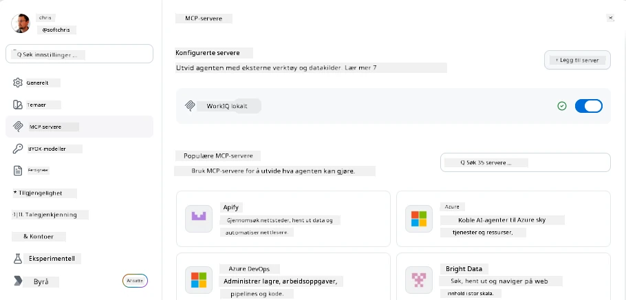
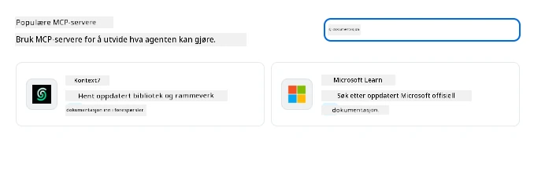
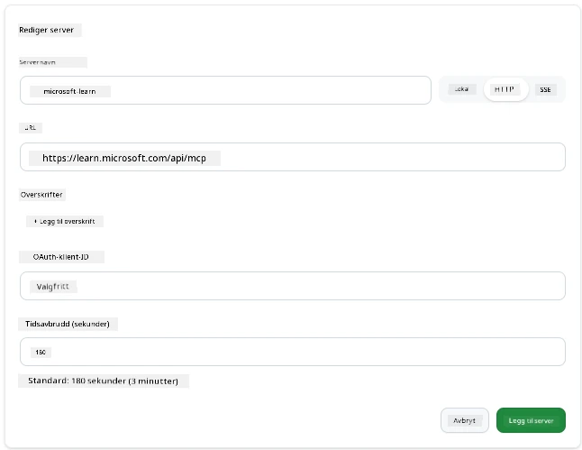
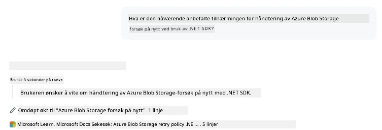
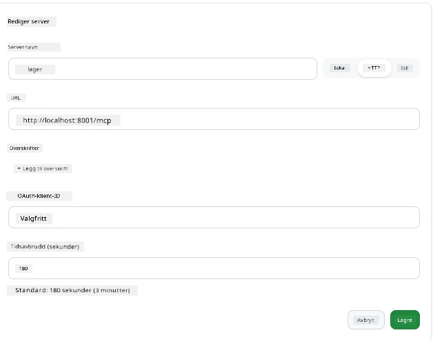
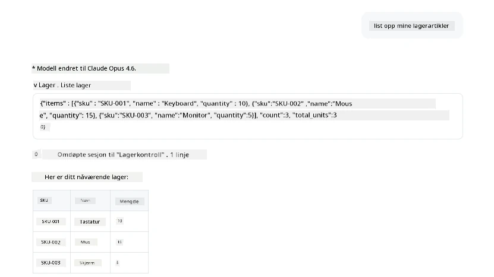
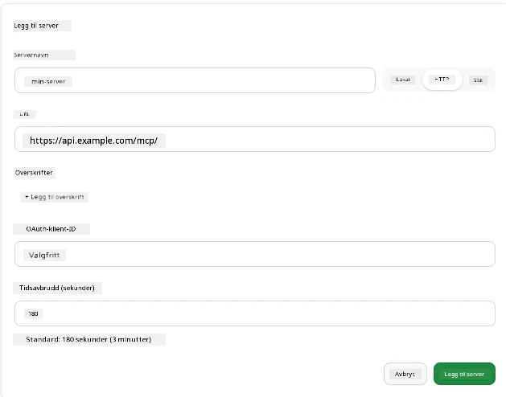
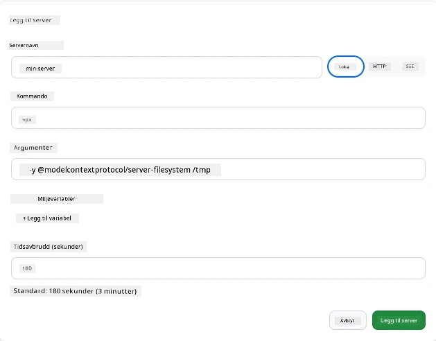

# Bruke MCP-servere i GitHub Copilot-appen

Nå vet du hvordan MCP fungerer. Du har bygget servere, definert verktøy og ressurser, og koblet til klienter. Det vi ikke har gjort ennå er å snu perspektivet: i stedet for at du er den som bygger serveren, hvordan ser det ut å være på *bruks*-siden—som en bruker av en AI-drevet app som støtter MCP?

[GitHub Copilot App](https://github.com/github/app) er en skrivebordsapp som kan bruke MCP-servere. Ved å koble MCP-servere til den, låser du opp et nytt nivå: Copilot kan nå hente informasjon fra dokumentasjonen din, kalle interne API-er, spørre databasen din eller snakke med hvilken som helst tjeneste du har pakket inn i en server. Appen blir verten; dine MCP-servere blir verktøyene dens.

Denne leksjonen tar deg gjennom hele opplevelsen—fra å finne MCP-innstillingspanelet til å koble til en ekte dokumentasjonsserver og deretter koble til en tilpasset server du lager selv.

## Læringsmål

Innen slutten av denne leksjonen vil du kunne:

- Finne og navigere til MCP-serverpanelet i Copilot App-innstillingene.
- Koble til en hostet dokumentasjonsserver og bruke den i en økt.
- Registrere en tilpasset server og verifisere at Copilot kan kalle dens verktøy.
- Konfigurere hvordan en server skal kalles ved å angi enten miljøvariabler eller egendefinerte headere (ved HTTP).

## Copilot-appen som MCP-vert

Her er det grunnleggende: **Copilots agenter er smarte, men de vet bare det du forteller dem.** Som standard kan en agent lese filer i arbeidsområdet ditt og kjøre terminalkommandoer, men den kan ikke spørre databasen din, se i kalenderen din eller kalle et tilpasset API uten hjelp. Det er der MCP-servere kommer inn. De fungerer som broer mellom Copilot og systemene dine—databaser, versjonskontroll, API-er, designverktøy—og gir agenter tilgang til informasjon og handlinger de trenger for å fullføre arbeidet.

La oss begynne med å finne disse innstillingene for å administrere appens MCP-servere.

## Steg 1: Finne MCP-innstillingspanelet

Åpne Copilot-appen og finn et girikon nederst til venstre og klikk på det.


Pass på at du velger "MCP Servers" og du skal nå se dine allerede konfigurerte servere øverst, et marked av populære servere nederst, og en "Add Server"-knapp øverst som dette:



Dette er kontrollsenteret ditt. Her kan du legge til, fjerne, aktivere og deaktivere servere. Endringer trer i kraft for nye økter; om du har en økt åpen, må du starte en ny økt etter at du har endret denne listen.

## Steg 2: Koble til en dokumentasjonsserver

La oss gjøre noe umiddelbart nyttig. Microsoft Docs MCP-serveren gir Copilot tilgang til offisiell Microsoft-dokumentasjon. Dette inkluderer Azure, .NET, TypeScript og mer. I stedet for at agenten kun baserer seg på treningsdataene sine (som har en cut-off-dato), kan den hente oppdaterte dokumenter i sanntid.

Slik legger du den til:

1. I gridet for populære servere, skriv **learn** og velg serveren kalt "Microsoft Learn".

   

   Når du klikker, presenteres du et skjema der navn, transporttype og URL er forhåndsutfylt, det eneste du må gjøre er å klikke på "Add Server".

2. Klikk på "Add Server", det bør ta noen sekunder å koble til serveren.

   

   Når den er lagt til, skal den vises øverst som en konfigurert server. La oss prøve den ut neste.

3. Lukk dialogen og velg Quick chat.

4. Skriv inn følgende prompt for å trigge et verktøy på Microsoft Learn-serveren.

   ```text
   What's the current recommended approach for handling Azure Blob Storage 
   retries using the .NET SDK?
   ```

   

Du bør se hvordan den refererer til MCP-serveren vi nettopp la til.

## Steg 3: Koble til en egendefinert stdio-server

Forhåndsinnstillingene er praktiske, men den virkelige kraften er å koble til dine egne servere. La oss si at du har bygget en server (eller fått en) som eksponerer ditt interne API eller bedriftens kunnskapsbase. I dette tilfellet bruker vi en MCP-server vi bygde som håndterer selskapets lagerstyring.

1. Klikk på giret og velg "MCP servers" igjen.

2. Velg "Add Server"-knappen og "+ Add Custom server", og oppgi følgende verdier:

   - Navn: `Inventory Server`
   - Velg transport (til høyre), **http**

   Velg "Add Server" og den skal dukke opp i listen over konfigurerte servere.

   

4. For å teste den, kjør en prompt som denne:

    ```
    list inventory
    ```

   

   Du skal nå se en liste over lagerartikler returnert fra din egendefinerte server.

Flott, du bør nå ha god forståelse av å legge til både eksterne og dine egne MCP-servere til Copilot-appen. Neste, la oss snakke om håndtering av hemmeligheter og miljøvariabler.

## Steg 4: Avanserte innstillinger

Så langt har du sett hvordan man legger til MCP-servere hvor du bare oppgir navn og URL. Men hva om serveren din trenger en API-nøkkel eller en annen verdi? Vel, avhengig av transporttype kan vi gi den det den trenger.

- **http eller SSE-transport**: Her kan vi sette nødvendige headere.

   For autentisering kan du for eksempel spesifisere en Authorization-header. Verdien kan være en statisk streng. Hvis du bruker OAuth, kan du i stedet gi den en OAuth-klient-ID.

   

- **stdio-transport**: Miljøvariabler kan settes.

   Her kan du spesifisere et hvilket som helst antall miljøvariabler du trenger, som skal sendes til serveren når du starter den.

   

## Oppsummering

Copilot-appen behandler MCP-servere som førsteklasses utvidelser av agentens evner. Du har sett hele reisen i denne leksjonen fra å legge til MCP-servere til å bruke dem i en økt. Du kan nå koble til offentlige servere, interne API-er og tilpassede verktøy, noe som gir agentene dine mulighet til å få tilgang til informasjon og handlinger de trenger for å fullføre oppgaver selvstendig.

## 📚 Ytterligere ressurser

### Offisiell dokumentasjon

- [GitHub Copilot App](https://github.com/github/app)
- [MCP Specification](https://modelcontextprotocol.io/specification/2025-03-26) - Model Context Protocol-spesifikasjon

### Community
- [MCP Community Discord](https://discord.com/invite/ByRwuEEgH4) - Live diskusjoner
- [GitHub Discussions](https://github.com/microsoft/MCP-Server-and-PostgreSQL-Sample-Retail/discussions) - Spørsmål og svar og deling
- [Stack Overflow](https://stackoverflow.com/questions/tagged/model-context-protocol) - Tekniske spørsmål

---

<!-- CO-OP TRANSLATOR DISCLAIMER START -->
**Ansvarsfraskrivelse**:
Dette dokumentet er oversatt ved hjelp av AI-oversettelsestjenesten [Co-op Translator](https://github.com/Azure/co-op-translator). Selv om vi streber etter nøyaktighet, vær oppmerksom på at automatiske oversettelser kan inneholde feil eller unøyaktigheter. Det opprinnelige dokumentet på originalspråket skal betraktes som den autoritative kilden. For kritisk informasjon anbefales profesjonell menneskelig oversettelse. Vi er ikke ansvarlige for eventuelle misforståelser eller feiltolkninger som oppstår ved bruk av denne oversettelsen.
<!-- CO-OP TRANSLATOR DISCLAIMER END -->