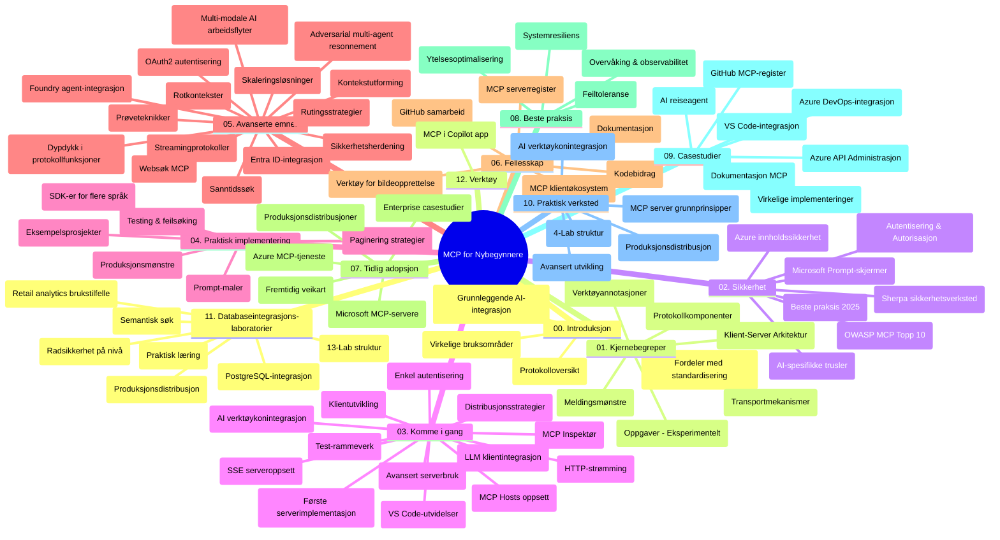

# Model Context Protocol (MCP) for nybegynnere - Studieguide

Denne studieguiden gir en oversikt over repositoriets struktur og innhold for "Model Context Protocol (MCP) for nybegynnere"-pensum. Bruk denne guiden for å navigere effektivt i repositoriet og få mest mulig ut av de tilgjengelige ressursene.

## Oversikt over repositoriet

Model Context Protocol (MCP) er en standardisert ramme for interaksjoner mellom AI-modeller og klientapplikasjoner. Opprinnelig skapt av Anthropic, vedlikeholdes MCP nå av det bredere MCP-fellesskapet gjennom den offisielle GitHub-organisasjonen. Dette repositoriet tilbyr et omfattende pensum med praktiske kodeeksempler i C#, Java, JavaScript, Python og TypeScript, designet for AI-utviklere, systemarkitekter og programvareingeniører.

## Visuell pensumkart

## Repositoriets struktur

Repositoriet er organisert i tolv hovedseksjoner, hver med fokus på ulike aspekter av MCP:

1. **Introduksjon (00-Introduction/)**
   - Oversikt over Model Context Protocol
   - Hvorfor standardisering er viktig i AI-pipelines
   - Praktiske bruksområder og fordeler

2. **Kjernebegreper (01-CoreConcepts/)**
   - Klient-server-arkitektur
   - Nøkkelkomponenter i protokollen
   - Meldingsmønstre i MCP

3. **Sikkerhet (02-Security/)**
   - Sikkerhetstrusler i MCP-baserte systemer
   - Beste praksis for å sikre implementasjoner
   - Autentisering og autorisasjonsstrategier
   - **Omfattende sikkerhetsdokumentasjon**:
     - MCP sikkerhets beste praksis 2025
     - Azure Content Safety implementasjonsveiledning
     - MCP sikkerhetskontroller og teknikker
     - MCP beste praksis hurtigreferanse
   - **Nøkkeltemaer innen sikkerhet**:
     - Prompt-injeksjon og verktøyforgiftingsangrep
     - Sesjonskapring og confused deputy-problemer
     - Token-passthrough sårbarheter
     - Overdrevne tillatelser og tilgangskontroll
     - Sikkerhet i leverandørkjeden for AI-komponenter
     - Microsoft Prompt Shields-integrasjon

4. **Kom i gang (03-GettingStarted/)**
   - Oppsett og konfigurasjon av miljø
   - Opprette grunnleggende MCP-servere og klienter
   - Integrasjon med eksisterende applikasjoner
   - Inkluderer seksjoner for:
     - Første serverimplementasjon
     - Klientutvikling
     - LLM-klientintegrasjon
     - VS Code-integrasjon
     - Server-Sent Events (SSE) server
     - Avansert serverbruk
     - HTTP-strømming
     - AI Toolkit-integrasjon
     - Teststrategier
     - Distribusjonsretningslinjer

5. **Praktisk implementasjon (04-PracticalImplementation/)**
   - Bruke SDK-er på ulike programmeringsspråk
   - Feilsøking, testing og valideringsteknikker
   - Lage gjenbrukbare promptmaler og arbeidsflyter
   - Eksempelsprosjekter med implementasjonsdemonstrasjoner

6. **Avanserte emner (05-AdvancedTopics/)**
   - Kontekst-teknikker (context engineering)
   - Foundry-agent-integrasjon
   - Multi-modal AI-arbeidsflyt
   - OAuth2-autentiseringsdemoer
   - Sanntidssøk
   - Sanntidsstrømming
   - Root-kontekster implementering
   - Rutingsstrategier
   - Sampling-teknikker
   - Skaleringsmetoder
   - Sikkerhetshensyn
   - Entra ID sikkerhetsintegrasjon
   - Websøk-integrasjon
   - Adversarial multi-agent resonnement (debattmønstre)

7. **Fellesskapsbidrag (06-CommunityContributions/)**
   - Hvordan bidra med kode og dokumentasjon
   - Samarbeid via GitHub
   - Fellesskapsstyrte forbedringer og tilbakemeldinger
   - Bruke ulike MCP-klienter (Claude Desktop, Cline, VSCode)
   - Jobbe med populære MCP-servere inkludert bilde-generering

8. **Lærdom fra tidlig adopsjon (07-LessonsfromEarlyAdoption/)**
   - Virkelighetsnære implementasjoner og suksesshistorier
   - Bygge og deployere MCP-baserte løsninger
   - Trender og fremtidig veikart
   - **Microsoft MCP Server Guide**: Omfattende guide til 10 produksjonsklare Microsoft MCP-servere inkludert:
     - Microsoft Learn Docs MCP Server
     - Azure MCP Server (15+ spesialiserte connectorer)
     - GitHub MCP Server
     - Azure DevOps MCP Server
     - MarkItDown MCP Server
     - SQL Server MCP Server
     - Playwright MCP Server
     - Dev Box MCP Server
     - Microsoft Foundry MCP Server
     - Microsoft 365 Agents Toolkit MCP Server

9. **Beste praksis (08-BestPractices/)**
   - Ytelsesjustering og optimalisering
   - Utforming av feiltolerante MCP-systemer
   - Test- og robusthetsstrategier

10. **Case-studier (09-CaseStudy/)**
    - **Syv omfattende case-studier** som demonstrerer MCPs allsidighet i ulike scenarier:
    - **Azure AI Reisearrangører**: Multi-agent orkestrering med Azure OpenAI og AI Search
    - **Azure DevOps-integrasjon**: Automatisere arbeidsflyt med YouTube datoppdateringer
    - **Sanntids dokumentasjonshenting**: Python konsollklient med HTTP-strømming
    - **Interaktiv studieplan-generator**: Chainlit web-app med samtale-AI
    - **Dokumentasjon i editor**: VS Code integrasjon med GitHub Copilot arbeidsflyter
    - **Azure API Management**: Enterprise API-integrasjon med MCP-serveropprettelse
    - **GitHub MCP Registry**: Økosystemutvikling og agentbasert integrasjonsplattform
    - Implementasjonseksempler som spenner over enterprise-integrasjon, utviklerproduktivitet og økosystemutvikling

11. **Hands-on-workshop (10-StreamliningAIWorkflowsBuildingAnMCPServerWithAIToolkit/)**
    - Omfattende praktisk workshop som kombinerer MCP med AI Toolkit
    - Bygge intelligente applikasjoner som kobler AI-modeller med virkelige verktøy
    - Praktiske moduler som dekker grunnleggende, tilpasset serverutvikling og produksjonsdistribusjon
    - **Labstruktur**:
      - Lab 1: MCP server-grunnleggende
      - Lab 2: Avansert MCP serverutvikling
      - Lab 3: AI Toolkit integrasjon
      - Lab 4: Produksjonsdistribusjon og skalering
    - Lab-basert læring med trinnvise instruksjoner

12. **MCP server databaseintegrasjon labs (11-MCPServerHandsOnLabs/)**
    - **Omfattende 13-labers læringsløype** for å bygge produksjonsklare MCP-servere med PostgreSQL-integrasjon
    - **Virkelighetsnær detaljhandelsanalyse** med Zava Retail brukstilfelle
    - **Enterprise-grade mønstre** inkludert Row Level Security (RLS), semantisk søk og multitenant data-tilgang
    - **Fullstendig labstruktur**:
      - **Labs 00-03: Grunnlag** - Introduksjon, arkitektur, sikkerhet, miljøoppsett
      - **Labs 04-06: Bygge MCP-serveren** - Databasedesign, MCP serverimplementasjon, verktøyutvikling
      - **Labs 07-09: Avanserte funksjoner** - Semantisk søk, testing og feilsøking, VS Code-integrasjon
      - **Labs 10-12: Produksjon og beste praksis** - Distribusjon, overvåking, optimalisering
    - **Dekket teknologi**: FastMCP-rammeverk, PostgreSQL, Azure OpenAI, Azure Container Apps, Application Insights
    - **Læringsutbytte**: Produksjonsklare MCP-servere, databaseintegrasjonsmønstre, AI-drevet analyse, enterprise-sikkerhet

13. **Verktøy (12-tooling/)**
    - Lær hvordan bruke MCP i Copilot-app og andre verktøy

## Ytterligere ressurser

Repositoriet inkluderer støtteressurser:

- **Bilder-mappe**: Inneholder diagrammer og illustrasjoner brukt gjennom pensumet
- **Oversettelser**: Flerspråklig støtte med automatiske oversettelser av dokumentasjonen
- **Offisielle MCP-ressurser**:
  - [MCP Dokumentasjon](https://modelcontextprotocol.io/)
  - [MCP Spesifikasjon](https://spec.modelcontextprotocol.io/)
  - [MCP GitHub Repository](https://github.com/modelcontextprotocol)

## Hvordan bruke dette repositoriet

1. **Sekvensiell læring**: Følg kapitlene i rekkefølge (00 til 11) for en strukturert læringsopplevelse.
2. **Språkspesifikt fokus**: Hvis du er interessert i et bestemt programmeringsspråk, utforsk sample-mappene for implementeringer i ditt foretrukne språk.
3. **Praktisk implementasjon**: Start med delen "Kom i gang" for å sette opp miljø og lage din første MCP-server og klient.
4. **Avansert utforsking**: Når du er komfortabel med det grunnleggende, dykk inn i de avanserte temaene for å utvide kunnskapen.
5. **Fellesskapsengasjement**: Bli med i MCP-fellesskapet via GitHub-diskusjoner og Discord-kanaler for å koble til eksperter og andre utviklere.

## MCP-klienter og verktøy

Pensumet dekker ulike MCP-klienter og verktøy:

1. **Offisielle klienter**:
   - Visual Studio Code
   - MCP i Visual Studio Code
   - Claude Desktop
   - Claude i VSCode
   - Claude API

2. **Fellesskapsklienter**:
   - Cline (terminalbasert)
   - Cursor (kode-editor)
   - ChatMCP
   - Windsurf

3. **MCP administrasjonsverktøy**:
   - MCP CLI
   - MCP Manager
   - MCP Linker
   - MCP Router

## Populære MCP-servere

Repositoriet introduserer ulike MCP-servere, inkludert:

1. **Offisielle Microsoft MCP-servere**:
   - Microsoft Learn Docs MCP Server
   - Azure MCP Server (15+ spesialiserte connectorer)
   - GitHub MCP Server
   - Azure DevOps MCP Server
   - MarkItDown MCP Server
   - SQL Server MCP Server
   - Playwright MCP Server
   - Dev Box MCP Server
   - Microsoft Foundry MCP Server
   - Microsoft 365 Agents Toolkit MCP Server

2. **Offisielle referanseservere**:
   - Filesystem
   - Fetch
   - Memory
   - Sequential Thinking

3. **Bildegenerering**:
   - Azure OpenAI DALL-E 3
   - Stable Diffusion WebUI
   - Replicate

4. **Utviklingsverktøy**:
   - Git MCP
   - Terminal Control
   - Code Assistant

5. **Spesialiserte servere**:
   - Salesforce
   - Microsoft Teams
   - Jira & Confluence

## Bidra

Dette repositoriet ønsker bidrag fra fellesskapet velkommen. Se seksjonen Fellesskapsbidrag for veiledning om hvordan bidra effektivt til MCP-økosystemet.

----

*Denne studieguiden ble sist oppdatert 5. februar 2026, reflekterer den nyeste MCP Spesifikasjonen 2025-11-25 og gir en oversikt over repositoriet per denne datoen. Innholdet i repositoriet kan bli oppdatert etter denne datoen.*

---

<!-- CO-OP TRANSLATOR DISCLAIMER START -->
**Ansvarsfraskrivelse**:
Dette dokumentet er oversatt ved hjelp av AI-oversettelsestjenesten [Co-op Translator](https://github.com/Azure/co-op-translator). Selv om vi streber etter nøyaktighet, vær oppmerksom på at automatiske oversettelser kan inneholde feil eller unøyaktigheter. Det opprinnelige dokumentet på originalspråket skal betraktes som den autoritative kilden. For kritisk informasjon anbefales profesjonell menneskelig oversettelse. Vi er ikke ansvarlige for eventuelle misforståelser eller feiltolkninger som oppstår ved bruk av denne oversettelsen.
<!-- CO-OP TRANSLATOR DISCLAIMER END -->