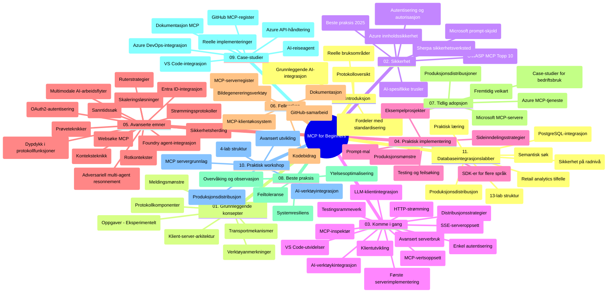

# Modellkontekstprotokoll (MCP) for nybegynnere - Studieveiledning

Denne studieveiledningen gir en oversikt over depotstrukturen og innholdet for læreplanen "Modellkontekstprotokoll (MCP) for nybegynnere". Bruk denne veiledningen for å navigere effektivt i depotet og få mest mulig ut av de tilgjengelige ressursene.

## Depotoversikt

Modellkontekstprotokollen (MCP) er en standardisert ramme for interaksjoner mellom AI-modeller og klientapplikasjoner. Opprinnelig opprettet av Anthropic, blir MCP nå vedlikeholdt av det bredere MCP-samfunnet gjennom den offisielle GitHub-organisasjonen. Dette depotet tilbyr en omfattende læreplan med praktiske kodeeksempler i C#, Java, JavaScript, Python og TypeScript, designet for AI-utviklere, systemarkitekter og programvareingeniører.

## Visuell læreplankart

## Depotstruktur

Depotet er organisert i elleve hovedseksjoner, hver med fokus på ulike aspekter av MCP:

1. **Introduksjon (00-Introduction/)**
   - Oversikt over Modellkontekstprotokollen
   - Hvorfor standardisering er viktig i AI-pipelines
   - Praktiske bruksområder og fordeler

2. **Kjernebegreper (01-CoreConcepts/)**
   - Klient-server-arkitektur
   - Viktige protokollkomponenter
   - Meldingsmønstre i MCP

3. **Sikkerhet (02-Security/)**
   - Sikkerhetstrusler i MCP-baserte systemer
   - Beste praksis for sikre implementasjoner
   - Autentiserings- og autorisasjonsstrategier
   - **Omfattende sikkerhetsdokumentasjon**:
     - MCP Sikkerhets beste praksis 2025
     - Azure Content Safety implementasjonsveiledning
     - MCP sikkerhetskontroller og teknikker
     - MCP Beste praksis hurtigreferanse
   - **Viktige sikkerhetsemner**:
     - Prompt-injeksjon og verktøyforgiftning
     - Øktatt- og forvirret stedsproblemer (confused deputy)
     - Token-gjennomgangssårbarheter
     - Overdrevne tillatelser og tilgangskontroll
     - Forsyningskjedesikkerhet for AI-komponenter
     - Microsoft Prompt Shields-integrasjon

4. **Komme i gang (03-GettingStarted/)**
   - Miljøoppsett og konfigurasjon
   - Opprette grunnleggende MCP-servere og klienter
   - Integrasjon med eksisterende applikasjoner
   - Inkluderer seksjoner for:
     - Første serverimplementasjon
     - Klientutvikling
     - LLM-klientintegrasjon
     - VS Code-integrasjon
     - Server-Sent Events (SSE) server
     - Avansert serverbruk
     - HTTP-strømming
     - AI Toolkit-integrasjon
     - Teststrategier
     - Distribusjonsretningslinjer

5. **Praktisk implementering (04-PracticalImplementation/)**
   - Bruk av SDK-er på forskjellige programmeringsspråk
   - Feilsøking, testing og valideringsteknikker
   - Utforming av gjenbrukbare prompt-maler og arbeidsflyter
   - Eksempelsprosjekter med implementasjonseksempler

6. **Avanserte temaer (05-AdvancedTopics/)**
   - Kontekstingeniørteknikker
   - Foundry-agentintegrasjon
   - Multimodale AI-arbeidsflyter
   - OAuth2-autentiseringsdemoer
   - Sanntidssøk
   - Sanntidsstrømming
   - Root-kontekster implementering
   - Ruterstrategier
   - Samplingsteknikker
   - Skaleringsmetoder
   - Sikkerhetshensyn
   - Entra ID sikkerhetsintegrasjon
   - Websøkintegrasjon
   - Adversariell multi-agent resonnering (debattmønstre)

7. **Samarbeidsbidrag i fellesskapet (06-CommunityContributions/)**
   - Hvordan bidra med kode og dokumentasjon
   - Samarbeid via GitHub
   - Fellesskapsdrevne forbedringer og tilbakemeldinger
   - Bruk av forskjellige MCP-klienter (Claude Desktop, Cline, VSCode)
   - Arbeide med populære MCP-servere inkludert bildeoppretting

8. **Lærdom fra tidlig adopsjon (07-LessonsfromEarlyAdoption/)**
   - Virkelige implementasjoner og suksesshistorier
   - Bygge og distribuere MCP-baserte løsninger
   - Trender og fremtidig veikart
   - **Microsoft MCP-serverguide**: Omfattende guide til 10 produksjonsklare Microsoft MCP-servere inkludert:
     - Microsoft Learn Docs MCP Server
     - Azure MCP Server (15+ spesialiserte koblinger)
     - GitHub MCP Server
     - Azure DevOps MCP Server
     - MarkItDown MCP Server
     - SQL Server MCP Server
     - Playwright MCP Server
     - Dev Box MCP Server
     - Microsoft Foundry MCP Server
     - Microsoft 365 Agents Toolkit MCP Server

9. **Beste praksis (08-BestPractices/)**
   - Ytelsesjustering og optimalisering
   - Design av feiltolerante MCP-systemer
   - Test- og robusthetsstrategier

10. **Case-studier (09-CaseStudy/)**
    - **Sju omfattende case-studier** som demonstrerer MCPs allsidighet på tvers av forskjellige scenarier:
    - **Azure AI Travel Agents**: Multi-agent orkestrering med Azure OpenAI og AI Search
    - **Azure DevOps-integrasjon**: Automatisering av arbeidsflytprosesser med YouTube-dataoppdateringer
    - **Sanntids dokumenttilgang**: Python konsollklient med HTTP-strømming
    - **Interaktiv studieplan-generator**: Chainlit nettapp med samtale-AI
    - **Dokumentasjon i editor**: VS Code-integrasjon med GitHub Copilot-arbeidsflyter
    - **Azure API-styring**: Enterprise API-integrasjon med opprettelse av MCP-server
    - **GitHub MCP-register**: Økosystemutvikling og agentisk integrasjonsplattform
    - Implementasjonseksempler som spenner over bedriftsintegrasjon, utviklerproduktivitet og økosystemutvikling

11. **Praktisk workshop (10-StreamliningAIWorkflowsBuildingAnMCPServerWithAIToolkit/)**
    - Omfattende praktisk workshop som kombinerer MCP med AI Toolkit
    - Bygge intelligente applikasjoner som forbinder AI-modeller med verktøy i den virkelige verden
    - Praktiske moduler som dekker grunnleggende, egendefinert serverutvikling og produksjonsdistribusjonsstrategier
    - **Lab-struktur**:
      - Lab 1: MCP Server Grunnleggende
      - Lab 2: Avansert MCP Serverutvikling
      - Lab 3: AI Toolkit-integrasjon
      - Lab 4: Produksjonsdistribusjon og skalering
    - Lab-basert læringsmetode med steg-for-steg instruksjoner

12. **MCP Server Database Integrasjonslaboratorier (11-MCPServerHandsOnLabs/)**
    - **Omfattende 13-lab læringssti** for å bygge produksjonsklare MCP-servere med PostgreSQL-integrasjon
    - **Virkelige detaljhandelsanalyse-implementasjoner** med Zava Retail-brukstilfelle
    - **Bedriftsmønstre** inkludert Row Level Security (RLS), semantisk søk og flerleietaker data-tilgang
    - **Fullstendig labstruktur**:
      - **Labs 00-03: Grunnlag** - Introduksjon, arkitektur, sikkerhet, miljøoppsett
      - **Labs 04-06: Bygging av MCP-serveren** - Databasedesign, MCP-serverimplementering, verktøyutvikling
      - **Labs 07-09: Avanserte funksjoner** - Semantisk søk, testing og feilsøking, VS Code-integrasjon
      - **Labs 10-12: Produksjon og beste praksis** - Distribusjon, overvåking, optimalisering
    - **Teknologier dekket**: FastMCP-rammeverk, PostgreSQL, Azure OpenAI, Azure Container Apps, Application Insights
    - **Læringsresultater**: Produksjonsklare MCP-servere, databaseintegrasjonsmønstre, AI-drevet analyse, bedriftsikkerhet

## Ytterligere ressurser

Depotet inkluderer støtteressurser:

- **Bilder-mappe**: Inneholder diagrammer og illustrasjoner brukt gjennom hele læreplanen
- **Oversettelser**: Flerspråklig støtte med automatisert oversettelse av dokumentasjon
- **Offisielle MCP-ressurser**:
  - [MCP-dokumentasjon](https://modelcontextprotocol.io/)
  - [MCP-spesifikasjon](https://spec.modelcontextprotocol.io/)
  - [MCP GitHub-depot](https://github.com/modelcontextprotocol)

## Hvordan bruke dette depotet

1. **Sekvensiell læring**: Følg kapitlene i rekkefølge (00 til 11) for en strukturert læringsopplevelse.
2. **Språkspesifikt fokus**: Hvis du er interessert i et bestemt programmeringsspråk, utforsk eksempelkatalogene for implementasjoner i ditt foretrukne språk.
3. **Praktisk implementering**: Start med "Komme i gang"-delen for å sette opp miljøet ditt og lage din første MCP-server og klient.
4. **Avansert utforskning**: Når du er komfortabel med det grunnleggende, dykk inn i avanserte emner for å utvide kunnskapen din.
5. **Fellesskapsengasjement**: Bli med i MCP-fellesskapet gjennom GitHub-diskusjoner og Discord-kanaler for å knytte kontakt med eksperter og andre utviklere.

## MCP-klienter og verktøy

Læreplanen dekker ulike MCP-klienter og verktøy:

1. **Offisielle klienter**:
   - Visual Studio Code
   - MCP i Visual Studio Code
   - Claude Desktop
   - Claude i VSCode
   - Claude API

2. **Fellesskapsklienter**:
   - Cline (terminalbasert)
   - Cursor (kodeeditor)
   - ChatMCP
   - Windsurf

3. **MCP-administrasjonsverktøy**:
   - MCP CLI
   - MCP Manager
   - MCP Linker
   - MCP Router

## Populære MCP-servere

Depotet introduserer ulike MCP-servere, inkludert:

1. **Offisielle Microsoft MCP-servere**:
   - Microsoft Learn Docs MCP Server
   - Azure MCP Server (15+ spesialiserte koblinger)
   - GitHub MCP Server
   - Azure DevOps MCP Server
   - MarkItDown MCP Server
   - SQL Server MCP Server
   - Playwright MCP Server
   - Dev Box MCP Server
   - Microsoft Foundry MCP Server
   - Microsoft 365 Agents Toolkit MCP Server

2. **Offisielle referanseservere**:
   - Filsystem
   - Fetch
   - Memory
   - Sequential Thinking

3. **Bildegenerering**:
   - Azure OpenAI DALL-E 3
   - Stable Diffusion WebUI
   - Replicate

4. **Utviklingsverktøy**:
   - Git MCP
   - Terminal Control
   - Code Assistant

5. **Spesialiserte servere**:
   - Salesforce
   - Microsoft Teams
   - Jira & Confluence

## Bidra

Dette depotet ønsker bidrag fra fellesskapet velkommen. Se delen for samarbeid i fellesskapet for veiledning om hvordan du kan bidra effektivt til MCP-økosystemet.

----

*Denne studieveiledningen ble sist oppdatert 5. februar 2026, basert på den siste MCP-spesifikasjonen 2025-11-25, og gir en oversikt over depotet per denne dato. Depotinnhold kan bli oppdatert etter denne datoen.*

---

<!-- CO-OP TRANSLATOR DISCLAIMER START -->
**Ansvarsfraskrivelse**:
Dette dokumentet er oversatt ved hjelp av AI-oversettelsestjenesten [Co-op Translator](https://github.com/Azure/co-op-translator). Selv om vi streber etter nøyaktighet, vær oppmerksom på at automatiske oversettelser kan inneholde feil eller unøyaktigheter. Det opprinnelige dokumentet på originalspråket skal betraktes som den autoritative kilden. For kritisk informasjon anbefales profesjonell menneskelig oversettelse. Vi er ikke ansvarlige for eventuelle misforståelser eller feiltolkninger som oppstår ved bruk av denne oversettelsen.
<!-- CO-OP TRANSLATOR DISCLAIMER END -->