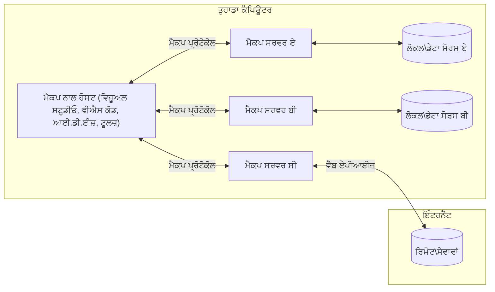

# MCP Core Concepts: AI ਇੰਟੀਗਰੇਸ਼ਨ ਲਈ ਮਾਡਲ ਸੰਦੇਸ਼ ਪਰੋਟੋਕਾਲ ਵਿੱਚ ਪ੍ਰਾਵੀਣਾ ਹਾਸਲ ਕਰਨਾ

[](https://youtu.be/earDzWGtE84)

_(ਇਸ ਪਾਠ ਦਾ ਵੀਡੀਓ ਦੇਖਣ ਲਈ ਉਪਰ ਦਿੱਤੀ ਚਿੱਤਰ 'ਤੇ ਕਲਿੱਕ ਕਰੋ)_

[Model Context Protocol (MCP)](https://github.com/modelcontextprotocol) ਇੱਕ ਸ਼ਕਤੀਸ਼ালী, ਮਿਆਰੀ ਫਰੇਮਵਰਕ ਹੈ ਜੋ ਵੱਡੇ ਭਾਸ਼ਾ ਮਾਡਲਾਂ (LLMs) ਅਤੇ ਬਾਹਰੀ ਉਪਕਰਣਾਂ, ਐਪਲੀਕੇਸ਼ਨਾਂ ਅਤੇ ਡਾਟਾ ਸਰੋਤਾਂ ਦੇ ਵਿਚਕਾਰ ਸਾਂਝੇਦਾਰੀ ਨੂੰ ਵਧੀਆ ਬਣਾਉਂਦਾ ਹੈ। 
ਇਹ ਗਾਈਡ ਤੁਹਾਡੇ ਨੂੰ MCP ਦੇ ਮੁੱਖ ਸੰਕਲਪਾਂ ਬਾਰੇ ਜਾਣੂ ਕਰਵਾਏਗਾ। ਤੁਸੀਂ ਇਸ ਦੀ ਕਲਾਇੰਟ-ਸਰਵਰ ਆਰਕੀਟੇਕਚਰ, ਜਰੂਰੀ ਭਾਗ, ਸੰਚਾਰ ਯੰਤ੍ਰਣਾਂ ਅਤੇ ਕਾਰਵਾਈ ਦੇ ਸ੍ਰੇਸ਼ਠ ਅਭਿਆਸ ਬਾਰੇ ਸਿੱਖੋਗੇ।

- **ਸਪੱਸ਼ਟ ਉਪਭੋਗਤਾ ਸਹਿਮਤੀ**: ਸਾਰੇ ਡਾਟਾ ਪਹੁੰਚ ਅਤੇ ਕਾਰਵਾਈਆਂ ਚਲਾਉਣ ਤੋਂ ਪਹਿਲਾਂ ਸਪੱਸ਼ਟ ਉਪਭੋਗਤਾ ਮਨਜ਼ੂਰੀ ਦੀ ਲੋੜ ਹੁੰਦੀ ਹੈ। ਉਪਭੋਗਤਾਵਾਂ ਨੂੰ ਸਪੱਸ਼ਟ ਤੌਰ 'ਤੇ ਸਮਝਣਾ ਚਾਹੀਦਾ ਹੈ ਕਿ ਕਿਹੜਾ ਡਾਟਾ ਪਹੁੰਚਿਆ ਜਾਵੇਗਾ ਅਤੇ ਕਿਹੜੇ ਕਾਰਜ ਕੀਤੇ ਜਾਣਗੇ, ਇਜਾਜਤਾਂ ਅਤੇ ਅਧਿਕਾਰਾਂ 'ਤੇ ਬਿਲਕੁਲ ਨਜ਼ਰ ਰੱਖਣ ਦੇ ਨਾਲ।

- **ਡਾਟਾ ਪ੍ਰਾਈਵੇਸੀ ਸੁਰੱਖਿਆ**: ਉਪਭੋਗਤਾ ਦਾ ਡਾਟਾ ਸਿਰਫ ਸਪੱਸ਼ਟ ਸਹਿਮਤੀ ਨਾਲ ਹੀ ਖ਼ੁਲਾਸਾ ਕੀਤਾ ਜਾਵੇਗਾ ਅਤੇ ਪੂਰੇ ਇੰਟਰੈਕਸ਼ਨ ਲਾਈਫਸਾਈਕਲ ਦੌਰਾਨ ਮਜ਼ਬੂਤ ਪਹੁੰਚ ਨਿਯੰਤਰਣਾਂ ਨਾਲ ਸੁਰੱਖਿਅਤ ਰੱਖਿਆ ਜਾਵੇगा। ਨਾਬਰਾਬਰੀ ਵਾਲੀ ਡਾਟਾ ਟਰਾਂਸਮਿਸ਼ਨ ਨੂੰ ਰੋਕਿਆ ਜਾਵੇ ਅਤੇ ਬਹੁਤ ਸਰਟ ਪ੍ਰਾਈਵੇਸੀ ਸਰਹੱਦਾਂ ਨੂੰ ਬਣਾਇਆ ਜਾਵੇ।

- **ਉਪਕਰਨ ਚਲਾਉਣ ਦੀ ਸੁਰੱਖਿਆ**: ਹਰ ਉਪਕਰਨ ਦੀ ਕਾਲ ਸਪੱਸ਼ਟ ਉਪਭੋਗਤਾ ਦੀ ਸਹਿਮਤੀ ਨਾਲ ਹੋਣੀ ਚਾਹੀਦੀ ਹੈ ਜਿਸ ਵਿੱਚ ਉਸ ਉਪਕਰਨ ਦੀ ਕਾਰਗੁਜ਼ਾਰੀ, ਪੈਰਾਮੀਟਰ ਅਤੇ ਸੰਭਾਵਿਤ ਪ੍ਰਭਾਵ ਦੀ ਸਪੱਸ਼ਟ ਸਮਝ ਸ਼ਾਮਲ ਹੋਵੇ। ਮਜ਼ਬੂਤ ਸੁਰੱਖਿਆ ਸਰਹੱਦਾਂ ਅਣਚਾਹੀ, ਅਸੁਰੱਖਿਅਤ ਜਾਂ ਨੁਕਸਾਨਦਾਇਕ ਉਪਕਰਨ ਚਲਾਉਣ ਨੂੰ ਰੋਕਣਗੀਆਂ।

- **ਟ੍ਰਾਂਸਪੋਰਟ ਲੇਅਰ ਸੁਰੱਖਿਆ**: ਸਾਰੇ ਸੰਚਾਰ ਚੈਨਲ ਉਚਿਤ ਇਨਕ੍ਰਿਪਸ਼ਨ ਅਤੇ ਪ੍ਰਮਾਣਿਕਤਾ ਯੰਤਰਾਂ ਦੀ ਵਰਤੋਂ ਕਰਨ ਚਾਹੀਦੇ ਹਨ। ਦੂਰ-ਦराज਼ ਕਨੈਕਸ਼ਨ ਸੁਰੱਖਿਅਤ ਟ੍ਰਾਂਸਪੋਰਟ ਪਰੋਟੋਕਾਲਾਂ ਅਤੇ ਢੰਗ ਦੀ ਪ੍ਰਮਾਣਪੱਤਰ ਪ੍ਰਬੰਧਨ ਲਾਗੂ ਕਰਨ।

#### ਕਾਰਵਾਈ ਦੇ ਮਾਰਗਦਰਸ਼ਕ:

- **ਇਜਾਜਤ ਪ੍ਰਬੰਧਨ**: ਬਰੀਕੀ ਨਾਲ ਬਣੇ ਇਜਾਜਤ ਸਿਸਟਮ ਲਾਗੂ ਕਰੋ ਜੋ ਉਪਭੋਗਤਾਵਾਂ ਨੂੰ ਇਹ ਕੰਟਰੋਲ ਕਰਨ ਦੇਣ ਕਿ ਕਿਹੜੇ ਸਰਵਰ, ਉਪਕਰਣ ਅਤੇ ਸਰੋਤ ਉਪਲਬਧ ਹਨ
- **ਪ੍ਰਮਾਣੀਕਰਨ ਅਤੇ ਅਧਿਕਾਰਾਇਤਰਣ**: ਸੁਰੱਖਿਅਤ ਪ੍ਰਮਾਣੀਕਰਨ ਤਰੀਕੇ (OAuth, API ਕੁੰਜੀਆਂ) ਵਰਤੋ ਜੋ ਢੰਗ ਨਾਲ ਟੋਕਨ ਪ੍ਰਬੰਧਨ ਅਤੇ ਮਿਆਦ ਪੁੱਜਣ ਸਮੇਤ ਹੁੰਦੇ ਹਨ  
- **ਇਨਪੁੱਟ ਵੈਰੀਫਿਕੇਸ਼ਨ**: ਸਾਰੇ ਪੈਰਾਮੀਟਰ ਅਤੇ ਡਾਟਾ ਇਨਪੁੱਟ ਵੈਲਿਡੇਟ ਕਰੋ ਜੋ ਪੁਰਨ ਲਏ ਡਿਫਾਈਂ ਕੀਤੇ ਸਖੀਆਂ (schemas) ਅਨੁਸਾਰ ਹੋਣ ਤਾਂ ਜੋ ਇੰਜੈਕਸ਼ਨ ਹਮਲਿਆਂ ਨੂੰ ਰੋਕਿਆ ਜਾ ਸਕੇ
- **ਲਾਗ ਰੇਕੋੜ**: ਸੁਰੱਖਿਆ ਨਿਗਰਾਨੀ ਅਤੇ ਪਾਲਣਾ ਲਈ ਸਾਰੇ ਕਾਰਜਾਂ ਦੇ ਵਿਆਪਕ ਲਾਗ ਜ਼ਰੂਰ ਰੱਖੋ

## ਓਵਰਵਿਊ

ਇਹ ਪਾਠ Model Context Protocol (MCP) ਨਾਲ ਜੁੜੀ ਮੂਲ ਆਰਕੀਟੇਕਚਰ ਅਤੇ ਭਾਗਾਂ ਦੀ ਖੋਜ ਕਰਦਾ ਹੈ। ਤੁਸੀਂ ਕਲਾਇੰਟ-ਸਰਵਰ ਆਰਕੀਟੇਕਚਰ, ਮੁੱਖ ਭਾਗ, ਅਤੇ MCP ਇੰਟਰੈਕਸ਼ਨਾਂ ਨੂੰ ਚਲਾਉਣ ਵਾਲੀਆਂ ਸੰਚਾਰਯੰਤ੍ਰਾਂ ਬਾਰੇ ਜਾਣੋਗੇ।

## ਮੁੱਖ ਸਿੱਖਣ ਦੇ ਲਕੜੇ

ਇਸ ਪਾਠ ਦੇ ਅੰਤ ਤੱਕ, ਤੁਸੀਂ:

- MCP ਕਲਾਇੰਟ-ਸਰਵਰ ਆਰਕੀਟੇਕਚਰ ਨੂੰ ਸਮਝੋਗੇ।
- ਹੋਸਟਾਂ, ਕਲਾਇੰਟਾਂ ਅਤੇ ਸਰਵਰਾਂ ਦੀਆਂ ਭੂਮਿਕਾਵਾਂ ਅਤੇ ਜ਼ਿੰਮੇਵਾਰੀਆਂ ਦੀ ਪਛਾਣ ਕਰੋਗੇ।
- ਉਹ ਮੁੱਖ ਫੀਚਰ ਵਿਸ਼ਲੇਸ਼ਣ ਕਰੋਗੇ ਜੋ MCP ਨੂੰ ਇੱਕ ਲਚਕੀਲਾ ਇੰਟੀਗ੍ਰੇਸ਼ਨ ਪਰਤ ਬਣਾਉਂਦੇ ਹਨ।
- MCP ਪਰਿਸਰ ਵਿੱਚ ਜਾਣਕਾਰੀ ਕਿਵੇਂ 흐르ਦੀ ਹੈ, ਜਾਣੋਗੇ।
- .NET, ਜਾਵਾ, ਪਾਇਥਨ ਅਤੇ ਜਾਵਾਸਕ੍ਰਿਪਟ ਵਿਚ ਕੋਡ ਉਦਾਹਰਣਾਂ ਰਾਹੀਂ ਹਕੀਕਤੀ ਜ਼ਾਹਿਰੀਕਰਨ ਪ੍ਰਾਪਤ ਕਰੋਗੇ।

## MCP ਆਰਕੀਟੇਕਚਰ: ਇਕ ਗਹਿਰਾਈ ਵਾਲੀ ਨਜ਼ਰ

MCP ਪਰਿਸਰ ਇੱਕ ਕਲਾਇੰਟ-ਸਰਵਰ ਮਾਡਲ 'ਤੇ ਆਧਾਰਿਤ ਹੈ। ਇਹ ਮਾਡਲਰ ਸੰਰਚਨਾ AI ਐਪਲੀਕੇਸ਼ਨਾਂ ਨੂੰ ਟੂਲਾਂ, ਡਾਟਾਬੇਸਾਂ, APIਆਂ ਅਤੇ ਸੰਦਰਭਿਕ ਸਰੋਤਾਂ ਨਾਲ ਪ੍ਰਭਾਵਸ਼ਾਲੀ ਤਰੀਕੇ ਨਾਲ ਇੰਟਰੈਕਟ ਕਰਨ ਦੀ ਇਜਾਜ਼ਤ ਦਿੰਦੀ ਹੈ। ਚਲੋ ਇਸ ਆਰਕੀਟੇਕਚਰ ਨੂੰ ਇਸਦੇ ਮੁੱਖ ਭਾਗਾਂ ਵਿੱਚ ਵੰਡਦੇ ਹਾਂ।

ਆਪਣੇ ਪ੍ਰਮੁੱਖ ਤੌਰ 'ਤੇ, MCP ਇੱਕ ਕਲਾਇੰਟ-ਸਰਵਰ ਆਰਕੀਟੇਕਚਰ ਮੰਨਦਾ ਹੈ ਜਿੱਥੇ ਇੱਕ ਹੋਸਟ ਐਪਲੀਕੇਸ਼ਨ ਕਈ ਸਰਵਰਾਂ ਨਾਲ ਜੁੜ ਸਕਦਾ ਹੈ:


- **MCP ਹੋਸਟਸ**: VSCode, Claude ਡੈਸਕਟੌਪ, IDEs ਜਾਂ AI ਟੂਲ ਜੋ MCP ਰਾਹੀਂ ਡਾਟਾ ਤੱਕ ਪਹੁੰਚਣਾ ਚਾਹੁੰਦੇ ਹਨ
- **MCP ਕਲਾਇੰਟਸ**: ਪ੍ਰੋਟੋਕਾਲ ਕਲਾਇੰਟ ਜੋ ਸਰਵਰਾਂ ਨਾਲ 1:1 ਕਨੈਕਸ਼ਨ ਬਣਾਈ ਰੱਖਦੇ ਹਨ
- **MCP ਸਰਵਰਸ**: ਹਲਕੇ-ਫੁਲਕੇ ਪ੍ਰੋਗਰਾਮ ਜੋ ਮਿਆਰੀਕ੍ਰਿਤ Model Context Protocol ਰਾਹੀਂ ਵਿਸ਼ੇਸ਼ ਸਮਰੱਥਾਵਾਂ ਨੂੰ ਪ੍ਰਦਾਨ ਕਰਦੇ ਹਨ
- **ਲੋਕਲ ਡਾਟਾ ਸਰੋਤ**: ਤੁਹਾਡੇ ਕੰਪ्यूटर ਦੀਆਂ ਫਾਈਲਾਂ, ਡਾਟਾਬੇਸ, ਅਤੇ ਸਰਵਿਸਾਂ ਜੋ MCP ਸਰਵਰਾਂ ਦੁਆਰਾ ਸੁਰੱਖਿਅਤ ਤੌਰ 'ਤੇ ਪਹੁੰਚੀਆਂ ਜਾ ਸਕਦੀਆਂ ਹਨ
- **ਰੀਮੋਟ ਸਰਵਿਸਾਂ**: ਇੰਟਰਨੈੱਟ ਉੱਤੇ ਉਪਲਬਧ ਬਾਹਰੀ ਪ੍ਰਣਾਲੀਆਂ ਜੋ MCP ਸਰਵਰ APIs ਰਾਹੀਂ ਜੁੜ ਸਕਦੇ ਹਨ।

MCP Protocol ਇੱਕ ਵਿਕਸੀਤ ਹੁੰਦਾ ਮਿਆਰ ਹੈ ਜੋ ਮਿਤੀ-ਆਧਾਰਿਤ ਵਰਜ਼ਨਿੰਗ (YYYY-MM-DD ਫਾਰਮੈਟ) ਵਰਤਦਾ ਹੈ। ਮੌਜੂਦਾ ਪਰੋਟੋਕਾਲ ਵਰਜ਼ਨ ਹੈ **2025-11-25**। ਤੁਸੀਂ ਤਾਜ਼ਾ ਅੱਪਡੇਟਾਂ ਨੂੰ [ਪ੍ਰੋਟੋਕਾਲ ਵਿਸ਼ੇਸ਼ਤਾ](https://modelcontextprotocol.io/specification/2025-11-25/) 'ਚ ਦੇਖ ਸਕਦੇ ਹੋ।

### 1. ਹੋਸਟਸ

Model Context Protocol (MCP) ਵਿੱਚ, **ਹੋਸਟਸ** ਉਹ AI ਐਪਲੀਕੇਸ਼ਨਾਂ ਹਨ ਜੋ ਵਰਤੋਂਕਾਰਾਂ ਨੂੰ ਪ੍ਰੋਟੋਕਾਲ ਨਾਲ ਮੁੱਖ ਇੰਟਰਫੇਸ ਦੇ ਤੌਰ 'ਤੇ ਸੇਵਾ ਦਿੰਦੇ ਹਨ। ਹੋਸਟ MCP ਸਰਵਰਾਂ ਨਾਲ ਕਈ ਜੁੜਾਅ ਦਾ ਪ੍ਰਬੰਧਨ ਕਰਦੇ ਹਨ ਅਤੇ ਹਰ ਸਰਵਰ ਕਨੈਕਸ਼ਨ ਲਈ ਨਿਰਪੱਖ MCP ਕਲਾਇੰਟ ਬਣਾਉਂਦੇ ਹਨ। ਹੋਸਟਾਂ ਦੇ ਉਦਾਹਰਣ:

- **AI ਐਪਲੀਕੇਸ਼ਨ**: Claude ਡੈਸਕਟੌਪ, Visual Studio ਕੋਡ, Claude ਕੋਡ
- **ਡਿਵੈਲਪਮੈਂਟ ਵਾਤਾਵਰਨ**: IDEs ਅਤੇ ਕੋਡ ਐਡੀਟਰ ਜਿਹੜੇ MCP ਇੰਟੀਗ੍ਰੇਸ਼ਨ ਨਾਲ  
- **ਕਸਟਮ ਐਪਲੀਕੇਸ਼ਨ**: ਉਦੇਸ਼-ਨਿਰਮਿਤ AI ਏਜੰਟ ਅਤੇ ਟੂਲ

**ਹੋਸਟਸ** ਉਹ ਐਪਲੀਕੇਸ਼ਨ ਹਨ ਜੋ AI ਮਾਡਲ ਇੰਟਰੈਕਸ਼ਨਾਂ ਦਾ ਸਮਨਵਯ ਕਰਦੇ ਹਨ। ਉਹ:

- **AI ਮਾਡਲਾਂ ਦਾ ਸੰਗਠਨ ਕਰਦੇ ਹਨ**: ਲਾਰਜ ਲੈਂਗਵੇਜ਼ ਮਾਡਲ (LLMs) ਦੇ ਨਾਲ ਸੰਚਾਲਨ ਜਾਂ ਸੰਵਾਦ ਲਈ ਕਮਾਂਡ ਜਾਰੀ ਕਰਦੇ ਹਨ
- **ਕਲਾਇੰਟ ਕਨੈਕਸ਼ਨਾਂ ਦਾ ਪ੍ਰਬੰਧ ਕਰਦੇ ਹਨ**: ਹਰ MCP ਸਰਵਰ ਕਨੈਕਸ਼ਨ ਲਈ ਇੱਕ MCP ਕਲਾਇੰਟ ਬਣਾਉਂਦੇ ਅਤੇ ਸੰਭਾਲਦੇ ਹਨ
- **ਯੂਜ਼ਰ ਇੰਟਰਫੇਸ 'ਤੇ ਕੰਟਰੋਲ ਕਰਦੇ ਹਨ**: ਗੱਲਬਾਤ ਦੇ ਪ੍ਰਵਾਹ, ਯੂਜ਼ਰ ਇੰਟਰੈਕਸ਼ਨ, ਅਤੇ ਉੱਤਰਾਂ ਦੀ ਪ੍ਰਸਤੁਤੀ ਸੰਭਾਲਦੇ ਹਨ  
- **ਸੁਰੱਖਿਆ ਢੰਗ ਅਮਲ ਕਰਦੇ ਹਨ**: ਇਜਾਜਤਾਂ, ਸੁਰੱਖਿਆ ਸੀਮਾਵਾਂ ਅਤੇ ਪ੍ਰਮਾਣਿਕਤਾ ਨੂੰ ਕੰਟਰੋਲ ਕਰਦੇ ਹਨ
- **ਉਪਭੋਗਤਾ ਸਹਿਮਤੀ ਸੰਭਾਲਦੇ ਹਨ**: ਡਾਟਾ ਸਾਂਝਾ ਕਰਨ ਅਤੇ ਟੂਲ ਚਲਾਉਣ ਲਈ ਯੂਜ਼ਰ ਮਨਜ਼ੂਰੀ ਪ੍ਰਣਾਲੀ ਦੇਂਦੇ ਹਨ


### 2. ਕਲਾਇੰਟਸ

**ਕਲਾਇੰਟਸ** ਜ਼ਰੂਰੀ ਭਾਗ ਹਨ ਜੋ MCP ਹੋਸਟਾਂ ਅਤੇ MCP ਸਰਵਰਾਂ ਵਿੱਚ ਨਿਰਪੱਖ ਇਕ ਤੋਂ ਇਕ ਕਨੈਕਸ਼ਨਜ਼ ਬਣਾਉਂਦੇ ਹਨ। ਹਰ MCP ਕਲਾਇੰਟ ਹੋਸਟ ਵਲੋਂ ਕਿਸੇ ਖਾਸ MCP ਸਰਵਰ ਨਾਲ ਜੁੜਨ ਲਈ ਬਣਾਇਆ ਜਾਂਦਾ ਹੈ, ਜੋ ਸੁਚੱਜੀ ਅਤੇ ਸੁਰੱਖਿਅਤ ਸੰਚਾਰ ਚੈਨਲ ਯਕੀਨੀ ਬਣਾਉਂਦਾ ਹੈ। ਬਹੁਤ ਸਾਰੇ ਕਲਾਇੰਟ ਇੱਕੋ ਸਮੇਂ ਕਈ ਸਰਵਰਾਂ ਨਾਲ ਹੋਸਟ ਨੂੰ ਕਨੈਕਟ ਕਰਨ ਯੋਗ ਬਣਾਉਂਦੇ ਹਨ।

**ਕਲਾਇੰਟਸ** ਕਨੈਕਟਰ ਭਾਗ ਹਨ ਜੋ ਹੋਸਟ ਐਪਲੀਕੇਸ਼ਨ ਦੇ ਅੰਦਰ ਹੁੰਦੇ ਹਨ। ਉਹ:

- **ਪਰੋਟੋਕਾਲ ਸੰਚਾਰ ਕਰਦੇ ਹਨ**: ਸਰਵਰਾਂ ਨੂੰ JSON-RPC 2.0 ਬੇਨਤੀਆਂ ਭੇਜਦੇ ਹਨ ਜੋ ਪ੍ਰੰਪਟ ਅਤੇ ਹੁਕਮ ਸ਼ਾਮਲ ਹੁੰਦੇ ਹਨ
- **ਸਮਰੱਥਾ ਵਿੱਚ ਸੌਦਾ ਕਰਦੇ ਹਨ**: ਸ਼ੁਰੂਆਤ ਦੌਰਾਨ ਸਰਵਰਾਂ ਨਾਲ ਸਮਰਥਨ ਵਾਲੇ ਫੀਚਰਾਂ ਅਤੇ ਪਰੋਟੋਕਾਲ ਵਰਜ਼ਨਾਂ 'ਤੇ ਵਿਚਾਰ-ਵਟਾਂਦਰਾ ਕਰਦੇ ਹਨ
- **ਉਪਕਰਨ ਚਲਾਉਂਦੇ ਹਨ**: ਮਾਡਲਾਂ ਵਲੋਂ ਟੂਲ ਚਲਾਉਣ ਦੀਆਂ ਬੇਨਤੀਆਂ ਸੰਭਾਲਦੇ ਅਤੇ ਜਵਾਬ ਪ੍ਰਕਿਰਿਆ ਕਰਦੇ ਹਨ
- **ਰੀਅਲ-ਟਾਈਮ ਅੱਪਡੇਟ ਸੰਭਾਲਦੇ ਹਨ**: ਸਰਵਰਾਂ ਵਲੋਂ ਨੋਟੀਫਿਕੇਸ਼ਨ ਅਤੇ ਤਾਜ਼ਾ ਅਧਿਆਇ ਪ੍ਰਾਪਤ ਕਰਦੇ ਹਨ
- **ਪ੍ਰਤੀਕਿਰਿਆ ਪ੍ਰਕਿਰਿਆ**: ਉਪਭੋਗਤਾ ਲਈ ਸਰਵਰ ਪ੍ਰਤੀਕਿਰਿਆ ਦੇ ਪ੍ਰਦਰਸ਼ਨ ਲਈ ਪ੍ਰਕਿਰਿਆ ਅਤੇ ਫਾਰਮੈਟ ਕਰਦੇ ਹਨ

### 3. ਸਰਵਰਸ

**ਸਰਵਰਸ** ਪ੍ਰੋਗਰਾਮ ਹਨ ਜੋ MCP ਕਲਾਇੰਟਸ ਨੂੰ ਸੰਦਰਭ, ਉਪਕਰਣ ਅਤੇ ਸਮਰੱਥਾ ਪ੍ਰਦਾਨ ਕਰਦੇ ਹਨ। ਇਹ ਲੋਕਲ ਤੌਰ 'ਤੇ (ਹੋਸਟ ਦੇ ਨਾਲ ਹੀ ਮਸ਼ੀਨ 'ਤੇ) ਜਾਂ ਦੂਰ-ਦਰਾਜ਼ (ਬਾਹਰੀ ਪਲੇਟਫਾਰਮਾਂ 'ਤੇ) ਚੱਲ ਸਕਦੇ ਹਨ, ਅਤੇ ਕਲਾਇੰਟ ਦੀਆਂ ਬੇਨਤੀਆਂ ਸੰਭਾਲਣ ਅਤੇ ਸੰਰਚਿਤ ਜਵਾਬ ਦੇਣ ਲਈ ਜ਼ਿੰਮੇਵਾਰ ਹੁੰਦੇ ਹਨ। ਸਰਵਰ MCP ਪਰੋਟੋਕਾਲ ਰਾਹੀਂ ਵਿਸ਼ੇਸ਼ ਕਾਰਗੁਜ਼ਾਰੀ ਖੁਲਾਸਾ ਕਰਦੇ ਹਨ।

**ਸਰਵਰਸ** ਉਹ ਸਰਵਿਸਾਂ ਹਨ ਜੋ ਸੰਦਰਭ ਅਤੇ ਸਮਰੱਥਾਵਾਂ ਪ੍ਰਦਾਨ ਕਰਦੇ ਹਨ। ਉਹ:

- **ਫੀਚਰ ਰਜਿਸਟਰੇਸ਼ਨ ਕਰਦੇ ਹਨ**: ਕਲਾਇੰਟਾਂ ਨੂੰ ਉਪਲਬਧ ਪ੍ਰਾਈਮਟੀਵ (ਸਰੋਤ, ਪ੍ਰੰਪਟ, ਟੂਲ) ਦਰਜ ਅਤੇ ਖੁਲਾਸਾ ਕਰਨਗੇ
- **ਬੇਨਤੀ ਪ੍ਰਕਿਰਿਆ ਕਰਦੇ ਹਨ**: ਟੂਲ ਕਾਲ, ਸਰੋਤ ਬੇਨਤੀਆਂ ਅਤੇ ਪ੍ਰੰਪਟ ਬੇਨਤੀਆਂ ਪ੍ਰਾਪਤ ਕਰਕੇ ਚਲਾਉਂਦੇ ਹਨ
- **ਸੰਦਰਭ ਪ੍ਰਦਾਨ ਕਰਦੇ ਹਨ**: ਮਾਡਲ ਦੀ ਪ੍ਰਤੀਕਿਰਿਆ ਵਿੱਚ ਸੁਧਾਰ ਲਈ ਸੰਜਰੂਕ ਜਾਣਕਾਰੀ ਪ੍ਰਦਾਨ ਕਰਦੇ ਹਨ
- **ਸਥਿਤੀ ਪ੍ਰਬੰਧਨ ਕਰਦੇ ਹਨ**: ਰੁੜ੍ਹਾ ਸਥਿਤੀ ਨੂੰ ਜ਼ਿੰਮੇਵਾਰੀ ਨਾਲ ਸੰਭਾਲਦੇ ਅਤੇ ਜਰੂਰਤ 'ਤੇ ਸਥਿਤੀਵਾਨ ਇੰਟਰੈਕਸ਼ਨ ਕਰਦੇ ਹਨ
- **ਰੀਅਲ-ਟਾਈਮ ਨੋਟੀਫਿਕੇਸ਼ਨ ਭੇਜਦੇ ਹਨ**: ਸਮਰੱਥਾ ਬਦਲਾਵਾਂ ਅਤੇ ਅੱਪਡੇਟਾਂ ਬਾਰੇ ਜੁੜੇ ਕਲਾਇੰਟਾਂ ਨੂੰ ਸੂਚਿਤ ਕਰਦੇ ਹਨ

ਸਰਵਰ ਕਿਸੇ ਵੀ ਵਿਅਕਤੀ ਵਲੋਂ ਤਿਆਰ ਕੀਤੇ ਜਾ ਸਕਦੇ ਹਨ ਤਾਂ ਜੋ ਮਾਡਲ ਦੀ ਸਮਰੱਥਾ ਨੂੰ ਖਾਸ ਕਾਰਗੁਜ਼ਾਰੀ ਨਾਲ ਵਧਾਇਆ ਜਾ ਸਕੇ, ਅਤੇ ਇਹлокਲ ਅਤੇ ਦੂਰ-ਦਰਾਜ਼ ਤੈਨਾਤੀ ਦੋਹਾਂ ਨੂੰ ਸਮਰਥਨ ਕਰਦੇ ਹਨ।

### 4. ਸਰਵਰ ਪ੍ਰਾਈਮਟੀਵਸ

Model Context Protocol (MCP) ਵਿੱਚ, ਸਰਵਰ ਤਿੰਨ ਮੁੱਖ **ਪ੍ਰਾਈਮਟੀਵਸ** ਪ੍ਰਦਾਨ ਕਰਦੇ ਹਨ ਜੋ ਕਲਾਇੰਟਾਂ, ਹੋਸਟਾਂ ਅਤੇ ਭਾਸ਼ਾ ਮਾਡਲਾਂ ਵਿੱਚ ਗਹਿਰੇ ਇੰਟਰੈਕਸ਼ਨਾਂ ਲਈ ਮੂਲ ਇਮਾਰਤੀ ਪੱਥਰ ਨਿਰਧਾਰਤ ਕਰਦੇ ਹਨ। ਇਹ ਪ੍ਰਾਈਮਟੀਵ MCP ਪਰੋਟੋਕਾਲ ਰਾਹੀਂ ਉਪਲਬਧ ਸੰਦਰਭੀ ਜਾਣਕਾਰੀ ਅਤੇ ਕਾਰਵਾਈਆਂ ਦੀ ਕਿਸਮਾਂ ਨੂੰ ਬਿਆਨ ਕਰਦੇ ਹਨ।

MCP ਸਰਵਰ ਹੇਠਾਂ ਦਿੱਤੇ ਤਿੰਨ ਮੁੱਖ ਪ੍ਰਾਈਮਟੀਵਾਂ ਦੇ ਕਿਸੇ ਵੀ ਸਮੇਲਨ ਨੂੰ ਖੁਲਾਸਾ ਕਰ ਸਕਦੇ ਹਨ:

#### ਸਰੋਤ (Resources)

**ਸਰੋਤ** ਡਾਟਾ ਸਰੋਤ ਹਨ ਜੋ AI ਐਪਲੀਕੇਸ਼ਨਾਂ ਨੂੰ ਸੰਦਰਭੀ ਜਾਣਕਾਰੀ ਪ੍ਰਦਾਨ ਕਰਦੇ ਹਨ। ਇਹ ਠੋਸ ਜਾਂ ਗਤੀਸ਼ੀਲ ਸਮੱਗਰੀ ਨੂੰ ਦਰਸਾਉਂਦੇ ਹਨ ਜੋ ਮਾਡਲ ਦੀ ਸਮਝ ਅਤੇ ਫੈਸਲਾ ਲੈਣ ਵਿੱਚ ਸੁਧਾਰ ਕਰ ਸਕਦਾ ਹੈ:

- **ਸੰਦਰਭੀ ਡਾਟਾ**: AI ਮਾਡਲ ਖਪਤ ਲਈ ਸੰਰਚਿਤ ਜਾਣਕਾਰੀ ਅਤੇ ਸੰਦਰਭ
- **ਗਿਆਨ ਅਧਾਰ**: ਦਸਤਾਵੇਜ਼ ਸ਼੍ਰੇਣੀਆਂ, ਲੇਖ, ਮੈਨੂਅਲ ਅਤੇ ਅਨੁਸੰਧਾਨ ਪੱਤਰ
- **ਲੋਕਲ ਡਾਟਾ ਸਰੋਤ**: ਫਾਈਲਾਂ, ਡਾਟਾਬੇਸ, ਅਤੇ ਲੋਕਲ ਸਿਸਟਮ ਜਾਣਕਾਰੀ  
- **ਬਾਹਰੀ ਡਾਟਾ**: API ਪ੍ਰਤੀਕਿਰਿਆਵਾਂ, ਵੈੱਬ ਸਰਵਿਸਾਂ, ਅਤੇ ਰੀਮੋਟ ਸਿਸਟਮ ਡਾਟਾ
- **ਗਤੀਸ਼ੀਲ ਸਮੱਗਰੀ**: ਬਾਹਰੀ ਹਾਲਾਤ ਅਨੁਸਾਰ ਤਾਜ਼ਾ ਹੋਣ ਵਾਲਾ ਡਾਟਾ

ਸਰੋਤਾਂ ਨੂੰ URI ਨਾਲ ਪਛਾਣਿਆ ਜਾਂਦਾ ਹੈ ਅਤੇ `resources/list` ਦੇ ਜ਼ਰੀਏ ਖੋਜ ਅਤੇ `resources/read` ਦੇ ਜ਼ਰੀਏ ਪ੍ਰਾਪਤੀ ਨੂੰ ਸਹਾਰਾ ਮਿਲਦਾ ਹੈ:

```text
file://documents/project-spec.md
database://production/users/schema
api://weather/current
```

#### ਪ੍ਰੰਪਟਸ (Prompts)

**ਪ੍ਰੰਪਟਸ** ਮੁੜ ਉਪਯੋਗ ਯੋਗ ਟੈਮਪਲੇਟ ਹਨ ਜੋ ਭਾਸ਼ਾ ਮਾਡਲਾਂ ਨਾਲ ਇੰਟਰੈਕਸ਼ਨ ਨੂੰ ਬਣਾਉਂਦੇ ਹਨ। ਇਹ ਮਿਆਰੀਕ੍ਰਿਤ ਇੰਟਰੈਕਸ਼ਨ ਪੈਟਰਨ ਅਤੇ ਟੈਮਪਲੇਟ ਵਰਕਫਲੋ ਪ੍ਰਦਾਨ ਕਰਦੇ ਹਨ:

- **ਟੈਮਪਲੇਟ-ਆਧਾਰਿਤ ਇੰਟਰੈਕਸ਼ਨ**: ਪਹਿਲਾਂ ਹੀ ਬਣੇ ਸੁਚੱਜੇ ਸੰਦੇਸ਼ ਅਤੇ ਗੱਲਬਾਤ ਦੀ ਸ਼ੁਰੂਆਤ
- **ਵਰਕਫਲੋ ਟੈਮਪਲੇਟ**: ਆਮ ਕੰਮਾਂ ਅਤੇ ਇੰਟਰੈਕਸ਼ਨਾਂ ਲਈ ਮਿਆਰੀਕ੍ਰਿਤ ਕ੍ਰਮ
- **ਥੋੜ੍ਹੇ ਉਦਾਹਰਣ ਵਾਲੇ**: ਮਾਡਲ ਨੂੰ ਦਿਸ਼ਾ ਦੇਣ ਲਈ ਉਦਾਹਰਨ-ਆਧਾਰਿਤ ਟੈਮਪਲੇਟ
- **ਸਿਸਟਮ ਪ੍ਰੰਪਟਸ**: ਮਾਡਲ ਵਤੀ ਵਰਤੋਂ ਭਾਵ ਅਤੇ ਸੰਦਰਭ ਨਿਰਧਾਰਿਤ ਕਰਨ ਵਾਲੇ ਕਾਰਜਕਾਰੀ ਪ੍ਰੰਪਟਸ
- **ਗਤੀਸ਼ੀਲ ਟੈਮਪਲੇਟ**: ਵਿਸ਼ੇਸ਼ ਸੰਦਰਭਾਂ ਮੁਤਾਬਕ ਅਨੁਕੂਲਿਤ ਹੋਣ ਵਾਲੇ ਪੈਰਾਮੀਟਰਾਇਜ਼ਡ ਪ੍ਰੰਪਟਸ

ਪ੍ਰੰਪਟ ਵੈਰੀਏਬਲ ਬਦਲਾਅ ਦਾ ਸਹਾਰਾ ਦਿੰਦੇ ਹਨ ਅਤੇ `prompts/list` ਰਾਹੀਂ ਲੱਭੇ ਜਾਂ ਸਕਦੇ ਹਨ ਅਤੇ `prompts/get` ਨਾਲ ਪ੍ਰਾਪਤ ਕੀਤੇ ਜਾਂਦੇ ਹਨ:

```markdown
Generate a {{task_type}} for {{product}} targeting {{audience}} with the following requirements: {{requirements}}
```

#### ਟੂਲਸ (Tools)

**ਟੂਲਸ** ਚਲਾਏ ਜਾ ਸਕਦੇ ਕਾਰਜ ਹਨ ਜੋ AI ਮਾਡਲ ਖਾਸ ਕਾਰਵਾਈਆਂ ਕਰਨ ਲਈ ਕਾਲ ਕਰ ਸਕਦੇ ਹਨ। ਉਹ MCP ਪਰਿਸਰ ਦੇ "ਕਿਰਿਆਵਾਂ" ਨੂੰ ਦਰਸਾਉਂਦੇ ਹਨ, ਜੋ ਮਾਡਲਾਂ ਨੂੰ ਬਾਹਰੀ ਪ੍ਰਣਾਲੀਆਂ ਨਾਲ ਇੰਟਰੈਕਟ ਕਰਨ ਵਾਲਾ ਬਣਾਉਂਦੇ ਹਨ:

- **ਚਲਾਏ ਜਾ ਸਕਦੇ ਕਾਰਜ**: ਵਿਸ਼ੇਸ਼ ਪੈਰਾਮੀਟਰਾਂ ਨਾਲ ਮਾਡਲਾਂ ਉੱਤੇ ਚਲਾਏ ਜਾ ਸਕਣ ਵਾਲੇ ਸੁਤੰਤਰ ਕਾਫ਼ਲੇ
- **ਬਾਹਰੀ ਪ੍ਰਣਾਲੀ ਇੰਟੀਗ੍ਰੇਸ਼ਨ**: API ਕਾਲ, ਡਾਟਾਬੇਸ ਪੁੱਠੀਆਂ, ਫਾਈਲ ਕਾਮ, ਗਣਨਾ 
- **ਵੱਖਰਾ ਪਹਿਚਾਣ**: ਹਰ ਟੂਲ ਦਾ ਅਨੋਖਾ ਨਾਮ, ਵਰਣਨ, ਅਤੇ ਪੈਰਾਮੀਟਰ ਸਕੀਮਾ ਹੋਂਦਾ ਹੈ
- **ਸੰਰਚਿਤ I/O**: ਟੂਲ ਵੇਰੀਫਾਇਡ ਪੈਰਾਮੀਟਰ ਸਵੀਕਾਰ ਕਰਦਾ ਹੈ ਅਤੇ ਸੰਰਚਿਤ, ਲਿਖਤ ਉੱਤਰ ਦਿੰਦਾ ਹੈ
- **ਕਾਰਵਾਈ ਸਮਰੱਥਾਵਾਂ**: ਮਾਡਲਾਂ ਨੂੰ ਵਾਸਤਵਿਕ ਕਾਰਵਾਈਆਂ ਕਰਨ ਅਤੇ ਜਿਉਂਦੇ ਡਾਟਾ ਪ੍ਰਾਪਤ ਕਰਨ ਦੇ ਯੋਗ ਬਣਾਉਂਦੇ ਹਨ

ਟੂਲਜ਼ JSON Schema ਨਾਲ ਪੈਰਾਮੀਟਰ ਵੈਰੀਫਿਕੇਸ਼ਨ ਲਈ ਪਰਿਭਾਸ਼ਿਤ ਹੁੰਦੇ ਹਨ ਅਤੇ `tools/list` ਰਾਹੀਂ ਖੋਜੇ ਜਾਂਦੇ ਹਨ ਅਤੇ `tools/call` ਰਾਹੀਂ ਚਲਾਏ ਜਾਂਦੇ ਹਨ। ਟੂਲਜ਼ ਵਿੱਚ ਬਿਹਤਰ UI ਪ੍ਰਦਰਸ਼ਨ ਲਈ **ਆਈਕਾਨ** ਵੀ ਸ਼ਾਮਲ ਕੀਤੇ ਜਾ ਸਕਦੇ ਹਨ।

**ਟੂਲ ਟਿੱਪਣੀਆਂ**: ਟੂਲ ਰਵਈਏ ਟਿੱਪਣੀਆਂ (ਜਿਵੇਂ ਕਿ `readOnlyHint`, `destructiveHint`) ਨੂੰ ਸਹਾਰਨ ਕਰਦੇ ਹਨ, ਜੋ ਦਰਸਾਉਂਦੀਆਂ ਹਨ ਕਿ ਟੂਲ ਸਿਰਫ ਪੜ੍ਹਨ ਵਾਲਾ ਹੈ ਜਾਂ ਨੁਕਸਾਨਦਾਇਕ ਹੈ, ਜਿਸ ਨਾਲ ਕਲਾਇੰਟ ਟੂਲ ਚਲਾਉਣ ਬਾਰੇ ਜ਼ਿਆਦਾ ਜਾਣੂ ਫੈਸਲੇ ਕਰ ਸਕਦੇ ਹਨ।

ਉਦਾਹਰਣ ਟੂਲ ਪਰਿਭਾਸ਼ਾ:

```typescript
server.tool(
  "search_products", 
  {
    query: z.string().describe("Search query for products"),
    category: z.string().optional().describe("Product category filter"),
    max_results: z.number().default(10).describe("Maximum results to return")
  }, 
  async (params) => {
    // ਖੋਜ ਚਲਾਓ ਅਤੇ ਸੰਰਚਿਤ ਨਤੀਜੇ ਵਾਪਸ ਕਰੋ
    return await productService.search(params);
  }
);
```

## ਕਲਾਇੰਟ ਪ੍ਰਾਈਮਟੀਵਸ

Model Context Protocol (MCP) ਵਿੱਚ, **ਕਲਾਇੰਟਸ** ਐਸੇ ਪ੍ਰਾਈਮਟੀਵਸ ਦਾ ਖੁਲਾਸਾ ਕਰ ਸਕਦੇ ਹਨ ਜੋ ਸਰਵਰ ਤੋਂ ਹੋਸਟ ਐਪਲੀਕੇਸ਼ਨ ਵੱਲ ਵੱਧ ਸਮਰੱਥਾਵਾਂ ਦੀ ਬੇਨਤੀ ਕਰਨ ਦਿੰਦੇ ਹਨ। ਇਹ ਕਲਾਇੰਟ ਪਾਸੇ ਵਾਲੇ ਪ੍ਰਾਈਮਟੀਵ MCP ਸਰਵਰ ਸੰਜੁਕਤ ਕਾਰਜਨਵੇਸ਼ਾਂ ਨੂੰ ਹੋਰ ਸੰਵਿਰਤੀ ਬਣਾਉਂਦੇ ਹਨ ਜੋ AI ਮਾਡਲ ਸਮਰੱਥਾਵਾਂ ਅਤੇ ਉਪਭੋਗਤਾ ਇੰਟਰੈਕਸ਼ਨਾਂ ਤੱਕ ਪਹੁੰਚ ਪ੍ਰਦਾਨ ਕਰਦੇ ਹਨ।

### ਸੈਂਪਲਿੰਗ (Sampling)

**ਸੈਂਪਲਿੰਗ** ਸਰਵਰਾਂ ਨੂੰ ਕਲਾਇੰਟ ਦੀ AI ਐਪਲੀਕੇਸ਼ਨ ਵਿੱਚੋਂ ਭਾਸ਼ਾ ਮਾਡਲ ਸੰਪੂਰਨਾਂ ਦੀ ਬੇਨਤੀ ਕਰਨ ਦੇ ਯੋਗ ਬਣਾਉਂਦਾ ਹੈ। ਇਹ ਪ੍ਰਾਈਮਟੀਵ ਸਰਵਰਾਂ ਨੂੰ ਆਪਣੇ ਮਾਡਲ ਨਿਰਭਰਤਾ ਬਿਨਾਂ LLM ਸਮਰੱਥਾਵਾਂ ਤੱਕ ਪਹੁੰਚ ਕਰਨ ਦੇ ਯੋਗ ਬਣਾਉਂਦਾ ਹੈ:

- **ਮਾਡਲ-ਅਜ਼ਾਦ ਪਹੁੰਚ**: ਸਰਵਰ LLM SDK ਸ਼ਾਮਲ ਕੀਤੇ ਬਿਨਾਂ ਸੰਪੂਰਨਾਂ ਦੀ ਮੰਗ ਕਰ ਸਕਦੇ ਹਨ ਜਾਂ ਮਾਡਲ ਪਹੁੰਚ ਦਾ ਪ੍ਰਬੰਧ ਨਹੀਂ ਕਰਨਾ ਪੈਂਦਾ
- **ਸਰਵਰ-ਸ਼ੁਰੂਕਤ AI**: ਸਿਰਫ਼ ਕਲਾਇੰਟ ਦੇ AI ਮਾਡਲ ਨਾਲ ਆਜ਼ਾਦ ਤੌਰ 'ਤੇ ਸਮੱਗਰੀ ਬਣਾਉਣ ਦੀ ਇਜਾਜ਼ਤ ਦਿੰਦਾ ਹੈ
- **ਪੁਨਰਾਵਰਤੀ LLM ਇੰਟਰੈਕਸ਼ਨ**: ਉਹਨਾਂ ਕੁੰਝੀਆਂ ਨੂੰ ਸਹਾਰਦਾ ਹੈ ਜਿੱਥੇ ਸਰਵਰਾਂ ਨੂੰ ਲੋੜ ਹੁੰਦੀ ਹੈ AI ਮਦਦ ਲੈਣ ਦੀ ਸੰਕੁਚਿਤ ਯੋਜਨਾਂ ਲਈ
- **ਗਤੀਸ਼ੀਲ ਸਮੱਗਰੀ ਪੈਦਾ ਕਰਨਾ**: ਹੋਸਟ ਦੇ ਮਾਡਲ ਕੋਲੋਂ ਸੰਦਰਭੀ ਜਵਾਬ ਬਣਾਉਣ ਦੀ ਆਗਿਆ ਦਿੰਦਾ ਹੈ
- **ਟੂਲ ਕਾਲ ਸਹਿਯੋਗ**: ਸਰਵਰ `tools` ਅਤੇ `toolChoice` ਪੈਰਾਮੀਟਰ ਸ਼ਾਮਲ ਕਰ ਸਕਦੇ ਹਨ ਤਾਂ ਜੋ ਕਲਾਇੰਟ ਦਾ ਮਾਡਲ ਸੈਂਪਲਿੰਗ ਦੌਰਾਨ ਟੂਲ ਕਾਲ ਕਰ ਸਕੇ

ਸੈਂਪਲਿੰਗ ਨੂੰ `sampling/complete` ਮੈਥਡ ਰਾਹੀਂ ਸ਼ੁਰੂ ਕੀਤਾ ਜਾਂਦਾ ਹੈ, ਜਿੱਥੇ ਸਰਵਰ ਕਲਾਇੰਟ ਨੂੰ ਸੰਪੂਰਨਤਾ ਬੇਨਤੀਆਂ ਭੇਜਦੇ ਹਨ।

### ਰੂਟਸ (Roots)

**ਰੂਟਸ** ਸਰਵਰਾਂ ਨੂੰ ਫਾਇਲ ਸਿਸਟਮ ਦੀਆਂ ਹੱਦਾਂ ਦਰਸਾਉਣ ਲਈ ਇੱਕ ਮਿਆਰੀ ਤਰੀਕਾ ਪ੍ਰਦਾਨ ਕਰਦੇ ਹਨ, ਜਿਸ ਨਾਲ ਸਰਵਰ ਸਮਝ ਸਕਦੇ ਹਨ ਕਿ ਉਹਨਾਂ ਨੂੰ ਕਿਹੜੇ ਡਾਇਰੈਕਟਰੀਆਂ ਅਤੇ ਫਾਈਲਾਂ ਤੱਕ ਪਹੁੰਚ ਦੀ ਆਗਿਆ ਹੈ:

- **ਫਾਇਲਸਿਸਟਮ ਹੱਦਾਂ**: ਉਹ ਹੱਦਾਂ ਨਿਰਧਾਰਤ ਕਰਦੇ ਹਨ ਜਿੱਥੇ ਸਰਵਰ ਕੰਮ ਕਰ ਸਕਦੇ ਹਨ
- **ਪਹੁੰਚ ਨਿਯੰਤਰਣ**: ਸਰਵਰਾਂ ਨੂੰ ਸਮਝਣ ਵਿੱਚ ਮਦਦ ਕਰਦੇ ਹਨ ਕਿ ਉਹਨਾਂ ਕੋਲ ਕਿਹੜਾ ਡਾਇਰੈਕਟਰੀ ਅਤੇ ਫਾਈਲ ਪਹੁੰਚ ਦੀ ਆਗਿਆ ਹੈ
- **ਗਤੀਸ਼ੀਲ ਅੱਪਡੇਟਸ**: ਜਦੋਂ ਰੂਟ ਲਿਸਟ ਬਦਲਦੀ ਹੈ ਤਾਂ ਕਲਾਇੰਟ ਸਰਵਰਾਂ ਨੂੰ ਸੂਚਿਤ ਕਰ ਸਕਦੇ ਹਨ
- **URI-ਆਧਾਰਿਤ ਪਹਿਚਾਣ**: ਰੂਟ `file://` URI ਵਰਤੀ ਜਾਂਦੀ ਹੈ ਪ੍ਰਵੇਸ਼ਯੋਗ ਡਾਇਰੈਕਟਰੀਆਂ ਅਤੇ ਫਾਈਲਾਂ ਦੀ ਪਛਾਣ ਕਰਨ ਲਈ

ਰੂਟ `roots/list` ਮੈਥਡ ਰਾਹੀਂ ਖੋਜੇ ਜਾਂਦੇ ਹਨ, ਜਦੋਂ ਬਦਲਾਅ ਹੁੰਦੇ ਹਨ ਤਾਂ ਕਲਾਇੰਟ `notifications/roots/list_changed` ਭੇਜਦੇ ਹਨ।

### ਐਲਿਸਿਟੇਸ਼ਨ (Elicitation)

**ਐਲਿਸਿਟੇਸ਼ਨ** ਸਰਵਰਾਂ ਨੂੰ ਕਲਾਇੰਟ ਇੰਟਰਫੇਸ ਰਾਹੀਂ ਉਪਭੋਗਤਾਵਾਂ ਤੋਂ ਵਾਧੂ ਜਾਣਕਾਰੀ ਜਾਂ ਪੁਸ਼ਟੀ ਲੈਣ ਦੀ ਆਗਿਆ ਦਿੰਦਾ ਹੈ:

- **ਉਪਭੋਗਤਾ ਇਨਪੁੱਟ ਬੇਨਤੀ**: ਜਦੋਂ ਉਪਕਰਨ ਚਲਾਉਣ ਲਈ ਵਾਧੂ ਜਾਣਕਾਰੀ ਲੋੜੀਂਦੀ ਹੋਵੇ, ਸਰਵਰ ਮੰਗ ਕਰ ਸਕਦੇ ਹਨ
- **ਪੁਸ਼ਟੀਕਰਣ ਡਾਇਲਾਗ**: ਸੰਵੇਦਨਸ਼ੀਲ ਜਾਂ ਮਹੱਤਵਪੂਰਨ ਕਾਰਵਾਈਆਂ ਲਈ ਉਪਭੋਗਤਾ ਦੀ ਮਨਜ਼ੂਰੀ ਮੰਗੋ
- **ਇੰਟਰੈਕਟਿਵ ਵਰਕਫਲੋ**: ਕਦਮ-ਦਰ-ਕਦਮ ਉਪਭੋਗਤਾ ਇੰਟਰੈਕਸ਼ਨ ਬਣਾਉਣ ਲਈ ਸਰਵਰਾਂ ਨੂੰ ਯੋਗ ਬਨਾਓ
- **ਗਤੀਸ਼ੀਲ ਪੈਰਾਮੀਟਰ ਸੰਗ੍ਰਹਿ**: ਟੂਲ ਚਲਾਉਣ ਦੌਰਾਨ ਗੁੰਮ ਜਾਂ ਵਿਕਲਪਿਕ ਪੈਰਾਮੀਟਰ ਇਕੱਤਰ ਕਰੋ

ਐਲਿਸਿਟੇਸ਼ਨ ਬੇਨਤੀ `elicitation/request` ਮੈਥਡ ਰਾਹੀਂ ਕਲਾਇੰਟ ਇੰਟਰਫੇਸ ਦੁਆਰਾ ਉਪਭੋਗਤਾ ਇਨਪੁੱਟ ਲੈਣ ਲਈ ਕੀਤੀ ਜਾਂਦੀ ਹੈ।

**URL ਮੋਡ ਐਲਿਸਿਟੇਸ਼ਨ**: ਸਰਵਰ URL-ਆਧਾਰਿਤ ਉਪਭੋਗਤਾ ਇੰਟਰੈਕਸ਼ਨਾਂ ਦਾ ਵੀ ਬੇਨਤੀ ਕਰ ਸਕਦੇ ਹਨ, ਜੋ ਉਪਭੋਗਤਾਵਾਂ ਨੂੰ ਪਰਮਾਣਿਕਤਾ, ਪੁਸ਼ਟੀ, ਜਾਂ ਡਾਟਾ ਦਾਖਲ ਕਰਨ ਲਈ ਬਾਹਰੀ ਵੈੱਬ ਪੰਨਿਆਂ ਵੱਲ ਰਾਹ ਦਿਖਾਉਂਦਾ ਹੈ।

### ਲਾਗਿੰਗ (Logging)

**ਲਾਗਿੰਗ** ਸਰਵਰਾਂ ਨੂੰ ਡੀਬੱਗਿੰਗ, ਨਿਗਰਾਨੀ ਅਤੇ ਕਾਰਜਕ ਸਪੱਸ਼ਟੀਤਾ ਲਈ ਕਲਾਇੰਟਾਂ ਨੂੰ ਸੰਰਚਿਤ ਲਾਗ ਸੁਨੇਹੇ ਭੇਜਣ ਦੀ ਆਗਿਆ ਦਿੰਦਾ ਹੈ:

- **ਡੀਬੱਗਿੰਗ ਸਹਾਰਾ**: ਸਮੱਸਿਆ ਹੱਲ ਲਈ ਵਿਆਪਕ ਕਾਰਜ ਲਾਗ ਪ੍ਰਦਾਨ ਕਰਦੈ
- **ਆਪਰੇਸ਼ਨ ਨਿਗਰਾਨੀ**: ਸਥਿਤੀ ਅੱਪਡੇਟ ਅਤੇ ਕਾਰਗੁਜ਼ਾਰੀ ਮਾਪਦੰਡ ਕਲਾਇੰਟਾਂ ਨੂੰ ਭੇਜੋ
- **ਗਲਤੀ ਰਿਪੋਰਟਿੰਗ**: ਵਿਸ਼ਤਰੀਤ ਤਰੱਕੀ ਸੰਦਰਭ ਅਤੇ ਨਿਦਾਨ ਜਾਣਕਾਰੀ ਦਿਓ
- **ਆਡਿਟ ਟ੍ਰੇਲਸ**: ਸਰਵਰ ਕਾਰਜਾਂ ਅਤੇ ਫੈਸਲਿਆਂ ਦਾ ਵਿਸ਼ਤਰੀਤ ਰੇਕਾਰਡ ਬਣਾਓ

ਲਾਗਿੰਗ ਸੁਨੇਹੇ ਸਰਵਰਾਂ ਦੀ ਕਾਰਗੁਜ਼ਾਰੀ ਵਿੱਚ ਪਾਰਦਰਸ਼ਤਾ ਦੇਣ ਅਤੇ ਡੀਬੱਗਿੰਗ ਨੂੰ ਸੌਖਾ ਕਰਨ ਲਈ ਕਲਾਇੰਟਾਂ ਨੂੰ ਭੇਜੇ ਜਾਂਦੇ ਹਨ।

## MCP ਵਿੱਚ ਜਾਣਕਾਰੀ ਦਾ ਪ੍ਰਵਾਹ

Model Context Protocol (MCP) ਹੋਸਟ, ਕਲਾਇੰਟ, ਸਰਵਰ ਅਤੇ ਮਾਡਲਾਂ ਦੇ ਵਿਚਕਾਰ ਜਾਣਕਾਰੀ ਦੇ ਢੰਗ ਨਾਲ ਸੰਚਾਰ ਦਾ ਇੱਕ ਸੰਰਚਿਤ ਪ੍ਰਵਾਹ ਨਿਰਧਾਰਤ ਕਰਦਾ ਹੈ। ਇਸ ਪ੍ਰਵਾਹ ਨੂੰ ਸਮਝਣ ਨਾਲ ਇਹ ਸਪਸ਼ਟ ਹੁੰਦਾ ਹੈ ਕਿ ਕਿਵੇਂ ਉਪਭੋਗਤਾ ਦੀਆਂ ਬੇਨਤੀਆਂ ਪ੍ਰਕਿਰਿਆ ਕੀਤੀਆਂ ਜਾਂਦੀਆਂ ਹਨ ਅਤੇ ਕਿਵੇਂ ਬਾਹਰੀ ਟੂਲ ਅਤੇ ਡਾਟਾ ਮਾਡਲ ਪ੍ਰਤੀਕਿਰਿਆ ਵਿੱਚ ਸ਼ਾਮਲ ਹੁੰਦੇ ਹਨ।
- **ਹੋਸਟ ਕਨੈਕਸ਼ਨ ਸ਼ੁਰੂ ਕਰਦਾ ਹੈ**  
  ਹੋਸਟ ਐਪਲੀਕੇਸ਼ਨ (ਜਿਵੇਂ ਕਿਹਾ ਜਾਵੇ IDE ਜਾਂ ਚੈਟ ਇੰਟਰਫੇਸ) ਇੱਕ MCP ਸਰਵਰ ਨਾਲ ਕਨੈਕਸ਼ਨ ਇਸਥਾਪਿਤ ਕਰਦਾ ਹੈ, ਆਮ ਤੌਰ 'ਤੇ STDIO, WebSocket ਜਾਂ ਹੋਰ ਸਮਰਥਿਤ ਟਰਾਂਸਪੋਰਟ ਰਾਹੀਂ।

- **ਸਾਮਰੱਥਾਗਤ ਵਾਰਤਾਲਾਪ**  
  ਕਲਾਇੰਟ (ਜੋ ਹੋਸਟ ਵਿੱਚ ਸ਼ਾਮਿਲ ਹੈ) ਅਤੇ ਸਰਵਰ ਆਪਣੇ-ਆਪਣੇ ਸਮਰਥਿਤ ਫੀਚਰਾਂ, ਟੂਲਾਂ, ਸਰੋਤਾਂ ਅਤੇ ਪ੍ਰੋਟੋਕਾਲ ਵਰਜਨਾਂ ਬਾਰੇ ਜਾਣਕਾਰੀ ਦਾ ਅਦਲਾ-ਬਦਲਾ ਕਰਦੇ ਹਨ। ਇਸ ਨਾਲ ਦੋਹਾਂ ਪਾਸਿਆਂ ਨੂੰ ਇਹ ਸਮਝ ਆਉਂਦੀ ਹੈ ਕਿ ਸੈਸ਼ਨ ਲਈ ਕਿਹੜੀਆਂ ਸਮਰੱਥਾਵਾਂ ਉਪਲਬਧ ਹਨ।

- **ਵਰਤੋਂਕਾਰ ਦੀ ਬੇਨਤੀ**  
  ਵਰਤੋਂਕਾਰ ਹੋਸਟ ਨਾਲ ਇੰਟਰਐਕਟ ਕਰਦਾ ਹੈ (ਜਿਵੇਂ ਕਿ ਕਿਸੇ ਪ੍ਰਾਂਪਟ ਜਾਂ ਕਮਾਂਡ ਦਾ ਇੰਪੁੱਟ ਦੇਣਾ)। ਹੋਸਟ ਇਸ ਇੰਪੁੱਟ ਨੂੰ ਇਕੱਤਰ ਕਰਦਾ ਹੈ ਅਤੇ ਪ੍ਰੋਸੈਸ ਕਰਨ ਲਈ ਕਲਾਇੰਟ ਨੂੰ ਭੇਜਦਾ ਹੈ।

- **ਸਰੋਤ ਜਾਂ ਟੂਲ ਦੀ ਵਰਤੋਂ**  
  - ਕਲਾਇੰਟ ਸਰਵਰ ਤੋਂ ਵਾਧੂ ਪ੍ਰਸੰਗ ਜਾਂ ਸਰੋਤ ਮੰਗ ਸਕਦਾ ਹੈ (ਜਿਵੇਂ ਫਾਇਲਾਂ, ਡੇਟਾਬੇਸ ਐਂਟਰੀਜ਼ ਜਾਂ ਨੌਲੇਜ ਬੇਸ ਆਰਟਿਕਲ) ਮਾਡਲ ਦੀ ਸਮਝ ਨੂੰ ਵਧਾਉਣ ਲਈ।  
  - ਜੇ ਮਾਡਲ ਫੈਸਲਾ ਕਰਦਾ ਹੈ ਕਿ ਕਿਸੇ ਟੂਲ ਦੀ ਲੋੜ ਹੈ (ਜਿਵੇਂ ਡੇਟਾ ਫੈਚ ਕਰਨ ਲਈ, ਗਣਨਾ ਕਰਨ ਲਈ ਜਾਂ API ਕਾਲ ਕਰਨ ਲਈ), ਤਾਂ ਕਲਾਇੰਟ ਸਰਵਰ ਨੂੰ ਟੂਲ ਇੰਵੋਕੇਸ਼ਨ ਦੀ ਬੇਨਤੀ ਭੇਜਦਾ ਹੈ, ਜਿਸ ਵਿੱਚ ਟੂਲ ਦਾ ਨਾਂ ਅਤੇ ਪੈਰਾਮੀਟਰ ਸ਼ਾਮਿਲ ਹੁੰਦੇ ਹਨ।

- **ਸਰਵਰ ਕਾਰਜਕਰੀ**  
  ਸਰਵਰ ਸਰੋਤ ਜਾਂ ਟੂਲ ਦੀ ਬੇਨਤੀ ਪ੍ਰਾਪਤ ਕਰਦਾ ਹੈ, ਲੋੜੀਂਦੇ ਕਾਰਜ ਕਰਦਾ ਹੈ (ਜਿਵੇਂ ਫੰਕਸ਼ਨ ਚਲਾਉਣਾ, ਡੇਟਾਬੇਸ ਕਵੈਰੀ ਕਰਨਾ ਜਾਂ ਫਾਇਲ ਪ੍ਰਾਪਤ ਕਰਨਾ), ਅਤੇ ਨਤੀਜੇ ਕਲਾਇੰਟ ਨੂੰ ਇਕ ਸਟਰੱਕਚਰਡ ਫਾਰਮੈਟ ਵਿੱਚ ਵਾਪਸ ਭੇਜਦਾ ਹੈ।

- **ਜਵਾਬ ਤਿਆਰ ਕਰਨਾ**  
  ਕਲਾਇੰਟ ਸਰਵਰ ਦੇ ਜਵਾਬ (ਸਰੋਤ ਡੇਟਾ, ਟੂਲ ਆਉਟਪੁੱਟ ਆਦਿ) ਨੂੰ ਚੱਲ ਰਹੇ ਮਾਡਲ ਇੰਟਰਐਕਸ਼ਨ ਵਿੱਚ ਸ਼ਾਮਲ ਕਰਦਾ ਹੈ। ਮਾਡਲ ਇਸ ਜਾਣਕਾਰੀ ਨੂੰ ਵਰਤ ਕੇ ਇੱਕ ਵਿਆਪਕ ਅਤੇ ਪ੍ਰਸੰਗਕ ਜਵਾਬ ਤਿਆਰ ਕਰਦਾ ਹੈ।

- **ਨਤੀਜੇ ਪੇਸ਼ ਕਰਨਾ**  
  ਹੋਸਟ ਕਲਾਇੰਟ ਤੋਂ ਅਖੀਰੀ ਨਤੀਆਂ ਪ੍ਰਾਪਤ ਕਰਦਾ ਹੈ ਅਤੇ ਉਹਨਾਂ ਨੂੰ ਵਰਤੋਂਕਾਰ ਸਾਹਮਣੇ ਪੇਸ਼ ਕਰਦਾ ਹੈ, ਆਮ ਤੌਰ 'ਤੇ ਮਾਡਲ ਦੁਆਰਾ ਤਿਆਰ ਕੀਤਾ ਟੈਕਸਟ ਅਤੇ ਕਿਸੀ ਵੀ ਟੂਲ ਕਾਰਜ ਜਾਂ ਸਰੋਤ ਲੁਕਅਪ ਦੇ ਨਤੀਜੇ ਸ਼ਾਮਿਲ ਹੁੰਦੇ ਹਨ।

ਇਹ ਪ੍ਰਕਿਰਿਆ MCP ਨੂੰ ਉੱਨਤ, ਇੰਟਰਐਕਟਿਵ ਅਤੇ ਪ੍ਰਸੰਗ ਅਧਾਰਿਤ AI ਐਪਲੀਕੇਸ਼ਨਾਂ ਲਈ ਸਕੂਰੇਬਲ ਬਣਾਉਂਦੀ ਹੈ ਜੋ ਬਿਨਾਂ ਰੁਕਾਵਟ ਮਾਡਲਾਂ ਨੂੰ ਬਾਹਰੀ ਟੂਲਾਂ ਅਤੇ ਡੇਟਾ ਸਰੋਤਾਂ ਨਾਲ ਜੋੜਦੀ ਹੈ।

## ਪ੍ਰੋਟੋਕਾਲ ਆਰਕੀਟੈਕਚਰ ਅਤੇ ਸਤਰ

MCP ਵਿੱਚ ਦੋ ਵਿਭਿੰਨ ਆਰਕੀਟੈਕਚਰਲ ਸਤਰ ਹਨ ਜੋ ਇਕੱਠੇ ਕੰਮ ਕਰਕੇ ਪੂਰਾ ਸੰਚਾਰ ਫਰੇਮਵਰਕ ਪ੍ਰਦਾਨ ਕਰਦੇ ਹਨ:

### ਡੇਟਾ ਲੇਅਰ

**ਡੇਟਾ ਲੇਅਰ** MCP ਪ੍ਰੋਟੋਕਾਲ ਦਾ ਕੇਂਦਰੀ ਹਿੱਸਾ ਹੈ ਜੋ **JSON-RPC 2.0** ਨੂੰ ਬੁਨਿਆਦ ਵਜੋਂ ਵਰਤਦਾ ਹੈ। ਇਹ ਸਤਰ ਸੁਨੇਹਿਆਂ ਦੀ ਰਚਨਾ, ਸੈਂਟੈਕਸ ਅਤੇ ਇੰਟਰਐਕਸ਼ਨ ਪੈਟਰਨ ਦੱਸਦਾ ਹੈ:

#### ਮੁੱਖ ਤੱਤ:

- **JSON-RPC 2.0 ਪ੍ਰੋਟੋਕਾਲ**: ਸਾਰੇ ਸੰਚਾਰ ਲਈ ਸਟੈਂਡਰਡਾਈਜ਼ਡ JSON-RPC 2.0 ਸੁਨੇਹਾ ਫਾਰਮੈਟ ਵਰਤੀ ਜਾਂਦੀ ਹੈ ਜਿਵੇਂ ਕਿ ਮੈਥਡ ਕਾਲ, ਜਵਾਬ ਅਤੇ ਸੂਚਨਾਵਾਂ ਲਈ।  
- **ਲਾਈਫਸਾਈਕਲ ਮੈਨੇਜਮੈਂਟ**: ਕਲਾਇੰਟ ਅਤੇ ਸਰਵਰ ਵਿਚਕਾਰ ਕਨੈਕਸ਼ਨ ਸ਼ੁਰੂਆਤ, ਸਮਰੱਥਾਗਤ ਵਾਰਤਾਲਾਪ ਅਤੇ ਸੈਸ਼ਨ ਖਤਮ ਕਰਨ ਦੀ ਸੰਭਾਲ।  
- **ਸਰਵਰ ਪ੍ਰਿਮਿਟਿਵਜ਼**: ਸਰਵਰਾਂ ਨੂੰ ਟੂਲਾਂ, ਸਰੋਤਾਂ ਅਤੇ ਪ੍ਰਾਂਪਟਾਂ ਰਾਹੀਂ ਮੁੱਖ ਫੰਕਸ਼ਨਲਿਟੀ ਦੇਣ ਵਿੱਚ ਯੋਗ ਬਨਾਉਂਦਾ ਹੈ।  
- **ਕਲਾਇੰਟ ਪ੍ਰਿਮਿਟਿਵਜ਼**: ਸਰਵਰਾਂ ਨੂੰ LLMs ਤੋਂ ਸੈਪਲਿੰਗ ਮੰਗਣ, ਵਰਤੋਂਕਾਰ ਇੰਪੁੱਟ ਲੈਣ ਅਤੇ ਲੌਗ ਸੁਨੇਹੇ ਭੇਜਣ ਦੇ ਸਮਰੱਥ ਕਰਦਾ ਹੈ।  
- **ਰੀਅਲ-ਟਾਈਮ ਸੂਚਨਾਵਾਂ**: ਪੋਲਿੰਗ ਤੋਂ ਬਿਨਾਂ ਡਾਇਨਾਮਿਕ ਅੱਪਡੇਟ ਲਈ ਐਸਿੰਕ੍ਰੋਨਸ ਸੂਚਨਾਵਾਂ ਨੂੰ ਸਮਰਥਨ ਕਰਦਾ ਹੈ।

#### ਪ੍ਰਮੁੱਖ ਵਿਸ਼ੇਸ਼ਤਾਵਾਂ:

- **ਪ੍ਰੋਟੋਕਾਲ ਵਰਜਨ ਵਾਰਤਾਲਾਪ**: ਮਿਤੀ-ਆਧਾਰਿਤ ਵਰਜਨਿੰਗ (YYYY-MM-DD) ਦੁਆਰਾ ਸੰਗਤਿjsiiਤਾ ਯਕੀਨੀ ਬਣਾਉਂਦਾ ਹੈ।  
- **ਸਾਮਰੱਥਾ ਖੋਜ**: ਸ਼ੁਰੂਆਤ ਦੌਰਾਨ ਕਲਾਇੰਟ ਅਤੇ ਸਰਵਰ ਆਪਣੇ ਸਮਰਥਿਤ ਫੀਚਰਾਂ ਦੀ ਜਾਣਕਾਰੀ ਦਾ ਅਦਲਾ-ਬਦਲਾ ਕਰਦੇ ਹਨ।  
- **ਸਟੇਟਫੁਲ ਸੈਸ਼ਨ**: ਕਈ ਇੰਟਰਐਕਸ਼ਨਾਂ ਦੇ ਦੌਰਾਨ ਕਨੈਕਸ਼ਨ ਦੀ ਹਾਲਤ ਨੂੰ ਸਥਿਰ ਰੱਖਦਾ ਹੈ ਤਾਂ ਜੋ ਪ੍ਰਸੰਗ ਜਾਰੀ ਰਹੇ।

### ਟਰਾਂਸਪੋਰਟ ਲੇਅਰ

**ਟਰਾਂਸਪੋਰਟ ਲੇਅਰ** MCP ਭਾਗੀਦਾਰਾਂ ਵਿਚਕਾਰ ਸੰਚਾਰ ਚੈਨਲ, ਸੁਨੇਹਾ ਫਰੇਮਿੰਗ ਅਤੇ ਪ੍ਰਮਾਣਿਕਤਾ ਦਾ ਪ੍ਰਬੰਧ ਕਰਦਾ ਹੈ:

#### ਸਮਰਥਿਤ ਟਰਾਂਸਪੋਰਟ ਤਰੀਕੇ:

1. **STDIO ਟਰਾਂਸਪੋਰਟ**:  
   - ਸਿੱਧਾ ਪ੍ਰੋਸੈਸ ਕਮਿਊਨੀਕੇਸ਼ਨ ਲਈ ਸਟੈਂਡਰਡ ਇਨਪੁੱਟ/ਆਉਟਪੁੱਟ ਸਟ੍ਰੀਮ ਵਰਤਦਾ ਹੈ।  
   - ਉਹਨਾਂ ਸਥਾਨਕ ਪ੍ਰੋਸੈਸਾਂ ਲਈ ਵਿਸ਼ੇਸ਼ ਰੂਪ ਵਿੱਚ ਉੱਤਮ ਜੋ ਇਕੋ ਮਸ਼ੀਨ 'ਤੇ ਚੱਲ ਰਹੇ ਹਨ ਬਿਨਾਂ ਨੈੱਟਵਰਕ ਓਵਰਹੈੱਡ ਦੇ।  
   - ਆਮ ਤੌਰ 'ਤੇ ਸਥਾਨਕ MCP ਸਰਵਰ ਇੰਪਲੀਮੇਂਟੇਸ਼ਨਾਂ ਲਈ ਵਰਤਿਆ ਜਾਂਦਾ ਹੈ।

2. **ਸਟਰੀਮ ਕਰਯੋਗ HTTP ਟਰਾਂਸਪੋਰਟ**:  
   - ਕਲਾਇੰਟ-ਟੂ-ਸਰਵਰ ਸੁਨੇਹਿਆਂ ਲਈ HTTP POST ਵਰਤਦਾ ਹੈ।  
   - ਵਿਅਕਲਪਿਕ ਸਰਵਰ-ਭੇਜੇ ਗਏ ਈਵੈਂਟਸ (SSE) ਤਕ ਸਪੋਰਟ ਕਰਦਾ ਹੈ ਸਰਵਰ-ਟੂ-ਕਲਾਇੰਟ ਸਟਰੀਮਿੰਗ ਲਈ।  
   - ਨੈੱਟਵਰਕਾਂ ਵਿਚ ਰਿਮੋਟ ਸਰਵਰ ਕਮਿਊਨੀਕੇਸ਼ਨ ਯੋਗ ਬਣਾਉਂਦਾ ਹੈ।  
   - ਸਟੈਂਡਰਡ HTTP ਪ੍ਰਮਾਣੀਕਰਨ (Bearer ਟੋਕਨ, API ਕੁੰਜੀਆਂ, ਕਸਟਮ ਹੈਡਰ) ਦਾ ਸਹਾਰਾ ਦਿੰਦਾ ਹੈ।  
   - MCP OAuth ਨੂੰ ਸੁਰੱਖਿਅਤ ਟੋਕਨ-ਆਧਾਰਿਤ ਪ੍ਰਮਾਣੀਕਰਨ ਲਈ ਸਿਫਾਰਸ਼ ਕਰਦਾ ਹੈ।

#### ਟਰਾਂਸਪੋਰਟ ਅਬਸਟ੍ਰੈਕਸ਼ਨ:

ਟਰਾਂਸਪੋਰਟ ਲੇਅਰ ਡੇਟਾ ਲੇਅਰ ਤੋਂ ਸੰਚਾਰ ਜਟਿਲਤਾਵਾਂ ਨੂੰ ਛੁਪਾਉਂਦਾ ਹੈ, ਜਿਸ ਨਾਲ ਸਾਰੀਆਂ ਟਰਾਂਸਪੋਰਟ ପଥਾਂ ਵਿੱਚ ਈਕੋ ਜੇ JSON-RPC 2.0 ਸੁਨੇਹਾ ਫਾਰਮੈਟ ਵਰਤ ਸੱਕਦੇ ਹਨ। ਇਹ ਅਬਸਟ੍ਰੈਕਸ਼ਨ ਐਪਲੀਕੇਸ਼ਨਾਂ ਨੂੰ ਸਥਾਨਕ ਅਤੇ ਰਿਮੋਟ ਸਰਵਰਾਂ ਦਰਮਿਆਨ ਆਸਾਨੀ ਨਾਲ ਸਵਿੱਚ ਕਰਨ ਦੇ ਯੋਗ ਬਨਾਉਂਦੀ ਹੈ।

### ਸੁਰੱਖਿਆ ਸੰਬੰਧੀ ਵਿਚਾਰ

MCP ਇੰਪਲੀਮੇਂਟੇਸ਼ਨਾਂ ਨੂੰ ਸਾਰੇ ਪ੍ਰੋਟੋਕਾਲ ਕਾਰਜਾਂ ਦੌਰਾਨ ਸੁਰੱਖਿਅਤ, ਭਰੋਸੇਯੋਗ ਅਤੇ ਸੁਰੱਖਿਅਤ ਇੰਟਰਐਕਸ਼ਨਾਂ ਨੂੰ ਯਕੀਨੀ ਬਣਾਉਣ ਲਈ ਕੁਝ ਅਹੰਕਾਰਪੂਰਕ ਸੁਰੱਖਿਆ ਅਸੂਲਾਂ ਦੀ ਪਾਲਣਾ ਕਰਨੀ ਚਾਹੀਦੀ ਹੈ:

- **ਵਰਤੋਂਕਾਰ ਦੀ ਸਹਿਮਤੀ ਅਤੇ ਨਿਯੰਤਰਣ**: ਕੋਈ ਵੀ ਡੇਟਾ ਪ੍ਰਾਪਤ ਕਰਨ ਜਾਂ ਕਾਰਜ ਕਰਨ ਤੋਂ ਪਹਿਲਾਂ ਵਰਤੋਂਕਾਰ ਦੀ ਸਪਸ਼ਟ ਸਹਿਮਤੀ ਲੈਣੀ ਚਾਹੀਦੀ ਹੈ। ਉਨ੍ਹਾਂ ਕੋਲ ਇਹ ਸਪਸ਼ਟ ਨਿਯੰਤਰਣ ਹੋਣਾ ਚਾਹੀਦਾ ਹੈ ਕਿ ਕਿਹੜਾ ਡੇਟਾ ਸਾਂਝਾ ਕੀਤਾ ਜਾ ਰਿਹਾ ਹੈ ਅਤੇ ਕਿਹੜੇ ਕਾਰਜ ਅਧਿਕ੍ਰਿਤ ਹਨ, ਜਿਸਦੀ ਸਮੀਖਿਆ ਅਤੇ ਮਨਜ਼ੂਰੀ ਲਈ ਸਹਿਜ ਵਰਤੋਂਕਾਰ ਇੰਟਰਫੇਸ ਸਪੋਰਟ ਕਰਦੇ ਹਨ।  
- **ਡਾਟਾ ਪ੍ਰਾਈਵੇਸੀ**: ਵਰਤੋਂਕਾਰ ਦਾ ਡਾਟਾ ਸਿਰਫ਼ ਸਪਸ਼ਟ ਸਹਿਮਤੀ ਨਾਲ ਹੀ ਪ੍ਰਗਟ ਕੀਤਾ ਜਾਣਾ ਚਾਹੀਦਾ ਹੈ ਅਤੇ ਉਚਿਤ ਪਹੁੰਚ ਨਿਯੰਤਰਣਾਂ ਨਾਲ ਸੁਰੱਖਿਅਤ ਕੀਤਾ ਜਾਣਾ ਚਾਹੀਦਾ ਹੈ। MCP ਇੰਪਲੀਮੇਂਟੇਸ਼ਨਾਂ ਨੂੰ ਅਣਉਪਚਾਰਿਕ ਡਾਟਾ ਟਰਾਂਸਮਿਸ਼ਨ ਤੋਂ ਬਚਾਉਣਾ ਚਾਹੀਦਾ ਹੈ ਅਤੇ ਸਾਰੇ ਇੰਟਰਐਕਸ਼ਨਾਂ ਦੌਰਾਨ ਪਰਦੇਦਾਰੀ ਬਣਾਈ ਰੱਖਣੀ ਚਾਹੀਦੀ ਹੈ।  
- **ਟੂਲ ਦੀ ਸੁਰੱਖਿਆ**: ਕੋਈ ਵੀ ਟੂਲ ਚਲਾਉਣ ਤੋਂ ਪਹਿਲਾਂ ਸਪਸ਼ਟ ਵਰਤੋਂਕਾਰ ਸਹਿਮਤੀ ਲਾਜ਼ਮੀ ਹੈ। ਵਰਤੋਂਕਾਰਾਂ ਨੂੰ ਹਰ ਟੂਲ ਦੀ ਕਾਰਗੁਜ਼ਾਰੀ ਦਾ ਸਪਸ਼ਟ ਗਿਆਨ ਹੋਣਾ ਚਾਹੀਦਾ ਹੈ, ਅਤੇ ਗ਼ਲਤੀ ਨਾਲ ਜਾਂ ਅਸੁਰੱਖਿਅਤ ਟੂਲ ਚਲਾਉਣ ਤੋਂ ਬਚਾਅ ਲਈ ਮਜ਼ਬੂਤ ਸੁਰੱਖਿਆ ਸੀਮਾਵਾਂ ਲਾਗੂ ਹੋਣੀਆਂ ਚਾਹੀਦੀਆਂ ਹਨ।

ਇਹ ਸੁਰੱਖਿਆ ਅਸੂਲਾਂ ਦੀ ਪਾਲਣਾ ਕਰਕੇ MCP ਵਰਤੋਂਕਾਰਾਂ ਦਾ ਭਰੋਸਾ, ਪਰਦੇਦਾਰੀ ਅਤੇ ਸੁਰੱਖਿਆ ਯਕੀਨੀ ਬਣਾਉਂਦਾ ਹੈ ਜਦਕਿ ਸ਼ਕਤੀਸ਼ਾਲੀ AI ਇੰਟੀਗ੍ਰੇਸ਼ਨਾਂ ਨੂੰ ਤਿਆਰ ਕਰਦਾ ਹੈ।

## ਕੋਡ ਉਦਾਹਰਨਾਂ: ਮੁੱਖ ਤੱਤ

ਹੇਠਾਂ ਕਈ ਪ੍ਰਸਿੱਧ ਪ੍ਰੋਗ੍ਰਾਮਿੰਗ ਭਾਸ਼ਾਵਾਂ ਵਿੱਚ ਕੋਈ ਕੁੰਜੀ MCP ਸਰਵਰ ਕੰਪੋਨੈਂਟ ਅਤੇ ਟੂਲ ਬਣਾਉਣ ਲਈ ਕੋਡ ਉਦਾਹਰਨਾਂ ਦਿੱਤੀਆਂ ਹਨ।

### .NET ਉਦਾਹਰਨ: ਟੂਲਾਂ ਨਾਲ ਇੱਕ ਸਧਾਰਨ MCP ਸਰਵਰ ਬਣਾਉਣਾ

ਹੇਠਾਂ ਇੱਕ ਵਿਹਾਰਕ .NET ਕੋਡ ਉਦਾਹਰਨ ਹੈ ਜੋ ਵਿਖਾਉਂਦੀ ਹੈ ਕਿ ਕਿਵੇਂ ਕਸਟਮ ਟੂਲਾਂ ਨਾਲ ਇੱਕ ਸਧਾਰਨ MCP ਸਰਵਰ ਬਣਾਇਆ ਜਾ ਸਕਦਾ ਹੈ। ਇਸ ਉਦਾਹਰਨ ਵਿੱਚ ਦਿਖਾਇਆ ਗਿਆ ਹੈ ਕਿ ਕਿਵੇਂ ਟੂਲ ਪਰਿਭਾਸ਼ਿਤ ਅਤੇ ਰਜਿਸਟਰ ਕਰਨਾ, ਬੇਨਤੀਆਂ ਸੰਭਾਲਣ ਅਤੇ ਮਾਡਲ ਕਾਂਟੈਕਸਟ ਪ੍ਰੋਟੋਕਾਲ ਰਾਹੀਂ ਸਰਵਰ ਨਾਲ ਜੁੜਨਾ ਹੈ।

```csharp
using System;
using System.Threading.Tasks;
using ModelContextProtocol.Server;
using ModelContextProtocol.Server.Transport;
using ModelContextProtocol.Server.Tools;

public class WeatherServer
{
    public static async Task Main(string[] args)
    {
        // Create an MCP server
        var server = new McpServer(
            name: "Weather MCP Server",
            version: "1.0.0"
        );
        
        // Register our custom weather tool
        server.AddTool<string, WeatherData>("weatherTool", 
            description: "Gets current weather for a location",
            execute: async (location) => {
                // Call weather API (simplified)
                var weatherData = await GetWeatherDataAsync(location);
                return weatherData;
            });
        
        // Connect the server using stdio transport
        var transport = new StdioServerTransport();
        await server.ConnectAsync(transport);
        
        Console.WriteLine("Weather MCP Server started");
        
        // Keep the server running until process is terminated
        await Task.Delay(-1);
    }
    
    private static async Task<WeatherData> GetWeatherDataAsync(string location)
    {
        // This would normally call a weather API
        // Simplified for demonstration
        await Task.Delay(100); // Simulate API call
        return new WeatherData { 
            Temperature = 72.5,
            Conditions = "Sunny",
            Location = location
        };
    }
}

public class WeatherData
{
    public double Temperature { get; set; }
    public string Conditions { get; set; }
    public string Location { get; set; }
}
```

### Java ਉਦਾਹਰਨ: MCP ਸਰਵਰ ਕੰਪੋਨੈਂਟ

ਇਹ ਉਦਾਹਰਨ ਓਹੀ MCP ਸਰਵਰ ਅਤੇ ਟੂਲ ਰਜਿਸਟ੍ਰੇਸ਼ਨ ਦਿਖਾਉਂਦੀ ਹੈ ਜੋ ਉਪਰ ਦਿੱਤੀ .NET ਉਦਾਹਰਨ ਹੈ, ਪਰ ਜਾਵਾ ਵਿੱਚ ਲਿਖੀ ਗਈ ਹੈ।

```java
import io.modelcontextprotocol.server.McpServer;
import io.modelcontextprotocol.server.McpToolDefinition;
import io.modelcontextprotocol.server.transport.StdioServerTransport;
import io.modelcontextprotocol.server.tool.ToolExecutionContext;
import io.modelcontextprotocol.server.tool.ToolResponse;

public class WeatherMcpServer {
    public static void main(String[] args) throws Exception {
        // ਇੱਕ MCP ਸਰਵਰ ਬਣਾਓ
        McpServer server = McpServer.builder()
            .name("Weather MCP Server")
            .version("1.0.0")
            .build();
            
        // ਇੱਕ ਮੌਸਮ ਟੂਲ ਰਜਿਸਟਰ ਕਰੋ
        server.registerTool(McpToolDefinition.builder("weatherTool")
            .description("Gets current weather for a location")
            .parameter("location", String.class)
            .execute((ToolExecutionContext ctx) -> {
                String location = ctx.getParameter("location", String.class);
                
                // ਮੌਸਮ ਡੇਟਾ ਪ੍ਰਾਪਤ ਕਰੋ (ਸਰਲਿਤ)
                WeatherData data = getWeatherData(location);
                
                // ਫਾਰਮੇਟ ਕੀਤਾ ਗਿਆ ਜਵਾਬ ਵਾਪਸ ਕਰੋ
                return ToolResponse.content(
                    String.format("Temperature: %.1f°F, Conditions: %s, Location: %s", 
                    data.getTemperature(), 
                    data.getConditions(), 
                    data.getLocation())
                );
            })
            .build());
        
        // stdio ਟਰਾਂਸਪੋਰਟ ਦੀ ਵਰਤੋਂ ਕਰਕੇ ਸਰਵਰ ਨੂੰ ਜੋੜੋ
        try (StdioServerTransport transport = new StdioServerTransport()) {
            server.connect(transport);
            System.out.println("Weather MCP Server started");
            // ਪ੍ਰਕਿਰਿਆ ਮੁਕੰਮਲ ਹੋਣ ਤਕ ਸਰਵਰ ਚਲਦਾ ਰਹੇ
            Thread.currentThread().join();
        }
    }
    
    private static WeatherData getWeatherData(String location) {
        // ਲਾਗੂ ਕਰਨ ਲਈ ਮੌਸਮ API ਨੂੰ ਕਾਲ ਕੀਤਾ ਜਾਵੇਗਾ
        // ਉਦਾਹਰਣ ਲਈ ਸਰਲਿਤ ਕੀਤਾ ਗਿਆ ਹੈ
        return new WeatherData(72.5, "Sunny", location);
    }
}

class WeatherData {
    private double temperature;
    private String conditions;
    private String location;
    
    public WeatherData(double temperature, String conditions, String location) {
        this.temperature = temperature;
        this.conditions = conditions;
        this.location = location;
    }
    
    public double getTemperature() {
        return temperature;
    }
    
    public String getConditions() {
        return conditions;
    }
    
    public String getLocation() {
        return location;
    }
}
```

### Python ਉਦਾਹਰਨ: ਇੱਕ MCP ਸਰਵਰ ਬਣਾਉਣਾ

ਇਸ ਉਦਾਹਰਨ 'ਚ fastmcp ਵਰਤਿਆ ਗਿਆ ਹੈ, ਕਿਰਪਾ ਕਰਕੇ ਪਹਿਲਾਂ ਇਸਨੂੰ ਇੰਸਟਾਲ ਕਰ ਲਓ:

```python
pip install fastmcp
```
ਕੋਡ ਨਮੂਨਾ:

```python
#!/usr/bin/env python3
import asyncio
from fastmcp import FastMCP
from fastmcp.transports.stdio import serve_stdio

# ਇੱਕ ਫਾਸਟਐਮਸੀਪੀ ਸਰਵਰ ਬਣਾਓ
mcp = FastMCP(
    name="Weather MCP Server",
    version="1.0.0"
)

@mcp.tool()
def get_weather(location: str) -> dict:
    """Gets current weather for a location."""
    return {
        "temperature": 72.5,
        "conditions": "Sunny",
        "location": location
    }

# ਕਲਾੱਸ ਦੀ ਵਰਤੋਂ ਕਰਕੇ ਵਿਕਲਪਿਕ ਤਰੀਕਾ
class WeatherTools:
    @mcp.tool()
    def forecast(self, location: str, days: int = 1) -> dict:
        """Gets weather forecast for a location for the specified number of days."""
        return {
            "location": location,
            "forecast": [
                {"day": i+1, "temperature": 70 + i, "conditions": "Partly Cloudy"}
                for i in range(days)
            ]
        }

# ਕਲਾੱਸ ਟੂਲਜ਼ ਰਜਿਸਟਰ ਕਰੋ
weather_tools = WeatherTools()

# ਸਰਵਰ ਸ਼ੁਰੂ ਕਰੋ
if __name__ == "__main__":
    asyncio.run(serve_stdio(mcp))
```

### ਜਾਵਾ ਸਕ੍ਰਿਪਟ ਉਦਾਹਰਨ: MCP ਸਰਵਰ ਬਣਾਉਣਾ

ਇਹ ਉਦਾਹਰਨ MCP ਸਰਵਰ ਬਣਾਉਂਦੀ ਹੈ ਜਾਵਾ ਸਕ੍ਰਿਪਟ ਵਿੱਚ ਅਤੇ ਦੋ ਮੌਸਮ-ਸੰਬੰਧੀ ਟੂਲਾਂ ਨੂੰ ਰਜਿਸਟਰ ਕਰਦੀ ਹੈ।

```javascript
// ਅਧਿਕਾਰਿਤ ਮਾਡਲ ਸੰਦਰਭ ਪ੍ਰੋਟੋਕੋਲ SDK ਦੀ ਵਰਤੋਂ ਕਰਦੇ ਹੋਏ
import { McpServer } from "@modelcontextprotocol/sdk/server/mcp.js";
import { StdioServerTransport } from "@modelcontextprotocol/sdk/server/stdio.js";
import { z } from "zod"; // ਪੈਰਾਮੀਟਰ ਵੈਧਤਾ ਲਈ

// ਇੱਕ MCP ਸਰਵਰ ਬਣਾਓ
const server = new McpServer({
  name: "Weather MCP Server",
  version: "1.0.0"
});

// ਇੱਕ ਮੌਸਮ ਟੂਲ ਨੂੰ ਪਰਿਭਾਸ਼ਿਤ ਕਰੋ
server.tool(
  "weatherTool",
  {
    location: z.string().describe("The location to get weather for")
  },
  async ({ location }) => {
    // ਇਹ ਆਮ ਤੌਰ 'ਤੇ ਮੌਸਮ API ਨੂੰ ਕਾਲ ਕਰੇਗਾ
    // ਡੈਮੋ ਲਈ ਸਧਾਰਣ ਕੀਤਾ ਗਿਆ
    const weatherData = await getWeatherData(location);
    
    return {
      content: [
        { 
          type: "text", 
          text: `Temperature: ${weatherData.temperature}°F, Conditions: ${weatherData.conditions}, Location: ${weatherData.location}` 
        }
      ]
    };
  }
);

// ਇੱਕ ਠਹਿਰਾਓ ਟੂਲ ਨੂੰ ਪਰਿਭਾਸ਼ਿਤ ਕਰੋ
server.tool(
  "forecastTool",
  {
    location: z.string(),
    days: z.number().default(3).describe("Number of days for forecast")
  },
  async ({ location, days }) => {
    // ਇਹ ਆਮ ਤੌਰ 'ਤੇ ਮੌਸਮ API ਨੂੰ ਕਾਲ ਕਰੇਗਾ
    // ਡੈਮੋ ਲਈ ਸਧਾਰਣ ਕੀਤਾ ਗਿਆ
    const forecast = await getForecastData(location, days);
    
    return {
      content: [
        { 
          type: "text", 
          text: `${days}-day forecast for ${location}: ${JSON.stringify(forecast)}` 
        }
      ]
    };
  }
);

// ਮਦਦਗਾਰ ਫੰਕਸ਼ਨ
async function getWeatherData(location) {
  // API ਕਾਲ ਦੀ ਨਕਲ ਕਰੋ
  return {
    temperature: 72.5,
    conditions: "Sunny",
    location: location
  };
}

async function getForecastData(location, days) {
  // API ਕਾਲ ਦੀ ਨਕਲ ਕਰੋ
  return Array.from({ length: days }, (_, i) => ({
    day: i + 1,
    temperature: 70 + Math.floor(Math.random() * 10),
    conditions: i % 2 === 0 ? "Sunny" : "Partly Cloudy"
  }));
}

// stdio ਟ੍ਰਾਂਸਪੋਰਟ ਵਰਤਕੇ ਸਰਵਰ ਨੂੰ ਜੋੜੋ
const transport = new StdioServerTransport();
server.connect(transport).catch(console.error);

console.log("Weather MCP Server started");
```

ਇਹ ਜਾਵਾ ਸਕ੍ਰਿਪਟ ਉਦਾਹਰਨ ਵੇਖਾਉਂਦਾ ਹੈ ਕਿ ਕਿਵੇਂ MCP ਸਰਵਰ ਬਣਾਇਆ ਜਾਵੇ ਜੋ ਮੌਸਮ ਨਾਲ ਜੁੜੇ ਟੂਲ रਜਿਸਟਰ ਕਰਦਾ ਹੈ ਅਤੇ stdio ਟਰਾਂਸਪੋਰਟ ਰਾਹੀਂ ਇਨਕਮਿੰਗ ਕਲਾਇੰਟ ਦੀ ਬੇਨਤੀਆਂ ਨੂੰ ਹੈਂਡਲ ਕਰਦਾ ਹੈ।

## ਸੁਰੱਖਿਆ ਅਤੇ ਪ੍ਰਮਾਣਿਕਤਾ

MCP ਵਿੱਚ ਕਈ ਬਿਲਟ-ਇਨ ਸੰਕਲਪਾਂ ਅਤੇ ਮਕੈਨਿਜ਼ਮ ਹਨ ਜੋ ਸੁਰੱਖਿਆ ਅਤੇ ਪ੍ਰਮਾਣਿਕਤਾ ਦੇ ਪ੍ਰਬੰਧ ਲਈ ਪ੍ਰੋਟੋਕਾਲ ਦੌਰਾਨ ਲਾਗੂ ਕੀਤੇ ਜਾਂਦੇ ਹਨ:

1. **ਟੂਲ ਪਰਮੀਸ਼ਨ ਕੰਟਰੋਲ**:  
   ਕਲਾਇੰਟ ਮਾਡਲ ਨੂੰ ਇਹ ਨਿਰਧਾਰਿਤ ਕਰਨ ਦਿੰਦਾ ਹੈ ਕਿ ਉਹ ਸੈਸ਼ਨ ਦੌਰਾਨ ਕਿਹੜੇ ਟੂਲ ਵਰਤ ਸਕਦਾ ਹੈ। ਇਹ ਯਕੀਨੀ ਬਣਾਉਂਦਾ ਹੈ ਕਿ ਸਿਰਫ ਸਪਸ਼ਟ ਤੌਰ 'ਤੇ ਅਧਿਕ੍ਰਿਤ ਟੂਲਾਂ ਦਾ ਕੰਮ ਕੀਤਾ ਜਾ ਸਕਦਾ ਹੈ, ਜਿਸ ਨਾਲ ਅਣਚਾਹੇ ਜਾਂ ਅਸੁਰੱਖਿਅਤ ਕਾਰਜਾਂ ਦਾ ਜੋਖਮ ਘਟਦਾ ਹੈ। ਪਰਮੀਸ਼ਨ ਵਰਤੋਂਕਾਰ ਪਸੰਦਾਂ, ਸੰਗਠਨਕ ਨੀਤੀਆਂ ਜਾਂ ਇੰਟਰਐਕਸ਼ਨ ਦੇ ਪ੍ਰਸੰਗ ਅਨੁਸਾਰ ਗਤੀਸ਼ੀਲ ਤਰੀਕੇ ਨਾਲ ਕਨਫਿਗਰ ਕੀਤੇ ਜਾ ਸਕਦੇ ਹਨ।

2. **ਪ੍ਰਮਾਣੀਕਰਨ**:  
   ਸਰਵਰਾਂ ਨੂੰ ਟੂਲਾਂ, ਸਰੋਤਾਂ ਜਾਂ ਸੰਵੇਦਨਸ਼ੀਲ ਕਾਰਜਾਂ तक ਪਹੁੰਚ ਦੇਣ ਤੋਂ ਪਹਿਲਾਂ ਪ੍ਰਮਾਣੀਕਰਨ ਲਾਜ਼ਮੀ ਕਰਨਾ ਚਾਹੀਦਾ ਹੈ। ਇਸ ਵਿੱਚ API ਕੁੰਜੀਆਂ, OAuth ਟੋਕਨ ਜਾਂ ਹੋਰ ਪ੍ਰਮਾਣੀਕਰਨ ਸਕੀਮਾਂ ਸ਼ਾਮਿਲ ਹੋ ਸਕਦੀਆਂ ਹਨ। ਢੰਗ ਦੀ ਪ੍ਰਮਾਣੀਕਰਨ ਯਕੀਨੀ ਬਣਾਉਂਦਾ ਹੈ ਕਿ ਸਿਰਫ ਭਰੋਸੇਮੰਦ ਕਲਾਇੰਟ ਅਤੇ ਵਰਤੋਂਕਾਰ ਹੀ ਸਰਵਰ-ਸਾਈਡ ਸਮਰੱਥਾਵਾਂ ਨੂੰ ਕਾਲ ਕਰ ਸਕਦੇ ਹਨ।

3. **ਵੈਧਤਾ ਸਮੀਖਿਆ (ਵੈਲਿਡੇਸ਼ਨ)**:  
   ਸਾਰੇ ਟੂਲ ਇੰਵੋਕੇਸ਼ਨਾਂ ਲਈ ਪੈਰਾਮੀਟਰ ਵੈਧਤਾ ਲਾਗੂ ਕੀਤੀ ਜਾਂਦੀ ਹੈ। ਹਰ ਟੂਲ ਆਪਣੇ ਪੈਰਾਮੀਟਰਾਂ ਲਈ ਉਮੀਦ ਕੀਤੇ ਟਾਈਪਾਂ, ਫਾਰਮੈਟਾਂ ਅਤੇ ਸੀਮਾਵਾਂ ਦੱਸਦਾ ਹੈ, ਅਤੇ ਸਰਵਰ ਆਉਂਦੀਆਂ ਬੇਨਤੀਆਂ ਦੀ ਸਮੀਖਿਆ ਕਰਦਾ ਹੈ। ਇਸ ਨਾਲ ਗਲਤ ਜਾਂ ਖ਼ਤਰਨਾਕ ਇਨਪੁੱਟ ਤੋਂ ਟੂਲ ਇੰਪਲੀਮੈਂਟੇਸ਼ਨਾਂ ਨੂੰ ਬਚਾਇਆ ਜਾਂਦਾ ਹੈ ਅਤੇ ਕਾਰਜਾਂ ਦੀ ਇਮਾਨਦਾਰੀ ਬਣੀ ਰਹਿੰਦੀ ਹੈ।

4. **ਰੇਟ ਸੀਮਾ ਨਿਰਧਾਰਣ**:  
   ਸਰਵਰ ਸਰੋਤਾਂ ਦੀ ਬੇਹੱਦ ਵਰਤੋਂ ਨੂੰ ਰੋਕਣ ਅਤੇ ਸੰਸਾਧਨਾਂ ਦੀ ਇਨਸਾਫ਼ਦਾਰ ਵਰਤੋਂ ਯਕੀਨੀ ਬਣਾਉਣ ਲਈ MCP ਸਰਵਰ ਟੂਲ ਕਾਲਾਂ ਅਤੇ ਸਰੋਤ ਪਹੁੰਚ ਲਈ ਰੇਟ ਲਿਮਿਟਿੰਗ ਲਾਗੂ ਕਰ ਸਕਦੇ ਹਨ। ਇਹ ਸੀਮਾਵਾਂ ਵਰਤੋਂਕਾਰ, ਸੈਸ਼ਨ ਜਾਂ ਗਲੋਬਲ ਪੱਧਰ 'ਤੇ ਲਾਗੂ ਕੀਤੀਆਂ ਜਾ ਸਕਦੀਆਂ ਹਨ, ਅਤੇ ਡਿਨਾਈਅਲ-ਆਫ-ਸਰਵਿਸ ਹਮਲਿਆਂ ਜਾਂ ਵੱਧ-ਵੱਧ ਸਰੋਤ ਖਪਤ ਤੋਂ ਬਚਾਅ ਵਿੱਚ ਮਦਦ ਕਰਦੀਆਂ ਹਨ।

ਇਨ੍ਹਾਂ ਮਕੈਨਿਜ਼ਮਾਂ ਦੁਆਰਾ MCP ਭਾਸ਼ਾ ਮਾਡਲਾਂ ਨੂੰ ਬਾਹਰੀ ਟੂਲਾਂ ਅਤੇ ਡੇਟਾ ਸਰੋਤਾਂ ਨਾਲ ਸੁਰੱਖਿਅਤ ਢੰਗ ਨਾਲ ਜੋੜਦਾ ਹੈ, ਅਤੇ ਵਰਤੋਂਕਾਰਾਂ ਅਤੇ ਵਿਕਾਸਕਾਰਾਂ ਨੂੰ ਪਹੁੰਚ ਅਤੇ ਵਰਤੋਂ 'ਤੇ ਵਿਸਥਾਰਿਤ ਨਿਰੰਤਰਣ ਦਿੰਦਾ ਹੈ।

## ਪ੍ਰੋਟੋਕਾਲ ਸੁਨੇਹੇ ਅਤੇ ਸੰਚਾਰ ਪ੍ਰਵਾਹ

MCP ਸੰਚਾਰ ਵਿੱਚ ਸਪਸ਼ਟ ਅਤੇ ਭਰੋਸੇਯੋਗ ਇੰਟਰਐਕਸ਼ਨਾਂ ਲਈ ਗਠਿਤ **JSON-RPC 2.0** ਸੁਨੇਹਿਆਂ ਦੀ ਵਰਤੋਂ ਕੀਤੀ ਜਾਂਦੀ ਹੈ। ਇਹ ਪ੍ਰੋਟੋਕਾਲ ਵੱਖ-ਵੱਖ ਕਿਸਮ ਦੇ ਕਾਰਜਾਂ ਲਈ ਖਾਸ ਸੁਨੇਹਾ ਪੈਟਰਨ ਪਰਿਭਾਸ਼ਿਤ ਕਰਦਾ ਹੈ:

### ਮੁੱਖ ਸੁਨੇਹਾ ਕਿਸਮਾਂ:

#### **ਸ਼ੁਰੂਆਤੀ ਸੁਨੇਹੇ**  
- **`initialize` ਬੇਨਤੀ**: ਕਨੈਕਸ਼ਨ ਸਥਾਪਿਤ ਕਰਨ ਅਤੇ ਪ੍ਰੋਟੋਕਾਲ ਵਰਜਨ ਅਤੇ ਸਮਰੱਥਾਵਾਂ ਦੀਆਂ ਸਹਿਮਤੀਆਂ ਨਿਰਧਾਰਤ ਕਰਨ ਲਈ।  
- **`initialize` ਜਵਾਬ**: ਸਮਰਥਿਤ ਫੀਚਰਾਂ ਅਤੇ ਸਰਵਰ ਜਾਣਕਾਰੀ ਦੀ ਪੁਸ਼ਟੀ ਕਰਦਾ ਹੈ।  
- **`notifications/initialized`**: ਸੰਕੇਤ ਦਿੰਦਾ ਹੈ ਕਿ ਇਨਿਸ਼ੀਏਲਾਈਜ਼ੇਸ਼ਨ ਮੁਕੰਮਲ ਹੈ ਅਤੇ ਸੈਸ਼ਨ ਤਿਆਰ ਹੈ।

#### **ਖੋਜ ਸੁਨੇਹੇ**  
- **`tools/list` ਬੇਨਤੀ**: ਸਰਵਰ ਤੋਂ ਉਪਲਬਧ ਟੂਲਾਂ ਨੂੰ ਖੋਜਦਾ ਹੈ।  
- **`resources/list` ਬੇਨਤੀ**: ਉਪਲਬਧ ਸਰੋਤਾਂ (ਡੇਟਾ ਸਰੋਤ) ਦੀ ਸੂਚੀ ਪ੍ਰਾਪਤ ਕਰਦਾ ਹੈ।  
- **`prompts/list` ਬੇਨਤੀ**: ਉਪਲਬਧ ਪ੍ਰਾਂਪਟ ਟੈਂਪਲੇਟ ਪ੍ਰਾਪਤ ਕਰਦਾ ਹੈ।

#### **ਕਾਰਜਕਾਰੀ ਸੁਨੇਹੇ**  
- **`tools/call` ਬੇਨਤੀ**: ਦਿੱਤੇ ਗਏ ਪੈਰਾਮੀਟਰਾਂ ਨਾਲ ਕਿਸੇ ਖਾਸ ਟੂਲ ਨੂੰ ਚਲਾਉਂਦਾ ਹੈ।  
- **`resources/read` ਬੇਨਤੀ**: ਕਿਸੇ ਖਾਸ ਸਰੋਤ ਦਾ ਸਮੱਗਰੀ ਪ੍ਰਾਪਤ ਕਰਦਾ ਹੈ।  
- **`prompts/get` ਬੇਨਤੀ**: ਵਿਕਲਪਿਕ ਪੈਰਾਮੀਟਰਾਂ ਨਾਲ ਪ੍ਰਾਂਪਟ ਟੈਂਪਲੇਟ ਲਿਆਉਂਦਾ ਹੈ।  

#### **ਕਲਾਇੰਟ-ਸਾਈਡ ਸੁਨੇਹੇ**  
- **`sampling/complete` ਬੇਨਤੀ**: ਸਰਵਰ ਦੇ ਕਲਾਇੰਟ ਤੋਂ LLM ਸੈਂਪਲਿੰਗ ਮੁਕੰਮਲ ਕਰਨ ਦੀ ਬੇਨਤੀ।  
- **`elicitation/request`**: ਸਰਵਰ ਵੱਲੋਂ ਵਰਤੋਂਕਾਰ ਇੰਪੁੱਟ ਲਈ ਕਲਾਇੰਟ ਇੰਟਰਫੇਸ ਰਾਹੀਂ ਬੇਨਤੀ।  
- **ਲੌਗਿੰਗ ਸੁਨੇਹੇ**: ਸਰਵਰ ਕਲਾਇੰਟ ਨੂੰ ਸਟਰੱਕਚਰਡ ਲੌਗ ਸੁਨੇਹੇ ਸੌਂਪਦਾ ਹੈ।  

#### **ਸੂਚਨਾ ਸੁਨੇਹੇ**  
- **`notifications/tools/list_changed`**: ਸਰਵਰ ਕੁਝ ਟੂਲ ਬਦਲਾਅ ਦੀ ਸੂਚਨਾ ਦਿੰਦਾ ਹੈ।  
- **`notifications/resources/list_changed`**: ਸਰਵਰ ਸਰੋਤਾਂ ਵਿੱਚ ਬਦਲੇ ਬਾਰੇ ਸੂਚਨਾ ਦਿੰਦਾ ਹੈ।  
- **`notifications/prompts/list_changed`**: ਸਰਵਰ ਪ੍ਰਾਂਪਟ ਬਦਲਾਅ ਦੀ ਸੂਚਨਾ ਦਿੰਦਾ ਹੈ।

### ਸੁਨੇਹਾ ਸਟ੍ਰੱਕਚਰ:

ਸਾਰੇ MCP ਸੁਨੇਹੇ JSON-RPC 2.0 ਫਾਰਮੈਟ ਅਨੁਸਾਰ ਹੁੰਦੇ ਹਨ:  
- **ਬੇਨਤੀ ਸੁਨੇਹੇ**: `id`, `method`, ਅਤੇ ਵਿਕਲਪਿਕ `params` ਸ਼ਾਮਿਲ।  
- **ਜਵਾਬ ਸੁਨੇਹੇ**: `id` ਅਤੇ `result` ਜਾਂ `error` ਦਿੰਦੇ ਹਨ।  
- **ਸੂਚਨਾ ਸੁਨੇਹੇ**: `method` ਅਤੇ ਵਿਕਲਪਿਕ `params` ਸ਼ਾਮਿਲ, ਕੋਈ `id` ਨਹੀਂ ਅਤੇ ਜਵਾਬ ਦੀ ਲੋੜ ਨਹੀਂ।

ਇਹ ਗਠਿਤ ਸੰਚਾਰ ਭਰੋਸੇਯੋਗ, ਟਰੇਸੇਬਲ ਅਤੇ ਵਿਆਪਕ ਇੰਟਰਐਕਸ਼ਨਾਂ ਨੂੰ ਯਕੀਨੀ ਬਣਾਉਂਦਾ ਹੈ ਜੋ ਕਿ ਰੀਅਲ-ਟਾਈਮ ਅੱਪਡੇਟ, ਟੂਲ ਚੇਨਿੰਗ ਅਤੇ ਮਜ਼ਬੂਤ ਗਲਤੀ ਸਾਂਭ ਲਈ ਸਹਾਇਕ ਹਨ।

### ਟਾਸਕ (ਪ੍ਰਯੋਗਸ਼ੀਲ)

**ਟਾਸਕ** ਇੱਕ ਪ੍ਰਯੋਗਸ਼ੀਲ ਵਿਸ਼ੇਸ਼ਤਾ ਹੈ ਜੋ MCP ਬੇਨਤੀਆਂ ਲਈ ਟਿਕਾਉ ਕਾਰਜਕਾਰੀ ਰੈਪਰ ਪ੍ਰਦਾਨ ਕਰਦਾ ਹੈ, ਜਿਹੜਾ ਦੇਰੀ ਨਾਲ ਨਤੀਜੇ ਪ੍ਰਾਪਤ ਕਰਨ ਅਤੇ ਸਥਿਤੀ ਟ੍ਰੈਕਿੰਗ ਯੋਗ ਬਣਾਉਂਦਾ ਹੈ:

- **ਲੰਬੇ ਸਮੇਂ ਚੱਲਣ ਵਾਲੇ ਕਾਰਜ**: ਮਹਿੰਗੀਆਂ ਗਣਨਾਵਾਂ, ਵਰਕਫਲੋ ਆਟੋਮੇਸ਼ਨ, ਅਤੇ ਬੈਚ ਪੈਸਿੰਗ ਲਈ ਟ੍ਰੈਕਿੰਗ।  
- **ਦੇਰੀ ਨਾਲ ਨਤੀਜੇ**: ਟਾਸਕ ਸਥਿਤੀ ਲਈ ਪੋਲਿੰਗ ਅਤੇ ਕਾਰਜ ਮੁਕੰਮਲ ਹੋਣ 'ਤੇ ਨਤੀਜੇ ਲੈਣਾ।  
- **ਸਥਿਤੀ ਟ੍ਰੈਕਿੰਗ**: ਪਰਿਭਾਸ਼ਿਤ ਲਾਈਫਸਾਈਕਲ ਸਥਿਤੀਆਂ ਰਾਹੀਂ ਕਾਰਜ ਅਗੇਤਰੋਕ ਮਾਨੀਟਰਿੰਗ।  
- **ਬਹੁ-ਕਦਮੀ ਕੰਮ**: ਕਈ ਇੰਟਰਐਕਸ਼ਨਾਂ 'ਚ ਫੈਲਿਆ ਜਟਿਲ ਵਰਕਫਲੋ ਲਈ ਸਹਾਇਤਾ।

ਟਾਸਕ MCP ਬੇਨਤੀਆਂ ਨੂੰ ਐਸਿੰਕ੍ਰੋਨਸ ਕਾਰਜਕਾਰੀ ਪੈਟਰਨ ਲਾਗੂ ਕਰਨ ਦੀ ਆਗਿਆ ਦਿੰਦੇ ਹਨ ਜੋ ਤੁਰੰਤ ਮੁਕੰਮਲ ਨਹੀਂ ਹੋ ਸਕਦੇ।

## ਮੁੱਖ ਸਿੱਖਣ ਯੋਗ ਪੱਧਰ

- **ਆਰਕੀਟੈਕਚਰ**: MCP ਇੱਕ ਕਲਾਇੰਟ-ਸਰਵਰ ਆਰਕੀਟੈਕਚਰ ਵਰਤਦਾ ਹੈ ਜਿੱਥੇ ਹੋਸਟ ਕਈ ਕਲਾਇੰਟ ਕਨੈਕਸ਼ਨਾਂ ਨੂੰ ਸਰਵਰਾਂ ਨਾਲ ਸੰਭਾਲਦੇ ਹਨ।  
- **ਭਾਗੀਦਾਰ**: ਇਸ ਪਰੇਸਰ ਵਿੱਚ ਹੋਸਟ (AI ਐਪਲੀਕੇਸ਼ਨਾਂ), ਕਲਾਇੰਟ (ਪ੍ਰੋਟੋਕਾਲ ਕਨੈਕਟਰ), ਅਤੇ ਸਰਵਰ (ਸામਰੱਥਾ ਪ੍ਰਦਾਤਾ) ਸ਼ਾਮਿਲ ਹਨ।  
- **ਟਰਾਂਸਪੋਰਟ ਮੈਕੈਨਿਜ਼ਮ**: ਸੰਚਾਰ STDIO (ਲੋਕਲ) ਅਤੇ Streamable HTTP ਨਾਲ ਵਿਕਲਪਿਕ SSE (ਰਿਮੋਟ) ਦਾ ਸਹਾਰਾ ਦਿੰਦਾ ਹੈ।  
- **ਮੁੱਖ ਪ੍ਰਿਮਿਟਿਵਜ਼**: ਸਰਵਰ ਟੂਲ (ਚਲਾਏ ਜਾ ਸਕਣ ਵਾਲੇ ਫੰਕਸ਼ਨ), ਸਰੋਤ (ਡੇਟਾ ਸਰੋਤ), ਅਤੇ ਪ੍ਰਾਂਪਟ (ਟੈਂਪਲੇਟ) ਪ੍ਰਦਾਨ ਕਰਦਾ ਹੈ।  
- **ਕਲਾਇੰਟ ਪ੍ਰਿਮਿਟਿਵਜ਼**: ਸਰਵਰ ਲੈਂਗੁਏਜ ਮਾਡਲ ਸੰਪੂਰਨਤਾ ਲਈ ਨਮੂਨੇ ਦਾ ਬੇਨਤੀ ਕਰ ਸਕਦਾ ਹੈ, ਵਰਤੋਂਕਾਰ ਇੰਪੁੱਟ ਲੈ ਸਕਦਾ ਹੈ, ਫਾਈਲਸਿਸਟਮ ਨਾਲ ਸੀਮਾਵਾਂ ਨਿਰਧਾਰਿਤ ਕਰ ਸਕਦਾ ਹੈ ਅਤੇ ਲੌਗਿੰਗ ਕਰ ਸਕਦਾ ਹੈ।  
- **ਪ੍ਰਯੋਗਸ਼ੀਲ ਵਿਸ਼ੇਸ਼ਤਾਵਾਂ**: ਟਾਸਕ ਲੰਬੇ ਕਾਰਜਾਂ ਲਈ ਟਿਕਾਊ ਕਾਰਜਕਾਰੀ ਰੈਪਰ ਦਿੰਦੇ ਹਨ।  
- **ਪ੍ਰੋਟੋਕਾਲ ਨੀਂਹ**: JSON-RPC 2.0 ਤੇ ਬੇਸ, ਮਿਤੀ-ਆਧਾਰਿਤ ਵਰਜਨਿੰਗ (ਅੱਜ ਦੇ ਲਈ: 2025-11-25)।  
- **ਰੀਅਲ-ਟਾਈਮ ਸਮਰਥਨ**: ਡਾਇਨਾਮਿਕ ਅੱਪਡੇਟ ਅਤੇ ਰੀਅਲ-ਟਾਈਮ ਸਿੰਕ੍ਰੋਨਾਈਜ਼ੇਸ਼ਨ ਲਈ ਸੂਚਨਾਵਾਂ।  
- **ਸੁਰੱਖਿਆ ਪਹਿਲੀ ਜ਼ਰੂਰਤ**: ਸਪਸ਼ਟ ਵਰਤੋਂਕਾਰ ਸਹਿਮਤੀ, ਡਾਟਾ ਪਰਦੇਦਾਰੀ ਦੀ ਰੱਖਿਆ, ਅਤੇ ਸੁਰੱਖਿਅਤ ਸੰਚਾਰ ਆਵਸ਼ਯਕ ਹਨ।

## ਅਭਿਆਸ

ਆਪਣੇ ਖੇਤਰ ਵਿੱਚ ਇੱਕ ਸਧਾਰਨ MCP ਟੂਲ ਡਿਜ਼ਾਈਨ ਕਰੋ ਜੋ ਲਾਭਦਾਇਕ ਹੋਵੇ। ਪਰਿਭਾਸ਼ਿਤ ਕਰੋ:  
1. ਟੂਲ ਦਾ ਨਾਮ ਕੀ ਹੋਵੇਗਾ  
2. ਇਹ ਕਿਹੜੇ ਪੈਰਾਮੀਟਰ ਸਵੀਕਾਰ ਕਰੇਗਾ  
3. ਇਹ ਕਿਹੜਾ ਆਉਟਪੁੱਟ ਦੇਵੇਗਾ  
4. ਮਾਡਲ ਇਸ ਟੂਲ ਨੂੰ ਵਰਤ ਕੇ ਵਰਤੋਂਕਾਰ ਸਮੱਸਿਆਵਾਂ ਦਾ ਸਮਧਾਨ ਕਿਵੇਂ ਕਰ ਸਕਦਾ ਹੈ

---

## ਅਗਲਾ ਕੀ ਹੈ

ਅਗਲਾ: [Chapter 2: Security](../02-Security/README.md)

---

<!-- CO-OP TRANSLATOR DISCLAIMER START -->
**ਅਸਵੀਕਾਰਨ**:
ਇਹ ਦਸਤਾਵੇਜ਼ ਏ ਆਈ ਅਨੁਵਾਦ ਸੇਵਾ [Co-op Translator](https://github.com/Azure/co-op-translator) ਦੀ ਵਰਤੋਂ ਨਾਲ ਅਨੁਵਾਦਿਤ ਕੀਤਾ ਗਿਆ ਹੈ। ਜਦੋਂ ਕਿ ਅਸੀਂ ਸਹੀਤਾ ਲਈ ਯਤਨਸ਼ੀਲ ਹਾਂ, ਕਿਰਪਾ ਕਰਕੇ ਧਿਆਨ ਵਿੱਚ ਰੱਖੋ ਕਿ ਸਵੈਚਾਲਿਤ ਅਨੁਵਾਦਾਂ ਵਿੱਚ ਗਲਤੀਆਂ ਜਾਂ ਅਸਥਿਰਤਾਵਾਂ ਹੋ ਸਕਦੀਆਂ ਹਨ। ਮੂਲ ਦਸਤਾਵੇਜ਼ ਨੂੰ ਇਸਦੀ ਮੂਲ ਭਾਸ਼ਾ ਵਿੱਚ ਤਹਿ ਕਿ ਸਰੋਤ ਮੰਨਿਆ ਜਾਣਾ ਚਾਹੀਦਾ ਹੈ। ਮਹੱਤਵਪੂਰਕ ਜਾਣਕਾਰੀ ਲਈ, ਪੇਸ਼ੇਵਰ ਮਨੁੱਖੀ ਅਨੁਵਾਦ ਦੀ ਸਿਫਾਰਸ਼ ਕੀਤੀ ਜਾਂਦੀ ਹੈ। ਇਸ ਅਨੁਵਾਦ ਦੀ ਵਰਤੋਂ ਕਰਕੇ ਹੋਣ ਵਾਲੀਆਂ ਕਿਸੇ ਵੀ ਗਲਤਫਹਿਮੀਆਂ ਜਾਂ ਗਲਤ ਵਿਵਰਣਾਂ ਲਈ ਅਸੀਂ ਜ਼ਿੰਮੇਵਾਰ ਨਹੀਂ ਹਾਂ।
<!-- CO-OP TRANSLATOR DISCLAIMER END -->