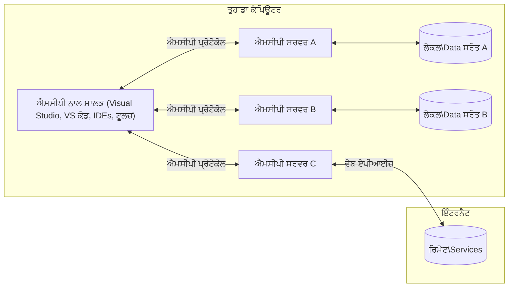

# MCP ਕੋਰ ਸੰਕਲਪ: AI ਇੰਟੀਗ੍ਰੇਸ਼ਨ ਲਈ ਮਾਡਲ ਸੰਦਰਭ ਪ੍ਰੋਟੋਕੋਲ ਵਿਚ ਮਾਹਰ ਬਣੋ

[](https://youtu.be/earDzWGtE84)

_(ਇਸ ਪਾਠ ਦੀ ਵੀਡੀਓ ਦੇਖਣ ਲਈ ਉਪਰ ਦਿੱਤੀ ਤਸਵੀਰ 'ਤੇ ਕਲਿੱਕ ਕਰੋ)_

[ਮਾਡਲ ਸੰਦਰਭ ਪ੍ਰੋਟੋਕੋਲ (MCP)](https://github.com/modelcontextprotocol) ਇੱਕ ਸ਼ਕਤੀਸ਼ਾਲੀ, ਮਿਆਰੀ ਫਰੇਮਵਰਕ ਹੈ ਜੋ ਵੱਡੇ ਭਾਸ਼ਾਈ ਮਾਡਲਾਂ (LLMs) ਅਤੇ ਬਾਹਰੀ ਟੂਲਾਂ, ਐਪਲੀਕੇਸ਼ਨਾਂ, ਅਤੇ ਡਾਟਾ ਸਰੋਤਾਂ ਦੇ ਵਿਚਕਾਰ ਸੰਚਾਰ ਨੂੰ ਸੁਧਾਰਦਾ ਹੈ।  
ਇਹ ਮਾਰਗਦਰਸ਼ਕ ਤੁਹਾਨੂੰ MCP ਦੇ ਮੂਲ ਸੰਕਲਪਾਂ ਨਾਲ ਜਾਣੂ ਕਰਵਾਏਗਾ। ਤੁਸੀਂ ਇਸਦੇ ਕਲਾਇੰਟ-ਸਰਵਰ ਆਰਕੀਟੈਕਚਰ, ਅਹੰਕਾਰਕ ਤੱਤਾਂ, ਸੰਚਾਰ ਮਕੈਨਿਕਸ, ਅਤੇ ਲਾਗੂ ਕਰਨ ਦੀਆਂ ਸਭ ਤੋਂ ਵਧੀਆ ਪ੍ਰਥਾਵਾਂ ਬਾਰੇ ਸਿੱਖੋਗੇ।

- **ਸਪਸ਼ਟ ਉਪਭੋਗਤਾ ਸਹਿਮਤੀ**: ਸਾਰੇ ਡਾਟਾ ਐਕਸੈਸ ਅਤੇ ਕਾਰਵਾਈਆਂ ਲਈ ਅਮਲ ਤੋਂ ਪਹਿਲਾਂ ਸਪਸ਼ਟ ਉਪਭੋਗਤਾ ਮਨਜ਼ੂਰੀ ਦੀ ਲੋੜ ਹੈ। ਉਪਭੋਗਤਾਵਾਂ ਨੂੰ ਇਹ ਸਾਫ ਸਮਝਣਾ ਚਾਹੀਦਾ ਹੈ ਕਿ ਕਿਹੜਾ ਡਾਟਾ erişAccess ਕੀਤਾ ਜਾਵੇਗਾ ਤੇ ਕਿਹੜੇ ਕਦਮ ਚਲਾਏ ਜਾਣਗੇ, ਜਿਸ ਵਿੱਚ ਅਧਿਕਾਰਿਤ ਅਤੇ ਪ੍ਰਮਾਣਿਕਰਨ 'ਤੇ ਠੀਕ ਨਿਯੰਤਰਨ ਹੋਵੇ।

- **ਡਾਟਾ ਪ੍ਰਾਈਵੇਸੀ ਸੁਰੱਖਿਆ**: ਉਪਭੋਗਤਾ ਡਾਟਾ ਸਿਰਫ਼ ਸਪਸ਼ਟ ਸਹਿਮਤੀ ਨਾਲ ਖੁਲਾਸਾ ਕੀਤਾ ਜਾਂਦਾ ਹੈ ਅਤੇ ਪੂਰੇ ਇੰਟਰੈਕਸ਼ਨ ਲਾਈਫਸਾਈਕਲ ਵਿੱਚ ਮਜ਼ਬੂਤ ਐਕਸੈਸ ਕੰਟਰੋਲ ਨਾਲ ਸੁਰੱਖਿਅਤ ਕੀਤਾ ਜਾਣਾ ਚਾਹੀਦਾ ਹੈ। ਲਾਗੂ ਕਰਦਿਆਂ ਬਿਨਾਂ ਇਜਾਜ਼ਤ ਡਾਟਾ ਪ੍ਰੇਰਣ ਨੂੰ ਰੋਕਣਾ ਅਤੇ ਕੜੀ ਪ੍ਰਾਈਵੇਸੀ ਹੱਦਬੰਦੀ ਬਰਕਰਾਰ ਰੱਖਣੀ ਲਾਜ਼ਮੀ ਹੈ।

- **ਟੂਲ ਏਗਜ਼ਿਕਿੂਸ਼ਨ ਸੇਫਟੀ**: ਹਰ ਇੱਕ ਟੂਲ ਸੱਦਾ ਸਪਸ਼ਟ ਉਪਭੋਗਤਾ ਸਹਿਮਤੀ ਦੀ ਮੰਗ ਕਰਦਾ ਹੈ, ਜਿਸ ਨਾਲ ਟੂਲ ਦੀ ਕਾਰਗੁਜ਼ਾਰੀ, ਪੈਰਾਮੀਟਰ ਅਤੇ ਸੰਭਾਵਿਤ ਪ੍ਰਭਾਵ ਦੀ ਪੂਰੀ ਸਮਝ ਹੁੰਦੀ ਹੈ। ਮਜ਼ਬੂਤ ਸੁਰੱਖਿਆ ਹੱਦਬੰਦੀਆਂ ਅਣਚਾਹੇ, ਅਸੁਰੱਖਿਅਤ ਜਾਂ ਦੁਰਵਿਵਹਾਰਕ ਟੂਲ ਚਲਾਉਣ ਨੂੰ ਰੋਕਦੀਆਂ ਹਨ।

- **ਟ੍ਰਾਂਸਪੋਰਟ ਲੇਅਰ ਸੁਰੱਖਿਆ**: ਸਾਰੇ ਸੰਚਾਰ ਚੈਨਲਾਂ ਨੂੰ ਯੋਗ ਇਨਕ੍ਰਿਪਸ਼ਨ ਅਤੇ ਪ੍ਰਮਾਣਿਕਰਨ ਤਕਨੀਕਾਂ ਨਾਲ ਸੁਰੱਖਿਅਤ ਕੀਤਾ ਜਾਣਾ ਚਾਹੀਦਾ ਹੈ। ਦੂਰਦਰਾ ਜੀ ਕੰਨੈਕਸ਼ਨਾਂ ਲਈ ਸੁਰੱਖਿਅਤ ਟ੍ਰਾਂਸਪੋਰਟ ਪ੍ਰੋਟੋਕੋਲ ਅਤੇ ਠੀਕ ਕ੍ਰੈਡੈਂਸ਼ਲ ਪ੍ਰਬੰਧਨ ਲਾਗੂ ਕਰੋ।

#### ਲਾਗੂ ਕਰਨ ਦੇ ਦਿਸ਼ਾ-ਨਿਰਦੇਸ਼:

- **ਅਧਿਕਾਰ ਪ੍ਰਬੰਧਨ**: ਬਹੁਤ ਸੁਖਾਵਾਂ ਅਧਿਕਾਰ ਪ੍ਰਣਾਲੀ ਜਿਨ੍ਹਾਂ ਨਾਲ ਉਪਭੋਗਤਾ ਨਿਰਧਾਰਤ ਕਰ ਸਕਣ ਕਿ ਕਿਹੜੇ ਸਰਵਰ, ਟੂਲ ਅਤੇ ਸਰੋਤ ਉਪਲਬਧ ਹਨ  
- **ਪ੍ਰਮਾਣਿਕਰਨ ਅਤੇ ਅਧਿਕਾਰਿਤ ਕਰਨਾ**: ਸੁਰੱਖਿਅਤ ਪ੍ਰਮਾਣਿਕਰਨ ਤਰੀਕੇ (OAuth, API ਕੀਜ਼) ਵਰਤੋ, ਸਹੀ ਟੋਕਨ ਪ੍ਰਬੰਧਨ ਅਤੇ ਮਿਆਦ ਖਤਮ ਹੋਣ ਸਮੇਤ  
- **ਇਨਪੁੱਟ ਵੈਰੀਫਿਕੇਸ਼ਨ**: ਤਮਾਮ ਪੈਰਾਮੀਟਰ ਅਤੇ ਡਾਟਾ ਇਨਪੁੱਟ ਨੂੰ ਪਰਿਭਾਸ਼ਿਤ ਸਕੀਮਾਂ ਅਨੁਸਾਰ ਵੈਰੀਫਾਈ ਕਰੋ ਤਾਂ ਜੋ ਇੰਜੈਕਸ਼ਨ ਆਕਰਮਣਾਂ ਰੋਕ ਸਕੇ  
- **ਆਡਿਟ ਲਾਗਿੰਗ**: ਸੁਰੱਖਿਆ, ਨਿਗਰਾਨੀ ਤੇ ਅਨੁਕੂਲਤਾ ਲਈ ਸਾਰੀਆਂ ਕਾਰਵਾਈਆਂ ਦੇ ਵਿਸਤ੍ਰਿਤ ਲਾਗਜ਼ ਰੱਖੋ

## ਸਾਰ

ਇਸ ਪਾਠ ਵਿੱਚ ਤੁਸੀਂ ਮਾਡਲ ਸੰਦਰਭ ਪ੍ਰੋਟੋਕੋਲ (MCP) ਐਕੋਸਿਸਟਮ ਦੀ ਮੂਲ ਆਰਕੀਟੈਕਚਰ ਅਤੇ ਤੱਤਾਂ ਬਾਰੇ ਜਾਣੋਗੇ। ਤੁਸੀਂ ਕਲਾਇੰਟ-ਸਰਵਰ ਆਰਕੀਟੈਕਚਰ, ਪ੍ਰਮੁੱਖ ਤੱਤਾਂ ਅਤੇ MCP ਸੰਚਾਰ ਪ੍ਰਣਾਲੀ ਦੀ ਵਿਸਥਾਰਪੂਰਣ ਸਮਝ ਹਾਸਲ ਕਰੋਗੇ।

## ਮੁੱਖ ਸਿੱਖਿਆ ਉਦੇਸ਼

ਇਸ ਪਾਠ ਦੇ ਅੰਤ ਤੱਕ, ਤੁਸੀਂ:

- MCP ਕਲਾਇੰਟ-ਸਰਵਰ ਆਰਕੀਟੈਕਚਰ ਨੂੰ ਸਮਝਨਾ।  
- ਹੋਸਟ, ਕਲਾਇੰਟ ਅਤੇ ਸਰਵਰ ਦੀਆਂ ਭੂਮਿਕਾਵਾਂ ਅਤੇ ਜ਼ਿੰਮੇਵਾਰੀਆਂ ਦੀ ਪਛਾਣ ਕਰਨੀ।  
- MCP ਨੂੰ ਇੱਕ ਲਚਕੀਲਾ ਇੰਟੀਗ੍ਰੇਸ਼ਨ ਪਰਤ ਬਣਾਉਣ ਵਾਲੀ ਕੋਰ ਵਿਸ਼ੇਸ਼ਤਾਵਾਂ ਦਾ ਵਿਸ਼ਲੇਸ਼ਣ ਕਰਨਾ।  
- MCP ਐਕੋਸਿਸਟਮ ਵਿੱਚ ਜਾਣਕਾਰੀ ਦੇ ਪ੍ਰਵਾਹ ਦੀ ਸਮਝ ਲੈਣਾ।  
- .NET, ਜਾਵਾ, ਪਾਇਥਨ, ਅਤੇ ਜਾਵਾਸਕ੍ਰਿਪਟ ਵਿੱਚ ਕੋਡ ਉਦਾਹਰਣਾ ਰਾਹੀਂ ਵਿਅਵਹਾਰਕ ਜਾਣਕਾਰੀ ਪ੍ਰਾਪਤ ਕਰਨੀ।

## MCP ਆਰਕੀਟੈਕਚਰ: ਇਕ ਗਹਿਰਾ ਨਜ਼ਰੀਆ

MCP ਐਕੋਸਿਸਟਮ ਇਕ ਕਲਾਇੰਟ-ਸਰਵਰ ਮਾਡਲ 'ਤੇ ਅਧਾਰਿਤ ਹੈ। ਇਹ ਮਾਡਿਊਲਰ ਬਣਤਰ AI ਐਪਲੀਕੇਸ਼ਨਾਂ ਨੂੰ ਟੂਲਾਂ, ਡਾਟਾਬੇਸ, API ਅਤੇ ਸੰਦਰਭੀ ਸਰੋਤਾਂ ਨਾਲ ਪ੍ਰਭਾਵਸ਼ਾਲੀ ਤਰੀਕੇ ਨਾਲ ਇੰਟਰੈਕਟ ਕਰਨ ਦੀ ਆਗਿਆ ਦਿੰਦੀ ਹੈ। ਆਓ ਇਸ ਆਰਕੀਟੈਕਚਰ ਨੂੰ ਇਸਦੇ ਮੁੱਖ ਤੱਤਾਂ ਵਿੱਚ ਵੰਡਦੇ ਹਾਂ।

ਇਸਦੇ ਮੁ kernel ਯੂਹ PMC ਇੱਕ ਕਲਾਇੰਟ-ਸਰਵਰ ਆਰਕੀਟੈਕਚਰ ਦਾ ਪਾਲਣ ਕਰਦਾ ਹੈ ਜਿੱਥੇ ਇੱਕ ਹੋਸਟ ਐਪਲੀਕੇਸ਼ਨ ਇਕ ਤੋਂ ਵੱਧ ਸਰਵਰਾਂ ਨਾਲ ਜੁੜ ਸਕਦੀ ਹੈ:



- **MCP ਹੋਸਟ**: ਐਸੇ ਪ੍ਰੋਗਰਾਮ ਜਿਵੇਂ ਕਿ VSCode, Claude Desktop, IDEs, ਜਾਂ AI ਟੂਲ ਜੋ MCP ਰਾਹੀਂ ਡਾਟਾ ਐਕਸੈਸ ਕਰਨਾ ਚਾਹੁੰਦੇ ਹਨ  
- **MCP ਕਲਾਇੰਟ**: ਪ੍ਰੋਟੋਕੋਲ ਕਲਾਇੰਟ ਜੋ ਸਰਵਰਾਂ ਨਾਲ 1:1 ਕਨੈਕਸ਼ਨ ਬਣਾਉਂਦੇ ਹਨ  
- **MCP ਸਰਵਰ**: ਹਲਕੇ ਫੁਲਕੇ ਪ੍ਰੋਗਰਾਮ ਜੋ ਮਿਆਰੀਕ੍ਰਿਤ Model Context Protocol ਰਾਹੀਂ ਖਾਸ ਸਮਰੱਥਾਵਾਂ ਖੁਲਾਸਾ ਕਰਦੇ ਹਨ  
- **ਲੋਕਲ ਡਾਟਾ ਸਰੋਤ**: ਤੁਹਾਡੇ ਕੰਪਿਊਟਰ ਦੀਆਂ ਫਾਇਲਾਂ, ਡਾਟਾਬੇਸ ਅਤੇ ਸਰਵਿਸਜ਼ ਜਿਹੜੀਆਂ MCP ਸਰਵਰ ਸੁਰੱਖਿਅਤ ਤਰੀਕੇ ਨਾਲ ਐਕਸੈਸ ਕਰ ਸਕਦੇ ਹਨ  
- **ਰਿਮੋਟ ਸਰਵਿਸਾਂ**: ਬਾਹਰੀ ਪ੍ਰਣਾਲੀਆਂ ਜੋ ਇੰਟਰਨੈੱਟ ਰਾਹੀਂ ਉਪਲਬਧ ਹਨ ਅਤੇ MCP ਸਰਵਰ API ਰਾਹੀਂ ਕਨੈਕਟ ਕਰ ਸਕਦੇ ਹਨ।

MCP ਪ੍ਰੋਟੋਕੋਲ ਇੱਕ ਵਿਕਸਤ ਹੋ ਰਹੀ ਮਿਆਰ ਹੈ ਜੋ ਤਾਰੀਖ-ਆਧਾਰਿਤ ਵਰਜ਼ਨਿੰਗ (YYYY-MM-DD ਫਾਰਮੈਟ) ਵਰਤਦੀ ਹੈ। ਵਰਤਮਾਨ ਵਰਜ਼ਨ ਹੈ **2025-11-25**। ਤੁਸੀਂ [ਪ੍ਰੋਟੋਕੋਲ ਵਿਸ਼ੇਸ਼ਣ](https://modelcontextprotocol.io/specification/2025-11-25/) ਵਿੱਚ ਨਵੀਆਂ ਤਰਮੀਮਾਂ ਦੇਖ ਸਕਦੇ ਹੋ।

### 1. ਹੋਸਟ

Model Context Protocol (MCP) ਵਿੱਚ, **ਹੋਸਟ** ਉਹ AI ਐਪਲੀਕੇਸ਼ਨ ਹਨ ਜੋ ਪ੍ਰਮੁੱਖ ਇੰਟਰਫੇਸ ਵਜੋਂ ਕੰਮ ਕਰਦੇ ਹਨ ਜਿੱਥੇ ਉਪਭੋਗਤਾ ਪ੍ਰੋਟੋਕੋਲ ਨਾਲ ਇੰਟਰੈਕਟ ਕਰਦੇ ਹਨ। ਹੋਸਟ ਕਈ MCP ਸਰਵਰਾਂ ਨਾਲ ਸਮੱਗਰੀ ਜੁੜਾਈ ਨੂੰ ਦੇਖਦੇ ਹਨ ਅਤੇ ਹਰ ਸਰਵਰ ਕਨੈਕਸ਼ਨ ਲਈ ਸਮਰਪਿਤ MCP ਕਲਾਇੰਟ ਬਣਾਉਂਦੇ ਹਨ। ਹੋਸਟ ਦੇ ਉਦਾਹਰਣ:

- **AI ਐਪਲੀਕੇਸ਼ਨਾਂ**: Claude Desktop, Visual Studio Code, Claude Code  
- **ਡਿਵੈਲਪਮੈਂਟ ਮਾਹੌਲ**: IDEs ਅਤੇ ਕੋਡ ਸੰਪਾਦਕ ਜੋ MCP ਇੰਟੀਗ੍ਰੇਸ਼ਨ ਵਾਲੇ ਹਨ  
- **ਕਸਟਮ ਐਪਲੀਕੇਸ਼ਨ**: ਵਿਸ਼ੇਸ਼ਤ AI ਏਜੰਟ ਅਤੇ ਟੂਲ

**ਹੋਸਟ** ਐਪਲੀਕੇਸ਼ਨ AI ਮਾਡਲ ਇੰਟਰੈਕਸ਼ਨ ਨੂੰ ਸੰਗਠਿਤ ਕਰਦੇ ਹਨ। ਉਹ:

- **AI ਮਾਡਲਾਂ ਦਾ ਪਰਚਾਲਨ**: LLMs ਨੂੰ ਚਲਾਉਂਦੇ ਜਾਂ ਇੰਟਰੈਕਟ ਕਰਦੇ ਹਨ ਪ੍ਰਤੀਕਿਰਿਆ ਬਣਾਉਣ ਲਈ ਅਤੇ AI ਵੱਖੜੇ ਕਾਰਵਾਈਆਂ ਦਾ ਸਹਿਯੋਗ  
- **ਕਲਾਇੰਟ ਕਨੈਕਸ਼ਨ ਪ੍ਰਬੰਧਨ**: ਹਰ MCP ਸਰਵਰ ਲਈ ਇੱਕ MCP ਕਲਾਇੰਟ ਬਣਾਉਂਦੇ ਅਤੇ ਸੰਭਾਲਦੇ ਹਨ  
- **ਉਪਭੋਗਤਾ ਇੰਟਰਫੇਸ ਨਿਯੰਤਰਿਤ ਕਰਦੇ ਹਨ**: ਗੱਲਬਾਤ ਦੇ ਪ੍ਰਵਾਹ ਨੂੰ ਸੰਭਾਲਦੇ, ਉਪਭੋਗਤਾ ਇੰਟਰੈਕਸ਼ਨਾਂ ਅਤੇ ਪ੍ਰਤੀਕਿਰਿਆ ਦਿਖਾਵਟ ਨੂੰ ਸੰਭਾਲਦੇ ਹਨ  
- **ਸੁਰੱਖਿਆ ਲਾਗੂ ਕਰਦੇ ਹਨ**: ਅਧਿਕਾਰ, ਸੁਰੱਖਿਆ ਪਾਬੰਦੀਆਂ, ਅਤੇ ਪ੍ਰਮਾਣਿਕਰਨ ਦੀ ਨਿਗਰਾਨੀ ਕਰਦੇ ਹਨ  
- **ਉਪਭੋਗਤਾ ਸਹਿਮਤੀ ਸੰਭਾਲਦੇ ਹਨ**: ਡਾਟਾ ਸਾਂਝਾ ਕਰਨ ਅਤੇ ਟੂਲ ਚਲਾਉਣ ਲਈ ਉਪਭੋਗਤਾ ਮਨਜ਼ੂਰੀ ਲੈਂਦੇ ਹਨ

### 2. ਕਲਾਇੰਟ

**ਕਲਾਇੰਟ** MCP ਹੋਸਟ ਅਤੇ ਸਰਵਰਾਂ ਵਿਚਕਾਰ ਇੱਕ-ਤੋ-ਇੱਕ ਸੰਬੰਧ ਨੂੰ ਬਣਾਈ ਰੱਖਣ ਵਾਲੇ ਅਹੰਕਾਰਕ ਤੱਤ ਹਨ। ਹਰ MCP ਕਲਾਇੰਟ ਵਿਸ਼ੇਸ਼ MCP ਸਰਵਰ ਨਾਲ ਕਨੈਕਸ਼ਨ ਬਣਾਉਣ ਲਈ ਹੋਸਟ ਵੱਲੋਂ ਤਿਆਰ ਕੀਤਾ ਜਾਂਦਾ ਹੈ, ਜੋ ਸੰਗਠਿਤ ਅਤੇ ਸੁਰੱਖਿਅਤ ਸੰਚਾਰ ਚੈਨਲ ਬਣਾਉਂਦਾ ਹੈ। ਕਈ ਕਲਾਇੰਟ ਹੋਸਟਾਂ ਨੂੰ ਕਈ ਸਰਵਰਾਂ ਨਾਲ ਇਕੱਠੇ ਜੁੜਨ ਦੀ ਆਗਿਆ ਦਿੰਦੇ ਹਨ।

**ਕਲਾਇੰਟ** ਹੋਸਟ ਐਪਲੀਕੇਸ਼ਨ ਦੇ ਅੰਦਰ ਕਨੈਕਟਰ ਤੱਤ ਹਨ। ਉਹ:

- **ਪ੍ਰੋਟੋਕੋਲ ਸੰਚਾਰ**: ਸਰਵਰਾਂ ਨੂੰ JSON-RPC 2.0 ਬੇਨਤੀਆਂ ਭੇਜਦੇ ਹਨ ਜਿਨ੍ਹਾਂ ਵਿੱਚ ਪ੍ਰੰਪਟ ਅਤੇ ਨਿਰਦੇਸ਼ ਸ਼ਾਮਲ ਹੁੰਦੇ ਹਨ  
- **ਸਮਰੱਥਾ ਮੋਲ-ਭਾਵ**: ਸ਼ੁਰੂਆਤ ਵਿੱਚ ਸਰਵਰਾਂ ਨਾਲ ਸਮਰੱਥਾਵਾਂ ਅਤੇ ਪ੍ਰੋਟੋਕੋਲ ਵਰਜ਼ਨ 'ਤੇ ਸਮਝੌਤਾ ਕਰਦੇ ਹਨ  
- **ਟੂਲ ਪ੍ਰਤੀਕਿਰਿਆ ਪ੍ਰਬੰਧਨ**: ਮਾਡਲਾਂ ਤੋਂ ਆਏ ਟੂਲ ਚਲਾਉਣ ਦੀਆਂ ਬੇਨਤੀਆਂ ਨੂੰ ਸੰਭਾਲਦੇ ਅਤੇ ਪ੍ਰਤੀਕਿਰਿਆ ਲੈਂਦੇ ਹਨ  
- **ਰਿਅਲ-ਟਾਈਮ ਅੱਪਡੇਟ**: ਸਰਵਰਾਂ ਵੱਲੋਂ ਆਉਣ ਵਾਲੀਆਂ ਸੂਚਨਾਵਾਂ ਅਤੇ ਅਪਡੇਟ ਪ੍ਰਕਿਰਿਆਵਾਂ ਨੂੰ ਸੰਭਾਲਦੇ ਹਨ  
- **ਪ੍ਰਤੀਕਿਰਿਆ ਪ੍ਰਕਿਰਿਆ**: ਸਰਵਰ ਪ੍ਰਤੀਕਿਰਿਆਵਾਂ ਨੂੰ ਪ੍ਰਕਿਰਿਆ ਕਰਕੇ ਉਪਭੋਗਤਾਵਾਂ ਨੂੰ ਦਿਖਾਏ ਜਾਣ ਯੋਗ ਬਣਾਉਂਦੇ ਹਨ

### 3. ਸਰਵਰ

**ਸਰਵਰ** ਉਦਯੋਗ ਹਨ ਜੋ MCP ਕਲਾਇੰਟਾਂ ਨੂੰ ਸੰਦਰਭ, ਟੂਲ ਅਤੇ ਸਮਰੱਥਾਵਾਂ ਪ੍ਰਦਾਨ ਕਰਦੇ ਹਨ। ਇਹ ਲੋਕਲ (ਉਹੀ ਮਸ਼ੀਨ ਜਿੱਥੇ ਹੋਸਟ ਰਹਿੰਦਾ ਹੈ) ਜਾਂ ਰਿਮੋਟ (ਬਾਹਰੀ ਪਲੇਟਫਾਰਮ 'ਤੇ) ਚੱਲ ਸਕਦੇ ਹਨ ਅਤੇ ਕਲਾਇੰਟ ਬੇਨਤੀਆਂ ਨੂੰ ਸੰਭਾਲ ਕੇ ਸੰਰਚਿਤ ਪ੍ਰਤੀਕਿਰਿਆਆਂ ਦਿੰਦੇ ਹਨ। ਸਰਵਰ ਮਿਆਰੀਕ੍ਰਿਤ Model Context Protocol ਰਾਹੀਂ ਖਾਸ ਫੰਕਸ਼ਨਲਿਟੀ ਪ੍ਰਦਾਨ ਕਰਦੇ ਹਨ।

**ਸਰਵਰ** ਐਸੇ ਸਰਵਿਸਜ਼ ਹਨ ਜੋ ਸੰਦਰਭ ਅਤੇ ਸਮਰੱਥਾਵਾਂ ਦਿੰਦੇ ਹਨ। ਉਹ:

- **ਫੀਚਰ ਰਜਿਸਟ੍ਰੇਸ਼ਨ**: ਉਪਲਬਧ ਪ੍ਰਿਮਿਟਿਵ (ਸਰੋਤ, ਪ੍ਰੰਪਟ, ਟੂਲ) ਕਲਾਇੰਟਾਂ ਨੂੰ ਦਰਜ ਅਤੇ ਪ੍ਰਦਾਨ ਕਰਦੇ ਹਨ  
- **ਬੇਨਤੀ ਸੰਭਾਲਣਾ**: ਕਲਾਇੰਟਾਂ ਵੱਲੋਂ ਟੂਲ ਕਾਲ, ਸਰੋਤ ਬੇਨਤੀਆਂ ਅਤੇ ਪ੍ਰੰਪਟ ਬੇਨਤੀਆਂ ਪ੍ਰਾਪਤ ਅਤੇ ਚਲਾਉਂਦੇ ਹਨ  
- **ਸੰਦਰਭ ਮੁਹੱਈਆ ਕਰਨਾ**: ਮਾਡਲ ਪ੍ਰਤੀਕਿਰਿਆਵਾਂ ਨੂੰ ਬਿਹਤਰ ਬਣਾਉਣ ਲਈ ਸੰਦਰਭੀ ਜਾਣਕਾਰੀ ਅਤੇ ਡਾਟਾ देते ਹਨ  
- **ਸਥਿਤੀ ਪ੍ਰਬੰਧਨ**: ਜਦ ਲੋੜ ਹੋਵੇ ਤਾਂ ਸੈਸ਼ਨ ਦੀ ਸਥਿਤੀ ਬਰਕਰਾਰ ਰੱਖਦੇ ਅਤੇ ਸਥਿਤੀਾਤਮਕ ਇੰਟਰਐਕਸ਼ਨਾਂ ਨੂੰ ਸੰਭਾਲਦੇ ਹਨ  
- **ਰਿਅਲ-ਟਾਈਮ ਸੂਚਨਾ**: ਜੋੜੇ ਗਏ ਕਲਾਇੰਟਾਂ ਨੂੰ ਸਮਰੱਥਾ ਬਦਲਾਅ ਅਤੇ ਅਪਡੇਟ ਬਾਰੇ ਸੂਚਿਤ ਕਰਦੇ ਹਨ

ਸਰਵਰ ਕਿਸੇ ਵੀ ਵਿਅਕਤੀ ਦੁਆਰਾ ਵਿਸ਼ੇਸ਼ਤ ਫੰਕਸ਼ਨਲਿਟੀ ਵਾਲੇ ਮਾਡਲ ਸਮਰੱਥਾਵਾਂ ਦਾ ਵਾਧਾ ਕਰਨ ਲਈ ਬਣਾਏ ਜਾ ਸਕਦੇ ਹਨ, ਅਤੇ ਇਹ ਲੋਕਲ ਅਤੇ ਰਿਮੋਟ ਤੰਤਰਾਂ ਉਦਘਾਟਨ ਦੋਹਾਂ ਨੂੰ ਸਹਾਇਤਾ ਕਰਦੇ ਹਨ।

### 4. ਸਰਵਰ ਪ੍ਰਿਮਿਟਿਵ

Model Context Protocol (MCP) ਵਿੱਚ ਸਰਵਰ ਤਿੰਨ ਮੁੱਖ **ਪ੍ਰਿਮਿਟਿਵ** ਪਰਦਾਨ ਕਰਦੇ ਹਨ ਜੋ ਕਲਾਇੰਟ, ਹੋਸਟ, ਅਤੇ ਭਾਸ਼ਾਈ ਮਾਡਲਾਂ ਵਿਚਕਾਰ ਰਿਚ ਇੰਟਰੈਕਸ਼ਨਾਂ ਲਈ ਬੁਨਿਆਦੀ ਢਾਂਚੇ ਨਿਰਧਾਰਤ ਕਰਦੇ ਹਨ। ਇਹ ਪ੍ਰਿਮਿਟਿਵ ਸੰਦਰਭੀ ਜਾਣਕਾਰੀ ਅਤੇ ਕਾਰਵਾਈਆਂ ਦੀਆਂ ਕਿਸਮਾਂ ਨੂੰ ਪਰਿਭਾਸ਼ਿਤ ਕਰਦੇ ਹਨ ਜੋ ਪ੍ਰੋਟੋਕੋਲ ਰਾਹੀਂ ਉਪਲਬਧ ਹਨ।

MCP ਸਰਵਰ ਹੇਠਾਂ ਦਿੱਤੇ ਤਿੰਨ ਮੁੱਖ ਪ੍ਰਿਮਿਟਿਵਾਂ ਦੇ ਕਿਸੇ ਵੀ ਸੰਯੋਜਨ ਨੂੰ ਪ੍ਰਦਾਨ ਕਰ ਸਕਦੇ ਹਨ:

#### ਸਰੋਤ (Resources)

**ਸਰੋਤ** ਉਹ ਡਾਟਾ ਸਰੋਤ ਹਨ ਜੋ AI ਐਪਲੀਕੇਸ਼ਨਾਂ ਨੂੰ ਸੰਦਰਭੀ ਜਾਣਕਾਰੀ ਪ੍ਰਦਾਨ ਕਰਦੇ ਹਨ। ਇਹ ਸਥਿਰ ਜਾਂ ਗਤੀਸ਼ੀਲ ਸਮੱਗਰੀ ਨੂੰ ਦਰਸਾਉਂਦੇ ਹਨ ਜੋ ਮਾਡਲ ਦੀ ਸਮਝ ਅਤੇ ਫੈਸਲਾ ਕਰਨ ਦੀ ਸਮਰੱਥਾ ਨੂੰ ਬਿਹਤਰ ਕਰ ਸਕਦੀ ਹੈ:

- **ਸੰਦਰਭੀ ਡਾਟਾ**: ਸੰਗਠਿਤ ਜਾਣਕਾਰੀ ਅਤੇ ਮਾਡਲ ਖਪਤ ਲਈ ਸੰਦਰਭ  
- **ਜਾਣਕਾਰੀ ਅਧਾਰ**: ਦਸਤਾਵੇਜ਼ ਡਾਟਾਬੇਸ, ਲੇਖ, ਮੈਨੂਅਲ, ਅਤੇ ਖੋਜ ਪੱਤਰ  
- **ਲੋਕਲ ਡਾਟਾ ਸਰੋਤ**: ਫਾਇਲਾਂ, ਡਾਟਾਬੇਸ, ਅਤੇ ਸਿਸਟਮ ਜਾਣਕਾਰੀ  
- **ਬਾਹਰੀ ਡਾਟਾ**: API ਪ੍ਰਤੀਕਿਰਿਆਵਾਂ, ਵੈੱਬ ਸਰਵਿਸਜ਼, ਅਤੇ ਦੂਰਦਰਾ ਜੀ ਡਾਟਾ  
- **ਡਾਇਨਾਮਿਕ ਸਮੱਗਰੀ**: ਅਸਲੀ ਸਮੇਂ ਦਾ ਡਾਟਾ ਜੋ ਬਾਹਰੀ ਹਾਲਾਤਾਂ ਅਨੁਸਾਰ ਅੱਪਡੇਟ ਹੁੰਦਾ ਰਹਿੰਦਾ ਹੈ

ਸਰੋਤ URI ਦੁਆਰਾ ਪਛਾਣੇ ਜਾਂਦੇ ਹਨ ਅਤੇ `resources/list` ਨਾਲ ਖੋਜੇ ਅਤੇ `resources/read` ਨਾਲ ਪ੍ਰਾਪਤ ਕੀਤੇ ਜਾਂਦੇ ਹਨ:

```text
file://documents/project-spec.md
database://production/users/schema
api://weather/current
```


#### ਪ੍ਰੰਪਟ (Prompts)

**ਪ੍ਰੰਪਟ** ਮੁੜ ਵਰਤੇ ਜਾਣ ਵਾਲੇ ਟੈਂਪਲੇਟ ਹਨ ਜੋ ਭਾਸ਼ਾ ਮਾਡਲਾਂ ਨਾਲ ਇੰਟਰੈਕਸ਼ਨਾਂ ਨੂੰ ਸੰਰਚਿਤ ਕਰਨ ਵਿੱਚ ਮਦਦ ਕਰਦੇ ਹਨ। ਇਹ ਮਿਆਰੀਕ੍ਰਿਤ ਇੰਟਰੈਕਸ਼ਨ ਪੈਟਰਨ ਅਤੇ ਟੈਂਪਲੇਟ ਵਾਲੇ ਵਰਕਫਲੋਮ ਦੇਣਗੇ:

- **ਟੈਂਪਲੇਟ-ਆਧਾਰਤ ਇੰਟਰੈਕਸ਼ਨ**: ਪ੍ਰੀ-ਸੰਰਚਿਤ ਸੰਦੇਸ਼ ਅਤੇ ਗੱਲਬਾਤ ਸ਼ੁਰੂ ਕਰਨ ਵਾਲੇ  
- **ਵਰਕਫਲੋ ਟੈਂਪਲੇਟ**: ਆਮ ਕੰਮ ਅਤੇ ਇੰਟਰੈਕਸ਼ਨਾਂ ਲਈ ਮਿਆਰੀਕ੍ਰਿਤ ਲੜੀਵਾਰ ਸੰਦਰਭ  
- **ਥੋੜੇ ਉਦਾਹਰਣ (Few-shot)**: ਮਾਡਲ ਹਦਾਇਤਾਂ ਲਈ ਤਮਾਮ-ਆਧਾਰਿਤ ਟੈਂਪਲੇਟ  
- **ਸਿਸਟਮ ਪ੍ਰੰਪਟ**: ਮਾਡਲ ਵਿਹਾਰ ਅਤੇ ਸੰਦਰਭ ਸਥਾਪਿਤ ਕਰਨ ਵਾਲੇ ਮੁੱਢਲੇ ਪ੍ਰੰਪਟ  
- **ਡਾਇਨਾਮਿਕ ਟੈਂਪਲੇਟ**: ਖਾਸ ਸੰਦਰਭਾਂ ਦੇ ਲਈ ਪੈਰਾਮੀਟਰਿਤ ਪ੍ਰੰਪਟ

ਪ੍ਰੰਪਟ ਵੈਰੀਏਬਲ ਬਦਲਾਅ ਨੂੰ ਸਹਾਇਤਾ ਕਰਦੇ ਹਨ ਅਤੇ `prompts/list` ਰਾਹੀਂ ਖੋਜੇ ਅਤੇ `prompts/get` ਦੁਆਰਾ ਪ੍ਰਾਪਤ ਕੀਤੇ ਜਾ ਸਕਦੇ ਹਨ:

```markdown
Generate a {{task_type}} for {{product}} targeting {{audience}} with the following requirements: {{requirements}}
```


#### ਟੂਲ (Tools)

**ਟੂਲ** ਚਲਾਏ ਜਾਣ ਵਾਲੇ ਫੰਕਸ਼ਨ ਹਨ ਜਿਨ੍ਹਾਂ ਨੂੰ AI ਮਾਡਲ ਖਾਸ ਕਾਰਵਾਈਆਂ ਕਰਨ ਲਈ ਕਾਲ ਕਰ ਸਕਦੇ ਹਨ। ਇਹ MCP ਐਕੋਸਿਸਟਮ ਦੇ "ਕਿਰਿਆਵਾਂ" ਹਨ, ਜੋ ਮਾਡਲ ਨੂੰ ਬਾਹਰੀ ਪ੍ਰਣਾਲੀਆਂ ਨਾਲ ਇੰਟਰੈਕਟ ਕਰਨ ਦੇ ਯੋਗ ਬਨਾਉਂਦੇ ਹਨ:

- **ਚਲਾਏ ਜਾਣ ਯੋਗ ਫੰਕਸ਼ਨ**: ਵੱਖ-ਵੱਖ ਕਾਰਵਾਈਆਂ ਜੋ ਮਾਡਲ ਖਾਸ ਪੈਰਾਮੀਟਰਾਂ ਨਾਲ ਚਲਾਉਂਦੇ ਹਨ  
- **ਬਾਹਰੀ ਤੰਤਰ ਇੰਟੀਗ੍ਰੇਸ਼ਨ**: API ਕਾਲ, ਡਾਟਾਬੇਸ ਪੁੱਛਗਿੱਛ, ਫਾਇਲ ਵਰਕ, ਗਣਨਾਵਾਂ  
- **ਵਿਅਕਤੀਗਤ ਪਛਾਣ**: ਹਰ ਟੂਲ ਦਾ ਇੱਕ ਵੱਖਰਾ ਨਾਮ, ਵਰਣਨ ਅਤੇ ਪੈਰਾਮੀਟਰ ਸਕੀਮਾ ਹੁੰਦਾ ਹੈ  
- **ਸੰਰਚਿਤ I/O**: ਟੂਲ ਵੈਰੀਫਾਈਡ ਪੈਰਾਮੀਟਰ ਲੈਂਦੇ ਅਤੇ ਸੰਰਚਿਤ, ਲਿੱਖਤ ਜਵਾਬ ਦਿੰਦੇ ਹਨ  
- **ਕਾਰਵਾਈ ਕਾਬਲੀਅਤਾਂ**: ਮਾਡਲਾਂ ਨੂੰ ਹਕੀਕਤੀ ਦੁਨੀਆ ਦੀਆਂ ਕਾਰਵਾਈਆਂ ਕਰਨ ਅਤੇ ਜਿਂਦਾ ਡਾਟਾ ਪ੍ਰਾਪਤ ਕਰਨ ਲਈ ਯੋਗ ਕਰਦੇ ਹਨ

ਟੂਲਾਂ ਨੂੰ ਪੈਰਾਮੀਟਰ ਵੈਰੀਫਿਕੇਸ਼ਨ ਲਈ JSON ਸਕੀਮਾ ਨਾਲ ਪਰਿਭਾਸ਼ਿਤ ਕੀਤਾ ਜਾਂਦਾ ਹੈ ਅਤੇ `tools/list` ਰਾਹੀਂ ਖੋਜ ਕੇ `tools/call` ਦੁਆਰਾ ਚਲਾਇਆ ਜਾਂਦਾ ਹੈ। ਟੂਲ ਵਿੱਚ ਉੱਤਮ UI ਪ੍ਰਦਰਸ਼ਨ ਲਈ **ਆਈਕਾਨ** ਵੀ ਸ਼ਾਮਲ ਹੋ ਸਕਦੇ ਹਨ।

**ਟੂਲ ਟਿੱਪਣੀਆਂ**: ਟੂਲ ਪਾਠਕ (ਜਿਵੇਂ `readOnlyHint`, `destructiveHint`) ਸਮਰਥਨ ਕਰਦੇ ਹਨ ਜੋ ਦੱਸਦੇ ਹਨ ਕਿ ਟੂਲ ਸਿਰਫ ਪੜ੍ਹਨ ਯੋਗ ਹੈ ਜਾਂ ਹਾਨਿਕਾਰਕ, ਜਿਸਨਾਲ ਕਲਾਇੰਟ ਨੂੰ ਟੂਲ ਚਲਾਉਣ ਲਈ ਸੂਝ-ਬੂਝ ਮਿਲਦੀ ਹੈ।

ਟੂਲ 정의 ਦਾ ਉਦਾਹਰਣ:

```typescript
server.tool(
  "search_products", 
  {
    query: z.string().describe("Search query for products"),
    category: z.string().optional().describe("Product category filter"),
    max_results: z.number().default(10).describe("Maximum results to return")
  }, 
  async (params) => {
    // ਖੋਜ ਕਰੋ ਅਤੇ ਢਾਂਚਾਬੱਧ ਨਤੀਜੇ ਵਾਪਸ ਦਿਓ
    return await productService.search(params);
  }
);
```


## ਕਲਾਇੰਟ ਪ੍ਰਿਮਿਟਿਵ

Model Context Protocol (MCP) ਵਿੱਚ, **ਕਲਾਇੰਟ** ਅਜਿਹੇ ਪ੍ਰਿਮਿਟਿਵ ਖੋਲ੍ਹ ਸਕਦੇ ਹਨ ਜੋ ਸਰਵਰਾਂ ਨੂੰ ਹੋਸਟ ਐਪਲੀਕੇਸ਼ਨ ਤੋਂ ਵਾਧੂ ਸਮਰੱਥਾਵਾਂ ਦੀ ਬੇਨਤੀ ਕਰਨ ਦਿੰਦੇ ਹਨ। ਇਹ ਕਲਾਇੰਟ-ਪਾਸੇ ਪ੍ਰਿਮਿਟਿਵ ਸਰਵਰ ਲਾਗੂ ਕਰਨ ਨੂੰ ਹੋਰ ਸਮਰੱਥ ਅਤੇ ਇੰਟਰਐਕਟਿਵ ਬਣਾਉਂਦੇ ਹਨ ਜੋ AI ਮਾਡਲ ਸਮਰੱਥਾਵਾਂ ਅਤੇ ਉਪਭੋਗਤਾ ਇੰਟਰਐਕਸ਼ਨਾਂ ਤੱਕ ਪਹੁੰਚ ਰੱਖਦੇ ਹਨ।

### ਸੈਮਪਲਿੰਗ (Sampling)

**ਸੈਮਪਲਿੰਗ** ਸਰਵਰਾਂ ਨੂੰ ਕਲਾਇੰਟ ਦੀ AI ਐਪਲੀਕੇਸ਼ਨ ਤੋਂ ਭਾਸ਼ਾ ਮਾਡਲ ਦੀਆਂ ਪੂਰਨਾਈਆਂ ਬੇਨਤੀ ਕਰਨ ਦੀ ਆਗਿਆ ਦਿੰਦਾ ਹੈ। ਇਹ ਪ੍ਰਿਮਿਟਿਵ ਸਰਵਰਾਂ ਨੂੰ ਆਪਣੀ ਲਾਗਤ ਵਾਲੀ ਮਾਡਲ ਨਿਰਭਰਤਾ ਦੇ ਬਿਨਾਂ LLM ਸਮਰੱਥਾਵਾਂ ਦੀ ਪਹੁੰਚ ਦਿੰਦਾ ਹੈ:

- **ਮਾਡਲ-ਸਵਤੰਤਰ ਪਹੁੰਚ**: ਸਰਵਰ ਬਿਨਾਂ LLM SDK ਸ਼ਾਮਲ ਕੀਤੇ ਜਾਂ ਮਾਡਲ ਪਹੁੰਚ ਸੰਭਾਲੇ ਪੁੂਰਨਾਈਆਂ ਮੰਗ ਸਕਦੇ ਹਨ  
- **ਸਰਵਰ-ਸ਼ੁਰੂ ਕੀਤੀ AI**: ਕਲਾਇੰਟ ਦੇ AI ਮਾਡਲ ਦੀ ਵਰਤੋਂ ਕਰਕੇ ਅਪਰਾਧਕ ਤੌਰ 'ਤੇ ਸਮੱਗਰੀ ਬਣਾਉਣ ਲਈ ਸਹੂਲਤ  
- **ਰਿਕਰਸਿਵ LLM ਇੰਟਰਐਕਸ਼ਨ**: ਕਠਿਨ ਸਿਨਾਰਿਓਂ ਵਿੱਚ ਮਾਡਲ ਸਹਾਇਤਾ ਲਈ ਸਹਾਇਕ  
- **ਡਾਇਨਾਮਿਕ ਸਮੱਗਰੀ ਤਿਆਰ ਕਰਨਾ**: ਹੋਸਟ ਦੇ ਮਾਡਲ ਦੀ ਵਰਤੋਂ ਨਾਲ ਸੰਦਰਭੀ ਜਵਾਬ ਬਣਾਉਣ ਦੀ ਆਗਿਆ  
- **ਟੂਲ ਕਾਲਿੰਗ ਸਮਰਥਨ**: ਸਰਵਰ `tools` ਅਤੇ `toolChoice` ਪੈਰਾਮੀਟਰ ਸ਼ਾਮਲ ਕਰਕੇ ਕਲਾਇੰਟ ਦੇ ਮਾਡਲ ਨੂੰ ਸੈਮਪਲਿੰਗ ਦੌਰਾਨ ਟੂਲ ਕਾਲ ਕਰਨ ਦੀ ਆਗਿਆ ਦੇ ਸਕਦੇ ਹਨ

ਸੈਮਪਲਿੰਗ `sampling/complete` ਵਿਧੀ ਰਾਹੀਂ ਸ਼ੁਰੂ ਹੋਦੀ ਹੈ, ਜਿੱਥੇ ਸਰਵਰ ਕਲਾਇੰਟਾਂ ਨੂੰ ਪੂਰਨਾਈ ਬੇਨਤੀ ਭੇਜਦੇ ਹਨ।

### ਰੂਟ (Roots)

**ਰੂਟ** ਸਰਵਰਾਂ ਨੂੰ ਫਾਇਲ ਸਿਸਟਮ ਹੱਦਬੰਦੀ ਪ੍ਰਦਾਨ ਕਰਦੇ ਹਨ, ਜਿਸ ਨਾਲ ਸਰਵਰ ਜਾਣਦੇ ਹਨ ਕਿ ਕਿਹੜੀਆਂ ਡਾਇਰੈਕਟਰੀਆਂ ਅਤੇ ਫਾਇਲਾਂ ਉਨ੍ਹਾਂ ਕੋਲ ਪੁੱਜਣਯੋਗ ਹਨ:

- **ਫਾਇਲ ਸਿਸਟਮ ਹੱਦਬੰਦੀਆਂ**: ਉਨ੍ਹਾਂ ਹੱਦਾਂ ਦੀ ਪਰਿਭਾਸ਼ਾ ਜਿੱਥੇ ਸਰਵਰ ਕੰਮ ਕਰ ਸਕਦੇ ਹਨ  
- **ਪਹੁੰਚ ਨਿਯੰਤਰਣ**: ਸਰਵਰ ਜਾਣਦੇ ਹਨ ਕਿ ਕਿਹੜੇ ਡਾਇਰੈਕਟਰੀਆਂ ਅਤੇ ਫਾਇਲਾਂ ਉਨ੍ਹਾਂ ਲਈ ਆਗਿਆ ਪ੍ਰਾਪਤ ਹਨ  
- **ਡਾਇਨਾਮਿਕ ਅੱਪਡੇਟ**: ਕਲਾਇੰਟ ਜਦੋਂ ਰੂਟ ਦੀ ਸੂਚੀ ਵਿੱਚ ਬਦਲਾਅ ਕਰੇ ਤਾਂ ਸਰਵਰ ਨੂੰ ਸੂਚਿਤ ਕਰ ਸਕਦੇ ਹਨ  
- **URI-ਆਧਾਰਿਤ ਪਛਾਣ**: ਰੂਟ ਨੂੰ `file://` URI ਦੇ ਰਾਹੀਂ ਪਛਾਣਿਆ ਜਾਂਦਾ ਹੈ

ਰੂਟ `roots/list` ਵਿਧੀ ਰਾਹੀਂ ਖੋਜੇ ਜਾਂਦੇ ਹਨ, ਜਦਕਿ ਕਲਾਇੰਟ `notifications/roots/list_changed` ਬੇਨਤੀ ਭੇਜਦਾ ਹੈ ਜਦੋਂ ਰੂਟ ਬਦਲਣ।

### ਇਲਿਸਿਟੇਸ਼ਨ (Elicitation)

**ਇਲਿਸਿਟੇਸ਼ਨ** ਸਰਵਰਾਂ ਨੂੰ ਉਪਭੋਗਤਾ ਇੰਪੁੱਟ ਜਾਂ ਪੁਸ਼ਟੀ ਬੇਨਤੀ ਕਰਨ ਦੀ ਆਗਿਆ ਦਿੰਦਾ ਹੈ ਜੋ ਕਲਾਇੰਟ ਇੰਟਰਫੇਸ ਰਾਹੀਂ ਕੀਤੀ ਜਾਂਦੀ ਹੈ:

- **ਉਪਭੋਗਤਾ ਇਨਪੁੱਟ ਬੇਨਤੀ**: ਜਦ ਟੂਲ ਚਲਾਉਣ ਲਈ ਵਾਧੂ ਜਾਣਕਾਰੀ ਲੋੜ ਹੋਵੇ, ਤਾਂ ਉਪਭੋਗਤਾ ਤੋਂ ਮੰਗਣਾ  
- **ਪੁਸ਼ਟੀ ਡਾਇਲਾਗ**: ਸੰਵੇਦਨਸ਼ੀਲ ਜਾਂ ਪ੍ਰਭਾਵਸ਼ਾਲੀ ਕਾਰਵਾਈਆਂ ਲਈ ਉਪਭੋਗਤਾ ਸਹਿਮਤੀ ਮੰਗਣਾ  
- **ਇੰਟਰਐਕਟਿਵ ਵਰਕਫਲੋ**: ਸਰਵਰਾਂ ਨੂੰ ਕਦਮ-ਦਰ-ਕਦਮ ਉਪਭੋਗਤਾ ਇੰਟਰੈਕਸ਼ਨ ਬਣਾਉਣ ਦੀ ਆਗਿਆ  
- **ਡਾਇਨਾਮਿਕ ਪੈਰਾਮੀਟਰ ਸੰਗ੍ਰਹਿ**: ਟੂਲ ਚਲਾਉਣ ਦੌਰਾਨ ਗੁਮ ਜਾਂ ਵਿਕਲਪੀ ਪੈਰਾਮੀਟਰ ਇਕੱਠੇ ਕਰਨਾ

ਇਲਿਸਿਟੇਸ਼ਨ ਬੇਨਤੀਆਂ `elicitation/request` ਵਿਧੀ ਨਾਲ ਭੇਜੀਆਂ ਜਾਂਦੀਆਂ ਹਨ ਜੋ ਕਲਾਇੰਟ ਇੰਟਰਫੇਸ ਰਾਹੀਂ ਉਪਭੋਗਤਾ ਤੋਂ ਜਾਣਕਾਰੀ ਇਕੱਠੀ ਕਰਦੀਆਂ ਹਨ।

**URL ਮੋਡ ਇਲਿਸਿਟੇਸ਼ਨ**: ਸਰਵਰ URL-ਆਧਾਰਿਤ ਉਪਭੋਗਤਾ ਇੰਟਰੈਕਸ਼ਨ ਦੀ ਵੀ ਮੰਗ ਕਰ ਸਕਦੇ ਹਨ, ਜਿਸ ਨਾਲ ਉਪਭੋਗਤਾ ਨੂੰ ਪ੍ਰਮਾਣਿਕਰਨ, ਪੁਸ਼ਟੀ ਜਾਂ ਡਾਟਾ ਭਰਨ ਲਈ ਬਾਹਰੀ ਵੈੱਬਪੇਜ ਤੇ ਭੇਜਿਆ ਜਾ ਸਕਦਾ ਹੈ।

### ਲਾਗਿੰਗ (Logging)

**ਲਾਗਿੰਗ** ਸਰਵਰਾਂ ਨੂੰ ਕਲਾਇੰਟਾਂ ਵੱਲ ਸੰਜੋਏ ਹੋਏ ਲਾਗ ਮੈਂਸੇਜ ਭੇਜਣ ਦੀ ਆਗਿਆ ਦਿੰਦਾ ਹੈ ਜੋ ਡਿਬੱਗਿੰਗ, ਨਿਗਰਾਨੀ ਅਤੇ ਕਾਰਗਿਰੀ ਵਿਖਾਈ ਲਈ ਹੈ:

- **ਡਿਬੱਗਿੰਗ ਸਹਾਇਤਾ**: ਮੁਸ਼ਕਲਾਂ ਸਮਾਧਾਨ ਲਈ ਵਿਸਥਾਰਪੂਰਣ ਕਾਰਜ ਲਾਗ ਪ੍ਰਦਾਨ ਕਰਨਾ  
- **ਚਾਲੂ ਨਿਗਰਾਨੀ**: ਦਰਜਾਂ ਅਤੇ ਪ੍ਰਦਰਸ਼ਨ ਮੈਟਰਿਕਸ ਭੇਜਣਾ  
- **ਤ੍ਰੁੱਟੀ ਰਿਪੋਰਟਿੰਗ**: ਵਿਸਥਾਰਪੂਰਣ ਤ੍ਰੁੱਟੀ ਸੰਦਰਭ ਅਤੇ ਨਿਧਾਨ ਜਾਣਕਾਰੀ ਦਿੰਦਾ ਹੈ  
- **ਆਡਿਟ ਟ੍ਰੇਲ**: ਸਰਵਰ ਕਾਰਵਾਈਆਂ ਅਤੇ ਫੈਸਲਿਆਂ ਦੀ ਪੂਰੀ ਲਾਗ ਰਚਨਾ

ਲਾਗਿੰਗ ਸੰਦੇਸ਼ਾਂ ਨੂੰ ਕਲਾਇੰਟਾਂ ਨੂੰ ਭੇਜ ਕੇ ਸਰਵਰ ਕਾਰਜ ਵਿੱਚ ਪਾਰਦਰਸ਼ਿਤਾ ਅਤੇ ਡਿਬੱਗਿੰਗ ਨੂੰ ਸਹੂਲਤ ਦਿੱਤੀ ਜਾਂਦੀ ਹੈ।

## MCP ਵਿੱਚ ਜਾਣਕਾਰੀ ਦੀ ਪ੍ਰਵਾਹ

Model Context Protocol (MCP) ਇੱਕ ਸੰਰਚਿਤ ਜਾਣਕਾਰੀ ਪ੍ਰਵਾਹ ਨਿਰਧਾਰਤ ਕਰਦਾ ਹੈ ਜੋ ਹੋਸਟ, ਕਲਾਇੰਟ, ਸਰਵਰ ਅਤੇ ਮਾਡਲਾਂ ਵਿਚਕਾਰ ਹੁੰਦਾ ਹੈ। ਇਸ ਪ੍ਰਵਾਹ ਨੂੰ ਸਮਝਣਾ ਇਹ ਸਪਸ਼ਟ ਕਰਦਾ ਹੈ ਕਿ ਉਪਭੋਗਤਾ ਬੇਨਤੀਆਂ ਕਿਵੇਂ ਪ੍ਰਕਿਰਿਆਵਾਂ ਵਿੱਚ ਆਉਂਦੀਆਂ ਹਨ ਅਤੇ ਕਿਵੇਂ ਬਾਹਰੀ ਟੂਲ ਅਤੇ ਡਾਟਾ ਮਾਡਲ ਪ੍ਰਤੀਕਿਰਿਆਵਾਂ ਵਿੱਚ ਜੋੜੇ ਜਾਂਦੇ ਹਨ।
- **ਮਿਹਮਾਨ ਕਨੈਕਸ਼ਨ ਸ਼ੁਰੂ ਕਰਦਾ ਹੈ**  
  ਮਿਹਮਾਨ ਐਪਲੀਕੇਸ਼ਨ (ਜਿਵੇਂ ਕਿ IDE ਜਾਂ ਚੈਟ ਇੰਟਰਫੇਸ) ਆਮ ਤੌਰ 'ਤੇ STDIO, WebSocket, ਜਾਂ ਹੋਰ ਸਹਾਇਕ ਟ੍ਰਾਂਸਪੋਰਟ ਰਾਹੀਂ ਇੱਕ MCP ਸਰਵਰ ਨਾਲ ਕਨੈਕਸ਼ਨ ਸਥਾਪਿਤ ਕਰਦਾ ਹੈ।

- **ਸਮਰੱਥਾ ਬਾਤਚੀਤ**  
  ਕਲਾਇੰਟ (ਮਿਹਮਾਨ ਵਿੱਚ ਵਿਅਕਤੀਗਤ) ਅਤੇ ਸਰਵਰ ਆਪਣੀਆਂ ਸਮਰੱਥਾਵਾਂ, ਸੰਦਾਂ, ਸਰੋਤਾਂ ਅਤੇ ਪ੍ਰੋਟੋਕੋਲ ਵਰਜਨਾਂ ਬਾਰੇ ਜਾਣਕਾਰੀ ਦਾ ਅਦਲਾ-ਬਦਲਾ ਕਰਦੇ ਹਨ। ਇਹ ਯਕੀਨੀ ਬਣਾਉਂਦਾ ਹੈ ਕਿ ਦੋਵੇਂ ਪਾਸੇ ਸਮਝਦੇ ਹਨ ਕਿ ਕਿਹੜੀਆਂ ਸਮਰੱਥਾਵਾਂ ਸੈਸ਼ਨ ਲਈ ਉਪਲਬਧ ਹਨ।

- **ਯੂਜ਼ਰ ਦੀ ਬੇਨਤੀ**  
  ਯੂਜ਼ਰ ਮਿਹਮਾਨ ਨਾਲ ਇੰਟਰੈਕਟ ਕਰਦਾ ਹੈ (ਜਿਵੇਂ ਕਿ ਪ੍ਰੰਪਟ ਜਾਂ ਕਮਾਂਡ ਦਾਖਲ ਕਰਦਾ ਹੈ)। ਮਿਹਮਾਨ ਇਹ ਇਨਪੁੱਟ ਇਕੱਠਾ ਕਰਦਾ ਹੈ ਅਤੇ ਪ੍ਰੋਸੈਸਿੰਗ ਲਈ ਕਲਾਇੰਟ ਨੂੰ ਭੇਜਦਾ ਹੈ।

- **ਸਰੋਤ ਜਾਂ ਸੰਦ ਦੀ ਵਰਤੋਂ**  
  - ਕਲਾਇੰਟ ਸਰਵਰ ਤੋਂ ਵਾਧੂ ਸੰਦਰਭ ਜਾਂ ਸਰੋਤ (ਜਿਵੇਂ ਕਿ ਫਾਈਲਾਂ, ਡੇਟਾਬੇਸ ਐਂਟਰੀਜ਼, ਜਾਂ ਗਿਆਨ ਮੂਲਕ ਲੇਖ) ਮੰਗ ਸਕਦਾ ਹੈ ਤਾਂ ਕਿ ਮਾਡਲ ਦੀ ਸਮਝਦਾਰੀ ਨਿਕਸਤ ਹੋਵੇ।  
  - ਜੇ ਮਾਡਲ ਨਿਰਧਾਰਤ ਕਰਦਾ ਹੈ ਕਿ ਕਿਸੇ ਸੰਦ ਦੀ ਲੋੜ ਹੈ (ਜਿਵੇਂ ਕਿ ਡੇਟਾ ਨੂੰ ਲੈਣਾ, calculation ਕਰਨ ਲਈ, ਜਾਂ API ਨੂੰ ਕਾਲ ਕਰਨ ਲਈ), ਤਦ ਕਲਾਇੰਟ ਸੰਦ ਬੁਲਾਣ ਦੀ ਬੇਨਤੀ ਸਰਵਰ ਨੂੰ ਭੇਜਦਾ ਹੈ, ਸੰਦ ਦਾ ਨਾਮ ਅਤੇ ਪੈਰਾਮੀਟਰ ਦਿੱਤੇ ਹੁੰਦੇ ਹਨ।

- **ਸਰਵਰ ਕਾਰਜਕਾਰੀ**  
  ਸਰਵਰ ਸਰੋਤ ਜਾਂ ਸੰਦ ਦੀ ਬੇਨਤੀ ਪ੍ਰਾਪਤ ਕਰਦਾ ਹੈ, ਲੋੜੀਂਦੇ ਓਪਰੇਸ਼ਨ ਵਿਰਤੀ ਕਰਦਾ ਹੈ (ਜਿਵੇਂ ਕਿ ਫੰਕਸ਼ਨ ਚਲਾਉਣਾ, ਡੇਟਾਬੇਸ ਪੁੱਛਗਿੱਛ, ਜਾਂ ਫਾਈਲ ਪ੍ਰਾਪਤ ਕਰਨਾ), ਅਤੇ ਨਤੀਜੇ ਇੱਕ ਸੰਰਚਿਤ ਰੂਪ ਵਿੱਚ ਕਲਾਇੰਟ ਨੂੰ ਭੇਜਦਾ ਹੈ।

- **ਜਵਾਬ ਤਿਆਰ ਕਰਨਾ**  
  ਕਲਾਇੰਟ ਸਰਵਰ ਦੇ ਜਵਾਬਾਂ (ਸਰੋਤ ਡੇਟਾ, ਸੰਦ ਦੇ ਆਉਟਪੁੱਟ ਆਦਿ) ਨੂੰ ਮਾਡਲ ਨਾਲ ਸੰਚਾਲਿਤ ਇੰਟਰੈਕਸ਼ਨ ਵਿੱਚ ਸ਼ਾਮِل ਕਰਦਾ ਹੈ। ਮਾਡਲ ਇਸ ਜਾਣਕਾਰੀ ਨੂੰ ਇੱਕ ਸਮਗ੍ਰ ਅਤੇ ਸੰਦਰਭਕ ਸਬੰਧਤ ਜਵਾਬ ਤਿਆਰ ਕਰਨ ਲਈ ਵਰਤਦਾ ਹੈ।

- **ਨਤੀਜੇ ਦੀ ਪੇਸ਼ਕਸ਼**  
  ਮਿਹਮਾਨ ਆਖਰੀ ਆਉਟਪੁੱਟ ਕਲਾਇੰਟ ਤੋਂ ਪ੍ਰਾਪਤ ਕਰਦਾ ਹੈ ਅਤੇ ਯੂਜ਼ਰ ਨੂੰ ਪ੍ਰਸਤੁਤ ਕਰਦਾ ਹੈ, ਅਕਸਰ ਮਾਡਲ ਦੁਆਰਾ ਬਣਾਈ ਗਈ ਲਿਖਤ ਅਤੇ ਸੰਦ ਚਲਾਉਣ ਜਾਂ ਸਰੋਤ ਲੁਕਅਪ ਦੇ ਨਤੀਜੇ ਦੋਹਾਂ ਸ਼ਾਮਲ ਹੁੰਦੇ ਹਨ।

ਇਹ ਫਲੋ MCP ਨੂੰ ਮਾਡਲਾਂ ਨੂੰ ਬਾਹਰੀ ਸੰਦਾਂ ਅਤੇ ਡੇਟਾ ਸਰੋਤਾਂ ਨਾਲ ਬਿਨਾਂ ਰੁਕਾਵਟ ਜੋੜ ਕੇ ਅਗੇਰੇ, ਇੰਟਰਐਕਟਿਵ ਅਤੇ ਸੰਦਰਭ-ਜਾਣੂ AI ਐਪਲੀਕੇਸ਼ਨਾਂ ਨੂੰ ਸਹਾਇਤਾ ਦਿੰਦਾ ਹੈ।

## ਪ੍ਰੋਟੋਕੋਲ ਆਰਕੀਟੈਕਚਰ ਅਤੇ ਪਰਤਾਂ

MCP ਵਿੱਚ ਦੋ ਵੱਖ-ਵੱਖ ਆਰਕੀਟੈਕਚਰ ਲੇਅਰ ਹਨ ਜੋ ਸਾਥ-ਸਾਥ ਕੰਮ ਕਰਦੇ ਹਨ ਤਾਂ ਜੋ ਇੱਕ ਪੂਰਾ ਸੰਚਾਰ ਫਰੇਮਵਰਕ ਮੁਹੱਈਆ ਕਰਵਾਇਆ ਜਾ ਸਕੇ:

### ਡੇਟਾ ਪਰਤ

**ਡੇਟਾ ਪਰਤ** MCP ਪ੍ਰੋਟੋਕੋਲ ਦਾ ਮੁੱਖ ਇਮਪਲੀਮੈਂਟੇਸ਼ਨ ਹੈ ਜੋ **JSON-RPC 2.0** ਨੂੰ ਬੁਨਿਆਦ ਵਜੋਂ ਵਰਤਦਾ ਹੈ। ਇਹ ਪਰਤ ਸੁਨੇਹਿਆਂ ਦੀ ਬਣਤਰ, ਅਰਥ, ਅਤੇ ਇੰਟਰੈਕਸ਼ਨ ਦੇ ਰੂਪਰੇਖਾ ਨੂੰ ਨਿਰਧਾਰਤ ਕਰਦਾ ਹੈ:

#### ਮੁੱਖ ਹਿੱਸੇ:

- **JSON-RPC 2.0 ਪ੍ਰੋਟੋਕੋਲ**: ਸਾਰਾ ਸੰਚਾਰ ਮੈਥਡ ਕਾਲਜ਼, ਜਵਾਬਾਂ ਅਤੇ ਨੋਟੀਫਿਕੇਸ਼ਨਾਂ ਲਈ ਮਿਆਰੀਕ੍ਰਿਤ JSON-RPC 2.0 ਸੁਨੇਹਾ ਫਾਰਮੈਟ ਵਰਤਦਾ ਹੈ  
- **ਜੀਵਨਚੱਕਰ ਪ੍ਰਬੰਧਨ**: ਕਨੈਕਸ਼ਨ ਸ਼ੁਰੂਆਤ, ਸਮਰੱਥਾ ਬਾਤਚੀਤ, ਅਤੇ ਸੈਸ਼ਨ ਸਮਾਪਤੀ ਦੀ ਸੰਭਾਲ ਕਰਦਾ ਹੈ  
- **ਸਰਵਰ ਪ੍ਰਿਮਿਟਿਵਜ਼**: ਸਰਵਰਾਂ ਨੂੰ ਸੰਦਾਂ, ਸਰੋਤਾਂ, ਅਤੇ ਪ੍ਰੰਪਟਾਂ ਰਾਹੀਂ ਮੁੱਖ ਕਾਮਕਾਜ ਲਈ ਸਹਾਇਤਾ ਦਿੰਦਾ ਹੈ  
- **ਕਲਾਇੰਟ ਪ੍ਰਿਮਿਟਿਵਜ਼**: ਸਰਵਰਾਂ ਨੂੰ LLM ਤੋਂ ਡਾਟਾ ਲੈਣ, ਯੂਜ਼ਰ ਇਨਪੁੱਟ ਮੰਗਣ, ਅਤੇ ਲੌਗ ਸੁਨੇਹੇ ਭੇਜਣ ਦੀ ਆਗਿਆ ਦਿੰਦਾ ਹੈ  
- **ਰੀਅਲ-ਟਾਈਮ ਨੋਟੀਫਿਕੇਸ਼ਨ**: ਪੋਲਿੰਗ ਦੇ ਬਿਨਾਂ ਡਾਇਨਾਮਿਕ ਅੱਪਡੇਟ ਲਈ ਅਸਿੰਕ੍ਰੋਨਸ ਨੋਟੀਫਿਕੇਸ਼ਨਾਂ ਨੂੰ ਸਹਿਯੋਗੀ ਬਨਾਉਂਦਾ ਹੈ

#### ਮੁੱਖ ਵਿਸ਼ੇਸ਼ਤਾਵਾਂ:

- **ਪ੍ਰੋਟੋਕੋਲ ਵਰਜਨ ਬਾਤਚੀਤ**: ਤਾਰੀਖ-ਆਧਾਰਿਤ ਵਰਜਨਿੰਗ (YYYY-MM-DD) ਵਰਤ ਕੇ ਮੇਲ ਖਾਂਦਾ ਹੈ  
- **ਸਮਰੱਥਾ ਖੋਜ**: ਕਲਾਇੰਟ ਅਤੇ ਸਰਵਰ ਸ਼ੁਰੂਆਤੀ ਕਾਲ ਵਿੱਚ ਸਮਰੱਥਾਵਾਂ ਵਾਰੇ ਜਾਣਕਾਰੀ ਦਾ ਅਦਲਾ-ਬਦਲਾ ਕਰਦੇ ਹਨ  
- **ਸਟੇਟਫੁਲ ਸੈਸ਼ਨ**: ਕਈ ਇੰਟਰੈਕਸ਼ਨਾਂ ਵਿਚਕਾਰ ਸੰਦਰਭ ਜਾਰੀ ਰੱਖਣ ਲਈ ਕਨੈਕਸ਼ਨ ਦੀ ਸਥਿਤੀ ਸੰਭਾਲਦਾ ਹੈ

### ਟ੍ਰਾਂਸਪੋਰਟ ਪਰਤ

**ਟ੍ਰਾਂਸਪੋਰਟ ਪਰਤ** MCP ਭਾਗੀਦਾਰਾਂ ਦਰਮਿਆਨ ਸੰਚਾਰ ਚੈਨਲ, ਸੁਨੇਹਾ ਬਣਤਰ, ਅਤੇ ਪ੍ਰਮਾਣਿਕਤਾ ਦਾ ਪ੍ਰਬੰਧ ਕਰਦੀ ਹੈ:

#### ਸਹਾਇਕ ਟ੍ਰਾਂਸਪੋਰਟ ਮਕੈਨਿਜ਼ਮ:

1. **STDIO ਟ੍ਰਾਂਸਪੋਰਟ**:  
   - ਡਾਇਰੈਕਟ ਪ੍ਰੋਸੈਸ ਸੰਚਾਰ ਲਈ ਸਟੈਂਡਰਡ ਇਨਪੁੱਟ/ਆਉਟਪੁੱਟ ਸਟਰੀਮ ਵਰਤਦਾ ਹੈ  
   - ਗੜਬੜ-ਰਹਿਤ ਸਥਾਨਕ ਪ੍ਰੋਸੈਸਾਂ ਲਈ ਬੈਹਤਰੀਨ  
   - ਅਕਸਰ ਸਥਾਨਕ MCP ਸਰਵਰ ਇੰਪਲੀਮੈਂਟੇਸ਼ਨਾਂ ਲਈ ਵਰਤੀ ਜਾਂਦੀ ਹੈ

2. **ਸਟਰੀਮਬਲ HTTP ਟ੍ਰਾਂਸਪੋਰਟ**:  
   - ਕਲਾਇੰਟ ਤੋਂ ਸਰਵਰ ਤੱਕ ਸੁਨੇਹਿਆਂ ਲਈ HTTP POST ਵਰਤਦਾ ਹੈ  
   - ਸਰਵਰ ਤੋਂ ਕਲਾਇੰਟ ਤੱਕ ਸਟਰੀਮਿੰਗ ਲਈ Server-Sent Events (SSE) ਵਿਕਲਪਿਕ ਹੈ  
   - ਨੈੱਟਵਰਕਾਂ 'ਤੇ ਰਿਮੋਟ ਸਰਵਰ ਸੰਚਾਰ ਯੋਗ ਬਣਾਉਂਦਾ ਹੈ  
   - ਸਧਾਰਣ HTTP ਪ੍ਰਮਾਣਿਕਤਾ (ਬੇਅਰਰ ਟੋਕਨ, API ਕੀ, ਕਸਟਮ ਹੈਡਰ) ਦਾ ਸਪੋਰਟ ਕਰਦਾ ਹੈ  
   - MCP ਸੁਰੱਖਿਅਤ ਟੋਕਨ-ਆਧਾਰਿਤ ਪ੍ਰਮਾਣਿਕਤਾ ਲਈ OAuth ਦੀ ਸਿਫਾਰਿਸ਼ ਕਰਦਾ ਹੈ

#### ਟ੍ਰਾਂਸਪੋਰਟ ਸਾਰਾਂਸ਼:

ਟ੍ਰਾਂਸਪੋਰਟ ਪਰਤ ਡੇਟਾ ਪਰਤ ਤੋਂ ਸੰਚਾਰ ਵਿਵਰਣਾਂ ਨੂੰ ਅਲੱਗ ਕਰਦੀਂ ਹੈ, ਜਿਸ ਨਾਲ ਸਾਰੇ ਟ੍ਰਾਂਸਪੋਰਟ ਮਕੈਨਿਜ਼ਮਾਂ ਵਿੱਚ ਇੱਕੋ ਜਿਹਾ JSON-RPC 2.0 ਸੁਨੇਹਾ ਫਾਰਮੈਟ ਵਰਤਣਾ ਸੰਭਵ ਹੁੰਦਾ ਹੈ। ਇਹ ਸਾਰਾਂਸ਼ ਐਪਲੀਕੇਸ਼ਨਾਂ ਨੂੰ ਸਥਾਨਕ ਅਤੇ ਰਿਮੋਟ ਸਰਵਰਾਂ ਵਿਚਕਾਰ ਬਿਨਾਂ ਰੁਕਾਵਟ ਬਦਲਣ ਯੋਗ ਬਣਾਉਂਦਾ ਹੈ।

### ਸੁਰੱਖਿਆ ਸੰਬੰਧੀ ਵਿਚਾਰ

MCP ਇੰਪਲੀਮੈਂਟੇਸ਼ਨਾਂ ਨੂੰ ਸਾਰੇ ਪ੍ਰੋਟੋਕੋਲ ਓਪਰੇਸ਼ਨਾਂ ਦੌਰਾਨ ਸੁਰੱਖਿਅਤ, ਭਰੋਸੇਮੰਦ ਅਤੇ ਸੁਰੱਖਿਅਤ ਇੰਟਰੈਕਸ਼ਨਾਂ ਨੂੰ ਯਕੀਨੀ ਬਣਾਉਣ ਲਈ ਕਈ ਮਹੱਤਵਪੂਰਨ ਸੁਰੱਖਿਆ ਸਿਧਾਂਤਾਂ ਦੀ ਪਾਲਣਾ ਕਰਨੀ ਲਾਜ਼ਮੀ ਹੈ:

- **ਯੂਜ਼ਰ ਹਿਮਤ ਅਤੇ ਕੰਟਰੋਲ**:  
  ਕੋਈ ਵੀ ਡੇਟਾ ਐਕਸੈਸ ਜਾਂ ਓਪਰੇਸ਼ਨ ਕਰਨ ਤੋਂ ਪਹਿਲਾਂ ਯੂਜ਼ਰ ਦੀ ਪੂਰੀ ਸਪਸ਼ਟ ਸਹਿਮਤੀ ਲੈਣੀ ਚਾਹੀਦੀ ਹੈ। ਉਹਨਾਂ ਕੋਲ ਇਹ ਪੂਰੀ ਮਲਕੀਅਤ ਹੋਣੀ ਚਾਹੀਦੀ ਹੈ ਕਿ ਕਿਹੜਾ ਡੇਟਾ ਸਾਂਝਾ ਕੀਤਾ ਜਾ ਰਿਹਾ ਹੈ ਅਤੇ ਕਿਹੜੇ ਕਦਮ ਮਨਜ਼ੂਰ ਹਨ, ਜਿਸ ਲਈ ਆਸਾਨ ਯੂਜ਼ਰ ਇੰਟਰਫੇਸ ਹੋਣੇ ਚਾਹੀਦੇ ਹਨ ਜਿਸਦ्वਾਰਾ ਉਹ ਸਰਗਰਮੀਆਂ ਦੀ ਸਮੀਖਿਆ ਅਤੇ ਮਨਜ਼ੂਰੀ ਕਰ ਸਕਣ।

- **ਡੇਟਾ ਪ੍ਰਾਇਵੇਸੀ**:  
  ਯੂਜ਼ਰ ਦਾ ਡੇਟਾ ਸਿਰਫ਼ ਸਪਸ਼ਟ ਸਹਿਮਤੀ ਨਾਲ ਹੀ ਪ੍ਰਗਟ ਹੋਣਾ ਚਾਹੀਦਾ ਹੈ ਅਤੇ ਇਸਦੀ ਸੁਰੱਖਿਆ ਬਰਕਰਾਰ ਰੱਖਣ ਲਈ ਮੋਹਤਾਜ਼ਐਕਸੈਸ ਕੰਟਰੋਲ ਪ੍ਰਯੋਗ ਕੀਤੇ ਜਾਣ। MCP ਇੰਪਲੀਮੈਂਟੇਸ਼ਨਾਂ ਨੂੰ ਗੈਰ-ਇਜਾਜ਼ਤੀ ਡੇਟਾ ਟ੍ਰਾਂਸਮਿਸ਼ਨ ਤੋਂ ਬਚਾਉਣ ਅਤੇ ਸਾਰੇ ਇੰਟਰੈਕਸ਼ਨਾਂ ਦੌਰਾਨ ਪ੍ਰਾਇਵੇਸੀ ਬਰਕਰਾਰ ਰੱਖਣ ਦੀ ਜ਼ਿੰਮੇਵਾਰੀ ਲੈਣੀ ਚਾਹੀਦੀ ਹੈ।

- **ਸੰਦ ਦੀ ਸੁਰੱਖਿਆ**:  
  ਕਿਸੇ ਵੀ ਸੰਦ ਨੂੰ ਕਾਲ ਕਰਨ ਤੋਂ ਪਹਿਲਾਂ ਯੂਜ਼ਰ ਦੀ ਸਸਪਸ਼ਟ ਸਹਿਮਤੀ ਲਾਜ਼ਮੀ ਹੈ। ਯੂਜ਼ਰ ਨੂੰ ਹਰ ਸੰਦ ਦੀ ਕਾਰਗੁਜ਼ਾਰੀ ਬਾਰੇ ਸਪਸ਼ਟ ਜਾਣਕਾਰੀ ਮਿਲਣੀ ਚਾਹੀਦੀ ਹੈ, ਅਤੇ ਮਜ਼ਬੂਤ ਸੁਰੱਖਿਆ ਸਰਹੱਦਾਂ ਲਾਗੂ ਕਿੱਤੀਆਂ ਜਾਣ ਜੋ ਗਲਤ ਜਾਂ ਖਤਰਨਾਕ ਸੰਦ ਚਲਾਉਣ ਤੋਂ ਬਚਾ ਸਕਣ।

ਇਹ ਸੁਰੱਖਿਆ ਸਿਧਾਂਤਾਂ ਦੀ ਪਾਲਣਾ ਕਰਕੇ MCP ਯੂਜ਼ਰ ਦਾ ਭਰੋਸਾ, ਪ੍ਰਾਇਵੇਸੀ ਅਤੇ ਸੁਰੱਖਿਆ ਸਾਰੇ ਪ੍ਰੋਟੋਕੋਲ ਇੰਟਰੈਕਸ਼ਨਾਂ ਵਿੱਚ ਯਕੀਨੀ ਬਣਾਉਂਦਾ ਹੈ ਅਤੇ ਤਾਕਤਵਰ AI ਇੰਟੈਗ੍ਰੇਸ਼ਨ ਨੂੰ ਸਮਰਥਨ ਦਿੰਦਾ ਹੈ।

## ਕੋਡ ਉਦਾਹਰਨ: ਮੁੱਖ ਹਿੱਸੇ

ਹੇਠਾਂ ਕਈ ਪ੍ਰਸਿੱਧ ਪ੍ਰੋਗ੍ਰਾਮਿੰਗ ਭਾਸ਼ਾਵਾਂ ਵਿੱਚ ਕੋਡ ਉਦਾਹਰਨ ਹਨ ਜੋ ਦਿਖਾਉਂਦੀਆਂ ਹਨ ਕਿ MCP ਸਰਵਰ ਦੇ ਮੁੱਖ ਹਿੱਸਿਆਂ ਅਤੇ ਸੰਦਾਂ ਨੂੰ ਕਿਵੇਂ ਲਾਗੂ ਕਰਨਾ ਹੈ।

### .NET ਉਦਾਹਰਨ: ਸੰਦਾਂ ਨਾਲ ਸਿੱਧਾ MCP ਸਰਵਰ ਬਣਾਉਣਾ

ਇਹ ਇੱਕ ਕਾਰਪਗਾਰ .NET ਕੋਡ ਉਦਾਹਰਨ ਹੈ ਜੋ ਵੱਖ-ਵੱਖ ਸੰਦਾਂ ਨਾਲ ਸਧਾਰਣ MCP ਸਰਵਰ ਬਣਾਉਣ ਦਾ ਤਰੀਕਾ ਦਿਖਾਉਂਦੀ ਹੈ। ਇਹ ਉਦਾਹਰਨ ਦਿਖਾਉਂਦੀ ਹੈ ਕਿ ਸੰਦਾਂ ਨੂੰ ਕਿਵੇਂ ਪਰਿਭਾਸ਼ਿਤ ਅਤੇ ਰਜਿਸਟਰ ਕਰਨਾ ਹੈ, ਬੇਨਤੀਆਂ ਨੂੰ ਕਿਵੇਂ ਸੰਭਾਲਣਾ ਹੈ, ਅਤੇ ਮਾਡਲ ਸੰਦਰਭ ਪ੍ਰੋਟੋਕੋਲ ਰਾਹੀਂ ਸਰਵਰ ਨਾਲ ਕਨੈਕਟ ਕਰਨਾ ਹੈ।

```csharp
using System;
using System.Threading.Tasks;
using ModelContextProtocol.Server;
using ModelContextProtocol.Server.Transport;
using ModelContextProtocol.Server.Tools;

public class WeatherServer
{
    public static async Task Main(string[] args)
    {
        // Create an MCP server
        var server = new McpServer(
            name: "Weather MCP Server",
            version: "1.0.0"
        );
        
        // Register our custom weather tool
        server.AddTool<string, WeatherData>("weatherTool", 
            description: "Gets current weather for a location",
            execute: async (location) => {
                // Call weather API (simplified)
                var weatherData = await GetWeatherDataAsync(location);
                return weatherData;
            });
        
        // Connect the server using stdio transport
        var transport = new StdioServerTransport();
        await server.ConnectAsync(transport);
        
        Console.WriteLine("Weather MCP Server started");
        
        // Keep the server running until process is terminated
        await Task.Delay(-1);
    }
    
    private static async Task<WeatherData> GetWeatherDataAsync(string location)
    {
        // This would normally call a weather API
        // Simplified for demonstration
        await Task.Delay(100); // Simulate API call
        return new WeatherData { 
            Temperature = 72.5,
            Conditions = "Sunny",
            Location = location
        };
    }
}

public class WeatherData
{
    public double Temperature { get; set; }
    public string Conditions { get; set; }
    public string Location { get; set; }
}
```

### ਜਾਵਾ ਉਦਾਹਰਨ: MCP ਸਰਵਰ ਹਿੱਸੇ

ਇਹ ਉਦਾਹਰਨ ਉਪਰੋਕਤ .NET ਉਦਾਹਰਨ ਵਰਗੀ MCP ਸਰਵਰ ਅਤੇ ਸੰਦਾਂ ਰਜਿਸਟ੍ਰੇਸ਼ਨ ਨੂੰ ਦਿਖਾਉਂਦੀ ਹੈ, ਪਰ ਜਾਵਾ ਵਿੱਚ ਲਾਗੂ ਕੀਤੀ ਗਈ ਹੈ।

```java
import io.modelcontextprotocol.server.McpServer;
import io.modelcontextprotocol.server.McpToolDefinition;
import io.modelcontextprotocol.server.transport.StdioServerTransport;
import io.modelcontextprotocol.server.tool.ToolExecutionContext;
import io.modelcontextprotocol.server.tool.ToolResponse;

public class WeatherMcpServer {
    public static void main(String[] args) throws Exception {
        // ਇੱਕ MCP ਸਰਵਰ ਬਣਾਓ
        McpServer server = McpServer.builder()
            .name("Weather MCP Server")
            .version("1.0.0")
            .build();
            
        // ਇੱਕ ਮੌਸਮ ਟੂਲ ਨੂੰ ਰਜਿਸਟਰ ਕਰੋ
        server.registerTool(McpToolDefinition.builder("weatherTool")
            .description("Gets current weather for a location")
            .parameter("location", String.class)
            .execute((ToolExecutionContext ctx) -> {
                String location = ctx.getParameter("location", String.class);
                
                // ਮੌਸਮ ਦਾ ਡਾਟਾ ਪ੍ਰਾਪਤ ਕਰੋ (ਸਰਲ ਕੀਤਾ)
                WeatherData data = getWeatherData(location);
                
                // ਸਧਾਰਨ ਜਵਾਬ ਵਾਪਸ ਕਰੋ
                return ToolResponse.content(
                    String.format("Temperature: %.1f°F, Conditions: %s, Location: %s", 
                    data.getTemperature(), 
                    data.getConditions(), 
                    data.getLocation())
                );
            })
            .build());
        
        // stdio ਟਰਾਂਸਪੋਰਟ ਦੀ ਵਰਤੋਂ ਕਰਕੇ ਸਰਵਰ ਨੂੰ ਜੁੜੋ
        try (StdioServerTransport transport = new StdioServerTransport()) {
            server.connect(transport);
            System.out.println("Weather MCP Server started");
            // ਪ੍ਰਕਿਰਿਆ ਖਤਮ ਹੋਣ ਤੱਕ ਸਰਵਰ ਚਲਦਾ ਰਹੇ
            Thread.currentThread().join();
        }
    }
    
    private static WeatherData getWeatherData(String location) {
        // ਸਮਾਨਵਿਆਇਤ ਕਰਨ ਲਈ ਮੌਸਮ API ਨੂੰ ਕਾਲ ਕੀਤਾ ਜਾਵੇਗਾ
        // ਉਦਾਹਰਨ ਲਈ ਸਰਲ ਕੀਤਾ ਗਿਆ
        return new WeatherData(72.5, "Sunny", location);
    }
}

class WeatherData {
    private double temperature;
    private String conditions;
    private String location;
    
    public WeatherData(double temperature, String conditions, String location) {
        this.temperature = temperature;
        this.conditions = conditions;
        this.location = location;
    }
    
    public double getTemperature() {
        return temperature;
    }
    
    public String getConditions() {
        return conditions;
    }
    
    public String getLocation() {
        return location;
    }
}
```

### ਪਾਇਥਨ ਉਦਾਹਰਨ: MCP ਸਰਵਰ ਬਣਾਉਣਾ

ਇਹ ਉਦਾਹਰਨ fastmcp ਵਰਤਦੀ ਹੈ, ਕਿਰਪਾ ਕਰਕੇ ਪਹਿਲਾਂ ਇਸ ਨੂੰ ਇੰਸਟਾਲ ਕਰ ਲਵੋ:

```python
pip install fastmcp
```
ਕੋਡ ਸੈਂਪਲ:

```python
#!/usr/bin/env python3
import asyncio
from fastmcp import FastMCP
from fastmcp.transports.stdio import serve_stdio

# ਇੱਕ ਫਾਸਟਐਮਸੀਪੀ ਸਰਵਰ ਬਣਾਓ
mcp = FastMCP(
    name="Weather MCP Server",
    version="1.0.0"
)

@mcp.tool()
def get_weather(location: str) -> dict:
    """Gets current weather for a location."""
    return {
        "temperature": 72.5,
        "conditions": "Sunny",
        "location": location
    }

# ਕਲਾਸ ਦੀ ਵਰਤੋਂ ਕਰਕੇ ਵਿਕਲਪਕ ਢੰਗ
class WeatherTools:
    @mcp.tool()
    def forecast(self, location: str, days: int = 1) -> dict:
        """Gets weather forecast for a location for the specified number of days."""
        return {
            "location": location,
            "forecast": [
                {"day": i+1, "temperature": 70 + i, "conditions": "Partly Cloudy"}
                for i in range(days)
            ]
        }

# ਕਲਾਸ ਟੂਲ ਰਜਿਸਟਰ ਕਰੋ
weather_tools = WeatherTools()

# ਸਰਵਰ ਸ਼ੁਰੂ ਕਰੋ
if __name__ == "__main__":
    asyncio.run(serve_stdio(mcp))
```

### ਜਾਵਾਸਕ੍ਰਿਪਟ ਉਦਾਹਰਨ: MCP ਸਰਵਰ ਬਣਾਉਣਾ

ਇਹ ਉਦਾਹਰਨ MCP ਸਰਵਰ ਬਣਾਉਂਦੀ ਹੈ ਜਾਵਾਸਕ੍ਰਿਪਟ ਵਿੱਚ ਅਤੇ ਦੋ ਮੌਸਮ ਸਬੰਧੀ ਸੰਦਾਂ ਨੂੰ ਰਜਿਸਟਰ ਕਰਦੀ ਹੈ।

```javascript
// ਅਧਿਕਾਰਿਕ ਮਾਡਲ ਕਾਂਟੈਕਸਟ ਪ੍ਰੋਟੋਕਾਲ SDK ਦੀ ਵਰਤੋਂ ਕਰਦੇ ਹੋਏ
import { McpServer } from "@modelcontextprotocol/sdk/server/mcp.js";
import { StdioServerTransport } from "@modelcontextprotocol/sdk/server/stdio.js";
import { z } from "zod"; // ਪੈਰਾਮੀਟਰ ਸੱਚਾਈ ਲਈ

// ਇੱਕ MCP ਸਰਵਰ ਬਣਾਓ
const server = new McpServer({
  name: "Weather MCP Server",
  version: "1.0.0"
});

// ਇੱਕ ਮੌਸਮ ਟੂਲ ਦੀ ਪਰਿਭਾਸ਼ਾ ਕਰੋ
server.tool(
  "weatherTool",
  {
    location: z.string().describe("The location to get weather for")
  },
  async ({ location }) => {
    // ਇਹ ਆਮ ਤੌਰ 'ਤੇ ਇੱਕ ਮੌਸਮ API ਨੂੰ ਕਾਲ ਕਰਦਾ
    // ਪ੍ਰਦਰਸ਼ਨ ਲਈ ਸਰਲ ਕੀਤਿਆ ਗਿਆ
    const weatherData = await getWeatherData(location);
    
    return {
      content: [
        { 
          type: "text", 
          text: `Temperature: ${weatherData.temperature}°F, Conditions: ${weatherData.conditions}, Location: ${weatherData.location}` 
        }
      ]
    };
  }
);

// ਇੱਕ ਫੋਰਕਾਸਟ ਟੂਲ ਦੀ ਪਰਿਭਾਸ਼ਾ ਕਰੋ
server.tool(
  "forecastTool",
  {
    location: z.string(),
    days: z.number().default(3).describe("Number of days for forecast")
  },
  async ({ location, days }) => {
    // ਇਹ ਆਮ ਤੌਰ 'ਤੇ ਇੱਕ ਮੌਸਮ API ਨੂੰ ਕਾਲ ਕਰਦਾ
    // ਪ੍ਰਦਰਸ਼ਨ ਲਈ ਸਰਲ ਕੀਤਿਆ ਗਿਆ
    const forecast = await getForecastData(location, days);
    
    return {
      content: [
        { 
          type: "text", 
          text: `${days}-day forecast for ${location}: ${JSON.stringify(forecast)}` 
        }
      ]
    };
  }
);

// ਸਹਾਇਕ ਫੰਕਸ਼ਨ
async function getWeatherData(location) {
  // API ਕਾਲ ਦਾ ਅਨੁਕਰਨ ਕਰੋ
  return {
    temperature: 72.5,
    conditions: "Sunny",
    location: location
  };
}

async function getForecastData(location, days) {
  // API ਕਾਲ ਦਾ ਅਨੁਕਰਨ ਕਰੋ
  return Array.from({ length: days }, (_, i) => ({
    day: i + 1,
    temperature: 70 + Math.floor(Math.random() * 10),
    conditions: i % 2 === 0 ? "Sunny" : "Partly Cloudy"
  }));
}

// stdio ਟਰਾਂਸਪੋਰਟ ਦੀ ਵਰਤੋਂ ਕਰਕੇ ਸਰਵਰ ਨਾਲ ਜੁੜੋ
const transport = new StdioServerTransport();
server.connect(transport).catch(console.error);

console.log("Weather MCP Server started");
```
  
ਇਹ ਜਾਵਾਸਕ੍ਰਿਪਟ ਉਦਾਹਰਨ ਮਾਡਲ ਸੰਦਰਭ ਪ੍ਰੋਟੋਕੋਲ SDK ਦੀ ਵਰਤੋਂ ਕਰਕੇ MCP ਸਰਵਰ ਬਣਾਉਣ ਦਾ ਤਰੀਕਾ ਦਿਖਾਉਂਦੀ ਹੈ। ਇਸ ਵਿੱਚ ਦੋ ਸੰਦ `weatherTool` ਅਤੇ `forecastTool` ਨਾਮਕ ਰਜਿਸਟਰ ਕੀਤੇ ਗਏ ਹਨ ਅਤੇ `StdioServerTransport` ਰਾਹੀਂ MCP ਕਲਾਇੰਟਾਂ ਲਈ ਉਪਲਬਧ ਬਣਾਏ ਗਏ ਹਨ।

## ਸੁਰੱਖਿਆ ਅਤੇ ਅਧਿਕਾਰ

MCP ਵਿੱਚ ਸੁਰੱਖਿਆ ਅਤੇ ਅਧਿਕਾਰ ਦੀਆਂ ਪ੍ਰਬੰਧਨ ਲਈ ਕਈ ਅੰਦਰੂਨੀ ਧਾਰਨਾਵਾਂ ਅਤੇ ਸੰਦ ਹਨ:

1. **ਸੰਦ ਅਧਿਕਾਰ ਨਿਯੰਤਰਣ**:  
  ਕਲਾਇੰਟ ਮਾਡਲ ਨੂੰ ਸੈਸ਼ਨ ਦੌਰਾਨ ਕਿਹੜੇ ਸੰਦ ਵਰਤਣ ਦੀ ਆਗਿਆ ਹੈ, ਇਹ ਨਿਰਧਾਰਤ ਕਰ ਸਕਦੇ ਹਨ। ਇਹ ਨਿਸ਼ਚਿਤ ਕਰਦਾ ਹੈ ਕਿ ਸਿਰਫ਼ ਸਪਸ਼ਟ ਮਨਜ਼ੂਰ ਕੀਤੇ ਗਏ ਸੰਦ ਹੀ ਉਪਲੱਬਧ ਹੋਣ, ਜੋ ਗਲਤੀ ਜਾਂ ਖਤਰਨਾਕ ਓਪਰੇਸ਼ਨਾਂ ਦੇ ਖ਼ਤਰੇ ਨੂੰ ਘਟਾਉਂਦਾ ਹੈ। ਅਧਿਕਾਰਾਂ ਨੂੰ ਯੂਜ਼ਰ ਪਸੰਦਾਂ, ਸੰਗਠਨਾਤਮਕ ਨੀਤੀਆਂ, ਜਾਂ ਇੰਟਰੈਕਸ਼ਨ ਦੇ ਸੰਦਰਭ ਦੇ ਆਧਾਰ 'ਤੇ ਵਿਵਾਹਰਕ ਤੌਰ ਤੇ ਸੰਪਾਦਿਤ ਕੀਤਾ ਜਾ ਸਕਦਾ ਹੈ।

2. **ਪ੍ਰਮਾਣਿਕਤਾ**:  
  ਸਰਵਰ ਸੰਦਾਂ, ਸਰੋਤਾਂ, ਜਾਂ ਸੰਵੇਦਨਸ਼ੀਲ ਓਪਰੇਸ਼ਨਾਂ ਤੱਕ ਪਹੁੰਚ ਦੇਣ ਤੋਂ ਪਹਿਲਾਂ ਪ੍ਰਮਾਣਿਕਤਾ ਮੰਗ ਸਕਦਾ ਹੈ। ਇਸ ਵਿੱਚ API ਕੀ, OAuth ਟੋਕਨ, ਜਾਂ ਹੋਰ ਪ੍ਰਮਾਣਿਕਤਾ ਯੋਜਨਾ ਸ਼ਾਮਲ ਹੋ ਸਕਦੀਆਂ ਹਨ। ਠੀਕ ਪ੍ਰਮਾਣਿਕਤਾ ਸਤਰ 'ਤੇ ਸਿਰਫ਼ ਭਰੋਸੇਮੰਦ ਕਲਾਇੰਟ ਅਤੇ ਯੂਜ਼ਰ ਸਰਵਰ-ਸਾਈਡ ਸਮਰੱਥਾਵਾਂ ਨੂੰ ਕਾਲ ਕਰ ਸਕਦੇ ਹਨ।

3. **ਜਾਂਚ**:  
  ਸਾਰੇ ਸੰਦ ਕਾਲਾਂ ਲਈ ਪੈਰਾਮੀਟਰ ਦੀ ਜਾਂਚ ਲਾਜ਼ਮੀ ਹੈ। ਹਰ ਸੰਦ ਆਪਣੇ ਪੈਰਾਮੀਟਰਾਂ ਦੀ ਉਮੀਦ ਕੀਤੀ ਕਿਸਮ, ਫਾਰਮੈਟ, ਅਤੇ ਸੀਮਾਵਾਂ ਨਿਰਧਾਰਤ ਕਰਦਾ ਹੈ ਅਤੇ ਸਰਵਰ ਆਉਣ ਵਾਲੀਆਂ ਬੇਨਤੀਆਂ ਦੀ ਪ੍ਰਮਾਣਤਾ ਕਰਦਾ ਹੈ। ਇਹ ਨਾਜ਼ੁਕ ਜਾਂ ਹਨੀਕਾਰਕ ਇਨਪੁੱਟ ਨੂੰ ਸੰਦਾਂ ਦੀ ਕਾਰਗੁਜ਼ਾਰੀ ਤੱਕ ਪਹੁੰਚਣ ਤੋਂ ਰੋਕਦਾ ਹੈ ਅਤੇ ਓਪਰੇਸ਼ਨਾਂ ਦੀ ਸਚਾਈ ਜਾਰੀ ਰੱਖਦਾ ਹੈ।

4. **ਰੇਟ ਸੀਮਾ**:  
  ਸਰਵਰ ਸਰੋਤਾਂ ਦੀ ਜਾਇਜ਼ ਵਰਤੋਂ ਅਤੇ ਭ੍ਰੰਮਣ ਨੂੰ ਰੋਕਣ ਲਈ ਸੰਦ ਕਾਲ ਅਤੇ ਸਰੋਤ ਪਹੁੰਚ ਲਈ MCP ਸਰਵਰ ਰੇਟ ਲਿਮਿਟਿੰਗ ਲਾਗੂ ਕਰ ਸਕਦੇ ਹਨ। ਰੇਟ ਸੀਮਾਵਾਂ ਯੂਜ਼ਰ, ਸੈਸ਼ਨ, ਜਾਂ ਵਿਆਪਕ ਤੌਰ 'ਤੇ ਲਗਾਈਆਂ ਜਾ ਸਕਦੀਆਂ ਹਨ ਅਤੇ ਡਿਨਾਇਲ-ਆਫ-ਸਰਵਿਸ ਹਮਲਿਆਂ ਜਾਂ ਵੱਧ ਸਾੜਾ ਮਨੁੱਖੀ ਸਰੋਤਾਂ ਦੀ ਖਪਤ ਤੋਂ ਬਚਾਉਂਦੀਆਂ ਹਨ।

ਇਹ ਮਕੈਨਿਜ਼ਮ ਇਕੱਠੇ ਕਰਕੇ MCP ਬਾਹਰੀ ਸੰਦਾਂ ਅਤੇ ਡੇਟਾ ਸਰੋਤਾਂ ਨਾਲ ਭਾਸ਼ਾ ਮਾਡਲਾਂ ਦੇ ਇੰਟੇਗ੍ਰੇਸ਼ਨ ਲਈ ਸੁਖੀ ਸੁਰੱਖਿਅਤ ਮੂਲਪੱਥਰ ਮੁਹੱਈਆ ਕਰਦਾ ਹੈ, ਜਿਸ ਨਾਲ ਯੂਜ਼ਰ ਅਤੇ ਵਿਕਾਸਕਾਰਾਂ ਨੂੰ ਪਹੁੰਚ ਅਤੇ ਵਰਤੋਂ 'ਤੇ ਬਰੀਕੀ ਨਾਲ ਨਿਯੰਤਰਣ ਮਿਲਦਾ ਹੈ।

## ਪ੍ਰੋਟੋਕੋਲ ਸੁਨੇਹੇ ਅਤੇ ਸੰਚਾਰ ਫਲੋ

MCP ਸੰਚਾਰ ਸਪੱਠ ਅਤੇ ਭਰੋਸੇਯੋਗ ਇੰਟਰੈਕਸ਼ਨਾਂ ਲਈ ਸਾਂਰਚਿਤ **JSON-RPC 2.0** ਸੁਨੇਹਿਆਂ ਦਾ ਇਸਤੇਮਾਲ ਕਰਦਾ ਹੈ ਜੋ ਮਿਹਮਾਨ, ਕਲਾਇੰਟ, ਅਤੇ ਸਰਵਰ ਦਰਮਿਆਨ ਵੱਖ-ਵੱਖ ਓਪਰੇਸ਼ਨਾਂ ਨੂੰ ਨਿਰਧਾਰਤ ਕਰਦਾ ਹੈ:

### ਮੁੱਖ ਸੁਨੇਹਾ ਕਿਸਮਾਂ:

#### **ਸ਼ੁਰੂਆਤੀ ਸੁਨੇਹੇ**
- **`initialize` ਬੇਨਤੀ**: ਕਨੈਕਸ਼ਨ ਸਥਾਪਿਤ ਕਰਦੀ ਹੈ ਅਤੇ ਪ੍ਰੋਟੋਕੋਲ ਵਰਜਨ ਅਤੇ ਸਮਰੱਥਾਵਾਂ ਬਾਤਚੀਤ ਕਰਦੀ ਹੈ  
- **`initialize` ਜਵਾਬ**: ਸਹਾਇਤਾ ਕੀਤੀ ਗਈਆਂ ਵਿਸ਼ੇਸ਼ਤਾਵਾਂ ਅਤੇ ਸਰਵਰ ਜਾਣਕਾਰੀ ਦੀ ਪੁਸ਼ਟੀ ਕਰਦਾ ਹੈ  
- **`notifications/initialized`**: ਦਰਸਾਉਂਦਾ ਹੈ ਕਿ ਸ਼ੁਰੂਆਤ ਮੁਕੰਮਲ ਹੈ ਅਤੇ ਸੈਸ਼ਨ ਤਿਆਰ ਹੈ

#### **ਖੋਜ ਸੁਨੇਹੇ**
- **`tools/list` ਬੇਨਤੀ**: ਸਰਵਰ ਤੋਂ ਉਪਲਬਧ ਸੰਦ ਲੱਭਦਾ ਹੈ  
- **`resources/list` ਬੇਨਤੀ**: ਉਪਲਬਧ ਸਰੋਤਾਂ (ਡੇਟਾ ਸਰੋਤ) ਦੀ ਸੂਚੀ ਲੈਂਦਾ ਹੈ  
- **`prompts/list` ਬੇਨਤੀ**: ਉਪਲਬਧ ਪ੍ਰੰਪਟ ਟੈਮਪਲੇਟ ਪ੍ਰਾਪਤ ਕਰਦਾ ਹੈ

#### **ਕਾਰਜਕਾਰੀ ਸੁਨੇਹੇ**  
- **`tools/call` ਬੇਨਤੀ**: ਦਿੱਤੇ ਗਏ ਪੈਰਾਮੀਟਰਾਂ ਨਾਲ ਖ਼ਾਸ ਸੰਦ ਚਲਾਉਂਦਾ ਹੈ  
- **`resources/read` ਬੇਨਤੀ**: ਕਿਸੇ ਖ਼ਾਸ ਸਰੋਤ ਤੋਂ ਸਮੱਗਰੀ ਪ੍ਰਾਪਤ ਕਰਦਾ ਹੈ  
- **`prompts/get` ਬੇਨਤੀ**: ਵਿਕਲਪਿਕ ਪੈਰਾਮੀਟਰਾਂ ਦੇ ਨਾਲ ਇੱਕ ਪ੍ਰੰਪਟ ਟੈਮਪਲੇਟ ਲੈ ਜਾਂਦਾ ਹੈ

#### **ਕਲਾਇੰਟ-ਸਾਈਡ ਸੁਨੇਹੇ**
- **`sampling/complete` ਬੇਨਤੀ**: ਸਰਵਰ ਵੱਲੋਂ ਕਲਾਇੰਟ ਤੋਂ LLM ਪੂਰਾ ਕਰਨ ਦੀ ਬੇਨਤੀ  
- **`elicitation/request`**: ਸਰਵਰ ਕਲਾਇੰਟ ਇੰਟਰਫੇਸ ਰਾਹੀਂ ਯੂਜ਼ਰ ਇਨਪੁੱਟ ਮੰਗਦਾ ਹੈ  
- **ਲੌਗਿੰਗ ਸੁਨੇਹੇ**: ਸਰਵਰ ਕਲਾਇੰਟ ਨੂੰ ਸੰਰਚਿਤ ਲੌਗ ਸੁਨੇਹੇ ਭੇਜਦਾ ਹੈ

#### **ਨੋਟੀਫਿਕੇਸ਼ਨ ਸੁਨੇਹੇ**
- **`notifications/tools/list_changed`**: ਸਰਵਰ ਕਲਾਇੰਟ ਨੂੰ ਸੰਦ ਬਦਲਾਵ ਦੀ ਜਾਣਕਾਰੀ ਦਿੰਦਾ ਹੈ  
- **`notifications/resources/list_changed`**: ਸਰਵਰ ਕਲਾਇੰਟ ਨੂੰ ਸਰੋਤ ਬਦਲਾਵ ਦੀ ਜਾਣਕਾਰੀ ਦਿੰਦਾ ਹੈ  
- **`notifications/prompts/list_changed`**: ਸਰਵਰ ਕਲਾਇੰਟ ਨੂੰ ਪ੍ਰੰਪਟ ਬਦਲਾਵ ਦੀ ਜਾਣਕਾਰੀ ਦਿੰਦਾ ਹੈ

### ਸੁਨੇਹਾ ਬਣਤਰ:

ਸਾਰੇ MCP ਸੁਨੇਹੇ JSON-RPC 2.0 ਫਾਰਮੈਟ ਅਨੁਸਾਰ ਹੁੰਦੇ ਹਨ:
- **ਬੇਨਤੀ ਸੁਨੇਹੇ**: `id`, `method`, ਅਤੇ ਵਿਕਲਪਿਕ `params` ਸ਼ਾਮਲ ਹੁੰਦੇ ਹਨ  
- **ਜਵਾਬ ਸੁਨੇਹੇ**: `id` ਅਤੇ ਜਾਂ ਤਾਂ `result` ਜਾਂ `error` ਸ਼ਾਮਲ ਹੁੰਦੇ ਹਨ  
- **ਨੋਟੀਫਿਕੇਸ਼ਨ ਸੁਨੇਹੇ**: `method` ਅਤੇ ਵਿਕਲਪਿਕ `params` ਹੁੰਦੇ ਹਨ (ਕੋਈ `id` ਜਾਂ ਜਵਾਬ ਨਹੀਂ)

ਇਹ ਸਾਂਰਚਿਤ ਸੰਚਾਰ ਭਰੋਸੇਯੋਗ, ਟ੍ਰੇਸਬਲ, ਅਤੇ ਵਧਾਈਯੋਗ ਇੰਟਰੈਕਸ਼ਨਾਂ ਨੂੰ ਯਕੀਨੀ ਬਣਾਉਂਦਾ ਹੈ ਜੋ ਅਗੇਰੇ ਸਥਿਤੀਆਂ ਜਿਵੇਂ ਕਿ ਰੀਅਲ-ਟਾਈਮ ਅੱਪਡੇਟ, ਸੰਦ ਚੇਨਿੰਗ, ਅਤੇ ਮਜ਼ਬੂਤ ਏਰਰ ਹੈਂਡਲਿੰਗ ਨੂੰ ਸਹਿਯੋਗ ਦਿੰਦਾ ਹੈ।

### ਟਾਸਕ (ਪਰਯੋਗਾਤਮਕ)

**ਟਾਸਕ** ਇਕ ਪਰਯੋਗਾਤਮਕ ਵਿਸ਼ੇਸ਼ਤਾ ਹੈ ਜੋ MCP ਬੇਨਤੀਆਂ ਲਈ ਡਿਊਰੇਬਲ ਐਗਜ਼ੀਕਿਊਸ਼ਨ ਰੈਪਪਰ ਮੁਹੱਈਆ ਕਰਦੀ ਹੈ ਜੋ ਨਤੀਜੇ ਬਾਅਦ ਵਿੱਚ ਪ੍ਰਾਪਤ ਕਰਨ ਅਤੇ ਸਥਿਤੀ ਟ੍ਰੈਕਿੰਗ ਯੋਗ ਬਣਾਉਂਦੀਆਂ ਹਨ:

- **ਲੰਮੇ ਸਮੇਂ ਚੱਲਣ ਵਾਲੇ ਓਪਰੇਸ਼ਨ**: ਮਹਿੰਗੀ ਗਣਨਾਵਾਂ, ਵਰਕਫਲੋ ਆਟੋਮੇਸ਼ਨ ਅਤੇ ਬੈਚ ਪ੍ਰੋਸੈਸਿੰਗ ਨੂੰ ਟਰੈਕ ਕਰਨਾ  
- **ਬਾਅਦ ਵਿੱਚ ਨਤੀਜੇ ਪ੍ਰਾਪਤੀ**: ਟਾਸਕ ਸਥਿਤੀ ਲਈ ਪੋਲਿੰਗ ਕਰਨਾ ਅਤੇ ਓਪਰੇਸ਼ਨਾਂ ਦੇ ਸਮਾਪਤ ਹੋਣ 'ਤੇ ਨਤੀਜੇ ਲੈਣਾ  
- **ਸਤਿਤੀ ਟ੍ਰੈਕਿੰਗ**: ਨਿਰਧਾਰਤ ਜੀਵਨਚੱਕਰ ਹਾਲਤਾਂ ਰਾਹੀਂ ਟਾਸਕ ਪ੍ਰਗਟੀ ਦੀ ਨਿਗਰਾਨੀ  
- **ਕਈ ਕਦਮ ਵਾਲੇ ਓਪਰੇਸ਼ਨ**: ਐਹੋ ਜਿਹੇ ਕਠਿਨ ਵਰਕਫਲੋਜ਼ ਜੋ ਕਈ ਇੰਟਰੈਕਸ਼ਨਾਂ ਤੱਕ ਫੈਲੇ ਹੋਏ ਹੁੰਦੇ ਹਨ, ਲਈ ਸਹਾਇਤਾ

ਟਾਸਕ MCP ਬੇਨਤੀਆਂ ਨੂੰ ਅਸਿੰਕ੍ਰੋਨਸ ਐਗਜ਼ੀਕਿਊਸ਼ਨ ਪੈਟਰਨ ਲਈ ਆਵਰਨ ਕਰਦੇ ਹਨ ਇੰਝ ਕਿ ਇਹ ਓਪਰੇਸ਼ਨ ਤੁਰੰਤ ਮੁਕੰਮਲ ਨਹੀਂ ਹੋ ਸਕਦੇ।

## ਮੁੱਖ ਗੱਲਾਂ

- **ਆਰਕੀਟੈਕਚਰ**: MCP ਇੱਕ ਕਲਾਇੰਟ-ਸਰਵਰ ਆਰਕੀਟੈਕਚਰ ਵਰਤਦਾ ਹੈ ਜਿੱਥੇ ਮਿਹਮਾਨ ਕਈ ਕਲਾਇੰਟ ਕਨੈਕਸ਼ਨਾਂ ਨੂੰ ਸਰਵਰਾਂ ਵੱਲ ਪ੍ਰਬੰਧਿਤ ਕਰਦੇ ਹਨ  
- **ਭਾਗੀਦਾਰ**: ਪਰਿਸ਼ਰ ਵਿੱਚ ਮਿਹਮਾਨ (AI ਐਪਲੀਕੇਸ਼ਨ), ਕਲਾਇੰਟ (ਪ੍ਰੋਟੋਕੋਲ ਕਨੇਕਟਰ), ਅਤੇ ਸਰਵਰ (ਸਮਰੱਥਾ ਪ੍ਰਦਾਤਾ) ਸ਼ਾਮਲ ਹਨ  
- **ਟ੍ਰਾਂਸਪੋਰਟ ਮਕੈਨਿਜ਼ਮ**: ਸੰਚਾਰ STDIO (ਸਥਾਨਕ) ਅਤੇ Streamable HTTP ਨਾਲ ਵਿਕਲਪਿਕ SSE (ਰਿਮੋਟ) ਨੂੰ ਸਹਿਯੋਗ ਕਰਦਾ ਹੈ  
- **ਮੁੱਖ ਪ੍ਰਿਮਿਟਿਵਜ਼**: ਸਰਵਰ ਸੰਦ (ਚਲਾਉਣ ਯੋਗ ਫੰਕਸ਼ਨ), ਸਰੋਤ (ਡੇਟਾ ਸਰੋਤ), ਅਤੇ ਪ੍ਰੰਪਟ (ਟੈਮਪਲੇਟ) ਉਜਾਗਰ ਕਰਦੇ ਹਨ  
- **ਕਲਾਇੰਟ ਪ੍ਰਿਮਿਟਿਵਜ਼**: ਸਰਵਰ ਕਲਾਇੰਟ ਤੋਂ ਸੈਂਪਲਿੰਗ (LLM ਪੂਰਨਤਾ ਸੰਦ ਕਾਲ ਸਮੇਤ), ਇਲਿਸਿਟੇਸ਼ਨ (URL ਮੋਡ ਸਹਿਤ ਯੂਜ਼ਰ ਇਨਪੁੱਟ), ਰੂਟ (ਫਾਇਲਸਿਸਟਮ ਸੀਮਾਵਾਂ), ਅਤੇ ਲੌਗਿੰਗ ਮੰਗ ਸਕਦਾ ਹੈ  
- **ਪਰਯੋਗਾਤਮਕ ਲਕੜੀ**: ਟਾਸਕ ਲੰਮੇ ਸਮੇਂ ਚੱਲਣ ਵਾਲੇ ਓਪਰੇਸ਼ਨਾਂ ਲਈ ਡਿਊਰੇਬਲ ਐਗਜ਼ੀਕਿਊਸ਼ਨ ਰੈਪਪਰ ਪ੍ਰਦਾਨ ਕਰਦੇ ਹਨ  
- **ਪ੍ਰੋਟੋਕੋਲ ਬੁਨਿਆਦ**: JSON-RPC 2.0 ਤੇ ਆਧਾਰਤ, ਤਾਰੀਖ-ਆਧਾਰਿਤ ਵਰਜਨਿੰਗ (ਮੌਜੂਦਾ: 2025-11-25)  
- **ਰੀਅਲ-ਟਾਈਮ ਸਮਰੱਥਾਵਾਂ**: ਡਾਇਨਾਮਿਕ ਅੱਪਡੇਟਾਂ ਅਤੇ ਰੀਅਲ-ਟਾਈਮ ਸਮੇਂ-ਸਿੰਕ੍ਰੋਨਾਈਜ਼ੇਸ਼ਨ ਲਈ ਸਹਿਯੋਗ ਕਰਦਾ ਹੈ  
- **ਸੁਰੱਖਿਆ ਪਹਿਲਾਂ**: ਸਪਸ਼ਟ ਯੂਜ਼ਰ ਸਹਿਮਤੀ, ਡੇਟਾ ਪ੍ਰਾਇਵੇਸੀ ਸੁਰੱਖਿਆ ਅਤੇ ਸੁਰੱਖਿਅਤ ਟ੍ਰਾਂਸਪੋਰਟ ਬੁਨਿਆਦੀ ਲੋੜਾਂ ਹਨ

## ਅਭਿਆਸ

ਆਪਣੇ ਖੇਤਰ ਵਿੱਚ ਵਰਤੋਂਯੋਗ ਇੱਕ ਸਧਾਰਣ MCP ਸੰਦ ਡਿਜ਼ਾਈਨ ਕਰੋ। ਪਰਿਭਾਸ਼ਿਤ ਕਰੋ:  
1. ਇਸ ਸੰਦ ਦਾ ਨਾਮ ਕੀ ਹੋਵੇਗਾ  
2. ਕਿਹੜੇ ਪੈਰਾਮੀਟਰ ਇਹ ਸਵੀਕਾਰ ਕਰੇਗਾ  
3. ਇਹ ਕਿਹੜਾ ਨਤੀਜਾ ਦੇਵੇਗਾ  
4. ਮਾਡਲ ਇਸ ਸੰਦ ਦੀ ਵਰਤੋਂ ਕਰਕੇ ਯੂਜ਼ਰ ਦੀਆਂ ਸਮੱਸਿਆਵਾਂ ਕਿਵੇਂ ਹੱਲ ਕਰ ਸਕਦਾ ਹੈ

---

## ਅਗਲਾ ਕੀ ਹੈ

ਅਗਲਾ: [ਅध्यਾਇ 2: ਸੁਰੱਖਿਆ](../02-Security/README.md)

---

<!-- CO-OP TRANSLATOR DISCLAIMER START -->
**ਅਸਪਸ਼ਟੀਕਰਨ**:  
ਇਹ ਦਸਤਾਵੇਜ਼ ਏਆਈ ਅਨੁਵਾਦ ਸੇਵਾ [Co-op Translator](https://github.com/Azure/co-op-translator) ਦੀ ਵਰਤੋਂ ਨਾਲ ਅਨੁਵਾਦਿਤ ਕੀਤਾ ਗਿਆ ਹੈ। ਜਦੋਂ ਕਿ ਅਸੀਂ ਸਹੀਤਾ ਦੇ ਲਈ ਕੋਸ਼ਿਸ਼ ਕਰਦੇ ਹਾਂ, ਕਿਰਪਾ ਕਰਕੇ ਜਾਣੂ ਹੋਵੋ ਕਿ ਸਵੈਚਾਲਿਤ ਅਨੁਵਾਦਾਂ ਵਿਚ ਤ੍ਰੁਟੀਆਂ ਜਾਂ ਗਲਤੀਆਂ ਹੋ ਸਕਦੀਆਂ ਹਨ। ਮੂਲ ਦਸਤਾਵੇਜ਼ ਆਪਣੀ ਮੂਲ ਭਾਸ਼ਾ ਵਿੱਚ ਪ੍ਰਮਾਣਿਕ ਸਰੋਤ ਮੰਨਿਆ ਜਾਣਾ ਚਾਹੀਦਾ ਹੈ। ਜਰੂਰੀ ਜਾਣਕਾਰੀ ਲਈ, ਪ੍ਰੋਫੈਸ਼ਨਲ ਮਨੁੱਖੀ ਅਨੁਵਾਦ ਦੀ ਸਿਫਾਰਸ਼ ਕੀਤੀ ਜਾਂਦੀ ਹੈ। ਇਸ ਅਨੁਵਾਦ ਦੀ ਵਰਤੋਂ ਨਾਲ ਪੈਦਾ ਹੋਣ ਵਾਲੀਆਂ ਕਿਸੇ ਵੀ ਗਲਤਫਹਿਮੀਆਂ ਜਾਂ ਗਲਤ ਵਿਆਖਿਆਵਾਂ ਲਈ ਅਸੀਂ ਜ਼ਿੰਮੇਵਾਰ ਨਹੀਂ ਹਾਂ।
<!-- CO-OP TRANSLATOR DISCLAIMER END -->