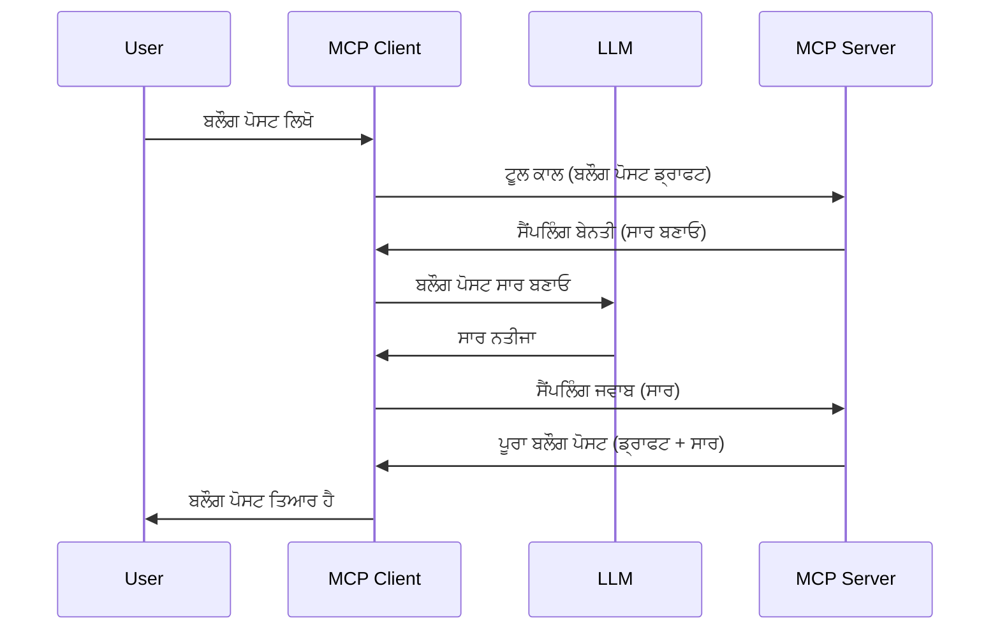

# ਸੈਮਪਲਿੰਗ - ਕੁਲਾਇੰਟ ਨੂੰ Delegate ਫੀਚਰ

ਕਈ ਵਾਰ, ਤੁਹਾਨੂੰ MCP ਕੁਲਾਇੰਟ ਅਤੇ MCP ਸਰਵਰ ਨੂੰ ਇੱਕ ਸਾਂਝੇ ਮਕਸਦ ਲਈ ਮਿਲ ਕੇ ਕੰਮ ਕਰਨ ਦੀ ਲੋੜ ਹੁੰਦੀ ਹੈ। ਤੁਹਾਡੇ ਕੋਲ ਇੱਕ ਐਸਾ ਕੇਸ ਹੋ ਸਕਦਾ ਹੈ ਜਿੱਥੇ ਸਰਵਰ ਨੂੰ ਕਲਾਇੰਟ 'ਤੇ ਬੈਠੇ LLM ਦੀ ਸਹਾਇਤਾ ਦੀ ਜ਼ਰੂਰਤ ਪੈਂਦੀ ਹੈ। ਇਸ ਸਥਿਤੀ ਲਈ, ਸੈਮਪਲਿੰਗ ਉਹ ਚੀਜ਼ ਹੈ ਜੋ ਤੁਹਾਨੂੰ ਵਰਤਨੀ ਚਾਹੀਦੀ ਹੈ।

ਚਲੋ ਕੁਝ ਵਰਤੋਂ ਕੇਸਾਂ ਦੀ ਜਾਂਚ ਕਰੀਏ ਅਤੇ ਕਿਵੇਂ ਸੈਮਪਲਿੰਗ ਨਾਲ ਇੱਕ ਹੱਲ ਬਣਾਇਆ ਜਾ ਸਕਦਾ ਹੈ, ਇਸ ਨੂੰ ਸਮਝੀਏ।

## ਓਵਰਵਿਊ

ਇਸ ਲੇਸਨ ਵਿੱਚ, ਅਸੀਂ ਧਿਆਨ ਧਰਾਂਗੇ ਕਿਉਂ ਅਤੇ ਕਿੱਥੇ ਸੈਮਪਲਿੰਗ ਵਰਤਣੀ ਹੈ ਅਤੇ ਇਹ ਕਿਵੇਂ ਸੰਰਚਿਤ ਕਰਨੀ ਹੈ।

## ਸਿੱਖਣ ਦੇ ਲਕੜੇ

ਇਸ ਅਧਿਆਇ ਵਿੱਚ, ਅਸੀਂ:

- ਸਮਝਾਵਾਂਗੇ ਕਿ ਸੈਮਪਲਿੰਗ ਕੀ ਹੈ ਅਤੇ ਕਦੋਂ ਵਰਤੀ ਜਾਂਦੀ ਹੈ।
- MCP ਵਿੱਚ ਸੈਮਪਲਿੰਗ ਕਿਵੇਂ ਸੰਰਚਿਤ ਕਰੀਦਾ ਹੈ, ਦਿਖਾਵਾਂਗੇ।
- ਸੈਮਪਲਿੰਗ ਦੀ ਕਾਰਵਾਈ ਦੇ ਉਦਾਹਰਣ ਦਿੱਤੀਆਂ ਜਾਣਗੀਆਂ।

## ਸੈਮਪਲਿੰਗ ਕੀ ਹੈ ਅਤੇ ਇਸਦਾ ਕੀ ਲਾਭ ਹੈ?

ਸੈਮਪਲਿੰਗ ਇੱਕ ਅਗਵਧ ਫੀਚਰ ਹੈ ਜੋ ਹੇਠਲਾ ਢੰਗ ਨਾਲ ਕੰਮ ਕਰਦਾ ਹੈ:



### ਸੈਮਪਲਿੰਗ ਬੇਨਤੀ

ਠੀਕ ਹੈ, ਹੁਣ ਸਾਡੇ ਕੋਲ ਇੱਕ ਵਿਸ਼ਵਾਸਯੋਗ ਸਥਿਤੀ ਦਾ ਉੱਚ ਦ੍ਰਿਸ਼ਟੀ ਕੰਨ ਹੈ, ਚਲੋ ਸਰਵਰ ਵੱਲੋਂ ਕੁਲਾਇੰਟ ਨੂੰ ਭੇਜੀ ਜਾਣ ਵਾਲੀ ਸੈਮਪਲਿੰਗ ਬੇਨਤੀ ਬਾਰੇ ਗੱਲ ਕਰੀਏ। JSON-RPC ਫਾਰਮੈਟ ਵਿੱਚ ਇਹ ਇਸ ਤਰ੍ਹਾਂ ਦੀ ਬੇਨਤੀ ਹੋ ਸਕਦੀ ਹੈ:

```json
{
  "jsonrpc": "2.0",
  "id": 1,
  "method": "sampling/createMessage",
  "params": {
    "messages": [
      {
        "role": "user",
        "content": {
          "type": "text",
          "text": "Create a blog post summary of the following blog post: <BLOG POST>"
        }
      }
    ],
    "modelPreferences": {
      "hints": [
        {
          "name": "claude-3-sonnet"
        }
      ],
      "intelligencePriority": 0.8,
      "speedPriority": 0.5
    },
    "systemPrompt": "You are a helpful assistant.",
    "maxTokens": 100
  }
}
```

ਇੱਥੇ ਕੁਝ ਗੱਲਾਂ ਹਨ ਜੋ ਉਲਲੇਖਯੋਗ ਹਨ:

- Prompt, content -> text ਹੇਠਾਂ, ਸਾਡਾ ਪ੍ਰੋਮਪਟ ਹੈ ਜੋ LLM ਲਈ ਇਕ ਨਿਰਦੇਸ਼ ਹੈ ਕਿ ਉਹ ਬਲੌਗ ਪੋਸਟ ਸਮੱਗਰੀ ਦਾ ਸਾਰ ਸੰਖੇਪ ਕਰੇ।

- **modelPreferences**. ਇਹ ਹਿੱਸਾ ਬਸ ਇੱਕ ਪਸੰਦ ਹੈ, ਇੱਕ ਸਿਫਾਰਸ਼ ਹੈ ਕਿ LLM ਨਾਲ ਕਿਹੜੀ ਸੰਰਚਨਾ ਵਰਤੀ ਜਾਵੇ। ਯੂਜ਼ਰ ਇਹ ਚੁਣ ਸਕਦਾ ਹੈ ਕਿ ਉਹ ਇਹ ਸਿਫਾਰਿਸ਼ਾਂ ਮੰਨੇ ਜਾਂ ਇਸਨੂੰ ਬਦਲੇ। ਇਸ ਕੇਸ ਵਿੱਚ ਮਾਡਲ, ਗਤੀ ਅਤੇ ਬੁੱਧੀਮਾਨੀ ਪ੍ਰਭਾਵੀਤਾ ਬਾਰੇ ਸਿਫਾਰਿਸ਼ਾਂ ਹਨ।
- **systemPrompt**, ਇਹ ਤੁਹਾਡਾ ਆਮ ਸਿਸਟਮ ਪ੍ਰੋਮਪਟ ਹੈ ਜੋ ਤੁਹਾਡੇ LLM ਨੂੰ ਇੱਕ ਵਿਅਕਤੀਗਤਪਨ ਦਿੰਦਾ ਹੈ ਅਤੇ ਹਦਾਇਤਾਂ ਵਾਲੀਆਂ ਸੂਝਾਂ ਸ਼ਾਮਿਲ ਹੁੰਦੀਆਂ ਹਨ।
- **maxTokens**, ਇੱਕ ਹੋਰ ਗੁਣ ਹੈ ਜੋ ਦੱਸਦਾ ਹੈ ਕਿ ਇਸ ਕਾਰਜ ਲਈ ਕਿੰਨੇ ਟੋਕਨ ਵਰਤਣ ਦੀ ਸਿਫਾਰਿਸ਼ ਕੀਤੀ ਗਈ ਹੈ।

### ਸੈਮਪਲਿੰਗ ਜਵਾਬ

ਇਹ ਜਵਾਬ MCP ਕੁਲਾਇੰਟ ਵੱਲੋਂ MCP ਸਰਵਰ ਨੂੰ ਭੇਜਿਆ ਜਾਂਦਾ ਹੈ ਅਤੇ ਇਹ ਕੁਲਾਇੰਟ ਵੱਲੋਂ LLM ਨੂੰ ਕਾਲ ਕਰਨ, ਉਸ ਜਵਾਬ ਦੀ ਉਡੀਕ ਕਰਨ ਅਤੇ ਫਿਰ ਇਹ ਸੁਨੇਹਾ ਤਿਆਰ ਕਰਨ ਦਾ ਨਤੀਜਾ ਹੁੰਦਾ ਹੈ। JSON-RPC ਵਿੱਚ ਇਹ ਇਸ ਪ੍ਰਕਾਰ ਦਿਖਾਈ ਦੇ ਸਕਦਾ ਹੈ:

```json
{
  "jsonrpc": "2.0",
  "id": 1,
  "result": {
    "role": "assistant",
    "content": {
      "type": "text",
      "text": "Here's your abstract <ABSTRACT>"
    },
    "model": "gpt-5",
    "stopReason": "endTurn"
  }
}
```

ਨੋਟ ਕਰੋ ਕਿ ਜਵਾਬ ਬਲੌਗ ਪੋਸਟ ਦਾ ਸੰਖੇਪ ਹੈ ਜਿਸਦੀ ਅਸੀਂ ਮੰਗ ਕੀਤੀ ਸੀ। ਇਸਦੇ ਨਾਲ ਹੀ ਨੋਟ ਕਰੋ ਕਿ ਵਰਤਿਆ ਗਿਆ `model` ਉਹ ਨਹੀਂ ਜੋ ਅਸੀਂ ਮੰਗਿਆ ਸੀ, ਪਰ "gpt-5" ਹੈ "claude-3-sonnet" ਦੇ ਉੱਪਰ। ਇਹ ਦਿਖਾਉਂਦਾ ਹੈ ਕਿ ਯੂਜ਼ਰ ਆਪਣੇ ਚੋਣ ਨੂੰ ਬਦਲ ਸਕਦਾ ਹੈ ਅਤੇ ਤੁਹਾਡੀ ਸੈਮਪਲਿੰਗ ਬੇਨਤੀ ਸਿਫਾਰਿਸ਼ ਹੁੰਦੀ ਹੈ।

ਠੀਕ ਹੈ, ਹੁਣ ਜਦੋਂ ਅਸੀਂ ਮੁੱਖ ਪ੍ਰਵਾਹ ਅਤੇ ਇੱਕ ਉਪਯੋਗੀ ਕਾਰਜ "ਬਲੌਗ ਪੋਸਟ ਬਣਾਉਣਾ + ਸੰਖੇਪ" ਨੂੰ ਸਮਝ ਲਿਆ ਹੈ, ਚਲੋ ਦੇਖੀਏ ਕਿ ਇਸਨੂੰ ਕੰਮ ਕਰਨ ਲਈ ਕੀ ਕਰਨਾ ਪਵੇਗਾ।

### ਸੁਨੇਹਾ ਕਿਸਮਾਂ

ਸੈਮਪਲਿੰਗ ਸੁਨੇਹੇ ਸਿਰਫ ਟੈਕਸਟ ਤੱਕ ਸੀਮਿਤ ਨਹੀਂ ਹਨ, ਤੁਸੀਂ ਤਸਵੀਰਾਂ ਅਤੇ ਆਡੀਓ ਵੀ ਭੇਜ ਸਕਦੇ ਹੋ। JSON-RPC ਕਿਸ ਤਰ੍ਹਾਂ ਵੱਖਰਾ ਲੱਗਦਾ ਹੈ ਵੇਖੋ:

**ਟੈਕਸਟ**

```json
{
  "type": "text",
  "text": "The message content"
}
```

**ਤਸਵੀਰ ਸਮੱਗਰੀ**

```json
{
  "type": "image",
  "data": "base64-encoded-image-data",
  "mimeType": "image/jpeg"
}
```

**ਆਡੀਓ ਸਮੱਗਰੀ**

```json
{
  "type": "audio",
  "data": "base64-encoded-audio-data",
  "mimeType": "audio/wav"
}
```

> NOTE: ਸੈਮਪਲਿੰਗ ਬਾਰੇ ਵਧੇਰੇ ਵਿਸਥਾਰਿਤ ਜਾਣਕਾਰੀ ਲਈ, [ਆਧਿਕਾਰਕ ਦਸਤਾਵੇਜ਼](https://modelcontextprotocol.io/specification/2025-11-25/client/sampling) ਵੇਖੋ

## ਕੁਲਾਇੰਟ ਵਿੱਚ ਸੈਮਪਲਿੰਗ ਕਿਵੇਂ ਸੰਰਚਿਤ ਕਰੀਏ

> ਨੋਟ: ਜੇ ਤੁਸੀਂ ਸਿਰਫ਼ ਸਰਵਰ ਬਣਾਉ ਰਹੇ ਹੋ ਤਾਂ ਇੱਥੇ ਬਹੁਤ ਕੁਝ ਕਰਨ ਦੀ ਲੋੜ ਨਹੀਂ।

ਇੱਕ ਕੁਲਾਇੰਟ ਵਿੱਚ, ਤੁਹਾਨੂੰ ਹੇਠਾਂ ਦਿੱਤਾ ਫੀਚਰ ਇਸ ਤਰ੍ਹਾਂ ਦਰਜ ਕਰਨਾ ਪਵੇਗਾ:

```json
{
  "capabilities": {
    "sampling": {}
  }
}
```

ਜਦੋਂ ਤੁਹਾਡਾ ਚੁਣਿਆ ਹੋਇਆ ਕੁਲਾਇੰਟ ਸਰਵਰ ਨਾਲ ਇਨਿਸ਼ੀਐਟ ਹੁੰਦਾ ਹੈ ਤਾਂ ਇਹ ਫੀਚਰ ਲਾਗੂ ਕੀਤਾ ਜਾਵੇਗਾ।

## ਸੈਮਪਲਿੰਗ ਦੀ ਕਾਰਵਾਈ ਦਾ ਉਦਾਹਰਣ - ਬਲੌਗ ਪੋਸਟ ਬਣਾਉਣ

ਆਓ ਇੱਕ ਸੈਮਪਲਿੰਗ ਸਰਵਰ ਬਣਾਈਏ, ਸਾਨੂੰ ਹੇਠ ਲਿਖਿਆ ਕੰਮ ਕਰਨਾ ਹੋਵੇਗਾ:

1. ਸਰਵਰ 'ਤੇ ਇੱਕ ਟੂਲ ਬਣਾਓ।
2. ਉਹ ਟੂਲ ਇੱਕ ਸੈਮਪਲਿੰਗ ਬੇਨਤੀ ਤਿਆਰ ਕਰੇ।
3. ਟੂਲ ਕੁਲਾਇੰਟ ਦੀ ਸੈਮਪਲਿੰਗ ਬੇਨਤੀ ਦੇ ਜਵਾਬ ਦੀ ਉਡੀਕ ਕਰੇ।
4. ਫਿਰ ਟੂਲ ਦਾ ਨਤੀਜਾ ਤਿਆਰ ਕੀਤਾ ਜਾਵੇ।

ਚਲੋ ਖੇਤੀ ਕਦਮ ਦਰ ਕਦਮ ਕੋਡ ਵੇਖੀਏ:

### -1- ਟੂਲ ਬਣਾਉਣਾ

**python**

```python
@mcp.tool()
async def create_blog(title: str, content: str, ctx: Context[ServerSession, None]) -> str:
    """Create a blog post and generate a summary"""

```

### -2- ਸੈਮਪਲਿੰਗ ਬੇਨਤੀ ਬਣਾਉਣਾ

ਆਪਣੇ ਟੂਲ ਨੂੰ ਹੇਠਾਂ ਦਿੱਤੇ ਕੋਡ ਨਾਲ ਵਧਾਓ:

**python**

```python
post = BlogPost(
        id=len(posts) + 1,
        title=title,
        content=content,
        abstract=""
    )

prompt = f"Create an abstract of the following blog post: title: {title} and draft: {content} "

result = await ctx.session.create_message(
        messages=[
            SamplingMessage(
                role="user",
                content=TextContent(type="text", text=prompt),
            )
        ],
        max_tokens=100,
)

```

### -3- ਜਵਾਬ ਦੀ ਉਡੀਕ ਕਰੋ ਅਤੇ ਜਵਾਬ ਵਾਪਸ ਕਰੋ

**python**

```python
post.abstract = result.content.text

posts.append(post)

# ਪੂਰੇ ਉਤਪਾਦ ਨੂੰ ਵਾਪਸ ਕਰੋ
return json.dumps({
    "id": post.title,
    "abstract": post.abstract
})
```

### -4- مکمل ਕੋਡ

**python**

```python
from starlette.applications import Starlette
from starlette.routing import Mount, Host

from mcp.server.fastmcp import Context, FastMCP

from mcp.server.session import ServerSession
from mcp.types import SamplingMessage, TextContent

import json


from uuid import uuid4
from typing import List
from pydantic import BaseModel


mcp = FastMCP("Blog post generator")

# app = FastAPI()

posts = []

class BlogPost(BaseModel):
    id: int
    title: str
    content: str
    abstract: str

posts: List[BlogPost] = []

@mcp.tool()
async def create_blog(title: str, content: str, ctx: Context[ServerSession, None]) -> str:
    """Create a blog post and generate a summary"""

    post = BlogPost(
        id=len(posts) + 1,
        title=title,
        content=content,
        abstract=""
    )

    prompt = f"Create an abstract of the following blog post: title: {title} and draft: {content} "

    result = await ctx.session.create_message(
        messages=[
            SamplingMessage(
                role="user",
                content=TextContent(type="text", text=prompt),
            )
        ],
        max_tokens=100,
    )

    post.abstract = result.content.text

    posts.append(post)

    # ਪੂਰਾ ਬਲੌਗ ਪੋਸਟ ਵਾਪਸ ਕਰੋ
    return json.dumps({
        "id": post.title,
        "abstract": post.abstract
    })

if __name__ == "__main__":
    print("Starting server...")
    # mcp.run()
    mcp.run(transport="streamable-http")

# app ਚਲਾਓ ਨਾਲ: python server.py
```

### -5- ਵਿਜ਼ੂਅਲ ਸਟੂਡੀਓ ਕੋਡ ਵਿੱਚ ਟੈਸਟਿੰਗ

ਵਿਜ਼ੂਅਲ ਸਟੂਡੀਓ ਕੋਡ ਵਿੱਚ ਇਸਨੂੰ ਟੈਸਟ ਕਰਨ ਲਈ, ਇਹ ਕਰੋ:

1. ਟਰਮੀਨਲ ਵਿੱਚ ਸਰਵਰ ਸ਼ੁਰੂ ਕਰੋ
2. ਇਸਨੂੰ *mcp.json* ਵਿੱਚ ਜੋੜੋ (ਅਤੇ ਇਹ ਸੁਨਿਸ਼ਚਿਤ ਕਰੋ ਕਿ ਇਹ ਸ਼ੁਰੂ ਹੈ), ਉਦਾਹਰਨ ਲਈ ਕੁਝ ਇਸ ਤਰ੍ਹਾਂ:

   ```json
   "servers": {
      "blog-server": {
        "type": "http",
        "url": "http://localhost:8000/mcp"
      }
   }
   ```

3. ਇੱਕ ਪ੍ਰੋਮਪਟ ਲਿਖੋ:

   ```text
   create a blog post named "Where Python comes from", the content is "Python is actually named after Monty Python Flying Circus"
   ```

4. ਸੈਮਪਲਿੰਗ ਹੋਣ ਦਿਓ। ਜਦੋਂ ਤੁਸੀਂ ਪਹਿਲੀ ਵਾਰ ਇਹ ਟੈਸਟ ਕਰਦੇ ਹੋ ਤਾਂ ਤੁਹਾਨੂੰ ਇੱਕ ਵਾਧੂ ਡਾਇਲਾਗ ਦਿੱਤਾ ਜਾਵੇਗਾ ਜਿਸਨੂੰ ਮੰਨਣਾ ਪਵੇਗਾ, ਫਿਰ ਤੁਸੀਂ ਇੱਕ ਆਮ ਡਾਇਲਾਗ ਵੇਖੋਗੇ ਜੋ ਤੁਹਾਨੂੰ ਟੂਲ ਚਲਾਉਣ ਲਈ ਪੁੱਛੇਗਾ।

5. ਨਤੀਜੇ ਦੇਖੋ। ਤੁਸੀਂ ਨਤੀਜੇ GitHub Copilot Chat ਵਿੱਚ ਸੋਹਣੇ ਤਰੀਕੇ ਨਾਲ ਦੇਖੋਗੇ ਪਰ ਤੁਸੀਂ ਕੱਚੇ JSON ਜਵਾਬ ਨੂੰ ਵੀ ਦੇਖ ਸਕਦੇ ਹੋ।

**ਬੋਨਸ**. ਵਿਜ਼ੂਅਲ ਸਟੂਡੀਓ ਕੋਡ ਟੂਲਿੰਗ ਸੈਮਪਲਿੰਗ ਲਈ ਸ਼ਾਨਦਾਰ ਸਹਾਇਤਾ ਦਿੰਦੀ ਹੈ। ਤੁਸੀਂ ਆਪਣੇ ਇੰਸਟਾਲ ਕੀਤਾ ਸਰਵਰ 'ਤੇ ਸੈਮਪਲਿੰਗ ਪਹੁੰਚ ਸੰਰਚਿਤ ਕਰ ਸਕਦੇ ਹੋ:

1. ਐਕਸਟੈਂਸ਼ਨ ਸੈਕਸ਼ਨ ਵਿੱਚ ਜਾਓ।
2. "MCP SERVERS - INSTALLED" ਸੈਕਸ਼ਨ ਵਿੱਚ ਆਪਣੇ ਇੰਸਟਾਲ ਹੋਏ ਸਰਵਰ ਲਈ ਕਾਗ ਆਈਕਾਨ ਸੇਲੈਕਟ ਕਰੋ।
3. "Configure Model Access" ਚੁਣੋ, ਇੱਥੇ ਤੁਸੀਂ ਚੁਣ ਸਕਦੇ ਹੋ ਕਿ GitHub Copilot ਕਿਹੜੇ ਮਾਡਲ ਦਾ ਉਪਯੋਗ ਸਕਦਾ ਹੈ ਜਦੋਂ ਸੈਮਪਲਿੰਗ ਹੋ ਰਹੀ ਹੋਵੇ। ਤੁਸੀਂ ਹਾਲ ਹੀ ਵਿੱਚ ਹੋਏ ਸਾਰੇ ਸੈਮਪਲਿੰਗ ਬੇਨਤੀਆਂ "Show Sampling requests" ਚੁਣ ਕੇ ਵੀ ਵੇਖ ਸਕਦੇ ਹੋ।

## ਅਸਾਈਨਮੈਂਟ

ਇਸ ਅਸਾਈਨਮੈਂਟ ਵਿੱਚ, ਤੁਸੀਂ ਇਕ ਥੋੜ੍ਹਾ ਵੱਖਰਾ ਸੈਮਪਲਿੰਗ ਬਣਾਵੋਗੇ ਜੋ ਇੱਕ ਸੈਮਪਲਿੰਗ ਇੰਟੀਗਰੇਸ਼ਨ ਹੈ ਜੋ ਪ੍ਰਡਕਟ ਵਰਣਨ ਤਿਆਰ ਕਰਨ ਦਾ ਸਮਰਥਨ ਕਰਦਾ ਹੈ। ਤੁਹਾਡਾ ਸਥਿਤੀ ਇਹ ਹੈ:

**ਸਤਿਹਤੀ**: ਇੱਕ ਈ-ਕਾਮਰਸ ਦਾ ਬੈਕ ਆਫਿਸ ਕਰਮਚਾਰੀ ਮਦਦ ਦੀ ਲੋੜ ਵਿੱਚ ਹੈ, ਪ੍ਰੋਡਕਟ ਵਰਣਨਾਂ ਬਣਾਉਣ ਵਿੱਚ ਬਹੁਤ ਸਮਾਂ ਲੱਗਦਾ ਹੈ। ਇਸ ਲਈ ਤੁਸੀਂ ਐਸਾ ਹੱਲ ਤਿਆਰ ਕਰੋ ਜਿੱਥੇ ਤੁਸੀਂ ਇੱਕ ਟੂਲ "create_product" ਨੂੰ "title" ਅਤੇ "keywords" ਤਰ੍ਹਾਂ ਆਰਗਿਊਮੈਂਟ ਨਾਲ ਕਾਲ ਕਰੋ ਅਤੇ ਇਹ ਇੱਕ ਪੂਰਾ ਪ੍ਰਡਕਟ ਤਿਆਰ ਕਰੇ ਜਿਸ ਵਿੱਚ "description" ਖੇਤਰ ਸ਼ਾਮਿਲ ਹੋਵੇ ਜੋ ਕੁਲਾਇੰਟ ਦੇ LLM ਦੁਆਰਾ ਭਰਿਆ ਜਾਵੇ।

TIP: ਪਹਿਲਾਂ ਜੋ ਕੁਝ ਸਿੱਖਿਆ ਹੈ ਉਸਨੂੰ ਵਰਤ ਕੇ ਇਹ ਸਰਵਰ ਅਤੇ ਇਸਦਾ ਟੂਲ ਸੈਮਪਲਿੰਗ ਬੇਨਤੀ ਵਰਤ ਕੇ ਬਣਾਓ।

## ਹੱਲ

[Solution](./solution/README.md)

## ਮੁੱਖ ਮੇਲ

ਸੈਮਪਲਿੰਗ ਇੱਕ ਸ਼ਕਤੀਸ਼ਾਲੀ ਫੀਚਰ ਹੈ ਜੋ ਸਰਵਰ ਨੂੰ ਇਹ ਯੋਗ ਬਣਾਉਂਦਾ ਹੈ ਕਿ ਜਦੋਂ LLM ਦੀ ਮਦਦ ਦੀ ਲੋੜ ਹੋਵੇ ਤਾਂ ਉਹ ਕਾਰਜਾਂ ਨੂੰ ਕੁਲਾਇੰਟ ਨੂੰ ਸੌਂਪ ਸਕੇ।

## ਅਗਲਾ ਕੀ ਹੈ

- [ਅਧਿਆਇ 4 - ਵਿਆਵਹਾਰਿਕ ਲਾਗੂ ਕਰਨ](../../04-PracticalImplementation/README.md)

---

<!-- CO-OP TRANSLATOR DISCLAIMER START -->
**ਅਸਵੀਕਾਰੋਪਣ**:
ਇਸ ਦਸਤਾਵੇਜ਼ ਦਾ ਅਨੁਵਾਦ ਏਆਈ ਅਨੁਵਾਦ ਸੇਵਾ [Co-op Translator](https://github.com/Azure/co-op-translator) ਦੀ ਵਰਤੋਂ ਕਰਕੇ ਕੀਤਾ ਗਿਆ ਹੈ। ਜਦੋਂ ਕਿ ਅਸੀਂ ਸਹੀਤਾਵਾਂ ਲਈ ਯਤਨਸ਼ੀਲ ਹਾਂ, ਕਿਰਪਾ ਕਰਕੇ ਧਿਆਨ ਰੱਖੋ ਕਿ ਸਵੈਚਾਲਿਤ ਅਨੁਵਾਦਾਂ ਵਿੱਚ ਗਲਤੀਆਂ ਜਾਂ ਅਸਮੱਤਿਆਵਾਂ ਹੋ ਸਕਦੀਆਂ ਹਨ। ਮੂਲ ਦਸਤਾਵੇਜ਼ ਆਪਣੀ ਮੂਲ ਭਾਸ਼ਾ ਵਿੱਚ ਅਧਿਕਾਰਕ ਸਰੋਤ ਮੰਨਿਆ ਜਾਣਾ ਚਾਹੀਦਾ ਹੈ। ਜਰੂਰੀ ਜਾਣਕਾਰੀ ਲਈ, ਪੇਸ਼ੇਵਰ ਮਨੁੱਖੀ ਅਨੁਵਾਦ ਦੀ ਸਿਫ਼ਾਰਸ਼ ਕੀਤੀ ਜਾਂਦੀ ਹੈ। ਅਸੀਂ ਇਸ ਅਨੁਵਾਦ ਦੇ ਉਪਯੋਗ ਤੋਂ ਪੈਦਾ ਹੋਣ ਵਾਲੀਆਂ ਕਿਸੇ ਵੀ ਗਲਤਫਹਿਮੀਆਂ ਜਾਂ ਗਲਤ ਵਿਆਖਿਆਵਾਂ ਲਈ ਜਵਾਬਦੇਹ ਨਹੀਂ ਹਾਂ।
<!-- CO-OP TRANSLATOR DISCLAIMER END -->