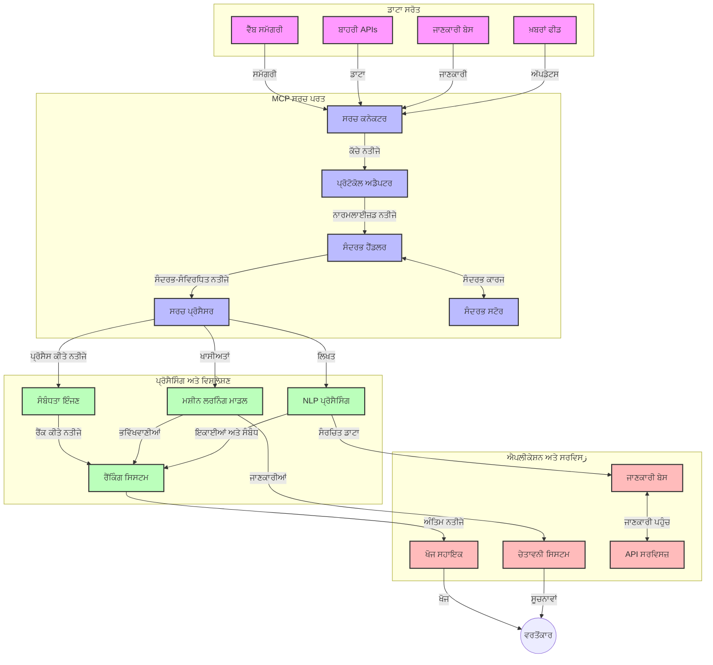
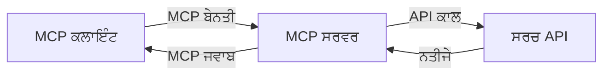
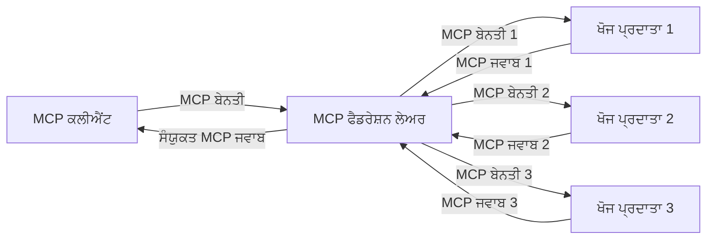
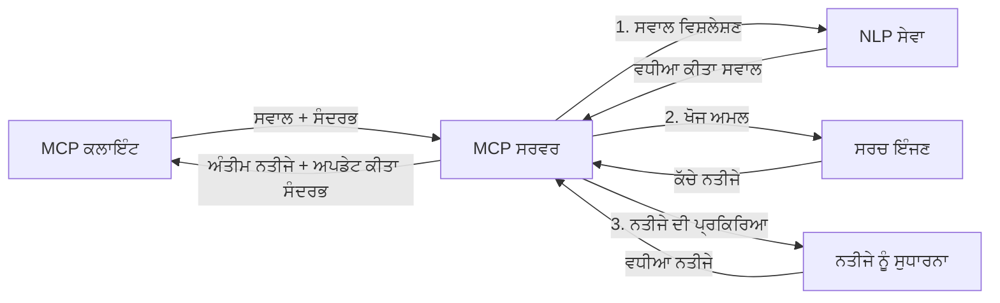

# ਮਾਡਲ ਪ੍ਰਸੰਗ ਪ੍ਰੋਟੋਕੋਲ ਸੱਚੇ ਸਮੇਂ ਵੈੱਬ ਖੋਜ ਲਈ

## ਝਲਕ

ਸੱਚੇ ਸਮੇਂ ਵੈੱਬ ਖੋਜ ਅੱਜ ਦੀ ਜਾਣਕਾਰੀ-ਚालित ਵਾਤਾਵਰਣ ਵਿੱਚ ਜ਼ਰੂਰੀ ਹੋ ਚੁੱਕੀ ਹੈ, ਜਿੱਥੇ ਐਪਲੀਕੇਸ਼ਨਾਂ ਨੂੰ ਇੰਟਰਨੈੱਟ 'ਤੇ ਤਾਜ਼ਾ ਜਾਣਕਾਰੀ ਤਕ ਤੁਰੰਤ ਪਹੁੰਚ ਦੀ ਲੋੜ ਹੁੰਦੀ ਹੈ ਤਾਂ ਜੋ ਉਹ ਸਬੰਧਿਤ ਅਤੇ ਸਮੇਂਬੱਧ ਜਵਾਬ ਦੇ ਸਕਣ। ਮਾਡਲ ਪ੍ਰਸੰਗ ਪ੍ਰੋਟੋਕੋਲ (MCP) ਇਹਨਾਂ ਸੱਚੇ ਸਮੇਂ ਖੋਜ ਪ੍ਰਕਿਰਿਆਵਾਂ ਨੂੰ ਅਦਵਾਨਸ ਕਰਨ ਵਿੱਚ ਇੱਕ ਮਹੱਤਵਪੂਰਨ ਵਧਾਰ ਹੈ, ਜੋ ਖੋਜ ਕਾਰਗੁਜ਼ਾਰੀ ਨੂੰ ਬੇਹਤਰ ਬਣਾਉਂਦਾ ਹੈ, ਪ੍ਰਸੰਗਿਕਤਾ ਨੂੰ ਬਰਕਰਾਰ ਰੱਖਦਾ ਹੈ, ਅਤੇ ਸਮੁੱਚੇ ਪ੍ਰਣਾਲੀ ਪ੍ਰਦਰਸ਼ਨ ਨੂੰ ਸੁਧਾਰਦਾ ਹੈ।

ਇਹ ਮਾਡਿਊਲ ਦਿਖਾਉਂਦਾ ਹੈ ਕਿ MCP ਕਿਵੇਂ ਏआਈ ਮਾਡਲਾਂ, ਖੋਜ ਇੰਜਣਾਂ ਅਤੇ ਐਪਲੀਕੇਸ਼ਨਾਂ ਵਿੱਚ ਪ੍ਰਸੰਗ ਪ੍ਰਬੰਧਨ ਲਈ ਏਕਸਾਰ ਧਨਧਰੂਪ ਜਾਂਚ ਪਹੁੰਚ ਪ੍ਰਦਾਨ ਕਰਕੇ ਸੱਚੇ ਸਮੇਂ ਵੈੱਬ ਖੋਜ ਨੂੰ ਬਦਲਦਾ ਹੈ।

### ਤੁਸੀਂ ਕੀ ਸਿੱਖੋਗੇ

ਇਸ ਵਿਆਪਕ ਮਾਰਗਦਰਸ਼ੀ ਵਿੱਚ, ਤੁਸੀਂ ਜਾਣੋਗੇ:

- ਕਿ MCP ਕਿਵੇਂ ਏਆਈ ਮਾਡਲਾਂ ਅਤੇ ਸੱਚੇ ਸਮੇਂ ਵੈੱਬ ਖੋਜ ਸਮਰੱਥਾਵਾਂ ਵਿਚਕਾਰ ਸੁਚਾਰੂ ਪੁਲ ਬਣਾਉਂਦਾ ਹੈ
- MCP ਨਾਲ ਪ੍ਰਭਾਵਸ਼ਾਲੀ ਅਤੇ ਸਕੇਲ ਕਰਨ ਯੋਗ ਖੋਜ ਹੱਲਾਂ ਦਾ ਨਿਰਮਾਣ ਕਰਨ ਲਈ ਆਰਕੀਟੈਕਚਰ ਪੈਟਰਨ
- ਕਈ ਪੁੱਛਗਿੱਛਾਂ ਅਤੇ ਇੰਟਰੈਕਸ਼ਨਾਂ ਵਿੱਚ ਖੋਜ ਪ੍ਰਸੰਗ ਦੀ ਸੰਭਾਲ ਕਰਨ ਦੀ ਤਕਨੀਕਾਂ
- ਵੱਖ-ਵੱਖ ਖੋਜ ਸਥਿਤੀਆਂ ਲਈ Python ਅਤੇ JavaScript ਵਿੱਚ ਵਿਆਵਹਾਰਿਕ ਕੋਡ ਨਿਰੰਦੇਸ਼
- MCP-ਸੰਚालित ਖੋਜ ਪ੍ਰਣਾਲੀਆਂ ਵਿੱਚ ਮਹੱਤਵਪੂਰਨਤਾ, ਤਾਜ਼ਗੀ ਅਤੇ ਕਾਰਗੁਜ਼ਾਰੀ ਦਾ ਸੰਤੁਲਨ ਬਣਾਉਣ ਦੇ ਢੰਗ

## ਸੱਚੇ ਸਮੇਂ ਵੈੱਬ ਖੋਜ ਦਾ ਪਰੀਚਯ

ਸੱਚੇ ਸਮੇਂ ਵੈੱਬ ਖੋਜ ਉਹ ਤਕਨਾਲੋਜੀਕ ਪਹੁੰਚ ਹੈ ਜੋ ਵੈੱਬ ਅਧਾਰਤ ਜਾਣਕਾਰੀ ਦੀ ਲਗਾਤਾਰ ਪੁੱਛਗਿੱਛ, ਪ੍ਰਕਿਰਿਆ ਅਤੇ ਵਿਸ਼ਲੇਸ਼ਣ ਯੋਗ ਬਣਾਉਂਦੀ ਹੈ ਜਿਵੇਂ ਇਹ ਪ੍ਰकाशਿਤ ਜਾਂ ਅੱਪਡੇਟ ਹੁੰਦੀ ਹੈ, ਪ੍ਰਣਾਲੀਆਂ ਨੂੰ ਘੱਟ ਤੋਂ ਘੱਟ ਦੇਰੀ ਨਾਲ ਤਾਜ਼ਾ ਅਤੇ ਸਬੰਧਿਤ ਜਾਣਕਾਰੀ ਦੇਣ ਲਈ ਯੋਗ ਬਣਾਉਂਦੀ ਹੈ। ਪੁਰਾਣੀ ਖੋਜ ਪ੍ਰਣਾਲੀਆਂ ਜੋ ਸੂਚੀਬੱਧ ਡਾਟਾ 'ਤੇ ਕੰਮ ਕਰਦੀਆਂ ਹਨ ਜੋ ਘੰਟਿਆਂ ਜਾਂ ਦਿਨਾਂ ਪੁਰਾਣਾ ਹੋ ਸਕਦਾ ਹੈ, ਦੇ ਉਲਟ ਸੱਚੇ ਸਮੇਂ ਖੋਜ ਵੈੱਬ ਤੋਂ ਜ਼ਿੰਦਾ ਡਾਟਾ ਪ੍ਰਸੇਸ ਕਰ ਕੇ ਅਜਿਹੇ ਜਾਣਕਾਰੀ ਪੇਸ਼ ਕਰਦੀ ਹੈ ਜੋ ਆਨਲਾਈਨ ਸਮੱਗਰੀ ਦੀ ਵਰਤਮਾਨ ਸਥਿਤੀ ਨੂੰ ਦਰਸਾਉਂਦੀ ਹੈ।

### ਸੱਚੇ ਸਮੇਂ ਵੈੱਬ ਖੋਜ ਦੇ ਮੁੱਖ ਸਿਧਾਂਤ:

- **ਲਗਾਤਾਰ ਪੁੱਛਗਿੱਛ ਪ੍ਰਕਿਰਿਆ**: ਖੋਜ ਪੁੱਛਗਿੱਛਾਂ ਇਸ ਤਰੀਕੇ ਨਾਲ ਪ੍ਰਕਿਰਿਆ ਕੀਤੀਆਂ ਜਾਂਦੀਆਂ ਹਨ ਜਦੋਂ ਡਾਟਾ ਸਰੋਤ ਜਾਰੀ ਰਹਿੰਦੇ ਹਨ
- **ਤਾਜ਼ਗੀ ਨੂੰ ਤਰਜੀਹ**: ਪ੍ਰਣਾਲੀਆਂ ਨੂੰ ਤਾਜ਼ਾ ਜਾਣਕਾਰੀ ਨੂੰ ਪਹਿਲ ਦੇਣ ਲਈ ਡਿਜ਼ਾਇਨ ਕੀਤਾ ਗਿਆ ਹੈ
- **ਮਹੱਤਵਪੂਰਨਤਾ ਸੰਤੁਲਨ**: ਤਾਜ਼ਗੀ ਅਤੇ ਸਬੰਧਿਤਤਾ ਵਿਚਕਾਰ ਸੰਤੁਲਨ ਬਣਾਇਆ ਰੱਖਣਾ
- **ਸਕੇਲਯੋਗ ਆਰਕੀਟੈਕਚਰ**: ਪ੍ਰਣਾਲੀਆਂ ਵੱਖ-ਵੱਖ ਪੁੱਛਗਿੱਛ ਬੋਝ ਅਤੇ ਡਾਟਾ ਮਾਤਰਾ ਸੰਭਾਲ ਸਕਦੀਆਂ ਹਨ
- **ਪ੍ਰਸੰਗਿਕ ਸਮਝ**: ਖੋਜ ਚੱਕਰ ਵਿੱਚ ਯੂਜ਼ਰ ਦੇ ਪ੍ਰਸੰਗ ਨੂੰ ਬਰਕਰਾਰ ਰੱਖਣਾ ਅਹਿਮ ਹੈ
- **ਗਤੀਸ਼ੀਲ ਪੁੱਛਗਿੱਛ ਦੁਬਾਰਾ-ਸੰਰਚਨਾ**: ਸੰਦਰਭ ਅਤੇ ਪਿਛਲੇ ਨਤੀਜਿਆਂ ਦੇ ਆਧਾਰ 'ਤੇ ਪੁੱਛਗਿੱਛ ਨੂੰ ਯੋਗਤਮ ਤਰੀਕੇ ਨਾਲ ਬਦਲਣਾ
- **ਮਲਟੀ-ਸਰੋਤ ਇੰਟੀਗਰੇਸ਼ਨ**: ਕਈ ਖੋਜ ਪ੍ਰਦਾਤਾਵਾਂ ਅਤੇ ਵੈੱਬ ਸਰੋਤਾਂ ਤੋਂ ਨਤੀਜੇ ਮਿਲਾਉਣਾ
- **ਸਮਾਂਤਾਕ ਸਮਝ**: ਸਿਰਫ ਕੁੰਜੀ-ਸ਼ਬਦਾਂ ਦੀ ਬਜਾਏ ਅਰਥ ਦੇ ਆਧਾਰ 'ਤੇ ਪੁੱਛਗਿੱਛ ਅਤੇ ਸਮੱਗਰੀ ਨੂੰ ਪ੍ਰਕਿਰਿਆ ਕਰਨਾ
- **ਸੱਚੇ ਸਮੇਂ ਰੈਂਕਿੰਗ**: ਨਵੇਂ ਜਾਣਕਾਰੀ ਪ੍ਰਾਪਤ ਹੋਣ 'ਤੇ ਨਤੀਜਿਆਂ ਦੀ ਰੈਂਕਿੰਗ ਲਗਾਤਾਰ ਬਦਲਦੀ ਰਹਿੰਦੀ ਹੈ

### ਮਾਡਲ ਪ੍ਰਸੰਗ ਪ੍ਰੋਟੋਕੋਲ ਅਤੇ ਸੱਚੇ ਸਮੇਂ ਵੈੱਬ ਖੋਜ

ਮਾਡਲ ਪ੍ਰਸੰਗ ਪ੍ਰੋਟੋਕੋਲ (MCP) ਸੱਚੇ ਸਮੇਂ ਵੈੱਬ ਖੋਜ ਵਾਤਾਵਰਨ ਵਿੱਚ ਕਈ ਮਹੱਤਵਪੂਰਣ ਚੁਣੌਤੀਆਂ ਨੂੰ ਸਲਝਾਉਂਦਾ ਹੈ:

1. **ਖੋਜ ਪ੍ਰਸੰਗ ਦੀ ਸੰਭਾਲ**: MCP ਪ੍ਰਸੈਸ਼ ਨੂੰ ਵੰਡੇ ਹੋਏ ਖੋਜ ਘਟਕਾਂ ਦੇ ਵਿਚਕਾਰ ਪ੍ਰਸੰਗ ਬਰਕਰਾਰ ਰੱਖਣ ਲਈ ਮਿਆਰੀਕ੍ਰਿਤ ਕਰਦਾ ਹੈ, ਇਹ ਯਕੀਨੀ ਬਣਾਉਂਦਾ ਹੈ ਕਿ ਏਆਈ ਮਾਡਲਾਂ ਅਤੇ ਪ੍ਰੋਸੈਸਿੰਗ ਨੋਡਾਂ ਨੂੰ ਸਬੰਧਿਤ ਪੁੱਛਗਿੱਛ ਇਤਿਹਾਸ ਅਤੇ ਯੂਜ਼ਰ ਪਸੰਦਾਂ ਤੱਕ ਪਹੁੰਚ ਹੈ।

2. **ਪ੍ਰਭਾਵਸ਼ਾਲੀ ਪੁੱਛਗਿੱਛ ਪ੍ਰਬੰਧਨ**: ਪ੍ਰਸੰਗ ਪ੍ਰਸਾਰਣ ਲਈ ਸਧਾਰਤ ਢਾਂਚਾ ਪ੍ਰਦਾਨ ਕਰਕੇ, MCP ਹਰ ਖੋਜ ਚੱਕਰ ਵਿੱਚ ਪ੍ਰਸੰਗ ਦੁਹਰਾਉਣ ਦੀ ਲੋੜ ਘਟਾਉਂਦਾ ਹੈ।

3. **ਇੰਟਰਓਪਰੇਬਿਲਿਟੀ**: MCP ਵੱਖ-ਵੱਖ ਖੋਜ ਤਕਨੀਕਾਂ ਅਤੇ ਏਆਈ ਮਾਡਲਾਂ ਵਿੱਚ ਪ੍ਰਸੰਗ ਸਾਂਝਾ ਕਰਨ ਲਈ ਸਾਂਝੀ ਭਾਸ਼ਾ ਬਣਾਉਂਦਾ ਹੈ, ਜਿਹੜਾ ਵਧੇਰੇ ਲਚਕੀਲਾ ਅਤੇ ਵਿਸ਼ਤਾਰਯੋਗ ਆਰਕੀਟੈਕਚਰਾਂ ਨੂੰ ਸੰਭਵ ਬਣਾਉਂਦਾ ਹੈ।

4. **ਖੋਜ-ਅਧਾਰਿਤ ਪ੍ਰਸੰਗ**: MCP ਲਾਗੂ ਕਰਨਾ ਇਹ ਤੈਅ ਕਰ ਸਕਦਾ ਹੈ ਕਿ ਖੋਜ ਲਈ ਸਭ ਤੋਂ ਜ਼ਿਆਦਾ ਮਹੱਤਵਪੂਰਨ ਪ੍ਰਸੰਗ ਤੱਤ ਕਿਹੜੇ ਹਨ, ਕਾਰਗੁਜ਼ਾਰੀ ਅਤੇ ਸਹੀ ਤਰਤੀਬ ਦੋਹਾਂ ਲਈ ਅਨੁਕੂਲਿਤ ਕਰਦੇ ਹੋਏ।

5. **ਅਨੁਕੂਲਤ ਖੋਜ ਪ੍ਰਕਿਰਿਆ**: MCP ਦੇ ਜ਼ਰੀਏ ਸਹੀ ਪ੍ਰਸੰਗ ਪ੍ਰਬੰਧਨ ਨਾਲ, ਖੋਜ ਪ੍ਰਣਾਲੀਆਂ ਯੂਜ਼ਰ ਦੀਆਂ ਬਦਲ ਰਹੀਆਂ ਜ਼ਰੂਰਤਾਂ এবং ਜਾਣਕਾਰੀ ਦੇ ਵਾਤਾਵਰਣ ਦੇ ਆਧਾਰ 'ਤੇ ਪ੍ਰਕਿਰਿਆ ਨੂੰ ਗਤੀਸ਼ੀਲ ਤੌਰ 'ਤੇ ਢਾਲ ਸਕਦੀਆਂ ਹਨ।

ਆਧੁਨਿਕ ਐਪਲੀਕੇਸ਼ਨਾਂ ਵਿੱਚ ਜਿਵੇਂ ਨਿਊਜ਼ ਏਗਰੀਗੇਸ਼ਨ ਤੋਂ ਸਵੈਥ-ਅਧਿਐਨ ਮਦਦਗਾਰਾਂ ਤੱਕ, MCP ਦੀ ਵੈੱਬ ਖੋਜ ਤਕਨਾਲੋਜੀਆਂ ਨਾਲ ਇੰਟੀਗਰੇਸ਼ਨ ਵਧੀਆ ਬੁੱਧੀਮਾਨ, ਪ੍ਰਸੰਗ-ਸੰਵੇਦਨਸ਼ੀਲ ਖੋਜ ਨੂੰ ਯਕੀਨੀ ਬਣਾਉਂਦੀ ਹੈ ਜੋ ਯੂਜ਼ਰ ਇੰਟਰੈਕਸ਼ਨਾਂ ਦੇ ਨਾਲ ਸਬੰਧਿਤ ਨਤੀਜੇ ਪ੍ਰਦਾਨ ਕਰਦੀ ਹੈ।

## ਅਧਿਐਨ ਦੇ ਲਕੜਾਂ

ਇਸ ਪਾਠ ਦੇ ਅੰਤ ਤੱਕ, ਤੁਸੀਂ ਸਮਰੱਥ ਹੋਵੋਗੇ:

- ਸੱਚੇ ਸਮੇਂ ਵੈੱਬ ਖੋਜ ਅਤੇ ਆਧੁਨਿਕ ਐਪਲੀਕੇਸ਼ਨਾਂ ਵਿੱਚ ਇਸ ਦੀਆਂ ਚੁਣੌਤੀਆਂ ਨੂੰ ਸਮਝਣਾ
- ਸਮਝਾਉਣਾ ਕਿ ਮਾਡਲ ਪ੍ਰਸੰਗ ਪ੍ਰੋਟੋਕੋਲ (MCP) ਕਿਵੇਂ ਸੱਚੇ ਸਮੇਂ ਵੈੱਬ ਖੋਜ ਸਾਮਰੱਥਤਾ ਨੂੰ ਵਧਾਉਂਦਾ ਹੈ
- ਪ੍ਰਸਿੱਧ ਫਰੇਮਵਰਕਾਂ ਅਤੇ APIਜ਼ ਦੀ ਵਰਤੋਂ ਕਰਕੇ MCP-ਆਧਾਰਿਤ ਖੋਜ ਹੱਲ ਲਾਗੂ ਕਰਨਾ
- MCP ਨਾਲ ਸਕੇਲ ਕਰਨ ਯੋਗ, ਉੱਚ-ਪ੍ਰਦਰਸ਼ਨ ਖੋਜ ਆਰਕੀਟੈਕਚਰ ਦਾ ਡਿਜ਼ਾਈਨ ਅਤੇ ਡਿਪਲੋਇਮੈਂਟ
- MCP ਦੇ ਸਿਧਾਂਤਾਂ ਨੂੰ ਵੱਖ-ਵੱਖ ਵਰਤੋਂਕੇਸਾਂ ਵਿੱਚ ਲਾਗੂ ਕਰਨਾ ਜਿਵੇਂ ਸਮੈਂਤਿਕ ਖੋਜ, ਸਵੈਥ-ਅਧਿਆਨ ਮਦਦਗਾਰ, ਅਤੇ ਏਆਈ-ਅਨੁਪੂਰਕ ਬ੍ਰਾਊਜ਼ਿੰਗ
- ਉਭਰ ਰਹੇ ਰੁਝਾਨਾਂ ਅਤੇ ਭਵਿੱਖ ਦੇ ਨਵੀਨਤਾ ਨੂੰ ਮੂਲਾਂਕਣ ਕਰਨਾ MCP-ਆਧਾਰਿਤ ਖੋਜ ਤਕਨੀਕਾਂ ਵਿੱਚ
- ਯੂਜ਼ਰ ਇੰਟਰੈਕਸ਼ਨਾਂ ਤੋਂ ਸਿੱਖਣ ਵਾਲੀਆਂ ਪ੍ਰਸੰਗ-ਜਾਗਰੂਕ ਖੋਜ ਪ੍ਰਣਾਲੀਆਂ ਵਿਕਸਤ ਕਰਨਾ
- MCP ਦੇ ਮਿਆਰੀਕ੍ਰਿਤ ਪ੍ਰੋਟੋਕੋਲਾਂ ਦੀ ਵਰਤੋਂ ਕਰਕੇ ਵੈੱਬ ਖੋਜ ਸਮਰੱਥਾਵਾਂ ਨੂੰ ਏਆਈ ਮਦਦਗਾਰਾਂ ਵਿੱਚ ਸ਼ਾਮਿਲ ਕਰਨਾ
- ਬਹੁ-ਚਰਣ ਖੋਜ ਪਾਈਪਲਾਈਨਾਂ ਬਣਾਉਣਾ ਜੋ ਪ੍ਰਸੰਗ ਦੇ ਆਧਾਰ 'ਤੇ ਨਤੀਜਿਆਂ ਨੂੰ ਕ੍ਰਮਵਾਰ ਸੁਧਾਰਦੀਆਂ ਹਨ
- ਵਿਸ਼ਤਾਰਯੋਗ ਪ੍ਰਸੰਗ ਜਾਗਰੂਕਤਾ ਰੱਖਦੇ ਹੋਏ ਖੋਜ ਕਾਰਗੁਜ਼ਾਰੀ ਨੂੰ ਲਾਗੂ ਕਰਨਾ

### ਪਰਿਭਾਸ਼ਾ ਅਤੇ ਮਹੱਤਵ

ਸੱਚੇ ਸਮੇਂ ਵੈੱਬ ਖੋਜ ਵੈੱਬ ਅਧਾਰਤ ਜਾਣਕਾਰੀ ਦੀ ਲਗਾਤਾਰ ਪੁੱਛਗਿੱਛ, ਪ੍ਰਾਪਤੀ ਅਤੇ ਘੱਟ ਤੋਂ ਘੱਟ ਦੇਰੀ ਨਾਲ ਪੇਸ਼ਗੀ ਨੂੰ ਸ਼ਾਮਿਲ ਕਰਦੀ ਹੈ। ਪੁਰਾਣੇ ਖੋਜ ਇੰਜਣ ਜੋ ਸਮੇਂ-ਸਮੇਂ ਤੇ ਵੈੱਬ ਨੂੰ ਕ੍ਰਾਲ ਅਤੇ ਇੰਡੈਕਸ ਕਰਦੇ ਹਨ, ਦੇ ਵਿਰੋਧ ਵਿੱਚ, ਸੱਚੇ ਸਮੇਂ ਖੋਜ ਜਾਣਕਾਰੀ ਨੂੰ ਤੁਰੰਤ ਪ੍ਰਾਪਤ ਕਰਨਾ ਲਕੜਾ ਹੈ ਜਦੋਂ ਉਹ ਉਪਲਬਧ ਹੁੰਦੀ ਹੈ, ਸਭ ਤੋਂ ਤਾਜ਼ਾ ਸਮੱਗਰੀ ਤੱਕ ਸਿੱਧਾ ਪਹੁੰਚ ਯਕੀਨੀ ਬਣਾਉਂਦੀ ਹੈ।

ਸੱਚੇ ਸਮੇਂ ਵੈੱਬ ਖੋਜ ਦੇ ਮੁੱਖ ਗੁਣ:

- **ਤਾਜ਼ਗੀ**: ਹਾਲੀਆ ਸਮੱਗਰੀ ਅਤੇ ਅੱਪਡੇਟਾਂ ਨੂੰ ਤਰਜੀਹ ਦੇਣਾ
- **ਲਗਾਤਾਰ ਪ੍ਰਕਿਰਿਆ**: ਨਵੀਂ ਜਾਣਕਾਰੀ ਲਈ ਲਗਾਤਾਰ ਨਿਗਰਾਨੀ
- **ਪੁੱਛਗਿੱਛ ਢਾਲਨ**: ਪ੍ਰਸੰਗ ਅਤੇ ਫੀਡਬੈਕ ਦੇ આધાર 'ਤੇ ਪੁੱਛਗਿੱਛਾਂ ਨੂੰ ਸੁਧਾਰਨਾ
- **ਤੁਰੰਤ ਪੇਸ਼ਗੀ**: ਘੱਟ ਤੋਂ ਘੱਟ ਸਮੇਂ ਵਿੱਚ ਖੋਜ ਨਤੀਜੇ ਪੇਸ਼ ਕਰਨਾ
- **ਪ੍ਰਸੰਗ ਸੰਭਾਲ**: ਪਹਿਲਾਂ ਦੀਆਂ ਪੁੱਛਗਿੱਛਾਂ ‘ਤੇ ਨਿਰਭਰ ਕਰਕੇ ਮਹੱਤਵਪੂਰਨਤਾ ਵਧਾਉਣਾ

### ਪੁਰਾਣੀ ਵੈੱਬ ਖੋਜ ਵਿੱਚ ਚੁਣੌਤੀਆਂ

ਪੁਰਾਣੀਆਂ ਵੈੱਬ ਖੋਜ ਪਹੁੰਚਾਂ ਨੂੰ ਸੱਚੇ ਸਮੇਂ ਸਥਿਤੀਆਂ ਵਿੱਚ ਕਈ ਸੀਮਾਵਾਂ ਦਾ ਸਾਹਮਣਾ ਕਰਨਾ ਪੈਂਦਾ ਹੈ:

1. **ਪ੍ਰਸੰਗ ਟੁਕੜੇ ਹੋਣਾ**: ਕਈ ਪੁੱਛਗਿੱਛਾਂ ਵਿਚਕਾਰ ਖੋਜ ਪ੍ਰਸੰਗ ਬਰਕਰਾਰ ਰੱਖਣ ਵਿੱਚ ਮੁਸ਼ਕਲ
2. **ਜਾਣਕਾਰੀ ਦੀ ਤਾਜ਼ਗੀ**: ਸਭ ਤੋਂ ਨਵੀਨਤਮ ਜਾਣਕਾਰੀ ਤੱਕ ਪਹੁੰਚ ਅਤੇ ਤਰਜੀਹ ਵਿੱਚ ਮੁਸ਼ਕਲਾਂ
3. **ਇੰਟੀਗ੍ਰੇਸ਼ਨ ਦੀ ਜਟਿਲਤਾ**: ਖੋਜ ਪ੍ਰਣਾਲੀਆਂ ਅਤੇ ਐਪਲੀਕੇਸ਼ਨਾਂ ਵਿਚਕਾਰ ਇੰਟਰਓਪਰੇਬਿਲਿਟੀ ਦੀ ਸਮੱਸਿਆ
4. **ਲੈਟੰਸੀ ਸਮੱਸਿਆਵਾਂ**: ਵਿਸਥਾਰਯੋਗ ਖੋਜ ਅਤੇ ਜਵਾਬ ਸਮੇਂ ਦੀ ਲੋੜ ਵਿੱਚ ਸੰਤੁਲਨ ਬਣਾਉਣਾ
5. **ਮਹੱਤਵਪੂਰਨਤਾ ਨੂੰ ਠੀਕ ਕਰਨਾ**: ਤਾਜ਼ਗੀ ਨੂੰ ਤਰਜੀਹ ਦਿੰਦਿਆਂ ਸਹੀ ਅਤੇ ਸਬੰਧਿਤ ਨਤੀਜੇ ਯਕੀਨੀ ਬਣਾਉਣਾ

## ਖੋਜ ਲਈ ਮਾਡਲ ਪ੍ਰਸੰਗ ਪ੍ਰੋਟੋਕੋਲ (MCP) ਨੂੰ ਸਮਝਣਾ

### ਖੋਜ ਪ੍ਰਸੰਗਾਂ ਵਿੱਚ MCP ਕੀ ਹੈ?

ਮਾਡਲ ਪ੍ਰਸੰਗ ਪ੍ਰੋਟੋਕੋਲ (MCP) ਇੱਕ ਮਿਆਰੀਕ੍ਰਿਤ ਸੰਚਾਰ ਪ੍ਰੋਟੋਕੋਲ ਹੈ ਜੋ ਏਆਈ ਮਾਡਲਾਂ ਅਤੇ ਐਪਲੀਕੇਸ਼ਨਾਂ ਵਿਚਕਾਰ ਪ੍ਰਭਾਵਸ਼ਾਲੀ ਪਰਸਪਰ ਕਿਰਿਆਕਲਾਪ ਸੁਗਮ ਬਣਾਉਂਦਾ ਹੈ। ਸੱਚੇ ਸਮੇਂ ਵੈੱਬ ਖੋਜ ਦੀ ਸੰਦਰਭ ਵਿੱਚ, MCP ਇੱਕ ਢਾਂਚਾ ਮੁਹੱਈਆ ਕਰਦਾ ਹੈ:

- ਪੁੱਛਗਿੱਛ ਸੀਰੀਜ਼ ਵਿੱਚ ਖੋਜ ਪ੍ਰਸੰਗ ਦੀ ਸੰਭਾਲ ਕਰਨ ਲਈ
- ਖੋਜ ਪੁੱਛਗਿੱਛ ਅਤੇ ਨਤੀਜੇ ਫਾਰਮੈਟਾਂ ਨੂੰ ਮਿਆਰੀ ਬਣਾਉਣ ਲਈ
- ਖੋਜ ਪੈਰਾਮੀਟਰ ਅਤੇ ਨਤੀਜਿਆਂ ਦੇ ਸੰਚਾਰ ਨੂੰ ਅਨੁਕੂਲਿਤ ਕਰਨ ਲਈ
- ਮਾਡਲ ਤੋਂ ਖੋਜ ਇੰਜਣ ਤੱਕ ਸੰਚਾਰ ਨੂੰ ਵਧਾਉਣ ਲਈ

### ਮੁੱਖ ਭਾਗ ਅਤੇ ਆਰਕੀਟੈਕਚਰ

ਸੱਚੇ ਸਮੇਂ ਵੈੱਬ ਖੋਜ ਲਈ MCP ਆਰਕੀਟੈਕਚਰ ਵਿਚ ਕੁੱਝ ਮੁੱਖ ਉਪਕਰਣ ਸ਼ਾਮਿਲ ਹਨ:

1. **ਪੁੱਛਗਿੱਛ ਪ੍ਰਸੰਗ ਹੈਂਡਲਰਜ਼**: ਕਈ ਪੁੱਛਗਿੱਛਾਂ ਵਿੱਚ ਖੋਜ ਪ੍ਰਸੰਗ ਨੂੰ ਪ੍ਰਬੰਧਤ ਅਤੇ ਸੰਭਾਲਦੇ ਹਨ
2. **ਖੋਜ ਪ੍ਰੋਸੈਸਰਜ਼**: ਪ੍ਰਸੰਗ-ਜਾਣਕਾਰ ਤਕਨੀਕਾਂ ਦੀ ਵਰਤੋਂ ਕਰ ਕੇ ਆ ਰਹੀਆਂ ਖੋਜ ਬੇਨਤੀਆਂ ਨੂੰ ਪ੍ਰਕਿਰਿਆ ਕਰਦੇ ਹਨ
3. **ਪ੍ਰੋਟੋਕੋਲ ਏਡੈਪਟਰਜ਼**: ਵੱਖ-ਵੱਖ ਖੋਜ APIਜ਼ ਵਿਚਕਾਰ ਤਬਦੀਲੀ ਕਰਦੇ ਹਨ ਜਦੋਂ ਕਿ ਪ੍ਰਸੰਗ ਨੂੰ ਬਰਕਰਾਰ ਰੱਖਦੇ ਹਨ
4. **ਪ੍ਰਸੰਗ ਸਟੋਰ**: ਖੋਜ ਇਤਿਹਾਸ ਅਤੇ ਪਸੰਦਾਂ ਨੂੰ ਪ੍ਰਭਾਵਸ਼ਾਲੀ ਢੰਗ ਨਾਲ ਸਟੋਰ ਅਤੇ ਪ੍ਰਾਪਤ ਕਰਦਾ ਹੈ
5. **ਖੋਜ ਕਨੈਕਟਰਜ਼**: ਵੱਖ-ਵੱਖ ਖੋਜ ਇੰਜਣਾਂ ਅਤੇ ਵੈੱਬ APIਜ਼ ਨਾਲ ਜੁੜਦੇ ਹਨ




### MCP ਸੱਚੇ ਸਮੇਂ ਵੈੱਬ ਖੋਜ ਨੂੰ ਕਿਵੇਂ ਸੁਧਾਰਦਾ ਹੈ

MCP ਪੁਰਾਣੀਆਂ ਵੈੱਬ ਖੋਜ ਦੀਆਂ ਸਮੱਸਿਆਵਾਂ ਨੂੰ ਹੇਠਾਂ ਦਿੱਤੇ ਢੰਗ ਨਾਲ ਹੱਲ ਕਰਦਾ ਹੈ:

- **ਪ੍ਰਸੰਗੀਕ ਲਗਾਤਾਰਤਾ**: ਪੂਰੇ ਖੋਜ ਸੈਸ਼ਨ ਦੌਰਾਨ ਪੁੱਛਗਿੱਛਾਂ ਵਿੱਚ ਸੰਬੰਧ ਬਣਾਈ ਰੱਖਣਾ
- **ਅਨੁਕੂਲਿਤ ਸੰਚਾਰ**: ਚਤੁਰ ਪ੍ਰਸੰਗ ਪ੍ਰਬੰਧਨ ਰਾਹੀਂ ਖੋਜ ਪੈਰਾਮੀਟਰਾਂ ਵਿੱਚ ਦੁਹਰਾਵਟ ਨੂੰ ਘਟਾਉਣਾ
- **ਮਿਆਰੀਕ੍ਰਿਤ ਇੰਟਰਫੇਸ**: ਖੋਜ ਅੰਸ਼ਾਂ ਲਈ ਅਮਰ ਏਪੀਆਈ ਪ੍ਰਦਾਨ ਕਰਨਾ
- **ਲੈਟੰਸੀ ਘਟਾਉਣਾ**: ਪ੍ਰਭਾਵਸ਼ਾਲੀ ਪ੍ਰਸੰਗ ਸੰਭਾਲ ਰਾਹੀਂ ਪ੍ਰਕਿਰਿਆ ਓਵਰਹੈੱਡ ਨੂੰ ਘਟਾਉਣਾ
- **ਵਧੀਕ ਮਹੱਤਵਪੂਰਨਤਾ**: ਕਈ ਪੁੱਛਗਿੱਛਾਂ ਵਿੱਚ ਯੂਜ਼ਰ ਇਰਾਦੇ ਨੂੰ ਬਰਕਰਾਰ ਰੱਖਦੇ ਹੋਏ ਖੋਜ ਦੀ ਮਹੱਤਵਪੂਰਨਤਾ vadhāunā

## ਇਕਠੇ ਕਰਨ ਅਤੇ ਲਾਗੂ ਕਰਨ

ਸੱਚੇ ਸਮੇਂ ਵੈੱਬ ਖੋਜ ਪ੍ਰਣਾਲੀਆਂ ਨੂੰ ਕਾਰਗੁਜ਼ਾਰੀ ਅਤੇ ਪ੍ਰਸੰਗਿਕ ਅਖੰਡਤਾ ਦੋਹਾਂ ਨੂੰ ਬਣਾਈ ਰੱਖਣ ਲਈ ਧਿਆਨ ਪੂਰਵਕ ਆਰਕੀਟੈਕਚਰਲ ਡਿਜ਼ਾਈਨ ਅਤੇ ਲਾਗੂ ਕਰਨ ਦੀ ਲੋੜ ਹੁੰਦੀ ਹੈ। ਮਾਡਲ ਪ੍ਰਸੰਗ ਪ੍ਰੋਟੋਕੋਲ ਏਆਈ ਮਾਡਲਾਂ ਅਤੇ ਖੋਜ ਤਕਨੀਕਾਂ ਦੇ ਇਕੱਠੇ ਕਰਨ ਲਈ ਇੱਕ ਮਿਆਰੀ ਪਹੁੰਚ ਦਾ ਚਾਰਚਾ ਦਿੰਦਾ ਹੈ, ਜੋ ਵਧੇਰੇ ਪਹੁੰਚਯੋਗ ਅਤੇ ਪ੍ਰਸੰਗ-ਸਚੇਤ ਖੋਜ ਪਾਈਪਲਾਈਨ ਬਣਾਉਂਦਾ ਹੈ।

### ਖੋਜ ਆਰਕੀਟੈਕਚਰ ਵਿੱਚ MCP ਸਮੇਤਕਰਨ ਦਾ ਝਲਕ

ਸੱਚੇ ਸਮੇਂ ਵੈੱਬ ਖੋਜ ਵਾਤਾਵਰਣ ਵਿੱਚ MCP ਲਾਗੂ ਕਰਨ ਵਾਸਤੇ ਕੁਝ ਮੁੱਖ ਗੱਲਾਂ:

1. **ਖੋਜ ਪ੍ਰਸੰਗ ਸਰੀਆਲਾਈਜ਼ੇਸ਼ਨ**: MCP ਖੋਜ ਬੇਨਤੀਆਂ ਦੇ ਅੰਦਰ ਪ੍ਰਸੰਗ ਜਾਣਕਾਰੀ ਕੋਡ ਕਰਨ ਲਈ ਪ੍ਰਭਾਵਸ਼ਾਲੀ ਮਕੈਨਿਸਮ ਜਾਂਚਦਾ ਹੈ, ਜੋ ਇਹ ਯਕੀਨੀ ਬਣਾਂਦਾ ਹੈ ਕਿ ਲੋੜੀਂਦਾ ਪ੍ਰਸੰਗ ਪੂਰੀ ਪਰਕਿਰਿਆ ਪਾਈਪਲਾਈਨ ਵਿੱਚ ਪੁੱਛਗਿੱਛ ਨਾਲ ਚੱਲਦਾ ਰਹੇ। ਇਸ ਵਿਚ ਖੋਜ-ਸੰਬੰਧਿਤ ਮੈਟਾਡੇਟਾ ਲਈ ਮਿਆਰੀ ਸਰੀਆਲਾਈਜ਼ੇਸ਼ਨ ਫਾਰਮੈਟ ਵੀ ਸ਼ਾਮਿਲ ਹਨ।

2. **ਅਵਸਥਾਵਾਨ ਖੋਜ ਪ੍ਰਕਿਰਿਆ**: MCP ਵਧੇਰੇ ਸਮਝਦਾਰ ਅਤੇ ਅਵਸਥਾਵਾਨ ਪ੍ਰਕਿਰਿਆ ਨੂੰ ਯੋਗ ਬਣਾਉਂਦਾ ਹੈ ਜਦੋਂ ਖੋਜ ਚੱਕਰ ਦੇ ਦੌਰਾਨ ਅਪਰਿਵਰਤਨਸ਼ੀਲ ਪ੍ਰਸੰਗ ਪ੍ਰਤੀਨਿਧਿਤਾ ਕਾਇਮ ਰੱਖੀ ਜਾਂਦੀ ਹੈ। ਇਹ ਖਾਸ ਕਰਕੇ ਬਹੁ-ਚਰਣ ਖੋਜ ਪਾਈਪਲਾਈਨਾਂ ਵਿੱਚ ਲਾਭਦਾਇਕ ਹੈ ਜਿੱਥੇ ਪ੍ਰਸੰਗ ਸੰਸੋਧਨ ਨਤੀਜਿਆਂ ਨੂੰ ਸੁਧਾਰਦਾ ਹੈ।

3. **ਪੁੱਛਗਿੱਛ ਵਿਸਥਾਰ ਅਤੇ ਸੰਸੋਧਨ**: MCP ਲਾਗੂਕਰਣ ਖੋਜ ਪ੍ਰਣਾਲੀਆਂ ਵਿੱਚ ਭੀੜੀ ਪੁੱਛਗਿੱਛ ਵਿਸਥਾਰ ਅਤੇ ਸੰਸੋਧਨ ਸੌਖਾ ਕਰ ਸਕਦੀ ਹੈ, ਇਹ ਉਨ੍ਹਾਂ ਸੈਸ਼ਨਾਂ ਦੀ ਖੋਜ ਨੂੰ ਵਧਦੇ ਮਹੱਤਵਪੂਰਨ ਨਤੀਜਿਆਂ ਵੱਲ ਮੋੜਦਾ ਹੈ।

4. **ਨਤੀਜੇ ਕੈਸ਼ਿੰਗ ਅਤੇ ਤਰਜੀਹ**: MCP ਪ੍ਰਸੰਗ ਸੰਭਾਲ ਨੂੰ ਮਿਆਰੀ ਬਣਾਉਂਦਾ ਹੈ ਜੋ ਨਤੀਜਿਆਂ ਦੀ ਕੈਸ਼ਿੰਗ ਅਤੇ ਤਰਜੀਹ ਦੇ ਪ੍ਰਬੰਧ ਵਿੱਚ ਮਦਦ ਕਰਦਾ ਹੈ, ਇਹ ਯੋਗਦਾ ਕਰਦਾ ਹੈ ਕਿ ਭਾਗ ਵਿਕਸਤ ਖੋਜ ਪ੍ਰਸੰਗ ਦੇ ਅਨੁਸਾਰ ਆਪਣੇ ਆਪ ਨੂੰ ਢਾਲ ਸਕਣ।

5. **ਖੋਜ ਸੰਘਣਤਾ ਅਤੇ ਸਮੇਲਨ**: MCP ਅਨੇਕ ਪਿਛਲੇ ਅੰਤਾਂ 'ਤੇ ਖੋਜ ਨੂੰ ਸੁਗਮ ਬਣਾਉਂਦਾ ਹੈ ਜੋ ਖੋਜ ਪ੍ਰਸੰਗ ਦੇ ਸੰਗਠਿਤ ਪ੍ਰਤੀਨਿਧਾਨ ਪ੍ਰਦਾਨ ਕਰਦਾ ਹੈ, ਵੱਖ-ਵੱਖ ਸਰੋਤਾਂ ਤੋਂ ਭਰਪੂਰ ਅਤੇ ਅਰਥਪੂਰਨ ਨਤੀਜਿਆਂ ਦੇ ਇਕੱਠੇ ਕਰਨ ਲਈ ਯੋਗ ਬਣਾਉਂਦਾ ਹੈ।

ਵੱਖ-ਵੱਖ ਖੋਜ ਤਕਨੀਕਾਂ ਵਿੱਚ MCP ਦੀ ਲਾਗੂ ਕਰਨ ਨਾਲ ਪ੍ਰਸੰਗ ਪ੍ਰਬੰਧਨ ਲਈ ਇਕਸਾਰ ਪਹੁੰਚ ਬਣ ਜਾਂਦੀ ਹੈ, ਇਸ ਨਾਲ ਕਸਟਮ ਕੋਡ ਕਰਨ ਦੀ ਲੋੜ ਘਟਦੀ ਹੈ ਅਤੇ ਜਾਂਚ ਪੁੱਛਗਿੱਛਾਂ ਦੇ ਵਿਕਾਸ ਦੌਰਾਨ ਮਾਨੇ ਵਾਲਾ ਪ੍ਰਸੰਗ ਕਾਇਮ ਰਹਿੰਦਾ ਹੈ।

### ਵੱਖ-ਵੱਖ ਵੈੱਬ ਖੋਜ ਲਾਗੂ ਕਰਨ ਵਿੱਚ MCP

ਇਹ ਉਦਾਹਰਨ ਮੌਜੂਦਾ MCP ਵਿਸ਼ੇਸ਼ਣ ਨਾਲ ਅਨੁਕੂਲ ਹਨ ਜੋ JSON-RPC ਅਧਾਰਿਤ ਪ੍ਰੋਟੋਕੋਲ ਹੈ ਅਤੇ ਵੱਖ-ਵੱਖ ਟ੍ਰਾਂਸਪੋਰਟ ਮਕੈਨਿਜ਼ਮ ਵਰਤਦਾ ਹੈ। ਕੋਡ ਇਹ ਦਰਸਾਉਂਦਾ ਹੈ ਕਿ ਤੁਸੀਂ ਕਿਵੇਂ ਆਪਣੇ ਖੋਜ ਇੰਟੀਗ੍ਰੇਸ਼ਨਾਂ ਨੂੰ MCP ਪ੍ਰੋਟੋਕੋਲ ਦੇ ਨਾਲ ਪੂਰੀ ਤਰ੍ਹਾਂ ਸੰਕਲਪਤ ਕਰ ਸਕਦੇ ਹੋ।


<details>
<summary>ਜਨਰਿਕ ਖੋਜ API ਨਾਲ Python ਲਾਗੂ ਕਰਨ</summary>

```python
import asyncio
import json
import aiohttp
from typing import Dict, Any, Optional, List
from contextlib import asynccontextmanager
from collections.abc import AsyncIterator

# ਮਿਆਰੀ MCP ਲਾਇਬ੍ਰੇਰੀਆਂ ਆਯਾਤ ਕਰੋ
from mcp.client.session import ClientSession
from mcp.client.streamable_http import streamablehttp_client
from mcp.types import TextContent, CreateMessageRequestParams, CreateMessageResult
from mcp.server.fastmcp import FastMCP

# ਵੈੱਬ ਖੋਜ ਲਈ ਫਾਸਟMCP ਸਰਵਰ ਬਣਾਓ
search_server = FastMCP("WebSearch")

# ਵੈੱਬ ਖੋਜ ਓਪਰੇਸ਼ਨਾਂ ਨੂੰ ਸੰਭਾਲਣ ਲਈ ਕਲਾਸ
class WebSearchHandler:
    def __init__(self, api_endpoint: str, api_key: str):
        self.api_endpoint = api_endpoint
        self.api_key = api_key
        self.session = None
        
    async def initialize(self):
        """Initialize the HTTP session"""
        self.session = aiohttp.ClientSession(
            headers={"Authorization": f"Bearer {self.api_key}"}
        )
    
    async def close(self):
        """Close the HTTP session"""
        if self.session:
            await self.session.close()
            
    async def perform_search(self, query: str, max_results: int = 5, 
                           include_domains: List[str] = None, 
                           exclude_domains: List[str] = None,
                           time_period: str = "any") -> Dict[str, Any]:
        """Perform web search using the search API"""
        # ਖੋਜ ਪੈਰਾਮੀਟਰ ਤਿਆਰ ਕਰੋ
        search_params = {
            "q": query,
            "limit": max_results,
            "time": time_period
        }
        
        if include_domains:
            search_params["site"] = ",".join(include_domains)
            
        if exclude_domains:
            search_params["exclude_site"] = ",".join(exclude_domains)
        
        # ਖੋਜ ਬੇਨਤੀ ਕਰੋ
        try:
            async with self.session.get(
                self.api_endpoint,
                params=search_params
            ) as response:
                if response.status != 200:
                    error_text = await response.text()
                    raise Exception(f"Search API error: {response.status} - {error_text}")
                
                search_data = await response.json()
                
                # API-ਖਾਸ ਜਵਾਬ ਨੂੰ ਮਿਆਰੀ ਫਾਰਮੈਟ ਵਿੱਚ ਬਦਲੋ
                results = []
                for item in search_data.get("results", []):
                    results.append({
                        "title": item.get("title", ""),
                        "url": item.get("url", ""),
                        "snippet": item.get("snippet", ""),
                        "date": item.get("published_date", ""),
                        "source": item.get("source", "")
                    })
                
                return {
                    "query": query,
                    "totalResults": len(results),
                    "results": results
                }
        except Exception as e:
            print(f"Search API request error: {e}")
            raise

# ਖੋਜ ਹੈਂਡਲਰ ਨੂੰ ਸ਼ੁਰੂ ਕਰੋ
search_handler = WebSearchHandler(
    api_endpoint="https://api.search-service.example/search",
    api_key="your-api-key-here"
)

# ਖੋਜ ਹੈਂਡਲਰ ਨੂੰ ਪ੍ਰਬੰਧਿਤ ਕਰਨ ਲਈ ਆਯੁਸ਼ਮਾਨਤਾ ਸੈੱਟ ਕਰੋ
@asyncio.asynccontextmanager
async def app_lifespan(server: FastMCP):
    """Manage application lifecycle"""
    await search_handler.initialize()
    try:
        yield {"search_handler": search_handler}
    finally:
        await search_handler.close()

# ਸਰਵਰ ਲਈ ਆਯੁਸ਼ਮਾਨਤਾ ਸੈੱਟ ਕਰੋ
search_server = FastMCP("WebSearch", lifespan=app_lifespan)

# ਵੈੱਬ ਖੋਜ ਸੰਦ ਰਜਿਸਟਰ ਕਰੋ
@search_server.tool()
async def web_search(query: str, max_results: int = 5, 
                   include_domains: List[str] = None,
                   exclude_domains: List[str] = None,
                   time_period: str = "any") -> Dict[str, Any]:
    """
    Search the web for information
    
    Args:
        query: The search query
        max_results: Maximum number of results to return (default: 5)
        include_domains: List of domains to include in search results
        exclude_domains: List of domains to exclude from search results
        time_period: Time period for results ("day", "week", "month", "any")
        
    Returns:
        Dictionary containing search results
    """
    ctx = search_server.get_context()
    search_handler = ctx.request_context.lifespan_context["search_handler"]
    
    results = await search_handler.perform_search(
        query=query,
        max_results=max_results,
        include_domains=include_domains,
        exclude_domains=exclude_domains,
        time_period=time_period
    )
    
    return results

# ਗਾਹਕ ਦੀ ਉਦਾਹਰਣ ਵਰਤੋਂ
async def client_example():
    # Streamable HTTP ਟਰਾਂਸਪੋਰਟ ਵਰਤ ਕੇ ਖੋਜ ਸਰਵਰ ਨਾਲ ਜੁੜੋ
    async with streamablehttp_client("http://localhost:8000/mcp") as (read, write, _):
        async with ClientSession(read, write) as session:
            # ਕਨੈਕਸ਼ਨ ਸ਼ੁਰੂ ਕਰੋ
            await session.initialize()
            
            # web_search ਸੰਦ ਨੂੰ ਕਾਲ ਕਰੋ
            search_results = await session.call_tool(
                "web_search", 
                {
                    "query": "latest developments in AI and Model Context Protocol",
                    "max_results": 5,
                    "time_period": "day",
                    "include_domains": ["github.com", "microsoft.com"]
                }
            )
            
            print(f"Search results: {search_results}")

# ਸਰਵਰ ਚਲਾਉਣ ਦੀ ਉਦਾਹਰਣ
if __name__ == "__main__":
    # Streamable HTTP ਟਰਾਂਸਪੋਰਟ ਦੇ ਨਾਲ ਸਰਵਰ ਚਲਾਓ
    search_server.run(transport="streamable-http")
```
</details> 

<details>
<summary>ਬ੍ਰਾਊਜ਼ਰ-ਆਧਾਰਿਤ ਖੋਜ ਨਾਲ JavaScript ਲਾਗੂ ਕਰਨ</summary>


```javascript
// ਵੈੱਬ ਖੋਜ ਲਈ MCP ਸਰਵਰ ਅਮਲ
import { McpServer, ResourceTemplate } from '@modelcontextprotocol/sdk/server/mcp.js';
import { StreamableHTTPServerTransport } from '@modelcontextprotocol/sdk/server/streamableHttp.js';
import { z } from 'zod';

// ਵੈੱਬ ਖੋਜ ਲਈ MCP ਸਰਵਰ ਬਣਾਓ
const searchServer = new McpServer({
    name: "BrowserSearch",
    description: "A server that provides web search capabilities"
});

// ਖੋਜ ਸੇਵਾ ਵਰਗ
class SearchService {
    constructor(searchApiUrl, apiKey) {
        this.searchApiUrl = searchApiUrl;
        this.apiKey = apiKey;
    }

    async performSearch(parameters) {
        const {
            query = '',
            maxResults = 5,
            includeDomains = [],
            excludeDomains = [],
            timePeriod = 'any'
        } = parameters;
        
        // ਪੈਰਾਮੀਟਰਾਂ ਨਾਲ ਖੋਜ URL ਤਿਆਰ ਕਰੋ
        const url = new URL(this.searchApiUrl);
        url.searchParams.append('q', query);
        url.searchParams.append('limit', maxResults);
        url.searchParams.append('time', timePeriod);
        
        if (includeDomains.length > 0) {
            url.searchParams.append('site', includeDomains.join(','));
        }
        
        if (excludeDomains.length > 0) {
            url.searchParams.append('exclude_site', excludeDomains.join(','));
        }
        
        try {
            const response = await fetch(url.toString(), {
                method: 'GET',
                headers: {
                    'Authorization': `Bearer ${this.apiKey}`,
                    'Content-Type': 'application/json'
                }
            });
            
            if (!response.ok) {
                const errorText = await response.text();
                throw new Error(`Search API error: ${response.status} - ${errorText}`);
            }
            
            const searchData = await response.json();
            
            // API-ਵਿਸ਼ੇਸ਼ ਜਵਾਬ ਨੂੰ ਇੱਕ ਸਧਾਰਣ ਫਾਰਮੇਟ ਵਿੱਚ ਬਦਲੋ
            const results = searchData.results?.map(item => ({
                title: item.title || '',
                url: item.url || '',
                snippet: item.snippet || '',
                date: item.published_date || '',
                source: item.source || ''
            })) || [];
            
            return {
                query,
                totalResults: results.length,
                results
            };
        } catch (error) {
            console.error('Search API request error:', error);
            throw error;
        }
    }
}

// ਖੋਜ ਸੇਵਾ ਸ਼ੁਰੂ ਕਰੋ
const searchService = new SearchService(
    'https://api.search-service.example/search',
    'your-api-key-here'
);

// ਸਰਵਰ ਲਈ ਸੰਦਰਭ ਪ੍ਰੋਵਾਈਡਰ ਸੈਟਅਪ ਕਰੋ
searchServer.setContextProvider(() => {
    return {
        searchService
    };
});

// ਵੈੱਬ ਖੋਜ ਟੂਲ ਰਜਿਸਟਰ ਕਰੋ
searchServer.tool({
    name: 'web_search',
    description: 'Search the web for information',
    parameters: {
        type: 'object',
        properties: {
            query: {
                type: 'string',
                description: 'The search query'
            },
            maxResults: {
                type: 'integer',
                description: 'Maximum number of results to return',
                default: 5
            },
            includeDomains: {
                type: 'array',
                items: { type: 'string' },
                description: 'List of domains to include in search results'
            },
            excludeDomains: {
                type: 'array',
                items: { type: 'string' },
                description: 'List of domains to exclude from search results'
            },
            timePeriod: {
                type: 'string',
                description: 'Time period for results',
                enum: ['day', 'week', 'month', 'any'],
                default: 'any'
            }
        },
        required: ['query']
    },
    handler: async (params, context) => {
        const { searchService } = context;
        return await searchService.performSearch(params);
    }
});

// ਖੋਜ ਸਰਵਰ ਨਾਲ ਜੁੜਨ ਲਈ ਉਦਾਹਰਨ ਗਾਹਕ ਕੋਡ
import { Client } from '@modelcontextprotocol/sdk/client/index.js';
import { StreamableHTTPClientTransport } from '@modelcontextprotocol/sdk/client/streamableHttp.js';

async function connectToSearchServer() {
    // ਖੋਜ ਸਰਵਰ ਨਾਲ ਜੁੜੋ
    const transport = new StreamableHTTPClientTransport(
        new URL('http://localhost:8000/mcp')
    );
    
    const client = new Client({
        name: 'search-client',
        version: '1.0.0'
    });
    
    await client.connect(transport);
    
    // ਖੋਜ ਟੂਲ ਚਲਾਓ
    const searchResults = await client.callTool({
        name: 'web_search',
        arguments: {
            query: 'Model Context Protocol implementation examples',
            maxResults: 10,
            timePeriod: 'week',
            includeDomains: ['github.com', 'docs.microsoft.com']
        }
    });
    
    console.log('Search results:', searchResults);
    
    // ਸਫਾਈ ਕਰੋ
    await client.disconnect();
}

// ਸਰਵਰ ਸ਼ੁਰੂ ਕਰੋ
const transport = new StreamableHTTPServerTransport();
await searchServer.connect(transport);
console.log('Search server running at http://localhost:8000/mcp');

// ਇੱਕ ਵੱਖਰੇ ਪ੍ਰਕਿਰਿਆ ਵਿੱਚ ਜਾਂ ਸਰਵਰ ਸ਼ੁਰੂ ਹੋਣ ਤੋਂ ਬਾਅਦ
// connectToSearchServer().catch(console.error);
```
</details> 


## ਕੋਡ ਉਦਾਹਰਨਾਂ ਲਈ ਡਿਸਕਲੇਮਰ

> **ਮਹੱਤਵਪੂਰਣ ਨੋਟ**: ਹੇਠਾਂ ਦਿੱਤੇ ਕੋਡ ਉਦਾਹਰਨ MCP ਨੂੰ ਵੈੱਬ ਖੋਜ ਕਾਰਜਕੁਸ਼ਲਤਾ ਨਾਲ ਜੋੜਨ ਦਾ ਪ੍ਰਦਰਸ਼ਨ ਕਰਦੀਆਂ ਹਨ। ਜਦੋਂ ਕਿ ਇਹ ਅਧਿਕਾਰਿਕ MCP SDKਜ਼ ਦੇ ਪੈਟਰਨਾਂ ਅਤੇ ਢਾਂਚਿਆਂ ਦੀ ਪਾਲਣਾ ਕਰਦੀਆਂ ਹਨ, ਸਿੱਖਣ-ਸਿੱਧਾਂਤ ਲਈ ਇਹਨਾਂ ਨੂੰ ਸਧਾਰਤੀ ਕੀਤਾ ਗਿਆ ਹੈ।
> 
> ਇਹ ਉਦਾਹਰਨ ਦਿਖਾਉਂਦੀਆਂ ਹਨ:
> 
> 1. **Python ਲਾਗੂ ਕਰਨ**: ਇੱਕ FastMCP ਸਰਵਰ ਲਾਗੂ ਕਰਨਾ ਜੋ ਵੈੱਬ ਖੋਜ ਦਾ ਸਾਧਨ ਮੁਹੱਈਆ ਕਰਦਾ ਹੈ ਅਤੇ ਬਾਹਰੀ ਖੋਜ API ਨਾਲ ਜੁੜਦਾ ਹੈ। ਇਹ ਉਦਾਹਰਨ ਜੀਵਨਕਾਲ ਪ੍ਰਬੰਧਨ, ਪ੍ਰਸੰਗ ਸੰਭਾਲ ਅਤੇ ਟੂਲ ਲਾਗੂ ਕਰਨ ਨੂੰ ਜਿਵੇਂ [ਅਧਿਕਾਰਿਕ MCP Python SDK](https://github.com/modelcontextprotocol/python-sdk) ਦੇ ਪੈਟਰਨ ਦੁਆਰਾ ਦਿਖਾਉਂਦਾ ਹੈ। ਸਰਵਰ ਪ੍ਰਸਿੱਧ Streamable HTTP ਟ੍ਰਾਂਸਪੋਰਟ ਵਰਤਦਾ ਹੈ, ਜੋ ਪ੍ਰੋਡਕਸ਼ਨ ਤਾਇਨਾਤੀ ਲਈ ਪੁਰਾਣੇ SSE ਟ੍ਰਾਂਸਪੋਰਟ ਤੋਂ ਬਿਹਤਰ ਹੈ।
> 
> 2. **JavaScript ਲਾਗੂ ਕਰਨ**: ਇੱਕ TypeScript/JavaScript ਲਾਗੂ ਕਰਨ ਜੋ [ਅਧਿਕਾਰਿਕ MCP TypeScript SDK](https://github.com/modelcontextprotocol/typescript-sdk) ਤੋਂ FastMCP ਪੈਟਰਨ ਦੀ ਵਰਤੋਂ ਕਰਦੇ ਹੋਏ ਪ੍ਰੋਪਰ ਟੂਲ ਪਰਿਭਾਸ਼ਾ ਅਤੇ ਕਲਾਇੰਟ ਕਨੈਕਸ਼ਨਾਂ ਨਾਲ ਖੋਜ ਸੈਰਵਰ ਬਣਾਉਂਦਾ ਹੈ। ਇਹ ਸੈਸ਼ਨ ਪ੍ਰਬੰਧਨ ਅਤੇ ਪ੍ਰਸੰਗ ਸੰਭਾਲ ਲਈ ਨਵੇਂ सुझਾਏ ਪੈਟਰਨਾਂ ਦੀ ਪਾਲਣਾ ਕਰਦਾ ਹੈ।
> 
> ਇਹ ਉਦਾਹਰਨ ਪ੍ਰੋਡਕਸ਼ਨ ਪ੍ਰਯੋਗ ਲਈ ਵਾਧੂ ਗਲਤੀ ਸੰਭਾਲ, ਪਰਮਾਣਿਕਤਾ, ਅਤੇ ਖਾਸ API ਇੰਟੀਗ੍ਰੇਸ਼ਨ ਕੋਡ ਦੀ ਲੋੜ ਹੋ ਸਕਦੀ ਹੈ। ਖੋਜ API ਐਂਡਪੋਇੰਟ ਜੋ ਦਿੱਖਾਏ ਗਏ ਹਨ (`https://api.search-service.example/search`) ਸਿਰਫ਼ ਪਲੇਸਹੋਲਡਰ ਹਨ ਅਤੇ ਇਹਨਾਂ ਨੂੰ ਅਸਲੀ ਖੋਜ ਸੇਵਾ ਐਂਡਪੋਇੰਟ ਨਾਲ ਬਦਲਣਾ ਲਾਜ਼ਮੀ ਹੈ।
> 
> ਪੂਰੀ ਲਾਗੂ ਕਰਨ ਦੇ ਵੇਰਵੇ ਅਤੇ ਸਭ ਤੋਂ ਨਵੀਂ ਪਹੁੰਚਾਂ ਲਈ, ਕਿਰਪਾ ਕਰਕੇ [ਅਧਿਕਾਰਿਕ MCP ਵਿਸ਼ੇਸ਼ਣ](https://spec.modelcontextprotocol.io/) ਅਤੇ SDK ਡੌਕੂਮੈਂਟੇਸ਼ਨ ਦਾ ਸੰਦਰਭ ਲੋ।

## ਮੁੱਖ ਸਿਧਾਂਤ

### ਮਾਡਲ ਪ੍ਰਸੰਗ ਪ੍ਰੋਟੋਕੋਲ (MCP) ਫਰੇਮਵਰਕ

ਇਸਦਾ ਆਧਾਰ, ਮਾਡਲ ਪ੍ਰਸੰਗ ਪ੍ਰੋਟੋਕੋਲ AI ਮਾਡਲਾਂ, ਐਪਲੀਕੇਸ਼ਨਾਂ, ਅਤੇ ਸੇਵਾਵਾਂ ਵਿਚਕਾਰ ਪ੍ਰਸੰਗ ਸਾਂਝਾ ਕਰਨ ਲਈ ਇੱਕ ਮਿਆਰੀ ਰਾਹ ਪ੍ਰਦਾਨ ਕਰਦਾ ਹੈ। ਸੱਚੇ ਸਮੇਂ ਵੈੱਬ ਖੋਜ ਵਿੱਚ, ਇਹ ਫਰੇਮਵਰਕ ਸਮਗ੍ਰ, ਕਈ ਚਰਣਾਂ ਵਾਲੇ ਖੋਜ ਅਨੁਭਵ ਬਣਾਉਣ ਲਈ ਜ਼ਰੂਰੀ ਹੈ। ਮੁੱਖ ਭਾਗ ਹਨ:

1. **ਕਲਾਇੰਟ-ਸਰਵਰ ਆਰਕੀਟੈਕਚਰ**: MCP ਸਪਸ਼ਟ ਵੰਡ ਸਥਾਪਿਤ ਕਰਦਾ ਹੈ ਖੋਜ ਕਲਾਇੰਟ (ਬੇਨਤੀਆਂ ਕਰਨ ਵਾਲੇ) ਅਤੇ ਖੋਜ ਸਰਵਰ (ਪ੍ਰਦਾਤਾ) ਵਿਚਕਾਰ, ਲਚਕੀਲੇ ਤਾਇਨਾਤੀ ਮਾਡਲਾਂ ਲਈ ਰਾਹ ਸਾਫ ਕਰਦਾ ਹੈ।

2. **JSON-RPC ਸੰਚਾਰ**: ਪ੍ਰੋਟੋਕੋਲ ਸੁਨੇਹਾ ਬਦਲਣ ਲਈ JSON-RPC ਦੀ ਵਰਤੋਂ ਕਰਦਾ ਹੈ, ਜੋ ਵੈੱਬ ਤਕਨਾਲੋਜੀ ਅਤੇ ਵੱਖ ਵੱਖ ਪਲੇਟਫਾਰਮਾਂ ਉੱਤੇ ਆਸਾਨ ਲਾਗੂ ਕਰਨ ਯੋਗ ਬਣਾਉਂਦਾ ਹੈ।

3. **ਪ੍ਰਸੰਗ ਪ੍ਰਬੰਧਨ**: MCP ਸੰਗਠਿਤ ਤਰੀਕਿਆਂ ਨੂੰ ਪਰਿਭਾਸ਼ਿਤ ਕਰਦਾ ਹੈ ਜੋ ਕਈ ਇੰਟਰੈਕਸ਼ਨਾਂ ਵਿਚ ਖੋਜ ਪ੍ਰਸੰਗ ਨੂੰ ਸੰਭਾਲਣਾ, ਅਪਡੇਟ ਕਰਨਾ ਅਤੇ ਵਰਤਣਾ ਯਕੀਨੀ ਬਣਾਉਂਦਾ ਹੈ।

4. **ਟੂਲ ਪਰਿਭਾਸ਼ਾਵਾਂ**: ਖੋਜ ਸਮਰੱਥਾਵਾਂ ਨੂੰ ਮਿਆਰੀਕ੍ਰਿਤ ਟੂਲਾਂ ਵਜੋਂ ਪ੍ਰਗਟ ਕੀਤਾ ਜਾਂਦਾ ਹੈ ਜਿਨ੍ਹਾਂ ਦੇ ਪੈਰਾਮੀਟਰ ਅਤੇ ਵਾਪਸੀ ਮੁੱਲ ਵਧੀਆ ਤਰੀਕੇ ਨਾਲ ਨਿਰਧਾਰਿਤ ਹੁੰਦੇ ਹਨ।

5. **ਸਟਰੀਮਿੰਗ ਸਹਾਇਤਾ**: ਪ੍ਰੋਟੋਕੋਲ ਸੱਚੇ ਸਮੇਂ ਖੋਜ ਲਈ ਜਰੂਰੀ ਨਤੀਜਿਆਂ ਦੀ ਧਾਰਾਵਾਹਿਕ ਪੇਸ਼ਗੀ ਦਾ ਸਮਰਥਨ ਕਰਦਾ ਹੈ।

### ਵੈੱਬ ਖੋਜ ਇੰਟੀਗਰੇਸ਼ਨ ਪੈਟਰਨ

ਜਦ MCP ਨੂੰ ਵੈੱਬ ਖੋਜ ਨਾਲ ਜੋੜਿਆ ਜਾਂਦਾ ਹੈ, ਕੁਝ ਪੈਟਰਨ ਮਹਿਲਾਂ ਪਦੇ ਹਨ:

#### 1. ਸਿੱਧੀ ਖੋਜ ਪ੍ਰਦਾਤਾ ਇੰਟੀਗਰੇਸ਼ਨ


  
ਇਸ ਪੈਟਰਨ ਵਿੱਚ, MCP ਸਰਵਰ ਸਿੱਧਾ ਇੱਕ ਜਾਂ ਇੱਕ ਤੋਂ ਵੱਧ ਖੋਜ APIਜ਼ ਨਾਲ ਇੰਟਰਫੇਸ ਕਰਦਾ ਹੈ, MCP ਬੇਨਤੀਆਂ ਨੂੰ API-ਵਿਸ਼ੇਸ਼ ਕਾਲਾਂ ਵਿੱਚ ਤਬਦੀਲ ਕਰਦਾ ਹੈ ਅਤੇ ਨਤੀਜੇ MCP ਜਵਾਬਾਂ ਵਜੋਂ ਪ੍ਰੋਸੈਸ ਕਰਦਾ ਹੈ।

#### 2. ਪ੍ਰਸੰਗ ਸੰਭਾਲ ਨਾਲ ਫੈਡਰੇਟਿਡ ਖੋਜ


  
ਇਹ ਪੈਟਰਨ ਕਈ MCP-ਅਨੁਕੂਲ ਖੋਜ ਪ੍ਰਦਾਤਾਵਾਂ ਵਿਚ ਖੋਜ ਪੁੱਛਗਿੱਛਾਂ ਫੈਲਾਉਂਦਾ ਹੈ, ਜਿਨ੍ਹਾਂ ਵਿੱਚ ਹਰ ਇੱਕ ਖਾਸ ਸਮਗਰੀ ਜਾਂ ਖੋਜ ਸਮਰੱਥਾ ਵਿੱਚ ਨਿਪੁੰਨ ਹੋ ਸਕਦਾ ਹੈ, ਜਦਕਿ ਏਕਸਾਰ ਪ੍ਰਸੰਗ ਬਣਾਈ ਰੱਖਦਾ ਹੈ।

#### 3. ਪ੍ਰਸੰਗ-ਸੰਵਰੱਧਿਤ ਖੋਜ ਚੇਨ


  
ਇਸ ਪੈਟਰਨ ਵਿੱਚ, ਖੋਜ ਪ੍ਰਕਿਰਿਆ ਕਈ ਚਰਣਾਂ ਵਿੱਚ ਵੰਡ ਦਿੱਤੀ ਜਾਂਦੀ ਹੈ, ਹਰ ਇੱਕ ਕਦਮ ਤੇ ਪ੍ਰਸੰਗ ਨਾਲ ਧੀਰੇ-ਧੀਰੇ ਵੱਧ ਮਹੱਤਵਪੂਰਨ ਨਤੀਜੇ ਪ੍ਰਾਪਤ ਹੁੰਦੇ ਹਨ।

### ਖੋਜ ਪ੍ਰਸੰਗ ਭਾਗ

MCP-ਆਧਾਰਿਤ ਵੈੱਬ ਖੋਜ ਵਿੱਚ, ਪ੍ਰਸੰਗ ਸਾਹਮਣੇ ਆਉਂਦਾ ਹੈ:

- **ਪੁੱਛਗਿੱਛ ਇਤਿਹਾਸ**: ਸੈਸ਼ਨ ਵਿੱਚ ਪਹਿਲਾਂ ਕੀਤੀਆਂ ਖੋਜਾਂ
- **ਯੂਜ਼ਰ ਪਸੰਦਾਂ**: ਭਾਸ਼ਾ, ਖੇਤਰ, ਸੁਰੱਖਿਅਤ ਖੋਜ ਸੈਟਿੰਗਜ਼  
- **ਇੰਟਰੈਕਸ਼ਨ ਇਤਿਹਾਸ**: ਕਿਹੜੇ ਨਤੀਜੇ 'ਤੇ ਕਲਿੱਕ ਕੀਤਾ ਗਿਆ, ਨਤੀਜਿਆਂ 'ਤੇ ਕਿਤਨਾ ਸਮਾਂ ਬਿਤਾਇਆ  
- **ਖੋਜ ਪੈਰਾਮੀਟਰ**: ਫਿਲਟਰ, ਸਾਰਟ ਕ੍ਰਮ, ਅਤੇ ਹੋਰ ਖੋਜ ਮੋਡੀਫਾਇਰ  
- **ਡੋਮੇਨ ਜਾਣਕਾਰੀ**: ਖੋਜ ਲਈ ਲਾਗੂ ਵਿਸ਼ੇਸ਼ ਪ੍ਰਸੰਗ  
- **ਕਾਲਾਤਮਕ ਪ੍ਰਸੰਗ**: ਸਮੇਂ ਅਧਾਰਿਤ ਮਹੱਤਵਪੂਰਨਤਾ ਤੱਤ  
- **ਸਰੋਤ ਪਸੰਦਾਂ**: ਭਰੋਸੇਯੋਗ ਜਾਂ ਪਸੰਦੀਦਾ ਜਾਣਕਾਰੀ ਸਰੋਤ

## ਵਰਤੋਂ ਕੇਸ ਅਤੇ ਐਪਲੀਕੇਸ਼ਨ

### ਅਨੁਸੰਧਾਨ ਅਤੇ ਜਾਣਕਾਰੀ ਇਕੱਤਰ ਕਰਨਾ

MCP ਅਨੁਸੰਧਾਨ ਕੰਮਕਾਜ ਵਿੱਚ ਸੁਧਾਰ ਕਰਦਾ ਹੈ:

- ਖੋਜ ਸੈਸ਼ਨਾਂ ਵਿਚ ਪ੍ਰਸੰਗ ਕਾਇਮ ਰੱਖਦਾ ਹੈ
- ਵੱਧ ਸੋਫਿਸਟੀਕੇਟਡ ਅਤੇ ਪ੍ਰਸੰਗਿਕ ਪੁੱਛਗਿੱਛਾਂ ਨੂੰ ਯੋਗ ਬਣਾਉਂਦਾ ਹੈ
- ਮਲਟੀ ਸਰੋਤ ਖੋਜ ਫੈਡਰੇਸ਼ਨ ਦਾ ਸਮਰਥਨ ਕਰਦਾ ਹੈ
- ਖੋਜ ਨਤੀਜਿਆਂ ਤੋਂ ਗਿਆਨ ਨਿਕਾਸੀ ਨੂੰ ਸਹੂਲਤ ਪ੍ਰਦਾਨ ਕਰਦਾ ਹੈ

### ਸੱਚੇ ਸਮੇਂ ਨਿਊਜ਼ ਅਤੇ ਰੁਝਾਨ ਨਿਗਰਾਨੀ

MCP-ਚਾਲਿਤ ਖੋਜ ਨਿਊਜ਼ ਨਿਗਰਾਨੀ ਲਈ ਫਾਇਦੇ ਮੁਹੱਈਆ ਕਰਦੀ ਹੈ:

- ਨਜ਼ਦੀਕੀ-ਸੱਚੇ ਸਮੇਂ ਉਭਰ ਰਹੀਆਂ ਖਬਰਾਂ ਦੀ ਖੋਜ
- ਪ੍ਰਸੰਗਿਕ ਜਾਣਕਾਰੀ ਦੀ ਫਿਲਟਰਿੰਗ
- ਕਈ ਸਰੋਤਾਂ ਵਿੱਚ ਵਿਸ਼ਾ ਅਤੇ ਇਕਾਈ ਟ੍ਰੈਕਿੰਗ
- ਯੂਜ਼ਰ ਪ੍ਰਸੰਗ ‘ਤੇ ਆਧਾਰਿਤ ਵਿਅਕਤੀਗਤ ਨਿਊਜ਼ ਅਲਰਟ

### ਏਆਈ-ਅਨੁਪੂਰਕ ਬ੍ਰਾਊਜ਼ਿੰਗ ਅਤੇ ਅਨੁਸੰਧਾਨ

MCP ਏਆਈ ਅਨੁਪੂਰਕ ਬ੍ਰਾਊਜ਼ਿੰਗ ਲਈ ਨਵੀਆਂ ਸੰਭਾਵਨਾਵਾਂ ਸਿਰਜਦਾ ਹੈ:

- ਮੌਜੂਦਾ ਬ੍ਰਾਊਜ਼ਰ ਗਤੀਵਿਧੀ ਦੇ ਆਧਾਰ ‘ਤੇ ਪ੍ਰਸੰਗਿਕ ਖੋਜ ਸੁਝਾਅ
- ਵੈੱਬ ਖੋਜ ਦੀ ਸਾੱਥੀ LLM-ਚਾਹੁਂਦੇ ਸਹਾਇਕਾਂ ਨਾਲ ਨਿਰਵਿਘਨ ਏਕਤਾ  
- ਪ੍ਰਸੰਗ ਬਰਕਰਾਰ ਰੱਖਦਿਆਂ ਕਈ ਚਰਣ ਖੋਜ ਸੰਸੋਧਨ  
- ਬਿਹਤਰ ਤੱਥ ਜਾਂਚ ਅਤੇ ਜਾਣਕਾਰੀ ਪੁਸ਼ਟੀ

## ਭਵਿੱਖੀ ਢੰਗ ਅਤੇ ਨਵੀਨਤਾਵਾਂ

### ਵੈੱਬ ਖੋਜ ਵਿੱਚ MCP ਦਾ ਵਿਕਾਸ

ਅਗਲੇ ਸਮੇਂ ਲਈ, ਅਸੀਂ MCP ਦੇ ਵਿਕਾਸ ਦੀ ਉਮੀਦ ਕਰਦੇ ਹਾਂ ਜੋ ਹੱਲ ਕਰੇਗਾ:
- **ਮਲਟੀਮੋਡਲ ਖੋਜ**: ਪ੍ਰਸੰਦੇਸ਼ ਨੂੰ ਬਚਾਇਆ ਹੋਇਆ ਟੈਕਸਟ, ਚਿੱਤਰ, ਆਡੀਓ ਅਤੇ ਵੀਡੀਓ ਖੋਜ ਦਾ ਏਕੀਕਰਨ
- **ਵਿਕੇਂਦਰੀ ਖੋਜ**: ਵੰਡੇ ਹੋਏ ਅਤੇ ਸਾਂਝੇਦਾਰ ਖੋਜ ਪ੍ਰਣਾਲੀਆਂ ਦਾ ਸਮਰਥਨ
- **ਖੋਜ ਪ੍ਰਾਈਵੇਸੀ**: ਪ੍ਰਸੰਦੇਸ਼-ਅਵਗੀ ਪ੍ਰਾਈਵੇਸੀ-ਰੱਖਣ ਵਾਲੀ ਖੋਜ ਮਕੈਨਿਜ਼ਮ
- **ਕੁਐਰੀ ਸਮਝਣਾ**: ਕੁਦਰਤੀ ਭਾਸ਼ਾ ਖੋਜ ਕੁਐਰੀਆਂ ਦੀ ਡੂੰਘੀ ਅਰਥਤਮਕ ਵਿਸ਼ਲੇਸ਼ਣ

### ਤਕਨਾਲੋਜੀ ਵਿੱਚ ਸੰਭਾਵਿਤ ਉਨਤੀਆਂ

ਉਭਰਦੀਆਂ ਤਕਨਾਲੋਜੀਆਂ ਜੋ MCP ਖੋਜ ਦੇ ਭਵਿੱਖ ਨੂੰ ਆਕਾਰ ਦੇਣਗੀਆਂ:

1. **ਨਿਊਰਲ ਖੋਜ ਆਰਕੀਟੈਕਚਰ**: MCP ਲਈ ਇੰਬੈੱਡਿੰਗ-ਅਧਾਰਿਤ ਖੋਜ ਪ੍ਰਣਾਲੀਆਂ ਜੋ ਸੁਧਾਰਤ ਕੀਤੀਆਂ ਗਈਆਂ ਹਨ
2. **ਨਿੱਜੀਕ੍ਰਿਤ ਖੋਜ ਸੰਦਰਭ**: ਸਮੇਂ ਨਾਲ ਵੱਖ-ਵੱਖ ਉਪਭੋਗਤਾ ਖੋਜ ਪੈਟਰਨ ਸਿੱਖਣਾ
3. **ਗਿਆਨ ਗ੍ਰਾਫ ਏਕੀਕਰਨ**: ਖੇਤਰ-ਵਿਸ਼ੇਸ਼ ਗਿਆਨ ਗ੍ਰਾਫਾਂ ਨਾਲ ਪ੍ਰਸੰਦੇਸ਼ ਨੂੰ ਤੇਜ਼ ਕਰਨਾ
4. **ਕ੍ਰਾਸ-ਮੋਡਲ ਸੰਦਰਭ**: ਵੱਖ-ਵੱਖ ਖੋਜ ਮੋਡਲਿਟੀਆਂ ਵਿੱਚ ਪ੍ਰਸੰਦੇਸ਼ ਬਣਾਈ ਰੱਖਣਾ

## ਹੱਥ-ਅਮਲ ਕਸਰਤਾਂ

### ਕਸਰਤ 1: ਬੇਸਿਕ MCP ਖੋਜ ਪਾਈਪਲਾਈਨ ਸੈਟਅੱਪ ਕਰਨਾ

ਇਸ ਕਸਰਤ ਵਿੱਚ, ਤੁਸੀਂ ਸਿੱਖੋਗੇ ਕਿ:
- ਇੱਕ ਬੁਨਿਆਦੀ MCP ਖੋਜ ਵਾਤਾਵਰਨ ਕਿਵੇਂ ਸੈਟਅੱਪ ਕਰਨਾ ਹੈ
- ਵੈੱਬ ਖੋਜ ਲਈ ਪ੍ਰਸੰਦੇਸ਼ ਹੈਂਡਲਰ ਲਾਗੂ ਕਰਨਾ
- ਖੋਜ ਦੁਹਰਾਈਆਂ ਵਿੱਚ ਪ੍ਰਸੰਦੇਸ਼ ਸੁਰੱਖਿਆ ਦੀ ਜਾਂਚ ਅਤੇ ਪ੍ਰਮਾਣਿਕਤਾ ਕਰਨੀ

### ਕਸਰਤ 2: MCP ਖੋਜ ਨਾਲ ਇੱਕ ਖੋਜ ਸਹਾਇਕ ਬਣਾਉਣਾ

ਇੱਕ ਪੂਰਾ ਐਪਲੀਕੇਸ਼ਨ ਬਣਾਓ ਜੋ:
- ਕੁਦਰਤੀ ਭਾਸ਼ਾ ਖੋਜ ਸਵਾਲਾਂ ਨੂੰ ਪ੍ਰਕਿਰਿਆ ਕਰਦਾ ਹੈ
- ਪ੍ਰਸੰਦੇਸ਼-ਅਵਗੀ ਵੈੱਬ ਖੋਜਾਂ ਕਰਦਾ ਹੈ
- ਕਈ ਸਰੋਤਾਂ ਤੋਂ ਜਾਣਕਾਰੀ ਸੰਖੇਪ ਕਰਦਾ ਹੈ
- ਸੰਗਠਿਤ ਖੋਜ ਨਤੀਜੇ ਪੇਸ਼ ਕਰਦਾ ਹੈ

### ਕਸਰਤ 3: MCP ਨਾਲ ਮਲਟੀ-ਸਰੋਤ ਖੋਜ ਫੈਡਰੇਸ਼ਨ ਲਾਗੂ ਕਰਨਾ

ਉੱਨਤ ਕਸਰਤ ਵਿੱਚ ਸਾਂਝਾ ਹੈ:
- ਕਈ ਖੋਜ ਇੰਜਣਾਂ ਵਿੱਚ ਪ੍ਰਸੰਦੇਸ਼-ਅਵਗੀ ਕੁਐਰੀ ਭੇਜਣਾ
- ਨਤੀਜਿਆਂ ਦੀ ਰੈਂਕਿੰਗ ਅਤੇ ਸੰਗ੍ਰਹਿ
- ਖੋਜ ਨਤੀਜਿਆਂ ਦੀ ਪ੍ਰਸੰਦੇਸ਼ਕ ਅਦੁਹਰਾਈ ਹੋਣਾ
- ਸਰੋਤ-ਵਿਸ਼ੇਸ਼ ਮੈਟਾਡੇਟਾ ਦੇ ਨਿਪਟਾਨੇ

## ਵਾਧੂ ਸਰੋਤ

- [Model Context Protocol Specification](https://spec.modelcontextprotocol.io/) - ਅਧਿਕਾਰਤ MCP ਵਿਵਰਣ ਅਤੇ ਵਿਸਥਾਰਿਤ ਪ੍ਰੋਟੋਕੋਲ ਦਸਤਾਵੇਜ਼ੀਕਰਨ
- [Model Context Protocol Documentation](https://modelcontextprotocol.io/) - ਵਿਸਥਾਰਿਤ ਟਿਊਟੋਰਿਅਲ ਅਤੇ ਲਾਗੂ ਕਰਨ ਦੇ ਮਾਰਗਦਰਸ਼ਨ
- [MCP Python SDK](https://github.com/modelcontextprotocol/python-sdk) - MCP ਪ੍ਰੋਟੋਕੋਲ ਦੀ ਅਧਿਕਾਰਤ Python ਲਾਗੂ ਕਰਨ
- [MCP TypeScript SDK](https://github.com/modelcontextprotocol/typescript-sdk) - MCP ਪ੍ਰੋਟੋਕੋਲ ਦੀ ਅਧਿਕਾਰਤ TypeScript ਲਾਗੂ ਕਰਨ
- [MCP Reference Servers](https://github.com/modelcontextprotocol/servers) - MCP ਸਰਵਰਾਂ ਦੀ ਰੈਫਰੈਂਸ ਲਾਗੂ ਕਰਨਾ
- [Bing Web Search API Documentation](https://learn.microsoft.com/en-us/bing/search-apis/bing-web-search/overview) - ਮਾਈਕ੍ਰੋਸਾਫਟ ਦੀ ਵੈੱਬ ਖੋਜ API
- [Google Custom Search JSON API](https://developers.google.com/custom-search/v1/overview) - ਗੂਗਲ ਦਾ ਪ੍ਰੋਗ੍ਰਾਮੇਬਲ ਖੋਜ ਇੰਜਣ
- [SerpAPI Documentation](https://serpapi.com/search-api) - ਖੋਜ ਇੰਜਣ ਨਤੀਜੇ ਸਫ਼ਾ API
- [Meilisearch Documentation](https://www.meilisearch.com/docs) - ਖੁੱਲਾ ਸੋర్స్ ਖੋਜ ਇੰਜਣ
- [Elasticsearch Documentation](https://www.elastic.co/guide/index.html) - ਵੰਡਿਆ ਹੋਇਆ ਖੋਜ ਅਤੇ ਵਿਸ਼ਲੇਸ਼ਣ ਇੰਜਣ
- [LangChain Documentation](https://python.langchain.com/docs/get_started/introduction) - LLM ਨਾਲ ਐਪਲੀਕੇਸ਼ਨ ਬਣਾਉਣਾ

## ਸਿੱਖਣ ਦੇ ਨਤੀਜੇ

ਇਸ ਮਾਡਿਊਲ ਨੂੰ ਪੂਰਾ ਕਰਕੇ, ਤੁਸੀਂ ਸਮਰੱਥ ਹੋਵੋਗੇ:

- ਰੀਅਲ-ਟਾਈਮ ਵੈੱਬ ਖੋਜ ਦੇ ਮੂਲ ਤੱਤਾਂ ਅਤੇ ਇਸ ਦੀਆਂ ਚੁਣੌਤੀਆਂ ਨੂੰ ਸਮਝਣਾ
- ਮਾਡਲ ਸੰਦਰਭ ਪ੍ਰੋਟੋਕੋਲ (MCP) ਕਿਵੇਂ ਰੀਅਲ-ਟਾਈਮ ਵੈੱਬ ਖੋਜ ਦੀਆਂ ਸਮਰੱਥਾਵਾਂ ਨੂੰ ਵਧਾਉਂਦਾ ਹੈ ਬਿਆਨ ਕਰਨਾ
- ਮਸ਼ਹੂਰ ਫਰੇਮਵਰਕ ਅਤੇ API ਦੀ ਵਰਤੋਂ ਕਰਕੇ MCP ਅਧਾਰਿਤ ਖੋਜ ਹੱਲ ਲਾਗੂ ਕਰਨਾ
- MCP ਨਾਲ ਸਕੇਲ ਕਰਨਯੋਗ ਅਤੇ ਉੱਚ-ਪ੍ਰਦਰਸ਼ਨ ਖੋਜ ਆਰਕੀਟੈਕਚਰ ਡਿਜ਼ਾਈਨ ਅਤੇ ਡਿਪਲੌਇ ਕਰਨਾ
- MCP ਧਾਰਣਾ ਨੂੰ ਵੱਖ-ਵੱਖ ਵਰਤੋਂ ਕੇਸਾਂ ਵਿੱਚ ਲਾਗੂ ਕਰਨਾ ਜਿਵੇਂ ਕਿ ਅਰਥਤਮਕ ਖੋਜ, ਖੋਜ ਸਹਾਇਕ, ਅਤੇ AI-ਸਹਾਇਤ.browser
- MCP-ਅਧਾਰਿਤ ਖੋਜ ਤਕਨਾਲੋਜੀਆਂ ਵਿੱਚ ਉभरਦੀਆਂ ਰੁਝਾਨਾਂ ਅਤੇ ਭਵਿੱਖੀ ਨਵੀਨਾਂ ਦੀ ਮੁਲਾਂਕਣ ਕਰਨਾ

### ਭਰੋਸਾ ਅਤੇ ਸੁਰੱਖਿਆ ਦੀyaan ਵਿਚਾਰਧਾਰਾਵਾਂ

ਜਦ MCP-ਅਧਾਰਿਤ ਵੈੱਬ ਖੋਜ ਹੱਲ ਲਾਗੂ ਕਰ ਰਹੇ ਹੋਵੋ, ਤਾਂ MCP ਵਿਸ਼ੇਸ਼ਣ ਤੋਂ ਇਹ ਮਹੱਤਵਪੂਰਨ ਸਿਧਾਂਤ ਯਾਦ ਰੱਖੋ:

1. **ਉਪਭੋਗਤਾ ਦੀ ਸਹਿਮਤੀ ਅਤੇ ਕੰਟਰੋਲ**: ਉਪਭੋਗਤਿਆਂ ਨੂੰ ਸਪਸ਼ਟ ਤੌਰ 'ਤੇ ਸਹਿਮਤ ਹੋਣਾ ਚਾਹੀਦਾ ਹੈ ਅਤੇ ਸਾਰੀ ਡਾਟਾ ਐਕਸੈੱਸ ਅਤੇ ਕਾਰਵਾਈਆਂ ਨੂੰ ਸਮਝਣਾ ਚਾਹੀਦਾ ਹੈ। ਇਹ ਵੈੱਬ ਖੋਜ ਲਾਗੂ ਕਰਨ ਲਈ ਖਾਸ ਤੌਰ 'ਤੇ ਜ਼ਰੂਰੀ ਹੈ ਜੋ ਬਾਹਰੀ ਡਾਟਾ ਸਰੋਤਾਂ ਤੱਕ ਪਹੁੰਚ ਸਕਦਾ ਹੈ।

2. **ਡਾਟਾ ਪ੍ਰਾਈਵੇਸੀ**: ਖੋਜ ਕੁਐਰੀਆਂ ਅਤੇ ਨਤੀਜਿਆਂ ਦੀ ਯੋਗ ਪ੍ਰਬੰਧਕੀ ਯਕੀਨੀ ਬਣਾਓ, ਖਾਸ ਕਰਕੇ ਜਦ ਉਹ ਸੰਵੇਦਨਸ਼ੀਲ ਜਾਣਕਾਰੀ ਸ਼ਾਮਿਲ ਕਰ ਸਕਦੇ ਹਨ। ਉਪਭੋਗਤਾ ਡਾਟਾ ਦੀ ਸੁਰੱਖਿਆ ਲਈ ਯੋਗ ਪਹੁੰਚ ਨਿਯੰਤਰਣ ਲਾਗੂ ਕਰੋ।

3. **ਟੂਲ ਸੁਰੱਖਿਆ**: ਖੋਜ ਉਪਕਰਨਾਂ ਲਈ ਯੋਗ ਅਧਿਕਾਰਣ ਅਤੇ ਪ੍ਰਮਾਣਿਕਤਾ ਲਾਗੂ ਕਰੋ, ਕਿਉਂਕਿ ਇਹ ਸੰਭਾਵਿਤ ਸੁਰੱਖਿਆ ਖਤਰੇ ਪੈਦਾ ਕਰ ਸਕਦੇ ਹਨ ਜਿਵੇਂ ਕਿ ਮਨਮਾਨਾ ਕੋਡ ਨੂੰ ਚਲਾਉਣਾ। ਟੂਲ ਦੇ ਵਰਤਾਰੇ ਦੇ ਵਰਣਨ ਨੂੰ ਵਿਸ਼ਵਾਸਯੋਗ ਸਰਵਰ ਤੋਂ ਨਾ ਲੈਣ ਤੱਕ ਅਣਵਿਸ਼ਵਾਸਯੋਗ ਮੰਨਿਆ ਜਾਣਾ ਚਾਹੀਦਾ ਹੈ।

4. **ਸਪਸ਼ਟ ਦਸਤਾਵੇਜ਼ੀਕਰਨ**: MCP-ਅਧਾਰਿਤ ਖੋਜ ਲਾਗੂ ਕਰਨ ਦੀ ਸਮਰੱਥਾ, ਸੀਮਾਵਾਂ ਅਤੇ ਸੁਰੱਖਿਆ ਵਿਚਾਰਾਂ ਬਾਰੇ ਸਪਸ਼ਟ ਦਸਤਾਵੇਜ਼ ਪ੍ਰਦਾਨ ਕਰੋ, MCP ਵਿਸ਼ੇਸ਼ਣ ਦੇ ਲਾਗੂ ਕਰਨ ਦੇ ਦਿਸ਼ਾ-ਨਿਰਦੇਸ਼ਾਂ ਦਾ ਪਾਲਣ ਕਰਦੇ ਹੋਏ।

5. **ਮਜ਼ਬੂਤ ਸਹਿਮਤੀ ਪ੍ਰਕਿਰਿਆਵਾਂ**: ਮਜ਼ਬੂਤ ਸਹਿਮਤੀ ਅਤੇ ਅਧਿਕਾਰਣ ਪ੍ਰਕਿਰਿਆਵਾਂ ਬਣਾਓ ਜੋ ਸਪਸ਼ਟ ਕਰਦੀਆਂ ਹਨ ਕਿ ਹਰ ਟੂਲ ਕੀ ਕਰਦਾ ਹੈ ਇਸ ਦੀ ਮੰਜੂਰੀ ਦੇਣ ਤੋਂ ਪਹਿਲਾਂ, ਖ਼ਾਸ ਕਰਕੇ ਉਹ ਟੂਲ ਜੋ ਬਾਹਰੀ ਵੈੱਬ ਸਰੋਤਾਂ ਨਾਲ ਇੰਟਰੈਕਟ ਕਰਦੇ ਹਨ।

MCP ਸੁਰੱਖਿਆ ਅਤੇ ਭਰੋਸਾ ਵਿਸ਼ੇਸ਼ਣਾਂ ਬਾਰੇ ਪੂਰੀ ਜਾਣਕਾਰੀ ਲਈ, [ਅਧਿਕਾਰਤ ਦਸਤਾਵੇਜ਼](https://modelcontextprotocol.io/specification/2025-11-25/basic/security_best_practices) ਨੂੰ ਵੇਖੋ।

## ਅਗਲਾ ਕੀ ਹੈ

- [5.12 ਮਾਡਲ ਸੰਦਰਭ ਪ੍ਰੋਟੋਕੋਲ ਸਰਵਰਾਂ ਲਈ Entra ID ਪ੍ਰਮਾਣੀਕਰਨ](../mcp-security-entra/README.md)

---

<!-- CO-OP TRANSLATOR DISCLAIMER START -->
**ਅਸਵੀਕਾਰੋਪਣ**:
ਇਸ ਦਸਤਾਵੇਜ਼ ਦਾ ਅਨੁਵਾਦ ਏਆਈ ਅਨੁਵਾਦ ਸੇਵਾ [Co-op Translator](https://github.com/Azure/co-op-translator) ਦੀ ਵਰਤੋਂ ਕਰਕੇ ਕੀਤਾ ਗਿਆ ਹੈ। ਜਦੋਂ ਕਿ ਅਸੀਂ ਸਹੀਤਾਵਾਂ ਲਈ ਯਤਨਸ਼ੀਲ ਹਾਂ, ਕਿਰਪਾ ਕਰਕੇ ਧਿਆਨ ਰੱਖੋ ਕਿ ਸਵੈਚਾਲਿਤ ਅਨੁਵਾਦਾਂ ਵਿੱਚ ਗਲਤੀਆਂ ਜਾਂ ਅਸਮੱਤਿਆਵਾਂ ਹੋ ਸਕਦੀਆਂ ਹਨ। ਮੂਲ ਦਸਤਾਵੇਜ਼ ਆਪਣੀ ਮੂਲ ਭਾਸ਼ਾ ਵਿੱਚ ਅਧਿਕਾਰਕ ਸਰੋਤ ਮੰਨਿਆ ਜਾਣਾ ਚਾਹੀਦਾ ਹੈ। ਜਰੂਰੀ ਜਾਣਕਾਰੀ ਲਈ, ਪੇਸ਼ੇਵਰ ਮਨੁੱਖੀ ਅਨੁਵਾਦ ਦੀ ਸਿਫ਼ਾਰਸ਼ ਕੀਤੀ ਜਾਂਦੀ ਹੈ। ਅਸੀਂ ਇਸ ਅਨੁਵਾਦ ਦੇ ਉਪਯੋਗ ਤੋਂ ਪੈਦਾ ਹੋਣ ਵਾਲੀਆਂ ਕਿਸੇ ਵੀ ਗਲਤਫਹਿਮੀਆਂ ਜਾਂ ਗਲਤ ਵਿਆਖਿਆਵਾਂ ਲਈ ਜਵਾਬਦੇਹ ਨਹੀਂ ਹਾਂ।
<!-- CO-OP TRANSLATOR DISCLAIMER END -->