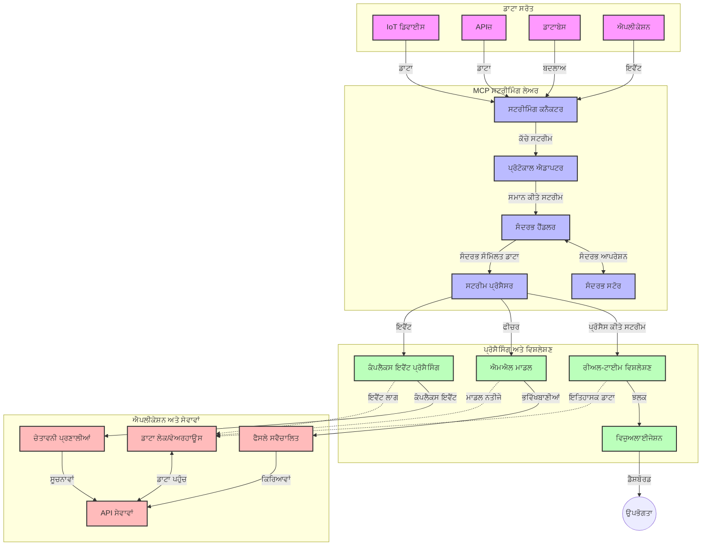

# ਮਾਡਲ ਕਾਂਟੈਕਸਟ ਪ੍ਰੋਟੋਕੋਲ ਫ਼ੋਰ ਰੀਅਲ-ਟਾਈਮ ਡੇਟਾ ਸਟ੍ਰੀਮਿੰਗ

## ਜਾਇਜ਼ਾ

ਅੱਜਕੇ ਡੇਟਾ-ਚਲਿਤ ਦੁਨੀਆ ਵਿੱਚ, ਜਿੱਥੇ ਕਾਰੋਬਾਰਾਂ ਅਤੇ ਐਪਲੀਕੇਸ਼ਨਾਂ ਨੂੰ ਸਮੇਂਸਿਰ ਫੈਸਲੇ ਕਰਨ ਲਈ ਤੁਰੰਤ ਜਾਣਕਾਰੀ ਦੀ ਲੋੜ ਹੁੰਦੀ ਹੈ, ਰੀਅਲ-ਟਾਈਮ ਡੇਟਾ ਸਟ੍ਰੀਮਿੰਗ ਲਾਜ਼ਮੀ ਹੋ ਗਈ ਹੈ। ਮਾਡਲ ਕਾਂਟੈਕਸਟ ਪ੍ਰੋਟੋਕੋਲ (MCP) ਇਹਨਾਂ ਰੀਅਲ-ਟਾਈਮ ਸਟ੍ਰੀਮਿੰਗ ਪ੍ਰਕਿਰਿਆਵਾਂ ਨੂੰ ਸਧਾਰਨ ਤੌਰ 'ਤੇ ਸੁਧਾਰਨ ਵਿੱਚ ਮਹੱਤਵਪੂਰਣ ਅਗਾਂਹ ਵਧਾਉਂਦਾ ਹੈ, ਡੇਟਾ ਪ੍ਰੋਸੈਸਿੰਗ ਦੀ ਕਾਰਗੁਜ਼ਾਰੀ ਨੂੰ ਬਿਹਤਰ ਬਣਾਉਂਦਾ ਹੈ, ਸੰਦਰਭੀਅਤਾ ਦੀ ਸਹੀਤਾ ਬਨਾਈ ਰੱਖਦਾ ਹੈ, ਅਤੇ ਕੁੱਲ ਸਿਸਟਮ ਪ੍ਰਦਰਸ਼ਨ ਵਿੱਚ ਸੁਧਾਰ ਕਰਦਾ ਹੈ।

ਇਹ ਮਾਡਿਊਲ ਵੇਖਦਾ ਹੈ ਕਿ ਕਿਵੇਂ MCP ਏਆਈ ਮਾਡਲਾਂ, ਸਟ੍ਰੀਮਿੰਗ ਪਲੇਟਫਾਰਮਾਂ ਅਤੇ ਐਪਲੀਕੇਸ਼ਨਾਂ ਵਿਚ ਸੰਦਰਭ ਪ੍ਰਬੰਧਨ ਲਈ ਇੱਕ ਮਿਆਰੀਕ੍ਰਿਤ ਪਹੁੰਚ ਮੁਹੱਈਆ ਕਰਵਾ ਕੇ ਰੀਅਲ-ਟਾਈਮ ਡੇਟਾ ਸਟ੍ਰੀਮਿੰਗ ਨੂੰ ਬਦਲਦਾ ਹੈ।

## ਰੀਅਲ-ਟਾਈਮ ਡੇਟਾ ਸਟ੍ਰੀਮਿੰਗ ਦਾ ਜਾਇਜ਼ਾ

ਰੀਅਲ-ਟਾਈਮ ਡੇਟਾ ਸਟ੍ਰੀਮਿੰਗ ਇੱਕ ਤਕਨੀਕੀ ਪ੍ਰਤੀਤੀਆਂ ਹੈ ਜੋ ਡੇਟਾ ਦੇ ਲਗਾਤਾਰ ਪ੍ਰਵਾਹ, ਪ੍ਰੋਸੈਸਿੰਗ ਅਤੇ ਵਿਸ਼ਲੇਸ਼ਣ ਨੂੰ ਯਕੀਨੀ ਬਣਾਉਂਦਾ ਹੈ ਜਿਵੇਂ ਕਿ ਇਹ ਪੈਦਾ ਹੁੰਦਾ ਹੈ, ਇਸ ਤਰ੍ਹਾਂ ਸਿਸਟਮ ਨਵੀਂ ਜਾਣਕਾਰੀ ’ਤੇ ਤੁਰੰਤ ਪ੍ਰਤਿਕਿਰਿਆ ਕਰ ਸਕਦੇ ਹਨ। ਪੁਰਾਣੇ ਬੈਚ ਪ੍ਰੋਸੈਸਿੰਗ ਦੇ ਉਲਟ, ਜੋ ਥੰਮ ਗਏ ਡੇਟਾ ਸੈੱਟਸ 'ਤੇ ਕੰਮ ਕਰਦਾ ਹੈ, ਸਟ੍ਰੀਮਿੰਗ ਡੇਟਾ ਨੂੰ ਹਿਲਦੇ-ਡੁੱਲਦੇ ਪ੍ਰਕਿਰਿਆ ਕਰਦਾ ਹੈ ਅਤੇ ਘੱਟ ਤੋਂ ਘੱਟ ਦੇਰੀ ਨਾਲ ਦ੍ਰਿਸ਼ਟੀ ਅਤੇ ਕਾਰਵਾਈਪੁਰਵਕ ਡਿਲੀਵਰੀ ਕਰਦਾ ਹੈ।

### ਰੀਅਲ-ਟਾਈਮ ਡੇਟਾ ਸਟ੍ਰੀਮਿੰਗ ਦੇ ਮੁੱਖ ਸਿਧਾਂਤ:

- **ਲਗਾਤਾਰ ਡੇਟਾ ਪ੍ਰਵਾਹ**: ਡੇਟਾ ਲਗਾਤਾਰ, ਕਦੇ ਖਤਮ ਨਾ ਹੋਣ ਵਾਲੇ ਘਟਨਾ ਜਾਂ ਰਿਕਾਰਡਸ ਦੇ ਸਤਰ ਵਜੋਂ ਪ੍ਰਕਿਰਿਆ ਕੀਤੀ ਜਾਂਦੀ ਹੈ।
- **ਘੱਟ ਦੇਰੀ ਵਾਲੀ ਪ੍ਰੋਸੈਸਿੰਗ**: ਸਿਸਟਮਾਂ ਨੂੰ ਡੇਟਾ ਪੈਦਾ ਕਰਨ ਅਤੇ ਪ੍ਰੋਸੈਸ ਕਰਨ ਵਿਚਲੇ ਸਮੇਂ ਨੂੰ ਘੱਟ ਕਰਨ ਲਈ ਡਿਜ਼ਾਈਨ ਕੀਤਾ ਜਾਂਦਾ ਹੈ।
- **ਸਕੇਲਬਿਲਿਟੀ**: ਸਟ੍ਰੀਮਿੰਗ ਸੰਰਚਨਾਵਾਂ ਨੂੰ ਬਦਲਦੇ ਡੇਟਾ ਵਾਲਿਊਮ ਅਤੇ ਤੇਜ਼ੀ ਨੂੰ ਸਮਭਾਲਣਾ ਚਾਹੀਦਾ ਹੈ।
- **ਫਾਲਟ ਟੋਲਰੈਂਸ**: ਸਿਸਟਮ ਬਿਨਾ ਰੁਕੇ ਡੇਟਾ ਪ੍ਰਵਾਹ ਨੂੰ ਯਕੀਨੀ ਬਣਾਉਣ ਲਈ ਫੇਲ ਹੋਣ ਤੋਂ ਸੁਰੱਖਿਅਤ ਹੋਣੇ ਚਾਹੀਦੇ ਹਨ।
- **ਸਟੇਟਫੁੱਲ ਪ੍ਰੋਸੈਸਿੰਗ**: ਘਟਨਾਵਾਂ ਵਿਚ ਸੰਦਰਭ ਲਗਾਤਾਰ ਬਣਾਈ ਰੱਖਣਾ ਮਤਲਬਦਾਰ ਵਿਸ਼ਲੇਸ਼ਣ ਲਈ ਜ਼ਰੂਰੀ ਹੈ।

### ਮਾਡਲ ਕਾਂਟੈਕਸਟ ਪ੍ਰੋਟੋਕੋਲ ਅਤੇ ਰੀਅਲ-ਟਾਈਮ ਸਟ੍ਰੀਮਿੰਗ

ਮਾਡਲ ਕਾਂਟੈਕਸਟ ਪ੍ਰੋਟੋਕੋਲ (MCP) ਰੀਅਲ-ਟਾਈਮ ਸਟ੍ਰੀਮਿੰਗ ਵਾਤਾਵਰਣਾਂ ਵਿੱਚ ਕਈ ਅਹੰਕਾਰਪੂਰਨ ਚੁਣੌਤੀਆਂ ਦਾ ਸਾਹਮਣਾ ਕਰਦਾ ਹੈ:

1. **ਸੰਦਰਭ ਸਤਤਤਾ**: MCP ਵਿਤਰਿਤ ਸਟ੍ਰੀਮਿੰਗ ਕੰਪੋਨੇਟਾਂ ਵਿਚ ਸੰਦਰਭ ਕਿਵੇਂ ਬਣਾਇਆ ਜਾਵੇ, ਇਸਦੀ ਮਿਆਰੀਕ੍ਰਿਤ ਉਸਾਰੀ ਕਰਦਾ ਹੈ, ਇਹ ਯਕੀਨੀ ਬਣਾਉਂਦਾ ਹੈ ਕਿ ਏਆਈ ਮਾਡਲਾਂ ਅਤੇ ਪ੍ਰੋਸੈਸਿੰਗ ਨੋਡਾਂ ਲਈ ਮਾਮੂਲੀ ਅਤੇ ਵਾਤਾਵਰਨ ਸੰਦਰਭ ਉਪਲੱਬਧ ਹੋਵੇ।

2. **ਕਾਰਗੁਜ਼ਾਰੀ ਸਟੇਟ ਮੈਨੇਜਮੈਂਟ**: ਸੰਦਰਭ ਪ੍ਰਸਾਰਣ ਲਈ ਸੰਗਠਿਤ ਮਕੈਨਿਜ਼ਮ ਮੁਹੱਈਆ ਕਰਵਾ ਕੇ MCP ਸਟ੍ਰੀਮਿੰਗ ਪਾਈਪਲਾਈਨਾਂ ਵਿੱਚ ਸਟੇਟ ਪ੍ਰਬੰਧਨ ਦਾ ਓਵਰਹੈੱਡ ਘਟਾਉਂਦਾ ਹੈ।

3. **ਇੰਟਰਓਪਰੇਬਿਲਿਟੀ**: MCP ਵੱਖ-ਵੱਖ ਸਟ੍ਰੀਮਿੰਗ ਤਕਨਾਲੋਜੀਆਂ ਅਤੇ ਏਆਈ ਮਾਡਲਾਂ ਵਿਚ ਰਹਿਣ ਵਾਲੇ ਸੰਦਰਭ ਸਾਂਝਾ ਕਰਨ ਲਈ ਇੱਕ ਸਾਰਥਕ ਭਾਸ਼ਾ ਬਣਾਉਂਦਾ ਹੈ, ਜੋ ਵਧੇਰੇ ਲਚਕੀਲੇ ਅਤੇ ਵਧਾਇਆ ਜਾ ਸਕਣ ਵਾਲੇ ਸੰਰਚਨਾਵਾਂ ਨੂੰ ਯੋਗ ਬਨਾਉਂਦਾ ਹੈ।

4. **ਸਟ੍ਰੀਮਿੰਗ-ਆਪਟੀਮਾਈਜ਼ਡ ਸੰਦਰਭ**: MCP ਇੰਪਲਿਮੇਂਟੇਸ਼ਨ ਇਹ ਤੈਅ ਕਰ ਸਕਦੇ ਹਨ ਕਿ ਕਿਸ ਸੰਦਰਭ ਤੱਤ ਨੂੰ ਰੀਅਲ-ਟਾਈਮ ਫੈਸਲੇ ਲਈ ਸਭ ਤੋਂ ਜ਼ਿਆਦਾ ਲੋੜ ਹੈ, ਪ੍ਰਦਰਸ਼ਨ ਅਤੇ ਸਹੁੰਧਤਾ ਦੋਹਾਂ ਲਈ ਬਿਹਤਰਮੰਦ ਬਣਾਉਂਦੇ ਹਨ।

5. **ਅਡਾਪਟਿਵ ਪ੍ਰੋਸੈਸਿੰਗ**: MCP ਰਾਹੀਂ ਸਹੀ ਸੰਦਰਭ ਪ੍ਰਬੰਧਨ ਨਾਲ, ਸਟ੍ਰੀਮਿੰਗ ਸਿਸਟਮਜ਼ ਡੇਟਾ ਵਿੱਚ ਬਦਲਦੇ ਹਾਲਾਤਾਂ ਅਤੇ ਢਾਂਚਿਆਂ ਦੇ ਅਧਾਰ 'ਤੇ ਪ੍ਰੋਸੈਸਿੰਗ ਨੂੰ ਗਤੀਸ਼ੀਲ ਤੌਰ ’ਤੇ ਅਨੁਕੂਲ ਕਰ ਸਕਦੇ ਹਨ।

ਆਧੁਨਿਕ ਐਪਲੀਕੇਸ਼ਨਾਂ ਵਿੱਚ, ਜਿਵੇਂ ਕਿ IoT ਸੈਂਸਰ ਨੈੱਟਵਰਕ ਤੋਂ ਲੈ ਕੇ ਵਿੱਤੀ ਵਪਾਰ ਪਲੇਟਫਾਰਮ ਤੱਕ, MCP ਨਾਲ ਸਟ੍ਰੀਮਿੰਗ ਤਕਨਾਲੋਜੀਆਂ ਨੂੰ ਜੋੜਨ ਨਾਲ ਉਸ ਸਮਰੱਥ ਤਰਕਸ਼ੀਲ, ਸੰਦਰਭ-ਜਾਣੂ ਪ੍ਰੋਸੈਸਿੰਗ ਸਧਾਰਤ ਹੁੰਦੀ ਹੈ ਜੋ ਜਟਿਲ ਤੇ ਵਿਕਾਸਸ਼ੀਲ ਹਾਲਤਾਂ ਨੂੰ ਰੀਅਲ-ਟਾਈਮ ਵਿੱਚ ਢੰਗ ਨਾਲ ਪ੍ਰਤਿਕ੍ਰਿਆ ਦੇ ਸਕਦਾ ਹੈ।

## ਸਿੱਖਣ ਦੇ ਲਕੜ੍ਹੇ

ਇਸ ਪਾਠ ਦੇ ਅੰਤ ਤੱਕ, ਤੁਸੀਂ ਸਮਰੱਥ ਹੋਵੋਗੇ:

- ਰੀਅਲ-ਟਾਈਮ ਡੇਟਾ ਸਟ੍ਰੀਮਿੰਗ ਅਤੇ ਇਸ ਦੀਆਂ ਚੁਣੌਤੀਆਂ ਨੂੰ ਸਮਝਣਾ
- ਕਿਵੇਂ ਮਾਡਲ ਕਾਂਟੈਕਸਟ ਪ੍ਰੋਟੋਕੋਲ (MCP) ਰੀਅਲ-ਟਾਈਮ ਡੇਟਾ ਸਟ੍ਰੀਮਿੰਗ ਨੂੰ ਬਿਹਤਰ ਕਰਦਾ ਹੈ ਇਸ ਨੂੰ ਵੇਰਵਾ ਦੇਣਾ
- ਲੋਕਪ੍ਰਿਯ ਫਰੇਮਵਰਕ ਜਿਵੇਂ ਕਿ Kafka ਅਤੇ Pulsar ਦੀ ਵਰਤੋਂ ਕਰਕੇ MCP-ਆਧਾਰਤ ਸਟ੍ਰੀਮਿੰਗ ਹੱਲ ਲਾਗੂ ਕਰਨਾ
- MCP ਨਾਲ ਫਾਲਟ-ਟੋਲਰੈਂਟ ਅਤੇ ਉੱਚ-ਕਾਰਗੁਜ਼ਾਰ ਸਟ੍ਰੀਮਿੰਗ ਸੰਰਚਨਾਵਾਂ ਦੀ ਡਿਜ਼ਾਇਨ ਅਤੇ ਤਿਆਰੀ
- MCP ਵੀਚਾਰਧਾਰਾਵਾਂ ਨੂੰ IoT, ਵਿੱਤੀ ਵਪਾਰ ਅਤੇ ਏਆਈ-ਚਲਿਤ ਵਿਸ਼ਲੇਸ਼ਣ ਉਪਯੋਗ ਮਾਮਲਿਆਂ ਵਿੱਚ ਲਾਗੂ ਕਰਨਾ
- MCP-ਆਧਾਰਤ ਸਟ੍ਰੀਮਿੰਗ ਤਕਨਾਲੋਜੀਆਂ ਵਿੱਚ ਉਭਰ ਰਹੇ ਰੁਝਾਨ ਅਤੇ ਭਵਿੱਖੀ ਨਵੀਨਤਾਵਾਂ ਦਾ ਮੁੱਲਾਂਕਣ ਕਰਨਾ

### ਪਰਿਭਾਸ਼ਾ ਅਤੇ ਮਹੱਤਤਾ

ਰੀਅਲ-ਟਾਈਮ ਡੇਟਾ ਸਟ੍ਰੀਮਿੰਗ ਵਿੱਚ ਘੱਟ ਦੇਰੀ ਨਾਲ ਲਗਾਤਾਰ ਡੇਟਾ ਦਾ ਉਤਪੱਤੀ, ਪ੍ਰੋਸੈਸਿੰਗ ਅਤੇ ਡਿਲੀਵਰੀ ਸ਼ਾਮਿਲ ਹੈ। ਬੈਚ ਪ੍ਰੋਸੈਸਿੰਗ ਦੇ ਵਿਰੁੱਧ, ਜਿਸ ਵਿੱਚ ਡੇਟਾ ਨੂੰ ਸਮੂਹਬੱਧ ਕਰਕੇ ਪ੍ਰਕਿਰਿਆ ਕਰਿਆ ਜਾਂਦਾ ਹੈ, ਸਟ੍ਰੀਮਿੰਗ ਡੇਟਾ ਨੂੰ ਜਿਵੇਂ ਜਿਵੇਂ ਆਉਂਦਾ ਹੈ ਤਿਵੇਂ ਤੁਰੰਤ ਪ੍ਰਕਿਰਿਆ ਕੀਤੀ ਜਾਂਦੀ ਹੈ, ਜਿਸ ਨਾਲ ਤੁਰੰਤ ਦ੍ਰਿਸ਼ਟੀ ਅਤੇ ਕੰਮ ਮੁਮਕਿਨ ਹੁੰਦੇ ਹਨ।

ਰੀਅਲ-ਟਾਈਮ ਡੇਟਾ ਸਟ੍ਰੀਮਿੰਗ ਦੀਆਂ ਮੁੱਖ ਖਾਸੀਅਤਾਂ ਹਨ:

- **ਘੱਟ ਦੇਰੀ**: ਮਿਲੀਸੈਕੰਡ ਤੋਂ ਸੈਕੰਡਾਂ ਦੇ ਅੰਦਰ ਡੇਟਾ ਪ੍ਰੋਸੈਸਿੰਗ ਅਤੇ ਵਿਸ਼ਲੇਸ਼ਣ
- **ਲਗਾਤਾਰ ਪ੍ਰਵਾਹ**: ਵੱਖ-ਵੱਖ ਸਰੋਤਾਂ ਤੋਂ ਬਿਨਾ ਰੁਕਾਵਟ ਡੇਟਾ ਸਟ੍ਰੀਮ
- **ਤੁਰੰਤ ਪ੍ਰੋਸੈਸਿੰਗ**: ਡੇਟਾ ਨੂੰ ਬੈਚਾਂ ਵਿਚ ਨਹੀਂ, ਆਉਣ ਦੇ ਨਾਲ ਨਾਲ ਵਿਸ਼ਲੇਸ਼ਿਤ ਕਰਨਾ
- **ਘਟਨਾ-ਚਲਿਤ ਸੰਰਚਨਾ**: ਜਿਵੇਂ ਹੀ ਘਟਨਾਵਾਂ ਹੁੰਦੀਆਂ ਹਨ, ਉਨ੍ਹਾਂ 'ਤੇ ਪ੍ਰਤਿਕਿਰਿਆ ਕਰਨਾ

### ਪਾਰੰਪਰਿਕ ਡੇਟਾ ਸਟ੍ਰੀਮਿੰਗ ਵਿੱਚ ਚੁਣੌਤੀਆਂ

ਪੁਰਾਣੇ ਡੇਟਾ ਸਟ੍ਰੀਮਿੰਗ ਤਰੀਕਿਆਂ ਨੂੰ ਕਈ ਸੀਮਾਵਾਂ ਦਾ ਸਾਹਮਣਾ ਹੈ:

1. **ਸੰਦਰਭ ਦੀ ਕਮੀ**: ਵੰਡੇ ਹੋਏ ਸਿਸਟਮਾਂ ਵਿੱਚ ਸੰਦਰਭ ਪ੍ਰਭਾਰ ਬਣਾਈ ਰੱਖਣ ਵਿੱਚ ਮੁਸ਼ਕਲ
2. **ਸਕੇਲਬਿਲਿਟੀ ਦੀਆਂ ਸਮੱਸਿਆਵਾਂ**: ਵੱਡੇ ਪੱਧਰ ਦੇ, ਤੇਜ਼ ਗਤੀ ਵਾਲੇ ਡੇਟਾ ਨੂੰ ਸੰਭਾਲਣ ਵਿੱਚ ਚੁਣੌਤੀ
3. **ਇੰਟਿਗ੍ਰੇਸ਼ਨ ਦੀ ਜਟਿਲਤਾ**: ਵੱਖ-ਵੱਖ ਸਿਸਟਮਾਂ ਵਿਚਕਾਰ ਇੰਟਰਓਪਰੇਬਿਲਿਟੀ ਦੀ ਸਮੱਸਿਆ
4. **ਦੇਰੀ ਪ੍ਰਬੰਧਨ**: ਥਰੂਪੁਟ ਅਤੇ ਪ੍ਰੋਸੈਸਿੰਗ ਸਮੇਂ ਵਿਚ ਬੈਲੈਂਸ ਬਣਾਉਣਾ
5. **ਡੇਟਾ ਸਥਿਰਤਾ**: ਸਟ੍ਰੀਮ ਵਿੱਚ ਡੇਟਾ ਦੀ ਸ਼ੁੱਧਤਾ ਅਤੇ ਪੂਰਨਤਾ ਨੂੰ ਯਕੀਨੀ ਬਣਾਉਣਾ

## ਮਾਡਲ ਕਾਂਟੈਕਸਟ ਪ੍ਰੋਟੋਕੋਲ (MCP) ਨੂੰ ਸਮਝਣਾ

### MCP ਕੀ ਹੈ?

ਮਾਡਲ ਕਾਂਟੈਕਸਟ ਪ੍ਰੋਟੋਕੋਲ (MCP) ਇੱਕ ਮਿਆਰੀਕ੍ਰਿਤ ਕਮਿਊਨੀਕੇਸ਼ਨ ਪ੍ਰੋਟੋਕੋਲ ਹੈ ਜੋ ਏਆਈ ਮਾਡਲਾਂ ਅਤੇ ਐਪਲੀਕੇਸ਼ਨਾਂ ਵਿਚਕਾਰ ਪ੍ਰਭਾਵਸ਼ਾਲੀ ਇੰਟਰੈਕਸ਼ਨ ਨੂੰ ਸੁगੰਧਿਤ ਬਣਾਉਂਦਾ ਹੈ। ਰੀਅਲ-ਟਾਈਮ ਡੇਟਾ ਸਟ੍ਰੀਮਿੰਗ ਸੰਦਰਭ ਵਿੱਚ, MCP ਇੱਕ ਐਸਾ ਫਰੇਮਵਰਕ ਦਿੰਦਾ ਹੈ ਜੋ:

- ਡੇਟਾ ਪਾਈਪਲਾਈਨ ਦੇ ਪੂਰੇ ਪ੍ਰਕਿਰਿਆਰਥ ਸੰਦਰਭ ਸੁਰੱਖਿਅਤ ਕਰਦਾ ਹੈ
- ਡੇਟਾ ਬਦਲਾਅ ਫਾਰਮੈਟਾਂ ਨੂੰ ਮਿਆਰਬੱਧ ਕਰਦਾ ਹੈ
- ਵੱਡੇ ਡੇਟਾਸੈੱਟਸ ਦੇ ਪ੍ਰਸਾਰਣ ਨੂੰ ਬਿਹਤਰ ਬਣਾਉਂਦਾ ਹੈ
- ਮਾਡਲ-ਟੂ-ਮਾਡਲ ਅਤੇ ਮਾਡਲ-ਟੂ-ਐਪਲੀਕੇਸ਼ਨ ਸੰਚਾਰ ਨੂੰ ਸੁਧਾਰਦਾ ਹੈ

### ਮੁੱਖ ਹਿੱਸੇ ਅਤੇ ਸੰਰਚਨਾ

ਰੀਅਲ-ਟਾਈਮ ਸਟ੍ਰੀਮਿੰਗ ਲਈ MCP ਸੰਰਚਨਾ ਵਿੱਚ ਕਈ ਜਰੂਰੀ ਹਿੱਸੇ ਸ਼ਾਮਿਲ ਹਨ:

1. **ਸੰਦਰਭ ਹੈਂਡਲਰਜ਼**: ਸਟ੍ਰੀਮਿੰਗ ਪਾਈਪਲਾਈਨ ਵਿਚ ਸੰਦਰਭੀ ਜਾਣਕਾਰੀ ਦਾ ਪ੍ਰਬੰਧ ਅਤੇ ਸਹੀਤਾ
2. **ਸਟ੍ਰੀਮ ਪ੍ਰੋਸੈਸਰ**: ਸੰਦਰਭ-ਜਾਣੂ ਤਕਨੀਕਾਂ ਨਾਲ ਆਉਣ ਵਾਲੀ ਸਟ੍ਰੀਮ ਨੂੰ ਪ੍ਰਕਿਰਿਆ ਕਰਨਾ
3. **ਪ੍ਰੋਟੋਕੋਲ ਐਡੈਪਟਰਜ਼**: ਵੱਖ-ਵੱਖ ਸਟ੍ਰੀਮਿੰਗ ਪ੍ਰੋਟੋਕੋਲਸ ਵਿਚ ਬਦਲਾਅ ਕਰਦੇ ਹੋਏ ਸੰਦਰਭ ਸੁਰੱਖਿਅਤ ਰੱਖਣਾ
4. **ਸੰਦਰਭ ਸਟੋਰ**: ਸੰਦਰਭ ਜਾਣਕਾਰੀ ਨੂੰ ਪ੍ਰਭਾਵਸ਼ਾਲੀ ਤਰੀਕੇ ਨਾਲ ਸਟੋਰ ਅਤੇ ਰੀਟਰਾਈਵ ਕਰਨਾ
5. **ਸਟ੍ਰੀਮਿੰਗ ਕਨੈਕਟਰਜ਼**: ਵੱਖ-ਵੱਖ ਸਟ੍ਰੀਮਿੰਗ ਪਲੇਟਫਾਰਮਾਂ ਨੂੰ ਜੁੜਨਾ (Kafka, Pulsar, Kinesis ਆਦਿ)



### MCP ਕਿਵੇਂ ਰੀਅਲ-ਟਾਈਮ ਡੇਟਾ ਸਾਂਭਾਉਂਦਾ ਹੈ

MCP ਪੁਰਾਣੀਆਂ ਸਟ੍ਰੀਮਿੰਗ ਚੁਣੌਤੀਆਂ ਦਾ ਹੱਲ ਕਰਦਾ ਹੈ:

- **ਸੰਦਰਭ ਸਹੀਤਾ**: ਪੂਰੀ ਪਾਈਪਲਾਈਨ ਵਿੱਚ ਡੇਟਾ ਪੁਆਇੰਟਾਂ ਦੇ ਰਿਸ਼ਤਿਆਂ ਨੂੰ ਬਰਕਰਾਰ ਰੱਖਣਾ
- **ਉਤਕ੍ਰਿਸ਼ਟ ਪ੍ਰਸਾਰਣ**: ਬੁੱਧੀਮਾਨ ਸੰਦਰਭ ਪ੍ਰਬੰਧਨ ਰਾਹੀਂ ਡੇਟਾ ਬਦਲਾਅ ਵਿਚ ਫਜੂਲ ਖ਼ਰਚਾ ਘਟਾਉਣਾ
- **ਮਿਆਰੀਕ੍ਰਿਤ ਇੰਟਰਫੇਸ**: ਸਟ੍ਰੀਮਿੰਗ ਕੰਪੋਨੇਟਾਂ ਲਈ ਇਕਸਾਰ APIs ਪ੍ਰਦਾਨ ਕਰਨਾ
- **ਘੱਟ ਦੇਰੀ**: ਪ੍ਰਭਾਵਸ਼ਾਲੀ ਸੰਦਰਭ ਹੈਂਡਲਿੰਗ ਨਾਲ ਪ੍ਰੋਸੈਸਿੰਗ ਓਵਰਹੈੱਡ ਘਟਾਉਣਾ
- **ਵਧੀਆ ਸਕੇਲਬਿਲਿਟੀ**: ਸੰਦਰਭ ਸੰਭਾਲਦੇ ਹੋਏ ਹੋਰਾਈਜ਼ਾਂਟਲ ਸਕੇਲਿੰਗ ਨੂੰ ਸਮਰਥਨ ਦੇਣਾ

## ਇੰਟਿਗ੍ਰੇਸ਼ਨ ਅਤੇ ਲਾਗੂ ਕਰਨ ਦੀ ਪ੍ਰਕਿਰਿਆ

ਰੀਅਲ-ਟਾਈਮ ਡੇਟਾ ਸਟ੍ਰੀਮਿੰਗ ਸਿਸਟਮ ਬਿਨਾ ਪ੍ਰਦਰਸ਼ਨ ਅਤੇ ਸੰਦਰਭੀਅਤਾ ਨੂੰ ਘਟਾਏ ਸਮਝਦਾਰ ਡਿਜ਼ਾਇਨ ਅਤੇ ਲਾਗੂ ਕਰਨ ਦੀ ਮੰਗ ਕਰਦੇ ਹਨ। ਮਾਡਲ ਕਾਂਟੈਕਸਟ ਪ੍ਰੋਟੋਕੋਲ ਏਆਈ ਮਾਡਲਾਂ ਅਤੇ ਸਟ੍ਰੀਮਿੰਗ ਤਕਨਾਲੋਜੀਆਂ ਨੂੰ ਜੋੜਨ ਲਈ ਇੱਕ ਮਿਆਰੀ ਪਹੁੰਚ ਪ੍ਰਦਾਨ ਕਰਦਾ ਹੈ, ਜਿਸ ਨਾਲ ਹੋਰ ਸੁਧਰੇ, ਸੰਦਰਭ-ਸੂਚਕ ਪ੍ਰੋਸੈਸਿੰਗ ਪਾਈਪਲਾਈਨਾਂ ਦਾ ਵਿਕਾਸ ਹੋਦਾ ਹੈ।

### ਸਟ੍ਰੀਮਿੰਗ ਸੰਰਚਨਾਵਾਂ ਵਿੱਚ MCP ਇੰਟਿਗ੍ਰੇਸ਼ਨ ਦਾ ਜਾਇਜ਼ਾ

ਰੀਅਲ-ਟਾਈਮ ਸਟ੍ਰੀਮਿੰਗ ਵਾਤਾਵਰਣਾਂ ਵਿੱਚ MCP ਲਾਗੂ ਕਰਦੇ ਸਮੇਂ ਕਈ ਮੁੱਖ ਗੱਲਾਂ ਦਾ ਧਿਆਨ ਰੱਖਣਾ ਪੈਂਦਾ ਹੈ:

1. **ਸੰਦਰਭ ਸੀਰੀਅਲਾਈਜੇਸ਼ਨ ਅਤੇ ਟ੍ਰਾਂਸਪੋਰਟ**: MCP ਸਟ੍ਰੀਮਿੰਗ ਡਾਟਾ ਪੈਕਟਾਂ ਵਿੱਚ ਸੰਦਰਭੀ ਜਾਣਕਾਰੀ ਨੂੰ ਕੋਡ ਕਰਨ ਲਈ ਪ੍ਰਭਾਵਸ਼ਾਲੀ ਮਕੈਨਿਜ਼ਮ ਮੁਹੱਈਆ ਕਰਦਾ ਹੈ, ਇਹ ਯਕੀਨੀ ਬਣਾਉਂਦਾ ਹੈ ਕਿ ਜ਼ਰੂਰੀ ਸੰਦਰਭ ਪ੍ਰੋਸੈਸਿੰਗ ਪਾਈਪਲਾਈਨ ਦੇ ਦੁਆਰਾਂ ਅੱਗੇ-ਪੀਛੇ ਨਾਲ ਸਫ਼ਰ ਕਰੇ। ਇਸ ਵਿੱਚ ਸਟ੍ਰੀਮਿੰਗ ਟ੍ਰਾਂਸਪੋਰਟ ਲਈ ਮਿਆਰੀਕ੍ਰਿਤ ਸੀਰੀਅਲਾਈਜ਼ੇਸ਼ਨ ਫਾਰਮੈਟ ਸ਼ਾਮਿਲ ਹਨ।

2. **ਸਟੇਟਫੁੱਲ ਸਟ੍ਰੀਮ ਪ੍ਰੋਸੈਸਿੰਗ**: MCP ਸੰਦਰਭ ਪ੍ਰਤੀਨਿਧਿਤਾ ਨੂੰ ਸਮਾਨ ਰੱਖ ਕੇ ਹੋਰ ਬੁੱਧੀਮਾਨ ਸਟੇਟਫੁੱਲ ਪ੍ਰੋਸੈਸਿੰਗ ਯੋਗ ਕਰਦਾ ਹੈ। ਇਹ ਖਾਸ ਕਰਕੇ ਵੰਡੇ ਹੋਏ ਸਟ੍ਰੀਮਿੰਗ ਸੰਰਚਨਾਵਾਂ ਵਿੱਚ ਕਿੰਮਤੀ ਹੈ ਜਿੱਥੇ ਸਟੇਟ ਪ੍ਰਬੰਧਨ ਮੁਸ਼ਕਲ ਹੁੰਦਾ ਹੈ।

3. **ਘਟਨਾ-ਟਾਈਮ ਵਿਰੁੱਧ ਪ੍ਰੋਸੈਸਿੰਗ-ਟਾਈਮ**: MCP ਸਟ੍ਰੀਮਿੰਗ ਸਿਸਟਮਾਂ ਨੂੰ ਇਹ ਚੁਣੌਤੀ ਦੂਰ ਕਰਨ ਵਿੱਚ ਮਦਦ ਕਰਦਾ ਹੈ ਕਿ ਘਟਨਾਵਾਂ ਕਦੋਂ ਵਾਪਰੀਆਂ ਅਤੇ ਕਦੋਂ ਉਹਨਾਂ ਨੂੰ ਪ੍ਰੋਸੈਸ ਕੀਤਾ ਜਾ ਰਿਹਾ ਹੈ। ਇਹ ਪ੍ਰੋਟੋਕੋਲ ਸਮੇਂ-ਸਬੰਧਿਤ ਸੰਦਰਭ ਰੱਖ ਸਕਦਾ ਹੈ ਜੋ ਘਟਨਾ ਸਮੇਂ ਦੀ ਸਮਝ ਨੂੰ ਸੁਰੱਖਿਅਤ ਕਰਦਾ ਹੈ।

4. **ਬੈਕਪ੍ਰੈਸ਼ਰ ਪ੍ਰਬੰਧਨ**: MCP ਸੰਪੂਰਨ ਸੰਦਰਭ ਪ੍ਰਬੰਧਨ ਕਰਕੇ ਸਟ੍ਰੀਮਿੰਗ ਸਿਸਟਮਾਂ ਵਿੱਚ ਬੈਕਪ੍ਰੈਸ਼ਰ ਨੂੰ ਸੰਭਾਲਣ ਵਿੱਚ ਮਦਦ ਕਰਦਾ ਹੈ, ਜਿਸ ਨਾਲ ਕੰਪੋਨੇਟ ਆਪਣੀ ਪ੍ਰੋਸੈਸਿੰਗ ਸਮਰੱਥਾ ਨੂੰ ਸੰਚਾਰ ਕਰਕੇ ਪ੍ਰਵਾਹ ਨੂੰ ਅਨੁਕੂਲਿਤ ਕਰ ਸਕਦੇ ਹਨ।

5. **ਸੰਦਰਭ ਵਿੰਡੋਇੰਗ ਅਤੇ ਐਗ੍ਰੀਗੇਸ਼ਨ**: MCP ਸਮਾਂਵਾਰ ਅਤੇ ਸਬੰਧਤ ਸੰਦਰਭ ਦੇ ਸੰਗਠਿਤ ਪ੍ਰਤੀਨਿਧੀਆਂ ਪ੍ਰਦਾਨ ਕਰਕੇ ਹੋਰ ਸੁਧਰੇ ਵਿੰਡੋਇੰਗ ਓਪਰੇਸ਼ਨਸ ਨੂੰ ਯੋਗ ਬਣਾਉਂਦਾ ਹੈ, ਜੋ ਘਟਨਾ ਸਟ੍ਰੀਮਾਂ ਵਿਚ ਹੋਰ ਅਰਥਪੂਰਨ ਐਗ੍ਰੀਗੇਸ਼ਨ ਲਈ ਸਹਾਇਕ ਹਨ।

6. **ਬਿਲਕੁਲ ਇੱਕ ਵਾਰੀ ਪ੍ਰੋਸੈਸਿੰਗ**: ਐਸੀਆਂ ਸਟ੍ਰੀਮਿੰਗ ਸਿਸਟਮਾਂ ਵਿੱਚ ਜਿੱਥੇ ਬਿਲਕੁਲ ਇੱਕ ਵਾਰੀ ਪ੍ਰੋਸੈਸਿੰਗ ਜ਼ਰੂਰੀ ਹੈ, MCP ਪ੍ਰੋਸੈਸਿੰਗ ਮੈਟਾਡੇਟਾ ਨੂੰ ਸ਼ਾਮਿਲ ਕਰ ਸਕਦਾ ਹੈ ਜੋ ਵਿਕੇਂਦਰੀਕ੍ਰਿਤ ਕੰਪੋਨੇਟਾਂ ਵਿਚ ਪ੍ਰੋਸੈਸਿੰਗ ਦੀ ਹਾਲਤ ਟਰੈਕ ਅਤੇ ਤਸਦੀਕ ਕਰਨ ਵਿੱਚ ਮਦਦ ਕਰਦਾ ਹੈ।

ਵੱਖ-ਵੱਖ ਸਟ੍ਰੀਮਿੰਗ ਤਕਨਾਲੋਜੀਆਂ ਵਿੱਚ MCP ਦੇ ਅਮਲ ਨਾਲ ਇੱਕਜੁਟ ਸੰਦਰਭ ਪ੍ਰਬੰਧਨ ਪਹੁੰਚ ਬਣਦੀ ਹੈ, ਨਿਜੀ ਇੰਟੀਗ੍ਰੇਸ਼ਨ ਕੋਡ ਦੀ ਲੋੜ ਨੂੰ ਘਟਾਂਦਾ ਹੈ ਅਤੇ ਡੇਟਾ ਪਾਈਪਲਾਈਨ ਵਿਚ ਡੇਟਾ ਦੇ ਨਾਲ ਨਾਲ ਗੰਭੀਰ ਸੰਦਰਭ ਰੱਖਣ ਦੀ ਸਮਰੱਥਾ ਵਧਾਉਂਦਾ ਹੈ।

### ਵੱਖ-ਵੱਖ ਡੇਟਾ ਸਟ੍ਰੀਮਿੰਗ ਫਰੇਮਵਰਕਾਂ ਵਿੱਚ MCP

ਇਹ ਉਦਾਹਰਨ ਵਰਤਮਾਨ MCP ਵਿਸ਼ੇਸ਼ਾਗਿਆਨ ਦਾ ਪਾਲਣ ਕਰਦੀਆਂ ਹਨ ਜੋ JSON-RPC-ਆਧਾਰਿਤ ਪ੍ਰੋਟੋਕੋਲ ਹੈ ਜਿਸ ਵਿਚ ਵੱਖ-ਵੱਖ ਟ੍ਰਾਂਸਪੋਰਟ ਮਕੈਨਿਜ਼ਮ ਹਨ। ਕੋਡ ਦਿਖਾਉਂਦਾ ਹੈ ਕਿ ਤੁਸੀਂ ਕਿਵੇਂ ਕਫ਼ਕਾ ਅਤੇ ਪਲਸਰ ਵਰਗੇ ਸਟ੍ਰੀਮਿੰਗ ਪਲੇਟਫਾਰਮਾਂ ਨਾਲ MCP ਪ੍ਰੋਟੋਕੋਲ ਨਾਲ ਪੂਰੀ ਸੰਗਤੀ ਦੇ ਨਾਲ ਨਿੱਜੀ ਟ੍ਰਾਂਸਪੋਰਟ ਲਾਗੂ ਕਰ ਸਕਦੇ ਹੋ।

ਇਹ ਉਦਾਹਰਨ ਦੱਸਦੀਆਂ ਹਨ ਕਿ ਕਿਵੇਂ ਸਟ੍ਰੀਮਿੰਗ ਪਲੇਟਫਾਰਮ MCP ਨਾਲ ਇੱਕਠੇ ਕੀਤੇ ਜਾ ਸਕਦੇ ਹਨ ਤਾਂ ਜੋ ਰੀਅਲ-ਟਾਈਮ ਡੇਟਾ ਪ੍ਰੋਸੈਸਿੰਗ ਹੋਵੇ ਅਤੇ ਉਹ ਸੰਦਰਭ ਜਾਗਰੂਕਤਾ ਬਣਾਈ ਰੱਖਣ ਜੋ MCP ਦਾ ਕੇਂਦਰ ਹੈ। ਇਹ ਪਹੁੰਚ ਇਹ ਯਕੀਨੀ ਬਣਾਉਂਦੀ ਹੈ ਕਿ ਕੋਡ ਸੈਂਪਲ ਜੂਨ 2025 ਤਕ MCP ਵਿਸ਼ੇਸ਼ਾਗਿਆਨ ਦੀ ਮੌਜੂਦਾ ਸਥਿਤੀ ਨੂੰ ਠੀਕ ਤਰ੍ਹਾਂ ਦਰਸਾਉਂਦੇ ਹਨ।

MCP ਪ੍ਰਸਿੱਧ ਸਟ੍ਰੀਮਿੰਗ ਫਰੇਮਵਰਕਾਂ ਨਾਲ ਜੋੜਿਆ ਜਾ ਸਕਦਾ ਹੈ ਜਿਸ ਵਿੱਚ ਸ਼ਾਮਿਲ ਹਨ:

#### ਐਪਾਚੀ ਕਫ਼ਕਾ ਇੰਟਿਗ੍ਰੇਸ਼ਨ

```python
import asyncio
import json
from typing import Dict, Any, Optional
from confluent_kafka import Consumer, Producer, KafkaError
from mcp.client import Client, ClientCapabilities
from mcp.core.message import JsonRpcMessage
from mcp.core.transports import Transport

# MCP ਨੂੰ Kafka ਨਾਲ ਜੋੜਨ ਲਈ ਕਸਟਮ ਟਰਾਂਸਪੋਰਟ ਕਲਾਸ
class KafkaMCPTransport(Transport):
    def __init__(self, bootstrap_servers: str, input_topic: str, output_topic: str):
        self.bootstrap_servers = bootstrap_servers
        self.input_topic = input_topic
        self.output_topic = output_topic
        self.producer = Producer({'bootstrap.servers': bootstrap_servers})
        self.consumer = Consumer({
            'bootstrap.servers': bootstrap_servers,
            'group.id': 'mcp-client-group',
            'auto.offset.reset': 'earliest'
        })
        self.message_queue = asyncio.Queue()
        self.running = False
        self.consumer_task = None
        
    async def connect(self):
        """Connect to Kafka and start consuming messages"""
        self.consumer.subscribe([self.input_topic])
        self.running = True
        self.consumer_task = asyncio.create_task(self._consume_messages())
        return self
        
    async def _consume_messages(self):
        """Background task to consume messages from Kafka and queue them for processing"""
        while self.running:
            try:
                msg = self.consumer.poll(1.0)
                if msg is None:
                    await asyncio.sleep(0.1)
                    continue
                
                if msg.error():
                    if msg.error().code() == KafkaError._PARTITION_EOF:
                        continue
                    print(f"Consumer error: {msg.error()}")
                    continue
                
                # ਸੁਨੇਹਾ ਮੁੱਲ ਨੂੰ JSON-RPC ਵਜੋਂ ਪਾਰਸ ਕਰੋ
                try:
                    message_str = msg.value().decode('utf-8')
                    message_data = json.loads(message_str)
                    mcp_message = JsonRpcMessage.from_dict(message_data)
                    await self.message_queue.put(mcp_message)
                except Exception as e:
                    print(f"Error parsing message: {e}")
            except Exception as e:
                print(f"Error in consumer loop: {e}")
                await asyncio.sleep(1)
    
    async def read(self) -> Optional[JsonRpcMessage]:
        """Read the next message from the queue"""
        try:
            message = await self.message_queue.get()
            return message
        except Exception as e:
            print(f"Error reading message: {e}")
            return None
    
    async def write(self, message: JsonRpcMessage) -> None:
        """Write a message to the Kafka output topic"""
        try:
            message_json = json.dumps(message.to_dict())
            self.producer.produce(
                self.output_topic,
                message_json.encode('utf-8'),
                callback=self._delivery_report
            )
            self.producer.poll(0)  # ਕਾਲਬੈਕਸ ਨੂੰ ਪ੍ਰੇਰਿਤ ਕਰੋ
        except Exception as e:
            print(f"Error writing message: {e}")
    
    def _delivery_report(self, err, msg):
        """Kafka producer delivery callback"""
        if err is not None:
            print(f'Message delivery failed: {err}')
        else:
            print(f'Message delivered to {msg.topic()} [{msg.partition()}]')
    
    async def close(self) -> None:
        """Close the transport"""
        self.running = False
        if self.consumer_task:
            self.consumer_task.cancel()
            try:
                await self.consumer_task
            except asyncio.CancelledError:
                pass
        self.consumer.close()
        self.producer.flush()

# Kafka MCP ਟਰਾਂਸਪੋਰਟ ਦੀ ਉਦਾਹਰਣ ਵਰਤੋਂ
async def kafka_mcp_example():
    # Kafka ਟਰਾਂਸਪੋਰਟ ਨਾਲ MCP ਕਲਾਇੰਟ ਬਣਾਓ
    client = Client(
        {"name": "kafka-mcp-client", "version": "1.0.0"},
        ClientCapabilities({})
    )
    
    # Kafka ਟਰਾਂਸਪੋਰਟ ਬਣਾਓ ਅਤੇ ਕਨੈਕਟ ਕਰੋ
    transport = KafkaMCPTransport(
        bootstrap_servers="localhost:9092",
        input_topic="mcp-responses",
        output_topic="mcp-requests"
    )
    
    await client.connect(transport)
    
    try:
        # MCP ਸੈਸ਼ਨ ਸ਼ੁਰੂ ਕਰੋ
        await client.initialize()
        
        # MCP ਰਾਹੀਂ ਟੂਲ ਚਲਾਉਣ ਦੀ ਉਦਾਹਰਣ
        response = await client.execute_tool(
            "process_data",
            {
                "data": "sample data",
                "metadata": {
                    "source": "sensor-1",
                    "timestamp": "2025-06-12T10:30:00Z"
                }
            }
        )
        
        print(f"Tool execution response: {response}")
        
        # ਸਾਫ-ਸੁਥਰਾ ਬੰਦ ਕਰਨਾ
        await client.shutdown()
    finally:
        await transport.close()

# ਉਦਾਹਰਣ ਚਲਾਓ
if __name__ == "__main__":
    asyncio.run(kafka_mcp_example())
```

#### ਐਪਾਚੀ ਪਲਸਰ ਅਮਲ

```python
import asyncio
import json
import pulsar
from typing import Dict, Any, Optional
from mcp.core.message import JsonRpcMessage
from mcp.core.transports import Transport
from mcp.server import Server, ServerOptions
from mcp.server.tools import Tool, ToolExecutionContext, ToolMetadata

# ਇਕ ਕਸਟਮ MCP ਟਰਾਂਸਪੋਰਟ ਬਣਾਓ ਜੋ ਪਲਸਰ ਦੀ ਵਰਤੋਂ ਕਰਦਾ ਹੈ
class PulsarMCPTransport(Transport):
    def __init__(self, service_url: str, request_topic: str, response_topic: str):
        self.service_url = service_url
        self.request_topic = request_topic
        self.response_topic = response_topic
        self.client = pulsar.Client(service_url)
        self.producer = self.client.create_producer(response_topic)
        self.consumer = self.client.subscribe(
            request_topic,
            "mcp-server-subscription",
            consumer_type=pulsar.ConsumerType.Shared
        )
        self.message_queue = asyncio.Queue()
        self.running = False
        self.consumer_task = None
    
    async def connect(self):
        """Connect to Pulsar and start consuming messages"""
        self.running = True
        self.consumer_task = asyncio.create_task(self._consume_messages())
        return self
    
    async def _consume_messages(self):
        """Background task to consume messages from Pulsar and queue them for processing"""
        while self.running:
            try:
                # ਸਮਾਂ ਸੀਮਾ ਦੇ ਨਾਲ ਬਿਨਾਂ ਰੋਕ-ਟੋਕ ਦੇ ਪ੍ਰਾਪਤੀ
                msg = self.consumer.receive(timeout_millis=500)
                
                # ਸੁਨੇਹਾ ਪ੍ਰਕਿਰਿਆ ਕਰੋ
                try:
                    message_str = msg.data().decode('utf-8')
                    message_data = json.loads(message_str)
                    mcp_message = JsonRpcMessage.from_dict(message_data)
                    await self.message_queue.put(mcp_message)
                    
                    # ਸੁਨੇਹੇ ਦੀ ਪੁਸ਼ਟੀ ਕਰੋ
                    self.consumer.acknowledge(msg)
                except Exception as e:
                    print(f"Error processing message: {e}")
                    # ਜੇ ਕੋਈ ਗਲਤੀ ਹੋਵੇ ਤਾਂ ਨਕਾਰਾਤਮਕ ਪੁਸ਼ਟੀ ਕਰੋ
                    self.consumer.negative_acknowledge(msg)
            except Exception as e:
                # ਸਮਾਂ ਸੀਮਾ ਜਾਂ ਹੋਰ ਅਪਵਾਦਾਂ ਨੂੰ ਸੰਭਾਲੋ
                await asyncio.sleep(0.1)
    
    async def read(self) -> Optional[JsonRpcMessage]:
        """Read the next message from the queue"""
        try:
            message = await self.message_queue.get()
            return message
        except Exception as e:
            print(f"Error reading message: {e}")
            return None
    
    async def write(self, message: JsonRpcMessage) -> None:
        """Write a message to the Pulsar output topic"""
        try:
            message_json = json.dumps(message.to_dict())
            self.producer.send(message_json.encode('utf-8'))
        except Exception as e:
            print(f"Error writing message: {e}")
    
    async def close(self) -> None:
        """Close the transport"""
        self.running = False
        if self.consumer_task:
            self.consumer_task.cancel()
            try:
                await self.consumer_task
            except asyncio.CancelledError:
                pass
        self.consumer.close()
        self.producer.close()
        self.client.close()

# ਇੱਕ ਨਮੂਨਾ MCP ਟੂਲ ਪਰਿਭਾਸ਼ਿਤ ਕਰੋ ਜੋ ਸਟਰੀਮਿੰਗ ਡੇਟਾ ਨੂੰ ਪ੍ਰਕਿਰਿਆ ਕਰਦਾ ਹੈ
@Tool(
    name="process_streaming_data",
    description="Process streaming data with context preservation",
    metadata=ToolMetadata(
        required_capabilities=["streaming"]
    )
)
async def process_streaming_data(
    ctx: ToolExecutionContext,
    data: str,
    source: str,
    priority: str = "medium"
) -> Dict[str, Any]:
    """
    Process streaming data while preserving context
    
    Args:
        ctx: Tool execution context
        data: The data to process
        source: The source of the data
        priority: Priority level (low, medium, high)
        
    Returns:
        Dict containing processed results and context information
    """
    # MCP ਸੰਦਰਭ ਦੀ ਵਰਤੋਂ ਕਰਦੀਆਂ ਉਦਾਹਰਣ ਪ੍ਰਕਿਰਿਆਵਾਂ
    print(f"Processing data from {source} with priority {priority}")
    
    # MCP ਤੋਂ ਗੱਲਬਾਤ ਸੰਦਰਭ ਦਾ ਪਹੁੰਚ ਪ੍ਰਾਪਤ ਕਰੋ
    conversation_id = ctx.conversation_id if hasattr(ctx, 'conversation_id') else "unknown"
    
    # ਵਧੇਰੇ ਪ੍ਰਸੰਗ ਨਾਲ ਨਤੀਜੇ ਵਾਪਸ ਕਰੋ
    return {
        "processed_data": f"Processed: {data}",
        "context": {
            "conversation_id": conversation_id,
            "source": source,
            "priority": priority,
            "processing_timestamp": ctx.get_current_time_iso()
        }
    }

# ਪਲਸਰ ਟਰਾਂਸਪੋਰਟ ਦੀ ਵਰਤੋਂ ਨਾਲ MCP ਸਰਵਰ ਦੀ ਉਦਾਹਰਣ ਲਾਗੂ ਕਰਨੀ
async def run_mcp_server_with_pulsar():
    # MCP ਸਰਵਰ ਬਣਾਓ
    server = Server(
        {"name": "pulsar-mcp-server", "version": "1.0.0"},
        ServerOptions(
            capabilities={"streaming": True}
        )
    )
    
    # ਸਾਡੇ ਟੂਲ ਨੂੰ ਰਜਿਸਟਰ ਕਰੋ
    server.register_tool(process_streaming_data)
    
    # ਪਲਸਰ ਟਰਾਂਸਪੋਰਟ ਬਣਾਓ ਅਤੇ ਜੁੜੋ
    transport = PulsarMCPTransport(
        service_url="pulsar://localhost:6650",
        request_topic="mcp-requests",
        response_topic="mcp-responses"
    )
    
    try:
        # ਪਲਸਰ ਟਰਾਂਸਪੋਰਟ ਨਾਲ ਸਰਵਰ ਨੂੰ ਸ਼ੁਰੂ ਕਰੋ
        await server.run(transport)
    finally:
        await transport.close()

# ਸਰਵਰ ਚਲਾਓ
if __name__ == "__main__":
    asyncio.run(run_mcp_server_with_pulsar())
```

### ਤਾਇਨਾਤੀ ਲਈ ਸਭ ਤੋਂ ਵਧੀਆ ਅਭਿਆਸ

ਜਦ MCP ਨੂੰ ਰੀਅਲ-ਟਾਈਮ ਸਟ੍ਰੀਮਿੰਗ ਲਈ ਲਾਗੂ ਕੀਤਾ ਜਾਵੇ:

1. **ਫਾਲਟ ਟੋਲਰੈਂਸ ਲਈ ਡਿਜ਼ਾਇਨ ਕਰੋ**:
   - ਯਥਾਰਥ ਤਰਜ਼ ਤੇ ਗਲਤੀਆਂ ਹਲ ਕਰੋ
   - ਅਸਫਲ ਸੰਦਸ਼ਾਂ ਲਈ ਡੈਡ-ਲੈਟਰ ਕਿਊਜ਼ ਵਰਤੋਂ
   - ਆਈਡੈਂਪੋਟੈਂਟ ਪ੍ਰੋਸੈਸਰ ਬਣਾਓ

2. **ਕਾਰਗੁਜ਼ਾਰੀ ਲਈ ਸੁਧਾਰ ਕਰੋ**:
   - ਉਚਿਤ ਬਫਰ ਸਾਈਜ਼ ਸੈੱਟ ਕਰੋ
   - ਜਿੱਥੇ ਯੋਗ ਹੋ ਉੱਠਾਉਂਦੇ ਸਮੂਹ ਪਰਕਿਰਿਆ ਕਰੋ
   - ਬੈਕਪ੍ਰੈਸ਼ਰ ਮਕੈਨਿਜ਼ਮ ਲਾਗੂ ਕਰੋ

3. **ਨਿਗਰਾਨੀ ਅਤੇ ਅਵਲੋਕਨ ਕਰੋ**:
   - ਸਟ੍ਰੀਮ ਪ੍ਰੋਸੈਸਿੰਗ ਮੈਟਰਿਕਸ ਨੂੰ ਟਰੈਕ ਕਰੋ
   - ਸੰਦਰਭ ਪ੍ਰਸਾਰਣ ਦੀ ਨਿਗਰਾਨੀ ਕਰੋ
   - ਵਿਸੰਗਤੀਆਂ ਲਈ ਸੁਚੇਤਨਾਵਾਂ ਸਥਾਪਿਤ ਕਰੋ

4. **ਆਪਣੀਆਂ ਸਟ੍ਰੀਮਾਂ ਸੁਰੱਖਿਅਤ ਕਰੋ**:
   - ਸੰਵੇਦਨਸ਼ੀਲ ਡੇਟਾ ਲਈ ਇੰਕ੍ਰਿਪਸ਼ਨ ਲਾਗੂ ਕਰੋ
   - ਪ੍ਰਮਾਣਿਕਤਾ ਅਤੇ ਅਧਿਕਾਰਨ ਦੀ ਵਰਤੋਂ ਕਰੋ
   - ਉਚਿਤ ਪਹੁੰਚ ਨਿਯੰਤਰਣ ਲਗਾਓ

### IoT ਅਤੇ ਐਜ ਕੰਪਿਊਟਿੰਗ ਵਿੱਚ MCP

MCP IoT ਸਟ੍ਰੀਮਿੰਗ ਨੂੰ ਸੁਧਾਰਦਾ ਹੈ:

- ਪ੍ਰੋਸੈਸਿੰਗ ਪਾਈਪਲਾਈਨ ਵਿੱਚ ਡਿਵਾਈਸ ਸੰਦਰਭ ਨੂੰ ਸੁਰੱਖਿਅਤ ਰੱਖਦਾ ਹੈ
- ਕਾਰਗੁਜ਼ਾਰ ਐਜ-ਟੂ-ਕਲਾਉਡ ਡੇਟਾ ਸਟ੍ਰੀਮਿੰਗ ਯੋਗ ਬਣਾਉਂਦਾ ਹੈ
- IoT ਡੇਟਾ ਸਟ੍ਰੀਮਾਂ 'ਤੇ ਰੀਅਲ-ਟਾਈਮ ਵਿਸ਼ਲੇਸ਼ਣ ਨੂੰ ਸਮਰਥਨ ਦੇਂਦਾ ਹੈ
- ਸੰਦਰਭ ਨਾਲ ਡਿਵਾਈਸ-ਟੂ-ਡਿਵਾਈਸ ਸੰਚਾਰ ਲਈ ਸਹੂਲਤ ਪ੍ਰਦਾਨ ਕਰਦਾ ਹੈ

ਉਦਾਹਰਣ: ਸਮਾਰਟ ਸਿਟੀ ਸੈਂਸਰ ਨੈੱਟਵਰਕ
```
Sensors → Edge Gateways → MCP Stream Processors → Real-time Analytics → Automated Responses
```

### ਵਿੱਤੀ ਲੈਣ-ਦੇਣ ਅਤੇ ਹਾਈ-ਫ੍ਰਿਕਵੈਂਸੀ ਵਪਾਰ ਵਿੱਚ ਭੂਮਿਕਾ

ਵਿੱਤੀ ਡੇਟਾ ਸਟ੍ਰੀਮਿੰਗ ਲਈ MCP ਵੱਡਾ ਲਾਭ ਦਿੰਦਾ ਹੈ:

- ਵਪਾਰਕ ਫੈਸਲੇ ਲਈ ਬਹੁਤ ਘੱਟ ਦੇਰੀ ਵਾਲੀ ਪ੍ਰੋਸੈਸਿੰਗ
- ਲੈਣ-ਦੇਣ ਸੰਦਰਭ ਨੂੰ ਪੂਰੀ ਪ੍ਰਕਿਰਿਆ ਦੌਰਾਨ ਸਥਿਰ ਰੱਖਣਾ
- ਸੰਦਰਭੀਅਤਾ ਨਾਲ ਜਟਿਲ ਘਟਨਾ ਪ੍ਰੋਸੈਸਿੰਗ ਦਾ ਸਹਿਯੋਗ
- ਵਿਕੇਂਦ੍ਰਿਤ ਵਪਾਰ ਪ੍ਰਣਾਲੀਆਂ ਵਿੱਚ ਡੇਟਾ ਅਖੰਡਤਾ ਯਕੀਨੀ ਬਣਾਉਣਾ

### ਏਆਈ ਚਲਿਤ ਡੇਟਾ ਵਿਸ਼ਲੇਸ਼ਣ ਨੂੰ ਬਿਹਤਰ ਬਣਾਉਣਾ

MCP ਸਟ੍ਰੀਮਿੰਗ ਵਿਸ਼ਲੇਸ਼ਣ ਲਈ ਨਵੀਆਂ ਸੰਭਾਵਨਾਵਾਂ ਪੈਦਾ ਕਰਦਾ ਹੈ:

- ਰੀਅਲ-ਟਾਈਮ ਮਾਡਲ ਟ੍ਰੇਨਿੰਗ ਅਤੇ ਨਤੀਜੇ ਕੱਢਣਾ
- ਸਟ੍ਰੀਮਿੰਗ ਡੇਟਾ ਤੋਂ ਲਗਾਤਾਰ ਸਿੱਖਣਾ
- ਸੰਦਰਭ-ਜਾਣੂ ਫੀਚਰ ਨਿਕਾਸ
- ਸੰਦਰਭ ਸੁਰੱਖਿਅਤ ਮਲਟੀ-ਮਾਡਲ ਨਤੀਜਾ ਪਾਈਪਲਾਈਨ

## ਭਵਿੱਖ ਦੇ ਰੁਝਾਨ ਅਤੇ ਨਵੀਨਤਾਵਾਂ

### ਰੀਅਲ-ਟਾਈਮ ਵਾਤਾਵਰਣਾਂ ਵਿੱਚ MCP ਦਾ ਵਿਕਾਸ

ਅਸੀਂ ਉਮੀਦ ਕਰਦੇ ਹਾਂ ਕਿ MCP ਇਨ੍ਹਾਂ ਚੀਜ਼ਾਂ ਨੂੰ ਸੁਰਾਹੇਗਾ:

- **ਕੁਆਂਟਮ ਕੰਪਿਊਟਿੰਗ ਇੰਟਿਗ੍ਰੇਸ਼ਨ**: ਕੁਆਂਟਮ ਆਧਾਰਿਤ ਸਟ੍ਰੀਮਿੰਗ ਸਿਸਟਮਾਂ ਲਈ ਤਿਆਰੀ
- **ਐਜ-ਨੇਟਿਵ ਪ੍ਰੋਸੈਸਿੰਗ**: ਹੋਰ ਸੰਦਰਭ-ਜਾਣੂ ਪ੍ਰੋਸੈਸਿੰਗ ਐਜ ਡਿਵਾਈਸਾਂ ਵੱਲ
- **ਸਵੈਚਲਿਤ ਸਟ੍ਰੀਮ ਮੈਨੇਜਮੈਂਟ**: ਖੁਦ-ਸੁਧਾਰ ਵਾਲੀਆਂ ਸਟ੍ਰੀਮ ਪਾਈਪਲਾਈਨਾਂ
- **ਫੈਡਰਟਿਡ ਸਟ੍ਰੀਮਿੰਗ**: ਨਿੱਜਤਾ ਨੂੰ ਸੁਰੱਖਿਅਤ ਰੱਖਦੇ ਹੋਏ ਵਿਕੇਂਦ੍ਰਿਤ ਪ੍ਰੋਸੈਸਿੰਗ

### ਤਕਨਾਲੋਜੀ ਵਿੱਚ ਸੰਭਾਵਿਤ ਤਰੱਕੀਆਂ

ਉਭਰਦੀਆਂ ਤਕਨਾਲੋਜੀਆਂ ਜੋ MCP ਸਟ੍ਰੀਮਿੰਗ ਦਾ ਭਵਿੱਖ ਨਿਰਧਾਰਤ ਕਰਨਗੀਆਂ:

1. **ਏਆਈ ਲਈ ਆਪਟੀਮਾਈਜ਼ਡ ਸਟ੍ਰੀਮਿੰਗ ਪ੍ਰੋਟੋਕੋਲ**: ਕੇਵਲ ਏਆਈ ਵਰਕਲੋਡਸ ਲਈ ਬਣਾਏ ਵਿਸ਼ੇਸ਼ ਪਰੋਟੋਕੋਲ
2. **ਨਿਊਰੋਮਾਰਫਿਕ ਕੰਪਿਊਟਿੰਗ ਇੰਟਿਗ੍ਰੇਸ਼ਨ**: ਸਟ੍ਰੀਮ ਪ੍ਰੋਸੈਸਿੰਗ ਲਈ ਮਗਜ਼ ਪ੍ਰੇਰਿਤ ਕੰਪਿਊਟਿੰਗ
3. **ਸਰਵਰਲੇਸ ਸਟ੍ਰੀਮਿੰਗ**: ਇੰਫ੍ਰਾਸ਼ਟਰੱਕਚਰ ਬਗੈਰ ਘਟਨਾ-ਚਲਿਤ, ਸਕੇਲਬਲ ਸਟ੍ਰੀਮਿੰਗ
4. **ਵਿਕੇਂਦ੍ਰਿਤ ਸੰਦਰਭ ਸਟੋਰ**: ਵਿਸ਼ਵ ਪੱਧਰੀ ਅਤੇ ਬਿਲਕੁਲ ਅਸਧਾਰਣ ਸੰਦਰਭ ਪ੍ਰਬੰਧਨ

## ਹੱਥੋਂ-ਹੱਥ ਅਭਿਆਸ

### ਅਭਿਆਸ 1: ਬੁਨਿਆਦੀ MCP ਸਟ੍ਰੀਮਿੰਗ ਪਾਈਪਲਾਈਨ ਸੈੱਟ ਕਰਨਾ

ਇਸ ਅਭਿਆਸ ਵਿੱਚ, ਤੁਸੀਂ ਸਿੱਖੋਗੇ ਕਿ:

- ਬੁਨਿਆਦੀ MCP ਸਟ੍ਰੀਮਿੰਗ ਵਾਤਾਵਰਣ ਕਿਵੇਂ ਸੰਰਚਿਤ ਕਰਨਾ ਹੈ
- ਸਟ੍ਰੀਮ ਪ੍ਰੋਸੈਸਿੰਗ ਲਈ ਸੰਦਰਭ ਹੈਂਡਲਰਜ਼ ਲਾਗੂ ਕਰਨਾ
- ਸੰਦਰਭ ਸੁਰੱਖਿਅਤ ਕਰਨ ਦੀ ਜਾਂਚ ਅਤੇ ਪ੍ਰਮਾਣੀਕਰਨ ਕਰਨਾ

### ਅਭਿਆਸ 2: ਰੀਅਲ-ਟਾਈਮ ਵਿਸ਼ਲੇਸ਼ਣ ਡੈਸ਼ਬੋਰਡ ਤਿਆਰ ਕਰਨਾ

ਇੱਕ ਮੁਕੰਮਲ ਐਪਲੀਕੇਸ਼ਨ ਬਣਾਓ ਜੋ:

- MCP ਵਰਤਕੇ ਸਟ੍ਰੀਮਿੰਗ ਡੇਟਾ ਲੈਂਦਾ ਹੈ
- ਸੰਦਰਭ ਬਨਾਈ ਰੱਖਦੇ ਹੋਏ ਸਟ੍ਰੀਮ ਨੂੰ ਪ੍ਰਕਿਰਿਆ ਕਰਦਾ ਹੈ
- ਨਤੀਜੇ ਰੀਅਲ-ਟਾਈਮ ਵਿੱਚ ਵਿਜੁਅਲਾਈਜ਼ ਕਰਦਾ ਹੈ

### ਅਭਿਆਸ 3: MCP ਨਾਲ ਜਟਿਲ ਘਟਨਾ ਪ੍ਰੋਸੈਸਿੰਗ ਲਾਗੂ ਕਰਨਾ

ਉੱਚ ਪੱਧਰੀ ਅਭਿਆਸ ਜੋ ਸਮੇਤਦਾ ਹੈ:

- ਸਟ੍ਰੀਮਾਂ ਵਿੱਚ ਪੈਟਰਨ ਪਛਾਣ
- ਕਈ ਸਟ੍ਰੀਮਾਂ ਵਿੱਚ ਸੰਦਰਭ ਸਮੰਤਲਨ
- ਸਜੋਏ ਹੋਏ ਸੰਦਰਭ ਨਾਲ ਜਟਿਲ ਘਟਨਾ ਬਣਾਉਣਾ

## ਵਾਧੂ ਸਾਧਨ

- [Model Context Protocol Specification](https://modelcontextprotocol.io) - ਅਧਿਕਾਰਤ MCP ਵਿਸ਼ੇਸ਼ਾਗਿਆਨ ਅਤੇ ਦਸਤਾਵੇਜ਼
- [Apache Kafka Documentation](https://kafka.apache.org/documentation/) - ਸਟ੍ਰੀਮ ਪ੍ਰੋਸੈਸਿੰਗ ਲਈ ਕਫ਼ਕਾ ਸਿੱਖੋ
- [Apache Pulsar](https://pulsar.apache.org/) - ਸੰਯੁਕਤ ਮੈਸੇਜਿੰਗ ਅਤੇ ਸਟ੍ਰੀਮਿੰਗ ਪਲੇਟਫਾਰਮ
- [Streaming Systems: The What, Where, When, and How of Large-Scale Data Processing](https://www.oreilly.com/library/view/streaming-systems/9781491983867/) - ਸਟ੍ਰੀਮਿੰਗ ਸੰਰਚਨਾਵਾਂ 'ਤੇ ਵਿਸ਼ਤਾਰਪੂਰਕ ਪੁਸਤਕ
- [Microsoft Azure Event Hubs](https://learn.microsoft.com/azure/event-hubs/event-hubs-about) - ਪ੍ਰਬੰਧਿਤ ਇਵੈਂਟ ਸਟ੍ਰੀਮਿੰਗ ਸੇਵਾ
- [MLflow Documentation](https://mlflow.org/docs/latest/index.html) - ਐੱਮਐਲ ਮਾਡਲ ਟ੍ਰੈਕਿੰਗ ਅਤੇ ਤਾਇਨਾਤੀ ਲਈ
- [Real-Time Analytics with Apache Storm](https://storm.apache.org/releases/current/index.html) - ਰੀਅਲ-ਟਾਈਮ ਗਣਨਾਂ ਲਈ ਪ੍ਰੋਸੈਸਿੰਗ ਫਰੇਮਵਰਕ
- [Flink ML](https://nightlies.apache.org/flink/flink-ml-docs-master/) - ਐਪਾਚੀ ਫਲਿੰਕ ਲਈ ਮਸ਼ੀਨ ਲਰਨਿੰਗ ਲਾਇਬ੍ਰੇਰੀ
- [LangChain Documentation](https://python.langchain.com/docs/get_started/introduction) - LLMs ਨਾਲ ਐਪਲੀਕੇਸ਼ਨ ਬਣਾਉਣ ਲਈ

## ਸਿੱਖਣ ਦੇ ਨਤੀਜੇ

ਇਸ ਮਾਡਿਊਲ ਨੂੰ ਪੂਰਾ ਕਰਕੇ, ਤੁਸੀਂ ਸਮਰੱਥ ਹੋਵੋਗੇ:

- ਰੀਅਲ-ਟਾਈਮ ਡੇਟਾ ਸਟ੍ਰੀਮਿੰਗ ਅਤੇ ਇਸ ਦੀਆਂ ਚੁਣੌਤੀਆਂ ਨੂੰ ਸਮਝਣਾ
- ਮਾਡਲ ਕਾਂਟੈਕਸਟ ਪ੍ਰੋਟੋਕੋਲ (MCP) ਕਿਵੇਂ ਰੀਅਲ-ਟਾਈਮ ਸਟ੍ਰੀਮਿੰਗ ਨੂੰ ਬੇਹਤਰ ਬਣਾਉਂਦਾ ਹੈ ਬਿਆਨ ਕਰਨਾ
- ਲੋਕਪ੍ਰਿਯ ਫਰੇਮਵਰਕ ਜਿਵੇਂ ਕਿ Kafka ਅਤੇ Pulsar ਨਾਲ MCP-ਆਧਾਰਤ ਸਟ੍ਰੀਮਿੰਗ ਹੱਲ ਲਾਗੂ ਕਰਨਾ
- MCP ਨਾਲ ਫਾਲਟ-ਟੋਲਰੈਂਟ ਅਤੇ ਉੱਚ-ਕਾਰਗੁਜ਼ਾਰ ਸਟ੍ਰੀਮਿੰਗ ਸੰਰਚਨਾਵਾਂ ਦੀ ਡਿਜ਼ਾਇਨ ਅਤੇ ਤਾਇਨਾਤੀ ਕਰਨਾ
- MCP ਸੰਕਲਪਾਂ ਨੂੰ IoT, ਵਿੱਤੀ ਵਪਾਰ ਅਤੇ ਏਆਈ-ਚਲਿਤ ਵਿਸ਼ਲੇਸ਼ਣ ਉਪਯੋਗਾਂ ਵਿੱਚ ਲਾਗੂ ਕਰਨਾ
- MCP-ਆਧਾਰਤ ਸਟ੍ਰੀਮਿੰਗ ਤਕਨਾਲੋਜੀਆਂ ਵਿੱਚ ਉਭਰ ਰਹੇ ਰੁਝਾਨਾਂ ਅਤੇ ਭਵਿੱਖੀ ਇਨੋਵੇਸ਼ਨਾਂ ਦਾ ਮੁੱਲਾਂਕਣ ਕਰਨਾ

## ਅਗਲਾ ਕੀ ਹੈ

- [5.11 ਰੀਅਲਟਾਈਮ ਖੋਜ](../mcp-realtimesearch/README.md)

---

<!-- CO-OP TRANSLATOR DISCLAIMER START -->
**ਅਸਵੀਕਾਰੋਪਣ**:
ਇਸ ਦਸਤਾਵੇਜ਼ ਦਾ ਅਨੁਵਾਦ ਏਆਈ ਅਨੁਵਾਦ ਸੇਵਾ [Co-op Translator](https://github.com/Azure/co-op-translator) ਦੀ ਵਰਤੋਂ ਕਰਕੇ ਕੀਤਾ ਗਿਆ ਹੈ। ਜਦੋਂ ਕਿ ਅਸੀਂ ਸਹੀਤਾਵਾਂ ਲਈ ਯਤਨਸ਼ੀਲ ਹਾਂ, ਕਿਰਪਾ ਕਰਕੇ ਧਿਆਨ ਰੱਖੋ ਕਿ ਸਵੈਚਾਲਿਤ ਅਨੁਵਾਦਾਂ ਵਿੱਚ ਗਲਤੀਆਂ ਜਾਂ ਅਸਮੱਤਿਆਵਾਂ ਹੋ ਸਕਦੀਆਂ ਹਨ। ਮੂਲ ਦਸਤਾਵੇਜ਼ ਆਪਣੀ ਮੂਲ ਭਾਸ਼ਾ ਵਿੱਚ ਅਧਿਕਾਰਕ ਸਰੋਤ ਮੰਨਿਆ ਜਾਣਾ ਚਾਹੀਦਾ ਹੈ। ਜਰੂਰੀ ਜਾਣਕਾਰੀ ਲਈ, ਪੇਸ਼ੇਵਰ ਮਨੁੱਖੀ ਅਨੁਵਾਦ ਦੀ ਸਿਫ਼ਾਰਸ਼ ਕੀਤੀ ਜਾਂਦੀ ਹੈ। ਅਸੀਂ ਇਸ ਅਨੁਵਾਦ ਦੇ ਉਪਯੋਗ ਤੋਂ ਪੈਦਾ ਹੋਣ ਵਾਲੀਆਂ ਕਿਸੇ ਵੀ ਗਲਤਫਹਿਮੀਆਂ ਜਾਂ ਗਲਤ ਵਿਆਖਿਆਵਾਂ ਲਈ ਜਵਾਬਦੇਹ ਨਹੀਂ ਹਾਂ।
<!-- CO-OP TRANSLATOR DISCLAIMER END -->