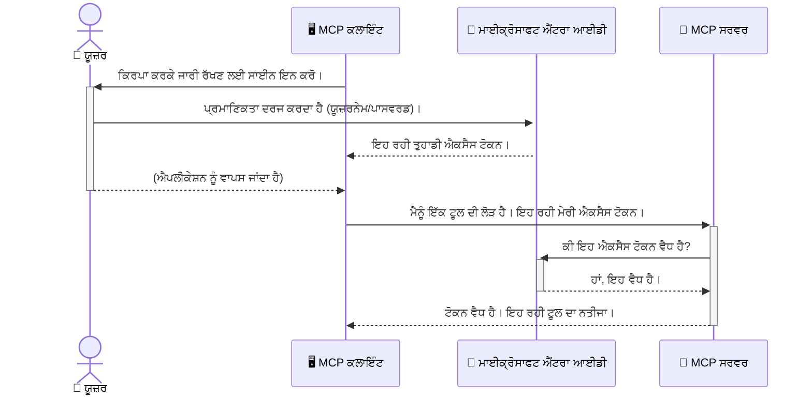

# ਏਆਈ ਵਰਕਫਲੋਜ਼ ਸੁਰੱਖਿਅਤ ਕਰਨਾ: ਮਾਡਲ ਕอนਟੈਕਸਟ ਪ੍ਰੋਟੋਕੋਲ ਸਰਵਰਾਂ ਲਈ ਇੰਟਰਾ ID ਪ੍ਰਮਾਣਿਕਤਾ

## ਪਰੀਚਯ
ਤੁਹਾਡੇ ਮਾਡਲ ਕਾਂਟੈਕਸਟ ਪ੍ਰੋਟੋਕੋਲ (MCP) ਸਰਵਰ ਨੂੰ ਸੁਰੱਖਿਅਤ ਕਰਨਾ ਤੁਹਾਡੇ ਘਰ ਦੇ ਮੁੱਖ ਦਰਵਾਜੇ ਨੂੰ ਤਾਲਾ ਲਗਾਉਣ ਦੇ ਬਰਾਬਰ ਮਹੱਤਵਪੂਰਨ ਹੈ। ਤੁਹਾਡੇ MCP ਸਰਵਰ ਨੂੰ ਖੁੱਲ੍ਹਾ ਛੱਡਣਾ ਤੁਹਾਡੇ ਟੂਲਾਂ ਅਤੇ ਡੇਟਾ ਨੂੰ ਬਿਨਾਂ ਅਧਿਕਾਰ ਵਾਲੇ ਪਹੁੰਚ ਤੋਂ ਖ਼ਤਰੇ ਵਿੱਚ ਪਾ ਸਕਦਾ ਹੈ, ਜਿਸ ਨਾਲ ਸੁਰੱਖਿਆ ਦਾ ਭੰਗ ਹੋ ਸਕਦਾ ਹੈ। ਮਾਈਕ੍ਰੋਸਾਫਟ ਇੰਟਰਾ ID ਇੱਕ ਮਜ਼ਬੂਤ ਕਲਾਊਡ ਆਧਾਰਿਤ ਪਹਚਾਣ ਅਤੇ ਪਹੁੰਚ ਪ੍ਰਬੰਧਨ ਸਮਾਧਾਨ ਪ੍ਰਦਾਨ ਕਰਦਾ ਹੈ, ਜੋ ਇਹ ਸੁਨਿਸ਼ਚਿਤ ਕਰਦਾ ਹੈ ਕਿ ਸਿਰਫ ਅਧਿਕਾਰਪ੍ਰਾਪਤ ਉਪਭੋਗਤਾ ਅਤੇ ਐਪਲੀ케ਸ਼ਨ ਹੀ ਤੁਹਾਡੇ MCP ਸਰਵਰ ਨਾਲ ਵਾਤਾਵਰਣ ਕਰ ਸਕਦੇ ਹਨ। ਇਸ ਹਿੱਸੇ ਵਿੱਚ, ਤੁਸੀਂ ਇੰਟਰਾ ID ਪ੍ਰਮਾਣਿਕਤਾ ਦੀ ਵਰਤੋਂ ਕਰਕੇ ਆਪਣੇ ਏਆਈ ਵਰਕਫਲੋਜ਼ ਨੂੰ ਕਿਵੇਂ ਸੁਰੱਖਿਅਤ ਕਰਨਾ ਹੈ, ਇਹ ਸਿੱਖੋਗੇ।

## ਸਿੱਖਣ ਦੇ ਲਕੜੀ
ਇਸ ਹਿੱਸੇ ਦੇ ਅੰਤ ਤੱਕ, ਤੁਸੀਂ ਯੋਗ ਹੋਵੋਗੇ:

- MCP ਸਰਵਰਾਂ ਦੀ ਸੁਰੱਖਿਆ ਮਹੱਤਵ ਨੂੰ ਸਮਝਣਾ।
- ਮਾਈਕ੍ਰੋਸਾਫਟ ਇੰਟਰਾ ID ਅਤੇ OAuth 2.0 ਪ੍ਰਮਾਣਿਕਤਾ ਦੀ ਬੁਨਿਆਦ ਸਮਝਾਉਣਾ।
- ਜਨਤਕ ਅਤੇ ਗੁਪਤ ਖਪਤਕਾਰਾਂ ਵਿੱਚ ਫਰਕ ਪਹਚਾਣਣਾ।
- ਇੰਟਰਾ ID ਪ੍ਰਮਾਣਿਕਤਾ ਨੂੰ ਸਥਾਨਕ (ਜਨਤਕ ਖਪਤਕਾਰ) ਅਤੇ ਰਿਮੋਟ (ਗੁਪਤ ਖਪਤਕਾਰ) MCP ਸਰਵਰ ਸਥਿਤੀਆਂ ਵਿੱਚ ਲਾਗੂ ਕਰਨਾ।
- ਏਆਈ ਵਰਕਫਲੋਜ਼ ਵਿਕਾਸ ਵਿੱਚ ਸਰਵੋਤਮ ਸੁਰੱਖਿਆ ਅਭਿਆਸ ਲਾਗੂ ਕਰਨਾ।

## ਸੁਰੱਖਿਆ ਅਤੇ MCP

ਜਿਵੇਂ ਤੁਸੀਂ ਆਪਣੇ ਘਰ ਦੇ ਮੁੱਖ ਦਰਵਾਜੇ ਨੂੰ ਖੁੱਲ੍ਹਾ ਨਹੀਂ ਛੱਡਦੇ, ਉਸੇ ਤਰ੍ਹਾਂ ਆਪਣੇ MCP ਸਰਵਰ ਨੂੰ ਵੀ ਕਿਸੇ ਨੂੰ ਖੁੱਲ੍ਹਾ ਨਹੀਂ ਛੱਡਣਾ ਚਾਹੀਦਾ। ਆਪਣੇ ਏਆਈ ਵਰਕਫਲੋਜ਼ ਨੂੰ ਸੁਰੱਖਿਅਤ ਕਰਨਾ ਮਜ਼ਬੂਤ, ਭਰੋਸੇਯੋਗ ਅਤੇ ਸੁਰੱਖਿਅਤ ਐਪਲੀਕੇਸ਼ਨਾਂ ਬਣਾਉਣ ਲਈ ਜ਼ਰੂਰੀ ਹੈ। ਇਹ ਅਧਿਆਇ ਤੁਹਾਨੂੰ ਮਾਈਕ੍ਰੋਸਾਫਟ ਇੰਟਰਾ ID ਦੀ ਵਰਤੋਂ ਕਰਕੇ ਆਪਣੇ MCP ਸਰਵਰਾਂ ਨੂੰ ਸੁਰੱਖਿਅਤ ਕਰਨ ਨਾਲ ਜਾਣੂ ਕਰਵਾਏਗਾ, ਹੇਠਾਂ ਇਸ ਗੱਲ ਨੂੰ ਪੱਕਾ ਕਰਦਾ ਕਿ ਸਿਰਫ ਅਧਿਕਾਰਪ੍ਰਾਪਤ ਉਪਭੋਗਤਾ ਅਤੇ ਐਪਲੀਕੇਸ਼ਨ ਹੀ ਤੁਹਾਡੇ ਟੂਲਾਂ ਅਤੇ ਡੇਟਾ ਨਾਲ ਵਾਤਾਵਰਣ ਕਰ ਸਕਦੇ ਹਨ।

## MCP ਸਰਵਰਾਂ ਲਈ ਸੁਰੱਖਿਆ ਕਿਉਂ ਜਰੂਰੀ ਹੈ

ਕਲਪਨਾ ਕਰੋ ਕਿ ਤੁਹਾਡੇ MCP ਸਰਵਰ ਕੋਲ ਇੱਕ ਟੂਲ ਹੈ ਜੋ ਈਮੇਲ ਭੇਜ ਸਕਦਾ ਹੈ ਜਾਂ ਗਾਹਕ ਡੇਟਾਬੇਸ ਤੱਕ ਪਹੁੰਚ ਕਰ ਸਕਦਾ ਹੈ। ਜੇ ਸਰਵਰ ਸੁਰੱਖਿਅਤ ਨਹੀਂ ਹੈ, ਤਾਂ ਕੋਈ ਵੀ ਉਹ ਟੂਲ ਵਰਤ ਸਕਦਾ ਹੈ, ਜਿਸ ਨਾਲ ਬਿਨਾਂ ਅਧਿਕਾਰ ਡੇਟਾ ਪਹੁੰਚ, ਸਪੈਮ ਜਾਂ ਹੋਰ ਮਾੜੇ ਕੰਮ ਹੋ ਸਕਦੇ ਹਨ।

ਪ੍ਰਮਾਣਿਕਤਾ ਲਾਗੂ ਕਰਨ ਨਾਲ, ਤੁਸੀਂ ਯਕੀਨੀ ਬਣਾਉਂਦੇ ਹੋ ਕਿ ਹਰ ਰਿਕਵੇਸਟ ਦੀ ਪੁਸ਼ਟੀ ਕੀਤੀ ਜਾਂਦੀ ਹੈ, ਜੋ ਉਪਭੋਗਤਾ ਜਾਂ ਐਪਲੀਕੇਸ਼ਨ ਦੀ ਪਛਾਣ ਦੀ ਪੁਸ਼ਟੀ ਕਰਦਾ ਹੈ ਜੋ ਰਿਕਵੇਸਟ ਕਰ ਰਿਹਾ ਹੈ। ਇਹ ਤੁਹਾਡੇ ਏਆਈ ਵਰਕਫਲੋਜ਼ ਨੂੰ ਸੁਰੱਖਿਅਤ ਕਰਨ ਵਿੱਚ ਪਹਿਲਾ ਅਤੇ ਸਭ ਤੋਂ ਅਹੰਕਾਰਪੂਰਨ ਕਦਮ ਹੈ।

## ਮਾਈਕ੍ਰੋਸਾਫਟ ਇੰਟਰਾ ID ਦਾ ਪਰੀਚਯ

[**ਮਾਈਕ੍ਰੋਸਾਫਟ ਇੰਟਰਾ ID**](https://adoption.microsoft.com/microsoft-security/entra/) ਇੱਕ ਕਲਾਊਡ ਆਧਾਰਿਤ ਪਹਚਾਣ ਅਤੇ ਪਹੁੰਚ ਪ੍ਰਬੰਧਨ ਸੇਵਾ ਹੈ। ਇਸ ਨੂੰ ਆਪਣੇ ਐਪਲੀਕੇਸ਼ਨਾਂ ਲਈ ਇੱਕ ਵਿਸ਼ਵ ਭਰ ਦਾ ਸੁਰੱਖਿਆ ਗਾਰਡ ਸਮਝੋ। ਇਹ ਉਪਭੋਗਤਾ ਦੀ ਪਹਚਾਣ ਦੀ ਜਾਂਚ (ਪ੍ਰਮਾਣਿਕਤਾ) ਅਤੇ ਉਹਨਾਂ ਨੂੰ ਕੀ ਕਰਨ ਦੀ ਆਗਿਆ ਹੈ (ਅਧਿਕਾਰ ਦਿੱਤੇ ਜਾਣ) ਦੀ ਭਾਰੀ ਪ੍ਰਕਿਰਿਆ ਨੂੰ ਸੰਭਾਲਦਾ ਹੈ।

ਇੰਟਰਾ ID ਦੀ ਵਰਤੋਂ ਕਰਕੇ, ਤੁਸੀਂ:

- ਉਪਭੋਗਤਿਆਂ ਲਈ ਸੁਰੱਖਿਅਤ ਸਾਈਨ-ਇਨ ਸਥਾਪਿਤ ਕਰ ਸਕਦੇ ਹੋ।
- ਏਪੀਆਈਜ਼ ਅਤੇ ਸੇਵਾਵਾਂ ਦੀ ਰੱਖਿਆ ਕਰ ਸਕਦੇ ਹੋ।
- ਕੇਂਦਰੀ ਸਥਾਨ ਤੋਂ ਪਹੁੰਚ ਨੀਤੀਆਂ ਦਾ ਪ੍ਰਬੰਧਨ ਕਰ ਸਕਦੇ ਹੋ।

MCP ਸਰਵਰਾਂ ਲਈ, ਇੰਟਰਾ ID ਇੱਕ ਮਜ਼ਬੂਤ ਅਤੇ ਵਿਸ਼ਵਸਨੀਯ ਸਮਾਧਾਨ ਪ੍ਰਦਾਨ ਕਰਦਾ ਹੈ ਜੋ ਇਹ ਪ੍ਰਬੰਧਿਤ ਕਰਦਾ ਹੈ ਕਿ ਕੌਣ ਤੁਹਾਡੇ ਸਰਵਰ ਦੀਆਂ ਯੋਗਤਾਵਾਂ ਤੱਕ ਪਹੁੰਚ ਕਰ ਸਕਦਾ ਹੈ।

---

## ਜਾਦੂ ਨੂੰ ਸਮਝਣਾ: ਇੰਟਰਾ ID ਪ੍ਰਮਾਣਿਕਤਾ ਕਿਵੇਂ ਕੰਮ ਕਰਦੀ ਹੈ

ਇੰਟਰਾ ID ਪ੍ਰਮਾਣਿਕਤਾ ਸੰਭਾਲਣ ਲਈ **OAuth 2.0** ਵਰਗੇ ਖੁੱਲ੍ਹੇ ਮਿਆਰ ਵਰਤਦਾ ਹੈ। ਹਾਲਾਂਕਿ ਵਿਸਥਾਰ ਜਟਿਲ ਹੋ ਸਕਦੇ ਹਨ, ਮੂਲ ਧਾਰਨਾ ਸਾਦਾ ਹੈ ਅਤੇ ਇੱਕ ਉਦਾਹਰਨ ਨਾਲ ਸਮਝੀ ਜਾ ਸਕਦੀ ਹੈ।

### OAuth 2.0 ਦਾ ਮਾਠਾ ਪਰੀਚਯ: ਵੈਲੇਟ ਕੁੰਜੀ

OAuth 2.0 ਨੂੰ ਆਪਣੇ ਕਾਰ ਦੀ ਵੈਲੇਟ ਸੇਵਾ ਵਾਂਗ ਸੋਚੋ। ਜਦੋਂ ਤੁਸੀਂ ਰੈਸਟੋਰੈਂਟ ਉੱਤੇ ਪਹੁੰਚਦੇ ਹੋ, ਤਾਂ ਤੁਸੀਂ ਵੈਲੇਟ ਨੂੰ ਆਪਣੀ ਮਾਸਟਰ ਕੁੰਜੀ ਨਹੀਂ ਦਿੰਦੇ। ਇਸ ਦੀ ਥਾਂ, ਤੁਸੀਂ ਇੱਕ **ਵੈਲੇਟ ਕੁੰਜੀ** ਦਿੰਦੇ ਹੋ ਜਿਸ ਵਿੱਚ ਸੀਮਿਤ ਅਧਿਕਾਰ ਹੁੰਦੇ ਹਨ — ਇਹ ਕਾਰ ਚਲਾ ਸਕਦੀ ਹੈ ਅਤੇ ਦਰਵਾਜੇ ਨੂੰ ਤਾਲਾ ਲਗਾ ਸਕਦੀ ਹੈ, ਪਰ ਟਰੰਕ ਜਾਂ ਗਲੋਵ ਕਮਪਾਰਟਮੈਂਟ ਨਹੀਂ ਖੋਲ੍ਹ ਸਕਦੀ।

ਇਸ ਉਦਾਹਰਨ ਵਿੱਚ:

- **ਤੁਸੀਂ** **ਉਪਭੋਗਤਾ** ਹੋ।
- **ਤੁਹਾਡੀ ਕਾਰ** **MCP ਸਰਵਰ** ਹੈ ਜੋ ਕੀਮਤੀ ਟੂਲਾਂ ਅਤੇ ਡੇਟਾ ਨਾਲ ਭਰਪੂਰ ਹੈ।
- **ਵੈਲੇਟ** **ਮਾਈਕ੍ਰੋਸਾਫਟ ਇੰਟਰਾ ID** ਹੈ।
- **ਪਾਰਕਿੰਗ ਅਟੈਂਡੈਂਟ** **MCP ਕਲਾਇੰਟ** ਹੈ (ਜੋ ਐਪਲੀਕੇਸ਼ਨ ਸਰਵਰ ਤੱਕ ਪਹੁੰਚ ਬਣਾਉਣਾ ਚਾਹੁੰਦਾ ਹੈ)।
- **ਵੈਲੇਟ ਕੁੰਜੀ** **ਪਹੁੰਚ ਟੋਕਨ** ਹੈ।

ਪਹੁੰਚ ਟੋਕਨ ਇੱਕ ਸੁਰੱਖਿਅਤ ਲੇਖਾ ਸੂਤਰ (string) ਹੁੰਦਾ ਹੈ ਜੋ MCP ਕਲਾਇੰਟ ਨੂੰ ਇੰਟਰਾ ID ਤੋਂ ਸਾਈਨ ਇਨ ਕਰਨ ਦੇ ਬਾਅਦ ਮਿਲਦਾ ਹੈ। ਕਲਾਇੰਟ ਫਿਰ ਹਰ ਬੇਨਤੀ ਨਾਲ ਇਹ ਟੋਕਨ MCP ਸਰਵਰ ਨੂੰ ਪੇਸ਼ ਕਰਦਾ ਹੈ। ਸਰਵਰ ਇਸ ਟੋਕਨ ਦੀ ਜਾਂਚ ਕਰਦਾ ਹੈ ਤਾਂ ਜੋ ਇਹ ਪੁਸ਼ਟੀ ਕਰ ਸਕੇ ਕਿ ਬੇਨਤੀ ਕਾਨੂੰਨੀ ਹੈ ਅਤੇ ਕਲਾਇੰਟ ਕੋਲ ਜ਼ਰੂਰੀ ਅਧਿਕਾਰ ਹਨ, ਉਹ ਵੀ ਬਿਨਾਂ ਤੁਹਾਡੇ ਅਸਲੀ ਲਾਗਇਨ ਵੇਰਵੇ (ਜਿਵੇਂ ਪਾਸਵਰਡ) ਸੰਭਾਲਣ ਦੀ ਲੋੜ ਦੇ।

### ਪ੍ਰਮਾਣਿਕਤਾ ਪ੍ਰਵਾਹ

ਹਾਲਾਤ ਵਿੱਚ ਇਹ ਪ੍ਰਕਿਰਿਆ ਕੰਮ ਕਰਦੀ ਹੈ:




### ਮਾਈਕ੍ਰੋਸਾਫਟ ਪ੍ਰਮਾਣਿਕਤਾ ਲਾਇਬ੍ਰੇਰੀ (MSAL) ਦਾ ਪਰੀਚਯ

ਕੋਡ ਵਿੱਚ ਡੁਬਕੀ ਲਗਾਉਣ ਤੋਂ ਪਹਿਲਾਂ, ਉਦਾਹਰਨਾਂ ਵਿੱਚ ਨਜ਼ਰ ਆਉਣ ਵਾਲੀ ਇੱਕ ਮੁੱਖ ਘਟਕਾ ਨੂੰ ਜਾਣਣਾ ਮਹੱਤਵਪੂਰਨ ਹੈ: **ਮਾਈਕ੍ਰੋਸਾਫਟ ਪ੍ਰਮਾਣਿਕਤਾ ਲਾਇਬ੍ਰੇਰੀ (MSAL)**।

MSAL ਇੱਕ ਮਾਇਕ੍ਰੋਸਾਫਟ ਵੱਲੋਂ ਵਿਕਸਤ ਕੀਤੀ ਗਈ ਲਾਇਬ੍ਰੇਰੀ ਹੈ ਜੋ ਵਿਕਾਸਕਾਰਾਂ ਲਈ ਪ੍ਰਮਾਣਿਕਤਾ ਸੰਭਾਲਣਾ ਕਾਫੀ ਆਸਾਨ ਬਣਾਉਂਦੀ ਹੈ। ਤੁਸੀਂ ਆਪਣੀ ਅਪਲੀਕੇਸ਼ਨ ਵਿੱਚ ਸੁਰੱਖਿਆ ਟੋਕਨ, ਸਾਈਨ-ਇਨ ਪ੍ਰਕਿਰਿਆ ਅਤੇ ਸੈਸ਼ਨ ਰੀਫਰੇਸ਼ ਕਰਨ ਲਈ ਸਾਰੇ ਬਹੁਤ ਜਟਿਲ ਕੋਡ ਨਹੀਂ ਲਿਖਦੇ, MSAL ਇਹ ਸਾਰਾ ਭਾਰ ਸੰਭਾਲਦਾ ਹੈ।

MSAL ਵਰਤਣਾ ਬਹੁਤ ਸਿਫਾਰਸ਼ੀ ਹੈ ਕਿਉਂਕਿ:

- **ਇਹ ਸੁਰੱਖਿਅਤ ਹੈ:** ਇਹ ਉਦਯੋਗ ਮਿਆਰੀ ਪ੍ਰੋਟੋਕੋਲ ਅਤੇ ਸੁਰੱਖਿਆ ਸਰਵੋਤਮ ਰਵਾਇਤਾਂ ਨੂੰ ਅਮਲ ਵਿੱਚ ਲਿਆਉਂਦਾ ਹੈ, ਜੋ ਤੁਹਾਡੇ ਕੋਡ ਵਿੱਚ ਖਾਮੀਆਂ ਦੇ ਜੋਖਮ ਨੂੰ ਘਟਾਉਂਦਾ ਹੈ।
- **ਵਿਕਾਸ ਨੂੰ ਸਾਦਾ ਬਣਾਉਂਦਾ ਹੈ:** ਇਹ OAuth 2.0 ਅਤੇ OpenID Connect ਪ੍ਰੋਟੋਕੋਲ ਦੀਆਂ ਜਟਿਲਤਾਵਾਂ ਨੂੰ ਛੁਪਾ ਕੇ ਤੁਹਾਡੇ ਐਪਲੀਕੇਸ਼ਨ ਵਿੱਚ ਕੁਝ ਹੀ ਕੋਡ ਲਾਈਨਾਂ ਨਾਲ ਮਜ਼ਬੂਤ ਪ੍ਰਮਾਣਿਕਤਾ ਜੋੜਨ ਦੀ ਆਗਿਆ ਦਿੰਦਾ ਹੈ।
- **ਇਹ ਸੰਭਾਲਿਆ ਜਾਂਦਾ ਹੈ:** ਮਾਈਕ੍ਰੋਸਾਫਟ MSAL ਨੂੰ ਨਵੀਆਂ ਸੁਰੱਖਿਆ ਚੁਣੌਤੀਆਂ ਅਤੇ ਪਲੇਟਫਾਰਮ ਬਦਲਾਵਾਂ ਦੇ ਮੁਤਾਬਕ ਲਗਾਤਾਰ ਅਪਡੇਟ ਕਰਦਾ ਰਹਿੰਦਾ ਹੈ।

MSAL ਕਈ ਭਾਸ਼ਾਵਾਂ ਅਤੇ ਐਪਲੀਕੇਸ਼ਨ ਫਰੇਮਵਰਕਾਂ, ਜਿਵੇਂ ਕਿ .NET, ਜਾਵਾਸਕ੍ਰਿਪਟ/ਟਾਈਪਸਕ੍ਰਿਪਟ, ਪਾਇਥਨ, ਜਾਵਾ, ਗੋ, ਅਤੇ ਮੋਬਾਈਲ ਪਲੇਟਫਾਰਮਾਂ (iOS ਅਤੇ ਐਂਡਰਾਇਡ) ਦਾ ਸਹਿਯੋਗ ਕਰਦਾ ਹੈ। ਇਸ ਦਾ ਮਤਲਬ ਇਹ ਹੈ ਕਿ ਤੁਸੀਂ ਆਪਣੀ ਸਾਰੀ ਟੈਕਨਾਲੋਜੀ ਸਟੈਕ ਵਿੱਚ ਇੱਕੋ ਜਿਹਾ ਪ੍ਰਮਾਣਿਕਤਾ ਰੂਪ ਰੇਖਾ ਵਰਤ ਸਕਦੇ ਹੋ।

MSAL ਬਾਰੇ ਹੋਰ ਜਾਨਕਾਰੀ ਲਈ, ਅਧਿਕਾਰਿਕ [MSAL ਓਵਰਵਿਊ ਡੌਕੂਮੈਂਟੇਸ਼ਨ](https://learn.microsoft.com/entra/identity-platform/msal-overview) ਵੇਖੋ।

---

## ਇੰਟਰਾ ID ਨਾਲ ਆਪਣੇ MCP ਸਰਵਰ ਨੂੰ ਸੁਰੱਖਿਅਤ ਕਰਨਾ: ਕਦਮ-ਦਰ-ਕਦਮ ਮਾਰਗਦਰਸ਼ਨ

ਹੁਣ, ਅਸੀਂ ਵੇਖਦੇ ਹਾਂ ਕਿ ਸਥਾਨਕ MCP ਸਰਵਰ (ਜੋ `stdio` ਨਾਲ ਸੰਚਾਰ ਕਰਦਾ ਹੈ) ਨੂੰ ਇੰਟਰਾ ID ਨਾਲ ਕਿਵੇਂ ਸੁਰੱਖਿਅਤ ਕਰਨਾ ਹੈ। ਇਹ ਉਦਾਹਰਨ ਇੱਕ **ਜਨਤਕ ਖਪਤਕਾਰ** ਦੀ ਵਰਤੋਂ ਕਰਦੀ ਹੈ, ਜੋ ਉਹਨਾਂ ਐਪਲੀਕੇਸ਼ਨ ਲਈ ਉਚਿਤ ਹੈ ਜੋ ਉਪਭੋਗਤਾ ਦੀ ਮਸ਼ੀਨ ਉੱਤੇ ਚੱਲ ਰਹੇ ਹਨ, ਜਿਵੇਂ ਡੈਸਕਟਾਪ ਐਪ ਜਾਂ ਸਥਾਨਕ ਵਿਕਾਸ ਸਰਵਰ।

### ਸਥਿਤੀ 1: ਸਥਾਨਕ MCP ਸਰਵਰ ਨੂੰ ਸੁਰੱਖਿਅਤ ਕਰਨਾ (ਜਨਤਕ ਖਪਤਕਾਰ ਨਾਲ)

ਇਸ ਸਥਿਤੀ ਵਿੱਚ, ਅਸੀਂ ਇੱਕ ਸਥਾਨਕ ਚੱਲ ਰਹੇ MCP ਸਰਵਰ ਨੂੰ ਵੇਖਾਂਗੇ ਜੋ `stdio` ਦੁਆਰਾ ਸੰਚਾਰ ਕਰਦਾ ਹੈ ਅਤੇ ਉਪਭੋਗਤਾ ਦੀ ਪ੍ਰਮਾਣਿਕਤਾ ਲਈ ਇੰਟਰਾ ID ਦੀ ਵਰਤੋਂ ਕਰਦਾ ਹੈ ਤਾਂ ਜੋ ਆਪਣੇ ਟੂਲਾਂ ਦੀ ਪਹੁੰਚ ਦੀ ਆਗਿਆ ਦੇ ਸਕੇ। ਸਰਵਰ ਦੇ ਕੋਲ ਇੱਕ ਟੂਲ ਹੈ ਜੋ ਮਾਈਕ੍ਰੋਸਾਫਟ ਗ੍ਰਾਫ ਏਪੀਆਈ ਤੋਂ ਉਪਭੋਗਤਾ ਦੀ ਪ੍ਰੋਫ਼ਾਈਲ ਜਾਣਕਾਰੀ ਲੈਂਦਾ ਹੈ।

#### 1. ਇੰਟਰਾ ID ਵਿੱਚ ਐਪਲੀਕੇਸ਼ਨ ਸੈੱਟਅੱਪ ਕਰਨਾ

ਕੋਡ ਲਿਖਣ ਤੋਂ ਪਹਿਲਾਂ, ਤੁਹਾਨੂੰ ਮਾਈਕ੍ਰੋਸਾਫਟ ਇੰਟਰਾ ID ਵਿੱਚ ਆਪਣੀ ਐਪਲੀਕੇਸ਼ਨ ਰਜਿਸਟਰ ਕਰਨੀ ਪੈਂਦੀ ਹੈ। ਇਹ ਇੰਟਰਾ ID ਨੂੰ ਤੁਹਾਡੀ ਐਪਲੀਕੇਸ਼ਨ ਬਾਰੇ ਦੱਸਦਾ ਹੈ ਅਤੇ ਪ੍ਰਮਾਣਿਕਤਾ ਸੇਵਾ ਦੀ ਵਰਤੋਂ ਦੀ ਆਗਿਆ ਦਿੰਦਾ ਹੈ।

1. **[Microsoft Entra portal](https://entra.microsoft.com/)** 'ਤੇ ਜਾਓ।
2. **ਐਪ ਰਜਿਸਟ੍ਰੇਸ਼ਨਜ਼** 'ਤੇ ਜਾਓ ਅਤੇ **ਨਵੀਂ ਰਜਿਸਟ੍ਰੇਸ਼ਨ** 'ਤੇ ਕਲਿਕ ਕਰੋ।
3. ਆਪਣੀ ਐਪਲੀਕੇਸ਼ਨ ਲਈ ਨਾਮ ਦਿਓ (ਉਦਾਹਰਨ ਵਜੋਂ, "ਮੇਰਾ ਸਥਾਨਕ MCP ਸਰਵਰ")।
4. **ਸਮਰਥਿਤ ਖਾਤਾ ਕਿਸਮਾਂ** ਲਈ, ਸਿਰਫ **ਇਸ ਸੰਗਠਨਾਤਮਕ ਡਾਇਰੈਕਟਰੀ ਵਿੱਚ ਖਾਤੇ** ਚੁਣੋ।
5. ਇਸ ਉਦਾਹਰਨ ਲਈ **Redirect URI** ਖਾਲੀ ਛੱਡੋ।
6. **ਰਜਿਸਟਰ** 'ਤੇ ਕਲਿਕ ਕਰੋ।

ਰਜਿਸਟਰ ਕਰਨ ਤੋਂ ਬਾਅਦ, **ਐਪਲੀਕੇਸ਼ਨ (ਕਲਾਇੰਟ) ID** ਅਤੇ **ਡਾਇਰੈਕਟਰੀ (ਟੈਨੈਂਟ) ID** ਨੂੰ ਨੋਟ ਕਰ ਲਓ। ਤੁਹਾਨੂੰ ਇਹ ਕੋਡ ਵਿੱਚ ਲੋੜ ਹੋਵੇਗੀ।

#### 2. ਕੋਡ: ਵਿਸਥਾਰ

ਆਓ ਕੋਡ ਦੇ ਮੁੱਖ ਹਿੱਸਿਆਂ ਨੂੰ ਵੇਖੀਏ ਜੋ ਪ੍ਰਮਾਣਿਕਤਾ ਨੂੰ ਸੰਭਾਲਦੇ ਹਨ। ਇਸ ਉਦਾਹਰਨ ਦਾ ਪੂਰਾ ਕੋਡ [Entra ID - Local - WAM](https://github.com/Azure-Samples/mcp-auth-servers/tree/main/src/entra-id-local-wam) ਫੋਲਡਰ ਵਿੱਚ [mcp-auth-servers GitHub ਰੇਪੋਜ਼ਟਰੀ](https://github.com/Azure-Samples/mcp-auth-servers) 'ਚ ਹੈ।

**`AuthenticationService.cs`**

ਇਹ ਕਲਾਸ ਇੰਟਰਾ ID ਨਾਲ ਇੰਟਰੈਕਸ਼ਨ ਦਾ ਸੰਭਾਲੇਗੀ।

- **`CreateAsync`**: MSAL (ਮਾਈਕ੍ਰੋਸਾਫਟ ਪ੍ਰਮਾਣਿਕਤਾ ਲਾਇਬ੍ਰੇਰੀ) ਤੋਂ `PublicClientApplication` ਨੂੰ ਸ਼ੁਰੂ ਕਰਦੀ ਹੈ। ਇਹ ਤੁਹਾਡੇ ਐਪਲੀਕੇਸ਼ਨ ਦੇ `clientId` ਅਤੇ `tenantId` ਨਾਲ ਸੰਰਚਿਤ ਹੁੰਦੀ ਹੈ।
- **`WithBroker`**: ਇਹ ਇੱਕ ਬ੍ਰੋਕਰ ਦੀ ਵਰਤੋਂ ਯੋਗ ਬਣਾਉਂਦਾ ਹੈ (ਜਿਵੇਂ ਕਿ Windows Web Account Manager), ਜੋ ਇਕ ਸੁਰੱਖਿਅਤ ਅਤੇ ਸਲੰਮ single sign-on ਦੇ ਤਜ਼ਰਬੇ ਲਈ ਹੈ।
- **`AcquireTokenAsync`**: ਇਹ ਮੁੱਖ ਤਰੀਕਾ ਹੈ। ਪਹਿਲਾਂ ਇਹ ਚੁੱਪ ਚਾਪ ਟੋਕਨ ਪ੍ਰਾਪਤ ਕਰਨ ਦੀ ਕੋਸ਼ਿਸ਼ ਕਰਦਾ ਹੈ (ਜਾਣੋ ਜਦ ਤੱਕ ਉਪਭੋਗਤਾ ਪਹਿਲਾਂ ਹੀ ਲਾਗਇਨ ਹੈ)। ਜੇ ਚੁੱਪ ਟੋਕਨ ਨਹੀਂ ਮਿਲਦਾ, ਤਾਂ ਇਹ ਉਪਭੋਗਤਾ ਨੂੰ ਇੰਟਰੈਕਟਿਵ ਤਰੀਕੇ ਨਾਲ ਸਾਈਨ ਇਨ ਲਈ ਕਹਿੰਦਾ ਹੈ।

```csharp
// Simplified for clarity
public static async Task<AuthenticationService> CreateAsync(ILogger<AuthenticationService> logger)
{
    var msalClient = PublicClientApplicationBuilder
        .Create(_clientId) // Your Application (client) ID
        .WithAuthority(AadAuthorityAudience.AzureAdMyOrg)
        .WithTenantId(_tenantId) // Your Directory (tenant) ID
        .WithBroker(new BrokerOptions(BrokerOptions.OperatingSystems.Windows))
        .Build();

    // ... cache registration ...

    return new AuthenticationService(logger, msalClient);
}

public async Task<string> AcquireTokenAsync()
{
    try
    {
        // Try silent authentication first
        var accounts = await _msalClient.GetAccountsAsync();
        var account = accounts.FirstOrDefault();

        AuthenticationResult? result = null;

        if (account != null)
        {
            result = await _msalClient.AcquireTokenSilent(_scopes, account).ExecuteAsync();
        }
        else
        {
            // If no account, or silent fails, go interactive
            result = await _msalClient.AcquireTokenInteractive(_scopes).ExecuteAsync();
        }

        return result.AccessToken;
    }
    catch (Exception ex)
    {
        _logger.LogError(ex, "An error occurred while acquiring the token.");
        throw; // Optionally rethrow the exception for higher-level handling
    }
}
```


**`Program.cs`**

ਇਹ MCP ਸਰਵਰ ਸੈੱਟਅੱਪ ਅਤੇ ਪ੍ਰਮਾਣਿਕਤਾ ਸੇਵਾ ਸ਼ਾਮਲ ਕਰਨ ਦੀ ਥਾਂ ਹੈ।

- **`AddSingleton<AuthenticationService>`**: ਇਹ `AuthenticationService` ਨੂੰ ਡਿਪੈਂਡੈਂਸੀ ਇੰਜੈਕਸ਼ਨ ਕੰਟੇਨਰ ਵਿੱਚ ਰਜਿਸਟਰ ਕਰਦਾ ਹੈ, ਤਾਂ ਜੋ ਐਪਲੀਕੇਸ਼ਨ ਦੇ ਹੋਰ ਹਿੱਸੇ ਇਸਦੀ ਵਰਤੋਂ ਕਰ ਸਕਣ (ਜਿਵੇਂ ਸਾਡਾ ਟੂਲ)।
- **`GetUserDetailsFromGraph` ਟੂਲ**: ਇਸ ਟੂਲ ਨੂੰ `AuthenticationService` ਦੀ ਇਕ ਉਹਟੀ ਲੋੜੀਂਦੀ ਹੈ। ਇਹ ਕੁਝ ਕਰਨ ਤੋਂ ਪਹਿਲਾਂ `authService.AcquireTokenAsync()` ਕਾਲ ਕਰਦਾ ਹੈ ਤਾਂ ਜੋ ਇੱਕ ਪ੍ਰਮਾਣਿਤ ਐਕਸੇਸ ਟੋਕਨ ਮਿਲੇ। ਜੇ ਪ੍ਰਮਾਣਿਕਤਾ ਸਫਲ ਹੁੰਦੀ ਹੈ, ਇਹ ਟੋਕਨ ਦੀ ਵਰਤੋਂ Microsoft Graph API ਨੂੰ ਕਾਲ ਕਰਨ ਅਤੇ ਉਪਭੋਗਤਾ ਦੀ ਜਾਣਕਾਰੀ ਲੈਣ ਲਈ ਕਰਦਾ ਹੈ।

```csharp
// Simplified for clarity
[McpServerTool(Name = "GetUserDetailsFromGraph")]
public static async Task<string> GetUserDetailsFromGraph(
    AuthenticationService authService)
{
    try
    {
        // This will trigger the authentication flow
        var accessToken = await authService.AcquireTokenAsync();

        // Use the token to create a GraphServiceClient
        var graphClient = new GraphServiceClient(
            new BaseBearerTokenAuthenticationProvider(new TokenProvider(authService)));

        var user = await graphClient.Me.GetAsync();

        return System.Text.Json.JsonSerializer.Serialize(user);
    }
    catch (Exception ex)
    {
        return $"Error: {ex.Message}";
    }
}
```


#### 3. ਇਹ ਸਾਰਾ ਪ੍ਰਕਿਰਿਆ ਕਿਵੇਂ ਕੰਮ ਕਰਦੀ ਹੈ

1. ਜਦ MCP ਕਲਾਇੰਟ `GetUserDetailsFromGraph` ਟੂਲ ਨੂੰ ਵਰਤਣ ਦੀ ਕੋਸ਼ਿਸ਼ ਕਰਦਾ ਹੈ, ਸਭ ਤੋਂ ਪਹਿਲਾਂ ਇਹ ਟੂਲ `AcquireTokenAsync` ਕਾਲ ਕਰਦਾ ਹੈ।
2. `AcquireTokenAsync` MSAL ਲਾਇਬ੍ਰੇਰੀ ਨੂੰ ਸਹੀ ਟੋਕਨ ਲਈ ਜਾਂਚ ਕਰਨ ਲਈ ਤਰੱਕੀ ਦਿੰਦਾ ਹੈ।
3. ਜੇ ਟੋਕਨ ਨਹੀਂ ਮਿਲਦਾ, ਤਾਂ MSAL ਬ੍ਰੋਕਰ ਰਾਹੀਂ ਉਪਭੋਗਤਾ ਨੂੰ ਇੰਟਰਾ ID ਖਾਤੇ ਨਾਲ ਸਾਈਨ ਇਨ ਕਰਨ ਲਈ ਕਹਿੰਦਾ ਹੈ।
4. ਉਪਭੋਗਤਾ ਜਦ ਸਾਈਨ ਇਨ ਕਰ ਲੈਂਦਾ ਹੈ, ਇੰਟਰਾ ID ਇੱਕ ਐਕਸੇਸ ਟੋਕਨ ਜਾਰੀ ਕਰਦਾ ਹੈ।
5. ਟੂਲ ਇਸ ਟੋਕਨ ਨੂੰ ਪ੍ਰਾਪਤ ਕਰਦਾ ਹੈ ਅਤੇ Microsoft Graph API ਨੂੰ ਸੁਰੱਖਿਅਤ ਕਾਲ ਕਰਨ ਲਈ ਵਰਤਦਾ ਹੈ।
6. ਉਪਭੋਗਤਾ ਦੀ ਜਾਣਕਾਰੀ MCP ਕਲਾਇੰਟ ਨੂੰ ਵਾਪਸ ਭੇਜੀ ਜਾਂਦੀ ਹੈ।

ਇਹ ਪ੍ਰਕਿਰਿਆ ਇਹ ਯਕੀਨੀ ਬਣਾਉਂਦੀ ਹੈ ਕਿ ਸਿਰਫ ਪ੍ਰਮਾਣਿਤ ਉਪਭੋਗਤਾ ਹੀ ਇਸ ਟੂਲ ਦੀ ਵਰਤੋਂ ਕਰ ਸਕਦੇ ਹਨ, ਜਿਸ ਨਾਲ ਤੁਹਾਡਾ ਸਥਾਨਕ MCP ਸਰਵਰ ਭਲੇ ਤਰ੍ਹਾਂ ਸੁਰੱਖਿਅਤ ਹੋ ਜਾਂਦਾ ਹੈ।

### ਸਥਿਤੀ 2: ਇੱਕ ਰਿਮੋਟ MCP ਸਰਵਰ ਨੂੰ ਸੁਰੱਖਿਅਤ ਕਰਨਾ (ਗੁਪਤ ਖਪਤਕਾਰ ਨਾਲ)

ਜਦੋਂ ਤੁਹਾਡਾ MCP ਸਰਵਰ ਕਿਸੇ ਰਿਮੋਟ ਮਸ਼ੀਨ (ਜਿਵੇਂ ਕਿ ਕਲਾਊਡ ਸਰਵਰ) 'ਤੇ ਚੱਲ ਰਿਹਾ ਹੁੰਦਾ ਹੈ ਅਤੇ HTTP Streaming ਵਰਗੀ ਪ੍ਰੋਟੋਕੋਲ ਦੁਆਰਾ ਸੰਚਾਰ ਕਰਦਾ ਹੈ, ਤਾਂ ਸੁਰੱਖਿਆ ਦੀਆਂ ਲੋੜਾਂ ਵੱਖਰੀਆਂ ਹੁੰਦੀਆਂ ਹਨ। ਇਸ ਹਾਲਤ ਵਿੱਚ, ਤੁਹਾਨੂੰ ਇੱਕ **ਗੁਪਤ ਖਪਤਕਾਰ** ਅਤੇ **ਅਧਿਕਾਰ ਪੱਤਰ ਪ੍ਰਵਾਹ (Authorization Code Flow)** ਦੀ ਵਰਤੋਂ ਕਰਨੀ ਚਾਹੀਦੀ ਹੈ। ਇਹ ਇੱਕ ਮਜ਼ਬੂਤ ਤਰੀਕਾ ਹੈ ਕਿਉਂਕਿ ਐਪਲੀਕੇਸ਼ਨ ਦੇ ਰਹੱਸ ਕਦੇ ਵੀ ਬਰਾਉਜ਼ਰ ਨੂੰ ਵੇਖਾਈ ਨਹੀਂ ਦਿੰਦੇ।

ਇਹ ਉਦਾਹਰਨ ਇੱਕ ਟਾਈਪਸਕ੍ਰਿਪਟ ਅਧਾਰਿਤ MCP ਸਰਵਰ ਦੀ ਵਰਤੋਂ ਕਰਦੀ ਹੈ ਜੋ Express.js ਨਾਲ HTTP ਬੇਨਤੀਆਂ ਸੰਭਾਲਦੀ ਹੈ।

#### 1. ਇੰਟਰਾ ID ਵਿੱਚ ਐਪਲੀਕੇਸ਼ਨ ਸੈੱਟਅੱਪ ਕਰਨਾ

ਇੰਟਰਾ ID ਵਿੱਚ ਸੈੱਟਅੱਪ ਜਨਤਕ ਖਪਤਕਾਰ ਨਾਲ ਮਿਲਦਾ ਜੁਲਦਾ ਹੈ, ਪਰ ਇੱਕ ਮੁੱਖ ਫਰਕ ਨਾਲ: ਤੁਹਾਨੂੰ ਇਕ **ਕਲਾਇੰਟ ਰਾਜ** ਬਣਾਉਣੀ ਪੈਂਦੀ ਹੈ।

1. **[Microsoft Entra portal](https://entra.microsoft.com/)** 'ਤੇ ਜਾਓ।
2. ਆਪਣੀ ਐਪਲੀਕੇਸ਼ਨ ਰਜਿਸਟਰ ਵਿੱਚ **Certificates & secrets** ਟੈਬ 'ਤੇ ਜਾਓ।
3. **ਨਵਾਂ ਕਲਾਇੰਟ ਰਾਜ** ਬਣਾ ਕੇ ਇਸਨੂੰ ਵੇਰਵਾ ਦਿਓ ਅਤੇ **ਜੋੜੋ** 'ਤੇ ਕਲਿਕ ਕਰੋ।
4. **ਮਹੱਤਵਪੂਰਨ:** ਸੁਰਜਨ ਅਹੁਦਾ ਤੁਰੰਤ ਕਾਪੀ ਕਰੋ। ਇਸਨੂੰ ਦੁਬਾਰਾ ਵੇਖਣਾ ਸੰਭਵ ਨਹੀਂ ਹੈ।
5. ਤੁਹਾਨੂੰ **Redirect URI** ਵੀ ਕਨਫਿਗਰ ਕਰਨੀ ਪਏਗੀ। **Authentication** ਟੈਬ ਵਿੱਚ ਜਾ ਕੇ, **ਪਲੇਟਫਾਰਮ ਸ਼ਾਮਲ ਕਰੋ** 'ਤੇ ਕਲਿਕ ਕਰੋ, **ਵੈੱਬ** ਚੁਣੋ, ਅਤੇ ਆਪਣੀ ਐਪਲੀਕੇਸ਼ਨ ਲਈ redirect URI ਦਿਓ (ਜਿਵੇਂ `http://localhost:3001/auth/callback`)।

> **⚠️ ਜਰੂਰੀ ਸੁਰੱਖਿਆ ਨੋਟ:** ਪਰੋਡਕਸ਼ਨ ਐਪਲੀਕੇਸ਼ਨਾਂ ਲਈ, ਮਾਈਕ੍ਰੋਸਾਫਟ ਭਾਰੀ ਭਰਕਮ ਨਾਲ ਇਹ ਸਿਫਾਰਸ਼ ਕਰਦਾ ਹੈ ਕਿ **ਕਲਾਇੰਟ ਰਾਜਾਂ ਦੀ ਬਜਾਏ**, **ਸ ਰਚਨਾ ਰਿਹਾਈ ਪ੍ਰਮਾਣਿਕਤਾ** ਜਿਵੇਂ ਕਿ **ਮੈਨੇਜਡ ਆਈਡੈਂਟਿਟੀ** ਜਾਂ **ਵਰਕਲੋਡ ਆਈਡੈਂਟਿਟੀ ਫੈਡਰੇਸ਼ਨ** ਵਰਤੀ ਜਾਵੇ। ਕਲਾਇੰਟ ਰਾਜ ਸੁਰੱਖਿਆ ਜੋਖਮ ਪੈਦਾ ਕਰਦੇ ਹਨ ਕਿਉਂਕਿ ਇਹ ਖੁਲਾਸਾ ਜਾਂਦਾ ਜਾਂ ਖ਼ਰਾਬ ਕੀਤਾ ਜਾ ਸਕਦਾ ਹੈ। ਮੈਨੇਜਡ ਆਈਡੈਂਟਿਟੀ ਇੱਕ ਮਜ਼ਬੂਤ ਪਹੁੰਚ ਦਿੰਦਾ ਹੈ ਜਿਸ ਨਾਲ ਤੁਹਾਡੇ ਕੋਡ ਜਾਂ ਵਿਵਸਥਾ ਵਿੱਚ ਜੋੜੇ ਜਾ ਰਹੇ ਸਹੀਤੀ ਪਾਸਵਰਡ ਸਟੋਰ ਕਰਨ ਦੀ ਲੋੜ ਨਹੀਂ ਰਹਿੰਦੀ।
>
> ਮੈਨੇਜਡ ਆਈਡੈਂਟਿਟੀਆਂ ਬਾਰੇ ਅਤੇ ਉਨ੍ਹਾਂ ਨੂੰ ਕਿਵੇਂ ਲਾਗੂ ਕਰਨਾ ਹੈ, ਇਸ ਬਾਬਤ ਅਧਿਕ ਜਾਣਕਾਰੀ ਲਈ [Managed identities for Azure resources overview](https://learn.microsoft.com/entra/identity/managed-identities-azure-resources/overview) ਵੇਖੋ।

#### 2. ਕੋਡ: ਵਿਸਥਾਰ

ਇਹ ਉਦਾਹਰਨ ਸੈਸ਼ਨ ਆਧਾਰਿਤ ਹੈ। ਜਦ ਉਪਭੋਗਤਾ ਪ੍ਰਮਾਣਿਤ ਹੁੰਦਾ ਹੈ, ਤਾਂ ਸਰਵਰ ਐਕਸੇਸ ਟੋਕਨ ਅਤੇ ਰੀਫਰੇਸ਼ ਟੋਕਨ ਸੈਸ਼ਨ ਵਿੱਚ ਸਟੋਰ ਕਰਦਾ ਹੈ ਅਤੇ ਉਪਭੋਗਤਾ ਨੂੰ ਸੈਸ਼ਨ ਟੋਕਨ ਦਿੰਦਾ ਹੈ। ਇਹ ਸੈਸ਼ਨ ਟੋਕਨ ਅਗਲੀ ਬੇਨਤੀਆਂ ਲਈ ਵਰਤਿਆ ਜਾਂਦਾ ਹੈ। ਪੂਰਾ ਕੋਡ [Entra ID - Confidential client](https://github.com/Azure-Samples/mcp-auth-servers/tree/main/src/entra-id-cca-session) ਫੋਲਡਰ ਵਿੱਚ ਹੈ [mcp-auth-servers GitHub ਰੇਪੋਜ਼ਟਰੀ](https://github.com/Azure-Samples/mcp-auth-servers) 'ਚ।

**`Server.ts`**

ਇਹ ਫ਼ਾਈਲ Express ਸਰਵਰ ਅਤੇ MCP ਟ੍ਰਾਂਸਪੋਰਟ ਲੇਅਰ ਸੈੱਟ ਕਰਦੀ ਹੈ।

- **`requireBearerAuth`**: ਇਹ ਮਿਡਲਵੇਅਰ `/sse` ਅਤੇ `/message` ਐਂਡਪੌਇੰਟਸ ਦੀ ਰੱਖਿਆ ਕਰਦਾ ਹੈ। ਇਹ ਬੇਨਤੀ ਦੇ `Authorization` ਹੈਡਰ ਵਿੱਚ ਇੱਕ ਵੈਧ ਬੀਅਰਰ ਟੋਕਨ ਲੱਭਦਾ ਹੈ।
- **`EntraIdServerAuthProvider`**: ਇਹ ਇੱਕ ਕਸਟਮ ਕਲਾਸ ਹੈ ਜੋ `McpServerAuthorizationProvider` ਇੰਟਰਫੇਸ ਨੂੰ ਲਾਗੂ ਕਰਦਾ ਹੈ। ਇਹ OAuth 2.0 ਪ੍ਰਵਾਹ ਨੂੰ ਸੰਭਾਲਦਾ ਹੈ।
- **`/auth/callback`**: ਇਹ ਐਂਡਪੌਇੰਟ ਉਪਭੋਗਤਾ ਦੇ ਇੰਟਰਾ ID ਨਾਲ ਪ੍ਰਮਾਣਿਕ ਹੋਣ ਦੇ ਬਾਅਦ ਰੀਡਾਇਰੈਕਟ ਨੂੰ ਸੰਭਾਲਦਾ ਹੈ। ਇਹ ਅਧਿਕਾਰ ਪੱਤਰ ਦੀ ਬਦਲਵਾਈ ਕਰਦਾ ਹੈ ਇੱਕ ਐਕਸੇਸ ਟੋਕਨ ਅਤੇ ਇੱਕ ਰੀਫਰੇਸ਼ ਟੋਕਨ ਵਿੱਚ।

```typescript
// ਸਪਸ਼ਟਤਾ ਲਈ ਸਧਾਰਨ ਕੀਤਾ ਗਿਆ
const app = express();
const { server } = createServer();
const provider = new EntraIdServerAuthProvider();

// SSE ਐਂਡਪਾਈਂਟ ਦੀ ਰੱਖਿਆ ਕਰੋ
app.get("/sse", requireBearerAuth({
  provider,
  requiredScopes: ["User.Read"]
}), async (req, res) => {
  // ... ਟਰਾਂਸਪੋਰਟ ਨਾਲ ਜੁੜੋ ...
});

// ਸੁਨੇਹਾ ਐਂਡਪਾਈਂਟ ਦੀ ਰੱਖਿਆ ਕਰੋ
app.post("/message", requireBearerAuth({
  provider,
  requiredScopes: ["User.Read"]
}), async (req, res) => {
  // ... ਸੁਨੇਹਾ ਸੰਭਾਲੋ ...
});

// OAuth 2.0 ਕਾਲਬੈਕ ਨੂੰ ਸੰਭਾਲੋ
app.get("/auth/callback", (req, res) => {
  provider.handleCallback(req.query.code, req.query.state)
    .then(result => {
      // ... ਸਫਲਤਾ ਜਾਂ ਅਸਫਲਤਾ ਨੂੰ ਸੰਭਾਲੋ ...
    });
});
```


**`Tools.ts`**

ਇਹ ਫ਼ਾਈਲ MCP ਸਰਵਰ ਦੁਆਰਾ ਪ੍ਰਦਾਨ ਕੀਤੇ ਟੂਲਾਂ ਨੂੰ ਵਿਆਖਿਆ ਕਰਦੀ ਹੈ। `getUserDetails` ਟੂਲ ਪਹਿਲੇ ਉਦਾਹਰਨ ਵਾਂਗ ਹੈ, ਪਰ ਇਹ ਟੋਕਨ ਸੈਸ਼ਨ ਤੋਂ ਪ੍ਰਾਪਤ ਕਰਦਾ ਹੈ।

```typescript
// ਸਪਸ਼ਟਤਾ ਲਈ ਸਧਾਰਨ ਕੀਤਾ ਗਿਆ
server.setRequestHandler(CallToolRequestSchema, async (request) => {
  const { name } = request.params;
  const context = request.params?.context as { token?: string } | undefined;
  const sessionToken = context?.token;

  if (name === ToolName.GET_USER_DETAILS) {
    if (!sessionToken) {
      throw new AuthenticationError("Authentication token is missing or invalid. Ensure the token is provided in the request context.");
    }

    // ਸੈਸ਼ਨ ਸਟੋਰ ਤੋਂ ਐਂਟਰਾ ਆਈਡੀ ਟੋਕਨ ਪ੍ਰਾਪਤ ਕਰੋ
    const tokenData = tokenStore.getToken(sessionToken);
    const entraIdToken = tokenData.accessToken;

    const graphClient = Client.init({
      authProvider: (done) => {
        done(null, entraIdToken);
      }
    });

    const user = await graphClient.api('/me').get();

    // ... ਯੂਜ਼ਰ ਵੇਰਵੇ ਵਾਪਸ ਕਰੋ ...
  }
});
```


**`auth/EntraIdServerAuthProvider.ts`**

ਇਹ ਕਲਾਸ ਇਸ ਲੋਜਿਕ ਨੂੰ ਸੰਭਾਲਦੀ ਹੈ:

- ਉਪਭੋਗਤਾ ਨੂੰ ਇੰਟਰਾ ID ਸਾਈਨ-ਇਨ ਪੇਜ਼ ਤੇ ਰੀਡਾਇਰੈਕਟ ਕਰਨਾ।
- ਐਕਸੇਸ ਟੋਕਨ ਲਈ ਅਧਿਕਾਰ ਪੱਤਰ ਦੀ ਬਦਲੀ ਕਰਨਾ।
- `tokenStore` ਵਿੱਚ ਟੋਕਨ ਸਟੋਰ ਕਰਨਾ।
- ਟੋਕਨ ਦੀ ਮਿਆਦ ਖਤਮ ਹੋਣ ‘ਤੇ ਇਸ ਨੂੰ ਤਾਜ਼ਾ ਕਰਨਾ।

#### 3. ਇਹ ਸਾਰਾ ਪ੍ਰਕਿਰਿਆ ਕਿਵੇਂ ਕੰਮ ਕਰਦੀ ਹੈ

1. ਜਦੋਂ ਕੋਈ ਉਪਭੋਗਤਾ ਪਹਿਲੀ ਵਾਰੀ MCP ਸਰਵਰ ਨਾਲ ਸੰਪਰਕ ਕਰਨ ਦੀ ਕੋਸ਼ਿਸ਼ ਕਰਦਾ ਹੈ, ਤਾਂ `requireBearerAuth` ਮਿਡਲਵੇਅਰ ਵੇਖੇਗਾ ਕਿ ਉਨ੍ਹਾਂ ਕੋਲ ਵੈਧ ਸੈਸ਼ਨ ਨਹੀਂ ਹੈ ਅਤੇ ਉਨ੍ਹਾਂ ਨੂੰ ਇੰਟਰਾ ID ਸਾਈਨ-ਇਨ ਪੇਜ਼ ਤੇ ਰੀਡਾਇਰੈਕਟ ਕਰੇਗਾ।
2. ਉਪਭੋਗਤਾ ਆਪਣੇ ਇੰਟਰਾ ID ਖਾਤੇ ਨਾਲ ਸਾਈਨ ਇਨ ਕਰਦਾ ਹੈ।
3. Entra ID ਯੂਜ਼ਰ ਨੂੰ `/auth/callback` ਏਂਡਪੌਇੰਟ ਤੇ ਵਾਪਸ ਅਧਿਕਾਰ ਕੋਡ ਨਾਲ ਰੀਡਾਇਰੈਕਟ ਕਰਦਾ ਹੈ।
4. ਸਰਵਰ ਕੋਡ ਨੂੰ ਇੱਕ ਵੱਲ ਪਹੁੰਚ ਟੋਕਨ ਅਤੇ ਇੱਕ ਰਿਫ੍ਰੈਸ਼ ਟੋਕਨ ਲਈ ਬਦਲਦਾ ਹੈ, ਉਹਨਾਂ ਨੂੰ ਸਟੋਰ ਕਰਦਾ ਹੈ, ਅਤੇ ਇੱਕ ਸੈਸ਼ਨ ਟੋਕਨ ਬਣਾਉਂਦਾ ਹੈ ਜੋ ਕਲਾਇੰਟ ਨੂੰ ਭੇਜਿਆ ਜਾਂਦਾ ਹੈ।
5. ਹੁਣ ਕਲਾਇੰਟ ਇਸ ਸੈਸ਼ਨ ਟੋਕਨ ਨੂੰ `Authorization` ਹੈਡਰ ਵਿੱਚ ਪ੍ਰਤੀਭਾਗੀ MCP ਸਰਵਰ ਲਈ ਸਾਰੇ ਭਵਿੱਖੀ ਬੇਨਤੀਆਂ ਲਈ ਵਰਤ ਸਕਦਾ ਹੈ।
6. ਜਦੋਂ `getUserDetails` ਟੂਲ ਕਾਲ ਕੀਤਾ ਜਾਂਦਾ ਹੈ, ਤਾਂ ਇਹ ਸੈਸ਼ਨ ਟੋਕਨ ਦੀ ਵਰਤੋਂ ਕਰ ਕੇ Entra ID ਐਕਸੈਸ ਟੋਕਨ ਲੱਭਦਾ ਹੈ ਅਤੇ ਫਿਰ ਇਸ ਨੂੰ Microsoft Graph API ਕਾਲ ਕਰਨ ਲਈ ਵਰਤਦਾ ਹੈ।

ਇਹ ਪ੍ਰਕਿਰਿਆ ਸਾਰਵਜਨਿਕ ਕਲਾਇੰਟ ਫਲੋ ਤੋਂ ਜ਼ਿਆਦਾ ਜਟਿਲ ਹੈ, ਪਰ ਇੰਟਰਨੈੱਟ-ਮੁੱਖਏਂਡ ਪਾਈਂਟਸ ਲਈ ਜ਼ਰੂਰੀ ਹੈ। ਕਿਉਂਕਿ ਦੂਰੇ MCP ਸਰਵਰ ਪਬਲਿਕ ਇੰਟਰਨੈੱਟ 'ਤੇ ਪਹੁੰਚਯੋਗ ਹਨ, ਉਹਨਾਂ ਨੂੰ ਬਿਨਾ ਅਧਿਕਾਰਤ ਪਹੁੰਚ ਅਤੇ ਸੰਭਾਵਿਤ ਹਮਲਿਆਂ ਤੋਂ ਸੁਰੱਖਿਆ ਕਰਨ ਲਈ ਮਜ਼ਬੂਤ ਸੁਰੱਖਿਆ ਉਪਾਅ ਦੀ ਲੋੜ ਹੁੰਦੀ ਹੈ।


## Security Best Practices

- **ਹਮੇਸ਼ਾ HTTPS ਵਰਤੋ**: ਕਲਾਇੰਟ ਅਤੇ ਸਰਵਰ ਵਿਚਕਾਰ ਸੰਚਾਰ ਨੂੰ ਇੰਕ੍ਰਿਪਟ ਕਰੋ ਤਾਂ ਜੋ ਟੋਕਨ ਚੋਰੀ ਤੋਂ ਬਚੇ ਰਹਿਣ।  
- **Role-Based Access Control (RBAC) ਲਾਗੂ ਕਰੋ**: صرف ਇਹ ਨਹੀਂ ਦੇਖੋ ਕਿ ਯੂਜ਼ਰ ਉਚਿਤ ਹੈ ਜਾਂ ਨਹੀਂ; ਇਹ ਵੀ ਪਰਖੋ ਕਿ ਉਹ ਕੀ ਕਰਣ ਦਾ ਅਧਿਕਾਰ ਰੱਖਦਾ ਹੈ। ਤੁਸੀਂ Entra ID ਵਿੱਚ ਰਹੱਤੀਆਂ ਪਰਿਭਾਸ਼ਿਤ ਕਰ ਸਕਦੇ ਹੋ ਅਤੇ ਆਪਣੇ MCP ਸਰਵਰ ਵਿੱਚ ਉਹਨਾਂ ਲਈ ਚੈੱਕ ਕਰ ਸਕਦੇ ਹੋ।  
- **ਮਾਨੀਟਰ ਅਤੇ ਆਡੀਟ ਕਰੋ**: ਸਾਰੇ ਅਥੈਂਟੀਕੇਸ਼ਨ ਘਟਨਾਵਾਂ ਨੂੰ ਲਾਗ ਕਰੋ ਤਾਂ ਜੋ ਤੁਸੀਂ ਸ਼ੱਕੀ ਸਰਗਰਮੀਆਂ ਦਾ ਪਤਾ ਲਗਾ ਕੇ ਜਵਾਬ ਦੇ ਸਕੋ।  
- **रेट लिमिटिंग ਅਤੇ ਥ੍ਰੋਟਲਿੰਗ ਨੂੰ ਹੈਂਡਲ ਕਰੋ**: Microsoft Graph ਅਤੇ ਹੋਰ APIਆਂ ਦੁਆਰਾ ਬਦਅਮਜ਼ ਦੀ ਰੋਕਥਾਮ ਲਈ ਰੇਟ ਲਿਮਿਟਿੰਗ ਲਾਗੂ ਕੀਤੀ ਜਾਂਦੀ ਹੈ। ਆਪਣੇ MCP ਸਰਵਰ ਵਿੱਚ ਇਕਸਪੋਨੇਸ਼ੀਅਲ ਬੈਕਆਫ ਅਤੇ ਰੀਟ੍ਰਾਈ ਲਾਜਿਕ ਲਾਗੂ ਕਰੋ ਤਾਂ ਜੋ HTTP 429 (ਬਹੁਤ ਜ਼ਿਆਦਾ ਬੇਨਤੀਆਂ) ਜਵਾਬਾਂ ਨੂੰ ਸ਼ਾਂਤੀ ਨਾਲ ਫੈਸਲਾ ਕੀਤਾ ਜਾ ਸਕੇ। ਅਕਸਰ ਪਹੁੰਚੇ ਜਾਣ ਵਾਲੇ ਡਾਟਾ ਨੂੰ ਕੈਸ਼ ਕਰਨ ਬਾਰੇ ਸੋਚੋ ਤਾਂ ਜੋ API ਬੇਨਤੀਆਂ ਘਟ ਸਕਣ।  
- **ਟੋਕਨ ਸੁਰੱਖਿਅਤ ਭੰਡਾਰણ**: ਐਕਸੈਸ ਟੋਕਨ ਅਤੇ ਰਿਫ੍ਰੈਸ਼ ਟੋਕਨ ਨੂੰ ਸੁਰੱਖਿਅਤ ਤਰੀਕੇ ਨਾਲ ਸਟੋਰ ਕਰੋ। ਲੋਕਲ ਐਪਲੀਕੇਸ਼ਨਾਂ ਲਈ, ਸਿਸਟਮ ਦੇ ਸੁਰੱਖਿਅਤ ਸਟੋਰੇਜ ਮਕੈਨਿਜ਼ਮ ਵਰਤੋਂ। ਸਰਵਰ ਐਪਲੀਕੇਸ਼ਨਾਂ ਲਈ, ਇਨਕ੍ਰਿਪਟ ਕੀਤੇ ਹੋਏ ਸਟੋਰੇਜ ਜਾਂ ਸੁਰੱਖਿਅਤ ਕੀ ਪ੍ਰਬੰਧਨ ਸੇਵਾਵਾਂ ਜਿਵੇਂ Azure Key Vault ਦੀ ਵਰਤੋਂ ਬਾਰੇ ਸੋਚੋ।  
- **ਟੋਕਨ ਮਿਆਦ ਦੀ ਹੇਠਾਂਦਰੀ**: ਐਕਸੈਸ ਟੋਕਨਾਂ ਦੀ ਮਿਆਦ ਸੀਮਿਤ ਹੁੰਦੀ ਹੈ। ਰਿਫ੍ਰੈਸ਼ ਟੋਕਨਾਂ ਦੀ ਵਰਤੋਂ ਕਰਕੇ ਆਟੋਮੈਟਿਕ ਟੋਕਨ ਰਿਫ੍ਰੈਸ਼ ਲਾਗੂ ਕਰੋ ਤਾਂ ਜੋ ਵਰਤੋਂਕਾਰ ਨੂੰ ਬਿਨਾਂ ਦੁਬਾਰਾ ਪ੍ਰਮਾਣਿਤ ਕੀਤੇ ਬਿਨਾਂ ਨਿਰੰਤਰ ਤਜਰਬਾ ਮਿਲੇ।  
- **Azure API Management ਬਾਰੇ ਸੋਚੋ**: ਜਦੋਂ ਤੁਸੀਂ ਆਪਣੇ MCP ਸਰਵਰ ਵਿੱਚ ਸਿੱਧਾ ਸੁਰੱਖਿਆ ਲਾਗੂ ਕਰਦੇ ਹੋ, ਤਾਂ ਤੁਹਾਨੂੰ ਮੀਤ-ਦਰ-ਮੀਤ ਕੰਟਰੋਲ ਮਿਲਦਾ ਹੈ, ਪਰ API ਗੇਟਵੇਜ਼ ਜਿਵੇਂ Azure API Management ਖੁਦ-ਬ-ਖੁਦ ਅਨੇਕ ਸੁਰੱਖਿਆ ਸੰਕਟਾਂ ਨੂੰ ਹੱਲ ਕਰ ਸਕਦੇ ਹਨ, ਜਿਵੇਂ ਕਿ ਅਥੈਂਟੀਕੇਸ਼ਨ, ਅਧਿਕਾਰ, ਰੇਟ ਲਿਮਿਟਿੰਗ ਅਤੇ ਮਾਨੀਟਰਿੰਗ। ਇਹ ਤੁਹਾਡੇ ਕਲਾਇੈਂਟਾਂ ਅਤੇ MCP ਸਰਵਰਾਂ ਵਿਚਕਾਰ ਕੇਂਦਰੀ ਸੁਰੱਖਿਆ ਪਰਤ ਪ੍ਰਦਾਨ ਕਰਦੇ ਹਨ। MCP ਨਾਲ API ਗੇਟਵੇਜ਼ ਦੀ ਵਰਤੋਂ ਬਾਰੇ ਹੋਰ ਜਾਣਕਾਰੀ ਲਈ, ਸਾਡੇ [Azure API Management Your Auth Gateway For MCP Servers](https://techcommunity.microsoft.com/blog/integrationsonazureblog/azure-api-management-your-auth-gateway-for-mcp-servers/4402690) ਵੇਖੋ।  


##  Key Takeaways

- ਆਪਣੇ MCP ਸਰਵਰ ਨੂੰ ਸੁਰੱਖਿਅਤ ਕਰਨਾ ਤੁਹਾਡੇ ਡਾਟਾ ਅਤੇ ਟੂਲਾਂ ਦੀ ਸੁਰੱਖਿਆ ਲਈ ਬਹੁਤ ਜਰੂਰੀ ਹੈ।  
- Microsoft Entra ID ਇੱਕ ਮਜ਼ਬੂਤ ਅਤੇ ਸਕੇਲਬਲ ਹੱਲ ਪ੍ਰਦਾਨ ਕਰਦਾ ਹੈ ਪ੍ਰਮਾਣੀਕਰਨ ਅਤੇ ਅਧਿਕਾਰਕਰਨ ਲਈ।  
- ਲੋਕਲ ਐਪਲੀਕੇਸ਼ਨਾਂ ਲਈ **ਸਾਰਵਜਨਿਕ ਕਲਾਇੰਟ** ਅਤੇ ਦੂਰੇ ਸਰਵਰਾਂ ਲਈ **ਗੁਪਤ ਕਲਾਇੰਟ** ਵਰਤੋਂ।  
- **ਅਧਿਕਾਰ ਕੋਡ ਫਲੋ** ਵੈੱਬ ਐਪਲੀਕੇਸ਼ਨਾਂ ਲਈ ਸਭ ਤੋਂ ਸੁਰੱਖਿਅਤ ਵਿਕਲਪ ਹੈ।  


## Exercise

1. ਸੋਚੋ ਕਿ ਤੁਸੀਂ ਇਕ MCP ਸਰਵਰ ਬਣਾਉਣਗੇ। ਕੀ ਇਹ ਇੱਕ ਲੋਕਲ ਸਰਵਰ ਹੋਵੇਗਾ ਜਾਂ ਦੂਰਾ ਸਰਵਰ?  
2. ਆਪਣੇ ਉੱਤਰ ਦੇ ਆਧਾਰ 'ਤੇ, ਤੁਸੀਂ ਸਾਰਵਜਨਿਕ ਜਾਂ ਗੁਪਤ ਕਲਾਇੰਟ ਵਿੱਚੋਂ ਕਿਹੜਾ ਵਰਤੋਂਗੇ?  
3. Microsoft Graph ਮੁਕਾਬਲੇ ਕਾਰਵਾਈਆਂ ਕਰਨ ਲਈ ਤੁਹਾਡਾ MCP ਸਰਵਰ ਕਿਸ ਕਿਸਮ ਦੀ ਅਨੁਮਤੀ ਮੰਗੇਗਾ?  


## Hands-on Exercises

### Exercise 1: Register an Application in Entra ID  
Microsoft Entra ਪੋਰਟਲ 'ਤੇ ਜਾਓ।  
ਆਪਣੇ MCP ਸਰਵਰ ਲਈ ਇਕ ਨਵੀਂ ਐਪਲੀਕੇਸ਼ਨ ਦਰਜ ਕਰੋ।  
ਐਪਲੀਕੇਸ਼ਨ (ਕਲਾਇੰਟ) ID ਅਤੇ ਡਾਇਰੈਕਟਰੀ (ਟੈਨੈਂਟ) ID ਨੂੰ ਦਰਜ ਕਰੋ।  

### Exercise 2: Secure a Local MCP Server (Public Client)  
- ਯੂਜ਼ਰ ਅਥੈਂਟੀਕੇਸ਼ਨ ਲਈ MSAL (Microsoft Authentication Library) ਦਾ ਇਂਟੀਗ੍ਰੇਸ਼ਨ ਕਰਨ ਲਈ ਕੋਡ ਉਦਾਹਰਨ ਦੀ ਪਾਲਣਾ ਕਰੋ।  
- Microsoft Graph ਤੋਂ ਯੂਜ਼ਰ ਵੇਰਵੇ ਲੈਣ ਵਾਲੇ MCP ਟੂਲ ਨੂੰ ਕਾਲ ਕਰਕੇ ਅਥੈਂਟੀਕੇਸ਼ਨ ਫਲੋ ਦੀ ਜਾਂਚ ਕਰੋ।  

### Exercise 3: Secure a Remote MCP Server (Confidential Client)  
- Entra ID ਵਿੱਚ ਇੱਕ ਗੁਪਤ ਕਲਾਇੰਟ ਦਰਜ ਕਰੋ ਅਤੇ ਇੱਕ ਕਲਾਇੰਟ ਸੀਕ੍ਰਿਟ ਬਣਾਓ।  
- ਆਪਣੇ Express.js MCP ਸਰਵਰ ਨੂੰ Authorization Code Flow ਦੇ ਉਪਯੋਗ ਲਈ ਸੰਰਚਿਤ ਕਰੋ।  
- ਸੁਰੱਖਿਅਤ ਏਂਡਪੌਇੰਟਾਂ ਦੀ ਜਾਂਚ ਕਰੋ ਅਤੇ ਟੋਕਨ-ਆਧਾਰਤ ਪਹੁੰਚ ਦੀ ਪੁਸ਼ਟੀ ਕਰੋ।  

### Exercise 4: Apply Security Best Practices  
- ਆਪਣੀ ਲੋਕਲ ਜਾਂ ਦੂਰੇ ਸਰਵਰ ਲਈ HTTPS ਯੋਗ ਕਰੋ।  
- ਆਪਣੇ ਸਰਵਰ ਲਾਜਿਕ ਵਿੱਚ Role-Based Access Control (RBAC) ਲਾਗੂ ਕਰੋ।  
- ਟੋਕਨ ਮਿਆਦ ਹੇਠਾਂਦਰੀ ਅਤੇ ਸੁਰੱਖਿਅਤ ਟੋਕਨ ਸਟੋਰੇਜ ਸ਼ਾਮਲ ਕਰੋ।  

## Resources

1. **MSAL Overview Documentation**  
   ਜਾਣੋ ਕਿ Microsoft Authentication Library (MSAL) ਕਿਵੇਂ ਪਲੇਟਫਾਰਮਾਂ 'ਤੇ ਸੁਰੱਖਿਅਤ ਟੋਕਨ ਪ੍ਰਾਪਤੀ ਨੂੰ ਯਕੀਨੀ ਬਣਾਉਂਦਾ ਹੈ:  
   [MSAL Overview on Microsoft Learn](https://learn.microsoft.com/en-gb/entra/msal/overview)

2. **Azure-Samples/mcp-auth-servers GitHub Repository**  
   MCP ਸਰਵਰਾਂ ਦੇ ਅਥੈਂਟੀਕੇਸ਼ਨ ਫਲੋ ਜਾਪਰਾਵਜ਼ ਦਿਖਾਉਂਦੇ ਸਰੋਤ ਕੋਡ ਦੇ ਉਦਾਹਰਣ:  
   [Azure-Samples/mcp-auth-servers on GitHub](https://github.com/Azure-Samples/mcp-auth-servers)

3. **Managed Identities for Azure Resources Overview**  
   ਸਮਝੋ ਕਿ ਕਿਵੇਂ ਪ੍ਰਣਾਲੀ ਜਾਂ ਯੂਜ਼ਰ ਨਿਰਧਾਰਿਤ ਪ੍ਰਬੰਧਿਤ ਪਹਚਾਣ ਨਾਲ ਸਿਰੇ ਗੁਪਤ ਰੱਖ ਸਕਦੇ ਹੋ:  
   [Managed Identities Overview on Microsoft Learn](https://learn.microsoft.com/en-us/entra/identity/managed-identities-azure-resources/)

4. **Azure API Management: Your Auth Gateway for MCP Servers**  
   MCP ਸਰਵਰਾਂ ਲਈ ਸੁਰੱਖਿਅਤ OAuth2 ਗੇਟਵੇ ਤੁਹਾਡੇ ਲਈ APIM ਦੀ ਡੂੰਘੀ ਜਾਣਕਾਰੀ:  
   [Azure API Management Your Auth Gateway For MCP Servers](https://techcommunity.microsoft.com/blog/integrationsonazureblog/azure-api-management-your-auth-gateway-for-mcp-servers/4402690)

5. **Microsoft Graph Permissions Reference**  
   Microsoft Graph ਲਈ ਡੈਲੀਗੇਟਡ ਅਤੇ ਐਪਲੀਕੇਸ਼ਨ ਅਨੁਮਤੀਆਂ ਦੀ ਵਿਸਤ੍ਰਿਤ ਸੂਚੀ:  
   [Microsoft Graph Permissions Reference](https://learn.microsoft.com/zh-tw/graph/permissions-reference)


## Learning Outcomes  
ਇਸ ਭਾਗ ਨੂੰ ਪੂਰਾ ਕਰਨ ਤੋਂ ਬਾਦ, ਤੁਸੀਂ ਯੋਗ ਹੋਵੋਗੇ:

- ਇਹ ਵਿਆਖਿਆ ਕਰਨ ਵਿੱਚ ਕਿ MCP ਸਰਵਰਾਂ ਅਤੇ AI ਵਰਕਫਲੋਜ਼ ਲਈ ਪ੍ਰਮਾਣੀਕਰਨ ਕਿਉਂ ਜ਼ਰੂਰੀ ਹੈ।  
- Entra ID ਅਥੈਂਟੀਕੇਸ਼ਨ ਨੂੰ ਲੋਕਲ ਅਤੇ ਦੂਰੇ MCP ਸਰਵਰ ਸੈਨਾਰਿਓਜ਼ ਲਈ ਸੈੱਟ ਅਪ ਅਤੇ ਸੰਰਚਿਤ ਕਰਨ ਵਿੱਚ।  
- ਆਪਣੇ ਸਰਵਰ ਦੇ ਪਰਿਭਾਸ਼ਿਤ ਡਿਪਲੋਇਮੈਂਟ ਦੇ ਅਧਾਰ 'ਤੇ ਸਹੀ ਕਲਾਇੰਟ ਕਿਸਮ (ਸਾਰਵਜਨਿਕ ਜਾਂ ਗੁਪਤ) ਚੁਣਨ ਵਿੱਚ।  
- ਸੁਰੱਖਿਅਤ ਕੋਡਿੰਗ ਪ੍ਰਥਾਵਾਂ ਲਾਗੂ ਕਰਨ, ਜਿਸ ਵਿੱਚ ਟੋਕਨ ਸਟੋਰੇਜ ਅਤੇ ਰਹੱਤੀ-ਆਧਾਰਿਤ ਅਧਿਕਾਰਸ਼ੀਲਤਾ ਸ਼ਾਮਲ ਹੈ।  
- ਆਪਣੇ MCP ਸਰਵਰ ਅਤੇ ਇਸਦੇ ਟੂਲਾਂ ਨੂੰ ਬਿਨਾ ਅਧਿਕਾਰਤ ਪਹੁੰਚ ਤੋਂ ਸੁਰੱਖਿਅਤ ਕਰ ਸਕਦੇ ਹੋ।  

## What's next 

- [5.13 Model Context Protocol (MCP) Integration with Microsoft Foundry](../mcp-foundry-agent-integration/README.md)

---

<!-- CO-OP TRANSLATOR DISCLAIMER START -->
**ਅਸਵੀਕਾਰੋਪਣ**:
ਇਸ ਦਸਤਾਵੇਜ਼ ਦਾ ਅਨੁਵਾਦ ਏਆਈ ਅਨੁਵਾਦ ਸੇਵਾ [Co-op Translator](https://github.com/Azure/co-op-translator) ਦੀ ਵਰਤੋਂ ਕਰਕੇ ਕੀਤਾ ਗਿਆ ਹੈ। ਜਦੋਂ ਕਿ ਅਸੀਂ ਸਹੀਤਾਵਾਂ ਲਈ ਯਤਨਸ਼ੀਲ ਹਾਂ, ਕਿਰਪਾ ਕਰਕੇ ਧਿਆਨ ਰੱਖੋ ਕਿ ਸਵੈਚਾਲਿਤ ਅਨੁਵਾਦਾਂ ਵਿੱਚ ਗਲਤੀਆਂ ਜਾਂ ਅਸਮੱਤਿਆਵਾਂ ਹੋ ਸਕਦੀਆਂ ਹਨ। ਮੂਲ ਦਸਤਾਵੇਜ਼ ਆਪਣੀ ਮੂਲ ਭਾਸ਼ਾ ਵਿੱਚ ਅਧਿਕਾਰਕ ਸਰੋਤ ਮੰਨਿਆ ਜਾਣਾ ਚਾਹੀਦਾ ਹੈ। ਜਰੂਰੀ ਜਾਣਕਾਰੀ ਲਈ, ਪੇਸ਼ੇਵਰ ਮਨੁੱਖੀ ਅਨੁਵਾਦ ਦੀ ਸਿਫ਼ਾਰਸ਼ ਕੀਤੀ ਜਾਂਦੀ ਹੈ। ਅਸੀਂ ਇਸ ਅਨੁਵਾਦ ਦੇ ਉਪਯੋਗ ਤੋਂ ਪੈਦਾ ਹੋਣ ਵਾਲੀਆਂ ਕਿਸੇ ਵੀ ਗਲਤਫਹਿਮੀਆਂ ਜਾਂ ਗਲਤ ਵਿਆਖਿਆਵਾਂ ਲਈ ਜਵਾਬਦੇਹ ਨਹੀਂ ਹਾਂ।
<!-- CO-OP TRANSLATOR DISCLAIMER END -->