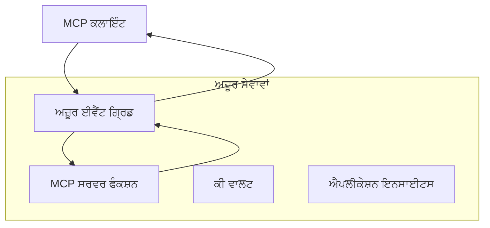
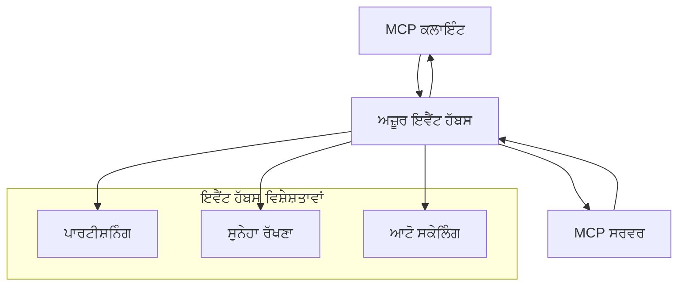

# MCP ਕਸਟਮ ਟਰਾਂਸਪੋਰਟਸ - ਅੱਤ ਦਰਜੇ ਦੀ ਅਮਲਦਾਰੀ ਗਾਈਡ

ਮਾਡਲ ਕਾਂਟੈਕਸਟ ਪ੍ਰੋਟੋਕੋਲ (MCP) ਟਰਾਂਸਪੋਰਟ ਮਕੈਨਿਜਮਾਂ ਵਿੱਚ ਲਚਕੀਲਾਪਨ ਪ੍ਰਦਾਨ ਕਰਦਾ ਹੈ, ਜੋ ਖਾਸ ਉਦਯੋਗਿਕ ਵਾਤਾਵਰਣਾਂ ਲਈ ਕਸਟਮ ਅਮਲਦਾਰੀਆਂ ਦੀ ਆਗਿਆ ਦਿੰਦਾ ਹੈ। ਇਹ ਅੱਤ ਦਰਜੇ ਦੀ ਗਾਈਡ ਸਕੇਲਬਲ, ਕਲਾਉਡ-ਨੇਟਿਵ MCP ਹੱਲਾਂ ਬਣਾਉਣ ਲਈ ਕੁਝ ਕਾਰਗਰ ਉਦਾਹਰਣਾਂ ਵਜੋਂ ਐਜ਼ੂਰ ਈਵੈਂਟ ਗ੍ਰਿਡ ਅਤੇ ਐਜ਼ੂਰ ਈਵੈਂਟ ਹਬਜ਼ ਦੀ ਵਰਤੋਂ ਕਰਦਿਆਂ ਕਸਟਮ ਟਰਾਂਸਪੋਰਟ ਅਮਲਦਾਰੀਆਂ ਦਾ ਅਧਿਐਨ ਕਰਦੀ ਹੈ।

## ਪਰਿਚਯ

ਜਦੋਂ ਕਿ MCP ਦੇ ਮਿਆਰੀ ਟਰਾਂਸਪੋਰਟ (stdio ਅਤੇ HTTP ਸਟ੍ਰੀਮਿੰਗ) ਜ਼ਿਆਦਾਤਰ ਕੇਸਾਂ ਨੂੰ ਸੇਵਾ ਦਿੰਦੇ ਹਨ, ਉਦਯੋਗਿਕ ਵਾਤਾਵਰਣ ਅਮੂਮਨ ਵਧੀਆ ਸਕੇਲਾਬਿਲਿਟੀ, ਭਰੋਸੇਯੋਗਤਾ ਅਤੇ ਮੌਜੂਦਾ ਕਲਾਉਡ ਇੰਫਰਾਸਟਰੱਕਚਰ ਨਾਲ ਇੰਟਿਗ੍ਰੇਸ਼ਨ ਲਈ ਵਿਸ਼ੇਸ਼ ਟਰਾਂਸਪੋਰਟ ਮਕੈਨਿਜਮਾਂ ਦੀ ਲੋੜ ਹੁੰਦੀ ਹੈ। ਕਸਟਮ ਟਰਾਂਸਪੋਰਟ MCP ਨੂੰ ਬੇਅਸਿੰਗਕਾਰ ਸੰਪਰਕ, ਘਟਨਾ-ਚਲਿਤ ਸਰਚਨਾਂ ਅਤੇ ਵੰਡੇ ਪ੍ਰਕਿਰਿਆਵਾਂ ਲਈ ਕਲਾਉਡ-ਨੇਟਿਵ ਸੰਦਰਭ ਸੇਵਾਵਾਂ ਦਾ ਲਾਭ ਉਠਾਣ ਦੀ ਆਗਿਆ ਦਿੰਦੇ ਹਨ।

ਇਹ ਪਾਠ MCP ਦੀ ਨਵੀਂਤਮ ਵਿਸ਼ੇਸ਼ਤਾ (2025-11-25), ਐਜ਼ੂਰ ਮੈਸੇਜਿੰਗ ਸੇਵਾਵਾਂ ਅਤੇ ਸਥਾਪਿਤ ਉਦਯੋਗਿਕ ਇੰਟਿਗ੍ਰੇਸ਼ਨ ਪੈਟਰਨਾਂ ਦੇ ਆਧਾਰ 'ਤੇ ਅੱਤ ਦਰਜੇ ਦੀਆਂ ਟਰਾਂਸਪੋਰਟ ਅਮਲਦਾਰੀਆਂ ਦਾ ਅਧਿਐਨ ਕਰਦਾ ਹੈ।

### **MCP ਟਰਾਂਸਪੋਰਟ ਆਰਕੀਟੈਕਚਰ**

**MCP ਵਿਸ਼ੇਸ਼ਤਾ (2025-11-25) ਤੋਂ:**

- **ਮਿਆਰੀ ਟਰਾਂਸਪੋਰਟ**: stdio (ਸਿਫਾਰਸ਼ੀ), HTTP ਸਟ੍ਰੀਮਿੰਗ (ਰਿਮੋਟ ਸਥਿਤੀਆਂ ਲਈ)
- **ਕਸਟਮ ਟਰਾਂਸਪੋਰਟ**: ਕੋਈ ਵੀ ਟਰਾਂਸਪੋਰਟ ਜੋ MCP ਸੁਨੇਹਾ ਬਦਲਾਅ ਪ੍ਰੋਟੋਕੋਲ ਨੂੰ ਅਮਲ ਕਰਦਾ ਹੋਵੇ
- **ਸੁਨੇਹਾ ਫਾਰਮੈਟ**: JSON-RPC 2.0 ਨਾਲ MCP-ਵਿਸ਼ੇਸ਼ ਵਾਧੇ
- **ਦੋ-ਧਿਰਾ ਸੰਚਾਰ**: ਸੂਚਨਾਵਾਂ ਅਤੇ ਜਵਾਬਾਂ ਲਈ ਪੂਰੀ ਦੋ-ਧਿਰਾ ਸੰਚਾਰ ਜ਼ਰੂਰੀ

## ਸਿੱਖਣ ਦੇ ਉਦੇਸ਼

ਇਸ ਅੱਤ ਦਰਜੇ ਦੇ ਪਾਠ ਦੇ ਅੰਤ ਤੱਕ, ਤੁਸੀਂ ਸਮਰੱਥ ਹੋਵੋਗੇ:

- **ਕਸਟਮ ਟਰਾਂਸਪੋਰਟ ਰਿਕੁਆਇਰਮੈਂਟ ਸਮਝਣਾ**: MCP ਪ੍ਰੋਟੋਕੋਲ ਨੂੰ ਕਿਸੇ ਵੀ ਟਰਾਂਸਪੋਰਟ ਲੇਅਰ 'ਤੇ ਅਮਲ ਕਰਨਾ ਜਦੋਂ ਕਿ ਅਨੁਕੂਲਤਾ ਬਣਾਈ ਰੱਖਣਾ
- **ਐਜ਼ੂਰ ਈਵੈਂਟ ਗ੍ਰਿਡ ਟਰਾਂਸਪੋਰਟ ਬਣਾਉਣਾ**: ਸਰਵਰलेੱਸ ਸਕੇਲਬਿਲਿਟੀ ਲਈ ਐਜ਼ੂਰ ਈਵੈਂਟ ਗ੍ਰਿਡ ਦੀ ਵਰਤੋਂ ਕਰਦਿਆਂ ਘਟਨਾ-ਚਲਿਤ MCP ਸਰਵਰ ਬਣਾਉਣਾ
- **ਐਜ਼ੂਰ ਈਵੈਂਟ ਹਬਜ਼ ਟਰਾਂਸਪੋਰਟ ਅਮਲ ਕਰਨਾ**: ਹਾਈ-ਥ੍ਰੂਪੁੱਟ MCP ਹੱਲਾਂ ਲਈ ਐਜ਼ੂਰ ਈਵੈਂਟ ਹਬਜ਼ ਦੀ ਵਰਤੋਂ ਕਰਕੇ ਰੀਅਲ-ਟਾਈਮ ਸਟ੍ਰੀਮਿੰਗ ਡਿਜ਼ਾਇਨ ਕਰਨਾ
- **ਉਦਯੋਗਿਕ ਪੈਟਰਨਾਂ ਨੂੰ ਲਾਗੂ ਕਰਨਾ**: ਮੌਜੂਦਾ ਐਜ਼ੂਰ ਇੰਫਰਾਸਟਰੱਕਚਰ ਅਤੇ ਸੁਰੱਖਿਆ ਮਾਡਲਾਂ ਨਾਲ ਕਸਟਮ ਟਰਾਂਸਪੋਰਟਾਂ ਨੂੰ ਇੰਟਿਗਰੇਟ ਕਰਨਾ
- **ਟਰਾਂਸਪੋਰਟ ਭਰੋਸੇਯੋਗਤਾ ਸੰਭਾਲਣਾ**: ਉਦਯੋਗਿਕ ਸਥਿਤੀਆਂ ਲਈ ਸੁਨੇਹਾ ਟਿਕਾਊਪਨ, ਕ੍ਰਮਬੱਧਤਾ ਅਤੇ ਗਲਤੀ ਸੰਭਾਲਣਾ ਅਮਲ ਕਰਨਾ
- **ਕਾਰਗੁਜ਼ਾਰੀ ਦਾ ਅੱਪਟੀਮਾਈਜ਼ੇਸ਼ਨ**: ਸਕੇਲ, ਲੈਟੈਂਸੀ ਅਤੇ ਥ੍ਰੂਪੁੱਟ ਰਿਕੁਆਇਰਮੈਂਟਾਂ ਲਈ ਟਰਾਂਸਪੋਰਟ ਹੱਲਾਂ ਤਿਆਰ ਕਰਨਾ

## ** ਟਰਾਂਸਪੋਰਟ ਲੋੜਾਂ **

### **MCP ਵਿਸ਼ੇਸ਼ਤਾ (2025-11-25) ਤੋਂ ਮੁੱਖ ਲੋੜਾਂ:**

```yaml
Message Protocol:
  format: "JSON-RPC 2.0 with MCP extensions"
  bidirectional: "Full duplex communication required"
  ordering: "Message ordering must be preserved per session"
  
Transport Layer:
  reliability: "Transport MUST handle connection failures gracefully"
  security: "Transport MUST support secure communication"
  identification: "Each session MUST have unique identifier"
  
Custom Transport:
  compliance: "MUST implement complete MCP message exchange"
  extensibility: "MAY add transport-specific features"
  interoperability: "MUST maintain protocol compatibility"
```

## **ਐਜ਼ੂਰ ਈਵੈਂਟ ਗ੍ਰਿਡ ਟਰਾਂਸਪੋਰਟ ਅਮਲਦਾਰੀ**

ਐਜ਼ੂਰ ਈਵੈਂਟ ਗ੍ਰਿਡ ਗਲਤ-ਸਬੰਧਤ MCP ਆਰਕੀਟੈਕਚਰਾਂ ਲਈ ਇਕ ਸਰਵਰਲੇੱਸ ਘਟਨਾ ਰੂਟਿੰਗ ਸੇਵਾ ਪ੍ਰਦਾਨ ਕਰਦਾ ਹੈ। ਇਹ ਅਮਲ ਦਰਸਾਉਂਦਾ ਹੈ ਕਿ ਕਿਸ ਤਰ੍ਹਾਂ ਸਕੇਲਬਲ, ਢੀਲੇ-ਜੁੜੇ MCP ਪ੍ਰਣਾਲੀਆਂ ਬਣਾਈਆਂ ਜਾ ਸਕਦੀਆਂ ਹਨ।

### **ਆਰਕੀਟੈਕਚਰ ਓਵਰਵਿਊ**



### **C# ਅਮਲਦਾਰੀ - ਈਵੈਂਟ ਗ੍ਰਿਡ ਟਰਾਂਸਪੋਰਟ**

```csharp
using Azure.Messaging.EventGrid;
using Microsoft.Extensions.Azure;
using System.Text.Json;

public class EventGridMcpTransport : IMcpTransport
{
    private readonly EventGridPublisherClient _publisher;
    private readonly string _topicEndpoint;
    private readonly string _clientId;
    
    public EventGridMcpTransport(string topicEndpoint, string accessKey, string clientId)
    {
        _publisher = new EventGridPublisherClient(
            new Uri(topicEndpoint), 
            new AzureKeyCredential(accessKey));
        _topicEndpoint = topicEndpoint;
        _clientId = clientId;
    }
    
    public async Task SendMessageAsync(McpMessage message)
    {
        var eventGridEvent = new EventGridEvent(
            subject: $"mcp/{_clientId}",
            eventType: "MCP.MessageReceived",
            dataVersion: "1.0",
            data: JsonSerializer.Serialize(message))
        {
            Id = Guid.NewGuid().ToString(),
            EventTime = DateTimeOffset.UtcNow
        };
        
        await _publisher.SendEventAsync(eventGridEvent);
    }
    
    public async Task<McpMessage> ReceiveMessageAsync(CancellationToken cancellationToken)
    {
        // Event Grid is push-based, so implement webhook receiver
        // This would typically be handled by Azure Functions trigger
        throw new NotImplementedException("Use EventGridTrigger in Azure Functions");
    }
}

// Azure Function for receiving Event Grid events
[FunctionName("McpEventGridReceiver")]
public async Task<IActionResult> HandleEventGridMessage(
    [EventGridTrigger] EventGridEvent eventGridEvent,
    ILogger log)
{
    try
    {
        var mcpMessage = JsonSerializer.Deserialize<McpMessage>(
            eventGridEvent.Data.ToString());
        
        // Process MCP message
        var response = await _mcpServer.ProcessMessageAsync(mcpMessage);
        
        // Send response back via Event Grid
        await _transport.SendMessageAsync(response);
        
        return new OkResult();
    }
    catch (Exception ex)
    {
        log.LogError(ex, "Error processing Event Grid MCP message");
        return new BadRequestResult();
    }
}
```

### **ਟਾਈਪਸਕ੍ਰਿਪਟ ਅਮਲਦਾਰੀ - ਈਵੈਂਟ ਗ੍ਰਿਡ ਟਰਾਂਸਪੋਰਟ**

```typescript
import { EventGridPublisherClient, AzureKeyCredential } from "@azure/eventgrid";
import { McpTransport, McpMessage } from "./mcp-types";

export class EventGridMcpTransport implements McpTransport {
    private publisher: EventGridPublisherClient;
    private clientId: string;
    
    constructor(
        private topicEndpoint: string,
        private accessKey: string,
        clientId: string
    ) {
        this.publisher = new EventGridPublisherClient(
            topicEndpoint,
            new AzureKeyCredential(accessKey)
        );
        this.clientId = clientId;
    }
    
    async sendMessage(message: McpMessage): Promise<void> {
        const event = {
            id: crypto.randomUUID(),
            source: `mcp-client-${this.clientId}`,
            type: "MCP.MessageReceived",
            time: new Date(),
            data: message
        };
        
        await this.publisher.sendEvents([event]);
    }
    
    // ਇਵੈਂਟ-ਡ੍ਰਿਵਨ ਪ੍ਰਾਪਤੀ ਅਜ਼ੂਰ ਫੰਕਸ਼ਨਜ਼ ਰਾਹੀਂ
    onMessage(handler: (message: McpMessage) => Promise<void>): void {
        // ਕਾਰਜਨਿਰੀ ਕਰਨ ਲਈ ਅਜ਼ੂਰ ਫੰਕਸ਼ਨਜ਼ ਇਵੈਂਟ ਗਰਿੱਡ ਟ੍ਰਿਗਰ ਦੇ ਵਰਤੋਂ ਕੀਤੀ ਜਾਵੇਗੀ
        // ਇਹ ਵੈਬਹੁਕ ਪ੍ਰਾਪਤਕਾਰ ਲਈ ਇਕ ਰੂਪਕ ਇੰਟਰਫੇਸ ਹੈ
    }
}

// ਅਜ਼ੂਰ ਫੰਕਸ਼ਨਜ਼ ਦੀ ਕਾਰਜਨਿਰੀ
import { app, InvocationContext, EventGridEvent } from "@azure/functions";

app.eventGrid("mcpEventGridHandler", {
    handler: async (event: EventGridEvent, context: InvocationContext) => {
        try {
            const mcpMessage = event.data as McpMessage;
            
            // MCP ਸੁਨੇਹਾ ਪ੍ਰਕਿਰਿਆ ਕਰੋ
            const response = await mcpServer.processMessage(mcpMessage);
            
            // ਇਵੈਂਟ ਗਰਿੱਡ ਰਾਹੀਂ ਪ੍ਰਤੀਕਿਰਿਆ ਭੇਜੋ
            await transport.sendMessage(response);
            
        } catch (error) {
            context.error("Error processing MCP message:", error);
            throw error;
        }
    }
});
```

### **ਪਾਈਥਨ ਅਮਲਦਾਰੀ - ਈਵੈਂਟ ਗ੍ਰਿਡ ਟਰਾਂਸਪੋਰਟ**

```python
from azure.eventgrid import EventGridPublisherClient, EventGridEvent
from azure.core.credentials import AzureKeyCredential
import asyncio
import json
from typing import Callable, Optional
import uuid
from datetime import datetime

class EventGridMcpTransport:
    def __init__(self, topic_endpoint: str, access_key: str, client_id: str):
        self.client = EventGridPublisherClient(
            topic_endpoint, 
            AzureKeyCredential(access_key)
        )
        self.client_id = client_id
        self.message_handler: Optional[Callable] = None
    
    async def send_message(self, message: dict) -> None:
        """Send MCP message via Event Grid"""
        event = EventGridEvent(
            data=message,
            subject=f"mcp/{self.client_id}",
            event_type="MCP.MessageReceived",
            data_version="1.0"
        )
        
        await self.client.send(event)
    
    def on_message(self, handler: Callable[[dict], None]) -> None:
        """Register message handler for incoming events"""
        self.message_handler = handler

# ਅਜ਼ੂਰ ਫੰਕਸ਼ਨਸ ਦੀ ਨਿਰਦੇਸ਼ਾਵਲੀ
import azure.functions as func
import logging

def main(event: func.EventGridEvent) -> None:
    """Azure Functions Event Grid trigger for MCP messages"""
    try:
        # ਇਵੈਂਟ ਗਰਿਡ ਇਵੈਂਟ ਤੋਂ MCP ਸੁਨੇਹਾ ਪਾਰਸ ਕਰੋ
        mcp_message = json.loads(event.get_body().decode('utf-8'))
        
        # MCP ਸੁਨੇਹਾ ਪ੍ਰਕਿਰਿਆ ਕਰੋ
        response = process_mcp_message(mcp_message)
        
        # ਜਵਾਬ ਵਾਪਸ ਇਵੈਂਟ ਗਰਿਡ ਰਾਹੀਂ ਭੇਜੋ
        # (ਨਿਰਦੇਸ਼ਾਵਲੀ ਨਵਾਂ ਇਵੈਂਟ ਗਰਿਡ ਕਲਾਇੰਟ ਬਣਾਏਗੀ)
        
    except Exception as e:
        logging.error(f"Error processing MCP Event Grid message: {e}")
        raise
```

## **ਐਜ਼ੂਰ ਈਵੈਂਟ ਹਬਜ਼ ਟਰਾਂਸਪੋਰਟ ਅਮਲਦਾਰੀ**

ਐਜ਼ੂਰ ਈਵੈਂਟ ਹਬਜ਼ ਹਾਈ-ਥ੍ਰੂਪੁੱਟ, ਰੀਅਲ-ਟਾਈਮ ਸਟ੍ਰੀਮਿੰਗ ਯੋਗਤਾਵਾਂ ਪ੍ਰਦਾਨ ਕਰਦਾ ਹੈ ਜੋ ਥੱਲੇ ਲੈਟੈਂਸੀ ਅਤੇ ਵੱਡੇ ਸੁਨੇਹਾ ਵਾਲੀ ਮਾਤਰਾ ਵਾਲੀਆਂ MCP ਸਥਿਤੀਆਂ ਲਈ ਜ਼ਰੂਰੀ ਹਨ।

### **ਆਰਕੀਟੈਕਚਰ ਓਵਰਵਿਊ**



### **C# ਅਮਲਦਾਰੀ - ਈਵੈਂਟ ਹਬਜ਼ ਟਰਾਂਸਪੋਰਟ**

```csharp
using Azure.Messaging.EventHubs;
using Azure.Messaging.EventHubs.Producer;
using Azure.Messaging.EventHubs.Consumer;
using System.Text;

public class EventHubsMcpTransport : IMcpTransport, IDisposable
{
    private readonly EventHubProducerClient _producer;
    private readonly EventHubConsumerClient _consumer;
    private readonly string _consumerGroup;
    private readonly CancellationTokenSource _cancellationTokenSource;
    
    public EventHubsMcpTransport(
        string connectionString, 
        string eventHubName,
        string consumerGroup = "$Default")
    {
        _producer = new EventHubProducerClient(connectionString, eventHubName);
        _consumer = new EventHubConsumerClient(
            consumerGroup, 
            connectionString, 
            eventHubName);
        _consumerGroup = consumerGroup;
        _cancellationTokenSource = new CancellationTokenSource();
    }
    
    public async Task SendMessageAsync(McpMessage message)
    {
        var messageBody = JsonSerializer.Serialize(message);
        var eventData = new EventData(Encoding.UTF8.GetBytes(messageBody));
        
        // Add MCP-specific properties
        eventData.Properties.Add("MessageType", message.Method ?? "response");
        eventData.Properties.Add("MessageId", message.Id);
        eventData.Properties.Add("Timestamp", DateTimeOffset.UtcNow);
        
        await _producer.SendAsync(new[] { eventData });
    }
    
    public async Task StartReceivingAsync(
        Func<McpMessage, Task> messageHandler)
    {
        await foreach (PartitionEvent partitionEvent in _consumer.ReadEventsAsync(
            _cancellationTokenSource.Token))
        {
            try
            {
                var messageBody = Encoding.UTF8.GetString(
                    partitionEvent.Data.EventBody.ToArray());
                var mcpMessage = JsonSerializer.Deserialize<McpMessage>(messageBody);
                
                await messageHandler(mcpMessage);
            }
            catch (Exception ex)
            {
                // Handle deserialization or processing errors
                Console.WriteLine($"Error processing message: {ex.Message}");
            }
        }
    }
    
    public void Dispose()
    {
        _cancellationTokenSource?.Cancel();
        _producer?.DisposeAsync().AsTask().Wait();
        _consumer?.DisposeAsync().AsTask().Wait();
        _cancellationTokenSource?.Dispose();
    }
}
```

### **ਟਾਈਪਸਕ੍ਰਿਪਟ ਅਮਲਦਾਰੀ - ਈਵੈਂਟ ਹਬਜ਼ ਟਰਾਂਸਪੋਰਟ**

```typescript
import { 
    EventHubProducerClient, 
    EventHubConsumerClient, 
    EventData 
} from "@azure/event-hubs";

export class EventHubsMcpTransport implements McpTransport {
    private producer: EventHubProducerClient;
    private consumer: EventHubConsumerClient;
    private isReceiving = false;
    
    constructor(
        private connectionString: string,
        private eventHubName: string,
        private consumerGroup: string = "$Default"
    ) {
        this.producer = new EventHubProducerClient(
            connectionString, 
            eventHubName
        );
        this.consumer = new EventHubConsumerClient(
            consumerGroup,
            connectionString,
            eventHubName
        );
    }
    
    async sendMessage(message: McpMessage): Promise<void> {
        const eventData: EventData = {
            body: JSON.stringify(message),
            properties: {
                messageType: message.method || "response",
                messageId: message.id,
                timestamp: new Date().toISOString()
            }
        };
        
        await this.producer.sendBatch([eventData]);
    }
    
    async startReceiving(
        messageHandler: (message: McpMessage) => Promise<void>
    ): Promise<void> {
        if (this.isReceiving) return;
        
        this.isReceiving = true;
        
        const subscription = this.consumer.subscribe({
            processEvents: async (events, context) => {
                for (const event of events) {
                    try {
                        const messageBody = event.body as string;
                        const mcpMessage: McpMessage = JSON.parse(messageBody);
                        
                        await messageHandler(mcpMessage);
                        
                        // ਘੱਟੋ-ਘੱਟ ਇੱਕ ਵਾਰੀ ਡਿਲਿਵਰੀ ਲਈ ਚੈਕਪੌਇੰਟ ਅੱਪਡੇਟ ਕਰੋ
                        await context.updateCheckpoint(event);
                    } catch (error) {
                        console.error("Error processing Event Hubs message:", error);
                    }
                }
            },
            processError: async (err, context) => {
                console.error("Event Hubs error:", err);
            }
        });
    }
    
    async close(): Promise<void> {
        this.isReceiving = false;
        await this.producer.close();
        await this.consumer.close();
    }
}
```

### **ਪਾਈਥਨ ਅਮਲਦਾਰੀ - ਈਵੈਂਟ ਹਬਜ਼ ਟਰਾਂਸਪੋਰਟ**

```python
from azure.eventhub import EventHubProducerClient, EventHubConsumerClient
from azure.eventhub import EventData
import json
import asyncio
from typing import Callable, Dict, Any
import logging

class EventHubsMcpTransport:
    def __init__(
        self, 
        connection_string: str, 
        eventhub_name: str,
        consumer_group: str = "$Default"
    ):
        self.producer = EventHubProducerClient.from_connection_string(
            connection_string, 
            eventhub_name=eventhub_name
        )
        self.consumer = EventHubConsumerClient.from_connection_string(
            connection_string,
            consumer_group=consumer_group,
            eventhub_name=eventhub_name
        )
        self.is_receiving = False
    
    async def send_message(self, message: Dict[str, Any]) -> None:
        """Send MCP message via Event Hubs"""
        event_data = EventData(json.dumps(message))
        
        # MCP-ਵਿਸ਼ੇਸ਼ ਗੁਣ ਸ਼ਾਮਲ ਕਰੋ
        event_data.properties = {
            "messageType": message.get("method", "response"),
            "messageId": message.get("id"),
            "timestamp": "2025-01-14T10:30:00Z"  # ਅਸਲ ਟਾਈਮਸਟੈਂਪ ਵਰਤੋ
        }
        
        async with self.producer:
            event_data_batch = await self.producer.create_batch()
            event_data_batch.add(event_data)
            await self.producer.send_batch(event_data_batch)
    
    async def start_receiving(
        self, 
        message_handler: Callable[[Dict[str, Any]], None]
    ) -> None:
        """Start receiving MCP messages from Event Hubs"""
        if self.is_receiving:
            return
        
        self.is_receiving = True
        
        async with self.consumer:
            await self.consumer.receive(
                on_event=self._on_event_received(message_handler),
                starting_position="-1"  # ਸ਼ੁਰੂ ਤੋਂ ਸ਼ੁਰੂ ਕਰੋ
            )
    
    def _on_event_received(self, handler: Callable):
        """Internal event handler wrapper"""
        async def handle_event(partition_context, event):
            try:
                # Event Hubs ਇਵੈਂਟ ਤੋਂ MCP ਸੁਨੇਹਾ ਪਾਰਸ ਕਰੋ
                message_body = event.body_as_str(encoding='UTF-8')
                mcp_message = json.loads(message_body)
                
                # MCP ਸੁਨੇਹਾ ਪ੍ਰਕਿਰਿਆ ਕਰੋ
                await handler(mcp_message)
                
                # ਘੱਟੋ-ਘੱਟ ਇੱਕ ਵਾਰ ਡਿਲਿਵਰੀ ਲਈ ਚੈਕਪੌਇੰਟ ਅਪਡੇਟ ਕਰੋ
                await partition_context.update_checkpoint(event)
                
            except Exception as e:
                logging.error(f"Error processing Event Hubs message: {e}")
        
        return handle_event
    
    async def close(self) -> None:
        """Clean up transport resources"""
        self.is_receiving = False
        await self.producer.close()
        await self.consumer.close()
```

## **ਅੱਤ ਦਰਜੇ ਟਰਾਂਸਪੋਰਟ ਪੈਟਰਨ**

### **ਸੁਨੇਹਾ ਟਿਕਾਊਪਨ ਅਤੇ ਭਰੋਸੇਯੋਗਤਾ**

```csharp
// Implementing message durability with retry logic
public class ReliableTransportWrapper : IMcpTransport
{
    private readonly IMcpTransport _innerTransport;
    private readonly RetryPolicy _retryPolicy;
    
    public async Task SendMessageAsync(McpMessage message)
    {
        await _retryPolicy.ExecuteAsync(async () =>
        {
            try
            {
                await _innerTransport.SendMessageAsync(message);
            }
            catch (TransportException ex) when (ex.IsRetryable)
            {
                // Log and retry
                throw;
            }
        });
    }
}
```

### **ਟਰਾਂਸਪੋਰਟ ਸੁਰੱਖਿਆ ਇੰਟਿਗ੍ਰੇਸ਼ਨ**

```csharp
// Integrating Azure Key Vault for transport security
public class SecureTransportFactory
{
    private readonly SecretClient _keyVaultClient;
    
    public async Task<IMcpTransport> CreateEventGridTransportAsync()
    {
        var accessKey = await _keyVaultClient.GetSecretAsync("EventGridAccessKey");
        var topicEndpoint = await _keyVaultClient.GetSecretAsync("EventGridTopic");
        
        return new EventGridMcpTransport(
            topicEndpoint.Value.Value,
            accessKey.Value.Value,
            Environment.MachineName
        );
    }
}
```

### **ਟਰਾਂਸਪੋਰਟ ਨਿਗਰਾਨੀ ਅਤੇ ਅਵਲੋਕਨਯੋਗਤਾ**

```csharp
// Adding telemetry to custom transports
public class ObservableTransport : IMcpTransport
{
    private readonly IMcpTransport _transport;
    private readonly ILogger _logger;
    private readonly TelemetryClient _telemetryClient;
    
    public async Task SendMessageAsync(McpMessage message)
    {
        using var activity = Activity.StartActivity("MCP.Transport.Send");
        activity?.SetTag("transport.type", "EventGrid");
        activity?.SetTag("message.method", message.Method);
        
        var stopwatch = Stopwatch.StartNew();
        
        try
        {
            await _transport.SendMessageAsync(message);
            
            _telemetryClient.TrackDependency(
                "EventGrid",
                "SendMessage",
                DateTime.UtcNow.Subtract(stopwatch.Elapsed),
                stopwatch.Elapsed,
                true
            );
        }
        catch (Exception ex)
        {
            _telemetryClient.TrackException(ex);
            throw;
        }
    }
}
```

## **ਉਦਯੋਗਿਕ ਇੰਟਿਗ੍ਰੇਸ਼ਨ ਸਥਿਤੀਆਂ**

### **ਸਥਿਤੀ 1: ਵੰਡਿਆ ਹੋਇਆ MCP ਪ੍ਰੋਸੈਸਿੰਗ**

ਕਈ ਪ੍ਰੋਸੈਸਿੰਗ ਨੋਡਾਂ ਉੱਤੇ MCP ਬੇਨਤੀ ਵੰਡਣ ਲਈ ਐਜ਼ੂਰ ਈਵੈਂਟ ਗ੍ਰਿਡ ਦੀ ਵਰਤੋਂ:

```yaml
Architecture:
  - MCP Client sends requests to Event Grid topic
  - Multiple Azure Functions subscribe to process different tool types
  - Results aggregated and returned via separate response topic
  
Benefits:
  - Horizontal scaling based on message volume
  - Fault tolerance through redundant processors
  - Cost optimization with serverless compute
```

### **ਸਥਿਤੀ 2: ਰੀਅਲ-ਟਾਈਮ MCP ਸਟ੍ਰੀਮਿੰਗ**

ਉੱਚ-ਅਵਿਰਤੀ MCP ਆਪਸੀਆਂ ਲਈ ਐਜ਼ੂਰ ਈਵੈਂਟ ਹਬਜ਼ ਦੀ ਵਰਤੋਂ:

```yaml
Architecture:
  - MCP Client streams continuous requests via Event Hubs
  - Stream Analytics processes and routes messages
  - Multiple consumers handle different aspect of processing
  
Benefits:
  - Low latency for real-time scenarios
  - High throughput for batch processing
  - Built-in partitioning for parallel processing
```

### **ਸਥਿਤੀ 3: ਹਾਈਬ੍ਰਿਡ ਟਰਾਂਸਪੋਰਟ ਆਰਕੀਟੈਕਚਰ**

ਵੱਖ-ਵੱਖ ਵਰਤੋਂ ਕੇਸਾਂ ਲਈ ਕਈ ਟਰਾਂਸਪੋਰਟਾਂ ਨੂੰ ਮਿਲਾਉਣਾ:

```csharp
public class HybridMcpTransport : IMcpTransport
{
    private readonly IMcpTransport _realtimeTransport; // Event Hubs
    private readonly IMcpTransport _batchTransport;    // Event Grid
    private readonly IMcpTransport _fallbackTransport; // HTTP Streaming
    
    public async Task SendMessageAsync(McpMessage message)
    {
        // Route based on message characteristics
        var transport = message.Method switch
        {
            "tools/call" when IsRealtime(message) => _realtimeTransport,
            "resources/read" when IsBatch(message) => _batchTransport,
            _ => _fallbackTransport
        };
        
        await transport.SendMessageAsync(message);
    }
}
```

## **ਕਾਰਗੁਜ਼ਾਰੀ ਅੱਪਟੀਮਾਈਜ਼ੇਸ਼ਨ**

### **ਈਵੈਂਟ ਗ੍ਰਿਡ ਲਈ ਸੁਨੇਹਾ ਬੈਚਿੰਗ**

```csharp
public class BatchingEventGridTransport : IMcpTransport
{
    private readonly List<McpMessage> _messageBuffer = new();
    private readonly Timer _flushTimer;
    private const int MaxBatchSize = 100;
    
    public async Task SendMessageAsync(McpMessage message)
    {
        lock (_messageBuffer)
        {
            _messageBuffer.Add(message);
            
            if (_messageBuffer.Count >= MaxBatchSize)
            {
                _ = Task.Run(FlushMessages);
            }
        }
    }
    
    private async Task FlushMessages()
    {
        List<McpMessage> toSend;
        lock (_messageBuffer)
        {
            toSend = new List<McpMessage>(_messageBuffer);
            _messageBuffer.Clear();
        }
        
        if (toSend.Any())
        {
            var events = toSend.Select(CreateEventGridEvent);
            await _publisher.SendEventsAsync(events);
        }
    }
}
```

### **ਈਵੈਂਟ ਹਬਜ਼ ਲਈ ਪਾਰਟੀਸ਼ਨਿੰਗ ਰਣਨੀਤੀ**

```csharp
public class PartitionedEventHubsTransport : IMcpTransport
{
    public async Task SendMessageAsync(McpMessage message)
    {
        // Partition by client ID for session affinity
        var partitionKey = ExtractClientId(message);
        
        var eventData = new EventData(JsonSerializer.SerializeToUtf8Bytes(message))
        {
            PartitionKey = partitionKey
        };
        
        await _producer.SendAsync(new[] { eventData });
    }
}
```

## **ਕਸਟਮ ਟਰਾਂਸਪੋਰਟਜ਼ ਦੀ ਜਾਂਚ**

### **ਟੈਸਟ ਡਬਲਜ਼ ਨਾਲ ਯੂਨਿਟ ਟੈਸਟਿੰਗ**

```csharp
[Test]
public async Task EventGridTransport_SendMessage_PublishesCorrectEvent()
{
    // Arrange
    var mockPublisher = new Mock<EventGridPublisherClient>();
    var transport = new EventGridMcpTransport(mockPublisher.Object);
    var message = new McpMessage { Method = "tools/list", Id = "test-123" };
    
    // Act
    await transport.SendMessageAsync(message);
    
    // Assert
    mockPublisher.Verify(
        x => x.SendEventAsync(
            It.Is<EventGridEvent>(e => 
                e.EventType == "MCP.MessageReceived" &&
                e.Subject == "mcp/test-client"
            )
        ),
        Times.Once
    );
}
```

### **ਐਜ਼ੂਰ ਟੈਸਟ ਕੰਟੇਨਰਜ਼ ਨਾਲ ਇੰਟਿਗ੍ਰੇਸ਼ਨ ਟੈਸਟਿੰਗ**

```csharp
[Test]
public async Task EventHubsTransport_IntegrationTest()
{
    // Using Testcontainers for integration testing
    var eventHubsContainer = new EventHubsContainer()
        .WithEventHub("test-hub");
    
    await eventHubsContainer.StartAsync();
    
    var transport = new EventHubsMcpTransport(
        eventHubsContainer.GetConnectionString(),
        "test-hub"
    );
    
    // Test message round-trip
    var sentMessage = new McpMessage { Method = "test", Id = "123" };
    McpMessage receivedMessage = null;
    
    await transport.StartReceivingAsync(msg => {
        receivedMessage = msg;
        return Task.CompletedTask;
    });
    
    await transport.SendMessageAsync(sentMessage);
    await Task.Delay(1000); // Allow for message processing
    
    Assert.That(receivedMessage?.Id, Is.EqualTo("123"));
}
```

## **ਸਰਵੋਤਮ ਅਭਿਆਸ ਅਤੇ ਦਿਸ਼ਾ-ਨਿਰਦੇਸ਼**

### **ਟਰਾਂਸਪੋਰਟ ਡਿਜ਼ਾਇਨ ਸਿਧਾਂਤ**

1. **ਇਡੈਂਪੋਟੈਂਸੀ**: ਨਕਲਾਂ ਦਾ ਨਿਪਟਾਰਾ ਕਰਨ ਲਈ ਸੁਨੇਹਾ ਪ੍ਰੋਸੈਸਿੰਗ ਨੂੰ ਇਡੈਂਪੋਟੈਂਟ ਬਣਾਓ
2. **ਗਲਤੀ ਸੰਭਾਲਣਾ**: ਵਿਆਪਕ ਗਲਤੀ ਸੰਭਾਲ ਅਤੇ ਡੈੱਡ ਲੈਟਰ ਕਿਊਜ਼ ਅਮਲ ਕਰੋ
3. **ਨਿਗਰਾਨੀ**: ਵਿਸਥਾਰ ਨਾਲ ਟੈਲੀਮੈਟਰੀ ਅਤੇ ਸਿਹਤ ਜਾਂਚਾਂ ਸ਼ਾਮਿਲ ਕਰੋ
4. **ਸੁਰੱਖਿਆ**: ਪ੍ਰਬੰਧਿਤ ਪਛਾਣਾਂ ਅਤੇ ਘੱਟੋ-ਘੱਟ ਅਧਿਕਾਰ ਪਹੁੰਚ ਦੀ ਵਰਤੋਂ ਕਰੋ
5. **ਕਾਰਗੁਜ਼ਾਰੀ**: ਆਪਣੇ ਵਿਸ਼ੇਸ਼ ਲੈਟੈਂਸੀ ਅਤੇ ਥ੍ਰੂਪੁੱਟ ਮੰਗਾਂ ਲਈ ਡਿਜ਼ਾਇਨ ਕਰੋ

### **ਐਜ਼ੂਰ-ਵਿਸ਼ੇਸ਼ ਸਿਫਾਰਸ਼ਾਂ**

1. **ਪ੍ਰਬੰਧਿਤ ਪਛਾਣ ਦੀ ਵਰਤੋਂ ਕਰੋ**: ਉਤਪਾਦਨ ਵਿੱਚ ਕਨੈਕਸ਼ਨ ਸਟਰਿੰਗਜ਼ ਤੋਂ ਬਚੋ
2. **ਸਰਕਿਟ ਬ੍ਰੇਕਰ ਲਾਗੂ ਕਰੋ**: ਐਜ਼ੂਰ ਸੇਵਾ ਬੰਦਸ਼ਾਂ ਤੋਂ ਬਚਾਅ ਲਈ
3. **ਖ਼ਰਚਿਆ ਦੀ ਨਿਗਰਾਨੀ ਕਰੋ**: ਸੁਨੇਹਾ ਮਾਤਰਾ ਅਤੇ ਪ੍ਰੋਸੈਸਿੰਗ ਖ਼ਰਚਾਂ 'ਤੇ ਨਜ਼ਰ ਰੱਖੋ
4. **ਸਕੇਲ ਲਈ ਯੋਜਨਾ ਬਣਾਓ**: ਪਾਰਟੀਸ਼ਨਿੰਗ ਅਤੇ ਸਕੇਲ ਰਣਨੀਤੀਆਂ ਨੂੰ ਪਹਿਲਾਂ ਤੋਂ ਡਿਜ਼ਾਇਨ ਕਰੋ
5. **ਪੂਰੀ ਤਰ੍ਹਾਂ ਟੈਸਟ ਕਰੋ**: ਵਿਆਪਕ ਟੈਸਟਿੰਗ ਲਈ ਐਜ਼ੂਰ ਡੈਵਟੈਸਟ ਲੈਬਜ਼ ਦੀ ਵਰਤੋਂ ਕਰੋ

## **ਨਿਸ਼્કਰਸ਼**

ਕਸਟਮ MCP ਟਰਾਂਸਪੋਰਟ ਐਜ਼ੂਰ ਦੀਆਂ ਮੈਸੇਜਿੰਗ ਸੇਵਾਵਾਂ ਦੀ ਵਰਤੋਂ ਕਰਦਿਆਂ ਸ਼ਕਤੀਸ਼ਾਲੀ ਉਦਯੋਗਿਕ ਸਥਿਤੀਆਂ ਨੂੰ ਸਖਤੀ ਨਾਲ ਯੋਗ ਬਣਾਉਂਦੇ ਹਨ। ਈਵੈਂਟ ਗ੍ਰਿਡ ਜਾਂ ਈਵੈਂਟ ਹਬਜ਼ ਟਰਾਂਸਪੋਰਟਾਂ ਨੂੰ ਲਾਗੂ ਕਰਕੇ ਤੁਸੀਂ ਮੌਜੂਦਾ ਐਜ਼ੂਰ ਇੰਫਰਾਸਟਰੱਕਚਰ ਨਾਲ ਬੜੀ ਸਹੂਲਤ ਨਾਲ ਜੁੜੇ ਸਕੇਲਯੋਗ, ਭਰੋਸੇਮੰਦ MCP ਹੱਲਾਂ ਤਿਆਰ ਕਰ ਸਕਦੇ ਹੋ।

ਦਿੱਤੇ ਉਦਾਹਰਣ ਪ੍ਰੋਡਕਸ਼ਨ-ਤਿਆਰ ਪੈਟਰਨ ਦਰਸਾਉਂਦੇ ਹਨ ਜੋ MCP ਪ੍ਰੋਟੋਕੋਲ ਅਨੁਕੂਲਤਾ ਅਤੇ ਐਜ਼ੂਰ ਦੇ ਸਰਵੋਤਮ ਅਭਿਆਸਾਂ ਨੂੰ ਬਰਕਰਾਰ ਰੱਖਦੇ ਹੋਏ ਕਸਟਮ ਟਰਾਂਸਪੋਰਟਾਂ ਨੂੰ ਲਾਗੂ ਕਰਦੇ ਹਨ।

## **ਵਾਧੂ ਸਰੋਤ**

- [MCP ਵਿਸ਼ੇਸ਼ਤਾ 2025-11-25](https://modelcontextprotocol.io/specification/2025-11-25/)
- [ਐਜ਼ੂਰ ਈਵੈਂਟ ਗ੍ਰਿਡ ਡੌਕਯੂਮੈਂਟੇਸ਼ਨ](https://docs.microsoft.com/azure/event-grid/)
- [ਐਜ਼ੂਰ ਈਵੈਂਟ ਹਬਜ਼ ਡੌਕਯੂਮੈਂਟੇਸ਼ਨ](https://docs.microsoft.com/azure/event-hubs/)
- [ਐਜ਼ੂਰ ਫੰਕਸ਼ਨਜ਼ ਈਵੈਂਟ ਗ੍ਰਿਡ ਟ੍ਰਿੱਗਰ](https://docs.microsoft.com/azure/azure-functions/functions-bindings-event-grid)
- [ਐਜ਼ੂਰ SDK ਫਾਰ .NET](https://github.com/Azure/azure-sdk-for-net)
- [ਐਜ਼ੂਰ SDK ਫਾਰ ਟਾਈਪਸਕ੍ਰਿਪਟ](https://github.com/Azure/azure-sdk-for-js)
- [ਐਜ਼ੂਰ SDK ਫਾਰ ਪਾਈਥਨ](https://github.com/Azure/azure-sdk-for-python)

---

> *ਇਹ ਗਾਈਡ ਪ੍ਰੋਡਕਸ਼ਨ MCP ਪ੍ਰਣਾਲੀਆਂ ਲਈ ਕਾਰਗਰ ਅਮਲਦਾਰ ਪੈਟਰਨਾਂ 'ਤੇ ਧਿਆਨ ਕੇਂਦ੍ਰਿਤ ਕਰਦੀ ਹੈ। ਹਮੇਸ਼ਾ ਆਪਣੇ ਵਿਸ਼ੇਸ਼ਤ ਰਿਕੁਆਇਰਮੈਂਟ ਅਤੇ ਐਜ਼ੂਰ ਸੇਵਾ ਸੀਮਾਵਾਂ ਵਿਰੁੱਧ ਟਰਾਂਸਪੋਰਟ ਅਮਲਦਾਰੀਆਂ ਦੀ ਜਾਂਚ ਕਰੋ।*
> **ਮੌਜੂਦਾ ਮਿਆਰ**: ਇਹ ਗਾਈਡ [MCP ਵਿਸ਼ੇਸ਼ਤਾ 2025-11-25](https://modelcontextprotocol.io/specification/2025-11-25/) ਟਰਾਂਸਪੋਰਟ ਲੋੜਾਂ ਅਤੇ ਉਦਯੋਗਿਕ ਵਾਤਾਵਰਣ ਲਈ ਅੱਤ ਦਰਜੇ ਦੇ ਟਰਾਂਸਪੋਰਟ ਪੈਟਰਨਾਂ ਨੂੰ ਦਰਸਾਉਂਦੀ ਹੈ।


## ਅਗਲਾ ਕੀ ਹੈ
- [6. ਕਮਿਊਨਿਟੀ ਯੋਗਦਾਨ](../../06-CommunityContributions/README.md)

---

<!-- CO-OP TRANSLATOR DISCLAIMER START -->
**ਅਸਵੀਕਾਰੋਪਣ**:
ਇਸ ਦਸਤਾਵੇਜ਼ ਦਾ ਅਨੁਵਾਦ ਏਆਈ ਅਨੁਵਾਦ ਸੇਵਾ [Co-op Translator](https://github.com/Azure/co-op-translator) ਦੀ ਵਰਤੋਂ ਕਰਕੇ ਕੀਤਾ ਗਿਆ ਹੈ। ਜਦੋਂ ਕਿ ਅਸੀਂ ਸਹੀਤਾਵਾਂ ਲਈ ਯਤਨਸ਼ੀਲ ਹਾਂ, ਕਿਰਪਾ ਕਰਕੇ ਧਿਆਨ ਰੱਖੋ ਕਿ ਸਵੈਚਾਲਿਤ ਅਨੁਵਾਦਾਂ ਵਿੱਚ ਗਲਤੀਆਂ ਜਾਂ ਅਸਮੱਤਿਆਵਾਂ ਹੋ ਸਕਦੀਆਂ ਹਨ। ਮੂਲ ਦਸਤਾਵੇਜ਼ ਆਪਣੀ ਮੂਲ ਭਾਸ਼ਾ ਵਿੱਚ ਅਧਿਕਾਰਕ ਸਰੋਤ ਮੰਨਿਆ ਜਾਣਾ ਚਾਹੀਦਾ ਹੈ। ਜਰੂਰੀ ਜਾਣਕਾਰੀ ਲਈ, ਪੇਸ਼ੇਵਰ ਮਨੁੱਖੀ ਅਨੁਵਾਦ ਦੀ ਸਿਫ਼ਾਰਸ਼ ਕੀਤੀ ਜਾਂਦੀ ਹੈ। ਅਸੀਂ ਇਸ ਅਨੁਵਾਦ ਦੇ ਉਪਯੋਗ ਤੋਂ ਪੈਦਾ ਹੋਣ ਵਾਲੀਆਂ ਕਿਸੇ ਵੀ ਗਲਤਫਹਿਮੀਆਂ ਜਾਂ ਗਲਤ ਵਿਆਖਿਆਵਾਂ ਲਈ ਜਵਾਬਦੇਹ ਨਹੀਂ ਹਾਂ।
<!-- CO-OP TRANSLATOR DISCLAIMER END -->