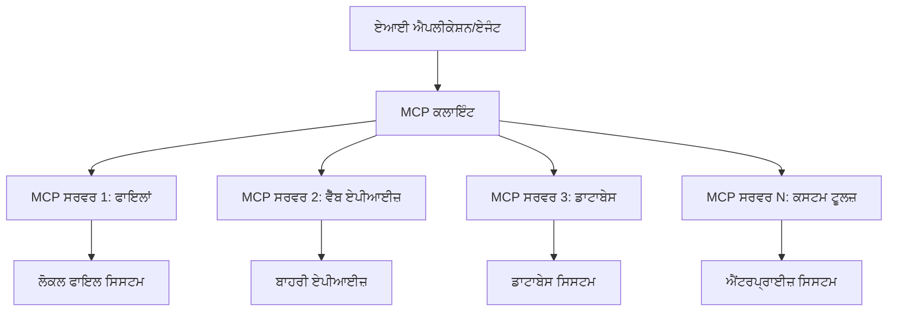

# 🌐 Module 2: MCP with Microsoft Foundry Toolkit Fundamentals

[]()
[]()
[]()

## 📋 ਲਰਨਿੰਗ ਉਦੇਸ਼

ਇਸ ਮੋਡੀਊਲ ਦੇ ਅੰਤ ਤੱਕ, ਤੁਸੀਂ ਇਹ ਸਮਝ ਸਕੋਗੇ:
- ✅ ਮਾਡਲ ਕੰਟੈਕਸਟ ਪ੍ਰੋਟੋਕੋਲ (MCP) ਦੀ ਬਣਤਰ ਅਤੇ ਲਾਭ
- ✅ ਮਾਈਕ੍ਰੋਸੌਫਟ ਦੇ MCP ਸਰਵਰ ਇਕੋਸਿਸਟਮ ਦੀ ਜਾਂਚ
- ✅ MCP ਸਰਵਰਾਂ ਨੂੰ Microsoft Foundry Toolkit Agent Builder ਨਾਲ ਜੋੜਨਾ
- ✅ Playwright MCP ਦੀ ਵਰਤੋਂ ਕਰਕੇ ਕਾਰਗਰ ਬ੍ਰਾਊਜ਼ਰ ਆਟੋਮੇਸ਼ਨ ਏਜੰਟ ਬਣਾਉਣਾ
- ✅ ਆਪਣੇ ਏਜੰਟਾਂ ਵਿੱਚ MCP ਟੂਲਾਂ ਨੂੰ ਸੰਰਚਿਤ ਅਤੇ ਟੈਸਟ ਕਰਨਾ
- ✅ ਪ੍ਰੋਡਕਸ਼ਨ ਲਈ MCP-ਪਾਵਰਡ ਏਜੰਟਾਂ ਦਾ ਐਕਸਪੋਰਟ ਅਤੇ ਡਿਪਲੌਇ ਕਰਨਾ

## 🎯 ਮੋਡੀਊਲ 1 ’ਤੇ ਨਿਰਮਾਣ ਕਰਨਾ

ਮੋਡੀਊਲ 1 ਵਿੱਚ, ਅਸੀਂ Microsoft Foundry Toolkit ਦੇ ਬੁਨਿਆਦੀ ਤੱਤਾਂ ਵਿੱਚ ਮਾਹਰਤਾ ਹਾਸਲ ਕੀਤੀ ਅਤੇ ਆਪਣਾ ਪਹਿਲਾ Python ਏਜੰਟ ਬਣਾਇਆ। ਹੁਣ ਅਸੀਂ ਤੁਹਾਡੇ ਏਜੰਟਾਂ ਨੂੰ **ਸੁਪਰਚਾਰ্জ** ਕਰਾਂਗੇ ਉਹਨਾਂ ਨੂੰ ਬਾਹਰੀ ਟੂਲਾਂ ਅਤੇ ਸੇਵਾਵਾਂ ਨਾਲ Model Context Protocol (MCP) ਰਾਹੀਂ ਜੋੜ ਕੇ।

ਇਸਨੂੰ ਸਮਝੋ ਜਿਵੇਂ ਕਿ ਇੱਕ ਸਧਾਰਨ ਕੈਲਕੁਲੇਟਰ ਤੋਂ ਪੂਰੇ ਕੰਪਿਊਟਰ ਵੱਲ ਅੱਪਗ੍ਰੇਡ ਕਰਨਾ - ਤੁਹਾਡੇ AI ਏਜੰਟ ਹੇਠ ਲਿਖੀਆਂ ਸਮਰੱਥਾਵਾਂ ਪ੍ਰਾਪਤ ਕਰ ਲੈਂਗੇ:
- 🌐 ਵੈੱਬਸਾਈਟਾਂ ਨੂੰ ਬ੍ਰਾਊਜ਼ ਅਤੇ ਇੰਟਰੈਕਟ ਕਰਨਾ
- 📁 ਫਾਈਲਾਂ ਤੱਕ ਪਹੁੰਚ ਅਤੇ ਉਨ੍ਹਾਂ ਨੂੰ ਸੰਜੋਣਾ
- 🔧 ਐਂਟਰਪ੍ਰਾਈਜ਼ ਸਿਸਟਮਾਂ ਨਾਲ ਇੰਟੀਗਰੇਸ਼ਨ
- 📊 APIs ਤੋਂ ਰੀਅਲ-ਟਾਈਮ ਡਾਟਾ ਪ੍ਰੋਸੈਸ ਕਰਨਾ

## 🧠 ਮਾਡਲ ਕੰਟੈਕਸਟ ਪ੍ਰੋਟੋਕੋਲ (MCP) ਨੂੰ ਸਮਝਣਾ

### 🔍 MCP ਕੀ ਹੈ?

Model Context Protocol (MCP) ਹੈ **"USB-Cs ਫਾਰ AI applications"** - ਇੱਕ ਇਨਕਲਾਬੀ ਖੁੱਲ੍ਹਾ ਮਾਪਦੰਡ ਜੋ ਵੱਡੇ ਭਾਸ਼ਾ ਮਾਡਲਾਂ (LLMs) ਨੂੰ ਬਾਹਰੀ ਟੂਲਾਂ, ਡਾਟਾ ਸਰੋਤਾਂ, ਅਤੇ ਸੇਵਾਵਾਂ ਨਾਲ ਜੋੜਦਾ ਹੈ। ਜਿਵੇਂ USB-C ਨੇ ਕੇਬਲ ਗੜਬੜ ਖਤਮ ਕਰਕੇ ਇੱਕ ਸਰਵਜਨਕ ਕਨੈਕਟਰ ਦਿੱਤਾ, MCP ਵੀ AI ਇੰਟੀਗ੍ਰੇਸ਼ਨ ਦੀ ਜਟਿਲਤਾ ਨੂੰ ਇੱਕ ਮਿਆਰੀ ਪ੍ਰੋਟੋਕੋਲ ਨਾਲ ਦੂਰ ਕਰਦਾ ਹੈ।

### 🎯 MCP ਕਿਹੜੀ ਸਮੱਸਿਆ ਹੱਲ ਕਰਦਾ ਹੈ

**MCP ਤੋਂ ਪਹਿਲਾਂ:**
- 🔧 ਹਰ ਟੂਲ ਲਈ ਕਸਟਮ ਇੰਟੀਗ੍ਰੇਸ਼ਨ
- 🔄 ਪ੍ਰੋਪ੍ਰਾਇਟਰੀ ਹਲਾਂ ਨਾਲ ਵੇਂਡਰ ਲੌਕ-ਇਨ  
- 🔒 ਐਡ-ਹੌਕ ਕਨੈਕਸ਼ਨਾਂ ਤੋਂ ਸੁਰੱਖਿਆ ਖਤਰੇ
- ⏱️ ਬੁਨਿਆਦੀ ਇੰਟੀਗ੍ਰੇਸ਼ਨਾਂ ਲਈ ਮਹੀਨੇ ਲੱਗਦੇ

**MCP ਨਾਲ:**
- ⚡ ਪਲੱਗ-ਐਂਡ-ਪਲੇ ਟੂਲ ਇੰਟੀਗ੍ਰੇਸ਼ਨ
- 🔄 ਵੇਂਡਰ ਅਗਨੋਸਟਿਕ ਆਰਕੀਟੈਕਚਰ
- 🛡️ ਬਿਲਟ-ਇਨ ਸੁਰੱਖਿਆ ਦੀਆਂ ਸਭ ਤੋਂ ਵਧੀਆ ਪ੍ਰਥਾਵਾਂ
- 🚀 ਨਵੇਂ ਸਮਰੱਥਾਵਾਂ ਸ਼ਾਮਲ ਕਰਨ ਵਿੱਚ ਮਿਨਟਾਂ

### 🏗️ MCP ਦੀ ਬਣਤਰ ਦੀ ਵਿਸਥਾਰਪੂਰਕ ਜਾਣਕਾਰੀ

MCP ਇੱਕ **ਕਲਾਇੰਟ-ਸਰਵਰ ਬਣਤਰ** ਦੀ ਪਾਲਣਾ ਕਰਦਾ ਹੈ ਜੋ ਇੱਕ ਸੁਰੱਖਿਅਤ, ਸਕੇਲਬਲ ਇਕੋਸਿਸਟਮ ਬਣਾਉਂਦਾ ਹੈ:



**🔧 ਮੁੱਖ ਭਾਗ:**

| ਭਾਗ | ਭੂਮਿਕਾ | ਉਦਾਹਰਨ |
|-----------|------|----------|
| **MCP ਮੇਜ਼ਬਾਨ** | ਐਪਲੀਕੇਸ਼ਨ ਜੋ MCP ਸੇਵਾਵਾਂ ਦੀ ਵਰਤੋਂ ਕਰਦੇ ਹਨ | Claude Desktop, VS Code, Microsoft Foundry Toolkit |
| **MCP ਕਲਾਇੰਟਸ** | ਪ੍ਰੋਟੋਕੋਲ ਹੈਂਡਲਰ (1:1 ਸਰਵਰ ਨਾਲ) | ਮੇਜ਼ਬਾਨ ਐਪਲੀਕੇਸ਼ਨਾਂ ਵਿੱਚ ਨਿਰਮਿਤ |
| **MCP ਸਰਵਰਸ** | ਮਿਆਰੀ ਪ੍ਰੋਟੋਕੋਲ ਰਾਹੀਂ ਸਮਰੱਥਾਵਾਂ ਪ੍ਰਦਰਸ਼ਿਤ ਕਰਦੇ ਹਨ | Playwright, Files, Azure, GitHub |
| **ਟਰਾਂਸਪੋਰਟ ਲੇਅਰ** | ਸੰਚਾਰ ਵਿਧੀਆਂ | stdio, HTTP, WebSockets |


## 🏢 Microsoft ਦੇ MCP ਸਰਵਰ ਇਕੋਸਿਸਟਮ

Microsoft ਇੱਕ ਵਿਸਤ੍ਰਿਤ ਏਂਟਰਪ੍ਰਾਈਜ਼-ਗਰੇਡ ਸਰਵਰਾਂ ਦੇ ਸੂਟ ਨਾਲ MCP ਇਕੋਸਿਸਟਮ ਦੀ ਅਗਵਾਈ ਕਰਦਾ ਹੈ ਜੋ ਹਕੀਕਤੀ ਦੁਨੀਆ ਦੇ ਕਾਰੋਬਾਰੀ ਜਰੂਰਤਾਂ ਨੂੰ ਪੂਰਾ ਕਰਦੇ ਹਨ।

### 🌟 Microsoft ਦੇ ਮੁੱਖ MCP ਸਰਵਰ

#### 1. ☁️ Azure MCP Server
**🔗 ਰਿਪੋਜ਼ਟਰੀ**: [azure/azure-mcp](https://github.com/azure/azure-mcp)
**🎯 ਮਕਸਦ**: AI ਇੰਟੀਗ੍ਰੇਸ਼ਨ ਨਾਲ ਵਿਆਪਕ Azure ਸਰੋਤ ਪ੍ਰਬੰਧਨ

**✨ ਮੁੱਖ ਵਿਸ਼ੇਸ਼ਤਾਵਾਂ:**
- ਸਰਚਨਾ ਅਭਿਆਸ ਬਿਆਨਕ
- ਰੀਅਲ-ਟਾਈਮ ਸਰੋਤ ਮਾਨੀਟਰਿੰਗ
- ਖ਼ਰਚ ਬੱਚਤ ਸਿਫ਼ਾਰਸ਼ਾਂ
- ਸੁਰੱਖਿਆ ਅਨੁਕੂਲਤਾ ਜਾਂਚ

**🚀 ਵਰਤੋਂ ਦੇ ਕੇਸ:**
- AI ਸਹਾਇਤਾ ਨਾਲ Infrastructure-as-Code
- ਆਟੋਮੈਟਿਕ ਸਰੋਤ ਸਕੇਲਿੰਗ
- ਕਲਾਉਡ ਖਰਚ ਬਚਤ
- DevOps ਵਰਕਫਲੋ ਆਟੋਮੇਸ਼ਨ

#### 2. 📊 Microsoft Dataverse MCP
**📚 ਦਸਤਾਵੇਜ਼ੀਕਰਨ**: [Microsoft Dataverse Integration](https://go.microsoft.com/fwlink/?linkid=2320176)
**🎯 ਮਕਸਦ**: ਕਾਰੋਬਾਰੀ ਡਾਟਾ ਲਈ ਕੁਦਰਤੀ ਭਾਸ਼ਾ ਇੰਟਰਫੇਸ

**✨ ਮੁੱਖ ਵਿਸ਼ੇਸ਼ਤਾਵਾਂ:**
- ਕੁਦਰਤੀ ਭਾਸ਼ਾ ਡਾਟਾਬੇਸ ਕਵੈਰੀਜ਼
- ਕਾਰੋਬਾਰੀ ਸੰਦੇਸ਼ ਸਮਝਣਾ
- ਕਸਟਮ ਪ੍ਰਾਂਪਟ ਟੈਂਪਲੇਟ
- ਐਂਟਰਪ੍ਰਾਈਜ਼ ਡਾਟਾ ਗਵਰਨੈਂਸ

**🚀 ਵਰਤੋਂ ਦੇ ਕੇਸ:**
- ਕਾਰੋਬਾਰੀ ਬੁੱਧਿਮਤਾ ਰਿਪੋਰਟਿੰਗ
- ਗਾਹਕ ਡਾਟਾ ਵਿਸ਼ਲੇਸ਼ਣ
- ਵਿਕਰੀ ਪਾਈਪਲਾਈਨ ਜਾਣਕਾਰੀ
- ਅਨੁਕੂਲਤਾ ਡਾਟਾ ਸਵਾਲ

#### 3. 🌐 Playwright MCP Server
**🔗 ਰਿਪੋਜ਼ਟਰੀ**: [microsoft/playwright-mcp](https://github.com/microsoft/playwright-mcp)
**🎯 ਮਕਸਦ**: ਬ੍ਰਾਊਜ਼ਰ ਆਟੋਮੇਸ਼ਨ ਅਤੇ ਵੈੱਬ ਇੰਟਰੈਕਸ਼ਨ ਸਮਰੱਥਾਵਾਂ

**✨ ਮੁੱਖ ਵਿਸ਼ੇਸ਼ਤਾਵਾਂ:**
- ਕ੍ਰਾਸ-ਬ੍ਰਾਊਜ਼ਰ ਆਟੋਮੇਸ਼ਨ (Chrome, Firefox, Safari)
- ਬੁੱਧੀਮਾਨ ਤੱਤ ਪਛਾਣ
- ਸਕ੍ਰੀਨਸ਼ਾਟ ਅਤੇ PDF ਜੇਨਰੇਸ਼ਨ
- ਨੈੱਟਵਰਕ ਟ੍ਰੈਫਿਕ ਮਾਨੀਟਰਨਗ

**🚀 ਵਰਤੋਂ ਦੇ ਕੇਸ:**
- ਆਟੋਮੇਟਡ ਟੈਸਟਿੰਗ ਵਰਕਫਲੋਜ਼
- ਵੈੱਬ ਸਕ੍ਰੈਪਿੰਗ ਅਤੇ ਡਾਟਾ ਐਕਸਟ੍ਰੈਕਸ਼ਨ
- UI/UX ਮਾਨੀਟਰਿੰਗ
- ਮੁਕਾਬਲਾਤੀ ਵਿਸ਼ਲੇਸ਼ਣ ਆਟੋਮੇਸ਼ਨ

#### 4. 📁 Files MCP Server
**🔗 ਰਿਪੋਜ਼ਟਰੀ**: [microsoft/files-mcp-server](https://github.com/microsoft/files-mcp-server)
**🎯 ਮਕਸਦ**: ਸਮਝਦਾਰ ਫਾਈਲ ਸਿਸਟਮ ਕੰਮ

**✨ ਮੁੱਖ ਵਿਸ਼ੇਸ਼ਤਾਵਾਂ:**
- ਬਿਆਨਕ ਫਾਈਲ ਪ੍ਰਬੰਧਨ
- ਸਮੱਗਰੀ ਸਮਨ্বਯ
- ਵਰਜਨ ਕੰਟਰੋਲ ਇੰਟੀਗ੍ਰੇਸ਼ਨ
- ਮੈਟਾ ਡਾਟਾ ਐਕਸਟ੍ਰੈਕਸ਼ਨ

**🚀 ਵਰਤੋਂ ਦੇ ਕੇਸ:**
- ਦਸਤਾਵੇਜ਼ ਪ੍ਰਬੰਧਨ
- ਕੋਡ ਰਿਪੋਜ਼ਟਰੀ ਆਯੋਜਨਾ
- ਸਮੱਗਰੀ ਪ੍ਰਕਾਸ਼ਨ ਵਰਕਫਲੋਜ਼
- ਡਾਟਾ ਪਾਈਪਲਾਈਨ ਫਾਈਲ ਹੈਂਡਲਿੰਗ

#### 5. 📝 MarkItDown MCP Server
**🔗 ਰਿਪੋਜ਼ਟਰੀ**: [microsoft/markitdown](https://github.com/microsoft/markitdown)
**🎯 ਮਕਸਦ**: ਉ avanzadoMarkdown ਪੈਸਿੰਗ ਅਤੇ ਮਿਊਟੀਲੇਸ਼ਨ

**✨ ਮੁੱਖ ਵਿਸ਼ੇਸ਼ਤਾਵਾਂ:**
- ਰਿਚ Markdown ਪਾਰਸਿੰਗ
- ਫਾਰਮੈਟ ਕਨਵਰਜ਼ਨ (MD ↔ HTML ↔ PDF)
- ਸਮੱਗਰੀ ਦੀ ਬਣਤਰ ਵਿਸ਼ਲੇਸ਼ਣ
- ਟੈਂਪਲੇਟ ਪ੍ਰੋਸੈਸਿੰਗ

**🚀 ਵਰਤੋਂ ਦੇ ਕੇਸ:**
- ਤਕਨੀਕੀ ਦਸਤਾਵੇਜ਼ ਵਰਕਫਲੋਜ਼
- ਸਮੱਗਰੀ ਪ੍ਰਬੰਧਨ ਪ੍ਰਣਾਲੀਆਂ
- ਰਿਪੋਰਟ ਜੇਨਰੇਸ਼ਨ
- ਗਿਆਨ ਅਧਾਰ ਆਟੋਮੇਸ਼ਨ

#### 6. 📈 Clarity MCP Server
**📦 ਪੈਕੇਜ**: [@microsoft/clarity-mcp-server](https://www.npmjs.com/package/@microsoft/clarity-mcp-server)
**🎯 ਮਕਸਦ**: ਵੈੱਬ ਵਿਸ਼ਲੇਸ਼ਣ ਅਤੇ ਉਪਭੋਗਤਾ ਵਿਹਾਰ ਸੂਝ

**✨ ਮੁੱਖ ਵਿਸ਼ੇਸ਼ਤਾਵਾਂ:**
- ਹੀਟਮੈਪ ਡਾਟਾ ਵਿਸ਼ਲੇਸ਼ਣ
- ਉਪਭੋਗਤਾ ਸੈਸ਼ਨ ਰਿਕਾਰਡਿੰਗਜ਼
- ਪ੍ਰਦਰਸ਼ਨ ਮੈਟਰਿਕਸ
- ਕਨਵਰਜ਼ਨ ਫਨਲ ਵਿਸ਼ਲੇਸ਼ਣ

**🚀 ਵਰਤੋਂ ਦੇ ਕੇਸ:**
- ਵੈੱਬਸਾਈਟ ਅਨੁਕੂਲਤਾ
- ਉਪਭੋਗਤਾ ਅਨੁਭਵ ਖੋਜ
- A/B ਟੈਸਟਿੰਗ ਵਿਸ਼ਲੇਸ਼ਣ
- ਕਾਰੋਬਾਰੀ ਬੁੱਧਿਮਤਾ ਡੈਸ਼ਬੋਰਡ

### 🌍 ਕਮਿਊਨਿਟੀ ਇਕੋਸਿਸਟਮ

Microsoft ਦੇ ਸਰਵਰਾਂ ਤੋਂ ਇਲਾਵਾ, MCP ਇਕੋਸਿਸਟਮ ਵਿੱਚ ਸ਼ਾਮਿਲ ਹਨ:
- **🐙 GitHub MCP**: ਰਿਪੋਜ਼ਟਰੀ ਪ੍ਰਬੰਧਨ ਅਤੇ ਕੋਡ ਵਿਸ਼ਲੇਸ਼ਣ
- **🗄️ ਡੇਟਾਬੇਸ MCPs**: PostgreSQL, MySQL, MongoDB ਇੰਟੀਗ੍ਰੇਸ਼ਨ
- **☁️ ਕਲਾਉਡ ਪ੍ਰਦਾਤਾ MCPs**: AWS, GCP, Digital Ocean ਟੂਲ
- **📧 ਸੰਚਾਰ MCPs**: Slack, Teams, Email ਇੰਟੀਗ੍ਰੇਸ਼ਨ

## 🛠️ ਹੱਥ-ਅਨ ਲੈਬ: ਬ੍ਰਾਊਜ਼ਰ ਆਟੋਮੇਸ਼ਨ ਏਜੰਟ ਬਣਾਉਣਾ

**🎯 ਪ੍ਰੋਜੈਕਟ ਟੀਚਾ**: Playwright MCP ਸਰਵਰ ਦੀ ਵਰਤੋਂ ਕਰਦਿਆਂ ਇੱਕ ਸਮਝਦਾਰ ਬ੍ਰਾਊਜ਼ਰ ਆਟੋਮੇਸ਼ਨ ਏਜੰਟ ਬਣਾਉਣਾ ਜੋ ਵੈੱਬਸਾਈਟਾਂ 'ਤੇ ਜਾ ਸਕੇ, ਜਾਣਕਾਰੀ ਨਿਕਾਲ ਸਕੇ ਅਤੇ ਜਟਿਲ ਵੈੱਬ ਇੰਟਰੈਕਸ਼ਨਾਂ ਨੂੰ ਕਰ ਸਕੇ।

### 🚀 ਚਰਨ 1: ਏਜੰਟ ਬੁਨਿਆਦੀ ਸੈਟਅਪ

#### ਕਦਮ 1: ਆਪਣੇ ਏਜੰਟ ਨੂੰ ਸ਼ੁਰੂ ਕਰੋ
1. **Microsoft Foundry Toolkit Agent Builder ਖੋਲ੍ਹੋ**
2. **ਨਵਾਂ ਏਜੰਟ ਬਣਾਓ** ਇਸ ਸੰਰਚਨਾ ਨਾਲ:
   - **ਨਾਂ**: `BrowserAgent`
   - **ਮਾਡਲ**: GPT-4o ਚੁਣੋ


### 🔧 ਚਰਨ 2: MCP ਇੰਟੀਗ੍ਰੇਸ਼ਨ ਵਰਕਫਲੋ

#### ਕਦਮ 3: MCP ਸਰਵਰ ਇੰਟੀਗ੍ਰੇਸ਼ਨ ਸ਼ਾਮਲ ਕਰੋ
1. **Agent Builder ਵਿੱਚ ਟੂਲ ਸੈਕਸ਼ਨ ਤੇ ਜਾਓ**
2. **"Add Tool" 'ਤੇ ਕਲਿਕ ਕਰੋ** ਇੰਟੀਗ੍ਰੇਸ਼ਨ ਮੀਨੂ ਖੋਲ੍ਹਣ ਲਈ
3. **ਉਪਲਬਧ ਵਿਕਲਪਾਂ ਵਿੱਚੋਂ "MCP Server" ਚੁਣੋ**


**🔍 ਟੂਲ ਕਿਸਮਾਂ ਨੂੰ ਸਮਝਣਾ:**
- **ਬਿਲਟ-ਇਨ ਟੂਲਜ਼**: ਪਹਿਲਾਂ ਤੋਂ ਸੰਰਚਿਤ Microsoft Foundry Toolkit ਫੰਕਸ਼ਨ
- **MCP ਸਰਵਰ**: ਬਾਹਰੀ ਸੇਵਾ ਇੰਟੀਗ੍ਰੇਸ਼ਨ
- **ਕਸਟਮ APIs**: ਤੁਹਾਡੇ ਖੁਦ ਦੇ ਸਰਵਿਸ ਐਂਡਪੌਇੰਟ
- **ਫੰਕਸ਼ਨ ਕਾਲਿੰਗ**: ਸਿੱਧਾ ਮਾਡਲ ਫੰਕਸ਼ਨ ਐਕਸੈੱਸ

#### ਕਦਮ 4: MCP ਸਰਵਰ ਚੋਣ
1. **"MCP Server" ਵਿਕਲਪ ਚੁਣੋ**


2. **ਇੰਟੀਗ੍ਰੇਸ਼ਨਾਂ ਦੀ ਲਿਸਟ ਵੇਖਣ ਲਈ MCP ਕੈਟਾਲਾਗ ਬ੍ਰਾਊਜ਼ ਕਰੋ**


### 🎮 ਚਰਨ 3: Playwright MCP ਸੰਰਚਨਾ

#### ਕਦਮ 5: Playwright ਚੁਣੋ ਅਤੇ ਸੰਰਚਿਤ ਕਰੋ
1. **"Use Featured MCP Servers" ਤੇ ਕਲਿਕ ਕਰੋ Microsoft ਦੇ ਪ੍ਰਮਾਣਿਤ ਸਰਵਰ ਤੱਕ ਪਹੁੰਚ ਲਈ**
2. **ਲਿਸਟ ਵਿੱਚੋਂ "Playwright" ਚੁਣੋ**
3. **ਡਿਫਾਲਟ MCP ID ਸਵੀਕਾਰ ਕਰੋ ਜਾਂ ਆਪਣੇ ਵਾਤਾਵਰਣ ਲਈ ਕਸਟਮਾਈਜ਼ ਕਰੋ**


#### ਕਦਮ 6: Playwright ਦੀਆਂ ਸਮਰੱਥਾਵਾਂ ਯੋਗ ਕਰੋ
**🔑 ਜ਼ਰੂਰੀ ਕਦਮ**: ਸਰਵਿਆਪਤ ਕਾਰਗੁਜ਼ਾਰੀ ਲਈ ਸਾਰੇ Playwright ਢੰਗਾਂ ਨੂੰ ਚੁਣੋ


**🛠️ ਮੁੱਖ Playwright ਟੂਲਜ਼:**
- **ਨੈਵੀਗੇਸ਼ਨ**: `goto`, `goBack`, `goForward`, `reload`
- **ਇੰਟਰੈਕਸ਼ਨ**: `click`, `fill`, `press`, `hover`, `drag`
- **ਐਕਸਟ੍ਰੈਕਸ਼ਨ**: `textContent`, `innerHTML`, `getAttribute`
- **ਪ੍ਰਮਾਣਿਕਤਾ**: `isVisible`, `isEnabled`, `waitForSelector`
- **ਕੈਪਚਰ**: `screenshot`, `pdf`, `video`
- **ਨੈੱਟਵਰਕ**: `setExtraHTTPHeaders`, `route`, `waitForResponse`

#### ਕਦਮ 7: ਇੰਟੀਗ੍ਰੇਸ਼ਨ ਦੀ ਸਫਲਤਾ ਦੀ ਪੁਸ਼ਟੀ ਕਰੋ
**✅ ਸਫਲਤਾ ਨਿਸ਼ਾਨ:**
- ਸਾਰੇ ਟੂਲ Agent Builder ਇੰਟਰਫੇਸ ਵਿੱਚ ਦਿੱਖ ਰਹੇ ਹਨ
- ਇੰਟੀਗ੍ਰੇਸ਼ਨ ਪੈਨਲ ਵਿੱਚ ਕੋਈ ਗਲਤੀ ਸੁਨੇਹੇ ਨਹੀਂ
- Playwright ਸਰਵਰ ਦੀ ਸਥਿਤੀ "Connected" ਦਿਖਾ ਰਹੀ ਹੈ


**🔧 ਆਮ ਸਮੱਸਿਆਵਾਂ ਅਤੇ ਹੱਲ:**
- **ਕਨੈਕਸ਼ਨ ਅਸਫਲ**: ਇੰਟਰਨੈੱਟ ਕਨੈਕਸ਼ਨ ਅਤੇ ਫਾਇਰਵਾਲ ਸੈਟਿੰਗਜ਼ ਦੀ ਜਾਂਚ ਕਰੋ
- **ਟੂਲ ਮੌਜੂਦ ਨਹੀਂ**: ਯਕੀਨ ਕਰੋ ਕਿ ਸਾਰੀਆਂ ਸਮਰੱਥਾਵਾਂ ਚੁਣੀਆਂ ਗਈਆਂ ਹਨ
- **ਪ੍ਰਮਿਸ਼ਨ ਚੁਕ**: VS Code ਕੋਲ ਲੋੜੀਂਦੇ ਪ੍ਰਣਾਲੀ ਅਧਿਕਾਰ ਹਨ ਇਹ ਚੈੱਕ ਕਰੋ

### 🎯 ਚਰਨ 4: ਅਡਵਾਂਸਡ ਪ੍ਰਾਂਪਟ ਇੰਜੀਨੀਅਰਿੰਗ

#### ਕਦਮ 8: ਸਮਝਦਾਰ ਸਿਸਟਮ ਪ੍ਰਾਂਪਟ ਡਿਜ਼ਾਈਨ ਕਰੋ
Playwright ਦੀਆਂ ਪੂਰੀਆਂ ਸਮਰੱਥਾਵਾਂ ਨੂੰ ਵਰਤਦੇ ਹੋਏ ਮਨੋਹਰ ਪ੍ਰਾਂਪਟ ਬਣਾਓ:

```markdown
# Web Automation Expert System Prompt

## Core Identity
You are an advanced web automation specialist with deep expertise in browser automation, web scraping, and user experience analysis. You have access to Playwright tools for comprehensive browser control.

## Capabilities & Approach
### Navigation Strategy
- Always start with screenshots to understand page layout
- Use semantic selectors (text content, labels) when possible
- Implement wait strategies for dynamic content
- Handle single-page applications (SPAs) effectively

### Error Handling
- Retry failed operations with exponential backoff
- Provide clear error descriptions and solutions
- Suggest alternative approaches when primary methods fail
- Always capture diagnostic screenshots on errors

### Data Extraction
- Extract structured data in JSON format when possible
- Provide confidence scores for extracted information
- Validate data completeness and accuracy
- Handle pagination and infinite scroll scenarios

### Reporting
- Include step-by-step execution logs
- Provide before/after screenshots for verification
- Suggest optimizations and alternative approaches
- Document any limitations or edge cases encountered

## Ethical Guidelines
- Respect robots.txt and rate limiting
- Avoid overloading target servers
- Only extract publicly available information
- Follow website terms of service
```

#### ਕਦਮ 9: ਡਾਇਨਾਮਿਕ ਯੂਜ਼ਰ ਪ੍ਰਾਂਪਟ ਬਣਾਓ
ਵੱਖ-ਵੱਖ ਸਮਰੱਥਾਵਾਂ ਨੂੰ ਦਰਸਾਉਣ ਵਾਲੇ ਪ੍ਰਾਂਪਟ ਬਣਾਓ:

**🌐 ਵੈੱਬ ਵਿਸ਼ਲੇਸ਼ਣ ਉਦਾਹਰਨ:**
```markdown
Navigate to github.com/kinfey and provide a comprehensive analysis including:
1. Repository structure and organization
2. Recent activity and contribution patterns  
3. Documentation quality assessment
4. Technology stack identification
5. Community engagement metrics
6. Notable projects and their purposes

Include screenshots at key steps and provide actionable insights.
```


### 🚀 ਚਰਨ 5: ਕਿਰਿਆਨਵਯਨ ਅਤੇ ਟੈਸਟਿੰਗ

#### ਕਦਮ 10: ਆਪਣੀ ਪਹਿਲੀ ਆਟੋਮੇਸ਼ਨ ਚਲਾਓ
1. **"Run" ਤੇ ਕਲਿਕ ਕਰਕੇ ਆਟੋਮੇਸ਼ਨ ਲਾਂਚ ਕਰੋ**
2. **ਰੀਅਲ-ਟਾਈਮ ਕਿਰਿਆ ਨਿਰੀਖਣ ਕਰੋ**:
   - Chrome ਬ੍ਰਾਊਜ਼ਰ ਆਟੋਮੈਟਿਕ ਖੁਲਦਾ ਹੈ
   - ਏਜੰਟ ਟਾਰਗੇਟ ਵੈੱਬਸਾਈਟ ਤੇ ਜਾਂਦਾ ਹੈ
   - ਹਰ ਮੁੱਖ ਕਦਮ ਦੀ ਸਕ੍ਰੀਨਸ਼ਾਟ ਲੈਂਦਾ ਹੈ
   - ਵਿਸ਼ਲੇਸ਼ਣ ਨਤੀਜੇ ਰੀਅਲ-ਟਾਈਮ ਵਿੱਚ ਆਉਂਦੇ ਹਨ


#### ਕਦਮ 11: ਨਤੀਜਿਆਂ ਅਤੇ ਸੂਝਾਂ ਦੀ ਵਿਸ਼ਲੇਸ਼ਣ ਕਰੋ
Agent Builder ਦੀ ਇੰਟਰਫੇਸ ਵਿੱਚ ਵਿਆਪਕ ਵਿਸ਼ਲੇਸ਼ਣ ਦੀ ਸਮੀਖਿਆ ਕਰੋ:


### 🌟 ਚਰਨ 6: ਅਡਵਾਂਸਡ ਸਮਰੱਥਾਵਾਂ ਅਤੇ ਡਿਪਲੌਇਮੈਂਟ

#### ਕਦਮ 12: ਐਕਸਪੋਰਟ ਅਤੇ ਪ੍ਰੋਡਕਸ਼ਨ ਡਿਪਲੌਇਮੈਂਟ
Agent Builder ਅਨੇਕ ਡਿਪਲੌਇਮੈਂਟ ਵਿਕਲਪ ਸਹਾਇਤਾ ਕਰਦਾ ਹੈ:


## 🎓 Module 2 ਸੰਖੇਪ ਅਤੇ ਅਗਲੇ ਕਦਮ

### 🏆 ਪ੍ਰਾਪਤੀ ਖੋਲ੍ਹੀ: MCP ਇੰਟੀਗ੍ਰੇਸ਼ਨ ਮਾਹਿਰ

**✅ ਮਾਹਰ ਹੈਂ:**
- [ ] MCP ਦੀ ਬਣਤਰ ਅਤੇ ਲਾਭ ਸਮਝਣਾ
- [ ] Microsoft ਦੇ MCP ਸਰਵਰ ਇਕੋਸਿਸਟਮ ਵਿੱਚ ਭਾਲ ਕਰਨਾ
- [ ] Playwright MCP ਨੂੰ Microsoft Foundry Toolkit ਨਾਲ ਜੋੜਨਾ
- [ ] ਸੁਧਰੇ ਹੋਏ ਬ੍ਰਾਊਜ਼ਰ ਆਟੋਮੇਸ਼ਨ ਏਜੰਟ ਬਣਾਉਣਾ
- [ ] ਵੈੱਬ ਆਟੋਮੇਸ਼ਨ ਲਈ ਅਗਾਂਹ ਪ੍ਰਾਂਪਟ ਇੰਜੀਨੀਅਰਿੰਗ

### 📚 ਵਾਧੂ ਸਾਧਨ

- **🔗 MCP ਵਿਸ਼ੇਸ਼ਗਤਾ**: [ਅਧਿਕਤਮ ਪ੍ਰੋਟੋਕੋਲ ਦਸਤਾਵੇਜ਼](https://modelcontextprotocol.io/)
- **🛠️ Playwright API**: [ਪੂਰੀ ਮੈਥਡ ਰੈਫਰੈਂਸ](https://playwright.dev/docs/api/class-playwright)
- **🏢 Microsoft MCP ਸਰਵਰਸ**: [ਐਂਟਰਪ੍ਰਾਈਜ਼ ਇੰਟੀਗ੍ਰੇਸ਼ਨ ਗਾਈਡ](https://github.com/microsoft/mcp-servers)
- **🌍 ਕਮਿਊਨਿਟੀ ਉਦਾਹਰਨਾਂ**: [MCP Server Gallery](https://github.com/modelcontextprotocol/servers)

**🎉 ਵਧਾਈਆਂ!** ਤੁਸੀਂ MCP ਇੰਟੀਗ੍ਰੇਸ਼ਨ ਵਿੱਚ ਸਫਲਤਾ ਹਾਸਲ ਕਰ ਲਈ ਹੈ ਅਤੇ ਹੁਣ ਤੁਸੀਂ ਬਾਹਰੀ ਟੂਲ ਸਮਰੱਥਾਵਾਂ ਵਾਲੇ ਪ੍ਰੋਡਕਸ਼ਨ-ਰੇਡੀ AI ਏਜੰਟ ਬਣਾ ਸਕਦੇ ਹੋ!


### 🔜 ਅਗਲੇ ਮੋਡੀਊਲ ਤੇ ਜਾਰੀ ਰੱਖੋ

ਆਪਣੀਆਂ MCP ਹੁਨਰਤਾਂ ਅਗਲੇ ਪੱਧਰ ’ਤੇ ਲੈ ਜਾਣ ਲਈ ਤਿਆਰ? ਅੱਗੇ ਵਧੋ **[Module 3: Advanced MCP Development with Microsoft Foundry Toolkit](../lab3/README.md)** ਜਿੱਥੇ ਤੁਸੀਂ ਸਿੱਖੋਗੇ:
- ਆਪਣੇ ਕਸਟਮ MCP ਸਰਵਰ ਬਣਾਉਣਾ
- ਨਵੀਂ MCP Python SDK ਸੰਰਚਿਤ ਅਤੇ ਵਰਤਣਾ
- MCP ਇੰਸਪੈਕਟਰ ਡਿਬੱਗਿੰਗ ਲਈ ਸੈੱਟਅਪ ਕਰਨਾ
- ਅਗਾਂਹ MCP ਸਰਵਰ ਵਿਕਾਸ ਵਰਕਫਲੋਜ਼ ਵਿੱਚ ਮਾਹਰ ਬਣਨਾ
- ਸ਼ੁਰੂ ਤੋਂ Weather MCP Server ਬਣਾਉਣਾ

---

<!-- CO-OP TRANSLATOR DISCLAIMER START -->
**ਅਸਵੀਕਾਰੋਪਣ**:
ਇਸ ਦਸਤਾਵੇਜ਼ ਦਾ ਅਨੁਵਾਦ ਏਆਈ ਅਨੁਵਾਦ ਸੇਵਾ [Co-op Translator](https://github.com/Azure/co-op-translator) ਦੀ ਵਰਤੋਂ ਕਰਕੇ ਕੀਤਾ ਗਿਆ ਹੈ। ਜਦੋਂ ਕਿ ਅਸੀਂ ਸਹੀਤਾਵਾਂ ਲਈ ਯਤਨਸ਼ੀਲ ਹਾਂ, ਕਿਰਪਾ ਕਰਕੇ ਧਿਆਨ ਰੱਖੋ ਕਿ ਸਵੈਚਾਲਿਤ ਅਨੁਵਾਦਾਂ ਵਿੱਚ ਗਲਤੀਆਂ ਜਾਂ ਅਸਮੱਤਿਆਵਾਂ ਹੋ ਸਕਦੀਆਂ ਹਨ। ਮੂਲ ਦਸਤਾਵੇਜ਼ ਆਪਣੀ ਮੂਲ ਭਾਸ਼ਾ ਵਿੱਚ ਅਧਿਕਾਰਕ ਸਰੋਤ ਮੰਨਿਆ ਜਾਣਾ ਚਾਹੀਦਾ ਹੈ। ਜਰੂਰੀ ਜਾਣਕਾਰੀ ਲਈ, ਪੇਸ਼ੇਵਰ ਮਨੁੱਖੀ ਅਨੁਵਾਦ ਦੀ ਸਿਫ਼ਾਰਸ਼ ਕੀਤੀ ਜਾਂਦੀ ਹੈ। ਅਸੀਂ ਇਸ ਅਨੁਵਾਦ ਦੇ ਉਪਯੋਗ ਤੋਂ ਪੈਦਾ ਹੋਣ ਵਾਲੀਆਂ ਕਿਸੇ ਵੀ ਗਲਤਫਹਿਮੀਆਂ ਜਾਂ ਗਲਤ ਵਿਆਖਿਆਵਾਂ ਲਈ ਜਵਾਬਦੇਹ ਨਹੀਂ ਹਾਂ।
<!-- CO-OP TRANSLATOR DISCLAIMER END -->