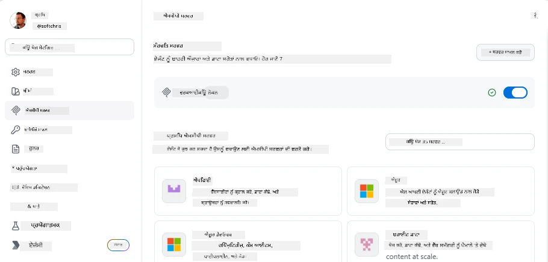
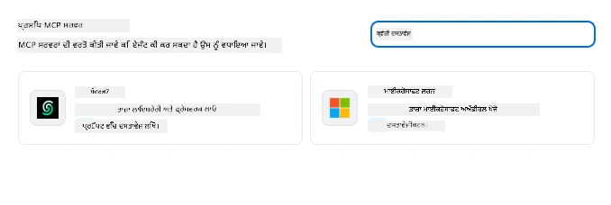
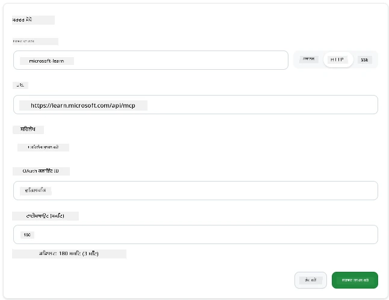
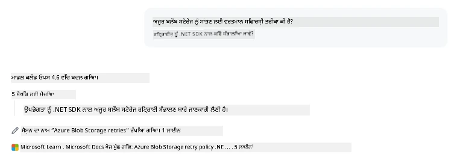
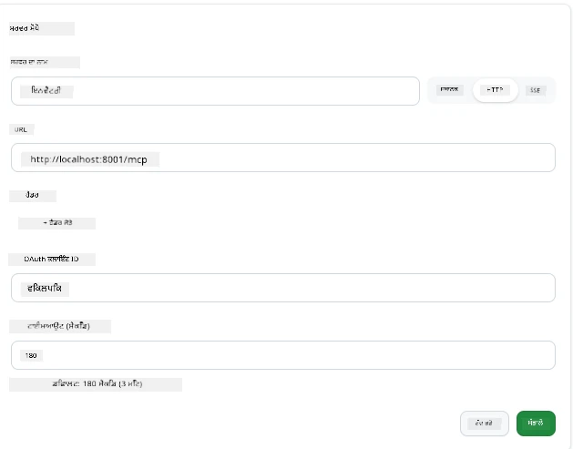
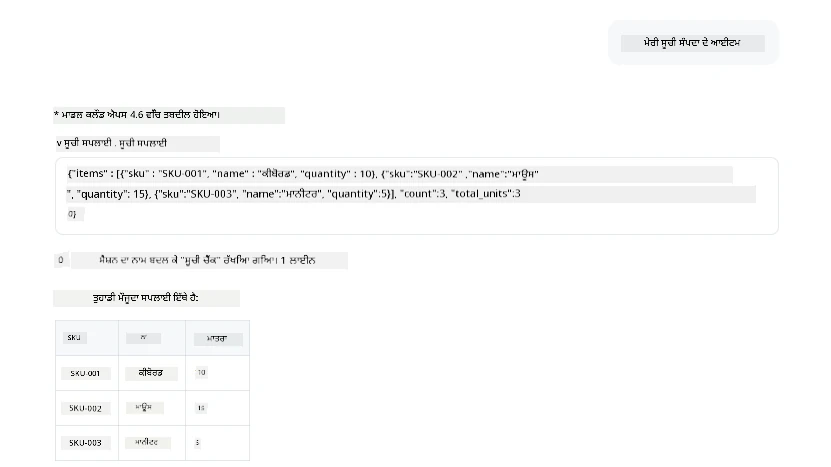
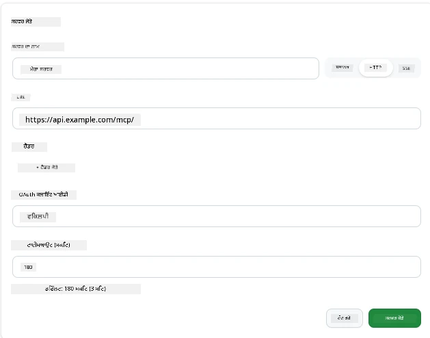
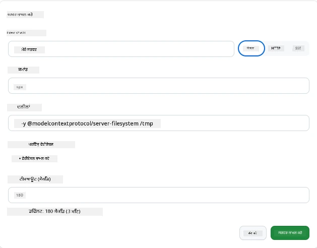

# GitHub Copilot ਐਪ ਵਿੱਚ MCP ਸਰਵਰਾਂ ਦੀ ਵਰਤੋਂ

ਹੁਣ ਤੱਕ ਤੁਹਾਨੂੰ ਪਤਾ ਹੈ ਕਿ MCP ਕਿਵੇਂ ਕੰਮ ਕਰਦਾ ਹੈ। ਤੁਸੀਂ ਸਰਵਰ ਬਣਾਏ ਹਨ, ਟੂਲਾਂ ਅਤੇ ਸਰੋਤਾਂ ਨੂੰ ਪਰਿਭਾਸ਼ਿਤ ਕੀਤਾ ਹੈ, ਅਤੇ ਕਲਾਇੰਟਾਂ ਨੂੰ ਜੁੜਿਆ ਹੈ। ਜੋ ਅਸੀਂ ਹਾਲੇ ਤੱਕ ਨਹੀਂ ਕੀਤਾ ਉਹ ਹੈ ਦ੍ਰਿਸ਼ਟੀਕੋਣ ਨੂੰ ਬਦਲਣਾ: ਤੁਸੀਂ ਸਰਵਰ ਬਣਾਉਣ ਵੱਲ ਨਹੀਂ, ਬਲਕਿ *ਖਪਤਕਾਰ* ਵਜੋਂ—ਇੱਕ ਐਆਈ-ਚਲਾਈ ਗਈ ਐਪ ਦੀ ਵਰਤੋਂ ਕਰਨ ਵਾਲੇ ਦੀ ਹੈ, ਜੋ MCP ਦਾ ਸਮਰਥਨ ਕਰਦੀ ਹੈ?

[GitHub Copilot ਐਪ](https://github.com/github/app) ਇੱਕ ਡੈਸਕਟਾਪ ਐਪ ਹੈ ਜੋ MCP ਸਰਵਰਾਂ ਦੀ ਵਰਤੋਂ ਕਰ ਸਕਦੀ ਹੈ। ਇਸ ਨੂੰ MCP ਸਰਵਰਾਂ ਨਾਲ ਜੁੜ ਕੇ, ਤੁਸੀਂ ਇੱਕ ਨਵਾਂ ਸਤਰ ਖੋਲ੍ਹਦੇ ਹੋ: ਕੋਪਾਇਲਟ ਹੁਣ ਤੁਹਾਡੇ ਦਸਤਾਵੇਜ਼ਾਂ ਵਿੱਚ ਦਾਖਲ ਹੋ ਸਕਦਾ ਹੈ, ਤੁਹਾਡੇ ਆੰਤਰੀਕ API ਕਾਲ ਕਰ ਸਕਦਾ ਹੈ, ਤੁਹਾਡੇ ਡੇਟਾਬੇਸ ਨੂੰ ਪੁੱਛ-ਗਿੱਛ ਕਰ ਸਕਦਾ ਹੈ, ਜਾਂ ਕਿਸੇ ਵੀ ਸੇਵਾ ਨਾਲ ਗੱਲਬਾਤ ਕਰ ਸਕਦਾ ਹੈ ਜੋ ਤੁਸੀਂ ਇੱਕ ਸਰਵਰ ਵਿੱਚ ਬੰਨ੍ਹੀ ਹੈ। ਐਪ ਮਾਲਿਕ ਬਣ ਜਾਂਦੀ ਹੈ; ਤੁਹਾਡੇ MCP ਸਰਵਰ ਉਸਦੇ ਟੂਲ ਬਣ ਜਾਂਦੇ ਹਨ।

ਇਹ ਪਾਠ ਤੁਹਾਨੂੰ ਉਸ ਅਨੁਭਵ ਵਿੱਚ ਪੂਰੀ ਤਰ੍ਹਾਂ ਲੈ ਕੇ ਜਾਂਦਾ ਹੈ—MCP ਸੈਟਿੰਗ ਪੈਨਲ ਲੱਭਣ ਤੋਂ ਲੈ ਕੇ ਇੱਕ ਅਸਲੀ ਦਸਤਾਵੇਜ਼ੀ ਸਰਵਰ ਨੂੰ ਜੋੜਨ ਅਤੇ ਫਿਰ ਆਪਣੇ ਬਣਾਏ ਹੋਏ ਇੱਕ ਕਸਟਮ ਸਰਵਰ ਨੂੰ ਜੁੜਨ ਤੱਕ।

## ਸਿੱਖਣ ਦੇ ਲਕੜਾਂ

ਇਸ ਪਾਠ ਦੇ ਅੰਤ ਤੱਕ, ਤੁਸੀਂ ਸਮਰੱਥ ਹੋਵੋਗੇ:

- Copilot ਐਪ ਦੀਆਂ ਸੈਟਿੰਗਜ਼ ਵਿੱਚ MCP ਸਰਵਰ ਪੈਨਲ ਨੂੰ ਲੱਭਣਾ ਅਤੇ ਸੰਚਾਲਨ ਕਰਨਾ।
- ਇੱਕ ਹੋਸਟ ਕੀਤੇ ਦਸਤਾਵੇਜ਼ੀ ਸਰਵਰ ਨਾਲ ਜੁੜਨਾ ਅਤੇ ਇੱਕ ਸੈਸ਼ਨ ਵਿੱਚ ਇਸ ਦੀ ਵਰਤੋਂ ਕਰਨਾ।
- ਇੱਕ ਕਸਟਮ ਸਰਵਰ ਨੂੰ ਰਜਿਸਟਰ ਕਰਨਾ ਅਤੇ ਪੱਕਾ ਕਰਨਾ ਕਿ Copilot ਇਸਦੇ ਟੂਲਾਂ ਨੂੰ ਕਾਲ ਕਰ ਸਕਦਾ ਹੈ।
- ਕਿਸੇ ਸਰਵਰ ਨੂੰ ਕਿਵੇਂ ਕਾਲ ਕੀਤਾ ਜਾਂਦਾ ਹੈ, ਇਹ ਠੀਕ ਕਰਨਾ ਚਾਹੁੰਦੇ ਹੋ ਤਾਂ ਜਾਂ ਤਾਂ Environment Variables ਜਾਂ ਕਸਟਮ Headers (ਜੇ HTTP ਹੈ) ਦੇ ਕੇ।

## Copilot ਐਪ ਇੱਕ MCP ਮਾਲਿਕ ਵਜੋਂ

ਇਹ ਮੁੱਢਲਾ ਵਿਚਾਰ ਹੈ: **Copilot ਦੇ ਏਜੰਟ ਸਮਰੱਥ ਹਨ, ਪਰ ਉਹ ਸਿਰਫ ਉਹੀ ਜਾਣਦੇ ਹਨ ਜੋ ਤੁਸੀਂ ਉਨ੍ਹਾਂ ਨੂੰ ਦੱਸਦੇ ਹੋ।** ਮੂਲ ਰੂਪ ਵਿੱਚ, ਏਜੰਟ ਤੁਸੀਂ ਜਿਸ ਵਰਕਸਪੇਸ ਵਿੱਚ ਹੋ ਉਸਦੇ ਫਾਈਲਾਂ ਪੜ੍ਹ ਸਕਦਾ ਹੈ ਅਤੇ ਟਰਮੀਨਲ ਹੁਕਮ ਚਲਾ ਸਕਦਾ ਹੈ, ਪਰ ਇਹ ਤੁਹਾਡੇ ਡੇਟਾਬੇਸ ਨੂੰ ਚੈੱਕ ਨਹੀਂ ਕਰ ਸਕਦਾ, ਤੁਹਾਡੇ ਕੈਲੰਡਰ ਨੂੰ ਨਹੀਂ ਦੇਖ ਸਕਦਾ, ਜਾਂ ਬਿਨਾਂ ਸਹਾਇਤਾ ਦੇ ਕਿਸੇ ਕਸਟਮ API ਨੂੰ ਕਾਲ ਨਹੀਂ ਕਰ ਸਕਦਾ। ਇੱਥੇ MCP ਸਰਵਰ ਹਰਜਾ ਕਰਦੇ ਹਨ। ਉਹ Copilot ਅਤੇ ਤੁਹਾਡੇ ਪ੍ਰਣਾਲੀਆਂ—ਡੇਟਾਬੇਸ, ਵਰਜਨ ਕੰਟਰੋਲ, API, ਡਿਜ਼ਾਈਨ ਟੂਲ—ਵਿੱਚ ਪੁਲ ਦਾ ਕੰਮ ਕਰਦੇ ਹਨ, ਏਜੰਟ ਨੂੰ ਉਹ ਜਾਣਕਾਰੀ ਅਤੇ ਕਾਰਵਾਈਆਂ ਮੁਹੱਈਆ ਕਰਵਾਉਂਦੇ ਹਨ ਜਿਹੜੀਆਂ ਉਹ ਕੰਮ ਮੁਕੰਮਲ ਕਰਨ ਲਈ ਲੋੜੀਂਦੀਆਂ ਹਨ।

ਆਓ ਸ਼ੁਰੂ ਕਰੀਏ ਤੁਹਾਡੇ ਐਪ ਦੇ MCP ਸਰਵਰਾਂ ਨੂੰ ਸੰਭਾਲਣ ਲਈ ਸੈਟਿੰਗਜ਼ ਦਾ ਪੈਨਲ ਲੱਭਣ ਤੋਂ।

## ਕਦਮ 1: MCP ਸੈਟਿੰਗ ਪੈਨਲ ਲੱਭਣਾ

Copilot ਐਪ ਖੋਲ੍ਹੋ ਅਤੇ ਹੇਠਾਂ-ਖੱਬੇ ਕੰਨੇ ਇੱਕ ਕਾਗ (ਗਿਅਰ) ਆਈਕਨ ਲੱਭੋ ਅਤੇ ਇਸ 'ਤੇ ਕਲਿਕ ਕਰੋ।


ਪੱਕਾ ਕਰੋ ਕਿ ਤੁਸੀਂ "MCP Servers" ਚੁਣਿਆ ਹੈ ਅਤੇ ਹੁਣ ਤੁਹਾਡੇ ਕੋਲ ਸਿਰ 'ਤੇ ਪਹਿਲਾਂ ਤੋਂ ਸੰਰਚਿਤ ਸਰਵਰਾਂ ਦੀ ਸੂਚੀ, ਥੱਲੇ ਇੱਕ ਲੋਕਪ੍ਰਿਯ ਸਰਵਰਾਂ ਦਾ ਮਾਰਕੀਟਪਲੇਸ, ਅਤੇ ਸਿਰ 'ਤੇ "Add Server" ਬਟਨ ਹੋਣਾ ਚਾਹੀਦਾ ਹੈ:



ਇਹ ਤੁਹਾਡਾ ਨਿਯੰਤਰਣ ਕੇਂਦਰ ਹੈ। ਤੁਸੀਂ ਇੱਥੇ ਸਰਵਰ ਜੋੜ, ਹਟਾ, ਸਮਰੱਥ ਕਰ, ਜਾਂ ਅਣਸਮਰੱਥ ਕਰ ਸਕਦੇ ਹੋ। ਤਬਦੀਲੀਆਂ ਨਵੇਂ ਸੈਸ਼ਨਾਂ ਲਈ ਲਾਗੂ ਹੁੰਦੀਆਂ ਹਨ; ਜੇ ਤੁਸੀਂ ਪਹਿਲਾਂ ਹੀ ਸੈਸ਼ਨ ਚਲਾ ਰਹੇ ਹੋ ਤਾਂ ਸੂਚੀ ਬਦਲਣ ਤੋਂ ਬਾਅਦ ਇੱਕ ਨਵਾਂ ਸੈਸ਼ਨ ਸ਼ੁਰੂ ਕਰਨਾ ਪਵੇਗਾ।

## ਕਦਮ 2: ਦਸਤਾਵੇਜ਼ੀ ਸਰਵਰ ਨੂੰ ਜੋੜਨਾ

ਇਕ ਤੁਰੰਤ ਲਾਭਦਾਇਕ ਚੀਜ਼ ਕਰਨ ਦਿਓ। Microsoft Docs MCP ਸਰਵਰ Copilot ਨੂੰ ਅਧਿਕਾਰਕ Microsoft ਦਸਤਾਵੇਜ਼ਾਂ ਤੱਕ ਪਹੁੰਚ ਦਿੰਦਾ ਹੈ। ਇੱਥੇ Azure, .NET, TypeScript, ਅਤੇ ਹੋਰ ਸ਼ਾਮਿਲ ਹਨ। ਇਸ ਵਿਚ ਏਜੰਟ ਆਪਣੇ ਟ੍ਰੇਨਿੰਗ ਡੇਟਾ (ਜੋ ਇੱਕ ਕਟਊਫ਼ ਮਿਤੀ ਰੱਖਦਾ ਹੈ) 'ਤੇ ਨਿਰਭਰ ਕਰਨ ਦੀ ਥਾਂ, ਸਮੇਂ 'ਤੇ ਮੌਜੂਦਾ ਦਸਤਾਵੇਜ਼ਾਂ ਨੂੰ ਖਿੱਚ ਸਕਦਾ ਹੈ।

ਇਸ ਨੂੰ ਸ਼ਾਮਿਲ ਕਰਨ ਦਾ ਤਰੀਕਾ:

1. ਲੋਕਪ੍ਰਿਯ ਸਰਵਰਾਂ ਦੇ ਗਰਿੱਡ ਵਿੱਚ, **learn** ਲਿਖੋ ਅਤੇ "Microsoft Learn" ਨਾਮ ਦੇ ਸਰਵਰ ਨੂੰ ਚੁਣੋ।

   

   ਜਦੋਂ ਤੁਸੀਂ ਕਲਿਕ ਕਰੋਗੇ, ਤੁਹਾਨੂੰ ਇੱਕ ਫਾਰਮ ਮਿਲੇਗਾ ਜਿਸ ਵਿੱਚ ਨਾਮ, ਟਰਾਂਸਪੋਰਟ ਕਿਸਮ ਅਤੇ URL ਪਹਿਲਾਂ ਹੀ ਭਰੇ ਹੋਏ ਹਨ, ਸਿਰਫ "Add Server" 'ਤੇ ਕਲਿਕ ਕਰੋ।

2. "Add Server" 'ਤੇ ਕਲਿਕ ਕਰੋ, ਕੁਝ ਸਕਿੰਟ ਲੱਗਣਗੇ ਸਰਵਰ ਨਾਲ ਜੁੜਨ ਲਈ।

   

   ਜੋੜਨ ਤੋਂ ਬਾਅਦ, ਇਹ ਸਿਰ 'ਤੇ ਸੰਰਚਿਤ ਸਰਵਰ ਵੱਜੋਂ ਦਿਖਾਈ ਦੇਵੇਗਾ। ਹੁਣ ਇਸ ਨੂੰ آزਮਾਉਣ ਦਾ ਸਮਾਂ ਹੈ।

3. ਡਾਇਲਾਗ ਬੰਦ ਕਰੋ ਅਤੇ Quick chat ਚੁਣੋ।

4. ਹੇਠਾਂ ਦਿੱਤਾ ਪ੍ਰੰਪਟ ਟਾਈਪ ਕਰੋ ਜੋ Microsoft Learn ਸਰਵਰ ਤੇ ਇੱਕ ਟੂਲ ਚਾਲੂ ਕਰੇ।

   ```text
   What's the current recommended approach for handling Azure Blob Storage 
   retries using the .NET SDK?
   ```

   

ਤੁਹਾਨੂੰ ਵੇਖਣਾ ਚਾਹੀਦਾ ਹੈ ਕਿ ਇਹ MCP ਸਰਵਰ ਦਾ ਹਵਾਲਾ ਕਿਵੇਂ ਦਿੰਦਾ ਹੈ ਜੋ ਅਸੀਂ ਹੁਣੇ ਜੋੜਿਆ।

## ਕਦਮ 3: ਇੱਕ ਕਸਟਮ stdio ਸਰਵਰ ਨਾਲ ਜੁੜਨਾ

ਪਹਿਲਾਂ ਖਾਸ ਸਰਵਰਾਂ ਦਾ ਪ੍ਰੀਸੈੱਟ ਦਾ ਸਹੂਲਤਮੰਦ ਹੈ, ਪਰ ਅਸਲੀ ਤਾਕਤ ਆਪਣਾ ਬਣਾਇਆ ਸਰਵਰ ਜੁੜਨ ਵਿੱਚ ਹੈ। ਕਹੋ ਕਿ ਤੁਸੀਂ ਇੱਕ ਸਰਵਰ ਬਣਾਇਆ ਹੈ (ਜਾਂ ਤੁਹਾਨੂੰ ਇੱਕ ਦਿੱਤਾ ਗਿਆ ਹੈ) ਜੋ ਤੁਹਾਡੇ ਆੰਤਰੀਕ API ਜਾਂ ਕੰਪਨੀ ਦੇ ਗਿਆਨ ਅਧਾਰ ਨੂੰ ਬਾਹਰ ਲਿਆਉਂਦਾ ਹੈ। ਇਸ ਮਾਮਲੇ ਵਿੱਚ, ਅਸੀਂ ਇੱਕ MCP ਸਰਵਰ ਵਰਤਾਂਗੇ ਜੋ ਅਸੀਂ ਬਣਾਇਆ ਹੈ ਅਤੇ ਜੋ ਸਾਡੇ ਕੰਪਨੀ ਦੇ ਇਨਵੈਂਟਰੀ ਪ੍ਰਬੰਧਨ ਨੂੰ ਹੈਂਡਲ ਕਰਦਾ ਹੈ।

1. ਕਾਗ 'ਤੇ ਕਲਿਕ ਕਰੋ ਅਤੇ ਫਿਰ "MCP servers" ਚੁਣੋ।

2. "Add Server" ਬਟਨ ਤੇ ਕਲਿਕ ਕਰੋ ਅਤੇ "+ Add Custom server" ਚੁਣੋ, ਤੇ ਥੱਲੇ ਦਿੱਤੇ ਮੁੱਲ ਦਿਓ:

   - ਨਾਮ: `Inventory Server`
   - ਟਰਾਂਸਪੋਰਟ ਚੁਣੋ (ਸੱਜੇ ਪਾਸੇ), **http**

   "Add Server" ਚੁਣੋ ਅਤੇ ਇਹ ਤੁਹਾਡੇ ਸੰਰਚਿਤ ਸਰਵਰਾਂ ਦੀ ਸੂਚੀ ਵਿੱਚ ਆ ਜਾਣਾ ਚਾਹੀਦਾ ਹੈ।

   

4. ਇਸ ਨੂੰ ਅਜ਼ਮਾਉਣ ਲਈ, ਹੇਠਾਂ ਦਿੱਤੇ ਪਰੰਪਟ ਨੂੰ ਚਲਾਓ:

    ```
    list inventory
    ```

   

   ਹੁਣ ਤੁਹਾਨੂੰ ਆਪਣੇ ਕਸਟਮ-ਬਣਾਏ ਸਰਵਰ ਤੋਂ ਇਨਵੈਂਟਰੀ ਆਈਟਮਾਂ ਦੀ ਸੂਚੀ ਮਿਲਣੀ ਚਾਹੀਦੀ ਹੈ।

ਵਧੀਆ, ਹੁਣ ਤੁਹਾਡੇ ਕੋਲ ਇੱਕ ਚੰਗੀ ਸਮਝ ਹੋਣੀ ਚਾਹੀਦੀ ਹੈ ਕਿ Copilot ਐਪ ਵਿੱਚ ਬਾਹਰੀ ਅਤੇ ਆਪਣੇ MCP ਸਰਵਰਾਂ ਨੂੰ ਕਿਵੇਂ ਜੋੜਿਆ ਜਾਂਦਾ ਹੈ। ਅਗਲੇ ਕਦਮ ਵਿੱਚ, ਆਓ ਗੱਲ ਕਰੀਏ ਸੁਰੱਖਿਆ ਅਤੇ environment variables ਨਾਲ ਜੁੜੇ ਮੁੱਦਿਆਂ ਦੀ।

## ਕਦਮ 4: ਉੱਨਤ ਸੈਟਿੰਗਜ਼

ਹੁਣ ਤਕ, ਤੁਸੀਂ ਦੇਖਿਆ ਕਿ MCP ਸਰਵਰ ਉਮੀਦ ਨਾਲ ਕਿਵੇਂ ਇੱਕ ਨਾਮ ਅਤੇ URL ਦਿੰਦੇ ਹੋ। ਪਰ ਜੇ ਤੁਹਾਡੇ ਸਰਵਰ ਨੂੰ API ਕੁੰਜੀ ਜਾਂ ਕੋਈ ਹੋਰ ਮੁੱਲ ਚਾਹੀਦਾ ਹੈ ਤਾਂ? ਟਰਾਂਸਪੋਰਟ ਕਿਸਮ ਦੇ ਅਨੁਸਾਰ, ਅਸੀਂ ਇਸ ਨੂੰ ਜੋ ਵੀ ਲੋੜੀਂਦਾ ਹੈ ਦਿੰਦੇ ਹਾਂ।

- **http ਜਾਂ SSE ਟਰਾਂਸਪੋਰਟ**: ਇੱਥੇ ਅਸੀਂ ਲੋੜ ਮੁਤਾਬਕ ਹੈਡਰ ਸੈੱਟ ਕਰ ਸਕਦੇ ਹਾਂ।

   ਅਥੇਂਟੀਕੇਸ਼ਨ ਲਈ, ਤੁਸੀਂ ਉਦਾਹਰਣ ਵਜੋਂ ਇੱਕ Authorization ਹੈਡਰ ਦੇ ਸਕਦੇ ਹੋ। ਮੁੱਲ ਇੱਕ ਸਥਿਰ ਸਤਰ ਹੋ ਸਕਦਾ ਹੈ। ਜੇ ਤੁਸੀਂ OAuth ਵਰਤਦੇ ਹੋ, ਤਾਂ ਤੁਸੀਂ ਇਸ ਨੂੰ OAuth ਕਲਾਇੰਟ ID ਦੇ ਸਕਦੇ ਹੋ।

   

- **stdio ਟਰਾਂਸਪੋਰਟ**: Environment Variables ਸੈੱਟ ਕੀਤੀ ਜਾ ਸਕਦੀਆਂ ਹਨ।

   ਇੱਥੇ ਤੁਸੀਂ ਜਿਹੜੇ ਵੀ environment variables ਚਾਹੀਦੇ ਹੋ ਉਹ ਦਿੰਦੇ ਹੋ ਜੋ ਸਰਵਰ ਚਾਲੂ ਕਰਦੇ ਸਮੇਂ ਦਿੱਤੇ ਜਾਣੇ ਚਾਹੀਦੇ ਹਨ।

   

## ਸੰਖੇਪ

Copilot ਐਪ MCP ਸਰਵਰਾਂ ਨੂੰ ਏਜੰਟ ਦੀਆਂ ਸਮਰੱਥਾਵਾਂ ਦੇ ਇੱਕ ਪਹਿਲੇ ਦਰਜੇ ਦੇ ਵਿਸਥਾਰ ਵਜੋਂ ਮੰਨਦਾ ਹੈ। ਤੁਸੀਂ ਇਸ ਪਾਠ ਵਿੱਚ MCP ਸਰਵਰਾਂ ਨੂੰ ਜੋੜਨ ਤੋਂ ਲੈ ਕੇ ਉਨ੍ਹਾਂ ਦੀ ਵਰਤੋਂ ਸੈਸ਼ਨ ਵਿੱਚ ਕਰਨ ਤੱਕ ਦਾ ਪੂਰਾ ਸਫ਼ਰ ਦੇਖਿਆ ਹੈ। ਹੁਣ ਤੁਸੀਂ ਜਨਤਕ ਸਰਵਰਾਂ, ਆੰਤਰੀਕ API, ਅਤੇ ਕਸਟਮ ਟੂਲਾਂ ਨਾਲ ਜੁੜ ਸਕਦੇ ਹੋ, ਜਿਸ ਨਾਲ ਤੁਹਾਡੇ ਏਜੰਟਾਂ ਨੂੰ ਉਹ ਜਾਣਕਾਰੀ ਅਤੇ ਕਾਰਵਾਈ ਕਰਨ ਦੀ ਸਮਰੱਥਾ ਮਿਲਦੀ ਹੈ ਜਿੰਨਾਂ ਨਾਲ ਉਹ ਸਵੈਚਾਲਤ ਤੌਰ ਤੇ ਕੰਮ ਮੁਕੰਮਲ ਕਰ ਸਕਦੇ ਹਨ।

## 📚 ਵਾਧੂ ਸਰੋਤ

### ਅਧਿਕਾਰਿਕ ਦਸਤਾਵੇਜ਼

- [GitHub Copilot App](https://github.com/github/app)
- [MCP Specification](https://modelcontextprotocol.io/specification/2025-03-26) - ਮਾਡਲ ਕੋਨਟੈਕਸਟ ਪ੍ਰੋਟੋਕੋਲ ਵਿਸ਼ੇਸ਼ਤਾ

### ਕਮਿਊਨਿਟੀ
- [MCP Community Discord](https://discord.com/invite/ByRwuEEgH4) - ਲਾਈਵ ਚਰਚਾਵਾਂ
- [GitHub Discussions](https://github.com/microsoft/MCP-Server-and-PostgreSQL-Sample-Retail/discussions) - ਪ੍ਰਸ਼ਨ-ਉੱਤਰ ਅਤੇ ਸਾਂਝਾ ਕਰਨਾ
- [Stack Overflow](https://stackoverflow.com/questions/tagged/model-context-protocol) - ਤਕਨੀਕੀ ਪ੍ਰਸ਼ਨ

---

<!-- CO-OP TRANSLATOR DISCLAIMER START -->
**ਅਸਵੀਕਾਰੋਪਣ**:
ਇਸ ਦਸਤਾਵੇਜ਼ ਦਾ ਅਨੁਵਾਦ ਏਆਈ ਅਨੁਵਾਦ ਸੇਵਾ [Co-op Translator](https://github.com/Azure/co-op-translator) ਦੀ ਵਰਤੋਂ ਕਰਕੇ ਕੀਤਾ ਗਿਆ ਹੈ। ਜਦੋਂ ਕਿ ਅਸੀਂ ਸਹੀਤਾਵਾਂ ਲਈ ਯਤਨਸ਼ੀਲ ਹਾਂ, ਕਿਰਪਾ ਕਰਕੇ ਧਿਆਨ ਰੱਖੋ ਕਿ ਸਵੈਚਾਲਿਤ ਅਨੁਵਾਦਾਂ ਵਿੱਚ ਗਲਤੀਆਂ ਜਾਂ ਅਸਮੱਤਿਆਵਾਂ ਹੋ ਸਕਦੀਆਂ ਹਨ। ਮੂਲ ਦਸਤਾਵੇਜ਼ ਆਪਣੀ ਮੂਲ ਭਾਸ਼ਾ ਵਿੱਚ ਅਧਿਕਾਰਕ ਸਰੋਤ ਮੰਨਿਆ ਜਾਣਾ ਚਾਹੀਦਾ ਹੈ। ਜਰੂਰੀ ਜਾਣਕਾਰੀ ਲਈ, ਪੇਸ਼ੇਵਰ ਮਨੁੱਖੀ ਅਨੁਵਾਦ ਦੀ ਸਿਫ਼ਾਰਸ਼ ਕੀਤੀ ਜਾਂਦੀ ਹੈ। ਅਸੀਂ ਇਸ ਅਨੁਵਾਦ ਦੇ ਉਪਯੋਗ ਤੋਂ ਪੈਦਾ ਹੋਣ ਵਾਲੀਆਂ ਕਿਸੇ ਵੀ ਗਲਤਫਹਿਮੀਆਂ ਜਾਂ ਗਲਤ ਵਿਆਖਿਆਵਾਂ ਲਈ ਜਵਾਬਦੇਹ ਨਹੀਂ ਹਾਂ।
<!-- CO-OP TRANSLATOR DISCLAIMER END -->