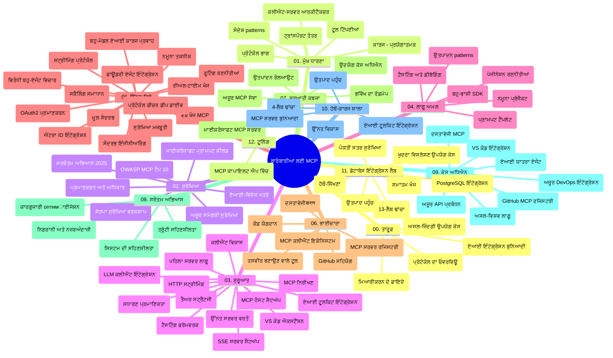

# ਮਾਡਲ ਸੰਦਰਭ ਪ੍ਰੋਟੋਕੋਲ (MCP) ਸ਼ੁਰੂਆਤੀ ਲਈ - ਅਧਿਐਨ ਮਾਰਗਦਰਸ਼ਿਕਾ

ਇਹ ਅਧਿਐਨ ਮਾਰਗਦਰਸ਼ਿਕਾ "ਮਾਡਲ ਸੰਦਰਭ ਪ੍ਰੋਟੋਕੋਲ (MCP) ਸ਼ੁਰੂਆਤੀ ਲਈ" ਕਰਿਕੁਲਮ ਲਈ ਰਿਪੋਜ਼ਿਟਰੀ ਦੀ ਰਚਨਾ ਅਤੇ ਸਮੱਗਰੀ ਦਾ ਇੱਕ ਜਾਇਜ਼ਾ ਪ੍ਰਦਾਨ ਕਰਦੀ ਹੈ। ਰਿਪੋਜ਼ਿਟਰੀ ਵਿੱਚ ਸਧਾਰਨ ਸੰਗਠਨ ਨਾਲ ਨੈਵੀਗੇਟ ਕਰਨ ਅਤੇ ਉਪਲਬਧ ਸਾਧਨਾਂ ਤੋਂ ਵਧੀਆ ਲਾਭ ਲੈਣ ਲਈ ਇਸ ਮਾਰਗਦਰਸ਼ਿਕਾ ਦੀ ਵਰਤੋਂ ਕਰੋ।

## ਰਿਪੋਜ਼ਿਟਰੀ ਜਾਇਜ਼ਾ

ਮਾਡਲ ਸੰਦਰਭ ਪ੍ਰੋਟੋਕੋਲ (MCP) ਏਆਈ ਮਾਡਲਾਂ ਅਤੇ ਕਲਾਇੰਟ ਐਪਲੀਕੇਸ਼ਨਾਂ ਦੇ ਵਿਚਕਾਰ ਇੰਟਰੈਕਸ਼ਨਾਂ ਲਈ ਇੱਕ ਮਿਆਰੀ ਢਾਂਚਾ ਹੈ। ਸ਼ੁਰੂਆਤੀ ਤੌਰ 'ਤੇ Anthropic ਵੱਲੋਂ ਬਣਾਇਆ ਗਿਆ, MCP ਹੁਣ ਆਧਿਕਾਰਕ GitHub ਸੰਸਥਾ ਰਾਹੀਂ MCP ਸਮੁਦਾਇ ਦੁਆਰਾ ਸੰਭਾਲਿਆ ਜਾਂਦਾ ਹੈ। ਇਹ ਰਿਪੋਜ਼ਿਟਰੀ AI ਵਿਕਾਸਕਾਰਾਂ, ਪ੍ਰਣਾਲੀ ਆਰਕੀਟੈਕਟਾਂ ਅਤੇ ਸਾਫਟਵੇਅਰ ਇੰਜੀਨੀਅਰਾਂ ਲਈ C#, ਜਾਵਾ, ਜਾਵਾਸਕ੍ਰਿਪਟ, ਪਾਇਥਨ ਅਤੇ ਟਾਈਪਸਕ੍ਰਿਪਟ ਵਿੱਚ ਹੱਥ-ਅਨੁਭਵ ਕੋਡ ਉਦਾਹਰਨਾਂ ਨਾਲ ਇੱਕ ਵਿਆਪਕ ਕਰਿਕੁਲਮ ਪ੍ਰਦਾਨ ਕਰਦੀ ਹੈ।

## ਵਿਜ਼ੂਅਲ ਕਰਿਕੁਲਮ ਨਕਸ਼ਾ

## ਰਿਪੋਜ਼ਿਟਰੀ ਸੰਰਚਨਾ

ਰਿਪੋਜ਼ਿਟਰੀ ਨੂੰ ਬਾਰਾਂ ਮੁੱਖ ਭਾਗਾਂ ਵਿੱਚ ਵੰਡਿਆ ਗਿਆ ਹੈ, ਹਰ ਇੱਕ MCP ਦੇ ਵੱਖ-ਵੱਖ ਪਹਿਰੂਆਂ 'ਤੇ ਧਿਆਨ ਕੇਂਦਰਤ ਕਰਦਾ ਹੈ:

1. **ਪ੍ਰਸਤਾਵਨਾ (00-Introduction/)**
   - ਮਾਡਲ ਸੰਦਰਭ ਪ੍ਰੋਟੋਕੋਲ ਦਾ ਜਾਇਜ਼ਾ
   - ਏਆਈ ਪਾਈਪਲਾਈਨਾਂ ਵਿੱਚ ਮਿਆਰੀਕਰਨ ਕਿਉਂ ਮਹੱਤਵਪੂਰਨ ਹੈ
   - ਵਿਹਤੀਕ ਵਰਤੋਂ ਦੇ ਕੇਸ ਅਤੇ ਲਾਭ

2. **ਮੁੱਖ ਧਾਰਨਾਵਾਂ (01-CoreConcepts/)**
   - ਕਲਾਇੰਟ-ਸਰਵਰ ਆਰਕੀਟੈਕਚਰ
   - ਪ੍ਰੋਟੋਕੋਲ ਦੇ ਮੁੱਖ ਤੇਹਤ
   - MCP ਵਿੱਚ ਸੰਦੇਸ਼ ਭੇਜਣ ਦੇ ਰੂਪ

3. **ਸੁਰੱਖਿਆ (02-Security/)**
   - MCP-ਆਧਾਰਿਤ ਪ੍ਰਣਾਲੀਆਂ ਵਿੱਚ ਸੁਰੱਖਿਆ ਖਤਰੇ
   - ਕਾਰਗਰ ਸੁਪਨ ਐਮਪਲੀਮੈਂਟੇਸ਼ਨ ਲਈ ਸਭ ਤੋਂ ਵਧੀਆ ਅਮਲ
   - ਪ੍ਰਮਾਣਿਕਤਾ ਅਤੇ ਅਧਿਕਾਰਣ ਰਣਨੀਤੀਆਂ
   - **ਸਮੱਗਰੀ ਸੁਰੱਖਿਆ ਦਸਤਾਵੇਜ਼**:
     - MCP ਸੁਰੱਖਿਆ ਸਭ ਤੋਂ ਵਧੀਆ ਅਮਲ 2025
     - ਐਜ਼ਯੂਰ ਸਮੱਗਰੀ ਸੁਰੱਖਿਆ ਅਮਲ ਮਾਰਗਦਰਸ਼ਿਕਾ
     - MCP ਸੁਰੱਖਿਆ ਨਿਯੰਤਰਣ ਅਤੇ ਤਕਨੀਕਾਂ
     - MCP ਸਭ ਤੋਂ ਵਧੀਆ ਅਮਲ ਕਿਊਕ ਰੇਫਰੰਸ
   - **ਮੁੱਖ ਸੁਰੱਖਿਆ ਵਿਸ਼ੇ**:
     - ਪ੍ਰੰਪਟ ਸੂਚਨਾ ਅਤੇ ਟੂਲ ਜਹਿਰੀਲਾ ਹਮਲੇ
     - ਸੈਸ਼ਨ ਹਾਈਜੈਕਿੰਗ ਅਤੇ ਗੁੰਝਲਦਾਰ ਡਿਪਟੀ ਸਮੱਸਿਆਵਾਂ
     - ਟੋਕਨ ਪਾਸਥਰੂ ਕਮਜ਼ੋਰੀਆਂ
     - ਅਤਿ ਅਧਿਕ ਅਧਿਕਾਰ ਅਤੇ ਪਹੁੰਚ ਨਿਯੰਤਰਣ
     - ਏਆਈ ਘਟਕਾਂ ਲਈ ਸਪਲਾਈ ਚੇਨ ਸੁਰੱਖਿਆ
     - ਮਾਈਕ੍ਰੋਸੌਫਟ ਪ੍ਰੰਪਟ ਸ਼ੀਲਡਜ਼ ਇੰਟਿਗ੍ਰੇਸ਼ਨ

4. **ਸ਼ੁਰੂਆਤ (03-GettingStarted/)**
   - ਵਾਤਾਵਰਣ ਸੈਟਅਪ ਅਤੇ ਸੰਰਚਨਾ
   - ਮੂਲ MCP ਸਰਵਰ ਅਤੇ ਕਲਾਇੰਟ ਬਣਾਉਣਾ
   - ਮੌਜੂਦਾ ਐਪਲੀਕੇਸ਼ਨਾਂ ਨਾਲ ਇੰਟਿਗ੍ਰੇਸ਼ਨ
   - ਸ਼ਾਮਿਲ ਹਿੱਸੇ:
     - ਪਹਿਲਾ ਸਰਵਰ ਅਮਲੀਕਰਨ
     - ਕਲਾਇੰਟ ਵਿਕਾਸ
     - LLM ਕਲਾਇੰਟ ਇੰਟਿਗ੍ਰੇਸ਼ਨ
     - VS ਕੋਡ ਇੰਟਿਗ੍ਰੇਸ਼ਨ
     - ਸਰਵਰ-ਸੈਂਟ ਇਵੈਂਟਸ (SSE) ਸਰਵਰ
     - ਉੱਚ ਪੱਧਰੀ ਸਰਵਰ ਵਰਤੋਂ
     - HTTP ਸਟਰੀਮਿੰਗ
     - ਏਆਈ ਟੂਲਕਿਟ ਇੰਟਿਗ੍ਰੇਸ਼ਨ
     - ਟੈਸਟਿੰਗ ਰਣਨੀਤੀਆਂ
     - ਡਿਪਲੌਇਮੈਂਟ ਮਾਰਗਦਰਸ਼ਨ

5. **ਵਿਆਵਹਾਰਿਕ ਅਮਲੀਕਰਨ (04-PracticalImplementation/)**
   - ਵੱਖ-ਵੱਖ ਭਾਸ਼ਾਵਾਂ ਵਿੱਚ SDKs ਦੀ ਵਰਤੋਂ
   - ਡਿਬੱਗਿੰਗ, ਟੈਸਟਿੰਗ ਅਤੇ ਪ੍ਰਮਾਣਿਕਤਾ ਤਕਨੀਕਾਂ
   - ਦੁਬਾਰਾ ਵਰਤੇ ਜਾਣ ਯੋਗ ਪ੍ਰੰਪਟ ਟੈਂਪਲੇਟਾਂ ਅਤੇ ਵਰਕਫਲੋਜ਼ ਬਣਾਉਣਾ
   - ਅਮਲੀ ਉਦਾਹਰਨਾਂ ਨਾਲ ਨਮੂਨਾ ਪ੍ਰਾਜੈਕਟ

6. **ਉੱਚ ਪੱਧਰੀ ਵਿਸ਼ੇ (05-AdvancedTopics/)**
   - ਸੰਦਰਭ ਇੰਜੀਨੀਅਰਿੰਗ ਤਕਨੀਕਾਂ
   - Foundry ਏਜੰਟ ਇਕੱਤਰ ਕਰਨ
   - ਬਹੁ-ਮੋਡਲ ਏਆਈ ਵਰਕਫਲੋਜ਼
   - OAuth2 ਪ੍ਰਮਾਣੀਕਰਨ ਡੈਮੋਜ਼
   - ਰੀਅਲ-ਟਾਈਮ ਖੋਜ ਸਮਰਥਾ
   - ਰੀਅਲ-ਟਾਈਮ ਸਟਰੀਮਿੰਗ
   - ਰੂਟ ਸੰਦਰਭ ਅਮਲੀਕਰਨ
   - ਰਾਊਟਿੰਗ ਰਣਨੀਤੀਆਂ
   - ਸੈਂਪਲਿੰਗ ਤਕਨੀਕਾਂ
   - ਸਕੇਲਿੰਗ ਰਵੱਈਏ
   - ਸੁਰੱਖਿਆ ਵਿਚਾਰਧਾਰਾ
   - Entra ID ਸੁਰੱਖਿਆ ਇੰਟੀਗ੍ਰੇਸ਼ਨ
   - ਵੈੱਬ ਖੋਜ ਇੰਟੀਗ੍ਰੇਸ਼ਨ
   - ਵਿਰੋਧੀ ਬਹੁ-ਏਜੰਟ ਤਰਕ (ਬਹਿਸ ਪੈਟਰਨ)

7. **ਕਮਿਊਨਿਟੀ ਯੋਗਦਾਨ (06-CommunityContributions/)**
   - ਕੋਡ ਅਤੇ ਦਸਤਾਵੇਜ਼ ਲਈ ਯੋਗਦਾਨ ਕਿਵੇਂ ਦੇਣਾ
   - GitHub ਰਾਹੀਂ ਸਹਿਯੋਗ
   - ਕਮਿਊਨਿਟੀ ਚਲਾਉਂਦੇ ਸੁਧਾਰ ਅਤੇ ਪ੍ਰਤੀਕਿਰਿਆ
   - ਵੱਖ-ਵੱਖ MCP ਕਲਾਇੰਟ ਦੀ ਵਰਤੋਂ (Claude ਡੈਸਕਟਾਪ, Cline, VSCode)
   - ਪ੍ਰਸਿੱਧ MCP ਸਰਵਰਾਂ ਨਾਲ ਕੰਮ, ਜਿਸ ਵਿੱਚ ਚਿੱਤਰ ਪੈਦਾ ਕਰਨ ਵੀ ਸ਼ਾਮਿਲ

8. **ਸ਼ੁਰੂਆਤੀ ਅਪਣਾਉਣ ਤੋਂ ਸਿੱਖਣ (07-LessonsfromEarlyAdoption/)**
   - ਅਸਲ ਜੀਵਨ ਅਮਲੀਕਰਨ ਅਤੇ ਸਫਲਤਾ ਕਹਾਣੀਆਂ
   - MCP-ਆਧਾਰਿਤ ਹੱਲ ਬਣਾਉਣਾ ਅਤੇ ਤਾਇਨਾਤੀ ਕਰਨਾ
   - ਰੁਝਾਨ ਅਤੇ ਭਵਿੱਖ ਨਕਸ਼ਾ
   - **ਮਾਈਕ੍ਰੋਸੌਫਟ MCP ਸਰਵਰ ਮਾਰਗਦਰਸ਼ਿਕਾ**: 10 ਉਤਪਾਦ ਤਿਆਰ ਮਾਈਕ੍ਰੋਸੌਫਟ MCP ਸਰਵਰਾਂ ਦਾ ਵਿਸ਼ਤ੍ਰਿਤ ਮਾਰਗਦਰਸ਼ਨ:
     - Microsoft Learn Docs MCP Server
     - Azure MCP Server (15+ ਵਿਸ਼ੇਸ਼ ਕੰਨੈਕਟਰ)
     - GitHub MCP Server
     - Azure DevOps MCP Server
     - MarkItDown MCP Server
     - SQL Server MCP Server
     - Playwright MCP Server
     - Dev Box MCP Server
     - Microsoft Foundry MCP Server
     - Microsoft 365 Agents Toolkit MCP Server

9. **ਸਭ ਤੋਂ ਵਧੀਆ ਅਮਲ (08-BestPractices/)**
   - ਪ੍ਰਦਰਸ਼ਨ ਸੁਧਾਰ ਅਤੇ ਅਪਟੀਮਾਈਜ਼ੇਸ਼ਨ
   - ਲਪੇਟ-ਮੁਖਤ MCP ਪ੍ਰਣਾਲੀਆਂ ਦੀ ਡਿਜ਼ਾਇਨ
   - ਟੈਸਟਿੰਗ ਅਤੇ ਹੌਂਸਲਾ ਬਰਕਰਾਰ ਰੱਖਣ ਦੀ ਰਣਨੀਤੀ

10. **ਕੇਸ ਅਧਿਐਨ (09-CaseStudy/)**
    - MCP ਦੀ ਵੱਖ-ਵੱਖ ਸਥਿਤੀਆਂ ਵਿੱਚ ਲਚਕਦਾਰੀ ਦਿਖਾਉਂਦੇ ਸੱਤ ਵਿਆਪਕ ਕੇਸ ਅਧਿਐਨ:
    - **Azure AI ਟ੍ਰੈਵਲ ਏਜੰਟ**: ਐਜ਼ਯੂਰ OpenAI ਅਤੇ AI ਖੋਜ ਨਾਲ ਬਹੁ-ਏਜੰਟ ਸੰਗਠਨ
    - **Azure DevOps ਇੰਟਿਗ੍ਰੇਸ਼ਨ**: ਯੂਟਿਊਬ ਡੇਟਾ ਅੱਪਡੇਟਸ ਨਾਲ ਵਰਕਫਲੋ ਪ੍ਰਕਿਰਿਆ ਸੰਚਾਲਨ
    - **ਰੀਅਲ-ਟਾਈਮ ਦਸਤਾਵੇਜ਼ ਪ੍ਰਾਪਤੀ**: ਪਾਇਥਨ ਕੰਸੋਲ ਕਲਾਇੰਟ ਸਟਰੀਮਿੰਗ HTTP ਨਾਲ
    - **ਇੰਟਰਐਕਟਿਵ ਅਧਿਐਨ ਯੋਜਨਾ ਜਨਰੇਟਰ**: Chainlit ਵੈੱਬ ਐਪ ਸੰਵਾਦਾਤਮਕ ਏਆਈ ਨਾਲ
    - **ਇਡੀਟਰ ਵਿੱਚ ਦਸਤਾਵੇਜ਼ਾਂ**: VS ਕੋਡ ਇੰਟਿਗ੍ਰੇਸ਼ਨ GitHub Copilot ਵਰਕਫਲੋਜ਼ ਨਾਲ
    - **Azure API ਪ੍ਰਬੰਧਨ**: MCP ਸਰਵਰ ਬਣਾਉਣ ਲਈ ਉਦਯੋਗ API ਇੰਟਿਗ੍ਰੇਸ਼ਨ
    - **GitHub MCP ਰਜਿਸਟਰੀ**: ਐਕੋ-ਸਿਸਟਮ ਵਿਕਾਸ ਅਤੇ ਏਜੰਟਿਕ ਪਲੇਟਫਾਰਮ ਇੰਟਿਗ੍ਰੇਸ਼ਨ
    - ਉਦਯੋਗ ਇੰਟਿਗ੍ਰੇਸ਼ਨ, ਵਿਕਾਸਕਾਰ ਉਤਪਾਦਕਤਾ ਅਤੇ ਐਕੋ-ਸਿਸਟਮ ਵਿਕਾਸ ਸੰਬੰਧੀ ਅਮਲੀ ਉਦਾਹਰਨਾਂ

11. **ਹੱਥ-ਅਨੁਭਵ ਵਰਕਸ਼ਾਪ (10-StreamliningAIWorkflowsBuildingAnMCPServerWithAIToolkit/)**
    - MCP ਅਤੇ ਏਆਈ ਟੂਲਕਿਟ ਦਾ ਜੋੜਾ ਨਾਲ ਵਿਆਪਕ ਹੱਥ-ਅਨੁਭਵ ਵਰਕਸ਼ਾਪ
    - ਸਮਝਦਾਰ ਐਪਲੀਕੇਸ਼ਨਾਂ ਦੀ ਬਿਲਡਿੰਗ ਜੋ ਏਆਈ ਮਾਡਲਾਂ ਨੂੰ ਅਸਲ ਦੁਨੀਆ ਦੇ ਟੂਲਾਂ ਨਾਲ ਜੋੜਦੀ ਹੈ
    - ਬੁਨਿਆਦੀ, ਜਾਣਵਾਲੇ ਸਰਵਰ ਵਿਕਾਸ ਅਤੇ ਉਤਪਾਦ ਤਾਇਨਾਤੀ ਰਣਨੀਤੀਆਂ ਨੂੰ ਕਵਰ ਕਰਨ ਵਾਲੇ ਲਾਗੂ ਮਾਡਿਊਲ
    - **ਲੈਬ ਸੰਰਚਨਾ**:
      - ਲੈਬ 1: MCP ਸਰਵਰ ਦੇ ਬੁਨਿਆਦਾਂ
      - ਲੈਬ 2: ਉੱਚ ਪੱਧਰੀ MCP ਸਰਵਰ ਵਿਕਾਸ
      - ਲੈਬ 3: ਏਆਈ ਟੂਲਕਿਟ ਇੰਟਿਗ੍ਰੇਸ਼ਨ
      - ਲੈਬ 4: ਉਤਪਾਦ ਤਾਇਨਾਤੀ ਅਤੇ ਸਕੇਲਿੰਗ
    - ਲੈਬ-ਆਧਾਰਿਤ ਸਿੱਖਿਆ ਪੈਲਾਂ ਨਾਲ ਕਦਮ-ਦਰ-ਕਦਮ ਸੂਚਨਾਵਾਂ

12. **MCP ਸਰਵਰ ਡੇਟਾਬੇਸ ਇੰਟਿਗ੍ਰੇਸ਼ਨ ਲੈਬਸ (11-MCPServerHandsOnLabs/)**
    - ਉਤਪਾਦ ਤਿਆਰ MCP ਸਰਵਰਾਂ ਦੀ ਨਿਰਮਾਣ ਲਈ 13-ਲੈਬ ਲਹਿਰਾਂ ਵਾਲਾ ਵਿਸ਼ਤ੍ਰਿਤ ਸਿੱਖਣ ਦਾ ਮਾਰਗ
    - Zava ਰੀਟੇਲ ਕੇਸ ਯੂਜ਼ ਦੇ ਨਾਲ ਅਸਲ ਦੁਨੀਆ ਦੀ ਰੀਟੇਲ ਵਿਸ਼ਲੇਸ਼ਣ ਅਮਲੀਕਰਨ
    - ਉਦਯੋਗ-ਗਰੇਡ ਪੈਟਰਨ ਜਿਵੇਂ ਰੋ ਲੇਵਲ ਸੁਰੱਖਿਆ (RLS), ਸਮਾਂਤੀ ਖੋਜ, ਅਤੇ ਬਹੁ-ਟੈਨੈਂਟ ਡੇਟਾ ਪਹੁੰਚ
    - **ਪੂਰੀ ਲੈਬ ਸੰਰਚਨਾ**:
      - **ਲੈਬ 00-03: ਬੁਨਿਆਦਾਂ** - ਪ੍ਰਸਤਾਵਨਾ, ਆਰਕੀਟੈਕਚਰ, ਸੁਰੱਖਿਆ, ਵਾਤਾਵਰਣ ਸੈਟਅਪ
      - **ਲੈਬ 04-06: MCP ਸਰਵਰ ਬਣਾਉਣਾ** - ਡੇਟਾਬੇਸ ਡਿਜ਼ਾਇਨ, MCP ਸਰਵਰ ਅਮਲੀਕਰਨ, ਟੂਲ ਵਿਕਾਸ
      - **ਲੈਬ 07-09: ਉੱਚ ਪੱਧਰੀ ਵਿਸ਼ੇਸ਼ਤਾਵਾਂ** - ਸਮਾਂਤੀ ਖੋਜ, ਟੈਸਟਿੰਗ ਅਤੇ ਡਿਬੱਗਿੰਗ, VS ਕੋਡ ਇੰਟਿਗ੍ਰੇਸ਼ਨ
      - **ਲੈਬ 10-12: ਉਤਪਾਦ ਅਤੇ ਸਭ ਤੋਂ ਵਧੀਆ ਅਮਲ** - ਤਾਇਨਾਤੀ, ਮੋਨੀਟਰਿੰਗ, ਅਪਟੀਮਾਈਜ਼ੇਸ਼ਨ
    - **ਸਮੱਗਰੀ ਟੈਕਨਾਲੋਜੀਆਂ**: FastMCP ਫਰੇਮਵਰਕ, PostgreSQL, ਐਜ਼ਯੂਰ OpenAI, ਐਜ਼ਯੂਰ ਕੰਟੇਨਰ ਐਪਸ, ਐਪਲੀਕੇਸ਼ਨ ਇਨਸਾਈਟ
    - **ਸਿੱਖਣ ਦੇ ਨਤੀਜੇ**: ਉਤਪਾਦ-ਤਿਆਰ MCP ਸਰਵਰ, ਡੇਟਾਬੇਸ ਇੰਟਿਗ੍ਰੇਸ਼ਨ ਪੈਟਰਨ, ਏਆਈ-ਸਾਹਾਇਤਾ ਵਾਲੀ ਵਿਸ਼ਲੇਸ਼ਣ, ਉਦਯੋਗ ਸੁਰੱਖਿਆ

13. **ਟੂਲਿੰਗ (12-tooling/)**
    - MCP ਦੀ ਵਰਤੋਂ Copilot ਐਪ ਅਤੇ ਹੋਰ ਟੂਲਾਂ ਵਿੱਚ ਸਿੱਖੋ

## ਵਾਧੂ ਸਰੋਤ

ਰਿਪੋਜ਼ਿਟਰੀ ਸਹਾਇਕ ਸਰੋਤ ਸ਼ਾਮਿਲ ਕਰਦਾ ਹੈ:

- **ਤਸਵੀਰਾਂ ਫੋਲਡਰ**: ਕਰਿਕੁਲਮ ਦੌਰਾਨ ਵਰਤੇ ਗਏ ਚਿੱਤਰ ਅਤੇ ਰੂਪਕ
- **ਅਨੁਵਾਦ**: ਦਸਤਾਵੇਜ਼ਾਂ ਦੇ ਸਵੈਚਲਿਤ ਅਨੁਵਾਦ ਨਾਲ ਬਹੁ-ਭਾਸ਼ਾਈ ਸਹਿਯੋਗ
- **ਆਧਿਕਾਰਕ MCP ਸਰੋਤ**:
  - [MCP ਦਸਤਾਵੇਜ਼](https://modelcontextprotocol.io/)
  - [MCP ਵਿਸ਼ੇਸ਼ਤਾ](https://spec.modelcontextprotocol.io/)
  - [MCP GitHub ਰਿਪੋਜ਼ਿਟਰੀ](https://github.com/modelcontextprotocol)

## ਇਸ ਰਿਪੋਜ਼ਿਟਰੀ ਦੀ ਵਰਤੋਂ ਕਿਵੇਂ ਕਰਨੀ ਹੈ

1. **ਕ੍ਰਮਵਾਰ ਸਿੱਖਿਆ**: ਇੱਕ ਵਿਵਸਥਿਤ ਸਿੱਖਣ ਲਈ ਅਧਿਆਇ (00 ਤੋਂ 11) ਦੀ ਕ੍ਰਮਪਾਲਣਾ ਕਰੋ।
2. **ਭਾਸ਼ਾ-ਵਿਸ਼ੇਸ਼ ਧਿਆਨ**: ਜੇ ਤੁਸੀਂ ਕਿਸੇ ਵਿਸ਼ੇਸ਼ ਪ੍ਰੋਗ੍ਰਾਮਿੰਗ ਭਾਸ਼ਾ ਵਿੱਚ ਦਿਲਚਸਪੀ ਰੱਖਦੇ ਹੋ, ਤਾਂ ਆਪਣੇ ਪਸੰਦੀਦਾ ਭਾਸ਼ਾ ਵਿੱਚ ਅਮਲੀਕਰਨਾਂ ਲਈ ਨਮੂਨਾ ਡਾਇਰੈਕਟਰੀਜ਼ ਦੀ ਜਾਂਚ ਕਰੋ।
3. **ਵਿਆਵਹਾਰਿਕ ਅਮਲੀਕਰਨ**: ਆਪਣੇ ਵਾਤਾਵਰਣ ਨੂੰ ਸੈਟਅਪ ਕਰਨ ਅਤੇ ਆਪਣਾ ਪਹਿਲਾ MCP ਸਰਵਰ ਅਤੇ ਕਲਾਇੰਟ ਬਣਾਉਣ ਲਈ "ਸ਼ੁਰੂਆਤ" ਭਾਗ ਨਾਲ ਸ਼ੁਰੂ ਕਰੋ।
4. **ਉੱਚ ਪੱਧਰੀ ਖੋਜ**: ਬੁਨਿਆਦਾਂ ਨੂੰ ਸਮਝ ਕੇ, ਆਪਣੇ ਗਿਆਨ ਨੂੰ ਵਧਾਉਣ ਲਈ ਉੱਚ ਪੱਧਰੀ ਵਿਸ਼ਿਆਂ ਵਿੱਚ ਡੁੱਬਕੀ ਲਗਾਓ।
5. **ਕਮਿਊਨਿਟੀ ਸ਼ਾਮਿਲ ਹੋਣਾ**: GitHub ਚਰਚਾ ਅਤੇ ਡਿਸਕੋਡ ਚੈਨਲਾਂ ਰਾਹੀਂ MCP ਕਮਿਊਨਿਟੀ ਨਾਲ ਜੁੜੋ, ਮਾਹਿਰਾਂ ਅਤੇ ਹੋਰ ਵਿਕਾਸਕਾਰਾਂ ਨਾਲ ਜੁੜੋ।

## MCP ਕਲਾਇੰਟ ਅਤੇ ਟੂਲ

ਕਰਿਕੁਲਮ ਵਿੱਚ ਵੱਖ-ਵੱਖ MCP ਕਲਾਇੰਟ ਅਤੇ ਟੂਲ ਸ਼ਾਮਿਲ ਹਨ:

1. **ਆਧਿਕਾਰਿਕ ਕਲਾਇੰਟ**:
   - ਵਿਜ਼ੂਅਲ ਸਟੂਡੀਓ ਕੋਡ
   - MCP ਵਿਜ਼ੂਅਲ ਸਟੂਡੀਓ ਕੋਡ ਵਿੱਚ
   - Claude ਡੈਸਕਟਾਪ
   - VSCode ਵਿੱਚ Claude
   - Claude API

2. **ਕਮਿਊਨਿਟੀ ਕਲਾਇੰਟ**:
   - Cline (ਟਰਮੀਨਲ-ਆਧਾਰਿਤ)
   - Cursor (ਕੋਡ ਸੰਪਾਦਕ)
   - ChatMCP
   - Windsurf

3. **MCP ਪ੍ਰਬੰਧਨ ਟੂਲ**:
   - MCP CLI
   - MCP ਮੈਨੇਜਰ
   - MCP ਲਿੰਕਰ
   - MCP ਰਾਊਟਰ

## ਪ੍ਰਸਿੱਧ MCP ਸਰਵਰ

ਰਿਪੋਜ਼ਿਟਰੀ ਵਿੱਚ ਵੱਖ-ਵੱਖ MCP ਸਰਵਰਾਂ ਦਾ ਪਰਚਿਆ ਕਰਨ:

1. **ਆਧਿਕਾਰਿਕ ਮਾਈਕ੍ਰੋਸੌਫਟ MCP ਸਰਵਰ**:
   - Microsoft Learn Docs MCP Server
   - Azure MCP Server (15+ ਵਿਸ਼ੇਸ਼ ਕੰਨੈਕਟਰ)
   - GitHub MCP Server
   - Azure DevOps MCP Server
   - MarkItDown MCP Server
   - SQL Server MCP Server
   - Playwright MCP Server
   - Dev Box MCP Server
   - Microsoft Foundry MCP Server
   - Microsoft 365 Agents Toolkit MCP Server

2. **ਆਧਿਕਾਰਿਕ ਰੈਫਰੈਂਸ ਸਰਵਰ**:
   - ਫਾਈਲਸਿਸਟਮ
   - ਫੈਚ
   - ਮੈਮੋਰੀ
   - ਸੀਕਵੇਂਸ਼ੀਅਲ ਸੋਚ

3. **ਚਿੱਤਰ ਪੈਦਾਵਾਰ**:
   - Azure OpenAI DALL-E 3
   - Stable Diffusion WebUI
   - Replicate

4. **ਵਿਕਾਸ ਟੂਲ**:
   - Git MCP
   - ਟਰਮੀਨਲ ਕੰਟਰੋਲ
   - ਕੋਡ ਅਸਿਸਟੈਂਟ

5. **ਵਿਸ਼ੇਸ਼ ਸਰਵਰ**:
   - Salesforce
   - Microsoft Teams
   - Jira & Confluence

## ਯੋਗਦਾਨ

ਇਹ ਰਿਪੋਜ਼ਿਟਰੀ ਕਮਿਊਨਿਟੀ ਵੱਲੋਂ ਯੋਗਦਾਨਾਂ ਦਾ ਸਵਾਗਤ ਕਰਦਾ ਹੈ। MCP ਐਕੋਸਿਸਟਮ ਵਿੱਚ ਪ੍ਰਭਾਵਸ਼ਾਲੀ ਯੋਗਦਾਨ ਦੇਣ ਲਈ ਕਮਿਊਨਿਟੀ ਯੋਗਦਾਨ ਭਾਗ ਦੇ ਮਦਦ ਨਿਰਦੇਸ਼ ਵੇਖੋ।

----

*ਇਹ ਅਧਿਐਨ ਮਾਰਗਦਰਸ਼ਿਕਾ ਆਖਰੀ ਵਾਰੀ 5 ਫਰਵਰੀ 2026 ਨੂੰ ਅਪਡੇਟ ਕੀਤੀ ਗਈ ਸੀ, ਜੋ MCP ਵਿਸ਼ੇਸ਼ਤਾ 2025-11-25 ਦੇ ਤਾਜ਼ਾ ਵਰਜਨ ਨੂੰ ਦਰਸਾਉਂਦੀ ਹੈ ਅਤੇ ਇਸ ਮਿਤੀ ਤੱਕ ਰਿਪੋਜ਼ਿਟਰੀ ਦਾ ਜਾਇਜ਼ਾ ਪ੍ਰਦਾਨ ਕਰਦੀ ਹੈ। ਇਸ ਮਿਤੀ ਤੋਂ ਬਾਅਦ ਸਮੱਗਰੀ ਅਪਡੇਟ ਹੋ ਸਕਦੀ ਹੈ।*

---

<!-- CO-OP TRANSLATOR DISCLAIMER START -->
**ਅਸਵੀਕਾਰੋਪਣ**:
ਇਸ ਦਸਤਾਵੇਜ਼ ਦਾ ਅਨੁਵਾਦ ਏਆਈ ਅਨੁਵਾਦ ਸੇਵਾ [Co-op Translator](https://github.com/Azure/co-op-translator) ਦੀ ਵਰਤੋਂ ਕਰਕੇ ਕੀਤਾ ਗਿਆ ਹੈ। ਜਦੋਂ ਕਿ ਅਸੀਂ ਸਹੀਤਾਵਾਂ ਲਈ ਯਤਨਸ਼ੀਲ ਹਾਂ, ਕਿਰਪਾ ਕਰਕੇ ਧਿਆਨ ਰੱਖੋ ਕਿ ਸਵੈਚਾਲਿਤ ਅਨੁਵਾਦਾਂ ਵਿੱਚ ਗਲਤੀਆਂ ਜਾਂ ਅਸਮੱਤਿਆਵਾਂ ਹੋ ਸਕਦੀਆਂ ਹਨ। ਮੂਲ ਦਸਤਾਵੇਜ਼ ਆਪਣੀ ਮੂਲ ਭਾਸ਼ਾ ਵਿੱਚ ਅਧਿਕਾਰਕ ਸਰੋਤ ਮੰਨਿਆ ਜਾਣਾ ਚਾਹੀਦਾ ਹੈ। ਜਰੂਰੀ ਜਾਣਕਾਰੀ ਲਈ, ਪੇਸ਼ੇਵਰ ਮਨੁੱਖੀ ਅਨੁਵਾਦ ਦੀ ਸਿਫ਼ਾਰਸ਼ ਕੀਤੀ ਜਾਂਦੀ ਹੈ। ਅਸੀਂ ਇਸ ਅਨੁਵਾਦ ਦੇ ਉਪਯੋਗ ਤੋਂ ਪੈਦਾ ਹੋਣ ਵਾਲੀਆਂ ਕਿਸੇ ਵੀ ਗਲਤਫਹਿਮੀਆਂ ਜਾਂ ਗਲਤ ਵਿਆਖਿਆਵਾਂ ਲਈ ਜਵਾਬਦੇਹ ਨਹੀਂ ਹਾਂ।
<!-- CO-OP TRANSLATOR DISCLAIMER END -->