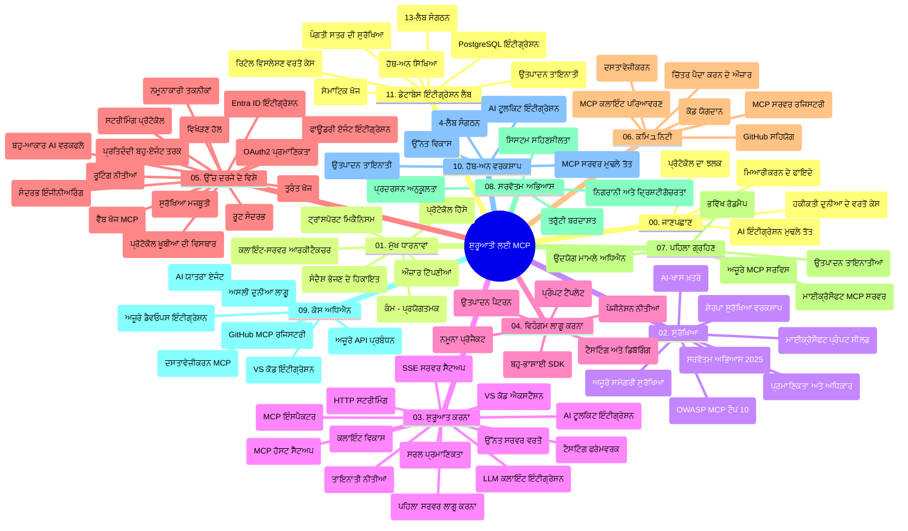

# ਮਾਡਲ ਕਾਂਟੈਕਸਟ ਪ੍ਰੋਟੋਕੋਲ (MCP) ਸ਼ੁਰੂਆਤੀ ਲਈ - ਅਧਿਐਨ ਮਾਰਗਦਰਸ਼ਿਕਾ

ਇਹ ਅਧਿਐਨ ਮਾਰਗਦਰਸ਼ਿਕਾ "ਮਾਡਲ ਕਾਂਟੈਕਸਟ ਪ੍ਰੋਟੋਕੋਲ (MCP) ਸ਼ੁਰੂਆਤੀ ਲਈ" ਕਰਿਕੁਲਮ ਲਈ ਰਿਪੋਜ਼ਿਟਰੀ ਦੀ ਸੰਰਚਨਾ ਅਤੇ ਸਮੱਗਰੀ ਦਾ ਸਮੀਖਿਆ ਪ੍ਰਦਾਨ ਕਰਦੀ ਹੈ। ਇਸ ਮਾਰਗਦਰਸ਼ਿਕਾ ਦੀ ਵਰਤੋਂ ਕਰਕੇ ਤੁਸੀਂ ਰਿਪੋਜ਼ਿਟਰੀ ਵਿੱਚ ਸੁਚੱਜੇ ਤਰੀਕੇ ਨਾਲ ਨੈਵੀਗੇਟ ਕਰ ਸਕਦੇ ਹੋ ਅਤੇ ਉਪਲਬਧ ਸਰੋਤਾਂ ਤੋਂ ਵੱਧ ਤੋਂ ਵੱਧ ਲਾਭ ਲੈ ਸਕਦੇ ਹੋ।

## ਰਿਪੋਜ਼ਿਟਰੀ ਦਾ ਸਾਰਾਂਸ਼

ਮਾਡਲ ਕਾਂਟੈਕਸਟ ਪ੍ਰੋਟੋਕੋਲ (MCP) ਇੱਕ ਮਿਆਰੀਕ੍ਰਿਤ ਫਰੇਮਵਰਕ ਹੈ ਜੋ AI ਮਾਡਲਾਂ ਅਤੇ ਕਲਾਇੰਟ ਐਪਲੀਕੇਸ਼ਨਾਂ ਵਿਚਕਾਰ ਇੰਟਰੈਕਸ਼ਨ ਲਈ ਹੈ। ਪਹਿਲਾਂ ਐਂਥਰੋਪਿਕ ਵੱਲੋਂ ਬਣਾਇਆ ਗਿਆ, MCP ਹੁਣ MCP ਸਮੁਦਾਇ ਦੇ ਨਾਲ ਨਾਲ ਅਧਿਕਾਰਿਕ GitHub ਸੰਸਥਾ ਦੁਆਰਾ ਸੰਭਾਲਿਆ ਜਾ ਰਿਹਾ ਹੈ। ਇਹ ਰਿਪੋਜ਼ਿਟਰੀ ਇੱਕ ਵਿਸ਼ਤਰੀਤ ਕਰਿਕੁਲਮ ਪ੍ਰਦਾਨ ਕਰਦੀ ਹੈ ਜਿਸ ਵਿੱਚ C#, ਜਾਵਾ, ਜਾਵਾਸਕ੍ਰਿਪਟ, ਪਾਇਥਨ, ਅਤੇ ਟਾਈਪਸਕ੍ਰਿਪਟ ਵਿੱਚ ਪ੍ਰਯੋਗਿਕ ਕੋਡ ਉਦਾਹਰਣਾਂ ਹਨ, ਜੋ AI ਡਿਵੈਲਪਰ, ਸਿਸਟਮ ਆਰਕੀਟੈਕਟ, ਅਤੇ ਸਾਫਟਵੇਅਰ ਇੰਜੀਨੀਅਰਾਂ ਲਈ ਬਣਾਈਆਂ ਗਈਆਂ ਹਨ।

## ਵਿਜ਼ੂਅਲ ਕਰਿਕੁਲਮ ਨਕਸ਼ਾ

## ਰਿਪੋਜ਼ਿਟਰੀ ਸੰਰਚਨਾ

ਰਿਪੋਜ਼ਿਟਰੀ ਨੂੰ ਗਿਆਰਾਂ ਮੁੱਖ ਹਿੱਸਿਆਂ ਵਿੱਚ ਵੰਡਿਆ ਗਿਆ ਹੈ, ਹਰ ਇੱਕ MCP ਦੇ ਵੱਖ-ਵੱਖ ਪੱਖਾਂ 'ਤੇ ਧਿਆਨ ਕੇਂਦ੍ਰਿਤ ਕਰਦਾ ਹੈ:

1. **ਪ੍ਰਸਤਾਵਨਾ (00-Introduction/)**
   - ਮਾਡਲ ਕਾਂਟੈਕਸਟ ਪ੍ਰੋਟੋਕੋਲ ਦਾ ਝਲਕ
   - AI ਪਾਈਪਲਾਈਨਾਂ ਵਿੱਚ ਮਿਆਰੀਕਰਨ ਕਿਉਂ ਜਰੂਰੀ ਹੈ
   - ਪ੍ਰਯੋਗਿਕ ਕੇਸ ਅਤੇ ਲਾਭ

2. **ਮੂਲ ਧਾਰਣਾਵਾਂ (01-CoreConcepts/)**
   - ਕਲਾਇੰਟ-ਸਰਵਰ ਆਰਕੀਟੈਕਚਰ
   - ਪ੍ਰੋਟੋਕੋਲ ਦੇ ਮੁੱਖ ਹਿੱਸੇ
   - MCP ਵਿੱਚ ਮੈਸੇਜਿੰਗ ਪੈਟਰਨ

3. **ਸੁਰੱਖਿਆ (02-Security/)**
   - MCP-ਆਧਾਰਿਤ ਸਿਸਟਮਾਂ ਵਿੱਚ ਸੁਰੱਖਿਆ ਖ਼ਤਰੇ
   - ਇੰਪਲੀਮੇਂਟੇਸ਼ਨ ਸੁਰੱਖਿਆ ਲਈ ਸ੍ਰੇਸ਼ਠ ਅਭਿਆਸ
   - ਪ੍ਰਮਾਣਿਕਤਾ ਅਤੇ ਪ੍ਰਾਪਤੀ ਨੀਤੀਆਂ
   - **ਵਿਆਪਕ ਸੁਰੱਖਿਆ ਦਸਤਾਵੇਜ਼**:
     - MCP ਸੁਰੱਖਿਆ ਲਈ ਸ੍ਰੇਸ਼ਠ ਪ੍ਰਥਾਵਾਂ 2025
     - Azure ਸਮੱਗਰੀ ਸੁਰੱਖਿਆ ਲਾਗੂ ਕਰਨ ਦੀ ਮਾਰਗਦਰਸ਼ਿਕਾ
     - MCP ਸੁਰੱਖਿਆ ਕੰਟਰੋਲ ਅਤੇ ਤਕਨੀਕਾਂ
     - MCP ਸ੍ਰੇਸ਼ਠ ਪ੍ਰਥਾਵਾਂ ਤੁਰੰਤ ਸੰਦਰਭ
   - **ਮੁੱਖ ਸੁਰੱਖਿਆ ਵਿਸ਼ੇ**:
     - ਪ੍ਰੰਪਟ ਇੰਜੈਕਸ਼ਨ ਅਤੇ ਟੂਲ ਜਹਿਰੀਲੇਕਰਨ ਹਮਲੇ
     - ਸੈਸ਼ਨ ਹਾਈਜੈਕਿੰਗ ਅਤੇ ਗੁੰਝਲਦਾਰ ਡਿਪਯੂ ਮੁੱਦੇ
     - ਟੋਕਨ ਪਾਸਥਰੂ ਕਮਜੋਰੀਆਂ
     - ਅਧਿਕਾਰ ਅਤੇ ਪਹੁੰਚ ਨਿਯੰਤਰਣ ਵਿੱਚ ਜ਼ਿਆਦਾ ਪਰਵਾਨਗੀਆਂ
     - AI ਕੰਪੋਨੇਟਾਂ ਲਈ ਸਪਲਾਈ ਚੇਨ ਸੁਰੱਖਿਆ
     - ਮਾਈਕ੍ਰੋਸਾਫਟ ਪ੍ਰੰਪਟ ਸ਼ੀਲਡਜ਼ ਇੰਟੀਗਰੇਸ਼ਨ

4. **ਸ਼ੁਰੂਾਤ ਕਰਨਾ (03-GettingStarted/)**
   - ਵਾਤਾਵਰਣ ਸੈਟਅਪ ਅਤੇ ਸੰਰਚਨਾ
   - ਮੂਲ MCP ਸਰਵਰ ਅਤੇ ਕਲਾਇੰਟ ਬਣਾਉਣਾ
   - ਮੌਜੂਦਾ ਐਪਲੀਕੇਸ਼ਨਾਂ ਨਾਲ ਇੰਟਿਗ੍ਰੇਸ਼ਨ
   - ਸ਼ਾਮਿਲ ਹਿੱਸੇ:
     - ਪਹਿਲਾ ਸਰਵਰ ਇੰਪਲੀਮੇਂਟੇਸ਼ਨ
     - ਕਲਾਇੰਟ ਵਿਕਾਸ
     - LLM ਕਲਾਇੰਟ ਇੰਟਿਗ੍ਰੇਸ਼ਨ
     - VS ਕੋਡ ਇੰਟਿਗ੍ਰੇਸ਼ਨ
     - ਸਰਵਰ-ਸੈਂਟ ਇਵੈਂਟਸ (SSE) ਸਰਵਰ
     - ਉੰਨਤ ਸਰਵਰ ਵਰਤੋਂ
     - HTTP ਸਟ੍ਰੀਮਿੰਗ
     - AI ਟੂਲਕਿਟ ਇੰਟਿਗ੍ਰੇਸ਼ਨ
     - ਟੈਸਟਿੰਗ ਰਣਨੀਤੀਆਂ
     - ਡਿਪਲੋਇਮੈਂਟ ਮਾਰਗਦਰਸ਼ਕ

5. **ਪ੍ਰਯੋਗਿਕ ਇੰਪਲੀਮੇਨਟੇਸ਼ਨ (04-PracticalImplementation/)**
   - ਵੱਖ-ਵੱਖ ਪ੍ਰੋਗ੍ਰਾਮਿੰਗ ਭਾਸ਼ਾਵਾਂ ਵਿੱਚ SDK ਦੀ ਵਰਤੋਂ
   - ਡਿਬੱਗਿੰਗ, ਟੈਸਟਿੰਗ ਅਤੇ ਪ੍ਰਮਾਣਿਕਤਾ ਤਕਨੀਕਾਂ
   - ਦੁਹਰਾਏ ਜਾ ਸਕਣ ਵਾਲੇ ਪ੍ਰੰਪਟ ਟੈਮਪਲੇਟ ਅਤੇ ਵਰਕਫਲੋ ਤਿਆਰ ਕਰਨਾ
   - ਅਮਲੀ ਪਰਿਯੋਜਨਾਵਾਂ ਅਤੇ ਉਦਾਹਰਣ

6. **ਉੰਨਤ ਵਿਸ਼ੇ (05-AdvancedTopics/)**
   - ਕਾਂਟੈਕਸਟ ਇੰਜੀਨੀਅਰਿੰਗ ਤਕਨੀਕਾਂ
   - ਫਾਊਂਡਰੀ ਏਜੰਟ ਇੰਟੀਗਰੇਸ਼ਨ
   - ਬਹੁ-ਮੋਡਲ AI ਵਰਕਫਲੋ
   - OAuth2 ਪ੍ਰਮਾਣਿਕਤਾ ਡੈਮੋਜ਼
   - ਰੀਅਲ-ਟਾਈਮ ਖੋਜ ਸਮਰੱਥਾ
   - ਰੀਅਲ-ਟਾਈਮ ਸਟ੍ਰੀਮਿੰਗ
   - ਰੂਟ ਕਾਂਟੈਕਸਟ ਇੰਪਲੀਮੇਂਟੇਸ਼ਨ
   - ਰੂਟਿੰਗ ਰਣਨੀਤੀਆਂ
   - ਸੈਂਪਲਿੰਗ ਤਕਨੀਕਾਂ
   - ਸਕੇਲਿੰਗ ਪਹੁੰਚ
   - ਸੁਰੱਖਿਆ ਪਰਵਾਈਆਂ
   - Entra ID ਸੁਰੱਖਿਆ ਇੰਟਿਗਰੇਸ਼ਨ
   - ਵੈੱਬ ਖੋਜ ਇੰਟੀਗ੍ਰੇਸ਼ਨ
   - ਵਿਰੋਧੀ ਬਹੁ-ਏਜੰਟ ਸੋਚ-ਵਿਚਾਰ (ਵਿਵਾਦ ਪੈਟਰਨ)

7. **ਕਮਿਊਨਿਟੀ ਯੋਗਦਾਨ (06-CommunityContributions/)**
   - ਕੋਡ ਅਤੇ ਦਸਤਾਵੇਜ਼ੀਕਰਨ ਵਿੱਚ ਯੋਗਦਾਨ ਦੇਣਾ
   - GitHub ਦੇ ਜ਼ਰੀਏ ਸਹਿਯੋਗ ਕਰਨਾ
   - ਕਮਿਊਨਿਟੀ-ਚਲਿਤ ਸੁਧਾਰ ਅਤੇ ਪ੍ਰਤੀਕ੍ਰਿਆ
   - ਵੱਖ-ਵੱਖ MCP ਕਲਾਇੰਟ ਵਰਤਣਾ (Claude ਡੈਸਕਟਾਪ, Cline, VSCode)
   - ਪ੍ਰਸਿੱਧ MCP ਸਰਵਰਾਂ ਨਾਲ ਕੰਮ ਕਰਨਾ ਜਿਨ੍ਹਾਂ ਵਿੱਚ ਚਿੱਤਰ ਜਨਰੇਸ਼ਨ ਸ਼ਾਮਿਲ ਹੈ

8. **ਸ਼ੁਰੂਆਤੀ ਗ੍ਰਹਿਣਆਂ ਤੋਂ ਸਿੱਖਿਆ (07-LessonsfromEarlyAdoption/)**
   - ਅਸਲੀ ਦੁਨੀਆ ਦੇ ਇੰਪਲੀਮੇਨਟੇਸ਼ਨ ਅਤੇ ਸਫਲਤਾ ਕਹਾਣੀਆਂ
   - MCP-ਆਧਾਰਿਤ ਸਮਾਧਾਨਾਂ ਦਾ ਨਿਰਮਾਣ ਅਤੇ ਡਿਪਲੋਇਮੈਂਟ
   - ਰੁਝਾਨ ਅਤੇ ਭਵਿੱਖ ਦੀ ਰੋਡਮੈਪ
   - **ਮਾਈਕ੍ਰੋਸਾਫਟ MCP ਸਰਵਰ ਗਾਈਡ**: 10 ਪ੍ਰੋਡਕਸ਼ਨ-ਰੈਡੀ ਮਾਈਕ੍ਰੋਸਾਫਟ MCP ਸਰਵਰਾਂ ਲਈ ਵਿਸ਼ਤਰੀਤ ਮਾਰਗਦਰਸ਼ਿਕਾ:
     - Microsoft Learn Docs MCP ਸਰਵਰ
     - Azure MCP ਸਰਵਰ (15+ ਵਿਸ਼ੇਸ਼ ਜੋੜਣ ਵਾਲੇ)
     - GitHub MCP ਸਰਵਰ
     - Azure DevOps MCP ਸਰਵਰ
     - MarkItDown MCP ਸਰਵਰ
     - SQL Server MCP ਸਰਵਰ
     - Playwright MCP ਸਰਵਰ
     - Dev Box MCP ਸਰਵਰ
     - Microsoft Foundry MCP ਸਰਵਰ
     - Microsoft 365 Agents Toolkit MCP ਸਰਵਰ

9. **ਸ੍ਰੇਸ਼ਠ ਅਭਿਆਸ (08-BestPractices/)**
   - ਪ੍ਰਦਰਸ਼ਨ ਸੁਧਾਰ ਅਤੇ ਅੱਪਟੀਮਾਈਜ਼ੇਸ਼ਨ
   - ਫਾਲਟ-ਟੋਲਰੈਂਟ MCP ਸਿਸਟਮ ਡਿਜ਼ਾਈਨ ਕਰਨਾ
   - ਟੈਸਟਿੰਗ ਅਤੇ ਲਚਕੀਲਾਪਣ ਨੀਤੀਆਂ

10. **ਕੇਸ ਸਟਡੀਜ਼ (09-CaseStudy/)**
    - **ਸੱਤ ਵਿਆਪਕ ਕੇਸ ਸਟਡੀਜ਼** ਜੋ MCP ਦੀ ਬਹੁਪੱਖੀਤਾ ਨੂੰ ਵਿਭਿੰਨ ਪਟਰੀਆਂ ਵਿੱਚ ਦਰਸਾਉਂਦੀਆਂ ਹਨ:
    - **Azure AI ਯਾਤਰਾ ਏਜੰਟ**: Azure OpenAI ਅਤੇ AI Search ਨਾਲ ਬਹੁ-ਏਜੰਟ ਅਯੋਜਨਾ
    - **Azure DevOps ਇੰਟੀਗਰੇਸ਼ਨ**: YouTube ਡਾਟਾ ਅਪਡੇਟ ਨਾਲ ਵਰਕਫਲੋ ਪ੍ਰਕਿਰਿਆ ਸਵੈਚਲਿਤ ਕਰਨਾ
    - **ਰੀਅਲ-ਟਾਈਮ ਦਸਤਾਵੇਜ਼ ਲਭਣਾ**: ਪਾਇਥਨ ਕੰਸੋਲ ਕਲਾਇੰਟ ਨਾਲ ਸਟ੍ਰੀਮਿੰਗ HTTP
    - **ਇੰਟਰਐਕਟਿਵ ਅਧਿਐਨ ਯੋਜਨਾ ਜਨਰੇਟਰ**: Chainlit ਵੈੱਬ ਐਪ ਵਿਚ ਗੱਲ-ਬਾਤਾਤਮਕ AI
    - **ਇਡੀਟਰ ਵਿੱਚ ਦਸਤਾਵੇਜ਼ੀਕਰਨ**: VS ਕੋਡ ਇੰਟਿਗ੍ਰੇਸ਼ਨ GitHub Copilot ਵਰਕਫਲੋਜ਼ ਨਾਲ
    - **Azure API ਪ੍ਰਬੰਧਨ**: MCP ਸਰਵਰ ਬਣਾਉਣ ਨਾਲ ਇੰਟਰਨਪ੍ਰਾਈਜ਼ API ਇੰਟੀਗ੍ਰੇਸ਼ਨ
    - **GitHub MCP ਰਜਿਸਟਰੀ**: ਈਕੋਸਿਸਟਮ ਵਿਕਾਸ ਅਤੇ ਏਜੰਟਿਕ ਪਲੇਟਫਾਰਮ ਇੰਟੀਗ੍ਰੇਸ਼ਨ
    - ਇੰਪਲੀਮੇਨਟੇਸ਼ਨ ਉਦਾਹਰਣ ਜੋ ਇੰਟਰਨਪ੍ਰਾਈਜ਼ ਇੰਟੀਗ੍ਰੇਸ਼ਨ, ਵਿਕਾਸਕਾਰ ਉਤਪਾਦਕਤਾ, ਅਤੇ ਈਕੋਸਿਸਟਮ ਵਿਕਾਸ ਨੂੰ ਕਵਰ ਕਰਦੀਆਂ ਹਨ

11. **ਹੈਂਡਜ਼-ਆਨ ਵਰਕਸ਼ਾਪ (10-StreamliningAIWorkflowsBuildingAnMCPServerWithAIToolkit/)**
    - MCP ਅਤੇ AI ਟੂਲਕਿਟ ਨੂੰ ਜੋੜਦਿਆਂ ਵਿਸ਼ਤਰੀਤ ਹੈਂਡਜ਼-ਆਨ ਵਰਕਸ਼ਾਪ
    - ਬੁਧੀਮਾਨ ਐਪਲੀਕੇਸ਼ਨਾਂ ਦਾ ਨਿਰਮਾਣ ਜੋ AI ਮਾਡਲਾਂ ਨੂੰ ਅਸਲੀ ਦੁਨੀਆ ਦੇ ਟੂਲਜ਼ ਨਾਲ ਜੋੜਦੇ ਹਨ
    - ਮੂਲ ਸਿਧਾਂਤ, ਕਸਟਮ ਸਰਵਰ ਵਿਕਾਸ, ਅਤੇ ਉਤਪਾਦਨ ਡਿਪਲੋਇਮੈਂਟ ਰਣਨੀਤੀਆਂ ਸਬੰਧੀ ਵਿਹੰਗਮ ਮਾਡਿਊਲ
    - **ਲੇਬ ਸੰਰਚਨਾ**:
      - ਲੈਬ 1: MCP ਸਰਵਰ ਮੁਢਲੇ ਤੱਥ
      - ਲੈਬ 2: ਉੰਨਤ MCP ਸਰਵਰ ਵਿਕਾਸ
      - ਲੈਬ 3: AI ਟੂਲਕਿਟ ਇੰਟੀਗਰੇਸ਼ਨ
      - ਲੈਬ 4: ਉਤਪਾਦਨ ਡਿਪਲੋਇਮੈਂਟ ਅਤੇ ਸਕੇਲਿੰਗ
    - ਧਾਰਾਬੱਧ ਦਿਸ਼ਾ-ਨਿਰਦੇਸ਼ਾਂ ਨਾਲ ਲੈਬ-ਆਧਾਰਿਤ ਸਿੱਖਿਆ

12. **MCP ਸਰਵਰ ਡੇਟਾਬੇਸ ইੰਟੀਗਰੇਸ਼ਨ ਲੈਬਜ਼ (11-MCPServerHandsOnLabs/)**
    - **ਪੋਸਟਗਰੇSQL ਇੰਟੀਗਰੇਸ਼ਨ ਨਾਲ ਉਤਪਾਦਨ-ਤਯਾਰ MCP ਸਰਵਰ ਬਣਾਉਣ ਲਈ 13-ਲੈਬ ਸਿਖਲਾਈ ਰਾਹ**
    - **ਅਸਲੀ ਦੁਨੀਆਂ ਦੇ ਰਿਟੇਲ ਵਿਸ਼ਲੇਸ਼ਣ ਕਾ ਅਮਲੀ ਕਰਨਾ Zava Retail ਉਪਯੋਗ ਕੇਸ ਨਾਲ**
    - **ਇੰਟਰਨਪ੍ਰਾਈਜ਼ ਡਿਜ਼ਾਈਨਾਂ** ਯਥਾਰਥ ਸਤਹ ਸੁਰੱਖਿਆ (RLS), ਸੈਮਾਂਟਿਕ ਖੋਜ, ਅਤੇ ਬਹੁ-ਕਿਰਾਏਦਾਰ ਡੇਟਾ ਪਹੁੰਚ ਸਮੇਤ
    - **ਪੂਰੀ ਲੈਬ ਸੰਰਚਨਾ**:
      - **ਲੈਬ 00-03: ਬੁਨਿਆਦੀਆਂ** - ਪਰਚਯ, ਆਰਕੀਟੈਕਚਰ, ਸੁਰੱਖਿਆ, ਵਾਤਾਵਰਣ ਸੈਟਅਪ
      - **ਲੈਬ 04-06: MCP ਸਰਵਰ ਬਣਾਉਣਾ** - ਡੇਟਾਬੇਸ ਡਿਜ਼ਾਈਨ, MCP ਸਰਵਰ ਇੰਪਲੀਮੇਂਟੇਸ਼ਨ, ਟੂਲ ਵਿਕਾਸ
      - **ਲੈਬ 07-09: ਉਨਤ ਵਿਸ਼ੇਸ਼ਤਾਵਾਂ** - ਸੈਮਾਂਟਿਕ ਖੋਜ, ਟੈਸਟਿੰਗ ਅਤੇ ਡਿਬੱਗਿੰਗ, VS ਕੋਡ ਇੰਟਿਗਰੇਸ਼ਨ
      - **ਲੈਬ 10-12: ਉਤਪਾਦਨ ਅਤੇ ਸ੍ਰੇਸ਼ਠ ਪ੍ਰਥਾਵਾਂ** - ਡਿਪਲੋਇਮੈਂਟ, ਨਿਗਰਾਨੀ, ਅੱਪਟੀਮਾਈਜ਼ੇਸ਼ਨ
    - **ਸੰਭਾਵਿਤ ਤਕਨੀਕਾਂ**: FastMCP ਫਰੇਮਵਰਕ, PostgreSQL, Azure OpenAI, Azure Container Apps, ਐਪਲੀਕੇਸ਼ਨ ਇੰਸਾਈਟਸ
    - **ਸਿੱਖਣ ਦੇ ਨਤੀਜੇ**: ਉਤਪਾਦਨ-ਤਯਾਰ MCP ਸਰਵਰ, ਡੇਟਾਬੇਸ ਇੰਟੀਗਰੇਸ਼ਨ ਪੈਟਰਨ, AI-ਸਮਰੱਥ ਵਿਸ਼ਲੇਸ਼ਣ, ਕਾਰੋਬਾਰੀ ਸੁਰੱਖਿਆ

## ਵਾਧੂ ਸਰੋਤ

ਰਿਪੋਜ਼ਿਟਰੀ ਵਿੱਚ ਸਮਰਥਕ ਸਰੋਤ ਸ਼ਾਮਿਲ ਹਨ:

- **ਚਿੱਤਰ ਫੋਲਡਰ**: ਕਰਿਕੁਲਮ ਦੌਰਾਨ ਵਰਤੇ ਗਏ ਡਾਇਗ੍ਰਾਮ ਅਤੇ ਚਿੱਤਰ
- **ਅਨੁਵਾਦ**: ਕਈ ਭਾਸ਼ਾਵਾਂ ਵਿੱਚ ਦਸਤਾਵੇਜ਼ਾਂ ਦੇ ਸਵੈਚਾਲਿਤ ਅਨੁਵਾਦ
- **ਅਧਿਕਾਰਿਕ MCP ਸਰੋਤ**:
  - [MCP ਦਸਤਾਵੇਜ਼](https://modelcontextprotocol.io/)
  - [MCP ਵਿਸ਼ੇਸ਼ਣ](https://spec.modelcontextprotocol.io/)
  - [MCP GitHub ਰਿਪੋਜ਼ਿਟਰੀ](https://github.com/modelcontextprotocol)

## ਇਸ ਰਿਪੋਜ਼ਿਟਰੀ ਦੀ ਵਰਤੋਂ ਕਿਵੇਂ ਕਰੀਏ

1. **ਕ੍ਰਮਿਕ ਸਿੱਖਿਆ**: ਇੱਕ ਧਾਰਾਬੱਧ ਸਿੱਖਣ ਦੇ ਤਜਰਬੇ ਲਈ ਅਧਿਆਇ ਸੱਤੋਂ ਲੈ ਕੇ 11 ਤੱਕ ਦੀ ਪਾਲਣਾ ਕਰੋ।
2. **ਭਾਸ਼ਾ-ਵਿਸ਼ੇਸ਼ ਧਿਆਨ**: ਜੇਕਰ ਤੁਸੀਂ ਕਿਸੇ ਖਾਸ ਪ੍ਰੋਗ੍ਰਾਮਿੰਗ ਭਾਸ਼ਾ ਵਿੱਚ ਰੁਚੀ ਰੱਖਦੇ ਹੋ, ਤਾਂ ਆਪਣੀ ਪਸੰਦੀਦਾ ਭਾਸ਼ਾ ਵਿੱਚ ਇੰਪਲੀਮੇਨਟੇਸ਼ਨ ਲਈ ਸੈਂਪਲ ਡਾਇਰੈਕਟਰੀਜ਼ ਦੀ ਜਾਂਚ ਕਰੋ।
3. **ਪ੍ਰਯੋਗਿਕ ਇੰਪਲੀਮੇਨਟੇਸ਼ਨ**: ਆਪਣਾ ਵਾਤਾਵਰਣ ਸੈੱਟ ਕਰਕੇ ਅਤੇ ਪਹਿਲਾ MCP ਸਰਵਰ ਅਤੇ ਕਲਾਇੰਟ ਬਣਾਉਣ ਲਈ "Getting Started" ਹਿੱਸੇ ਤੋਂ ਸ਼ੁਰੂ ਕਰੋ।
4. **ਉੰਨਤ ਖੋਜ**: ਬੁਨਿਆਦੀ ਗੱਲਾਂ ‘ਤੇ ਪੱਕਾ ਹੋਣ ਤੋਂ ਬਾਅਦ, ਆਪਣੇ ਗਿਆਨ ਨੂੰ ਵਧਾਉਣ ਲਈ ਉੰਨਤ ਵਿਸ਼ਿਆਂ ਵਿੱਚ ਡੁੱਬਕੀ ਲਗਾਓ।
5. **ਕਮਿਊਨਿਟੀ ਵਿਚ ਸ਼ਾਮਿਲ ਹੋਵੋ**: MCP ਕਮਿਊਨਿਟੀ ਨਾਲ GitHub ਗੱਲਬਾਤ ਅਤੇ Discord ਚੈਨਲਜ਼ ਵਿੱਚ ਸ਼ਾਮਿਲ ਹੋਕੇ ਮੁਹਿਰਾਂ ਅਤੇ ਹੋਰ ਵਿਕਾਸਕਾਰਾਂ ਨਾਲ ਜੁੜੋ।

## MCP ਕਲਾਇੰਟ ਅਤੇ ਟੂਲਜ਼

ਕਰਿਕੁਲਮ ਵਿੱਚ ਵੱਖ-ਵੱਖ MCP ਕਲਾਇੰਟ ਅਤੇ ਟੂਲਜ਼ ਕਵਰ ਕੀਤੇ ਗਏ ਹਨ:

1. **ਅਧਿਕਾਰਿਕ ਕਲਾਇੰਟ**:
   - ਵਿਜ਼ੂਅਲ ਸਟੂਡਿਓ ਕੋਡ
   - MCP ਵਿਜ਼ੂਅਲ ਸਟੂਡਿਓ ਕੋਡ ਵਿੱਚ
   - Claude ਡੈਸਕਟਾਪ
   - Claude VSCode ਵਿੱਚ
   - Claude API

2. **ਕਮਿਊਨਿਟੀ ਕਲਾਇੰਟ**:
   - Cline (ਟرمينਲ-ਆਧਾਰਿਤ)
   - Cursor (ਕੋਡ ਐਡੀਟਰ)
   - ChatMCP
   - Windsurf

3. **MCP ਪ੍ਰਬੰਧਨ ਟੂਲਜ਼**:
   - MCP CLI
   - MCP ਮੈਨੇਜ਼ਰ
   - MCP ਲਿੰਕਰ
   - MCP ਰਾਊਟਰ

## ਪ੍ਰਸਿੱਧ MCP ਸਰਵਰ

ਰਿਪੋਜ਼ਿਟਰੀ ਵਿੱਚ ਵੱਖ-ਵੱਖ MCP ਸਰਵਰ ਪੇਸ਼ ਕੀਤੇ ਗਏ ਹਨ, ਜਿਸ ਵਿੱਚ ਸ਼ਾਮਿਲ ਹਨ:

1. **ਅਧਿਐਨਿਕ ਮਾਈਕ੍ਰੋਸਾਫਟ MCP ਸਰਵਰ**:
   - Microsoft Learn Docs MCP ਸਰਵਰ
   - Azure MCP ਸਰਵਰ (15+ ਵਿਸ਼ੇਸ਼ ਜੋੜਣ ਵਾਲੇ)
   - GitHub MCP ਸਰਵਰ
   - Azure DevOps MCP ਸਰਵਰ
   - MarkItDown MCP ਸਰਵਰ
   - SQL Server MCP ਸਰਵਰ
   - Playwright MCP ਸਰਵਰ
   - Dev Box MCP ਸਰਵਰ
   - Microsoft Foundry MCP ਸਰਵਰ
   - Microsoft 365 Agents Toolkit MCP ਸਰਵਰ

2. **ਅਧਿਕਾਰਿਕ ਰੈਫਰੈਂਸ ਸਰਵਰ**:
   - ਫਾਇਲਸਿਸਟਮ
   - ਫੈਚ
   - ਮੈਮੋਰੀ
   - ਸੀਕਵੈਂਸ਼ਲ ਥਿੰਕਿੰਗ

3. **ਚਿੱਤਰ ਜਨਰੇਸ਼ਨ**:
   - Azure OpenAI DALL-E 3
   - Stable Diffusion WebUI
   - Replicate

4. **ਡਿਵੈਲਪਮੈਂਟ ਟੂਲਜ਼**:
   - Git MCP
   - ਟਰਮੀਨਲ ਕੰਟਰੋਲ
   - ਕੋਡ ਅਸਿਸਟੈਂਟ

5. **ਵਿਸ਼ੇਸ਼ੈਗਤ ਸਰਵਰ**:
   - Salesforce
   - Microsoft Teams
   - Jira & Confluence

## ਯੋਗਦਾਨ ਦੇਣਾ

ਇਹ ਰਿਪੋਜ਼ਿਟਰੀ ਕਮਿਊਨਿਟੀ ਤੋਂ ਯੋਗਦਾਨ ਸਵਾਗਤ ਕਰਦਾ ਹੈ। MCP ਈਕੋਸਿਸਟਮ ਲਈ ਪ੍ਰਭਾਵਸ਼ਾਲੀ ਯੋਗਦਾਨ ਦੇਣ ਲਈ ਕਮਿਊਨਿਟੀ ਯੋਗਦਾਨ ਹਿੱਸੇ ਨੂੰ ਵੇਖੋ।

----

*ਇਹ ਅਧਿਐਨ ਮਾਰਗਦਰਸ਼ਿਕਾ ਆਖਰੀ ਵਾਰੀ 5 ਫਰਵਰੀ, 2026 ਨੂੰ ਅਪਡੇਟ ਕੀਤੀ ਗਈ ਸੀ, ਜੋ MCP ਵਿਸ਼ੇਸ਼ਣ 2025-11-25 ਨੂੰ ਦਰਸਾਉਂਦੀ ਹੈ ਅਤੇ ਇਸ ਤਾਰੀਖ ਤੱਕ ਰਿਪੋਜ਼ਿਟਰੀ ਦਾ ਝਲਕ ਪ੍ਰਦਾਨ ਕਰਦੀ ਹੈ। ਇਸ ਤੋਂ ਬਾਅਦ ਰਿਪੋਜ਼ਿਟਰੀ ਸਮੱਗਰੀ ਅਪਡੇਟ ਕੀਤੀ ਜਾ ਸਕਦੀ ਹੈ।*

---

<!-- CO-OP TRANSLATOR DISCLAIMER START -->
**ਅਸਵੀਕਾਰੋਪਣ**:
ਇਸ ਦਸਤਾਵੇਜ਼ ਦਾ ਅਨੁਵਾਦ ਏਆਈ ਅਨੁਵਾਦ ਸੇਵਾ [Co-op Translator](https://github.com/Azure/co-op-translator) ਦੀ ਵਰਤੋਂ ਕਰਕੇ ਕੀਤਾ ਗਿਆ ਹੈ। ਜਦੋਂ ਕਿ ਅਸੀਂ ਸਹੀਤਾਵਾਂ ਲਈ ਯਤਨਸ਼ੀਲ ਹਾਂ, ਕਿਰਪਾ ਕਰਕੇ ਧਿਆਨ ਰੱਖੋ ਕਿ ਸਵੈਚਾਲਿਤ ਅਨੁਵਾਦਾਂ ਵਿੱਚ ਗਲਤੀਆਂ ਜਾਂ ਅਸਮੱਤਿਆਵਾਂ ਹੋ ਸਕਦੀਆਂ ਹਨ। ਮੂਲ ਦਸਤਾਵੇਜ਼ ਆਪਣੀ ਮੂਲ ਭਾਸ਼ਾ ਵਿੱਚ ਅਧਿਕਾਰਕ ਸਰੋਤ ਮੰਨਿਆ ਜਾਣਾ ਚਾਹੀਦਾ ਹੈ। ਜਰੂਰੀ ਜਾਣਕਾਰੀ ਲਈ, ਪੇਸ਼ੇਵਰ ਮਨੁੱਖੀ ਅਨੁਵਾਦ ਦੀ ਸਿਫ਼ਾਰਸ਼ ਕੀਤੀ ਜਾਂਦੀ ਹੈ। ਅਸੀਂ ਇਸ ਅਨੁਵਾਦ ਦੇ ਉਪਯੋਗ ਤੋਂ ਪੈਦਾ ਹੋਣ ਵਾਲੀਆਂ ਕਿਸੇ ਵੀ ਗਲਤਫਹਿਮੀਆਂ ਜਾਂ ਗਲਤ ਵਿਆਖਿਆਵਾਂ ਲਈ ਜਵਾਬਦੇਹ ਨਹੀਂ ਹਾਂ।
<!-- CO-OP TRANSLATOR DISCLAIMER END -->