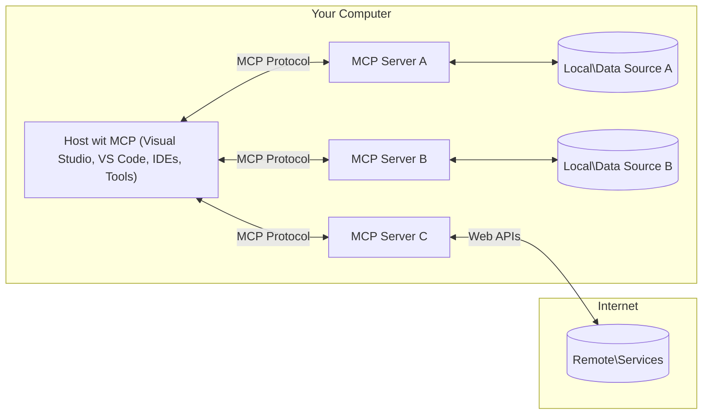

# MCP Core Concepts: Master di Model Context Protocol for AI Integration

[](https://youtu.be/earDzWGtE84)

_(Click di image wey dey above to watch video for dis lesson)_

Di [Model Context Protocol (MCP)](https://github.com/modelcontextprotocol) na strong, standard framework wey dey optimize communication between Large Language Models (LLMs) and outside tools, applications, and data sources.  
Dis guide go waka you through di main concepts of MCP. You go learn about im client-server architecture, important parts, communication way dem dey take work, and better ways to implement am.

- **Explicit User Consent**: All data access and operations need clear user approval before dem fit run am. Users suppose sabi well-well wetin data go dem access and wetin actions dem go perform, with fine control over permissions and authorizations.

- **Data Privacy Protection**: User data no dey show unless user approve and e suppose protected by strong access controls through all di interaction time. Implementations must stop unauthorized data transmission and keep privacy boundaries tight.

- **Tool Execution Safety**: Every tool wey dem wan run must get clear user approval, with full understanding of how di tool dey work, parameters, and possible effect. Strong security boundaries must stop any unintended, unsafe, or bad tool execution.

- **Transport Layer Security**: All communication channels suppose use correct encryption and authentication ways. Remote connections must follow secure transport protocols and manage credentials well.

#### Implementation Guidelines:

- **Permission Management**: Make fine-grained permission systems wey go allow users control which servers, tools, and resources dem fit access  
- **Authentication & Authorization**: Use secure authentication methods (OAuth, API keys) with good token management and expiration  
- **Input Validation**: Check all parameters and data input based on defined schemas to stop injection attacks  
- **Audit Logging**: Keep full logs of all actions for security monitoring and compliance  

## Overview

Dis lesson go explore di basic architecture and di parts wey make up di Model Context Protocol (MCP) ecosystem. You go learn about di client-server architecture, important parts, and communication ways wey dey make MCP interactions work.

## Key Learning Objectives

By di end of dis lesson, you go:

- Understand how di MCP client-server architecture dey work.  
- Know di roles and responsibilities of Hosts, Clients, and Servers.  
- Analyze di important features wey make MCP flexible for integration.  
- Learn how information dey flow inside di MCP ecosystem.  
- Get practical understanding through code examples for .NET, Java, Python, and JavaScript.

## MCP Architecture: A Deeper Look

Di MCP ecosystem na client-server model. Dis modular structure dey allow AI applications to interact with tools, databases, APIs, and contextual resources well well. Make we break dis architecture down to im main parts.

At di core, MCP follow client-server architecture wey host application fit connect to plenty servers:


- **MCP Hosts**: Programs like VSCode, Claude Desktop, IDEs, or AI tools wey want access data through MCP  
- **MCP Clients**: Protocol clients wey keep 1:1 connections with servers  
- **MCP Servers**: Lightweight programs wey dem expose specific powers through di standardized Model Context Protocol  
- **Local Data Sources**: Your computer own files, databases, and services wey MCP servers fit securely access  
- **Remote Services**: Outside systems wey dey internet wey MCP servers fit connect to through APIs.

Di MCP Protocol na one standard wey dey grow using date-based versioning (YYYY-MM-DD format). Di current protocol version na **2025-11-25**. You fit see di latest updates to di [protocol specification](https://modelcontextprotocol.io/specification/2025-11-25/)

### 1. Hosts

For di Model Context Protocol (MCP), **Hosts** na AI applications wey be di main interface wey users dey use to interact with di protocol. Hosts dey organize and manage connections to multiple MCP servers by creating separate MCP clients for each server connection. Example of Hosts na:

- **AI Applications**: Claude Desktop, Visual Studio Code, Claude Code  
- **Development Environments**: IDEs and code editors wey get MCP integration  
- **Custom Applications**: AI agents and tools wey dem build for special purposes  

**Hosts** na applications wey dey coordinate AI model interactions. Dem:

- **Orchestrate AI Models**: Dem fit run or interact with LLMs to create answers and manage AI workflows  
- **Manage Client Connections**: Dem create and maintain one MCP client per MCP server connection  
- **Control User Interface**: Handle conversation flow, user interactions, and show responses  
- **Enforce Security**: Dem control permissions, security limits, and authentication  
- **Handle User Consent**: Manage user approval for data sharing and tool running  

### 2. Clients

**Clients** na important parts wey keep one-to-one connections between Hosts and MCP servers well steady. Each MCP client na thing wey di Host create to connect to one MCP server, so communication fit dey organized and secure. Plenty clients mean Hosts fit connect to many servers at the same time.

**Clients** na connectors wey dey inside di host application. Dem:

- **Protocol Communication**: Send JSON-RPC 2.0 requests to servers with prompts and instructions  
- **Capability Negotiation**: Discuss and agree supported features and protocol versions with servers during startup  
- **Tool Execution**: Handle tool running requests from models and process their answers  
- **Real-time Updates**: Manage notifications and real-time updates from servers  
- **Response Processing**: Process and prepare server answers to show users  

### 3. Servers

**Servers** na programs wey give context, tools, and powers to MCP clients. Dem fit run local (for di same machine as Host) or remote (for outside platforms), and dem dey responsible to handle client requests and give proper answers. Servers dey show special functions through di standardized Model Context Protocol.

**Servers** na services wey provide context and powers. Dem:

- **Feature Registration**: Register and expose available things (resources, prompts, tools) to clients  
- **Request Processing**: Receive and run tool calls, resource requests, and prompt requests from clients  
- **Context Provision**: Provide contextual info and data to improve model answers  
- **State Management**: Keep session state and handle interactions wey need im  
- **Real-time Notifications**: Send news about capability changes and updates to connected clients  

Servers fit be developed by anybody to increase model powers with special functions, and dem dey support both local and remote deployment.

### 4. Server Primitives

Servers for di Model Context Protocol (MCP) provide three main **primitives** wey describe the basic building blocks for plenty interactions between clients, hosts, and language models. These primitives talk about wetin kinds of contextual info and actions dem fit do through di protocol.

MCP servers fit show any combination of these three main primitives:

#### Resources 

**Resources** na data sources wey provide contextual info to AI applications. Dem dey represent static or dynamic content wey fit help model understanding and decision-taking:

- **Contextual Data**: Structured info and context for AI model use  
- **Knowledge Bases**: Document stores, articles, manuals, and research papers  
- **Local Data Sources**: Files, databases, and local system info  
- **External Data**: API answers, web services, and outside system data  
- **Dynamic Content**: Real-time data wey dey update based on outside conditions  

Resources dey identified by URIs and dem fit discover am through `resources/list` and find am through `resources/read` methods:

```text
file://documents/project-spec.md
database://production/users/schema
api://weather/current
```

#### Prompts

**Prompts** na reusable templates wey help structure interactions with language models. Dem provide standard interaction patterns and templated workflows:

- **Template-based Interactions**: Pre-made messages and conversation starters  
- **Workflow Templates**: Standard steps for common tasks and interactions  
- **Few-shot Examples**: Example-based templates to guide model instruction  
- **System Prompts**: Base prompts wey define model behavior and context  
- **Dynamic Templates**: Parameterized prompts wey fit adjust to specific contexts  

Prompts support variable substitution and fit be discovered via `prompts/list` and retrieved with `prompts/get`:

```markdown
Generate a {{task_type}} for {{product}} targeting {{audience}} with the following requirements: {{requirements}}
```

#### Tools

**Tools** na executable functions wey AI models fit run to do specific actions. Dem be like "verbs" for di MCP ecosystem, making models fit interact with outside systems:

- **Executable Functions**: Particular operations wey models fit run with specific parameters  
- **External System Integration**: API calls, database queries, file actions, calculations  
- **Unique Identity**: Every tool get one special name, description, and parameter schema  
- **Structured I/O**: Tools accept checked parameters and return structured, typed answers  
- **Action Capabilities**: Make models fit do real-world actions and collect live data  

Tools be defined with JSON Schema for parameter validation and fit be discovered through `tools/list` and run with `tools/call`. Tools fit also get **icons** as extra metadata for better UI look.

**Tool Annotations**: Tools support behavior notes (like `readOnlyHint`, `destructiveHint`) wey dey explain if tool na read-only or destructive, to help clients sabi well before dem run am.

Example tool definition:

```typescript
server.tool(
  "search_products", 
  {
    query: z.string().describe("Search query for products"),
    category: z.string().optional().describe("Product category filter"),
    max_results: z.number().default(10).describe("Maximum results to return")
  }, 
  async (params) => {
    // Run di search and come back wit organized results
    return await productService.search(params);
  }
);
```

## Client Primitives

For di Model Context Protocol (MCP), **clients** fit show primitives wey make servers fit ask more capabilities from the host application. These client-side primitives allow better, more interactive server implementations wey fit access AI model powers and user interactions.

### Sampling

**Sampling** allow servers to ask language model completions from di client's AI application. Dis primitive dey enable servers to use LLM powers without carrying their own model dependencies:

- **Model-Independent Access**: Servers fit ask for completions without including LLM SDKs or managing model access  
- **Server-Initiated AI**: Enable servers to create content themselves using client’s AI model  
- **Recursive LLM Interactions**: Support complex cases where servers need AI help for processing  
- **Dynamic Content Generation**: Make servers fit create contextual answers using host's model  
- **Tool Calling Support**: Servers fit send `tools` and `toolChoice` parameters to allow client’s model invoke tools during sampling  

Sampling dey start through `sampling/complete` method, where servers send completion requests to clients.

### Roots

**Roots** provide standard way for clients to expose filesystem boundaries to servers, helping servers sabi which directories and files dem get access to:

- **Filesystem Boundaries**: Show where servers fit operate for filesystem  
- **Access Control**: Help servers sabi which directories and files dem get permission to access  
- **Dynamic Updates**: Clients fit alert servers when roots list change  
- **URI-Based Identification**: Roots dey use `file://` URIs to identify allowed directories and files  

Roots dey found through `roots/list` method, with clients sending `notifications/roots/list_changed` when roots change.

### Elicitation  

**Elicitation** allows servers to ask for more info or confirmation from users through client interface:

- **User Input Requests**: Servers fit ask for extra info when dem need am for tool running  
- **Confirmation Dialogs**: Request user approval for sensitive or important operations  
- **Interactive Workflows**: Make servers fit create step-by-step user interactions  
- **Dynamic Parameter Collection**: Collect missing or optional parameters during tool running  

Elicitation requests dem dey made using `elicitation/request` method to collect user input through client interface.

**URL Mode Elicitation**: Servers fit also ask for URL-based user interactions, allowing servers direct users go outside web pages for authentication, confirmation, or data input.

### Logging

**Logging** allow servers send structured log messages to clients for debugging, monitoring, and operational visibility:

- **Debugging Support**: Makes servers fit provide detailed execution logs for troubleshooting  
- **Operational Monitoring**: Send status updates and performance metrics to clients  
- **Error Reporting**: Give detailed error context and diagnostics  
- **Audit Trails**: Create full logs of server operations and decisions  

Logging messages dey sent to clients to make server operations clear and support debugging.

## Information Flow in MCP

Di Model Context Protocol (MCP) define structured flow of information between hosts, clients, servers, and models. To sabi dis flow go help understand how user requests dey process and how outside tools and data dey integrate into model answers.
- **Host Dey Start Connection**  
  Di host application (wey fit be IDE or chat interface) go connect wit MCP server, usually dem go use STDIO, WebSocket, or oda transport wey dem support.

- **Capability Talk**  
  Di client (wey dey inside di host) and di server go exchange info about di features, tools, resources, and protocol versions wey dem fit use. Dis dey make sure say both sides sabi wetin dem fit use for di session.

- **User Request**  
  Di user go interact wit di host (like ety press prompt or command). Di host go collect dis input come send am go client for processing.

- **Resource or Tool Use**  
  - Di client fit ask di server for more context or resources (like files, database entries, or knowledge base articles) to make di model sabi better.  
  - If di model see say tool need (like to collect data, do calculation, or call API), di client go send tool invocation request go di server, talk di tool name and parameters.

- **Server Execution**  
  Di server go get di resource or tool request, e go do wetin e need (like run function, ask database, or collect file), then e go send di result back to di client for structure format.

- **Response Generation**  
  Di client go combine di server tori (resource data, tool output, etc) join di model interaction wey dey happen. Di model go use dis info to create one better and correct answer.

- **Result Presentation**  
  Di host go receive di final output from di client come show am to di user, sometimes e go show both di model talk and di output from tools or resource lookups.

Dis flow dey make MCP fit support beta, interactive, and context-aware AI apps by join models to outside tools and data sources well well.

## Protocol Architecture & Layers

MCP get two architecture layers wey dem dey use together to give full communication framework:

### Data Layer

Di **Data Layer** dey run di main MCP protocol wit **JSON-RPC 2.0** as base. Dis layer na di one wey define message style, meaning, and how bodi go take interact:

#### Core Components:

- **JSON-RPC 2.0 Protocol**: All communication dey use standard JSON-RPC 2.0 message style for method calls, responses, and notifications  
- **Lifecycle Management**: E dey handle connection start, capability talk, and session end between clients and servers  
- **Server Primitives**: E dey make servers fit offer main functionality thru tools, resources, and prompts  
- **Client Primitives**: E dey make servers fit ask LLMs for sampling, get user input, and send log messages  
- **Real-time Notifications**: E support asynchronous notifications for dynamic updates without make person dey ask repeatedly

#### Key Features:

- **Protocol Version Negotiation**: E use date-based versioning (YYYY-MM-DD) make e sure sey dem still fit work together  
- **Capability Discovery**: Clients and servers dey exchange info about wetin each fit do during initialization  
- **Stateful Sessions**: E go remember connection state during many interactions for continuity

### Transport Layer

Di **Transport Layer** dey manage communication channels, message framing, and authentication between MCP people:

#### Supported Transport Mechanisms:

1. **STDIO Transport**:  
   - E use ordinary input/output streams for direct process communication  
   - Best for local processes on one machine with no network wahala  
   - Dem dey mostly use am for local MCP server implementation

2. **Streamable HTTP Transport**:  
   - E use HTTP POST for client-to-server messages  
   - Optional Server-Sent Events (SSE) for server-to-client stream  
   - E fit make server talk from far side  
   - E support standard HTTP authentication (bearer tokens, API keys, custom headers)  
   - MCP recommend OAuth for secure token authentication

#### Transport Abstraction:

Di transport layer dey hide communication detail from di data layer, so all transport fit use same JSON-RPC 2.0 message style. Dis abstraction make am easy for apps to switch between local and remote servers quick quick.

### Security Considerations

MCP implementations gots follow some important security principles to make sure say all protocol operations dey safe, trustworthy, and secure:

- **User Consent and Control**: Users gots give clear permission before any data fit access or operation fit run. Dem gots make sure say user fit control wetin dem share and which actions dem approve, wit easy-to-use UI for checking and approving.

- **Data Privacy**: User data suppose dey show only if user agree, and e gots dey protected wit correct access control. MCP implementations gots block unauthorized data spread and make sure privacy dey held tight for all interactions.

- **Tool Safety**: Before to use any tool, user gots give clear permission. Users gots sabi well well how each tool go work, and strong security limit gots dey to stop any tool wey no suppose run or wey fit cause wahala.

If dem follow these security rules, MCP go keep user trust, privacy, and safety across all protocol interactions and still enable strong AI integrations.

## Code Examples: Key Components

Below na examples of code for popular programming languages wey show how to build key MCP server components and tools.

### .NET Example: Creating a Simple MCP Server with Tools

Here na simple .NET code example wey show how to build MCP server wit your own tools. This example dey show how to define and register tools, handle requests, and connect the server with the Model Context Protocol.

```csharp
using System;
using System.Threading.Tasks;
using ModelContextProtocol.Server;
using ModelContextProtocol.Server.Transport;
using ModelContextProtocol.Server.Tools;

public class WeatherServer
{
    public static async Task Main(string[] args)
    {
        // Create an MCP server
        var server = new McpServer(
            name: "Weather MCP Server",
            version: "1.0.0"
        );
        
        // Register our custom weather tool
        server.AddTool<string, WeatherData>("weatherTool", 
            description: "Gets current weather for a location",
            execute: async (location) => {
                // Call weather API (simplified)
                var weatherData = await GetWeatherDataAsync(location);
                return weatherData;
            });
        
        // Connect the server using stdio transport
        var transport = new StdioServerTransport();
        await server.ConnectAsync(transport);
        
        Console.WriteLine("Weather MCP Server started");
        
        // Keep the server running until process is terminated
        await Task.Delay(-1);
    }
    
    private static async Task<WeatherData> GetWeatherDataAsync(string location)
    {
        // This would normally call a weather API
        // Simplified for demonstration
        await Task.Delay(100); // Simulate API call
        return new WeatherData { 
            Temperature = 72.5,
            Conditions = "Sunny",
            Location = location
        };
    }
}

public class WeatherData
{
    public double Temperature { get; set; }
    public string Conditions { get; set; }
    public string Location { get; set; }
}
```

### Java Example: MCP Server Components

Dis example dey show same MCP server and tool registration like di .NET example wey dey above, but done for Java.

```java
import io.modelcontextprotocol.server.McpServer;
import io.modelcontextprotocol.server.McpToolDefinition;
import io.modelcontextprotocol.server.transport.StdioServerTransport;
import io.modelcontextprotocol.server.tool.ToolExecutionContext;
import io.modelcontextprotocol.server.tool.ToolResponse;

public class WeatherMcpServer {
    public static void main(String[] args) throws Exception {
        // Make one MCP server
        McpServer server = McpServer.builder()
            .name("Weather MCP Server")
            .version("1.0.0")
            .build();
            
        // Register one weather tool
        server.registerTool(McpToolDefinition.builder("weatherTool")
            .description("Gets current weather for a location")
            .parameter("location", String.class)
            .execute((ToolExecutionContext ctx) -> {
                String location = ctx.getParameter("location", String.class);
                
                // Collect weather data (simple)
                WeatherData data = getWeatherData(location);
                
                // Return correct formatted response
                return ToolResponse.content(
                    String.format("Temperature: %.1f°F, Conditions: %s, Location: %s", 
                    data.getTemperature(), 
                    data.getConditions(), 
                    data.getLocation())
                );
            })
            .build());
        
        // Join the server with stdio transport
        try (StdioServerTransport transport = new StdioServerTransport()) {
            server.connect(transport);
            System.out.println("Weather MCP Server started");
            // Make server dey run till process finish
            Thread.currentThread().join();
        }
    }
    
    private static WeatherData getWeatherData(String location) {
        // Implementation go call weather API
        // E simple make e easy for example purposes
        return new WeatherData(72.5, "Sunny", location);
    }
}

class WeatherData {
    private double temperature;
    private String conditions;
    private String location;
    
    public WeatherData(double temperature, String conditions, String location) {
        this.temperature = temperature;
        this.conditions = conditions;
        this.location = location;
    }
    
    public double getTemperature() {
        return temperature;
    }
    
    public String getConditions() {
        return conditions;
    }
    
    public String getLocation() {
        return location;
    }
}
```

### Python Example: Building an MCP Server

Dis example dey use fastmcp, so abeg make sure say you install am first:

```python
pip install fastmcp
```
Code Sample:

```python
#!/usr/bin/env python3
import asyncio
from fastmcp import FastMCP
from fastmcp.transports.stdio import serve_stdio

# Make FastMCP server
mcp = FastMCP(
    name="Weather MCP Server",
    version="1.0.0"
)

@mcp.tool()
def get_weather(location: str) -> dict:
    """Gets current weather for a location."""
    return {
        "temperature": 72.5,
        "conditions": "Sunny",
        "location": location
    }

# Different waya wey use class
class WeatherTools:
    @mcp.tool()
    def forecast(self, location: str, days: int = 1) -> dict:
        """Gets weather forecast for a location for the specified number of days."""
        return {
            "location": location,
            "forecast": [
                {"day": i+1, "temperature": 70 + i, "conditions": "Partly Cloudy"}
                for i in range(days)
            ]
        }

# Register tools for class
weather_tools = WeatherTools()

# Begin di server
if __name__ == "__main__":
    asyncio.run(serve_stdio(mcp))
```

### JavaScript Example: Creating an MCP Server

Dis example dey show how to create MCP server for JavaScript and how to register two tools wey get to do with weather.

```javascript
// Using di official Model Context Protocol SDK
import { McpServer } from "@modelcontextprotocol/sdk/server/mcp.js";
import { StdioServerTransport } from "@modelcontextprotocol/sdk/server/stdio.js";
import { z } from "zod"; // For parameter check

// Create one MCP server
const server = new McpServer({
  name: "Weather MCP Server",
  version: "1.0.0"
});

// Define one weather tool
server.tool(
  "weatherTool",
  {
    location: z.string().describe("The location to get weather for")
  },
  async ({ location }) => {
    // Dis one normally dey call weather API
    // Simplify am for show
    const weatherData = await getWeatherData(location);
    
    return {
      content: [
        { 
          type: "text", 
          text: `Temperature: ${weatherData.temperature}°F, Conditions: ${weatherData.conditions}, Location: ${weatherData.location}` 
        }
      ]
    };
  }
);

// Define one forecast tool
server.tool(
  "forecastTool",
  {
    location: z.string(),
    days: z.number().default(3).describe("Number of days for forecast")
  },
  async ({ location, days }) => {
    // Dis one normally dey call weather API
    // Simplify am for show
    const forecast = await getForecastData(location, days);
    
    return {
      content: [
        { 
          type: "text", 
          text: `${days}-day forecast for ${location}: ${JSON.stringify(forecast)}` 
        }
      ]
    };
  }
);

// Helper functions
async function getWeatherData(location) {
  // Fake API call
  return {
    temperature: 72.5,
    conditions: "Sunny",
    location: location
  };
}

async function getForecastData(location, days) {
  // Fake API call
  return Array.from({ length: days }, (_, i) => ({
    day: i + 1,
    temperature: 70 + Math.floor(Math.random() * 10),
    conditions: i % 2 === 0 ? "Sunny" : "Partly Cloudy"
  }));
}

// Connect di server wit stdio transport
const transport = new StdioServerTransport();
server.connect(transport).catch(console.error);

console.log("Weather MCP Server started");
```

Dis JavaScript example dey show how to create MCP server wit Model Context Protocol SDK. E dey show how to register two tools named `weatherTool` and `forecastTool` and make am available for MCP clients through `StdioServerTransport`.

## Security and Authorization

MCP get plenti built-in concepts and ways to manage security and authorization for the whole protocol:

1. **Tool Permission Control**:  
  Clients fit talk which tools model fit use during session. Dis dey make sure say only tools wey dem allow fit use, so e reduce risk of unwanted or unsafe actions. Permissions fit change based on user preference, company rules, or interaction context.

2. **Authentication**:  
  Servers fit make authentication mandatory before tool, resource, or sensitive operation access. Dis fit be API keys, OAuth tokens, or other schemes. Correct authentication dey make sure say only trusted clients and users fit run server capabilities.

3. **Validation**:  
  Every time tool use, parameters get to be checked. Each tool define wetin e expect for type, format, and limits for parameters, and server go check requests well. Dis go stop bad or harmful input from enter tool and maintain operation integrity.

4. **Rate Limiting**:  
  To prevent people from abusing and to balance fair use of server resources, MCP servers fit put rate limit for tool calls and resource access. Rate limit fit apply per user, per session, or for everywhere, and e help stop denial-of-service attack or too much usage of resources.

Combine all these things together, MCP go provide solid and safe place to join language models wit outside tools and data while dey give users and developers fine control over access and use.

## Protocol Messages & Communication Flow

MCP communication dey use structured **JSON-RPC 2.0** messages to make conversation clear and dependable between hosts, clients, and servers. Di protocol get certain message pattern for different operations:

### Core Message Types:

#### **Initialization Messages**
- **`initialize` Request**: To start connection and agree protocol version and capabilities  
- **`initialize` Response**: To confirm wetin features and server info support  
- **`notifications/initialized`**: To let people know say initialization finish and session ready

#### **Discovery Messages**
- **`tools/list` Request**: To find out tools wey server get  
- **`resources/list` Request**: To list available resources (data sources)  
- **`prompts/list` Request**: To collect prompt templates wey dey available

#### **Execution Messages**  
- **`tools/call` Request**: To run specific tool wit parameters wey dem give  
- **`resources/read` Request**: To get content from specific resource  
- **`prompts/get` Request**: To get prompt template wit optional parameters

#### **Client-side Messages**
- **`sampling/complete` Request**: Server dey ask client for LLM completion  
- **`elicitation/request`**: Server dey ask user input thru client interface  
- **Logging Messages**: Server dey send structured log message to client

#### **Notification Messages**
- **`notifications/tools/list_changed`**: Server dey tell client say tools change  
- **`notifications/resources/list_changed`**: Server dey tell client say resource list change  
- **`notifications/prompts/list_changed`**: Server dey tell client say prompt list change

### Message Structure:

All MCP messages follow JSON-RPC 2.0 format with:
- **Request Messages**: Dem get `id`, `method`, and optional `params`  
- **Response Messages**: Dem get `id` and either `result` or `error`  
- **Notification Messages**: Dem get `method` and optional `params` (no `id` or response expected)

Dis structure dey make interaction reliable, traceable, and extensible for advanced things like real-time updates, chaining tools, and strong error handling.

### Tasks (Experimental)

**Tasks** na experimental feature wey dey give durable execution wrappers wey fit delay result collection and status checking for MCP requests:

- **Long-Running Operations**: To follow expensive calculations, workflow automation, and batch processing  
- **Deferred Results**: To check task status and collect results when done  
- **Status Tracking**: To monitor task progress with defined lifecycle states  
- **Multi-Step Operations**: To support complex workflows wey fit span many interactions

Tasks dey wrap standard MCP requests so dem fit run asynchronously for operations wey no fit finish quick.

## Key Takeaways

- **Architecture**: MCP na client-server design wey host dey manage plenty client connection to servers  
- **Participants**: Ecosystem get hosts (AI apps), clients (protocol connectors), and servers (capability providers)  
- **Transport Mechanisms**: Communication fit use STDIO (local) and Streamable HTTP wit optional SSE (remote)  
- **Core Primitives**: Servers dey expose tools (functions wey fit run), resources (data sources), and prompts (templates)  
- **Client Primitives**: Servers fit ask for sampling (LLM completions with tool call support), elicitation (user input with URL mode), roots (filesystem boundaries), and logging from clients  
- **Experimental Features**: Tasks dey provide durable wrappers for long operations  
- **Protocol Foundation**: E build on JSON-RPC 2.0 with date-based versioning (latest: 2025-11-25)  
- **Real-time Capabilities**: E support notifications for dynamic updates and real-time sync  
- **Security First**: Explicit user consent, data privacy protection, and secure transport na core requirements

## Exercise

Design one simple MCP tool wey go useful for your own area. Define:
1. Wetin the tool go be named  
2. Wetin parameters e go accept  
3. Wetin output e go give  
4. How model fit use dis tool to solve problems from user

---

## What's next

Next: [Chapter 2: Security](../02-Security/README.md)

---

<!-- CO-OP TRANSLATOR DISCLAIMER START -->
**Disclaimer**:  
Dis document don translate wit AI translation service [Co-op Translator](https://github.com/Azure/co-op-translator). Even tho we dey try make am correct, make you sabi say automated translation fit get mistake or wahala. Di original document wey e dey for im own language na di correct one. If na important mata, better make person wey sabi translate am do am. We no go responsible if anybody missunderstand or misinterpret from dis translation.
<!-- CO-OP TRANSLATOR DISCLAIMER END -->