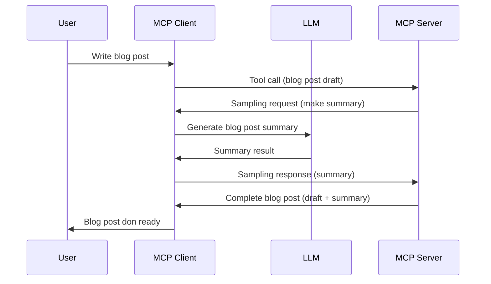

# Sampling - delegate features to the Client

Sometimes, you need the MCP Client and the MCP Server to work together to achieve one common goal. You fit get one case where the Server need help from one LLM wey dey for the client side. For this kain situation, sampling na wetin you for use.

Make we explore some use cases and how to build one solution wey get sampling.

## Overview

For this lesson, we go focus on how to talk when and where you for use Sampling and how to set am up.

## Learning Objectives

For this chapter, we go:

- Explain wetin Sampling be and when you for use am.
- Show how to set up Sampling for MCP.
- Show examples of Sampling in action.

## Wetin Sampling be and why you for use am?

Sampling na one advanced feature wey dey work like this:



### Sampling request

Ok, now we get one high-level view of one gud scenario, make we talk about the sampling request wey the server dey send back to the client. Dis na how the request fit look for JSON-RPC format:

```json
{
  "jsonrpc": "2.0",
  "id": 1,
  "method": "sampling/createMessage",
  "params": {
    "messages": [
      {
        "role": "user",
        "content": {
          "type": "text",
          "text": "Create a blog post summary of the following blog post: <BLOG POST>"
        }
      }
    ],
    "modelPreferences": {
      "hints": [
        {
          "name": "claude-3-sonnet"
        }
      ],
      "intelligencePriority": 0.8,
      "speedPriority": 0.5
    },
    "systemPrompt": "You are a helpful assistant.",
    "maxTokens": 100
  }
}
```

Some tins dey here wey deserve to talk about:

- Prompt, under content -> text, na our prompt wey be instruction to the LLM to summarize blog post content.

- **modelPreferences**. Dis section na wetin e mean, preference, recommendation about the kind configuration to use with the LLM. The user fit decide whether to follow these recommendations or change am. For this case, dem recommend which model to use and speed plus intelligence priority.
- **systemPrompt**, dis na your normal system prompt wey give your LLM personality and get guidance instructions.
- **maxTokens**, dis na another property wey dem dey use talk how many tokens dem recommend make you use for this task.

### Sampling response

Dis response na wetin MCP Client go send back to the MCP Server. E be the result when the client call the LLM, wait for response, then put this message together. Dis na how e fit look for JSON-RPC:

```json
{
  "jsonrpc": "2.0",
  "id": 1,
  "result": {
    "role": "assistant",
    "content": {
      "type": "text",
      "text": "Here's your abstract <ABSTRACT>"
    },
    "model": "gpt-5",
    "stopReason": "endTurn"
  }
}
```

See how the response be abstract of the blog post as we ask for. Also note how the `model` wey dem use no be the one we ask for but "gpt-5" instead of "claude-3-sonnet". Dis one na to show say the user fit change their mind on which to use and that sampling request na just recommendation.

Ok, now we don sabi the main flow and wetin e good for do - "blog post creation + abstract", make we see wetin we for do to make am work.

### Message types

Sampling messages no dey limit to only text but you fit send images and audio too. Dis na how JSON-RPC different:

**Text**

```json
{
  "type": "text",
  "text": "The message content"
}
```

**Image content**

```json
{
  "type": "image",
  "data": "base64-encoded-image-data",
  "mimeType": "image/jpeg"
}
```

**Audio content**

```json
{
  "type": "audio",
  "data": "base64-encoded-audio-data",
  "mimeType": "audio/wav"
}
```

> NOTE: for more detailed info on Sampling, check out the [official docs](https://modelcontextprotocol.io/specification/2025-11-25/client/sampling)

## How to Configure Sampling in the Client

> Note: if you just dey build server, you no need do much here.

For client, you need talk the feature like dis:

```json
{
  "capabilities": {
    "sampling": {}
  }
}
```

This one go catch when your selected client connect to the server.

## Example of Sampling in Action - Create a Blog Post

Make we code one sampling server together, we go need do these:

1. Create one tool for the Server.
1. The tool suppose create one sampling request
1. Tool go wait till the client's sampling request answer finish.
1. Then the tool go produce the result.

Make we see the code step by step:

### -1- Create the tool

**python**

```python
@mcp.tool()
async def create_blog(title: str, content: str, ctx: Context[ServerSession, None]) -> str:
    """Create a blog post and generate a summary"""

```

### -2- Create a sampling request

Add this code join your tool:

**python**

```python
post = BlogPost(
        id=len(posts) + 1,
        title=title,
        content=content,
        abstract=""
    )

prompt = f"Create an abstract of the following blog post: title: {title} and draft: {content} "

result = await ctx.session.create_message(
        messages=[
            SamplingMessage(
                role="user",
                content=TextContent(type="text", text=prompt),
            )
        ],
        max_tokens=100,
)

```

### -3- Wait for the response and return response

**python**

```python
post.abstract = result.content.text

posts.append(post)

# return di complete product
return json.dumps({
    "id": post.title,
    "abstract": post.abstract
})
```

### -4- Full code

**python**

```python
from starlette.applications import Starlette
from starlette.routing import Mount, Host

from mcp.server.fastmcp import Context, FastMCP

from mcp.server.session import ServerSession
from mcp.types import SamplingMessage, TextContent

import json


from uuid import uuid4
from typing import List
from pydantic import BaseModel


mcp = FastMCP("Blog post generator")

# app = FastAPI()

posts = []

class BlogPost(BaseModel):
    id: int
    title: str
    content: str
    abstract: str

posts: List[BlogPost] = []

@mcp.tool()
async def create_blog(title: str, content: str, ctx: Context[ServerSession, None]) -> str:
    """Create a blog post and generate a summary"""

    post = BlogPost(
        id=len(posts) + 1,
        title=title,
        content=content,
        abstract=""
    )

    prompt = f"Create an abstract of the following blog post: title: {title} and draft: {content} "

    result = await ctx.session.create_message(
        messages=[
            SamplingMessage(
                role="user",
                content=TextContent(type="text", text=prompt),
            )
        ],
        max_tokens=100,
    )

    post.abstract = result.content.text

    posts.append(post)

    # return di complete blog post
    return json.dumps({
        "id": post.title,
        "abstract": post.abstract
    })

if __name__ == "__main__":
    print("Starting server...")
    # mcp.run()
    mcp.run(transport="streamable-http")

# run app wit: python server.py
```

### -5- Testing am for Visual Studio Code

To test this one for Visual Studio Code, do these:

1. Start server for terminal
1. Add am to *mcp.json* (and make sure say e start) for example like dis:

   ```json
   "servers": {
      "blog-server": {
        "type": "http",
        "url": "http://localhost:8000/mcp"
      }
   }
   ```

1. Type any prompt:

   ```text
   create a blog post named "Where Python comes from", the content is "Python is actually named after Monty Python Flying Circus"
   ```

1. Allow sampling to happen. First time you test this, you go see one extra dialog wey you for accept, then you go see the normal dialog wey go ask you to run the tool

1. Check the results. You go see the results well rendered for GitHub Copilot Chat but you fit also check the raw JSON response.

**Bonus**. Visual Studio Code get better support for sampling. You fit configure Sampling access for your installed server like dis:

1. Go the extension section.
1. Select the cog icon for your installed server inside the "MCP SERVERS - INSTALLED" section.
1 Select "Configure Model Access", here you fit choose which Models GitHub Copilot fit use for sampling. You fit also see all sampling requests wey happen recently by selecting "Show Sampling requests".

## Assignment

For this assignment, you go build one small different Sampling, that one na sampling integration wey fit generate product description. This na your scenario:

**Scenario**: The back office worker for one e-commerce need help, e dey take too much time to generate product descriptions. So, you go build one solution where you fit call one tool "create_product" with "title" and "keywords" as arguments and e go produce one complete product plus "description" field wey the client's LLM go fill.

TIP: use wetin you learn before to build this server and tool with sampling request.

## Solution

[Solution](./solution/README.md)

## Key Takeaways

Sampling na strong feature wey allow the server to pass task to the client when e need LLM help.

## What's Next

- [Chapter 4 - Practical implementation](../../04-PracticalImplementation/README.md)

---

<!-- CO-OP TRANSLATOR DISCLAIMER START -->
**Disclaimer**:
Dis document don translate wit AI translation service [Co-op Translator](https://github.com/Azure/co-op-translator). Even tho we dey try make am correct, abeg make you know say automated translation fit get errors or mistakes. Di original document for dia own language na im be di correct source. For important info, make person wey sabi human translation do am. We no go responsible for any misunderstanding or wrong understanding wey fit happen because of dis translation.
<!-- CO-OP TRANSLATOR DISCLAIMER END -->