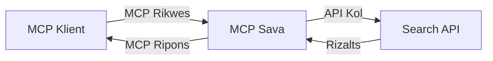
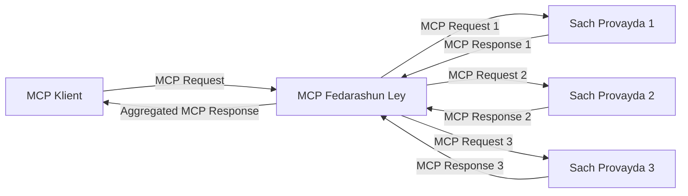
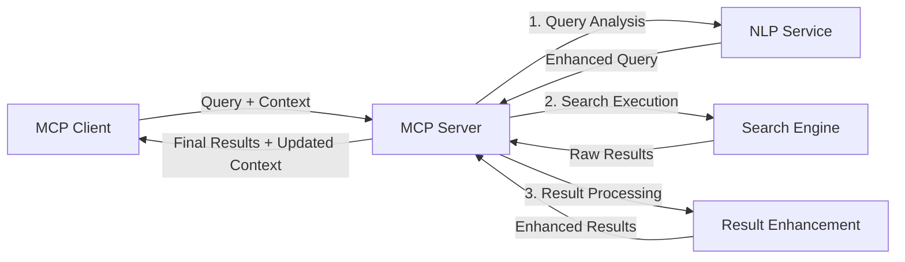

# Model Context Protocol for Real-Time Web Search

## Overview

Real-time web search don become important for today information-driven environment, wey applications need immediate access to up-to-date information spread internet make dem fit give relevant and timely responses. The Model Context Protocol (MCP) na big step forward to optimize dis kain real-time search process dem, e dey improve search efficiency, keep context correct, and boost overall system performance.

Dis module go explore how MCP dey transform real-time web search by giving standardized way to manage context across AI models, search engines, and applications.

### Wetin You Go Learn

For dis comprehensive guide, you go discover:

- How MCP dey create smooth bridge between AI models and real-time web search capabilities
- Architectural patterns to put efficient and scalable search solutions with MCP
- Techniques to keep search context for many queries and interactions
- Practical code implementations for Python and JavaScript for different search scenarios
- Methods to balance relevance, recency, and performance for MCP-powered search systems

## Introduction to Real-Time Web Search

Real-time web search na technological way wey make enquiry, process, and analysis of web-based info dey happen continuously as e dey publish or update, so so that systems fit give fresh and relevant info with small delay. E no be like old search systems wey dey work on indexed data wey fit dey hours or days old, real-time search dey process live data from web, e dey deliver insights and info wey represent the current state of online content.

### Core Concepts of Real-Time Web Search:

- **Continuous Query Processing**: Search queries dey process against data source wey dey update all time
- **Recency Prioritization**: Systems dey designed to put fresh info first
- **Relevance Balancing**: Make sure say relevance and recency balance well
- **Scalable Architecture**: Systems fit handle different query loads and data volumes
- **Contextual Understanding**: Keep user context across search sessions very important to get correct results
- **Dynamic Query Reformulation**: Change queries based on context and previous results
- **Multi-Source Integration**: Join results wey come from many search providers and web sources
- **Semantic Understanding**: Process queries and content based on meaning, no be only keywords
- **Real-Time Ranking**: Adjust result ranking all the time as new info show

### The Model Context Protocol and Real-Time Web Search

The Model Context Protocol (MCP) dey solve many important problems for real-time web search environment:

1. **Search Context Preservation**: MCP set standard for how to keep context across different search parts, make sure AI models and processing nodes fit access correct query history and user preferences.

2. **Efficient Query Management**: MCP provide methods to pass context structuredly, e dey reduce wahala of repeating context every search time.

3. **Interoperability**: MCP create common language for context sharing between different search technologies and AI models, e make architecture flexible and extensible.

4. **Search-Optimized Context**: MCP implementation fit prioritize which context parts important for good search, to optimize both performance and accuracy.

5. **Adaptive Search Processing**: With correct context management through MCP, search system fit change how e process based on user needs wey dey change and info landscape.

For modern apps, from news aggregation to research assistants, putting MCP with web search technology allow search wey sabi well, get mind for context and fit give more relevant results as user dey interact more.

## Learning Objectives

By finish dis lesson, you go fit:

- Understand basics of real-time web search and wetin challenge e get for modern apps
- Explain how Model Context Protocol (MCP) dey improve real-time web search abilities
- Implement MCP-based search solutions with popular frameworks and APIs
- Design and deploy scalable, high-performance search architecture with MCP
- Apply MCP ideas to different use cases, like semantic search, research help, and AI-enhanced browsing
- Review new trends and future plans for MCP-based search technology
- Build search systems wey know context well and dey learn from user interaction
- Join web search abilities into AI assistants using MCP standard protocol
- Create multi-step search pipelines wey dey improve results based on context
- Optimize search performance while make sure context dey complete

### Definition and Significance

Real-time web search na continuous process to query, collect, and give web info with small delay. E no be like traditional search engines wey dey crawl and index web sometimes, real-time search aim to bring info as e dey happen, so person fit get quick access to the newest content.

Key things about real-time web search include:

- **Freshness**: Put recent content and update first
- **Continuous Processing**: Always dey watch for new info
- **Query Adaptation**: Change search queries based on context and feedback
- **Immediate Delivery**: Give search results with little delay
- **Context Retention**: Build on previous searches to make results better

### Challenges in Traditional Web Search

Traditional web search get some problems when dem try use am for real-time matters:

1. **Context Fragmentation**: Hard to keep search context for many queries
2. **Information Freshness**: Tough to get and put recent info first
3. **Integration Complexity**: Problems joining search systems and apps
4. **Latency Issues**: Balance big search result and quick response
5. **Relevance Tuning**: Make sure accuracy and relevance while putting recency first

## Understanding Model Context Protocol (MCP) for Search

### Wetin MCP Mean for Search Context?

The Model Context Protocol (MCP) na standardized communication protocol wey help make interaction between AI models and applications easy. For real-time web search, MCP provide framework wey:

- Keep search context from first to last query
- Standardize search query and result formats
- Optimize how search parameters and results dey passed
- Improve communication between model and search engine

### Core Components and Architecture

MCP architecture for real-time web search get these main parts:

1. **Query Context Handlers**: Manage and keep search context for many queries
2. **Search Processors**: Process incoming search requests with context-aware methods
3. **Protocol Adapters**: Change one search API to another and still keep context
4. **Context Store**: Efficiently keep and find search history and preferences
5. **Search Connectors**: Connect to different search engines and web APIs

```mermaid
graph TD
    subgraph "Data Sources"
        Web[Web Content]
        APIs[External APIs]
        DB[Knowledge Bases]
        News[News Feeds]
    end

    subgraph "MCP Search Layer"
        SC[Search Connectors]
        PA[Protocol Adapters]
        CH[Context Handlers]
        SP[Search Processors]
        CS[Context Store]
    end

    subgraph "Processing & Analysis"
        RE[Relevance Engine]
        ML[ML Models]
        NLP[NLP Processing]
        Rank[Ranking System]
    end

    subgraph "Applications & Services"
        RA[Research Assistant]
        Alerts[Alert Systems]
        KB[Knowledge Base]
        API[API Services]
    end

    Web -->|Content| SC
    APIs -->|Data| SC
    DB -->|Knowledge| SC
    News -->|Updates| SC
    
    SC -->|Raw Results| PA
    PA -->|Normalized Results| CH
    CH <-->|Context Operations| CS
    CH -->|Context-Enriched Results| SP
    SP -->|Processed Results| RE
    SP -->|Features| ML
    SP -->|Text| NLP
    
    RE -->|Ranked Results| Rank
    ML -->|Predictions| Rank
    NLP -->|Entities & Relations| Rank
    
    Rank -->|Final Results| RA
    ML -->|Insights| Alerts
    NLP -->|Structured Data| KB
    
    RA -->|Research| Users((Users))
    Alerts -->|Notifications| Users
    KB <-->|Knowledge Access| API
    
    classDef sources fill:#f9f,stroke:#333,stroke-width:2px
    classDef mcp fill:#bbf,stroke:#333,stroke-width:2px
    classDef processing fill:#bfb,stroke:#333,stroke-width:2px
    classDef apps fill:#fbb,stroke:#333,stroke-width:2px
    
    class Web,APIs,DB,News sources
    class SC,PA,CH,SP,CS mcp
    class RE,ML,NLP,Rank processing
    class RA,Alerts,KB,API apps
```



### How MCP Improves Real-Time Web Search

MCP dey solve traditional web search problems by:

- **Contextual Continuity**: Keep link between queries for whole search session
- **Optimized Transmission**: Reduce repeating search parameters with smart context management
- **Standardized Interfaces**: Provide consistent APIs for search parts
- **Reduced Latency**: Minimize processing delay with good context handling
- **Enhanced Relevance**: Improve search relevance by keeping user intent for many queries

## Integration and Implementation

Real-time web search systems need careful design and implementation to keep both performance and correct context. Model Context Protocol na standardized way to fit join AI models and search tech, e allow search pipelines wey get more skill and sabi context.

### Overview of MCP Integration in Search Architectures

To implement MCP for real-time web search, you need consider these:

1. **Search Context Serialization**: MCP get efficient ways to encode context info inside search requests, so essential context go follow query through processing pipeline. E get standardized formats wey optimize for search metadata.

2. **Stateful Search Processing**: MCP allow smarter stateful process by keeping consistent context through search rounds. Dis important for multi-step search pipelines where context improve results.

3. **Query Expansion and Refinement**: MCP fit help expand and refine queries based on gathered context, make results dey more correct as session continue.

4. **Result Caching and Prioritization**: By setting standard for context handling, MCP fit help manage result caching and priorities, make components fit change based on changing search context.

5. **Search Federation and Aggregation**: MCP fit help better federation of search across many backends by giving structured search context, e enable better aggregation of results from different sources.

Putting MCP for different search tech create one unified approach to manage context, e reduce need for special integration code and improve system ability to keep correct context as search queries change.

### MCP in Various Web Search Implementations

These examples follow current MCP specification wey focus on JSON-RPC protocol with different transport methods. The code dey show how you fit do custom search integration but still fit work well with MCP protocol.


<details>
<summary>Python Implementation with Generic Search API</summary>

```python
import asyncio
import json
import aiohttp
from typing import Dict, Any, Optional, List
from contextlib import asynccontextmanager
from collections.abc import AsyncIterator

# Import standard MCP libraries
from mcp.client.session import ClientSession
from mcp.client.streamable_http import streamablehttp_client
from mcp.types import TextContent, CreateMessageRequestParams, CreateMessageResult
from mcp.server.fastmcp import FastMCP

# Create a FastMCP server for web search
search_server = FastMCP("WebSearch")

# Class to handle web search operations
class WebSearchHandler:
    def __init__(self, api_endpoint: str, api_key: str):
        self.api_endpoint = api_endpoint
        self.api_key = api_key
        self.session = None
        
    async def initialize(self):
        """Initialize the HTTP session"""
        self.session = aiohttp.ClientSession(
            headers={"Authorization": f"Bearer {self.api_key}"}
        )
    
    async def close(self):
        """Close the HTTP session"""
        if self.session:
            await self.session.close()
            
    async def perform_search(self, query: str, max_results: int = 5, 
                           include_domains: List[str] = None, 
                           exclude_domains: List[str] = None,
                           time_period: str = "any") -> Dict[str, Any]:
        """Perform web search using the search API"""
        # Construct search parameters
        search_params = {
            "q": query,
            "limit": max_results,
            "time": time_period
        }
        
        if include_domains:
            search_params["site"] = ",".join(include_domains)
            
        if exclude_domains:
            search_params["exclude_site"] = ",".join(exclude_domains)
        
        # Perform the search request
        try:
            async with self.session.get(
                self.api_endpoint,
                params=search_params
            ) as response:
                if response.status != 200:
                    error_text = await response.text()
                    raise Exception(f"Search API error: {response.status} - {error_text}")
                
                search_data = await response.json()
                
                # Transform API-specific response to a standard format
                results = []
                for item in search_data.get("results", []):
                    results.append({
                        "title": item.get("title", ""),
                        "url": item.get("url", ""),
                        "snippet": item.get("snippet", ""),
                        "date": item.get("published_date", ""),
                        "source": item.get("source", "")
                    })
                
                return {
                    "query": query,
                    "totalResults": len(results),
                    "results": results
                }
        except Exception as e:
            print(f"Search API request error: {e}")
            raise

# Initialize the search handler
search_handler = WebSearchHandler(
    api_endpoint="https://api.search-service.example/search",
    api_key="your-api-key-here"
)

# Setup lifespan to manage the search handler
@asyncio.asynccontextmanager
async def app_lifespan(server: FastMCP):
    """Manage application lifecycle"""
    await search_handler.initialize()
    try:
        yield {"search_handler": search_handler}
    finally:
        await search_handler.close()

# Set lifespan for the server
search_server = FastMCP("WebSearch", lifespan=app_lifespan)

# Register a web search tool
@search_server.tool()
async def web_search(query: str, max_results: int = 5, 
                   include_domains: List[str] = None,
                   exclude_domains: List[str] = None,
                   time_period: str = "any") -> Dict[str, Any]:
    """
    Search the web for information
    
    Args:
        query: The search query
        max_results: Maximum number of results to return (default: 5)
        include_domains: List of domains to include in search results
        exclude_domains: List of domains to exclude from search results
        time_period: Time period for results ("day", "week", "month", "any")
        
    Returns:
        Dictionary containing search results
    """
    ctx = search_server.get_context()
    search_handler = ctx.request_context.lifespan_context["search_handler"]
    
    results = await search_handler.perform_search(
        query=query,
        max_results=max_results,
        include_domains=include_domains,
        exclude_domains=exclude_domains,
        time_period=time_period
    )
    
    return results

# Example client usage
async def client_example():
    # Connect to the search server using Streamable HTTP transport
    async with streamablehttp_client("http://localhost:8000/mcp") as (read, write, _):
        async with ClientSession(read, write) as session:
            # Initialize the connection
            await session.initialize()
            
            # Call the web_search tool
            search_results = await session.call_tool(
                "web_search", 
                {
                    "query": "latest developments in AI and Model Context Protocol",
                    "max_results": 5,
                    "time_period": "day",
                    "include_domains": ["github.com", "microsoft.com"]
                }
            )
            
            print(f"Search results: {search_results}")

# Server execution example
if __name__ == "__main__":
    # Run the server with Streamable HTTP transport
    search_server.run(transport="streamable-http")
```
</details> 

<details>
<summary>JavaScript Implementation with Browser-Based Search</summary>


```javascript
// MCP server implementation for web search
import { McpServer, ResourceTemplate } from '@modelcontextprotocol/sdk/server/mcp.js';
import { StreamableHTTPServerTransport } from '@modelcontextprotocol/sdk/server/streamableHttp.js';
import { z } from 'zod';

// Create an MCP server for web search
const searchServer = new McpServer({
    name: "BrowserSearch",
    description: "A server that provides web search capabilities"
});

// Search service class
class SearchService {
    constructor(searchApiUrl, apiKey) {
        this.searchApiUrl = searchApiUrl;
        this.apiKey = apiKey;
    }

    async performSearch(parameters) {
        const {
            query = '',
            maxResults = 5,
            includeDomains = [],
            excludeDomains = [],
            timePeriod = 'any'
        } = parameters;
        
        // Construct search URL with parameters
        const url = new URL(this.searchApiUrl);
        url.searchParams.append('q', query);
        url.searchParams.append('limit', maxResults);
        url.searchParams.append('time', timePeriod);
        
        if (includeDomains.length > 0) {
            url.searchParams.append('site', includeDomains.join(','));
        }
        
        if (excludeDomains.length > 0) {
            url.searchParams.append('exclude_site', excludeDomains.join(','));
        }
        
        try {
            const response = await fetch(url.toString(), {
                method: 'GET',
                headers: {
                    'Authorization': `Bearer ${this.apiKey}`,
                    'Content-Type': 'application/json'
                }
            });
            
            if (!response.ok) {
                const errorText = await response.text();
                throw new Error(`Search API error: ${response.status} - ${errorText}`);
            }
            
            const searchData = await response.json();
            
            // Transform API-specific response to a standard format
            const results = searchData.results?.map(item => ({
                title: item.title || '',
                url: item.url || '',
                snippet: item.snippet || '',
                date: item.published_date || '',
                source: item.source || ''
            })) || [];
            
            return {
                query,
                totalResults: results.length,
                results
            };
        } catch (error) {
            console.error('Search API request error:', error);
            throw error;
        }
    }
}

// Initialize the search service
const searchService = new SearchService(
    'https://api.search-service.example/search',
    'your-api-key-here'
);

// Setup the context provider for the server
searchServer.setContextProvider(() => {
    return {
        searchService
    };
});

// Register web search tool
searchServer.tool({
    name: 'web_search',
    description: 'Search the web for information',
    parameters: {
        type: 'object',
        properties: {
            query: {
                type: 'string',
                description: 'The search query'
            },
            maxResults: {
                type: 'integer',
                description: 'Maximum number of results to return',
                default: 5
            },
            includeDomains: {
                type: 'array',
                items: { type: 'string' },
                description: 'List of domains to include in search results'
            },
            excludeDomains: {
                type: 'array',
                items: { type: 'string' },
                description: 'List of domains to exclude from search results'
            },
            timePeriod: {
                type: 'string',
                description: 'Time period for results',
                enum: ['day', 'week', 'month', 'any'],
                default: 'any'
            }
        },
        required: ['query']
    },
    handler: async (params, context) => {
        const { searchService } = context;
        return await searchService.performSearch(params);
    }
});

// Example client code to connect to the search server
import { Client } from '@modelcontextprotocol/sdk/client/index.js';
import { StreamableHTTPClientTransport } from '@modelcontextprotocol/sdk/client/streamableHttp.js';

async function connectToSearchServer() {
    // Connect to the search server
    const transport = new StreamableHTTPClientTransport(
        new URL('http://localhost:8000/mcp')
    );
    
    const client = new Client({
        name: 'search-client',
        version: '1.0.0'
    });
    
    await client.connect(transport);
    
    // Execute the search tool
    const searchResults = await client.callTool({
        name: 'web_search',
        arguments: {
            query: 'Model Context Protocol implementation examples',
            maxResults: 10,
            timePeriod: 'week',
            includeDomains: ['github.com', 'docs.microsoft.com']
        }
    });
    
    console.log('Search results:', searchResults);
    
    // Cleanup
    await client.disconnect();
}

// Start the server
const transport = new StreamableHTTPServerTransport();
await searchServer.connect(transport);
console.log('Search server running at http://localhost:8000/mcp');

// For separate process or afta server don start
// connectToSearchServer().catch(console.error);
```
</details> 


## Code Examples Disclaimer

> **Important Note**: The code examples below dey show how to join Model Context Protocol (MCP) with web search features. Even though dem follow patterns and structures of official MCP SDKs, dem don simplify am for educational reasons.
> 
> These examples show:
> 
> 1. **Python Implementation**: FastMCP server implementation wey provide web search tool and connect to outside search API. This example show how to properly manage lifespan, context, and tool based on official MCP Python SDK [official MCP Python SDK](https://github.com/modelcontextprotocol/python-sdk). The server uses Streamable HTTP transport wey dem recommend pass old SSE transport for production deployment.
> 
> 2. **JavaScript Implementation**: TypeScript/JavaScript way wey use FastMCP pattern from official MCP TypeScript SDK [official MCP TypeScript SDK](https://github.com/modelcontextprotocol/typescript-sdk) to build search server with proper tool definition and client link. E follow latest recommended ways for session and context.
> 
> These examples still go need more error handling, authentication, and API integration code for full production. The search API endpoint wey dey show (`https://api.search-service.example/search`) na just placeholder, you go need put real search service URL.
> 
> For full implementation details and latest methods, please check [official MCP specification](https://spec.modelcontextprotocol.io/) and SDK docs.

## Core Concepts

### The Model Context Protocol (MCP) Framework

For ground level, Model Context Protocol na standardized way for AI models, applications, and services to share context. For real-time web search, this framework very important to make search experience wey smooth and go many rounds. Key parts include:

1. **Client-Server Architecture**: MCP make clear separation between search clients (requesters) and search servers (providers), e allow flexible deployment ways.

2. **JSON-RPC Communication**: Protocol use JSON-RPC to exchange messages, make e compatible with web tech and easy for different platforms.

3. **Context Management**: MCP get structured way to maintain, update, and use search context through many interactions.

4. **Tool Definitions**: Search abilities expose as standard tools with clear parameters and return types.

5. **Streaming Support**: Protocol support streaming results, important for real-time search wey results fit dey come one by one.

### Web Search Integration Patterns

For join MCP with web search, some patterns dey:

#### 1. Direct Search Provider Integration



For dis pattern, MCP server directly connect to one or many search APIs, dem translate MCP request enter API-specific call and format the results as MCP response.

#### 2. Federated Search with Context Preservation



Dis pattern divide search queries to many MCP-compatible search providers, wey fit specialize for different content or search type, but still keep unified context.

#### 3. Context-Enhanced Search Chain



For dis pattern, search process split into many steps, context dey add for each step, result dey become more correct every time.

### Search Context Components

For MCP-based web search, context usually get:

- **Query History**: Previous search queries for session
- **User Preferences**: Language, region, safe search settings
- **Interaction History**: Which results user click, time spend on results
- **Search Parameters**: Filters, sort order, and other modifiers
- **Domain Knowledge**: Subject-specific context relevant to search
- **Temporal Context**: Time-based relevance factors
- **Source Preferences**: Trusted or preferred info sources

## Use Cases and Applications

### Research and Information Gathering

MCP dey improve research work by:

- Keep research context across search sessions
- Enable more advanced and context-relevant queries
- Support multi-source search federation
- Help knowledge extraction from search results

### Real-Time News and Trend Monitoring

MCP-powered search dey good for news monitoring:

- Near-real-time discovery of new news stories
- Contextual filtering for relevant info
- Topic and entity tracking across different sources
- Personalized news alerts based on user context

### AI-Augmented Browsing and Research

MCP open new ways for AI-augmented browsing:

- Contextual search suggestion based on current browser activity
- Smooth join of web search with LLM-powered assistants
- Multi-turn search refinement with kept context
- Better fact-checking and verifying info

## Future Trends and Innovations

### Evolution of MCP in Web Search

Looking forward, we dey expect MCP go develop more to handle:
- **Multimodal Search**: Tok combine text, image, audio, and video search plus keep di context
- **Decentralized Search**: Support di distributed and federated search system dem
- **Search Privacy**: Context-aware privacy-protecting search way dem
- **Query Understanding**: Deep semantic parsing of natural language search questions

### Potential Advancements in Technology

New technologies wey go shape di future of MCP search:

1. **Neural Search Architectures**: Embedding-based search system dem wey dem optimize for MCP
2. **Personalized Search Context**: Learn individual user search behavior over time
3. **Knowledge Graph Integration**: Context search wey improve with domain-specific knowledge graphs
4. **Cross-Modal Context**: Keep context across different search method dem

## Hands-On Exercises

### Exercise 1: Setting Up a Basic MCP Search Pipeline

For dis exercise, you go learn how to:
- Configure basic MCP search environment
- Implement context handlers for web search
- Test and check say context dey preserved for search rounds

### Exercise 2: Building a Research Assistant with MCP Search

Make complete app wey:
- Fit process natural language research questions
- Do context-aware web searches
- Join info from different sources
- Show organized research findings well well

### Exercise 3: Implementing Multi-Source Search Federation with MCP

Advanced exercise wey cover:
- Context-aware query dispatching go many search engines
- Result ranking and joining together
- Contextual deduplication of search results
- Handle source-specific metadata

## Additional Resources

- [Model Context Protocol Specification](https://spec.modelcontextprotocol.io/) - Official MCP specification and detailed protocol documentation
- [Model Context Protocol Documentation](https://modelcontextprotocol.io/) - Detailed tutorials and implementation guides
- [MCP Python SDK](https://github.com/modelcontextprotocol/python-sdk) - Official Python implementation of the MCP protocol
- [MCP TypeScript SDK](https://github.com/modelcontextprotocol/typescript-sdk) - Official TypeScript implementation of the MCP protocol
- [MCP Reference Servers](https://github.com/modelcontextprotocol/servers) - Reference implementations of MCP servers
- [Bing Web Search API Documentation](https://learn.microsoft.com/en-us/bing/search-apis/bing-web-search/overview) - Microsoft's web search API
- [Google Custom Search JSON API](https://developers.google.com/custom-search/v1/overview) - Google's programmable search engine
- [SerpAPI Documentation](https://serpapi.com/search-api) - Search engine results page API
- [Meilisearch Documentation](https://www.meilisearch.com/docs) - Open-source search engine
- [Elasticsearch Documentation](https://www.elastic.co/guide/index.html) - Distributed search and analytics engine
- [LangChain Documentation](https://python.langchain.com/docs/get_started/introduction) - Build apps with LLMs

## Learning Outcomes

If you complete dis module, you go fit:

- Understand how real-time web search dey work with e wahala dem
- Explain how Model Context Protocol (MCP) dey improve real-time web search power
- Implement MCP-based search solution using popular frameworks and APIs
- Design and deploy scalable, high-performance search architectures with MCP
- Use MCP ideas for different use cases like semantic search, research help, and AI-enhanced browsing
- Check new trends and future innovations wey go dey MCP-based search technology


### Trust and Safety Considerations

When you dey implement MCP-based web search solution, remember these important things dem from MCP specification:

1. **User Consent and Control**: Users must clearly agree and understand all data access and actions. This one matter wella for web search wey fit access external data sources.

2. **Data Privacy**: Make sure say you handle search questions and results properly, especially if dem get sensitive info. Put good access controls to protect user data.

3. **Tool Safety**: Implement correct authorization and validation for search tools because dem fit cause security risk through random code running. Tool behaviour wey dem describe no suppose dey trusted unless e come from trusted server.

4. **Clear Documentation**: Provide clear documents about wetin your MCP-based search fit do, the limits, and security matters following MCP specification implementation guideline.

5. **Robust Consent Flows**: Build strong consent and authorization flow wey explain wetin each tool dey do before you give am permission, especially tools wey dey interact with external web resources.

For full details about MCP security and trust, check [official documentation](https://modelcontextprotocol.io/specification/2025-11-25/basic/security_best_practices).

## What's next 

- [5.12 Entra ID Authentication for Model Context Protocol Servers](../mcp-security-entra/README.md)

---

<!-- CO-OP TRANSLATOR DISCLAIMER START -->
**Disclaimer**:
Dis document don translate wit AI translation service [Co-op Translator](https://github.com/Azure/co-op-translator). Even tho we dey try make am correct, abeg make you know say automated translation fit get errors or mistakes. Di original document for dia own language na im be di correct source. For important info, make person wey sabi human translation do am. We no go responsible for any misunderstanding or wrong understanding wey fit happen because of dis translation.
<!-- CO-OP TRANSLATOR DISCLAIMER END -->