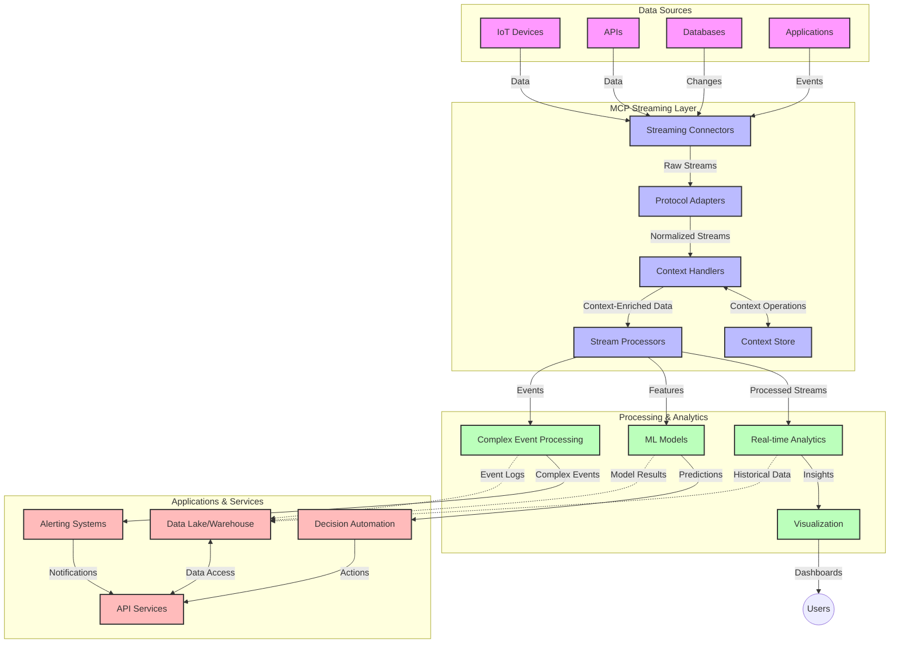

# Model Context Protocol for Real-Time Data Streaming

## Overview

Real-time data streaming don become very important for today data-driven world, weh businesses and applications need to get information sharp-sharp to fit make quick decisions. The Model Context Protocol (MCP) show better way to improve these real-time streaming processes, make data processing efficient, keep context correct, and boost how system dey perform.

Dis module go explain how MCP dey change real-time data streaming by giving one standard way to manage context among AI models, streaming platforms, and applications.

## Introduction to Real-Time Data Streaming

Real-time data streaming na technology way dey allow continuous transfer, processing, and analysis of data as e dey come, make systems fit react quickly to new information. No be like traditional batch processing weh dey work on static datasets, streaming dey process data as e dey move, dey give insight and actions with small delay.

### Core Concepts of Real-Time Data Streaming:

- **Continuous Data Flow**: Data dey processed as one continuous, never-ending stream of events or records.
- **Low Latency Processing**: Systems dey designed to reduce time between data generation and processing.
- **Scalability**: Streaming architecture must fit handle different amount and speed of data.
- **Fault Tolerance**: Systems must strong to handle failures so data no go stop flowing.
- **Stateful Processing**: To keep context across events very important for correct analysis.

### The Model Context Protocol and Real-Time Streaming

The Model Context Protocol (MCP) dey solve some important wahala for real-time streaming environment:

1. **Contextual Continuity**: MCP dey make sure say context dey maintained across distributed streaming parts, so AI models and processing nodes fit get relevant historical and environment context.

2. **Efficient State Management**: MCP dey provide organized ways to send context, e reduce burdens of state management for streaming pipelines.

3. **Interoperability**: MCP create common language for context sharing among different streaming tech and AI models, e make architecture flexible and fit expand well.

4. **Streaming-Optimized Context**: MCP fit decide which context parts important for real-time decision making, e dey optimize for better performance and accuracy.

5. **Adaptive Processing**: With proper context handling by MCP, streaming systems fit adjust how dem process data based on changing condition and data patterns.

For modern app wey dey from IoT sensor networks reach financial trading platforms, when dem join MCP with streaming tech, e enable smarter, context-aware processing way fit respond well to complex and changing situations for real time.

## Learning Objectives

By the end of this lesson, you go fit:

- Understand the basics of real-time data streaming and the wahala wey e get
- Explain how Model Context Protocol (MCP) dey improve real-time data streaming
- Implement MCP-based streaming solutions using popular frameworks like Kafka and Pulsar
- Design and deploy fault-tolerant, high-performance streaming architectures with MCP
- Use MCP concepts for IoT, financial trading, and AI-driven analytics
- Check and assess new trends and future innovations for MCP streaming technologies


### Definition and Significance

Real-time data streaming mean say data dey continuously generated, processed, and sent with small delay. Unlike batch processing, wey data dey gathered together and processed, streaming data dey processed step-by-step as e dey land, e permit quick insights and actions.

Key characteristics of real-time data streaming na:

- **Low Latency**: Processing and analysis dey happen inside milliseconds to seconds
- **Continuous Flow**: Data streams dey flow non-stop from different sources
- **Immediate Processing**: Data dey analyzed as e land, no be in batch
- **Event-Driven Architecture**: Systems dey respond to events as dem happen

### Challenges in Traditional Data Streaming

Traditional data streaming get some serious wahala:

1. **Context Loss**: E hard to keep context across different systems
2. **Scalability Issues**: Hard to scale to handle big and fast data
3. **Integration Complexity**: Wahala because different systems no dey talk well
4. **Latency Management**: To balance throughput with how fast you process
5. **Data Consistency**: To make sure say data correct and complete across stream

## Understanding Model Context Protocol (MCP)

### What is MCP?

Model Context Protocol (MCP) na standard communication protocol wey dem design to make interaction between AI models and applications easy and efficient. For real-time data streaming, MCP provide structure to:

- Keep context correct through the data pipeline
- Standardize how data dey exchanged
- Optimize sending big data
- Improve model-to-model and model-to-application communication

### Core Components and Architecture

MCP architecture for real-time streaming get some main parts:

1. **Context Handlers**: Dem manage and keep contextual information across streaming pipeline
2. **Stream Processors**: Dem process incoming streams with context-aware methods
3. **Protocol Adapters**: Convert for different streaming protocols while keeping context
4. **Context Store**: Efficiently save and bring context information
5. **Streaming Connectors**: Connect to different streaming platforms (Kafka, Pulsar, Kinesis, etc.)



### How MCP Improves Real-Time Data Handling

MCP dey solve traditional streaming problems by:

- **Contextual Integrity**: To keep the relationship between data points throughout the pipeline
- **Optimized Transmission**: Reduce unnecessary data exchange using smart context management
- **Standardized Interfaces**: Provide consistent APIs for streaming parts
- **Reduced Latency**: Cut processing overhead with efficient context handling
- **Enhanced Scalability**: Support horizontal scaling but still keep context

## Integration and Implementation

Real-time streaming system need careful architectural design and implementation to keep both performance and context integrity. Model Context Protocol offer a standard way to join AI models and streaming tech, make processing pipeline smarter and context-aware.

### Overview of MCP Integration in Streaming Architectures

To implement MCP for real-time streaming, consider:

1. **Context Serialization and Transport**: MCP provide efficient ways to encode context data in streaming packets, so correct context follow data through pipelines. This get standard serialization formats optimized for streaming.

2. **Stateful Stream Processing**: MCP allow better stateful processing by keeping context representation consistent across processing nodes. This important for distributed streaming systems weh state management dey hard.

3. **Event-Time vs. Processing-Time**: MCP fit solve common problem to tell when events happen and when dem processed. Protocol fit add temporal context to keep event time meaning.

4. **Backpressure Management**: MCP standardize context handling to manage backpressure in streaming systems, so parts fit talk their ability to process and adjust flow.

5. **Context Windowing and Aggregation**: MCP help complex windowing by giving structured ways to represent time and relation contexts, allow meaningful aggregation across events.

6. **Exactly-Once Processing**: For streaming systems weh need exactly-once processing, MCP fit add metadata to track and check processing status across distributed parts.

Implementing MCP for different streaming tech create one unified way to manage context, e reduce need for custom integration code and improve system ability to keep meaningful context as data flows pipeline.

### MCP in Various Data Streaming Frameworks

Here dem show examples wey match current MCP specification weh focus on JSON-RPC based protocol with different transport ways. Code show how to implement custom transports to join streaming platforms like Kafka and Pulsar and still keep full MCP compatibility.

Dem examples dey show how streaming platforms fit join MCP to provide real-time data processing and keep contextual awareness weh important for MCP. This approach make sure code examples reflect current MCP specification status as of June 2025.

MCP fit be joined with popular streaming frameworks including:

#### Apache Kafka Integration

```python
import asyncio
import json
from typing import Dict, Any, Optional
from confluent_kafka import Consumer, Producer, KafkaError
from mcp.client import Client, ClientCapabilities
from mcp.core.message import JsonRpcMessage
from mcp.core.transports import Transport

# Custom transport class to bridge MCP wit Kafka
class KafkaMCPTransport(Transport):
    def __init__(self, bootstrap_servers: str, input_topic: str, output_topic: str):
        self.bootstrap_servers = bootstrap_servers
        self.input_topic = input_topic
        self.output_topic = output_topic
        self.producer = Producer({'bootstrap.servers': bootstrap_servers})
        self.consumer = Consumer({
            'bootstrap.servers': bootstrap_servers,
            'group.id': 'mcp-client-group',
            'auto.offset.reset': 'earliest'
        })
        self.message_queue = asyncio.Queue()
        self.running = False
        self.consumer_task = None
        
    async def connect(self):
        """Connect to Kafka and start consuming messages"""
        self.consumer.subscribe([self.input_topic])
        self.running = True
        self.consumer_task = asyncio.create_task(self._consume_messages())
        return self
        
    async def _consume_messages(self):
        """Background task to consume messages from Kafka and queue them for processing"""
        while self.running:
            try:
                msg = self.consumer.poll(1.0)
                if msg is None:
                    await asyncio.sleep(0.1)
                    continue
                
                if msg.error():
                    if msg.error().code() == KafkaError._PARTITION_EOF:
                        continue
                    print(f"Consumer error: {msg.error()}")
                    continue
                
                # Parse di message value as JSON-RPC
                try:
                    message_str = msg.value().decode('utf-8')
                    message_data = json.loads(message_str)
                    mcp_message = JsonRpcMessage.from_dict(message_data)
                    await self.message_queue.put(mcp_message)
                except Exception as e:
                    print(f"Error parsing message: {e}")
            except Exception as e:
                print(f"Error in consumer loop: {e}")
                await asyncio.sleep(1)
    
    async def read(self) -> Optional[JsonRpcMessage]:
        """Read the next message from the queue"""
        try:
            message = await self.message_queue.get()
            return message
        except Exception as e:
            print(f"Error reading message: {e}")
            return None
    
    async def write(self, message: JsonRpcMessage) -> None:
        """Write a message to the Kafka output topic"""
        try:
            message_json = json.dumps(message.to_dict())
            self.producer.produce(
                self.output_topic,
                message_json.encode('utf-8'),
                callback=self._delivery_report
            )
            self.producer.poll(0)  # Trigger callbacks
        except Exception as e:
            print(f"Error writing message: {e}")
    
    def _delivery_report(self, err, msg):
        """Kafka producer delivery callback"""
        if err is not None:
            print(f'Message delivery failed: {err}')
        else:
            print(f'Message delivered to {msg.topic()} [{msg.partition()}]')
    
    async def close(self) -> None:
        """Close the transport"""
        self.running = False
        if self.consumer_task:
            self.consumer_task.cancel()
            try:
                await self.consumer_task
            except asyncio.CancelledError:
                pass
        self.consumer.close()
        self.producer.flush()

# Example usage of di Kafka MCP transport
async def kafka_mcp_example():
    # Create MCP client wit Kafka transport
    client = Client(
        {"name": "kafka-mcp-client", "version": "1.0.0"},
        ClientCapabilities({})
    )
    
    # Create and connect di Kafka transport
    transport = KafkaMCPTransport(
        bootstrap_servers="localhost:9092",
        input_topic="mcp-responses",
        output_topic="mcp-requests"
    )
    
    await client.connect(transport)
    
    try:
        # Initialize di MCP session
        await client.initialize()
        
        # Example of running tool through MCP
        response = await client.execute_tool(
            "process_data",
            {
                "data": "sample data",
                "metadata": {
                    "source": "sensor-1",
                    "timestamp": "2025-06-12T10:30:00Z"
                }
            }
        )
        
        print(f"Tool execution response: {response}")
        
        # Clean shutdown
        await client.shutdown()
    finally:
        await transport.close()

# Run di example
if __name__ == "__main__":
    asyncio.run(kafka_mcp_example())
```

#### Apache Pulsar Implementation

```python
import asyncio
import json
import pulsar
from typing import Dict, Any, Optional
from mcp.core.message import JsonRpcMessage
from mcp.core.transports import Transport
from mcp.server import Server, ServerOptions
from mcp.server.tools import Tool, ToolExecutionContext, ToolMetadata

# Make one custom MCP transport wey go use Pulsar
class PulsarMCPTransport(Transport):
    def __init__(self, service_url: str, request_topic: str, response_topic: str):
        self.service_url = service_url
        self.request_topic = request_topic
        self.response_topic = response_topic
        self.client = pulsar.Client(service_url)
        self.producer = self.client.create_producer(response_topic)
        self.consumer = self.client.subscribe(
            request_topic,
            "mcp-server-subscription",
            consumer_type=pulsar.ConsumerType.Shared
        )
        self.message_queue = asyncio.Queue()
        self.running = False
        self.consumer_task = None
    
    async def connect(self):
        """Connect to Pulsar and start consuming messages"""
        self.running = True
        self.consumer_task = asyncio.create_task(self._consume_messages())
        return self
    
    async def _consume_messages(self):
        """Background task to consume messages from Pulsar and queue them for processing"""
        while self.running:
            try:
                # No block receive wit timeout
                msg = self.consumer.receive(timeout_millis=500)
                
                # Process di message
                try:
                    message_str = msg.data().decode('utf-8')
                    message_data = json.loads(message_str)
                    mcp_message = JsonRpcMessage.from_dict(message_data)
                    await self.message_queue.put(mcp_message)
                    
                    # Acknowledge di message
                    self.consumer.acknowledge(msg)
                except Exception as e:
                    print(f"Error processing message: {e}")
                    # Negative acknowledge if e get error
                    self.consumer.negative_acknowledge(msg)
            except Exception as e:
                # Handle timeout or oda wahala
                await asyncio.sleep(0.1)
    
    async def read(self) -> Optional[JsonRpcMessage]:
        """Read the next message from the queue"""
        try:
            message = await self.message_queue.get()
            return message
        except Exception as e:
            print(f"Error reading message: {e}")
            return None
    
    async def write(self, message: JsonRpcMessage) -> None:
        """Write a message to the Pulsar output topic"""
        try:
            message_json = json.dumps(message.to_dict())
            self.producer.send(message_json.encode('utf-8'))
        except Exception as e:
            print(f"Error writing message: {e}")
    
    async def close(self) -> None:
        """Close the transport"""
        self.running = False
        if self.consumer_task:
            self.consumer_task.cancel()
            try:
                await self.consumer_task
            except asyncio.CancelledError:
                pass
        self.consumer.close()
        self.producer.close()
        self.client.close()

# Define one sample MCP tool wey dey process streaming data
@Tool(
    name="process_streaming_data",
    description="Process streaming data with context preservation",
    metadata=ToolMetadata(
        required_capabilities=["streaming"]
    )
)
async def process_streaming_data(
    ctx: ToolExecutionContext,
    data: str,
    source: str,
    priority: str = "medium"
) -> Dict[str, Any]:
    """
    Process streaming data while preserving context
    
    Args:
        ctx: Tool execution context
        data: The data to process
        source: The source of the data
        priority: Priority level (low, medium, high)
        
    Returns:
        Dict containing processed results and context information
    """
    # Example processing wey dey use MCP context
    print(f"Processing data from {source} with priority {priority}")
    
    # Access conversation context from MCP
    conversation_id = ctx.conversation_id if hasattr(ctx, 'conversation_id') else "unknown"
    
    # Return results wit better context
    return {
        "processed_data": f"Processed: {data}",
        "context": {
            "conversation_id": conversation_id,
            "source": source,
            "priority": priority,
            "processing_timestamp": ctx.get_current_time_iso()
        }
    }

# Example MCP server implementation wey dey use Pulsar transport
async def run_mcp_server_with_pulsar():
    # Create MCP server
    server = Server(
        {"name": "pulsar-mcp-server", "version": "1.0.0"},
        ServerOptions(
            capabilities={"streaming": True}
        )
    )
    
    # Register our tool
    server.register_tool(process_streaming_data)
    
    # Create and connect Pulsar transport
    transport = PulsarMCPTransport(
        service_url="pulsar://localhost:6650",
        request_topic="mcp-requests",
        response_topic="mcp-responses"
    )
    
    try:
        # Start di server wit di Pulsar transport
        await server.run(transport)
    finally:
        await transport.close()

# Run di server
if __name__ == "__main__":
    asyncio.run(run_mcp_server_with_pulsar())
```

### Best Practices for Deployment

When you dey implement MCP for real-time streaming:

1. **Design for Fault Tolerance**:
   - Implement proper error handling
   - Use dead-letter queues for failed messages
   - Design idempotent processors

2. **Optimize for Performance**:
   - Configure proper buffer sizes
   - Use batching when e fit
   - Implement backpressure methods

3. **Monitor and Observe**:
   - Track stream processing metrics
   - Monitor context propagation
   - Set alerts for any abnormal behavior

4. **Secure Your Streams**:
   - Encrypt sensitive data
   - Use authentication and authorization
   - Apply correct access control


### MCP in IoT and Edge Computing

MCP dey improve IoT streaming by:

- Keeping device context throughout processing pipeline
- Allow efficient edge-to-cloud data streaming
- Support real-time analytics on IoT data streams
- Enable device-to-device communication with context

Example: Smart City Sensor Networks
```
Sensors → Edge Gateways → MCP Stream Processors → Real-time Analytics → Automated Responses
```

### Role in Financial Transactions and High-Frequency Trading

MCP give big advantage for financial data streaming:

- Ultra-low latency processing for trading decisions
- Keep transaction context all through processing
- Support complex event processing with good context understanding
- Ensure data consistency across distributed trading systems

### Enhancing AI-Driven Data Analytics

MCP open new ways for streaming analytics:

- Real-time model training and prediction
- Continuous learning from streaming data
- Context-aware feature extraction
- Multi-model inference pipelines with context preserved

## Future Trends and Innovations

### Evolution of MCP in Real-Time Environments

Looking ahead, we expect MCP to evolve to handle:

- **Quantum Computing Integration**: Prepare for quantum-based streaming systems
- **Edge-Native Processing**: Move more context-aware processing to edge devices
- **Autonomous Stream Management**: Streaming pipelines self-optimize
- **Federated Streaming**: Distributed processing but maintain privacy

### Potential Advancements in Technology

New technologies wey go shape MCP future streaming:

1. **AI-Optimized Streaming Protocols**: Protocols made specially for AI workload
2. **Neuromorphic Computing Integration**: Brain-like computing for streaming processing
3. **Serverless Streaming**: Event-driven, scalable streaming with no infrastructure to manage
4. **Distributed Context Stores**: Context management globally distributed but highly consistent

## Hands-On Exercises

### Exercise 1: Setting Up a Basic MCP Streaming Pipeline

For this exercise, you go learn how to:
- Setup basic MCP streaming environment
- Implement context handlers for stream processing
- Test and check context preservation

### Exercise 2: Building a Real-Time Analytics Dashboard

Create full app wey:
- Takes streaming data using MCP
- Process stream while keep context
- Show results live for real-time

### Exercise 3: Implementing Complex Event Processing with MCP

Advanced exercise wey cover:
- Pattern detection in streams
- Context correlation across many streams
- Generate complex events with context preserved

## Additional Resources

- [Model Context Protocol Specification](https://modelcontextprotocol.io) - Official MCP specification and documentation
- [Apache Kafka Documentation](https://kafka.apache.org/documentation/) - Learn about Kafka for stream processing
- [Apache Pulsar](https://pulsar.apache.org/) - Unified messaging and streaming platform
- [Streaming Systems: The What, Where, When, and How of Large-Scale Data Processing](https://www.oreilly.com/library/view/streaming-systems/9781491983867/) - Comprehensive book on streaming architectures
- [Microsoft Azure Event Hubs](https://learn.microsoft.com/azure/event-hubs/event-hubs-about) - Managed event streaming service
- [MLflow Documentation](https://mlflow.org/docs/latest/index.html) - For ML model tracking and deployment
- [Real-Time Analytics with Apache Storm](https://storm.apache.org/releases/current/index.html) - Processing framework for real-time computation
- [Flink ML](https://nightlies.apache.org/flink/flink-ml-docs-master/) - Machine learning library for Apache Flink
- [LangChain Documentation](https://python.langchain.com/docs/get_started/introduction) - Building applications with LLMs


## Learning Outcomes

After you finish dis module, you go fit:

- Understand the basics of real-time data streaming and e wahala
- Explain how Model Context Protocol (MCP) dey improve real-time streaming
- Implement MCP-based streaming with popular frameworks like Kafka and Pulsar
- Design and deploy fault-tolerant, high-performance streaming architecture with MCP
- Apply MCP concepts for IoT, financial trading, and AI-driven analytics
- Check new trends and future innovations for MCP streaming tech

## What's next 

- [5.11 Realtime Search](../mcp-realtimesearch/README.md)

---

<!-- CO-OP TRANSLATOR DISCLAIMER START -->
**Disclaimer**:
Dis document don translate wit AI translation service [Co-op Translator](https://github.com/Azure/co-op-translator). Even tho we dey try make am correct, abeg make you know say automated translation fit get errors or mistakes. Di original document for dia own language na im be di correct source. For important info, make person wey sabi human translation do am. We no go responsible for any misunderstanding or wrong understanding wey fit happen because of dis translation.
<!-- CO-OP TRANSLATOR DISCLAIMER END -->