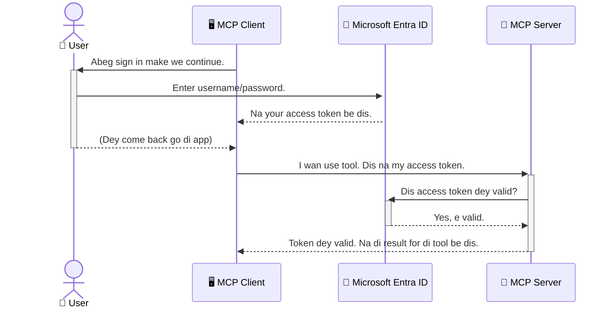

# Securing AI Workflows: Entra ID Authentication for Model Context Protocol Servers

## Introduction
To secure your Model Context Protocol (MCP) server na as important as to lock di front door of your house. If you leave your MCP server open, e fit expose your tools and data to unauthorised people, wey fit cause security wahala. Microsoft Entra ID dey provide strong cloud-based identity and access management solution, wey dey make sure say only authorised users and applications fit interact with your MCP server. For dis section, you go learn how to protect your AI workflows wit Entra ID authentication.

## Learning Objectives
By di time you finish dis section, you go fit:

- Understand why e important to secure MCP servers.
- Talk di basics of Microsoft Entra ID and OAuth 2.0 authentication.
- Know di difference between public and confidential clients.
- Implement Entra ID authentication inside local (public client) and remote (confidential client) MCP server scenarios.
- Apply security best practices when you dey develop AI workflows.

## Security and MCP

Just like you no go leave di front door of your house open, you no suppose leave your MCP server open for anybody to access. To secure your AI workflows na big tin for building solid, trust-worthy, and safe applications. Dis chapter go show you how to use Microsoft Entra ID to secure your MCP servers, so that only authorised users and applications fit interact wit your tools and data.

## Why Security Matters for MCP Servers

Imagine your MCP server get tool wey fit send emails or access customer database. If your server no secure, anybody fit use dat tool, wey fit lead to unauthorised data access, spam, or other bad activities.

If you implement authentication, e mean say every request to your server go dey verified, to confirm who be di user or application wey dey request. Dis na di first and most important step to secure your AI workflows.

## Introduction to Microsoft Entra ID

[**Microsoft Entra ID**](https://adoption.microsoft.com/microsoft-security/entra/) na cloud-based identity and access management service. Think am like universal security guard for your applications. E dey handle di complex process to verify user identities (authentication) and decide wetin dem fit do (authorization).

If you use Entra ID, you fit:

- Enable secure sign-in for users.
- Protect APIs and services.
- Manage access policies from one place.

For MCP servers, Entra ID dey give strong and well-trusted solution to manage who fit access your server’s abilites.

---

## Understanding the Magic: How Entra ID Authentication Works

Entra ID dey use open standards like **OAuth 2.0** to handle authentication. Although e fit get some complex tori, di main idea simple and you fit understand am wit analogy.

### A Gentle Introduction to OAuth 2.0: The Valet Key

Think of OAuth 2.0 like valet service for your car. When you reach restaurant, you no go give valet your master key. You go just give **valet key** wey get limited permission – e fit start di car and lock di doors, but e no fit open di trunk or glove compartment.

For dis example:

- **You** na di **User**.
- **Your car** na di **MCP Server** wit im valuable tools and data.
- Di **Valet** na **Microsoft Entra ID**.
- Di **Parking Attendant** na di **MCP Client** (di application wey wan access di server).
- Di **Valet Key** na di **Access Token**.

Di access token na correct password wey MCP client go get from Entra ID after you sign in. Di client go show dis token to MCP server every time e send request. Server go check di token to make sure say di request correct and di client get permission – no need to ever touch your real credentials (like your password).

### The Authentication Flow

How dis process dey go:



### Introducing the Microsoft Authentication Library (MSAL)

Before we dive inside code, e good make you sabi one important part you go see for examples: di **Microsoft Authentication Library (MSAL)**.

MSAL na library wey Microsoft develop to make am easy for developers to handle authentication. Instead make you write complex code to manage security tokens, sign-ins, and session refresh, MSAL dey do all di heavy work.

E good to use library like MSAL because:

- **E Secure:** E dey use industry-standard protocols and security best practices, so e reduce risk for vulnerability inside your code.
- **E Make Development Easy:** E simplify di complex OAuth 2.0 and OpenID Connect protocols, so to add strong authentication for your application, you just need few lines of code.
- **E Get Updates:** Microsoft dey maintain and update MSAL to fix new security threats and platform changes.

MSAL dey support many languages and frameworks like .NET, JavaScript/TypeScript, Python, Java, Go, and mobile platforms like iOS and Android. This one mean say you fit use di same authentication pattern for all your technology stack.

To learn more about MSAL, you fit check di official [MSAL overview documentation](https://learn.microsoft.com/entra/identity-platform/msal-overview).

---

## Securing Your MCP Server with Entra ID: A Step-by-Step Guide

Now, make we talk how to secure local MCP server (wey dey communicate over `stdio`) wit Entra ID. This example dey use **public client**, wey good for applications wey dey run for user machine, like desktop app or local development server.

### Scenario 1: Securing a Local MCP Server (with a Public Client)

For this case, we go see MCP server wey dey run locally, dey talk over `stdio`, and e dey use Entra ID to authenticate user before e allow access to tools. Di server go get one tool wey go fetch user profile data from Microsoft Graph API.

#### 1. Setting Up the Application in Entra ID

Before you start to write code, you need register your application for Microsoft Entra ID. Dis one dey allow Entra ID sabi your application and give am permission to use authentication service.

1. Go to **[Microsoft Entra portal](https://entra.microsoft.com/)**.
2. Enter **App registrations** and click **New registration**.
3. Give your application name (like "My Local MCP Server").
4. For **Supported account types**, choose **Accounts in this organizational directory only**.
5. You fit leave **Redirect URI** blank for this example.
6. Click **Register**.

After registration, make sure you note down **Application (client) ID** and **Directory (tenant) ID**. You go need dem for your code.

#### 2. The Code: A Breakdown

Make we look di important parts of code wey dey handle authentication. Whole code for dis example dey for [Entra ID - Local - WAM](https://github.com/Azure-Samples/mcp-auth-servers/tree/main/src/entra-id-local-wam) folder for [mcp-auth-servers GitHub repository](https://github.com/Azure-Samples/mcp-auth-servers).

**`AuthenticationService.cs`**

Dis class na im dey handle interaction wit Entra ID.

- **`CreateAsync`**: Dis method dey initialize `PublicClientApplication` from MSAL (Microsoft Authentication Library). E configure wit your application's `clientId` and `tenantId`.
- **`WithBroker`**: Dis enable use of broker (like Windows Web Account Manager), wey dey provide secure and smooth single sign-on experience.
- **`AcquireTokenAsync`**: Dis na main method. E first try get token silently (meaning user no go sign in again if dem still get valid session). If e no fit get silent token, e go prompt user to sign in interactively.

```csharp
// Simplified for clarity
public static async Task<AuthenticationService> CreateAsync(ILogger<AuthenticationService> logger)
{
    var msalClient = PublicClientApplicationBuilder
        .Create(_clientId) // Your Application (client) ID
        .WithAuthority(AadAuthorityAudience.AzureAdMyOrg)
        .WithTenantId(_tenantId) // Your Directory (tenant) ID
        .WithBroker(new BrokerOptions(BrokerOptions.OperatingSystems.Windows))
        .Build();

    // ... cache registration ...

    return new AuthenticationService(logger, msalClient);
}

public async Task<string> AcquireTokenAsync()
{
    try
    {
        // Try silent authentication first
        var accounts = await _msalClient.GetAccountsAsync();
        var account = accounts.FirstOrDefault();

        AuthenticationResult? result = null;

        if (account != null)
        {
            result = await _msalClient.AcquireTokenSilent(_scopes, account).ExecuteAsync();
        }
        else
        {
            // If no account, or silent fails, go interactive
            result = await _msalClient.AcquireTokenInteractive(_scopes).ExecuteAsync();
        }

        return result.AccessToken;
    }
    catch (Exception ex)
    {
        _logger.LogError(ex, "An error occurred while acquiring the token.");
        throw; // Optionally rethrow the exception for higher-level handling
    }
}
```

**`Program.cs`**

Dis na di file wey set up MCP server and integrate authentication service.

- **`AddSingleton<AuthenticationService>`**: E register `AuthenticationService` for dependency injection container, so other code parts fit use am (like our tool).
- **`GetUserDetailsFromGraph` tool**: Dis tool need `AuthenticationService` instance. Before e run, e call `authService.AcquireTokenAsync()` to get valid access token. If authentication success, e use token call Microsoft Graph API and fetch user details.

```csharp
// Simplified for clarity
[McpServerTool(Name = "GetUserDetailsFromGraph")]
public static async Task<string> GetUserDetailsFromGraph(
    AuthenticationService authService)
{
    try
    {
        // This will trigger the authentication flow
        var accessToken = await authService.AcquireTokenAsync();

        // Use the token to create a GraphServiceClient
        var graphClient = new GraphServiceClient(
            new BaseBearerTokenAuthenticationProvider(new TokenProvider(authService)));

        var user = await graphClient.Me.GetAsync();

        return System.Text.Json.JsonSerializer.Serialize(user);
    }
    catch (Exception ex)
    {
        return $"Error: {ex.Message}";
    }
}
```

#### 3. How It All Works Together

1. When MCP client wan use `GetUserDetailsFromGraph` tool, di tool first call `AcquireTokenAsync`.
2. `AcquireTokenAsync` make MSAL check if token dey valid.
3. If no token, MSAL go through broker, then prompt user to sign in with Entra ID.
4. After user sign in, Entra ID go issue access token.
5. Tool go receive di token and use am make secure call to Microsoft Graph API.
6. User details go return to MCP client.

Dis process make sure say only authenticated users fit use di tool, wey secure your local MCP server well well.

### Scenario 2: Securing a Remote MCP Server (with a Confidential Client)

If your MCP server dey run for remote machine (like cloud server) and e dey use protocol like HTTP Streaming, security requirements dey different. For dis one, you suppose use **confidential client** and **Authorization Code Flow**. Dis better pass because application secrets no go ever show for browser.

Dis example dey use TypeScript-based MCP server wey use Express.js to handle HTTP requests.

#### 1. Setting Up the Application in Entra ID

Setup for Entra ID na similar to public client but with one difference: you need create **client secret**.

1. Go to **[Microsoft Entra portal](https://entra.microsoft.com/)**.
2. For your app registration, enter **Certificates & secrets** tab.
3. Click **New client secret**, give description and click **Add**.
4. **Important:** Copy secret value immediately. After dis, you no go fit see am again.
5. You also need configure **Redirect URI**. Go to **Authentication** tab, click **Add a platform**, select **Web**, then enter redirect URI for your app (like `http://localhost:3001/auth/callback`).

> **⚠️ Important Security Note:** For production apps, Microsoft strongly recommends to use **secretless authentication** methods like **Managed Identity** or **Workload Identity Federation** instead of client secrets. Client secrets fit expose or compromise security. Managed identity dey safer because e no need you store credentials inside your code or config.
>
> For more info about managed identities and how to implement dem, check [Managed identities for Azure resources overview](https://learn.microsoft.com/entra/identity/managed-identities-azure-resources/overview).

#### 2. The Code: A Breakdown

Dis example use session-based approach. When user authenticate, server go store access token and refresh token inside session and give user session token. Dis session token go use for next requests. Full code dey for [Entra ID - Confidential client](https://github.com/Azure-Samples/mcp-auth-servers/tree/main/src/entra-id-cca-session) folder for [mcp-auth-servers GitHub repository](https://github.com/Azure-Samples/mcp-auth-servers).

**`Server.ts`**

Dis file dey set up Express server and MCP transport layer.

- **`requireBearerAuth`**: Dis middleware dey protect `/sse` and `/message` routes. E dey check if valid bearer token dey inside `Authorization` request header.
- **`EntraIdServerAuthProvider`**: Dis na custom class wey dey implement `McpServerAuthorizationProvider` interface. E dey responsible to handle OAuth 2.0 flow.
- **`/auth/callback`**: Dis endpoint dey handle redirect from Entra ID after user authenticate. E go exchange authorization code for access token and refresh token.

```typescript
// Make am simple so e clear
const app = express();
const { server } = createServer();
const provider = new EntraIdServerAuthProvider();

// Guard di SSE endpoint
app.get("/sse", requireBearerAuth({
  provider,
  requiredScopes: ["User.Read"]
}), async (req, res) => {
  // ... connect to di transport ...
});

// Guard di message endpoint
app.post("/message", requireBearerAuth({
  provider,
  requiredScopes: ["User.Read"]
}), async (req, res) => {
  // ... handle di message ...
});

// Handle di OAuth 2.0 callback
app.get("/auth/callback", (req, res) => {
  provider.handleCallback(req.query.code, req.query.state)
    .then(result => {
      // ... handle success or failure ...
    });
});
```

**`Tools.ts`**

Dis file define tools wey MCP server dey provide. `getUserDetails` tool similar to previous one but e get access token from session.

```typescript
// Make am simple make e clear
server.setRequestHandler(CallToolRequestSchema, async (request) => {
  const { name } = request.params;
  const context = request.params?.context as { token?: string } | undefined;
  const sessionToken = context?.token;

  if (name === ToolName.GET_USER_DETAILS) {
    if (!sessionToken) {
      throw new AuthenticationError("Authentication token is missing or invalid. Ensure the token is provided in the request context.");
    }

    // Comot Entra ID token from di session store
    const tokenData = tokenStore.getToken(sessionToken);
    const entraIdToken = tokenData.accessToken;

    const graphClient = Client.init({
      authProvider: (done) => {
        done(null, entraIdToken);
      }
    });

    const user = await graphClient.api('/me').get();

    // ... return di user detail dem ...
  }
});
```

**`auth/EntraIdServerAuthProvider.ts`**

Dis class dey handle logic for:

- Redirect user go Entra ID sign-in page.
- Exchange authorization code for access token.
- Store tokens inside `tokenStore`.
- Refresh access token when e expire.

#### 3. How It All Works Together

1. When user first try connect to MCP server, `requireBearerAuth` middleware go see say dem no get valid session and e go redirect dem go Entra ID sign-in page.
2. User go sign in wit their Entra ID account.
3. Entra ID dey redirect di user back to di `/auth/callback` endpoint wit one authorization code.
4. Di server dey exchange di code for access token and refresh token, e go store dem, den e go create session token wey e send go di client.
5. Di client fit use dis session token inside di `Authorization` header for all di future requests to di MCP server.
6. Wen dem call di `getUserDetails` tool, e go use di session token look di Entra ID access token, den e go use am call di Microsoft Graph API.

Dis flow complex pass di public client flow, but e necessary for internet-facing endpoints. Because remote MCP servers dey accessible through public internet, dem need better security measures to protect against unauthorized access and possible attacks.


## Security Best Practices

- **Always use HTTPS**: Encrypt di communication between di client and server to protect tokens from been kpapu.
- **Implement Role-Based Access Control (RBAC)**: No just check *if* user don authenticate; check *wetin* dem get permission to do. You fit define roles for Entra ID and check dem for your MCP server.
- **Monitor and audit**: Log all authentication events make you fit detect and respond to wahala.
- **Handle rate limiting and throttling**: Microsoft Graph and other APIs dey do rate limiting to prevent misuse. Make your MCP server get exponential backoff and retry logic to handle HTTP 429 (Too Many Requests) responses well well. Try cache data wey people dey use well well to reduce API calls.
- **Secure token storage**: Store access tokens and refresh tokens well. For local apps, use system secure storage. For server apps, consider to use encrypted storage or secure key management service like Azure Key Vault.
- **Token expiration handling**: Access tokens get limited lifetime. Make automatic token refresh dey happen using refresh tokens to keep user experience smooth without make dem login again.
- **Consider using Azure API Management**: Even though to add security directly inside your MCP server give you better control, API Gateways like Azure API Management fit handle many security matter automatically, including authentication, authorization, rate limiting, and monitoring. Dem go give you central security layer between your clients and MCP servers. For more details about API Gateways with MCP, see our [Azure API Management Your Auth Gateway For MCP Servers](https://techcommunity.microsoft.com/blog/integrationsonazureblog/azure-api-management-your-auth-gateway-for-mcp-servers/4402690).


## Key Takeaways

- Make your MCP server secure to protect your data and tools.
- Microsoft Entra ID dey provide robust and scalable solution for authentication and authorization.
- Use **public client** for local apps and **confidential client** for remote servers.
- The **Authorization Code Flow** na di most secure option for web apps.


## Exercise

1. Think about MCP server wey you fit build. E go be local server or remote server?
2. Based on your answer, you go use public or confidential client?
3. Wetin permission your MCP server go request to perform actions for Microsoft Graph?


## Hands-on Exercises

### Exercise 1: Register an Application in Entra ID
Go Microsoft Entra portal.
Register new application for your MCP server.
Record the Application (client) ID and Directory (tenant) ID.

### Exercise 2: Secure a Local MCP Server (Public Client)
- Follow di code example to integrate MSAL (Microsoft Authentication Library) for user authentication.
- Test di authentication flow by calling MCP tool wey dey fetch user details from Microsoft Graph.

### Exercise 3: Secure a Remote MCP Server (Confidential Client)
- Register confidential client in Entra ID and create client secret.
- Configure your Express.js MCP server make e use Authorization Code Flow.
- Test di protected endpoints and confirm token-based access.

### Exercise 4: Apply Security Best Practices
- Enable HTTPS for your local or remote server.
- Implement role-based access control (RBAC) for your server logic.
- Add token expiration handling and secure token storage.

## Resources

1. **MSAL Overview Documentation**  
   Learn how Microsoft Authentication Library (MSAL) dey enable secure token acquisition across platforms:  
   [MSAL Overview on Microsoft Learn](https://learn.microsoft.com/en-gb/entra/msal/overview)

2. **Azure-Samples/mcp-auth-servers GitHub Repository**  
   Reference implementations of MCP servers wey show authentication flows:  
   [Azure-Samples/mcp-auth-servers on GitHub](https://github.com/Azure-Samples/mcp-auth-servers)

3. **Managed Identities for Azure Resources Overview**  
   Understand how you fit comot secrets by using system- or user-assigned managed identities:  
   [Managed Identities Overview on Microsoft Learn](https://learn.microsoft.com/en-us/entra/identity/managed-identities-azure-resources/)

4. **Azure API Management: Your Auth Gateway for MCP Servers**  
   Deep dive into how to use APIM as secure OAuth2 gateway for MCP servers:  
   [Azure API Management Your Auth Gateway For MCP Servers](https://techcommunity.microsoft.com/blog/integrationsonazureblog/azure-api-management-your-auth-gateway-for-mcp-servers/4402690)

5. **Microsoft Graph Permissions Reference**  
   Complete list of delegated and application permissions for Microsoft Graph:  
   [Microsoft Graph Permissions Reference](https://learn.microsoft.com/zh-tw/graph/permissions-reference)


## Learning Outcomes
After you finish dis section, you go fit:

- Talk why authentication important for MCP servers and AI workflows.
- Set up and configure Entra ID authentication for both local and remote MCP server.
- Choose correct client type (public or confidential) based on your server deployment.
- Use secure coding practices, including token storage and role-based authorization.
- Protect your MCP server and tools well well from unauthorized access.

## What's next

- [5.13 Model Context Protocol (MCP) Integration with Microsoft Foundry](../mcp-foundry-agent-integration/README.md)

---

<!-- CO-OP TRANSLATOR DISCLAIMER START -->
**Disclaimer**:
Dis document don translate wit AI translation service [Co-op Translator](https://github.com/Azure/co-op-translator). Even tho we dey try make am correct, abeg make you know say automated translation fit get errors or mistakes. Di original document for dia own language na im be di correct source. For important info, make person wey sabi human translation do am. We no go responsible for any misunderstanding or wrong understanding wey fit happen because of dis translation.
<!-- CO-OP TRANSLATOR DISCLAIMER END -->