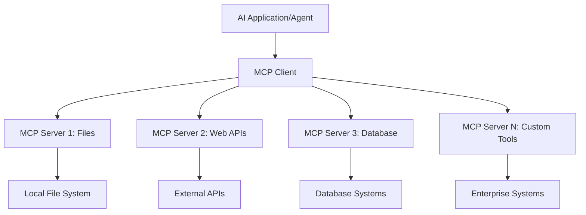

# 🌐 Module 2: MCP wit Microsoft Foundry Toolkit Fundamentals

[]()
[]()
[]()

## 📋 Learning Objectives

By di end of dis module, you go fit:
- ✅ Understand Model Context Protocol (MCP) architecture and benefits
- ✅ Explore Microsoft's MCP server ecosystem
- ✅ Integrate MCP servers wit Microsoft Foundry Toolkit Agent Builder
- ✅ Build one correct browser automation agent using Playwright MCP
- ✅ Configure and test MCP tools inside your agents
- ✅ Export and deploy MCP-powered agents for production use

## 🎯 Building on Module 1

Inside Module 1, we master Microsoft Foundry Toolkit basics and create our first Python Agent. Now we go **supercharge** your agents by joining dem to external tools and services through di revolutionary **Model Context Protocol (MCP)**.

Think am like dis: You dey upgrade from basic calculator go full computer - your AI agents go fit:
- 🌐 Browse and interact wit websites
- 📁 Access and manipulate files
- 🔧 Integrate wit enterprise systems
- 📊 Process real-time data from APIs

## 🧠 Understanding Model Context Protocol (MCP)

### 🔍 Wetin be MCP?

Model Context Protocol (MCP) na **"USB-C for AI applications"** - one revolutionary open standard wey dey connect Large Language Models (LLMs) to external tools, data sources, and services. Just like USB-C stop cable wahala by giving one universal connector, MCP stop AI integration gbege wit one standardized protocol.

### 🎯 Di Problem MCP Solve

**Before MCP:**
- 🔧 Custom integrations for every tool
- 🔄 Vendor lock-in wit proprietary solutions  
- 🔒 Security gbege from ad-hoc connections
- ⏱️ Months development time for basic integrations

**With MCP:**
- ⚡ Plug-and-play tool integration
- 🔄 Vendor-agnostic architecture
- 🛡️ Built-in security beta practice dem
- 🚀 Minutes to add new powers

### 🏗️ MCP Architecture Deep Dive

MCP follow **client-server architecture** wey create one secure, scalable ecosystem:



**🔧 Core Components:**

| Component | Role | Examples |
|-----------|------|----------|
| **MCP Hosts** | Applications wey dey use MCP services | Claude Desktop, VS Code, Microsoft Foundry Toolkit |
| **MCP Clients** | Protocol handlers (1:1 wit servers) | Built inside host applications |
| **MCP Servers** | Show capabilities using standard protocol | Playwright, Files, Azure, GitHub |
| **Transport Layer** | Communication methods | stdio, HTTP, WebSockets |


## 🏢 Microsoft's MCP Server Ecosystem

Microsoft dey lead di MCP ecosystem wit full suite of enterprise-grade servers wey fit solve real-world business needs.

### 🌟 Featured Microsoft MCP Servers

#### 1. ☁️ Azure MCP Server
**🔗 Repository**: [azure/azure-mcp](https://github.com/azure/azure-mcp)
**🎯 Purpose**: Full Azure resource management wit AI integration

**✨ Key Features:**
- Declarative infrastructure provisioning
- Real-time resource monitoring
- Cost optimization recommendations
- Security compliance checking

**🚀 Use Cases:**
- Infrastructure-as-Code wit AI support
- Automated resource scaling
- Cloud cost optimization
- DevOps workflow automation

#### 2. 📊 Microsoft Dataverse MCP
**📚 Documentation**: [Microsoft Dataverse Integration](https://go.microsoft.com/fwlink/?linkid=2320176)
**🎯 Purpose**: Natural language interface for business data

**✨ Key Features:**
- Natural language database queries
- Business context understanding
- Custom prompt templates
- Enterprise data governance

**🚀 Use Cases:**
- Business intelligence reporting
- Customer data analysis
- Sales pipeline insights
- Compliance data queries

#### 3. 🌐 Playwright MCP Server
**🔗 Repository**: [microsoft/playwright-mcp](https://github.com/microsoft/playwright-mcp)
**🎯 Purpose**: Browser automation and web interaction powers

**✨ Key Features:**
- Cross-browser automation (Chrome, Firefox, Safari)
- Intelligent element detection
- Screenshot and PDF generation
- Network traffic monitoring

**🚀 Use Cases:**
- Automated testing workflows
- Web scraping and data extraction
- UI/UX monitoring
- Competitive analysis automation

#### 4. 📁 Files MCP Server
**🔗 Repository**: [microsoft/files-mcp-server](https://github.com/microsoft/files-mcp-server)
**🎯 Purpose**: Intelligent file system operations

**✨ Key Features:**
- Declarative file management
- Content synchronization
- Version control integration
- Metadata extraction

**🚀 Use Cases:**
- Documentation management
- Code repository organization
- Content publishing workflows
- Data pipeline file handling

#### 5. 📝 MarkItDown MCP Server
**🔗 Repository**: [microsoft/markitdown](https://github.com/microsoft/markitdown)
**🎯 Purpose**: Advanced Markdown processing and manipulation

**✨ Key Features:**
- Rich Markdown parsing
- Format conversion (MD ↔ HTML ↔ PDF)
- Content structure analysis
- Template processing

**🚀 Use Cases:**
- Technical documentation workflows
- Content management systems
- Report generation
- Knowledge base automation

#### 6. 📈 Clarity MCP Server
**📦 Package**: [@microsoft/clarity-mcp-server](https://www.npmjs.com/package/@microsoft/clarity-mcp-server)
**🎯 Purpose**: Web analytics and user behavior insights

**✨ Key Features:**
- Heatmap data analysis
- User session recordings
- Performance metrics
- Conversion funnel analysis

**🚀 Use Cases:**
- Website optimization
- User experience research
- A/B testing analysis
- Business intelligence dashboards

### 🌍 Community Ecosystem

Outside Microsoft's servers, the MCP ecosystem get:
- **🐙 GitHub MCP**: Repository management and code analysis
- **🗄️ Database MCPs**: PostgreSQL, MySQL, MongoDB integrations
- **☁️ Cloud Provider MCPs**: AWS, GCP, Digital Ocean tools
- **📧 Communication MCPs**: Slack, Teams, Email integrations

## 🛠️ Hands-On Lab: Building Browser Automation Agent

**🎯 Project Goal**: Build one smart browser automation agent using Playwright MCP server wey fit waka for websites, waka collect info, and perform complex web actions.

### 🚀 Phase 1: Agent Foundation Setup

#### Step 1: Initialize Your Agent
1. **Open Microsoft Foundry Toolkit Agent Builder**
2. **Create New Agent** wit dis configuration:
   - **Name**: `BrowserAgent`
   - **Model**: Choose GPT-4o 


### 🔧 Phase 2: MCP Integration Workflow

#### Step 3: Add MCP Server Integration
1. **Go Tools Section** for Agent Builder
2. **Click "Add Tool"** to open integration menu
3. **Select "MCP Server"** for the options


**🔍 Understanding Tool Types:**
- **Built-in Tools**: Pre-configured Microsoft Foundry Toolkit functions
- **MCP Servers**: External service integrations
- **Custom APIs**: Your own service endpoints
- **Function Calling**: Direct model function access

#### Step 4: MCP Server Selection
1. **Choose "MCP Server"** option to move forward


2. **Browse MCP Catalog** to check available integrations


### 🎮 Phase 3: Playwright MCP Configuration

#### Step 5: Select and Configure Playwright
1. **Click "Use Featured MCP Servers"** to see Microsoft's verified servers
2. **Select "Playwright"** from di list
3. **Accept Default MCP ID** or change am for your environment


#### Step 6: Enable Playwright Capabilities
**🔑 Important Step**: Select **ALL** Playwright methods available for max work


**🛠️ Essential Playwright Tools:**
- **Navigation**: `goto`, `goBack`, `goForward`, `reload`
- **Interaction**: `click`, `fill`, `press`, `hover`, `drag`
- **Extraction**: `textContent`, `innerHTML`, `getAttribute`
- **Validation**: `isVisible`, `isEnabled`, `waitForSelector`
- **Capture**: `screenshot`, `pdf`, `video`
- **Network**: `setExtraHTTPHeaders`, `route`, `waitForResponse`

#### Step 7: Verify Integration Success
**✅ Success Indicators:**
- All tools dey show for Agent Builder interface
- No error messages for integration panel
- Playwright server status show "Connected"


**🔧 Troubleshooting Common Issues:**
- **Connection Failed**: Check internet and firewall
- **Missing Tools**: Make sure you select all powers during setup
- **Permission Errors**: Check say VS Code get correct system permission

### 🎯 Phase 4: Advanced Prompt Engineering

#### Step 8: Design Intelligent System Prompts
Make complex prompts wey take advantage of Playwright full powers:

```markdown
# Web Automation Expert System Prompt

## Core Identity
You are an advanced web automation specialist with deep expertise in browser automation, web scraping, and user experience analysis. You have access to Playwright tools for comprehensive browser control.

## Capabilities & Approach
### Navigation Strategy
- Always start with screenshots to understand page layout
- Use semantic selectors (text content, labels) when possible
- Implement wait strategies for dynamic content
- Handle single-page applications (SPAs) effectively

### Error Handling
- Retry failed operations with exponential backoff
- Provide clear error descriptions and solutions
- Suggest alternative approaches when primary methods fail
- Always capture diagnostic screenshots on errors

### Data Extraction
- Extract structured data in JSON format when possible
- Provide confidence scores for extracted information
- Validate data completeness and accuracy
- Handle pagination and infinite scroll scenarios

### Reporting
- Include step-by-step execution logs
- Provide before/after screenshots for verification
- Suggest optimizations and alternative approaches
- Document any limitations or edge cases encountered

## Ethical Guidelines
- Respect robots.txt and rate limiting
- Avoid overloading target servers
- Only extract publicly available information
- Follow website terms of service
```

#### Step 9: Create Dynamic User Prompts
Make prompts wey show different powers:

**🌐 Web Analysis Example:**
```markdown
Navigate to github.com/kinfey and provide a comprehensive analysis including:
1. Repository structure and organization
2. Recent activity and contribution patterns  
3. Documentation quality assessment
4. Technology stack identification
5. Community engagement metrics
6. Notable projects and their purposes

Include screenshots at key steps and provide actionable insights.
```


### 🚀 Phase 5: Execution and Testing

#### Step 10: Execute Your First Automation
1. **Click "Run"** to start automation run
2. **Monitor Real-time Execution**:
   - Chrome browser go open automatically
   - Agent go waka enter target website
   - Screenshots dey capture each big step
   - Analysis results dey flow for real-time


#### Step 11: Analyze Results and Insights
Review detailed analysis for Agent Builder interface:


### 🌟 Phase 6: Advanced Capabilities and Deployment

#### Step 12: Export and Production Deployment
Agent Builder get plenty deployment options:


## 🎓 Module 2 Summary & Next Steps

### 🏆 Achievement Unlocked: MCP Integration Master

**✅ Skills Mastered:**
- [ ] Understand MCP architecture and benefits
- [ ] Navigate Microsoft MCP server ecosystem
- [ ] Integrate Playwright MCP wit Microsoft Foundry Toolkit
- [ ] Build advanced browser automation agents
- [ ] Advanced prompt engineering for web automation

### 📚 Additional Resources

- **🔗 MCP Specification**: [Official Protocol Documentation](https://modelcontextprotocol.io/)
- **🛠️ Playwright API**: [Complete Method Reference](https://playwright.dev/docs/api/class-playwright)
- **🏢 Microsoft MCP Servers**: [Enterprise Integration Guide](https://github.com/microsoft/mcp-servers)
- **🌍 Community Examples**: [MCP Server Gallery](https://github.com/modelcontextprotocol/servers)

**🎉 Congratulations!** You don sabi MCP integration well and fit build production-ready AI agents wit external tool powers!


### 🔜 Continue to Next Module

Ready to carry your MCP skills go next level? Move to **[Module 3: Advanced MCP Development with Microsoft Foundry Toolkit](../lab3/README.md)** wey you go learn how to:
- Build your own custom MCP servers
- Configure and use latest MCP Python SDK
- Setup MCP Inspector for debugging
- Master advanced MCP server development workflows
- Build Weather MCP Server from scratch

---

<!-- CO-OP TRANSLATOR DISCLAIMER START -->
**Disclaimer**:
Dis document don translate wit AI translation service [Co-op Translator](https://github.com/Azure/co-op-translator). Even tho we dey try make am correct, abeg make you know say automated translation fit get errors or mistakes. Di original document for dia own language na im be di correct source. For important info, make person wey sabi human translation do am. We no go responsible for any misunderstanding or wrong understanding wey fit happen because of dis translation.
<!-- CO-OP TRANSLATOR DISCLAIMER END -->