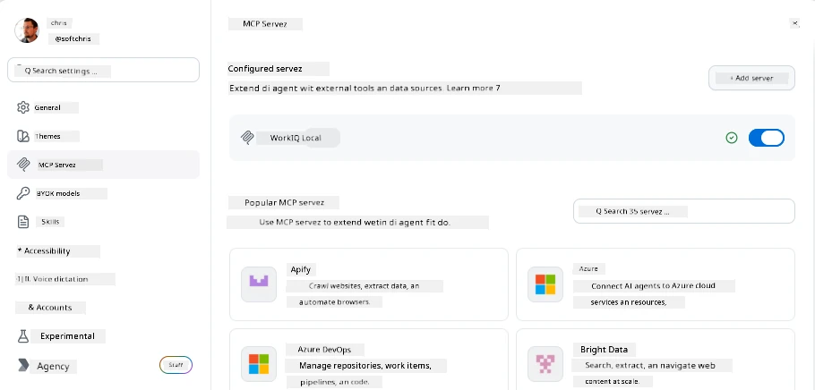
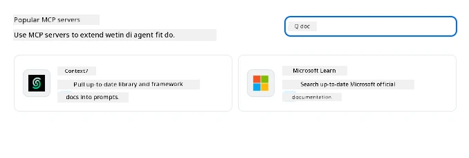
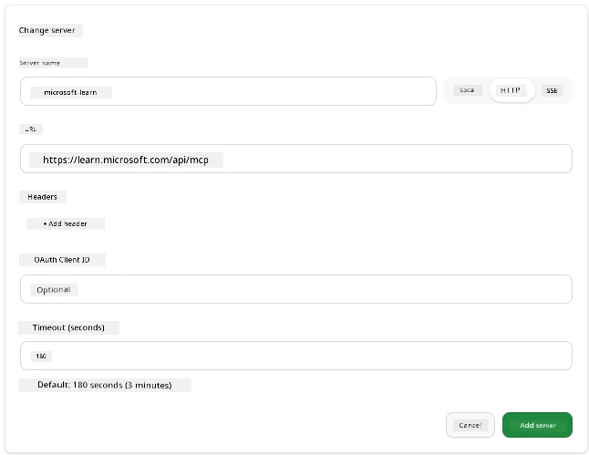
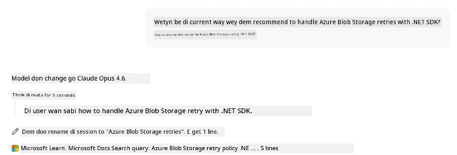
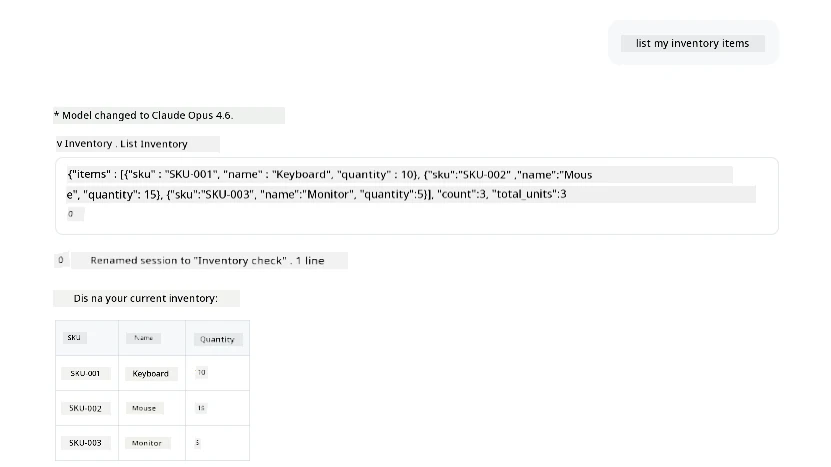
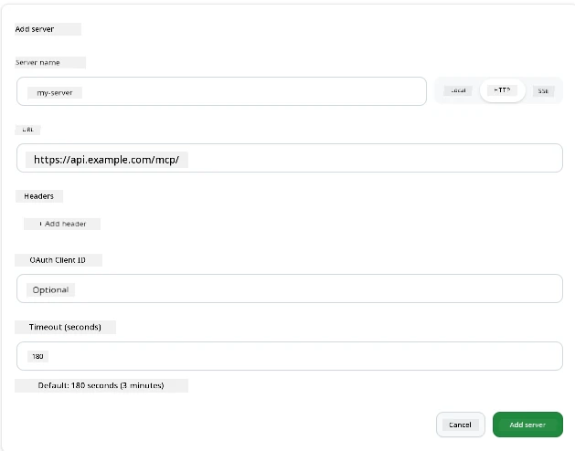

# Using MCP Servers for GitHub Copilot App

By now, you don new how MCP dey work. You don build servers, define tools and resources, plus connect clients. Wetin we never do be say, we no don look am from another side: instead make you be the one wey dey build the server, how e be if you be person wey dey *use* am—as person wey dey use AI-powered app wey support MCP?

[GitHub Copilot App](https://github.com/github/app) na desktop app wey fit use MCP Servers. If you connect MCP servers to am, e go open new level: Copilot fit enter your documents, call your internal APIs, query your database, or talk to any service wey you don wrap inside server. The app dey be host; your MCP servers become the tools.

This lesson go show you the whole experience from start to finish—how to find MCP settings panel, connect real documentation server, then wire up custom one wey be your own.

## Learning Objectives

By the end of this lesson, you go fit:

- Find and waka inside MCP Servers panel for Copilot App settings.
- Connect one hosted documentation server and use am for session.
- Register custom server and confirm say Copilot fit use tools wey dey inside am.
- Configure how server dey call by giving environment variables or custom headers (if HTTP).

## The Copilot App as an MCP Host

The koko be this: **Copilot agents smart, but na only wetin you tell dem dem sabi.** By default, agent fit read files for your workspace and run terminal commands, but e no fit query your database, check your calendar, or call custom API without help. Na here MCP servers go enter. Dem be bridges between Copilot and your systems—databases, version control, APIs, design tools—make agents get access to information and actions wey dem need to finish work.

Make we start by finding the settings wey go let you manage your app MCP Servers.

## Step 1: Finding the MCP Settings Panel

Open the Copilot App, find cog icon for bottom-left, then click am.


Make sure say you select "MCP Servers" and you go see your already set servers for top, marketplace of popular servers for bottom, plus "Add Server" button for top like this:



This na your control center. You fit add, remove, enable, disable servers here. Changes go affect new sessions; if session dey open, you go need start fresh session after you change this list.

## Step 2: Connecting a Documentation Server

Make we do better beta thing. Microsoft Docs MCP server dey give Copilot access to official Microsoft documentation. E get Azure, .NET, TypeScript, plus more. Instead make agent rely on training data wey get cutoff date, e fit pull current docs when e query.

How to add am:

1. For popular servers grid, type **learn** then select "Microsoft Learn" server.

   

   As you click am, e go show form wey get name, transport type and URL prefilled, all you need na to click "Add Server".

2. Click "Add Server", e go take small time to connect to server.

   

   When e add finish, e go show for top area as configured server. Make we try am next.

3. Close the dialog then select Quick chat.

4. Type this prompt below to trigger tool for Microsoft Learn server.

   ```text
   What's the current recommended approach for handling Azure Blob Storage 
   retries using the .NET SDK?
   ```

   

You go see how e refer to MCP Server wey we just add.

## Step 3: Connecting a Custom stdio Server

Presets easy, but real power na to connect your own servers. Suppose you build server (or get one) wey expose your internal API or company knowledge base. Here, we go use MCP Server wey we build wey handle our company's inventory management.

1. Click cog then select "MCP servers" again.

2. Select "Add Server" button then "+ Add Custom server", give these values:

   - Name: `Inventory Server`
   - Select transport (for right), **http**

   Click "Add Server" then e go show for your list of configured servers.

   

4. To test am, run prompt like this:

    ```
    list inventory
    ```

   

   You go see list of inventory items wey your custom-built server return.

Nice, you don sabi how to add external plus your own MCP servers to Copilot App. Next, we go talk about how to manage secrets and environment variables.

## Step 4: Advanced settings

So far, you don see how to add MCP Servers where you just give name and URL. But wetin if your server need API key or other value? Depending on transport type, we fit add wetin e need.

- **http or SSE transport**: Here, you fit set headers as needed.

   For auth, you fit specify Authorization header for example. The value fit be static string. If you dey use OAuth, you fit give OAuth client ID instead.

   

- **stdio transport**: You fit set environment variables.

   Here, you fit give any number of environment variables wey your server need when e start.

   

## Summary

Copilot App treat MCP servers as first-class extension of agent’s capabilities. You don see whole journey for this lesson from adding MCP servers to using dem for session. Now you fit connect public servers, internal APIs, plus custom tools, let your agents get information and do actions dem need to finish tasks on their own.

## 📚 Additional Resources

### Official docs

- [GitHub Copilot App](https://github.com/github/app)
- [MCP Specification](https://modelcontextprotocol.io/specification/2025-03-26) - Model Context Protocol specification

### Community
- [MCP Community Discord](https://discord.com/invite/ByRwuEEgH4) - Live discussions
- [GitHub Discussions](https://github.com/microsoft/MCP-Server-and-PostgreSQL-Sample-Retail/discussions) - Q&A and sharing
- [Stack Overflow](https://stackoverflow.com/questions/tagged/model-context-protocol) - Technical questions

---

<!-- CO-OP TRANSLATOR DISCLAIMER START -->
**Disclaimer**:
Dis document don translate wit AI translation service [Co-op Translator](https://github.com/Azure/co-op-translator). Even tho we dey try make am correct, abeg make you know say automated translation fit get errors or mistakes. Di original document for dia own language na im be di correct source. For important info, make person wey sabi human translation do am. We no go responsible for any misunderstanding or wrong understanding wey fit happen because of dis translation.
<!-- CO-OP TRANSLATOR DISCLAIMER END -->