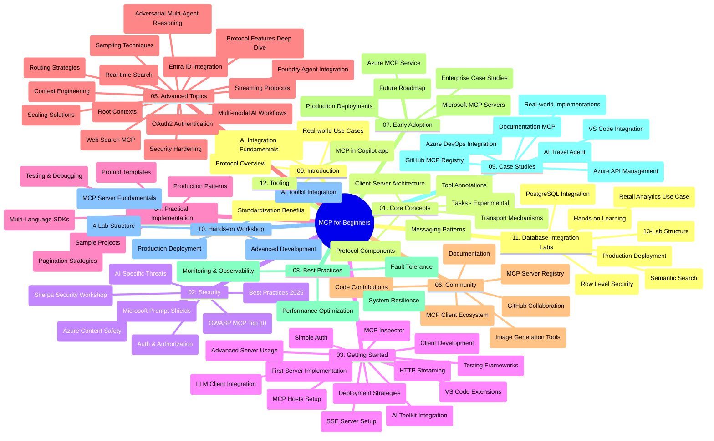

# Model Context Protocol (MCP) for Beginners - Study Guide

Dis study guide dey give you koko of di repository structure and wetin dey inside for di "Model Context Protocol (MCP) for Beginners" curriculum. Use dis guide make you fit waka well for di repository and enjoy all di resources.

## Repository Overview

Di Model Context Protocol (MCP) na one standard way wey AI models and client applications dem dey take yarn. E start from Anthropic, but now di big MCP community dey manage am tru di official GitHub group. Dis repository get full course with code examples for C#, Java, JavaScript, Python, and TypeScript, wey dey for AI developers, system architects, and software engineers.

## Visual Curriculum Map

## Repository Structure

Di repository divide into twelve main parts, and each one dey focus for different sides of MCP:

1. **Introduction (00-Introduction/)**
   - Overview of di Model Context Protocol
   - Why e good to get standard for AI pipelines
   - Real-life examples and benefits

2. **Core Concepts (01-CoreConcepts/)**
   - Client-server architecture
   - Main parts wey dey di protocol
   - Messaging patterns for MCP

3. **Security (02-Security/)**
   - Security threats wey dey MCP-based systems
   - Best ways to secure implementations
   - Authentication and authorization methods
   - **Complete Security Documentation**:
     - MCP Security Best Practices 2025
     - Azure Content Safety Implementation Guide
     - MCP Security Controls and Techniques
     - MCP Best Practices Quick Reference
   - **Important Security Topics**:
     - Prompt injection and tool poisoning attacks
     - Session hijacking and confused deputy problems
     - Token passthrough vulnerabilities
     - Too much permissions and access control
     - Supply chain security for AI components
     - Microsoft Prompt Shields integration

4. **Getting Started (03-GettingStarted/)**
   - How to set up environment and configuration
   - How to create basic MCP servers and clients
   - How to join am with existing applications
   - Dem include:
     - First server implementation
     - Client development
     - LLM client integration
     - VS Code integration
     - Server-Sent Events (SSE) server
     - Advanced server usage
     - HTTP streaming
     - AI Toolkit integration
     - Testing methods
     - Deployment instructions

5. **Practical Implementation (04-PracticalImplementation/)**
   - How to use SDKs for different programming languages
   - How to debug, test, and validate 
   - How to make reusable prompt templates and workflows
   - Sample projects with examples

6. **Advanced Topics (05-AdvancedTopics/)**
   - Context engineering techniques
   - Foundry agent integration
   - Multi-modal AI workflows 
   - OAuth2 authentication demos
   - Real-time search capabilities
   - Real-time streaming
   - Root contexts implementation
   - Routing strategies
   - Sampling techniques
   - Scaling approaches
   - Security considerations
   - Entra ID security integration
   - Web search integration
   - Adversarial multi-agent reasoning (debate patterns)

7. **Community Contributions (06-CommunityContributions/)**
   - How to contribute code and documentation
   - How to collaborate via GitHub
   - Community-driven improvements and feedback
   - How to use different MCP clients (Claude Desktop, Cline, VSCode)
   - Working with popular MCP servers including image generation

8. **Lessons from Early Adoption (07-LessonsfromEarlyAdoption/)**
   - Real-life implementations and success stories
   - Building and deploying MCP-based solutions
   - Trends and future plans
   - **Microsoft MCP Servers Guide**: Complete guide to 10 production-ready Microsoft MCP servers including:
     - Microsoft Learn Docs MCP Server
     - Azure MCP Server (15+ specialized connectors)
     - GitHub MCP Server
     - Azure DevOps MCP Server
     - MarkItDown MCP Server
     - SQL Server MCP Server
     - Playwright MCP Server
     - Dev Box MCP Server
     - Microsoft Foundry MCP Server
     - Microsoft 365 Agents Toolkit MCP Server

9. **Best Practices (08-BestPractices/)**
   - How to tune performance and optimize
   - Designing MCP systems wey no go fail easily
   - Testing and resilience methods

10. **Case Studies (09-CaseStudy/)**
    - **Seven wide case studies** showing how MCP fit work for different situations:
    - **Azure AI Travel Agents**: Multiple agents working with Azure OpenAI and AI Search
    - **Azure DevOps Integration**: Automatic workflows with YouTube data updates
    - **Real-Time Documentation Retrieval**: Python console client with streaming HTTP
    - **Interactive Study Plan Generator**: Chainlit web app with conversational AI
    - **In-Editor Documentation**: VS Code integration with GitHub Copilot workflows
    - **Azure API Management**: Enterprise API integration with MCP server creation
    - **GitHub MCP Registry**: Ecosystem development and agentic integration platform
    - Examples spanning enterprise integration, developer productivity, and ecosystem building

11. **Hands-on Workshop (10-StreamliningAIWorkflowsBuildingAnMCPServerWithAIToolkit/)**
    - Full hands-on workshop wey join MCP with AI Toolkit
    - Building smart applications linking AI models with real tools
    - Practical modules covering basics, custom server making, and deployment strategies
    - **Lab Structure**:
      - Lab 1: MCP Server Fundamentals
      - Lab 2: Advanced MCP Server Development
      - Lab 3: AI Toolkit Integration
      - Lab 4: Production Deployment and Scaling
    - Step-by-step lab instruction

12. **MCP Server Database Integration Labs (11-MCPServerHandsOnLabs/)**
    - **Complete 13-lab learning pathway** for building production-ready MCP servers with PostgreSQL
    - **Real-life retail analytics implementation** with Zava Retail use case
    - **Enterprise-grade patterns** like Row Level Security (RLS), semantic search, and multi-tenant data access
    - **Full Lab Structure**:
      - **Labs 00-03: Foundations** - Introduction, Architecture, Security, Environment Setup
      - **Labs 04-06: Building the MCP Server** - Database Design, MCP Server Implementation, Tool Development
      - **Labs 07-09: Advanced Features** - Semantic Search, Testing & Debugging, VS Code Integration
      - **Labs 10-12: Production & Best Practices** - Deployment, Monitoring, Optimization
    - **Tech wey dem use**: FastMCP framework, PostgreSQL, Azure OpenAI, Azure Container Apps, Application Insights
    - **Learning Results**: Production-ready MCP servers, database integration styles, AI-powered analytics, enterprise security

13. **Tooling (12-tooling/)**
    - Learn how to use MCP in Copilot app and other tools

## Additional Resources

Di repository get extra resources to support:

- **Images folder**: Get diagrams and pictures wey dem use for di curriculum
- **Translations**: Support for many languages with automatic translations for documentation
- **Official MCP Resources**:
  - [MCP Documentation](https://modelcontextprotocol.io/)
  - [MCP Specification](https://spec.modelcontextprotocol.io/)
  - [MCP GitHub Repository](https://github.com/modelcontextprotocol)

## How to Use This Repository

1. **Learn in order**: Follow di chapters from 00 to 11 for proper learning.
2. **Pick language you like**: If you get favorite programming language, check di samples folders for examples for dat language.
3. **Start practical**: Begin with "Getting Started" to set up environment and create your first MCP server and client.
4. **Explore advanced**: After you sabi di basics well, go into advanced topics to sabi more.
5. **Join community**: Link up with MCP community for GitHub discussions and Discord to meet experts and other developers.

## MCP Clients and Tools

Di curriculum cover different MCP clients and tools:

1. **Official Clients**:
   - Visual Studio Code 
   - MCP for Visual Studio Code
   - Claude Desktop
   - Claude for VSCode 
   - Claude API

2. **Community Clients**:
   - Cline (terminal-based)
   - Cursor (code editor)
   - ChatMCP
   - Windsurf

3. **MCP Management Tools**:
   - MCP CLI
   - MCP Manager
   - MCP Linker
   - MCP Router

## Popular MCP Servers

Di repository show different MCP servers, including:

1. **Official Microsoft MCP Servers**:
   - Microsoft Learn Docs MCP Server
   - Azure MCP Server (15+ special connectors)
   - GitHub MCP Server
   - Azure DevOps MCP Server
   - MarkItDown MCP Server
   - SQL Server MCP Server
   - Playwright MCP Server
   - Dev Box MCP Server
   - Microsoft Foundry MCP Server
   - Microsoft 365 Agents Toolkit MCP Server

2. **Official Reference Servers**:
   - Filesystem
   - Fetch
   - Memory
   - Sequential Thinking

3. **Image Generation**:
   - Azure OpenAI DALL-E 3
   - Stable Diffusion WebUI
   - Replicate

4. **Development Tools**:
   - Git MCP
   - Terminal Control
   - Code Assistant

5. **Specialized Servers**:
   - Salesforce
   - Microsoft Teams
   - Jira & Confluence

## Contributing

Dis repository dey welcome code and documentation contribution from di community. Check Community Contributions section on how to contribute well to di MCP ecosystem.

----

*Dis study guide last update na for February 5, 2026, and e reflect di latest MCP Specification 2025-11-25 and give overview of di repository till dat time. Di content fit get updates after dat date.*

---

<!-- CO-OP TRANSLATOR DISCLAIMER START -->
**Disclaimer**:
Dis document don translate wit AI translation service [Co-op Translator](https://github.com/Azure/co-op-translator). Even tho we dey try make am correct, abeg make you know say automated translation fit get errors or mistakes. Di original document for dia own language na im be di correct source. For important info, make person wey sabi human translation do am. We no go responsible for any misunderstanding or wrong understanding wey fit happen because of dis translation.
<!-- CO-OP TRANSLATOR DISCLAIMER END -->