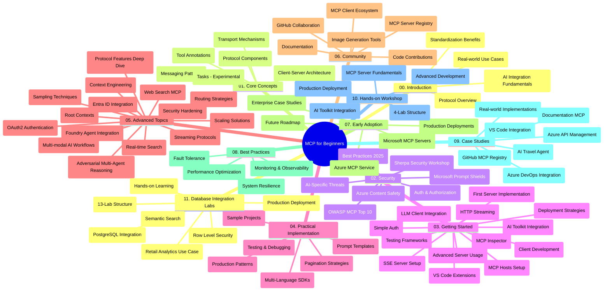

# Model Context Protocol (MCP) for Beginners - Study Guide

Dis study guide dey give overview of di repository structure and content for di "Model Context Protocol (MCP) for Beginners" curriculum. Use dis guide to waka through di repository well well and use di resources wey dey available better.

## Repository Overview

Di Model Context Protocol (MCP) na standardized framework for how AI models and client applications dey interact. Anthropic create am for start, but now di wider MCP community dey maintain am thru di official GitHub organization. Dis repository get correct curriculum wey get hands-on code examples for C#, Java, JavaScript, Python, and TypeScript, wey dem design for AI developers, system architects, and software engineers.

## Visual Curriculum Map

## Repository Structure

Di repository organize into eleven main sections, each one dey focus on different parts of MCP:

1. **Introduction (00-Introduction/)**
   - Overview of di Model Context Protocol
   - Why standardization matter for AI pipelines
   - Practical use cases and benefits

2. **Core Concepts (01-CoreConcepts/)**
   - Client-server architecture
   - Key protocol components
   - Messaging patterns for MCP

3. **Security (02-Security/)**
   - Security threats for MCP-based systems
   - Best practices to secure implementations
   - Authentication and authorization strategies
   - **Comprehensive Security Documentation**:
     - MCP Security Best Practices 2025
     - Azure Content Safety Implementation Guide
     - MCP Security Controls and Techniques
     - MCP Best Practices Quick Reference
   - **Key Security Topics**:
     - Prompt injection and tool poisoning attacks
     - Session hijacking and confused deputy problems
     - Token passthrough vulnerabilities
     - Excessive permissions and access control
     - Supply chain security for AI components
     - Microsoft Prompt Shields integration

4. **Getting Started (03-GettingStarted/)**
   - Environment setup and configuration
   - Creating basic MCP servers and clients
   - Integration with existing applications
   - Includes sections for:
     - First server implementation
     - Client development
     - LLM client integration
     - VS Code integration
     - Server-Sent Events (SSE) server
     - Advanced server usage
     - HTTP streaming
     - AI Toolkit integration
     - Testing strategies
     - Deployment guidelines

5. **Practical Implementation (04-PracticalImplementation/)**
   - Using SDKs for different programming languages
   - Debugging, testing, and validation techniques
   - Crafting reusable prompt templates and workflows
   - Sample projects with implementation examples

6. **Advanced Topics (05-AdvancedTopics/)**
   - Context engineering techniques
   - Foundry agent integration
   - Multi-modal AI workflows 
   - OAuth2 authentication demos
   - Real-time search capabilities
   - Real-time streaming
   - Root contexts implementation
   - Routing strategies
   - Sampling techniques
   - Scaling approaches
   - Security considerations
   - Entra ID security integration
   - Web search integration
   - Adversarial multi-agent reasoning (debate patterns)

7. **Community Contributions (06-CommunityContributions/)**
   - How to contribute code and documentation
   - Collaborating via GitHub
   - Community-driven enhancements and feedback
   - Using different MCP clients (Claude Desktop, Cline, VSCode)
   - Working with popular MCP servers including image generation

8. **Lessons from Early Adoption (07-LessonsfromEarlyAdoption/)**
   - Real-world implementations and success stories
   - Building and deploying MCP-based solutions
   - Trends and future roadmap
   - **Microsoft MCP Servers Guide**: Complete guide to 10 production-ready Microsoft MCP servers wey include:
     - Microsoft Learn Docs MCP Server
     - Azure MCP Server (15+ specialized connectors)
     - GitHub MCP Server
     - Azure DevOps MCP Server
     - MarkItDown MCP Server
     - SQL Server MCP Server
     - Playwright MCP Server
     - Dev Box MCP Server
     - Microsoft Foundry MCP Server
     - Microsoft 365 Agents Toolkit MCP Server

9. **Best Practices (08-BestPractices/)**
   - Performance tuning and optimization
   - Designing fault-tolerant MCP systems
   - Testing and resilience strategies

10. **Case Studies (09-CaseStudy/)**
    - **Seven comprehensive case studies** wey show how MCP fit work for different scenarios:
    - **Azure AI Travel Agents**: Multi-agent orchestration with Azure OpenAI and AI Search
    - **Azure DevOps Integration**: Automating workflow processes with YouTube data updates
    - **Real-Time Documentation Retrieval**: Python console client with streaming HTTP
    - **Interactive Study Plan Generator**: Chainlit web app with conversational AI
    - **In-Editor Documentation**: VS Code integration with GitHub Copilot workflows
    - **Azure API Management**: Enterprise API integration with MCP server creation
    - **GitHub MCP Registry**: Ecosystem development and agentic integration platform
    - Implementation examples wey cover enterprise integration, developer productivity, and ecosystem development

11. **Hands-on Workshop (10-StreamliningAIWorkflowsBuildingAnMCPServerWithAIToolkit/)**
    - Comprehensive hands-on workshop wey join MCP with AI Toolkit
    - Building intelligent applications wey link AI models with real-world tools
    - Practical modules wey cover fundamentals, custom server development, and production deployment strategies
    - **Lab Structure**:
      - Lab 1: MCP Server Fundamentals
      - Lab 2: Advanced MCP Server Development
      - Lab 3: AI Toolkit Integration
      - Lab 4: Production Deployment and Scaling
    - Lab-based learning method with step-by-step instructions

12. **MCP Server Database Integration Labs (11-MCPServerHandsOnLabs/)**
    - **Complete 13-lab learning path** to build production-ready MCP servers with PostgreSQL integration
    - **Real-world retail analytics implementation** with the Zava Retail use case
    - **Enterprise-grade patterns** like Row Level Security (RLS), semantic search, and multi-tenant data access
    - **Complete Lab Structure**:
      - **Labs 00-03: Foundations** - Introduction, Architecture, Security, Environment Setup
      - **Labs 04-06: Building the MCP Server** - Database Design, MCP Server Implementation, Tool Development
      - **Labs 07-09: Advanced Features** - Semantic Search, Testing & Debugging, VS Code Integration
      - **Labs 10-12: Production & Best Practices** - Deployment, Monitoring, Optimization
    - **Technologies Covered**: FastMCP framework, PostgreSQL, Azure OpenAI, Azure Container Apps, Application Insights
    - **Learning Outcomes**: Production-ready MCP servers, database integration patterns, AI-powered analytics, enterprise security

## Additional Resources

Di repository get supporting resources:

- **Images folder**: Get diagrams and illustrations wey dem use throughout di curriculum
- **Translations**: Multi-language support with automated translations of documentation
- **Official MCP Resources**:
  - [MCP Documentation](https://modelcontextprotocol.io/)
  - [MCP Specification](https://spec.modelcontextprotocol.io/)
  - [MCP GitHub Repository](https://github.com/modelcontextprotocol)

## How to Use This Repository

1. **Sequential Learning**: Follow chapters one by one (00 through 11) for organized learning experience.
2. **Language-Specific Focus**: If you like one particular programming language, check the samples directories for implementations for your preferred language.
3. **Practical Implementation**: Begin with di "Getting Started" section to set up environment and build your first MCP server and client.
4. **Advanced Exploration**: When you sabi di basics well, go enter advanced topics to deepen your knowledge.
5. **Community Engagement**: Join di MCP community on GitHub discussions and Discord channels to connect with experts and other developers.

## MCP Clients and Tools

Di curriculum cover different MCP clients and tools:

1. **Official Clients**:
   - Visual Studio Code 
   - MCP for Visual Studio Code
   - Claude Desktop
   - Claude for VSCode 
   - Claude API

2. **Community Clients**:
   - Cline (terminal-based)
   - Cursor (code editor)
   - ChatMCP
   - Windsurf

3. **MCP Management Tools**:
   - MCP CLI
   - MCP Manager
   - MCP Linker
   - MCP Router

## Popular MCP Servers

Di repository introduce several MCP servers, including:

1. **Official Microsoft MCP Servers**:
   - Microsoft Learn Docs MCP Server
   - Azure MCP Server (15+ specialized connectors)
   - GitHub MCP Server
   - Azure DevOps MCP Server
   - MarkItDown MCP Server
   - SQL Server MCP Server
   - Playwright MCP Server
   - Dev Box MCP Server
   - Microsoft Foundry MCP Server
   - Microsoft 365 Agents Toolkit MCP Server

2. **Official Reference Servers**:
   - Filesystem
   - Fetch
   - Memory
   - Sequential Thinking

3. **Image Generation**:
   - Azure OpenAI DALL-E 3
   - Stable Diffusion WebUI
   - Replicate

4. **Development Tools**:
   - Git MCP
   - Terminal Control
   - Code Assistant

5. **Specialized Servers**:
   - Salesforce
   - Microsoft Teams
   - Jira & Confluence

## Contributing

Dis repository dey welcome contributions from di community. See di Community Contributions section to learn how to contribute well to di MCP ecosystem.

----

*Dis study guide last update na for February 5, 2026, e reflect di latest MCP Specification 2025-11-25 and e dey give overview of di repository as e be that date. Di repository content fit get update after dis date.*

---

<!-- CO-OP TRANSLATOR DISCLAIMER START -->
**Disclaimer**:
Dis document don translate wit AI translation service [Co-op Translator](https://github.com/Azure/co-op-translator). Even tho we dey try make am correct, abeg make you know say automated translation fit get errors or mistakes. Di original document for dia own language na im be di correct source. For important info, make person wey sabi human translation do am. We no go responsible for any misunderstanding or wrong understanding wey fit happen because of dis translation.
<!-- CO-OP TRANSLATOR DISCLAIMER END -->