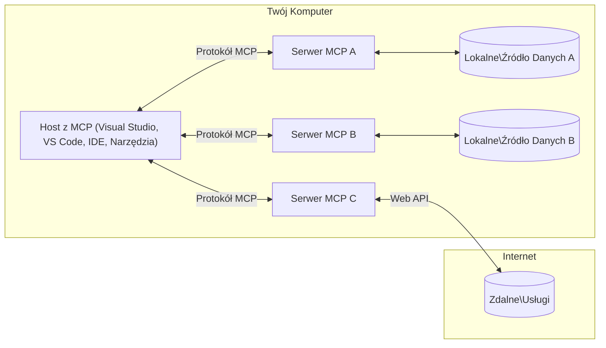

# Podstawowe koncepcje MCP: Opanowanie Model Context Protocol dla integracji AI

[](https://youtu.be/earDzWGtE84)

_(Kliknij powyższy obraz, aby obejrzeć wideo z tej lekcji)_

[Model Context Protocol (MCP)](https://github.com/modelcontextprotocol) to potężne, ustandaryzowane ramy optymalizujące komunikację między dużymi modelami językowymi (LLM) a narzędziami zewnętrznymi, aplikacjami i źródłami danych. 
Ten przewodnik przeprowadzi Cię przez podstawowe koncepcje MCP. Dowiesz się o jego architekturze klient-serwer, kluczowych komponentach, mechanice komunikacji oraz najlepszych praktykach wdrożeniowych.

- **Jawna zgoda użytkownika**: Do wszystkich operacji i dostępu do danych wymagana jest wyraźna zgoda użytkownika przed ich wykonaniem. Użytkownicy muszą jasno rozumieć, jakie dane będą udostępniane i jakie działania zostaną wykonane, z możliwością szczegółowej kontroli uprawnień i autoryzacji.

- **Ochrona prywatności danych**: Dane użytkownika są udostępniane wyłącznie za wyraźną zgodą i muszą być chronione przez solidne mechanizmy kontroli dostępu przez cały cykl życia interakcji. Implementacje muszą zapobiegać nieautoryzowanemu przesyłaniu danych oraz utrzymywać ścisłe granice prywatności.

- **Bezpieczeństwo wykonywania narzędzi**: Każde wywołanie narzędzia wymaga jawnej zgody użytkownika z jasnym zrozumieniem funkcji, parametrów i potencjalnego wpływu narzędzia. Solidne granice bezpieczeństwa muszą zapobiegać niezamierzonemu, niebezpiecznemu lub złośliwemu wykonaniu narzędzi.

- **Bezpieczeństwo warstwy transportowej**: Wszystkie kanały komunikacji powinny stosować odpowiednie mechanizmy szyfrowania i uwierzytelniania. Połączenia zdalne powinny implementować bezpieczne protokoły transportowe oraz właściwe zarządzanie poświadczeniami.

#### Wskazówki implementacyjne:

- **Zarządzanie uprawnieniami**: Wdroż systemy dokładnej kontroli uprawnień, które pozwalają użytkownikom kontrolować, które serwery, narzędzia i zasoby są dostępne
- **Uwierzytelnianie i autoryzacja**: Stosuj bezpieczne metody uwierzytelniania (OAuth, klucze API) z właściwym zarządzaniem tokenami i terminami ważności  
- **Weryfikacja danych wejściowych**: Waliduj wszystkie parametry i dane wejściowe zgodnie z określonymi schematami, aby zapobiec atakom wstrzyknięć
- **Logowanie audytu**: Prowadź kompleksowe logi wszystkich operacji dla monitoringu bezpieczeństwa i zapewnienia zgodności

## Przegląd

Ta lekcja przybliża podstawową architekturę i komponenty, które budują ekosystem Model Context Protocol (MCP). Dowiesz się o architekturze klient-serwer, kluczowych elementach i mechanizmach komunikacji napędzających interakcje MCP.

## Kluczowe cele nauki

Pod koniec tej lekcji będziesz:

- Rozumieć architekturę klient-serwer MCP.
- Identyfikować role i odpowiedzialności Hostów, Klientów i Serwerów.
- Analizować kluczowe cechy, które czynią MCP elastyczną warstwą integracyjną.
- Poznawać przepływ informacji w ekosystemie MCP.
- Zdobywać praktyczne informacje dzięki przykładom kodu w .NET, Java, Python i JavaScript.

## Architektura MCP: Głębsze spojrzenie

Ekosystem MCP opiera się na modelu klient-serwer. Ta modułowa struktura pozwala aplikacjom AI współdziałać efektywnie z narzędziami, bazami danych, API i zasobami kontekstowymi. Rozłóżmy tę architekturę na kluczowe komponenty.

W swojej istocie MCP stosuje architekturę klient-serwer, gdzie aplikacja hosta może łączyć się z wieloma serwerami:


- **Hosty MCP**: Programy takie jak VSCode, Claude Desktop, IDE lub narzędzia AI, które chcą uzyskać dostęp do danych przez MCP
- **Klienci MCP**: Klienci protokołu utrzymujący połączenia 1:1 z serwerami
- **Serwery MCP**: Lekkie programy udostępniające określone funkcjonalności przez ustandaryzowany Model Context Protocol
- **Lokalne źródła danych**: Pliki, bazy danych i usługi na Twoim komputerze, do których MCP serwery mają bezpieczny dostęp
- **Usługi zdalne**: Systemy zewnętrzne dostępne przez internet, do których MCP serwery mogą łączyć się poprzez API.

Protokół MCP jest standardem rozwijającym się, korzystającym z wersjonowania opartego na dacie (format RRRR-MM-DD). Obecna wersja protokołu to **2025-11-25**. Możesz zobaczyć najnowsze aktualizacje w [specyfikacji protokołu](https://modelcontextprotocol.io/specification/2025-11-25/)

### 1. Hosty

W Model Context Protocol (MCP), **Hosty** to aplikacje AI, które pełnią rolę głównego interfejsu, przez który użytkownicy wchodzą w interakcje z protokołem. Hosty koordynują i zarządzają połączeniami do wielu serwerów MCP, tworząc dedykowanych klientów MCP dla każdego połączenia z serwerem. Przykłady Hostów:

- **Aplikacje AI**: Claude Desktop, Visual Studio Code, Claude Code
- **Środowiska programistyczne**: IDE i edytory kodu z integracją MCP  
- **Aplikacje niestandardowe**: Specjalizowane agentury i narzędzia AI

**Hosty** to aplikacje koordynujące interakcje z modelami AI. W ich zadaniach jest:

- **Orkiestracja modeli AI**: Wykonywanie lub interakcja z LLM-ami w celu generowania odpowiedzi i koordynowania przepływów pracy AI
- **Zarządzanie połączeniami klientów**: Tworzenie i utrzymanie jednego klienta MCP na każde połączenie z serwerem MCP
- **Kontrola interfejsu użytkownika**: Obsługa przebiegu rozmów, interakcji użytkownika i prezentacji odpowiedzi  
- **Egzekwowanie bezpieczeństwa**: Kontrola uprawnień, ograniczeń bezpieczeństwa i uwierzytelniania
- **Obsługa zgody użytkownika**: Zarządzanie zatwierdzeniem użytkownika dla udostępniania danych i wykonywania narzędzi


### 2. Klienci

**Klienci** to kluczowe komponenty utrzymujące dedykowane połączenia jeden do jednego pomiędzy Hostami a serwerami MCP. Każdy klient MCP jest tworzony przez Host w celu połączenia z konkretnym serwerem MCP, zapewniając uporządkowane i bezpieczne kanały komunikacji. Wielu klientów pozwala Hostom na jednoczesne łączenie się z wieloma serwerami.

**Klienci** to elementy łączące w aplikacji hosta. Ich zadania to:

- **Komunikacja protokołu**: Wysyłanie żądań JSON-RPC 2.0 do serwerów z promptami i instrukcjami
- **Negocjacja możliwości**: Negocjowanie obsługiwanych funkcji i wersji protokołu z serwerami podczas inicjalizacji
- **Wykonywanie narzędzi**: Zarządzanie żądaniami wykonania narzędzi od modeli i przetwarzanie odpowiedzi
- **Aktualizacje w czasie rzeczywistym**: Obsługa powiadomień i aktualizacji w czasie rzeczywistym od serwerów
- **Przetwarzanie odpowiedzi**: Przetwarzanie i formatowanie odpowiedzi serwera do wyświetlenia użytkownikowi

### 3. Serwery

**Serwery** to programy dostarczające kontekst, narzędzia i możliwości klientom MCP. Mogą działać lokalnie (na tej samej maszynie co Host) lub zdalnie (na zewnętrznych platformach) i są odpowiedzialne za obsługę żądań od klientów oraz dostarczanie ustrukturyzowanych odpowiedzi. Serwery udostępniają konkretne funkcjonalności poprzez ustandaryzowany Model Context Protocol.

**Serwery** to usługi zapewniające kontekst i możliwości. Ich zadania to:

- **Rejestracja funkcji**: Rejestracja i udostępnianie klientom dostępnych prymitywów (zasobów, promptów, narzędzi)
- **Przetwarzanie żądań**: Odbieranie i wykonywanie wywołań narzędzi, żądań zasobów i promptów od klientów
- **Dostarczanie kontekstu**: Udostępnianie informacji kontekstowych i danych wzbogacających odpowiedzi modeli
- **Zarządzanie stanem**: Utrzymywanie stanu sesji i obsługa interakcji stanowych, jeśli jest to potrzebne
- **Powiadomienia w czasie rzeczywistym**: Wysyłanie powiadomień o zmianach możliwościach i aktualizacjach dla podłączonych klientów

Serwery mogą być rozwijane przez każdego w celu rozszerzenia funkcji modeli o specjalistyczne możliwości i wspierają zarówno scenariusze wdrożeń lokalnych, jak i zdalnych.

### 4. Prymitywy serwerowe

Serwery w Model Context Protocol (MCP) dostarczają trzy podstawowe **prymitywy**, które definiują fundamentalne bloki budulcowe bogatych interakcji między klientami, hostami a modelami językowymi. Te prymitywy określają typy dostępnych informacji kontekstowych i akcji dostępnych poprzez protokół.

Serwery MCP mogą udostępniać dowolną kombinację następujących trzech podstawowych prymitywów:

#### Zasoby 

**Zasoby** to źródła danych dostarczające informacje kontekstowe aplikacjom AI. Reprezentują statyczne lub dynamiczne treści, które mogą wzbogacić rozumienie modelu i podejmowanie decyzji:

- **Dane kontekstowe**: Ustrukturyzowane informacje i kontekst dla konsumpcji przez modele AI
- **Bazy wiedzy**: Repozytoria dokumentów, artykuły, podręczniki i publikacje naukowe
- **Lokalne źródła danych**: Pliki, bazy danych i informacje o lokalnym systemie  
- **Dane zewnętrzne**: Odpowiedzi API, usługi sieciowe i dane z systemów zdalnych
- **Treść dynamiczna**: Dane w czasie rzeczywistym aktualizowane na podstawie warunków zewnętrznych

Zasoby są identyfikowane przez URI i wspierają odkrywanie poprzez metody `resources/list` oraz pobieranie przez `resources/read`:

```text
file://documents/project-spec.md
database://production/users/schema
api://weather/current
```

#### Prompty

**Prompty** to wielokrotnego użytku szablony pomagające w strukturze interakcji z modelami językowymi. Zapewniają ustandaryzowane wzorce interakcji i templatyzowane przepływy pracy:

- **Interakcje oparte na szablonach**: Wstępnie ustrukturyzowane wiadomości i rozpoczęcia rozmów
- **Szablony przepływów pracy**: Ustandaryzowane sekwencje dla typowych zadań i interakcji
- **Przykłady few-shot**: Szablony oparte na przykładach służące do instrukcji modelu
- **Prompty systemowe**: Podstawowe prompty definiujące zachowanie i kontekst modelu
- **Szablony dynamiczne**: Parametryzowane prompty dostosowujące się do konkretnych kontekstów

Prompty pozwalają na podstawianie zmiennych i mogą być odkrywane przez `prompts/list` oraz pobierane metodą `prompts/get`:

```markdown
Generate a {{task_type}} for {{product}} targeting {{audience}} with the following requirements: {{requirements}}
```

#### Narzędzia

**Narzędzia** to wykonywalne funkcje, które modele AI mogą wywoływać, aby wykonać określone akcje. Reprezentują „czasowniki” ekosystemu MCP, umożliwiając modelom interakcję z systemami zewnętrznymi:

- **Funkcje wykonywalne**: Dyskretne operacje, które modele mogą wywołać z określonymi parametrami
- **Integracja systemów zewnętrznych**: Wywołania API, zapytania do baz danych, operacje na plikach, obliczenia
- **Unikalna tożsamość**: Każde narzędzie ma unikatową nazwę, opis i schemat parametrów
- **Ustrukturyzowane wejście/wyjście**: Narzędzia przyjmują zwalidowane parametry i zwracają ustrukturyzowane, typowane odpowiedzi
- **Możliwości działania**: Umożliwiają modelom wykonywanie rzeczywistych akcji i pozyskiwanie danych na żywo

Narzędzia definiowane są za pomocą JSON Schema do walidacji parametrów i odkrywane przez `tools/list`, a wywoływane przez `tools/call`. Narzędzia mogą również zawierać **ikony** jako dodatkowe metadane dla lepszej prezentacji w UI.

**Adnotacje narzędzi**: Narzędzia wspierają adnotacje dotyczące zachowania (np. `readOnlyHint`, `destructiveHint`) opisujące czy narzędzie jest tylko do odczytu lub destrukcyjne, pomagając klientom w podejmowaniu świadomych decyzji dotyczących ich wywołania.

Przykładowa definicja narzędzia:

```typescript
server.tool(
  "search_products", 
  {
    query: z.string().describe("Search query for products"),
    category: z.string().optional().describe("Product category filter"),
    max_results: z.number().default(10).describe("Maximum results to return")
  }, 
  async (params) => {
    // Wykonaj wyszukiwanie i zwróć uporządkowane wyniki
    return await productService.search(params);
  }
);
```

## Prymitywy klienta

W Model Context Protocol (MCP), **klienci** mogą udostępniać prymitywy, które pozwalają serwerom na żądanie dodatkowych możliwości od aplikacji hosta. Te prymitywy po stronie klienta umożliwiają bogatsze, bardziej interaktywne implementacje serwerowe mające dostęp do funkcji modeli AI oraz interakcji użytkownika.

### Sampling

**Sampling** pozwala serwerom na żądanie uzupełnień modeli językowych z aplikacji AI klienta. Ten prymityw pozwala serwerom na korzystanie z możliwości LLM bez wbudowywania własnych zależności modeli:

- **Dostęp niezależny od modelu**: Serwery mogą żądać uzupełnień bez konieczności dołączania SDK LLM ani zarządzania dostępem do modelu
- **Inicjatywa AI ze strony serwera**: Pozwala serwerom autonomicznie generować treści używając modelu AI klienta
- **Rekurencyjne interakcje LLM**: Wspiera złożone scenariusze wymagające pomocy AI do przetwarzania
- **Dynamiczne generowanie treści**: Pozwala serwerom tworzyć odpowiedzi kontekstowe z użyciem modelu hosta
- **Wsparcie wywoływania narzędzi**: Serwery mogą przekazać parametry `tools` oraz `toolChoice`, umożliwiając modelowi klienta wywoływanie narzędzi podczas próbkowania

Sampling inicjowany jest metodą `sampling/complete`, gdzie serwery przesyłają żądania uzupełnień do klientów.

### Roots

**Roots** zapewniają ustandaryzowany sposób, w jaki klienci udostępniają granice systemu plików serwerom, pomagając serwerom zrozumieć, do których katalogów i plików mają dostęp:

- **Granice systemu plików**: Definiują obszary, w których serwery mogą działać w systemie plików
- **Kontrola dostępu**: Pomagają serwerom zrozumieć, do których katalogów i plików mają uprawnienia dostępu
- **Dynamiczne aktualizacje**: Klienci mogą powiadamiać serwery o zmianach w liście korzeni
- **Identyfikacja oparta na URI**: Roots używają URI `file://` do określania dostępnych katalogów i plików

Roots odkrywane są przez metodę `roots/list`, a klienci wysyłają powiadomienia `notifications/roots/list_changed` przy zmianach roots.

### Elicitation  

**Elicitation** umożliwia serwerom żądanie dodatkowych informacji lub potwierdzenia od użytkowników przez interfejs klienta:

- **Żądania danych wejściowych użytkownika**: Serwery mogą prosić o dodatkowe informacje potrzebne do wykonania narzędzi
- **Dialogi potwierdzające**: Żądanie zgody użytkownika dla operacji wrażliwych lub istotnych
- **Interaktywne przepływy pracy**: Umożliwiają tworzenie interakcji krok po kroku z użytkownikiem
- **Dynamiczne zbieranie parametrów**: Pozyskiwanie brakujących lub opcjonalnych parametrów podczas wykonywania narzędzi

Żądania elicitation są realizowane metodą `elicitation/request` w celu zbierania danych od użytkownika przez interfejs klienta.

**URL Mode Elicitation**: Serwery mogą również żądać interakcji użytkownika opartej o URL, kierując użytkowników do zewnętrznych stron internetowych w celu uwierzytelniania, potwierdzania lub wprowadzania danych.

### Logowanie

**Logowanie** pozwala serwerom wysyłać ustrukturyzowane komunikaty logów do klientów do debugowania, monitoringu i zapewnienia widoczności operacyjnej:

- **Wsparcie debugowania**: Pozwala serwerom dostarczać szczegółowe logi wykonania w celu rozwiązywania problemów
- **Monitorowanie operacyjne**: Wysyłanie aktualizacji statusu i metryk wydajności do klientów
- **Raportowanie błędów**: Dostarczanie szczegółowego kontekstu błędów i informacji diagnostycznych
- **Ścieżki audytu**: Tworzenie kompleksowych logów operacji i decyzji serwerów

Komunikaty logowania są wysyłane do klientów, zapewniając przejrzystość działania serwerów i ułatwiając debugowanie.

## Przepływ informacji w MCP

Model Context Protocol (MCP) definiuje ustrukturyzowany przepływ informacji między hostami, klientami, serwerami i modelami. Zrozumienie tego przepływu pomaga wyjaśnić, jak przetwarzane są żądania użytkowników oraz jak zewnętrzne narzędzia i dane są integrowane z odpowiedziami modeli.
- **Host inicjuje połączenie**  
  Aplikacja hosta (tak jak IDE lub interfejs czatu) nawiązuje połączenie z serwerem MCP, zazwyczaj przez STDIO, WebSocket lub inny obsługiwany transport.

- **Negocjacja możliwości**  
  Klient (osadzony w hoście) i serwer wymieniają się informacjami o obsługiwanych funkcjach, narzędziach, zasobach i wersjach protokołu. Zapewnia to, że obie strony rozumieją, jakie możliwości są dostępne dla sesji.

- **Żądanie użytkownika**  
  Użytkownik wchodzi w interakcję z hostem (np. wpisuje polecenie lub zapytanie). Host zbiera ten input i przekazuje go do klienta do przetworzenia.

- **Użycie zasobu lub narzędzia**  
  - Klient może zażądać dodatkowego kontekstu lub zasobów od serwera (takich jak pliki, wpisy w bazie danych lub artykuły bazy wiedzy), aby wzbogacić rozumienie modelu.  
  - Jeśli model uzna, że potrzebne jest narzędzie (np. do pobrania danych, wykonania obliczenia lub wywołania API), klient wysyła do serwera żądanie wywołania narzędzia, określając jego nazwę i parametry.

- **Wykonanie przez serwer**  
  Serwer odbiera żądanie narzędzia lub zasobu, wykonuje niezbędne operacje (takie jak wywołanie funkcji, zapytanie do bazy danych lub pobranie pliku) i zwraca wyniki klientowi w formacie strukturalnym.

- **Generowanie odpowiedzi**  
  Klient integruje odpowiedzi serwera (dane zasobów, wyniki narzędzi itp.) w bieżącej interakcji z modelem. Model wykorzystuje te informacje do wygenerowania kompleksowej i kontekstowo adekwatnej odpowiedzi.

- **Prezentacja wyniku**  
  Host otrzymuje końcowe wyjście od klienta i prezentuje je użytkownikowi, często obejmujące zarówno wygenerowany tekst modelu, jak i wyniki wykonania narzędzi lub wyszukiwania zasobów.

Ten przepływ umożliwia MCP wspieranie zaawansowanych, interaktywnych i świadomych kontekstu aplikacji AI poprzez bezproblemowe łączenie modeli z zewnętrznymi narzędziami i źródłami danych.

## Architektura i warstwy protokołu

MCP składa się z dwóch odrębnych warstw architektonicznych, które współpracują, by zapewnić kompletny framework komunikacyjny:

### Warstwa danych

**Warstwa danych** implementuje główny protokół MCP, używając jako podstawy **JSON-RPC 2.0**. Ta warstwa definiuje strukturę komunikatów, semantykę i wzorce interakcji:

#### Podstawowe komponenty:

- **Protokół JSON-RPC 2.0**: Cała komunikacja używa ustandaryzowanego formatu komunikatów JSON-RPC 2.0 dla wywołań metod, odpowiedzi i powiadomień  
- **Zarządzanie cyklem życia**: Obsługuje inicjalizację połączenia, negocjację możliwości i zakończenie sesji między klientami i serwerami  
- **Prymitywy serwera**: Umożliwia serwerom udostępnianie podstawowej funkcjonalności poprzez narzędzia, zasoby i prompt’y  
- **Prymitywy klienta**: Umożliwia serwerom żądanie generowania próbek z LLM, pobieranie wejścia od użytkownika oraz wysyłanie komunikatów logów  
- **Powiadomienia w czasie rzeczywistym**: Obsługuje asynchroniczne powiadomienia dla dynamicznych aktualizacji bez potrzeby odpytywania  

#### Kluczowe cechy:

- **Negocjacja wersji protokołu**: Używa wersjonowania opartego na datach (RRRR-MM-DD) w celu zapewnienia kompatybilności  
- **Wykrywanie możliwości**: Klienci i serwery wymieniają informacje o obsługiwanych funkcjach podczas inicjalizacji  
- **Stan sesji**: Utrzymuje stan połączenia przez wiele interakcji dla ciągłości kontekstu  

### Warstwa transportowa

**Warstwa transportowa** zarządza kanałami komunikacyjnymi, ramkowaniem komunikatów i uwierzytelnianiem między uczestnikami MCP:

#### Obsługiwane mechanizmy transportu:

1. **Transport STDIO**:  
   - Wykorzystuje standardowe strumienie wejścia/wyjścia do bezpośredniej komunikacji procesów  
   - Optymalny dla lokalnych procesów na tym samym urządzeniu bez narzutu sieciowego  
   - Powszechnie używany w lokalnych implementacjach serwerów MCP  

2. **Transport HTTP strumieniowalny**:  
   - Wykorzystuje HTTP POST do wiadomości klient → serwer  
   - Opcjonalne Server-Sent Events (SSE) do strumieniowego przesyłania danych serwer → klient  
   - Umożliwia komunikację zdalną przez sieć  
   - Obsługuje standardowe uwierzytelnianie HTTP (tokeny bearer, klucze API, niestandardowe nagłówki)  
   - MCP rekomenduje OAuth dla bezpiecznego uwierzytelniania tokenowego  

#### Abstrakcja transportu:

Warstwa transportowa abstrahuje szczegóły komunikacji od warstwy danych, umożliwiając użycie tego samego formatu JSON-RPC 2.0 dla wszystkich mechanizmów transportowych. Ta abstrakcja pozwala aplikacjom na płynne przełączanie między lokalnymi a zdalnymi serwerami.

### Uwagi dotyczące bezpieczeństwa

Implementacje MCP muszą przestrzegać kluczowych zasad bezpieczeństwa, aby zapewnić bezpieczne, godne zaufania i zabezpieczone interakcje we wszystkich operacjach protokołu:

- **Zgoda i kontrola użytkownika**: Użytkownicy muszą wyrazić wyraźną zgodę przed uzyskaniem dostępu do danych lub wykonaniem operacji. Powinni mieć jasną kontrolę nad tym, jakie dane są udostępniane i które działania są autoryzowane, wspieraną przez intuicyjne interfejsy do przeglądu i zatwierdzania działań.

- **Prywatność danych**: Dane użytkownika powinny być ujawniane tylko za wyraźną zgodą i muszą być chronione odpowiednimi mechanizmami kontroli dostępu. Implementacje MCP muszą zabezpieczać przed nieautoryzowanym przesyłaniem danych i zapewnić ochronę prywatności we wszystkich interakcjach.

- **Bezpieczeństwo narzędzi**: Przed wywołaniem jakiegokolwiek narzędzia wymagana jest wyraźna zgoda użytkownika. Użytkownicy powinni mieć jasne zrozumienie funkcji każdego narzędzia, a silne granice bezpieczeństwa muszą być egzekwowane, aby zapobiec niezamierzonemu lub niebezpiecznemu uruchomieniu narzędzi.

Stosując się do tych zasad bezpieczeństwa, MCP zapewnia zaufanie użytkowników, ochronę prywatności i bezpieczeństwo w całych interakcjach protokołu, równocześnie umożliwiając potężne integracje AI.

## Przykłady kodu: kluczowe komponenty

Poniżej znajdują się przykłady kodu w kilku popularnych językach programowania, które ilustrują, jak zaimplementować kluczowe komponenty serwera MCP i narzędzia.

### Przykład .NET: Tworzenie prostego serwera MCP z narzędziami

Oto praktyczny przykład kodu .NET pokazujący, jak zaimplementować prosty serwer MCP z niestandardowymi narzędziami. Przykład demonstruje definiowanie i rejestrację narzędzi, obsługę żądań oraz łączenie serwera z użyciem Model Context Protocol.

```csharp
using System;
using System.Threading.Tasks;
using ModelContextProtocol.Server;
using ModelContextProtocol.Server.Transport;
using ModelContextProtocol.Server.Tools;

public class WeatherServer
{
    public static async Task Main(string[] args)
    {
        // Create an MCP server
        var server = new McpServer(
            name: "Weather MCP Server",
            version: "1.0.0"
        );
        
        // Register our custom weather tool
        server.AddTool<string, WeatherData>("weatherTool", 
            description: "Gets current weather for a location",
            execute: async (location) => {
                // Call weather API (simplified)
                var weatherData = await GetWeatherDataAsync(location);
                return weatherData;
            });
        
        // Connect the server using stdio transport
        var transport = new StdioServerTransport();
        await server.ConnectAsync(transport);
        
        Console.WriteLine("Weather MCP Server started");
        
        // Keep the server running until process is terminated
        await Task.Delay(-1);
    }
    
    private static async Task<WeatherData> GetWeatherDataAsync(string location)
    {
        // This would normally call a weather API
        // Simplified for demonstration
        await Task.Delay(100); // Simulate API call
        return new WeatherData { 
            Temperature = 72.5,
            Conditions = "Sunny",
            Location = location
        };
    }
}

public class WeatherData
{
    public double Temperature { get; set; }
    public string Conditions { get; set; }
    public string Location { get; set; }
}
```

### Przykład Java: Komponenty serwera MCP

Ten przykład demonstruje ten sam serwer MCP i rejestrację narzędzi co przykład .NET powyżej, ale zaimplementowany w Javie.

```java
import io.modelcontextprotocol.server.McpServer;
import io.modelcontextprotocol.server.McpToolDefinition;
import io.modelcontextprotocol.server.transport.StdioServerTransport;
import io.modelcontextprotocol.server.tool.ToolExecutionContext;
import io.modelcontextprotocol.server.tool.ToolResponse;

public class WeatherMcpServer {
    public static void main(String[] args) throws Exception {
        // Utwórz serwer MCP
        McpServer server = McpServer.builder()
            .name("Weather MCP Server")
            .version("1.0.0")
            .build();
            
        // Zarejestruj narzędzie pogodowe
        server.registerTool(McpToolDefinition.builder("weatherTool")
            .description("Gets current weather for a location")
            .parameter("location", String.class)
            .execute((ToolExecutionContext ctx) -> {
                String location = ctx.getParameter("location", String.class);
                
                // Pobierz dane pogodowe (uproszczone)
                WeatherData data = getWeatherData(location);
                
                // Zwróć sformatowaną odpowiedź
                return ToolResponse.content(
                    String.format("Temperature: %.1f°F, Conditions: %s, Location: %s", 
                    data.getTemperature(), 
                    data.getConditions(), 
                    data.getLocation())
                );
            })
            .build());
        
        // Połącz serwer za pomocą transportu stdio
        try (StdioServerTransport transport = new StdioServerTransport()) {
            server.connect(transport);
            System.out.println("Weather MCP Server started");
            // Utrzymuj serwer w działaniu aż do zakończenia procesu
            Thread.currentThread().join();
        }
    }
    
    private static WeatherData getWeatherData(String location) {
        // Implementacja wywołałaby API pogodowe
        // Uproszczone dla celów przykładu
        return new WeatherData(72.5, "Sunny", location);
    }
}

class WeatherData {
    private double temperature;
    private String conditions;
    private String location;
    
    public WeatherData(double temperature, String conditions, String location) {
        this.temperature = temperature;
        this.conditions = conditions;
        this.location = location;
    }
    
    public double getTemperature() {
        return temperature;
    }
    
    public String getConditions() {
        return conditions;
    }
    
    public String getLocation() {
        return location;
    }
}
```

### Przykład Python: Budowa serwera MCP

Ten przykład używa fastmcp, więc proszę najpierw je zainstalować:

```python
pip install fastmcp
```
Przykład kodu:

```python
#!/usr/bin/env python3
import asyncio
from fastmcp import FastMCP
from fastmcp.transports.stdio import serve_stdio

# Utwórz serwer FastMCP
mcp = FastMCP(
    name="Weather MCP Server",
    version="1.0.0"
)

@mcp.tool()
def get_weather(location: str) -> dict:
    """Gets current weather for a location."""
    return {
        "temperature": 72.5,
        "conditions": "Sunny",
        "location": location
    }

# Alternatywne podejście z użyciem klasy
class WeatherTools:
    @mcp.tool()
    def forecast(self, location: str, days: int = 1) -> dict:
        """Gets weather forecast for a location for the specified number of days."""
        return {
            "location": location,
            "forecast": [
                {"day": i+1, "temperature": 70 + i, "conditions": "Partly Cloudy"}
                for i in range(days)
            ]
        }

# Zarejestruj narzędzia klasy
weather_tools = WeatherTools()

# Uruchom serwer
if __name__ == "__main__":
    asyncio.run(serve_stdio(mcp))
```

### Przykład JavaScript: Tworzenie serwera MCP

Ten przykład pokazuje tworzenie serwera MCP w JavaScript oraz jak zarejestrować dwa narzędzia związane z pogodą.

```javascript
// Korzystanie z oficjalnego zestawu SDK Model Context Protocol
import { McpServer } from "@modelcontextprotocol/sdk/server/mcp.js";
import { StdioServerTransport } from "@modelcontextprotocol/sdk/server/stdio.js";
import { z } from "zod"; // Do walidacji parametrów

// Utwórz serwer MCP
const server = new McpServer({
  name: "Weather MCP Server",
  version: "1.0.0"
});

// Zdefiniuj narzędzie pogodowe
server.tool(
  "weatherTool",
  {
    location: z.string().describe("The location to get weather for")
  },
  async ({ location }) => {
    // Normalnie wywoływałoby to API pogodowe
    // Uproszczone dla demonstracji
    const weatherData = await getWeatherData(location);
    
    return {
      content: [
        { 
          type: "text", 
          text: `Temperature: ${weatherData.temperature}°F, Conditions: ${weatherData.conditions}, Location: ${weatherData.location}` 
        }
      ]
    };
  }
);

// Zdefiniuj narzędzie prognozy
server.tool(
  "forecastTool",
  {
    location: z.string(),
    days: z.number().default(3).describe("Number of days for forecast")
  },
  async ({ location, days }) => {
    // Normalnie wywoływałoby to API pogodowe
    // Uproszczone dla demonstracji
    const forecast = await getForecastData(location, days);
    
    return {
      content: [
        { 
          type: "text", 
          text: `${days}-day forecast for ${location}: ${JSON.stringify(forecast)}` 
        }
      ]
    };
  }
);

// Funkcje pomocnicze
async function getWeatherData(location) {
  // Symuluj wywołanie API
  return {
    temperature: 72.5,
    conditions: "Sunny",
    location: location
  };
}

async function getForecastData(location, days) {
  // Symuluj wywołanie API
  return Array.from({ length: days }, (_, i) => ({
    day: i + 1,
    temperature: 70 + Math.floor(Math.random() * 10),
    conditions: i % 2 === 0 ? "Sunny" : "Partly Cloudy"
  }));
}

// Połącz serwer używając transportu stdio
const transport = new StdioServerTransport();
server.connect(transport).catch(console.error);

console.log("Weather MCP Server started");
```

Ten przykład JavaScript demonstruje, jak utworzyć serwer MCP, który rejestruje narzędzia pogodowe i łączy się za pomocą transportu stdio, aby obsługiwać przychodzące żądania klientów.

## Bezpieczeństwo i autoryzacja

MCP zawiera kilka wbudowanych koncepcji i mechanizmów do zarządzania bezpieczeństwem i autoryzacją w całym protokole:

1. **Kontrola uprawnień do narzędzi**:  
  Klienci mogą określić, które narzędzia model może używać w trakcie sesji. Zapewnia to dostęp wyłącznie do wyraźnie autoryzowanych narzędzi, zmniejszając ryzyko niezamierzonych lub niebezpiecznych operacji. Uprawnienia można konfigurować dynamicznie na podstawie preferencji użytkownika, polityk organizacyjnych lub kontekstu interakcji.

2. **Uwierzytelnianie**:  
  Serwery mogą wymagać uwierzytelnienia przed udzieleniem dostępu do narzędzi, zasobów lub wrażliwych operacji. Może to obejmować klucze API, tokeny OAuth lub inne schematy uwierzytelniania. Prawidłowe uwierzytelnianie zapewnia, że wyłącznie zaufani klienci i użytkownicy mogą wywoływać możliwości serwera.

3. **Walidacja**:  
  Weryfikacja parametrów jest wymuszana dla wszystkich wywołań narzędzi. Każde narzędzie definiuje oczekiwane typy, formaty i ograniczenia dla swoich parametrów, a serwer sprawdza poprawność przychodzących żądań. Zapobiega to przekazywaniu niepoprawnych lub złośliwych danych do implementacji narzędzi i pomaga utrzymać integralność operacji.

4. **Limitowanie szybkości (rate limiting)**:  
  Aby zapobiec nadużyciom i zapewnić uczciwe wykorzystanie zasobów serwera, serwery MCP mogą implementować ograniczenia szybkości dla wywołań narzędzi i dostępu do zasobów. Limity mogą być stosowane na użytkownika, na sesję lub globalnie, co pomaga chronić przed atakami typu denial-of-service lub nadmiernym zużyciem zasobów.

Łącząc te mechanizmy, MCP zapewnia bezpieczną podstawę do integracji modeli językowych z zewnętrznymi narzędziami i źródłami danych, dając użytkownikom i deweloperom precyzyjną kontrolę nad dostępem i wykorzystaniem.

## Komunikaty protokołu i przepływ komunikacji

Komunikacja MCP używa ustrukturyzowanych komunikatów **JSON-RPC 2.0** do zapewnienia jasnych i niezawodnych interakcji między hostami, klientami i serwerami. Protokół definiuje konkretne wzorce komunikatów dla różnych typów operacji:

### Podstawowe typy komunikatów:

#### **Komunikaty inicjalizacyjne**
- Żądanie `initialize`: Nawiązuje połączenie i negocjuje wersję protokołu oraz możliwości  
- Odpowiedź `initialize`: Potwierdza obsługiwane funkcje i informacje o serwerze  
- `notifications/initialized`: Sygnalizuje zakończenie inicjalizacji i gotowość sesji  

#### **Komunikaty wykrywania**
- Żądanie `tools/list`: Odkrywa dostępne narzędzia na serwerze  
- Żądanie `resources/list`: Wypisuje dostępne zasoby (źródła danych)  
- Żądanie `prompts/list`: Pobiera dostępne szablony promptów  

#### **Komunikaty wykonania**  
- Żądanie `tools/call`: Wykonuje określone narzędzie z podanymi parametrami  
- Żądanie `resources/read`: Pobiera zawartość konkretnego zasobu  
- Żądanie `prompts/get`: Pobiera szablon prompta z opcjonalnymi parametrami  

#### **Komunikaty po stronie klienta**
- Żądanie `sampling/complete`: Serwer żąda od klienta wygenerowania uzupełnienia LLM  
- `elicitation/request`: Serwer żąda wejścia od użytkownika przez interfejs klienta  
- Komunikaty logowania: Serwer wysyła do klienta strukturalne komunikaty logów  

#### **Komunikaty powiadomień**
- `notifications/tools/list_changed`: Serwer powiadamia klienta o zmianach w narzędziach  
- `notifications/resources/list_changed`: Serwer powiadamia klienta o zmianach w zasobach  
- `notifications/prompts/list_changed`: Serwer powiadamia klienta o zmianach w promptach  

### Struktura komunikatu:

Wszystkie komunikaty MCP stosują format JSON-RPC 2.0 z:
- **Komunikaty żądań**: zawierają `id`, `method` i opcjonalne `params`  
- **Komunikaty odpowiedzi**: zawierają `id` oraz `result` lub `error`  
- **Komunikaty powiadomień**: zawierają `method` i opcjonalne `params` (bez `id` i bez oczekiwanej odpowiedzi)  

Ta ustrukturyzowana komunikacja gwarantuje niezawodne, możliwe do śledzenia i rozszerzalne interakcje wspierające zaawansowane scenariusze, takie jak aktualizacje w czasie rzeczywistym, łączenie narzędzi czy solidne obsługiwanie błędów.

### Zadania (eksperymentalne)

**Zadania** to eksperymentalna funkcja zapewniająca trwałe opakowania wykonawcze umożliwiające odroczone pobieranie wyników i śledzenie statusu dla żądań MCP:

- **Operacje długotrwałe**: Monitorowanie kosztownych obliczeń, automatyzacji przepływów pracy i przetwarzania wsadowego  
- **Odroczone wyniki**: Pollowanie statusu zadania i pobieranie wyników po zakończeniu operacji  
- **Śledzenie statusu**: Monitorowanie postępu zadania przez zdefiniowane stany cyklu życia  
- **Operacje wieloetapowe**: Wsparcie złożonych przepływów pracy rozciągających się na wiele interakcji  

Zadania opakowują standardowe żądania MCP, aby umożliwić asynchroniczne wzorce wykonania dla operacji, które nie mogą zakończyć się natychmiast.

## Kluczowe wnioski

- **Architektura**: MCP używa architektury klient-serwer, gdzie hosty zarządzają wieloma połączeniami klientów do serwerów  
- **Uczestnicy**: Ekosystem obejmuje hosty (aplikacje AI), klientów (łączniki protokołu) i serwery (dostawcy możliwości)  
- **Mechanizmy transportu**: Komunikacja wspiera STDIO (lokalny) i HTTP strumieniowalny z opcjonalnym SSE (zdalny)  
- **Podstawowe prymitywy**: Serwery udostępniają narzędzia (wykonywalne funkcje), zasoby (źródła danych) i prompty (szablony)  
- **Prymitywy klienta**: Serwery mogą żądać próbkowania (uzupełnień LLM z obsługą wywołań narzędzi), pozyskania wejścia (w tym tryb URL), określenia rootów (granice systemu plików) oraz logowania od klientów  
- **Funkcje eksperymentalne**: Zadania zapewniają trwałe opakowania wykonawcze dla operacji długotrwałych  
- **Podstawa protokołu**: Oparta na JSON-RPC 2.0 z wersjonowaniem na podstawie dat (aktualna: 2025-11-25)  
- **Możliwości w czasie rzeczywistym**: Wspiera powiadomienia do dynamicznych aktualizacji i synchronizacji na żywo  
- **Bezpieczeństwo na pierwszym miejscu**: Wyraźna zgoda użytkownika, ochrona prywatności i bezpieczny transport są kluczowymi wymaganiami  

## Ćwiczenie

Zaprojektuj proste narzędzie MCP, które byłoby użyteczne w Twojej dziedzinie. Zdefiniuj:
1. Jakie byłoby nazwa narzędzia  
2. Jakie przyjmowałoby parametry  
3. Jakie zwracałoby wyniki  
4. Jak model mógłby użyć tego narzędzia do rozwiązywania problemów użytkownika  

---

## Co dalej

Następne: [Rozdział 2: Bezpieczeństwo](../02-Security/README.md)

---

<!-- CO-OP TRANSLATOR DISCLAIMER START -->
**Zrzeczenie się odpowiedzialności**:  
Niniejszy dokument został przetłumaczony za pomocą automatycznej usługi tłumaczeniowej AI [Co-op Translator](https://github.com/Azure/co-op-translator). Mimo że dokładamy wszelkich starań, aby tłumaczenie było jak najbardziej precyzyjne, prosimy pamiętać, że tłumaczenia automatyczne mogą zawierać błędy lub niedokładności. Oryginalny dokument w jego języku źródłowym powinien być uznawany za wiarygodne źródło. W przypadku informacji o istotnym znaczeniu zalecane jest skorzystanie z usług profesjonalnego tłumacza. Nie ponosimy odpowiedzialności za jakiekolwiek nieporozumienia lub błędne interpretacje wynikające z użycia tego tłumaczenia.
<!-- CO-OP TRANSLATOR DISCLAIMER END -->