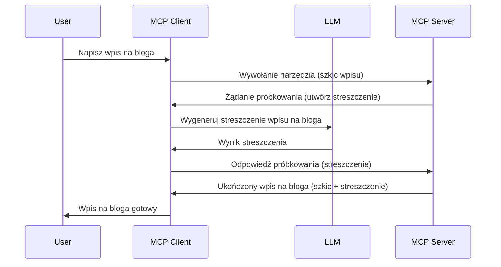

# Sampling - delegowanie funkcji do Klienta

Czasami potrzebujesz, aby klient MCP i serwer MCP współpracowały, aby osiągnąć wspólny cel. Możesz mieć sytuację, w której Serwer wymaga pomocy LLM znajdującego się na kliencie. W takim przypadku należy użyć mechanizmu sampling.

Przyjrzyjmy się kilku zastosowaniom i jak zbudować rozwiązanie wykorzystujące sampling.

## Przegląd

W tej lekcji skupimy się na wyjaśnieniu, kiedy i gdzie używać Sampling oraz jak go skonfigurować.

## Cele nauki

W tym rozdziale:

- Wyjaśnimy, czym jest Sampling i kiedy go stosować.
- Pokażemy, jak skonfigurować Sampling w MCP.
- Zaprezentujemy przykłady działania Sampling.

## Czym jest Sampling i dlaczego go używać?

Sampling to zaawansowana funkcja działająca w następujący sposób:



### Żądanie Sampling

Ok, mamy teraz obraz sytuacji z dużej perspektywy, porozmawiajmy o żądaniu sampling, które serwer wysyła do klienta. Oto jak takie żądanie może wyglądać w formacie JSON-RPC:

```json
{
  "jsonrpc": "2.0",
  "id": 1,
  "method": "sampling/createMessage",
  "params": {
    "messages": [
      {
        "role": "user",
        "content": {
          "type": "text",
          "text": "Create a blog post summary of the following blog post: <BLOG POST>"
        }
      }
    ],
    "modelPreferences": {
      "hints": [
        {
          "name": "claude-3-sonnet"
        }
      ],
      "intelligencePriority": 0.8,
      "speedPriority": 0.5
    },
    "systemPrompt": "You are a helpful assistant.",
    "maxTokens": 100
  }
}
```

Warto zwrócić uwagę na kilka rzeczy:

- Prompt, w polu content -> text, to nasz prompt będący instrukcją dla LLM do streszczenia treści wpisu na blogu.

- **modelPreferences**. Ta sekcja to właśnie preferencje, rekomendacje dotyczące konfiguracji LLM. Użytkownik może zdecydować, czy przyjąć te rekomendacje czy je zmienić. W tym przypadku znajdują się rekomendacje dotyczące modelu do użycia oraz priorytetów szybkości i inteligencji.
- **systemPrompt**, to typowy prompt systemowy, który nadaje LLM osobowość i zawiera instrukcje oraz wskazówki.
- **maxTokens**, to kolejne pole, które mówi, ile tokenów jest zalecane do wykorzystania w tym zadaniu.

### Odpowiedź Sampling

Ta odpowiedź to to, co klient MCP ostatecznie wysyła z powrotem do serwera MCP i jest wynikiem wywołania LLM, oczekiwania na odpowiedź, a następnie skonstruowania tej wiadomości. Oto jak może wyglądać w formacie JSON-RPC:

```json
{
  "jsonrpc": "2.0",
  "id": 1,
  "result": {
    "role": "assistant",
    "content": {
      "type": "text",
      "text": "Here's your abstract <ABSTRACT>"
    },
    "model": "gpt-5",
    "stopReason": "endTurn"
  }
}
```

Zwróć uwagę, że odpowiedź to abstrakt wpisu na blogu, dokładnie taki, o jaki prosiliśmy. Zauważ też, że użyty `model` nie jest tym, o który prosiliśmy, a "gpt-5" zamiast "claude-3-sonnet". Ilustruje to fakt, że użytkownik może zmienić zdanie co do modelu, a twoje żądanie sampling jest jedynie rekomendacją.

Ok, teraz gdy rozumiemy główny przebieg i przydatne zadanie, do którego można to użyć – "tworzenie wpisu na blog + abstrakt" – zobaczmy, co musimy zrobić, aby to uruchomić.

### Typy wiadomości

Wiadomości sampling nie muszą ograniczać się tylko do tekstu, ale możesz także wysyłać obrazy i dźwięki. Oto jak różni się JSON-RPC:

**Tekst**

```json
{
  "type": "text",
  "text": "The message content"
}
```

**Zawartość obrazu**

```json
{
  "type": "image",
  "data": "base64-encoded-image-data",
  "mimeType": "image/jpeg"
}
```

**Zawartość dźwięku**

```json
{
  "type": "audio",
  "data": "base64-encoded-audio-data",
  "mimeType": "audio/wav"
}
```

> NOTE: dla bardziej szczegółowych informacji na temat Sampling zajrzyj do [oficjalnej dokumentacji](https://modelcontextprotocol.io/specification/2025-11-25/client/sampling)

## Jak skonfigurować Sampling w kliencie

> Uwaga: jeśli tworzysz tylko serwer, nie musisz tu wiele robić.

W kliencie musisz określić następującą funkcję w ten sposób:

```json
{
  "capabilities": {
    "sampling": {}
  }
}
```

To zostanie przejęte, gdy wybrany klient zainicjuje połączenie z serwerem.

## Przykład działania Sampling – Tworzenie wpisu na bloga

Zakodujmy razem serwer obsługujący sampling, musimy wykonać następujące kroki:

1. Utworzyć narzędzie na Serwerze.
2. To narzędzie powinno utworzyć żądanie sampling.
3. Narzędzie powinno czekać na odpowiedź sampling od klienta.
4. Następnie powinno zwrócić wynik narzędzia.

Zobaczmy kod krok po kroku:

### -1- Utwórz narzędzie

**python**

```python
@mcp.tool()
async def create_blog(title: str, content: str, ctx: Context[ServerSession, None]) -> str:
    """Create a blog post and generate a summary"""

```

### -2- Utwórz żądanie sampling

Rozszerz swoje narzędzie następującym kodem:

**python**

```python
post = BlogPost(
        id=len(posts) + 1,
        title=title,
        content=content,
        abstract=""
    )

prompt = f"Create an abstract of the following blog post: title: {title} and draft: {content} "

result = await ctx.session.create_message(
        messages=[
            SamplingMessage(
                role="user",
                content=TextContent(type="text", text=prompt),
            )
        ],
        max_tokens=100,
)

```

### -3- Poczekaj na odpowiedź i zwróć ją

**python**

```python
post.abstract = result.content.text

posts.append(post)

# zwróć kompletny produkt
return json.dumps({
    "id": post.title,
    "abstract": post.abstract
})
```

### -4- Pełny kod

**python**

```python
from starlette.applications import Starlette
from starlette.routing import Mount, Host

from mcp.server.fastmcp import Context, FastMCP

from mcp.server.session import ServerSession
from mcp.types import SamplingMessage, TextContent

import json


from uuid import uuid4
from typing import List
from pydantic import BaseModel


mcp = FastMCP("Blog post generator")

# app = FastAPI()

posts = []

class BlogPost(BaseModel):
    id: int
    title: str
    content: str
    abstract: str

posts: List[BlogPost] = []

@mcp.tool()
async def create_blog(title: str, content: str, ctx: Context[ServerSession, None]) -> str:
    """Create a blog post and generate a summary"""

    post = BlogPost(
        id=len(posts) + 1,
        title=title,
        content=content,
        abstract=""
    )

    prompt = f"Create an abstract of the following blog post: title: {title} and draft: {content} "

    result = await ctx.session.create_message(
        messages=[
            SamplingMessage(
                role="user",
                content=TextContent(type="text", text=prompt),
            )
        ],
        max_tokens=100,
    )

    post.abstract = result.content.text

    posts.append(post)

    # zwróć cały wpis na blogu
    return json.dumps({
        "id": post.title,
        "abstract": post.abstract
    })

if __name__ == "__main__":
    print("Starting server...")
    # mcp.run()
    mcp.run(transport="streamable-http")

# uruchom aplikację poleceniem: python server.py
```

### -5- Testowanie w Visual Studio Code

Aby to przetestować w Visual Studio Code, wykonaj następujące kroki:

1. Uruchom serwer w terminalu
2. Dodaj go do *mcp.json* (upewnij się, że jest uruchomiony), na przykład tak:

   ```json
   "servers": {
      "blog-server": {
        "type": "http",
        "url": "http://localhost:8000/mcp"
      }
   }
   ```

1. Wpisz prompt:

   ```text
   create a blog post named "Where Python comes from", the content is "Python is actually named after Monty Python Flying Circus"
   ```

1. Pozwól na wykonanie sampling. Przy pierwszym teście pojawi się dodatkowe okno dialogowe, które musisz zaakceptować, potem zobaczysz standardowe okno z pytaniem o uruchomienie narzędzia.

1. Sprawdź wyniki. Zobaczysz wyniki ładnie wyrenderowane w GitHub Copilot Chat, ale możesz też zobaczyć surową odpowiedź JSON.

**Bonus**. Narzędzia Visual Studio Code mają świetne wsparcie dla sampling. Możesz skonfigurować dostęp do Sampling na zainstalowanym serwerze w następujący sposób:

1. Przejdź do sekcji rozszerzeń.
2. Wybierz ikonę koła zębatego dla zainstalowanego serwera w sekcji "MCP SERVERS - INSTALLED".
3. Wybierz "Configure Model Access", tutaj możesz wybrać, których modeli GitHub Copilot może używać podczas Sampling. Możesz też zobaczyć wszystkie ostatnie żądania Sampling wybierając "Show Sampling requests".

## Zadanie

W tym zadaniu zbudujesz nieco inny Sampling, mianowicie integrację sampling wspierającą generowanie opisu produktu. Oto twoja sytuacja:

**Scenariusz**: Pracownik zaplecza e-commerce potrzebuje pomocy, ponieważ generowanie opisów produktów zajmuje za dużo czasu. Dlatego masz zbudować rozwiązanie, gdzie możesz wywołać narzędzie "create_product" z argumentami "title" i "keywords", które powinno wygenerować pełny produkt łącznie z polem "description" wypełnionym przez LLM na kliencie.

TIP: użyj tego, czego nauczyłeś się wcześniej, aby skonstruować ten serwer i jego narzędzie za pomocą żądania sampling.

## Rozwiązanie

[Solution](./solution/README.md)

## Najważniejsze informacje

Sampling to potężna funkcja, która pozwala serwerowi delegować zadania klientowi, gdy potrzebuje pomocy LLM.

## Co dalej

- [Rozdział 4 - Praktyczna implementacja](../../04-PracticalImplementation/README.md)

---

<!-- CO-OP TRANSLATOR DISCLAIMER START -->
**Zastrzeżenie**:
Niniejszy dokument został przetłumaczony za pomocą usługi tłumaczenia AI [Co-op Translator](https://github.com/Azure/co-op-translator). Choć dążymy do dokładności, prosimy pamiętać, że automatyczne tłumaczenia mogą zawierać błędy lub niedokładności. Oryginalny dokument w jego języku źródłowym należy uznawać za autorytatywne źródło. W przypadku informacji krytycznych zalecane jest skorzystanie z profesjonalnego tłumaczenia wykonanego przez człowieka. Nie ponosimy odpowiedzialności za jakiekolwiek nieporozumienia lub błędne interpretacje wynikające z użycia tego tłumaczenia.
<!-- CO-OP TRANSLATOR DISCLAIMER END -->